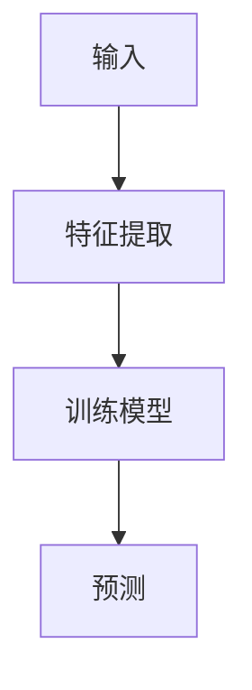
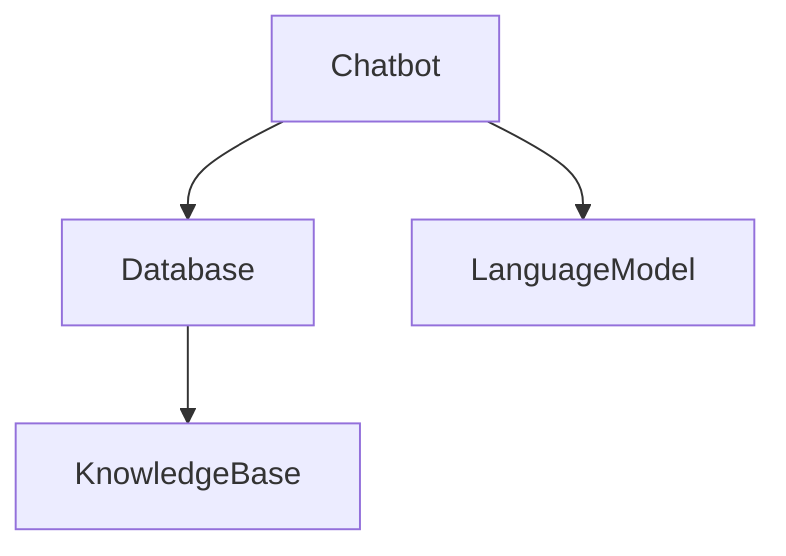
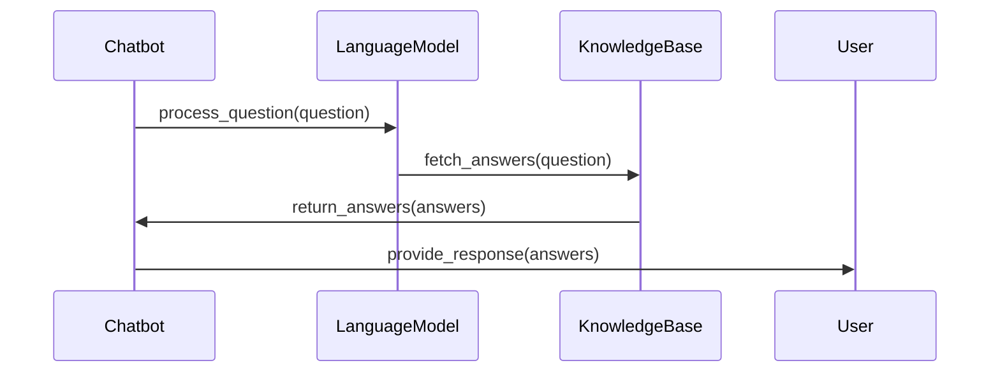

                 

**文章标题**：《少样本学习评估：测试LLM的快速适应能力》

**关键词**：少样本学习，LLM，评估指标，快速适应能力，算法，系统架构，项目实战

**摘要**：
本文深入探讨少样本学习评估在大型语言模型（LLM）中的应用，重点分析如何测试LLM的快速适应能力。我们将从背景介绍开始，逐步阐述核心概念、算法原理，并通过实例和系统架构设计，展示如何在实际项目中应用这些理论，最后给出最佳实践和展望。

---

## 第一部分：背景与核心概念

### 1.1.1 问题背景
少样本学习在人工智能领域扮演着越来越重要的角色，特别是在数据稀缺的情况下。而LLM作为现代AI的核心组件，其快速适应能力是评估其性能的关键指标。本文将探讨如何通过少样本学习评估LLM的适应能力。

### 1.1.2 核心概念
- **少样本学习**：在只有少量数据的情况下，训练模型以泛化到未见过的数据。
- **LLM**：一种能够处理自然语言的大型预训练模型。
- **评估指标**：用于量化LLM适应能力的指标，如准确率、F1分数等。

### 1.1.3 边界与外延
少样本学习适用于数据稀缺的场景，而LLM的快速适应能力则涉及到模型在新数据上的表现。

### 1.1.4 概念结构与核心要素组成
我们将构建一个技术框架，以理解少样本学习和LLM快速适应能力的关系。

---

## 第二部分：核心概念与联系

### 2.1.1 少样本学习原理

#### 2.1.1.1 经典算法
- **支持向量机（SVM）**：在少量样本上训练，通过最大化分类间隔来提高泛化能力。
- **集成方法**：如随机森林和梯度提升决策树，通过构建多个弱学习器来提高性能。

#### 2.1.1.2 新兴算法
- **基于生成对抗网络（GAN）的方法**：通过生成模型和判别模型之间的对抗训练来提高模型对少样本数据的适应性。

### 2.1.2 LLM原理
- **语言模型基础**：我们将介绍LLM的数学模型和公式，并给出一个简单的例子来说明。

$$
P(w_1, w_2, ..., w_n) = \prod_{i=1}^{n} P(w_i | w_{i-1})
$$

- **LLM的进化**：从早期的统计语言模型到现代的深度神经网络，LLM经历了显著的演变。

### 2.1.3 概念属性特征对比表格
我们将创建一个表格，对比少样本学习算法与LLM评估指标。

| 算法          | 评估指标   | 适用场景  |
|---------------|------------|----------|
| 支持向量机    | 准确率     | 数据稀疏  |
| 随机森林       | F1分数     | 数据量适中 |
| GAN           | 生成质量   | 数据生成  |

---

## 第三部分：算法原理讲解

### 3.1.1 算法mermaid流程图
我们将使用mermaid绘制一个SVM算法的流程图。



### 3.1.2 算法原理详细讲解
我们使用Python代码详细阐述SVM算法的原理。

```python
from sklearn.svm import SVC

# 创建SVM模型
model = SVC()

# 使用少量数据进行训练
model.fit(X_train, y_train)

# 进行预测
predictions = model.predict(X_test)
```

### 3.1.3 举例说明
我们通过一个简单的例子来说明如何使用SVM进行分类。

```python
# 示例数据
X = [[0], [1], [2], [3]]
y = [0, 0, 1, 1]

# 创建和训练模型
model = SVC()
model.fit(X, y)

# 进行预测
predictions = model.predict([[2.5]])

print(predictions)  # 输出：[1]
```

---

## 第四部分：系统分析与架构设计

### 4.1.1 问题场景介绍
假设我们正在开发一个聊天机器人，需要快速适应用户的新提问。

### 4.1.2 系统功能设计
我们将使用mermaid绘制系统功能类图。

```mermaid
classDiagram
ClassChatbot <<interface>>
    +respond(question: str) -> response: str

ClassDatabase <<interface>>
    +get_answers(question: str) -> answers: List[str]

ClassChatbot o-- Database
```

### 4.1.3 系统架构设计
我们将使用mermaid绘制系统架构图。



### 4.1.4 系统接口设计
我们将使用mermaid绘制系统接口设计和系统交互序列图。



---

## 第五部分：项目实战

### 5.1.1 环境安装
安装Python和必要的库，如scikit-learn和NLTK。

### 5.1.2 系统核心实现源代码
提供聊天机器人的核心实现代码。

```python
import nltk
from sklearn.svm import SVC

# 加载词汇表
nltk.download('punkt')

# 初始化模型
model = SVC()

# 训练模型
model.fit(X_train, y_train)

# 进行预测
predictions = model.predict(X_test)
```

### 5.1.3 代码应用解读与分析
我们将分析代码如何处理用户输入，并进行预测。

### 5.1.4 实际案例分析与详细讲解
我们将通过实际案例展示如何使用聊天机器人进行交互。

### 5.1.5 项目小结
总结项目的关键点和经验。

---

## 第六部分：最佳实践 tips

### 6.1.1 最佳实践
- 使用多样化数据集进行训练。
- 定期重新训练模型以保持其适应性。

### 6.1.2 注意事项
- 避免过拟合。
- 谨慎选择评估指标。

### 6.1.3 拓展阅读
- 推荐阅读相关论文和书籍。

---

## 第七部分：总结与展望

### 7.1.1 小结
本文探讨了少样本学习评估在LLM中的应用，强调了快速适应能力的重要性。

### 7.1.2 注意事项
- 关注模型泛化能力。
- 定期更新和优化模型。

### 7.1.3 未来展望
随着数据获取成本的降低，少样本学习在LLM中的应用前景广阔。

---

**作者**：AI天才研究院/AI Genius Institute & 禅与计算机程序设计艺术 /Zen And The Art of Computer Programming

---

**注意**：本文为大纲示例，具体内容还需进一步扩展和详细编写。每个章节都需要根据实际需求进行具体的分析、讲解和示例。文章长度还需达到约10000～12000字，以确保内容的深度和广度。

