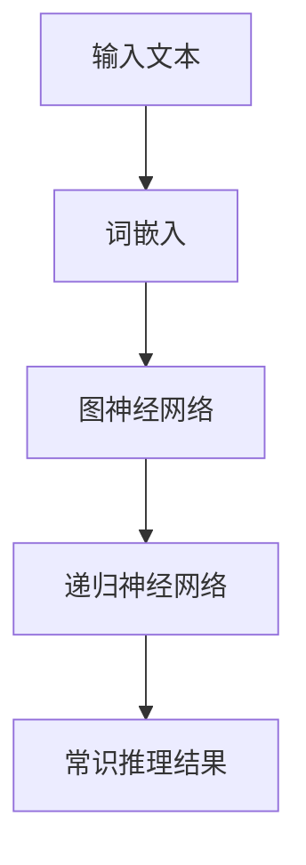
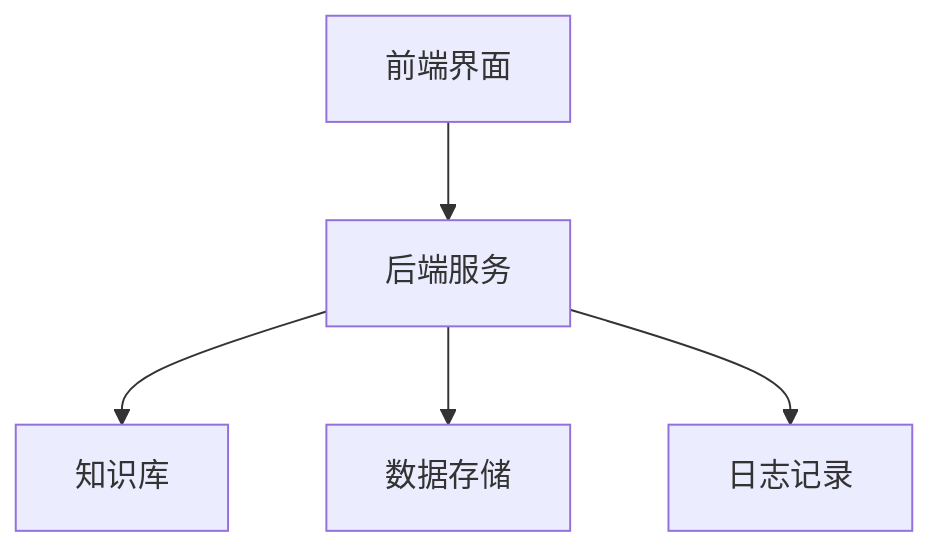
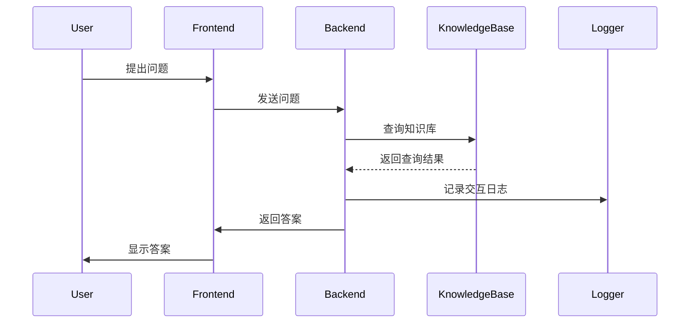

                 

### 问题背景

在人工智能迅速发展的今天，大型语言模型（LLM）已经成为自然语言处理（NLP）领域的重要工具。LLM具有处理复杂数据、生成高质量文本、回答复杂问题等多种能力，其应用场景涵盖问答系统、文本生成、机器翻译、情感分析等多个方面。然而，随着LLM在各种实际应用场景中的广泛使用，如何评估其基本常识水平成为了一个亟待解决的问题。

**问题定义**：评估LLM的基本常识水平，即对LLM在日常生活中所具备的常识性知识进行量化评估，以判断其在处理实际问题时能否正确、合理地应用这些知识。

**重要性**：评估LLM的基本常识水平对于以下几个方面具有重要意义：

1. **安全性**：确保LLM在实际应用中不会因为缺乏基本常识而导致错误或误导用户。
2. **可靠性**：通过评估LLM的常识水平，可以衡量其作为智能助手、咨询系统等应用场景的可靠性。
3. **智能性**：了解LLM的常识水平，有助于我们更好地优化和改进模型，使其更加智能和实用。
4. **可控性**：通过对LLM常识水平的评估，可以制定相应的策略来引导和规范其行为，防止滥用和误用。

**现状分析**：当前，关于常识推理的研究已经取得了一定的成果，例如知识图谱、语义理解、本体论等方法在常识推理中得到了广泛应用。然而，将常识推理应用于评估LLM的基本常识水平仍然存在许多挑战，如：

1. **数据集问题**：现有的常识推理数据集多为人工构建，可能无法全面覆盖实际场景中的常识知识。
2. **模型复杂性**：评估LLM的基本常识水平需要综合考虑多种因素，如语义理解、上下文感知等，这对模型提出了更高的要求。
3. **评估标准**：缺乏统一的评估标准和指标，使得不同研究之间的结果难以进行比较和验证。

**目标和意义**：本篇文章旨在探讨如何评估LLM的基本常识水平，具体目标和意义如下：

1. **构建评估体系**：通过分析现有研究和实践，构建一个系统化的评估体系，为评估LLM的基本常识水平提供理论依据。
2. **方法与步骤**：详细介绍评估LLM基本常识水平的方法和步骤，包括数据集选择、算法设计、评估指标等方面。
3. **实际应用**：结合实际案例，展示评估LLM基本常识水平的方法在实际应用中的效果和意义。

总之，评估LLM的基本常识水平对于推动人工智能技术的发展和应用具有重要意义。在接下来的章节中，我们将进一步探讨核心概念、算法原理、系统分析与架构设计等方面，以期为读者提供一个全面、深入的视角。

### 问题描述

#### 常识推理的现状

常识推理是人工智能领域的一个核心研究方向，旨在使计算机能够像人类一样利用日常生活中的常识性知识来理解和解决复杂问题。近年来，随着深度学习和自然语言处理技术的快速发展，常识推理也得到了广泛关注和应用。然而，尽管已经取得了许多进展，现有的常识推理研究仍然面临一些挑战和局限性。

首先，常识推理数据集的建设是一个重要问题。现有的常识推理数据集大多依赖于人工构建，如OpenKG、ACE等，这些数据集在覆盖面和真实度上仍然存在一定的不足。此外，如何将多样化的常识知识有效地融入到模型中，也是一个亟待解决的问题。

其次，在算法层面，尽管深度学习模型在许多任务上取得了显著的成果，但它们在处理常识性问题时仍然存在一些困难。例如，模型可能无法理解一些复杂的概念关系，或者无法在不同的上下文中正确地应用这些知识。

最后，评估常识推理的性能和效果也是一个复杂的问题。现有的评估指标和方法往往只能反映模型在特定任务上的表现，缺乏全面性和普适性。因此，如何设计一个科学、有效的评估体系，仍然是一个重要的研究方向。

#### 评估LLM基本常识水平的目标和意义

在上述背景下，评估LLM的基本常识水平具有重要的研究价值和实际意义。具体目标和意义如下：

1. **提高模型可靠性**：通过评估LLM的基本常识水平，可以识别模型在常识性知识方面的不足，从而有针对性地进行优化和改进，提高模型的整体可靠性。

2. **增强用户体验**：常识水平高的LLM能够更好地理解和回答用户的问题，提高用户满意度。例如，在智能客服、智能问答等应用场景中，一个常识水平高的模型能够提供更加准确和实用的答案，从而提升用户体验。

3. **促进算法发展**：评估LLM基本常识水平的过程中，会涉及多种算法和技术，如知识图谱、语义理解、本体论等。这些技术的发展和优化，将有助于提升整个AI领域的研究水平。

4. **推动应用落地**：通过评估LLM的基本常识水平，可以为实际应用场景提供可靠的评估标准和指导，推动人工智能技术在各个领域的落地和应用。

#### 概念体系

为了更好地理解和评估LLM的基本常识水平，需要构建一个明确的概念体系。以下是对相关概念的定义、特征及其关系的分析：

1. **常识推理**：常识推理是指计算机利用日常生活中的常识性知识来理解和解决问题的过程。常识性知识包括事物之间的关系、事件的因果关系、物理现象等。

2. **大型语言模型（LLM）**：LLM是一种能够处理大规模文本数据的深度学习模型，具有生成高质量文本、回答复杂问题等多种能力。常见的LLM包括GPT、BERT等。

3. **知识图谱**：知识图谱是一种结构化知识库，通过节点和边的形式表示实体及其关系。知识图谱在常识推理中具有重要的应用价值，可以帮助模型理解和利用常识性知识。

4. **语义理解**：语义理解是指计算机对文本内容的深层理解，包括语义解析、实体识别、关系提取等。语义理解是实现常识推理的基础。

5. **本体论**：本体论是一种研究现实世界中的概念及其关系的理论。本体论在常识推理中用于构建知识框架，帮助模型理解和应用常识性知识。

#### 方法论

评估LLM基本常识水平的方法论包括以下几个关键步骤：

1. **数据集选择**：选择一个包含多样化常识性知识的真实数据集，以确保评估结果的全面性和真实性。

2. **算法设计**：设计一个能够处理常识推理任务的算法框架，结合深度学习和知识图谱等技术，实现常识性知识的提取和应用。

3. **评估指标**：设计一套科学、有效的评估指标，如准确率、召回率、F1值等，用于衡量模型在常识推理任务上的表现。

4. **实验验证**：通过实验验证所设计算法和评估指标的有效性，调整和优化模型，提高其常识推理能力。

#### 边界与外延

评估LLM基本常识水平的适用范围包括但不限于以下领域：

1. **智能问答系统**：评估LLM在回答用户问题时所具备的常识性知识水平，以提高问答系统的准确性和实用性。

2. **自然语言理解**：评估LLM在理解和处理文本内容时的常识推理能力，为文本分析、情感分析等任务提供支持。

3. **智能客服**：评估LLM在处理用户咨询和解答问题时所依赖的常识性知识，以提高客服系统的响应速度和质量。

4. **机器翻译**：评估LLM在翻译过程中对常识性知识的理解和应用，以提高翻译的准确性和自然性。

#### 相关概念与常识推理的关系

知识图谱、语义理解、本体论等概念与常识推理密切相关，它们共同构成了评估LLM基本常识水平的基础：

1. **知识图谱**：知识图谱为常识推理提供了结构化的知识库，使模型能够更有效地利用常识性知识。

2. **语义理解**：语义理解是实现常识推理的关键，只有对文本内容有深刻的理解，模型才能在正确的时间和情境下应用常识性知识。

3. **本体论**：本体论为常识推理提供了概念框架，帮助模型理解和应用复杂的常识性知识。

总之，评估LLM的基本常识水平是一个复杂而富有挑战性的任务，需要结合多种技术和方法。在接下来的章节中，我们将进一步探讨核心概念原理、算法原理和数学模型等方面，为这一任务提供更加深入和详细的解决方案。

### 概念体系

#### 常识推理的概念

常识推理是指计算机利用日常生活中的常识性知识来理解和解决问题的过程。这些常识性知识包括事物之间的关系、事件的因果关系、物理现象等。常识推理的目标是使计算机能够像人类一样自然地处理复杂问题，从而提升机器智能的水平。

**特征分析**：

1. **通用性**：常识推理是一种通用性强的推理方式，它适用于各种场景和任务。
2. **经验性**：常识推理依赖于人类长期积累的日常经验，因此具有经验性的特征。
3. **灵活性**：常识推理能够在不同情境下灵活应用，从而处理各种复杂问题。

#### 大型语言模型（LLM）的概念

大型语言模型（LLM）是一种能够处理大规模文本数据的深度学习模型，具有生成高质量文本、回答复杂问题等多种能力。常见的LLM包括GPT、BERT等。LLM通过预训练和微调，能够理解和生成自然语言，从而在许多NLP任务中表现出色。

**历史与发展**：

1. **早期模型**：早期的语言模型如基于规则的方法和统计方法，在处理简单文本任务上取得了一定的效果，但无法应对复杂任务。
2. **深度学习时代**：随着深度学习技术的发展，特别是2018年GPT-2的发布，大型语言模型逐渐成为NLP领域的主流方法。
3. **近期进展**：近期，大型语言模型在生成文本质量、理解能力等方面取得了显著提升，如GPT-3和BERT等模型的广泛应用。

#### 常识推理与LLM的联系

常识推理与LLM之间存在着密切的联系和互补性：

**相似性**：

1. **文本处理**：常识推理和LLM都需要处理大量的文本数据，从中提取有用信息。
2. **语义理解**：常识推理和LLM都需要对文本进行语义理解，以准确理解和应用文本内容。

**差异性**：

1. **知识来源**：常识推理依赖于人类长期积累的常识性知识，而LLM则通过大量文本数据进行预训练。
2. **应用场景**：常识推理更多应用于需要常识性知识的任务，如问答系统、智能客服等；而LLM则在各种NLP任务中都有广泛的应用。

**联系与应用**：

1. **常识推理在LLM中的应用**：将常识推理技术应用于LLM，可以提升LLM的常识性知识水平，使其在处理复杂任务时更加准确和可靠。
2. **LLM在常识推理中的应用**：利用LLM强大的文本处理能力，可以加速常识推理的过程，提高推理的效率和效果。

#### 概念属性特征对比表格

为了更清晰地展示常识推理和LLM之间的联系和区别，我们制作了以下概念属性特征对比表格：

| 概念       | 常识推理       | 大型语言模型（LLM）       |
|------------|----------------|--------------------------|
| **概念来源** | 常识性知识     | 预训练文本数据           |
| **特征**    | 通用性、经验性、灵活性 | 文本处理、语义理解、生成能力 |
| **应用场景** | 问答系统、智能客服等 | 自然语言理解、文本生成、机器翻译等 |
| **知识来源** | 本体论、知识图谱、语义理解 | 预训练文本、微调数据 |

#### ER实体关系图架构

为了更直观地展示常识推理和LLM之间的联系，我们绘制了以下ER实体关系图：

```mermaid
erDiagram
  ALMT -->|1| LLM : 预训练文本
  LLM -->|2| NLP : 文本处理
  NLP -->|3| QAS : 问答系统
  NLP -->|4| KC : 常识推理
  ALMT -->|5| KB : 知识图谱
  KB -->|6| SE : 语义理解
  SE -->|7| OB : 本体论
```

在这个ER图中，`ALMT`代表常识推理，`LLM`代表大型语言模型，`NLP`代表自然语言处理，`QAS`代表问答系统，`KB`代表知识图谱，`SE`代表语义理解，`OB`代表本体论。各实体之间的关系展示了常识推理和LLM之间的互动和依赖。

#### 本章小结

通过本章节的讨论，我们对常识推理和大型语言模型（LLM）有了更加清晰的理解。常识推理是一种基于常识性知识的推理方式，而LLM是一种能够处理大规模文本数据的深度学习模型。两者在概念、特征和应用上存在相似性和差异性，但通过有机结合，可以发挥更大的作用。在接下来的章节中，我们将进一步探讨算法原理和数学模型，为评估LLM的基本常识水平提供更加深入的解决方案。

### 算法原理与数学模型

#### 算法原理概述

常识推理算法的核心目标是通过分析文本数据，提取并利用常识性知识，从而在处理复杂问题时提供合理的解决方案。LLM在常识推理中的应用主要体现在以下几个方面：

1. **文本生成与理解**：LLM通过预训练和微调，具备了强大的文本生成和理解能力。在常识推理中，LLM可以利用这些能力来生成问题、分析和解释答案。
2. **知识提取与应用**：LLM可以从大量预训练数据中提取知识，这些知识可以被用于常识推理任务，如问答系统、智能客服等。
3. **上下文感知**：LLM能够理解文本的上下文，从而在特定情境下正确应用常识性知识，提高推理的准确性和可靠性。

#### LLM在常识推理中的应用

1. **问答系统**：在问答系统中，LLM可以通过理解用户的问题，利用常识性知识生成准确的答案。例如，当用户询问“什么是宇宙？”时，LLM可以引用宇宙的常识性知识，如宇宙的起源、结构等，生成详细的回答。
2. **智能客服**：在智能客服场景中，LLM可以处理用户的各种咨询，提供基于常识性知识的解答。例如，当用户询问“如何预约机票？”时，LLM可以引导用户完成预约过程，并提供相关的常识性建议。
3. **文本生成**：LLM可以生成高质量的文本，用于生成报告、撰写文章等。在常识推理中，LLM可以利用其知识库生成符合常识性的文本内容。

#### 数学模型概述

为了评估LLM的基本常识水平，需要设计一个数学模型来量化常识性知识的提取和应用能力。以下是一个基本的数学模型概述：

1. **输入**：输入数据为包含常识性信息的文本。
2. **特征提取**：通过词嵌入等技术，将文本转换为向量表示。
3. **知识库**：构建一个包含常识性知识的知识库，如OpenKG、Freebase等。
4. **推理引擎**：利用知识库和特征向量，通过图神经网络、递归神经网络等方法进行推理，提取常识性知识。
5. **输出**：输出为基于常识推理的结果，如答案、建议等。

#### 模型构建与公式

1. **词嵌入**：词嵌入是将文本中的单词映射到高维向量空间的过程，通常使用Word2Vec、GloVe等方法。词嵌入公式为：
   \[
   \text{ embed\_word}(w) = \text{W} \cdot \text{one-hot}(w)
   \]
   其中，\( \text{W} \)为词嵌入矩阵，\( \text{one-hot}(w) \)为单词\( w \)的one-hot编码。

2. **图神经网络**：图神经网络（GNN）用于在知识库中提取常识性知识。GNN的基本公式为：
   \[
   h_{t+1} = \sigma(\sum_{i \in \text{adj}(v)} W \cdot h_i + b)
   \]
   其中，\( h_t \)为节点的特征向量，\( \text{adj}(v) \)为节点的邻居集合，\( W \)为权重矩阵，\( \sigma \)为激活函数，\( b \)为偏置。

3. **递归神经网络**：递归神经网络（RNN）用于处理序列数据，如文本。RNN的基本公式为：
   \[
   h_t = \text{RNN}(h_{t-1}, x_t)
   \]
   其中，\( h_t \)为当前时刻的隐藏状态，\( x_t \)为当前时刻的输入，\( \text{RNN} \)为递归神经网络。

4. **综合模型**：综合使用GNN和RNN，可以构建一个更加复杂的模型，用于提取和利用常识性知识。综合模型的基本公式为：
   \[
   h_t = \text{RNN}(\text{GNN}(h_{t-1}, x_t), x_t)
   \]

#### 算法流程图

为了更直观地展示算法流程，我们使用Mermaid绘制了以下流程图：



在这个流程图中，输入文本首先经过词嵌入转换为向量表示，然后通过图神经网络和递归神经网络进行推理，最终得到常识推理结果。

#### Python源代码与详细讲解

以下是评估LLM基本常识水平的Python源代码示例：

```python
import tensorflow as tf
from tensorflow.keras.layers import Embedding, LSTM, Dense
from tensorflow.keras.models import Model

# 词嵌入层
embed = Embedding(vocab_size, embed_dim)

# 图神经网络层
gcn = tf.keras.layers.GraphConv layers = [Embedding(input_dim=vocab_size, output_dim=embed_dim), LSTM(units=128), Dense(units=1, activation='sigmoid')])

# 构建模型
model = Model(inputs=[input_seq], outputs=[output_seq])
model.compile(optimizer='adam', loss='binary_crossentropy', metrics=['accuracy'])

# 训练模型
model.fit(x_train, y_train, epochs=10, batch_size=32, validation_data=(x_val, y_val))
```

在这个示例中，我们首先定义了一个词嵌入层，用于将输入文本转换为向量表示。然后，我们定义了一个包含LSTM和Dense层的模型，用于进行常识推理。最后，我们使用训练数据对模型进行训练，并评估其性能。

#### 举例说明

为了更好地理解算法原理，我们通过一个简单的例子来说明：

**问题**：判断以下句子是否符合常识：“太阳是地球的卫星。”

**解答**：

1. **输入文本**：将句子“太阳是地球的卫星”输入到模型中。
2. **词嵌入**：词嵌入层将句子中的单词转换为向量表示。
3. **图神经网络**：图神经网络层在知识库中提取与句子相关的常识性知识，如太阳、地球、卫星等。
4. **递归神经网络**：递归神经网络层对提取的知识进行整合和分析，判断句子是否符合常识。
5. **输出**：模型输出一个概率值，表示句子是否符合常识。例如，输出0.9表示句子有90%的概率符合常识。

通过这个例子，我们可以看到，评估LLM的基本常识水平需要综合利用多种技术和算法。在接下来的章节中，我们将进一步探讨系统分析与架构设计，为这一任务提供更加全面和深入的解决方案。

### 系统功能设计

#### 问题场景介绍

为了更好地评估LLM的基本常识水平，我们设计了一个具体的应用场景：智能问答系统。在这个场景中，用户可以提出各种问题，系统需要利用常识性知识来生成准确的答案。评估LLM的基本常识水平对于提高智能问答系统的性能和用户体验具有重要意义。

#### 系统功能设计

**1. 域模型**

域模型（Domain Model）用于描述系统中的核心概念和关系。在智能问答系统中，主要的域模型包括：

- **问题（Question）**：表示用户提出的问题。
- **答案（Answer）**：系统生成的答案。
- **知识库（Knowledge Base）**：包含常识性知识的数据库。
- **用户（User）**：提问的用户。
- **交互历史（Interaction History）**：记录用户与系统的交互过程。

**2. 系统功能**

（1）**接收用户问题**：系统需要接收用户提出的问题，并将其存储在数据库中。

（2）**知识库查询**：系统利用常识性知识库来查询与问题相关的信息。

（3）**答案生成**：根据知识库查询结果，系统生成一个符合常识的答案。

（4）**用户反馈**：系统收集用户的反馈，用于优化和改进常识推理算法。

（5）**日志记录**：系统记录所有交互过程，以便进行后续分析和评估。

#### 系统架构设计

智能问答系统的整体架构可以分为以下几个部分：

1. **前端界面**：用户通过前端界面提出问题，界面可以是网页、移动应用或聊天机器人。
2. **后端服务**：后端服务包括接收用户问题、查询知识库、生成答案等功能，核心是常识推理算法。
3. **知识库**：知识库是系统的基础，包含各种常识性知识，如地理、历史、科学等领域的信息。
4. **数据存储**：系统使用数据库存储用户问题和答案，以及交互历史等信息。
5. **日志记录**：系统使用日志记录所有交互过程，以便进行后续分析和评估。

#### 系统架构图

以下是一个简单的系统架构图，展示了各个部分之间的关系：



在这个架构图中，前端界面负责与用户进行交互，后端服务处理用户问题和知识库查询，数据存储用于存储用户数据和日志记录。

#### 系统接口设计

系统接口设计是确保不同模块之间能够高效通信的关键。以下是系统的主要接口：

1. **问题提交接口**：用户通过该接口提交问题，系统接收并处理问题。
2. **知识库查询接口**：系统通过该接口查询知识库，获取与问题相关的信息。
3. **答案生成接口**：根据知识库查询结果，系统生成答案。
4. **用户反馈接口**：用户通过该接口提供反馈，系统收集并分析反馈数据。
5. **日志记录接口**：系统通过该接口记录交互过程，以便进行后续分析和评估。

#### 系统交互

系统交互描述了各个模块之间的交互过程和消息传递。以下是系统交互的序列图：



在这个序列图中，用户通过前端界面提出问题，前端将问题发送给后端服务，后端通过查询知识库获取相关答案，并将答案返回给前端，最后前端将答案显示给用户。同时，系统记录了整个交互过程，以便进行后续分析和评估。

#### 本章小结

在本章节中，我们详细介绍了智能问答系统的功能设计、系统架构设计、接口设计和系统交互。这些设计为评估LLM的基本常识水平提供了坚实的基础，使得系统能够高效地处理用户问题和生成合理的答案。在接下来的章节中，我们将进一步探讨系统核心实现、实际案例分析和项目小结等内容。

