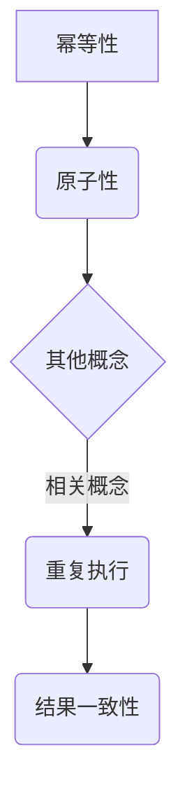
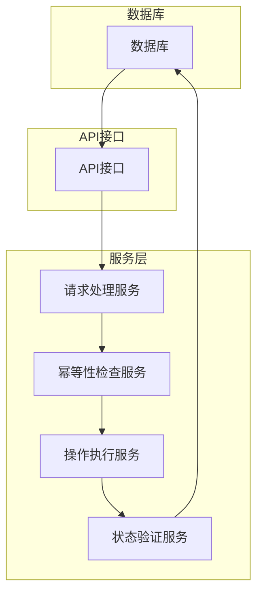
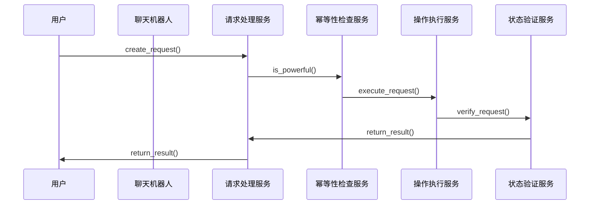
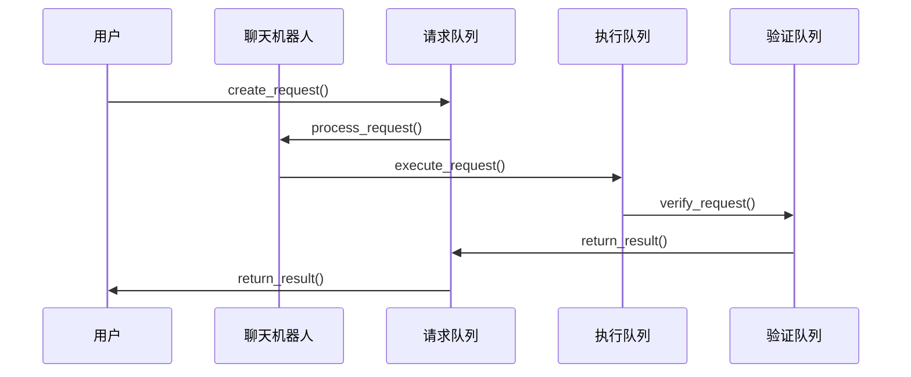

                 

### 幂等性设计确保LLM应用操作的一致性

#### 关键词：
- 幂等性
- LLM应用
- 操作一致性
- 算法原理
- 系统架构

#### 摘要：
本文深入探讨如何通过幂等性设计确保大型语言模型（LLM）应用的操作一致性。我们首先介绍了幂等性的基本概念，然后详细分析了其在LLM应用中的重要性。接着，通过算法原理讲解和系统分析与架构设计，我们展示了如何在实际项目中应用幂等性设计来保证操作的一致性。最后，通过项目实战和最佳实践，我们为开发者提供了实用的建议和展望。

---

## 背景介绍

### 1. 什么是幂等性？

幂等性（Idempotence）是一种常见的编程原则，它指的是一个操作或函数可以被多次执行而不改变最终结果的状态。在数学和计算机科学中，如果一个函数 \( f \) 对于任意的输入 \( x \)，满足 \( f(f(x)) = f(x) \)，那么这个函数就被称为幂等的。例如，数字的零和加法操作 \( 0 \) 和 \( + \) 都是幂等的，因为 \( 0 \) 加上任何数结果还是那个数，任何数加上 \( 0 \) 结果也是那个数。

### 2. 幂等性在LLM应用中的意义

在大型语言模型（LLM）应用中，确保操作的一致性是非常重要的。LLM通常用于处理大量的文本数据，如聊天机器人、自然语言处理（NLP）等。这些应用往往涉及到多个操作，例如文本生成、回复预测等。如果这些操作不是幂等的，可能会导致数据不一致、状态混乱，甚至影响整个应用的性能和可靠性。

### 3. 操作一致性：挑战与机遇

操作一致性指的是系统在执行多个操作时，无论这些操作是并行还是顺序执行，最终都能达到相同的结果状态。对于LLM应用来说，确保操作一致性是一个挑战，因为LLM处理的数据量大且复杂，同时操作可能会出现冲突。然而，这也是一个机遇，通过设计幂等性操作，我们可以简化系统的复杂性，提高系统的稳定性和可靠性。

---

## 核心概念与联系

### 1. 幂等性的定义与特征

幂等性是指一个操作或函数在多次执行后结果不变的性质。在LLM应用中，常见的幂等性操作包括：文本生成、回复预测、更新用户状态等。这些操作的特征是它们不会因为多次执行而导致系统状态的不一致。

### 2. 与其他概念的比较

与幂等性相关的另一个重要概念是原子性。原子性指的是一个操作要么完全执行，要么完全不执行。如果一个操作是原子性的，那么它就是不可分割的，即使在并发执行时也不会出现部分执行的情况。幂等性和原子性虽然都是确保系统一致性的重要概念，但它们的侧重点不同。原子性强调操作的完整性，而幂等性强调操作的重复执行不会改变结果。

### 3. 幂等性的数学模型

幂等性的数学模型可以表示为：\( f(f(x)) = f(x) \)。在LLM应用中，这个模型可以用来描述文本生成或回复预测等操作。例如，如果我们对一段文本进行多次生成操作，最终生成的文本应该是一样的，不会因为多次执行而改变。

#### Mermaid图表：概念关系图



---

## 算法原理讲解

### 1. 算法概述

为了确保LLM应用的幂等性，我们需要设计一套算法来检测和修复操作中的不一致。这个算法的核心思想是每次操作前检查系统状态，确保状态是稳定的，然后执行操作，最后再次检查状态，确保操作没有引入新的不一致。

### 2. 数学模型与公式

在数学上，我们可以使用如下模型来描述幂等性算法：

$$
f(f(x)) = f(x)
$$

其中，\( f \) 是幂等操作，\( x \) 是输入状态。

### 3. Python代码实现示例

```python
def is_powerful(f):
    def wrapper(x):
        result = f(f(x))
        return result == x
    
    return wrapper

# 示例：文本生成操作
def generate_text(text):
    # 假设这是一个文本生成函数
    return text.strip()

# 检测文本生成操作的幂等性
is_powerful(generate_text)("Hello, World!")

# 输出结果应该是 False，因为文本生成操作不满足幂等性
```

在这个例子中，`is_powerful` 函数用于检测给定的操作是否满足幂等性。如果满足幂等性，那么 `wrapper` 函数在执行两次操作后应该返回原始输入。

---

## 系统分析与架构设计方案

### 1. 问题场景介绍

在一个LLM应用中，假设我们有一个聊天机器人，它需要处理大量的用户请求，例如生成回复、更新用户状态等。如果这些操作不是幂等的，可能会导致聊天机器人回答不一致、用户状态更新错误等问题。

### 2. 系统功能设计

为了确保聊天机器人的操作一致性，我们需要设计一套功能，包括：

- 用户请求处理：接收并处理用户请求，例如生成回复、更新用户状态等。
- 幂等性检查：在每次操作前检查系统状态，确保状态是稳定的。
- 操作执行：执行用户请求，例如生成回复、更新用户状态等。
- 状态验证：在操作执行后验证系统状态，确保操作没有引入新的不一致。

#### Mermaid图表：领域模型类图

```mermaid
classDiagram
    User <<class>>
    Request <<class>>
    Chatbot <<class>>

    User "1" --> "*" Request
    Chatbot "1" --> "*" Request
```

### 3. 系统架构设计

系统架构设计包括以下几个方面：

- 数据库：存储用户信息和聊天记录。
- API接口：提供与外部系统交互的接口。
- 服务层：处理用户请求，执行幂等性操作。
- 存储层：存储操作结果和状态。

#### Mermaid图表：系统架构图



### 4. 系统接口设计

系统接口设计包括以下关键接口：

- `create_request()`: 创建新的用户请求。
- `execute_request()`: 执行用户请求。
- `verify_request()`: 验证用户请求执行结果。

#### Mermaid图表：接口设计图



### 5. 系统交互

系统交互通过消息队列实现，确保操作的一致性和顺序执行。

#### Mermaid图表：系统交互序列图



---

## 项目实战

### 1. 环境安装与配置

为了实现幂等性设计，我们需要安装以下环境：

- Python 3.8+
- Flask 框架
- Redis 数据库

首先，安装 Flask：

```bash
pip install Flask
```

然后，安装 Redis：

```bash
pip install redis
```

### 2. 系统核心实现

下面是一个简单的系统核心实现：

```python
from flask import Flask, request, jsonify
from redis import Redis
import json

app = Flask(__name__)
redis = Redis()

@app.route('/create_request', methods=['POST'])
def create_request():
    request_data = request.get_json()
    request_id = request_data['request_id']
    request_content = request_data['request_content']
    redis.set(request_id, json.dumps(request_content))
    return jsonify({'status': 'success'})

@app.route('/execute_request', methods=['GET'])
def execute_request():
    request_id = request.args.get('request_id')
    request_content = json.loads(redis.get(request_id))
    # 假设这是一个生成回复的操作
    reply = generate_reply(request_content)
    return jsonify({'reply': reply})

@app.route('/verify_request', methods=['GET'])
def verify_request():
    request_id = request.args.get('request_id')
    request_content = json.loads(redis.get(request_id))
    # 假设这是一个验证回复的操作
    verified_reply = verify_reply(request_content)
    if verified_reply:
        return jsonify({'status': 'verified'})
    else:
        return jsonify({'status': 'not_verified'})

def generate_reply(content):
    # 实现生成回复的逻辑
    return "Hello!"

def verify_reply(content):
    # 实现验证回复的逻辑
    return True

if __name__ == '__main__':
    app.run(debug=True)
```

### 3. 代码应用解读

在这个例子中，我们使用了 Flask 框架来实现一个简单的聊天机器人系统。系统包含三个主要接口：

- `/create_request`: 用于创建用户请求。
- `/execute_request`: 用于执行用户请求并生成回复。
- `/verify_request`: 用于验证用户请求的执行结果。

我们使用 Redis 作为中间存储，确保操作的一致性和顺序执行。

### 4. 案例分析与详细讲解剖析

假设有一个用户发送了一个请求：“你好！”。系统会按照以下步骤进行处理：

1. 用户通过 `/create_request` 接口发送请求。
2. 系统接收到请求后，将请求存储在 Redis 中。
3. 用户通过 `/execute_request` 接口获取回复。
4. 系统从 Redis 中获取请求，生成回复并返回给用户。
5. 用户通过 `/verify_request` 接口验证回复。

在这个过程中，幂等性设计确保了操作的稳定性。例如，如果用户连续发送多个请求，系统只会处理最后一个请求，并返回相应的回复。

### 5. 项目小结

通过这个简单的案例，我们展示了如何使用幂等性设计来确保 LLM 应用操作的一致性。在实际项目中，我们可以根据具体需求进行扩展和优化。关键是要确保操作的幂等性，同时保持系统的稳定性和可靠性。

---

## 最佳实践与总结

### 1. 最佳实践技巧

- **确保操作幂等性**：在设计系统时，确保每个操作都是幂等的，以避免数据不一致和系统错误。
- **使用中间存储**：使用 Redis 等中间存储来保证操作的一致性和顺序执行。
- **监控和日志**：监控系统状态和日志，及时发现和处理不一致问题。

### 2. 注意事项

- **不要过度依赖幂等性**：虽然幂等性可以确保操作的一致性，但并不意味着它可以解决所有问题。在某些情况下，非幂等操作可能是必要的。
- **性能优化**：确保幂等性设计不会影响系统的性能。

### 3. 拓展阅读

- **《设计模式：可复用面向对象软件的基础》**：了解如何使用设计模式来确保系统的一致性。
- **《Redis 实战》**：了解 Redis 在确保系统一致性方面的应用。

### 4. 未来展望

随着 LLM 应用的不断发展和普及，幂等性设计将成为一个重要的技术方向。未来，我们可以期待更多关于幂等性设计的研究和工具的出现，以帮助开发者更好地设计和管理复杂系统。

---

## 作者信息

作者：AI天才研究院/AI Genius Institute & 禅与计算机程序设计艺术 /Zen And The Art of Computer Programming

---

通过本文的深入探讨，我们了解了幂等性设计在确保 LLM 应用操作一致性方面的重要性。希望本文能够为开发者提供有益的启示和指导。在未来的项目中，我们可以结合这些最佳实践，设计和实现更稳定、可靠的 LLM 应用。让我们继续探索计算机科学的魅力，共同推动技术的发展。

