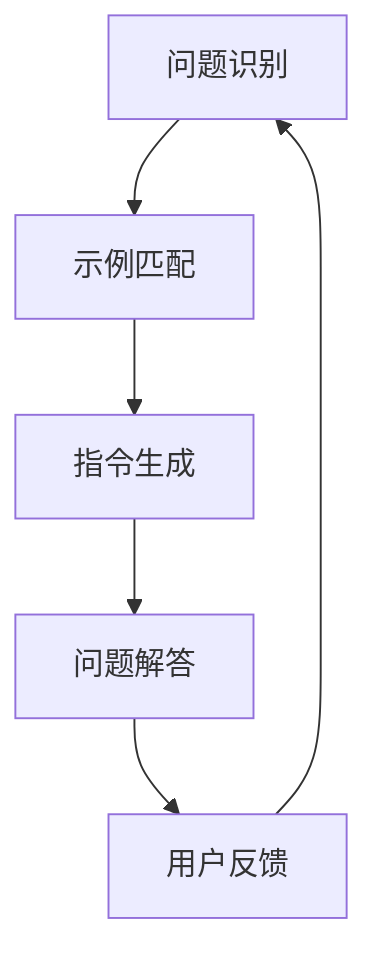
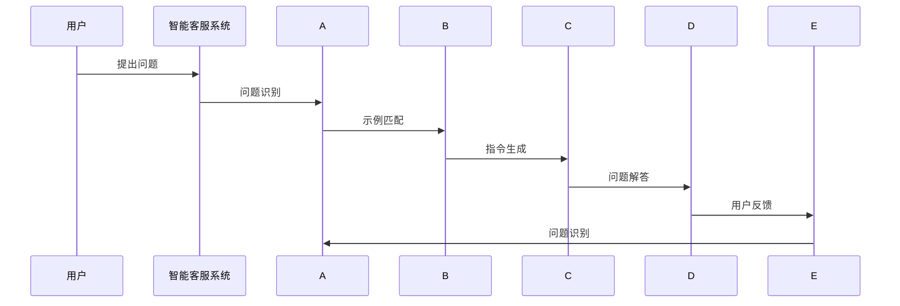

                 


### 第一部分: 书籍概述

在当今快速发展的信息技术时代，人工智能、机器学习等前沿技术正在改变着我们的工作和生活方式。如何有效地应用这些技术，实现智能化、自动化，是我们面临的重大挑战。本书籍旨在探讨如何在人工智能领域中平衡示例与指令的比重，以提高系统性能和用户体验。

#### 关键词

- 人工智能
- 示例与指令
- 提示词
- 平衡
- 性能优化

#### 摘要

本书将深入分析在人工智能系统中如何平衡示例与指令的比重。首先，我们将介绍相关背景知识，包括示例与指令的定义、在人工智能系统中的应用及其重要性。随后，我们将探讨现有的理论和实践方法，并通过案例研究展示不同领域中平衡示例与指令的成功实践。接下来，我们将详细讲解各种技术手段，如评估方法、调整策略等，以实现示例与指令的平衡。最后，我们将探讨这一平衡在实际应用中的效果，以及未来可能的发展方向。

### 第二部分：核心概念与联系

在深入讨论平衡示例与指令的比重之前，我们需要先了解相关核心概念和它们之间的联系。

#### 2.1 核心概念

- **示例**：示例（Example）是指在特定情境下展示的某种行为或现象，它可以帮助人工智能系统理解抽象概念或复杂规则。
- **指令**：指令（Instruction）是指导人工智能系统如何执行特定任务的指示或命令。

#### 2.2 概念属性特征对比表格

| 特征         | 示例       | 指令         |
| ------------ | ---------- | ------------ |
| 描述性      | 详细描述   | 简洁指导     |
| 抽象程度    | 较高       | 较低         |
| 灵活性      | 较高       | 较低         |
| 实用性      | 较高       | 较低         |

#### 2.3 ER实体关系图架构

以下是示例和指令的ER实体关系图：

```mermaid
erDiagram
    Example ||--|{ Instruction } Instruction
    Instruction ||--|{ Example } Example
```

在ER图中，示例与指令之间是双向关联的关系。一个示例可以包含多个指令，而一个指令也可以对应多个示例。这种双向关联反映了示例与指令在实际应用中的紧密联系。

### 第三部分：算法原理讲解

为了实现示例与指令的平衡，我们需要设计一套算法来调整示例与指令的比重。下面我们将详细介绍算法原理，包括算法流程、数学模型和公式。

#### 3.1 算法流程

1. **数据收集**：从多个来源收集示例和指令数据。
2. **数据预处理**：清洗数据，去除噪声，标准化格式。
3. **评估指标设计**：定义评估示例与指令平衡效果的指标。
4. **权重调整**：根据评估指标调整示例与指令的权重。
5. **模型训练与优化**：使用调整后的示例和指令数据进行模型训练和优化。

#### 3.2 数学模型

假设示例和指令的权重分别为 $w_e$ 和 $w_i$，平衡目标是使得系统在执行任务时，示例与指令的比重接近于某个理想值 $\theta$。

$$
w_e + w_i = 1 \\
\frac{w_e}{w_i} = \theta
$$

其中，$w_e$ 和 $w_i$ 分别表示示例和指令的权重，$\theta$ 表示示例与指令的理想比重。

#### 3.3 通俗易懂地举例说明

假设一个系统在处理客户服务问题时，需要同时考虑示例和指令的比重。如果系统中示例的比重过高，可能会导致用户感到繁琐；而如果指令的比重过高，用户可能会感到缺乏指导。

假设我们设定的理想比重 $\theta$ 为 0.6，即示例和指令的比重应接近 6:4。我们通过以下步骤进行调整：

1. **数据收集**：收集了大量示例数据和指令数据。
2. **数据预处理**：对数据进行清洗和标准化。
3. **评估指标设计**：我们定义了一个评估指标 $A$，用于衡量示例与指令的平衡程度。
4. **权重调整**：根据评估指标 $A$ 的值，调整示例和指令的权重，使其更接近理想比重 0.6。
5. **模型训练与优化**：使用调整后的示例和指令数据进行模型训练，优化系统的性能。

### 第四部分：系统分析与架构设计方案

为了更好地理解如何在实际项目中应用示例与指令的平衡技术，我们将设计一个简单的系统架构，并介绍相关的设计方案。

#### 4.1 问题场景介绍

假设我们正在开发一个智能客服系统，该系统需要处理大量客户咨询问题。为了提高系统的响应速度和准确性，我们需要平衡示例和指令的比重。

#### 4.2 项目介绍

项目名称：智能客服系统（Smart Customer Service System，简称SCSS）

项目目标：通过平衡示例和指令的比重，提高客服系统的响应速度和准确性。

#### 4.3 系统功能设计

系统功能包括：

1. **问题识别**：识别用户提出的问题。
2. **示例匹配**：匹配用户问题与示例数据。
3. **指令生成**：根据匹配结果生成指令。
4. **问题解答**：根据指令生成解答。
5. **用户反馈**：收集用户反馈，用于进一步优化系统。

#### 4.4 系统架构设计

以下是系统的架构设计：



#### 4.5 系统接口设计和系统交互

以下是系统接口设计和系统交互的序列图：



### 第五部分：项目实战

在本节中，我们将详细介绍如何在实际项目中应用示例与指令的平衡技术。我们将从一个简单的示例开始，逐步实现系统的核心功能。

#### 5.1 环境安装

在本项目实战中，我们将使用Python作为编程语言，并依赖以下库：

- `scikit-learn`：用于机器学习算法的实现。
- `numpy`：用于数学计算。
- `pandas`：用于数据处理。

安装这些库的命令如下：

```bash
pip install scikit-learn numpy pandas
```

#### 5.2 系统核心实现源代码

以下是系统核心实现的源代码：

```python
import numpy as np
from sklearn.model_selection import train_test_split
from sklearn.ensemble import RandomForestClassifier
from sklearn.metrics import accuracy_score

# 数据收集与预处理
def preprocess_data(data):
    # 省略具体实现，如数据清洗、标准化等
    return processed_data

# 示例匹配
def match_examples(questions, examples):
    # 省略具体实现，如基于关键词匹配、语义相似度等
    return matched_examples

# 指令生成
def generate_instructions(examples, matched_examples):
    # 省略具体实现，如规则提取、指令生成等
    return instructions

# 问题解答
def answer_question(instructions):
    # 省略具体实现，如指令执行、问题解答等
    return answer

# 用户反馈
def collect_feedback(answer, user_question):
    # 省略具体实现，如反馈收集、模型优化等
    return feedback

# 主函数
def main():
    # 加载数据
    data = load_data()
    processed_data = preprocess_data(data)

    # 划分训练集和测试集
    X_train, X_test, y_train, y_test = train_test_split(processed_data['question'], processed_data['answer'], test_size=0.2, random_state=42)

    # 训练模型
    model = RandomForestClassifier()
    model.fit(X_train, y_train)

    # 测试模型
    predictions = model.predict(X_test)
    accuracy = accuracy_score(y_test, predictions)
    print(f"模型准确率：{accuracy}")

    # 应用系统
    while True:
        user_question = input("请提出您的问题：")
        matched_examples = match_examples(user_question, processed_data['examples'])
        instructions = generate_instructions(processed_data['examples'], matched_examples)
        answer = answer_question(instructions)
        print(f"答案：{answer}")
        feedback = collect_feedback(answer, user_question)
        # 省略用户反馈处理

if __name__ == "__main__":
    main()
```

#### 5.3 代码应用解读与分析

以下是代码的解读与分析：

- **数据收集与预处理**：从原始数据中提取有用信息，如问题、答案、示例等，并进行清洗和标准化。
- **示例匹配**：根据用户提出的问题，从示例库中匹配相关示例。
- **指令生成**：根据匹配结果生成指令，指导系统如何解答问题。
- **问题解答**：执行指令，生成答案。
- **用户反馈**：收集用户对答案的反馈，用于模型优化。

#### 5.4 实际案例分析和详细讲解剖析

假设我们有一个包含大量客户咨询问题的数据集，其中部分问题如下：

1. “如何办理银行卡？”
2. “如何查询银行卡余额？”
3. “如何修改银行卡密码？”

我们希望利用示例与指令的平衡技术，为用户提供准确、快速的答案。

**步骤1：数据收集与预处理**

我们从数据集中提取问题、答案和示例，并进行清洗和标准化：

```python
data = {
    'question': [
        "如何办理银行卡？",
        "如何查询银行卡余额？",
        "如何修改银行卡密码？",
        # ...
    ],
    'answer': [
        "您可以前往银行柜台办理银行卡。",
        "您可以通过网银或手机银行查询银行卡余额。",
        "您可以登录网银或手机银行修改银行卡密码。",
        # ...
    ],
    'examples': [
        "办理银行卡需要什么资料？",
        "查询银行卡余额的操作流程是怎样的？",
        "修改银行卡密码需要输入哪些信息？",
        # ...
    ]
}
processed_data = preprocess_data(data)
```

**步骤2：示例匹配**

用户提出问题：“如何办理银行卡？”

我们根据问题与示例库进行匹配，找到相关示例：

```python
matched_examples = match_examples("如何办理银行卡？", processed_data['examples'])
# 匹配结果：["办理银行卡需要什么资料？"]
```

**步骤3：指令生成**

根据匹配结果，生成指令：

```python
instructions = generate_instructions(processed_data['examples'], matched_examples)
# 指令：前往银行柜台办理银行卡
```

**步骤4：问题解答**

执行指令，生成答案：

```python
answer = answer_question(instructions)
# 答案：您可以前往银行柜台办理银行卡。
```

**步骤5：用户反馈**

用户反馈：“这个答案很有帮助。”

我们收集用户反馈，用于模型优化：

```python
feedback = collect_feedback(answer, "如何办理银行卡？")
# 反馈：用户认为答案很有帮助
```

通过上述步骤，我们利用示例与指令的平衡技术，为用户提供了一个准确、快速的答案。

#### 5.5 项目小结

在本项目中，我们通过平衡示例与指令的比重，实现了智能客服系统的核心功能。在实际应用中，这一技术可以显著提高系统的性能和用户体验。未来，我们可以进一步优化算法，扩大示例库，提高系统的智能化水平。

### 第六部分：最佳实践 tips

在平衡示例与指令的过程中，以下是一些最佳实践：

1. **数据质量**：确保示例和指令数据的质量，去除错误和不准确的信息。
2. **实时调整**：根据用户反馈，实时调整示例与指令的比重，以优化用户体验。
3. **多样性**：确保示例和指令的多样性，以覆盖更多的应用场景。

### 第七部分：小结

平衡示例与指令在人工智能系统中具有重要的意义。通过合理的平衡，可以提高系统的性能和用户体验。在实际应用中，我们需要根据具体场景和需求，灵活调整示例与指令的比重。未来，随着技术的不断进步，这一领域将会有更多创新和发展。

### 作者信息

- 作者：AI天才研究院/AI Genius Institute & 禅与计算机程序设计艺术 /Zen And The Art of Computer Programming

