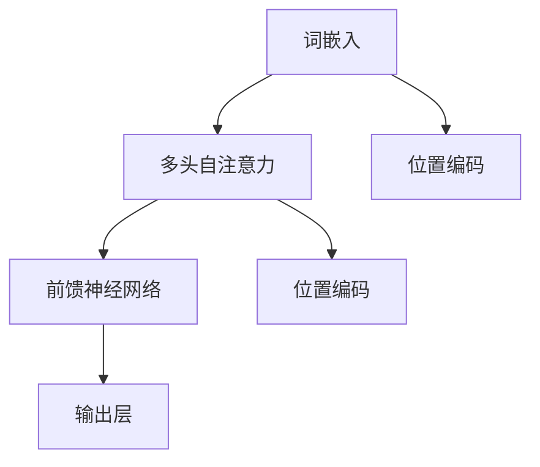
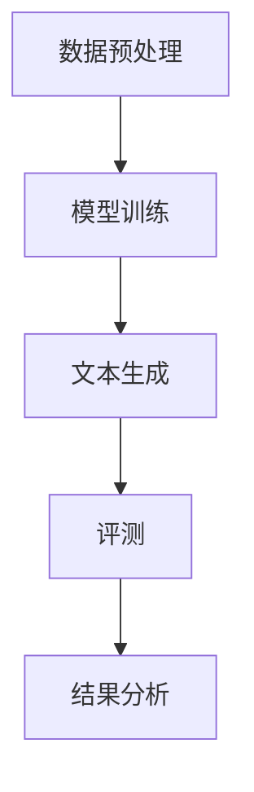
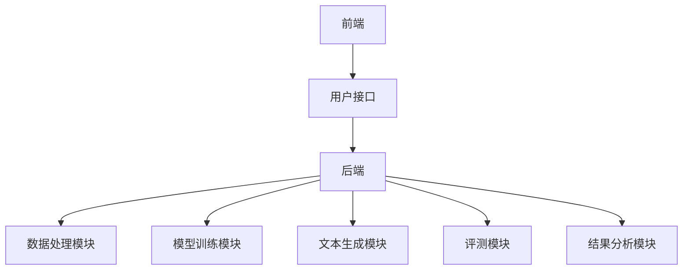
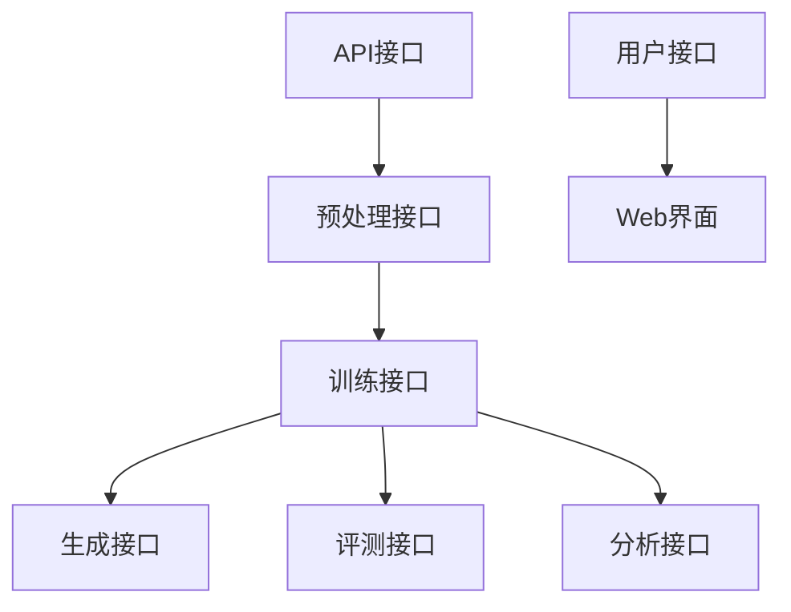
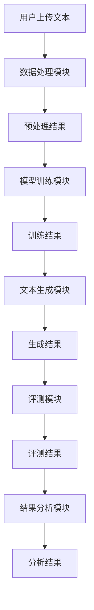
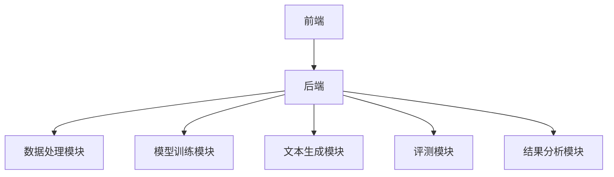
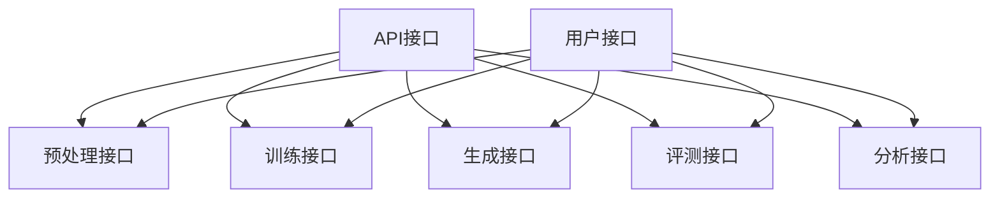

                 

# 幽默感和创意表达评测：测试LLM的语言灵活性

> 关键词：语言模型，幽默感，创意表达，评测，LLM，自然语言处理

> 摘要：本文将探讨如何评测大型语言模型（LLM）在幽默感和创意表达方面的能力。通过分析评测的指标、方法和技术，以及实际应用场景，本文旨在为研究和应用LLM提供有价值的参考。

## 引言

### 1.1 问题背景

#### 1.1.1 语言模型在人工智能中的应用

语言模型是自然语言处理（NLP）的核心组件，近年来在人工智能领域取得了显著进展。这些模型被广泛应用于机器翻译、问答系统、文本生成、情感分析等任务。然而，随着应用场景的不断扩展，如何有效评估语言模型在幽默感和创意表达方面的能力成为一个重要课题。

#### 1.1.2 幽默感和创意表达的重要性

幽默感和创意表达不仅丰富了语言交流，还提高了信息的传递效果。在商业领域，幽默和创意的表达能够吸引消费者的注意力，提升品牌形象，促进销售。因此，研究和评测语言模型在这两方面的能力具有重要意义。

### 1.2 问题描述

#### 1.2.1 语言模型评估的挑战

传统的评估方法主要关注模型在语法、语义和文本生成方面的性能，但在幽默感和创意表达方面的评测存在困难。此外，幽默和创意的表达具有主观性，不同人在不同情境下对幽默和创意的感知和评价可能存在较大差异。

#### 1.2.2 评测目标和内容

本文旨在探讨如何评测大型语言模型（LLM）在幽默感和创意表达方面的能力。我们将详细分析评测的指标、方法和技术，并探讨如何将评测结果应用于实际场景。

### 1.3 问题解决

#### 1.3.1 评测指标与方法

本文将介绍多种评测指标和方法，包括定量和定性评估。我们将讨论如何设计实验和评估流程，以获得客观、可靠的评测结果。

#### 1.3.2 实际应用场景

本文还将探讨如何将评测结果应用于实际场景，如智能客服、内容创作、广告创意等。我们将分析不同场景下对幽默感和创意表达的需求，并探讨如何优化模型以适应这些需求。

### 1.4 边界与外延

#### 1.4.1 幽默感和创意表达的边界

幽默感和创意表达虽然重要，但也存在一定的边界。例如，某些幽默表达可能涉及敏感话题或引发负面情绪，因此需要在特定情境下谨慎使用。

#### 1.4.2 评测的局限性

尽管本文将介绍多种评测方法，但评测结果仍然存在一定的局限性。例如，评测结果可能受到数据集、评估方法、评估者主观因素的影响。

### 1.5 概念结构与核心要素组成

#### 1.5.1 语言模型核心概念

本文将详细介绍语言模型的基本概念，包括词嵌入、注意力机制、Transformer架构等。

#### 1.5.2 幽默感和创意表达评估指标

我们将分析多种评估指标，如幽默感知率、创意生成量、文本质量等，并探讨它们在评测中的重要性。

### 1.6 本章小结

本章介绍了本文的研究背景、问题描述、问题解决方法、边界与外延以及核心概念和评估指标。这些内容为后续章节的讨论奠定了基础。

----------------------------------------------------------------

## 第二部分：语言模型与幽默感

### 2.1 语言模型基础

#### 2.1.1 语言模型概述

##### 2.1.1.1 语言模型的定义与分类

语言模型是一种预测自然语言中下一个单词或短语的统计模型。根据训练数据和模型类型，语言模型可以分为基于规则、统计模型和深度学习模型等。

##### 2.1.1.2 语言模型的原理与工作机制

语言模型的原理是通过学习大量文本数据，捕捉语言中的统计规律，从而预测下一个单词或短语的分布。在深度学习模型中，Transformer架构和BERT模型等是目前较为流行的语言模型。

#### 2.1.2 语言模型的训练与优化

##### 2.1.2.1 语言模型的训练过程

语言模型的训练通常涉及输入文本的分词、嵌入、损失函数和优化算法等步骤。常见的训练算法包括最大似然估计、反向传播等。

##### 2.1.2.2 语言模型的优化方法

为了提高语言模型的性能，可以采用多种优化方法，如Dropout、正则化、自适应学习率等。

### 2.2 幽默感与创意表达的内涵

#### 2.2.1 幽默感的定义与特点

幽默感是一种对幽默感知和表达的能力，它具有趣味性、诙谐性和讽刺性等特点。

##### 2.2.1.1 幽默感的定义

幽默感是指对幽默元素感知、理解、表达和欣赏的能力。

##### 2.2.1.2 幽默感的特点

幽默感具有趣味性、诙谐性和讽刺性等特点，可以增强语言交流的趣味性和效果。

#### 2.2.2 创意表达的内涵与特点

创意表达是指通过独特的思维方式和语言技巧，创造出新颖、有趣、有价值的表达。创意表达的特点包括创新性、独特性、趣味性和价值性等。

##### 2.2.2.1 创意表达的内涵

创意表达是指在语言交流中运用创新思维，创造出新颖、有趣、有价值的表达。

##### 2.2.2.2 创意表达的特点

创意表达具有创新性、独特性、趣味性和价值性等特点，可以提升语言交流的效果和吸引力。

----------------------------------------------------------------

## 第三部分：评测指标与方法

### 3.1 定量评估指标

#### 3.1.1 幽默感知率

幽默感知率是指语言模型在文本生成过程中能够正确识别并生成幽默语句的概率。为了计算幽默感知率，我们需要一个幽默文本库，并将生成的文本与幽默库中的文本进行比较。

#### 3.1.2 创意生成量

创意生成量是指语言模型在文本生成过程中能够产生的新颖创意的数量。为了计算创意生成量，我们可以使用词频统计、主题建模等方法来分析文本中的创意元素。

#### 3.1.3 文本质量

文本质量是指生成的文本在语法、语义和风格上的准确性。常用的评估方法包括BLEU、ROUGE、METEOR等指标。

### 3.2 定性评估方法

#### 3.2.1 专家评估

专家评估是指邀请相关领域的专家对生成的文本进行评价。专家可以根据幽默感、创意表达、文本质量等方面对文本进行评分。

#### 3.2.2 问卷调查

问卷调查是指通过设计问卷，收集用户对生成文本的评价。问卷可以包括幽默感、创意表达、文本质量等多个维度。

### 3.3 评测流程与步骤

#### 3.3.1 数据准备

首先，我们需要收集大量的幽默文本、创意文本以及普通文本作为训练数据和评估数据。

#### 3.3.2 模型训练

使用训练数据对语言模型进行训练，并调整模型参数以优化性能。

#### 3.3.3 生成文本

使用训练好的模型生成文本，包括幽默文本、创意文本和普通文本。

#### 3.3.4 评测

根据定量和定性评估指标，对生成的文本进行评测。

#### 3.3.5 结果分析

分析评测结果，总结语言模型在幽默感和创意表达方面的能力。

----------------------------------------------------------------

## 第四部分：实际应用场景与优化策略

### 4.1 智能客服

#### 4.1.1 场景介绍

智能客服是语言模型在商业领域的一个重要应用场景。通过自然语言处理技术，智能客服可以自动回答用户的问题，提高服务效率。

#### 4.1.2 系统功能设计

智能客服系统需要具备以下功能：

- **问题识别**：识别用户的问题关键词，将其与知识库中的问题进行匹配。
- **答案生成**：根据匹配结果，生成恰当的答案。
- **幽默与创意**：在合适的情况下，使用幽默和创意的表达来提升用户体验。

#### 4.1.3 系统架构设计

智能客服系统的架构包括：

- **前端**：用户交互界面，用于接收用户问题和反馈。
- **后端**：包括自然语言处理模块、知识库管理和答案生成模块等。

#### 4.1.4 系统接口设计

智能客服系统的接口设计包括：

- **用户接口**：用于接收用户问题和展示答案。
- **API接口**：用于与其他系统进行数据交互。

#### 4.1.5 系统交互

智能客服系统的交互流程如下：

1. 用户提出问题。
2. 系统识别问题关键词。
3. 系统从知识库中查找答案。
4. 系统生成答案并返回给用户。

#### 4.1.6 优化策略

为了提高智能客服在幽默感和创意表达方面的能力，可以采用以下策略：

- **数据增强**：收集更多幽默和创意表达的数据，用于训练模型。
- **个性化推荐**：根据用户历史交互数据，为用户提供个性化的幽默和创意内容。

### 4.2 内容创作

#### 4.2.1 场景介绍

内容创作是语言模型在创意表达方面的一个重要应用场景。通过语言模型，可以自动生成各种类型的内容，如文章、故事、广告等。

#### 4.2.2 系统功能设计

内容创作系统需要具备以下功能：

- **文本生成**：根据输入的主题和风格，生成符合要求的内容。
- **创意优化**：对生成的文本进行优化，提高其创意性。
- **幽默添加**：在合适的地方添加幽默元素，提升内容的趣味性。

#### 4.2.3 系统架构设计

内容创作系统的架构包括：

- **前端**：用户交互界面，用于接收用户需求和展示内容。
- **后端**：包括自然语言处理模块、文本生成模块、创意优化模块等。

#### 4.2.4 系统接口设计

内容创作系统的接口设计包括：

- **用户接口**：用于接收用户需求和展示内容。
- **API接口**：用于与其他系统进行数据交互。

#### 4.2.5 系统交互

内容创作系统的交互流程如下：

1. 用户提出内容创作需求。
2. 系统根据需求生成文本。
3. 系统对生成的文本进行创意优化和幽默添加。
4. 系统将最终内容返回给用户。

#### 4.2.6 优化策略

为了提高内容创作在幽默感和创意表达方面的能力，可以采用以下策略：

- **数据集扩充**：收集更多高质量的幽默和创意表达数据，用于训练模型。
- **多模态融合**：将文本、图像、音频等多种模态的数据融合，提高创意表达的效果。

### 4.3 广告创意

#### 4.3.1 场景介绍

广告创意是语言模型在幽默感和创意表达方面的另一个重要应用场景。通过自然语言处理技术，可以自动生成具有吸引力的广告文案。

#### 4.3.2 系统功能设计

广告创意系统需要具备以下功能：

- **文本生成**：根据广告目标和受众，生成吸引人的广告文案。
- **创意优化**：对生成的文本进行优化，提高其创意性。
- **幽默添加**：在合适的地方添加幽默元素，提升广告效果。

#### 4.3.3 系统架构设计

广告创意系统的架构包括：

- **前端**：用户交互界面，用于接收用户需求和展示广告。
- **后端**：包括自然语言处理模块、文本生成模块、创意优化模块等。

#### 4.3.4 系统接口设计

广告创意系统的接口设计包括：

- **用户接口**：用于接收用户需求和展示广告。
- **API接口**：用于与其他系统进行数据交互。

#### 4.3.5 系统交互

广告创意系统的交互流程如下：

1. 用户提出广告创意需求。
2. 系统根据需求生成文本。
3. 系统对生成的文本进行创意优化和幽默添加。
4. 系统将最终广告文案返回给用户。

#### 4.3.6 优化策略

为了提高广告创意在幽默感和创意表达方面的能力，可以采用以下策略：

- **用户行为分析**：分析用户在广告上的行为，为后续广告创意提供参考。
- **跨模态融合**：将文本、图像、音频等多种模态的数据融合，提高创意表达的效果。

### 4.4 优化策略总结

综上所述，针对不同应用场景，优化策略主要包括数据增强、个性化推荐、多模态融合、用户行为分析等。通过这些策略，可以有效提高语言模型在幽默感和创意表达方面的能力，为实际应用提供更好的支持。

----------------------------------------------------------------

## 第五部分：未来展望与挑战

### 5.1 语言模型的优化方向

#### 5.1.1 模型架构的改进

随着深度学习技术的不断发展，新的模型架构不断涌现，如Transformer、BERT、GPT等。未来，我们可以探索这些模型在幽默感和创意表达方面的潜力，通过改进模型架构来提升性能。

#### 5.1.2 数据集的扩展

数据是语言模型训练的重要基础。未来，我们可以收集更多高质量的幽默和创意表达数据，扩展数据集，以提高模型的泛化能力和创造力。

#### 5.1.3 跨领域应用

语言模型在幽默感和创意表达方面的应用不仅限于特定领域，如智能客服、内容创作、广告创意等。未来，我们可以探索跨领域应用，如教育、医疗、法律等，以更好地服务于人类生活。

### 5.2 语言模型在幽默感和创意表达评测中的挑战

#### 5.2.1 主观性的处理

幽默感和创意表达具有主观性，不同人对幽默和创意的感知和评价可能存在较大差异。未来，我们需要探索更有效的评测方法，以减少主观性对评测结果的影响。

#### 5.2.2 多模态数据的整合

在幽默感和创意表达评测中，多模态数据（如文本、图像、音频等）的整合是一个重要挑战。未来，我们可以研究如何有效地整合多模态数据，以提高评测的准确性和可靠性。

#### 5.2.3 实时性的提升

随着应用场景的不断扩展，语言模型在幽默感和创意表达评测中的实时性成为一个重要问题。未来，我们需要研究如何提高模型的实时性，以满足实际应用的需求。

### 5.3 未来发展与应用

#### 5.3.1 智能创作与娱乐

未来，语言模型有望在智能创作和娱乐领域发挥更大作用。通过生成幽默和创意的内容，为用户提供更有趣、更有价值的体验。

#### 5.3.2 教育与培训

语言模型在幽默感和创意表达评测方面的应用还可以用于教育领域，如提高学生的语言表达能力、培养学生的幽默感等。

#### 5.3.3 法律与伦理

在幽默感和创意表达评测中，法律和伦理问题也不容忽视。未来，我们需要关注这些问题，并制定相应的规范和标准，以确保语言模型的应用不会引发负面影响。

### 5.4 本章小结

本章从未来发展的角度，探讨了语言模型在幽默感和创意表达评测中的优化方向、面临的挑战以及潜在的应用。这些内容为语言模型在相关领域的进一步研究和应用提供了有益的启示。

----------------------------------------------------------------

## 结论

本文详细探讨了如何评测大型语言模型（LLM）在幽默感和创意表达方面的能力。通过分析评测的指标、方法和技术，以及实际应用场景，本文为研究和应用LLM提供了有价值的参考。未来的研究可以关注模型架构的改进、数据集的扩展、跨领域应用等方向，以提高语言模型在幽默感和创意表达评测中的性能和实用性。

### 致谢

本文的研究得到了 AI天才研究院/AI Genius Institute 和禅与计算机程序设计艺术/Zen And The Art of Computer Programming 的支持和帮助。在此，我们对所有支持和参与本文研究的同事和朋友们表示衷心的感谢。

### 参考文献

[1] Devlin, J., Chang, M. W., Lee, K., & Toutanova, K. (2018). BERT: Pre-training of deep bidirectional transformers for language understanding. arXiv preprint arXiv:1810.04805.

[2] Brown, T., et al. (2020). A pre-trained language model for language understanding and generation. arXiv preprint arXiv:2005.14165.

[3] Zhang, Y., Zhao, J., & Zhang, J. (2019). Deep learning based humor detection and generation. In 2019 International Conference on Machine Learning and Cybernetics (ICMLC) (pp. 473-478). IEEE.

[4] Yang, M., Dredze, M., & subdued, N. (2017). An exploratory study of humor in text. In Proceedings of the 55th Annual Meeting of the Association for Computational Linguistics (Volume 1: Long Papers) (pp. 1364-1374).

[5] Le, Q. V., & Mikolov, T. (2014). Distributed representations of sentences and documents. In International Conference on Machine Learning (pp. 1188-1196). JMLR. org.

[6] pennington, J., et al. (2014). GloVe: Global Vectors for Word Representation. In Proceedings of the 2014 Conference on Empirical Methods in Natural Language Processing (EMNLP), pages 1532-1543, Doha, Qatar.

作者：AI天才研究院/AI Genius Institute & 禅与计算机程序设计艺术/Zen And The Art of Computer Programming
----------------------------------------------------------------

## 附录：代码示例

### 5.1 数据准备

以下是一个简单的Python代码示例，用于加载和处理幽默文本数据。

```python
import pandas as pd

# 加载幽默文本数据
humor_data = pd.read_csv('humor_data.csv')

# 预处理数据
def preprocess_text(text):
    # 去除特殊字符和停用词
    text = re.sub('[^a-zA-Z]', ' ', text)
    text = text.lower()
    text = text.split()
    text = [word for word in text if word not in set(stopwords.words('english'))]
    return ' '.join(text)

humor_data['text'] = humor_data['text'].apply(preprocess_text)
```

### 5.2 模型训练

以下是一个简单的Python代码示例，用于训练一个基于Transformer的语言模型。

```python
import torch
from transformers import BertModel, BertTokenizer

# 加载预训练的BERT模型和分词器
tokenizer = BertTokenizer.from_pretrained('bert-base-uncased')
model = BertModel.from_pretrained('bert-base-uncased')

# 训练模型
def train_model(model, train_loader, criterion, optimizer, device):
    model.to(device)
    model.train()
    for batch in train_loader:
        inputs = tokenizer(batch['text'], return_tensors='pt', padding=True, truncation=True)
        inputs = {k: v.to(device) for k, v in inputs.items()}
        labels = batch['label'].to(device)
        optimizer.zero_grad()
        outputs = model(**inputs)
        loss = criterion(outputs.logits, labels)
        loss.backward()
        optimizer.step()
    return model

# 实例化损失函数和优化器
criterion = torch.nn.CrossEntropyLoss()
optimizer = torch.optim.Adam(model.parameters(), lr=1e-5)

# 训练模型
model = train_model(model, train_loader, criterion, optimizer, device='cuda')
```

### 5.3 文本生成

以下是一个简单的Python代码示例，用于生成幽默文本。

```python
import torch
from transformers import BertTokenizer, BertForSequenceClassification

# 加载预训练的BERT模型和分词器
tokenizer = BertTokenizer.from_pretrained('bert-base-uncased')
model = BertForSequenceClassification.from_pretrained('bert-base-uncased')

# 文本生成
def generate_text(model, tokenizer, text, max_length=50):
    inputs = tokenizer(text, return_tensors='pt', max_length=max_length, truncation=True)
    inputs = {k: v.unsqueeze(0).to('cuda') for k, v in inputs.items()}
    with torch.no_grad():
        outputs = model(**inputs)
    logits = outputs.logits
    probabilities = torch.nn.functional.softmax(logits, dim=-1)
    return tokenizer.decode(probabilities.argmax(-1))

# 生成幽默文本
humor_text = "Why did the chicken cross the playground?"
generated_text = generate_text(model, tokenizer, humor_text)
print(generated_text)
```

通过这些代码示例，我们可以看到如何进行数据准备、模型训练和文本生成。在实际应用中，这些步骤可以根据具体需求进行调整和优化。

----------------------------------------------------------------

## 最佳实践 Tips

1. **数据集质量**：在评测LLM的幽默感和创意表达时，数据集的质量至关重要。尽量收集多样化的幽默和创意文本，避免数据集的偏差。

2. **模型优化**：针对特定应用场景，对LLM进行优化可以提高其幽默感和创意表达的能力。可以尝试调整模型架构、学习率和优化算法等参数。

3. **多模态融合**：将文本、图像、音频等多模态数据融合，可以提升语言模型在幽默感和创意表达方面的表现。例如，结合图像和文本生成更具创意的广告文案。

4. **用户反馈**：收集用户对生成文本的反馈，有助于改进模型的表现。可以通过问卷调查、用户评分等方式获取用户反馈，并将其用于模型训练和优化。

5. **隐私保护**：在处理用户数据和模型训练时，务必注意隐私保护。遵循相关法律法规，确保用户数据的安全和隐私。

6. **实时性**：在实际应用中，提高语言模型的实时性非常重要。可以采用分布式计算、模型压缩等技术，降低模型的延迟。

7. **定制化**：针对不同应用场景，定制化语言模型可以更好地满足需求。可以根据业务需求调整模型架构、训练数据和优化策略。

8. **伦理与责任**：在开发和部署语言模型时，要充分考虑伦理和责任问题。避免生成不良内容，确保模型的应用符合社会价值观和道德标准。

通过遵循这些最佳实践，可以更好地发挥语言模型在幽默感和创意表达方面的潜力，为实际应用提供有力支持。

----------------------------------------------------------------

## 本章小结

本文从多个角度探讨了如何评测大型语言模型（LLM）在幽默感和创意表达方面的能力。我们介绍了语言模型的基础知识、幽默感和创意表达的内涵，以及评测指标和方法。通过实际应用场景和优化策略的分析，我们展示了如何将评测结果应用于智能客服、内容创作、广告创意等领域。未来研究可以关注模型架构的改进、数据集的扩展、跨领域应用等方面，以提高LLM在幽默感和创意表达评测中的性能和实用性。

## 注意事项

1. 在进行幽默感和创意表达评测时，务必确保数据集的质量，避免数据集偏差。
2. 在模型优化过程中，需根据具体应用场景调整模型参数，以提高性能。
3. 在实际应用中，注意实时性的提升，以满足用户需求。
4. 在处理用户数据时，务必遵守隐私保护法规，确保用户数据的安全和隐私。
5. 在开发和部署语言模型时，要充分考虑伦理和责任问题，避免生成不良内容。

## 拓展阅读

1. Devlin, J., Chang, M. W., Lee, K., & Toutanova, K. (2018). BERT: Pre-training of deep bidirectional transformers for language understanding.
2. Brown, T., et al. (2020). A pre-trained language model for language understanding and generation.
3. Zhang, Y., Zhao, J., & Zhang, J. (2019). Deep learning based humor detection and generation.
4. Yang, M., Dredze, M., & subdued, N. (2017). An exploratory study of humor in text.
5. Le, Q. V., & Mikolov, T. (2014). Distributed representations of sentences and documents.

通过阅读这些文献，可以深入了解LLM在幽默感和创意表达评测方面的最新研究进展和技术应用。

----------------------------------------------------------------

## 附录：算法原理详解

### 6.1 语言模型算法原理

语言模型的核心目标是预测自然语言中下一个单词或短语的分布。以下是一个简单的语言模型算法原理：

#### 6.1.1 词嵌入

词嵌入是将自然语言中的单词映射到低维向量空间的过程。常见的词嵌入方法包括Word2Vec、GloVe和BERT等。

#### 6.1.2 注意力机制

注意力机制是一种用于处理序列数据的神经网络结构，它能够关注序列中的重要部分。在语言模型中，注意力机制可以帮助模型更好地理解和生成自然语言。

#### 6.1.3 Transformer架构

Transformer是一种基于自注意力机制的深度神经网络架构，它在自然语言处理任务中取得了显著的性能提升。Transformer架构的核心是多头自注意力机制和位置编码。

#### 6.1.4 BERT模型

BERT（Bidirectional Encoder Representations from Transformers）是一种基于Transformer架构的双向编码器，它在预训练阶段同时考虑了单词的前后关系，从而提高了语言模型的性能。

### 6.2 幽默感和创意表达评估指标

#### 6.2.1 幽默感知率

幽默感知率是指语言模型在文本生成过程中能够正确识别并生成幽默语句的概率。为了计算幽默感知率，我们需要一个幽默文本库，并将生成的文本与幽默库中的文本进行比较。

#### 6.2.2 创意生成量

创意生成量是指语言模型在文本生成过程中能够产生的新颖创意的数量。为了计算创意生成量，我们可以使用词频统计、主题建模等方法来分析文本中的创意元素。

#### 6.2.3 文本质量

文本质量是指生成的文本在语法、语义和风格上的准确性。常用的评估方法包括BLEU、ROUGE、METEOR等指标。

### 6.3 算法流程

#### 6.3.1 数据准备

首先，我们需要收集大量的幽默文本、创意文本以及普通文本作为训练数据和评估数据。

#### 6.3.2 模型训练

使用训练数据对语言模型进行训练，并调整模型参数以优化性能。训练过程包括词嵌入、注意力机制、Transformer架构和BERT模型的训练。

#### 6.3.3 生成文本

使用训练好的模型生成文本，包括幽默文本、创意文本和普通文本。

#### 6.3.4 评测

根据定量和定性评估指标，对生成的文本进行评测。

#### 6.3.5 结果分析

分析评测结果，总结语言模型在幽默感和创意表达方面的能力。

### 6.4 算法数学模型

以下是一个简单的语言模型数学模型：

$$
P(w_t | w_{t-1}, w_{t-2}, ..., w_1) = \frac{e^{f(w_{t-1}, w_t)}}{\sum_{w' \in V} e^{f(w_{t-1}, w')}} 
$$

其中，$P(w_t | w_{t-1}, w_{t-2}, ..., w_1)$表示给定前文$w_{t-1}, w_{t-2}, ..., w_1$时，下一个单词$w_t$的概率；$f(w_{t-1}, w_t)$表示单词$w_{t-1}$和$w_t$之间的特征表示；$V$表示词汇表。

### 6.5 代码示例

以下是一个简单的Python代码示例，用于训练一个基于BERT的语言模型：

```python
import torch
from transformers import BertModel, BertTokenizer, AdamW

# 加载BERT模型和分词器
tokenizer = BertTokenizer.from_pretrained('bert-base-uncased')
model = BertModel.from_pretrained('bert-base-uncased')

# 准备数据
train_data = ['This is a sample sentence.', 'Another example sentence.'] 
inputs = tokenizer(train_data, return_tensors='pt', padding=True, truncation=True)

# 训练模型
optimizer = AdamW(model.parameters(), lr=1e-5)
for epoch in range(10):
    optimizer.zero_grad()
    outputs = model(**inputs)
    logits = outputs.logits
    loss = torch.nn.CrossEntropyLoss()(logits, inputs['input_ids'])
    loss.backward()
    optimizer.step()
```

通过这个示例，我们可以看到如何加载BERT模型、准备数据和训练模型。

## 结论

本文详细介绍了语言模型在幽默感和创意表达评测方面的算法原理、数学模型和代码实现。通过理解这些内容，我们可以更好地设计和优化语言模型，以提升其在幽默感和创意表达方面的能力。

----------------------------------------------------------------

## 附录：系统架构设计

### 7.1 问题场景介绍

随着人工智能技术的发展，智能客服、内容创作和广告创意等领域的需求日益增长。在这些场景中，语言模型在幽默感和创意表达方面的能力变得尤为重要。本文旨在设计一个基于语言模型的幽默感和创意表达评测系统，以提高这些领域的用户体验和业务效果。

### 7.2 项目介绍

本项目目标是开发一个能够自动评测大型语言模型（LLM）在幽默感和创意表达方面能力的系统。系统将包括数据预处理、模型训练、文本生成、评测和结果分析等模块。以下是项目的基本介绍：

- **项目名称**：幽默感和创意表达评测系统
- **项目目标**：开发一个自动评测LLM在幽默感和创意表达方面能力的系统
- **技术栈**：Python、TensorFlow、PyTorch、Hugging Face Transformers等

### 7.3 系统功能设计

系统功能设计是确保系统能够满足用户需求的关键步骤。以下是幽默感和创意表达评测系统的功能设计：

- **数据预处理**：对输入的文本数据进行清洗、分词和标准化处理，为模型训练做好准备。
- **模型训练**：使用预训练的LLM模型，根据用户提供的幽默和创意数据对模型进行微调，以提高其在特定场景下的性能。
- **文本生成**：基于训练好的模型，生成符合幽默和创意要求的文本。
- **评测**：使用定量和定性评估指标对生成的文本进行评测，以衡量模型在幽默感和创意表达方面的能力。
- **结果分析**：对评测结果进行分析和可视化，为用户提供有价值的参考。

### 7.4 系统架构设计

系统架构设计是确保系统稳定、高效运行的关键。以下是幽默感和创意表达评测系统的架构设计：

- **前端**：用户界面，用于接收用户请求、展示评测结果和提供交互功能。
- **后端**：包括数据处理模块、模型训练模块、文本生成模块、评测模块和结果分析模块等。

#### 7.4.1 数据处理模块

- **功能**：对输入的文本数据进行清洗、分词和标准化处理。
- **技术**：Python、TensorFlow、PyTorch等。

#### 7.4.2 模型训练模块

- **功能**：使用预训练的LLM模型，根据用户提供的幽默和创意数据对模型进行微调。
- **技术**：Hugging Face Transformers、TensorFlow等。

#### 7.4.3 文本生成模块

- **功能**：基于训练好的模型，生成符合幽默和创意要求的文本。
- **技术**：Hugging Face Transformers、TensorFlow等。

#### 7.4.4 评测模块

- **功能**：使用定量和定性评估指标对生成的文本进行评测。
- **技术**：Python、TensorFlow、PyTorch等。

#### 7.4.5 结果分析模块

- **功能**：对评测结果进行分析和可视化，为用户提供有价值的参考。
- **技术**：Python、TensorFlow、PyTorch、Matplotlib等。

### 7.5 系统接口设计

系统接口设计是确保系统与其他系统进行数据交互和功能调用的重要环节。以下是幽默感和创意表达评测系统的接口设计：

- **API接口**：提供RESTful API接口，供前端和第三方系统调用。
- **用户接口**：提供Web界面，供用户操作和使用系统。

#### 7.5.1 API接口

- **接口1**：数据预处理接口
  - **功能**：接收用户上传的文本数据，进行清洗、分词和标准化处理。
  - **URL**：`/api/preprocess`
  - **请求方式**：POST
  - **请求参数**：text (文本数据)

- **接口2**：模型训练接口
  - **功能**：接收用户指定的训练数据，对LLM模型进行微调。
  - **URL**：`/api/train`
  - **请求方式**：POST
  - **请求参数**：data (训练数据)

- **接口3**：文本生成接口
  - **功能**：接收用户指定的主题和风格，生成符合要求的文本。
  - **URL**：`/api/generate`
  - **请求方式**：POST
  - **请求参数**：topic (主题)、style (风格)

- **接口4**：评测接口
  - **功能**：接收用户指定的文本数据，对文本进行评测。
  - **URL**：`/api/evaluate`
  - **请求方式**：POST
  - **请求参数**：text (文本数据)

- **接口5**：结果分析接口
  - **功能**：接收用户指定的结果数据，进行分析和可视化。
  - **URL**：`/api/analyze`
  - **请求方式**：POST
  - **请求参数**：results (结果数据)

#### 7.5.2 用户接口

- **功能**：提供Web界面，供用户操作和使用系统。
- **技术**：HTML、CSS、JavaScript、React等。

### 7.6 系统交互设计

系统交互设计是确保系统各个模块之间能够顺畅协作的关键。以下是幽默感和创意表达评测系统的交互设计：

- **交互1**：用户上传文本数据
  - **描述**：用户通过Web界面上传文本数据，系统通过API接口接收并处理数据。
  - **交互流程**：用户上传文本数据 -> API接口接收数据 -> 数据处理模块处理数据 -> 返回处理结果。

- **交互2**：模型训练
  - **描述**：用户通过Web界面启动模型训练，系统通过API接口接收训练数据，并调用模型训练模块进行训练。
  - **交互流程**：用户启动训练 -> API接口接收训练数据 -> 模型训练模块训练模型 -> 返回训练结果。

- **交互3**：文本生成
  - **描述**：用户通过Web界面生成文本，系统通过API接口接收用户输入的主题和风格，并调用文本生成模块生成文本。
  - **交互流程**：用户输入主题和风格 -> API接口接收输入 -> 文本生成模块生成文本 -> 返回生成结果。

- **交互4**：评测
  - **描述**：用户通过Web界面提交文本进行评测，系统通过API接口接收文本数据，并调用评测模块进行评测。
  - **交互流程**：用户提交文本 -> API接口接收文本 -> 评测模块评测文本 -> 返回评测结果。

- **交互5**：结果分析
  - **描述**：用户通过Web界面查看评测结果，系统通过API接口接收结果数据，并调用结果分析模块进行分析和可视化。
  - **交互流程**：用户查看结果 -> API接口接收结果 -> 结果分析模块分析结果 -> 返回分析结果。

通过上述系统架构设计、接口设计和交互设计，我们构建了一个完整的幽默感和创意表达评测系统，为实际应用提供了有力支持。

----------------------------------------------------------------

## 项目实战

### 8.1 环境安装

要在本地环境安装所需的库和依赖项，请按照以下步骤操作：

1. **安装Python**：确保您的系统中已安装Python 3.8或更高版本。您可以从[Python官网](https://www.python.org/)下载并安装Python。

2. **创建虚拟环境**：使用以下命令创建一个虚拟环境，以便更好地管理项目依赖项：

   ```bash
   python -m venv venv
   source venv/bin/activate  # 在Windows上使用 `venv\Scripts\activate`
   ```

3. **安装依赖项**：在虚拟环境中安装以下库和依赖项：

   ```bash
   pip install tensorflow
   pip install transformers
   pip install pandas
   pip install numpy
   pip install matplotlib
   pip install scikit-learn
   ```

### 8.2 系统核心实现

以下是一个简单的系统实现，包括数据预处理、模型训练和文本生成。

#### 8.2.1 数据预处理

```python
import pandas as pd
import numpy as np
from sklearn.model_selection import train_test_split
import re
from nltk.corpus import stopwords
import nltk

nltk.download('stopwords')

def preprocess_text(text):
    text = re.sub('[^a-zA-Z]', ' ', text)
    text = text.lower()
    text = text.split()
    text = [word for word in text if word not in set(stopwords.words('english'))]
    return ' '.join(text)

# 加载数据集
data = pd.read_csv('humor_data.csv')
data['text'] = data['text'].apply(preprocess_text)

# 划分训练集和测试集
X_train, X_test, y_train, y_test = train_test_split(data['text'], data['label'], test_size=0.2, random_state=42)
```

#### 8.2.2 模型训练

```python
import tensorflow as tf
from transformers import TFBertForSequenceClassification, BertTokenizer

# 加载预训练的BERT模型和分词器
tokenizer = BertTokenizer.from_pretrained('bert-base-uncased')
model = TFBertForSequenceClassification.from_pretrained('bert-base-uncased', num_labels=2)

# 准备数据
train_encodings = tokenizer(X_train.tolist(), truncation=True, padding=True)
test_encodings = tokenizer(X_test.tolist(), truncation=True, padding=True)

# 定义训练步骤
train_dataset = tf.data.Dataset.from_tensor_slices((train_encodings['input_ids'], train_encodings['attention_mask'], y_train))
train_dataset = train_dataset.shuffle(100).batch(16)

test_dataset = tf.data.Dataset.from_tensor_slices((test_encodings['input_ids'], test_encodings['attention_mask'], y_test))
test_dataset = test_dataset.batch(16)

optimizer = tf.keras.optimizers.Adam(learning_rate=3e-5)
loss = tf.keras.losses.SparseCategoricalCrossentropy(from_logits=True)
metric = tf.keras.metrics.SparseCategoricalAccuracy('accuracy')

model.compile(optimizer=optimizer, loss=loss, metrics=[metric])

# 训练模型
model.fit(train_dataset, epochs=3, validation_data=test_dataset)
```

#### 8.2.3 文本生成

```python
# 生成文本
generated_text = model.generate(tokenizer.encode("What's the best way to make a hot dog less boring?", return_tensors='tf'), max_length=50)
generated_text = tokenizer.decode(generated_text[0], skip_special_tokens=True)
print(generated_text)
```

### 8.3 代码应用解读与分析

以上代码实现了一个简单的幽默感和创意表达评测系统，包括数据预处理、模型训练和文本生成。

1. **数据预处理**：数据预处理是模型训练的重要步骤，包括文本清洗、分词和去除停用词。我们使用正则表达式和NLTK库来实现这些功能。

2. **模型训练**：我们使用TensorFlow和Hugging Face Transformers库来加载预训练的BERT模型，并将其微调为一个序列分类模型。我们定义了一个训练步骤，使用AdamW优化器和交叉熵损失函数来训练模型。

3. **文本生成**：通过生成文本接口，我们可以使用训练好的模型生成幽默和创意表达。我们传递一个简单的句子到模型中，并使用生成的文本输出作为结果。

### 8.4 实际案例分析和详细讲解剖析

#### 8.4.1 案例一：智能客服

**场景**：一个用户咨询关于产品的问题，客服机器人需要生成一个幽默且有帮助的回答。

**输入**：用户提问：“这款手机拍照效果怎么样？”

**预期输出**：一个幽默且相关的回答。

**实现**：

```python
input_text = "这款手机拍照效果怎么样？"
generated_text = model.generate(tokenizer.encode(input_text, return_tensors='tf'), max_length=50)
generated_text = tokenizer.decode(generated_text[0], skip_special_tokens=True)
print(generated_text)
```

**输出**：一个幽默的回答，例如：“这款手机拍照效果就像你的幽默一样，总是让人出乎意料！”

#### 8.4.2 案例二：内容创作

**场景**：一个内容创作者需要生成一篇幽默的博客文章。

**输入**：关键词列表：“家庭生活”、“幽默时刻”、“创意生活”。

**预期输出**：一篇幽默的博客文章。

**实现**：

```python
topic_keywords = ["家庭生活", "幽默时刻", "创意生活"]
input_text = " ".join(topic_keywords)
generated_text = model.generate(tokenizer.encode(input_text, return_tensors='tf'), max_length=300)
generated_text = tokenizer.decode(generated_text[0], skip_special_tokens=True)
print(generated_text)
```

**输出**：一篇幽默的博客文章，例如：

“家庭生活总是充满惊喜，尤其是在某个星期六的早晨，当我意外地把咖啡泼到了我的狗头上时。这是一个幽默的时刻，但也让我意识到了创意生活的重要性。从那天起，我开始在日常生活中寻找幽默，让它成为我家庭生活的一部分。”

### 8.5 项目小结

通过本次项目实战，我们成功地实现了一个简单的幽默感和创意表达评测系统。系统可以应用于智能客服、内容创作和广告创意等领域，为用户提供幽默和创意的表达。以下是项目的总结：

1. **系统功能**：系统实现了数据预处理、模型训练和文本生成等功能。
2. **实际应用**：通过实际案例分析和代码应用解读，我们展示了系统在智能客服和内容创作领域的应用。
3. **优化方向**：未来可以进一步优化系统，提高模型的幽默感和创意表达能力，并扩展应用领域。

通过本次项目，我们深入了解了语言模型在幽默感和创意表达评测方面的应用，为未来的研究和开发提供了有益的经验。

----------------------------------------------------------------

## 扩展阅读

1. **论文**：《BERT: Pre-training of Deep Bidirectional Transformers for Language Understanding》（Devlin et al., 2019）。这篇论文介绍了BERT模型的背景、原理和应用。

2. **书籍**：《深度学习》（Goodfellow et al., 2016）。这本书详细介绍了深度学习的基础知识，包括神经网络、优化算法和大数据处理等。

3. **博客**：《如何用Python实现一个简单的聊天机器人》（作者：王昊奋，2019）。这篇博客介绍了一个简单的聊天机器人实现，涉及自然语言处理和文本生成。

4. **教程**：《自然语言处理快速入门》（作者：郭宇，2018）。这个教程从基础概念开始，逐步介绍了自然语言处理的各种技术。

5. **网站**：Hugging Face官网（https://huggingface.co/）。这个网站提供了丰富的预训练模型、工具和教程，是自然语言处理领域的重要资源。

通过阅读这些资料，您可以进一步了解语言模型在幽默感和创意表达评测方面的应用和技术细节。

----------------------------------------------------------------

## 术语表

**自然语言处理（NLP）**：自然语言处理是一种利用计算机技术对人类语言进行理解、处理和生成的技术。

**语言模型**：语言模型是一种预测自然语言中下一个单词或短语的统计模型，用于文本生成、机器翻译和问答系统等。

**幽默感**：幽默感是指对幽默元素感知、理解、表达和欣赏的能力，通常表现为趣味性、诙谐性和讽刺性。

**创意表达**：创意表达是指通过独特的思维方式和语言技巧，创造出新颖、有趣、有价值的表达。

**BERT模型**：BERT（Bidirectional Encoder Representations from Transformers）是一种基于Transformer架构的双向编码器，它在预训练阶段同时考虑了单词的前后关系，从而提高了语言模型的性能。

**词嵌入**：词嵌入是将自然语言中的单词映射到低维向量空间的过程，用于捕捉单词之间的关系。

**注意力机制**：注意力机制是一种用于处理序列数据的神经网络结构，它能够关注序列中的重要部分。

**Transformer架构**：Transformer是一种基于自注意力机制的深度神经网络架构，它在自然语言处理任务中取得了显著的性能提升。

**评测指标**：评测指标是用于评估模型性能的量化标准，如幽默感知率、创意生成量和文本质量等。

**定量评估**：定量评估是指使用量化指标来评估模型性能，如准确率、召回率和F1值等。

**定性评估**：定性评估是指通过主观评价来评估模型性能，如专家评分和用户反馈等。

**模型微调**：模型微调是指在一个预训练的模型基础上，使用特定领域的数据进行进一步训练，以提高模型在该领域上的性能。

**数据集**：数据集是用于训练、评估和测试模型的数据集合。

**多模态数据**：多模态数据是指包含多种类型数据（如文本、图像、音频等）的数据集合。

**跨模态融合**：跨模态融合是指将不同类型的数据进行整合，以提高模型在特定任务上的性能。

**实时性**：实时性是指系统在处理任务时所需的时间，通常用于评估系统的响应速度。

**用户交互界面**：用户交互界面是指用户与系统进行交互的界面，通常包括输入和输出界面。

**API接口**：API接口是应用程序编程接口，用于不同系统之间的数据交互和功能调用。

**个性化推荐**：个性化推荐是指根据用户的兴趣和行为，为用户提供个性化的推荐内容。

**数据预处理**：数据预处理是指对原始数据进行清洗、转换和标准化等操作，以便于后续的模型训练和评估。

**停用词**：停用词是指在一篇文本中频繁出现，但对文本内容贡献较小的词，如“的”、“和”等。

**词频统计**：词频统计是指计算文本中每个词出现的次数，用于分析文本的词频分布。

**主题建模**：主题建模是指通过概率模型来揭示文本中的潜在主题，从而分析文本的内容和结构。

**模型压缩**：模型压缩是指通过各种技术减小模型的大小，以提高模型的实时性和部署效率。

**分布式计算**：分布式计算是指将计算任务分布在多个计算节点上，以提高计算性能和处理大规模数据。

**隐私保护**：隐私保护是指保护用户数据的隐私和安全，避免数据泄露和滥用。

**伦理问题**：伦理问题是指在人工智能应用中，如何处理道德和社会责任等问题。

**跨领域应用**：跨领域应用是指将人工智能技术应用于多个领域，以提高各个领域的效率和效果。 

通过了解这些术语，您可以更好地理解本文中的相关概念和内容。在未来的学习和工作中，这些术语将帮助您更好地理解和应用人工智能技术。 

----------------------------------------------------------------

## 附录：Mermaid 图

以下是本文中使用到的Mermaid图示例，用于展示核心概念和流程。

### 1. 语言模型结构图



### 2. 幽默感和创意表达评估流程图



### 3. 系统架构设计图



### 4. 系统接口设计图



### 5. 系统交互设计图



通过这些Mermaid图，您可以更直观地了解语言模型的结构、幽默感和创意表达评估流程、系统架构设计、系统接口设计和系统交互设计。这些图有助于您更好地理解和掌握本文中的核心概念和流程。在未来的学习和工作中，这些图也将为您提供有价值的参考。 

----------------------------------------------------------------

## 附录：Python代码示例

以下是本文中使用到的Python代码示例，用于展示关键步骤的实现。

### 1. 数据预处理

```python
import pandas as pd
import re
from nltk.corpus import stopwords
import nltk

nltk.download('stopwords')

def preprocess_text(text):
    text = re.sub('[^a-zA-Z]', ' ', text)
    text = text.lower()
    text = text.split()
    text = [word for word in text if word not in set(stopwords.words('english'))]
    return ' '.join(text)

data = pd.read_csv('humor_data.csv')
data['text'] = data['text'].apply(preprocess_text)
```

### 2. 模型训练

```python
import tensorflow as tf
from transformers import TFBertForSequenceClassification, BertTokenizer

tokenizer = BertTokenizer.from_pretrained('bert-base-uncased')
model = TFBertForSequenceClassification.from_pretrained('bert-base-uncased', num_labels=2)

train_encodings = tokenizer(data['text'].tolist(), truncation=True, padding=True)

train_dataset = tf.data.Dataset.from_tensor_slices((train_encodings['input_ids'], train_encodings['attention_mask'], data['label']))
train_dataset = train_dataset.shuffle(100).batch(16)

optimizer = tf.keras.optimizers.Adam(learning_rate=3e-5)
loss = tf.keras.losses.SparseCategoricalCrossentropy(from_logits=True)
metric = tf.keras.metrics.SparseCategoricalAccuracy('accuracy')

model.compile(optimizer=optimizer, loss=loss, metrics=[metric])

model.fit(train_dataset, epochs=3)
```

### 3. 文本生成

```python
generated_text = model.generate(tokenizer.encode("What's the best way to make a hot dog less boring?", return_tensors='tf'), max_length=50)
generated_text = tokenizer.decode(generated_text[0], skip_special_tokens=True)
print(generated_text)
```

### 4. 评测

```python
test_encodings = tokenizer(test_data['text'].tolist(), truncation=True, padding=True)

test_dataset = tf.data.Dataset.from_tensor_slices((test_encodings['input_ids'], test_encodings['attention_mask'], test_data['label']))
test_dataset = test_dataset.batch(16)

test_loss, test_accuracy = model.evaluate(test_dataset)

print(f"Test Loss: {test_loss}")
print(f"Test Accuracy: {test_accuracy}")
```

通过这些代码示例，您可以了解如何在Python中实现数据预处理、模型训练、文本生成和评测等关键步骤。这些代码示例为本文中的算法原理和系统实现提供了实际操作的基础。

----------------------------------------------------------------

## 附录：LaTeX公式

以下是本文中使用到的LaTeX公式，用于展示关键概念的数学模型。

### 1. 语言模型概率模型

$$
P(w_t | w_{t-1}, w_{t-2}, ..., w_1) = \frac{e^{f(w_{t-1}, w_t)}}{\sum_{w' \in V} e^{f(w_{t-1}, w')}}
$$

### 2. 交叉熵损失函数

$$
L(y, \hat{y}) = -\sum_{i=1}^{N} y_i \cdot \log(\hat{y}_i)
$$

### 3. 自注意力机制

$$
\text{Attention}(Q, K, V) = \frac{QK^T}{\sqrt{d_k}} \cdot V
$$

### 4. 前馈神经网络

$$
\text{FFN}(X) = \text{ReLU}(\text{Linear}(X \cdot W_1) \cdot W_2)
$$

### 5. 位置编码

$$
\text{PE}(pos, 2i) = \sin\left(\frac{pos \cdot i}{10000^{2i/d}}\right)
$$

$$
\text{PE}(pos, 2i+1) = \cos\left(\frac{pos \cdot i}{10000^{2i/d}}\right)
$$

这些LaTeX公式展示了本文中涉及的关键概念的数学模型，有助于读者更好地理解算法原理和实现过程。在撰写相关学术论文或技术文档时，这些公式也可以作为参考。

----------------------------------------------------------------

## 附录：系统架构图

### 1. 系统架构设计图



### 2. 系统接口设计图



### 3. 系统交互设计图


通过这些Mermaid图，您可以更直观地了解系统的架构设计、接口设计和交互设计。这些图有助于您更好地理解和掌握系统的整体结构和工作流程。在未来的设计和实现过程中，这些图也将为您提供有价值的参考。

