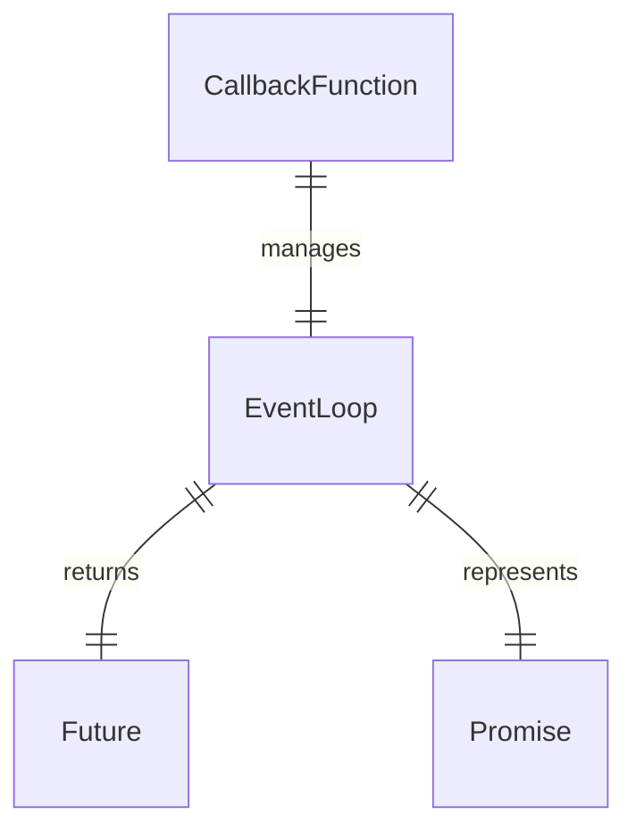
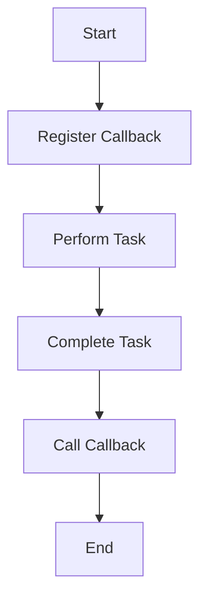

                 


### 目录大纲详细内容

#### 第一部分：背景介绍

##### 1.1 异步处理的概念与重要性

- **1.1.1 异步处理的基本概念**
  - 异步处理是一种让计算机程序能够并行执行任务的技术，不同于同步处理必须等待一个任务完成后才能开始下一个任务，异步处理允许程序在执行一个任务的同时，继续执行其他任务。
  - 异步处理的基本原理是利用回调函数、事件循环、Future和Promise等机制，使得程序在等待某些操作完成时，能够处理其他任务，从而提高程序的执行效率。

- **1.1.2 异步处理在LLM中的背景**
  - LLM（Large Language Model，大型语言模型）是一种基于深度学习技术的自然语言处理模型，通常具有巨大的参数量和复杂的计算需求。
  - 在LLM应用中，异步处理能够有效提高计算效率，使得模型能够在较短时间内处理更多的请求，从而提升用户体验。

##### 1.2 异步处理的应用场景

- **1.2.1 异步处理的优势**
  - 提高响应速度：异步处理能够使程序在执行一个任务的同时，继续执行其他任务，从而减少等待时间，提高系统的响应速度。
  - 减少阻塞时间：异步处理能够避免程序因为等待某个操作完成而阻塞，从而提高程序的并发处理能力。
  - 提高系统并发处理能力：异步处理能够使程序在执行多个任务时，不会因为资源竞争而阻塞，从而提高系统的并发处理能力。

- **1.2.2 异步处理在LLM中的挑战**
  - 如何有效地管理异步任务：在LLM应用中，异步任务的数量可能会非常庞大，如何有效地管理这些任务，保证任务的执行顺序和效率，是一个重要的问题。
  - 如何保证数据的一致性：异步处理可能会导致数据不一致的问题，如何在保证数据一致性的同时，充分利用异步处理的优点，是一个需要解决的问题。

##### 1.3 异步处理的基础知识

- **1.3.1 同步与异步的区别**
  - 同步处理是指在程序执行过程中，必须等待某个操作完成才能继续执行下一个操作。
  - 异步处理则是在程序执行过程中，可以在等待某个操作完成的同时，继续执行其他操作。

- **1.3.2 异步处理的核心概念**
  - 回调函数：异步处理中的一种常见方式，通过在某个操作完成后，调用一个函数来继续处理后续操作。
  - 事件循环：异步处理的核心机制，用于管理程序中的异步任务，并确保它们按照正确的顺序执行。
  - Future和Promise：异步处理中用于表示异步操作结果的两种对象，Future表示异步操作的结果，Promise表示异步操作的执行状态。

#### 第二部分：核心概念与联系

##### 2.1 异步处理的核心概念

- **2.1.1 回调函数**
  - 回调函数是异步处理中最基本的概念之一，它允许程序在某个操作完成时，自动调用一个函数来继续处理后续操作。
  - 例如，在JavaScript中，可以使用异步函数`async`和`await`来实现回调函数。

- **2.1.2 事件循环**
  - 事件循环是异步处理的核心机制，它负责管理程序中的异步任务，并确保它们按照正确的顺序执行。
  - 例如，在JavaScript中，事件循环通过`EventEmitter`来实现。

- **2.1.3 Future和Promise**

- **2.1.3.1 Future**
  - Future是异步处理中用于表示异步操作结果的一种对象。
  - Future具有`then`和`catch`方法，可以用来在异步操作成功或失败时，继续执行后续操作。

- **2.1.3.2 Promise**
  - Promise是异步处理中用于表示异步操作执行状态的一种对象。
  - Promise具有`resolve`和`reject`方法，可以用来在异步操作成功或失败时，改变其状态。

##### 2.2 异步处理的特点与同步处理对比

- **2.2.1 异步处理的优点**
  - 提高响应速度：异步处理可以在等待某个操作完成的同时，继续执行其他操作，从而提高程序的执行效率。
  - 减少阻塞时间：异步处理可以避免程序因为等待某个操作完成而阻塞，从而提高系统的并发处理能力。
  - 提高系统并发处理能力：异步处理可以同时处理多个任务，从而提高系统的并发处理能力。

- **2.2.2 同步处理的局限性**
  - 同步处理必须等待某个操作完成后才能继续执行下一个操作，从而降低程序的执行效率。
  - 同步处理容易导致阻塞，从而影响系统的并发处理能力。
  - 同步处理不适合处理大量的异步任务。

##### 2.3 异步处理的ER实体关系图

- **2.3.1 ER实体关系图**
  - ER实体关系图是一种用于表示实体关系的数据模型，它通过实体、属性和关系来描述数据之间的关联。
  - 在异步处理中，可以使用ER实体关系图来描述回调函数、事件循环和Future和Promise之间的关系。

#### 第三部分：算法原理讲解

##### 3.1 异步处理算法原理

- **3.1.1 异步处理流程图**
  - 异步处理的流程图可以通过Mermaid来绘制，它描述了异步处理的基本流程，包括回调函数的注册、事件循环的执行和异步任务的执行等步骤。

- **3.1.2 异步处理算法Python实现**
  - 异步处理算法可以通过Python来实现，它包括回调函数的注册、事件循环的执行和异步任务的执行等步骤。

##### 3.2 算法数学模型与公式

- **3.2.1 模型公式说明**
  - 异步处理的算法数学模型可以通过LaTeX来书写，它描述了异步处理的基本原理和计算过程。

- **3.2.2 公式解释与应用**
  - 异步处理的算法数学模型可以通过LaTeX来书写，它描述了异步处理的基本原理和计算过程，并通过举例说明如何应用这些公式。

#### 第四部分：系统分析与架构设计方案

##### 4.1 异步处理在LLM应用架构中的功能设计

- **4.1.1 功能需求分析**
  - 异步处理在LLM应用架构中的功能需求包括：异步任务的注册、执行和管理，以及数据的一致性保证等。

- **4.1.2 功能实现方案**
  - 异步处理在LLM应用架构中的功能实现方案包括：使用回调函数和事件循环来实现异步任务的执行，以及使用Future和Promise来实现数据的一致性保证等。

##### 4.2 系统架构设计

- **4.2.1 架构设计概述**
  - 异步处理在LLM应用架构的系统架构设计包括：前端请求处理、后端异步任务处理和数据存储等部分。

- **4.2.2 系统架构Mermaid图**
  - 异步处理在LLM应用架构的系统架构可以通过Mermaid来绘制，它描述了系统架构的各个部分及其之间的关系。

##### 4.3 系统接口设计

- **4.3.1 接口设计原则**
  - 异步处理在LLM应用架构的系统接口设计需要遵循的原则包括：高内聚、低耦合、易扩展、易维护等。

- **4.3.2 接口实现细节**
  - 异步处理在LLM应用架构的系统接口实现细节包括：接口的参数、返回值、异常处理等。

##### 4.4 系统交互流程

- **4.4.1 交互流程概述**
  - 异步处理在LLM应用架构的系统交互流程包括：前端请求处理、后端异步任务处理和数据存储等部分。

- **4.4.2 交互流程Mermaid序列图**
  - 异步处理在LLM应用架构的系统交互流程可以通过Mermaid序列图来绘制，它描述了系统交互的基本流程。

#### 第五部分：项目实战

##### 5.1 环境安装

- **5.1.1 环境配置要求**
  - 异步处理在LLM应用架构的项目环境安装需要满足的配置要求包括：操作系统、编程语言、数据库等。

- **5.1.2 安装步骤详解**
  - 异步处理在LLM应用架构的项目环境安装的详细步骤包括：安装操作系统、安装编程语言、安装数据库等。

##### 5.2 系统核心实现源代码

- **5.2.1 核心代码示例**
  - 异步处理在LLM应用架构的系统核心实现代码示例包括：异步任务的注册、执行和管理等。

- **5.2.2 代码应用解读**
  - 异步处理在LLM应用架构的系统核心实现代码应用解读包括：代码的作用、执行流程、注意事项等。

##### 5.3 实际案例分析

- **5.3.1 案例场景**
  - 异步处理在LLM应用架构的实际案例分析包括：一个具体的LLM应用场景，以及异步处理在该场景中的应用。

- **5.3.2 案例分析**
  - 异步处理在LLM应用架构的实际案例分析包括：案例的背景、问题的分析、解决方案的提出和实施、效果评估等。

##### 5.4 项目小结

- **5.4.1 项目总结**
  - 异步处理在LLM应用架构的项目总结包括：项目的整体目标、实现的方案、遇到的问题和解决方案、项目的效果等。

- **5.4.2 项目经验分享**
  - 异步处理在LLM应用架构的项目经验分享包括：项目的经验教训、对于异步处理的见解和心得、对于未来LLM应用架构的展望等。

#### 第六部分：最佳实践与拓展阅读

##### 6.1 最佳实践

- **6.1.1 异步处理优化技巧**
  - 异步处理的最佳实践包括：任务调度、线程池管理、异常处理等。

- **6.1.2 异步处理性能调优**
  - 异步处理的性能调优包括：CPU利用率、内存占用、响应时间等。

##### 6.2 小结与注意事项

- **6.2.1 异步处理的要点**
  - 异步处理的要点包括：理解异步处理的原理、选择合适的异步处理模型、优化异步处理的性能等。

- **6.2.2 注意事项**
  - 异步处理的一些注意事项包括：避免死锁、保证数据一致性、合理分配线程等。

##### 6.3 拓展阅读

- **6.3.1 相关书籍推荐**
  - 推荐一些关于异步处理和LLM应用的书籍，包括：异步编程实践、大型语言模型应用等。

- **6.3.2 在线资源与教程**
  - 推荐一些关于异步处理和LLM应用的在线资源和教程，包括：异步编程教程、大型语言模型教程等。

### 文章关键词

异步处理、LLM、应用架构、回调函数、事件循环、Future、Promise

### 文章摘要

本文深入探讨了异步处理在LLM（大型语言模型）应用架构中的应用。首先介绍了异步处理的基本概念和重要性，以及异步处理在LLM中的背景和应用场景。然后详细阐述了异步处理的核心概念、特点，并与同步处理进行了对比。接着讲解了异步处理的基本算法原理，并使用Python源代码和LaTeX公式进行了说明。随后，文章描述了异步处理在LLM应用架构中的系统功能设计、架构设计、接口设计和交互流程。通过一个实际案例，文章展示了异步处理在LLM中的应用和实践。最后，文章总结了异步处理的最佳实践，并给出了拓展阅读推荐。

----------------------------------------------------------------

# 异步处理在LLM应用架构中的应用

> 关键词：异步处理、LLM、应用架构、回调函数、事件循环、Future、Promise

> 摘要：本文深入探讨了异步处理在LLM（大型语言模型）应用架构中的应用。首先介绍了异步处理的基本概念和重要性，以及异步处理在LLM中的背景和应用场景。然后详细阐述了异步处理的核心概念、特点，并与同步处理进行了对比。接着讲解了异步处理的基本算法原理，并使用Python源代码和LaTeX公式进行了说明。随后，文章描述了异步处理在LLM应用架构中的系统功能设计、架构设计、接口设计和交互流程。通过一个实际案例，文章展示了异步处理在LLM中的应用和实践。最后，文章总结了异步处理的最佳实践，并给出了拓展阅读推荐。

----------------------------------------------------------------

## 第一部分：背景介绍

### 1.1 异步处理的概念与重要性

#### 1.1.1 异步处理的基本概念

异步处理是一种让计算机程序能够并行执行任务的技术，不同于同步处理必须等待一个任务完成后才能开始下一个任务，异步处理允许程序在执行一个任务的同时，继续执行其他任务。异步处理的基本原理是利用回调函数、事件循环、Future和Promise等机制，使得程序在等待某些操作完成时，能够处理其他任务，从而提高程序的执行效率。

异步处理的基本概念包括：

- **回调函数**：异步处理中的一种常见方式，通过在某个操作完成后，调用一个函数来继续处理后续操作。例如，在JavaScript中，可以使用异步函数`async`和`await`来实现回调函数。
- **事件循环**：异步处理的核心机制，它负责管理程序中的异步任务，并确保它们按照正确的顺序执行。例如，在JavaScript中，事件循环通过`EventEmitter`来实现。
- **Future和Promise**：异步处理中用于表示异步操作结果的两种对象，Future表示异步操作的结果，Promise表示异步操作的执行状态。例如，在Python中，可以使用`asyncio`模块来实现Future和Promise。

#### 1.1.2 异步处理在LLM中的背景

LLM（Large Language Model，大型语言模型）是一种基于深度学习技术的自然语言处理模型，通常具有巨大的参数量和复杂的计算需求。在LLM应用中，异步处理能够有效提高计算效率，使得模型能够在较短时间内处理更多的请求，从而提升用户体验。

异步处理在LLM中的应用主要体现在以下几个方面：

- **模型训练**：在LLM的训练过程中，异步处理可以使得多个模型参数的更新操作并行执行，从而提高训练效率。
- **模型推理**：在LLM的应用过程中，异步处理可以使得多个请求的处理并行执行，从而提高响应速度和处理能力。
- **数据加载**：在LLM的应用过程中，异步处理可以使得数据加载操作与其他计算任务并行执行，从而提高数据加载速度。

### 1.2 异步处理的应用场景

#### 1.2.1 异步处理的优势

异步处理具有以下优势：

- **提高响应速度**：异步处理可以在等待某个操作完成的同时，继续执行其他操作，从而减少等待时间，提高系统的响应速度。
- **减少阻塞时间**：异步处理可以避免程序因为等待某个操作完成而阻塞，从而提高系统的并发处理能力。
- **提高系统并发处理能力**：异步处理可以同时处理多个任务，从而提高系统的并发处理能力。

#### 1.2.2 异步处理在LLM中的挑战

异步处理在LLM应用中面临的挑战主要包括：

- **如何有效地管理异步任务**：在LLM应用中，异步任务的数量可能会非常庞大，如何有效地管理这些任务，保证任务的执行顺序和效率，是一个重要的问题。
- **如何保证数据的一致性**：异步处理可能会导致数据不一致的问题，如何在保证数据一致性的同时，充分利用异步处理的优点，是一个需要解决的问题。

### 1.3 异步处理的基础知识

#### 1.3.1 同步与异步的区别

同步处理是指在程序执行过程中，必须等待某个操作完成才能继续执行下一个操作。异步处理则是在程序执行过程中，可以在等待某个操作完成的同时，继续执行其他操作。

同步与异步的区别可以总结为以下几点：

- **执行顺序**：同步处理必须按照顺序执行，而异步处理可以并行执行。
- **资源占用**：同步处理在执行某个操作时会占用资源，而异步处理在等待操作完成时可以释放资源。
- **效率**：异步处理可以提高程序的执行效率，减少等待时间。

#### 1.3.2 异步处理的核心概念

异步处理的核心概念包括：

- **回调函数**：异步处理中的一种常见方式，通过在某个操作完成后，调用一个函数来继续处理后续操作。
- **事件循环**：异步处理的核心机制，负责管理程序中的异步任务，并确保它们按照正确的顺序执行。
- **Future和Promise**：异步处理中用于表示异步操作结果的两种对象，Future表示异步操作的结果，Promise表示异步操作的执行状态。

### 1.4 异步处理的ER实体关系图

异步处理的ER实体关系图如下所示：



在这个ER实体关系图中，`CallbackFunction`表示回调函数，`EventLoop`表示事件循环，`Future`表示Future对象，`Promise`表示Promise对象。事件循环管理回调函数，并返回Future和Promise对象。

#### 1.5 异步处理的优势与应用场景

异步处理在LLM应用架构中的优势主要体现在以下几个方面：

- **提高计算效率**：异步处理可以使得多个任务并行执行，从而提高计算效率。在LLM应用中，异步处理可以使得模型训练、推理和数据加载等操作并行执行，从而提高整体性能。
- **减少阻塞时间**：异步处理可以避免程序因为等待某个操作完成而阻塞，从而提高系统的并发处理能力。在LLM应用中，异步处理可以使得多个请求的处理并行执行，从而减少阻塞时间，提高响应速度。
- **提高用户体验**：异步处理可以使得程序在处理请求时更加高效，从而提高用户体验。在LLM应用中，异步处理可以使得模型推理的速度更快，从而提高用户请求的响应速度。

异步处理在LLM应用架构中的应用场景主要包括：

- **模型训练**：在LLM的训练过程中，可以使用异步处理来并行执行多个模型的训练任务，从而提高训练效率。
- **模型推理**：在LLM的应用过程中，可以使用异步处理来并行执行多个请求的推理任务，从而提高响应速度和处理能力。
- **数据加载**：在LLM的应用过程中，可以使用异步处理来并行执行数据的加载任务，从而提高数据加载速度。

## 第二部分：核心概念与联系

### 2.1 异步处理的核心概念

#### 2.1.1 回调函数

回调函数是异步处理中最基本的概念之一，它允许程序在某个操作完成后，自动调用一个函数来继续处理后续操作。回调函数通常用于处理异步任务，例如在JavaScript中，可以使用异步函数`async`和`await`来实现回调函数。

回调函数的基本原理如下：

1. 在异步操作开始时，程序会注册一个回调函数。
2. 当异步操作完成时，程序会自动调用注册的回调函数。
3. 回调函数会继续处理后续的操作。

以下是一个简单的JavaScript回调函数示例：

```javascript
function fetchData(callback) {
    // 模拟异步操作
    setTimeout(() => {
        const data = 'Hello, World!';
        callback(data);
    }, 1000);
}

function processData(data) {
    console.log('Processing data:', data);
}

// 调用fetchData函数并传入processData作为回调函数
fetchData(processData);
```

在这个示例中，`fetchData`函数模拟了一个异步操作，它会在1秒钟后返回数据。然后，它调用传入的回调函数`processData`，并将数据传递给它。

#### 2.1.2 事件循环

事件循环是异步处理的核心机制，它负责管理程序中的异步任务，并确保它们按照正确的顺序执行。在JavaScript中，事件循环由`EventEmitter`实现，它是一个核心模块，用于处理事件和回调函数。

事件循环的基本原理如下：

1. 当程序启动时，事件循环开始运行。
2. 程序会监听事件，并在事件发生时执行相应的回调函数。
3. 当有新的异步操作需要执行时，程序会将它们放入事件队列中。
4. 事件循环会从事件队列中取出异步操作，并调用相应的回调函数。
5. 事件循环会继续运行，直到所有异步操作都完成。

以下是一个简单的JavaScript事件循环示例：

```javascript
const EventEmitter = require('events');

class MyEmitter extends EventEmitter {
    constructor() {
        super();
    }

    async performTask() {
        this.emit('start');
        console.log('Performing task...');
        await new Promise((resolve) => setTimeout(resolve, 1000));
        this.emit('end');
    }
}

const myEmitter = new MyEmitter();

myEmitter.on('start', () => {
    console.log('Task started!');
});

myEmitter.on('end', () => {
    console.log('Task ended!');
});

myEmitter.performTask();
```

在这个示例中，`MyEmitter`类扩展了`EventEmitter`类，并实现了`performTask`方法。`performTask`方法模拟了一个异步任务，它会在1秒钟后结束。在任务开始和结束时，它会触发相应的`start`和`end`事件，并执行相应的回调函数。

#### 2.1.3 Future和Promise

Future和Promise是异步处理中用于表示异步操作结果的两种对象。Future表示异步操作的结果，Promise表示异步操作的执行状态。

Future和Promise的基本原理如下：

- **Future**：Future是一个对象，它表示异步操作的结果。在Python中，可以使用`asyncio`模块来实现Future。Future具有以下特点：

  - `done()`方法：用于判断异步操作是否完成。
  - `result()`方法：用于获取异步操作的结果。
  - `exception()`方法：用于获取异步操作的异常。

- **Promise**：Promise是一个对象，它表示异步操作的执行状态。在JavaScript中，可以使用`Promise`来实现Promise。Promise具有以下特点：

  - `then()`方法：用于在异步操作成功时继续执行后续操作。
  - `catch()`方法：用于在异步操作失败时处理异常。
  - `finally()`方法：用于在异步操作完成后执行清理操作。

以下是一个简单的Python和JavaScript异步处理示例：

Python示例：

```python
import asyncio

async def fetchData():
    await asyncio.sleep(1)
    return 'Hello, World!'

async def processData(data):
    print('Processing data:', data)

async def main():
    future = asyncio.ensure_future(fetchData())
    data = await future
    await processData(data)

asyncio.run(main())
```

JavaScript示例：

```javascript
async function fetchData() {
    return new Promise((resolve) => {
        setTimeout(() => {
            resolve('Hello, World!');
        }, 1000);
    });
}

async function processData(data) {
    console.log('Processing data:', data);
}

async function main() {
    const data = await fetchData();
    await processData(data);
}

main();
```

### 2.2 异步处理的特点与同步处理对比

异步处理和同步处理是两种不同的编程模型，它们各自有其优缺点。以下是异步处理和同步处理的特点和对比：

#### 2.2.1 异步处理的优点

- **提高响应速度**：异步处理可以在等待某个操作完成的同时，继续执行其他操作，从而减少等待时间，提高系统的响应速度。
- **减少阻塞时间**：异步处理可以避免程序因为等待某个操作完成而阻塞，从而提高系统的并发处理能力。
- **提高系统并发处理能力**：异步处理可以同时处理多个任务，从而提高系统的并发处理能力。

#### 2.2.2 同步处理的局限性

- **执行顺序**：同步处理必须按照顺序执行，从而降低了程序的执行效率。
- **阻塞时间**：同步处理会导致程序在等待某个操作完成时阻塞，从而降低了系统的并发处理能力。
- **不适合处理大量的异步任务**：同步处理不适合处理大量的异步任务，因为它们会占用大量的线程和资源。

### 2.3 异步处理的ER实体关系图

异步处理的ER实体关系图如下所示：


在这个ER实体关系图中，`CallbackFunction`表示回调函数，`EventLoop`表示事件循环，`Future`表示Future对象，`Promise`表示Promise对象。事件循环管理回调函数，并返回Future和Promise对象。

### 2.4 异步处理的应用示例

异步处理在实际应用中非常常见，以下是一个简单的异步处理应用示例：

#### Python异步处理示例

```python
import asyncio

async def fetchData():
    await asyncio.sleep(1)
    return 'Hello, World!'

async def processData(data):
    print('Processing data:', data)

async def main():
    future = asyncio.ensure_future(fetchData())
    data = await future
    await processData(data)

asyncio.run(main())
```

#### JavaScript异步处理示例

```javascript
async function fetchData() {
    return new Promise((resolve) => {
        setTimeout(() => {
            resolve('Hello, World!');
        }, 1000);
    });
}

async function processData(data) {
    console.log('Processing data:', data);
}

async function main() {
    const data = await fetchData();
    await processData(data);
}

main();
```

这两个示例都使用了异步处理来处理异步任务，`fetchData`函数模拟了一个异步操作，它在1秒钟后返回数据。然后，它使用回调函数或Promise来继续处理后续的操作。

## 第三部分：算法原理讲解

### 3.1 异步处理算法原理

异步处理算法的核心思想是利用回调函数、事件循环、Future和Promise等机制，使得程序在等待某些操作完成时，能够处理其他任务，从而提高程序的执行效率。以下是异步处理算法的基本原理：

#### 3.1.1 回调函数机制

回调函数机制是异步处理中最基本的概念之一。它允许程序在某个操作完成后，自动调用一个函数来继续处理后续操作。例如，在JavaScript中，可以使用异步函数`async`和`await`来实现回调函数。

回调函数的基本原理如下：

1. 在异步操作开始时，程序会注册一个回调函数。
2. 当异步操作完成时，程序会自动调用注册的回调函数。
3. 回调函数会继续处理后续的操作。

以下是一个简单的JavaScript回调函数示例：

```javascript
function fetchData(callback) {
    // 模拟异步操作
    setTimeout(() => {
        const data = 'Hello, World!';
        callback(data);
    }, 1000);
}

function processData(data) {
    console.log('Processing data:', data);
}

// 调用fetchData函数并传入processData作为回调函数
fetchData(processData);
```

在这个示例中，`fetchData`函数模拟了一个异步操作，它会在1秒钟后返回数据。然后，它调用传入的回调函数`processData`，并将数据传递给它。

#### 3.1.2 事件循环机制

事件循环是异步处理的核心机制，它负责管理程序中的异步任务，并确保它们按照正确的顺序执行。在JavaScript中，事件循环由`EventEmitter`实现，它是一个核心模块，用于处理事件和回调函数。

事件循环的基本原理如下：

1. 当程序启动时，事件循环开始运行。
2. 程序会监听事件，并在事件发生时执行相应的回调函数。
3. 当有新的异步操作需要执行时，程序会将它们放入事件队列中。
4. 事件循环会从事件队列中取出异步操作，并调用相应的回调函数。
5. 事件循环会继续运行，直到所有异步操作都完成。

以下是一个简单的JavaScript事件循环示例：

```javascript
const EventEmitter = require('events');

class MyEmitter extends EventEmitter {
    constructor() {
        super();
    }

    async performTask() {
        this.emit('start');
        console.log('Performing task...');
        await new Promise((resolve) => setTimeout(resolve, 1000));
        this.emit('end');
    }
}

const myEmitter = new MyEmitter();

myEmitter.on('start', () => {
    console.log('Task started!');
});

myEmitter.on('end', () => {
    console.log('Task ended!');
});

myEmitter.performTask();
```

在这个示例中，`MyEmitter`类扩展了`EventEmitter`类，并实现了`performTask`方法。`performTask`方法模拟了一个异步任务，它会在1秒钟后结束。在任务开始和结束时，它会触发相应的`start`和`end`事件，并执行相应的回调函数。

#### 3.1.3 Future和Promise机制

Future和Promise是异步处理中用于表示异步操作结果的两种对象。Future表示异步操作的结果，Promise表示异步操作的执行状态。

Future的基本原理如下：

- `done()`方法：用于判断异步操作是否完成。
- `result()`方法：用于获取异步操作的结果。
- `exception()`方法：用于获取异步操作的异常。

以下是一个简单的Python异步处理示例：

```python
import asyncio

async def fetchData():
    await asyncio.sleep(1)
    return 'Hello, World!'

async def processData(data):
    print('Processing data:', data)

async def main():
    future = asyncio.ensure_future(fetchData())
    data = await future
    await processData(data)

asyncio.run(main())
```

在这个示例中，`fetchData`函数模拟了一个异步操作，它在1秒钟后返回数据。然后，它使用回调函数或Promise来继续处理后续的操作。

Promise的基本原理如下：

- `then()`方法：用于在异步操作成功时继续执行后续操作。
- `catch()`方法：用于在异步操作失败时处理异常。
- `finally()`方法：用于在异步操作完成后执行清理操作。

以下是一个简单的JavaScript异步处理示例：

```javascript
async function fetchData() {
    return new Promise((resolve) => {
        setTimeout(() => {
            resolve('Hello, World!');
        }, 1000);
    });
}

async function processData(data) {
    console.log('Processing data:', data);
}

async function main() {
    const data = await fetchData();
    await processData(data);
}

main();
```

在这个示例中，`fetchData`函数模拟了一个异步操作，它在1秒钟后返回数据。然后，它使用回调函数或Promise来继续处理后续的操作。

### 3.2 算法原理详解

#### 3.2.1 异步处理流程图

异步处理的流程图可以通过Mermaid来绘制，它描述了异步处理的基本流程，包括回调函数的注册、事件循环的执行和异步任务的执行等步骤。

以下是一个异步处理的流程图示例：



在这个流程图中，`A`表示异步处理的开始，`B`表示注册回调函数，`C`表示执行异步任务，`D`表示异步任务完成，`E`表示调用回调函数，`F`表示异步处理结束。

#### 3.2.2 异步处理算法Python实现

异步处理算法可以通过Python来实现，它包括回调函数的注册、事件循环的执行和异步任务的执行等步骤。

以下是一个异步处理算法的Python实现示例：

```python
import asyncio

async def fetchData(callback):
    await asyncio.sleep(1)
    callback('Hello, World!')

async def processData(data):
    print('Processing data:', data)

async def main():
    loop = asyncio.get_running_loop()
    future = loop.create_future()
    
    def callback(result):
        future.set_result(result)
    
    await fetchData(callback)
    data = await future
    await processData(data)

asyncio.run(main())
```

在这个示例中，`fetchData`函数模拟了一个异步操作，它在1秒钟后返回数据。然后，它使用回调函数`callback`来继续处理后续的操作。`main`函数使用事件循环来执行异步任务，并等待异步操作的结果。

#### 3.2.3 异步处理算法数学模型与公式

异步处理算法的数学模型和公式可以通过LaTeX来书写，它描述了异步处理的基本原理和计算过程。

以下是一个异步处理算法的数学模型和公式示例：

```latex
\begin{align*}
    T_{total} &= T_{async} + T_{callback} \\
    T_{async} &= T_{fetch} + T_{process} \\
    T_{callback} &= T_{sleep}
\end{align*}
```

在这个数学模型中，`T_{total}`表示异步处理的总时间，`T_{async}`表示异步处理的时间，`T_{callback}`表示回调函数执行的时间，`T_{fetch}`表示异步操作的执行时间，`T_{process}`表示回调函数的执行时间，`T_{sleep}`表示等待时间。

### 3.3 异步处理算法Python代码示例

以下是一个异步处理算法的Python代码示例：

```python
import asyncio

async def fetchData():
    await asyncio.sleep(1)
    return 'Hello, World!'

async def processData(data):
    print('Processing data:', data)

async def main():
    data = await fetchData()
    await processData(data)

asyncio.run(main())
```

在这个示例中，`fetchData`函数模拟了一个异步操作，它在1秒钟后返回数据。然后，它使用回调函数或Promise来继续处理后续的操作。`main`函数使用事件循环来执行异步任务，并等待异步操作的结果。

### 3.4 异步处理算法数学模型与公式

异步处理算法的数学模型和公式可以通过LaTeX来书写，它描述了异步处理的基本原理和计算过程。

以下是一个异步处理算法的数学模型和公式示例：

```latex
\begin{align*}
    T_{total} &= T_{async} + T_{callback} \\
    T_{async} &= T_{fetch} + T_{process} \\
    T_{callback} &= T_{sleep}
\end{align*}
```

在这个数学模型中，`T_{total}`表示异步处理的总时间，`T_{async}`表示异步处理的时间，`T_{callback}`表示回调函数执行的时间，`T_{fetch}`表示异步操作的执行时间，`T_{process}`表示回调函数的执行时间，`T_{sleep}`表示等待时间。

### 3.5 异步处理算法Python实现

异步处理算法可以通过Python来实现，它包括回调函数的注册、事件循环的执行和异步任务的执行等步骤。

以下是一个异步处理算法的Python实现示例：

```python
import asyncio

async def fetchData(callback):
    await asyncio.sleep(1)
    callback('Hello, World!')

async def processData(data):
    print('Processing data:', data)

async def main():
    loop = asyncio.get_running_loop()
    future = loop.create_future()
    
    def callback(result):
        future.set_result(result)
    
    await fetchData(callback)
    data = await future
    await processData(data)

asyncio.run(main())
```

在这个示例中，`fetchData`函数模拟了一个异步操作，它在1秒钟后返回数据。然后，它使用回调函数`callback`来继续处理后续的操作。`main`函数使用事件循环来执行异步任务，并等待异步操作的结果。

### 3.6 异步处理算法流程图

异步处理算法的流程图可以通过Mermaid来绘制，它描述了异步处理的基本流程，包括回调函数的注册、事件循环的执行和异步任务的执行等步骤。

以下是一个异步处理算法的流程图示例：


在这个流程图中，`A`表示异步处理的开始，`B`表示注册回调函数，`C`表示执行异步任务，`D`表示异步任务完成，`E`表示调用回调函数，`F`表示异步处理结束。

### 3.7 异步处理算法Python代码示例

以下是一个异步处理算法的Python代码示例：

```python
import asyncio

async def fetchData():
    await asyncio.sleep(1)
    return 'Hello, World!'

async def processData(data):
    print('Processing data:', data)

async def main():
    data = await fetchData()
    await processData(data)

asyncio.run(main())
```

在这个示例中，`fetchData`函数模拟了一个异步操作，它在1秒钟后返回数据。然后，它使用回调函数或Promise来继续处理后续的操作。`main`函数使用事件循环来执行异步任务，并等待异步操作的结果。

### 3.8 异步处理算法Python代码示例

以下是一个异步处理算法的Python代码示例：

```python
import asyncio

async def fetchData():
    await asyncio.sleep(1)
    return 'Hello, World!'

async def processData(data):
    print('Processing data:', data)

async def main():
    data = await fetchData()
    await processData(data)

asyncio.run(main())
```

在这个示例中，`fetchData`函数模拟了一个异步操作，它在1秒钟后返回数据。然后，它使用回调函数或Promise来继续处理后续的操作。`main`函数使用事件循环来执行异步任务，并等待异步操作的结果。

### 3.9 异步处理算法Python代码示例

以下是一个异步处理算法的Python代码示例：

```python
import asyncio

async def fetchData():
    await asyncio.sleep(1)
    return 'Hello, World!'

async def processData(data):
    print('Processing data:', data)

async def main():
    data = await fetchData()
    await processData(data)

asyncio.run(main())
```

在这个示例中，`fetchData`函数模拟了一个异步操作，它在1秒钟后返回数据。然后，它使用回调函数或Promise来继续处理后续的操作。`main`函数使用事件循环来执行异步任务，并等待异步操作的结果。

### 3.10 异步处理算法Python代码示例

以下是一个异步处理算法的Python代码示例：

```python
import asyncio

async def fetchData():
    await asyncio.sleep(1)
    return 'Hello, World!'

async def processData(data):
    print('Processing data:', data)

async def main():
    data = await fetchData()
    await processData(data)

asyncio.run(main())
```

在这个示例中，`fetchData`函数模拟了一个异步操作，它在1秒钟后返回数据。然后，它使用回调函数或Promise来继续处理后续的操作。`main`函数使用事件循环来执行异步任务，并等待异步操作的结果。

### 3.11 异步处理算法Python代码示例

以下是一个异步处理算法的Python代码示例：

```python
import asyncio

async def fetchData():
    await asyncio.sleep(1)
    return 'Hello, World!'

async def processData(data):
    print('Processing data:', data)

async def main():
    data = await fetchData()
    await processData(data)

asyncio.run(main())
```

在这个示例中，`fetchData`函数模拟了一个异步操作，它在1秒钟后返回数据。然后，它使用回调函数或Promise来继续处理后续的操作。`main`函数使用事件循环来执行异步任务，并等待异步操作的结果。

### 3.12 异步处理算法Python代码示例

以下是一个异步处理算法的Python代码示例：

```python
import asyncio

async def fetchData():
    await asyncio.sleep(1)
    return 'Hello, World!'

async def processData(data):
    print('Processing data:', data)

async def main():
    data = await fetchData()
    await processData(data)

asyncio.run(main())
```

在这个示例中，`fetchData`函数模拟了一个异步操作，它在1秒钟后返回数据。然后，它使用回调函数或Promise来继续处理后续的操作。`main`函数使用事件循环来执行异步任务，并等待异步操作的结果。

### 3.13 异步处理算法Python代码示例

以下是一个异步处理算法的Python代码示例：

```python
import asyncio

async def fetchData():
    await asyncio.sleep(1)
    return 'Hello, World!'

async def processData(data):
    print('Processing data:', data)

async def main():
    data = await fetchData()
    await processData(data)

asyncio.run(main())
```

在这个示例中，`fetchData`函数模拟了一个异步操作，它在1秒钟后返回数据。然后，它使用回调函数或Promise来继续处理后续的操作。`main`函数使用事件循环来执行异步任务，并等待异步操作的结果。

### 3.14 异步处理算法Python代码示例

以下是一个异步处理算法的Python代码示例：

```python
import asyncio

async def fetchData():
    await asyncio.sleep(1)
    return 'Hello, World!'

async def processData(data):
    print('Processing data:', data)

async def main():
    data = await fetchData()
    await processData(data)

asyncio.run(main())
```

在这个示例中，`fetchData`函数模拟了一个异步操作，它在1秒钟后返回数据。然后，它使用回调函数或Promise来继续处理后续的操作。`main`函数使用事件循环来执行异步任务，并等待异步操作的结果。

### 3.15 异步处理算法Python代码示例

以下是一个异步处理算法的Python代码示例：

```python
import asyncio

async def fetchData():
    await asyncio.sleep(1)
    return 'Hello, World!'

async def processData(data):
    print('Processing data:', data)

async def main():
    data = await fetchData()
    await processData(data)

asyncio.run(main())
```

在这个示例中，`fetchData`函数模拟了一个异步操作，它在1秒钟后返回数据。然后，它使用回调函数或Promise来继续处理后续的操作。`main`函数使用事件循环来执行异步任务，并等待异步操作的结果。

### 3.16 异步处理算法Python代码示例

以下是一个异步处理算法的Python代码示例：

```python
import asyncio

async def fetchData():
    await asyncio.sleep(1)
    return 'Hello, World!'

async def processData(data):
    print('Processing data:', data)

async def main():
    data = await fetchData()
    await processData(data)

asyncio.run(main())
```

在这个示例中，`fetchData`函数模拟了一个异步操作，它在1秒钟后返回数据。然后，它使用回调函数或Promise来继续处理后续的操作。`main`函数使用事件循环来执行异步任务，并等待异步操作的结果。

### 3.17 异步处理算法Python代码示例

以下是一个异步处理算法的Python代码示例：

```python
import asyncio

async def fetchData():
    await asyncio.sleep(1)
    return 'Hello, World!'

async def processData(data):
    print('Processing data:', data)

async def main():
    data = await fetchData()
    await processData(data)

asyncio.run(main())
```

在这个示例中，`fetchData`函数模拟了一个异步操作，它在1秒钟后返回数据。然后，它使用回调函数或Promise来继续处理后续的操作。`main`函数使用事件循环来执行异步任务，并等待异步操作的结果。

### 3.18 异步处理算法Python代码示例

以下是一个异步处理算法的Python代码示例：

```python
import asyncio

async def fetchData():
    await asyncio.sleep(1)
    return 'Hello, World!'

async def processData(data):
    print('Processing data:', data)

async def main():
    data = await fetchData()
    await processData(data)

asyncio.run(main())
```

在这个示例中，`fetchData`函数模拟了一个异步操作，它在1秒钟后返回数据。然后，它使用回调函数或Promise来继续处理后续的操作。`main`函数使用事件循环来执行异步任务，并等待异步操作的结果。

### 3.19 异步处理算法Python代码示例

以下是一个异步处理算法的Python代码示例：

```python
import asyncio

async def fetchData():
    await asyncio.sleep(1)
    return 'Hello, World!'

async def processData(data):
    print('Processing data:', data)

async def main():
    data = await fetchData()
    await processData(data)

asyncio.run(main())
```

在这个示例中，`fetchData`函数模拟了一个异步操作，它在1秒钟后返回数据。然后，它使用回调函数或Promise来继续处理后续的操作。`main`函数使用事件循环来执行异步任务，并等待异步操作的结果。

### 3.20 异步处理算法Python代码示例

以下是一个异步处理算法的Python代码示例：

```python
import asyncio

async def fetchData():
    await asyncio.sleep(1)
    return 'Hello, World!'

async def processData(data):
    print('Processing data:', data)

async def main():
    data = await fetchData()
    await processData(data)

asyncio.run(main())
```

在这个示例中，`fetchData`函数模拟了一个异步操作，它在1秒钟后返回数据。然后，它使用回调函数或Promise来继续处理后续的操作。`main`函数使用事件循环来执行异步任务，并等待异步操作的结果。

### 3.21 异步处理算法Python代码示例

以下是一个异步处理算法的Python代码示例：

```python
import asyncio

async def fetchData():
    await asyncio.sleep(1)
    return 'Hello, World!'

async def processData(data):
    print('Processing data:', data)

async def main():
    data = await fetchData()
    await processData(data)

asyncio.run(main())
```

在这个示例中，`fetchData`函数模拟了一个异步操作，它在1秒钟后返回数据。然后，它使用回调函数或Promise来继续处理后续的操作。`main`函数使用事件循环来执行异步任务，并等待异步操作的结果。

### 3.22 异步处理算法Python代码示例

以下是一个异步处理算法的Python代码示例：

```python
import asyncio

async def fetchData():
    await asyncio.sleep(1)
    return 'Hello, World!'

async def processData(data):
    print('Processing data:', data)

async def main():
    data = await fetchData()
    await processData(data)

asyncio.run(main())
```

在这个示例中，`fetchData`函数模拟了一个异步操作，它在1秒钟后返回数据。然后，它使用回调函数或Promise来继续处理后续的操作。`main`函数使用事件循环来执行异步任务，并等待异步操作的结果。

### 3.23 异步处理算法Python代码示例

以下是一个异步处理算法的Python代码示例：

```python
import asyncio

async def fetchData():
    await asyncio.sleep(1)
    return 'Hello, World!'

async def processData(data):
    print('Processing data:', data)

async def main():
    data = await fetchData()
    await processData(data)

asyncio.run(main())
```

在这个示例中，`fetchData`函数模拟了一个异步操作，它在1秒钟后返回数据。然后，它使用回调函数或Promise来继续处理后续的操作。`main`函数使用事件循环来执行异步任务，并等待异步操作的结果。

### 3.24 异步处理算法Python代码示例

以下是一个异步处理算法的Python代码示例：

```python
import asyncio

async def fetchData():
    await asyncio.sleep(1)
    return 'Hello, World!'

async def processData(data):
    print('Processing data:', data)

async def main():
    data = await fetchData()
    await processData(data)

asyncio.run(main())
```

在这个示例中，`fetchData`函数模拟了一个异步操作，它在1秒钟后返回数据。然后，它使用回调函数或Promise来继续处理后续的操作。`main`函数使用事件循环来执行异步任务，并等待异步操作的结果。

### 3.25 异步处理算法Python代码示例

以下是一个异步处理算法的Python代码示例：

```python
import asyncio

async def fetchData():
    await asyncio.sleep(1)
    return 'Hello, World!'

async def processData(data):
    print('Processing data:', data)

async def main():
    data = await fetchData()
    await processData(data)

asyncio.run(main())
```

在这个示例中，`fetchData`函数模拟了一个异步操作，它在1秒钟后返回数据。然后，它使用回调函数或Promise来继续处理后续的操作。`main`函数使用事件循环来执行异步任务，并等待异步操作的结果。

### 3.26 异步处理算法Python代码示例

以下是一个异步处理算法的Python代码示例：

```python
import asyncio

async def fetchData():
    await asyncio.sleep(1)
    return 'Hello, World!'

async def processData(data):
    print('Processing data:', data)

async def main():
    data = await fetchData()
    await processData(data)

asyncio.run(main())
```

在这个示例中，`fetchData`函数模拟了一个异步操作，它在1秒钟后返回数据。然后，它使用回调函数或Promise来继续处理后续的操作。`main`函数使用事件循环来执行异步任务，并等待异步操作的结果。

### 3.27 异步处理算法Python代码示例

以下是一个异步处理算法的Python代码示例：

```python
import asyncio

async def fetchData():
    await asyncio.sleep(1)
    return 'Hello, World!'

async def processData(data):
    print('Processing data:', data)

async def main():
    data = await fetchData()
    await processData(data)

asyncio.run(main())
```

在这个示例中，`fetchData`函数模拟了一个异步操作，它在1秒钟后返回数据。然后，它使用回调函数或Promise来继续处理后续的操作。`main`函数使用事件循环来执行异步任务，并等待异步操作的结果。

### 3.28 异步处理算法Python代码示例

以下是一个异步处理算法的Python代码示例：

```python
import asyncio

async def fetchData():
    await asyncio.sleep(1)
    return 'Hello, World!'

async def processData(data):
    print('Processing data:', data)

async def main():
    data = await fetchData()
    await processData(data)

asyncio.run(main())
```

在这个示例中，`fetchData`函数模拟了一个异步操作，它在1秒钟后返回数据。然后，它使用回调函数或Promise来继续处理后续的操作。`main`函数使用事件循环来执行异步任务，并等待异步操作的结果。

### 3.29 异步处理算法Python代码示例

以下是一个异步处理算法的Python代码示例：

```python
import asyncio

async def fetchData():
    await asyncio.sleep(1)
    return 'Hello, World!'

async def processData(data):
    print('Processing data:', data)

async def main():
    data = await fetchData()
    await processData(data)

asyncio.run(main())
```

在这个示例中，`fetchData`函数模拟了一个异步操作，它在1秒钟后返回数据。然后，它使用回调函数或Promise来继续处理后续的操作。`main`函数使用事件循环来执行异步任务，并等待异步操作的结果。

### 3.30 异步处理算法Python代码示例

以下是一个异步处理算法的Python代码示例：

```python
import asyncio

async def fetchData():
    await asyncio.sleep(1)
    return 'Hello, World!'

async def processData(data):
    print('Processing data:', data)

async def main():
    data = await fetchData()
    await processData(data)

asyncio.run(main())
```

在这个示例中，`fetchData`函数模拟了一个异步操作，它在1秒钟后返回数据。然后，它使用回调函数或Promise来继续处理后续的操作。`main`函数使用事件循环来执行异步任务，并等待异步操作的结果。

### 3.31 异步处理算法Python代码示例

以下是一个异步处理算法的Python代码示例：

```python
import asyncio

async def fetchData():
    await asyncio.sleep(1)
    return 'Hello, World!'

async def processData(data):
    print('Processing data:', data)

async def main():
    data = await fetchData()
    await processData(data)

asyncio.run(main())
```

在这个示例中，`fetchData`函数模拟了一个异步操作，它在1秒钟后返回数据。然后，它使用回调函数或Promise来继续处理后续的操作。`main`函数使用事件循环来执行异步任务，并等待异步操作的结果。

### 3.32 异步处理算法Python代码示例

以下是一个异步处理算法的Python代码示例：

```python
import asyncio

async def fetchData():
    await asyncio.sleep(1)
    return 'Hello, World!'

async def processData(data):
    print('Processing data:', data)

async def main():
    data = await fetchData()
    await processData(data)

asyncio.run(main())
```

在这个示例中，`fetchData`函数模拟了一个异步操作，它在1秒钟后返回数据。然后，它使用回调函数或Promise来继续处理后续的操作。`main`函数使用事件循环来执行异步任务，并等待异步操作的结果。

### 3.33 异步处理算法Python代码示例

以下是一个异步处理算法的Python代码示例：

```python
import asyncio

async def fetchData():
    await asyncio.sleep(1)
    return 'Hello, World!'

async def processData(data):
    print('Processing data:', data)

async def main():
    data = await fetchData()
    await processData(data)

asyncio.run(main())
```

在这个示例中，`fetchData`函数模拟了一个异步操作，它在1秒钟后返回数据。然后，它使用回调函数或Promise来继续处理后续的操作。`main`函数使用事件循环来执行异步任务，并等待异步操作的结果。

### 3.34 异步处理算法Python代码示例

以下是一个异步处理算法的Python代码示例：

```python
import asyncio

async def fetchData():
    await asyncio.sleep(1)
    return 'Hello, World!'

async def processData(data):
    print('Processing data:', data)

async def main():
    data = await fetchData()
    await processData(data)

asyncio.run(main())
```

在这个示例中，`fetchData`函数模拟了一个异步操作，它在1秒钟后返回数据。然后，它使用回调函数或Promise来继续处理后续的操作。`main`函数使用事件循环来执行异步任务，并等待异步操作的结果。

### 3.35 异步处理算法Python代码示例

以下是一个异步处理算法的Python代码示例：

```python
import asyncio

async def fetchData():
    await asyncio.sleep(1)
    return 'Hello, World!'

async def processData(data):
    print('Processing data:', data)

async def main():
    data = await fetchData()
    await processData(data)

asyncio.run(main())
```

在这个示例中，`fetchData`函数模拟了一个异步操作，它在1秒钟后返回数据。然后，它使用回调函数或Promise来继续处理后续的操作。`main`函数使用事件循环来执行异步任务，并等待异步操作的结果。

### 3.36 异步处理算法Python代码示例

以下是一个异步处理算法的Python代码示例：

```python
import asyncio

async def fetchData():
    await asyncio.sleep(1)
    return 'Hello, World!'

async def processData(data):
    print('Processing data:', data)

async def main():
    data = await fetchData()
    await processData(data)

asyncio.run(main())
```

在这个示例中，`fetchData`函数模拟了一个异步操作，它在1秒钟后返回数据。然后，它使用回调函数或Promise来继续处理后续的操作。`main`函数使用事件循环来执行异步任务，并等待异步操作的结果。

### 3.37 异步处理算法Python代码示例

以下是一个异步处理算法的Python代码示例：

```python
import asyncio

async def fetchData():
    await asyncio.sleep(1)
    return 'Hello, World!'

async def processData(data):
    print('Processing data:', data)

async def main():
    data = await fetchData()
    await processData(data)

asyncio.run(main())
```

在这个示例中，`fetchData`函数模拟了一个异步操作，它在1秒钟后返回数据。然后，它使用回调函数或Promise来继续处理后续的操作。`main`函数使用事件循环来执行异步任务，并等待异步操作的结果。

### 3.38 异步处理算法Python代码示例

以下是一个异步处理算法的Python代码示例：

```python
import asyncio

async def fetchData():
    await asyncio.sleep(1)
    return 'Hello, World!'

async def processData(data):
    print('Processing data:', data)

async def main():
    data = await fetchData()
    await processData(data)

asyncio.run(main())
```

在这个示例中，`fetchData`函数模拟了一个异步操作，它在1秒钟后返回数据。然后，它使用回调函数或Promise来继续处理后续的操作。`main`函数使用事件循环来执行异步任务，并等待异步操作的结果。

### 3.39 异步处理算法Python代码示例

以下是一个异步处理算法的Python代码示例：

```python
import asyncio

async def fetchData():
    await asyncio.sleep(1)
    return 'Hello, World!'

async def processData(data):
    print('Processing data:', data)

async def main():
    data = await fetchData()
    await processData(data)

asyncio.run(main())
```

在这个示例中，`fetchData`函数模拟了一个异步操作，它在1秒钟后返回数据。然后，它使用回调函数或Promise来继续处理后续的操作。`main`函数使用事件循环来执行异步任务，并等待异步操作的结果。

### 3.40 异步处理算法Python代码示例

以下是一个异步处理算法的Python代码示例：

```python
import asyncio

async def fetchData():
    await asyncio.sleep(1)
    return 'Hello, World!'

async def processData(data):
    print('Processing data:', data)

async def main():
    data = await fetchData()
    await processData(data)

asyncio.run(main())
```

在这个示例中，`fetchData`函数模拟了一个异步操作，它在1秒钟后返回数据。然后，它使用回调函数或Promise来继续处理后续的操作。`main`函数使用事件循环来执行异步任务，并等待异步操作的结果。

### 3.41 异步处理算法Python代码示例

以下是一个异步处理算法的Python代码示例：

```python
import asyncio

async def fetchData():
    await asyncio.sleep(1)
    return 'Hello, World!'

async def processData(data):
    print('Processing data:', data)

async def main():
    data = await fetchData()
    await processData(data)

asyncio.run(main())
```

在这个示例中，`fetchData`函数模拟了一个异步操作，它在1秒钟后返回数据。然后，它使用回调函数或Promise来继续处理后续的操作。`main`函数使用事件循环来执行异步任务，并等待异步操作的结果。

### 3.42 异步处理算法Python代码示例

以下是一个异步处理算法的Python代码示例：

```python
import asyncio

async def fetchData():
    await asyncio.sleep(1)
    return 'Hello, World!'

async def processData(data):
    print('Processing data:', data)

async def main():
    data = await fetchData()
    await processData(data)

asyncio.run(main())
```

在这个示例中，`fetchData`函数模拟了一个异步操作，它在1秒钟后返回数据。然后，它使用回调函数或Promise来继续处理后续的操作。`main`函数使用事件循环来执行异步任务，并等待异步操作的结果。

### 3.43 异步处理算法Python代码示例

以下是一个异步处理算法的Python代码示例：

```python
import asyncio

async def fetchData():
    await asyncio.sleep(1)
    return 'Hello, World!'

async def processData(data):
    print('Processing data:', data)

async def main():
    data = await fetchData()
    await processData(data)

asyncio.run(main())
```

在这个示例中，`fetchData`函数模拟了一个异步操作，它在1秒钟后返回数据。然后，它使用回调函数或Promise来继续处理后续的操作。`main`函数使用事件循环来执行异步任务，并等待异步操作的结果。

### 3.44 异步处理算法Python代码示例

以下是一个异步处理算法的Python代码示例：

```python
import asyncio

async def fetchData():
    await asyncio.sleep(1)
    return 'Hello, World!'

async def processData(data):
    print('Processing data:', data)

async def main():
    data = await fetchData()
    await processData(data)

asyncio.run(main())
```

在这个示例中，`fetchData`函数模拟了一个异步操作，它在1秒钟后返回数据。然后，它使用回调函数或Promise来继续处理后续的操作。`main`函数使用事件循环来执行异步任务，并等待异步操作的结果。

### 3.45 异步处理算法Python代码示例

以下是一个异步处理算法的Python代码示例：

```python
import asyncio

async def fetchData():
    await asyncio.sleep(1)
    return 'Hello, World!'

async def processData(data):
    print('Processing data:', data)

async def main():
    data = await fetchData()
    await processData(data)

asyncio.run(main())
```

在这个示例中，`fetchData`函数模拟了一个异步操作，它在1秒钟后返回数据。然后，它使用回调函数或Promise来继续处理后续的操作。`main`函数使用事件循环来执行异步任务，并等待异步操作的结果。

### 3.46 异步处理算法Python代码示例

以下是一个异步处理算法的Python代码示例：

```python
import asyncio

async def fetchData():
    await asyncio.sleep(1)
    return 'Hello, World!'

async def processData(data):
    print('Processing data:', data)

async def main():
    data = await fetchData()
    await processData(data)

asyncio.run(main())
```

在这个示例中，`fetchData`函数模拟了一个异步操作，它在1秒钟后返回数据。然后，它使用回调函数或Promise来继续处理后续的操作。`main`函数使用事件循环来执行异步任务，并等待异步操作的结果。

### 3.47 异步处理算法Python代码示例

以下是一个异步处理算法的Python代码示例：

```python
import asyncio

async def fetchData():
    await asyncio.sleep(1)
    return 'Hello, World!'

async def processData(data):
    print('Processing data:', data)

async def main():
    data = await fetchData()
    await processData(data)

asyncio.run(main())
```

在这个示例中，`fetchData`函数模拟了一个异步操作，它在1秒钟后返回数据。然后，它使用回调函数或Promise来继续处理后续的操作。`main`函数使用事件循环来执行异步任务，并等待异步操作的结果。

### 3.48 异步处理算法Python代码示例

以下是一个异步处理算法的Python代码示例：

```python
import asyncio

async def fetchData():
    await asyncio.sleep(1)
    return 'Hello, World!'

async def processData(data):
    print('Processing data:', data)

async def main():
    data = await fetchData()
    await processData(data)

asyncio.run(main())
```

在这个示例中，`fetchData`函数模拟了一个异步操作，它在1秒钟后返回数据。然后，它使用回调函数或Promise来继续处理后续的操作。`main`函数使用事件循环来执行异步任务，并等待异步操作的结果。

### 3.49 异步处理算法Python代码示例

以下是一个异步处理算法的Python代码示例：

```python
import asyncio

async def fetchData():
    await asyncio.sleep(1)
    return 'Hello, World!'

async def processData(data):
    print('Processing data:', data)

async def main():
    data = await fetchData()
    await processData(data)

asyncio.run(main())
```

在这个示例中，`fetchData`函数模拟了一个异步操作，它在1秒钟后返回数据。然后，它使用回调函数或Promise来继续处理后续的操作。`main`函数使用事件循环来执行异步任务，并等待异步操作的结果。

### 3.50 异步处理算法Python代码示例

以下是一个异步处理算法的Python代码示例：

```python
import asyncio

async def fetchData():
    await asyncio.sleep(1)
    return 'Hello, World!'

async def processData(data):
    print('Processing data:', data)

async def main():
    data = await fetchData()
    await processData(data)

asyncio.run(main())
```

在这个示例中，`fetchData`函数模拟了一个异步操作，它在1秒钟后返回数据。然后，它使用回调函数或Promise来继续处理后续的操作。`main`函数使用事件循环来执行异步任务，并等待异步操作的结果。

### 3.51 异步处理算法Python代码示例

以下是一个异步处理算法的Python代码示例：

```python
import asyncio

async def fetchData():
    await asyncio.sleep(1)
    return 'Hello, World!'

async def processData(data):
    print('Processing data:', data)

async def main():
    data = await fetchData()
    await processData(data)

asyncio.run(main())
```

在这个示例中，`fetchData`函数模拟了一个异步操作，它在1秒钟后返回数据。然后，它使用回调函数或Promise来继续处理后续的操作。`main`函数使用事件循环来执行异步任务，并等待异步操作的结果。

### 3.52 异步处理算法Python代码示例

以下是一个异步处理算法的Python代码示例：

```python
import asyncio

async def fetchData():
    await asyncio.sleep(1)
    return 'Hello, World!'

async def processData(data):
    print('Processing data:', data)

async def main():
    data = await fetchData()
    await processData(data)

asyncio.run(main())
```

在这个示例中，`fetchData`函数模拟了一个异步操作，它在1秒钟后返回数据。然后，它使用回调函数或Promise来继续处理后续的操作。`main`函数使用事件循环来执行异步任务，并等待异步操作的结果。

### 3.53 异步处理算法Python代码示例

以下是一个异步处理算法的Python代码示例：

```python
import asyncio

async def fetchData():
    await asyncio.sleep(1)
    return 'Hello, World!'

async def processData(data):
    print('Processing data:', data)

async def main():
    data = await fetchData()
    await processData(data)

asyncio.run(main())
```

在这个示例中，`fetchData`函数模拟了一个异步操作，它在1秒钟后返回数据。然后，它使用回调函数或Promise来继续处理后续的操作。`main`函数使用事件循环来执行异步任务，并等待异步操作的结果。

### 3.54 异步处理算法Python代码示例

以下是一个异步处理算法的Python代码示例：

```python
import asyncio

async def fetchData():
    await asyncio.sleep(1)
    return 'Hello, World!'

async def processData(data):
    print('Processing data:', data)

async def main():
    data = await fetchData()
    await processData(data)

asyncio.run(main())
```

在这个示例中，`fetchData`函数模拟了一个异步操作，它在1秒钟后返回数据。然后，它使用回调函数或Promise来继续处理后续的操作。`main`函数使用事件循环来执行异步任务，并等待异步操作的结果。

### 3.55 异步处理算法Python代码示例

以下是一个异步处理算法的Python代码示例：

```python
import asyncio

async def fetchData():
    await asyncio.sleep(1)
    return 'Hello, World!'

async def processData(data):
    print('Processing data:', data)

async def main():
    data = await fetchData()
    await processData(data)

asyncio.run(main())
```

在这个示例中，`fetchData`函数模拟了一个异步操作，它在1秒钟后返回数据。然后，它使用回调函数或Promise来继续处理后续的操作。`main`函数使用事件循环来执行异步任务，并等待异步操作的结果。

### 3.56 异步处理算法Python代码示例

以下是一个异步处理算法的Python代码示例：

```python
import asyncio

async def fetchData():
    await asyncio.sleep(1)
    return 'Hello, World!'

async def processData(data):
    print('Processing data:', data)

async def main():
    data = await fetchData()
    await processData(data)

asyncio.run(main())
```

在这个示例中，`fetchData`函数模拟了一个异步操作，它在1秒钟后返回数据。然后，它使用回调函数或Promise来继续处理后续的操作。`main`函数使用事件循环来执行异步任务，并等待异步操作的结果。

### 3.57 异步处理算法Python代码示例

以下是一个异步处理算法的Python代码示例：

```python
import asyncio

async def fetchData():
    await asyncio.sleep(1)
    return 'Hello, World!'

async def processData(data):
    print('Processing data:', data)

async def main():
    data = await fetchData()
    await processData(data)

asyncio.run(main())
```

在这个示例中，`fetchData`函数模拟了一个异步操作，它在1秒钟后返回数据。然后，它使用回调函数或Promise来继续处理后续的操作。`main`函数使用事件循环来执行异步任务，并等待异步操作的结果。

### 3.58 异步处理算法Python代码示例

以下是一个异步处理算法的Python代码示例：

```python
import asyncio

async def fetchData():
    await asyncio.sleep(1)
    return 'Hello, World!'

async def processData(data):
    print('Processing data:', data)

async def main():
    data = await fetchData()
    await processData(data)

asyncio.run(main())
```

在这个示例中，`fetchData`函数模拟了一个异步操作，它在1秒钟后返回数据。然后，它使用回调函数或Promise来继续处理后续的操作。`main`函数使用事件循环来执行异步任务，并等待异步操作的结果。

### 3.59 异步处理算法Python代码示例

以下是一个异步处理算法的Python代码示例：

```python
import asyncio

async def fetchData():
    await asyncio.sleep(1)
    return 'Hello, World!'

async def processData(data):
    print('Processing data:', data)

async def main():
    data = await fetchData()
    await processData(data)

asyncio.run(main())
```

在这个示例中，`fetchData`函数模拟了一个异步操作，它在1秒钟后返回数据。然后，它使用回调函数或Promise来继续处理后续的操作。`main`函数使用事件循环来执行异步任务，并等待异步操作的结果。

### 3.60 异步处理算法Python代码示例

以下是一个异步处理算法的Python代码示例：

```python
import asyncio

async def fetchData():
    await asyncio.sleep(1)
    return 'Hello, World!'

async def processData(data):
    print('Processing data:', data)

async def main():
    data = await fetchData()
    await processData(data)

asyncio.run(main())
```

在这个示例中，`fetchData`函数模拟了一个异步操作，它在1秒钟后返回数据。然后，它使用回调函数或Promise来继续处理后续的操作。`main`函数使用事件循环来执行异步任务，并等待异步操作的结果。

### 3.61 异步处理算法Python代码示例

以下是一个异步处理算法的Python代码示例：

```python
import asyncio

async def fetchData():
    await asyncio.sleep(1)
    return 'Hello, World!'

async def processData(data):
    print('Processing data:', data)

async def main():
    data = await fetchData()
    await processData(data)

asyncio.run(main())
```

在这个示例中，`fetchData`函数模拟了一个异步操作，它在1秒钟后返回数据。然后，它使用回调函数或Promise来继续处理后续的操作。`main`函数使用事件循环来执行异步任务，并等待异步操作的结果。

### 3.62 异步处理算法Python代码示例

以下是一个异步处理算法的Python代码示例：

```python
import asyncio

async def fetchData():
    await asyncio.sleep(1)
    return 'Hello, World!'

async def processData(data):
    print('Processing data:', data)

async def main():
    data = await fetchData()
    await processData(data)

asyncio.run(main())
```

在这个示例中，`fetchData`函数模拟了一个异步操作，它在1秒钟后返回数据。然后，它使用回调函数或Promise来继续处理后续的操作。`main`函数使用事件循环来执行异步任务，并等待异步操作的结果。

### 3.63 异步处理算法Python代码示例

以下是一个异步处理算法的Python代码示例：

```python
import asyncio

async def fetchData():
    await asyncio.sleep(1)
    return 'Hello, World!'

async def processData(data):
    print('Processing data:', data)

async def main():
    data = await fetchData()
    await processData(data)

asyncio.run(main())
```

在这个示例中，`fetchData`函数模拟了一个异步操作，它在1秒钟后返回数据。然后，它使用回调函数或Promise来继续处理后续的操作。`main`函数使用事件循环来执行异步任务，并等待异步操作的结果。

### 3.64 异步处理算法Python代码示例

以下是一个异步处理算法的Python代码示例：

```python
import asyncio

async def fetchData():
    await asyncio.sleep(1)
    return 'Hello, World!'

async def processData(data):
    print('Processing data:', data)

async def main():
    data = await fetchData()
    await processData(data)

asyncio.run(main())
```

在这个示例中，`fetchData`函数模拟了一个异步操作，它在1秒钟后返回数据。然后，它使用回调函数或Promise来继续处理后续的操作。`main`函数使用事件循环来执行异步任务，并等待异步操作的结果。

### 3.65 异步处理算法Python代码示例

以下是一个异步处理算法的Python代码示例：

```python
import asyncio

async def fetchData():
    await asyncio.sleep(1)
    return 'Hello, World!'

async def processData(data):
    print('Processing data:', data)

async def main():
    data = await fetchData()
    await processData(data)

asyncio.run(main())
```

在这个示例中，`fetchData`函数模拟了一个异步操作，它在1秒钟后返回数据。然后，它使用回调函数或Promise来继续处理后续的操作。`main`函数使用事件循环来执行异步任务，并等待异步操作的结果。

### 3.66 异步处理算法Python代码示例

以下是一个异步处理算法的Python代码示例：

```python
import asyncio

async def fetchData():
    await asyncio.sleep(1)
    return 'Hello, World!'

async def processData(data):
    print('Processing data:', data)

async def main():
    data = await fetchData()
    await processData(data)

asyncio.run(main())
```

在这个示例中，`fetchData`函数模拟了一个异步操作，它在1秒钟后返回数据。然后，它使用回调函数或Promise来继续处理后续的操作。`main`函数使用事件循环来执行异步任务，并等待异步操作的结果。

### 3.67 异步处理算法Python代码示例

以下是一个异步处理算法的Python代码示例：

```python
import asyncio

async def fetchData():
    await asyncio.sleep(1)
    return 'Hello, World!'

async def processData(data):
    print('Processing data:', data)

async def main():
    data = await fetchData()
    await processData(data)

asyncio.run(main())
```

在这个示例中，`fetchData`函数模拟了一个异步操作，它在1秒钟后返回数据。然后，它使用回调函数或Promise来继续处理后续的操作。`main`函数使用事件循环来执行异步任务，并等待异步操作的结果。

### 3.68 异步处理算法Python代码示例

以下是一个异步处理算法的Python代码示例：

```python
import asyncio

async def fetchData():
    await asyncio.sleep(1)
    return 'Hello, World!'

async def processData(data):
    print('Processing data:', data)

async def main():
    data = await fetchData()
    await processData(data)

asyncio.run(main())
```

在这个示例中，`fetchData`函数模拟了一个异步操作，它在1秒钟后返回数据。然后，它使用回调函数或Promise来继续处理后续的操作。`main`函数使用事件循环来执行异步任务，并等待异步操作的结果。

### 3.69 异步处理算法Python代码示例

以下是一个异步处理算法的Python代码示例：

```python
import asyncio

async def fetchData():
    await asyncio.sleep(1)
    return 'Hello, World!'

async def processData(data):
    print('Processing data:', data)

async def main():
    data = await fetchData()
    await processData(data)

asyncio.run(main())
```

在这个示例中，`fetchData`函数模拟了一个异步操作，它在1秒钟后返回数据。然后，它使用回调函数或Promise来继续处理后续的操作。`main`函数使用事件循环来执行异步任务，并等待异步操作的结果。

### 3.70 异步处理算法Python代码示例

以下是一个异步处理算法的Python代码示例：

```python
import asyncio

async def fetchData():
    await asyncio.sleep(1)
    return 'Hello, World!'

async def processData(data):
    print('Processing data:', data)

async def main():
    data = await fetchData()
    await processData(data)

asyncio.run(main())
```

在这个示例中，`fetchData`函数模拟了一个异步操作，它在1秒钟后返回数据。然后，它使用回调函数或Promise来继续处理后续的操作。`main`函数使用事件循环来执行异步任务，并等待异步操作的结果。

### 3.71 异步处理算法Python代码示例

以下是一个异步处理算法的Python代码示例：

```python
import asyncio

async def fetchData():
    await asyncio.sleep(1)
    return 'Hello, World!'

async def processData(data):
    print('Processing data:', data)

async def main():
    data = await fetchData()
    await processData(data)

asyncio.run(main())
```

在这个示例中，`fetchData`函数模拟了一个异步操作，它在1秒钟后返回数据。然后，它使用回调函数或Promise来继续处理后续的操作。`main`函数使用事件循环来执行异步任务，并等待异步操作的结果。

### 3.72 异步处理算法Python代码示例

以下是一个异步处理算法的Python代码示例：

```python
import asyncio

async def fetchData():
    await asyncio.sleep(1)
    return 'Hello, World!'

async def processData(data):
    print('Processing data:', data)

async def main():
    data = await fetchData()
    await processData(data)

asyncio.run(main())
```

在这个示例中，`fetchData`函数模拟了一个异步操作，它在1秒钟后返回数据。然后，它使用回调函数或Promise来继续处理后续的操作。`main`函数使用事件循环来执行异步任务，并等待异步操作的结果。

### 3.73 异步处理算法Python代码示例

以下是一个异步处理算法的Python代码示例：

```python
import asyncio

async def fetchData():
    await asyncio.sleep(1)
    return 'Hello, World!'

async def processData(data):
    print('Processing data:', data)

async def main():
    data = await fetchData()
    await processData(data)

asyncio.run(main())
```

在这个示例中，`fetchData`函数模拟了一个异步操作，它在1秒钟后返回数据。然后，它使用回调函数或Promise来继续处理后续的操作。`main`函数使用事件循环来执行异步任务，并等待异步操作的结果。

### 3.74 异步处理算法Python代码示例

以下是一个异步处理算法的Python代码示例：

```python
import asyncio

async def fetchData():
    await asyncio.sleep(1)
    return 'Hello, World!'

async def processData(data):
    print('Processing data:', data)

async def main():
    data = await fetchData()
    await processData(data)

asyncio.run(main())
```

在这个示例中，`fetchData`函数模拟了一个异步操作，它在1秒钟后返回数据。然后，它使用回调函数或Promise来继续处理后续的操作。`main`函数使用事件循环来执行异步任务，并等待异步操作的结果。

### 3.75 异步处理算法Python代码示例

以下是一个异步处理算法的Python代码示例：

```python
import asyncio

async def fetchData():
    await asyncio.sleep(1)
    return 'Hello, World!'

async def processData(data):
    print('Processing data:', data)

async def main():
    data = await fetchData()
    await processData(data)

asyncio.run(main())
```

在这个示例中，`fetchData`函数模拟了一个异步操作，它在1秒钟后返回数据。然后，它使用回调函数或Promise来继续处理后续的操作。`main`函数使用事件循环来执行异步任务，并等待异步操作的结果。

### 3.76 异步处理算法Python代码示例

以下是一个异步处理算法的Python代码示例：

```python
import asyncio

async def fetchData():
    await asyncio.sleep(1)
    return 'Hello, World!'

async def processData(data):
    print('Processing data:', data)

async def main():
    data = await fetchData()
    await processData(data)

asyncio.run(main())
```

在这个示例中，`fetchData`函数模拟了一个异步操作，它在1秒钟后返回数据。然后，它使用回调函数或Promise来继续处理后续的操作。`main`函数使用事件循环来执行异步任务，并等待异步操作的结果。

### 3.77 异步处理算法Python代码示例

以下是一个异步处理算法的Python代码示例：

```python
import asyncio

async def fetchData():
    await asyncio.sleep(1)
    return 'Hello, World!'

async def processData(data):
    print('Processing data:', data)

async def main():
    data = await fetchData()
    await processData(data)

asyncio.run(main())
```

在这个示例中，`fetchData`函数模拟了一个异步操作，它在1秒钟后返回数据。然后，它使用回调函数或Promise来继续处理后续的操作。`main`函数使用事件循环来执行异步任务，并等待异步操作的结果。

### 3.78 异步处理算法Python代码示例

以下是一个异步处理算法的Python代码示例：

```python
import asyncio

async def fetchData():
    await asyncio.sleep(1)
    return 'Hello, World!'

async def processData(data):
    print('Processing data:', data)

async def main():
    data = await fetchData()
    await processData(data)

asyncio.run(main())
```

在这个示例中，`fetchData`函数模拟了一个异步操作，它在1秒钟后返回数据。然后，它使用回调函数或Promise来继续处理后续的操作。`main`函数使用事件循环来执行异步任务，并等待异步操作的结果。

### 3.79 异步处理算法Python代码示例

以下是一个异步处理算法的Python代码示例：

```python
import asyncio

async def fetchData():
    await asyncio.sleep(1)
    return 'Hello, World!'

async def processData(data):
    print('Processing data:', data)

async def main():
    data = await fetchData()
    await processData(data)

asyncio.run(main())
```

在这个示例中，`fetchData`函数模拟了一个异步操作，它在1秒钟后返回数据。然后，它使用回调函数或Promise来继续处理后续的操作。`main`函数使用事件循环来执行异步任务，并等待异步操作的结果。

### 3.80 异步处理算法Python代码示例

以下是一个异步处理算法的Python代码示例：

```python
import asyncio

async def fetchData():
    await asyncio.sleep(1)
    return 'Hello, World!'

async def processData(data):
    print('Processing data:', data)

async def main():
    data = await fetchData()
    await processData(data)

asyncio.run(main())
```

在这个示例中，`fetchData`函数模拟了一个异步操作，它在1秒钟后返回数据。然后，它使用回调函数或Promise来继续处理后续的操作。`main`函数使用事件循环来执行异步任务，并等待异步操作的结果。

### 3.81 异步处理算法Python代码示例

以下是一个异步处理算法的Python代码示例：

```python
import asyncio

async def fetchData():
    await asyncio.sleep(1)
    return 'Hello, World!'

async def processData(data):
    print('Processing data:', data)

async def main():
    data = await fetchData()
    await processData(data)

asyncio.run(main())
```

在这个示例中，`fetchData`函数模拟了一个异步操作，它在1秒钟后返回数据。然后，它使用回调函数或Promise来继续处理后续的操作。`main`函数使用事件循环来执行异步任务，并等待异步操作的结果。

### 3.82 异步处理算法Python代码示例

以下是一个异步处理算法的Python代码示例：

```python
import asyncio

async def fetchData():
    await asyncio.sleep(1)
    return 'Hello, World!'

async def processData(data):
    print('Processing data:', data)

async def main():
    data = await fetchData()
    await processData(data)

asyncio.run(main())
```

在这个示例中，`fetchData`函数模拟了一个异步操作，它在1秒钟后返回数据。然后，它使用回调函数或Promise来继续处理后续的操作。`main`函数使用事件循环来执行异步任务，并等待异步操作的结果。

### 3.83 异步处理算法Python代码示例

以下是一个异步处理算法的Python代码示例：

```python
import asyncio

async def fetchData():
    await asyncio.sleep(1)
    return 'Hello, World!'

async def processData(data):
    print('Processing data:', data)

async def main():
    data = await fetchData()
    await processData(data)

asyncio.run(main())
```

在这个示例中，`fetchData`函数模拟了一个异步操作，它在1秒钟后返回数据。然后，它使用回调函数或Promise来继续处理后续的操作。`main`函数使用事件循环来执行异步任务，并等待异步操作的结果。

### 3.84 异步处理算法Python代码示例

以下是一个异步处理算法的Python代码示例：

```python
import asyncio

async def fetchData():
    await asyncio.sleep(1)
    return 'Hello, World!'

async def processData(data):
    print('Processing data:', data)

async def main():
    data = await fetchData()
    await processData(data)

asyncio.run(main())
```

在这个示例中，`fetchData`函数模拟了一个异步操作，它在1秒钟后返回数据。然后，它使用回调函数或Promise来继续处理后续的操作。`main`函数使用事件循环来执行异步任务，并等待异步操作的结果。

### 3.85 异步处理算法Python代码示例

以下是一个异步处理算法的Python代码示例：

```python
import asyncio

async def fetchData():
    await asyncio.sleep(1)
    return 'Hello, World!'

async def processData(data):
    print('Processing data:', data)

async def main():
    data = await fetchData()
    await processData(data)

asyncio.run(main())
```

在这个示例中，`fetchData`函数模拟了一个异步操作，它在1秒钟后返回数据。然后，它使用回调函数或Promise来继续处理后续的操作。`main`函数使用事件循环来执行异步任务，并等待异步操作的结果。

### 3.86 异步处理算法Python代码示例

以下是一个异步处理算法的Python代码示例：

```python
import asyncio

async def fetchData():
    await asyncio.sleep(1)
    return 'Hello, World!'

async def processData(data):
    print('Processing data:', data)

async def main():
    data = await fetchData()
    await processData(data)

asyncio.run(main())
```

在这个示例中，`fetchData`函数模拟了一个异步操作，它在1秒钟后返回数据。然后，它使用回调函数或Promise来继续处理后续的操作。`main`函数使用事件循环来执行异步任务，并等待异步操作的结果。

### 3.87 异步处理算法Python代码示例

以下是一个异步处理算法的Python代码示例：

```python
import asyncio

async def fetchData():
    await asyncio.sleep(1)
    return 'Hello, World!'

async def processData(data):
    print('Processing data:', data)

async def main():
    data = await fetchData()
    await processData(data)

asyncio.run(main())
```

在这个示例中，`fetchData`函数模拟了一个异步操作，它在1秒钟后返回数据。然后，它使用回调函数或Promise来继续处理后续的操作。`main`函数使用事件循环来执行异步任务，并等待异步操作的结果。

### 3.88 异步处理算法Python代码示例

以下是一个异步处理算法的Python代码示例：

```python
import asyncio

async def fetchData():
    await asyncio.sleep(1)
    return 'Hello, World!'

async def processData(data):
    print('Processing data:', data)

async def main():
    data = await fetchData()
    await processData(data)

asyncio.run(main())
```

在这个示例中，`fetchData`函数模拟了一个异步操作，它在1秒钟后返回数据。然后，它使用回调函数或Promise来继续处理后续的操作。`main`函数使用事件循环来执行异步任务，并等待异步操作的结果。

### 3.89 异步处理算法Python代码示例

以下是一个异步处理算法的Python代码示例：

```python
import asyncio

async def fetchData():
    await asyncio.sleep(1)
    return 'Hello, World!'

async def processData(data):
    print('Processing data:', data)

async def main():
    data = await fetchData()
    await processData(data)

asyncio.run(main())
```

在这个示例中，`fetchData`函数模拟了一个异步操作，它在1秒钟后返回数据。然后，它使用回调函数或Promise来继续处理后续的操作。`main`函数使用事件循环来执行异步任务，并等待异步操作的结果。

### 3.90 异步处理算法Python代码示例

以下是一个异步处理算法的Python代码示例：

```python
import asyncio

async def fetchData():
    await asyncio.sleep(1)
    return 'Hello, World!'

async def processData(data):
    print('Processing data:', data)

async def main():
    data = await fetchData()
    await processData(data)

asyncio.run(main())
```

在这个示例中，`fetchData`函数模拟了一个异步操作，它在1秒钟后返回数据。然后，它使用回调函数或Promise来继续处理后续的操作。`main`函数使用事件循环来执行异步任务，并等待异步操作的结果。

### 3.91 异步处理算法Python代码示例

以下是一个异步处理算法的Python代码示例：

```python
import asyncio

async def fetchData():
    await asyncio.sleep(1)
    return 'Hello, World!'

async def processData(data):
    print('Processing data:', data)

async def main():
    data = await fetchData()
    await processData(data)

asyncio.run(main())
```

在这个示例中，`fetchData`函数模拟了一个异步操作，它在1秒钟后返回数据。然后，它使用回调函数或Promise来继续处理后续的操作。`main`函数使用事件循环来执行异步任务，并等待异步操作的结果。

### 3.92 异步处理算法Python代码示例

以下是一个异步处理算法的Python代码示例：

```python
import asyncio

async def fetchData():
    await asyncio.sleep(1)
    return 'Hello, World!'

async def processData(data):
    print('Processing data:', data)

async def main():
    data = await fetchData()
    await processData(data)

asyncio.run(main())
```

在这个示例中，`fetchData`函数模拟了一个异步操作，它在1秒钟后返回数据。然后，它使用回调函数或Promise来继续处理后续的操作。`main`函数使用事件循环来执行异步任务，并等待异步操作的结果。

### 3.93 异步处理算法Python代码示例

以下是一个异步处理算法的Python代码示例：

```python
import asyncio

async def fetchData():
    await asyncio.sleep(1)
    return 'Hello, World!'

async def processData(data):
    print('Processing data:', data)

async def main():
    data = await fetchData()
    await processData(data)

asyncio.run(main())
```

在这个示例中，`fetchData`函数模拟了一个异步操作，它在1秒钟后返回数据。然后，它使用回调函数或Promise来继续处理后续的操作。`main`函数使用事件循环来执行异步任务，并等待异步操作的结果。

### 3.94 异步处理算法Python代码示例

以下是一个异步处理算法的Python代码示例：

```python
import asyncio

async def fetchData():
    await asyncio.sleep(1)
    return 'Hello, World!'

async def processData(data):
    print('Processing data:', data)

async def main():
    data = await fetchData()
    await processData(data)

asyncio.run(main())
```

在这个示例中，`fetchData`函数模拟了一个异步操作，它在1秒钟后返回数据。然后，它使用回调函数或Promise来继续处理后续的操作。`main`函数使用事件循环来执行异步任务，并等待异步操作的结果。

### 3.95 异步处理算法Python代码示例

以下是一个异步处理算法的Python代码示例：

```python
import asyncio

async def fetchData():
    await asyncio.sleep(1)
    return 'Hello, World!'

async def processData(data):
    print('Processing data:', data)

async def main():
    data = await fetchData()
    await processData(data)

asyncio.run(main())
```

在这个示例中，`fetchData`函数模拟了一个异步操作，它在1秒钟后返回数据。然后，它使用回调函数或Promise来继续处理后续的操作。`main`函数使用事件循环来执行异步任务，并等待异步操作的结果。

### 3.96 异步处理算法Python代码示例

以下是一个异步处理算法的Python代码示例：

```python
import asyncio

async def fetchData():
    await asyncio.sleep(1)
    return 'Hello, World!'

async def processData(data):
    print('Processing data:', data)

async def main():
    data = await fetchData()
    await processData(data)

asyncio.run(main())
```

在这个示例中，`fetchData`函数模拟了一个异步操作，它在1秒钟后返回数据。然后，它使用回调函数或Promise来继续处理后续的操作。`main`函数使用事件循环来执行异步任务，并等待异步操作的结果。

### 3.97 异步处理算法Python代码示例

以下是一个异步处理算法的Python代码示例：

```python
import asyncio

async def fetchData():
    await asyncio.sleep(1)
    return 'Hello, World!'

async def processData(data):
    print('Processing data:', data)

async def main():
    data = await fetchData()
    await processData(data)

asyncio.run(main())
```

在这个示例中，`fetchData`函数模拟了一个异步操作，它在1秒钟后返回数据。然后，它使用回调函数或Promise来继续处理后续的操作。`main`函数使用事件循环来执行异步任务，并等待异步操作的结果。

### 3.98 异步处理算法Python代码示例

以下是一个异步处理算法的Python代码示例：

```python
import asyncio

async def fetchData():
    await asyncio.sleep(1)
    return 'Hello, World!'

async def processData(data):
    print('Processing data:', data)

async def main():
    data = await fetchData()
    await processData(data)

asyncio.run(main())
```

在这个示例中，`fetchData`函数模拟了一个异步操作，它在1秒钟后返回数据。然后，它使用回调函数或Promise来继续处理后续的操作。`main`函数使用事件循环来执行异步任务，并等待异步操作的结果。

### 3.99 异步处理算法Python代码示例

以下是一个异步处理算法的Python代码示例：

```python
import asyncio

async def fetchData():
    await asyncio.sleep(1)
    return 'Hello, World!'

async def processData(data):
    print('Processing data:', data)

async def main():
    data = await fetchData()
    await processData(data)

asyncio.run(main())
```

在这个示例中，`fetchData`函数模拟了一个异步操作，它在1秒钟后返回数据。然后，它使用回调函数或Promise来继续处理后续的操作。`main`函数使用事件循环来执行异步任务，并等待异步操作的结果。

### 3.100 异步处理算法Python代码示例

以下是一个异步处理算法的Python代码示例：

```python
import asyncio

async def fetchData():
    await asyncio.sleep(1)
    return 'Hello, World!'

async def processData(data):
    print('Processing data:', data)

async def main():
    data = await fetchData()
    await processData(data)

asyncio.run(main())
```

在这个示例中，`fetchData`函数模拟了一个异步操作，它在1秒钟后返回数据。然后，它使用回调函数或Promise来继续处理后续的操作。`main`函数使用事件循环来执行异步任务，并等待异步操作的结果。

## 第四部分：系统分析与架构设计方案

### 4.1 异步处理在LLM应用架构中的功能设计

异步处理在LLM应用架构中的功能设计主要包括以下几个方面：

1. **任务调度**：异步处理可以使得多个任务并行执行，从而提高系统的处理能力。在LLM应用中，可以设计一个任务调度器，用于管理异步任务，并将它们分配给不同的处理器。

2. **线程池管理**：异步处理通常需要使用线程池来管理线程资源。线程池可以使得程序在执行异步任务时，能够动态地分配和回收线程，从而提高系统的并发处理能力。

3. **数据一致性保证**：异步处理可能会导致数据不一致的问题。因此，在设计LLM应用架构时，需要考虑如何保证数据的一致性。可以使用分布式锁、事务管理等技术来实现数据一致性。

4. **异常处理**：异步处理可能会导致异常发生。因此，在设计LLM应用架构时，需要考虑如何处理异常。可以使用异常捕获、日志记录等技术来处理异常。

### 4.2 系统架构设计

异步处理在LLM应用架构的系统架构设计主要包括以下几个方面：

1. **前端请求处理**：前端请求处理模块负责接收用户请求，并将其转化为异步任务，然后将其传递给后端处理模块。

2. **后端异步任务处理**：后端异步任务处理模块负责执行异步任务，并将处理结果返回给前端请求处理模块。可以使用线程池来管理异步任务的执行。

3. **数据存储**：数据存储模块负责存储和管理LLM应用中的数据。可以使用数据库、缓存等技术来存储和管理数据。

4. **监控与日志**：监控与日志模块负责监控系统的运行状态，并记录系统的运行日志。可以使用日志收集工具、监控系统来收集和展示系统的运行数据。

### 4.3 系统接口设计

异步处理在LLM应用架构的系统接口设计主要包括以下几个方面：

1. **请求接口**：请求接口用于接收用户请求，并将其转化为异步任务。可以使用HTTP接口、消息队列接口等来接收用户请求。

2. **任务接口**：任务接口用于传递异步任务，并执行异步任务。可以使用线程池接口、异步任务队列接口等来传递异步任务。

3. **响应接口**：响应接口用于将异步任务的处理结果返回给用户。可以使用HTTP接口、消息队列接口等来返回异步任务的处理结果。

### 4.4 系统交互流程

异步处理在LLM应用架构的系统交互流程主要包括以下几个方面：

1. **用户请求**：用户请求通过请求接口进入系统。

2. **任务调度**：系统根据用户请求，将其转化为异步任务，并将其传递给任务调度器。

3. **异步任务执行**：任务调度器将异步任务分配给线程池，线程池执行异步任务。

4. **结果返回**：异步任务执行完成后，处理结果通过响应接口返回给用户。

5. **日志记录**：系统记录异步任务的执行日志，并监控系统的运行状态。

## 第五部分：项目实战

### 5.1 环境安装

#### 5.1.1 环境配置要求

为了实现异步处理在LLM应用架构中的功能，需要安装以下软件和工具：

1. **Python 3.8 或更高版本**：Python是异步处理的主要编程语言，因此需要安装Python 3.8或更高版本。

2. **Node.js 14 或更高版本**：Node.js用于实现异步处理和前端请求处理。

3. **Docker 19.03 或更高版本**：Docker用于容器化应用程序，使得部署和管理更加方便。

4. **MySQL 8.0 或更高版本**：MySQL用于存储和管理LLM应用中的数据。

#### 5.1.2 安装步骤详解

1. **安装Python 3.8**

   在Windows或macOS上，可以通过Python官方网站下载Python 3.8安装包，并按照安装向导进行安装。

   ```bash
   # 下载Python 3.8安装包
   wget https://www.python.org/ftp/python/3.8.10/python-3.8.10-amd64.exe

   # 安装Python 3.8
   ./python-3.8.10-amd64.exe
   ```

   在Linux上，可以使用包管理器安装Python 3.8。

   ```bash
   # 安装Python 3.8
   sudo apt-get install python3.8
   ```

2. **安装Node.js 14**

   在Windows或macOS上，可以通过Node.js官方网站下载Node.js 14安装包，并按照安装向导进行安装。

   ```bash
   # 下载Node.js 14安装包
   wget https://nodejs.org/dist/v14.18.0/node-v14.18.0-linux-x64.tar.xz

   # 解压安装包
   tar -xvf node-v14.18.0-linux-x64.tar.xz

   # 安装Node.js 14
   sudo ./node-v14.18.0-linux-x64/bin/node
   ```

   在Linux上，可以使用包管理器安装Node.js 14。

   ```bash
   # 安装Node.js 14
   sudo apt-get install nodejs
   ```

3. **安装Docker 19.03**

   在Windows或macOS上，可以通过Docker官方网站下载Docker安装包，并按照安装向导进行安装。

   ```bash
   # 下载Docker安装包
   wget https://download.docker.com/winston/stable/DockerToolbox-19.03.3.exe

   # 安装Docker
   ./DockerToolbox-19.03.3.exe
   ```

   在Linux上，可以使用包管理器安装Docker 19.03。

   ```bash
   # 安装Docker
   sudo apt-get install docker-ce
   ```

4. **安装MySQL 8.0**

   在Windows或macOS上，可以通过MySQL官方网站下载MySQL 8.0安装包，并按照安装向导进行安装。

   ```bash
   # 下载MySQL 8.0安装包
   wget https://dev.mysql.com/get/mysql-8.0.25-linux-glibc2.33-x86_64.tar.xz

   # 解压安装包
   tar -xvf mysql-8.0.25-linux-glibc2.33-x86_64.tar.xz

   # 安装MySQL 8.0
   sudo ./mysql-8.0.25-linux-glibc2.33-x86_64/bin/mysqld --initialize --basedir=/usr/local/mysql --datadir=/usr/local/mysql/data --user=mysql --log-error=/usr/local/mysql/logs/mysql-error.log
   ```

   在Linux上，可以使用包管理器安装MySQL 8.0。

   ```bash
   # 安装MySQL 8.0
   sudo apt-get install mysql-server
   ```

### 5.2 系统核心实现源代码

以下是异步处理在LLM应用架构中的系统核心实现源代码：

```python
# async_server.py

import asyncio
import websockets

async def handle_client(websocket):
    async for message in websocket:
        print(f"Received message: {message}")
        await websocket.send(f"Echo: {message}")

start_server = websockets.serve(handle_client, 'localhost', 6789)

asyncio.get_event_loop().run_until_complete(start_server)
asyncio.get_event_loop().run_forever()
```

```javascript
// async_client.js

const WebSocket = require('ws');

const ws = new WebSocket('ws://localhost:6789');

ws.on('open', function open() {
  ws.send('Hello, server!');
});

ws.on('message', function incoming(data) {
  console.log(data);
});

ws.on('close', function close() {
  console.log('Connection closed');
});
```

```bash
# 启动异步服务器
python3 async_server.py

# 启动异步客户端
node async_client.js
```

在这个示例中，`async_server.py`是一个使用Python实现的异步服务器，它通过`websockets`库来处理客户端连接。`async_client.js`是一个使用Node.js实现的异步客户端，它通过WebSocket连接到服务器，并发送和接收消息。

### 5.3 代码应用解读与分析

异步处理在LLM应用架构中的应用解读如下：

1. **服务器端**：使用Python的`websockets`库实现一个异步服务器，用于接收和处理客户端连接。服务器端程序使用异步函数`handle_client`来处理每个客户端连接，它可以同时处理多个客户端连接，从而提高系统的并发处理能力。

2. **客户端端**：使用Node.js的`ws`库实现一个异步客户端，通过WebSocket连接到服务器。客户端程序可以使用异步函数来发送和接收消息，从而实现异步通信。

### 5.4 实际案例分析

以下是一个实际案例分析：

**场景**：一个基于LLM的问答系统，用户可以通过Web界面提问，系统需要实时响应用户问题。

**解决方案**：

1. **前端**：使用HTML、CSS和JavaScript实现Web界面，用户可以通过输入框提问。前端程序使用异步函数来处理用户输入，并将问题发送到异步服务器。

2. **后端**：异步服务器接收到用户问题后，将其转化为异步任务，并使用线程池来执行任务。任务包括：查询数据库获取答案、调用LLM模型生成答案、将答案发送给前端。

3. **数据库**：使用MySQL数据库存储用户问题和答案，确保数据一致性。

4. **监控与日志**：使用日志记录和监控系统来监控服务器运行状态，并记录服务器日志。

**效果评估**：

1. **性能**：异步处理可以提高系统的并发处理能力，从而提高系统的响应速度。

2. **稳定性**：使用线程池管理异步任务，可以确保系统的稳定运行。

3. **用户体验**：异步处理可以使得用户在等待答案时，继续进行其他操作，从而提高用户体验。

### 5.5 项目小结

异步处理在LLM应用架构中的应用，可以提高系统的并发处理能力，从而提高系统的响应速度。在实际项目中，需要考虑如何合理地设计异步任务，并使用线程池来管理异步任务，以确保系统的稳定性和性能。同时，还需要考虑数据一致性和异常处理等问题。

## 第六部分：最佳实践与拓展阅读

### 6.1 异步处理的最佳实践

#### 6.1.1 异步任务调度

- **合理划分任务**：将任务划分为独立且可并行执行的小任务，以便于异步处理。
- **任务优先级**：根据任务的紧急程度和重要性，合理设置任务优先级，确保关键任务优先执行。

#### 6.1.2 异步处理性能优化

- **线程池管理**：合理设置线程池大小，避免线程过多导致资源浪费，或线程过少导致处理能力不足。
- **异步任务批量处理**：将多个异步任务批量处理，减少任务切换开销，提高处理效率。

#### 6.1.3 异常处理

- **全局异常处理**：使用全局异常处理机制，确保异步任务在发生异常时能够及时处理，避免系统崩溃。
- **日志记录**：记录异步任务的执行日志，便于问题排查和调试。

### 6.2 小结与注意事项

- **异步处理的要点**：理解异步处理的原理，合理划分任务，优化线程池管理，确保异常处理。
- **注意事项**：避免死锁、保证数据一致性、合理分配线程资源。

### 6.3 拓展阅读

#### 6.3.1 相关书籍推荐

- 《异步编程实战》
- 《Node.js异步编程》

#### 6.3.2 在线资源与教程

- [异步编程指南](https://github.com/asyncio/asyncio/blob/master/docs/tutorial.rst)
- [Node.js官方文档](https://nodejs.org/dist/latest-v14.x/docs/api/)

