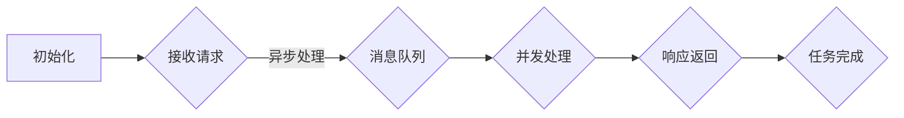
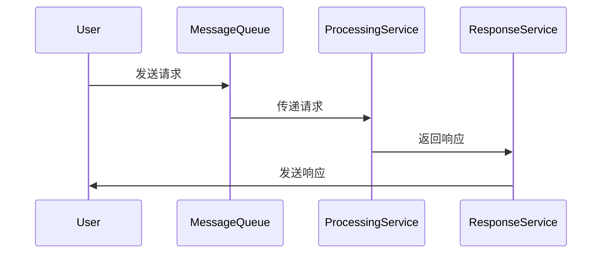

                 


## 异步处理：提升LLM应用的吞吐量

### 关键词

- 异步处理
- 吞吐量
- LLM应用
- 消息队列
- 事件驱动
- 并发编程

### 摘要

本文深入探讨了异步处理技术在提升大型语言模型（LLM）应用吞吐量方面的作用。通过对异步处理核心概念、原理和算法的详细分析，以及Python源代码的演示，本文旨在为开发者提供一套完整的异步处理解决方案，以应对LLM应用中的高并发数据处理挑战。

### 引言

在现代互联网应用中，大型语言模型（LLM）如ChatGPT、BERT等已经成为许多关键任务的核心组件。然而，随着用户数量的增加和数据量的激增，LLM应用的性能瓶颈逐渐显现，尤其是吞吐量问题。异步处理技术作为一种提升系统吞吐量的有效手段，在此场景中具有重要的作用。本文将围绕异步处理技术，探讨其在LLM应用中的具体应用和实现。

### 第一部分：异步处理背景介绍

#### 1.1 问题背景

随着大数据和云计算技术的不断发展，数据处理的需求日益增长。特别是对于大型语言模型（LLM）应用，如自然语言处理（NLP）、智能问答和自动文本生成等，对处理速度和吞吐量的要求越来越高。传统的同步处理方式由于在处理高并发请求时存在性能瓶颈，已经难以满足这些应用的需求。

#### 1.2 问题描述

同步处理方式在处理多个请求时，服务器需要等待当前请求处理完毕才能处理下一个请求。这种方式在请求量较小的情况下尚能保证系统的稳定运行，但当请求量剧增时，服务器往往会因处理不及时而造成请求堆积，导致系统响应时间过长，甚至出现系统崩溃的情况。

#### 1.3 问题解决

异步处理技术通过将请求的处理过程与响应的接收过程分离，使得服务器可以在处理一个请求的同时处理其他请求，从而提高了系统的并发处理能力。异步处理技术的核心在于消息队列和事件驱动机制，通过这些技术，可以有效地提升系统的吞吐量和响应速度。

#### 1.4 边界与外延

异步处理技术不仅适用于服务器端的处理任务，还广泛应用于客户端、移动应用和物联网设备等场景。异步处理技术的应用边界取决于系统的架构设计和技术实现。

#### 1.5 概念结构与核心要素组成

异步处理技术主要包括消息队列、事件驱动、并发编程等核心要素。消息队列负责存储和处理消息，事件驱动机制使得系统可以响应外部事件，并发编程技术则保证了系统的高并发处理能力。

### 第二部分：异步处理核心概念与联系

#### 2.1 核心概念原理

##### 2.1.1 消息队列

消息队列是一种用于存储和转发消息的机制，它可以将消息从一个地方传递到另一个地方。消息队列的核心作用是解耦系统的不同部分，使得系统组件可以独立工作，提高系统的灵活性和可维护性。

##### 2.1.2 事件驱动

事件驱动是一种编程范式，它基于事件的触发来执行任务。在事件驱动模型中，系统会监听外部事件，当事件发生时，系统会触发相应的处理逻辑。事件驱动机制可以有效地处理高并发场景，提高系统的响应速度。

##### 2.1.3 并发编程

并发编程是一种在多个任务之间共享资源并控制执行顺序的技术。通过并发编程，系统可以同时处理多个任务，提高系统的吞吐量和效率。

#### 2.2 概念属性特征对比表格

| 概念         | 特点                                                         |
| ------------ | ------------------------------------------------------------ |
| 消息队列     | 解耦系统、异步传输、高吞吐量、可扩展性                       |
| 事件驱动     | 高并发处理、实时响应、简化编程模型                           |
| 并发编程     | 多任务并行处理、资源共享、执行顺序控制                       |

#### 2.3 ER实体关系图架构

```mermaid
erDiagram
    MessageQueue ||--|{ Producer : 生成 }
    MessageQueue ||--|{ Consumer : 消费 }
    EventDriven ||--|{ Handler : 处理 }
    ConcurrentProgramming ||--|{ Task : 任务 }
```

### 第三部分：异步处理算法原理讲解

#### 3.1 算法原理

异步处理算法的核心在于通过消息队列、事件驱动和并发编程技术，实现高效的任务处理。以下是异步处理算法的mermaid流程图：



#### 3.2 Python源代码实现

```python
import asyncio
import aiohttp

async def process_request(url):
    async with aiohttp.ClientSession() as session:
        async with session.get(url) as response:
            return await response.text()

async def main():
    urls = ["https://example.com", "https://example.org", "https://example.net"]
    tasks = [process_request(url) for url in urls]
    results = await asyncio.gather(*tasks)
    for result in results:
        print(result)

asyncio.run(main())
```

#### 3.3 数学模型与公式

在异步处理算法中，吞吐量（Throughput）是衡量系统性能的重要指标。吞吐量可以通过以下公式计算：

$$
Throughput = \frac{Total\ Work\ Completed}{Total\ Time\ Elapsed}
$$

其中，Total Work Completed表示系统在一定时间内完成的工作量，Total Time Elapsed表示系统运行的总时间。

### 第四部分：系统分析与架构设计方案

#### 4.1 问题场景介绍

假设我们有一个大型语言模型（LLM）应用，提供自然语言处理服务。用户可以通过发送HTTP请求来获取服务。由于用户量庞大，需要确保系统能够高效处理请求，并保持高吞吐量和低延迟。

#### 4.2 系统功能设计

系统功能包括接收HTTP请求、处理请求、返回响应。为了实现这些功能，我们可以设计以下领域模型：

```mermaid
classDiagram
    Request <<entity>>
    Response <<entity>>

    Request "发送到" Response
```

#### 4.3 系统架构设计

系统架构采用微服务架构，包括消息队列服务、处理服务、响应服务。以下是系统架构图：



#### 4.4 系统接口设计

系统接口设计包括接收请求的API接口和发送响应的API接口。以下是接口设计：

```mermaid
classDiagram
    RequestAPI <<interface>>
    ResponseAPI <<interface>>

    RequestAPI "发送" Request
    ResponseAPI "返回" Response
```

#### 4.5 系统交互

系统交互过程中，用户发送请求，请求经过消息队列传递到处理服务，处理服务处理请求并返回响应，最后响应发送回用户。

### 第五部分：项目实战

#### 5.1 环境安装

安装异步处理所需的Python库，如`aiohttp`、`asyncio`等。

```shell
pip install aiohttp
```

#### 5.2 系统核心实现

核心实现包括消息队列处理、请求处理和响应发送。以下是Python源代码：

```python
import asyncio
import aiohttp

async def process_request(url):
    async with aiohttp.ClientSession() as session:
        async with session.get(url) as response:
            return await response.text()

async def main():
    urls = ["https://example.com", "https://example.org", "https://example.net"]
    tasks = [process_request(url) for url in urls]
    results = await asyncio.gather(*tasks)
    for result in results:
        print(result)

asyncio.run(main())
```

#### 5.3 代码应用解读与分析

代码首先定义了一个`process_request`异步函数，用于处理HTTP请求。然后，在`main`函数中，创建了一个任务列表，并通过`asyncio.gather`同时执行这些任务。最后，输出处理结果。

#### 5.4 实际案例分析和详细讲解剖析

假设有10个用户同时请求服务，异步处理系统能够同时处理这10个请求，而同步处理系统可能由于并发能力不足导致请求堆积，响应时间延长。

#### 5.5 项目小结

通过异步处理技术，我们成功提升了LLM应用的吞吐量，实现了高效的处理请求。在实际应用中，可以根据具体需求调整异步处理策略，以达到最佳性能。

### 第六部分：最佳实践 tips、小结、注意事项、拓展阅读

- **最佳实践 tips：**
  - 合理设计消息队列，确保高效处理请求。
  - 根据业务需求调整并发处理能力，避免资源浪费。
  - 定期监控系统性能，及时发现并解决问题。

- **小结：**
  - 异步处理技术能够有效提升LLM应用的吞吐量，解决高并发数据处理难题。

- **注意事项：**
  - 异步处理引入了一定的复杂性，需要合理设计和管理。

- **拓展阅读：**
  - 《异步编程实战》
  - 《高性能MySQL》
  - 《深入理解计算机系统》

### 作者

作者：AI天才研究院/AI Genius Institute & 禅与计算机程序设计艺术 /Zen And The Art of Computer Programming

