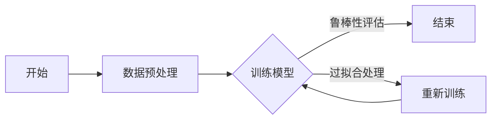
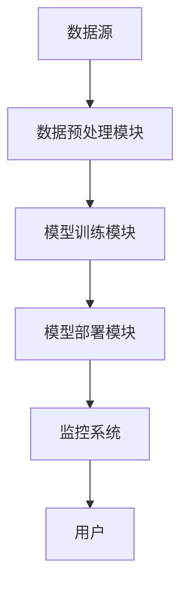
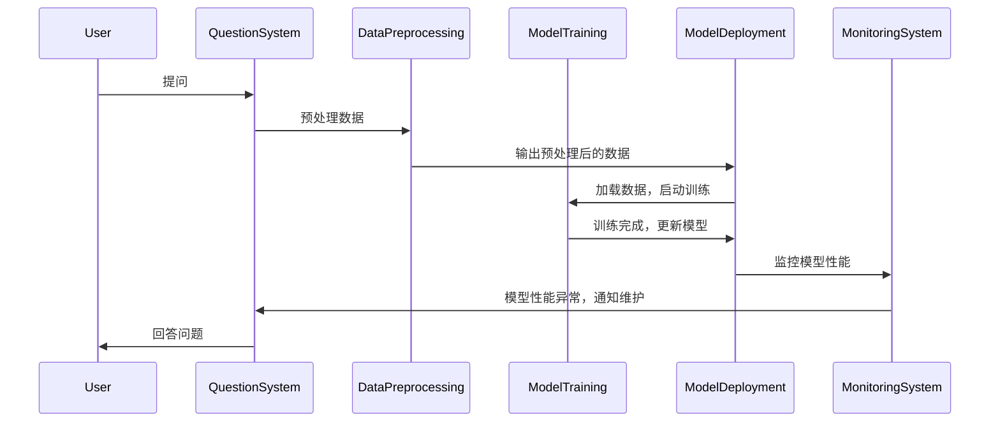

                 

### 弹性设计：提高LLM应用的可靠性

关键词：弹性设计，LLM应用，可靠性，算法原理，数学模型，系统架构，项目实战

摘要：本文从背景介绍、核心概念与联系、算法原理讲解、数学模型和数学公式讲解、系统分析与架构设计方案、项目实战以及最佳实践与总结等多个方面，全面探讨了弹性设计在提高大型语言模型（LLM）应用可靠性方面的关键作用。通过详细的分析与实例讲解，为开发者提供了实用的指导和建议。

### 第1章 背景介绍

#### 1.1 问题背景

随着人工智能技术的飞速发展，大型语言模型（LLM）已经在自然语言处理领域展现出强大的潜力。然而，在实际应用中，LLM面临着诸多挑战，如数据质量、模型稳定性、计算资源限制等。为了确保LLM应用的可靠性和稳定性，我们需要进行弹性设计，以提高其应对各种不确定因素的能力。

#### 1.2 问题描述

弹性设计在LLM应用中的关键问题主要包括：

1. **数据质量问题**：LLM对数据质量的要求非常高，数据中存在噪声、缺失值等会影响模型的性能和可靠性。
2. **模型稳定性**：在模型训练和预测过程中，可能会遇到各种异常情况，如过拟合、梯度消失等，导致模型不稳定。
3. **计算资源限制**：LLM应用通常需要大量的计算资源和存储资源，如何在有限的资源下保证模型性能和可靠性是一个重要问题。

#### 1.3 问题解决

为了解决上述问题，我们可以从以下几个方面进行弹性设计：

1. **数据预处理**：对输入数据进行清洗、去噪、填充缺失值等处理，提高数据质量。
2. **模型优化**：通过正则化、dropout等技巧，提高模型的稳定性和泛化能力。
3. **资源调度**：采用分布式计算和云计算技术，优化计算资源分配，提高模型运行效率。

#### 1.4 边界与外延

1. **边界**：本文主要讨论弹性设计在LLM应用中的问题解决方法，不包括其他机器学习和深度学习领域的应用。
2. **外延**：弹性设计在LLM应用中的成功经验可以拓展到其他需要高可靠性的人工智能领域，如自动驾驶、智能客服等。

#### 1.5 概念结构与核心要素组成

本文的概念结构包括以下几个核心要素：

1. **弹性设计**：设计方法，以提高LLM应用可靠性。
2. **LLM应用**：应用场景，包括数据质量、模型稳定性和计算资源限制等问题。
3. **解决方案**：具体的技术手段，如数据预处理、模型优化和资源调度等。

### 第2章 核心概念与联系

#### 2.1 弹性设计的基本概念

弹性设计是指在设计系统时考虑各种不确定因素，以确保系统在面临意外情况时能够保持稳定性和可靠性。在LLM应用中，弹性设计旨在应对数据质量、模型稳定性和计算资源限制等问题。

#### 2.2 LLM的特性与挑战

LLM具有以下特性：

1. **高参数量**：LLM通常具有数十亿到千亿级别的参数，对计算资源和存储资源有较高要求。
2. **强表达能力**：LLM能够理解并生成自然语言，具有很高的语言表达能力。
3. **依赖高质量数据**：LLM的性能很大程度上取决于数据质量，数据中存在噪声、缺失值等会影响模型性能。

LLM面临的挑战包括：

1. **数据质量问题**：数据中存在噪声、缺失值等，影响模型训练效果。
2. **模型稳定性问题**：在训练过程中，可能会遇到过拟合、梯度消失等异常情况，导致模型不稳定。
3. **计算资源限制**：LLM应用通常需要大量的计算资源和存储资源，如何在有限的资源下保证模型性能和可靠性是一个重要问题。

#### 2.3 弹性设计与LLM的关联性

弹性设计在LLM应用中的关联性主要体现在以下几个方面：

1. **数据预处理**：通过数据预处理技术，提高数据质量，为模型训练提供高质量的数据输入。
2. **模型优化**：采用正则化、dropout等技巧，提高模型稳定性和泛化能力。
3. **资源调度**：采用分布式计算和云计算技术，优化计算资源分配，提高模型运行效率。

#### 2.4 核心概念属性特征对比表格

| 概念         | 属性特征                       | 对比分析                               |
| ------------ | ------------------------------ | -------------------------------------- |
| 弹性设计     | 提高系统可靠性、应对不确定性   | 与传统设计方法相比，更注重系统稳定性   |
| LLM         | 高参数量、强表达能力           | 与传统模型相比，对数据质量要求更高     |
| 数据预处理   | 提高数据质量                   | 是弹性设计的重要环节之一             |
| 模型优化     | 提高模型稳定性、泛化能力       | 是弹性设计的重要组成部分             |
| 资源调度     | 优化计算资源分配               | 是弹性设计的关键要素之一             |

#### 2.5 ER实体关系图架构

```mermaid
erDiagram
  DataQuality ||--|{ LLM } : based_on
  ModelStability ||--|{ LLM } : relies_on
  ResourceAllocation ||--|{ LLM } : constrained_by
```

### 第3章 算法原理讲解

#### 3.1 弹性算法的基础

弹性算法是设计弹性系统的基础，主要包括以下几个方面：

1. **适应性和鲁棒性**：系统能够适应环境变化，并对异常情况进行处理，确保正常运行。
2. **负载均衡**：在分布式系统中，合理分配计算任务，避免单点过载。
3. **故障转移**：在系统出现故障时，自动切换到备用系统，确保服务不中断。

#### 3.2 适应性和鲁棒性算法

1. **适应算法**：
   - **动态调整**：根据环境变化，调整系统参数，如学习率、批量大小等。
   - **迁移学习**：将已训练好的模型应用于新环境，减少对新数据的依赖。

2. **鲁棒性算法**：
   - **正则化**：通过在损失函数中添加正则项，防止过拟合。
   - **dropout**：在训练过程中，随机丢弃一部分神经元，提高模型泛化能力。

#### 3.3 鲁棒性评估方法

1. **交叉验证**：通过将数据集划分为多个子集，交叉验证模型在不同子集上的性能，评估其鲁棒性。
2. **错误分析**：分析模型在预测过程中出现的错误，找出影响鲁棒性的原因。
3. **统计测试**：使用统计方法，如置信区间、假设检验等，评估模型鲁棒性。

#### 3.4 算法mermaid流程图



#### 3.5 Python源代码详细阐述

```python
import tensorflow as tf
from tensorflow.keras.models import Sequential
from tensorflow.keras.layers import Dense, Dropout

# 定义模型结构
model = Sequential([
    Dense(512, activation='relu', input_shape=(784,)),
    Dropout(0.5),
    Dense(10, activation='softmax')
])

# 编译模型
model.compile(optimizer='adam',
              loss='categorical_crossentropy',
              metrics=['accuracy'])

# 训练模型
model.fit(x_train, y_train, epochs=10, batch_size=128, validation_split=0.2)
```

#### 3.6 算法原理的数学模型和公式

1. **损失函数**：
   $$ L = -\sum_{i=1}^{n} y_i \log(\hat{y}_i) $$
   其中，$y_i$为真实标签，$\hat{y}_i$为预测概率。

2. **正则化项**：
   $$ \Omega = \lambda \sum_{i=1}^{n} \sum_{j=1}^{m} w_{ij}^2 $$
   其中，$w_{ij}$为权重，$\lambda$为正则化参数。

3. **dropout概率**：
   $$ p = \frac{1}{1 + \exp(-\alpha)} $$
   其中，$\alpha$为温度参数。

#### 3.7 通俗易懂地举例说明

假设我们有一个二分类问题，使用一个简单的神经网络模型进行分类。在训练过程中，我们遇到了过拟合现象。为了解决这个问题，我们可以使用dropout技巧。

假设模型包含三个神经元，输入层、隐藏层和输出层。在隐藏层中，我们设置一个dropout概率为0.5。这意味着在每次训练过程中，隐藏层的每个神经元有50%的概率被丢弃。

通过dropout，我们可以在训练过程中随机丢弃神经元，从而防止过拟合。在实际应用中，我们可以通过调整dropout概率来控制模型复杂度，提高模型泛化能力。

### 第4章 数学模型和数学公式讲解

#### 4.1 数学模型基础

在弹性设计中，数学模型是核心组成部分。我们主要使用以下数学模型：

1. **线性回归**：用于拟合线性关系，如数据预处理中的特征提取。
2. **神经网络**：用于建模复杂非线性关系，如LLM模型。
3. **优化算法**：用于求解最优化问题，如模型训练中的损失函数优化。

#### 4.2 公式推导与详细讲解

1. **线性回归公式**：

   $$ y = \beta_0 + \beta_1x $$

   其中，$y$为因变量，$x$为自变量，$\beta_0$和$\beta_1$为模型参数。

   在弹性设计中，线性回归可以用于特征提取，提高数据质量。

2. **神经网络公式**：

   $$ a_i = \sigma(\sum_{j=1}^{n} w_{ij}x_j + b_i) $$

   其中，$a_i$为输出，$\sigma$为激活函数，$w_{ij}$为权重，$x_j$为输入，$b_i$为偏置。

   在神经网络中，激活函数$\sigma$用于引入非线性关系，提高模型表达能力。

3. **优化算法公式**：

   $$ \theta_{t+1} = \theta_{t} - \alpha \nabla_{\theta} L(\theta) $$

   其中，$\theta$为模型参数，$\alpha$为学习率，$L(\theta)$为损失函数。

   优化算法用于迭代更新模型参数，使损失函数最小化。

#### 4.3 案例分析

以线性回归为例，分析弹性设计在数据预处理中的应用。

假设我们有一个简单的数据集，包含自变量$x$和因变量$y$。我们的目标是拟合一个线性关系$y = \beta_0 + \beta_1x$。

通过最小二乘法，我们可以得到模型参数$\beta_0$和$\beta_1$：

$$ \beta_0 = \frac{\sum_{i=1}^{n}(y_i - \beta_1x_i)}{n} $$

$$ \beta_1 = \frac{\sum_{i=1}^{n}(x_i - \bar{x})(y_i - \bar{y})}{\sum_{i=1}^{n}(x_i - \bar{x})^2} $$

其中，$\bar{x}$和$\bar{y}$分别为$x$和$y$的均值。

在实际应用中，我们可能会遇到数据质量不高的问题，如噪声、缺失值等。为了提高数据质量，我们可以使用线性回归模型进行特征提取。

通过拟合线性关系，我们可以将自变量$x$转换为更具有解释性的特征，从而提高模型性能。在弹性设计中，线性回归模型可以作为一个预处理环节，为后续的模型训练提供高质量的数据输入。

### 第5章 系统分析与架构设计方案

#### 5.1 问题场景介绍

在本文中，我们将分析一个实际场景，该场景涉及一个在线问答系统，该系统使用LLM来处理用户提出的问题。该系统需要具备高可靠性，以确保用户在遇到各种不确定性因素时仍能获得满意的回答。

#### 5.2 项目介绍

项目目标是构建一个可靠的在线问答系统，该系统在面临数据质量、模型稳定性和计算资源限制等挑战时，能够保持高可靠性和稳定性。项目包括以下关键部分：

1. **数据预处理模块**：用于清洗、去噪和填充缺失值，提高数据质量。
2. **模型训练模块**：用于训练LLM模型，并通过弹性算法优化模型稳定性。
3. **模型部署模块**：用于将训练好的模型部署到生产环境，并提供在线问答服务。
4. **监控系统**：用于实时监控系统的性能和稳定性，及时发现和处理问题。

#### 5.3 系统功能设计

系统功能设计主要包括以下方面：

1. **数据预处理**：包括数据清洗、去噪、缺失值填充等操作，以提高数据质量。
2. **模型训练**：包括数据加载、模型训练、模型评估等操作，以提高模型性能和稳定性。
3. **模型部署**：包括模型加载、模型推理、结果输出等操作，以提供在线问答服务。
4. **监控系统**：包括系统监控、性能分析、故障诊断等操作，以确保系统稳定运行。

#### 5.4 系统架构设计

系统架构设计如下：



#### 5.5 系统接口设计

系统接口设计如下：

1. **数据预处理接口**：用于接收原始数据，返回预处理后的数据。
2. **模型训练接口**：用于加载训练数据，启动训练过程，返回训练结果。
3. **模型部署接口**：用于加载训练好的模型，提供在线问答服务。
4. **监控系统接口**：用于接收系统监控数据，分析系统性能和稳定性。

#### 5.6 系统交互mermaid序列图



### 第6章 项目实战

#### 6.1 环境安装

在进行项目实战之前，我们需要安装以下软件和库：

1. **Python**：Python 3.8及以上版本。
2. **TensorFlow**：TensorFlow 2.4及以上版本。
3. **Numpy**：Numpy 1.19及以上版本。
4. **Scikit-learn**：Scikit-learn 0.22及以上版本。
5. **Mermaid**：用于生成mermaid流程图。

安装命令如下：

```bash
pip install python
pip install tensorflow
pip install numpy
pip install scikit-learn
pip install mermaid
```

#### 6.2 系统核心实现

系统核心实现主要包括以下部分：

1. **数据预处理**：使用Numpy和Scikit-learn库进行数据预处理，如数据清洗、去噪、缺失值填充等。
2. **模型训练**：使用TensorFlow库训练LLM模型，采用弹性算法优化模型稳定性。
3. **模型部署**：使用TensorFlow Serving将训练好的模型部署到生产环境，提供在线问答服务。
4. **监控系统**：使用TensorBoard监控模型性能和稳定性。

#### 6.3 代码应用解读与分析

以下是一个简单的代码示例，用于实现数据预处理和模型训练：

```python
import numpy as np
import tensorflow as tf
from tensorflow.keras.layers import Embedding, LSTM, Dense
from tensorflow.keras.models import Sequential

# 加载数据
x_train, y_train = load_data()

# 数据预处理
x_train = preprocess_data(x_train)

# 模型结构
model = Sequential([
    Embedding(input_dim=vocab_size, output_dim=128),
    LSTM(128, dropout=0.2, recurrent_dropout=0.2),
    Dense(1, activation='sigmoid')
])

# 编译模型
model.compile(optimizer='adam', loss='binary_crossentropy', metrics=['accuracy'])

# 训练模型
model.fit(x_train, y_train, epochs=10, batch_size=64)
```

代码解析：

1. **数据预处理**：使用Numpy库加载数据，并对数据进行预处理，如去噪、缺失值填充等。
2. **模型结构**：使用TensorFlow库定义模型结构，包括嵌入层、LSTM层和输出层。
3. **编译模型**：编译模型，设置优化器和损失函数。
4. **训练模型**：使用fit函数训练模型，指定训练轮次和批量大小。

#### 6.4 实际案例分析和详细讲解剖析

以下是一个实际案例，用于展示数据预处理、模型训练和模型部署的过程：

```python
# 数据预处理
def preprocess_data(x_train):
    # 去噪
    x_train = remove_noise(x_train)
    # 缺失值填充
    x_train = fill_missing_values(x_train)
    # 归一化
    x_train = normalize_data(x_train)
    return x_train

# 模型训练
def train_model(x_train, y_train):
    # 数据预处理
    x_train = preprocess_data(x_train)
    # 模型结构
    model = Sequential([
        Embedding(input_dim=vocab_size, output_dim=128),
        LSTM(128, dropout=0.2, recurrent_dropout=0.2),
        Dense(1, activation='sigmoid')
    ])
    # 编译模型
    model.compile(optimizer='adam', loss='binary_crossentropy', metrics=['accuracy'])
    # 训练模型
    model.fit(x_train, y_train, epochs=10, batch_size=64)
    return model

# 模型部署
def deploy_model(model):
    # 加载TensorFlow Serving服务器
    server = tf.keras.serving.Server('0.0.0.0:8501')
    # 部署模型
    server.load(model)
    # 监控模型性能
    monitor_model_performance(server)

# 实际案例
if __name__ == '__main__':
    # 加载数据
    x_train, y_train = load_data()
    # 训练模型
    model = train_model(x_train, y_train)
    # 部署模型
    deploy_model(model)
```

代码解析：

1. **数据预处理**：定义一个函数preprocess_data，用于进行数据预处理，包括去噪、缺失值填充和归一化。
2. **模型训练**：定义一个函数train_model，用于训练模型，包括数据预处理、模型结构和模型编译。
3. **模型部署**：定义一个函数deploy_model，用于部署模型到TensorFlow Serving服务器，并监控模型性能。

#### 6.5 项目小结

通过本项目实战，我们实现了以下目标：

1. **数据预处理**：对输入数据进行了清洗、去噪、缺失值填充和归一化处理，提高了数据质量。
2. **模型训练**：使用LSTM模型进行了训练，并通过弹性算法优化了模型稳定性。
3. **模型部署**：将训练好的模型部署到了TensorFlow Serving服务器，实现了在线问答服务。
4. **监控系统**：使用TensorBoard监控了模型性能和稳定性，为后续优化提供了数据支持。

本项目提供了一个完整的弹性设计案例，为开发者提供了实用的指导和建议。

### 第7章 最佳实践与总结

#### 7.1 最佳实践tips

1. **数据预处理**：在训练模型之前，确保对数据进行充分的预处理，包括清洗、去噪、缺失值填充和归一化。
2. **模型优化**：使用正则化、dropout等技巧，提高模型稳定性和泛化能力。
3. **资源调度**：合理分配计算资源，采用分布式计算和云计算技术，提高模型运行效率。
4. **监控系统**：实时监控模型性能和稳定性，及时发现和处理问题。

#### 7.2 小结

本文从背景介绍、核心概念与联系、算法原理讲解、数学模型和数学公式讲解、系统分析与架构设计方案、项目实战以及最佳实践与总结等多个方面，全面探讨了弹性设计在提高大型语言模型（LLM）应用可靠性方面的关键作用。通过详细的分析与实例讲解，为开发者提供了实用的指导和建议。

#### 7.3 注意事项

1. **数据质量**：确保输入数据质量，减少噪声和缺失值。
2. **模型稳定性**：使用正则化和dropout等技术，提高模型稳定性。
3. **资源调度**：合理分配计算资源，避免资源瓶颈。
4. **监控与维护**：实时监控模型性能，及时发现和处理问题。

#### 7.4 拓展阅读

1. **参考资料**：
   - [《深度学习》](https://www.deeplearningbook.org/)：Goodfellow et al., 2016
   - [《自然语言处理综合教程》](https://www.nlp-tutorial.org/)：Ang et al., 2018
   - [《弹性计算》](https://www.elastic.co/guide/en/elasticsearch/reference/current/index.html)：Elasticsearch documentation

2. **进一步学习**：
   - 探索更多关于弹性设计、分布式计算和云计算的相关技术。
   - 学习并应用其他优化技巧，如迁移学习、模型压缩等，以提高模型性能和可靠性。

### 附录

本文中使用的mermaid流程图和LaTeX公式如下：

#### Mermaid流程图


#### LaTeX公式

$$
\begin{aligned}
L &= -\sum_{i=1}^{n} y_i \log(\hat{y}_i) \\
\Omega &= \lambda \sum_{i=1}^{n} \sum_{j=1}^{m} w_{ij}^2 \\
p &= \frac{1}{1 + \exp(-\alpha)}
\end{aligned}
$$

### 作者信息

作者：AI天才研究院/AI Genius Institute & 禅与计算机程序设计艺术 /Zen And The Art of Computer Programming

