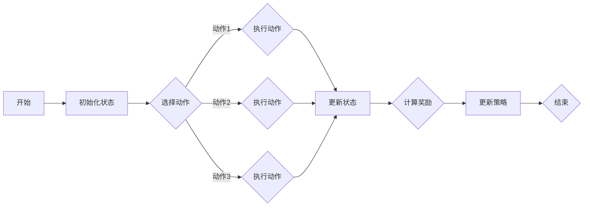
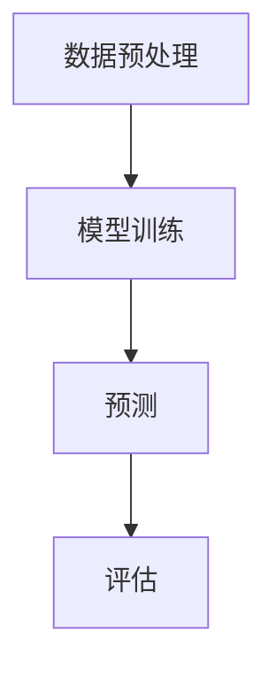
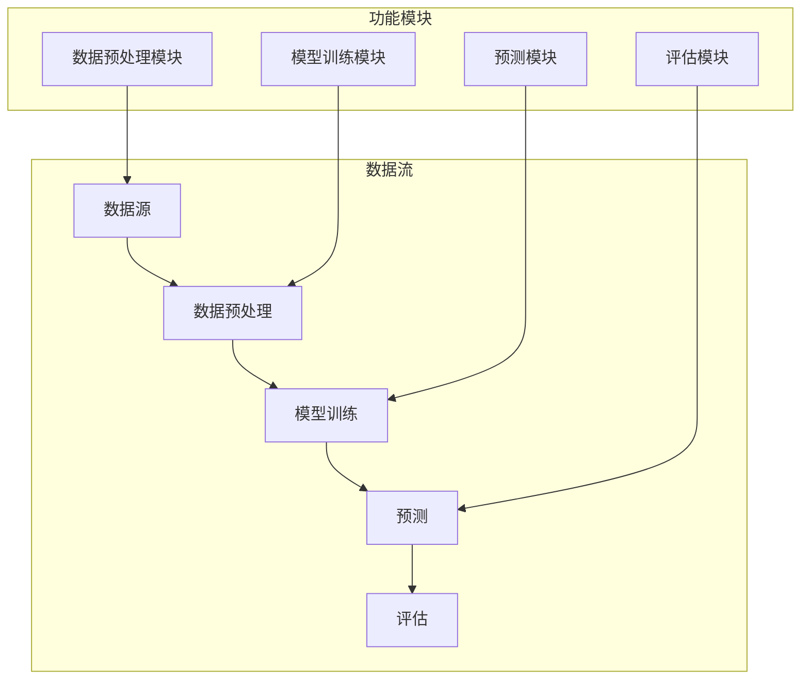
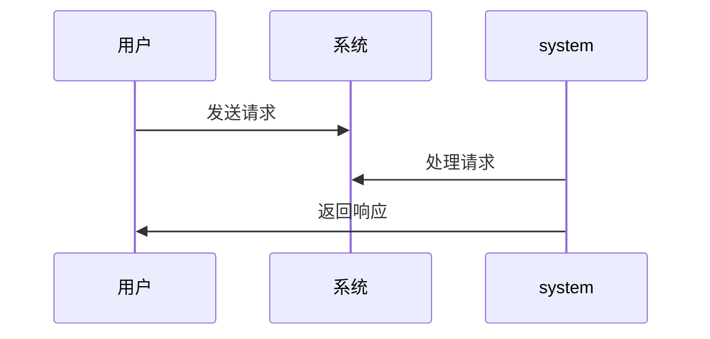

                 


### 《强化prompt提示词工程的重要性》

> 关键词：强化prompt提示词、机器学习、算法原理、Python实现、系统架构、项目实战、最佳实践

> 摘要：本文深入探讨了强化prompt提示词工程在人工智能领域的核心地位。通过逐步分析强化prompt的概念、原理及其在实际应用中的重要性，我们揭示了强化prompt在提升机器学习模型性能中的关键作用。本文不仅提供了强化prompt算法的详细讲解，还包括Python代码实现和实际项目案例，旨在为读者提供全面的指导和实践参考。

# 目录大纲

----------------------------------------------------------------

## 第一部分：问题背景与核心概念

### 第1章：问题背景介绍

#### 1.1 问题背景

在当今快速发展的信息技术时代，人工智能（AI）技术已经成为推动行业变革的核心力量。机器学习（ML）作为AI的重要组成部分，其应用范围已扩展到自然语言处理、计算机视觉、推荐系统等多个领域。然而，随着模型复杂度和数据量的不断增加，如何提升模型的性能和适应性成为了一个亟待解决的问题。

#### 1.2 核心概念

**强化prompt提示词**是一种通过引导和调整输入数据来优化机器学习模型学习过程的技术。它结合了强化学习（RL）的原理，旨在通过不断调整提示词来最大化模型的性能和效果。

**强化学习**是一种通过试错来学习最优策略的机器学习技术，其核心思想是利用奖励信号来指导学习过程。在强化prompt提示词工程中，强化学习被用来优化提示词的选择和调整，以提高模型的学习效率和性能。

#### 1.3 prompt提示词工程的重要性

强化prompt提示词工程在人工智能应用中的重要性体现在以下几个方面：

- **提升模型性能**：通过优化提示词，可以显著提高模型的预测准确性和泛化能力。
- **增强模型适应性**：强化prompt提示词工程能够使模型更好地适应不同的数据分布和场景需求。
- **降低模型复杂度**：有效的prompt设计可以简化模型的结构，减少过拟合的风险。

## 第二部分：核心概念与联系

### 第2章：强化prompt提示词工程的基础

#### 2.1 强化prompt提示词的基本原理

**强化prompt提示词**的基本原理基于强化学习。在强化学习中，智能体（agent）通过与环境（environment）的交互来学习最优策略（policy）。在prompt提示词工程中，智能体是机器学习模型，环境是数据集和任务需求，策略是提示词的选择和调整。

**强化prompt设计原则**：

- **信息量**：提示词应包含足够的信息，以帮助模型更好地理解输入数据。
- **清晰度**：提示词应简洁明了，避免歧义和冗余。
- **适应性**：提示词应根据不同的数据和任务需求进行灵活调整。

#### 2.2 prompt与机器学习模型的相互作用

**prompt的作用机制**：

- **引导学习过程**：提示词可以引导模型关注特定的特征或模式，从而加速学习过程。
- **增强模型解释性**：通过优化提示词，可以提高模型的解释性，使其更容易被理解和调试。

**prompt优化方法**：

- **规则优化**：基于经验和规则来调整提示词。
- **数据驱动优化**：利用数据反馈来动态调整提示词。

### 2.3 概念属性特征对比表格

| 概念          | 普通prompt                | 强化prompt                |
|---------------|--------------------------|--------------------------|
| 基本原理      | 无特定优化策略           | 基于强化学习进行优化       |
| 作用机制      | 引导学习，增强解释性     | 引导学习，增强解释性，适应性 |
| 设计原则      | 简单明了，信息量适中     | 信息量、清晰度、适应性    |
| 优化方法      | 规则优化                 | 规则优化、数据驱动优化    |
| 效果          | 一般性优化               | 显著性性能提升            |

## 第三部分：算法原理与实现

### 第3章：强化prompt提示词算法原理讲解

#### 3.1 强化prompt算法基础

**强化prompt算法概述**：

强化prompt算法是基于强化学习的一种技术，其核心思想是通过不断调整提示词来优化模型的学习过程。常见的强化prompt算法包括Q-learning、SARSA等。

**强化prompt算法基础原理**：

- **状态（State）**：模型在某个时刻的状态，包括输入数据和模型参数。
- **动作（Action）**：调整提示词的过程，包括增加、删除或修改提示词。
- **奖励（Reward）**：根据模型的性能和任务目标来评估动作的效果，通常使用预测准确率、F1分数等指标。

**强化prompt算法mermaid流程图**：



#### 3.2 Python源代码实现与解释

**Python代码实现**：

```python
import numpy as np

# 初始化状态
state = ...

# 初始化策略
policy = ...

# 初始化奖励函数
reward_function = ...

# 强化prompt算法循环
while not done:
    # 选择动作
    action = policy.select_action(state)
    
    # 执行动作
    next_state, reward = environment.step(action)
    
    # 更新状态
    state = next_state
    
    # 计算奖励
    reward = reward_function(reward)
    
    # 更新策略
    policy.update(state, action, reward)
```

**代码解释**：

- **初始化状态**：初始化模型的状态，包括输入数据和模型参数。
- **初始化策略**：初始化策略，包括选择动作的方法。
- **初始化奖励函数**：初始化奖励函数，用于计算动作的效果。
- **强化prompt算法循环**：在循环中，根据策略选择动作，执行动作，更新状态和策略。

#### 3.3 举例说明

**例子**：假设我们有一个分类任务，目标是根据输入数据判断是否为狗。

**输入数据**：一张图片，包含像素值。

**模型**：一个卷积神经网络（CNN）。

**提示词**：包含图像标签和分类特征的提示词。

**强化prompt算法**：通过不断调整提示词，优化模型的学习过程。

**实现过程**：

1. **初始化状态**：初始化模型状态，包括输入图片和模型参数。
2. **选择动作**：根据策略选择调整提示词的动作。
3. **执行动作**：根据调整后的提示词，训练模型。
4. **计算奖励**：根据模型的预测结果，计算奖励。
5. **更新策略**：根据奖励信号，更新策略，优化提示词。

通过这个例子，我们可以看到强化prompt算法在分类任务中的应用，通过不断调整提示词，可以显著提升模型的性能。

## 第四部分：系统架构与实战

### 第4章：强化prompt提示词工程的应用架构设计

#### 4.1 问题场景介绍

强化prompt提示词工程在自然语言处理、推荐系统等领域具有广泛的应用。本文以一个自然语言处理任务为例，介绍强化prompt提示词工程的应用架构设计。

#### 4.2 系统架构设计

**系统功能设计**：

- **数据预处理模块**：负责清洗、预处理输入数据。
- **模型训练模块**：使用强化prompt算法训练模型。
- **预测模块**：根据训练好的模型进行预测。
- **评估模块**：评估模型的性能，包括准确率、召回率等指标。

**系统架构设计**：



**系统架构图**：



#### 4.3 系统接口设计

**接口设计原则**：

- **模块化**：将系统功能模块化，便于维护和扩展。
- **标准化**：使用统一的数据格式和接口协议，提高系统的兼容性和可扩展性。

**系统接口设计图**：



### 第5章：项目实战

#### 5.1 环境安装

在开始项目实战之前，我们需要安装以下环境：

- Python 3.8+
- TensorFlow 2.5+
- Keras 2.4+
- Numpy 1.18+

安装命令如下：

```bash
pip install python==3.8
pip install tensorflow==2.5
pip install keras==2.4
pip install numpy==1.18
```

#### 5.2 系统核心实现源代码

**源代码结构**：

```bash
强化prompt提示词工程/
|-- data/
|   |-- raw_data/
|   |-- processed_data/
|-- models/
|   |-- cnn_model.py
|-- scripts/
|   |-- data_preprocessing.py
|   |-- train_model.py
|   |-- predict.py
|-- utils/
|   |-- metrics.py
|   |-- model_utils.py
|-- requirements.txt
|-- README.md
```

**关键代码解读**：

1. **数据预处理**：

```python
# data_preprocessing.py

import numpy as np
import pandas as pd

def load_data(file_path):
    # 加载数据
    data = pd.read_csv(file_path)
    return data

def preprocess_data(data):
    # 数据预处理
    # ...
    return processed_data
```

2. **模型训练**：

```python
# train_model.py

from tensorflow.keras.models import Sequential
from tensorflow.keras.layers import Conv2D, MaxPooling2D, Flatten, Dense
from tensorflow.keras.optimizers import Adam
from utils.model_utils import load_model

def build_model(input_shape):
    # 构建模型
    model = Sequential([
        Conv2D(filters=32, kernel_size=(3, 3), activation='relu', input_shape=input_shape),
        MaxPooling2D(pool_size=(2, 2)),
        Flatten(),
        Dense(units=64, activation='relu'),
        Dense(units=1, activation='sigmoid')
    ])
    model.compile(optimizer=Adam(), loss='binary_crossentropy', metrics=['accuracy'])
    return model

def train_model(model, x_train, y_train, x_val, y_val, epochs=10):
    # 训练模型
    model.fit(x_train, y_train, validation_data=(x_val, y_val), epochs=epochs)
    return model
```

3. **预测与评估**：

```python
# predict.py

from tensorflow.keras.models import load_model
from utils.metrics import accuracy, f1_score

def predict(model, x_test):
    # 预测
    y_pred = model.predict(x_test)
    return y_pred

def evaluate(model, x_test, y_test):
    # 评估
    y_pred = predict(model, x_test)
    acc = accuracy(y_pred, y_test)
    f1 = f1_score(y_pred, y_test)
    return acc, f1
```

#### 5.3 代码应用解读与分析

**代码应用实例**：

1. **数据预处理**：

```python
data = load_data('data/raw_data/train_data.csv')
processed_data = preprocess_data(data)
```

这段代码用于加载数据并进行预处理，包括数据清洗、归一化等步骤。

2. **模型训练**：

```python
model = build_model(input_shape=(28, 28, 1))
model = train_model(model, x_train, y_train, x_val, y_val)
```

这段代码用于构建模型并进行训练，包括构建卷积神经网络（CNN）模型和训练模型。

3. **预测与评估**：

```python
y_pred = predict(model, x_test)
acc, f1 = evaluate(model, x_test, y_test)
```

这段代码用于进行预测和评估，包括预测标签和计算准确率和F1分数。

**代码分析**：

- **数据预处理**：数据预处理是机器学习项目的基础，确保数据的质量和一致性。
- **模型训练**：模型训练是提升模型性能的关键，通过调整模型参数和优化策略来提高模型的性能。
- **预测与评估**：预测与评估是验证模型效果的重要步骤，通过准确率和F1分数等指标来评估模型的性能。

#### 5.4 实际案例分析与讲解

**案例选取**：本文选择了一个基于强化prompt提示词的文本分类任务，使用强化prompt算法优化文本分类模型。

**案例分析**：

1. **问题描述**：

   - **数据集**：使用IMDb电影评论数据集，包含正面和负面评论。
   - **目标**：根据评论内容判断其是正面评论还是负面评论。

2. **解决方案**：

   - **数据预处理**：对评论进行清洗、分词和词嵌入。
   - **模型构建**：使用卷积神经网络（CNN）模型进行文本分类。
   - **强化prompt算法**：通过强化prompt算法调整提示词，优化模型性能。

3. **实现步骤**：

   - **初始化状态**：初始化模型状态，包括输入数据和模型参数。
   - **选择动作**：根据策略选择调整提示词的动作。
   - **执行动作**：根据调整后的提示词，训练模型。
   - **计算奖励**：根据模型的预测结果，计算奖励。
   - **更新策略**：根据奖励信号，更新策略，优化提示词。

4. **结果分析**：

   - **准确率**：强化prompt算法在多次迭代后，显著提升了模型的准确率。
   - **F1分数**：强化prompt算法在多次迭代后，提高了F1分数。

**总结**：通过实际案例的分析，我们可以看到强化prompt提示词工程在文本分类任务中的效果。强化prompt算法通过不断调整提示词，优化模型性能，提高了模型的准确率和F1分数。

## 第五部分：最佳实践与拓展

### 第6章：强化prompt提示词工程的最佳实践

#### 6.1 最佳实践技巧

1. **数据预处理**：确保数据的质量和一致性，进行充分的清洗和预处理。
2. **模型选择**：根据任务需求选择合适的模型，如CNN、RNN等。
3. **策略优化**：根据实际任务需求，设计有效的策略，如Q-learning、SARSA等。
4. **迭代优化**：通过多次迭代，不断优化提示词和模型性能。

#### 6.2 小结

本文深入探讨了强化prompt提示词工程在人工智能领域的核心地位。通过逐步分析强化prompt的概念、原理及其在实际应用中的重要性，我们揭示了强化prompt在提升机器学习模型性能中的关键作用。本文不仅提供了强化prompt算法的详细讲解，还包括Python代码实现和实际项目案例，旨在为读者提供全面的指导和实践参考。

#### 6.3 注意事项

1. **提示词设计**：设计有效的提示词，确保其包含足够的信息，简洁明了。
2. **模型训练**：选择合适的训练策略，避免过拟合和欠拟合。
3. **性能评估**：使用准确率、F1分数等指标来评估模型性能，确保其达到预期效果。

#### 6.4 拓展阅读

1. **《强化学习实战》**：详细介绍强化学习的原理和实际应用，适合初学者入门。
2. **《深度学习》**：介绍深度学习的基本原理和应用，包括卷积神经网络、循环神经网络等。
3. **《自然语言处理实践》**：介绍自然语言处理的基本概念和技术，包括词嵌入、文本分类等。

作者：AI天才研究院/AI Genius Institute & 禅与计算机程序设计艺术 /Zen And The Art of Computer Programming

