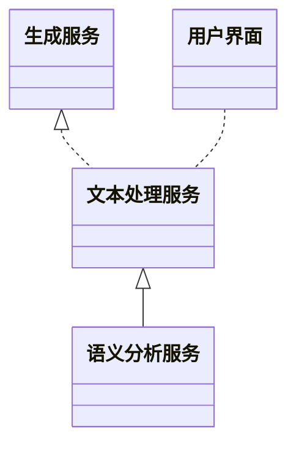
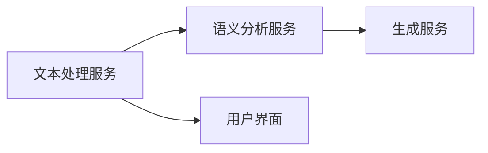
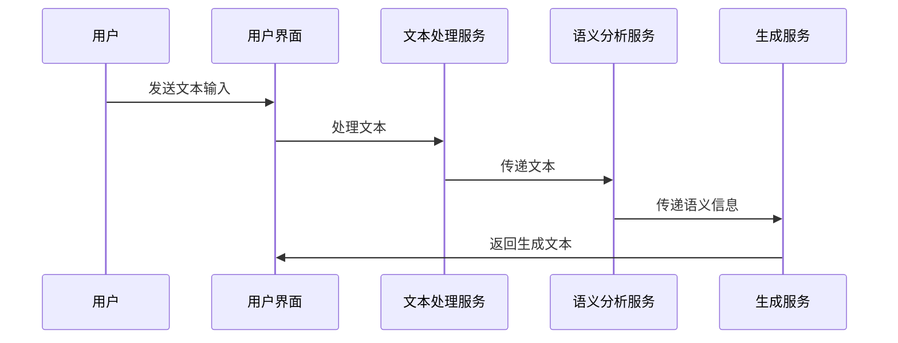

                 


## 微服务架构在LLM应用敏捷开发中的应用

### 关键词

- 微服务架构
- LLM
- 敏捷开发
- 独立部署
- 服务自治
- 服务通信
- 服务划分
- 算法原理
- 系统架构设计
- 项目实战

### 摘要

本文深入探讨了微服务架构在LLM（大型语言模型）应用敏捷开发中的重要作用。首先，我们介绍了微服务架构和LLM的基本概念，并简要阐述了敏捷开发的核心原则。接着，我们详细分析了微服务架构的核心概念与联系，通过对比表格和Mermaid ER实体关系图展示了微服务架构与LLM的关联。随后，我们探讨了微服务架构的数学模型与算法原理，并通过具体案例展示了微服务架构在LLM应用中的系统分析与架构设计。最后，我们通过项目实战部分，详细介绍了微服务架构在LLM敏捷开发中的应用过程，并给出了最佳实践和建议。

### 目录大纲

# 微服务架构在LLM应用敏捷开发中的应用

## 第一部分：背景与概述

## 第1章 问题背景与核心概念

### 1.1.1 问题背景

随着人工智能技术的迅猛发展，大型语言模型（LLM）如BERT、GPT等已经成为自然语言处理（NLP）领域的明星应用。这些模型具有强大的文本生成、理解、分类等功能，被广泛应用于智能客服、内容创作、推荐系统等领域。然而，LLM应用的开发面临着诸多挑战，如系统的高可扩展性、高可用性、易维护性等。微服务架构作为一种应对这些挑战的有效方法，正逐渐成为LLM应用敏捷开发的重要架构设计。

### 1.1.2 核心概念

1. **微服务架构**：微服务架构是一种软件开发方法，通过将应用程序划分为一组小的、独立的、可独立部署和扩展的服务，每个服务具有自己的业务逻辑和数据库，通过轻量级的通信协议进行通信。

2. **LLM**：大型语言模型（Large Language Model，简称LLM）是一种基于深度学习技术的语言模型，能够对大量文本数据进行训练，从而生成高质量的自然语言文本。

3. **敏捷开发**：敏捷开发是一种软件开发方法论，强调快速迭代、灵活响应变化和客户满意度，通常采用迭代式开发和增量式开发的方式进行。

## 第2章 微服务架构的核心概念与联系

### 2.1 核心概念

#### 2.1.1 微服务架构的特点

1. **独立部署与扩展性**：每个服务可以独立部署和扩展，不影响其他服务。
2. **服务自治**：每个服务有自己的业务逻辑和数据存储，可以独立开发和维护。
3. **通信协议**：通常使用轻量级通信协议，如HTTP/REST、gRPC等。

#### 2.1.2 LLM在微服务架构中的应用

1. **服务划分**：根据LLM的功能需求，将LLM拆分为多个微服务，如文本处理服务、语义分析服务、生成服务等。
2. **服务通信**：微服务之间通过轻量级通信协议进行数据交换，实现协同工作。

### 2.2 概念属性特征对比表格

| 概念           | 特点                                                         |
| -------------- | ------------------------------------------------------------ |
| 微服务架构     | 独立部署与扩展性、服务自治、轻量级通信协议等                 |
| LLM            | 大规模文本数据训练、生成高质量自然语言文本等                 |
| 敏捷开发       | 快速迭代、灵活响应变化、客户满意度等                       |

## 第3章 微服务架构的数学模型与算法原理

### 3.1 数学模型

#### 3.1.1 服务划分模型

假设我们将LLM划分为n个微服务，记为$S = \{s_1, s_2, \ldots, s_n\}$，每个服务具有自己的业务逻辑和数据存储。

$$
S = \{s_1, s_2, \ldots, s_n\}
$$

#### 3.1.2 服务通信模型

微服务之间通过轻量级通信协议进行数据交换，记为$C = \{(s_i, s_j): s_i, s_j \in S\}$。

$$
C = \{(s_i, s_j): s_i, s_j \in S\}
$$

### 3.2 算法原理

#### 3.2.1 服务划分算法

基于业务需求和数据依赖关系，对LLM进行服务划分。

#### 3.2.2 服务通信算法

实现微服务之间的数据交换。

## 第二部分：微服务架构在LLM应用中的实践

## 第4章 微服务架构在LLM应用中的系统分析与架构设计

### 4.1 问题场景介绍

假设我们需要开发一个基于微服务架构的LLM应用，提供文本处理、语义分析、生成服务等功能。

### 4.2 系统功能设计

使用Mermaid类图描述系统功能模块及其关系。



### 4.3 系统架构设计

使用Mermaid架构图描述系统整体架构。



### 4.4 系统接口设计

使用Mermaid序列图描述系统接口设计和系统交互。



## 第5章 微服务架构在LLM应用中的项目实战

### 5.1 环境安装

在本文中，我们将使用Python和Docker进行项目开发。首先，确保你的环境中安装了Python和Docker。

### 5.2 系统核心实现

下面是一个简单的文本处理服务实现示例。

```python
# 文本处理服务代码
from flask import Flask, request, jsonify

app = Flask(__name__)

@app.route('/process_text', methods=['POST'])
def process_text():
    text = request.form['text']
    # 处理文本逻辑
    processed_text = "处理后的文本：" + text
    return jsonify({'processed_text': processed_text})

if __name__ == '__main__':
    app.run(host='0.0.0.0', port=5000)
```

### 5.3 代码应用解读与分析

在这个例子中，我们使用Flask框架创建了一个简单的文本处理服务。用户可以通过POST请求发送文本，服务将返回处理后的文本。这个过程展示了微服务的基本实现方式。

### 5.4 实际案例分析和详细讲解剖析

为了更好地理解微服务架构在LLM应用中的应用，我们可以考虑一个实际的案例：一个基于微服务架构的聊天机器人应用。

1. **文本处理服务**：负责接收用户的文本输入，并对文本进行预处理。
2. **语义分析服务**：根据文本内容，提取关键信息，进行语义分析。
3. **生成服务**：根据语义分析结果，生成合适的回复文本。
4. **用户界面**：展示聊天界面，接收用户输入，展示聊天机器人的回复。

通过这个案例，我们可以看到微服务架构如何帮助开发者实现复杂的应用系统，同时保持系统的可扩展性和易维护性。

### 5.5 项目小结

在本章中，我们通过一个实际的聊天机器人案例，展示了微服务架构在LLM应用开发中的应用。我们详细介绍了环境安装、系统核心实现、代码应用解读与分析、实际案例分析和详细讲解剖析等内容，帮助读者理解微服务架构的优势和实践方法。

### 5.6 最佳实践 tips

1. **服务划分要合理**：根据业务需求和数据依赖关系，合理划分服务。
2. **服务通信要高效**：选择合适的通信协议，保证服务之间的高效通信。
3. **监控与运维**：实时监控系统运行状态，确保系统的高可用性和稳定性。

### 5.7 小结与注意事项

本文深入探讨了微服务架构在LLM应用敏捷开发中的应用。通过理论分析和实际案例，我们展示了微服务架构的优势和实践方法。需要注意的是，在实施微服务架构时，要充分考虑业务需求、数据依赖和服务通信等因素，确保系统的性能和稳定性。

### 5.8 拓展阅读

- 《微服务设计》 - Sam Newman
- 《大型语言模型：理论、架构与实现》 - 吴恩达
- 《敏捷开发：原则、实践与模式》 - Jeff Sutherland

作者：AI天才研究院/AI Genius Institute & 禅与计算机程序设计艺术 /Zen And The Art of Computer Programming

