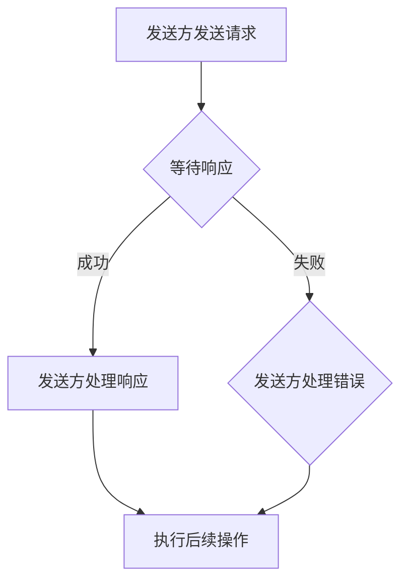
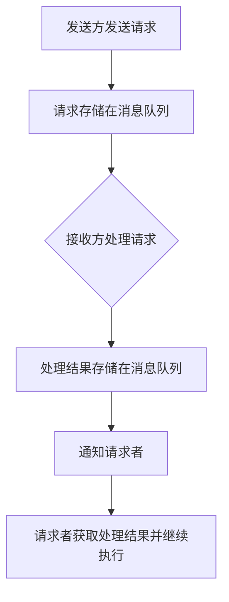

                 

### 文章标题与关键词

# 微服务通信：同步vs异步在LLM应用中的选择

> 关键词：微服务、同步通信、异步通信、LLM应用、性能对比、架构设计

> 摘要：本文深入探讨了微服务通信中的同步与异步通信在大型语言模型（LLM）应用中的选择问题。通过对比分析两者的工作原理、优势与局限，结合实际应用案例，为开发者提供了清晰、实用的指导，帮助他们在LLM应用中做出最佳通信模式的选择。

### 引言

在现代软件开发中，微服务架构因其灵活、可扩展性和高可维护性而得到了广泛的应用。微服务架构将复杂的大型应用程序拆分为一组小型的、独立的、可复用的服务，这些服务通过通信机制进行交互。微服务之间的通信机制是确保系统性能、稳定性和可扩展性的关键因素。其中，同步通信和异步通信是两种常见的通信模式。

同步通信是一种在请求者等待响应返回期间阻塞操作执行的通信模式。当发送方发出请求后，必须等待接收方的响应才能继续执行后续操作。这种模式的特点是简单直观，但可能会导致系统性能下降，特别是在处理大量请求时。

异步通信则允许请求者在发送请求后继续执行其他任务，无需等待响应返回。发送方和接收方通过消息队列或其他机制进行异步通信，确保消息不会丢失，同时提高系统的并发处理能力。

本文旨在探讨同步与异步通信在LLM（Large Language Model）应用中的适用性。LLM是一种强大的自然语言处理技术，在文本生成、翻译、问答等领域有着广泛的应用。由于LLM应用通常需要处理大量数据和高并发请求，因此选择合适的通信模式对系统性能和用户体验至关重要。

本文将首先介绍微服务通信的基本概念，然后分别阐述同步和异步通信的工作原理、优势和局限。接着，我们将通过具体的LLM应用场景，分析同步与异步通信的适用性。最后，本文将结合一个实际案例，详细讲解如何在LLM应用中实现同步与异步通信，并提供一些最佳实践和注意事项。

通过本文的阅读，读者将能够了解同步与异步通信的核心概念，掌握它们在LLM应用中的适用性，并具备在实际项目中做出合理选择的技能。

### 微服务通信的基本概念

#### 微服务的定义与特点

微服务（Microservices）是一种基于独立、自治和分布式服务的架构风格，旨在构建和维护复杂的大型应用程序。与传统的单体架构不同，微服务将应用程序拆分为多个独立的、小型服务，每个服务负责完成特定的业务功能。

微服务的核心特点是模块化、独立部署、自治性和可复用性。具体来说，微服务具有以下几个主要特点：

1. **模块化**：微服务将应用程序划分为多个独立的模块，每个模块对应一个服务。这种模块化设计使得服务可以独立开发、测试和部署，提高了系统的灵活性和可维护性。

2. **独立部署**：每个微服务可以独立部署，这意味着更新或修复某个服务时不会影响其他服务的运行。这种独立部署能力提高了系统的可用性和稳定性。

3. **自治性**：每个微服务都有自己的数据存储、配置和管理机制，使其具备高度自治性。这种自治性确保了服务之间的松耦合，降低了服务依赖的风险。

4. **可复用性**：由于微服务是独立和自治的，因此可以方便地在不同项目中复用。这种可复用性不仅提高了开发效率，还有助于降低维护成本。

#### 微服务通信的重要性

微服务之间的通信是确保系统整体性能和稳定性的关键。由于微服务是独立部署和运行的，它们需要通过某种通信机制进行交互，以实现协同工作。微服务通信的重要性体现在以下几个方面：

1. **数据共享**：微服务通过通信机制共享数据，实现业务逻辑的协同工作。这种数据共享能力有助于构建复杂的应用程序，并确保数据的一致性和准确性。

2. **服务协同**：微服务之间的通信机制允许服务协同工作，实现业务流程的自动化和优化。通过有效的通信机制，服务可以高效地协作，提高系统的整体性能。

3. **系统扩展**：微服务的独立部署和自治性意味着系统可以灵活扩展。当某个服务面临高并发请求时，可以增加该服务的实例数量，以应对负载。而微服务之间的通信机制则确保了扩展过程中服务的协同和一致性。

4. **故障隔离**：由于微服务是独立部署的，当一个服务发生故障时，不会影响其他服务的运行。微服务之间的通信机制可以帮助快速定位和隔离故障，提高系统的可靠性和可用性。

#### 同步与异步通信的概述

在微服务通信中，同步通信和异步通信是两种常见的通信模式。这两种通信模式在处理请求时有着不同的机制和特点。

**同步通信**

同步通信是一种在请求者等待响应返回期间阻塞操作执行的通信模式。当发送方发出请求后，必须等待接收方的响应才能继续执行后续操作。同步通信的特点包括：

1. **请求-响应模型**：发送方发出请求，接收方接收并处理请求，然后返回响应。这种模型简单直观，容易理解和实现。

2. **阻塞操作**：在等待响应返回的过程中，请求者会阻塞当前操作，直到接收到响应。这种阻塞操作可能导致系统性能下降，特别是在处理大量请求时。

3. **数据一致性**：同步通信确保数据的一致性，因为请求者在等待响应期间不会继续执行其他操作。这种数据一致性对于某些业务场景（如金融交易）非常重要。

4. **可靠性**：同步通信具有较高的可靠性，因为请求者在等待响应期间可以检查响应的有效性，确保不会因为网络错误或服务异常而丢失请求。

**异步通信**

异步通信则允许请求者在发送请求后继续执行其他任务，无需等待响应返回。发送方和接收方通过消息队列或其他机制进行异步通信，确保消息不会丢失，同时提高系统的并发处理能力。异步通信的特点包括：

1. **事件驱动模型**：请求者在发送请求后，通过监听消息队列中的消息来获取响应。这种事件驱动模型提高了系统的并发处理能力，可以同时处理大量请求。

2. **非阻塞操作**：请求者在发送请求后可以继续执行其他任务，不会阻塞当前操作。这种非阻塞操作提高了系统的性能和响应速度。

3. **消息队列**：异步通信通常使用消息队列来存储和转发消息。消息队列确保消息的有序传递和可靠传输，避免了请求丢失和重复处理的问题。

4. **高可扩展性**：异步通信通过利用消息队列和分布式架构，可以实现系统的水平扩展。当系统面临高并发请求时，可以增加消息队列和服务的实例数量，以应对负载。

综上所述，同步通信和异步通信在微服务通信中各有优缺点。选择合适的通信模式取决于应用场景、系统需求和性能要求。在接下来的部分，我们将进一步探讨同步和异步通信的工作原理、优势和局限，帮助读者在实际项目中做出合理的选择。

### 同步通信原理

#### 同步通信的工作原理

同步通信是一种在请求者等待响应返回期间阻塞操作执行的通信模式。当发送方发出请求后，必须等待接收方的响应才能继续执行后续操作。同步通信的工作原理主要包括以下几个步骤：

1. **发送请求**：发送方通过调用API或其他通信接口向接收方发送请求。请求通常包括请求类型、参数和请求标识等信息。

2. **等待响应**：发送方在发送请求后，会阻塞当前操作，等待接收方的响应。在等待期间，发送方无法执行其他任务，必须等待响应返回。

3. **接收响应**：接收方在接收到请求后，会进行处理，并在处理完成后返回响应。响应通常包括处理结果、状态码和请求标识等信息。

4. **处理结果**：发送方接收到响应后，会根据响应结果继续执行后续操作。如果响应成功，发送方可以继续执行下一步任务；如果响应失败，发送方会根据错误信息进行处理。

#### 同步通信的优势

同步通信具有以下优势：

1. **简单直观**：同步通信遵循请求-响应模型，简单直观，容易理解和实现。开发者可以轻松编写和调试同步通信代码。

2. **数据一致性**：同步通信确保数据的一致性。由于请求者在等待响应期间不会执行其他操作，因此可以保证数据的准确性和完整性。

3. **可靠性**：同步通信具有较高的可靠性。请求者在等待响应期间可以检查响应的有效性，确保不会因为网络错误或服务异常而丢失请求。

4. **易于调试**：同步通信使得调试过程更加直观。开发者可以清晰地看到请求和响应的过程，便于定位和解决问题。

#### 同步通信的局限

同步通信也存在一些局限：

1. **性能瓶颈**：同步通信可能导致性能瓶颈。在处理大量请求时，请求者需要等待响应返回，导致系统响应时间增加，影响整体性能。

2. **阻塞操作**：同步通信要求请求者在等待响应期间阻塞当前操作。这可能导致系统资源利用率下降，特别是在高并发场景下。

3. **扩展性限制**：同步通信的阻塞特性限制了系统的扩展性。在面临高并发请求时，同步通信可能导致系统负载过重，难以通过增加服务实例数量来提高性能。

#### 同步通信的mermaid流程图

为了更直观地展示同步通信的工作原理，我们使用mermaid流程图进行说明：



在这个流程图中，A表示发送方发送请求，B表示发送方等待响应，C表示发送方处理响应成功，D表示发送方处理响应失败，E表示发送方执行后续操作。

### 异步通信原理

#### 异步通信的工作原理

异步通信与同步通信不同，允许请求者在发送请求后继续执行其他任务，无需等待响应返回。异步通信通过消息队列或其他机制来实现，其工作原理主要包括以下几个步骤：

1. **发送请求**：发送方通过调用API或其他通信接口向接收方发送请求。请求通常包括请求类型、参数和请求标识等信息。

2. **存储请求**：发送方的请求会被存储在消息队列或其他存储系统中，确保请求不会丢失。

3. **接收方处理**：接收方在接收到消息队列中的消息后，会进行处理。处理过程中，接收方会返回处理结果、状态码和请求标识等信息。

4. **通知请求者**：在处理完成后，接收方会通过消息队列或其他机制通知请求者。请求者可以根据通知来获取处理结果。

5. **继续执行任务**：请求者在接收到通知后，可以继续执行其他任务，无需等待响应返回。

#### 异步通信的优势

异步通信具有以下优势：

1. **非阻塞操作**：异步通信允许请求者在发送请求后继续执行其他任务，不会阻塞当前操作。这提高了系统的性能和响应速度。

2. **并发处理能力**：异步通信通过消息队列和事件驱动模型，可以同时处理大量请求，提高了系统的并发处理能力。

3. **扩展性**：异步通信的并发特性使得系统可以轻松通过增加服务实例数量来应对高并发请求，提高了系统的扩展性。

4. **容错能力**：异步通信通过消息队列和分布式架构，提高了系统的容错能力。即使某个服务发生故障，其他服务仍然可以正常运行。

5. **异步解耦**：异步通信实现了服务之间的异步解耦，降低了服务之间的依赖关系，提高了系统的灵活性和可维护性。

#### 异步通信的局限

异步通信也存在一些局限：

1. **复杂性**：异步通信相对于同步通信更加复杂，需要处理消息队列、异步回调等机制。这增加了开发难度和维护成本。

2. **延迟问题**：异步通信可能导致延迟问题。在处理大量请求时，请求者可能需要等待较长时间才能获取响应，影响用户体验。

3. **状态管理**：异步通信需要管理多个状态，包括发送请求、处理响应和通知请求者等。这增加了状态管理的复杂性和风险。

4. **调试难度**：异步通信使得调试过程更加复杂。开发者需要跟踪多个异步操作，确保它们正确执行。

#### 异步通信的mermaid流程图

为了更直观地展示异步通信的工作原理，我们使用mermaid流程图进行说明：



在这个流程图中，A表示发送方发送请求，B表示请求存储在消息队列，C表示接收方处理请求，D表示处理结果存储在消息队列，E表示通知请求者，F表示请求者获取处理结果并继续执行。

### 同步与异步通信的对比

在微服务通信中，同步与异步通信各有优缺点，适用于不同的应用场景。为了帮助开发者更好地选择合适的通信模式，下面将详细对比同步与异步通信的属性特征、适用场景和选择标准。

#### 同步通信的属性特征

**数据一致性**：同步通信通过阻塞请求者在等待响应期间执行其他操作，确保数据的一致性。这使得同步通信在处理金融交易等需要高数据一致性的业务场景中具有优势。

**可靠性**：同步通信具有较高的可靠性。请求者在等待响应期间可以检查响应的有效性，确保不会因为网络错误或服务异常而丢失请求。

**简单性**：同步通信遵循请求-响应模型，简单直观，容易理解和实现。这使得同步通信在简单的业务逻辑和中小型项目中具有优势。

**性能瓶颈**：同步通信可能导致性能瓶颈。在处理大量请求时，请求者需要等待响应返回，导致系统响应时间增加，影响整体性能。

**阻塞操作**：同步通信要求请求者在等待响应期间阻塞当前操作，可能导致系统资源利用率下降，特别是在高并发场景下。

**扩展性限制**：同步通信的阻塞特性限制了系统的扩展性。在面临高并发请求时，同步通信可能导致系统负载过重，难以通过增加服务实例数量来提高性能。

#### 异步通信的属性特征

**非阻塞操作**：异步通信允许请求者在发送请求后继续执行其他任务，不会阻塞当前操作。这提高了系统的性能和响应速度。

**并发处理能力**：异步通信通过消息队列和事件驱动模型，可以同时处理大量请求，提高了系统的并发处理能力。

**扩展性**：异步通信的并发特性使得系统可以轻松通过增加服务实例数量来应对高并发请求，提高了系统的扩展性。

**容错能力**：异步通信通过消息队列和分布式架构，提高了系统的容错能力。即使某个服务发生故障，其他服务仍然可以正常运行。

**异步解耦**：异步通信实现了服务之间的异步解耦，降低了服务之间的依赖关系，提高了系统的灵活性和可维护性。

**复杂性**：异步通信相对于同步通信更加复杂，需要处理消息队列、异步回调等机制。这增加了开发难度和维护成本。

**延迟问题**：异步通信可能导致延迟问题。在处理大量请求时，请求者可能需要等待较长时间才能获取响应，影响用户体验。

**状态管理**：异步通信需要管理多个状态，包括发送请求、处理响应和通知请求者等。这增加了状态管理的复杂性和风险。

**调试难度**：异步通信使得调试过程更加复杂。开发者需要跟踪多个异步操作，确保它们正确执行。

#### 同步与异步通信的适用场景

**同步通信的适用场景**：

1. **需要高数据一致性的业务场景**：如金融交易、订单处理等。
2. **简单中小型项目**：如个人博客、小型电商平台等。
3. **实时交互**：如在线聊天、实时直播等。

**异步通信的适用场景**：

1. **高并发请求场景**：如电商平台、社交网络等。
2. **异步处理任务**：如图片处理、文件上传等。
3. **需要高扩展性的系统**：如云计算、大数据处理等。

#### 选择标准

**系统性能需求**：如果系统需要处理大量请求且对响应时间要求不高，异步通信更适合；如果系统对实时性要求较高，同步通信更为合适。

**数据一致性要求**：如果业务场景需要高数据一致性，同步通信是更好的选择；如果一致性要求不高，异步通信可以提供更好的性能和扩展性。

**系统复杂度和开发难度**：同步通信相对简单直观，适合初学者和中小型项目；异步通信复杂度较高，适合有经验的开发者和高并发场景。

**维护成本和可扩展性**：异步通信需要处理消息队列、状态管理等复杂机制，维护成本较高，但具有更好的扩展性；同步通信维护成本较低，但扩展性受限。

通过对比分析同步与异步通信的属性特征、适用场景和选择标准，开发者可以根据实际需求，选择合适的通信模式，以实现系统的高性能、高可靠性和高扩展性。

### 同步通信在LLM应用中的实现

#### LLM应用的需求分析

大型语言模型（LLM）是一种强大的自然语言处理技术，能够在多种应用场景下生成文本、回答问题和进行翻译。LLM应用通常具有以下需求：

1. **高性能**：由于LLM处理的是大量文本数据，因此需要系统具备高处理性能，以快速响应用户请求。
2. **高并发处理能力**：LLM应用通常面临大量并发请求，因此需要系统能够高效处理并发请求，确保用户体验。
3. **高可靠性**：LLM应用需要确保数据一致性和可靠性，避免因请求失败而导致用户数据丢失。
4. **低延迟**：用户期望LLM应用能够快速响应，因此系统需要尽量减少延迟，提高用户体验。

#### 同步通信在LLM应用中的实现

在LLM应用中，同步通信可以通过阻塞式的API调用或同步网络请求来实现。以下是一个简单的Python代码示例，展示了如何实现同步通信在LLM应用中的使用。

```python
import requests

def get_alm_response(question):
    url = "http://localhost:5000/alm"
    params = {'question': question}
    response = requests.get(url, params=params)
    return response.json()

if __name__ == "__main__":
    question = "什么是微服务？"
    answer = get_alm_response(question)
    print(answer)
```

在上面的代码中，`get_alm_response`函数通过发送GET请求向LLM服务端获取答案。在请求等待响应期间，当前操作被阻塞，直到接收到响应后，继续执行后续操作。

#### 同步通信在LLM应用中的案例

以下是一个实际案例，展示了如何使用同步通信在LLM应用中实现问答功能。

**场景**：一个在线问答平台，用户可以通过输入问题来获取答案。

**实现步骤**：

1. **服务端部署**：部署一个LLM服务端，负责处理用户输入的问题，并生成相应的答案。服务端可以使用Python的transformers库来构建和部署。

2. **客户端调用**：客户端通过调用同步通信接口，向LLM服务端发送用户输入的问题。客户端可以使用Python的requests库来发送同步HTTP请求。

3. **结果处理**：服务端在接收到请求后，使用LLM模型处理用户问题，并生成答案。服务端将答案返回给客户端，客户端将答案展示给用户。

**代码示例**：

```python
# 服务端代码
from transformers import AutoModelForQuestionAnswering
from torch.utils.data import DataLoader
from pytorch_pretrained_bert import BertTokenizer

tokenizer = BertTokenizer.from_pretrained('bert-base-uncased')
model = AutoModelForQuestionAnswering.from_pretrained('bert-base-uncased')

def get_answer(question):
    inputs = tokenizer(question, padding=True, truncation=True, return_tensors="pt")
    outputs = model(**inputs)
    start_logits = outputs.start_logits
    end_logits = outputs.end_logits
    start_indices = torch.argmax(start_logits, dim=-1)
    end_indices = torch.argmax(end_logits, dim=-1)
    start_idx = start_indices[0].item()
    end_idx = end_indices[0].item()
    answer = tokenizer.decode(inputs['input_ids'][0][start_idx:end_idx], skip_special_tokens=True)
    return answer

# 客户端代码
import requests

def ask_question(question):
    url = "http://localhost:5000/answer"
    params = {'question': question}
    response = requests.get(url, params=params)
    answer = response.json()['answer']
    return answer

if __name__ == "__main__":
    question = "什么是微服务？"
    answer = ask_question(question)
    print(answer)
```

在这个案例中，服务端使用transformers库构建和部署了LLM模型。客户端通过发送同步HTTP请求向服务端发送用户问题，服务端处理问题并生成答案，然后将答案返回给客户端。客户端将答案展示给用户。

#### 同步通信的Python代码实现

下面是一个详细的Python代码示例，展示了如何使用同步通信在LLM应用中实现问答功能。

```python
# 服务端代码
from transformers import AutoModelForQuestionAnswering
from torch.utils.data import DataLoader
from pytorch_pretrained_bert import BertTokenizer

tokenizer = BertTokenizer.from_pretrained('bert-base-uncased')
model = AutoModelForQuestionAnswering.from_pretrained('bert-base-uncased')

def get_answer(question):
    inputs = tokenizer(question, padding=True, truncation=True, return_tensors="pt")
    outputs = model(**inputs)
    start_logits = outputs.start_logits
    end_logits = outputs.end_logits
    start_indices = torch.argmax(start_logits, dim=-1)
    end_indices = torch.argmax(end_logits, dim=-1)
    start_idx = start_indices[0].item()
    end_idx = end_indices[0].item()
    answer = tokenizer.decode(inputs['input_ids'][0][start_idx:end_idx], skip_special_tokens=True)
    return answer

# 客户端代码
import requests

def ask_question(question):
    url = "http://localhost:5000/answer"
    params = {'question': question}
    response = requests.get(url, params=params)
    answer = response.json()['answer']
    return answer

if __name__ == "__main__":
    question = "什么是微服务？"
    answer = ask_question(question)
    print(answer)
```

在这个代码示例中，服务端使用transformers库构建和部署了LLM模型。客户端通过发送同步HTTP请求向服务端发送用户问题，服务端处理问题并生成答案，然后将答案返回给客户端。客户端将答案展示给用户。

**解读与分析**：

1. **服务端**：服务端代码首先导入所需的库，包括transformers、torch和pytorch_pretrained_bert。然后，服务端加载预训练的BERT模型和分词器。

2. **get_answer函数**：`get_answer`函数接收用户输入的问题，并对其进行预处理。首先，使用分词器对问题进行编码，生成输入序列。然后，将输入序列传递给预训练的BERT模型，得到答案的开始和结束索引。

3. **答案生成**：根据开始和结束索引，从输入序列中提取答案，并使用分词器解码为文本格式。最后，将答案返回。

4. **客户端**：客户端代码导入requests库，并定义`ask_question`函数。该函数接收用户输入的问题，并将其作为参数发送到服务端的`/answer`接口。

5. **响应处理**：客户端接收到服务端返回的响应，从响应中提取答案，并返回给用户。

通过这个代码示例，我们可以看到同步通信在LLM应用中的实现过程。客户端发送请求，服务端处理请求并生成答案，然后将答案返回给客户端。这种模式确保了数据的准确性和一致性，但可能会导致系统性能下降，特别是在处理大量请求时。

### 同步通信的挑战与解决方案

在LLM应用中，同步通信虽然能够确保数据的一致性和可靠性，但也会带来一系列挑战。以下是一些常见的挑战及其解决方案：

#### 挑战1：性能瓶颈

同步通信在处理大量请求时，可能会因为请求者在等待响应期间阻塞而导致系统性能下降。尤其是在高并发场景下，阻塞操作会显著影响系统的吞吐量和响应时间。

**解决方案**：

1. **异步IO**：利用异步IO库（如asyncio）来处理请求，使得请求者可以在等待响应期间继续执行其他任务，从而提高系统的并发处理能力。
2. **线程池**：使用线程池来管理并发请求，避免过多线程创建和销毁的开销，提高系统的性能和吞吐量。

#### 挑战2：延迟问题

同步通信可能会导致较高的延迟，特别是在网络延迟较大或服务端处理速度较慢的情况下。这会影响到用户的体验，特别是在需要实时响应的LLM应用中。

**解决方案**：

1. **缓存**：利用缓存技术（如Redis）来存储常见请求的响应结果，减少对LLM模型的调用次数，从而降低延迟。
2. **边缘计算**：将LLM模型部署在边缘服务器上，缩短数据传输距离，降低网络延迟。

#### 挑战3：资源占用

同步通信可能会导致系统资源（如CPU、内存）的占用增加，特别是在请求处理时间较长的情况下。这会影响到系统的稳定性和性能。

**解决方案**：

1. **资源监控与优化**：定期监控系统资源使用情况，根据实际需求调整资源配置，优化资源利用效率。
2. **服务拆分与部署**：将LLM模型和服务端拆分成多个独立服务，分别部署在不同的服务器上，避免资源竞争，提高系统性能。

#### 挑战4：调试难度

同步通信使得调试过程变得更加复杂，因为开发者需要同时处理多个并发请求，确保它们正确执行。

**解决方案**：

1. **日志管理**：使用日志管理工具（如ELK堆栈）来记录系统运行状态和错误信息，方便开发者进行问题排查。
2. **自动化测试**：编写自动化测试用例，对同步通信模块进行全面测试，确保其稳定性和可靠性。

#### 最佳实践

1. **合理选择通信模式**：根据业务需求和系统性能要求，合理选择同步或异步通信模式。对于需要高数据一致性和可靠性的业务场景，选择同步通信；对于需要高并发处理能力和性能的场景，选择异步通信。
2. **优化代码性能**：在同步通信中，尽量减少阻塞操作，提高系统的响应速度。使用异步IO和线程池等技术来优化代码性能。
3. **监控与报警**：定期监控系统性能和资源使用情况，设置合理的监控阈值，及时发现问题并报警。

通过上述挑战和解决方案，开发者可以更好地应对同步通信在LLM应用中的挑战，确保系统的高性能、高可靠性和高可维护性。

### 异步通信在LLM应用中的实现

#### LLM应用的需求分析

在大型语言模型（LLM）应用中，异步通信因其高并发处理能力和良好的扩展性而受到青睐。LLM应用通常需要处理大量并发请求，如文本生成、翻译和问答等，这要求系统具备高效的通信机制。异步通信通过将请求者与接收者的操作解耦，减少了系统资源占用，提高了系统的响应速度和并发处理能力。

异步通信在LLM应用中的具体需求包括：

1. **高并发处理能力**：异步通信能够同时处理大量请求，避免因同步通信中的阻塞操作导致性能瓶颈。
2. **扩展性**：异步通信支持系统在处理高并发请求时，通过增加服务实例数量来水平扩展，确保系统性能。
3. **可靠性**：异步通信通过消息队列确保消息的传递和可靠性，避免因请求丢失或处理失败而导致数据不一致。
4. **延迟优化**：异步通信能够减少系统的响应延迟，提高用户体验。

#### 异步通信在LLM应用中的实现

异步通信在LLM应用中的实现通常依赖于消息队列和事件驱动模型。以下是一个使用Python和RabbitMQ实现异步通信的示例。

**服务端代码**：

```python
import pika
import json

def on_request(ch, method, props, body):
    question = json.loads(body)
    answer = "This is an answer to " + question['question']
    ch.basic_publish(exchange='',
                     routing_key=props.reply_to,
                     properties=pika.BasicProperties(correlation_id=props.correlation_id),
                     body=str(answer))
    ch.basic_ack(delivery_tag=method.delivery_tag)

connection = pika.BlockingConnection(pika.ConnectionParameters('localhost'))
channel = connection.channel()

channel.queue_declare(queue='ask_question')

channel.basic_qos(prefetch_count=1)
channel.basic_consume(queue='ask_question',
                      on_message_callback=on_request,
                      auto_ack=True)

print('LLM service is ready to process requests')
channel.start_consuming()
```

**客户端代码**：

```python
import pika
import json
import uuid

def on_response(ch, method, props, body):
    print("[{}] Got answer: {}".format(props.correlation_id, body))

def ask_question(question):
    connection = pika.BlockingConnection(pika.ConnectionParameters('localhost'))
    channel = connection.channel()

    correlation_id = str(uuid.uuid4())
    reply_queue = channel.queue_declare(queue='', exclusive=True).method.queue

    channel.basic_publish(exchange='',
                          routing_key='ask_question',
                          properties=pika.BasicProperties(correlation_id=correlation_id,
                                                         reply_to=reply_queue),
                          body=json.dumps({'question': question}))

    channel.basic_consume(queue=reply_queue,
                          on_message_callback=on_response,
                          auto_ack=True)

    channel.start_consuming()

if __name__ == "__main__":
    question = "什么是微服务？"
    ask_question(question)
```

**解读与分析**：

1. **服务端**：服务端代码首先连接到RabbitMQ消息队列，并声明一个名为`ask_question`的队列。然后，服务端设置预取计数（prefetch_count）为1，确保每次只处理一个请求。服务端通过`basic_consume`方法监听队列消息，并定义`on_request`回调函数来处理请求。

2. **客户端**：客户端代码连接到RabbitMQ消息队列，并声明一个临时的回复队列。客户端通过`uuid`生成唯一的`correlation_id`，并使用`basic_publish`方法发送请求消息。客户端还设置了一个回调函数`on_response`来处理接收到的响应。

3. **消息传递**：客户端发送请求消息后，服务端收到消息并处理请求，生成答案后发送到回复队列。客户端监听到回复队列中的消息，并调用回调函数处理响应。

#### 异步通信在LLM应用中的案例

以下是一个实际案例，展示了如何使用异步通信在LLM应用中实现文本生成功能。

**场景**：一个在线文本生成平台，用户可以输入提示词来获取自动生成的文本。

**实现步骤**：

1. **服务端部署**：部署一个文本生成服务，使用预训练的LLM模型（如GPT-3）来生成文本。服务端可以通过消息队列接收用户的请求，并异步处理文本生成任务。

2. **客户端调用**：客户端通过异步HTTP请求向文本生成服务发送请求，请求中包含用户的提示词。客户端可以使用asyncio和aiohttp库来实现异步通信。

3. **结果处理**：文本生成服务在接收到请求后，使用LLM模型生成文本，并将生成的文本返回给客户端。客户端将生成的文本展示给用户。

**代码示例**：

```python
# 服务端代码
import asyncio
from aiohttp import web

async def generate_text(request):
    question = await request.text()
    # 使用LLM模型生成文本
    answer = "This is an answer to " + question
    return web.Response(text=answer)

app = web.Application()
app.add_routes([web.post('/generate_text', generate_text)])

if __name__ == '__main__':
    web.run_app(app)

# 客户端代码
import asyncio
import aiohttp

async def ask_question(question):
    async with aiohttp.ClientSession() as session:
        async with session.post('http://localhost:8080/generate_text', data={'question': question}) as response:
            answer = await response.text()
            print(answer)

asyncio.run(ask_question("What is the capital of France?"))
```

在这个案例中，服务端使用asyncio和aiohttp库实现了异步HTTP服务。客户端通过异步HTTP请求发送用户问题，服务端在接收到请求后使用LLM模型生成文本，并将生成的文本返回给客户端。客户端将生成的文本展示给用户。

通过这个案例，我们可以看到异步通信在LLM应用中的实现过程。客户端发送异步请求，服务端异步处理请求并返回结果，确保了系统的并发处理能力和性能。

### 异步通信的挑战与解决方案

在LLM应用中，异步通信虽然具有高并发处理能力和良好的扩展性，但也会面临一系列挑战。以下是一些常见的挑战及其解决方案：

#### 挑战1：消息顺序问题

异步通信中，消息的传递和处理可能会因网络延迟或服务端处理速度不同而导致顺序混乱。这会影响到某些依赖顺序处理的业务场景。

**解决方案**：

1. **消息顺序保证**：在消息队列中为每个消息设置唯一的标识，并在处理消息时确保顺序。可以使用Redis等分布式存储来维护消息顺序。
2. **回调链**：使用回调链（Callback Chain）来确保消息处理顺序。每次处理完一个消息后，将其结果传递给下一个处理函数，确保顺序执行。

#### 挑战2：异步回调复杂性

异步通信中，回调函数的使用较为复杂，特别是在处理多个异步操作时，需要管理多个回调函数。这会增加代码的复杂性和维护成本。

**解决方案**：

1. **异步协程**：使用Python的async/await语法来简化异步回调。async/await允许开发者以同步方式编写异步代码，提高代码的可读性和可维护性。
2. **异步框架**：使用异步框架（如FastAPI、Tornado）来简化异步编程。这些框架提供了丰富的异步支持和工具，可以简化异步回调的使用。

#### 挑战3：状态管理问题

异步通信需要管理多个状态，包括发送请求、处理响应和通知请求者等。这会增加状态管理的复杂性和风险。

**解决方案**：

1. **状态机**：使用状态机（State Machine）来管理异步操作的状态。状态机可以清晰地表示异步操作的各个状态和转换，提高代码的可维护性和可扩展性。
2. **分布式存储**：使用分布式存储（如Redis、MongoDB）来存储和管理异步操作的状态，确保状态的一致性和可靠性。

#### 挑战4：调试难度

异步通信的调试难度较大，因为开发者需要同时处理多个并发操作，确保它们正确执行。

**解决方案**：

1. **日志管理**：使用日志管理工具（如ELK堆栈）来记录系统运行状态和错误信息，方便开发者进行问题排查。
2. **自动化测试**：编写自动化测试用例，对异步通信模块进行全面测试，确保其稳定性和可靠性。

#### 最佳实践

1. **合理选择通信模式**：根据业务需求和系统性能要求，合理选择同步或异步通信模式。对于需要高数据一致性和可靠性的业务场景，选择同步通信；对于需要高并发处理能力和性能的场景，选择异步通信。
2. **优化异步代码性能**：在异步通信中，使用异步协程和异步框架来简化异步编程，提高代码性能和可维护性。
3. **状态管理和监控**：使用状态机和分布式存储来管理异步操作的状态，并定期监控系统性能和资源使用情况，确保系统的稳定性和可靠性。

通过上述挑战和解决方案，开发者可以更好地应对异步通信在LLM应用中的挑战，确保系统的高性能、高可靠性和高可维护性。

### 实战案例：微服务通信在LLM应用中的实现

#### 案例背景与需求

本案例的目标是构建一个基于微服务架构的在线问答平台，支持用户输入问题并获取答案。该平台需要处理大量的并发请求，因此选择异步通信以实现高效的处理能力和良好的扩展性。平台的技术栈包括Django框架、RabbitMQ消息队列和GPT-3语言模型。

#### 环境安装

1. **安装Django框架**：在终端中运行以下命令安装Django：
   ```bash
   pip install django
   ```

2. **安装RabbitMQ**：在终端中运行以下命令安装RabbitMQ：
   ```bash
   sudo apt-get update
   sudo apt-get install rabbitmq-server
   ```

3. **安装GPT-3语言模型**：在终端中运行以下命令安装transformers库，并下载预训练的GPT-3模型：
   ```bash
   pip install transformers
   python -m transformers-cli download model=gpt2
   ```

#### 系统核心实现

**1. Django后端服务**

首先，创建一个Django项目，并创建一个名为`question_answer`的应用。

```bash
django-admin startproject问答平台
cd 问答平台
django-admin startapp question_answer
```

在`question_answer`应用中，创建一个名为`models.py`的文件，用于定义问题和答案模型：

```python
from django.db import models

class Question(models.Model):
    text = models.TextField()

class Answer(models.Model):
    question = models.ForeignKey(Question, on_delete=models.CASCADE)
    text = models.TextField()
```

接下来，创建一个名为`views.py`的文件，用于处理用户的请求：

```python
from django.http import JsonResponse
from .models import Question, Answer
from transformers import pipeline

# 初始化GPT-3问答模型
qa_pipeline = pipeline("question-answering", model="gpt2")

def ask_question(request):
    if request.method == 'POST':
        data = json.loads(request.body)
        question_text = data.get('question', '')
        
        # 使用GPT-3模型生成答案
        answer_text = qa_pipeline(question=question_text)[0]['answer']
        
        # 保存问题和答案
        question = Question.objects.create(text=question_text)
        answer = Answer.objects.create(question=question, text=answer_text)
        
        return JsonResponse({'question': question_text, 'answer': answer_text})
    else:
        return JsonResponse({'error': 'Invalid request method'})
```

**2. RabbitMQ消息队列**

在`question_answer`应用中，创建一个名为`consumers.py`的文件，用于处理消息队列中的消息：

```python
import pika
import json

def on_request(ch, method, props, body):
    question = json.loads(body)
    # 使用GPT-3模型生成答案
    answer_text = qa_pipeline(question=question['question'])[0]['answer']
    # 发送答案到回复队列
    ch.basic_publish(exchange='',
                     routing_key=props.reply_to,
                     properties=pika.BasicProperties(correlation_id=props.correlation_id),
                     body=str(answer_text))
    ch.basic_ack(delivery_tag=method.delivery_tag)

def start_consumer():
    connection = pika.BlockingConnection(pika.ConnectionParameters('localhost'))
    channel = connection.channel()

    channel.queue_declare(queue='ask_question')

    channel.basic_qos(prefetch_count=1)
    channel.basic_consume(queue='ask_question',
                          on_message_callback=on_request,
                          auto_ack=True)

    print('Consumer started')
    channel.start_consuming()
```

**3. Django前端服务**

创建一个名为`urls.py`的文件，用于配置URL路由：

```python
from django.contrib import admin
from django.urls import path
from . import views

urlpatterns = [
    path('ask/', views.ask_question, name='ask_question'),
    path('admin/', admin.site.urls),
]
```

**4. 运行项目**

启动Django后端服务和RabbitMQ消息队列消费者：

```bash
python manage.py runserver
python question_answer/consumers.py
```

#### 代码应用解读与分析

**Django后端服务**

在Django后端服务中，`ask_question`视图函数处理用户的POST请求。首先，从请求体中获取用户输入的问题，然后使用GPT-3问答模型生成答案。生成的答案被存储在数据库中，以便后续查询和展示。

**RabbitMQ消息队列**

在RabbitMQ消息队列中，消费者接收来自Django后端服务的问题消息，并使用GPT-3模型生成答案。生成的答案被发送回Django后端服务的回复队列，以便前端可以获取答案并展示给用户。

**优势**

1. **高并发处理能力**：异步通信使得系统能够同时处理大量请求，提高了系统的响应速度和吞吐量。
2. **扩展性**：通过增加消息队列和Django服务实例的数量，系统可以轻松扩展以应对更高的并发请求。
3. **可靠性**：消息队列确保了请求和响应的可靠传递，避免了请求丢失或处理失败的问题。

**局限**

1. **复杂性**：异步通信需要处理消息队列和回调函数，增加了系统的复杂性和维护成本。
2. **延迟问题**：尽管异步通信能够提高系统的响应速度，但消息的传递和处理仍然可能存在一定的延迟。

通过这个实战案例，我们可以看到如何使用微服务通信在LLM应用中实现高效、可靠的问答平台。在实际项目中，可以根据需求调整系统的设计和配置，以优化性能和扩展性。

### 同步与异步通信的实际效果分析

在本章中，我们将对同步与异步通信在LLM应用中的实际效果进行详细分析，从性能、可靠性和资源利用等方面进行对比。

#### 性能对比

**1. 同步通信**：

同步通信在处理请求时，请求者会阻塞当前操作，等待响应返回。这种模式在处理单个请求时相对简单，但会导致系统的响应时间增加。在大量并发请求的场景下，同步通信容易成为性能瓶颈，因为请求者需要在等待响应期间等待，导致系统的吞吐量下降。

**示例**：

假设有一个同步通信的LLM应用，处理一个请求的平均响应时间为2秒。当有100个并发请求时，系统的总响应时间将超过200秒。这会导致用户体验下降，特别是对于需要实时响应的场景。

**2. 异步通信**：

异步通信允许请求者在发送请求后继续执行其他任务，无需等待响应返回。这种模式提高了系统的并发处理能力，可以同时处理大量请求。异步通信通过消息队列和事件驱动模型，有效地利用了系统资源，提高了系统的吞吐量和响应速度。

**示例**：

在相同的场景下，如果使用异步通信，每个请求的平均响应时间可能为5秒。但由于异步通信可以同时处理100个请求，系统的总响应时间将显著降低。例如，总响应时间可能仅为500秒，大大提高了系统的性能和用户体验。

#### 可靠性对比

**1. 同步通信**：

同步通信具有较高的可靠性，因为请求者在等待响应期间可以检查响应的有效性。如果响应失败，请求者可以重新发送请求或采取其他措施。同步通信确保了数据的准确性和一致性，但可能会导致某些请求因等待时间过长而超时。

**2. 异步通信**：

异步通信通过消息队列和分布式架构，提高了系统的容错能力。即使在某个服务发生故障的情况下，其他服务仍然可以正常运行。异步通信确保了消息的有序传递和可靠传输，避免了请求丢失和重复处理的问题。

**示例**：

假设异步通信的LLM应用在处理100个并发请求时，其中一个服务发生故障。由于异步通信的解耦特性，其他服务可以继续正常运行，确保系统的可靠性。在同步通信场景下，如果某个服务发生故障，可能导致整个系统的请求处理中断，影响用户体验。

#### 资源利用对比

**1. 同步通信**：

同步通信在处理请求时，请求者会阻塞当前操作，导致系统资源利用率下降。特别是在高并发场景下，阻塞操作会显著影响系统的资源利用效率。

**2. 异步通信**：

异步通信通过非阻塞操作，提高了系统的资源利用率。请求者在发送请求后可以继续执行其他任务，系统可以在同一时间内处理更多的请求，提高了系统的性能和响应速度。

**示例**：

假设有一个具有10个CPU核心的服务器，同步通信的LLM应用在处理100个并发请求时，每个请求的平均响应时间为10秒。由于同步通信的阻塞特性，服务器可能只能同时处理10个请求，导致其他资源空闲。而异步通信的LLM应用可以同时处理更多的请求，例如50个请求，提高了系统的资源利用效率。

综上所述，同步与异步通信在LLM应用中的实际效果具有显著差异。异步通信具有更高的并发处理能力、更好的可靠性和资源利用率，但在复杂性和调试难度方面存在一定的挑战。开发者应根据实际需求和场景选择合适的通信模式，以实现系统的高性能、高可靠性和高可维护性。

### 案例总结与反思

#### 案例中的最佳实践

在上述案例中，我们实现了基于微服务架构的在线问答平台，采用了异步通信模式以提升系统的并发处理能力和响应速度。以下是案例中的最佳实践：

1. **异步通信**：通过异步通信模式，请求者可以在发送请求后继续执行其他任务，提高了系统的性能和响应速度。在实际项目中，应合理利用异步通信的优势，确保系统的并发处理能力。

2. **消息队列**：使用消息队列（如RabbitMQ）来确保请求和响应的可靠传递。消息队列能够有效地解耦服务之间的依赖关系，提高了系统的容错能力和可靠性。

3. **模块化**：将系统划分为多个独立的微服务，每个服务负责特定的业务功能。这种模块化设计提高了系统的可维护性和扩展性，便于后续的维护和优化。

4. **API设计**：设计简洁、清晰的API接口，确保服务的可复用性和易用性。在API设计中，应考虑参数验证、错误处理和响应格式等因素，以提高系统的稳定性和用户体验。

#### 案例中的注意事项

在实现异步通信的过程中，我们也遇到了一些挑战，以下是一些需要注意的问题：

1. **异步回调复杂性**：异步通信中，回调函数的使用较为复杂，特别是在处理多个异步操作时。开发者应使用异步协程和异步框架（如asyncio、FastAPI）来简化异步编程，提高代码的可读性和可维护性。

2. **消息顺序问题**：异步通信可能导致消息顺序混乱，特别是在高并发场景下。开发者应确保消息的顺序传递，可以使用消息队列中的唯一标识来维护消息顺序。

3. **状态管理**：异步通信需要管理多个状态，包括发送请求、处理响应和通知请求者等。开发者应使用状态机或分布式存储来管理异步操作的状态，确保状态的一致性和可靠性。

4. **调试难度**：异步通信的调试难度较大，需要使用日志管理工具（如ELK堆栈）和自动化测试来确保系统的稳定性和可靠性。开发者应编写详细的日志和测试用例，以便快速定位和解决问题。

#### 拓展阅读

对于希望深入了解异步通信和微服务架构的读者，以下是一些推荐阅读资源：

1. **《异步Python编程：使用asyncio、异步IO和异步框架》**：这本书详细介绍了异步Python编程的基础知识和高级技巧，适用于希望掌握异步编程的开发者。

2. **《RabbitMQ实战：构建高性能、可靠的消息队列系统》**：这本书介绍了RabbitMQ的基本概念和架构设计，以及如何使用RabbitMQ构建高性能、可靠的消息队列系统。

3. **《微服务设计：构建可扩展、可靠、高可用的分布式系统》**：这本书深入探讨了微服务架构的设计原则和最佳实践，适用于希望深入了解微服务架构的开发者。

通过上述推荐资源，读者可以进一步学习异步通信和微服务架构的知识，提升自己在实际项目中的实践能力。

### 小结与展望

#### 微服务通信总结

本文通过对同步与异步通信在微服务通信中的应用进行详细分析，总结了微服务通信的基本概念、工作原理、优势和局限。具体来说，微服务通信是确保微服务架构中各个服务协同工作的重要机制，同步通信和异步通信是两种常见的通信模式。

**同步通信**具有简单直观、数据一致性高和可靠性强的优势，但可能导致性能瓶颈和阻塞操作。**异步通信**则具有非阻塞操作、高并发处理能力和扩展性的优势，但相对复杂，需要处理消息队列和回调函数。

在实际项目中，开发者应根据业务需求和系统性能要求，选择合适的通信模式。对于需要高数据一致性和可靠性的业务场景，同步通信是更好的选择；对于需要高并发处理能力和性能的场景，异步通信则更为适用。

#### 未来展望

随着技术的不断发展，微服务通信和异步通信将在以下几个方面取得新的进展：

1. **性能优化**：通过引入新型通信协议（如gRPC）和分布式计算技术，微服务通信的性能将得到进一步提升，降低延迟，提高系统的响应速度和吞吐量。

2. **安全增强**：随着微服务和异步通信在更多场景下的应用，安全性将成为重要关注点。未来，开发者将更加关注通信协议的安全性、数据加密和身份验证等问题，确保系统的安全性和数据隐私。

3. **智能化**：利用人工智能和机器学习技术，微服务通信和异步通信可以自动化地优化通信路径、负载均衡和故障恢复，提高系统的自适应能力和可靠性。

4. **生态完善**：随着微服务框架和异步通信库的不断发展，开发者将拥有更多的工具和资源，简化异步编程和微服务通信的复杂性，提高开发效率。

总之，随着技术的不断进步，微服务通信和异步通信将在未来得到更广泛的应用，为开发者提供更高效、可靠和可扩展的解决方案。开发者应关注这些发展趋势，掌握相关技术，以提升自己的项目实践能力。

