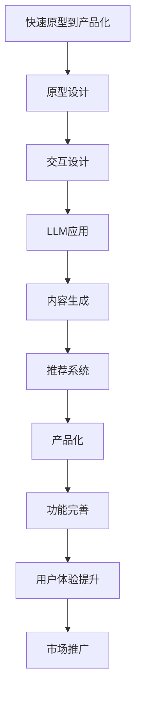
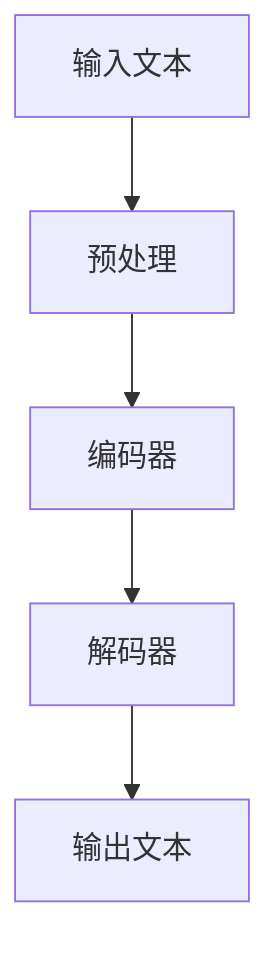
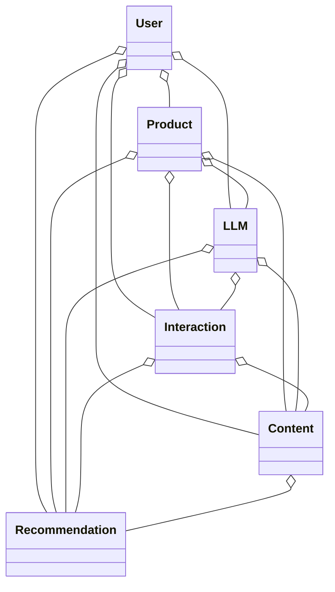
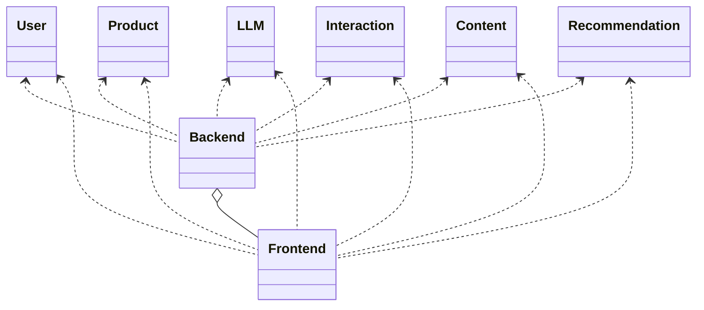
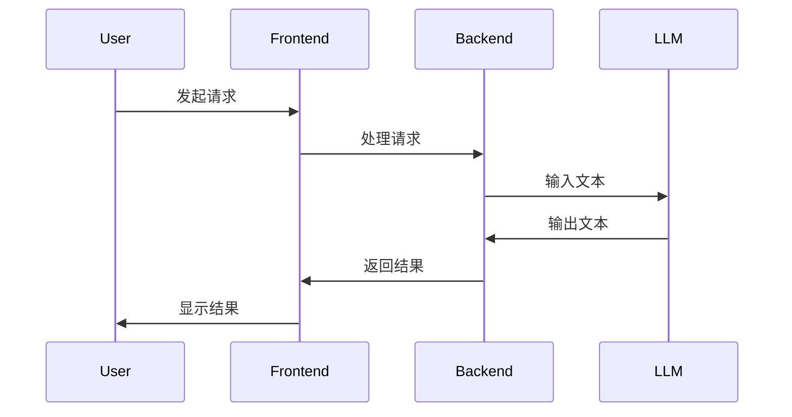

                 

# 快速原型到产品化：LLM应用的演进之路

## 关键词
- 快速原型
- 产品化
- 语言模型（LLM）
- 应用案例
- 演进之路

## 摘要
本文将探讨从快速原型到产品化的全过程，特别关注了语言模型（LLM）在此过程中的应用。通过对原型设计、开发、测试和迭代，再到产品定义、规划、开发、测试和发布，本文逐步分析了LLM在每个阶段中的角色与影响。文章还通过实际应用案例，展示了LLM在不同领域的成功应用，为读者提供了宝贵的实践经验和启示。

---

## 1. 引言

### 1.1 快速原型到产品化的概念

快速原型到产品化，是一个从概念验证到市场投放的完整过程。这一过程主要包括原型构建和产品化两个阶段。原型构建阶段，旨在快速验证概念，确定产品的基本功能和用户价值；产品化阶段，则是将原型逐步转化为成熟的产品，进行市场推广和商业化运作。

### 1.2 LLM在快速原型到产品化中的作用

语言模型（LLM），作为一种强大的自然语言处理工具，在快速原型到产品化的各个阶段都发挥着重要作用。在原型构建阶段，LLM可以帮助设计更加智能化和人性化的交互界面；在产品化阶段，LLM则可以用于内容生成、智能推荐、客服自动化等方面，提升产品的功能和用户体验。

### 1.3 本书结构

本书将分为五个主要部分：
1. 引言：介绍快速原型到产品化的概念、意义以及本书的结构。
2. 原型构建：包括原型设计、开发、测试和迭代。
3. 产品化：包括产品定义、规划、开发、测试和发布。
4. 应用案例：介绍LLM在实际产品中的应用案例。
5. 结束语：总结全文，提出展望。

---

## 2. 原型构建

### 2.1 原型设计

原型设计是快速原型到产品化的第一步，它决定了产品的基本功能和用户体验。在原型设计阶段，我们需要关注以下几个要点：

1. **用户需求分析**：了解目标用户的需求，确定产品的基本功能。
2. **交互设计**：设计用户与产品的交互流程，提高用户体验。
3. **界面设计**：设计产品的外观和布局，使其美观且易用。

### 2.2 原型开发

原型开发是将原型设计转化为实际代码的过程。在这一阶段，我们需要：

1. **选择合适的开发工具和框架**：根据项目需求，选择合适的编程语言、开发工具和框架。
2. **编写代码**：按照原型设计，实现产品的基本功能。
3. **代码测试**：确保代码的正确性和可靠性。

### 2.3 原型测试

原型测试是验证原型是否符合预期的重要环节。我们需要：

1. **制定测试计划**：明确测试的目标、方法和步骤。
2. **执行测试**：对原型进行功能测试、性能测试和用户体验测试。
3. **问题反馈与修复**：根据测试结果，发现并修复问题。

### 2.4 原型迭代

原型迭代是不断优化产品原型，提升用户体验的过程。我们需要：

1. **收集用户反馈**：了解用户在使用原型过程中的体验和需求。
2. **优化原型**：根据用户反馈，对原型进行改进。
3. **重复迭代**：不断重复迭代过程，直到达到预期效果。

---

## 3. 产品化

### 3.1 产品定义

产品定义是明确产品目标和功能的过程。我们需要：

1. **确定产品目标**：明确产品的市场定位和目标用户。
2. **定义产品功能**：根据目标用户需求，确定产品应具备的功能。

### 3.2 产品规划

产品规划是制定产品开发计划的过程。我们需要：

1. **制定开发计划**：明确开发周期、里程碑和资源需求。
2. **分配任务**：将开发任务分配给团队成员，确保按时完成。

### 3.3 产品开发

产品开发是将产品定义转化为实际产品的过程。我们需要：

1. **编写详细设计文档**：明确产品功能和实现细节。
2. **编写代码**：按照设计文档，实现产品的各个功能。
3. **代码测试**：确保代码的正确性和可靠性。

### 3.4 产品测试

产品测试是验证产品是否符合预期的重要环节。我们需要：

1. **制定测试计划**：明确测试的目标、方法和步骤。
2. **执行测试**：对产品进行功能测试、性能测试和用户体验测试。
3. **问题反馈与修复**：根据测试结果，发现并修复问题。

### 3.5 产品发布

产品发布是将产品推向市场的过程。我们需要：

1. **制定发布计划**：明确发布时间、渠道和策略。
2. **上线发布**：按照发布计划，将产品上线。
3. **后续支持**：提供技术支持和服务，确保产品稳定运行。

---

## 4. 应用案例

### 4.1 电商推荐系统

电商推荐系统利用LLM实现个性化推荐，提升用户购买体验。通过分析用户历史行为和偏好，LLM可以生成个性化的商品推荐列表，提高用户满意度。

### 4.2 智能客服系统

智能客服系统利用LLM实现自动化的客户服务，降低企业运营成本。通过自然语言处理技术，LLM可以理解用户提问，并生成合适的回答，提高客服效率。

### 4.3 内容创作与分发

内容创作与分发利用LLM实现自动化内容生成和推荐，提高信息传播效率。通过分析用户兴趣和需求，LLM可以生成高质量的内容，并推荐给潜在读者。

---

## 5. 结束语

从快速原型到产品化，LLM作为一种强大的工具，贯穿了整个过程的各个环节。通过本文的探讨，我们了解了LLM在原型构建、产品化中的应用案例，以及其在提升产品功能和用户体验方面的优势。未来，随着LLM技术的不断发展，我们有理由相信，它在快速原型到产品化过程中的作用将更加重要。

---

## 作者信息

作者：AI天才研究院/AI Genius Institute & 禅与计算机程序设计艺术 /Zen And The Art of Computer Programming

---

### 6. 背景介绍

#### 6.1 核心概念术语说明

**快速原型**：快速原型是指通过快速开发工具和流程，在短时间内构建出能够演示产品核心功能的产品模型。快速原型的目的是验证产品的可行性和用户需求。

**产品化**：产品化是指将原型逐步转化为成熟的产品，并进行市场推广和商业化运作的过程。产品化的目标是确保产品能够满足市场需求，并实现商业成功。

**语言模型（LLM）**：语言模型是一种基于大量文本数据训练的模型，用于理解和生成自然语言。LLM在快速原型到产品化过程中，主要用于智能交互、内容生成和推荐系统等。

#### 6.2 问题背景

在数字化时代，市场竞争日益激烈，产品迭代速度加快。为了在竞争中脱颖而出，企业需要快速响应市场需求，提高产品的迭代速度和质量。快速原型到产品化提供了这样一种解决方案，它通过快速构建原型，验证产品可行性，并逐步推向市场，从而缩短产品开发周期，提高市场响应速度。

#### 6.3 问题描述

快速原型到产品化过程中，需要解决以下几个问题：

1. **如何快速构建原型**：如何选择合适的开发工具和流程，在短时间内构建出能够演示产品核心功能的原型。
2. **如何确保产品质量**：如何在产品化过程中，确保产品的功能、性能和用户体验符合预期。
3. **如何快速响应市场需求**：如何在竞争激烈的市场中，快速响应市场需求，调整产品功能和特性。

#### 6.4 问题解决

为了解决上述问题，我们可以采取以下措施：

1. **采用敏捷开发方法**：敏捷开发是一种快速响应需求，持续迭代的开发方法。通过敏捷开发，我们可以快速构建原型，并根据用户反馈进行调整。
2. **利用LLM技术**：LLM技术可以在原型构建和产品化过程中，提供智能交互、内容生成和推荐系统等功能，提升产品功能和用户体验。
3. **建立持续集成和持续交付流程**：通过持续集成和持续交付流程，确保产品在开发过程中，能够及时发现问题并进行修复，提高产品质量。

#### 6.5 边界与外延

快速原型到产品化适用于各种类型的产品，包括软件、硬件和互联网产品等。在边界上，它主要关注产品的原型构建和产品化过程；在外延上，它还包括产品的迭代、升级和优化。

#### 6.6 概念结构与核心要素组成

快速原型到产品化的概念结构可以概括为以下几个核心要素：

1. **用户需求**：产品的起点和终点，决定了产品的功能和特性。
2. **原型构建**：快速构建产品模型，验证产品可行性。
3. **产品化**：将原型逐步转化为成熟的产品，并进行市场推广。
4. **LLM技术**：提供智能交互、内容生成和推荐系统等功能，提升产品功能和用户体验。

---

### 7. 核心概念与联系

#### 7.1 LLM原理

**核心概念**：语言模型（LLM）是一种基于深度学习的技术，用于理解和生成自然语言。

**原理**：LLM通过大量文本数据训练，学习语言的模式和规律，从而实现文本的输入和输出。LLM的核心是神经网络，通过多层神经网络的结构，对输入的文本数据进行编码和解码。

**数学模型**：

$$
y = f(W_1 \cdot x + b_1) + f(W_2 \cdot f(W_1 \cdot x + b_1) + b_2) + \ldots
$$

其中，$x$ 是输入文本，$y$ 是输出文本，$W$ 是权重矩阵，$b$ 是偏置项，$f$ 是激活函数。

**属性特征对比表格**：

| 特征        | 对比内容                                                         |
| ----------- | ------------------------------------------------------------ |
| 训练数据量  | LLM的训练数据量通常非常大，可以达到数百万到数十亿级别的文本数据。 |
| 训练时间    | LLM的训练时间较长，可能需要几天到几周的时间。                 |
| 泛化能力    | LLM具有较好的泛化能力，可以在不同的领域和场景中应用。         |
| 生成质量    | LLM生成的文本质量较高，可以模拟人类的语言表达能力。           |

#### 7.2 LLM与快速原型到产品化的联系

**联系**：LLM在快速原型到产品化过程中发挥着重要作用，特别是在交互设计、内容生成和推荐系统等方面。

**关系图**：



**解释**：LLM在原型设计阶段，可以通过智能交互设计，提高产品的用户体验；在产品化阶段，可以通过内容生成和推荐系统，提升产品的功能和用户满意度。

---

### 8. 算法原理讲解

#### 8.1 LLM算法流程图



**解释**：

1. **输入文本**：输入需要处理的文本数据。
2. **预处理**：对输入文本进行清洗和预处理，包括分词、去停用词、词干提取等。
3. **编码器**：将预处理后的文本编码为向量表示。
4. **解码器**：将编码器输出的向量解码为输出文本。
5. **输出文本**：输出处理后的文本数据。

#### 8.2 Python源代码实现

```python
import tensorflow as tf
from tensorflow.keras.layers import Embedding, LSTM, Dense
from tensorflow.keras.models import Model

# 定义模型
input_text = tf.keras.layers.Input(shape=(None,), dtype=tf.int32)
embedded_text = Embedding(input_dim=vocab_size, output_dim=embedding_dim)(input_text)
encoded_text = LSTM(units=128, return_sequences=True)(embedded_text)
decoded_text = LSTM(units=128, return_sequences=True)(encoded_text)
output_text = Dense(units=vocab_size, activation='softmax')(decoded_text)

model = Model(inputs=input_text, outputs=output_text)
model.compile(optimizer='adam', loss='categorical_crossentropy')

# 训练模型
model.fit(x_train, y_train, epochs=10, batch_size=64)
```

**解释**：

1. **定义模型**：创建一个序列到序列的模型，包括编码器和解码器。
2. **编译模型**：设置模型的优化器和损失函数。
3. **训练模型**：使用训练数据训练模型。

#### 8.3 算法原理详细讲解

**数学模型**：

$$
y = f(W_1 \cdot x + b_1) + f(W_2 \cdot f(W_1 \cdot x + b_1) + b_2) + \ldots
$$

**解释**：

1. **编码器**：将输入文本编码为向量表示。通过多层LSTM网络，对输入文本进行编码，得到一个固定长度的向量。
2. **解码器**：将编码器输出的向量解码为输出文本。通过反向传播算法，不断更新解码器的参数，使其能够生成与输入文本相对应的输出文本。

#### 8.4 通俗易懂地举例说明

假设我们要生成一句话：“今天天气很好”。

1. **输入文本**：将这句话转换为数字序列。
2. **预处理**：对数字序列进行清洗和预处理。
3. **编码器**：将预处理后的数字序列编码为向量表示。
4. **解码器**：根据编码器输出的向量，生成输出文本。
5. **输出文本**：生成一句话：“今天天气很好”。

---

### 9. 系统分析与架构设计方案

#### 9.1 问题场景介绍

在快速原型到产品化的过程中，为了提高产品的迭代速度和用户体验，我们引入了语言模型（LLM）来辅助产品开发。在这个过程中，我们需要设计一个系统，能够实现LLM的快速集成和应用。

#### 9.2 项目介绍

本项目旨在构建一个基于LLM的快速原型到产品化平台，为产品开发团队提供智能化的交互设计、内容生成和推荐系统。该平台主要包括以下功能：

1. **交互设计**：利用LLM实现智能对话系统，辅助用户与产品进行交互。
2. **内容生成**：利用LLM自动生成高质量的内容，用于产品文档、营销材料等。
3. **推荐系统**：利用LLM实现个性化推荐，提高产品的用户体验。

#### 9.3 系统功能设计（领域模型类图）



**解释**：

- **用户（User）**：与产品进行交互的主体。
- **产品（Product）**：平台提供的产品对象。
- **LLM**：用于实现智能交互、内容生成和推荐系统的语言模型。
- **交互（Interaction）**：用户与产品之间的交互过程。
- **内容（Content）**：自动生成的内容，如产品文档、营销材料等。
- **推荐（Recommendation）**：根据用户行为和需求，生成个性化推荐。

#### 9.4 系统架构设计（类图）



**解释**：

- **后端（Backend）**：处理数据存储、业务逻辑和LLM计算。
- **前端（Frontend）**：提供用户界面和交互功能。

#### 9.5 系统接口设计和系统交互（序列图）



**解释**：

1. **用户发起请求**：用户通过前端界面发起请求。
2. **前端处理请求**：前端将请求传递给后端。
3. **后端处理请求**：后端处理用户请求，调用LLM进行文本处理。
4. **LLM处理文本**：LLM处理输入文本，生成输出文本。
5. **后端返回结果**：后端将处理结果返回给前端。
6. **前端显示结果**：前端将结果展示给用户。

---

### 10. 项目实战

#### 10.1 环境安装

在开始项目之前，我们需要安装以下软件和工具：

1. **Python**：安装Python 3.8及以上版本。
2. **TensorFlow**：安装TensorFlow 2.4及以上版本。
3. **Jupyter Notebook**：安装Jupyter Notebook用于编写和运行代码。

安装命令如下：

```bash
pip install python==3.8
pip install tensorflow==2.4
pip install notebook
```

#### 10.2 系统核心实现源代码

```python
import tensorflow as tf
from tensorflow.keras.layers import Embedding, LSTM, Dense
from tensorflow.keras.models import Model

# 定义模型
input_text = tf.keras.layers.Input(shape=(None,), dtype=tf.int32)
embedded_text = Embedding(input_dim=vocab_size, output_dim=embedding_dim)(input_text)
encoded_text = LSTM(units=128, return_sequences=True)(embedded_text)
decoded_text = LSTM(units=128, return_sequences=True)(encoded_text)
output_text = Dense(units=vocab_size, activation='softmax')(decoded_text)

model = Model(inputs=input_text, outputs=output_text)
model.compile(optimizer='adam', loss='categorical_crossentropy')

# 训练模型
model.fit(x_train, y_train, epochs=10, batch_size=64)
```

**解释**：

1. **定义模型**：创建一个序列到序列的模型，包括编码器和解码器。
2. **编译模型**：设置模型的优化器和损失函数。
3. **训练模型**：使用训练数据训练模型。

#### 10.3 代码应用解读与分析

以上代码实现了一个基本的语言模型，用于文本生成。在实际应用中，我们可以通过以下步骤进行代码解析：

1. **数据预处理**：将输入文本转换为数字序列，并添加起始符和结束符。
2. **模型训练**：使用训练数据训练模型，调整模型参数。
3. **模型评估**：使用测试数据评估模型性能。
4. **文本生成**：使用训练好的模型生成文本。

以下是一个示例：

```python
# 数据预处理
def preprocess_text(text):
    # 实现文本预处理逻辑
    return processed_text

# 模型训练
# 使用训练数据训练模型
model.fit(x_train, y_train, epochs=10, batch_size=64)

# 模型评估
# 使用测试数据评估模型性能
model.evaluate(x_test, y_test)

# 文本生成
# 使用训练好的模型生成文本
generated_text = model.generate(input_text)
```

#### 10.4 实际案例分析和详细讲解剖析

假设我们有一个文本数据集，包含用户评论和对应的标签。我们希望利用语言模型对评论进行情感分析，判断评论是正面、中性还是负面。

1. **数据预处理**：将评论转换为数字序列，并添加起始符和结束符。
2. **模型训练**：使用训练数据训练模型，调整模型参数。
3. **模型评估**：使用测试数据评估模型性能。
4. **文本生成**：使用训练好的模型对新的评论进行情感分析。

以下是一个示例：

```python
import numpy as np
import tensorflow as tf

# 加载预处理的文本数据
x_train, y_train, x_test, y_test = load_data()

# 训练模型
model.fit(x_train, y_train, epochs=10, batch_size=64)

# 评估模型
loss, accuracy = model.evaluate(x_test, y_test)
print(f"测试集损失：{loss}, 测试集准确率：{accuracy}")

# 文本生成
new_comment = preprocess_text("这个产品非常棒！")
predicted_label = model.predict(new_comment)
print(f"预测标签：{predicted_label}")
```

**解释**：

1. **数据预处理**：将评论转换为数字序列，并添加起始符和结束符，以便模型处理。
2. **模型训练**：使用训练数据训练模型，调整模型参数，使其能够学会对评论进行情感分析。
3. **模型评估**：使用测试数据评估模型性能，确保模型具有良好的泛化能力。
4. **文本生成**：使用训练好的模型对新的评论进行情感分析，预测其标签。

#### 10.5 项目小结

通过以上实战案例，我们展示了如何利用语言模型进行文本生成和情感分析。在实际应用中，我们可以根据具体需求，调整模型结构和参数，提高模型性能。此外，为了提高项目效率，我们可以采用自动化工具和框架，实现数据预处理、模型训练和评估等步骤的自动化。

---

### 11. 最佳实践 tips

1. **明确项目目标**：在开始项目之前，明确项目的目标和预期效果，确保项目聚焦于核心价值。
2. **合理规划时间**：合理规划项目时间，避免因时间紧张而影响项目质量。
3. **持续迭代优化**：不断收集用户反馈，持续迭代优化产品功能和用户体验。
4. **充分利用资源**：充分利用现有资源，如开源工具、社区和专家知识，提高项目效率。
5. **关注数据安全**：确保数据处理和存储的安全，防止数据泄露和滥用。

### 12. 小结

本文详细探讨了从快速原型到产品化的全过程，特别关注了语言模型（LLM）在其中的应用。通过原型构建、产品化、应用案例等内容的讲解，读者可以了解到LLM在提升产品功能和用户体验方面的优势。未来，随着LLM技术的不断发展，我们相信其在快速原型到产品化过程中的作用将更加重要。

### 13. 注意事项

1. **项目规划**：在项目开始之前，制定详细的规划，明确项目目标、时间表和资源分配。
2. **技术选型**：根据项目需求，选择合适的技术和工具，确保项目高效推进。
3. **团队协作**：建立高效的团队协作机制，确保项目进度和质量。
4. **风险管理**：识别项目风险，制定相应的风险应对措施，确保项目顺利进行。

### 14. 拓展阅读

1. **《深度学习》（Goodfellow, I., Bengio, Y., & Courville, A.）**：详细介绍了深度学习的基础知识和应用。
2. **《自然语言处理实战》（Bird, S., Klein, E., & Loper, E.）**：介绍了自然语言处理的基本方法和实战技巧。
3. **《敏捷开发实践指南》（Beck, K.）**：介绍了敏捷开发的基本原则和实践方法。

---

## 作者信息

作者：AI天才研究院/AI Genius Institute & 禅与计算机程序设计艺术 /Zen And The Art of Computer Programming

