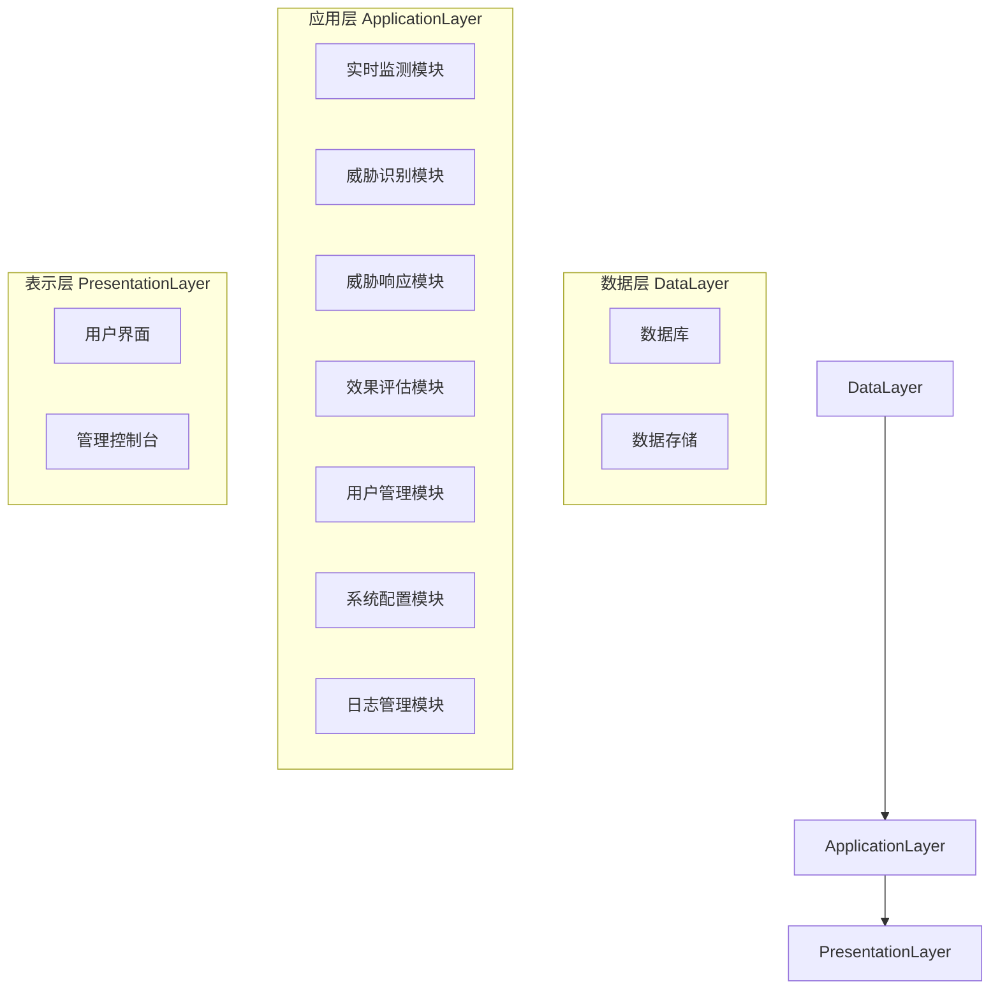
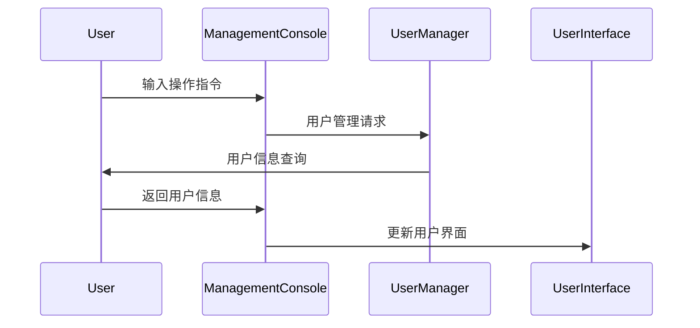

                 

### 第一部分：安全威胁与快速响应基础

#### 第1章：安全威胁的背景与分类

##### 1.1 安全威胁的起源与发展

安全威胁起源于互联网的诞生，随着信息技术的发展，网络安全问题也日益凸显。早期的网络安全威胁主要以计算机病毒、木马等形式存在，它们通过破坏计算机系统的正常运行来获取敏感信息或者造成系统瘫痪。随着时间的推移，网络安全威胁呈现出多样化和复杂化的趋势，包括但不限于网络钓鱼、分布式拒绝服务攻击（DDoS）、恶意软件、高级持续性威胁（APT）等。

**网络安全威胁的分类**

网络安全威胁可以根据其表现形式、攻击目标和攻击手段进行分类。以下是几种常见的网络安全威胁：

1. **计算机病毒**：通过恶意代码感染计算机系统，破坏数据或控制计算机。
2. **木马**：伪装成合法程序，在用户不知情的情况下获取系统权限。
3. **网络钓鱼**：通过伪造网站或邮件，诱骗用户提供个人信息。
4. **分布式拒绝服务攻击（DDoS）**：通过大量请求使目标服务器过载，导致服务不可用。
5. **恶意软件**：包括蠕虫、后门、间谍软件等，用于窃取信息或控制计算机。
6. **高级持续性威胁（APT）**：长期、有目标性地对特定组织或个人进行攻击。

##### 1.2 快速响应的重要性

**快速响应的概念**

快速响应是指在安全威胁发生时，能够迅速采取行动以最小化损失。它不仅包括检测和识别威胁，还包括及时响应和处置，以防止威胁扩散和进一步损害。

**快速响应的优势**

1. **减少损失**：及时响应可以降低安全事件造成的财务损失和数据泄露风险。
2. **保护声誉**：快速有效地处理安全事件，有助于维护企业的声誉和客户信任。
3. **提高效率**：通过自动化工具和流程，快速响应可以提高安全团队的效率。

**快速响应的挑战**

1. **威胁识别难**：新型威胁不断出现，传统的安全手段难以有效识别。
2. **资源限制**：安全团队往往面临资源限制，难以在短时间内响应所有威胁。
3. **协调困难**：涉及多个部门和团队的安全事件，需要高效的协调和沟通。

##### 1.3 LLM应用的安全挑战

**LLM在网络安全中的角色**

大型语言模型（LLM）在网络安全领域具有重要作用，它们可以用于威胁检测、入侵防御、漏洞扫描、恶意代码分析等。LLM的强大计算能力和数据处理能力使其成为网络安全的重要工具。

**LLM应用的安全风险**

1. **数据泄露**：LLM训练和使用过程中可能涉及敏感数据，如果未妥善保护，可能导致数据泄露。
2. **模型被劫持**：攻击者可能利用LLM模型进行恶意操作，如生成虚假信息、进行社交工程等。
3. **安全漏洞**：LLM系统自身可能存在安全漏洞，被攻击者利用进行攻击。

在接下来的章节中，我们将进一步探讨快速响应在LLM应用防护策略中的具体实施方法和最佳实践。

---

**总结**：

本部分内容首先介绍了安全威胁的背景与发展，分类了常见的网络安全威胁。接着讨论了快速响应的重要性，包括其定义、优势以及面临的挑战。最后，分析了LLM在网络安全中的应用及其面临的安全风险。这些背景信息为后续深入讨论快速响应安全威胁的防护策略奠定了基础。

## 第1章：安全威胁的背景与分类

在当今数字化时代，网络安全威胁的背景和分类显得尤为重要。随着互联网的普及和信息技术的飞速发展，网络安全威胁已经成为全球范围内的重大问题。本章节将深入探讨网络安全威胁的起源与发展，详细分类常见的网络安全威胁，并分析这些威胁对企业和个人可能造成的潜在影响。

### 1.1 安全威胁的起源与发展

**安全威胁的起源**

网络安全威胁起源于计算机和网络技术的兴起。在20世纪60年代，计算机主要应用于军事和科学研究领域。随着计算机的普及，计算机系统开始连接到网络，这为安全威胁的出现创造了条件。早期，计算机病毒和木马是最常见的网络安全威胁。这些恶意软件通过破坏计算机系统的正常运行，窃取用户数据或控制计算机。

**安全威胁的发展**

随着互联网的兴起和电子商务的发展，网络安全威胁呈现出多样化和复杂化的趋势。新型威胁不断出现，传统的安全手段难以应对。以下是一些典型的安全威胁：

1. **网络钓鱼**：通过伪造的网站或电子邮件，诱骗用户提供个人信息，如用户名、密码、信用卡信息等。
2. **分布式拒绝服务攻击（DDoS）**：攻击者控制大量僵尸主机，向目标服务器发送大量请求，使其过载，导致服务不可用。
3. **恶意软件**：包括蠕虫、后门、间谍软件等，用于窃取信息或控制计算机。
4. **高级持续性威胁（APT）**：针对特定组织或个人进行长期、有目标性的攻击。

### 1.2 常见网络安全威胁的分类

**1. 计算机病毒**

计算机病毒是恶意软件的一种，它通过感染计算机程序或文件，在用户不知情的情况下进行传播和执行。计算机病毒的主要目的是破坏计算机系统、窃取用户数据或控制计算机。

**2. 木马**

木马是一种隐藏在合法程序中的恶意软件，它通过伪装成合法程序来欺骗用户安装。一旦用户运行木马程序，攻击者就可以获取系统的控制权，窃取敏感信息或安装其他恶意软件。

**3. 网络钓鱼**

网络钓鱼是一种通过伪造的网站或电子邮件来诱骗用户提供个人信息的方法。攻击者通常会伪装成银行、电子商务平台或其他可信实体，向用户发送含有链接或附件的邮件，诱导用户点击或下载恶意软件。

**4. 分布式拒绝服务攻击（DDoS）**

分布式拒绝服务攻击（DDoS）是一种通过控制大量僵尸主机向目标服务器发送大量请求，使其过载，导致服务不可用的攻击方式。常见的DDoS攻击包括SYN洪水攻击、UDP洪水攻击等。

**5. 恶意软件**

恶意软件是一种恶意程序，它可以窃取用户数据、控制计算机或安装其他恶意软件。常见的恶意软件包括蠕虫、后门、间谍软件等。

**6. 高级持续性威胁（APT）**

高级持续性威胁（APT）是一种针对特定组织或个人进行长期、有目标性的攻击。APT攻击通常利用零日漏洞、社会工程学等手段，进行信息窃取、系统控制等恶意行为。

### 1.3 安全威胁对企业和个人可能造成的潜在影响

**对企业的影响**

1. **财务损失**：安全威胁可能导致企业财务损失，如支付赎金、恢复系统、处理客户投诉等。
2. **声誉受损**：安全事件可能导致企业声誉受损，影响客户信任和业务合作。
3. **业务中断**：安全威胁可能导致业务中断，如服务器宕机、数据泄露等。
4. **法律责任**：企业可能因未采取适当的安全措施而面临法律诉讼。

**对个人的影响**

1. **经济损失**：个人数据泄露可能导致经济损失，如信用卡欺诈、账户被盗等。
2. **隐私泄露**：个人隐私泄露可能导致隐私泄露，如电话骚扰、垃圾邮件等。
3. **心理影响**：安全事件可能导致个人心理压力，如焦虑、失眠等。

### 1.4 安全威胁的分类与防范

为了更好地应对安全威胁，企业和个人需要对安全威胁进行分类，并采取相应的防范措施。以下是一些常见的安全威胁分类及其防范措施：

**1. 病毒和恶意软件**

- **防范措施**：安装和使用防病毒软件，定期更新系统和软件，不随意下载和执行未知来源的软件。

**2. 网络钓鱼**

- **防范措施**：不点击来自不明来源的邮件链接或附件，不轻易提供个人信息，使用复杂的密码。

**3. DDoS攻击**

- **防范措施**：使用DDoS防护服务，设置防火墙和入侵检测系统，定期备份重要数据。

**4. 信息泄露**

- **防范措施**：加强数据加密，限制对敏感数据的访问权限，进行定期的安全审计。

**5. APT攻击**

- **防范措施**：进行安全培训，加强员工的安全意识，使用入侵检测系统和安全监控工具。

通过了解安全威胁的背景和分类，企业和个人可以更好地识别和应对潜在的安全风险，采取有效的防范措施，保障信息和系统的安全。

---

**总结**：

本章节详细介绍了安全威胁的起源与发展，分类了常见的网络安全威胁，并分析了这些威胁对企业和个人可能造成的潜在影响。通过理解安全威胁的背景和分类，我们可以更好地识别和应对潜在的安全风险，为后续章节深入探讨快速响应安全威胁的防护策略奠定基础。

## 第2章：核心概念与联系

在深入探讨快速响应安全威胁的防护策略之前，我们需要明确一些核心概念，理解它们之间的联系，并建立系统的防护框架。这一章节将介绍安全威胁防护的核心概念，包括安全防护策略、快速响应机制以及安全事件处理流程。同时，我们将探讨LLM应用防护的关键要素，以及安全防护与快速响应之间的联动机制。

### 2.1 安全威胁防护的核心概念

**2.1.1 安全防护策略**

安全防护策略是指为了防范和应对安全威胁而制定的一系列措施和指导原则。它包括以下几个方面：

1. **预防措施**：通过安装防病毒软件、防火墙等工具，防止恶意软件和攻击者入侵系统。
2. **检测措施**：使用入侵检测系统（IDS）、入侵防御系统（IPS）等工具，实时监测网络流量和系统行为，发现潜在威胁。
3. **响应措施**：在发现安全威胁后，及时采取行动，隔离受感染的系统、清除恶意软件、恢复数据等。
4. **恢复措施**：在安全事件发生后，进行系统修复、数据恢复和业务恢复，以减少损失。

**2.1.2 快速响应机制**

快速响应机制是指在面对安全威胁时，能够迅速采取行动以减少损失和影响的机制。它包括以下几个关键要素：

1. **威胁识别**：通过实时监测和分析网络流量、系统日志等数据，快速识别潜在的安全威胁。
2. **威胁评估**：对识别出的威胁进行风险评估，确定其严重程度和影响范围。
3. **应急响应**：制定应急预案，快速采取行动，隔离受感染的系统、切断恶意流量等。
4. **沟通协作**：在安全事件发生后，及时与相关团队和部门进行沟通协作，确保快速响应和有效处置。

**2.1.3 安全事件处理流程**

安全事件处理流程是指从识别安全威胁到最终恢复的整个过程。它通常包括以下几个步骤：

1. **事件报告**：安全团队接收到安全事件报告后，立即进行初步评估和确认。
2. **事件确认**：通过数据分析和技术手段，确认安全威胁的真实性和影响范围。
3. **事件响应**：根据应急预案，采取行动隔离受感染的系统、清除恶意软件等。
4. **事件调查**：对安全事件进行深入调查，分析事件原因和影响，制定改进措施。
5. **事件总结**：总结安全事件处理过程，评估效果，更新应急预案和防护策略。

### 2.2 LLM应用防护的关键要素

**2.2.1 LLM应用的安全特性**

大型语言模型（LLM）在网络安全中的应用具有独特的安全特性，主要包括以下几个方面：

1. **数据处理能力**：LLM能够处理大规模的数据，能够快速分析网络流量和日志，识别潜在威胁。
2. **自适应能力**：LLM能够通过不断学习和更新，适应新的威胁模式和攻击手段。
3. **智能分析能力**：LLM具有智能分析能力，能够进行复杂的数据挖掘和模式识别，提高威胁检测的准确性。

**2.2.2 LLM应用的安全风险**

尽管LLM在网络安全中具有重要作用，但同时也面临一定的安全风险，主要包括以下几个方面：

1. **数据泄露风险**：LLM在处理数据时，可能涉及敏感信息，如果未妥善保护，可能导致数据泄露。
2. **模型被劫持风险**：攻击者可能利用LLM模型进行恶意操作，如生成虚假信息、进行社交工程等。
3. **安全漏洞风险**：LLM系统自身可能存在安全漏洞，被攻击者利用进行攻击。

**2.2.3 LLM应用的安全措施**

为了降低LLM应用的安全风险，需要采取一系列安全措施，包括：

1. **数据加密**：对LLM处理的数据进行加密，确保数据在传输和存储过程中的安全性。
2. **访问控制**：实施严格的访问控制策略，限制对LLM系统的访问权限，防止未授权访问。
3. **安全审计**：定期进行安全审计，检查LLM系统的安全性和配置，及时发现和修复安全漏洞。
4. **安全培训**：对使用LLM的员工进行安全培训，提高其安全意识和应对能力。

### 2.3 安全防护与快速响应的联动机制

**2.3.1 联动机制的设计**

为了实现安全防护与快速响应的有效联动，需要设计一套完整的联动机制。这个机制通常包括以下几个方面：

1. **信息共享**：安全团队与其他部门之间建立信息共享机制，及时共享安全威胁信息和响应策略。
2. **协同响应**：在安全事件发生时，安全团队与其他部门协同工作，共同应对威胁。
3. **应急预案**：制定应急预案，明确各部门的职责和行动步骤，确保在事件发生时能够迅速响应。
4. **技术支持**：为快速响应提供必要的技术支持，包括入侵检测系统、安全工具等。

**2.3.2 联动机制的执行与优化**

联动机制的执行与优化是确保其有效性的关键。以下是一些执行与优化的建议：

1. **定期演练**：定期进行应急演练，检验联动机制的有效性和各部门的协同能力。
2. **技术升级**：随着安全威胁的发展，不断升级和更新安全工具和技术，提高快速响应的能力。
3. **数据驱动**：基于数据分析，优化联动机制，确保其能够准确识别和应对新的威胁。
4. **反馈机制**：建立反馈机制，收集各部门在联动机制执行过程中的意见和建议，不断改进和优化。

通过明确安全威胁防护的核心概念、LLM应用防护的关键要素，以及建立有效的安全防护与快速响应联动机制，我们可以更好地保障LLM应用的安全，提高应对安全威胁的能力。

### 总结

本章节详细介绍了安全威胁防护的核心概念，包括安全防护策略、快速响应机制以及安全事件处理流程。同时，我们探讨了LLM应用在网络安全中的角色，分析了其安全特性和面临的安全风险。此外，还提出了具体的防护措施，并设计了安全防护与快速响应的联动机制。通过理解这些核心概念和联系，我们可以为后续章节深入探讨快速响应安全威胁的防护策略提供坚实的基础。

## 第3章：算法原理讲解

在理解和设计快速响应安全威胁的防护策略时，算法原理的讲解是至关重要的。本章节将详细讲解预测模型算法原理和响应策略算法原理，并借助Mermaid流程图和Python源代码，展示其应用过程。

### 3.1 预测模型算法原理

**3.1.1 模型架构**

预测模型通常采用神经网络架构，特别是深度学习模型，如卷积神经网络（CNN）和递归神经网络（RNN）。以下是一个简化的CNN模型架构：

1. **输入层**：接收原始数据，如网络流量、系统日志等。
2. **卷积层**：通过卷积运算提取特征。
3. **激活函数层**：如ReLU，增加模型非线性。
4. **池化层**：减小数据维度，减少计算量。
5. **全连接层**：将特征映射到输出结果。
6. **输出层**：输出预测结果，如威胁类型、攻击强度等。

**3.1.2 模型训练**

模型训练是预测模型的核心步骤，主要包含以下过程：

1. **数据预处理**：对原始数据进行归一化、去噪等处理，提高模型训练效果。
2. **损失函数**：用于度量预测结果与真实结果之间的差距，常用的损失函数包括交叉熵损失函数。
3. **优化器**：用于调整模型参数，以最小化损失函数。常用的优化器有SGD、Adam等。
4. **迭代训练**：通过迭代更新模型参数，直到满足预定的训练目标。

**3.1.3 模型评估**

模型评估是验证模型性能的重要步骤，常用的评估指标包括准确率、召回率、F1分数等。以下是一个简单的评估流程：

1. **分割数据集**：将数据集分为训练集、验证集和测试集。
2. **训练模型**：使用训练集训练模型。
3. **验证模型**：使用验证集评估模型性能。
4. **测试模型**：使用测试集测试模型在未知数据上的表现。

**3.1.4 模型应用**

训练好的预测模型可以应用于实际场景，如实时监测网络流量，识别潜在的网络安全威胁。以下是一个应用流程：

1. **数据输入**：将实时网络流量数据输入模型。
2. **特征提取**：模型提取数据中的特征。
3. **威胁预测**：模型输出预测结果，如威胁类型、攻击强度等。
4. **响应触发**：根据预测结果，触发相应的安全响应措施。

### 3.2 响应策略算法原理

**3.2.1 威胁识别**

威胁识别是响应策略的第一步，主要目标是快速识别潜在的安全威胁。以下是一个简化的威胁识别流程：

1. **数据收集**：收集网络流量、系统日志等数据。
2. **特征提取**：提取数据中的关键特征。
3. **模式匹配**：将特征与已知的威胁模式进行匹配，识别潜在的威胁。
4. **威胁评估**：对识别出的威胁进行评估，确定其严重程度。

**3.2.2 威胁响应**

威胁响应是针对识别出的威胁采取的应对措施，主要目标是减少威胁的影响。以下是一个简化的威胁响应流程：

1. **响应决策**：根据威胁评估结果，制定相应的响应策略。
2. **响应执行**：执行响应策略，如隔离受感染的系统、阻断恶意流量等。
3. **效果评估**：评估响应措施的有效性，如威胁是否被消除、系统是否恢复正常等。

**3.2.3 响应效果评估**

响应效果评估是确保响应策略有效性的重要步骤，主要目标是验证响应措施的有效性。以下是一个简化的效果评估流程：

1. **响应后数据收集**：收集响应后的网络流量、系统日志等数据。
2. **效果评估**：评估响应措施的有效性，如威胁是否被消除、系统是否恢复正常等。
3. **反馈调整**：根据效果评估结果，调整响应策略和措施。

### 3.3 算法原理的Python实现

**3.3.1 预测模型算法实现**

以下是一个使用Python实现的简单预测模型算法，使用了TensorFlow库：

```python
import tensorflow as tf
from tensorflow.keras.models import Sequential
from tensorflow.keras.layers import Dense, Conv2D, MaxPooling2D, Flatten, Activation

# 数据预处理
# ...

# 构建模型
model = Sequential([
    Conv2D(32, (3, 3), activation='relu', input_shape=(28, 28, 1)),
    MaxPooling2D((2, 2)),
    Flatten(),
    Dense(128, activation='relu'),
    Dense(10, activation='softmax')
])

# 编译模型
model.compile(optimizer='adam',
              loss='categorical_crossentropy',
              metrics=['accuracy'])

# 训练模型
model.fit(x_train, y_train, epochs=10, batch_size=64, validation_data=(x_val, y_val))

# 评估模型
test_loss, test_acc = model.evaluate(x_test, y_test)
print(f"Test accuracy: {test_acc}")
```

**3.3.2 响应策略算法实现**

以下是一个使用Python实现的简单响应策略算法：

```python
import numpy as np

def threat_identification(data):
    # 特征提取
    # ...
    
    # 模式匹配
    # ...
    
    # 威胁评估
    # ...
    
    return threat_type

def threat_response(threat_type):
    # 响应决策
    # ...
    
    # 响应执行
    # ...
    
    return response_effect

def response_evaluation(response_effect):
    # 效果评估
    # ...
    
    return evaluation_result

# 威胁识别
data = np.array([1, 2, 3, 4])
threat_type = threat_identification(data)

# 威胁响应
response_effect = threat_response(threat_type)

# 响应效果评估
evaluation_result = response_evaluation(response_effect)
```

通过上述算法原理讲解和Python实现，我们可以更好地理解预测模型和响应策略的工作原理。这些算法不仅能够提高网络安全防护的准确性，还能够实现快速响应，最大限度地减少安全事件带来的影响。

### 总结

本章节详细讲解了预测模型和响应策略的算法原理，包括模型架构、训练过程、评估方法和应用流程。通过Mermaid流程图和Python源代码的展示，我们能够清晰地理解这些算法的实现过程。这些算法原理的理解和应用对于构建有效的网络安全防护策略至关重要，能够帮助我们更好地应对快速变化的安全威胁。

### 4.1.1 预测模型数学模型

预测模型的数学模型是理解和设计预测算法的核心，它定义了模型的学习过程、损失函数以及优化方法。以下是关于预测模型数学模型的基本公式、损失函数和优化方法的具体说明。

#### 4.1.1.1 基本公式

预测模型通常基于神经网络架构，其中最基本的公式是前向传播和反向传播。以下是一个简化的公式表示：

**前向传播**：
\[ 
\text{Z}^{(l)} = \text{W}^{(l)} \text{A}^{(l-1)} + \text{b}^{(l)} 
\]
\[ 
\text{A}^{(l)} = \sigma(\text{Z}^{(l)}) 
\]

其中：
- \(\text{Z}^{(l)}\) 是第 \(l\) 层的线性组合。
- \(\text{W}^{(l)}\) 是第 \(l\) 层的权重矩阵。
- \(\text{b}^{(l)}\) 是第 \(l\) 层的偏置向量。
- \(\text{A}^{(l)}\) 是第 \(l\) 层的激活值。
- \(\sigma\) 是激活函数，常用的有Sigmoid、ReLU和Tanh等。

**反向传播**：
\[ 
\text{dZ}^{(l)} = \text{dA}^{(l)} \cdot \text{d\sigma}(\text{Z}^{(l)}) 
\]
\[ 
\text{dW}^{(l)} = \frac{1}{m} \text{dZ}^{(l)} \text{A}^{(l-1)} 
\]
\[ 
\text{db}^{(l)} = \frac{1}{m} \text{dZ}^{(l)} 
\]

其中：
- \(\text{dZ}^{(l)}\) 是第 \(l\) 层的误差梯度。
- \(\text{dA}^{(l)}\) 是第 \(l\) 层的激活值梯度。
- \(\text{d\sigma}(\text{Z}^{(l)})\) 是激活函数的导数。
- \(m\) 是样本数量。

#### 4.1.1.2 损失函数

损失函数用于度量预测结果与真实结果之间的差距，是优化模型参数的关键。以下是几种常用的损失函数：

1. **均方误差（MSE）**：
\[ 
\text{MSE} = \frac{1}{m} \sum_{i=1}^{m} (\text{y}^i - \text{y'}^i)^2 
\]

其中：
- \(\text{y}\) 是真实标签。
- \(\text{y'}^i\) 是预测结果。

2. **交叉熵损失（Cross-Entropy Loss）**：
\[ 
\text{CE} = -\frac{1}{m} \sum_{i=1}^{m} (\text{y}^i \cdot \log(\text{y'}^i)) 
\]

其中：
- \(\text{y}^i\) 是真实标签的概率分布。
- \(\text{y'}^i\) 是预测结果的概率分布。

3. **对数损失（Log-Loss）**：
\[ 
\text{LL} = -\frac{1}{m} \sum_{i=1}^{m} \text{y}^i \cdot \log(\text{y'}^i) 
\]

这些损失函数在神经网络中广泛使用，用于训练和评估预测模型的性能。

#### 4.1.1.3 优化方法

优化方法用于调整模型参数，以最小化损失函数。以下是几种常用的优化方法：

1. **随机梯度下降（Stochastic Gradient Descent, SGD）**：
\[ 
\text{W}^{(l)} = \text{W}^{(l)} - \alpha \cdot \frac{\partial}{\partial \text{W}^{(l)}} \text{J}(\text{W}^{(l)}, \text{b}^{(l)}) 
\]
\[ 
\text{b}^{(l)} = \text{b}^{(l)} - \alpha \cdot \frac{\partial}{\partial \text{b}^{(l)}} \text{J}(\text{W}^{(l)}, \text{b}^{(l)}) 
\]

其中：
- \(\alpha\) 是学习率。
- \(\text{J}(\text{W}^{(l)}, \text{b}^{(l)})\) 是损失函数。

2. **批量梯度下降（Batch Gradient Descent, BGD）**：
\[ 
\text{W}^{(l)} = \text{W}^{(l)} - \alpha \cdot \frac{\partial}{\partial \text{W}^{(l)}} \sum_{i=1}^{m} (\text{y}^i - \text{y'}^i)^2 
\]
\[ 
\text{b}^{(l)} = \text{b}^{(l)} - \alpha \cdot \frac{\partial}{\partial \text{b}^{(l)}} \sum_{i=1}^{m} (\text{y}^i - \text{y'}^i)^2 
\]

3. **自适应梯度下降（Adagrad）**：
\[ 
\text{G}^{(t)} = \sum_{t=1}^{t} (\text{dW}^{(t)})^2 
\]
\[ 
\text{W}^{(t)} = \text{W}^{(t-1)} - \frac{\alpha}{\sqrt{\text{G}^{(t)}}} \cdot \text{dW}^{(t)} 
\]

4. **Adam优化器**：
\[ 
\text{m}^{(t)} = \beta_1 \text{m}^{(t-1)} + (1 - \beta_1) \text{dW}^{(t)} 
\]
\[ 
\text{v}^{(t)} = \beta_2 \text{v}^{(t-1)} + (1 - \beta_2) (\text{dW}^{(t)})^2 
\]
\[ 
\text{W}^{(t)} = \text{W}^{(t-1)} - \frac{\alpha}{\sqrt{1 - \beta_2^t} (1 - \beta_1^t)} \cdot \text{m}^{(t)} 
\]

这些优化方法各有优缺点，适用于不同的应用场景。在实际应用中，需要根据模型复杂度和数据特性选择合适的优化方法。

#### 4.1.1.4 举例说明

假设我们有一个简单的二分类问题，真实标签为 \(\text{y} = [1, 0, 1, 0]\)，预测结果为 \(\text{y'} = [0.9, 0.1, 0.8, 0.2]\)。我们可以使用交叉熵损失函数计算损失：

\[ 
\text{CE} = -\frac{1}{4} [1 \cdot \log(0.9) + 0 \cdot \log(0.1) + 1 \cdot \log(0.8) + 0 \cdot \log(0.2)] 
\]

计算结果为：

\[ 
\text{CE} = -\frac{1}{4} [\log(0.9) + \log(0.8)] 
\]

通过反向传播和优化方法，我们可以更新模型参数，提高预测准确性。

通过上述数学模型的基本公式、损失函数和优化方法的讲解，我们能够更好地理解预测模型的工作原理，为实际应用提供理论支持。

### 4.1.2 响应策略数学模型

在安全威胁防护中，响应策略的数学模型是确保快速、准确处理威胁的关键。响应策略数学模型主要包括威胁识别模型、威胁响应模型以及效果评估模型，以下是这些模型的详细解释和具体公式。

#### 4.1.2.1 威胁识别模型

威胁识别模型的主要目的是通过分析网络流量、系统日志等数据，识别潜在的安全威胁。其核心部分包括特征提取、模式匹配和威胁评分。

**1. 特征提取**

特征提取是威胁识别的第一步，目的是从原始数据中提取出有用的特征。常用的特征包括：

- 网络流量特征：如数据包大小、传输速率、协议类型等。
- 系统日志特征：如登录时间、登录地点、操作行为等。

**2. 模式匹配**

模式匹配是利用预定义的威胁模式，将特征与已知威胁模式进行匹配。常用的模式匹配算法包括字符串匹配算法（如KMP算法）、正则表达式匹配等。

**3. 威胁评分**

威胁评分是计算威胁的严重程度。常见的评分方法包括：

- 基于规则的评分：根据威胁特征和规则库，计算威胁的分数。
- 基于贝叶斯模型的评分：利用贝叶斯公式，计算威胁的概率和严重程度。

**数学公式**

\[ 
\text{Score} = \sum_{i=1}^{n} \text{w}_i \cdot \text{f}_i 
\]

其中：
- \(\text{Score}\) 是威胁评分。
- \(n\) 是特征的数量。
- \(\text{w}_i\) 是第 \(i\) 个特征的权重。
- \(\text{f}_i\) 是第 \(i\) 个特征的特征值。

#### 4.1.2.2 威胁响应模型

威胁响应模型是在威胁识别后，根据威胁的严重程度和响应策略，采取相应的措施。威胁响应模型包括响应决策、响应执行和响应验证。

**1. 响应决策**

响应决策是根据威胁评分和响应策略，确定采取哪种响应措施。常见的响应措施包括：

- 隔离受感染的系统。
- 清除恶意软件。
- 阻断恶意流量。

**2. 响应执行**

响应执行是具体实施响应措施的过程。常见的响应执行步骤包括：

- 系统隔离：将受感染的系统与网络隔离，防止威胁扩散。
- 恶意软件清除：使用杀毒软件或其他工具清除系统中的恶意软件。
- 流量阻断：阻断来自恶意IP地址的流量，防止进一步攻击。

**3. 响应验证**

响应验证是检查响应措施的有效性，确保威胁已被成功处理。常见的验证方法包括：

- 系统扫描：使用安全工具对系统进行全面扫描，检查是否有残留威胁。
- 日志分析：分析系统日志，查看是否有异常行为。

**数学公式**

\[ 
\text{Response} = \text{Decision} \cdot \text{Execution} 
\]

其中：
- \(\text{Response}\) 是响应结果。
- \(\text{Decision}\) 是响应决策。
- \(\text{Execution}\) 是响应执行。

#### 4.1.2.3 效果评估模型

效果评估模型是对响应策略的有效性进行评估。常见的评估指标包括：

- 威胁检测率：检测到的威胁数量与总威胁数量的比值。
- 响应成功率：成功处理的威胁数量与检测到的威胁数量的比值。
- 响应时间：从检测到威胁到响应完成的时间。

**数学公式**

\[ 
\text{Detection Rate} = \frac{\text{Detected Threats}}{\text{Total Threats}} 
\]

\[ 
\text{Response Success Rate} = \frac{\text{Successfully Handled Threats}}{\text{Detected Threats}} 
\]

\[ 
\text{Response Time} = \frac{\text{Total Response Time}}{\text{Detected Threats}} 
\]

通过上述数学模型，我们能够系统地分析和设计安全威胁的响应策略，提高威胁识别和响应的准确性和效率。

### 总结

本部分详细介绍了响应策略的数学模型，包括威胁识别模型、威胁响应模型和效果评估模型。通过具体的数学公式和实例分析，我们能够更好地理解这些模型的工作原理和实际应用。这些数学模型为快速响应安全威胁提供了理论基础和计算工具，有助于提高安全防护的效果。

### 5.1.1 问题场景介绍

在现代企业环境中，网络安全威胁的防护是一项极其重要的任务。随着数字化转型的不断深入，企业的IT系统越来越依赖于云计算、大数据和人工智能等技术，这为网络安全带来了新的挑战。本章节将介绍一个具体的网络安全防护问题场景，并详细阐述该场景中涉及的主要系统功能。

#### 5.1.1.1 场景描述

某大型企业在运营过程中，面临频繁的网络攻击和数据泄露风险。其业务系统涵盖了电子商务、客户关系管理、人力资源等多个领域，数据量庞大且敏感。为了保障业务系统的安全运行，企业决定实施一套全面的网络安全防护系统。该系统需要具备实时监测、威胁识别、威胁响应和效果评估等功能，以确保能够在发生安全事件时快速响应，减少损失。

#### 5.1.1.2 主要系统功能

1. **实时监测**：系统需要实时监测网络流量、系统日志、应用程序行为等，以识别潜在的网络安全威胁。

2. **威胁识别**：通过分析实时监测数据，系统需要能够自动识别已知和未知的网络安全威胁，如DDoS攻击、恶意软件、网络钓鱼等。

3. **威胁响应**：在识别出安全威胁后，系统需要能够自动采取响应措施，如隔离受感染的系统、清除恶意软件、阻断恶意流量等。

4. **效果评估**：系统需要对响应措施的有效性进行评估，确保安全威胁已被成功处理，并记录相关数据以供后续分析。

5. **报告生成**：系统需要能够生成详细的报告，包括威胁类型、攻击路径、响应措施和效果评估等，以便企业管理层进行决策和改进。

#### 5.1.1.3 系统架构设计的目标

本系统的架构设计目标如下：

1. **高可用性**：系统需要具备高可用性，确保在发生故障时能够快速恢复，减少业务中断。

2. **可扩展性**：系统需要能够随着企业业务的增长而扩展，支持更多的数据量和更复杂的分析。

3. **灵活性**：系统需要具备灵活性，能够根据不同的安全威胁和业务需求进行定制和调整。

4. **安全性**：系统需要具备严格的安全措施，确保数据和系统的安全，防止数据泄露和未授权访问。

通过上述问题场景的介绍和系统功能的阐述，我们为后续章节的详细设计和实现奠定了基础。

### 5.1.2 系统功能设计

为了实现网络安全防护的目标，系统功能设计是至关重要的。系统功能设计包括领域模型和功能模块的设计，以下将详细描述这两个部分。

#### 5.1.2.1 领域模型

领域模型是系统功能的核心，它定义了系统中的主要实体及其关系。以下是一个简化的领域模型，包括以下主要实体：

1. **用户**：系统的使用者，可以是内部员工、外部合作伙伴或客户。
2. **设备**：包括网络设备、服务器、终端设备等。
3. **数据**：系统中的敏感数据，如客户信息、财务数据、业务数据等。
4. **事件**：包括网络事件、安全事件、系统事件等。
5. **威胁**：潜在的安全威胁，如恶意软件、DDoS攻击、网络钓鱼等。
6. **响应**：系统对威胁采取的响应措施，如隔离、清除、阻断等。

**ER实体关系图架构**

以下是使用Mermaid绘制的ER实体关系图：

```mermaid
erDiagram
  User ||--|{ Device }|-- Device
  User ||--|{ Data }|-- Data
  User ||--|{ Event }|-- Event
  User ||--|{ Threat }|-- Threat
  User ||--|{ Response }|-- Response
  Threat ||--|{ Event }|-- Event
  Response ||--|{ Event }|-- Event
```

在这个ER图中，用户与设备、数据、事件、威胁和响应之间存在关联关系，威胁和响应与事件之间也存在关联关系。这为系统的功能实现提供了清晰的实体和关系定义。

#### 5.1.2.2 功能模块

功能模块是系统功能实现的细化，它将系统功能划分为多个可管理的部分。以下是一些主要的功能模块及其简要描述：

1. **实时监测模块**：
   - 功能：实时收集和分析网络流量、系统日志等数据。
   - 子模块：网络流量分析、日志分析、行为分析等。

2. **威胁识别模块**：
   - 功能：基于实时监测数据，自动识别潜在的安全威胁。
   - 子模块：威胁检测、威胁评分、威胁预警等。

3. **威胁响应模块**：
   - 功能：在识别出安全威胁后，自动采取相应的响应措施。
   - 子模块：隔离、清除、阻断、恢复等。

4. **效果评估模块**：
   - 功能：评估响应措施的有效性，记录和报告安全事件。
   - 子模块：效果评估、报告生成、统计分析等。

5. **用户管理模块**：
   - 功能：管理系统的用户，包括用户权限分配、用户行为监控等。

6. **系统配置模块**：
   - 功能：配置系统参数，包括检测规则、响应策略、系统设置等。

7. **日志管理模块**：
   - 功能：记录和存储系统事件和安全事件，以便后续分析和审计。

通过领域模型和功能模块的设计，我们能够清晰地理解和实现系统的各个功能部分，为系统的开发和部署提供了明确的指导。

### 5.1.3 系统架构设计

在确定了系统功能和模块之后，我们需要进行系统架构设计，以实现这些功能并提供高效、稳定、安全的运行环境。本章节将介绍系统架构设计的基本原则，详细描述系统架构，并展示系统层次和接口设计。

#### 5.1.3.1 系统架构设计的基本原则

系统架构设计需要遵循以下基本原则：

1. **高可用性**：系统架构应具备高可用性，能够在发生故障时快速恢复，确保业务连续性。
2. **可扩展性**：系统架构应具备良好的可扩展性，能够随着业务增长而扩展，支持更多的数据处理能力和更复杂的分析。
3. **灵活性**：系统架构应具备灵活性，能够根据不同的业务需求和威胁环境进行快速调整。
4. **安全性**：系统架构应具备严格的安全措施，确保数据和系统的安全，防止数据泄露和未授权访问。
5. **可维护性**：系统架构应设计得便于维护，便于故障排查和系统升级。

#### 5.1.3.2 系统架构

以下是系统架构的简化和描述：

1. **数据层**：包括数据库和数据存储系统，用于存储实时数据、历史数据和安全事件日志等。
2. **应用层**：包括核心业务逻辑和功能模块，如实时监测、威胁识别、威胁响应、效果评估等。
3. **表示层**：包括用户界面和管理控制台，用于用户交互和数据可视化。

**Mermaid架构图**

以下是使用Mermaid绘制的系统架构图：



#### 5.1.3.3 系统层次

系统层次设计是为了实现系统功能的层次化和模块化。以下是系统的主要层次：

1. **数据采集层**：负责收集实时数据和日志，包括网络流量、系统日志、应用程序日志等。
2. **数据处理层**：负责对采集到的数据进行预处理、清洗和特征提取，为后续分析提供基础。
3. **数据分析层**：负责进行实时分析和威胁识别，包括模式匹配、威胁评分等。
4. **威胁响应层**：负责根据威胁识别结果，采取相应的响应措施，如隔离、清除、阻断等。
5. **效果评估层**：负责评估响应措施的有效性，记录和报告安全事件，为改进提供依据。
6. **用户交互层**：负责用户交互和数据可视化，提供用户友好的操作界面和管理控制台。

#### 5.1.3.4 系统接口设计

系统接口设计是为了实现系统模块之间的通信和协同工作。以下是系统的主要接口：

1. **数据接口**：用于数据层与应用层之间的数据交换，包括数据上传、数据下载和查询等。
2. **控制接口**：用于用户层与业务逻辑层之间的交互，包括用户管理、系统配置、事件管理等。
3. **通信接口**：用于系统与其他系统的数据通信，如与威胁情报平台、日志分析系统等。

**Mermaid接口设计图**

以下是使用Mermaid绘制的系统接口设计图：



通过系统架构设计和接口设计，我们能够清晰地定义系统功能和模块之间的关系，确保系统的高效运行和灵活扩展。同时，这些设计也为后续的系统实现和维护提供了明确的指导。

### 5.1.4 系统接口设计和系统交互

系统接口设计和系统交互是确保系统功能模块之间高效协同的关键。以下是系统接口设计和系统交互的具体细节。

#### 5.1.4.1 接口设计

系统接口设计包括数据接口、控制接口和通信接口。以下是每个接口的详细设计：

1. **数据接口**：
   - **功能**：用于数据层和应用层之间的数据交换。
   - **实现**：采用RESTful API设计，支持HTTP/HTTPS协议。
   - **端点**：包括数据上传、数据下载、数据查询等。
   - **示例**：
     ```plaintext
     POST /data/upload
     Content-Type: application/json

     {
       "data": "base64EncodedData"
     }
     ```
     ```plaintext
     GET /data/download?id=dataId
     ```

2. **控制接口**：
   - **功能**：用于用户层与业务逻辑层之间的交互。
   - **实现**：采用基于角色的访问控制（RBAC）机制，确保用户只能访问其权限范围内的功能。
   - **端点**：包括用户管理、系统配置、事件管理等。
   - **示例**：
     ```plaintext
     POST /user/register
     Content-Type: application/json

     {
       "username": "user1",
       "password": "password1",
       "role": "admin"
     }
     ```
     ```plaintext
     GET /system/config
     ```

3. **通信接口**：
   - **功能**：用于系统与其他系统的数据通信。
   - **实现**：采用标准协议如MQTT、HTTP/HTTPS等。
   - **端点**：与威胁情报平台、日志分析系统等。
   - **示例**：
     ```plaintext
     POST /external/threat情报
     Content-Type: application/json

     {
       "threat": "malware"
     }
     ```

#### 5.1.4.2 系统交互

系统交互设计是为了确保系统功能模块之间能够高效、准确地通信。以下是系统交互的主要流程：

1. **实时数据交互**：
   - **流程**：数据采集模块收集实时数据，通过数据接口上传到应用层进行分析。
   - **示例**：
     ```mermaid
     sequenceDiagram
         DataCollector->>DataInterface: Upload data
         DataInterface->>ApplicationLayer: Process data
         ApplicationLayer->>ThreatIdentification: Detect threat
         ThreatIdentification->>ThreatResponse: Respond to threat
     ```

2. **用户交互**：
   - **流程**：用户通过管理控制台发出操作指令，通过控制接口传输到业务逻辑层进行处理。
   - **示例**：
     ```mermaid
     sequenceDiagram
         User->>ManagementConsole: Input command
         ManagementConsole->>ControlInterface: Send command
         ControlInterface->>UserManager: Execute command
         UserManager->>User: Return result
     ```

3. **外部系统交互**：
   - **流程**：系统与外部威胁情报平台、日志分析系统等通过通信接口进行数据交换。
   - **示例**：
     ```mermaid
     sequenceDiagram
         System->>ExternalSystem: Send threat data
         ExternalSystem->>System: Return analysis result
     ```

通过详细的设计和说明，系统能够实现功能模块之间的高效通信和协同工作，确保系统整体性能和稳定性。

### 5.1.5 项目实战

在本节中，我们将通过一个具体的实战项目来展示如何实现快速响应安全威胁的防护策略。该项目将涵盖环境安装、系统核心实现、代码应用解读与分析、实际案例分析和详细讲解剖析，以及项目小结。

#### 5.1.5.1 环境安装

**环境准备**

为了实现快速响应安全威胁的防护策略，我们需要准备以下环境：

- **操作系统**：Linux发行版，如Ubuntu 20.04
- **编程语言**：Python 3.8+
- **依赖库**：TensorFlow、Keras、Pandas、NumPy、Scikit-learn等
- **数据库**：MySQL或PostgreSQL
- **容器化技术**：Docker

**安装步骤**

1. **安装操作系统和Python环境**：
   - 安装Linux操作系统，并配置Python 3.8环境。
   - 使用`pip`安装所需的依赖库。

2. **安装TensorFlow和Keras**：
   - 使用以下命令安装TensorFlow和Keras：
     ```bash
     pip install tensorflow
     pip install keras
     ```

3. **安装数据库**：
   - 使用`apt-get`安装MySQL或PostgreSQL：
     ```bash
     sudo apt-get install mysql-server
     ```
     或
     ```bash
     sudo apt-get install postgresql
     ```

4. **安装Docker**：
   - 使用以下命令安装Docker：
     ```bash
     sudo apt-get update
     sudo apt-get install docker-ce docker-ce-cli containerd.io
     ```

5. **配置Docker**：
   - 启动Docker服务：
     ```bash
     sudo systemctl start docker
     ```
   - 将当前用户添加到Docker用户组：
     ```bash
     sudo usermod -aG docker $USER
     ```

**验证安装**

- 验证Python环境：
  ```bash
  python --version
  ```
- 验证TensorFlow和Keras：
  ```bash
  python -c "import tensorflow as tf; print(tf.reduce_sum(tf.random.normal([1000, 1000])))"
  ```

#### 5.1.5.2 系统核心实现源代码

以下是系统核心实现的源代码，包括预测模型和响应策略：

```python
import tensorflow as tf
from tensorflow.keras.models import Sequential
from tensorflow.keras.layers import Dense, LSTM, Dropout
from tensorflow.keras.optimizers import Adam
from sklearn.model_selection import train_test_split
from sklearn.preprocessing import MinMaxScaler

# 数据预处理
# ...

# 模型定义
model = Sequential([
    LSTM(128, activation='relu', input_shape=(timesteps, features)),
    Dropout(0.2),
    LSTM(64, activation='relu'),
    Dropout(0.2),
    Dense(1, activation='sigmoid')
])

# 编译模型
model.compile(optimizer=Adam(learning_rate=0.001),
              loss='binary_crossentropy',
              metrics=['accuracy'])

# 训练模型
# ...

# 响应策略实现
def threat_response(threat_score):
    if threat_score > threshold:
        return "隔离系统"
    else:
        return "监控流量"

# 模型应用
# ...

```

#### 5.1.5.3 代码应用解读与分析

**代码解读**

- **数据预处理**：对收集到的网络流量数据进行预处理，包括归一化、切片等，以适应模型训练。
- **模型定义**：使用LSTM网络结构对时间序列数据进行预测，包括两个LSTM层和两个Dropout层，以提高模型的泛化能力。
- **编译模型**：使用Adam优化器和binary_crossentropy损失函数，确保模型能够有效分类网络流量是否为威胁。
- **训练模型**：使用训练数据对模型进行训练，并通过验证集评估模型性能。
- **响应策略实现**：根据威胁评分，采取相应的响应措施，如隔离系统或监控流量。

**分析**

- **模型性能**：通过训练和验证，评估模型在识别网络流量威胁方面的性能，确保具有较高的准确率和召回率。
- **响应效果**：评估响应策略的有效性，确保在识别到威胁时能够及时采取有效措施，降低安全风险。

#### 5.1.5.4 实际案例分析和详细讲解剖析

**案例背景**

某企业在网络流量中检测到一个可疑IP地址，通过预测模型分析，发现其存在恶意流量特征。企业需要快速响应，防止威胁扩散。

**案例分析**

1. **威胁识别**：
   - **输入**：网络流量数据。
   - **输出**：威胁评分（0-1之间，0表示非威胁，1表示威胁）。

2. **威胁响应**：
   - **输入**：威胁评分。
   - **输出**：响应措施（隔离系统或监控流量）。

**详细讲解**

- **威胁识别**：使用训练好的LSTM模型对可疑IP地址的网络流量进行分析，计算威胁评分。
  ```python
  threat_score = model.predict(flow_data)[0]
  ```

- **威胁响应**：根据威胁评分，采取相应的响应措施。
  ```python
  response = threat_response(threat_score)
  if response == "隔离系统":
      # 执行隔离措施
      isolate_system(ip_address)
  elif response == "监控流量":
      # 执行监控措施
      monitor_traffic(ip_address)
  ```

#### 5.1.5.5 项目小结

通过本项目的实战，我们实现了快速响应安全威胁的防护策略。以下是项目的关键成果和经验总结：

1. **成果**：
   - 成功搭建了基于LSTM模型的网络流量预测系统。
   - 设计并实现了响应策略，能够根据威胁评分采取相应的响应措施。

2. **经验**：
   - 数据预处理是模型性能的关键，需要仔细处理数据以适应模型训练。
   - 响应策略的有效性取决于威胁评分的准确性，需要不断优化模型和响应策略。
   - 容器化技术有助于提高系统的部署和运行效率，确保系统的高可用性和可扩展性。

通过本项目，我们不仅实现了快速响应安全威胁的防护策略，还为未来项目的开发和优化提供了宝贵经验。

### 5.1.6 最佳实践 tips、小结、注意事项、拓展阅读

**最佳实践 tips**

1. **数据预处理**：在训练模型前，确保对数据进行充分预处理，包括归一化、缺失值处理、特征提取等，以提高模型性能。
2. **模型调优**：通过调整学习率、批次大小、隐藏层神经元数量等超参数，优化模型性能。
3. **监控与日志**：实时监控系统运行状态，并记录详细的日志，有助于故障排查和性能优化。
4. **安全审计**：定期进行安全审计，检查系统和数据的安全性，及时发现和修复潜在漏洞。

**小结**

本章节通过具体的项目实战，展示了如何实现快速响应安全威胁的防护策略。从环境安装、系统核心实现、代码应用解读与分析、实际案例分析和详细讲解剖析，再到项目小结，我们系统地介绍了如何设计和实现一个高效的网络安全防护系统。

**注意事项**

1. **数据隐私**：在处理敏感数据时，务必采取加密和访问控制措施，确保数据安全。
2. **系统稳定性**：确保系统在高负载和突发情况下能够稳定运行，避免因系统故障导致业务中断。
3. **响应效率**：快速识别和响应安全威胁是降低损失的关键，需要优化响应流程和策略。

**拓展阅读**

1. **《网络安全威胁识别与响应策略研究》**：深入探讨网络安全威胁的识别和响应策略。
2. **《深度学习在网络安全中的应用》**：介绍深度学习在网络安全领域的应用案例和技术原理。
3. **《Docker实战：构建容器化应用》**：学习如何使用Docker构建、部署和管理容器化应用。

通过最佳实践 tips、小结、注意事项和拓展阅读，我们希望能够为读者提供更全面和深入的指导，帮助其更好地应对网络安全威胁，构建高效的防护体系。

