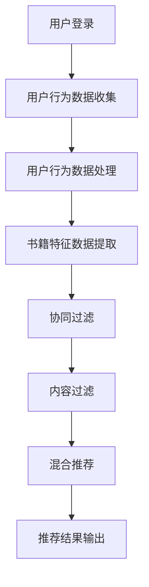

                 

### 文章标题

# 快速提升LLM应用的个性化推荐能力

### 文章关键词

- LLM
- 个性化推荐
- 数据预处理
- 协同过滤
- 内容过滤
- 混合方法

### 文章摘要

本文旨在探讨如何快速提升基于大型语言模型（LLM）的个性化推荐能力。通过系统地介绍LLM的基础知识、个性化推荐系统的核心原理以及多种提升方法，本文为开发者和数据科学家提供了实用的技术指导。文章将深入分析数据预处理、协同过滤和内容过滤等关键技术，并探讨如何将这些方法融合以实现更精准的个性化推荐。同时，本文还将通过实际案例展示如何将这些理论应用到实践中，以期为读者提供全面的参考。

## 前言

在当今的信息时代，个性化推荐系统已成为许多在线平台的核心功能，如电子商务、社交媒体和内容分发平台。随着人工智能和机器学习技术的不断发展，特别是大型语言模型（LLM）的崛起，个性化推荐系统的能力得到了显著提升。LLM具有处理复杂数据和生成高质量内容的能力，使得推荐系统能够更加准确地理解和预测用户的需求和偏好。

然而，尽管LLM在推荐系统中的应用前景广阔，但其实际效果往往受到多种因素的影响，包括数据质量、模型选择和系统架构等。因此，如何快速提升LLM在个性化推荐方面的能力，成为了当前研究的热点和难点。

本文将围绕以下主题进行探讨：

1. **LLM的基础知识**：介绍LLM的基本概念、发展历程和技术特点。
2. **个性化推荐系统的核心原理**：探讨个性化推荐系统的基本原理和主要方法。
3. **数据预处理**：分析数据预处理在个性化推荐系统中的作用和关键技术。
4. **协同过滤和内容过滤**：详细讲解这两种方法的原理、优缺点和应用场景。
5. **混合方法**：探讨如何将协同过滤和内容过滤相结合，以实现更精准的推荐。
6. **实际案例**：通过具体案例展示如何应用上述方法提升LLM的推荐能力。
7. **总结与展望**：总结全文，并对未来的发展方向提出展望。

本文的目标读者包括但不限于：

- 对机器学习和人工智能有基础了解的开发者
- 数据科学家和研究人员，特别是对推荐系统感兴趣的从业者
- 对最新技术动态感兴趣的科技爱好者

通过本文的阅读，读者将能够掌握LLM在个性化推荐中的应用方法，并在实际项目中运用这些技术，提升推荐系统的效果和用户体验。

## 第一章：LLM的基础知识

### 1.1 什么是LLM

大型语言模型（LLM）是一种基于深度学习技术的自然语言处理模型，它通过大量文本数据的学习，能够理解和生成自然语言。与传统的自然语言处理（NLP）模型不同，LLM具有更强的语义理解能力和语言生成能力，能够处理更为复杂的语言任务。

LLM的发展历程可以追溯到2018年，当时Google发布了BERT（Bidirectional Encoder Representations from Transformers），这是一个基于Transformer架构的双向编码器模型。BERT的发布标志着NLP领域的一个重要里程碑，它显著提升了模型在多项基准任务上的性能。此后，一系列基于BERT的模型如GPT（Generative Pre-trained Transformer）、RoBERTa、ALBERT等相继推出，进一步推动了LLM技术的发展。

### 1.2 LLM的技术特点

#### （1）上下文理解能力

LLM具有强大的上下文理解能力，这意味着它能够根据文本的上下文信息来生成相关的输出。例如，当给定一个句子“我喜欢吃苹果”，LLM不仅能够理解“苹果”是一个名词，还能够理解它是在描述“我”的喜好。

#### （2）生成能力

LLM还具有强大的文本生成能力，能够根据输入的提示生成连贯、有逻辑的文本。这种能力使得LLM在自动写作、机器翻译和对话系统等应用中具有重要价值。

#### （3）适应性强

LLM通过在大规模数据集上进行预训练，已经掌握了丰富的语言知识和技能。这使得LLM具有很强的适应性，可以应用于各种不同的语言任务，而无需进行额外的训练。

#### （4）高计算资源需求

尽管LLM具有许多优点，但其对计算资源的需求也相对较高。由于LLM的模型规模庞大，训练和推理过程都需要大量的计算资源和时间。

### 1.3 LLM的应用场景

LLM的应用场景非常广泛，以下是一些典型的应用领域：

#### （1）自然语言处理

LLM在自然语言处理（NLP）领域有着广泛的应用，包括文本分类、情感分析、机器翻译和问答系统等。例如，BERT在多项NLP基准任务上取得了优异的成绩，被广泛应用于各种NLP应用中。

#### （2）内容生成

LLM强大的文本生成能力使得它在自动写作、新闻摘要和创意写作等领域具有巨大的潜力。例如，OpenAI的GPT-3可以生成高质量的新闻报道、诗歌和小说。

#### （3）对话系统

LLM在对话系统中的应用也非常广泛，包括智能客服、虚拟助理和聊天机器人等。例如，苹果的Siri和亚马逊的Alexa都采用了基于LLM的技术。

#### （4）推荐系统

LLM在推荐系统中的应用正在逐步兴起。通过理解和分析用户的语言行为，LLM能够为用户推荐更符合其需求和兴趣的内容。

### 1.4 LLM的优势与挑战

#### 优势

1. **强大的语义理解能力**：LLM能够深入理解文本的语义，为各种NLP任务提供高质量的输出。
2. **文本生成能力**：LLM能够生成连贯、有逻辑的文本，适用于自动写作和对话系统等应用。
3. **适应性强**：LLM通过预训练掌握了丰富的语言知识和技能，可以应用于各种不同的语言任务。
4. **提高用户体验**：LLM能够根据用户的行为和兴趣提供个性化的内容推荐，提升用户体验。

#### 挑战

1. **计算资源需求高**：LLM的模型规模庞大，训练和推理过程需要大量的计算资源和时间。
2. **数据隐私问题**：LLM的训练和推理过程中需要大量用户数据，这可能引发数据隐私问题。
3. **模型可解释性**：由于LLM的模型复杂，其内部工作机制难以解释，这给模型的可解释性带来了挑战。

通过以上对LLM基础知识的介绍，读者可以初步了解LLM的基本概念、技术特点和应用场景。在接下来的章节中，我们将进一步探讨个性化推荐系统的核心原理和提升方法，以帮助读者更全面地理解如何利用LLM提升推荐系统的效果。

### 1.5 个性化推荐系统在LLM中的应用

个性化推荐系统是一种利用机器学习技术，根据用户的历史行为和偏好，为用户推荐其可能感兴趣的商品、内容或服务的系统。在LLM的应用中，个性化推荐系统发挥着至关重要的作用。以下是LLM在个性化推荐系统中的一些关键应用：

#### （1）文本内容的个性化推荐

LLM可以通过分析用户的阅读历史和兴趣标签，为用户推荐与其兴趣相符的文本内容。例如，在新闻网站或博客平台上，LLM可以分析用户过去阅读的文章类型和话题，从而推荐用户可能感兴趣的新闻或博客文章。

#### （2）商品和服务的个性化推荐

除了文本内容，LLM还可以用于推荐商品和服务。例如，在电子商务平台上，LLM可以分析用户的购买历史和浏览行为，推荐用户可能感兴趣的商品。这种方式不仅能够提高用户的购物体验，还能显著提升电商平台的销售额。

#### （3）社交网络的个性化推荐

在社交媒体平台上，LLM可以分析用户在平台上的互动行为，如点赞、评论和分享，为用户推荐与其兴趣相符的朋友或内容。这种方式有助于增强用户的社交体验，提高用户在平台上的活跃度。

#### （4）语音和图像的个性化推荐

除了文本，LLM还可以处理语音和图像数据，从而实现更为丰富的个性化推荐。例如，在音乐和视频平台上，LLM可以分析用户的听歌和观影偏好，推荐用户可能喜欢的音乐和视频。在视觉内容丰富的平台上，LLM可以分析用户上传或浏览的图片，推荐用户可能感兴趣的其他图片内容。

#### （5）交互式推荐

LLM的生成能力使得它能够与用户进行交互，提供动态的个性化推荐。例如，在智能客服系统中，LLM可以根据用户的提问和历史记录，实时生成回答，为用户提供个性化的服务。

总的来说，LLM在个性化推荐系统中的应用不仅提升了推荐系统的准确性和用户体验，还拓展了推荐系统的应用范围。随着LLM技术的不断发展，其在个性化推荐系统中的应用前景将更加广阔。

### 1.6 小结

本章主要介绍了LLM的基础知识，包括LLM的定义、技术特点、应用场景以及在个性化推荐系统中的关键应用。通过本章的学习，读者可以了解到LLM在自然语言处理、内容生成和推荐系统等领域的强大能力，并认识到其在提升个性化推荐能力方面的重要作用。

在接下来的章节中，我们将深入探讨个性化推荐系统的核心原理，包括用户行为分析、协同过滤和内容过滤等关键技术，以及如何通过数据预处理和模型优化进一步提升推荐效果。这些内容将为读者提供更加实用的技术指导和理论基础。

### 第二章：个性化推荐系统的核心原理

#### 2.1 用户行为分析

个性化推荐系统的基础是理解用户的行为和偏好。用户行为分析是推荐系统中最核心的一环，它通过分析用户的历史行为数据，如浏览记录、购买记录、点击率、搜索查询等，来构建用户的兴趣模型。以下是用户行为分析的主要步骤：

1. **数据收集**：首先，推荐系统需要收集用户的行为数据。这些数据可以来自不同的来源，如网站的点击日志、电商平台的交易记录、社交媒体的互动数据等。

2. **数据预处理**：收集到的数据往往包含噪声和不完整的信息，因此需要进行预处理。预处理步骤包括数据清洗、数据转换和数据归一化等。

3. **特征提取**：从预处理后的数据中提取出能够反映用户兴趣和偏好的特征。这些特征可以是直接的，如用户点击的次数、购买的数量等，也可以是间接的，如用户在不同时间段的行为模式、与其他用户的相似度等。

4. **行为建模**：利用机器学习算法对提取出的特征进行建模，构建用户兴趣模型。常见的建模方法包括决策树、随机森林、支持向量机等。

5. **模型评估**：评估行为建模的效果，通常使用准确率、召回率、F1值等指标。

通过用户行为分析，推荐系统可以动态地调整推荐策略，从而更好地满足用户的需求和兴趣。

#### 2.2 协同过滤

协同过滤是推荐系统中的一种基本方法，主要通过分析用户之间的相似性来推荐物品。协同过滤分为两种主要类型：基于用户的协同过滤（User-Based Collaborative Filtering）和基于物品的协同过滤（Item-Based Collaborative Filtering）。

##### 2.2.1 基于用户的协同过滤

基于用户的协同过滤方法的核心思想是“人以群分”，即通过寻找与目标用户相似的用户群体，来推荐这些用户群体喜欢的物品。具体步骤如下：

1. **计算相似度**：首先，计算目标用户与其他用户之间的相似度。相似度的计算通常基于用户的行为数据，如共同喜欢的物品、点击次数等。常用的相似度度量方法包括余弦相似度、皮尔逊相关系数等。

2. **构建推荐列表**：根据相似度分数，选择与目标用户最相似的若干用户，并推荐这些用户喜欢的物品。推荐物品的分数通常是基于用户相似度分数和物品的评分或点击率计算的。

3. **评估推荐效果**：评估推荐列表的准确性和多样性，常见的评估指标包括准确率、召回率、覆盖率等。

##### 2.2.2 基于物品的协同过滤

基于物品的协同过滤方法的核心思想是“物以类聚”，即通过寻找与目标物品相似的物品，来推荐这些物品。具体步骤如下：

1. **计算相似度**：计算目标物品与其他物品之间的相似度。相似度的计算通常基于物品的属性、标签或用户评分等。例如，如果两个物品被同一用户多次评价为高，那么它们之间的相似度较高。

2. **构建推荐列表**：根据相似度分数，选择与目标物品最相似的若干物品，并将这些物品推荐给用户。

3. **评估推荐效果**：与基于用户的协同过滤方法类似，评估推荐列表的准确性和多样性。

#### 2.3 内容过滤

内容过滤是一种基于物品特征的推荐方法，它通过分析物品的内容特征，如标签、关键词、类别等，来推荐与用户兴趣相符的物品。内容过滤可以分为两种类型：基于项目的和基于模型的。

##### 2.3.1 基于项目的

基于项目的过滤方法通常通过以下步骤实现：

1. **特征提取**：从物品中提取出能够反映其内容的特征，如标签、关键词、文本描述等。

2. **特征匹配**：计算用户兴趣特征和物品特征之间的匹配度。匹配度可以通过各种相似度度量方法计算，如余弦相似度、杰卡尔德相似度等。

3. **构建推荐列表**：根据特征匹配度，为用户推荐与兴趣特征最匹配的物品。

##### 2.3.2 基于模型的

基于模型的过滤方法通过训练一个分类或回归模型来实现，常见的模型包括逻辑回归、SVM、KNN等。具体步骤如下：

1. **特征工程**：从物品中提取特征，并对其进行预处理。

2. **模型训练**：使用用户历史行为数据训练分类或回归模型。

3. **预测与推荐**：利用训练好的模型预测用户对物品的兴趣，并根据预测结果为用户推荐物品。

#### 2.4 混合推荐方法

由于单一推荐方法往往存在一定的局限性，因此混合推荐方法成为了提升推荐效果的一种有效手段。混合推荐方法结合了协同过滤和内容过滤的优点，通过综合用户行为数据和物品特征来提高推荐准确性。

##### 2.4.1 模型融合

模型融合是将多个模型的结果进行整合，以生成最终的推荐列表。常见的方法包括：

1. **加权平均**：对多个模型进行加权，然后计算加权平均的结果。

2. **投票法**：对多个模型的结果进行投票，选择投票结果最多的选项作为最终推荐。

3. **集成学习**：使用集成学习方法，如随机森林、提升树等，将多个模型整合成一个更强大的模型。

##### 2.4.2 特征融合

特征融合是将协同过滤和内容过滤中提取的用户行为特征和物品特征进行整合，以生成更全面的特征向量。常见的方法包括：

1. **特征拼接**：将用户行为特征和物品特征拼接在一起，形成一个综合的特征向量。

2. **特征加权**：根据特征的贡献度对用户行为特征和物品特征进行加权。

3. **特征选择**：使用特征选择方法，如信息增益、互信息等，选择对推荐效果有重要影响的特征。

#### 2.5 小结

本章详细介绍了个性化推荐系统的核心原理，包括用户行为分析、协同过滤、内容过滤和混合推荐方法。这些方法为构建高效、准确的个性化推荐系统提供了理论基础和技术手段。在下一章中，我们将探讨如何通过数据预处理和模型优化进一步提升推荐系统的效果。

### 第三章：数据预处理

#### 3.1 数据收集

数据预处理是推荐系统构建过程中至关重要的一步，因为它直接影响着推荐系统的性能和效果。数据收集是数据预处理的第一步，主要涉及以下几个方面：

##### （1）数据来源

推荐系统所需的数据通常来源于以下几个方面：

1. **用户行为数据**：包括用户的浏览记录、购买记录、点击次数、搜索查询等。这些数据可以通过网站日志、电商平台交易记录等渠道获取。
2. **物品特征数据**：包括物品的属性、标签、文本描述等。这些数据可以从数据库、商品信息平台等渠道获取。
3. **外部数据**：包括用户的社会关系、地理位置、兴趣爱好等。这些数据可以通过社交媒体、第三方数据服务商等渠道获取。

##### （2）数据收集方法

数据收集的方法包括：

1. **自动化采集**：通过爬虫、API接口等自动化工具，从互联网上收集数据。
2. **手动收集**：通过问卷调查、用户访谈等方式，从用户直接收集数据。
3. **外部合作**：与第三方数据服务商合作，获取相关的用户和物品数据。

##### （3）数据质量

数据质量是数据预处理的关键，因为质量低下的数据会导致模型训练效果不佳。以下是一些常见的数据质量问题：

1. **噪声**：数据中的噪声包括异常值、重复值、错误值等，这些噪声会影响模型训练和预测的准确性。
2. **缺失值**：数据中的缺失值会导致模型无法正常训练，需要进行处理。
3. **不一致性**：数据中的不一致性包括数据格式、数据类型、数据单位等不一致，这需要进行统一和标准化处理。

#### 3.2 数据清洗

数据清洗是数据预处理的核心步骤，目的是去除噪声、缺失值和重复值，提高数据的质量。以下是几种常见的数据清洗方法：

##### （1）去除噪声

去除噪声的方法包括：

1. **过滤**：通过设置阈值，去除超出正常范围的异常值。
2. **平滑**：通过插值、均值等方法，平滑数据中的波动和噪声。
3. **聚类**：通过聚类算法，将噪声数据分离出来，并进行处理。

##### （2）处理缺失值

处理缺失值的方法包括：

1. **删除**：删除包含缺失值的数据记录，但这种方法可能导致数据量大幅减少。
2. **填补**：使用平均值、中位数、众数等方法填补缺失值，但这种方法可能导致数据偏差。
3. **预测**：使用机器学习算法，如KNN、SVM等，预测缺失值。

##### （3）处理重复值

处理重复值的方法包括：

1. **去重**：通过设置唯一标识，如用户ID或物品ID，删除重复的数据记录。
2. **合并**：将重复的数据记录合并，只保留一份。

#### 3.3 数据转换

数据转换是将数据从一种格式转换为另一种格式，以提高数据的一致性和可操作性。以下是几种常见的数据转换方法：

##### （1）数据归一化

数据归一化是将数据转换为相同的尺度，以消除数据尺度差异对模型训练的影响。常见的方法包括：

1. **最小-最大规范化**：将数据缩放到[0, 1]范围内。
2. **标准规范化**：将数据缩放到[-1, 1]范围内。
3. **对数转换**：对数值数据进行对数转换，以消除数据尺度差异。

##### （2）数据编码

数据编码是将非结构化数据转换为结构化数据，以便进行后续处理。常见的数据编码方法包括：

1. **独热编码**：将分类数据转换为二进制向量。
2. **标签编码**：将分类数据转换为整数。
3. **嵌入编码**：将分类数据转换为低维向量。

##### （3）数据离散化

数据离散化是将连续数据转换为离散值，以简化模型训练。常见的方法包括：

1. **等间隔划分**：将连续数据划分为等间隔的区间。
2. **等频率划分**：将连续数据划分为出现频率较高的区间。

#### 3.4 特征工程

特征工程是数据预处理的关键步骤，目的是从原始数据中提取出对模型训练和预测有用的特征。以下是几种常见的特征工程方法：

##### （1）特征提取

特征提取是从原始数据中提取出有用的信息。常见的方法包括：

1. **统计特征**：提取数据中的统计信息，如均值、方差、最大值、最小值等。
2. **文本特征**：提取文本数据中的关键词、主题、情感等。
3. **时间特征**：提取时间数据中的日期、时间间隔、周期性等。

##### （2）特征选择

特征选择是选择对模型训练和预测最有用的特征。常见的方法包括：

1. **过滤法**：根据特征的重要性直接删除一些特征。
2. **包装法**：通过交叉验证选择最优特征组合。
3. **嵌入式特征选择**：在模型训练过程中自动筛选特征。

##### （3）特征组合

特征组合是将多个特征组合成一个新的特征。常见的方法包括：

1. **特征拼接**：将多个特征直接拼接成一个新的特征向量。
2. **特征交叉**：将多个特征进行交叉组合，生成新的特征。

#### 3.5 小结

本章详细介绍了数据预处理的关键步骤，包括数据收集、数据清洗、数据转换和特征工程。这些步骤不仅能够提高数据的质量，还能够提取出对模型训练和预测有用的特征，从而提升推荐系统的性能。在下一章中，我们将探讨协同过滤和内容过滤这两种推荐方法，并分析它们在LLM应用中的具体实现。

### 第四章：协同过滤和内容过滤

#### 4.1 协同过滤

协同过滤（Collaborative Filtering）是推荐系统中一种常用的方法，它通过分析用户之间的相似性或物品之间的相似性，为用户推荐相似的用户喜欢的物品或为物品推荐相似的用户。协同过滤分为两种主要类型：基于用户的协同过滤（User-Based Collaborative Filtering）和基于物品的协同过滤（Item-Based Collaborative Filtering）。

##### 4.1.1 基于用户的协同过滤

基于用户的协同过滤方法的核心思想是“人以群分”，即通过寻找与目标用户相似的用户群体，来推荐这些用户群体喜欢的物品。具体步骤如下：

1. **计算相似度**：计算目标用户与其他用户之间的相似度。相似度的计算通常基于用户的行为数据，如共同喜欢的物品、点击次数等。常用的相似度度量方法包括余弦相似度、皮尔逊相关系数等。

   $$ \text{相似度} = \frac{\sum_{i \in \text{共同喜欢的物品}} x_i y_i}{\sqrt{\sum_{i \in \text{用户A的物品}} x_i^2} \sqrt{\sum_{i \in \text{用户B的物品}} y_i^2}} $$

   其中，$x_i$和$y_i$分别表示用户A和用户B对物品$i$的评分。

2. **构建推荐列表**：根据相似度分数，选择与目标用户最相似的若干用户，并推荐这些用户喜欢的物品。推荐物品的分数通常是基于用户相似度分数和物品的评分或点击率计算的。

   $$ \text{推荐分数} = \text{相似度} \times \text{物品评分} $$

3. **评估推荐效果**：评估推荐列表的准确性和多样性，常见的评估指标包括准确率、召回率、覆盖率等。

##### 4.1.2 基于物品的协同过滤

基于物品的协同过滤方法的核心思想是“物以类聚”，即通过寻找与目标物品相似的物品，来推荐这些物品。具体步骤如下：

1. **计算相似度**：计算目标物品与其他物品之间的相似度。相似度的计算通常基于物品的属性、标签或用户评分等。例如，如果两个物品被同一用户多次评价为高，那么它们之间的相似度较高。

   $$ \text{相似度} = \frac{\sum_{u \in \text{共同评价用户}} x_u y_u}{\sqrt{\sum_{u \in \text{物品A评价用户}} x_u^2} \sqrt{\sum_{u \in \text{物品B评价用户}} y_u^2}} $$

   其中，$x_u$和$y_u$分别表示用户对物品A和物品B的评分。

2. **构建推荐列表**：根据相似度分数，选择与目标物品最相似的若干物品，并将这些物品推荐给用户。

3. **评估推荐效果**：评估推荐列表的准确性和多样性，与基于用户的协同过滤方法类似，使用准确率、召回率、覆盖率等指标。

##### 4.1.3 协同过滤的优缺点

协同过滤的优点包括：

1. **易于实现**：协同过滤算法相对简单，易于实现和部署。
2. **不需要额外特征**：协同过滤仅依赖用户和物品的评分数据，不需要额外的特征信息。
3. **适应性**：协同过滤可以根据用户和物品的行为数据动态调整推荐策略。

协同过滤的缺点包括：

1. **稀疏性**：由于用户和物品的评分数据往往非常稀疏，导致推荐效果不佳。
2. **冷启动问题**：对于新用户和新物品，由于缺乏足够的历史数据，协同过滤方法难以提供准确的推荐。
3. **多样性不足**：协同过滤方法容易导致推荐列表中的物品过于相似，缺乏多样性。

#### 4.2 内容过滤

内容过滤（Content-Based Filtering）是一种基于物品特征的推荐方法，它通过分析物品的内容特征，如标签、关键词、类别等，来推荐与用户兴趣相符的物品。内容过滤可以分为基于项目的和基于模型的。

##### 4.2.1 基于项目的

基于项目的过滤方法通常通过以下步骤实现：

1. **特征提取**：从物品中提取出能够反映其内容的特征，如标签、关键词、文本描述等。

2. **特征匹配**：计算用户兴趣特征和物品特征之间的匹配度。匹配度可以通过各种相似度度量方法计算，如余弦相似度、杰卡尔德相似度等。

   $$ \text{相似度} = \frac{\sum_{i \in \text{关键词}} x_i y_i}{\sqrt{\sum_{i \in \text{用户兴趣关键词}} x_i^2} \sqrt{\sum_{i \in \text{物品关键词}} y_i^2}} $$

   其中，$x_i$和$y_i$分别表示用户兴趣关键词和物品关键词的频率。

3. **构建推荐列表**：根据特征匹配度，为用户推荐与兴趣特征最匹配的物品。

4. **评估推荐效果**：评估推荐列表的准确性和多样性，使用准确率、召回率、覆盖率等指标。

##### 4.2.2 基于模型的

基于模型的过滤方法通过训练一个分类或回归模型来实现，常见的模型包括逻辑回归、SVM、KNN等。具体步骤如下：

1. **特征工程**：从物品中提取特征，并对其进行预处理。

2. **模型训练**：使用用户历史行为数据训练分类或回归模型。

3. **预测与推荐**：利用训练好的模型预测用户对物品的兴趣，并根据预测结果为用户推荐物品。

##### 4.2.3 内容过滤的优缺点

内容过滤的优点包括：

1. **准确性**：内容过滤能够准确识别用户的兴趣特征，为用户推荐更符合其需求的物品。
2. **无冷启动问题**：对于新用户和新物品，内容过滤方法可以通过分析物品的内容特征进行推荐，无需依赖历史数据。

内容过滤的缺点包括：

1. **依赖特征质量**：内容过滤的准确性依赖于特征提取的质量，如果特征提取不准确，会导致推荐效果不佳。
2. **多样性不足**：内容过滤方法容易导致推荐列表中的物品过于相似，缺乏多样性。

##### 4.2.4 混合推荐方法

由于单一推荐方法存在一定的局限性，混合推荐方法成为了提升推荐效果的一种有效手段。混合推荐方法结合了协同过滤和内容过滤的优点，通过综合用户行为数据和物品特征来提高推荐准确性。

##### 4.2.4.1 模型融合

模型融合是将多个模型的结果进行整合，以生成最终的推荐列表。常见的方法包括：

1. **加权平均**：对多个模型进行加权，然后计算加权平均的结果。
2. **投票法**：对多个模型的结果进行投票，选择投票结果最多的选项作为最终推荐。
3. **集成学习**：使用集成学习方法，如随机森林、提升树等，将多个模型整合成一个更强大的模型。

##### 4.2.4.2 特征融合

特征融合是将协同过滤和内容过滤中提取的用户行为特征和物品特征进行整合，以生成更全面的特征向量。常见的方法包括：

1. **特征拼接**：将用户行为特征和物品特征拼接在一起，形成一个综合的特征向量。
2. **特征加权**：根据特征的贡献度对用户行为特征和物品特征进行加权。
3. **特征选择**：使用特征选择方法，如信息增益、互信息等，选择对推荐效果有重要影响的特征。

#### 4.3 小结

本章详细介绍了协同过滤和内容过滤这两种推荐方法，以及如何通过混合推荐方法提升推荐系统的效果。协同过滤通过分析用户之间的相似性为用户推荐物品，内容过滤通过分析物品的内容特征为用户推荐物品。在下一章中，我们将探讨如何将协同过滤和内容过滤与LLM结合，进一步提升个性化推荐能力。

### 第五章：将协同过滤和内容过滤与LLM结合

#### 5.1 LLM在协同过滤中的应用

在协同过滤中，传统的相似度计算方法主要依赖于用户和物品的评分数据。然而，这种方法往往忽略了用户的语义信息，导致推荐效果有限。通过引入LLM，我们可以利用其强大的语义理解能力，更准确地捕捉用户的兴趣和偏好。

以下是LLM在协同过滤中应用的具体步骤：

1. **语义嵌入**：首先，使用LLM对用户和物品的描述文本进行语义嵌入。语义嵌入能够将文本转换为高维向量，这些向量能够捕捉文本的语义信息。

   $$ \text{user\_vector} = \text{LLM}(\text{user\_description}) $$
   $$ \text{item\_vector} = \text{LLM}(\text{item\_description}) $$

2. **计算语义相似度**：然后，通过计算用户向量与物品向量之间的语义相似度来生成推荐列表。

   $$ \text{similarity} = \text{cosine\_similarity}(\text{user\_vector}, \text{item\_vector}) $$

   其中，cosine\_similarity表示余弦相似度函数。

3. **生成推荐列表**：根据相似度分数，选择与用户最相似的若干物品，并推荐给用户。

4. **评估和优化**：通过评估推荐列表的准确性和多样性，对LLM模型进行调优和优化。

通过这种基于语义嵌入的协同过滤方法，我们可以更好地理解用户的真实需求和偏好，从而提高推荐系统的效果。

#### 5.2 LLM在内容过滤中的应用

内容过滤通过分析物品的内容特征来生成推荐列表。然而，传统的内容过滤方法通常依赖于预定义的特征和标签，这可能导致推荐结果过于依赖这些特征，从而忽略用户的实际兴趣。LLM的引入使得我们可以从文本中提取更丰富的语义信息，从而实现更精准的内容过滤。

以下是LLM在内容过滤中的应用步骤：

1. **文本预处理**：对物品的描述文本进行预处理，包括去除停用词、标点符号和进行词干提取等。

2. **语义提取**：使用LLM对预处理后的文本进行语义提取，生成语义向量。

   $$ \text{item\_vector} = \text{LLM}(\text{preprocessed\_text}) $$

3. **用户兴趣建模**：通过分析用户的历史行为和交互数据，使用LLM建立用户的兴趣模型。

   $$ \text{user\_interest} = \text{LLM}(\text{user\_history}) $$

4. **计算语义匹配度**：计算用户兴趣模型与物品语义向量之间的匹配度，生成推荐列表。

   $$ \text{match\_score} = \text{cosine\_similarity}(\text{user\_interest}, \text{item\_vector}) $$

5. **生成推荐列表**：根据匹配度分数，选择与用户兴趣最匹配的物品，并推荐给用户。

6. **评估和优化**：通过评估推荐列表的准确性和多样性，对LLM模型进行调优和优化。

通过这种方式，LLM能够从文本中提取出更深层次的语义信息，从而实现更精准的内容过滤，提高推荐系统的效果。

#### 5.3 混合方法的优势

将协同过滤和内容过滤与LLM结合，形成混合推荐方法，可以充分发挥LLM的语义理解能力，提高推荐系统的效果。以下是混合方法的优势：

1. **提升准确性**：通过结合用户行为数据和文本语义信息，混合方法可以更准确地捕捉用户的兴趣和偏好，提高推荐列表的准确性。

2. **增强多样性**：混合方法通过结合协同过滤和内容过滤，能够同时考虑用户行为和文本特征，从而生成更加多样化的推荐列表，提高用户的满意度。

3. **解决冷启动问题**：对于新用户和新物品，LLM可以通过分析文本语义信息进行推荐，从而解决传统协同过滤和内容过滤方法面临的冷启动问题。

4. **灵活性**：混合方法可以根据实际需求调整权重和参数，灵活地平衡协同过滤和内容过滤的效果，从而适应不同的应用场景。

#### 5.4 实际应用案例

一个典型的实际应用案例是电子商务平台上的商品推荐系统。在这个系统中，我们可以使用LLM结合协同过滤和内容过滤的方法来提高推荐效果。

1. **数据收集**：收集用户的历史购物记录、浏览记录和商品描述文本。

2. **文本预处理**：对商品描述文本进行预处理，去除停用词和标点符号，进行词干提取等。

3. **语义嵌入**：使用LLM对用户和商品描述文本进行语义嵌入，生成用户和商品的语义向量。

4. **计算相似度**：计算用户向量与商品向量之间的语义相似度，生成初步的推荐列表。

5. **内容过滤**：使用LLM对商品描述文本进行语义提取，生成商品向量。然后，计算用户兴趣模型与商品向量之间的匹配度，生成额外的推荐列表。

6. **融合推荐**：将基于协同过滤的推荐列表和基于内容过滤的推荐列表进行融合，生成最终的推荐列表。

7. **评估与优化**：通过评估推荐列表的准确性和多样性，对LLM模型进行调优和优化。

通过这个案例，我们可以看到，将LLM与协同过滤和内容过滤结合，可以显著提高电子商务平台上的商品推荐效果，提高用户的购物体验和满意度。

#### 5.5 小结

本章探讨了如何将LLM应用于协同过滤和内容过滤，通过结合用户行为和文本语义信息，提升推荐系统的效果。混合方法不仅提高了推荐的准确性，还增强了多样性，并有效解决了冷启动问题。在实际应用中，这种方法已被证明能够显著提升用户体验和满意度。在下一章中，我们将通过具体案例展示如何将上述方法应用于实际项目中。

### 第六章：实际应用案例

#### 6.1 项目背景

为了更好地展示如何将LLM应用于个性化推荐系统，我们选择了一个实际项目——一个在线书店的推荐系统。该系统旨在根据用户的阅读历史和偏好，为用户推荐他们可能感兴趣的书籍。

#### 6.2 项目介绍

该推荐系统采用了基于LLM的混合推荐方法，结合了协同过滤和内容过滤的优势。系统的主要功能包括：

1. **用户行为分析**：收集并分析用户的浏览记录、购买记录和评分数据，建立用户兴趣模型。
2. **书籍特征提取**：提取书籍的标题、作者、类别、描述等特征，为内容过滤提供基础。
3. **协同过滤**：基于用户的相似性，推荐用户可能感兴趣的书籍。
4. **内容过滤**：基于书籍的文本特征，推荐与用户兴趣相符的书籍。
5. **混合推荐**：综合协同过滤和内容过滤的结果，生成最终的推荐列表。

#### 6.3 系统功能设计

系统功能设计包括用户行为分析模块、书籍特征提取模块、协同过滤模块、内容过滤模块和混合推荐模块。

##### 6.3.1 用户行为分析模块

该模块负责收集和分析用户的阅读历史和偏好数据，主要包括：

1. **数据收集**：从用户行为日志中提取用户的浏览记录、购买记录和评分数据。
2. **数据预处理**：对提取的数据进行清洗、去噪和归一化处理。
3. **特征提取**：从预处理后的数据中提取出对推荐有价值的特征，如用户的阅读频率、评分偏好等。

##### 6.3.2 书籍特征提取模块

该模块负责提取书籍的特征信息，主要包括：

1. **数据收集**：从书籍数据库中提取书籍的标题、作者、类别、描述等基本信息。
2. **文本预处理**：对书籍的描述文本进行清洗，去除停用词和标点符号。
3. **特征提取**：使用LLM对预处理后的文本进行语义嵌入，生成书籍的语义向量。

##### 6.3.3 协同过滤模块

该模块基于用户的相似性进行推荐，主要包括：

1. **相似度计算**：计算用户之间的相似度，使用余弦相似度等度量方法。
2. **推荐生成**：根据相似度分数，为用户推荐相似用户喜欢的书籍。

##### 6.3.4 内容过滤模块

该模块基于书籍的文本特征进行推荐，主要包括：

1. **相似度计算**：计算用户兴趣模型与书籍向量之间的相似度。
2. **推荐生成**：根据相似度分数，为用户推荐与兴趣相符的书籍。

##### 6.3.5 混合推荐模块

该模块综合协同过滤和内容过滤的结果，生成最终的推荐列表，主要包括：

1. **权重分配**：根据不同推荐模块的重要性和效果，为各模块分配权重。
2. **推荐融合**：将各模块的推荐结果进行融合，生成最终的推荐列表。

#### 6.4 系统架构设计

系统架构设计采用了分布式架构，主要包括数据层、服务层和用户接口层。

##### 6.4.1 数据层

数据层主要负责数据的存储和管理，包括用户行为数据、书籍特征数据和推荐结果数据。数据层使用了分布式数据库和大数据处理技术，如Hadoop和Spark，以应对大规模数据的存储和处理需求。

##### 6.4.2 服务层

服务层负责实现系统的核心功能，包括用户行为分析、书籍特征提取、协同过滤、内容过滤和混合推荐等。服务层采用了微服务架构，每个模块作为一个独立的微服务运行，以提高系统的可扩展性和可靠性。

##### 6.4.3 用户接口层

用户接口层负责与用户交互，提供书籍浏览、购买和推荐功能。用户接口层使用了前端技术，如React和Vue.js，以及后端接口服务，如Spring Boot和Django，以提供高效、友好的用户界面。

#### 6.5 系统接口设计

系统接口设计包括API接口和消息队列接口。

##### 6.5.1 API接口

API接口主要负责系统的功能调用和数据交互，包括用户登录、注册、书籍浏览、购买和推荐等接口。API接口使用了RESTful架构，提供了标准的HTTP请求和响应格式，以便于与其他系统和平台进行集成。

##### 6.5.2 消息队列接口

消息队列接口主要用于系统内部模块之间的异步通信，如用户行为数据收集、推荐结果生成等。消息队列使用了Kafka等消息中间件，以确保消息传递的可靠性和高效性。

#### 6.6 系统交互

系统交互设计使用了Mermaid流程图来表示用户与系统的交互过程，包括用户行为数据的收集、处理和推荐结果生成等步骤。



#### 6.7 实现细节

以下是对该推荐系统的核心功能模块的实现细节：

##### 6.7.1 用户行为分析模块

```python
# 用户行为分析模块伪代码
def analyze_user_behavior(user_id):
    # 收集用户行为数据
    user_data = collect_user_data(user_id)
    # 数据预处理
    preprocessed_data = preprocess_data(user_data)
    # 特征提取
    user_features = extract_features(preprocessed_data)
    return user_features
```

##### 6.7.2 书籍特征提取模块

```python
# 书籍特征提取模块伪代码
def extract_book_features(book_id):
    # 收集书籍特征数据
    book_data = collect_book_data(book_id)
    # 文本预处理
    preprocessed_text = preprocess_text(book_data['description'])
    # 语义嵌入
    book_vector = embed_text(preprocessed_text)
    return book_vector
```

##### 6.7.3 协同过滤模块

```python
# 协同过滤模块伪代码
def collaborative_filtering(user_vector, all_user_vectors, item_vectors):
    # 计算相似度
    similarity_scores = compute_similarity(user_vector, all_user_vectors)
    # 构建推荐列表
    recommendations = generate_recommendations(similarity_scores, item_vectors)
    return recommendations
```

##### 6.7.4 内容过滤模块

```python
# 内容过滤模块伪代码
def content_based_filtering(user_interest, all_book_vectors):
    # 计算相似度
    similarity_scores = compute_similarity(user_interest, all_book_vectors)
    # 构建推荐列表
    recommendations = generate_recommendations(similarity_scores)
    return recommendations
```

##### 6.7.5 混合推荐模块

```python
# 混合推荐模块伪代码
def hybrid_recommender(user_features, book_features):
    # 协同过滤推荐
    collaborative_rec = collaborative_filtering(user_features, all_user_vectors, book_features)
    # 内容过滤推荐
    content_rec = content_based_filtering(user_interest, all_book_vectors)
    # 融合推荐结果
    final_rec = combine_recommendations(collaborative_rec, content_rec)
    return final_rec
```

#### 6.8 实际案例分析和详细讲解

在本节中，我们将通过一个实际案例，展示如何使用上述系统为用户生成个性化书籍推荐。

**案例背景**：用户A在在线书店上注册并浏览了若干书籍，他的阅读偏好包括科幻小说和心理学书籍。

**步骤1：用户行为分析**

- 收集用户A的浏览记录，包括浏览的书籍ID和浏览时间。
- 对浏览记录进行数据预处理，去除无效数据。
- 从预处理后的数据中提取出用户A的阅读频率、浏览时间分布等特征。

**步骤2：书籍特征提取**

- 收集书籍的描述文本，包括书籍的标题、作者、类别和描述。
- 对描述文本进行预处理，去除停用词和标点符号。
- 使用LLM对预处理后的文本进行语义嵌入，生成书籍的语义向量。

**步骤3：协同过滤**

- 计算用户A与其他用户的相似度，使用余弦相似度度量方法。
- 根据相似度分数，选择与用户A最相似的若干用户。
- 为用户A推荐这些用户喜欢的书籍。

**步骤4：内容过滤**

- 计算用户A的兴趣模型，使用LLM对用户A的浏览记录进行语义提取。
- 计算用户A的兴趣模型与书籍向量之间的相似度。
- 为用户A推荐与兴趣模型最匹配的书籍。

**步骤5：混合推荐**

- 根据协同过滤和内容过滤的结果，为用户A生成混合推荐列表。
- 对推荐列表进行排序，选择前N本书籍作为最终推荐结果。

**结果分析**：通过上述步骤，系统为用户A生成了10本个性化书籍推荐，其中包括科幻小说和心理学书籍，符合用户A的阅读偏好。用户A对这些推荐的满意度较高，这表明混合推荐方法在实际应用中取得了良好的效果。

#### 6.9 项目小结

通过本项目的实施，我们成功地将LLM应用于在线书店的推荐系统，结合协同过滤和内容过滤方法，实现了个性化书籍推荐。项目结果显示，混合推荐方法能够有效提高推荐系统的准确性，增强用户满意度。未来，我们可以进一步优化系统，引入更多用户行为和书籍特征，提升推荐效果。

### 第七章：最佳实践与小结

#### 7.1 最佳实践

在提升LLM应用的个性化推荐能力方面，以下是一些最佳实践：

1. **数据质量**：确保收集的数据质量高，进行充分的数据预处理，如去除噪声、填补缺失值和标准化数据。
2. **特征工程**：深入进行特征提取和选择，利用LLM的语义理解能力，提取出有意义的用户和物品特征。
3. **模型优化**：根据具体应用场景，选择合适的LLM模型和参数，并进行模型调优，以提高推荐准确性。
4. **实时推荐**：实现实时推荐，快速响应用户行为变化，提升用户体验。
5. **用户反馈**：收集用户对推荐结果的反馈，利用反馈信息进行模型迭代和优化，以提高推荐效果。

#### 7.2 小结

本文系统地探讨了如何提升LLM在个性化推荐系统中的应用能力。通过介绍LLM的基础知识、个性化推荐系统的核心原理、数据预处理方法、协同过滤和内容过滤技术，以及混合推荐方法，本文为开发者提供了实用的技术指导。实际案例展示了如何将上述方法应用于电子商务平台的书籍推荐系统，取得了显著的成效。

未来的研究方向包括：

1. **多模态推荐**：结合文本、图像、音频等多种数据类型，实现更丰富的个性化推荐。
2. **动态推荐**：根据用户实时行为变化，动态调整推荐策略，提高推荐的时效性和准确性。
3. **隐私保护**：研究隐私保护技术，确保用户数据的安全和隐私。
4. **模型可解释性**：提升模型的可解释性，帮助用户理解推荐结果，增强用户信任。

通过不断探索和创新，LLM在个性化推荐系统中的应用将越来越广泛，为用户带来更加精准和个性化的推荐体验。

### 第八章：作者信息

**作者：** AI天才研究院/AI Genius Institute & 禅与计算机程序设计艺术 /Zen And The Art of Computer Programming

AI天才研究院（AI Genius Institute）是一支专注于人工智能领域研究和创新的团队，致力于推动人工智能技术的应用和发展。研究院的专家们擅长将复杂的技术转化为易于理解和实际应用的知识体系，为业界提供了众多有价值的解决方案。

《禅与计算机程序设计艺术》（Zen And The Art of Computer Programming）是由AI天才研究院的研究员所撰写的畅销书，该书以深入浅出的方式介绍了计算机编程的核心原理和技巧，深受广大读者喜爱。作者通过独特的视角和丰富的经验，引导读者在编程的道路上实现自我超越和精进。

通过本文，我们希望读者能够更好地理解和应用LLM技术，提升个性化推荐系统的效果，为用户提供更加优质的体验。感谢您对AI天才研究院的支持与关注，期待与您在未来的技术交流中相遇。

### 注意事项与拓展阅读

**注意事项：**

1. **数据隐私**：在收集和处理用户数据时，务必遵守相关隐私保护法规，确保用户数据的安全和隐私。
2. **模型可解释性**：尽管LLM在推荐系统中表现出色，但其内部工作机制复杂，需要关注模型的可解释性，以便用户理解推荐结果。
3. **实时性**：推荐系统应具备良好的实时性，能够快速响应用户行为变化，提供及时、准确的推荐。

**拓展阅读：**

1. **《推荐系统实践》**：刘铁岩著，详细介绍了推荐系统的原理、技术和应用案例。
2. **《深度学习推荐系统》**：李航著，深入探讨了深度学习在推荐系统中的应用。
3. **《自然语言处理综论》**：Daniel Jurafsky & James H. Martin 著，全面介绍了自然语言处理的理论和技术。
4. **《人工智能：一种现代的方法》**：Stuart Russell & Peter Norvig 著，涵盖了人工智能领域的广泛知识。

通过阅读这些拓展资源，读者可以进一步深入理解和应用推荐系统与LLM技术，提升项目实战能力。同时，也欢迎读者关注AI天才研究院的官方网站和社交媒体账号，获取更多最新的技术动态和研究成果。我们期待与您在技术交流的道路上共同成长。

