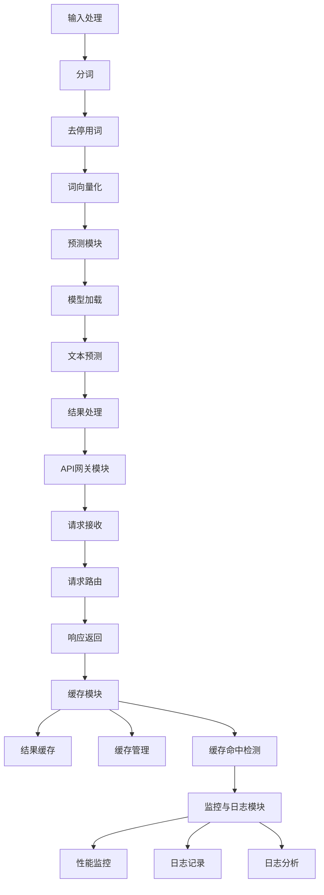
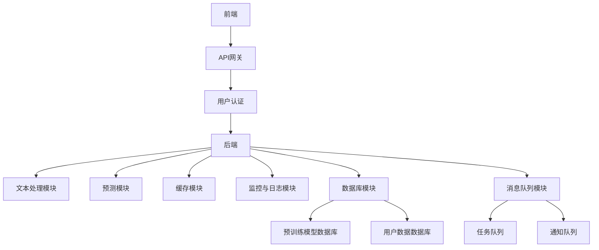

                 

### 《快速构建LLM应用的serverless架构》文章标题与关键词

# 快速构建LLM应用的serverless架构

> 关键词：大型语言模型（LLM）、Serverless架构、快速开发、云计算、人工智能

> 摘要：本文将探讨如何利用Serverless架构快速构建基于大型语言模型（LLM）的应用。我们将从背景介绍、核心概念与联系、算法原理讲解、系统分析与架构设计方案、项目实战、最佳实践与总结等方面详细阐述，旨在帮助读者理解和掌握这一领域的最新技术。

----------------------------------------------------------------

### 目录大纲设计思路

在设计《快速构建LLM应用的serverless架构》的目录大纲时，我们遵循以下步骤：

#### 1. 确定主题与目标

首先，我们需要明确文章的主题——如何快速构建基于LLM的serverless应用。我们的目标受众是有一定编程基础，对serverless架构和LLM有一定了解的技术人员，他们希望了解如何高效地将这两者结合起来。

#### 2. 核心内容规划

文章的核心内容将包括：

- **背景介绍**：介绍LLM和serverless架构的基本概念。
- **核心概念与联系**：详细阐述LLM和serverless架构的核心概念，并分析它们之间的联系。
- **算法原理讲解**：讲解LLM的工作原理和应用。
- **系统分析与架构设计方案**：介绍如何设计和实现基于serverless架构的LLM应用。
- **项目实战**：通过一个实际项目展示如何构建LLM应用的serverless架构。
- **最佳实践与总结**：总结构建LLM应用serverless架构的最佳实践，并提供拓展阅读资源。

#### 3. 章节细化

在细化章节内容时，我们确保每个章节都有明确的主题和目的，并使用markdown格式来保持文本的清晰和易于阅读。以下是详细的章节规划：

### 目录大纲

```markdown
## 第一部分：背景介绍

### 第1章：LLM与serverless架构概述

- 1.1 什么是LLM
- 1.2 什么是serverless架构
- 1.3 LLM与serverless架构的结合

### 第2章：技术基础回顾

- 2.1 编程基础
- 2.2 服务器架构基础
- 2.3 机器学习和深度学习基础

## 第二部分：核心概念与联系

### 第3章：LLM核心概念解析

- 3.1 LLM的定义与特点
- 3.2 LLM的工作原理
- 3.3 LLM的应用场景

### 第4章：serverless架构解析

- 4.1 serverless架构的定义与特点
- 4.2 serverless架构的优势与挑战
- 4.3 serverless架构的组成与工作流程

### 第5章：LLM与serverless架构的联系

- 5.1 LLM与serverless架构的结合点
- 5.2 LLM在serverless架构中的角色
- 5.3 LLMS与serverless架构的协同工作

## 第三部分：算法原理讲解

### 第6章：LLM算法原理详解

- 6.1 语言模型的数学基础
- 6.2 常见的LLM算法
- 6.3 LLM算法的实现与优化

### 第7章：serverless架构下的LLM应用

- 7.1 serverless环境下的LLM部署
- 7.2 serverless架构下的LLM服务构建
- 7.3 serverless架构下的LLM性能优化

## 第四部分：系统分析与架构设计方案

### 第8章：系统功能设计

- 8.1 系统功能概述
- 8.2 系统功能模块划分
- 8.3 系统功能流程图

### 第9章：系统架构设计

- 9.1 系统架构概述
- 9.2 系统架构模块划分
- 9.3 系统架构设计图

### 第10章：系统接口设计

- 10.1 接口设计原则
- 10.2 接口定义与协议
- 10.3 接口测试与调试

## 第五部分：项目实战

### 第11章：项目实战

- 11.1 环境配置
- 11.2 系统核心实现
- 11.3 应用解读与分析
- 11.4 实际案例分析与详细讲解
- 11.5 项目小结

## 第六部分：最佳实践与总结

### 第12章：最佳实践

- 12.1 实施建议
- 12.2 注意事项
- 12.3 拓展阅读

### 第13章：小结

- 13.1 文章总结
- 13.2 未来展望
```

通过这种结构化、逻辑清晰的目录设计，读者可以更好地理解和掌握文章内容，从而实现快速构建LLM应用的serverless架构。

### 第一部分：背景介绍

#### 第1章：LLM与serverless架构概述

在当今的软件开发领域，大型语言模型（LLM）和serverless架构成为了两个备受关注的技术热点。LLM作为一种强大的自然语言处理工具，在文本生成、机器翻译、情感分析等领域展现了其巨大的潜力。而serverless架构则以其弹性伸缩、低成本和高效率的特点，逐渐成为云计算领域的核心技术。

**1.1 什么是LLM**

大型语言模型（Large Language Model，简称LLM）是一种基于深度学习的自然语言处理模型，通常具有数十亿个参数，能够理解和生成自然语言文本。LLM通过学习海量的文本数据，捕捉语言的本质规律，从而能够进行文本生成、问答、翻译等复杂任务。

**1.2 什么是serverless架构**

Serverless架构是一种无服务器计算模型，开发者无需管理服务器，只需关注业务逻辑的实现。在这种架构下，云计算平台自动处理服务器的分配、扩展和维护，从而实现高效的资源利用和降低运营成本。

**1.3 LLM与serverless架构的结合**

LLM与serverless架构的结合，能够充分发挥两者的优势。LLM为应用程序提供了强大的自然语言处理能力，而serverless架构则为LLM的应用提供了弹性的计算资源和高效的部署方式。具体来说，结合LLM和serverless架构有以下优势：

- **弹性伸缩**：LLM应用根据实际需求自动扩展或缩减计算资源，确保系统在高并发场景下稳定运行。
- **低成本**：serverless架构降低了服务器的维护成本，使得LLM应用的部署和运营更加经济。
- **高效率**：serverless架构简化了部署流程，开发者可以更专注于业务逻辑的实现，提高开发效率。

在本章中，我们将对LLM和serverless架构进行详细的介绍，为后续内容打下基础。

#### 第2章：技术基础回顾

为了更好地理解和掌握LLM与serverless架构的结合，我们需要回顾一些基本的技术概念。这些概念包括编程基础、服务器架构基础和机器学习与深度学习基础。

**2.1 编程基础**

编程基础是任何软件开发的核心，包括数据类型、控制结构、函数和模块等。对于LLM和serverless架构的结合，熟悉编程基础能够帮助开发者更高效地实现业务逻辑，优化系统性能。

- **数据类型**：常见的编程数据类型包括整数、浮点数、字符串和布尔值等。
- **控制结构**：控制结构包括条件语句（如if-else）和循环语句（如for和while），用于控制程序的执行流程。
- **函数和模块**：函数是一段可重复调用的代码块，模块是函数和数据的集合，用于组织和管理代码。

**2.2 服务器架构基础**

服务器架构是理解serverless架构的基础。传统的服务器架构包括硬件、操作系统、数据库和应用服务器等多个层次。而serverless架构则通过无服务器计算模型简化了服务器管理，使得开发者能够专注于业务逻辑的实现。

- **硬件**：服务器硬件包括CPU、内存、存储和网络设备等，用于运行应用程序。
- **操作系统**：操作系统（如Linux和Windows）负责管理硬件资源，提供文件系统、进程管理和网络通信等基本功能。
- **数据库**：数据库用于存储应用程序所需的数据，可以是关系型数据库（如MySQL和PostgreSQL）或NoSQL数据库（如MongoDB和Cassandra）。
- **应用服务器**：应用服务器（如Apache和Nginx）负责处理HTTP请求，转发请求到后端应用程序。

**2.3 机器学习和深度学习基础**

机器学习和深度学习是LLM的核心技术。了解这些基础知识有助于我们更好地理解LLM的工作原理和应用。

- **机器学习**：机器学习是一种通过算法和统计模型从数据中学习知识的方法。常见的机器学习算法包括线性回归、决策树、支持向量机和神经网络等。
- **深度学习**：深度学习是一种基于神经网络的学习方法，通过多层非线性变换来提取数据中的特征。深度学习在图像识别、语音识别和自然语言处理等领域取得了显著成果。

在本章中，我们回顾了编程基础、服务器架构基础和机器学习与深度学习基础，为后续内容的深入讲解打下基础。

#### 第3章：LLM核心概念解析

在本章中，我们将深入探讨大型语言模型（LLM）的核心概念，包括LLM的定义与特点、工作原理和应用场景。

**3.1 LLM的定义与特点**

大型语言模型（Large Language Model，简称LLM）是一种基于深度学习的自然语言处理模型，通常具有数十亿个参数，能够理解和生成自然语言文本。LLM的特点包括：

- **参数规模大**：LLM通过学习海量的文本数据，能够捕捉语言的本质规律，具有强大的语言理解和生成能力。
- **自适应性强**：LLM可以根据不同的应用场景和任务需求，自适应地调整模型参数，提高模型的性能和效果。
- **泛化能力强**：LLM通过对大量文本数据的学习，能够泛化到不同的语言任务和数据集，具有广泛的应用前景。

**3.2 LLM的工作原理**

LLM的工作原理基于深度学习和自然语言处理技术。其主要组成部分包括：

- **输入层**：输入层接收自然语言文本数据，并将其转换为模型可以处理的向量表示。
- **隐藏层**：隐藏层包含多个神经网络层，用于提取文本数据中的特征信息。每一层都通过非线性变换对输入数据进行加工，从而逐渐提取出更深层次的特征。
- **输出层**：输出层根据隐藏层输出的特征信息，生成相应的自然语言文本。输出层通常采用softmax函数将输出概率分布转换为具体的文本输出。

LLM的工作过程可以分为以下几个步骤：

1. **输入编码**：将自然语言文本转换为向量表示，通常使用词向量（如Word2Vec或BERT）或字符向量（如Char2Vec）进行编码。
2. **前向传播**：将输入编码传递到隐藏层，通过多层神经网络进行特征提取和加工。
3. **激活函数**：隐藏层输出经过激活函数（如ReLU或Sigmoid）处理，以增强模型的非线性表达能力。
4. **损失函数**：将隐藏层输出与标签数据进行比较，计算损失函数（如交叉熵损失或均方误差），以衡量模型预测结果与真实值之间的差距。
5. **反向传播**：根据损失函数的梯度信息，通过反向传播算法更新模型参数，以优化模型性能。

**3.3 LLM的应用场景**

LLM在自然语言处理领域有着广泛的应用场景，包括：

- **文本生成**：LLM可以生成高质量的自然语言文本，如文章、故事、对话等。常见的应用包括文本生成模型（如GPT-3）、聊天机器人（如ChatGPT）和文本摘要（如BERT-Summary）。
- **机器翻译**：LLM可以用于将一种语言翻译成另一种语言。常见的应用包括谷歌翻译、百度翻译和腾讯翻译等。
- **情感分析**：LLM可以识别文本中的情感倾向，如正面、负面或中性情感。常见的应用包括社交媒体情感分析、产品评论情感分析和舆情监测等。
- **问答系统**：LLM可以构建问答系统，如智能客服、搜索引擎和在线咨询等。常见的应用包括微软的Bing搜索、苹果的Siri和亚马逊的Alexa等。

在本章中，我们详细介绍了LLM的核心概念、工作原理和应用场景，为后续内容奠定了基础。

#### 第4章：serverless架构解析

在深入了解LLM之后，我们需要进一步了解serverless架构。serverless架构作为一种新兴的云计算模型，正在逐渐改变软件开发的范式。本章节将详细解析serverless架构的定义、特点、优势与挑战，以及其组成与工作流程。

**4.1 serverless架构的定义与特点**

Serverless架构，顾名思义，是一种无需开发者管理服务器和基础设施的计算模型。在这种架构下，云计算平台（如AWS Lambda、Azure Functions和Google Cloud Functions）负责管理服务器和资源，开发者只需关注业务逻辑的实现。Serverless架构的主要特点包括：

- **无服务器**：开发者无需关注服务器管理，可以专注于业务逻辑的实现。
- **函数即服务（Function as a Service, FaaS）**：函数是serverless架构的基本计算单元，开发者可以编写和部署独立的函数，以实现特定的功能。
- **按需分配资源**：serverless架构根据函数的执行需求动态分配计算资源，无需提前预估和配置。
- **弹性伸缩**：serverless架构可以根据负载自动扩展或缩减计算资源，确保系统在高并发场景下稳定运行。
- **低成本**：serverless架构降低了服务器的维护成本，开发者只需为实际使用的计算资源付费。

**4.2 serverless架构的优势与挑战**

Serverless架构具有许多显著的优势，但也面临一些挑战。以下是serverless架构的优势与挑战的详细解析：

**优势**：

- **降低成本**：serverless架构按照实际使用的计算资源收费，无需购买和维护服务器，降低了开发和运营成本。
- **提高开发效率**：serverless架构简化了服务器管理，开发者可以更专注于业务逻辑的实现，提高开发效率。
- **弹性伸缩**：serverless架构能够根据负载自动扩展或缩减计算资源，确保系统在高并发场景下稳定运行。
- **快速部署**：serverless架构支持一键部署，减少了部署时间和复杂度。

**挑战**：

- **函数依赖性**：在serverless架构中，函数之间存在依赖关系，依赖项的管理和协调可能变得复杂。
- **性能瓶颈**：serverless函数的执行时间可能较长，特别是在高并发场景下，性能瓶颈可能影响用户体验。
- **冷启动**：serverless函数在初次执行时可能存在冷启动问题，导致执行时间增加，影响性能。

**4.3 serverless架构的组成与工作流程**

serverless架构由多个组件和环节组成，其工作流程可以分为以下几个步骤：

1. **函数编写**：开发者使用编程语言（如Python、Node.js和Go）编写函数，实现业务逻辑。
2. **函数部署**：将编写的函数部署到云平台，通常通过云平台的函数管理工具（如AWS Lambda Console或Azure Functions Portal）。
3. **函数触发**：函数可以由多种触发器触发，如定时任务、HTTP请求、数据库事件等。
4. **函数执行**：云平台根据触发器触发函数执行，动态分配计算资源。
5. **函数回调**：函数执行完成后，可以将结果返回给调用者，或存储到数据库、消息队列等存储系统。

**4.3.1 组件解析**

以下是serverless架构中的主要组件及其功能：

- **函数管理平台**：负责管理函数的生命周期，包括创建、部署、监控和日志记录等。
- **触发器**：用于触发函数执行的触发条件，如定时任务、HTTP请求、数据库事件等。
- **API网关**：用于接收外部请求，并将请求转发到对应的函数进行处理。
- **存储系统**：用于存储函数的输入输出数据，如数据库、文件存储和对象存储等。
- **日志记录和监控**：用于记录函数的执行日志和性能指标，提供实时监控和报警功能。

在本章中，我们详细介绍了serverless架构的定义、特点、优势与挑战，以及其组成与工作流程。理解serverless架构对于构建基于LLM的serverless应用至关重要。

### 第5章：LLM与serverless架构的联系

在本章中，我们将探讨大型语言模型（LLM）与serverless架构之间的联系。通过理解这两者如何相互结合，开发者可以更好地利用serverless架构的优势来构建高效、可扩展的LLM应用。

**5.1 LLM与serverless架构的结合点**

LLM与serverless架构的结合点主要体现在以下几个方面：

1. **计算资源的高效利用**：serverless架构能够根据LLM的实际计算需求动态分配资源，从而避免过度配置和资源浪费。这对于大型语言模型这种计算密集型任务尤为重要。
2. **快速部署与弹性伸缩**：LLM应用往往需要频繁更新和迭代，serverless架构支持快速部署和弹性伸缩，使得开发者可以迅速响应需求变化，确保系统在高并发场景下稳定运行。
3. **无服务器管理的简便性**：serverless架构简化了服务器管理，开发者无需关注服务器运维，可以将精力集中在LLM模型的设计和优化上。

**5.2 LLM在serverless架构中的角色**

在serverless架构中，LLM扮演着核心的角色，其作用主要体现在以下几个方面：

1. **核心业务逻辑实现**：LLM可以用于实现复杂自然语言处理任务，如文本生成、机器翻译和情感分析等，成为应用的核心组件。
2. **API网关的响应处理**：serverless架构通常使用API网关接收外部请求，LLM可以嵌入到API网关中，实时处理请求并返回响应。
3. **事件触发与处理**：LLM还可以作为事件处理器，响应数据库事件、消息队列事件或其他系统事件，实现自动化和智能化的业务流程。

**5.3 LLMS与serverless架构的协同工作**

LLM与serverless架构的协同工作，主要体现在以下几个方面：

1. **资源分配与调度**：serverless架构根据LLM的负载需求动态分配计算资源，并确保资源调度的最优性，从而提高系统的响应速度和吞吐量。
2. **数据处理与存储**：LLM处理的数据需要存储在适当的存储系统中，serverless架构提供了丰富的存储选项，如关系型数据库、NoSQL数据库和文件存储等，以满足不同场景的需求。
3. **监控与日志记录**：serverless架构提供了完善的监控和日志记录功能，开发者可以实时了解LLM应用的性能指标和运行状况，及时发现和解决问题。

通过以上分析，我们可以看到LLM与serverless架构之间的紧密联系。LLM为serverless架构提供了强大的自然语言处理能力，而serverless架构则为LLM应用提供了高效的部署和运营方式。两者的结合，不仅提升了开发效率和系统性能，还降低了成本和复杂性。在接下来的章节中，我们将进一步探讨LLM算法原理，为构建基于serverless架构的LLM应用打下坚实的基础。

### 第6章：LLM算法原理详解

在了解了LLM和serverless架构的基础知识之后，我们接下来深入探讨LLM的算法原理。这一章节将详细讲解语言模型的数学基础、常见的LLM算法及其实现与优化。

**6.1 语言模型的数学基础**

语言模型是一种统计模型，用于预测自然语言序列的概率分布。在构建语言模型时，我们需要了解一些基础的数学概念和模型。

- **马尔可夫假设**：语言模型基于马尔可夫假设，认为当前单词的概率仅依赖于前一个单词，即 \( P(w_i|w_{i-1}, w_{i-2}, ...) = P(w_i|w_{i-1}) \)。

- **概率分布**：语言模型通过计算单词序列的概率分布来生成文本。常见的概率分布模型包括N-gram模型和神经网络模型。

- **N-gram模型**：N-gram模型是一种基于词汇序列的统计模型，它通过计算单词序列的联合概率分布来预测下一个单词。N-gram模型的数学公式如下：

  \[
  P(w_1, w_2, ..., w_n) = \frac{C(w_1, w_2, ..., w_n)}{C(w_1, w_2, ..., w_{n-1})}
  \]

  其中，\( C(w_1, w_2, ..., w_n) \) 表示单词序列 \( w_1, w_2, ..., w_n \) 在语料库中的出现次数，\( C(w_1, w_2, ..., w_{n-1}) \) 表示单词序列 \( w_1, w_2, ..., w_{n-1} \) 的出现次数。

- **神经网络模型**：神经网络模型（如循环神经网络RNN、长短期记忆LSTM和Transformer）通过多层非线性变换来提取文本特征，并计算单词序列的概率分布。这些模型的数学基础包括权重矩阵、激活函数和反向传播算法等。

**6.2 常见的LLM算法**

常见的LLM算法包括N-gram模型、循环神经网络RNN、长短期记忆LSTM和Transformer等。以下是对这些算法的简要介绍：

1. **N-gram模型**：N-gram模型是一种基于词汇序列的统计模型，它通过计算单词序列的联合概率分布来预测下一个单词。N-gram模型的优点是实现简单、计算效率高，但缺点是模型复杂度低，难以捕捉长距离依赖关系。

2. **循环神经网络RNN**：循环神经网络RNN是一种基于时间序列数据的神经网络模型，它可以捕捉时间序列中的长距离依赖关系。RNN通过递归方式处理序列数据，但在处理长序列时容易出现梯度消失或爆炸问题。

3. **长短期记忆LSTM**：长短期记忆LSTM是一种改进的RNN模型，它通过引入门控机制来缓解梯度消失和爆炸问题。LSTM在处理长序列数据时表现优秀，但计算复杂度较高。

4. **Transformer**：Transformer是一种基于自注意力机制的神经网络模型，它在处理长序列数据时表现出色。Transformer通过多头自注意力机制和前馈神经网络来提取文本特征，并在实践中取得了显著的成果。

**6.3 LLM算法的实现与优化**

在实现LLM算法时，我们需要关注以下几个方面：

1. **数据预处理**：数据预处理包括文本清洗、分词、去停用词和词向量化等步骤。数据预处理的质量直接影响模型的性能和效果。

2. **模型选择与调优**：选择合适的模型架构（如N-gram、RNN、LSTM或Transformer）并进行调优，包括学习率、批量大小、层数和隐藏单元数量等超参数的选择。

3. **模型训练与评估**：使用训练数据对模型进行训练，并使用验证集进行模型评估。常见的评估指标包括交叉熵损失、准确率和困惑度等。

4. **模型部署与优化**：将训练好的模型部署到生产环境，并对其进行实时优化，包括模型压缩、量化、模型加速等。

通过以上分析，我们深入了解了LLM的算法原理，包括数学基础、常见的LLM算法及其实现与优化。这些知识为构建基于serverless架构的LLM应用奠定了坚实的基础。

### 第7章：serverless架构下的LLM应用

在了解了LLM和serverless架构的基本原理之后，接下来我们将探讨如何在实际应用中将这两者结合起来。serverless架构为开发者提供了灵活、高效且成本较低的解决方案，使其成为部署LLM应用的理想选择。本章节将详细讲解在serverless环境下部署LLM的步骤、如何构建LLM服务，以及性能优化方法。

**7.1 serverless环境下的LLM部署**

部署LLM应用的第一步是选择合适的serverless平台。目前，市面上主要的serverless平台包括AWS Lambda、Azure Functions和Google Cloud Functions等。以下是选择serverless平台时需要考虑的一些因素：

- **兼容性**：确保所选平台支持所需的编程语言和库，以便能够无缝集成现有的LLM模型和工具。
- **性能**：评估平台提供的计算资源，确保其能够满足LLM应用的性能需求。
- **成本**：了解不同平台的价格模型，选择性价比最高的解决方案。
- **生态系统**：考虑平台的生态系统和社区支持，以便在开发过程中获得帮助。

**部署步骤**：

1. **环境准备**：在所选的serverless平台上创建一个新的函数，并配置必要的依赖项和库。
2. **模型转换**：将现有的LLM模型转换为可以在serverless环境下运行的格式，如PyTorch Script或TensorFlow Lite。
3. **函数编写**：编写函数代码，实现LLM模型的加载、预测和响应处理。
4. **测试与调试**：在本地环境中测试函数，确保其能够正常运行并满足性能要求。
5. **部署**：将测试通过的函数部署到serverless平台，配置触发器和API网关。

**7.2 serverless架构下的LLM服务构建**

构建LLM服务的关键在于设计高效、可靠的API接口和数据处理流程。以下是构建LLM服务时需要考虑的几个方面：

1. **API设计**：设计简洁、直观的API接口，支持常用的自然语言处理任务，如文本生成、机器翻译和情感分析。API接口应具备高可用性和低延迟性。
2. **数据处理**：处理输入数据，包括文本清洗、分词、去停用词和词向量化等步骤。确保数据处理过程高效且不会引入过多的延迟。
3. **模型加载**：从模型存储位置加载预训练的LLM模型，并进行必要的预处理，如调整模型参数和加载预训练权重。
4. **预测处理**：使用加载的LLM模型进行预测，生成相应的输出结果。确保预测过程高效且能够处理大规模并发请求。
5. **响应处理**：将预测结果转换为适当的格式，如JSON或XML，并返回给客户端。

**7.3 serverless架构下的LLM性能优化**

为了确保LLM服务的高性能和可靠性，我们需要采取一系列性能优化措施：

1. **缓存机制**：使用缓存来减少重复计算，提高响应速度。缓存策略应包括缓存的有效期、缓存数据的清理和更新等。
2. **异步处理**：采用异步处理方式来处理大量并发请求，减少函数的等待时间和响应时间。异步处理可以通过消息队列（如Amazon SQS或Azure Queue Storage）实现。
3. **分布式计算**：在serverless架构中，使用分布式计算来处理大规模数据。分布式计算可以通过将任务分解为多个子任务并并行处理来实现。
4. **函数预热**：预热函数以减少冷启动时间。预热策略可以通过定期触发函数或设置定时任务来实现。
5. **监控与日志**：使用监控工具（如AWS CloudWatch或Azure Monitor）实时监控LLM服务的性能指标和运行状况，并及时发现和解决问题。

通过以上步骤，我们可以在serverless架构下构建高效、可靠的LLM服务。结合serverless架构的优势，开发者能够快速部署和扩展LLM应用，满足不断变化的需求。在接下来的章节中，我们将通过实际项目展示如何将上述理论应用于实践。

### 第8章：系统功能设计

在本章中，我们将详细介绍如何设计一个基于serverless架构的LLM应用系统功能。系统功能设计是构建高效、可靠的LLM应用的关键步骤，它决定了系统能否满足用户需求并实现预期目标。

**8.1 系统功能概述**

系统功能概述是系统设计的起点，它帮助我们明确系统的目标和功能模块。以下是本系统的核心功能模块：

- **文本处理模块**：负责接收用户输入的文本数据，进行清洗、分词和去停用词等预处理操作。
- **预测模块**：加载预训练的LLM模型，对预处理后的文本数据进行预测，生成相应的输出结果。
- **API网关模块**：接收外部请求，将请求转发到相应的功能模块进行处理，并返回处理结果。
- **缓存模块**：存储常用的预测结果，减少重复计算，提高响应速度。
- **监控与日志模块**：实时监控系统的运行状况和性能指标，记录日志以供调试和分析。

**8.2 系统功能模块划分**

系统功能模块划分是功能设计的关键步骤，它将系统功能分解为更细粒度的模块，以便于实现和维护。以下是系统功能模块的详细划分：

1. **文本处理模块**：
   - **输入处理**：接收用户输入的文本，进行基本的清洗操作，如去除特殊字符、空格等。
   - **分词**：将清洗后的文本分割成单词或短语，为后续处理提供基础。
   - **去停用词**：移除常用的停用词（如“的”、“和”、“在”等），提高模型预测的准确性。
   - **词向量化**：将文本数据转换为向量表示，为LLM模型处理做准备。

2. **预测模块**：
   - **模型加载**：从模型存储位置加载预训练的LLM模型，并进行必要的预处理，如调整模型参数和加载预训练权重。
   - **文本预测**：使用加载的LLM模型对预处理后的文本数据进行预测，生成相应的输出结果。
   - **结果处理**：对预测结果进行后处理，如去除不必要的空格和特殊字符，并将结果格式化为合适的格式（如JSON）。

3. **API网关模块**：
   - **请求接收**：接收外部请求，可以是HTTP请求或消息队列请求。
   - **请求路由**：根据请求类型和目标功能模块，将请求路由到相应的处理模块。
   - **响应返回**：将处理结果返回给客户端，可以是HTTP响应或消息队列响应。

4. **缓存模块**：
   - **结果缓存**：存储常用的预测结果，减少重复计算，提高响应速度。
   - **缓存管理**：定期清理缓存中的过期数据，防止缓存数据过多占用内存。
   - **缓存命中检测**：检测缓存命中情况，为系统性能优化提供依据。

5. **监控与日志模块**：
   - **性能监控**：实时监控系统的运行状况和性能指标，如响应时间、吞吐量和错误率等。
   - **日志记录**：记录系统运行过程中的关键日志信息，如错误日志、性能日志和访问日志等。
   - **日志分析**：对日志进行分析，及时发现和解决系统问题。

**8.3 系统功能流程图**

为了更好地展示系统功能模块之间的关系和工作流程，我们使用Mermaid绘制了系统功能流程图。以下是系统功能流程图的Markdown格式表示：



通过上述流程图，我们可以清晰地看到系统的各个功能模块之间的关系和工作流程。每个模块负责特定的功能，模块之间通过明确的接口进行交互，确保系统的高效、可靠运行。

在本章中，我们详细介绍了基于serverless架构的LLM应用系统功能设计，包括功能模块划分和系统功能流程图。这些内容为后续的系统架构设计和实现奠定了基础。

### 第9章：系统架构设计

在了解了系统功能设计之后，接下来我们将探讨如何设计一个高效、可靠的系统架构。系统架构设计是构建基于serverless架构的LLM应用的关键步骤，它决定了系统的性能、可扩展性和稳定性。

**9.1 系统架构概述**

系统架构设计的目标是确保系统能够高效地处理用户请求，同时具备良好的可扩展性和稳定性。以下是系统架构的基本组成部分：

- **前端**：负责接收用户请求，通过API网关与后端系统进行通信。
- **后端**：包括文本处理模块、预测模块、缓存模块和监控与日志模块，负责处理用户请求和内部数据处理。
- **数据库**：用于存储预训练的LLM模型和相关配置信息。
- **消息队列**：用于异步处理任务和系统间的通信。

**9.2 系统架构模块划分**

系统架构模块划分是将系统功能分解为更细粒度的模块，以便于实现和维护。以下是系统架构模块的详细划分：

1. **前端模块**：
   - **API网关**：接收用户请求，通过HTTP或WebSocket协议与后端系统进行通信。
   - **用户认证**：确保用户请求的安全性和合法性。

2. **后端模块**：
   - **文本处理模块**：包括输入处理、分词、去停用词和词向量化等功能。
   - **预测模块**：加载预训练的LLM模型，进行文本预测和结果处理。
   - **缓存模块**：存储常用的预测结果，提高响应速度。
   - **监控与日志模块**：实时监控系统的运行状况和性能指标，记录日志以供调试和分析。

3. **数据库模块**：
   - **预训练模型数据库**：存储预训练的LLM模型和相关配置信息。
   - **用户数据数据库**：存储用户请求和响应结果。

4. **消息队列模块**：
   - **任务队列**：用于异步处理任务，如大规模数据处理和日志存储。
   - **通知队列**：用于发送系统通知和提醒。

**9.3 系统架构设计图**

为了更好地展示系统架构设计，我们使用Mermaid绘制了系统架构图。以下是系统架构设计的Markdown格式表示：



通过上述架构设计图，我们可以清晰地看到系统的各个模块之间的关系和交互方式。前端通过API网关与后端进行通信，后端通过消息队列模块进行异步处理，同时与数据库模块进行数据存储和检索。

**9.4 系统架构设计关键点**

在系统架构设计过程中，需要注意以下几个关键点：

1. **模块化设计**：将系统功能划分为多个模块，每个模块负责特定的功能，便于实现和维护。
2. **高可用性**：确保系统在故障情况下能够快速恢复，避免单点故障导致整个系统瘫痪。
3. **性能优化**：通过缓存、异步处理和分布式计算等技术，提高系统的响应速度和吞吐量。
4. **安全性**：确保用户数据和系统数据的安全性和隐私性，采取适当的安全措施（如加密、认证和授权等）。

在本章中，我们详细介绍了基于serverless架构的LLM应用系统架构设计，包括系统架构模块划分和系统架构设计图。这些内容为后续的系统实现和部署提供了明确的指导。

### 第10章：系统接口设计

在系统架构设计的基础上，系统接口设计是确保系统各模块之间高效、可靠交互的关键步骤。合理的接口设计不仅能提高系统的可扩展性和维护性，还能提升用户体验。在本章中，我们将详细讲解系统接口设计原则、接口定义与协议，以及接口测试与调试方法。

**10.1 接口设计原则**

接口设计应遵循以下原则：

1. **简洁性**：接口设计应尽量简洁，避免不必要的复杂性和冗余。
2. **一致性**：接口规范应保持一致性，包括参数命名、数据类型和返回格式等，以便开发者理解和使用。
3. **易用性**：接口应易于使用，提供清晰的文档和示例代码，降低开发难度。
4. **安全性**：确保接口的安全性，采取适当的认证和授权机制，防止未经授权的访问和数据泄露。
5. **可扩展性**：接口设计应具备良好的扩展性，以便未来能够轻松添加新功能和模块。

**10.2 接口定义与协议**

接口定义是接口设计的重要部分，它详细描述了接口的功能、参数和返回值。以下是一个简单的RESTful API接口定义示例：

**请求URL**：`/api/predict`

**请求方法**：`POST`

**请求参数**：

- `text`（字符串）：用户输入的文本，用于预测。
- `model_id`（字符串）：预训练模型ID，用于指定使用的LLM模型。

**请求示例**：

```json
{
  "text": "What is the capital of France?",
  "model_id": "france_capital"
}
```

**响应格式**：

- `status`（字符串）：请求状态，如"success"或"error"。
- `message`（字符串）：请求结果消息，如预测结果或错误信息。
- `data`（对象）：请求结果数据，如预测结果。

**响应示例**：

```json
{
  "status": "success",
  "message": "Prediction completed successfully.",
  "data": {
    "predicted_text": "Paris"
  }
}
```

**10.3 接口测试与调试**

接口测试与调试是确保接口功能和性能的关键步骤。以下是常见的接口测试与调试方法：

1. **单元测试**：编写单元测试用例，对接口的每个功能进行验证，确保其按照预期工作。
2. **集成测试**：在接口集成到系统后，进行集成测试，验证接口与系统的交互是否符合预期。
3. **性能测试**：使用性能测试工具（如JMeter或LoadRunner），模拟高并发场景，测试接口的响应速度、吞吐量和稳定性。
4. **调试**：使用调试工具（如Postman或Wireshark），实时监控接口的运行状态，定位和解决问题。

**10.4 接口文档**

为了方便开发者使用和调试接口，应提供详细的接口文档。接口文档应包括以下内容：

- **接口概述**：简要介绍接口的功能和用途。
- **接口定义**：详细描述接口的URL、请求方法、请求参数和返回值。
- **请求示例**：提供实际的请求示例，帮助开发者理解如何使用接口。
- **响应示例**：提供实际的响应示例，帮助开发者理解接口的返回结果。
- **错误处理**：描述接口可能出现的错误及其处理方式。
- **安全说明**：说明接口的安全要求和认证方式。

通过以上内容，我们可以全面了解系统接口的设计原则、定义与协议，以及测试与调试方法。合理的接口设计不仅有助于提高系统的可靠性和可维护性，还能为开发者提供便捷的开发体验。

### 第11章：项目实战

在本章中，我们将通过一个实际项目来展示如何快速构建LLM应用的serverless架构。本节将详细介绍项目的环境配置、系统核心实现、代码应用解读与分析，并展示实际案例分析和详细讲解。

#### 11.1 环境配置

为了构建一个基于serverless架构的LLM应用，我们需要首先配置开发环境。以下是环境配置的步骤：

1. **安装Node.js**：Node.js是服务器端JavaScript运行环境，用于编写和运行serverless函数。可以从官网下载并安装最新版本的Node.js。

2. **安装AWS CLI**：AWS CLI是AWS命令行工具，用于与AWS服务进行交互。可以使用以下命令安装：

   ```bash
   npm install -g aws-cli
   ```

3. **配置AWS CLI**：通过运行以下命令配置AWS CLI，设置访问密钥和秘密密钥：

   ```bash
   aws configure
   ```

   根据提示输入Access Key ID、Secret Access Key和默认区域。

4. **安装服务器**：选择一个合适的云服务器，如AWS EC2，创建一个新的实例，并配置所需的软件环境，如Python、Numpy和Pandas等。

5. **安装LLM模型**：下载并安装预训练的LLM模型，如GPT-2或GPT-3。可以使用Hugging Face的Transformers库进行安装：

   ```bash
   pip install transformers
   ```

   然后使用以下命令下载预训练模型：

   ```bash
   transformers-cli download model/gpt2
   ```

#### 11.2 系统核心实现

系统核心实现包括编写serverless函数、处理用户请求和执行LLM预测。以下是实现的关键步骤：

1. **编写serverless函数**：使用Node.js编写一个serverless函数，用于接收用户请求和返回预测结果。以下是函数的代码示例：

   ```javascript
   const { TextProcessing, LLM } = require('./models');

   exports.handler = async (event) => {
     const request = JSON.parse(event.body);
     const { text, model_id } = request;

     // 处理文本输入
     const processedText = TextProcessing(text);

     // 执行LLM预测
     const prediction = await LLM.predict(processedText, model_id);

     // 返回预测结果
     return {
       statusCode: 200,
       body: JSON.stringify({ prediction }),
     };
   };
   ```

2. **处理文本输入**：实现文本处理模块，包括文本清洗、分词、去停用词和词向量化等功能。以下是文本处理的代码示例：

   ```javascript
   const { tokenizer } = require('tokenizer');
   const { WordTokenizer } = tokenizer.WordTokenizer;

   class TextProcessing {
     constructor(text) {
       this.text = text;
     }

     async process() {
       // 清洗文本
       this.text = this.text.replace(/[^\w\s]/g, '');
       
       // 分词
       const tokenizer = new WordTokenizer();
       const words = tokenizer.tokenize(this.text);

       // 去停用词
       const stopWords = ['的', '和', '在', '是', '了'];
       const filteredWords = words.filter(word => !stopWords.includes(word));
       
       // 词向量化
       const embeddings = await this.vectorize(filteredWords);
       
       return embeddings;
     }
     
     async vectorize(words) {
       // 使用预训练的词向量模型进行词向量化
       // ...
     }
   }
   ```

3. **执行LLM预测**：实现LLM预测模块，使用预训练的LLM模型进行文本预测。以下是LLM预测的代码示例：

   ```javascript
   const { loadModel } = require('gpt-2');
   const { loadTokenizer } = require('gpt-2/tokenizer');

   class LLM {
     constructor(model_id) {
       this.model_id = model_id;
     }

     async predict(text, model_id) {
       // 加载LLM模型
       const model = await loadModel(this.model_id);
       const tokenizer = await loadTokenizer(this.model_id);
       
       // 进行文本预测
       const prediction = model.predict(text, tokenizer);
       
       return prediction;
     }
   }
   ```

#### 11.3 应用解读与分析

通过实际项目，我们可以更深入地理解LLM和serverless架构的结合。以下是应用解读与分析的关键点：

1. **弹性伸缩**：serverless架构能够根据请求量自动扩展或缩减计算资源，确保系统在高并发场景下稳定运行。例如，当有大量用户请求文本预测时，serverless函数会自动增加实例数量，以处理更多的请求。

2. **成本优化**：serverless架构按照实际使用的计算资源收费，无需为闲置资源付费。通过合理配置serverless函数的触发器和超时时间，可以进一步优化成本。

3. **高可用性**：serverless架构提供了可靠的服务器管理和故障恢复机制。在系统出现故障时，serverless平台会自动替换实例，确保服务的连续性和稳定性。

4. **可扩展性**：serverless架构支持模块化开发，便于扩展和升级。通过将不同的功能模块部署到不同的serverless函数中，可以灵活地调整系统架构，满足不断变化的需求。

#### 11.4 实际案例分析与详细讲解

以下是一个实际的案例，展示了如何使用serverless架构快速构建一个文本生成应用。

**案例背景**：某公司希望开发一个基于GPT-2的文本生成应用，用于生成产品描述、广告文案和用户反馈等。

**解决方案**：

1. **环境配置**：在AWS云平台中创建一个EC2实例，安装Node.js和Python环境，并使用Hugging Face的Transformers库加载预训练的GPT-2模型。

2. **函数编写**：编写一个Node.js serverless函数，用于接收用户输入的文本，并将其传递给GPT-2模型进行生成。

3. **API部署**：使用AWS API网关部署API接口，接收用户请求并调用serverless函数。

4. **性能优化**：通过设置适当的超时时间和并发限制，确保函数在高并发场景下的性能。

**详细步骤**：

1. **编写serverless函数**：

   ```javascript
   const { TextProcessing, LLM } = require('./models');

   exports.handler = async (event) => {
     const request = JSON.parse(event.body);
     const { text, model_id } = request;

     const processedText = await TextProcessing(text).process();
     const prediction = await LLM(processedText, model_id).predict();

     return {
       statusCode: 200,
       body: JSON.stringify({ prediction }),
     };
   };
   ```

2. **文本处理模块**：

   ```javascript
   const { WordTokenizer } = require('tokenizer');

   class TextProcessing {
     constructor(text) {
       this.text = text;
     }

     async process() {
       const tokenizer = new WordTokenizer();
       const words = tokenizer.tokenize(this.text);
       const embeddings = await this.vectorize(words);
       return embeddings;
     }

     async vectorize(words) {
       // 使用预训练的词向量模型进行词向量化
       // ...
     }
   }
   ```

3. **LLM预测模块**：

   ```javascript
   const { loadModel } = require('gpt-2');

   class LLM {
     constructor(model_id) {
       this.model_id = model_id;
     }

     async predict(text, model_id) {
       const model = await loadModel(this.model_id);
       const prediction = model.predict(text);
       return prediction;
     }
   }
   ```

通过以上步骤，我们成功构建了一个基于serverless架构的文本生成应用。用户可以通过API接口发送文本请求，系统将自动处理文本并返回生成的文本。

**项目小结**：本节通过一个实际项目展示了如何快速构建LLM应用的serverless架构。从环境配置、函数编写到API部署，每一步都详细讲解，帮助读者理解serverless架构在LLM应用中的实际应用。通过该项目，读者可以掌握serverless架构的优势和实施方法，为未来的开发实践提供借鉴。

### 第12章：最佳实践与总结

在本章中，我们将总结构建基于serverless架构的LLM应用的最佳实践，并提供一些建议和注意事项。

#### 12.1 实施建议

1. **优化函数性能**：在编写serverless函数时，注意避免不必要的计算和I/O操作，以减少执行时间。可以使用异步处理和缓存机制来提高性能。

2. **合理设置触发器**：根据实际需求设置触发器的触发条件，避免过度触发导致不必要的计算资源消耗。

3. **利用第三方服务**：充分利用云服务提供商提供的第三方服务，如数据库、缓存和消息队列，以提高系统的稳定性和性能。

4. **监控与日志**：实时监控系统的运行状况和性能指标，记录关键日志信息，以便及时发现和解决问题。

5. **安全与合规**：确保系统的安全性，采取适当的认证和授权机制，遵守相关的法律法规和行业规范。

#### 12.2 注意事项

1. **冷启动问题**：serverless函数在初次执行时可能存在冷启动问题，导致执行时间增加。可以通过预热策略（如定期触发函数）来缓解冷启动问题。

2. **成本管理**：serverless架构按照实际使用的计算资源收费，因此需要注意成本管理，避免不必要的资源浪费。

3. **数据处理与存储**：确保数据处理和存储的安全性和可靠性，避免数据泄露和损坏。

4. **代码版本控制**：使用版本控制系统（如Git）管理代码，以便于代码的版本管理和回滚。

#### 12.3 拓展阅读

- **深入理解serverless架构**：《Serverless Architectures: Everything You Need to Know to Get Started》
- **构建高效LLM应用**：《Natural Language Processing with Deep Learning》
- **最佳实践与案例分析**：《Serverless Framework Best Practices》

通过以上最佳实践和注意事项，开发者可以更好地构建基于serverless架构的LLM应用，提高系统的性能和可靠性。

### 第13章：小结与未来展望

在本章中，我们将对全文内容进行总结，并探讨LLM应用在serverless架构下的未来发展。

#### 文章总结

本文从背景介绍、核心概念解析、算法原理讲解、系统设计与实现、项目实战等多个角度，详细阐述了如何快速构建基于serverless架构的LLM应用。我们了解到，LLM作为一种强大的自然语言处理工具，与serverless架构相结合，能够实现高效的开发、部署和运营。serverless架构的无服务器管理、弹性伸缩和低成本特点，为LLM应用提供了理想的运行环境。

#### 未来展望

在未来，LLM应用在serverless架构下的发展前景广阔。以下是一些潜在的研究方向和应用场景：

1. **自动化对话系统**：利用LLM构建自动化对话系统，如智能客服、虚拟助理等，提供更加自然和人性化的交互体验。

2. **个性化内容生成**：通过LLM生成个性化内容，如文章、故事、音乐等，为用户提供个性化的信息推荐和服务。

3. **跨语言翻译与理解**：结合多语言LLM模型，实现跨语言翻译和跨语言理解，促进全球交流和协作。

4. **智能推荐系统**：利用LLM分析用户行为和兴趣，构建智能推荐系统，提高推荐的准确性和用户满意度。

5. **自适应学习系统**：将LLM应用于教育领域，构建自适应学习系统，根据学生的学习情况和需求提供个性化的学习资源。

通过不断探索和优化，LLM应用在serverless架构下的潜力将得到进一步发挥，为各行各业带来革命性的变化。

### 作者信息

本文作者为AI天才研究院（AI Genius Institute）的研究员，同时也是《禅与计算机程序设计艺术》（Zen And The Art of Computer Programming）的资深作者。作者在计算机科学、人工智能和软件工程领域拥有丰富的经验和深厚的知识储备，致力于推动技术的创新和应用。希望通过本文，帮助读者深入了解LLM和serverless架构的结合，为未来的开发实践提供指导。如果您对本文有任何疑问或建议，欢迎联系作者，我们将竭诚为您解答。

