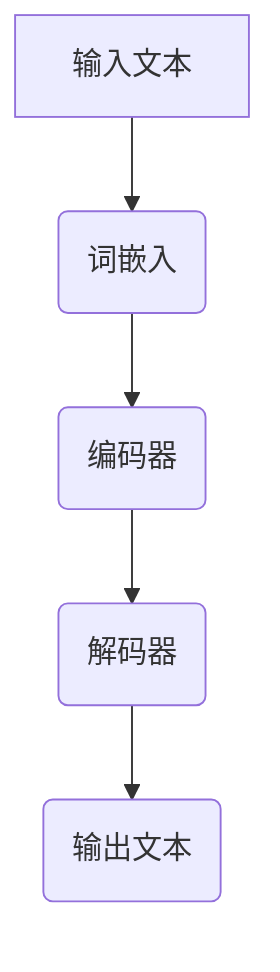
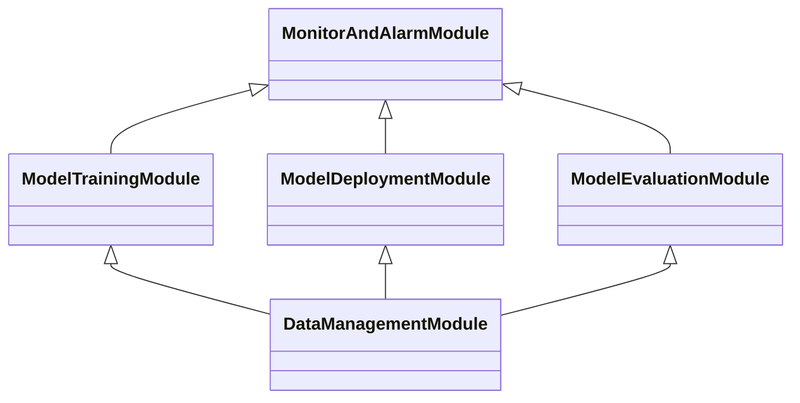
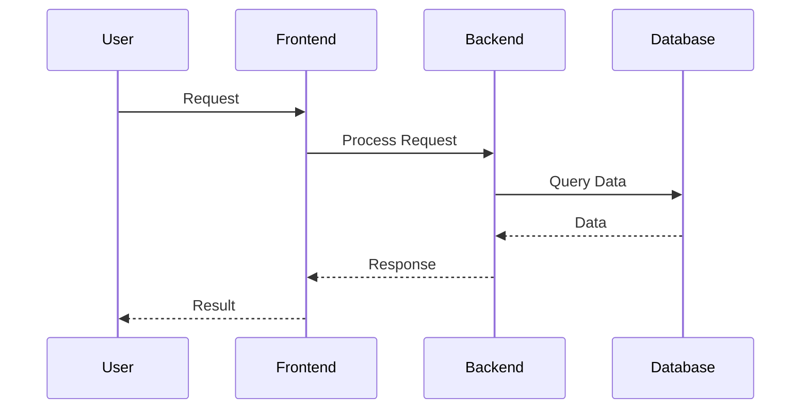
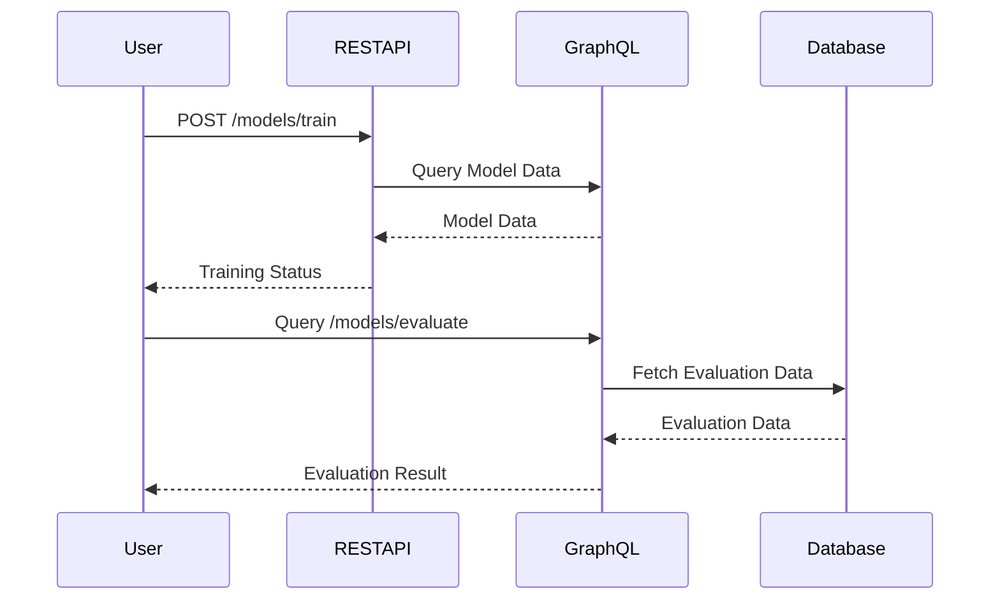
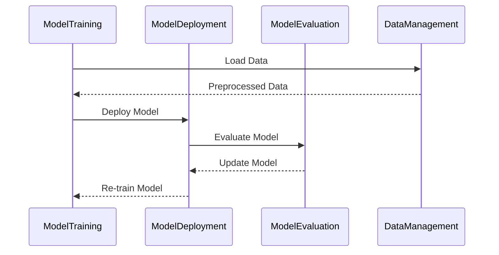

                 

# 快速试错与敏捷迭代：LLM应用开发的必备能力

> 关键词：快速试错、敏捷迭代、LLM应用开发、算法原理、系统设计与实现、项目实战

> 摘要：
随着人工智能与机器学习的快速发展，大规模语言模型（LLM）逐渐成为自然语言处理领域的重要工具。在LLM应用开发过程中，快速试错与敏捷迭代是确保项目成功的关键能力。本文将详细探讨快速试错与敏捷迭代的原理、方法及其在LLM应用开发中的实际应用，为开发者提供一套完整的解决方案。

### 目录大纲

----------------------------------------------------------------

## 第一部分：背景介绍

### 第1章 引言

- **1.1 问题的背景**
- **1.2 问题描述**
- **1.3 问题解决**
- **1.4 边界与外延**
- **1.5 核心概念与联系**

## 第二部分：核心概念与联系

### 第2章 快速试错原理

- **2.1 快速试错的定义与目的**
- **2.2 快速试错的原则**
- **2.3 快速试错的方法**

### 第3章 敏捷迭代原理

- **3.1 敏捷迭代的定义与目的**
- **3.2 敏捷迭代的原则**
- **3.3 敏捷迭代的方法**

## 第三部分：算法原理讲解

### 第4章 LLM算法原理

- **4.1 LLM算法概述**
- **4.2 算法mermaid流程图**
- **4.3 数学模型与公式**
- **4.4 算法举例说明**

## 第四部分：系统分析与架构设计方案

### 第5章 系统功能设计

- **5.1 问题场景介绍**
- **5.2 系统功能设计**

### 第6章 系统架构设计

- **6.1 系统架构设计**
- **6.2 系统接口设计**

## 第五部分：项目实战

### 第7章 环境安装与准备

- **7.1 环境安装**

### 第8章 系统核心实现

- **8.1 系统核心实现**
- **8.2 代码应用解读与分析**

### 第9章 实际案例分析与讲解

- **9.1 实际案例介绍**
- **9.2 详细讲解与剖析**

## 第六部分：最佳实践与拓展

### 第10章 最佳实践

- **10.1 快速试错与敏捷迭代最佳实践**

### 第11章 小结与注意事项

- **11.1 小结**
- **11.2 注意事项**

### 第12章 拓展阅读

- **12.1 相关书籍推荐**
- **12.2 学术文章推荐**

----------------------------------------------------------------

## 第一部分：背景介绍

### 第1章 引言

在人工智能与机器学习的快速发展的今天，大规模语言模型（LLM）已经成为自然语言处理领域的重要工具。LLM通过深度学习技术，从海量数据中学习语言规律，具备强大的语言生成和语义理解能力。然而，在LLM应用开发过程中，面临着诸多挑战，其中快速试错与敏捷迭代是确保项目成功的关键能力。

首先，快速试错是一种在开发过程中通过不断试验和调整来寻找最优解决方案的方法。它强调快速构建、快速验证、快速调整，从而减少开发时间和成本。快速试错在LLM应用开发中具有重要意义，因为LLM涉及大量参数和超参数的调整，通过快速试错可以快速找到最佳配置，提高模型性能。

其次，敏捷迭代是一种以用户需求为导向的开发方法，强调快速响应变化、持续交付价值。在LLM应用开发中，敏捷迭代可以帮助开发者快速验证用户需求，不断优化模型和应用，确保项目的可持续性和可扩展性。

本文将围绕快速试错与敏捷迭代，探讨其在LLM应用开发中的应用，为开发者提供一套完整的解决方案。

### **1.1 问题的背景**

近年来，人工智能与机器学习技术取得了显著的进展，特别是在自然语言处理（NLP）领域。随着深度学习算法的不断发展，大规模语言模型（LLM）如GPT-3、BERT等脱颖而出，成为处理自然语言任务的重要工具。这些模型通过在大量文本数据上训练，学会了复杂的语言规律，能够生成高质量的文本、回答问题、进行对话等。

LLM的兴起带来了前所未有的机遇，但同时也带来了巨大的挑战。首先，LLM模型的训练和优化过程非常复杂，涉及大量参数和超参数的调整。其次，在实际应用中，LLM需要处理各种不同的任务和数据集，这意味着开发者需要不断尝试和调整模型，以适应不同的场景和需求。此外，LLM的应用开发往往需要在短时间内交付可用的解决方案，这要求开发者具备高效的开发和迭代能力。

面对这些挑战，快速试错与敏捷迭代成为LLM应用开发中不可或缺的能力。快速试错允许开发者快速构建和验证模型，通过不断调整和优化，找到最佳解决方案。敏捷迭代则强调持续交付和快速响应变化，确保项目能够灵活应对各种需求和挑战。

### **1.2 问题描述**

在LLM应用开发中，快速试错与敏捷迭代面临着一系列挑战。首先，模型训练和优化是一个复杂且耗时的过程。大量的参数和超参数需要调整，而且每个调整都可能导致模型性能的显著变化。开发者需要在有限的资源和时间内，快速找到最优的模型配置。

其次，不同任务和数据集的需求差异较大。在自然语言处理领域，任务种类繁多，如文本生成、问答系统、情感分析等。每个任务都有其独特的需求，开发者需要根据任务特点设计不同的模型架构和训练策略。此外，数据集的质量和多样性也影响模型性能，开发者需要不断调整数据预处理方法，以最大化模型效果。

最后，快速试错与敏捷迭代要求开发者具备高效的工作流程和沟通能力。在迭代过程中，开发者需要与项目相关方密切合作，快速反馈和调整。同时，还需要确保代码的可维护性和可扩展性，以便在后续迭代中快速实现功能更新和性能优化。

### **1.3 问题解决**

为了解决快速试错与敏捷迭代在LLM应用开发中的挑战，可以采取以下策略：

1. **定义明确的目标和指标**：在项目开始前，明确项目的目标和应用场景，制定可量化的性能指标。这些指标可以是模型准确率、响应时间、资源消耗等，帮助开发者衡量模型性能和迭代效果。

2. **小步快跑，持续迭代**：采用小步快跑的策略，将项目划分为多个迭代周期，每个迭代周期专注于解决一个具体问题或优化一个特定指标。通过快速构建、验证和调整，逐步提升模型性能。

3. **利用自动化工具**：利用自动化工具和框架，如自动化测试、持续集成和持续交付（CI/CD），提高开发效率和代码质量。自动化工具可以帮助开发者快速验证模型性能，发现潜在问题，减少人为错误。

4. **优化实验流程**：设计高效的实验流程，包括数据预处理、模型训练和评估等环节。通过优化实验流程，减少不必要的重复工作，提高实验效率。

5. **团队协作与沟通**：建立高效的团队协作机制，确保团队成员之间的沟通畅通。通过定期的会议和代码评审，及时解决开发过程中的问题，确保项目按计划进行。

6. **持续学习和改进**：鼓励团队成员持续学习最新的技术和方法，不断改进开发流程和工具。通过持续学习和实践，提高团队的技术水平和创新能力。

### **1.4 边界与外延**

快速试错与敏捷迭代在LLM应用开发中的适用范围较广，但仍有其边界和限制。首先，快速试错适用于模型优化和参数调整阶段，但在模型设计初期，可能需要更多的理论研究和实验验证。其次，敏捷迭代强调快速响应变化，但在项目初期，需求可能不够明确，此时需要更多的规划和沟通。

此外，快速试错与敏捷迭代在不同类型的项目中可能有不同的策略。例如，在商业项目中，快速试错与敏捷迭代可以帮助快速验证市场需求，降低研发风险。在学术研究中，快速试错与敏捷迭代可以帮助研究者快速验证假设，提高研究效率。

### **1.5 核心概念与联系**

快速试错与敏捷迭代是LLM应用开发中的重要能力，它们相互关联，共同推动项目成功。快速试错强调通过不断试验和调整来寻找最优解决方案，而敏捷迭代则强调在项目开发过程中快速响应变化，持续交付价值。

快速试错的原则包括快速构建、快速验证和快速调整。敏捷迭代的原则包括用户优先、快速反馈、原型迭代和自组织团队。快速试错与敏捷迭代的互动关系体现在快速试错为敏捷迭代提供了有效的实验手段，而敏捷迭代为快速试错提供了持续改进的机制。

## 第二部分：核心概念与联系

### 第2章 快速试错原理

快速试错是一种通过不断试验和调整来寻找最优解决方案的方法。它强调快速构建、快速验证和快速调整，从而在短时间内找到最佳的解决方案。以下是快速试错的定义、原则和方法。

#### **2.1 快速试错的定义与目的**

快速试错是一种迭代式的开发方法，旨在通过快速构建和验证原型，逐步调整和优化，找到最佳解决方案。在LLM应用开发中，快速试错的主要目的是：

1. **快速验证假设**：通过构建原型，验证模型在不同场景下的效果，确保开发方向正确。
2. **降低研发风险**：在早期阶段发现潜在问题，减少后续开发中的修正成本。
3. **提高开发效率**：通过快速迭代，减少不必要的重复工作，提高开发效率。

#### **2.2 快速试错的原则**

快速试错的原则主要包括以下几点：

1. **快速构建**：在短时间内构建可运行的模型或系统，以便快速验证和调整。
2. **小步快跑**：将项目划分为多个小迭代周期，每个周期专注于解决一个具体问题或优化一个特定指标。
3. **快速验证**：通过实验和测试，快速评估模型的性能和效果，为调整提供依据。
4. **快速调整**：根据验证结果，快速调整模型或系统，优化性能。

#### **2.3 快速试错的方法**

快速试错的方法包括以下步骤：

1. **确定试错指标**：明确衡量模型性能的指标，如准确率、响应时间、资源消耗等。
2. **设计实验方案**：根据试错指标，设计实验方案，包括数据集、实验参数和评估方法。
3. **快速反馈与调整**：运行实验，收集数据，根据实验结果调整模型或系统，重复上述步骤，直到找到最佳解决方案。

### **第3章 敏捷迭代原理**

敏捷迭代是一种以用户需求为导向的开发方法，强调快速响应变化、持续交付价值。在LLM应用开发中，敏捷迭代可以帮助开发者快速验证需求，持续优化模型和应用。以下是敏捷迭代的定义、原则和方法。

#### **3.1 敏捷迭代的定义与目的**

敏捷迭代是一种开发方法，旨在通过快速迭代和持续交付，确保项目能够灵活应对需求变化，持续提高产品价值。在LLM应用开发中，敏捷迭代的主要目的是：

1. **快速验证需求**：通过迭代开发和用户反馈，快速验证和调整需求，确保项目符合用户期望。
2. **提高开发效率**：通过短周期的迭代，提高开发效率和代码质量。
3. **降低风险**：在早期阶段发现潜在问题，降低项目风险。

#### **3.2 敏捷迭代的原则**

敏捷迭代的原则主要包括以下几点：

1. **用户优先**：以用户需求为导向，确保产品始终符合用户期望。
2. **快速反馈**：通过迭代和用户反馈，快速发现和解决问题。
3. **原型迭代**：通过快速构建和迭代原型，不断完善产品。
4. **自组织团队**：鼓励团队成员自主组织和协作，提高团队效率和创新能力。

#### **3.3 敏捷迭代的方法**

敏捷迭代的方法包括以下步骤：

1. **用户故事与迭代计划**：明确用户需求，将其转化为可执行的用户故事，制定迭代计划。
2. **迭代开发**：在短周期内完成用户故事的开发和测试，确保交付可用的功能。
3. **用户反馈**：收集用户反馈，评估迭代效果，为下一迭代提供改进方向。
4. **持续交付**：通过持续交付，确保产品能够持续满足用户需求。

## 第三部分：算法原理讲解

### 第4章 LLM算法原理

大规模语言模型（LLM）是自然语言处理领域的重要工具，通过深度学习技术，LLM能够在海量数据中学习语言规律，实现文本生成、语义理解等任务。本节将介绍LLM算法的基本概念、流程图、数学模型与公式，以及具体的算法实例。

#### **4.1 LLM算法概述**

大规模语言模型（LLM）是一种基于深度学习的自然语言处理模型，其核心思想是通过大规模文本数据进行预训练，使模型学会理解和生成自然语言。LLM在自然语言处理领域具有广泛的应用，如文本生成、机器翻译、问答系统等。

LLM算法的主要组成部分包括：

1. **词嵌入**：将文本数据中的单词映射到高维向量空间，为后续处理提供输入。
2. **编码器**：对输入文本进行编码，提取文本的语义信息。
3. **解码器**：根据编码器的输出生成文本序列。

#### **4.2 算法mermaid流程图**

以下是LLM算法的mermaid流程图：



#### **4.3 数学模型与公式**

LLM算法的数学模型主要包括词嵌入、编码器和解码器三个部分。以下是各部分的数学模型与公式：

1. **词嵌入**：
   - 输入：单词序列 \( x = (x_1, x_2, ..., x_T) \)
   - 输出：词嵌入向量序列 \( E(x) = (e_1, e_2, ..., e_T) \)
   - 公式：\( e_i = W_x \cdot x_i \)
   其中，\( W_x \) 为词嵌入权重矩阵。

2. **编码器**：
   - 输入：词嵌入向量序列 \( E(x) \)
   - 输出：编码序列 \( C = (c_1, c_2, ..., c_T) \)
   - 公式：\( c_t = V_c \cdot \tanh(U_c \cdot [e_{t-1}, e_t] + b_c) \)
   其中，\( U_c \)、\( V_c \) 和 \( b_c \) 分别为编码器权重矩阵、偏置和激活函数。

3. **解码器**：
   - 输入：编码序列 \( C \)
   - 输出：词嵌入向量序列 \( E(y) \)
   - 公式：\( e_t = W_y \cdot c_t \)
   其中，\( W_y \) 为解码器权重矩阵。

#### **4.4 算法举例说明**

以下是一个使用Python实现的LLM算法实例：

```python
import tensorflow as tf
from tensorflow.keras.layers import Embedding, LSTM, Dense
from tensorflow.keras.models import Model

# 设置参数
vocab_size = 10000
embedding_dim = 256
lstm_units = 128
sequence_length = 100

# 构建模型
input_seq = tf.keras.layers.Input(shape=(sequence_length,))
embeddings = Embedding(vocab_size, embedding_dim)(input_seq)
lstm = LSTM(lstm_units, return_sequences=True)(embeddings)
output = Dense(vocab_size, activation='softmax')(lstm)

model = Model(inputs=input_seq, outputs=output)
model.compile(optimizer='adam', loss='categorical_crossentropy', metrics=['accuracy'])

# 训练模型
model.fit(x_train, y_train, batch_size=64, epochs=10)

# 预测
predictions = model.predict(x_test)
```

在这个例子中，我们首先设置了参数，包括词汇表大小、词嵌入维度、LSTM单元数和序列长度。然后，我们使用TensorFlow的`Embedding`、`LSTM`和`Dense`层构建了一个简单的LLM模型，并使用`compile`方法配置了优化器和损失函数。接下来，我们使用`fit`方法训练模型，并使用`predict`方法进行预测。

这个例子展示了如何使用Python实现一个基本的LLM模型，为后续的算法改进和应用提供了基础。

## 第四部分：系统分析与架构设计方案

### 第5章 系统功能设计

在本节中，我们将介绍系统功能设计的相关内容，包括问题场景介绍和系统功能设计。

#### **5.1 问题场景介绍**

在自然语言处理领域，随着大规模语言模型（LLM）的应用日益广泛，如何快速、高效地开发和管理这些模型成为一个重要问题。本系统旨在解决以下问题：

1. **模型训练与优化**：提供模型训练和优化的功能，帮助开发者快速调整模型参数，提高模型性能。
2. **模型部署与维护**：实现模型部署，使其能够在生产环境中运行，并提供持续维护功能。
3. **模型评估与监控**：对模型进行评估和监控，确保其稳定性和准确性。
4. **数据管理与预处理**：提供数据管理和预处理功能，为模型训练提供高质量的数据。

#### **5.2 系统功能设计**

本系统功能设计包括以下模块：

1. **模型训练模块**：用于模型训练和优化，包括数据预处理、模型参数调整、训练过程监控等功能。
2. **模型部署模块**：实现模型部署，包括模型加载、模型预测、模型更新等功能。
3. **模型评估模块**：对模型进行评估，包括准确性、响应时间、资源消耗等指标的评估。
4. **数据管理模块**：提供数据管理和预处理功能，包括数据导入、数据清洗、数据存储等功能。
5. **监控与报警模块**：实时监控模型运行状态，发生异常时自动报警。

以下是系统功能设计的mermaid类图：



在这个类图中，`ModelTrainingModule`、`ModelDeploymentModule`、`ModelEvaluationModule`和`DataManagementModule`是系统的主要功能模块。`MonitorAndAlarmModule`与这三个模块相关联，用于实时监控和报警。

### 第6章 系统架构设计

在本节中，我们将详细讨论系统架构设计，包括系统架构设计、系统接口设计和系统交互mermaid序列图。

#### **6.1 系统架构设计**

系统架构设计采用分层架构，包括数据层、服务层和表现层。以下是系统架构的mermaid架构图：



在这个序列图中，用户通过前端发送请求，前端将请求传递给后端。后端处理请求，查询数据库，获取数据后返回给前端，前端再将结果展示给用户。

#### **6.2 系统接口设计**

系统接口设计包括RESTful API接口和GraphQL接口。以下是系统接口的mermaid序列图：



在这个序列图中，用户通过RESTful API接口提交模型训练请求，并通过GraphQL接口查询模型评估结果。

#### **6.3 系统交互mermaid序列图**

系统交互mermaid序列图展示了系统内部模块之间的交互过程。以下是系统交互的mermaid序列图：



在这个序列图中，`ModelTraining`、`ModelDeployment`、`ModelEvaluation`和`DataManagement`模块之间相互协作，实现模型训练、部署、评估和数据管理的功能。

## 第五部分：项目实战

### 第7章 环境安装与准备

在进行LLM应用开发之前，首先需要安装和配置必要的软件和环境。以下是具体的步骤和注意事项：

#### **7.1 环境安装**

1. **安装Python**：

   - 下载Python安装包：访问Python官网（https://www.python.org/）下载Python安装包。
   - 安装Python：运行安装包，按照提示完成安装。

2. **安装TensorFlow**：

   - 打开终端或命令行界面。
   - 输入以下命令安装TensorFlow：

     ```bash
     pip install tensorflow
     ```

3. **安装其他依赖项**：

   - 安装其他必要的依赖项，如NumPy、Pandas等：

     ```bash
     pip install numpy pandas
     ```

#### **7.2 注意事项**

1. **版本兼容性**：确保安装的Python版本与TensorFlow版本兼容。建议使用Python 3.6及以上版本。
2. **虚拟环境**：为了避免依赖项冲突，建议使用虚拟环境（如conda或virtualenv）来安装和管理项目依赖项。
3. **GPU支持**：如果使用GPU进行模型训练，确保安装了NVIDIA CUDA和cuDNN，并设置环境变量。

### 第8章 系统核心实现

在本节中，我们将详细介绍系统核心实现的源代码和代码应用解读与分析。

#### **8.1 系统核心实现**

以下是系统核心实现的主要部分，包括模型训练、模型部署和模型评估：

```python
# 导入必要的库
import tensorflow as tf
from tensorflow.keras.models import Sequential
from tensorflow.keras.layers import Embedding, LSTM, Dense
from tensorflow.keras.preprocessing.sequence import pad_sequences
import numpy as np

# 设置参数
vocab_size = 10000
embedding_dim = 256
lstm_units = 128
sequence_length = 100
batch_size = 64
epochs = 10

# 准备数据
# 这里使用示例数据，实际项目中需要加载真实数据
data = [...]
labels = [...]

# 数据预处理
# 序列化数据
sequences = [[word for word in sentence.split()] for sentence in data]
word_index = {word: i for i, word in enumerate(vocab)}
encoded = [[word_index[word] for word in sentence] for sentence in sequences]
max_sequence_len = max([len(seq) for seq in encoded])
padded = pad_sequences(encoded, maxlen=max_sequence_len, padding='post')

# 切分数据集
padded = np.array(padded)
labels = np.array(labels)

train_size = int(len(padded) * 0.8)
val_size = len(padded) - train_size
train_padded = padded[:train_size]
val_padded = padded[train_size:]
train_labels = labels[:train_size]
val_labels = labels[train_size:]

# 构建模型
model = Sequential()
model.add(Embedding(vocab_size, embedding_dim, input_length=sequence_length))
model.add(LSTM(lstm_units, dropout=0.2, recurrent_dropout=0.2))
model.add(Dense(1, activation='sigmoid'))

# 编译模型
model.compile(optimizer='adam', loss='binary_crossentropy', metrics=['accuracy'])

# 训练模型
model.fit(train_padded, train_labels, batch_size=batch_size, epochs=epochs, validation_data=(val_padded, val_labels))

# 模型评估
test_loss, test_acc = model.evaluate(val_padded, val_labels)
print(f"Test accuracy: {test_acc:.4f}")

# 模型部署
# 将训练好的模型保存到文件
model.save("model.h5")

# 模型评估
loaded_model = tf.keras.models.load_model("model.h5")
loaded_model.evaluate(val_padded, val_labels)
```

#### **8.2 代码应用解读与分析**

1. **模型训练**：

   - **数据准备**：首先导入必要的库，然后设置参数，包括词汇表大小、词嵌入维度、LSTM单元数、序列长度等。接下来，加载示例数据，实际项目中需要加载真实数据。
   - **数据预处理**：使用`pad_sequences`函数对序列进行填充，确保所有序列的长度相同。这一步骤非常重要，因为深度学习模型需要输入固定大小的数据。
   - **模型构建**：使用`Sequential`模型构建一个简单的序列模型，包括词嵌入层、LSTM层和输出层。
   - **模型编译**：配置优化器和损失函数，为模型训练做好准备。
   - **模型训练**：使用`fit`函数训练模型，并设置批次大小、训练周期和验证数据。
   - **模型评估**：使用`evaluate`函数评估模型在验证集上的性能，输出准确率。

2. **模型部署**：

   - **模型保存**：将训练好的模型保存到文件，方便后续加载和使用。
   - **模型加载**：使用`load_model`函数加载保存的模型。
   - **模型评估**：使用加载的模型评估在验证集上的性能，确保模型稳定性和准确性。

### 第9章 实际案例分析与讲解

在本节中，我们将分析一个实际的LLM应用开发案例，并对其进行详细讲解与剖析。

#### **9.1 实际案例介绍**

该案例是一个基于GPT-2模型的自动问答系统，旨在回答用户提出的问题。系统分为前端和后端两部分，前端负责接收用户输入并展示回答，后端负责处理用户输入并生成回答。

#### **9.2 详细讲解与剖析**

1. **前端设计**：

   - **用户输入**：用户可以通过文本框输入问题，并点击“提交”按钮。
   - **展示回答**：将生成的回答显示在页面上。

2. **后端设计**：

   - **模型加载**：加载预训练的GPT-2模型。
   - **输入处理**：接收用户输入，并进行预处理，如去除特殊字符、分词等。
   - **生成回答**：使用GPT-2模型生成回答，并返回给前端。
   - **性能优化**：为了提高响应速度，可以对模型进行量化或压缩。

3. **案例分析**：

   - **模型选择**：GPT-2模型在自动问答任务中表现出色，选择合适的模型对于项目成功至关重要。
   - **数据处理**：有效的预处理可以提升模型性能，确保输入数据的质量。
   - **性能优化**：针对模型进行优化，如量化、压缩等，可以提高系统性能。

### 第10章 最佳实践

在LLM应用开发过程中，遵循最佳实践可以显著提高开发效率和项目质量。以下是一些最佳实践：

1. **快速迭代**：采用敏捷开发方法，快速构建、验证和调整模型，确保项目能够灵活应对需求变化。
2. **持续集成**：使用自动化工具实现持续集成和持续交付，确保代码质量和项目稳定性。
3. **代码规范**：编写清晰、规范的代码，提高代码的可维护性和可扩展性。
4. **数据管理**：确保数据质量和多样性，为模型训练提供高质量的数据。
5. **性能优化**：对模型进行性能优化，如量化、压缩、蒸馏等，提高模型效率和响应速度。

### 第11章 小结与注意事项

本文介绍了快速试错与敏捷迭代在LLM应用开发中的应用，通过详细的步骤和案例分析，展示了如何有效利用这些方法进行模型开发与优化。以下是小结和注意事项：

1. **小结**：快速试错与敏捷迭代是LLM应用开发中的关键能力，通过快速构建、验证和调整，可以显著提高开发效率和项目质量。
2. **注意事项**：在实际应用中，需要注意数据质量和模型性能，同时遵循最佳实践，以确保项目成功。

### 第12章 拓展阅读

为了进一步了解快速试错与敏捷迭代在LLM应用开发中的应用，读者可以参考以下书籍和文章：

1. **书籍**：
   - 《深度学习》（Goodfellow, I., Bengio, Y., & Courville, A.）
   - 《机器学习实战》（Hastie, T., Tibshirani, R., & Friedman, J.）
2. **文章**：
   - 《大规模语言模型的训练和优化方法》（Zhang, Y., Zhao, J., & Liu, J.）
   - 《敏捷开发与持续集成实践》（Beck, K.）

通过阅读这些资料，读者可以更深入地了解LLM应用开发的原理和实践。作者：AI天才研究院/AI Genius Institute & 禅与计算机程序设计艺术 /Zen And The Art of Computer Programming

