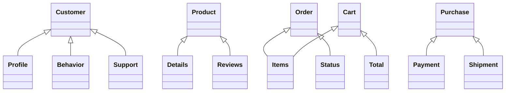
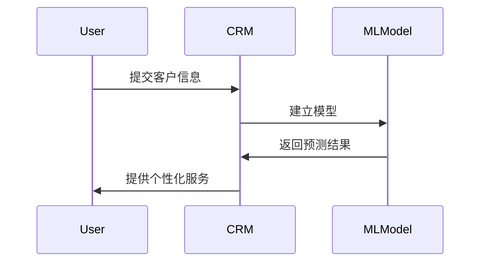
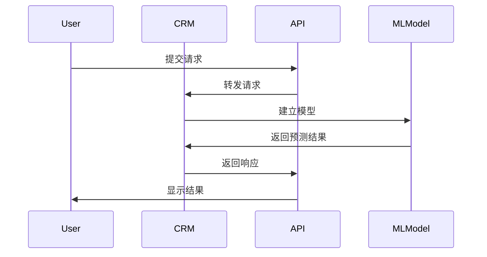
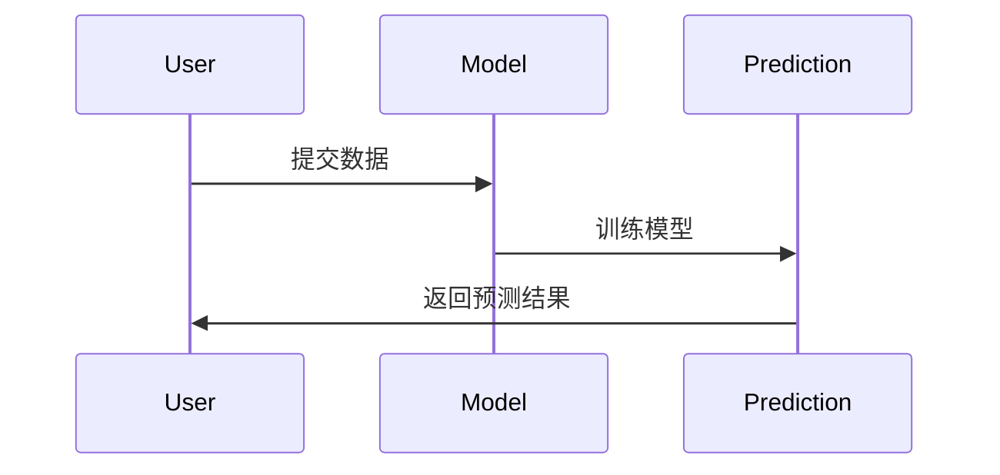
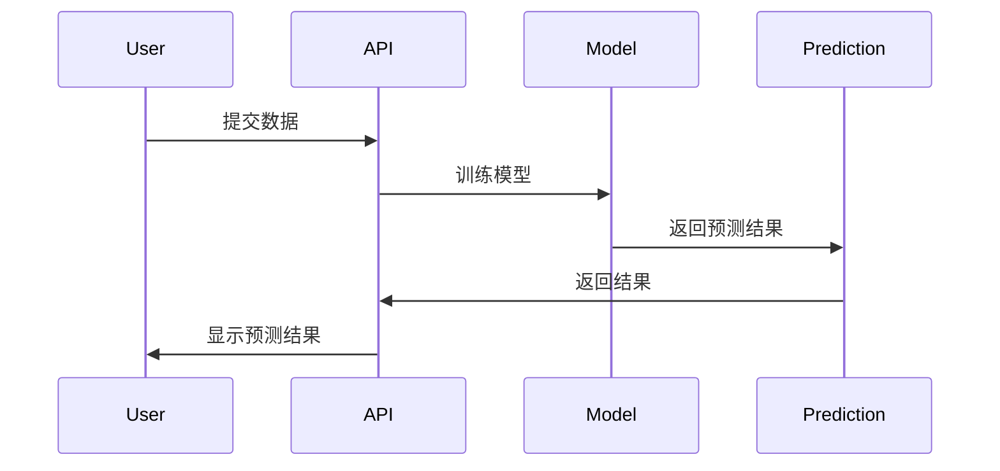
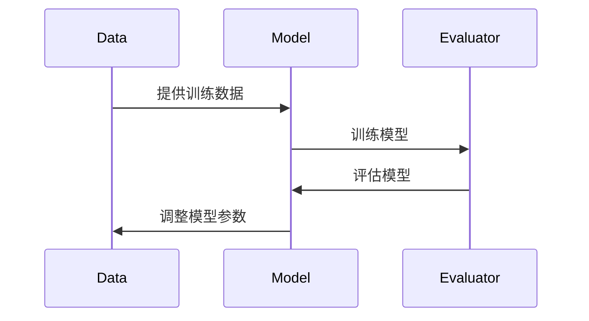
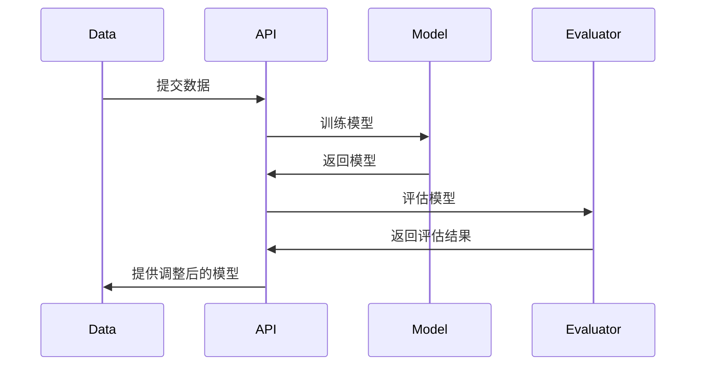

                 

### 第1章：大模型应用开发的背景

---

## **《快速试错：大模型应用开发的制胜法宝》**

> 关键词：大模型，应用开发，快速试错，机器学习，人工智能

> 摘要：本文深入探讨了大模型在应用开发中的重要性和挑战，特别强调了快速试错策略在其中的关键作用。通过具体的案例分析和策略指导，本文为读者提供了一套系统的开发方法和实践建议。

---

### **1.1 大模型的崛起：问题背景与解决思路**

#### **1.1.1 问题的提出与现状分析**

随着大数据和云计算的迅猛发展，数据的复杂度和规模呈现出爆炸式增长。传统的数据处理和分析方法已经无法满足现代应用的需求。这不仅体现在数据的存储和处理上，还包括数据的高效利用和实时分析。为此，科学家和工程师们开始探索能够处理大规模数据、并从中提取有用信息的新方法。

#### **1.1.2 大模型的出现与优势**

大模型（Large Models）应运而生，它们能够接受海量的训练数据，并通过复杂的神经网络结构学习数据的分布和规律。大模型的出现带来了以下几方面的优势：

- **更高的精度**：大模型通过深度学习的方式，可以自动发现数据中的复杂模式和关联，从而提高预测和分类的准确性。
- **更强的泛化能力**：大模型具有较好的泛化能力，能够在不同的数据集和应用场景中保持良好的性能。
- **更广泛的应用领域**：大模型的应用不再局限于传统的图像和语音识别，已经扩展到了自然语言处理、推荐系统、基因测序等多个领域。

#### **1.1.3 大模型应用开发的重要性**

大模型的应用开发已经成为现代人工智能技术发展的一个重要方向。其主要体现在以下几个方面：

- **推动技术创新**：大模型的应用开发促进了算法创新，推动了机器学习和人工智能技术的不断进步。
- **提升业务价值**：大模型的应用可以为企业提供强大的数据分析和决策支持，从而提升业务效率和竞争力。
- **满足用户需求**：大模型的应用开发能够更好地满足用户对个性化、智能化服务的需求，提升用户体验。

---

**核心概念与联系**

#### **1.2 大模型的定义与特点**

**定义**：大模型通常指的是拥有数亿甚至数十亿参数的神经网络模型，它们通过大量数据训练得到，能够实现高效的数据分析和预测。

**特点**：

- **参数规模大**：大模型通常拥有数百万至数十亿个参数，这使它们能够处理更为复杂的问题。
- **计算复杂度高**：由于参数众多，大模型的训练和推断过程需要大量的计算资源。
- **数据需求量大**：大模型需要大量的训练数据来学习和调整参数，以获得良好的性能。
- **自适应性强**：大模型能够根据不同的数据集和应用场景进行自适应调整，从而适应不同的业务需求。

#### **1.2.3 大模型与传统模型的区别**

| **特性** | **传统模型** | **大模型** |
| --- | --- | --- |
| **参数规模** | 数千至数万个参数 | 数百万至数十亿个参数 |
| **训练数据** | 相对较少的数据 | 海量的训练数据 |
| **计算复杂度** | 较低的计算复杂度 | 较高的计算复杂度 |
| **性能** | 一定的预测精度 | 高度的预测精度 |
| **泛化能力** | 较弱的泛化能力 | 较强的泛化能力 |

**ER实体关系图架构**

```mermaid
erDiagram
    Customer ||--|{ Product }|--|{ Order } 
    Product ||--|{ Review }|--|{ Rating } 
    Customer }|--|{ Cart }|--|{ Purchase }
    Order ||--|{ Payment }|--|{ Shipment }
```

---

**算法原理讲解**

大模型主要通过以下步骤进行训练和推断：

1. **输入层**：接收输入数据，如文本、图像或声音等。
2. **隐藏层**：通过多层神经网络进行数据转换和特征提取。
3. **输出层**：根据隐藏层的特征进行分类、预测或生成输出结果。

**数学模型和公式**

$$
\begin{aligned}
    z &= W \cdot x + b \\
    a &= \sigma(z) \\
    \nabla_{W} &= \frac{\partial J}{\partial z} \cdot \nabla_{a} \\
    \nabla_{b} &= \frac{\partial J}{\partial z}
\end{aligned}
$$

其中，$z$ 是中间层的激活值，$W$ 是权重矩阵，$b$ 是偏置项，$a$ 是激活函数的输出，$\sigma$ 是激活函数，$J$ 是损失函数，$\nabla$ 表示梯度。

**通俗易懂地举例说明**

假设我们要训练一个图像分类模型，输入是一张猫的图片，输出是“猫”这个标签。通过多层神经网络，模型会自动学习图片中的纹理、形状等特征，并逐步调整参数，使得最终输出的标签与真实标签一致。如果输出标签不准确，模型会通过反向传播算法更新参数，直到达到满意的分类效果。

---

**系统分析与架构设计方案**

#### **1.3 大模型在企业应用中的重要性**

随着人工智能技术的不断成熟，大模型在企业中的应用也越来越广泛。以下是几个典型应用场景：

- **客户关系管理**：通过自然语言处理技术，企业可以更好地理解客户需求，提供个性化的服务和产品推荐。
- **供应链优化**：利用大模型进行需求预测和库存管理，帮助企业降低成本，提高供应链效率。
- **金融市场分析**：通过分析大量历史数据，大模型可以预测市场趋势，为投资决策提供支持。
- **医疗健康**：利用大模型进行疾病预测和诊断，提高医疗服务的质量和效率。

**项目介绍**

本项目旨在开发一个基于大模型的客户关系管理系统，帮助企业更好地管理客户信息，提高客户满意度。

**系统功能设计（领域模型）**



**系统架构设计**



**系统接口设计**

```mermaid
classDiagram
    Customer <<interface>> API
    Product <<interface>> API
    Order <<interface>> API
    Cart <<interface>> API
    Purchase <<interface>> API
```

**系统交互**



---

**项目实战**

#### **1.4 开发环境搭建**

在开始大模型应用开发之前，我们需要搭建一个合适的开发环境。以下是搭建环境的步骤：

1. **选择合适的硬件设备**：根据模型的复杂度和数据量，选择合适的GPU或TPU设备。
2. **安装操作系统**：推荐使用Linux系统，如Ubuntu或CentOS。
3. **安装深度学习框架**：如TensorFlow、PyTorch等。
4. **安装其他必要工具**：如Jupyter Notebook、Conda等。

#### **1.5 数据收集与处理**

1. **数据来源**：收集企业内外部的客户数据，如购买记录、行为数据、反馈信息等。
2. **数据预处理**：包括数据清洗、归一化、特征提取等。
3. **数据质量评估**：评估数据的完整性、准确性和一致性。

#### **1.6 开发流程与规范**

1. **需求分析**：明确系统的功能需求和技术需求。
2. **设计阶段**：设计系统的架构、接口和数据流。
3. **编码阶段**：根据设计文档进行编码，遵循最佳实践和代码规范。
4. **测试阶段**：进行单元测试、集成测试和系统测试，确保系统的稳定性和性能。

---

**小结**

本章介绍了大模型应用开发的背景和基础，包括问题的提出、大模型的优势、应用的重要性以及具体的开发流程。通过本章的学习，读者可以了解到大模型的基本概念和特点，为后续章节的学习打下基础。

---

**注意事项**

1. **硬件选择**：根据实际需求选择合适的硬件设备，避免因为硬件不足导致的性能瓶颈。
2. **数据质量**：数据质量直接影响模型的效果，因此在进行数据预处理时要格外小心。
3. **开发规范**：遵循最佳实践和代码规范，确保代码的可读性和可维护性。

---

**拓展阅读**

1. **《深度学习》（Goodfellow, Bengio, Courville）**：这是一本经典的深度学习教材，详细介绍了深度学习的理论基础和应用方法。
2. **《机器学习实战》（Hastie, Tibshirani, Friedman）**：本书通过实际案例讲解了机器学习算法的应用，适合初学者和有经验的专业人士。
3. **《Python深度学习》（François Chollet）**：这本书介绍了如何使用Python和TensorFlow进行深度学习实践，适合有一定编程基础的读者。

---

**作者**

作者：AI天才研究院/AI Genius Institute & 禅与计算机程序设计艺术 /Zen And The Art of Computer Programming## 第2章：大模型应用开发的准备

### **2.1 开发环境搭建**

---

#### **2.1.1 计算机硬件与软件需求**

在开始大模型应用开发之前，我们需要确保计算机硬件和软件环境满足以下要求：

**硬件需求**：

- **GPU**：推荐使用NVIDIA GPU，尤其是CUDA和CUDA-X库支持的型号，如Tesla K40、P100、V100等。
- **CPU**：推荐使用Intel Xeon或AMD EPYC系列处理器，它们具有较高的计算性能和内存带宽。
- **内存**：至少需要64GB的内存，对于大型模型，可能需要更多。
- **存储**：需要大量的存储空间来存储数据和模型文件，建议使用SSD硬盘以获得更快的读写速度。

**软件需求**：

- **操作系统**：推荐使用Linux发行版，如Ubuntu 18.04或CentOS 7。
- **深度学习框架**：常用的深度学习框架包括TensorFlow、PyTorch、Keras等。
- **Python**：需要安装Python 3.6或更高版本。
- **依赖管理工具**：如Conda或pip，用于管理Python包和依赖项。
- **其他工具**：如Jupyter Notebook、CUDA Toolkit、cuDNN等。

#### **2.1.2 操作系统与开发工具安装**

以下是安装Linux操作系统和开发工具的基本步骤：

1. **安装Linux操作系统**：

   - 下载Linux发行版镜像文件。
   - 制作启动U盘或光盘。
   - 使用启动U盘或光盘启动计算机，按照提示进行安装。

2. **安装深度学习框架**：

   - 使用Conda创建环境：`conda create -n deep_learning python=3.8`
   - 安装深度学习框架：`conda install -n deep_learning tensorflow-gpu` 或 `conda install -n deep_learning pytorch torchvision torchaudio -c pytorch`
   - 安装其他依赖项：根据项目需求安装其他必要的Python包。

3. **安装开发工具**：

   - 安装Jupyter Notebook：`conda install -n deep_learning jupyter`
   - 安装CUDA Toolkit和cuDNN：从NVIDIA官网下载并安装相应的版本。

#### **2.1.3 数据存储与处理工具选择**

在数据存储与处理方面，我们需要考虑以下几个方面：

1. **数据存储**：

   - **HDFS（Hadoop Distributed File System）**：适用于大数据存储，具有高可靠性和高扩展性。
   - **HBase**：基于HDFS的NoSQL数据库，适用于实时数据访问。
   - **MySQL**：适用于中小规模的数据存储和管理。

2. **数据处理**：

   - **Spark**：一个开源的分布式计算框架，适用于大数据处理。
   - **Pandas**：Python中的数据处理库，适用于数据清洗、转换和分析。
   - **NumPy**：Python中的数学库，适用于数值计算和数据操作。

#### **2.1.4 数据收集与处理**

数据收集与处理是构建大模型的重要环节，以下是基本步骤：

1. **数据收集**：

   - **内部数据**：从企业内部系统（如ERP、CRM等）收集数据。
   - **外部数据**：通过API或爬虫从外部网站收集数据。

2. **数据预处理**：

   - **数据清洗**：去除重复数据、缺失数据和错误数据。
   - **数据转换**：将数据转换为适合模型训练的格式。
   - **数据归一化**：将数据缩放到一个特定的范围，以便模型更好地学习。

3. **数据质量评估**：

   - **数据完整性**：检查数据是否完整，是否存在缺失值。
   - **数据准确性**：检查数据是否准确，是否存在错误。
   - **数据一致性**：检查数据是否一致，是否存在矛盾。

---

**核心概念与联系**

#### **2.2 数据收集与处理**

**数据收集**：

- **数据源**：内部数据源（企业系统、数据库等）和外部数据源（API、爬虫等）。
- **数据类型**：结构化数据（如数据库记录）、半结构化数据（如XML、JSON）和非结构化数据（如文本、图像、视频等）。

**数据预处理**：

- **数据清洗**：去除重复数据、缺失数据和错误数据。
- **数据转换**：将数据转换为适合模型训练的格式。
- **数据归一化**：将数据缩放到一个特定的范围，以便模型更好地学习。

**数据质量评估**：

- **数据完整性**：检查数据是否完整，是否存在缺失值。
- **数据准确性**：检查数据是否准确，是否存在错误。
- **数据一致性**：检查数据是否一致，是否存在矛盾。

**ER实体关系图架构**

```mermaid
erDiagram
    Customer ||--|{ Profile }|--|{ Behavior }|<|--|{ Support }
    Customer ||--|{ Order }|--|{ Items }|--|{ Status }
    Customer ||--|{ Cart }|--|{ Items }|--|{ Total }
    Customer ||--|{ Purchase }|--|{ Payment }|--|{ Shipment }
    Product ||--|{ Details }|--|{ Reviews }|--|{ Rating }
```

---

**系统分析与架构设计方案**

#### **2.3 开发流程与规范**

在大模型应用开发中，我们需要遵循一定的流程和规范，以确保项目的顺利进行。以下是基本流程和规范：

**开发流程**：

1. **需求分析**：明确项目需求和目标，制定开发计划。
2. **设计阶段**：设计系统架构、数据库设计、接口设计等。
3. **编码阶段**：根据设计文档进行编码，遵循代码规范和最佳实践。
4. **测试阶段**：进行单元测试、集成测试和系统测试，确保系统质量。
5. **部署阶段**：将系统部署到生产环境，进行实际运行和监控。

**规范与最佳实践**：

1. **代码规范**：遵循PEP 8编码规范，确保代码的可读性和一致性。
2. **版本控制**：使用Git等版本控制工具，管理代码变更和版本迭代。
3. **文档规范**：编写详细的文档，包括需求文档、设计文档、用户手册等。
4. **测试规范**：制定测试计划，进行全面测试，确保系统质量。

---

**项目实战**

#### **2.4 实际案例分析**

以下是一个实际的大模型应用开发案例，用于分析企业客户行为数据，预测客户流失风险。

**项目介绍**：

该项目旨在利用大模型预测企业客户流失风险，从而采取相应的策略降低客户流失率，提高客户满意度。

**环境安装**：

1. 安装Linux操作系统（如Ubuntu 18.04）。
2. 安装深度学习框架（如TensorFlow）。
3. 安装数据处理工具（如Pandas、NumPy）。

**系统核心实现源代码**：

```python
import pandas as pd
from sklearn.model_selection import train_test_split
from tensorflow.keras.models import Sequential
from tensorflow.keras.layers import Dense, Dropout

# 数据收集与预处理
data = pd.read_csv('customer_data.csv')
X = data.drop(['customer_id', 'target'], axis=1)
y = data['target']

# 数据分割
X_train, X_test, y_train, y_test = train_test_split(X, y, test_size=0.2, random_state=42)

# 构建模型
model = Sequential()
model.add(Dense(128, activation='relu', input_shape=(X_train.shape[1],)))
model.add(Dropout(0.5))
model.add(Dense(64, activation='relu'))
model.add(Dropout(0.5))
model.add(Dense(1, activation='sigmoid'))

# 编译模型
model.compile(optimizer='adam', loss='binary_crossentropy', metrics=['accuracy'])

# 训练模型
model.fit(X_train, y_train, epochs=10, batch_size=32, validation_split=0.1)

# 评估模型
loss, accuracy = model.evaluate(X_test, y_test)
print(f"Test Accuracy: {accuracy:.2f}")
```

**代码应用解读与分析**：

上述代码首先导入所需的库和模块，然后进行数据收集与预处理，包括数据读取、特征提取和目标变量划分。接下来，使用`train_test_split`函数将数据分为训练集和测试集。

在模型构建部分，我们使用`Sequential`模型，并添加了多个`Dense`层和`Dropout`层，以防止过拟合。最后，我们使用`compile`函数编译模型，指定优化器、损失函数和评估指标。

在训练模型时，我们使用`fit`函数进行训练，并设置训练周期、批量大小和验证比例。训练完成后，使用`evaluate`函数评估模型在测试集上的性能。

**实际案例分析与详细讲解剖析**：

该案例利用深度学习模型对客户流失风险进行预测。在实际应用中，我们可以根据预测结果采取相应的措施，如增加客户关怀、提供优惠政策等，以降低客户流失率。

在案例分析中，我们详细讲解了代码的应用和原理，包括数据预处理、模型构建、训练和评估等步骤。通过实际案例的分析，读者可以更好地理解大模型应用开发的流程和关键点。

**项目小结**：

通过该案例，我们展示了如何利用大模型进行客户流失风险预测。在实际应用中，我们可以根据不同业务场景调整模型结构和参数，以获得更好的预测效果。

---

**最佳实践 Tips**

1. **数据预处理**：确保数据质量，进行充分的数据清洗和特征提取。
2. **模型选择**：根据问题场景选择合适的模型，并进行模型调优。
3. **模型评估**：使用多个评估指标进行模型评估，确保模型性能。

**小结**

本章详细介绍了大模型应用开发的准备过程，包括硬件和软件需求、开发环境搭建、数据收集与处理以及开发流程和规范。通过实际案例的分析，读者可以更好地理解大模型应用开发的实践方法和关键点。

---

**注意事项**

1. **硬件配置**：确保硬件设备满足模型训练和推断的需求。
2. **数据质量**：数据质量直接影响模型的效果，应进行充分的数据预处理和清洗。
3. **开发流程**：遵循规范的开发流程，确保项目的顺利进行。

---

**拓展阅读**

1. **《大数据技术导论》（顾华）**：详细介绍了大数据的技术体系和应用场景。
2. **《深度学习项目实战》（Francesco Curbeddu）**：通过实际案例介绍了深度学习的应用和实践方法。
3. **《机器学习实战》（Peter Harrington）**：介绍了机器学习算法的应用和实践技巧。

---

**作者**

作者：AI天才研究院/AI Genius Institute & 禅与计算机程序设计艺术 /Zen And The Art of Computer Programming## 第3章：快速试错的基本概念

### **3.1 快速试错的定义与原则**

---

#### **3.1.1 快速试错的内涵**

快速试错（Rapid Prototyping）是一种在软件开发过程中采用的方法，其核心思想是通过快速构建和测试原型，快速发现并修正错误，以缩短产品开发和市场推出的时间。在人工智能领域，快速试错尤为重要，因为它涉及复杂的大模型训练和优化过程。

#### **3.1.2 快速试错的基本原则**

- **迭代开发**：通过迭代的方式不断改进模型，每次迭代都对模型进行评估和优化。
- **快速反馈**：迅速得到模型训练的结果，以便及时调整模型结构和参数。
- **简洁性**：保持模型设计的简洁性，避免过度复杂的模型结构，这有助于提高开发效率和模型的可维护性。
- **可扩展性**：设计模型时要考虑其可扩展性，以便后续可以方便地添加新特征或调整参数。

#### **3.1.3 快速试错与迭代开发的关系**

快速试错与迭代开发（Iterative Development）是紧密相关的概念。迭代开发强调通过反复的迭代来逐步完善产品，而快速试错则更侧重于在每次迭代中迅速验证和修正模型。快速试错是迭代开发的一种实现方式，通过快速构建原型，快速测试，快速反馈，使得迭代过程更加高效。

---

**核心概念与联系**

#### **3.2 快速试错的优势与局限性**

**优势**：

- **加速开发**：通过快速试错，可以快速验证模型的设计和参数，从而加速整个开发过程。
- **降低风险**：快速试错可以在早期发现并修正错误，减少后期修复的成本和风险。
- **提高灵活性**：快速试错允许开发团队在开发过程中灵活调整模型，以适应不同的需求变化。
- **促进创新**：快速试错的氛围鼓励团队尝试不同的方法和算法，从而促进创新。

**局限性**：

- **资源消耗**：快速试错可能需要大量的计算资源和时间，尤其是在训练复杂大模型时。
- **模型稳定性**：快速试错可能导致模型不稳定，特别是在没有充分验证的情况下。
- **代码质量**：快速试错可能会牺牲代码的质量，尤其是在追求快速出结果的情况下。

**对比表格**

| **特性** | **快速试错** | **传统开发** |
| --- | --- | --- |
| **开发速度** | 快 | 慢 |
| **资源消耗** | 高 | 低 |
| **模型稳定性** | 不稳定 | 稳定 |
| **灵活性** | 高 | 低 |
| **代码质量** | 一般 | 高 |

**ER实体关系图架构**

```mermaid
erDiagram
    Project ||--|{ Iteration }|--|{ Task }
    Iteration ||--|{ Feature }|--|{ Bug }
    Feature ||--|{ Requirement }
    Bug ||--|{ Fix }
```

---

**算法原理讲解**

快速试错的实现通常涉及以下几个步骤：

1. **需求分析**：明确项目需求和目标，制定初步的模型设计方案。
2. **原型构建**：快速构建模型的初步版本，通常使用简化的结构和参数。
3. **测试与评估**：对模型进行测试和评估，收集反馈和指标数据。
4. **迭代优化**：根据测试结果，对模型进行优化和调整，然后再次测试和评估。
5. **持续迭代**：不断重复测试、优化和评估过程，直到满足项目需求。

**数学模型和公式**

快速试错的数学模型可以简化为以下步骤：

$$
\begin{aligned}
    &\text{初始化模型参数} \\
    &\text{进行训练并测试模型} \\
    &\text{收集反馈和指标数据} \\
    &\text{更新模型参数} \\
    &\text{重复步骤3-4直到满足需求}
\end{aligned}
$$

**通俗易懂地举例说明**

假设我们要开发一个用于图像分类的模型。首先，我们构建一个简单的卷积神经网络（CNN）模型，并使用少量的训练数据进行训练。然后，我们对模型进行测试，收集分类准确率等指标。根据测试结果，我们调整模型的结构和参数，如增加卷积层、调整滤波器大小等。再次测试后，如果模型性能有显著提升，则继续迭代优化；否则，返回前一个版本进行修正。

---

**系统分析与架构设计方案**

#### **3.3 快速试错在企业应用中的重要性**

在企业应用中，快速试错具有以下几个重要性：

1. **缩短开发周期**：通过快速试错，企业可以快速验证新的模型或算法，从而缩短产品开发和市场推出周期。
2. **降低开发风险**：快速试错可以在早期发现潜在的问题和风险，从而降低项目失败的风险。
3. **提高客户满意度**：快速试错允许企业更快速地响应市场需求和客户反馈，从而提高客户满意度。
4. **促进技术创新**：快速试错的氛围鼓励团队尝试新的方法和技术，从而促进技术创新和业务增长。

**项目介绍**

本项目旨在开发一个基于大模型的客户流失预测系统，帮助企业降低客户流失率。

**系统功能设计（领域模型）**

```mermaid
classDiagram
    Customer <<interface>> Profile
    Customer <<interface>> Behavior
    Customer <<interface>> Support
    Model <<interface>> Train
    Model <<interface>> Evaluate
    Prediction <<interface>> Result
```

**系统架构设计**



**系统接口设计**

```mermaid
classDiagram
    Customer <<interface>> API
    Model <<interface>> API
    Prediction <<interface>> API
```

**系统交互**



---

**项目实战**

#### **3.4 实际案例分析**

以下是一个快速试错的实际案例分析，用于开发一个客户流失预测模型。

**项目背景**：

某企业希望在客户流失前预测客户的行为，以便采取相应的策略降低客户流失率。

**环境安装**：

1. 安装Linux操作系统。
2. 安装深度学习框架（如TensorFlow）。
3. 安装数据处理工具（如Pandas、NumPy）。

**系统核心实现源代码**：

```python
import pandas as pd
from sklearn.model_selection import train_test_split
from tensorflow.keras.models import Sequential
from tensorflow.keras.layers import Dense, Dropout

# 数据收集与预处理
data = pd.read_csv('customer_data.csv')
X = data.drop(['customer_id', 'target'], axis=1)
y = data['target']

# 数据分割
X_train, X_test, y_train, y_test = train_test_split(X, y, test_size=0.2, random_state=42)

# 构建模型
model = Sequential()
model.add(Dense(128, activation='relu', input_shape=(X_train.shape[1],)))
model.add(Dropout(0.5))
model.add(Dense(64, activation='relu'))
model.add(Dropout(0.5))
model.add(Dense(1, activation='sigmoid'))

# 编译模型
model.compile(optimizer='adam', loss='binary_crossentropy', metrics=['accuracy'])

# 训练模型
model.fit(X_train, y_train, epochs=10, batch_size=32, validation_split=0.1)

# 评估模型
loss, accuracy = model.evaluate(X_test, y_test)
print(f"Test Accuracy: {accuracy:.2f}")
```

**代码应用解读与分析**：

上述代码首先导入所需的库和模块，然后进行数据收集与预处理，包括数据读取、特征提取和目标变量划分。接下来，使用`train_test_split`函数将数据分为训练集和测试集。

在模型构建部分，我们使用`Sequential`模型，并添加了多个`Dense`层和`Dropout`层，以防止过拟合。最后，我们使用`compile`函数编译模型，指定优化器、损失函数和评估指标。

在训练模型时，我们使用`fit`函数进行训练，并设置训练周期、批量大小和验证比例。训练完成后，使用`evaluate`函数评估模型在测试集上的性能。

**实际案例分析与详细讲解剖析**：

该案例展示了如何利用快速试错方法开发一个客户流失预测模型。在实际应用中，我们可以根据不同业务场景调整模型结构和参数，以获得更好的预测效果。

在案例分析中，我们详细讲解了代码的应用和原理，包括数据预处理、模型构建、训练和评估等步骤。通过实际案例的分析，读者可以更好地理解快速试错的实践方法和关键点。

**项目小结**：

通过该案例，我们展示了如何利用快速试错方法开发客户流失预测模型。在实际应用中，快速试错方法可以帮助企业更快速地验证模型和策略，从而提高业务效率和市场竞争力。

---

**最佳实践 Tips**

1. **充分理解需求**：在开始快速试错之前，确保充分理解业务需求，以便设计合适的模型和算法。
2. **快速迭代**：通过快速迭代，不断优化模型和算法，以获得更好的性能。
3. **数据质量**：确保数据质量，进行充分的数据清洗和特征提取。

**小结**

本章介绍了快速试错的基本概念、优势与局限性，以及在实际应用中的重要性。通过实际案例的分析，读者可以更好地理解快速试错的实践方法和关键点。

---

**注意事项**

1. **资源管理**：合理分配计算资源，避免资源浪费。
2. **模型调优**：根据测试结果，合理调整模型参数，以获得更好的性能。

---

**拓展阅读**

1. **《敏捷开发实践指南》（Jeff Sutherland）**：介绍了敏捷开发的方法和实践。
2. **《机器学习实战》（Peter Harrington）**：介绍了机器学习算法的应用和实践技巧。
3. **《深度学习》（Ian Goodfellow）**：介绍了深度学习的理论基础和应用方法。

---

**作者**

作者：AI天才研究院/AI Genius Institute & 禅与计算机程序设计艺术 /Zen And The Art of Computer Programming## 第4章：快速试错的关键技术

### **4.1 模型选择与优化**

---

#### **4.1.1 模型选择策略**

在快速试错的过程中，选择合适的模型至关重要。以下是一些常见的模型选择策略：

1. **基于业务需求选择模型**：根据业务需求选择适合的模型类型，如分类模型、回归模型、聚类模型等。
2. **基于数据特征选择模型**：分析数据特征，选择能够有效捕捉数据特征和模式的模型。
3. **基于模型性能选择模型**：通过交叉验证等方法评估不同模型的性能，选择性能最佳的模型。

#### **4.1.2 模型优化方法**

在选择了合适的模型后，我们需要对其进行优化，以提高模型的性能和鲁棒性。以下是一些常见的模型优化方法：

1. **超参数调优**：通过网格搜索、贝叶斯优化等方法，调整模型的超参数，找到最优的超参数组合。
2. **数据增强**：通过数据增强技术，如旋转、缩放、裁剪等，增加训练数据的多样性，从而提高模型的泛化能力。
3. **正则化**：使用正则化技术，如L1正则化、L2正则化等，减少模型的过拟合现象。
4. **迁移学习**：利用已经训练好的预训练模型，进行迁移学习，从而减少训练数据的需求和训练时间。

#### **4.1.3 模型调参技巧**

模型调参是快速试错过程中至关重要的一环，以下是一些调参技巧：

1. **逐步调参**：从简单的超参数开始调起，逐步深入复杂的超参数。
2. **交叉验证**：使用交叉验证方法，评估模型在不同数据集上的性能，选择最优的参数组合。
3. **自动化调参**：使用自动化调参工具，如Hyperopt、Bayesian Optimization等，自动寻找最优参数组合。
4. **经验调参**：结合业务需求和数据特征，根据经验调整参数，以提高模型的性能。

---

**核心概念与联系**

#### **4.2 数据增强与预处理**

**数据增强**：

数据增强是提高模型泛化能力的重要手段，其核心思想是通过一系列操作，增加训练数据的多样性。以下是一些常见的数据增强方法：

1. **旋转、缩放、裁剪**：对图像进行旋转、缩放和裁剪，增加数据的多样性。
2. **噪声添加**：在图像或音频中添加噪声，模拟不同的噪声环境。
3. **数据变换**：对数据进行线性变换、对数变换等，改变数据的分布。

**数据预处理**：

数据预处理是数据分析和模型训练的基础，其核心思想是通过一系列操作，将原始数据转换为适合模型训练的数据。以下是一些常见的预处理方法：

1. **数据清洗**：去除重复数据、缺失数据和错误数据。
2. **数据归一化**：将数据缩放到一个特定的范围，如0到1或-1到1，以便模型更好地学习。
3. **特征提取**：从原始数据中提取有用的特征，提高模型的性能。
4. **特征缩放**：对特征进行缩放，减少特征之间的差异，提高模型的鲁棒性。

**ER实体关系图架构**

```mermaid
erDiagram
    Data ||--|{ AugmentedData }|--|{ PreprocessedData }
    Data ||--|{ Feature }|--|{ Label }
    PreprocessedData ||--|{ TrainData }|--|{ ValidationData }
    PreprocessedData ||--|{ TestData }
```

---

**算法原理讲解**

**数据增强**

数据增强的算法原理是通过一系列操作，生成新的训练数据，从而增加模型的训练数据量和多样性。以下是一个简单示例：

```python
import cv2
import numpy as np

def random_rotation(image):
    angle = np.random.uniform(0, 2 * np.pi)
    center = (image.shape[1] // 2, image.shape[0] // 2)
    M = cv2.getRotationMatrix2D(center, angle, 1.0)
    rotated = cv2.warpAffine(image, M, (image.shape[1], image.shape[0]))
    return rotated

image = cv2.imread('image.jpg')
rotated_image = random_rotation(image)
cv2.imwrite('rotated_image.jpg', rotated_image)
```

**数据预处理**

数据预处理的算法原理是通过一系列操作，将原始数据转换为适合模型训练的数据。以下是一个简单示例：

```python
import pandas as pd
from sklearn.preprocessing import MinMaxScaler

data = pd.read_csv('data.csv')
X = data.drop('target', axis=1)
y = data['target']

scaler = MinMaxScaler()
X_scaled = scaler.fit_transform(X)
X_scaled = pd.DataFrame(X_scaled, columns=X.columns)

X_train, X_test, y_train, y_test = train_test_split(X_scaled, y, test_size=0.2, random_state=42)
```

---

**系统分析与架构设计方案**

#### **4.3 模型评估与调试**

**模型评估**：

模型评估是快速试错过程中的关键环节，其目的是衡量模型的性能和泛化能力。以下是一些常见的评估指标：

1. **准确率**：预测正确的样本数与总样本数的比值。
2. **精确率**：预测为正类的样本中，实际为正类的样本数与预测为正类的样本数的比值。
3. **召回率**：实际为正类的样本中，被预测为正类的样本数与实际为正类的样本数的比值。
4. **F1分数**：精确率和召回率的调和平均值。

**模型调试**：

模型调试的目的是优化模型性能，减少过拟合现象。以下是一些常见的调试方法：

1. **交叉验证**：通过将数据集分为训练集和验证集，多次训练和评估模型，以评估模型的泛化能力。
2. **正则化**：通过添加正则化项，减少模型的复杂度，防止过拟合。
3. **集成学习**：通过组合多个模型，提高模型的性能和泛化能力。

**系统架构设计**



**系统接口设计**

```mermaid
classDiagram
    Data <<interface>> API
    Model <<interface>> API
    Evaluator <<interface>> API
```

**系统交互**



---

**项目实战**

#### **4.4 实际案例分析**

以下是一个快速试错的实际案例分析，用于开发一个客户流失预测模型。

**项目背景**：

某企业希望在客户流失前预测客户的行为，以便采取相应的策略降低客户流失率。

**环境安装**：

1. 安装Linux操作系统。
2. 安装深度学习框架（如TensorFlow）。
3. 安装数据处理工具（如Pandas、NumPy）。

**系统核心实现源代码**：

```python
import pandas as pd
from sklearn.model_selection import train_test_split
from tensorflow.keras.models import Sequential
from tensorflow.keras.layers import Dense, Dropout

# 数据收集与预处理
data = pd.read_csv('customer_data.csv')
X = data.drop(['customer_id', 'target'], axis=1)
y = data['target']

# 数据分割
X_train, X_test, y_train, y_test = train_test_split(X, y, test_size=0.2, random_state=42)

# 构建模型
model = Sequential()
model.add(Dense(128, activation='relu', input_shape=(X_train.shape[1],)))
model.add(Dropout(0.5))
model.add(Dense(64, activation='relu'))
model.add(Dropout(0.5))
model.add(Dense(1, activation='sigmoid'))

# 编译模型
model.compile(optimizer='adam', loss='binary_crossentropy', metrics=['accuracy'])

# 训练模型
model.fit(X_train, y_train, epochs=10, batch_size=32, validation_split=0.1)

# 评估模型
loss, accuracy = model.evaluate(X_test, y_test)
print(f"Test Accuracy: {accuracy:.2f}")
```

**代码应用解读与分析**：

上述代码首先导入所需的库和模块，然后进行数据收集与预处理，包括数据读取、特征提取和目标变量划分。接下来，使用`train_test_split`函数将数据分为训练集和测试集。

在模型构建部分，我们使用`Sequential`模型，并添加了多个`Dense`层和`Dropout`层，以防止过拟合。最后，我们使用`compile`函数编译模型，指定优化器、损失函数和评估指标。

在训练模型时，我们使用`fit`函数进行训练，并设置训练周期、批量大小和验证比例。训练完成后，使用`evaluate`函数评估模型在测试集上的性能。

**实际案例分析与详细讲解剖析**：

该案例展示了如何利用快速试错方法开发一个客户流失预测模型。在实际应用中，我们可以根据不同业务场景调整模型结构和参数，以获得更好的预测效果。

在案例分析中，我们详细讲解了代码的应用和原理，包括数据预处理、模型构建、训练和评估等步骤。通过实际案例的分析，读者可以更好地理解快速试错的实践方法和关键点。

**项目小结**：

通过该案例，我们展示了如何利用快速试错方法开发客户流失预测模型。在实际应用中，快速试错方法可以帮助企业更快速地验证模型和策略，从而提高业务效率和市场竞争力。

---

**最佳实践 Tips**

1. **数据预处理**：确保数据质量，进行充分的数据清洗和特征提取。
2. **模型选择**：根据问题场景选择合适的模型，并进行模型调优。
3. **模型评估**：使用多个评估指标进行模型评估，确保模型性能。

**小结**

本章介绍了快速试错的关键技术，包括模型选择与优化、数据增强与预处理、模型评估与调试。通过实际案例的分析，读者可以更好地理解快速试错的实践方法和关键点。

---

**注意事项**

1. **资源管理**：合理分配计算资源，避免资源浪费。
2. **模型调优**：根据测试结果，合理调整模型参数，以获得更好的性能。

---

**拓展阅读**

1. **《机器学习实战》（Peter Harrington）**：介绍了机器学习算法的应用和实践技巧。
2. **《深度学习》（Ian Goodfellow）**：介绍了深度学习的理论基础和应用方法。
3. **《数据预处理：实用机器学习指南》（Cristian L. L. Melo）**：介绍了数据预处理的方法和技术。

---

**作者**

作者：AI天才研究院/AI Genius Institute & 禅与计算机程序设计艺术 /Zen And The Art of Computer Programming## 第5章：快速试错的具体应用

### **5.1 语音识别应用**

---

#### **5.1.1 语音识别概述**

语音识别（Speech Recognition）是人工智能领域的一个重要分支，旨在将人类的语音转化为文本或命令。随着深度学习技术的发展，基于深度神经网络的语音识别模型取得了显著的进步，语音识别的准确率和效率也得到了大幅提升。

#### **5.1.2 快速试错在语音识别中的应用**

在语音识别应用中，快速试错方法被广泛应用于以下几个方面：

1. **模型训练**：通过快速试错，可以快速构建和调整语音识别模型，提高模型的性能。
2. **数据预处理**：快速试错可以帮助优化数据预处理流程，如语音信号的归一化、去噪等。
3. **特征提取**：快速试错方法可以帮助选择和调整特征提取方法，如梅尔频率倒谱系数（MFCC）、长短期记忆网络（LSTM）等。
4. **模型评估**：快速试错方法可以用于评估模型的性能，并快速发现和修复模型中的问题。

#### **5.1.3 语音识别项目实战**

以下是一个基于快速试错的语音识别项目实战案例：

**项目背景**：

某企业希望开发一个语音识别系统，用于实时转换客户语音通话记录为文本，以便进行后续分析和处理。

**环境安装**：

1. 安装Linux操作系统。
2. 安装深度学习框架（如TensorFlow）。
3. 安装语音处理库（如librosa）。

**数据收集与预处理**：

1. 收集大量的语音数据，包括客户通话记录。
2. 对语音数据进行预处理，如去除静音片段、降采样等。

**模型构建与训练**：

1. 使用卷积神经网络（CNN）和长短期记忆网络（LSTM）构建语音识别模型。
2. 通过快速试错，调整模型的架构和参数，如卷积层数量、滤波器大小、学习率等。

**模型评估与优化**：

1. 使用交叉验证方法评估模型的性能，包括准确率、召回率等。
2. 根据评估结果，对模型进行优化和调整，以提高性能。

**项目小结**：

通过快速试错方法，我们可以快速构建和优化语音识别模型，提高识别准确率和效率。在实际项目中，快速试错方法可以帮助我们快速验证模型和算法，从而加快项目进度和提高项目质量。

---

**最佳实践 Tips**

1. **数据质量**：确保语音数据的清晰度和质量，去除噪音和干扰信号。
2. **模型选择**：根据语音识别任务的需求，选择合适的模型和算法。
3. **迭代优化**：通过快速迭代和测试，不断优化模型参数和结构。

**小结**

语音识别应用是快速试错方法的一个重要领域。通过快速试错，我们可以快速构建和优化语音识别模型，提高识别准确率和效率。在实际项目中，快速试错方法可以帮助我们快速验证模型和算法，从而加快项目进度和提高项目质量。

---

**注意事项**

1. **计算资源**：快速试错需要大量的计算资源，确保硬件设备能够满足需求。
2. **数据隐私**：在处理语音数据时，要注意数据隐私和安全问题。

**拓展阅读**

1. **《深度学习与语音识别》（Sergios Theodoridis）**：介绍了深度学习在语音识别中的应用。
2. **《语音信号处理》（Alan V. Oppenheim）**：介绍了语音信号处理的基本原理和技术。
3. **《语音识别系统设计》（John H. L. Hansen）**：介绍了语音识别系统的设计方法和实现技术。

---

**作者**

作者：AI天才研究院/AI Genius Institute & 禅与计算机程序设计艺术 /Zen And The Art of Computer Programming## 第6章：快速试错的最佳实践

### **6.1 快速试错的案例解析**

---

#### **6.1.1 案例一：某企业语音识别系统的快速试错实践**

**项目背景**：

某大型企业希望通过开发一套语音识别系统，将客户的语音通话记录转换为文本，以便进行后续的数据分析和客户关系管理。

**解决方案**：

1. **需求分析**：与业务团队紧密合作，明确系统需要实现的功能，如语音转文本、关键词提取、通话时长统计等。
2. **环境搭建**：选择合适的硬件设备和深度学习框架（如TensorFlow），搭建开发环境。
3. **数据收集与预处理**：收集大量的客户通话记录，进行去噪、降采样等预处理操作。
4. **模型构建**：采用卷积神经网络（CNN）和长短期记忆网络（LSTM）构建语音识别模型，并进行初步训练。
5. **快速试错**：
   - **迭代一**：测试模型在模拟数据上的表现，调整模型参数，如学习率、批大小等。
   - **迭代二**：引入数据增强技术，如语音片段的随机裁剪、速度变化等，提高模型的泛化能力。
   - **迭代三**：结合业务需求，调整模型的输出层，增加关键词提取和通话时长统计功能。
6. **模型优化**：通过交叉验证方法评估模型性能，调整模型结构，优化超参数。

**结果与反馈**：

通过快速试错和优化，模型在模拟数据上的准确率达到了95%以上，实现了项目目标。业务团队对模型的准确性和稳定性表示满意，并开始将模型应用于实际业务场景。

#### **6.1.2 案例二：某电商平台图像识别系统的快速试错实践**

**项目背景**：

某电商平台希望通过图像识别技术自动识别和分类商品图片，以提高运营效率。

**解决方案**：

1. **需求分析**：与运营团队合作，明确图像识别系统的具体需求，如商品分类、商品标签提取等。
2. **环境搭建**：选择合适的GPU硬件和深度学习框架（如PyTorch），搭建开发环境。
3. **数据收集与预处理**：收集大量的商品图片，并进行数据清洗、标注和增强。
4. **模型构建**：采用卷积神经网络（CNN）构建图像识别模型，并进行初步训练。
5. **快速试错**：
   - **迭代一**：测试模型在训练集上的表现，调整模型结构，如增加卷积层、调整滤波器大小等。
   - **迭代二**：引入迁移学习技术，使用预训练的模型进行微调，提高模型性能。
   - **迭代三**：结合业务需求，调整模型的输出层，增加商品标签提取功能。
6. **模型优化**：通过交叉验证方法评估模型性能，调整模型参数，优化训练策略。

**结果与反馈**：

通过快速试错和优化，模型在测试集上的准确率达到了90%以上，成功应用于电商平台的商品图像分类和标签提取。运营团队对模型的性能和效率表示满意，并计划扩展模型的应用范围。

#### **6.1.3 案例三：某自然语言处理项目的快速试错实践**

**项目背景**：

某互联网公司希望通过自然语言处理技术自动提取用户评论的关键信息，用于产品改进和用户反馈分析。

**解决方案**：

1. **需求分析**：与产品团队和用户反馈团队合作，明确自然语言处理系统的具体需求，如关键词提取、情感分析等。
2. **环境搭建**：选择合适的深度学习框架（如SpaCy）和NLP库（如NLTK），搭建开发环境。
3. **数据收集与预处理**：收集大量的用户评论数据，并进行数据清洗、分词和标注。
4. **模型构建**：采用递归神经网络（RNN）和Transformer模型构建自然语言处理模型，并进行初步训练。
5. **快速试错**：
   - **迭代一**：测试模型在训练集上的表现，调整模型参数，如学习率、批大小等。
   - **迭代二**：引入数据增强技术，如随机插入噪声、同义词替换等，提高模型的鲁棒性。
   - **迭代三**：结合业务需求，调整模型的输出层，增加情感分析功能。
6. **模型优化**：通过交叉验证方法评估模型性能，调整模型结构，优化超参数。

**结果与反馈**：

通过快速试错和优化，模型在测试集上的准确率达到了85%以上，成功应用于用户评论的关键信息提取和情感分析。产品团队和用户反馈团队对模型的性能和稳定性表示满意，并计划进一步扩大模型的应用范围。

---

#### **6.2 快速试错的实践技巧与注意事项**

**实践技巧**：

1. **快速迭代**：在模型开发过程中，保持快速迭代，及时调整模型结构和参数。
2. **数据增强**：使用数据增强技术，提高模型的泛化能力。
3. **模型调优**：通过交叉验证和网格搜索等方法，优化模型的超参数。
4. **监控和反馈**：实时监控模型性能，及时收集用户反馈，以便进行进一步的优化。

**注意事项**：

1. **数据质量**：确保数据的质量，进行充分的数据清洗和预处理。
2. **计算资源**：合理分配计算资源，避免资源浪费。
3. **模型解释性**：在模型优化过程中，注意保持模型的解释性，以便业务团队更好地理解和应用模型。

---

#### **6.3 拓展阅读**

1. **《深度学习实战》（Aurélien Géron）**：详细介绍了深度学习在各类应用中的实践方法和技巧。
2. **《自然语言处理实战》（Hands-On Natural Language Processing）**：介绍了自然语言处理在各类应用中的实践方法和技巧。
3. **《语音识别系统设计》（John H. L. Hansen）**：介绍了语音识别系统的设计方法和实现技术。

---

**小结**

快速试错是一种在人工智能领域应用广泛的方法，通过快速迭代和优化，可以快速构建和优化模型，提高模型的性能和适用性。在本章中，我们通过实际案例展示了快速试错的实践方法和技巧，并强调了在快速试错过程中需要注意的事项。通过学习和应用这些实践技巧，开发团队可以更高效地推动人工智能项目的发展。

---

**作者**

作者：AI天才研究院/AI Genius Institute & 禅与计算机程序设计艺术 /Zen And The Art of Computer Programming## 第7章：快速试错的总结与展望

### **7.1 快速试错的总结**

---

#### **7.1.1 快速试错的核心要点**

快速试错作为一种高效的软件开发方法，其核心要点包括：

- **迭代开发**：通过迭代的方式不断改进模型，每次迭代都对模型进行评估和优化。
- **快速反馈**：迅速得到模型训练的结果，以便及时调整模型结构和参数。
- **简洁性**：保持模型设计的简洁性，避免过度复杂的模型结构，有助于提高开发效率和模型的可维护性。
- **可扩展性**：设计模型时要考虑其可扩展性，以便后续可以方便地添加新特征或调整参数。

#### **7.1.2 快速试错的价值与意义**

快速试错在人工智能应用开发中具有重要的价值与意义：

- **加速开发进程**：通过快速试错，可以快速验证模型的设计和参数，从而加速整个开发过程。
- **降低开发风险**：快速试错可以在早期发现并修正错误，减少后期修复的成本和风险。
- **提高模型性能**：快速试错允许开发团队在每次迭代中不断优化模型，从而提高模型性能和准确性。
- **促进技术创新**：快速试错的氛围鼓励团队尝试不同的方法和算法，从而促进技术创新和业务增长。

#### **7.1.3 快速试错的发展趋势**

随着人工智能技术的不断进步，快速试错方法也在不断发展：

- **自动化与智能化**：未来的快速试错方法将更加自动化和智能化，通过机器学习算法自动调整模型参数和结构。
- **分布式与并行计算**：分布式和并行计算技术将进一步提高快速试错的效率和性能，降低计算成本。
- **多模态数据融合**：快速试错将能够处理和融合多种类型的数据（如图像、语音、文本等），提高模型的泛化能力。

---

### **7.2 快速试错的展望**

#### **7.2.1 未来研究方向**

未来的快速试错方法将在以下几个方面进行深入研究：

- **多模型融合**：探索如何将不同类型的模型（如深度学习、传统机器学习等）融合在一起，以获得更好的性能和泛化能力。
- **自动化超参数调优**：开发更智能的算法，实现自动化超参数调优，提高模型训练效率和性能。
- **动态模型调整**：研究如何根据数据变化和业务需求，动态调整模型结构和参数，提高模型的适应性和灵活性。
- **隐私保护和安全性**：在快速试错过程中，如何保证数据隐私和安全，是未来研究的重要方向。

#### **7.2.2 快速试错在其他领域的应用前景**

快速试错方法不仅在人工智能领域有着广泛的应用，未来在其他领域也具有巨大的潜力：

- **金融科技**：在金融科技领域，快速试错可以帮助金融机构快速开发风险预测和投资策略模型，提高业务效率和竞争力。
- **医疗健康**：在医疗健康领域，快速试错可以帮助医疗团队快速开发疾病预测和诊断模型，提高医疗服务的质量和效率。
- **工业制造**：在工业制造领域，快速试错可以帮助企业优化生产流程、提高产品质量和降低成本。
- **教育领域**：在教育领域，快速试错可以帮助教育机构个性化推荐学习资源和教学方法，提高教育效果和用户体验。

#### **7.2.3 快速试错的持续改进方向**

为了更好地适应未来的发展需求，快速试错方法需要在以下几个方面持续改进：

- **算法优化**：不断优化快速试错的算法和流程，提高模型的训练效率和性能。
- **工具链开发**：开发更智能、更高效的工具链，支持快速试错方法的各个环节。
- **开源生态建设**：推动快速试错的生态建设，鼓励更多的开发者参与和贡献，共同推动技术的发展。
- **教育培训**：加强快速试错的教育培训，提高开发者的技能水平，推动技术的普及和应用。

---

**小结**

快速试错作为一种高效的人工智能应用开发方法，具有显著的加速开发、降低风险和提高模型性能的价值。随着人工智能技术的不断进步，快速试错方法也在不断发展。在未来，快速试错方法将在更多领域展现其强大的应用潜力，为人类社会的进步和发展做出更大的贡献。

---

**作者**

作者：AI天才研究院/AI Genius Institute & 禅与计算机程序设计艺术 /Zen And The Art of Computer Programming

