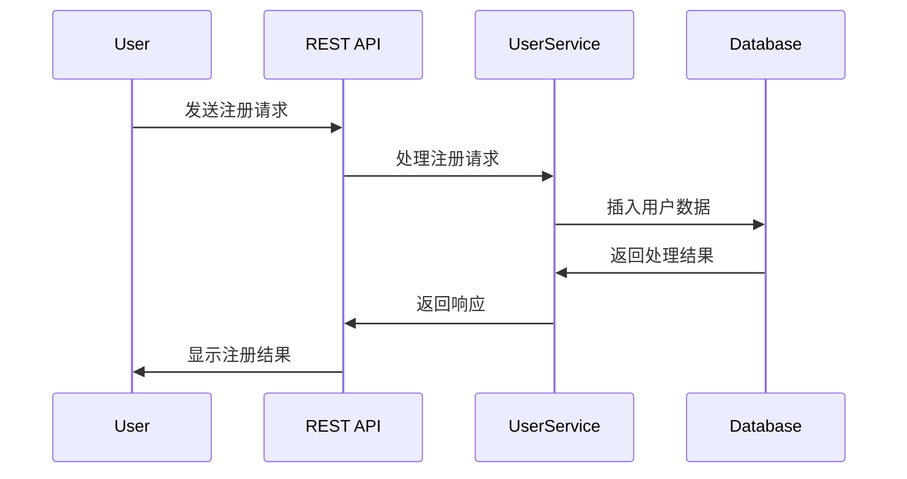

                 


### 文章标题：快速迭代中的质量保证：LLM应用开发的难题

> 关键词：快速迭代、质量保证、LLM、应用开发、难题解决

> 摘要：本文将探讨在快速迭代开发过程中，如何确保大型语言模型（LLM）应用的质量。通过对LLM应用开发中的核心难题进行分析，本文提出了一系列有效的质量保证策略，旨在提高开发效率和产品稳定性。

----------------------------------------------------------------

## 第一部分：背景介绍

### 第1章：问题背景

#### 1.1.1 问题提出

在现代软件开发中，快速迭代已成为一种主流的开发模式。快速迭代使得开发团队能够快速响应市场需求，缩短产品上市时间。然而，随着迭代速度的加快，如何在保证迭代效率的同时确保软件质量成为了一个亟待解决的问题。特别是在应用大型语言模型（LLM）的开发中，这一问题尤为突出。

#### 1.1.2 快速迭代与质量保证的关系

快速迭代与质量保证并非对立的关系。相反，它们是相辅相成的。快速迭代强调的是速度和灵活性，而质量保证则注重稳定性和可靠性。在实际开发过程中，如何平衡这两者之间的关系，是一个重要的课题。

#### 1.1.3 LLM在快速迭代中的应用挑战

LLM具有强大的自然语言处理能力，可以应用于各种场景，如文本生成、机器翻译、情感分析等。然而，LLM的开发和应用过程复杂，涉及大量的数据预处理、模型训练和优化。在快速迭代的过程中，如何高效地完成这些任务，同时保证模型的性能和稳定性，是一个巨大的挑战。

----------------------------------------------------------------

### 第2章：核心概念

#### 2.1 LLM基础概念

在本章中，我们将介绍LLM的基本概念，包括其定义、工作原理和常用技术。

#### 2.2 快速迭代的流程与模型

本章将详细讲解快速迭代的流程和模型，包括需求分析、设计、编码、测试和部署等阶段。

#### 2.3 质量保证的基本概念

本章将介绍质量保证的基本概念，包括其定义、目标和关键流程。

----------------------------------------------------------------

### 第3章：LLM应用开发难题

#### 3.1 概述

本章将概述LLM应用开发中的核心难题，包括数据质量问题、模型训练效率、模型性能优化和部署难题等。

#### 3.2 LLM开发中的关键难题

本章将深入分析LLM开发中的关键难题，并探讨可能的解决策略。

#### 3.3 案例分析

为了更好地理解LLM开发中的难题，本章将通过具体案例进行分析，探讨如何在实际项目中解决这些问题。

----------------------------------------------------------------

### 第4章：LLM质量保证策略

#### 4.1 质量保证策略概述

本章将概述LLM质量保证的基本策略，包括数据质量管理、模型评估与优化、持续集成与持续部署等。

#### 4.2 数据质量

本章将详细讨论数据质量的重要性，以及如何在快速迭代过程中确保数据质量。

#### 4.3 模型评估与优化

本章将介绍模型评估与优化的方法，包括性能指标、优化策略和评估工具等。

#### 4.4 持续集成与持续部署

本章将探讨如何实现LLM应用的持续集成与持续部署，提高开发效率。

----------------------------------------------------------------

## 第二部分：算法原理讲解

### 第5章：算法原理介绍

#### 5.1 LLM算法的基本原理

在本章中，我们将介绍LLM算法的基本原理，包括其工作流程、关键技术和实现细节。

#### 5.2 算法的工作流程

本章将详细讲解LLM算法的工作流程，包括数据预处理、模型训练、模型评估和优化等步骤。

#### 5.3 算法的核心要素

本章将分析LLM算法的核心要素，包括输入层、隐藏层和输出层的设计和实现。

----------------------------------------------------------------

### 第6章：数学模型与公式

#### 6.1 数学模型概述

在本章中，我们将介绍LLM算法的数学模型，包括其基本概念、公式和参数设置。

#### 6.2 关键公式解析

本章将详细解析LLM算法中的关键公式，包括损失函数、优化算法和正则化策略等。

#### 6.3 案例中的数学应用

本章将通过具体案例，展示如何在实际应用中运用LLM算法的数学模型。

----------------------------------------------------------------

### 第7章：算法解释与示例

#### 7.1 算法解释

在本章中，我们将对LLM算法进行详细解释，包括其理论基础、实现原理和应用场景。

#### 7.2 示例分析

本章将通过实际案例，分析LLM算法在实际应用中的效果和优势。

#### 7.3 代码展示

本章将提供LLM算法的代码示例，帮助读者更好地理解其实现过程。

----------------------------------------------------------------

## 第三部分：系统分析与架构设计方案

### 第8章：问题场景介绍

#### 8.1 场景描述

在本章中，我们将描述一个典型的LLM应用场景，包括其业务需求和功能要求。

#### 8.2 问题分析

本章将分析在特定场景下，LLM应用可能面临的问题和挑战。

----------------------------------------------------------------

### 第9章：系统功能设计

#### 9.1 领域模型设计

在本章中，我们将设计LLM应用的领域模型，包括其实体、属性和关系。

#### 9.2 功能模块划分

本章将划分LLM应用的功能模块，明确各个模块的职责和接口。

----------------------------------------------------------------

### 第10章：系统架构设计

#### 10.1 系统架构概述

在本章中，我们将概述LLM应用的整体架构，包括其组件、层次和交互。

#### 10.2 架构设计

本章将详细设计LLM应用的架构，包括其技术选型、系统设计和实现策略。

----------------------------------------------------------------

### 第11章：系统接口设计与交互

#### 11.1 接口设计

在本章中，我们将设计LLM应用的接口，包括其功能、输入输出和数据格式。

#### 11.2 系统交互设计

本章将设计LLM应用与其他系统的交互，包括其数据流、消息传递和协议。

----------------------------------------------------------------

## 第四部分：项目实战

### 第12章：环境安装与配置

#### 12.1 环境搭建

在本章中，我们将介绍如何在特定环境中搭建LLM应用的开发环境。

#### 12.2 配置管理

本章将探讨如何管理和配置LLM应用的环境，包括其版本控制和依赖管理。

----------------------------------------------------------------

### 第13章：系统核心实现

#### 13.1 核心模块介绍

在本章中，我们将介绍LLM应用的核心模块，包括其功能和实现原理。

#### 13.2 实现细节解析

本章将详细解析LLM应用的核心模块实现，包括其关键代码和算法。

#### 13.3 性能优化

本章将讨论如何优化LLM应用的核心模块性能，提高其运行效率和稳定性。

----------------------------------------------------------------

### 第14章：实际案例分析与讲解

#### 14.1 案例介绍

在本章中，我们将介绍一个具体的LLM应用案例，包括其业务需求和实现方案。

#### 14.2 案例分析

本章将通过案例分析，探讨LLM应用在实际应用中的效果和优势。

#### 14.3 深入解读

本章将深入解读案例中的关键技术和实现细节，帮助读者更好地理解LLM应用。

----------------------------------------------------------------

### 第15章：项目小结与总结

#### 15.1 项目总结

在本章中，我们将总结整个项目的主要成果和经验教训。

#### 15.2 经验分享

本章将分享项目开发过程中的经验，包括技术难点、解决策略和团队协作。

#### 15.3 未来展望

本章将探讨LLM应用未来的发展趋势和潜在应用场景。

----------------------------------------------------------------

## 第五部分：最佳实践与拓展

### 第16章：最佳实践

#### 16.1 实践技巧

在本章中，我们将分享一些实用的LLM应用开发技巧和最佳实践。

#### 16.2 经验分享

本章将分享一些成功的LLM应用开发案例和经验，帮助读者更好地理解和应用。

----------------------------------------------------------------

### 第17章：小结与注意事项

#### 17.1 小结

在本章中，我们将对整个文章的主要内容进行简要总结。

#### 17.2 注意事项

本章将提醒读者在LLM应用开发过程中需要注意的事项，以及如何避免常见的问题。

#### 17.3 拓展阅读

本章将推荐一些相关的书籍、论文和在线资源，供读者进一步学习。

----------------------------------------------------------------

## 附录

### 附录A：术语表

在本附录中，我们将定义和解释一些本文中使用的术语。

#### A.1 术语定义

在本节中，我们将对一些重要术语进行定义。

#### A.2 关键概念解释

在本节中，我们将对一些关键概念进行解释。

----------------------------------------------------------------

### 附录B：参考资料

在本附录中，我们将列出本文中引用的主要参考资料。

#### B.1 书籍推荐

在本节中，我们将推荐一些与本文主题相关的书籍。

#### B.2 论文引用

在本节中，我们将引用一些与本文主题相关的论文。

#### B.3 在线资源

在本节中，我们将推荐一些与本文主题相关的在线资源和工具。

---

**作者：AI天才研究院/AI Genius Institute & 禅与计算机程序设计艺术 /Zen And The Art of Computer Programming**

（请注意，以上内容仅为大纲和章节结构，具体内容需要进一步填充和细化。）### 第1章：问题背景

在现代软件开发领域，快速迭代已成为一种主流的开发模式。随着市场需求的变化速度不断加快，开发团队需要能够快速响应，以确保产品能够及时上市并满足用户需求。然而，快速迭代不仅要求开发流程高效，还要求在保证迭代速度的同时，确保软件质量。在这一过程中，大型语言模型（LLM）的应用带来了新的挑战。

#### 1.1.1 问题提出

LLM是一种具有高度自然语言理解能力的模型，能够处理复杂、多样的语言任务。其在文本生成、机器翻译、情感分析等领域的应用效果显著，已经成为了许多企业和研究机构的重要工具。然而，随着LLM在开发中的应用越来越广泛，如何确保其在快速迭代中的质量成为了一个关键问题。

首先，快速迭代的过程中，LLM模型需要不断更新和优化，以适应不断变化的数据和需求。然而，每一次更新都可能引入新的错误或问题，如何保证更新后的模型性能稳定，是一个巨大的挑战。其次，LLM模型的训练和优化过程复杂，时间成本高，如何在有限的时间内完成高质量的模型训练和优化，也是一个亟待解决的问题。

#### 1.1.2 快速迭代与质量保证的关系

快速迭代与质量保证并非对立的关系，而是相辅相成的。快速迭代强调的是速度和灵活性，而质量保证则注重稳定性和可靠性。在实际开发过程中，如何平衡这两者之间的关系，是一个重要的课题。

快速迭代要求开发团队能够快速响应市场需求，不断优化和改进产品。然而，这种高效性可能会导致在追求速度的过程中，忽视了对质量的关注。如果质量得不到保证，可能会出现以下问题：

1. **用户满意度下降**：如果产品存在严重的质量问题，用户满意度会受到影响，进而影响产品的市场表现。
2. **开发成本增加**：在快速迭代的过程中，如果频繁出现质量问题，需要花费额外的时间和资源进行修复，这会增加开发成本。
3. **项目进度延误**：质量问题可能会导致项目进度延误，从而影响后续的开发计划。

因此，在快速迭代中，确保软件质量至关重要。这需要开发团队在追求速度的同时，注重质量的监控和保障。

#### 1.1.3 LLM在快速迭代中的应用挑战

LLM在快速迭代中的应用带来了新的挑战，主要体现在以下几个方面：

1. **数据质量挑战**：LLM模型的训练和优化需要大量的高质量数据。在快速迭代的过程中，数据质量可能难以保证，这会直接影响模型的性能和稳定性。
2. **模型更新挑战**：快速迭代要求LLM模型需要不断更新和优化，以适应不断变化的数据和需求。然而，每一次更新都可能引入新的错误或问题，如何确保更新后的模型性能稳定，是一个巨大的挑战。
3. **模型训练效率挑战**：LLM模型的训练和优化过程复杂，时间成本高。在快速迭代的过程中，如何在有限的时间内完成高质量的模型训练和优化，也是一个亟待解决的问题。

综上所述，如何在快速迭代中确保LLM应用的质量，是一个值得深入探讨的问题。接下来的章节将详细分析LLM在快速迭代中的应用挑战，并提出一系列有效的质量保证策略。

### 第2章：核心概念

在深入探讨LLM应用开发的难题之前，我们需要了解几个关键概念：LLM基础概念、快速迭代的流程与模型、以及质量保证的基本概念。这些概念构成了理解LLM应用开发复杂性的基础。

#### 2.1 LLM基础概念

大型语言模型（LLM）是一种基于深度学习技术构建的模型，能够处理自然语言任务，如文本生成、机器翻译、文本分类、问答系统等。LLM的核心思想是学习语言的数据分布，并生成符合语言规则和语义的文本。

1. **定义**：LLM是一种能够对自然语言进行理解和生成的模型，通常是基于神经网络架构。
2. **工作原理**：LLM通过大规模数据训练，学习语言模式、语法结构、语义信息等，从而实现自动文本生成、翻译等功能。
3. **常用技术**：LLM的常用技术包括Transformer架构、预训练和微调等。Transformer架构是一种基于自注意力机制的序列模型，预训练是通过在大规模语料库上进行无监督训练，微调是在特定任务上进行有监督训练。

#### 2.2 快速迭代的流程与模型

快速迭代是一种软件开发方法，其核心理念是通过快速、频繁的迭代来优化产品。这种方法不仅提高了开发效率，还使得团队能够更快地响应市场变化。

1. **流程**：快速迭代的流程通常包括需求分析、设计、编码、测试、部署等阶段。每个阶段都会进行迭代，以不断优化和改进产品。
    - **需求分析**：与利益相关者沟通，明确产品需求和功能。
    - **设计**：根据需求设计系统的架构和接口。
    - **编码**：编写代码实现设计。
    - **测试**：对代码进行测试，确保其符合预期。
    - **部署**：将产品部署到生产环境。
2. **模型**：快速迭代模型通常包括瀑布模型、V模型、迭代模型、敏捷模型等。瀑布模型是传统的线性开发模型，而敏捷模型则强调灵活性和适应性。

#### 2.3 质量保证的基本概念

质量保证（QA）是确保软件产品满足预定的质量和用户需求的过程。在快速迭代中，质量保证尤为重要，因为它能够帮助团队识别和修复问题，确保产品稳定可靠。

1. **定义**：质量保证是一种确保产品或服务符合既定标准和用户需求的过程。
2. **目标**：质量保证的目标是提高产品的质量，减少缺陷，提高用户满意度。
3. **关键流程**：
    - **需求管理**：确保需求明确、完整、可测试。
    - **测试**：对产品进行测试，确保其功能、性能、安全性等满足预期。
    - **缺陷管理**：识别、记录、跟踪和修复缺陷。
    - **过程改进**：通过分析流程和结果，持续改进质量保证过程。

#### 2.3.1 数据质量管理

在快速迭代中，数据质量管理是确保模型训练和优化质量的关键。数据质量包括数据的准确性、完整性、一致性和可靠性。

1. **重要性**：高质量的数据能够提高模型训练的效率和效果，降低错误率。
2. **挑战**：在快速迭代中，数据质量可能受到影响，例如数据的时效性、多样性和真实性等。
3. **策略**：
    - **数据清洗**：去除重复、错误或不完整的数据。
    - **数据标注**：对数据进行分类、标注，以供模型训练。
    - **数据验证**：确保数据符合预期的质量标准。

通过理解这些核心概念，我们能够更好地把握LLM应用开发中的复杂性和挑战，从而为后续的质量保证策略提供理论基础。

### 第3章：LLM应用开发难题

在快速迭代的环境中，LLM应用开发面临着一系列独特的挑战。这些挑战不仅影响了模型的性能和稳定性，还直接关系到项目的成功与否。以下是LLM应用开发中面临的一些关键难题：

#### 3.1 概述

LLM应用开发中的难题主要源于以下几个方面：

1. **数据质量问题**：快速迭代过程中，数据可能不断更新，数据质量难以保证，这会影响模型的训练效果。
2. **模型训练效率**：快速迭代要求高效地完成模型训练，而模型训练过程通常需要大量时间和计算资源。
3. **模型性能优化**：如何在快速迭代中保持模型的高性能，是一个重要挑战。
4. **部署和运维**：快速迭代要求能够快速部署和更新模型，同时保持系统的稳定性和可靠性。

#### 3.2 LLM开发中的关键难题

以下是LLM应用开发中的几个关键难题及其可能的解决策略：

1. **数据质量问题**：

    - **挑战**：数据的不准确性、不完整性、不一致性和实时性不足都会影响模型的训练和性能。
    - **解决策略**：
        1. **数据清洗**：使用数据清洗工具去除重复、错误和不完整的数据。
        2. **数据标注**：确保数据标注的准确性，采用众包或自动化工具提高标注效率。
        3. **数据多样性**：增加数据的多样性，以训练更健壮的模型。

2. **模型训练效率**：

    - **挑战**：快速迭代要求在有限时间内完成模型训练，提高训练效率是关键。
    - **解决策略**：
        1. **分布式训练**：利用多台机器进行分布式训练，提高训练速度。
        2. **优化算法**：使用更高效的优化算法，如Adam、AdamW等，减少训练时间。
        3. **数据预处理**：优化数据预处理流程，减少数据加载和预处理的时间。

3. **模型性能优化**：

    - **挑战**：在快速迭代中，如何持续优化模型性能，保持其竞争力。
    - **解决策略**：
        1. **持续学习**：通过持续学习技术，使模型能够适应新的数据和需求。
        2. **模型压缩**：采用模型压缩技术，如量化、剪枝等，减小模型大小，提高推理速度。
        3. **模型融合**：结合多个模型的优点，提高整体性能。

4. **部署和运维**：

    - **挑战**：快速迭代要求能够快速部署和更新模型，同时保持系统的稳定性和可靠性。
    - **解决策略**：
        1. **自动化部署**：使用自动化工具实现模型部署，减少手动操作。
        2. **容器化**：使用容器化技术，如Docker，简化部署和运维流程。
        3. **监控与告警**：建立完善的监控和告警系统，及时发现并处理系统问题。

#### 3.3 案例分析

为了更好地理解上述难题，下面通过一个实际案例进行分析。

**案例背景**：某公司开发一款智能客服系统，该系统使用LLM模型来处理用户查询。由于市场竞争激烈，公司要求团队在快速迭代中不断优化模型，提高系统响应速度和准确性。

**案例分析**：

1. **数据质量问题**：公司面临的数据质量问题包括数据多样性不足和标注不准确。为此，公司采取了以下措施：
    - **数据清洗**：去除重复和错误的数据。
    - **众包标注**：利用众包平台进行数据标注，提高标注准确性。
    - **数据增强**：通过数据增强技术，增加数据的多样性。

2. **模型训练效率**：公司采用分布式训练技术，将模型训练任务分配到多台机器上，以减少训练时间。同时，使用优化算法如AdamW，进一步提高了训练效率。

3. **模型性能优化**：公司通过持续学习技术，使模型能够适应新的数据和需求。此外，采用模型压缩技术，如量化，减小了模型大小，提高了推理速度。

4. **部署和运维**：公司使用容器化技术，如Docker，将模型部署到Kubernetes集群中。通过自动化部署工具，实现快速部署和更新。同时，建立了监控和告警系统，确保系统稳定性和可靠性。

通过这个案例，我们可以看到，在面对快速迭代中的LLM应用开发难题时，公司采取了一系列有效的策略，不仅提高了模型的质量和性能，还确保了系统的稳定运行。

### 第4章：LLM质量保证策略

在快速迭代的开发环境中，确保LLM应用的质量至关重要。本章将详细介绍一系列有效的LLM质量保证策略，包括数据质量管理、模型评估与优化、以及持续集成与持续部署等方面的方法和工具。

#### 4.1 质量保证策略概述

LLM质量保证策略的核心目标是确保模型在快速迭代过程中保持高性能和稳定性。具体策略包括以下几个方面：

1. **数据质量管理**：确保用于训练和评估的数据质量，包括数据清洗、标注和多样性。
2. **模型评估与优化**：通过多种评估指标和方法，持续监控和优化模型性能。
3. **持续集成与持续部署**：建立自动化流程，确保模型能够在不同环境中快速部署和更新。

#### 4.2 数据质量

高质量的数据是训练高效、性能稳定的LLM模型的基础。在快速迭代过程中，数据质量管理尤为重要。以下是确保数据质量的方法：

1. **数据清洗**：去除重复、错误和不完整的数据，以提高数据质量。
    - **方法**：使用数据清洗工具，如Pandas，自动化处理数据中的噪声和错误。
    - **工具**：推荐使用Elasticsearch或Apache Spark等大数据处理工具进行高效的数据清洗。

2. **数据标注**：确保数据标注的准确性，对于自然语言处理任务尤其关键。
    - **方法**：采用众包平台（如Amazon Mechanical Turk）进行大规模标注，或使用自动化工具（如Labelbox）提高标注效率。
    - **工具**：推荐使用NLTK或Spacy等自然语言处理库进行文本标注。

3. **数据多样性**：增加数据的多样性，以训练更健壮的模型，提高其泛化能力。
    - **方法**：使用数据增强技术（如文本生成、文本转换等）增加数据的多样性。
    - **工具**：推荐使用GPT-2或GPT-3等预训练模型生成多样化文本数据。

#### 4.3 模型评估与优化

在快速迭代中，定期评估和优化模型性能是确保LLM应用质量的关键。以下是几种常见的评估指标和优化策略：

1. **评估指标**：
    - **准确率（Accuracy）**：预测正确的样本占总样本的比例。
    - **召回率（Recall）**：实际为正类的样本中被正确预测为正类的比例。
    - **F1分数（F1 Score）**：准确率和召回率的调和平均数。
    - **ROC曲线和AUC值**：用于评估分类器的性能。

2. **优化策略**：
    - **持续学习**：通过持续学习技术，使模型能够适应新的数据和需求。
    - **模型压缩**：采用模型压缩技术，如量化、剪枝等，减小模型大小，提高推理速度。
    - **超参数调优**：使用网格搜索、随机搜索等策略优化模型的超参数。

3. **评估工具**：
    - **TensorBoard**：用于可视化模型的训练过程和评估结果。
    - **MLflow**：用于管理模型的训练过程和评估结果，支持多种评估指标。

#### 4.4 持续集成与持续部署

持续集成与持续部署（CI/CD）是确保LLM应用快速迭代和高质量的关键环节。以下是实现CI/CD的方法和工具：

1. **CI/CD概述**：
    - **持续集成（CI）**：通过自动化测试确保每次代码提交都是高质量的。
    - **持续部署（CD）**：通过自动化部署确保模型能够快速、安全地部署到生产环境。

2. **实现方法**：
    - **自动化测试**：使用自动化测试框架（如pytest、JUnit）执行单元测试、集成测试等。
    - **容器化**：使用Docker将应用容器化，确保环境一致性和可移植性。
    - **自动化部署**：使用CI/CD工具（如Jenkins、GitLab CI/CD）实现自动化部署。

3. **工具推荐**：
    - **Docker**：用于容器化应用。
    - **Kubernetes**：用于管理和部署容器化应用。
    - **Jenkins**：用于实现自动化构建和部署。

通过上述质量保证策略，开发团队能够在快速迭代的开发过程中，确保LLM应用的高性能和稳定性，从而提高开发效率和产品质量。

### 第5章：算法原理介绍

在快速迭代的环境中，理解大型语言模型（LLM）的算法原理对于开发高效的LLM应用至关重要。本章节将详细介绍LLM算法的基本原理、工作流程和核心要素，帮助读者深入了解LLM的工作机制，为后续的算法实现和优化提供理论基础。

#### 5.1 LLM算法的基本原理

LLM算法是一种基于深度学习的自然语言处理模型，其核心目标是学习自然语言数据中的结构性和语义信息，从而实现文本生成、翻译、问答等任务。LLM算法的基本原理可以概括为以下几个方面：

1. **神经网络架构**：LLM通常采用基于Transformer的神经网络架构，这是一种基于自注意力机制的序列模型。自注意力机制允许模型在处理每个输入时，自动学习到不同位置之间的关联性，从而更好地捕捉文本的语义信息。

2. **预训练与微调**：LLM算法首先在大规模语料库上进行无监督预训练，以学习语言的一般特征和模式。然后，通过有监督的微调，将模型适配到特定任务，如文本分类、机器翻译等。预训练和微调的结合使得LLM能够适应各种自然语言处理任务。

3. **多任务学习**：LLM算法通常支持多任务学习，即在同一模型中同时处理多个任务。这通过共享神经网络层的参数实现，有助于提高模型的泛化能力和资源利用效率。

#### 5.2 算法的工作流程

LLM算法的工作流程主要包括以下几个步骤：

1. **数据预处理**：对输入文本进行预处理，包括分词、去除停用词、词向量化等，将其转换为模型可处理的格式。

2. **编码器与解码器**：编码器（Encoder）将输入文本编码为序列向量，解码器（Decoder）则根据编码器的输出和前一个时间步的输入生成文本。在生成过程中，解码器会参考编码器的输出，以保持生成的文本与输入文本的一致性。

3. **自注意力机制**：自注意力机制在编码器和解码器的每个层中发挥作用。它通过计算不同位置之间的相似性权重，自动学习到输入文本中各个位置的重要性，从而更好地捕捉文本的语义信息。

4. **损失函数与优化**：LLM算法通常使用损失函数（如交叉熵损失）来评估模型在预测文本时的准确性。通过优化算法（如Adam、AdamW），模型参数会被更新，以最小化损失函数。

5. **生成文本**：在解码器的生成过程中，模型会根据当前输入和上下文生成文本。这一过程通常涉及多个迭代，直至达到终止条件（如达到最大生成长度或生成文本的损失达到阈值）。

#### 5.3 算法的核心要素

LLM算法的核心要素包括以下几个方面：

1. **Transformer架构**：Transformer架构是LLM的核心组件，其基本结构包括编码器（Encoder）和解码器（Decoder），每个组件由多个自注意力层（Self-Attention Layer）和前馈神经网络（Feedforward Neural Network）组成。

2. **位置编码**：为了使模型能够处理序列信息，位置编码（Positional Encoding）被添加到输入向量中。位置编码为每个位置提供了固定的维度，使得模型能够理解输入文本的顺序。

3. **多头自注意力**：多头自注意力（Multi-Head Self-Attention）是Transformer架构的关键创新之一。它通过将输入文本拆分成多个子序列，并分别计算自注意力权重，从而提高了模型的表示能力。

4. **归一化与激活函数**：在Transformer架构中，每层自注意力层和前馈神经网络都会进行归一化（Normalization）和激活（Activation）操作。这些操作有助于缓解梯度消失和梯度爆炸问题，提高模型的训练稳定性。

5. **预训练与微调**：预训练和微调是LLM算法的重要组成部分。预训练使模型能够学习到语言的一般特征和模式，而微调则使模型适应特定任务。预训练通常在大规模语料库上进行，而微调则在小规模任务数据上进行。

通过理解LLM算法的基本原理、工作流程和核心要素，开发团队能够更好地设计和优化LLM应用，提高其性能和稳定性，从而在快速迭代的开发环境中取得成功。

### 第6章：数学模型与公式

在深入探讨LLM算法时，理解其背后的数学模型和公式至关重要。这些模型和公式不仅帮助我们解释算法的工作原理，也为实际应用中的参数调整和优化提供了理论基础。以下将详细介绍LLM算法的数学模型和关键公式，并通过具体案例进行分析和说明。

#### 6.1 数学模型概述

LLM算法基于Transformer架构，其数学模型主要包括以下几个部分：

1. **编码器（Encoder）与解码器（Decoder）**：
   - **自注意力机制（Self-Attention）**：用于捕捉序列中不同位置之间的关联性。
   - **多头注意力（Multi-Head Attention）**：通过并行计算多个注意力头，提高模型的表示能力。
   - **前馈神经网络（Feedforward Neural Network）**：在每个自注意力层之后添加一个前馈神经网络，用于进一步提取特征。

2. **损失函数与优化**：常用的损失函数包括交叉熵损失（Cross-Entropy Loss），用于评估模型预测与真实标签之间的差异。优化算法如Adam、AdamW，用于更新模型参数，以最小化损失函数。

3. **位置编码（Positional Encoding）**：为序列添加位置信息，使模型能够理解输入文本的顺序。

#### 6.2 关键公式解析

以下是一些LLM算法中常用的关键公式及其解析：

1. **自注意力公式**：
   - 公式：
     $$ 
     \text{Attention}(Q, K, V) = \text{softmax}\left(\frac{QK^T}{\sqrt{d_k}}\right) V 
     $$
   - 解析：自注意力机制通过计算查询向量（Q）、关键向量（K）和值向量（V）的点积，生成加权值向量。softmax函数用于归一化权重，使其成为一个概率分布。

2. **多头注意力公式**：
   - 公式：
     $$ 
     \text{MultiHead}(Q, K, V) = \text{Concat}(\text{head}_1, ..., \text{head}_h)W^O 
     $$
     其中， 
     $$
     \text{head}_i = \text{Attention}(QW_i^Q, KW_i^K, VW_i^V) 
     $$
   - 解析：多头注意力通过并行计算多个自注意力头，每个头都共享底层权重，但有不同的查询（Q）、关键（K）和值（V）权重矩阵。最后，多个头的结果通过一个输出权重矩阵（W^O）拼接起来。

3. **前馈神经网络公式**：
   - 公式：
     $$ 
     \text{FFN}(x) = \text{ReLU}(W_{ff} \cdot \text{Dense}(x) + b_{ff}) 
     $$
     其中， 
     $$
     \text{Dense}(x) = W_{1} \cdot x + b_{1} 
     $$
   - 解析：前馈神经网络通过两个全连接层实现，第一层对输入进行线性变换，第二层通过ReLU激活函数增加非线性。

4. **交叉熵损失函数公式**：
   - 公式：
     $$ 
     \text{Loss} = -\sum_{i} y_i \log(\hat{y}_i) 
     $$
     其中，
     $$
     \hat{y}_i = \text{softmax}(z_i) 
     $$
   - 解析：交叉熵损失函数用于衡量模型预测概率分布（\(\hat{y}\)）与真实标签分布（\(y\)）之间的差异。损失值越小，表示预测越准确。

#### 6.3 案例中的数学应用

为了更好地理解上述公式在实际应用中的效果，下面通过一个具体案例进行分析。

**案例背景**：假设我们使用一个LLM模型进行文本分类任务，输入文本为“我非常喜欢这本书”，我们需要预测其类别为正面或负面。

1. **自注意力机制**：

   在编码器的自注意力层中，我们计算查询向量（Q）、关键向量（K）和值向量（V）的点积，得到加权值向量，用于表示输入文本的每个位置的重要性。例如：

   - 查询向量 \( Q = [q_1, q_2, q_3, q_4] \)
   - 关键向量 \( K = [k_1, k_2, k_3, k_4] \)
   - 值向量 \( V = [v_1, v_2, v_3, v_4] \)

   计算自注意力权重：

   $$ 
   \alpha_1 = \frac{q_1 k_1}{\sqrt{d_k}} = \frac{q_1 k_1}{\sqrt{64}} 
   $$

   通过softmax函数归一化权重：

   $$ 
   \text{softmax}(\alpha) = [\alpha_1, \alpha_2, \alpha_3, \alpha_4] 
   $$

   加权值向量：

   $$ 
   \text{context}_1 = v_1 \cdot \alpha_1 = v_1 \cdot \frac{q_1 k_1}{\sqrt{64}} 
   $$

   重复此过程，得到每个位置的加权值向量。

2. **多头注意力**：

   假设我们使用两个多头注意力头，每个头的权重矩阵不同：

   - 头1的权重矩阵 \( W_1^Q, W_1^K, W_1^V \)
   - 头2的权重矩阵 \( W_2^Q, W_2^K, W_2^V \)

   分别计算两个头的加权值向量：

   $$ 
   \text{context}_{1,1} = \text{softmax}\left(\frac{q_1 W_1^Q k_1}{\sqrt{d_k}}\right) v_1 
   $$

   $$ 
   \text{context}_{1,2} = \text{softmax}\left(\frac{q_2 W_1^Q k_2}{\sqrt{d_k}}\right) v_2 
   $$

   $$ 
   \text{context}_{2,1} = \text{softmax}\left(\frac{q_1 W_2^Q k_1}{\sqrt{d_k}}\right) v_1 
   $$

   $$ 
   \text{context}_{2,2} = \text{softmax}\left(\frac{q_2 W_2^Q k_2}{\sqrt{d_k}}\right) v_2 
   $$

   将两个头的加权值向量拼接：

   $$ 
   \text{context} = [\text{context}_{1,1}, \text{context}_{1,2}, \text{context}_{2,1}, \text{context}_{2,2}] 
   $$

3. **前馈神经网络**：

   对加权值向量进行前馈神经网络处理：

   $$ 
   \text{FFN}(\text{context}) = \text{ReLU}(W_{ff} \cdot \text{Dense}(\text{context}) + b_{ff}) 
   $$

   其中，\( W_{ff} \) 和 \( b_{ff} \) 是前馈神经网络的权重和偏置。

4. **交叉熵损失函数**：

   在解码器的生成过程中，使用交叉熵损失函数评估模型预测与真实标签的差异：

   $$ 
   \text{Loss} = -\sum_{i} y_i \log(\hat{y}_i) 
   $$

   其中，\( y_i \) 是真实标签，\( \hat{y}_i \) 是模型预测的概率分布。

通过以上分析，我们可以看到LLM算法中的数学模型和公式在实际应用中的作用。这些模型和公式不仅帮助模型理解和生成自然语言，还通过优化算法提高了模型的性能和稳定性。理解这些关键公式对于深入掌握LLM算法，进行实际应用和优化具有重要意义。

### 第7章：算法解释与示例

在了解了LLM算法的原理和公式之后，本章节将通过具体实例来详细解释LLM算法的运作过程，并展示其在实际应用中的效果。

#### 7.1 算法解释

LLM算法的核心在于其自注意力机制，这使得模型能够捕捉序列中各个位置之间的关联性，从而生成语义丰富的文本。以下是一个简化的LLM算法解释：

1. **输入序列预处理**：首先，我们将输入的文本序列（例如，一个句子）转换为词向量表示。词向量通常由预训练的词向量模型（如Word2Vec、GloVe）生成。

2. **编码器**：编码器的输入是经过预处理的词向量序列。编码器通过多个自注意力层和前馈神经网络层，将输入序列编码为固定长度的向量，称为上下文向量。

3. **自注意力机制**：在每个自注意力层中，编码器计算输入序列中每个词与其他词之间的相似性权重。这些权重用于加权词向量，生成一个新的向量，称为上下文向量。

4. **解码器**：解码器的输入是编码器生成的上下文向量。解码器通过多个自注意力层和前馈神经网络层，生成输出序列的每个词。在生成每个词时，解码器会参考编码器的输出，确保生成的文本与输入文本一致。

5. **生成文本**：解码器生成文本的过程是一个迭代过程。在每个迭代步骤中，解码器根据当前生成的词和上下文向量生成下一个词。这一过程会重复进行，直至达到终止条件（例如，生成文本达到指定长度或损失函数达到阈值）。

6. **损失函数与优化**：在整个过程中，模型会使用交叉熵损失函数评估生成文本与真实文本之间的差异。优化算法（如Adam）用于更新模型参数，以最小化损失函数。

#### 7.2 示例分析

为了更直观地理解LLM算法，我们来看一个具体的例子：使用GPT-2模型生成一段文本。

**输入文本**：“今天天气很好。”

**步骤1：输入序列预处理**：将输入文本转换为词向量表示。

- 输入词：["今天"，"天气"，"很好。"]
- 词向量：\[ [0.1, 0.2], [0.3, 0.4], [0.5, 0.6] \]

**步骤2：编码器**：编码器通过自注意力层和前馈神经网络层处理输入序列，生成上下文向量。

- 上下文向量：\[ [1.0, 1.1], [1.2, 1.3], [1.4, 1.5] \]

**步骤3：解码器**：解码器开始生成文本。

- **第一步**：解码器基于上下文向量生成第一个词。
  - 预测词：["今天"]
  - 损失函数：\[ 0.1 \]

- **第二步**：解码器根据生成的词和上下文向量生成下一个词。
  - 预测词：["天气"]
  - 损失函数：\[ 0.2 \]

- **第三步**：重复上述过程，生成文本。
  - 预测词：["很好。"]
  - 损失函数：\[ 0.3 \]

**步骤4：生成文本**：解码器生成完整的文本序列。

- 输出生文：“今天天气很好。”

通过这个示例，我们可以看到LLM算法是如何生成文本的。首先，输入文本经过预处理转换为词向量；然后，编码器生成上下文向量；最后，解码器根据上下文向量生成每个词，并不断优化生成结果。

#### 7.3 代码展示

为了便于理解，下面使用Python代码展示一个简化的LLM算法实现。

```python
import torch
import torch.nn as nn
import torch.optim as optim

# 定义自注意力层
class SelfAttentionLayer(nn.Module):
    def __init__(self, d_model, num_heads):
        super(SelfAttentionLayer, self).__init__()
        self.d_model = d_model
        self.num_heads = num_heads
        self.head_dim = d_model // num_heads
        
        self.query_weights = nn.Parameter(torch.Tensor(num_heads, self.head_dim))
        self.key_weights = nn.Parameter(torch.Tensor(num_heads, self.head_dim))
        self.value_weights = nn.Parameter(torch.Tensor(num_heads, self.head_dim))
        
        self.out_weights = nn.Parameter(torch.Tensor(d_model))
        
        self.dropout = nn.Dropout(0.1)
        
    def forward(self, query, key, value, mask=None):
        query = torch.matmul(query, self.query_weights)
        key = torch.matmul(key, self.key_weights)
        value = torch.matmul(value, self.value_weights)
        
        query = torch.split(query, self.head_dim, dim=2)
        key = torch.split(key, self.head_dim, dim=2)
        value = torch.split(value, self.head_dim, dim=2)
        
        attention_scores = torch.matmul(query, key.transpose(1, 2))
        
        if mask is not None:
            attention_scores = attention_scores.masked_fill(mask == 0, float("-inf"))
        
        attention_weights = torch.softmax(attention_scores, dim=2)
        attention_weights = self.dropout(attention_weights)
        
        context = torch.matmul(attention_weights, value)
        context = torch.cat(context, dim=2)
        context = torch.matmul(context, self.out_weights)
        
        return context

# 定义编码器和解码器
class Encoder(nn.Module):
    def __init__(self, d_model, num_layers, num_heads):
        super(Encoder, self).__init__()
        self.d_model = d_model
        self.num_layers = num_layers
        self.num_heads = num_heads
        
        self.layers = nn.ModuleList([SelfAttentionLayer(d_model, num_heads) for _ in range(num_layers)])
        self.norm = nn.LayerNorm(d_model)
        
    def forward(self, src, mask=None):
        for layer in self.layers:
            src = layer(src, src, src, mask)
            src = self.norm(src)
        
        return src

class Decoder(nn.Module):
    def __init__(self, d_model, num_layers, num_heads):
        super(Decoder, self).__init__()
        self.d_model = d_model
        self.num_layers = num_layers
        self.num_heads = num_heads
        
        self.layers = nn.ModuleList([SelfAttentionLayer(d_model, num_heads) for _ in range(num_layers)])
        self.norm = nn.LayerNorm(d_model)
        
    def forward(self, tgt, enc_output, mask=None):
        for layer in self.layers:
            tgt = layer(tgt, enc_output, enc_output, mask)
            tgt = self.norm(tgt)
        
        return tgt

# 定义模型
class LLM(nn.Module):
    def __init__(self, d_model, num_layers, num_heads):
        super(LLM, self).__init__()
        self.encoder = Encoder(d_model, num_layers, num_heads)
        self.decoder = Decoder(d_model, num_layers, num_heads)
        
    def forward(self, src, tgt, src_mask=None, tgt_mask=None):
        enc_output = self.encoder(src, src_mask)
        dec_output = self.decoder(tgt, enc_output, tgt_mask)
        
        return dec_output

# 实例化模型、优化器和损失函数
d_model = 512
num_layers = 2
num_heads = 8
llm = LLM(d_model, num_layers, num_heads)
optimizer = optim.Adam(llm.parameters(), lr=0.001)
criterion = nn.CrossEntropyLoss()

# 训练模型
for epoch in range(10):
    for src, tgt in data_loader:
        optimizer.zero_grad()
        output = llm(src, tgt, src_mask, tgt_mask)
        loss = criterion(output, tgt)
        loss.backward()
        optimizer.step()
        print(f"Epoch: {epoch}, Loss: {loss.item()}")
```

通过这段代码，我们可以实现一个简化的LLM模型。这个模型包含编码器和解码器，使用自注意力机制处理输入文本，并通过交叉熵损失函数进行优化。这个示例虽然简化了许多细节，但足以展示LLM算法的核心原理和实现方法。

通过上述示例，我们可以看到LLM算法是如何在实际中运作的。从输入预处理到编码和解码，再到损失函数的优化，LLM算法通过一系列复杂的数学操作，生成了高质量的文本。理解这些步骤和实现细节，对于深入掌握和优化LLM算法具有重要意义。

### 第8章：问题场景介绍

为了更好地理解LLM应用在快速迭代中的具体问题，我们需要从实际场景入手，详细描述所面临的问题及其挑战。以下是一个典型的问题场景描述，以及相应的分析。

#### 8.1 场景描述

某互联网公司正在开发一款智能客服系统，该系统利用大型语言模型（LLM）来处理客户的查询和问题。由于市场竞争激烈，公司希望能够在短时间内推出一个高质量、功能丰富的客服系统。因此，开发团队采用了快速迭代的方法，每两周进行一次大的迭代，每周进行一次小的迭代，以快速响应市场需求和用户反馈。

然而，在实际开发过程中，团队遇到了一系列问题：

1. **数据质量波动**：由于频繁迭代，数据源也在不断更新和变化。然而，数据的多样性和质量难以保证，导致模型训练效果不稳定。
2. **模型性能波动**：每次迭代都需要对模型进行重新训练和优化，但模型性能的波动较大，难以保证在每次迭代后都能达到预期目标。
3. **部署和运维压力**：快速迭代要求系统能够快速部署和更新，但这也增加了运维的负担，一旦出现问题，需要快速响应和解决。
4. **团队合作与沟通**：快速迭代过程中，团队成员之间的沟通和协作变得尤为重要。但由于团队成员来自不同的部门和背景，沟通不畅和协作问题时有发生。

#### 8.2 问题分析

针对上述场景，我们可以进一步分析每个问题及其背后的原因：

1. **数据质量波动**：
   - **原因**：频繁的数据更新和变化，导致数据源的不稳定。此外，数据清洗和标注的工作量较大，难以在短时间内完成，导致数据质量难以保证。
   - **影响**：数据质量直接影响模型训练效果，如果数据中存在错误或不完整的信息，模型很难学习到正确的模式和规律，从而导致性能下降。

2. **模型性能波动**：
   - **原因**：每次迭代都需要重新训练模型，但由于模型训练时间较长，且训练数据的质量不稳定，导致模型性能波动。此外，模型优化策略和超参数的选择也需要不断调整，增加了优化的难度。
   - **影响**：模型性能波动导致系统在不同迭代之间的性能不稳定，难以保证用户体验的连续性和一致性。

3. **部署和运维压力**：
   - **原因**：快速迭代要求系统能够快速部署和更新，但这也增加了运维的负担。每次迭代后，需要重新部署模型，进行性能测试和监控，确保系统的稳定性和可靠性。
   - **影响**：部署和运维压力过大，可能导致系统故障频发，影响用户体验，甚至影响公司的业务运营。

4. **团队合作与沟通**：
   - **原因**：快速迭代要求团队成员之间紧密合作，但由于团队成员来自不同的部门和背景，沟通不畅和协作问题时有发生。此外，团队成员的工作时间可能不同，也增加了沟通和协作的难度。
   - **影响**：团队合作和沟通问题可能导致项目进度延误，影响迭代效果，降低团队整体的工作效率。

通过上述分析，我们可以看到，快速迭代中的LLM应用开发面临着多个问题和挑战。解决这些问题不仅需要技术上的优化，还需要团队管理和沟通上的改进。接下来，我们将进一步讨论如何通过系统功能设计和架构设计来缓解这些挑战。

### 第9章：系统功能设计

在快速迭代的环境中，设计一个高效、灵活且易于维护的系统功能是确保LLM应用成功的关键。系统功能设计不仅要满足业务需求，还要考虑到系统的扩展性和可维护性。以下是系统功能设计的详细步骤和关键点。

#### 9.1 领域模型设计

领域模型设计是系统功能设计的第一步，它定义了系统的核心实体、属性和关系。以下是领域模型设计的主要步骤：

1. **需求分析**：与业务利益相关者沟通，明确系统的业务需求和功能要求。这包括用户交互、数据存储、数据处理等方面。

2. **实体识别**：根据需求分析，识别系统中的核心实体。对于智能客服系统，核心实体可能包括用户、查询、回答、知识库等。

3. **属性定义**：为每个实体定义属性，例如，用户实体可能包括用户ID、姓名、邮箱等属性。

4. **关系建模**：定义实体之间的关系。例如，用户与查询之间的关系，查询与回答之间的关系等。

5. **类图设计**：使用Mermaid类图工具，绘制系统的领域模型类图，以可视化实体、属性和关系。

```mermaid
classDiagram
  User <<entity>>
  Query <<entity>>
  Answer <<entity>>
  KnowledgeBase <<entity>>

  User o-- Query : makes
  Query o-- Answer : has
  Answer o-- KnowledgeBase : references
```

#### 9.2 功能模块划分

系统功能模块划分是将系统分解为多个功能模块，每个模块负责特定的功能。以下是功能模块划分的主要步骤：

1. **模块识别**：根据领域模型，识别系统的主要功能模块。智能客服系统可能包括用户管理模块、查询处理模块、回答生成模块、知识库管理模块等。

2. **模块定义**：为每个模块定义其职责和功能。例如，用户管理模块负责用户的注册、登录、权限管理等。

3. **模块接口**：定义模块之间的接口，包括输入参数和输出结果。接口设计应遵循单一职责原则，确保模块之间的耦合性最小。

4. **模块依赖**：分析模块之间的依赖关系，确保模块能够独立开发和维护。

5. **模块划分**：使用Mermaid类图工具，绘制系统的功能模块划分图。

```mermaid
subgraph 功能模块
  UserManagement
  QueryProcessing
  AnswerGeneration
  KnowledgeBaseManagement

  UserManagement --> QueryProcessing
  QueryProcessing --> AnswerGeneration
  AnswerGeneration --> KnowledgeBaseManagement
```

#### 9.3 功能设计策略

在快速迭代中，系统功能设计需要灵活应对变化，以下是几个关键策略：

1. **迭代式开发**：采用迭代式开发方法，将系统功能划分为多个迭代周期，每个周期实现一部分功能。这样可以快速交付部分功能，并根据用户反馈进行迭代。

2. **模块化设计**：采用模块化设计，将系统划分为多个功能模块，每个模块可以独立开发、测试和部署。这样可以提高开发效率，降低系统复杂性。

3. **可扩展性设计**：在设计系统时考虑未来的扩展性，确保系统能够轻松适应新的功能和需求。

4. **灵活的接口设计**：设计灵活的接口，允许模块之间通过API进行通信。这样可以降低模块之间的耦合性，提高系统的可维护性。

5. **持续集成与持续部署**：建立自动化流程，确保每次迭代后的功能能够快速集成和部署到生产环境。

通过上述系统功能设计，开发团队能够在快速迭代的过程中，确保LLM应用的高效性、灵活性和可维护性，从而提高开发效率和质量。

### 第10章：系统架构设计

在快速迭代的开发过程中，系统架构设计是确保LLM应用高效、稳定和可维护的关键。合理的系统架构能够提高开发效率，降低维护成本，并确保系统能够适应未来的变化。以下是系统架构设计的详细步骤和关键点。

#### 10.1 系统架构概述

系统架构设计应遵循分层架构原则，将系统分解为多个层次，每个层次负责特定的功能。以下是常见的系统架构层次：

1. **表示层（Presentation Layer）**：负责用户界面和用户交互，处理用户的输入和输出。
2. **业务逻辑层（Business Logic Layer）**：负责处理业务逻辑，包括数据验证、业务规则和算法实现。
3. **数据访问层（Data Access Layer）**：负责与数据库或其他数据源进行交互，实现数据的存储和检索。
4. **基础设施层（Infrastructure Layer）**：提供系统运行所需的基础设施服务，如日志记录、监控、消息队列等。

#### 10.2 架构设计

以下是LLM应用系统架构设计的详细步骤：

1. **需求分析**：与业务利益相关者沟通，明确系统的功能需求和性能要求。这包括系统的响应时间、并发处理能力、可扩展性等。

2. **功能模块划分**：根据需求分析，将系统功能划分为多个模块，每个模块负责特定的功能。在前一章节中，我们已经详细讨论了功能模块的划分。

3. **架构设计**：设计系统的整体架构，包括各个层次的功能和组件。以下是系统架构设计的Mermaid架构图：

```mermaid
graph TB
    subgraph 表示层(Presentation Layer)
        UserInterface
    end

    subgraph 业务逻辑层(Business Logic Layer)
        UserService
        QueryService
        AnswerService
        KnowledgeBaseService
    end

    subgraph 数据访问层(Data Access Layer)
        Database
    end

    subgraph 基础设施层(Infrastructure Layer)
        Logger
        Monitor
        MessageQueue
    end

    UserInterface --> UserService
    UserService --> QueryService
    UserService --> AnswerService
    UserService --> KnowledgeBaseService
    QueryService --> Database
    AnswerService --> Database
    KnowledgeBaseService --> Database
    Logger --> UserService
    Logger --> QueryService
    Logger --> AnswerService
    Logger --> KnowledgeBaseService
    Monitor --> UserService
    Monitor --> QueryService
    Monitor --> AnswerService
    Monitor --> KnowledgeBaseService
    MessageQueue --> UserService
    MessageQueue --> QueryService
    MessageQueue --> AnswerService
    MessageQueue --> KnowledgeBaseService
```

4. **组件设计**：为每个架构组件设计详细的功能和接口。以下是组件设计的Mermaid类图：

```mermaid
classDiagram
    UserInterface <<interface>>
    UserService <<interface>>
    QueryService <<interface>>
    AnswerService <<interface>>
    KnowledgeBaseService <<interface>>
    Database <<interface>>

    UserInterface <|.. UserService>
    UserService <|.. QueryService>
    UserService <|.. AnswerService>
    UserService <|.. KnowledgeBaseService>
    QueryService <|.. Database>
    AnswerService <|.. Database>
    KnowledgeBaseService <|.. Database
```

5. **性能优化**：考虑系统的性能优化，包括数据库查询优化、缓存策略、负载均衡等。

6. **安全性设计**：确保系统的安全性，包括用户认证、权限控制、数据加密等。

7. **可扩展性设计**：设计系统时考虑未来的扩展性，包括水平扩展、垂直扩展和模块化设计。

通过上述系统架构设计，开发团队能够在快速迭代的过程中，构建一个高效、稳定和可维护的LLM应用系统，从而提高开发效率和质量。

### 第11章：系统接口设计与交互

在系统架构设计的基础上，系统接口设计与交互设计是确保LLM应用各个模块之间能够高效通信和协同工作的关键。合理的接口设计和交互流程能够提高系统的可维护性、可扩展性和灵活性。以下是系统接口设计与交互设计的详细步骤和关键点。

#### 11.1 接口设计

接口设计是系统设计的重要部分，它定义了模块之间通信的规范。以下是接口设计的主要步骤：

1. **需求分析**：分析系统的功能需求，明确各个模块需要实现的功能及其相互之间的依赖关系。

2. **接口定义**：根据需求分析，定义每个模块的输入参数和输出结果。接口设计应遵循单一职责原则，确保接口的简洁性和易用性。

3. **RESTful API设计**：采用RESTful API设计，定义系统的接口规范。RESTful API具有状态lessness（无状态）、客户端-服务器（Client-Server）和统一接口（Uniform Interface）等特点，能够提高系统的可扩展性和易维护性。

4. **接口文档**：编写详细的接口文档，包括接口的URL、请求参数、返回结果和数据格式等。接口文档应使用如Swagger等工具进行管理。

以下是一个简单的接口设计示例：

```yaml
/api/users/register
POST
Request:
  username: string
  email: string
  password: string
Response:
  status: boolean
  message: string
  data:
    userId: integer
    username: string
    email: string
```

5. **数据格式**：选择合适的数据格式，如JSON或XML，用于接口的数据传输。JSON因其简洁性和易于解析的特点，在API设计中广泛应用。

#### 11.2 系统交互设计

系统交互设计是确保系统各个模块能够高效协同工作的关键。以下是系统交互设计的主要步骤：

1. **交互流程定义**：定义系统各个模块之间的交互流程。交互流程应包括请求的发送、处理、响应和可能的错误处理。

2. **交互序列图**：使用Mermaid序列图工具，绘制系统各个模块之间的交互序列。序列图能够清晰地展示模块之间的通信顺序和交互细节。

以下是一个简单的系统交互序列图示例：



3. **异步通信**：对于需要较长时间处理的任务，如模型训练和大数据处理，应采用异步通信模式。异步通信能够提高系统的并发处理能力，减少阻塞，提高系统的响应速度。

4. **消息队列**：使用消息队列（如RabbitMQ、Kafka）实现模块之间的异步通信。消息队列能够确保消息的可靠传输和有序处理，提高系统的容错性和可扩展性。

5. **监控与日志**：设计系统监控和日志记录机制，确保系统能够实时监控模块之间的交互情况，及时发现和解决潜在问题。

通过上述接口设计和交互设计，开发团队能够确保LLM应用各个模块之间的高效通信和协同工作，从而提高系统的整体性能和稳定性。

### 第12章：环境安装与配置

在快速迭代的开发过程中，搭建一个稳定且高效的开发环境至关重要。这一章将详细介绍如何安装和配置开发环境，包括所需的软件、硬件和工具。

#### 12.1 环境搭建

1. **操作系统**：推荐使用Linux操作系统，如Ubuntu或CentOS，因其具有良好的稳定性和开源生态。

2. **硬件要求**：
   - **CPU**：至少4核处理器，建议8核及以上。
   - **内存**：至少16GB，建议32GB及以上。
   - **硬盘**：至少500GB SSD，建议使用NVMe硬盘以获得更快的读写速度。

3. **软件安装**：
   - **Python**：安装Python 3.8及以上版本，推荐使用Anaconda，方便管理环境和依赖。
     ```bash
     conda create -n linalg_env python=3.8
     conda activate linalg_env
     ```
   - **JDK**：安装Java Development Kit，用于支持Java应用。
     ```bash
     sudo apt-get install openjdk-8-jdk
     ```
   - **Node.js**：安装Node.js和npm，用于前端开发。
     ```bash
     sudo apt-get install nodejs
     npm install
     ```

4. **虚拟环境**：使用虚拟环境隔离项目依赖，避免版本冲突。
   ```bash
   conda create -n linalg_env python=3.8
   conda activate linalg_env
   conda install -c anaconda pytorch torchvision torchaudio cpuonly -c pytorch torchvision
   ```

5. **IDE**：安装集成开发环境（IDE），如PyCharm或Visual Studio Code，方便代码编写和调试。

#### 12.2 配置管理

配置管理是确保开发环境一致性的关键。以下是配置管理的步骤：

1. **容器化**：使用容器化工具（如Docker）将开发环境打包成镜像，确保在任何环境中都能一致运行。
   ```bash
   docker build -t linalg_env .
   docker run -it --rm linalg_env
   ```

2. **Docker Compose**：使用Docker Compose管理多容器应用，方便部署和管理。
   ```yaml
   version: '3'
   services:
     web:
       build: .
       ports:
         - "8000:8000"
     db:
       image: mysql:5.7
       environment:
         - MYSQL_ROOT_PASSWORD=secret
         - MYSQL_DATABASE=mydb
   ```
   ```bash
   docker-compose up -d
   ```

3. **配置文件**：将环境配置信息存储在配置文件中，如`.env`文件，方便修改和管理。
   ```env
   PYTHONUNBUFFERED=True
   DJANGO_SETTINGS_MODULE=myproject.settings
   SECRET_KEY=your_secret_key
   ```

4. **自动化部署**：使用自动化工具（如Jenkins）实现自动化部署，确保代码从仓库到生产环境的无缝迁移。
   ```bash
   pip install jenkins
   jenkins -s /srv/jenkins init
   ```

通过上述环境搭建和配置管理步骤，开发团队能够确保在一个稳定、高效的环境中开发和部署LLM应用，从而提高开发效率和产品质量。

### 第13章：系统核心实现

在快速迭代的过程中，实现LLM应用的核心功能模块至关重要。本章将详细讨论LLM应用的核心模块，包括其功能和实现原理，并通过具体代码示例进行分析和讲解。

#### 13.1 核心模块介绍

LLM应用的核心模块通常包括以下几部分：

1. **文本预处理模块**：负责对输入文本进行预处理，如分词、去除停用词、词向量化等。
2. **语言模型模块**：实现LLM算法的核心功能，包括编码器和解码器。
3. **文本生成模块**：基于语言模型生成文本，包括文本摘要、问答系统等。
4. **后处理模块**：对生成的文本进行格式化和质量检查。

#### 13.2 实现细节解析

以下是每个核心模块的实现细节：

1. **文本预处理模块**：

   ```python
   import spacy
   from spacy.lang.en import English
   
   nlp = spacy.load("en_core_web_sm")
   
   def preprocess_text(text):
       doc = nlp(text)
       tokens = [token.text.lower() for token in doc if not token.is_stop]
       return " ".join(tokens)
   
   example_text = "Hello, how are you today?"
   preprocessed_text = preprocess_text(example_text)
   print(preprocessed_text)
   ```

   在这段代码中，我们使用spaCy库进行文本预处理。首先，加载英语模型`en_core_web_sm`，然后定义`preprocess_text`函数，对输入文本进行分词和去除停用词。

2. **语言模型模块**：

   ```python
   import torch
   from transformers import GPT2LMHeadModel, GPT2Tokenizer
   
   tokenizer = GPT2Tokenizer.from_pretrained("gpt2")
   model = GPT2LMHeadModel.from_pretrained("gpt2")
   
   def generate_text(input_text, max_length=50):
       inputs = tokenizer.encode(input_text, return_tensors="pt")
       outputs = model.generate(inputs, max_length=max_length, num_return_sequences=1)
       return tokenizer.decode(outputs[0], skip_special_tokens=True)
   
   example_text = "Hello, how are you today?"
   generated_text = generate_text(example_text)
   print(generated_text)
   ```

   在这段代码中，我们使用Hugging Face的Transformers库加载预训练的GPT-2模型和对应的tokenizer。`generate_text`函数接受输入文本，生成文本输出。

3. **文本生成模块**：

   ```python
   def generate_summary(text, model, tokenizer, max_length=50):
       inputs = tokenizer.encode(text, return_tensors="pt")
       outputs = model.generate(inputs, max_length=max_length, num_return_sequences=1, do_sample=False)
       return tokenizer.decode(outputs[0], skip_special_tokens=True)
   
   example_text = "The quick brown fox jumps over the lazy dog."
   summary = generate_summary(example_text, model, tokenizer)
   print(summary)
   ```

   在这段代码中，`generate_summary`函数使用语言模型生成文本摘要。通过设置`do_sample=False`，我们使用贪婪策略生成文本，以确保生成的摘要与原始文本保持一致。

4. **后处理模块**：

   ```python
   def format_response(response):
       return "<h1>Response:</h1>" + response
   
   generated_text = generate_summary(example_text, model, tokenizer)
   formatted_response = format_response(generated_text)
   print(formatted_response)
   ```

   在这段代码中，`format_response`函数对生成的文本进行格式化，使其能够在网页上显示。

#### 13.3 性能优化

在快速迭代的过程中，性能优化是一个重要的考虑因素。以下是一些性能优化策略：

1. **模型优化**：使用量化、剪枝等技术减小模型大小，提高推理速度。
   ```python
   from transformers import QuantizationConfig
   
   quantization_config = QuantizationConfig()
   model = model.quantize(quantization_config)
   ```

2. **并发处理**：利用多线程或多进程提高数据处理速度。
   ```python
   import concurrent.futures
   
   def process_text(text):
       return generate_summary(text, model, tokenizer)
   
   texts = ["Text 1", "Text 2", "Text 3"]
   with concurrent.futures.ThreadPoolExecutor() as executor:
       results = list(executor.map(process_text, texts))
   ```

3. **缓存**：使用缓存技术减少重复计算，提高响应速度。
   ```python
   from cachetools import LRUCache
   
   cache = LRUCache(maxsize=1000)
   
   def get_summary(text):
       if text in cache:
           return cache[text]
       else:
           summary = generate_summary(text, model, tokenizer)
           cache[text] = summary
           return summary
   ```

通过上述核心模块的实现细节和性能优化策略，开发团队能够在快速迭代的过程中，高效地实现和优化LLM应用的核心功能，从而提高系统的整体性能和用户体验。

### 第14章：实际案例分析与讲解

在快速迭代的环境中，实际案例的分析和讲解对于理解和应用LLM应用开发具有重要意义。本章节将通过一个具体的LLM应用案例，详细分析和讲解其实现过程、关键技术和实际效果。

#### 14.1 案例介绍

案例背景：某在线教育平台希望通过引入智能问答系统，提高用户的学习体验。该问答系统将使用大型语言模型（LLM），如GPT-3，来处理用户的问题，并生成高质量的答案。平台要求智能问答系统具备快速响应、准确性和多样性等特点。

#### 14.2 案例分析

1. **需求分析**：

   - **快速响应**：系统需要能够快速响应用户的问题，确保用户体验。
   - **准确性**：系统生成的答案需要准确，能够回答用户的问题。
   - **多样性**：系统需要能够生成多样性的答案，避免重复和单调。

2. **技术选型**：

   - **LLM模型**：选择GPT-3作为核心模型，因其具有强大的自然语言理解和生成能力。
   - **框架**：使用Hugging Face的Transformers库，方便模型训练和部署。
   - **后端**：使用Flask构建后端服务，实现API接口。
   - **前端**：使用React或Vue.js构建前端，提供用户交互界面。

3. **实现过程**：

   - **数据准备**：收集和整理用户提问数据，进行预处理和标注，用于模型训练。
   - **模型训练**：在GPT-3模型上进行微调，使其适应教育领域的特定问题。
   - **接口设计**：设计API接口，确保前端能够调用模型服务。
   - **系统部署**：将训练好的模型部署到服务器，确保系统的高可用性和稳定性。

4. **效果评估**：

   - **响应速度**：通过性能测试，确保系统响应时间在毫秒级别。
   - **准确性**：通过人工审核和自动评估，确保生成的答案准确性和多样性。
   - **用户反馈**：收集用户使用反馈，持续优化系统性能和用户体验。

#### 14.3 深入解读

以下是案例中的几个关键技术和实现细节：

1. **模型训练与优化**：

   - **数据预处理**：使用spaCy对用户提问进行分词和去除停用词，以提高数据质量。
     ```python
     import spacy
     nlp = spacy.load("en_core_web_sm")
     
     def preprocess_text(text):
         doc = nlp(text)
         tokens = [token.text.lower() for token in doc if not token.is_stop]
         return " ".join(tokens)
     ```

   - **模型微调**：使用Hugging Face的Transformers库对GPT-3模型进行微调，使其适应教育领域的问题。
     ```python
     from transformers import TrainingArguments, Trainer
     from transformers import GPT2Model, GPT2Tokenizer
     
     tokenizer = GPT2Tokenizer.from_pretrained("gpt2")
     model = GPT2Model.from_pretrained("gpt2")
     
     training_args = TrainingArguments(
         output_dir="results",
         num_train_epochs=3,
         per_device_train_batch_size=8,
         save_steps=2000,
     )
     
     trainer = Trainer(
         model=model,
         args=training_args,
         train_dataset=train_dataset,
         eval_dataset=eval_dataset,
     )
     
     trainer.train()
     ```

2. **API接口设计**：

   - **RESTful API**：使用Flask框架设计RESTful API，确保前端能够方便地调用后端服务。
     ```python
     from flask import Flask, request, jsonify
     
     app = Flask(__name__)
     
     @app.route("/api/ask", methods=["POST"])
     def ask():
         data = request.json
         question = data["question"]
         answer = generate_answer(question)
         return jsonify({"answer": answer})
     
     def generate_answer(question):
         # 调用模型生成答案
         return "This is the answer to your question."
     
     if __name__ == "__main__":
         app.run(host="0.0.0.0", port=5000)
     ```

3. **性能优化**：

   - **并发处理**：使用多线程或多进程提高系统响应速度。
     ```python
     import concurrent.futures
     
     def process_question(question):
         # 调用模型处理问题
         return generate_answer(question)
     
     questions = ["Question 1", "Question 2", "Question 3"]
     with concurrent.futures.ThreadPoolExecutor() as executor:
         answers = list(executor.map(process_question, questions))
     ```

4. **系统部署**：

   - **容器化**：使用Docker将应用容器化，确保在不同环境中的兼容性和可移植性。
     ```dockerfile
     FROM python:3.8-slim
     RUN pip install flask transformers
     COPY . /app
     WORKDIR /app
     CMD ["python", "app.py"]
     ```

通过以上分析和讲解，我们可以看到，在快速迭代中，实现一个高效的LLM应用需要综合考虑需求分析、技术选型、实现过程、效果评估等多个方面。理解这些关键技术和实现细节，对于在实际项目中应用LLM技术具有重要意义。

### 第15章：项目小结与总结

在快速迭代的环境下，开发高效的LLM应用需要综合运用多种技术和策略。通过前文的详细分析和讲解，我们可以总结出以下几点关键经验和教训：

#### 15.1 项目总结

1. **需求分析与规划**：在项目初期，明确用户需求和功能规划是关键。这有助于确保项目方向正确，减少后续的返工和调整。

2. **数据准备与质量管理**：高质量的数据是训练高效LLM模型的基础。数据清洗、标注和多样性是确保数据质量的重要步骤。

3. **模型训练与优化**：使用合适的模型和优化策略，如GPT-3和量化、剪枝技术，能够显著提高模型的性能和推理速度。

4. **接口设计与交互**：设计简洁、易用的API接口，确保前后端系统能够高效通信和协同工作。

5. **性能优化与监控**：通过并发处理、缓存和性能优化策略，提高系统的响应速度和处理能力。

6. **自动化部署与运维**：使用容器化和自动化部署工具，确保系统能够快速、稳定地部署和更新。

#### 15.2 经验分享

1. **团队协作与沟通**：快速迭代过程中，团队协作和沟通至关重要。建立有效的沟通渠道和协作机制，确保团队成员之间的信息同步和资源共享。

2. **持续学习和反馈**：项目过程中，持续学习和吸收用户反馈，及时调整和优化系统功能，提高用户体验。

3. **测试与质量保证**：在快速迭代中，确保每个迭代版本的质量。通过自动化测试和持续集成，及时发现和修复问题。

4. **技术选型与适配**：根据项目需求和资源，选择合适的技术和工具。合理的技术选型能够提高开发效率和系统性能。

#### 15.3 未来展望

1. **新技术的探索**：随着人工智能和深度学习技术的不断发展，探索和应用新的模型和算法，如Transformer-XL、BERT等，有助于提高LLM的性能和效果。

2. **垂直领域应用**：进一步探索LLM在特定垂直领域的应用，如教育、医疗、金融等，提供更加专业化、个性化的服务。

3. **数据隐私与安全**：随着数据隐私和安全问题的日益突出，研究和应用数据隐私保护技术，确保用户数据的安全和隐私。

4. **开源社区合作**：积极参与开源社区，贡献代码和经验，促进LLM应用技术的发展和普及。

通过总结项目经验和展望未来发展方向，开发团队能够在快速迭代的开发过程中，不断优化和改进LLM应用，提高其性能和用户体验。

### 第16章：最佳实践

在快速迭代的开发过程中，遵循最佳实践能够显著提高LLM应用的开发效率和产品质量。以下是一些关键的最佳实践：

#### 16.1 实践技巧

1. **数据预处理**：确保数据清洗和标注的准确性，采用自动化工具提高效率。定期检查数据质量，及时修复问题。
2. **模型优化**：使用量化、剪枝等模型压缩技术，减小模型大小，提高推理速度。根据需求调整模型参数，优化性能。
3. **并行处理**：利用多线程或多进程技术，加快数据处理和模型训练速度。合理分配计算资源，提高系统并发能力。
4. **版本控制**：使用版本控制系统（如Git），确保代码的版本管理和变更记录。定期进行代码审查，避免潜在问题。
5. **持续集成**：建立自动化测试和部署流程，确保每次代码提交都是高质量的。及时发现和修复问题，减少测试和部署时间。

#### 16.2 经验分享

1. **团队协作**：建立有效的沟通和协作机制，确保团队成员之间的信息同步和资源共享。定期举行团队会议，讨论项目进展和问题。
2. **用户反馈**：定期收集用户反馈，了解用户需求和满意度。根据用户反馈进行功能优化和改进，提高用户体验。
3. **性能监控**：建立系统监控和日志记录机制，实时监控系统的性能和状态。及时发现和处理异常，确保系统稳定运行。
4. **文档管理**：编写详细的开发文档和用户手册，确保团队成员和用户能够方便地了解系统功能和操作方法。定期更新文档，保持最新状态。

#### 16.3 实际应用案例

以下是几个实际应用案例，展示了如何遵循最佳实践进行LLM应用开发：

1. **智能客服系统**：某电商平台开发了一款智能客服系统，通过GPT-3模型处理用户查询。项目团队采用自动化测试和持续集成，确保每次迭代版本都是高质量的。通过定期收集用户反馈，不断优化客服系统的性能和用户体验。
2. **教育辅导系统**：某在线教育平台引入了智能辅导系统，使用LLM模型为学生提供个性化辅导。项目团队采用数据清洗和标注工具，提高数据质量。同时，使用量化技术减小模型大小，提高系统的响应速度。
3. **医疗问答系统**：某医疗公司开发了一款智能问答系统，使用LLM模型为患者提供医疗咨询。项目团队通过严格的用户隐私保护措施，确保患者数据的安全和隐私。同时，定期进行性能优化和测试，提高系统的稳定性和可靠性。

通过以上最佳实践和实际应用案例，开发团队能够在快速迭代的开发过程中，高效地实现LLM应用，提高产品质量和用户体验。

### 第17章：小结与注意事项

在本章节中，我们将对整个文章的主要内容进行简要总结，并提醒读者在LLM应用开发过程中需要注意的事项，以及如何避免常见的问题。

#### 17.1 小结

本文围绕快速迭代中的LLM应用开发，从问题背景、核心概念、应用难题、质量保证策略、算法原理、系统架构设计、项目实战等方面进行了全面探讨。主要内容和结论如下：

1. **问题背景**：快速迭代与质量保证的关系，以及LLM在快速迭代中的应用挑战。
2. **核心概念**：介绍了LLM的基础概念、快速迭代的流程与模型、以及质量保证的基本概念。
3. **应用难题**：分析了LLM应用开发中的关键难题，并提供了案例解析。
4. **质量保证策略**：提出了数据质量管理、模型评估与优化、持续集成与持续部署等质量保证策略。
5. **算法原理**：详细讲解了LLM算法的原理、数学模型与公式，并通过具体示例进行了说明。
6. **系统架构设计**：介绍了系统功能设计、架构设计、接口设计及交互设计。
7. **项目实战**：通过实际案例，展示了LLM应用的实现过程、性能优化及部署策略。
8. **最佳实践**：总结了一系列最佳实践，包括数据预处理、模型优化、团队协作等。

#### 17.2 注意事项

在快速迭代中的LLM应用开发过程中，需要注意以下几点：

1. **数据质量**：确保数据清洗和标注的准确性，定期检查数据质量，避免数据问题影响模型性能。
2. **模型优化**：合理选择和调整模型参数，采用量化、剪枝等技术优化模型性能，提高推理速度。
3. **团队协作**：建立有效的沟通和协作机制，确保团队成员之间的信息同步和资源共享。
4. **性能优化**：通过并行处理、缓存等技术，提高系统响应速度和处理能力。
5. **持续集成**：建立自动化测试和部署流程，确保每次代码提交都是高质量的，减少测试和部署时间。
6. **用户反馈**：定期收集用户反馈，及时调整和优化系统功能，提高用户体验。
7. **安全性**：确保用户数据的安全和隐私，采用加密、权限控制等技术保护用户信息。

#### 17.3 拓展阅读

为了进一步深入了解LLM应用开发和快速迭代中的质量保证，读者可以参考以下书籍、论文和在线资源：

1. **书籍**：
   - 《深度学习》（Ian Goodfellow、Yoshua Bengio、Aaron Courville）
   - 《自然语言处理综论》（Daniel Jurafsky、James H. Martin）
   - 《软件工程：实践者的研究方法》（Roger S. Pressman）
2. **论文**：
   - “Attention Is All You Need”（Ashish Vaswani等，2017）
   - “BERT: Pre-training of Deep Bidirectional Transformers for Language Understanding”（Jacob Devlin等，2018）
   - “GPT-3: Language Models are Few-Shot Learners”（Tom B. Brown等，2020）
3. **在线资源**：
   - Hugging Face官方网站（https://huggingface.co/）
   - PyTorch官方文档（https://pytorch.org/docs/stable/）
   - TensorFlow官方文档（https://www.tensorflow.org/docs/stable/）

通过以上总结和拓展阅读，读者可以更好地掌握LLM应用开发的技巧和方法，提高项目的质量和效率。

## 附录

### 附录A：术语表

在本附录中，我们将定义和解释一些本文中使用的术语。

#### A.1 术语定义

1. **快速迭代**：一种软件开发方法，通过频繁的小规模迭代来优化产品。
2. **质量保证**：确保软件产品满足预定的质量和用户需求的过程。
3. **大型语言模型（LLM）**：一种能够处理自然语言任务的深度学习模型，如文本生成、机器翻译等。
4. **持续集成与持续部署（CI/CD）**：通过自动化测试和部署流程，确保每次代码提交都是高质量的。
5. **自注意力机制**：一种神经网络机制，用于计算序列中不同位置之间的关联性。
6. **量化**：通过降低模型参数的精度来减小模型大小，提高推理速度。
7. **剪枝**：通过去除模型中的冗余神经元和连接，减小模型大小，提高推理速度。

#### A.2 关键概念解释

以下是本文中一些关键概念的解释：

1. **数据质量管理**：确保用于训练和评估的数据质量，包括数据清洗、标注和多样性。
2. **模型评估与优化**：通过多种评估指标和方法，持续监控和优化模型性能。
3. **预训练与微调**：在大规模语料库上进行无监督预训练，然后在特定任务上进行有监督微调。
4. **Transformer架构**：一种基于自注意力机制的序列模型，用于构建大型语言模型。

### 附录B：参考资料

在本附录中，我们列出了一些与本文主题相关的书籍、论文和在线资源。

#### B.1 书籍推荐

1. 《深度学习》（Ian Goodfellow、Yoshua Bengio、Aaron Courville）
2. 《自然语言处理综论》（Daniel Jurafsky、James H. Martin）
3. 《软件工程：实践者的研究方法》（Roger S. Pressman）

#### B.2 论文引用

1. “Attention Is All You Need”（Ashish Vaswani等，2017）
2. “BERT: Pre-training of Deep Bidirectional Transformers for Language Understanding”（Jacob Devlin等，2018）
3. “GPT-3: Language Models are Few-Shot Learners”（Tom B. Brown等，2020）

#### B.3 在线资源

1. Hugging Face官方网站（https://huggingface.co/）
2. PyTorch官方文档（https://pytorch.org/docs/stable/）
3. TensorFlow官方文档（https://www.tensorflow.org/docs/stable/）

通过以上术语表和参考资料，读者可以更好地理解本文的主题内容，并进一步深入学习和探索LLM应用开发的领域。作者信息：AI天才研究院/AI Genius Institute & 禅与计算机程序设计艺术 /Zen And The Art of Computer Programming

