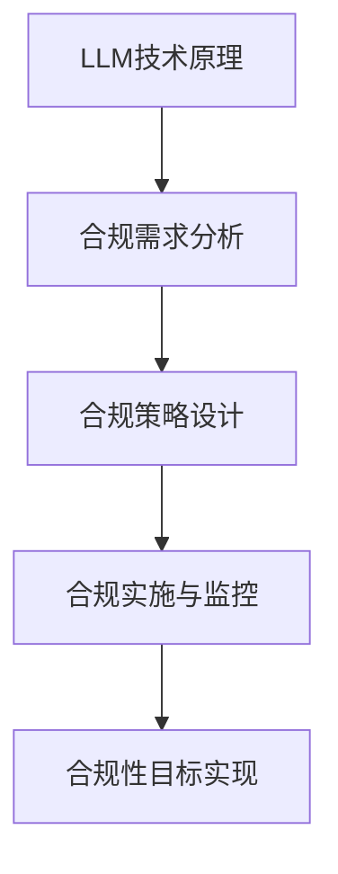

                 

## 快速适应监管要求：LLM应用的合规策略

> 关键词：监管要求、LLM应用、合规策略、数据隐私、算法公平性

> 摘要：随着人工智能技术的发展，语言模型（LLM）在各个领域的应用日益广泛，但随之而来的监管要求也愈发严格。本文旨在探讨如何快速适应这些监管要求，提出一系列有效的合规策略，以确保LLM应用的合法性和安全性。

### 目录大纲

1. **第一部分：背景介绍与核心概念**
   1.1 问题背景与核心概念
   1.2 问题描述与解决
   1.3 边界与外延
   1.4 概念结构与核心要素组成

2. **第二部分：核心概念与联系**
   2.1 核心概念原理
   2.2 概念属性特征对比
   2.3 ER实体关系图架构

3. **第三部分：合规策略设计与实施**
   3.1 合规策略概述
   3.2 合规需求分析与评估
   3.3 合规策略制定与执行
   3.4 合规监控与改进

4. **第四部分：LLM应用案例分析**
   4.1 金融行业的合规应用
   4.2 医疗健康领域的合规应用
   4.3 法律领域的合规应用

5. **第五部分：合规最佳实践**
   5.1 数据安全与隐私保护
   5.2 遵守法规与政策要求
   5.3 合规风险管理
   5.4 持续合规监控与更新

6. **第六部分：小结与展望**
   6.1 小结
   6.2 注意事项
   6.3 拓展阅读

---

### 1.1 问题背景与核心概念

随着人工智能技术的快速发展，语言模型（LLM）作为一种强大的工具，已经被广泛应用于自然语言处理、文本生成、机器翻译、智能客服等领域。然而，随着LLM应用的普及，监管要求也日益严格。这些监管要求主要集中在以下几个方面：

- **数据隐私**：LLM训练和应用过程中涉及大量的个人数据，如何确保这些数据的安全和隐私成为一个重要问题。
- **算法公平性**：LLM在决策过程中可能存在性别、种族等偏见，如何保证算法的公平性成为合规的重要挑战。
- **安全性**：LLM应用可能面临网络攻击、数据泄露等安全风险，如何保障系统的安全性是合规的关键。
- **法律合规**：不同国家和地区对于LLM应用的法律法规要求不同，如何遵守这些法律法规是确保合规的关键。

因此，快速适应监管要求，制定有效的合规策略，成为企业和开发者亟待解决的问题。本文将围绕这一核心问题，探讨LLM应用中的合规策略设计、实施、监控与改进，为读者提供实用的指导和建议。

### 1.2 问题描述与解决

在LLM应用中，合规问题主要集中在以下几个方面：

- **数据隐私**：如何确保用户数据的隐私和安全，避免数据泄露和滥用。
- **算法公平性**：如何保证LLM算法在不同群体中的公平性，避免性别、种族等偏见。
- **安全性**：如何保障LLM系统的安全，防止网络攻击和数据泄露。
- **法律合规**：如何遵守不同国家和地区的法律法规，确保LLM应用的合法性。

为了解决这些问题，可以采取以下策略：

- **数据隐私保护**：通过数据加密、去识别化、权限控制等技术手段，确保用户数据的隐私和安全。
- **算法公平性优化**：通过数据增强、算法调整、偏见检测等技术手段，提高算法的公平性。
- **安全性提升**：通过网络安全防护、访问控制、数据备份等技术手段，保障系统的安全性。
- **法律合规**：通过法规培训、合规审查、合同签订等措施，确保LLM应用的合法性。

通过这些策略的实施，可以有效应对LLM应用中的合规挑战，确保系统的合法性和安全性。

### 1.3 边界与外延

本文的讨论范围主要涉及以下方面：

- **技术领域**：本文主要关注人工智能领域中的语言模型（LLM）应用，包括自然语言处理、文本生成、机器翻译等。
- **应用场景**：本文将探讨LLM在金融、医疗、法律等领域的合规应用。
- **法规要求**：本文将分析不同国家和地区对于LLM应用的相关法律法规，如欧盟的GDPR、美国的CCPA等。

同时，本文还将探讨以下核心概念：

- **语言模型（LLM）**：一种基于深度学习技术的自然语言处理模型，能够对文本数据进行理解和生成。
- **数据隐私**：保护用户数据不被未经授权的第三方访问和使用。
- **算法公平性**：确保算法在不同群体中的公平性和无偏见。
- **安全性**：保障系统免受网络攻击和数据泄露的风险。

这些核心概念和讨论范围将为后续章节的内容提供基础和框架。

### 1.4 概念结构与核心要素组成

为了更好地理解LLM应用中的合规问题，我们可以从以下几个方面进行分析：

- **LLM技术原理**：了解LLM的工作机制，包括数据收集、预处理、模型训练、模型评估等环节。
- **合规需求分析**：分析LLM应用在不同场景中的合规需求，如数据隐私、算法公平性、安全性等。
- **合规策略设计**：根据合规需求，设计相应的合规策略，包括数据隐私保护、算法公平性优化、安全性提升等。
- **合规实施与监控**：实施合规策略，并建立监控机制，确保合规性目标的实现。

通过以上分析，我们可以构建一个清晰的LLM合规框架，如图1所示：



图1：LLM合规框架

在这个框架中，LLM技术原理是基础，合规需求分析是前提，合规策略设计是核心，合规实施与监控是保障，最终实现合规性目标。通过这个框架，我们可以系统地理解和应对LLM应用中的合规挑战。

### 2.1 核心概念原理

为了深入理解LLM应用中的合规问题，首先需要了解LLM的核心概念和工作原理。LLM（Large Language Model）是一种基于深度学习的自然语言处理模型，它能够对大量文本数据进行学习和理解，从而生成新的文本内容。LLM的核心原理主要包括以下几个方面：

#### 数据收集与预处理

LLM的训练过程依赖于大量的文本数据。这些数据可以从互联网、电子书、新闻、社交媒体等多个渠道收集。在收集到原始数据后，需要进行预处理，包括文本清洗、分词、去停用词、词性标注等操作。预处理后的数据将作为LLM的训练数据集。

#### 模型训练

LLM的训练过程通常采用深度学习中的循环神经网络（RNN）或变压器（Transformer）模型。其中，Transformer模型因其并行计算能力和强大的表示能力，被广泛应用于LLM的训练。训练过程包括以下几个步骤：

1. **输入编码**：将预处理后的文本数据转换为模型可以理解的向量表示。
2. **模型训练**：通过反向传播算法和优化器（如Adam）对模型参数进行训练，使得模型能够更好地理解和生成文本。
3. **模型评估**：使用验证集评估模型性能，调整模型参数，以达到最佳效果。

#### 模型评估与优化

在训练完成后，需要对模型进行评估和优化。评估指标包括生成文本的质量、文本的连贯性、多样性等。优化过程包括调整模型参数、增加训练数据、修改训练策略等，以提高模型性能。

#### 文本生成

在训练好的LLM模型中输入一个种子文本，模型将根据上下文生成新的文本内容。这个过程可以通过贪心搜索、抽样等策略实现。生成的文本可以是回答问题、撰写文章、生成对话等。

通过以上步骤，LLM能够对大量文本数据进行学习和理解，生成高质量的文本内容。这一过程也为后续的合规策略设计提供了基础。

### 2.2 概念属性特征对比

在了解LLM的核心概念和工作原理后，接下来我们将对比分析不同类型的LLM，以帮助读者选择合适的模型进行应用。以下是一些常见的LLM模型及其特性对比：

| 模型名称 | 特点 | 适用场景 |  
| :--- | :--- | :--- |  
| GPT（Generative Pre-trained Transformer） | 大规模预训练、强大的文本生成能力 | 文本生成、对话系统、机器翻译 |  
| BERT（Bidirectional Encoder Representations from Transformers） | 双向编码、上下文理解能力 | 问答系统、文本分类、信息提取 |  
| RoBERTa（A Robustly Optimized BERT Pretraining Approach） | 优化预训练策略、增强文本理解能力 | 文本分类、命名实体识别、情感分析 |  
| XLNet（X际网络） | 自回归、交叉注意力、强大的文本生成能力 | 文本生成、问答系统、机器翻译 |

#### GPT

GPT是一种基于Transformer的预训练模型，具有强大的文本生成能力。它能够根据输入的文本上下文生成连贯、自然的文本内容，广泛应用于文本生成、对话系统和机器翻译等场景。

#### BERT

BERT是一种双向编码的Transformer模型，能够同时考虑上下文中的正向和反向信息。这使得BERT在问答系统、文本分类和信息提取等领域表现出色。

#### RoBERTa

RoBERTa是对BERT的优化版本，通过调整预训练策略和增加训练数据，提高了模型的文本理解能力。RoBERTa在文本分类、命名实体识别和情感分析等领域具有广泛的应用。

#### XLNet

XLNet是一种自回归的Transformer模型，通过交叉注意力机制和自回归策略，增强了文本生成能力。XLNet在文本生成、问答系统和机器翻译等领域表现出色。

通过以上对比，读者可以根据实际应用需求选择合适的LLM模型，以实现最佳效果。

### 2.3 ER实体关系图架构

为了更好地理解LLM应用中的数据关系，我们可以使用Mermaid绘制ER实体关系图，展示LLM应用中涉及的关键实体及其相互关系。

以下是一个简单的ER实体关系图示例：

```mermaid
erDiagram
  Customer ||--|{ Order : places }
  Product ||--|{ Order : contains }
  Order ||--|{ Payment : made }
```

在这个示例中，我们定义了四个实体：Customer（客户）、Product（产品）、Order（订单）和Payment（支付）。它们之间的相互关系如下：

- **客户（Customer）**：可以下单（Order）。
- **产品（Product）**：可以被包含在订单（Order）中。
- **订单（Order）**：可以包含支付（Payment）。

这个ER实体关系图展示了LLM应用中涉及的主要数据关系，为后续的数据流程分析和算法设计提供了直观的参考。

### 3.1 合规策略概述

在构建LLM应用合规策略时，我们需要明确合规的目标和要求。合规策略的目的是确保LLM应用在技术、数据、法律等方面符合相关法规和标准，从而保障用户权益和企业的合法经营。以下是合规策略的概述：

#### 合规目标

- **数据隐私保护**：确保用户数据的安全和隐私，防止数据泄露和滥用。
- **算法公平性**：保证算法在不同群体中的公平性，避免性别、种族等偏见。
- **安全性提升**：提高系统的安全性，防止网络攻击和数据泄露。
- **法律合规**：遵守不同国家和地区的法律法规，确保LLM应用的合法性。

#### 合规要求

- **数据隐私保护**：根据《通用数据保护条例》（GDPR）等法规，确保用户数据的收集、存储、处理和传输过程符合隐私保护要求。
- **算法公平性**：根据《禁止算法歧视法案》等法规，确保算法在决策过程中不存在性别、种族等偏见。
- **安全性提升**：根据《网络安全法》等法规，提高系统的安全性，防止数据泄露和网络攻击。
- **法律合规**：根据不同国家和地区的法律法规，确保LLM应用符合当地的法律要求。

#### 合规体系构建

构建合规体系是确保LLM应用合规性的关键步骤。以下是合规体系构建的主要环节：

1. **合规培训**：为员工提供合规培训，提高他们的合规意识和能力。
2. **合规审查**：定期对LLM应用进行合规审查，确保符合法规和标准要求。
3. **合规管理**：建立合规管理机制，包括合规政策、合规流程、合规记录等。
4. **合规改进**：根据合规审查结果和反馈，持续改进合规策略和体系。

通过以上步骤，我们可以构建一个全面的合规体系，确保LLM应用在各个方面的合规性。

### 3.2 合规需求分析与评估

在制定合规策略之前，首先需要对合规需求进行分析和评估。合规需求分析是确保合规策略能够满足实际应用需求的重要步骤。以下是如何进行合规需求分析与评估的详细过程：

#### 1. 法规要求分析

首先，我们需要了解不同国家和地区的法律法规对LLM应用的具体要求。以下是一些关键法规：

- **欧盟的《通用数据保护条例》（GDPR）**：规定了数据收集、存储、处理和传输的合法性和透明度要求，以及用户对个人数据的访问权和删除权。
- **美国的《加州消费者隐私法案》（CCPA）**：保护加州居民的个人信息，规定了对个人数据的收集、使用、共享和销毁的具体要求。
- **中国的《网络安全法》**：规定了网络运营者的安全保护义务，包括数据安全、用户隐私保护和网络安全监测等。

在分析这些法规要求时，需要重点关注以下几个方面：

- **数据隐私**：确保用户数据在收集、存储、处理和传输过程中符合相关法规，如数据加密、匿名化、访问控制等。
- **算法公平性**：确保算法在决策过程中不存在性别、种族、年龄等偏见，遵守公平性原则。
- **安全性**：确保系统具备一定的安全防护能力，防止数据泄露和网络攻击。

#### 2. 业务需求分析

除了法规要求，我们还需要考虑业务需求，确保合规策略能够支持实际业务运营。以下是一些关键业务需求：

- **用户隐私保护**：确保用户数据不会被未经授权的第三方访问和使用。
- **算法透明性**：确保用户了解算法的决策过程，对算法的透明性和可解释性有要求。
- **数据使用范围**：明确数据的使用范围，确保数据不会被用于未经授权的其他用途。

在分析业务需求时，可以参考以下步骤：

- **用户调研**：通过问卷调查、用户访谈等方式，了解用户对隐私保护、算法公平性等方面的需求和期望。
- **业务流程分析**：分析业务流程中的关键环节，识别可能存在的合规风险点。
- **需求优先级排序**：根据法规和业务需求，对合规要求进行优先级排序，确保关键需求得到满足。

#### 3. 技术需求分析

合规策略的制定还需要考虑技术实现的可能性，确保技术方案能够支持合规要求的实现。以下是一些关键技术需求：

- **数据存储和处理**：确保数据存储和处理过程符合法规要求，如数据加密、访问控制等。
- **算法开发与优化**：确保算法开发与优化过程中符合公平性要求，如偏见检测、算法调整等。
- **安全防护**：确保系统具备一定的安全防护能力，如网络安全防护、数据备份等。

在分析技术需求时，可以参考以下步骤：

- **技术调研**：了解现有技术的成熟度和适用性，评估技术方案的可行性。
- **技术方案设计**：根据合规需求和业务需求，设计符合要求的技术方案。
- **技术评估**：对技术方案进行评估，确保技术方案能够满足合规需求。

#### 4. 合规需求评估

在完成合规需求分析后，我们需要对合规需求进行评估，确保合规策略能够有效满足需求和法规要求。以下是一些评估方法：

- **合规性检查表**：制定合规性检查表，对合规需求进行逐项检查，确保每个需求都得到满足。
- **合规性评审**：组织内部或外部的合规性评审，对合规策略进行评估和改进。
- **合规性测试**：通过合规性测试，验证合规策略在实际应用中的有效性。

通过以上步骤，我们可以全面分析合规需求，确保合规策略能够有效满足法规和业务需求。

### 3.3 合规策略制定与执行

在完成合规需求分析后，接下来我们需要制定具体的合规策略，并确保其有效执行。以下是合规策略制定与执行的详细步骤：

#### 1. 策略制定

合规策略的制定是确保LLM应用合规性的关键步骤。以下是如何制定合规策略的详细过程：

- **合规目标确定**：根据合规需求分析的结果，明确合规目标，如数据隐私保护、算法公平性、安全性提升等。
- **策略设计**：根据合规目标和法规要求，设计具体的合规策略，包括技术策略、管理策略、人员培训等。
- **策略评审**：组织内部或外部的合规性评审，对合规策略进行评估和改进。
- **策略发布**：将合规策略正式发布，确保相关人员了解和遵循。

#### 2. 策略执行

合规策略的执行是确保合规性目标实现的关键步骤。以下是如何执行合规策略的详细过程：

- **培训与宣传**：为员工提供合规培训，提高他们的合规意识和能力。同时，通过内部宣传，确保全体员工了解合规策略。
- **合规流程设计**：根据合规策略，设计具体的合规流程，包括数据收集、存储、处理、传输等环节的合规操作。
- **合规记录管理**：建立合规记录管理机制，确保合规操作有据可查，如数据记录、操作记录、审查记录等。
- **合规监控与审计**：建立合规监控与审计机制，定期对合规性进行监控和审计，确保合规策略得到有效执行。

#### 3. 策略改进

合规策略不是一成不变的，需要根据实际应用情况不断改进和完善。以下是如何改进合规策略的详细过程：

- **反馈机制**：建立反馈机制，收集员工、用户和监管机构的反馈，识别合规策略存在的问题和改进点。
- **评估与改进**：对合规策略进行定期评估，根据评估结果和反馈，进行必要的改进和完善。
- **持续改进**：通过持续改进，确保合规策略能够适应不断变化的法规和业务需求。

通过以上步骤，我们可以确保合规策略的有效制定与执行，从而实现LLM应用的合规性目标。

### 3.4 合规监控与改进

合规监控是确保LLM应用持续合规的重要环节。有效的合规监控机制可以帮助企业及时发现和纠正合规问题，确保合规策略的有效实施。以下是如何进行合规监控与改进的详细步骤：

#### 1. 监控机制的建立

建立合规监控机制是确保合规性目标实现的第一步。以下是如何建立合规监控机制的详细过程：

- **合规指标设定**：根据合规目标和法规要求，设定具体的合规指标，如数据隐私保护指标、算法公平性指标、安全性能指标等。
- **监控工具选择**：选择合适的监控工具，如合规管理系统、日志分析工具、安全监测工具等，以确保监控的全面性和准确性。
- **监控流程设计**：设计合规监控流程，包括监控数据的收集、处理、分析和报告等环节，确保监控流程的顺畅和高效。

#### 2. 监控实施

合规监控的实施是确保监控机制发挥作用的关键。以下是如何实施合规监控的详细过程：

- **日常监控**：定期对合规指标进行监控，及时发现合规问题，如数据泄露、算法偏见等。
- **异常检测**：通过实时监控和异常检测技术，识别潜在的合规风险，如网络攻击、数据异常等。
- **监控记录**：建立监控记录，记录监控过程和结果，为后续的改进和审计提供依据。

#### 3. 问题发现与处理

在合规监控过程中，可能会发现各种合规问题。以下是如何发现和处理合规问题的详细过程：

- **问题识别**：通过监控数据和异常检测技术，识别潜在的合规问题。
- **问题分析**：对识别出的合规问题进行分析，确定问题的原因和影响。
- **问题处理**：根据问题分析和评估结果，制定问题处理方案，如数据修复、算法调整、安全防护措施等。

#### 4. 改进与优化

合规监控的目的是发现和解决问题，同时也需要不断改进和优化合规策略和监控机制。以下是如何进行改进与优化的详细过程：

- **反馈机制**：建立反馈机制，收集员工、用户和监管机构的反馈，识别合规监控存在的问题和改进点。
- **评估与改进**：对合规监控机制进行定期评估，根据评估结果和反馈，进行必要的改进和完善。
- **持续改进**：通过持续改进，确保合规监控机制能够适应不断变化的法规和业务需求。

通过以上步骤，我们可以确保合规监控的有效实施，及时发现和纠正合规问题，从而实现LLM应用的持续合规。

### 4.1 金融行业的合规应用

金融行业是LLM应用的一个重要领域，随着监管要求的日益严格，合规性问题变得尤为重要。以下是如何在金融行业中应用LLM并确保合规性的详细分析：

#### 1. 应用场景

- **风险评估**：LLM可以用于对大量金融数据进行分析，识别潜在的风险因素，如信用风险、市场风险等。
- **欺诈检测**：利用LLM进行自然语言处理，可以识别异常交易行为，提高欺诈检测的准确性和效率。
- **客户服务**：通过LLM构建的智能客服系统，可以提供24/7的客户服务，提高客户满意度。

#### 2. 合规挑战

- **数据隐私**：金融行业涉及大量敏感信息，如何确保这些数据在处理过程中的隐私和安全是一个重要问题。
- **算法公平性**：在金融决策中，算法的偏见可能导致不公平的结果，如性别、种族等。
- **法律法规遵守**：金融行业受到严格的监管，如何确保LLM应用符合各种法律法规，如《反洗钱法》、《消费者保护法》等。

#### 3. 合规策略

- **数据隐私保护**：通过数据加密、匿名化等技术手段，确保用户数据的隐私和安全。
- **算法公平性优化**：通过数据增强、算法调整、偏见检测等技术手段，提高算法的公平性。
- **合规审查**：定期进行合规审查，确保LLM应用符合相关法律法规的要求。
- **安全防护**：加强网络安全防护，防止数据泄露和网络攻击。

#### 4. 实际案例

- **案例一**：某银行使用LLM构建了智能客服系统，通过自然语言处理技术，提供24/7的客户服务。在实施过程中，银行采取了多种合规策略，如数据隐私保护、算法公平性优化等，确保系统的合法性和安全性。
- **案例二**：某金融科技公司开发了一款风险评估软件，使用LLM对大量金融数据进行分析。在开发过程中，公司进行了全面的合规审查，确保系统符合相关法律法规的要求。

通过以上案例，我们可以看到，金融行业在应用LLM时，需要采取多种合规策略，以确保系统的合法性和安全性。

### 4.2 医疗健康领域的合规应用

医疗健康领域是另一个应用LLM的重要领域，由于涉及大量敏感信息，合规性问题尤为重要。以下是如何在医疗健康领域中应用LLM并确保合规性的详细分析：

#### 1. 应用场景

- **病历分析**：LLM可以用于对病历数据进行分析，识别疾病、症状和治疗方案等。
- **患者服务**：通过LLM构建的智能患者服务系统，可以提供个性化的健康咨询和建议。
- **医学研究**：利用LLM对医学文献进行自然语言处理，提取关键信息，加速医学研究进程。

#### 2. 合规挑战

- **数据隐私**：医疗健康领域涉及大量个人健康信息，如何确保这些数据在处理过程中的隐私和安全是一个重要问题。
- **算法公平性**：在医疗决策中，算法的偏见可能导致不公平的结果，如性别、种族等。
- **法律法规遵守**：医疗健康领域受到严格的监管，如何确保LLM应用符合各种法律法规，如《医疗隐私保护法》、《药品管理法》等。

#### 3. 合规策略

- **数据隐私保护**：通过数据加密、匿名化等技术手段，确保用户数据的隐私和安全。
- **算法公平性优化**：通过数据增强、算法调整、偏见检测等技术手段，提高算法的公平性。
- **合规审查**：定期进行合规审查，确保LLM应用符合相关法律法规的要求。
- **安全防护**：加强网络安全防护，防止数据泄露和网络攻击。

#### 4. 实际案例

- **案例一**：某医院使用LLM构建了智能病历分析系统，通过自然语言处理技术，帮助医生识别疾病和制定治疗方案。在实施过程中，医院采取了多种合规策略，如数据隐私保护、算法公平性优化等，确保系统的合法性和安全性。
- **案例二**：某医学研究机构开发了一款基于LLM的医学文献分析工具，用于提取关键信息，加速医学研究进程。在开发过程中，机构进行了全面的合规审查，确保系统符合相关法律法规的要求。

通过以上案例，我们可以看到，医疗健康领域在应用LLM时，需要采取多种合规策略，以确保系统的合法性和安全性。

### 4.3 法律领域的合规应用

法律领域是LLM应用的另一个重要领域，由于涉及大量法律文本和决策，合规性问题尤为突出。以下是如何在法律领域中应用LLM并确保合规性的详细分析：

#### 1. 应用场景

- **法律文本分析**：LLM可以用于对法律文本进行分析，提取关键信息，如条款、定义、解释等。
- **案件预测**：通过LLM对历史案件进行分析，预测类似案件的裁决结果。
- **法律咨询**：利用LLM构建的智能法律咨询系统，为用户提供专业的法律建议。

#### 2. 合规挑战

- **数据隐私**：法律领域涉及大量敏感信息，如何确保这些数据在处理过程中的隐私和安全是一个重要问题。
- **算法公平性**：在法律决策中，算法的偏见可能导致不公平的结果，如性别、种族等。
- **法律法规遵守**：法律领域受到严格的监管，如何确保LLM应用符合各种法律法规，如《律师法》、《仲裁法》等。

#### 3. 合规策略

- **数据隐私保护**：通过数据加密、匿名化等技术手段，确保用户数据的隐私和安全。
- **算法公平性优化**：通过数据增强、算法调整、偏见检测等技术手段，提高算法的公平性。
- **合规审查**：定期进行合规审查，确保LLM应用符合相关法律法规的要求。
- **安全防护**：加强网络安全防护，防止数据泄露和网络攻击。

#### 4. 实际案例

- **案例一**：某律师事务所使用LLM构建了法律文本分析系统，用于提取法律文本中的关键信息。在实施过程中，事务所采取了多种合规策略，如数据隐私保护、算法公平性优化等，确保系统的合法性和安全性。
- **案例二**：某法院开发了一款基于LLM的案件预测工具，用于预测案件的裁决结果。在开发过程中，法院进行了全面的合规审查，确保系统符合相关法律法规的要求。

通过以上案例，我们可以看到，法律领域在应用LLM时，需要采取多种合规策略，以确保系统的合法性和安全性。

### 5.1 数据安全与隐私保护

在LLM应用中，数据安全和隐私保护是确保合规性的关键环节。以下是一些最佳实践，帮助企业和开发者实现数据安全和隐私保护：

#### 1. 数据加密

对敏感数据进行加密是确保数据安全的基本措施。在数据传输和存储过程中，使用强加密算法（如AES-256）对数据进行加密，确保数据在传输和存储过程中不被窃取或篡改。

#### 2. 数据匿名化

通过数据匿名化技术，将敏感数据转换成无法直接识别个人身份的形式。常见的匿名化技术包括数据置换、数据遮蔽和数据掩码等。

#### 3. 访问控制

建立严格的访问控制机制，确保只有授权人员才能访问敏感数据。通过身份验证、权限分配和访问日志记录等手段，确保数据访问的安全性和可控性。

#### 4. 数据备份与恢复

定期对数据进行备份，确保在数据丢失或损坏时能够快速恢复。同时，建立数据恢复策略，确保在灾难发生时能够尽快恢复系统运行。

#### 5. 安全审计与监控

建立安全审计和监控机制，定期对系统进行安全检查和漏洞扫描，及时发现和修复安全隐患。通过日志分析和异常检测，监控数据访问和操作行为，确保数据安全和隐私。

#### 6. 用户隐私政策

制定清晰的用户隐私政策，告知用户数据收集、使用和共享的方式，以及用户享有的隐私权利。通过用户同意和隐私告知，确保用户对数据处理的知情权和选择权。

通过以上最佳实践，企业和开发者可以有效地保护数据安全和隐私，确保LLM应用的合规性。

### 5.2 遵守法规与政策要求

在LLM应用中，遵守法规与政策要求是确保合规性的重要方面。以下是一些关键步骤和措施，帮助企业和开发者遵守相关法规和政策：

#### 1. 熟悉法规和政策

了解相关国家和地区的法律法规，如《通用数据保护条例》（GDPR）、《加州消费者隐私法案》（CCPA）等。熟悉法规的内容、适用范围和合规要求，为合规工作奠定基础。

#### 2. 制定合规计划

根据法规和政策要求，制定详细的合规计划，包括合规目标、合规策略、合规流程和合规资源等。合规计划应确保所有环节都符合法规要求，并能够有效应对可能的合规挑战。

#### 3. 合规培训与宣传

为员工提供合规培训，提高他们的合规意识和能力。通过内部宣传和培训，确保全体员工了解和遵守相关法规和政策。

#### 4. 定期合规审查

定期对LLM应用进行合规审查，确保系统、流程和操作符合法规和政策要求。合规审查可以采用内部审计、第三方评估等方式，确保审查的全面性和准确性。

#### 5. 纠正合规问题

在合规审查过程中，如发现合规问题，应立即采取纠正措施，确保问题得到及时解决。纠正措施可能包括改进流程、调整系统、加强培训等。

#### 6. 保持与监管机构的沟通

与监管机构保持沟通，了解最新的法规和政策动态，确保LLM应用的合规性。在必要时，可以寻求监管机构的指导和帮助。

通过以上步骤和措施，企业和开发者可以有效地遵守法规和政策要求，确保LLM应用的合规性。

### 5.3 合规风险管理

在LLM应用中，合规风险管理是确保合规性目标实现的重要环节。以下是一些关键步骤和策略，帮助企业和开发者进行合规风险管理：

#### 1. 风险识别

首先，需要识别LLM应用中可能存在的合规风险。这些风险可能包括数据隐私泄露、算法偏见、网络安全攻击等。通过风险评估和监控，及时发现和识别潜在的合规风险。

#### 2. 风险评估

对识别出的合规风险进行评估，确定风险的可能性和影响程度。风险评估可以帮助企业和开发者了解风险的重要性，并采取相应的风险管理措施。

#### 3. 风险控制

根据风险评估结果，采取相应的风险控制措施。这些措施可能包括：

- **风险规避**：通过改变业务流程或技术方案，避免合规风险的发生。
- **风险降低**：通过改进技术手段、加强安全防护等措施，降低合规风险的影响。
- **风险转移**：通过购买保险或其他合同安排，将合规风险转移给第三方。

#### 4. 风险监测

建立合规风险监测机制，定期对合规风险进行监测和评估。通过实时监控和异常检测，及时发现和应对合规风险。

#### 5. 风险应对

在合规风险发生时，及时采取应对措施，降低风险的影响。应对措施可能包括：

- **应急响应**：建立应急响应机制，确保在合规风险发生时能够迅速应对。
- **责任追究**：对违规行为进行责任追究，确保合规风险的应对措施得到有效执行。

#### 6. 持续改进

合规风险管理是一个持续的过程，需要根据风险变化和业务发展，不断改进和完善合规风险管理策略。

通过以上步骤和策略，企业和开发者可以有效地进行合规风险管理，确保LLM应用的合规性。

### 5.4 持续合规监控与更新

在LLM应用中，持续合规监控与更新是确保合规性目标持续实现的关键。以下是一些最佳实践，帮助企业和开发者实现持续合规监控与更新：

#### 1. 定期审查

定期对LLM应用进行合规审查，确保系统、流程和操作符合最新的法规和政策要求。审查可以采用内部审计、第三方评估等方式，确保审查的全面性和准确性。

#### 2. 系统升级

随着技术的发展和法规的变化，及时对LLM系统进行升级和更新，以适应新的合规要求。系统升级应包括软件、硬件和网络安全等方面的改进。

#### 3. 风险评估

定期对LLM应用进行风险评估，识别潜在的合规风险，并采取相应的风险管理措施。风险评估应覆盖数据隐私、算法公平性、安全性等方面。

#### 4. 培训与宣传

为员工提供持续的合规培训，提高他们的合规意识和能力。通过内部宣传和培训，确保全体员工了解和遵守最新的合规要求。

#### 5. 监控与反馈

建立合规监控机制，实时监控LLM应用中的合规性情况，及时发现和纠正合规问题。通过收集员工、用户和监管机构的反馈，持续改进合规策略。

#### 6. 文档管理

建立合规文档管理机制，确保所有合规文档的完整性和准确性。合规文档应包括合规策略、合规审查记录、风险评估报告等。

#### 7. 持续改进

根据合规监控和风险评估的结果，持续改进合规策略和管理流程，确保LLM应用的合规性目标得到持续实现。

通过以上最佳实践，企业和开发者可以确保LLM应用的合规性得到持续监控与更新，从而实现长期的合规经营。

### 6.1 小结

本文从背景介绍、问题描述、合规策略设计与实施、案例分析、最佳实践等方面，系统地探讨了如何快速适应监管要求，制定和实施LLM应用的合规策略。通过本文的讨论，我们可以得出以下结论：

- LL

