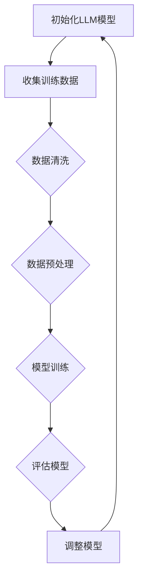
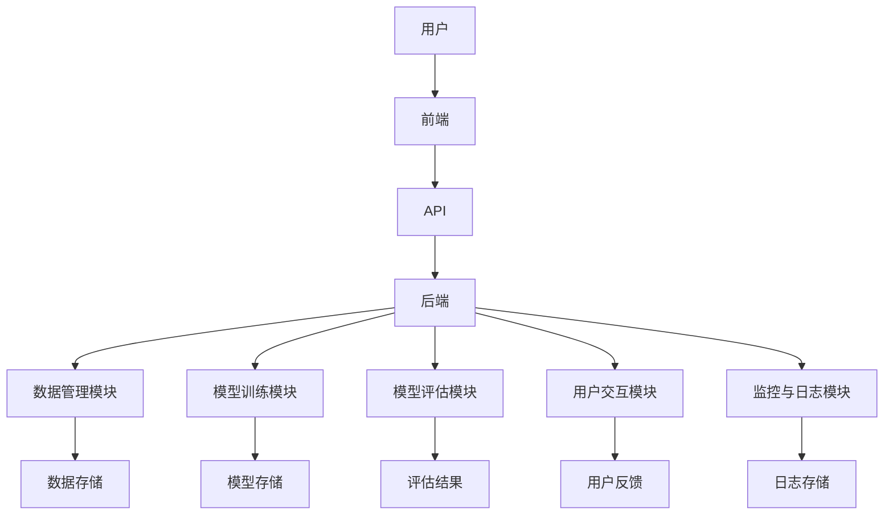
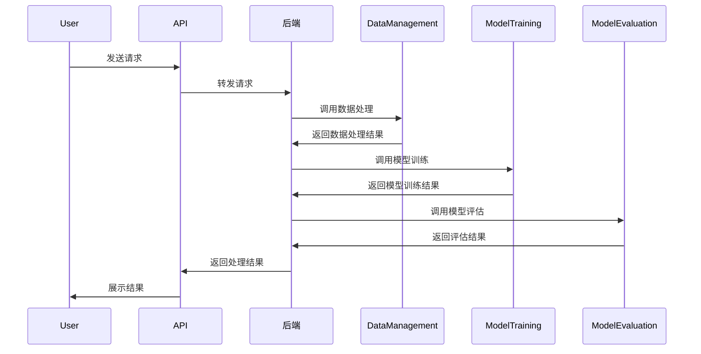

                 

## 《快速验证LLM应用创意的方法论》

### 关键词

- **快速验证**
- **LLM应用创意**
- **方法论**
- **技术实现**
- **案例剖析**

### 摘要

本文旨在探讨如何通过快速验证方法来评估和优化大型语言模型（LLM）的应用创意。通过深入分析LLM的基本原理和快速验证的核心步骤，本文将提供一系列实用的技巧和策略，帮助开发者更高效地设计和实施LLM应用，从而加速创新进程，提升市场竞争力。

## 引言

### 1.1 背景介绍

近年来，人工智能（AI）技术的飞速发展，尤其是自然语言处理（NLP）领域的大型语言模型（LLM），如GPT系列，极大地改变了我们的生活方式和商业模式。LLM在自动写作、问答系统、智能客服、机器翻译等方面展现出惊人的性能，成为各大企业和研究机构竞相研究和应用的热点。然而，随着LLM应用场景的不断扩展，如何快速验证这些创意的有效性和可行性，成为了一个亟待解决的问题。

快速验证，作为一种在有限时间内对创新想法进行测试和验证的方法，对于LLM应用创意的开发至关重要。它不仅可以帮助开发者节省时间和资源，还可以在项目早期发现潜在问题，避免后续的修正成本。本文将详细介绍快速验证LLM应用创意的方法论，帮助读者理解和掌握这一过程。

### 1.2 目标读者

本文的目标读者主要包括：
- **AI和NLP领域的研究人员**：希望了解如何将快速验证方法应用于LLM研究的学者。
- **软件开发工程师**：负责开发和部署LLM应用的工程师，需要了解快速验证的实践技巧。
- **产品经理**：负责制定LLM应用策略，需要掌握快速验证方法的决策者。
- **创业者**：希望通过快速验证LLM应用创意来加速产品市场化进程的创业者。

### 1.3 书籍结构

本文将分为八个主要章节，具体结构如下：
- **第1章 引言**：介绍快速验证LLM应用创意的背景和重要性。
- **第2章 快速验证基础**：介绍快速验证的概念、与传统验证的区别以及面临的挑战。
- **第3章 LLM应用创意核心概念**：阐述LLM的基础概念和应用创意的核心要素。
- **第4章 算法原理讲解**：讲解快速验证算法的原理和实现方法。
- **第5章 系统分析与架构设计**：介绍系统分析与架构设计方案。
- **第6章 项目实战**：通过实际项目展示快速验证的过程。
- **第7章 最佳实践与拓展**：提供最佳实践、注意事项和拓展阅读。
- **第8章 总结**：总结全文，展望未来发展趋势。

### 1.4 文章大纲

- **第1章 引言**
  - **第1.1 背景介绍**
  - **第1.2 目标读者**
  - **第1.3 书籍结构**
  - **第1.4 文章大纲**

## 快速验证基础

### 2.1 快速验证的重要性

快速验证是一种在短时间内对创新想法进行测试和评估的方法，它能够帮助开发者迅速了解想法的可行性，避免在不可行方向上浪费过多的时间和资源。在LLM应用创意的开发过程中，快速验证的重要性体现在以下几个方面：

1. **节约时间和成本**：通过快速验证，开发者可以在项目早期发现潜在问题，及时调整方案，避免在后期进行大规模修改和重构，从而节约时间和成本。
2. **提高市场竞争力**：快速验证能够帮助开发者更快地将创新想法转化为实际产品，抢占市场先机，提升企业在竞争中的地位。
3. **优化用户体验**：快速验证可以让开发者更快速地获取用户反馈，及时调整产品功能，优化用户体验，提高用户满意度。

### 2.2 快速验证与传统验证的区别

传统验证通常是指在项目开发完成后，通过严格的测试和评估来确保产品的质量和性能。而快速验证则更加注重在项目早期对想法的验证，其主要区别如下：

1. **时间范围**：快速验证通常在较短时间内完成，而传统验证则需要较长的时间。
2. **测试内容**：快速验证主要关注于验证创意的基本可行性和用户体验，而传统验证则更加注重产品的全面性能和稳定性。
3. **目标用户**：快速验证的目标用户通常是内部团队或小部分早期用户，而传统验证的目标用户则是广泛的市场用户。

### 2.3 快速验证的挑战与机遇

尽管快速验证具有许多优点，但在实际应用过程中也面临一些挑战：

1. **资源限制**：快速验证通常需要在有限的资源下进行，这要求开发者具备高效的资源管理能力。
2. **数据质量**：快速验证依赖于测试数据和用户反馈，数据质量直接影响验证结果。
3. **团队协作**：快速验证需要团队紧密协作，确保在短时间内完成有效的验证。

然而，随着技术的发展和经验的积累，快速验证也面临着许多机遇：

1. **自动化工具**：随着自动化测试工具的不断发展，快速验证的效率和质量得到了显著提升。
2. **用户参与**：通过社交媒体和用户社区，开发者可以更快速地获取用户反馈，推动产品的迭代优化。
3. **创新文化**：快速验证鼓励开发者敢于尝试新的想法，推动创新文化的形成。

### 2.4 快速验证的流程

快速验证通常包括以下几个步骤：

1. **需求分析**：明确验证的目标和关键指标，确保验证过程的针对性和有效性。
2. **原型设计**：基于需求分析，设计出可验证的原型，确保在验证过程中能够清晰地衡量创意的可行性。
3. **测试实施**：根据原型设计，制定测试计划，实施测试，收集数据。
4. **数据分析**：对收集到的数据进行分析，评估验证结果，识别问题。
5. **反馈与调整**：根据验证结果，对原型和需求进行调整，确保验证目标的实现。

通过以上流程，开发者可以快速验证LLM应用创意的可行性，为后续的开发提供指导。

### 2.5 快速验证的优势与局限

快速验证的优势在于：
- **高效性**：在短时间内完成验证，减少开发周期。
- **灵活性**：能够快速调整和迭代，适应变化的需求。
- **成本效益**：在早期发现问题，避免后期修改成本。

然而，快速验证也存在局限：
- **精度**：由于时间限制，验证结果的精度可能不如传统验证。
- **广泛性**：快速验证主要关注基本可行性，可能无法全面评估产品的性能和稳定性。

因此，在应用快速验证时，开发者需要根据实际情况权衡其优势和局限，选择合适的验证方法。

### 2.6 快速验证在不同阶段的实施策略

快速验证可以应用于产品开发的各个阶段，不同阶段的实施策略也有所不同：

1. **概念验证阶段**：在产品开发初期，通过快速验证验证核心概念和基本可行性。
2. **原型验证阶段**：在原型设计完成后，通过快速验证评估原型的功能和用户体验。
3. **迭代验证阶段**：在产品开发过程中，通过快速验证不断优化和迭代，确保产品满足市场需求。

### 2.7 快速验证与传统验证的适用场景对比

快速验证适用于以下场景：
- **创新性项目**：需要快速验证新想法的可行性。
- **市场调研**：通过用户反馈快速调整产品方向。

传统验证适用于以下场景：
- **成熟产品**：需要进行全面测试，确保产品质量和稳定性。
- **大规模项目**：需要严格的管理和流程，确保项目的顺利进行。

### 2.8 快速验证的常见方法和工具

快速验证的方法和工具多种多样，以下是一些常见的方法和工具：

1. **A/B测试**：通过对比不同版本的功能，评估用户偏好。
2. **用户调研**：通过问卷调查、访谈等方式，获取用户反馈。
3. **模拟测试**：通过模拟用户行为，评估产品的性能和稳定性。
4. **自动化测试**：使用自动化测试工具，提高测试效率和准确性。

通过合理选择和使用这些方法和工具，开发者可以更高效地实施快速验证，提升产品开发的效率和质量。

## LLM应用创意核心概念

### 3.1 LLM基础概念

大型语言模型（LLM）是一种基于深度学习的自然语言处理模型，它能够理解和生成人类语言。LLM通常由多个神经网络层组成，通过大量文本数据进行训练，从而学习到语言的内在结构和规律。LLM的核心目标是使机器能够理解和生成自然语言，从而实现人与机器的智能交互。

### 3.2 LLM应用创意的核心要素

LLM应用创意的核心要素包括：

1. **数据集**：训练LLM的基础，数据集的质量直接影响LLM的性能。
2. **模型架构**：LLM的神经网络结构，包括层数、神经元个数、激活函数等。
3. **训练算法**：用于训练LLM的算法，如梯度下降、Adam优化器等。
4. **优化目标**：训练过程中需要优化的目标，如损失函数、精度等。
5. **应用场景**：LLM的具体应用领域，如问答系统、机器翻译、自动写作等。

### 3.3 概念属性特征对比表格

以下是一个关于LLM应用创意概念属性特征的对比表格：

| 概念属性       | LLM              | 传统NLP           | 对比结果                  |
|----------------|------------------|-------------------|--------------------------|
| 数据依赖性     | 高度依赖         | 中等依赖          | LLM对大规模文本数据的需求更高 |
| 训练时间       | 较长             | 较短              | LLM的训练过程通常更为复杂 |
| 生成能力       | 强              | 弱                | LLM能够生成更为自然的文本 |
| 适应能力       | 强              | 弱                | LLM能够适应多种语言和场景 |
| 对标注数据的依赖 | 低              | 高                | LLM对无监督学习的支持更强 |

### 3.4 ER实体关系图架构的Mermaid流程图

以下是一个LLM应用创意的ER实体关系图架构的Mermaid流程图：

```mermaid
entityRelationshipDiagram
  A[模型架构] --> B[训练数据]
  B --> C[优化目标]
  C --> D[应用场景]
  A --> E[数据集]
  F[生成能力] --> G[适应能力]
  E --> H[模型架构]
```

在这个流程图中，模型架构、训练数据、优化目标、应用场景和数据集是LLM应用创意的核心要素，它们相互关联，共同构成了一个完整的LLM应用系统。

### 3.5 关键概念之间的联系

LLM应用创意中的关键概念包括模型架构、训练数据、优化目标和应用场景，它们之间存在着密切的联系：

1. **模型架构**：决定了LLM的基本结构和功能，直接影响其生成能力和适应能力。
2. **训练数据**：提供了训练LLM所需的文本信息，数据的质量和数量直接影响模型的性能。
3. **优化目标**：在训练过程中用于评估和调整模型，优化目标是实现应用场景需求的关键。
4. **应用场景**：明确了LLM的具体应用领域，决定了模型架构和训练数据的选取。

通过深入理解和把握这些关键概念之间的联系，开发者可以更好地设计和管理LLM应用创意，实现高效的快速验证过程。

### 3.6 LLM应用创意的边界与外延

LLM应用创意的边界主要涉及以下几个方面：

1. **技术边界**：LLM应用创意的技术实现需要考虑算法的先进性、模型的复杂度和计算资源的需求。
2. **应用边界**：LLM应用创意需要明确具体的应用场景，如自动写作、机器翻译、智能客服等。
3. **市场边界**：LLM应用创意的市场推广和商业化需要考虑目标用户、竞争对手和市场趋势。

LLM应用创意的外延包括：

1. **数据扩展**：通过引入更多类型的文本数据，提高模型的泛化能力和适应性。
2. **功能扩展**：通过添加新的功能模块，如语音识别、情感分析等，丰富LLM的应用场景。
3. **场景扩展**：将LLM应用于更多领域，如医疗、金融、教育等，拓展其应用边界。

通过不断探索和扩展LLM应用创意的边界与外延，开发者可以推动LLM技术的发展和应用，实现更大的商业价值和社会影响。

## 算法原理讲解

### 4.1 LLM算法概述

大型语言模型（LLM）是一种基于深度学习的自然语言处理模型，它通过大量的文本数据进行训练，学习到语言的内在结构和规律。LLM的核心算法主要包括以下几个部分：

1. **嵌入层**：将文本数据转换为向量表示。
2. **编码器**：对输入文本进行处理，生成上下文向量。
3. **解码器**：根据上下文向量生成输出文本。

在训练过程中，LLM通过优化损失函数来调整模型参数，使得模型能够更好地拟合训练数据。常见的损失函数包括交叉熵损失和均方误差损失。

### 4.2 快速验证算法流程图

为了更好地理解快速验证算法的原理，我们使用Mermaid绘制了一个简化的流程图：



在这个流程图中，快速验证算法主要包括以下几个步骤：

1. **初始化LLM模型**：根据需求选择合适的模型架构，初始化模型参数。
2. **收集训练数据**：从公开数据集或自有数据中提取训练数据。
3. **数据清洗**：去除数据中的噪声和错误。
4. **数据预处理**：将文本数据转换为模型可处理的格式，如词向量、序列编码等。
5. **模型训练**：使用训练数据对模型进行训练，调整模型参数。
6. **评估模型**：使用验证集或测试集评估模型的性能。
7. **调整模型**：根据评估结果调整模型参数，优化模型性能。
8. **重复步骤**：重复执行以上步骤，直到模型性能达到预期。

### 4.3 算法原理的数学模型与公式

快速验证算法的数学模型主要包括以下几个部分：

1. **嵌入层**：将文本数据转换为向量表示，常用的方法包括词袋模型和词嵌入（Word Embedding）。

   $$ x = \sum_{i=1}^{n} w_i * y_i $$

   其中，$x$表示文本向量的表示，$w_i$表示词的权重，$y_i$表示词的频率。

2. **编码器**：对输入文本进行处理，生成上下文向量。常用的编码器架构包括循环神经网络（RNN）和变换器（Transformer）。

   $$ h_t = \sum_{i=1}^{n} W_i * [x_i, h_{t-1}] $$

   其中，$h_t$表示时间步$t$的上下文向量，$W_i$表示权重矩阵，$x_i$表示输入文本的向量表示，$h_{t-1}$表示前一时间步的上下文向量。

3. **解码器**：根据上下文向量生成输出文本。解码器通常使用自回归模型，如循环神经网络（RNN）和变换器（Transformer）。

   $$ y_t = \sum_{i=1}^{n} W_i * [h_t, s_t] $$

   其中，$y_t$表示时间步$t$的输出文本，$s_t$表示当前解码器的状态。

4. **损失函数**：用于评估模型输出的文本与真实文本之间的差距，常用的损失函数包括交叉熵损失和均方误差损失。

   $$ L = -\sum_{i=1}^{n} y_i * \log(p_i) $$

   其中，$L$表示损失函数，$y_i$表示真实标签，$p_i$表示模型输出的概率分布。

### 4.4 算法原理讲解 & 举例说明

为了更好地理解快速验证算法的原理，我们通过一个简单的例子进行说明。

假设我们要训练一个LLM模型，用于生成新闻摘要。以下是具体的步骤：

1. **初始化LLM模型**：选择一个预训练的LLM模型，如GPT-2或GPT-3，初始化模型参数。

2. **收集训练数据**：从公开的新闻数据集中提取大量新闻文章，作为训练数据。

3. **数据清洗**：去除新闻文章中的噪声和错误，如HTML标签、广告等。

4. **数据预处理**：将新闻文章转换为模型可处理的格式，如分词、词嵌入等。

5. **模型训练**：使用训练数据对模型进行训练，调整模型参数，优化模型性能。

6. **评估模型**：使用验证集或测试集评估模型的性能，如摘要长度、摘要质量等。

7. **调整模型**：根据评估结果调整模型参数，优化模型性能。

8. **重复步骤**：重复执行以上步骤，直到模型性能达到预期。

在训练过程中，模型会根据损失函数不断调整参数，使得模型生成的新闻摘要更加准确和自然。通过这种方式，我们可以快速验证LLM模型在新闻摘要任务中的可行性。

### 4.5 快速验证算法的优势与局限

快速验证算法具有以下几个优势：

1. **高效性**：通过简化的训练和验证流程，能够在较短的时间内评估模型的性能。
2. **灵活性**：可以根据需求快速调整模型参数，适应不同的应用场景。
3. **成本效益**：在项目早期发现问题，避免后期修改成本。

然而，快速验证算法也存在一些局限：

1. **精度**：由于时间限制，验证结果的精度可能不如传统验证。
2. **广泛性**：快速验证主要关注基本可行性，可能无法全面评估产品的性能和稳定性。

因此，在应用快速验证算法时，开发者需要根据实际情况权衡其优势和局限，选择合适的验证方法。

## 系统分析与架构设计

### 5.1 问题场景介绍

在现代商业环境中，企业面临着不断变化的市场需求和用户期望。为了保持竞争力，企业需要快速响应市场变化，不断推出创新的产品和服务。在这种背景下，自然语言处理（NLP）技术，特别是大型语言模型（LLM），成为了一种重要的工具。LLM可以在自动写作、问答系统、智能客服、机器翻译等领域发挥重要作用，帮助企业实现智能化运营和用户互动。

然而，LLM的应用不仅需要高效的算法实现，还需要强大的系统架构支持。快速验证LLM应用创意的关键在于构建一个灵活、可扩展的系统架构，能够快速适应不同的应用场景和需求变化。本文将介绍一个基于LLM的应用系统架构设计，旨在实现快速验证和迭代优化。

### 5.2 系统功能设计

为了实现快速验证LLM应用创意，我们需要明确系统的核心功能。以下是一个典型的系统功能设计：

1. **数据管理模块**：负责数据采集、清洗、预处理和存储，为LLM训练和验证提供高质量的数据支持。
2. **模型训练模块**：基于选定的LLM算法，进行模型的训练和优化，实现不同应用场景的快速验证。
3. **模型评估模块**：通过多种评估指标，对训练好的模型进行性能评估，确保模型满足应用需求。
4. **用户交互模块**：提供用户界面，允许用户输入查询或需求，实时展示模型输出结果，收集用户反馈。
5. **监控与日志模块**：监控系统运行状态，记录关键日志信息，为系统优化和故障排除提供数据支持。

### 5.3 系统架构设计

系统架构设计是快速验证LLM应用创意的关键环节。以下是一个简化的系统架构设计，包括前端、后端和中间件：

1. **前端**：用户交互界面，采用Web前端技术实现，提供友好的用户操作体验。
2. **后端**：系统核心功能实现，包括数据管理模块、模型训练模块、模型评估模块和用户交互模块。后端采用微服务架构，实现模块化、高可用和可扩展性。
3. **中间件**：负责数据传输和通信，包括消息队列、缓存和数据库等。

以下是系统架构设计的Mermaid流程图：



在这个架构设计中，用户通过前端界面提交请求，后端系统根据请求调用相应的功能模块进行处理，并将结果返回给用户。同时，系统实时监控和记录关键日志信息，为系统优化和故障排除提供数据支持。

### 5.4 系统接口设计

系统接口设计是确保各模块之间高效通信的关键。以下是一个简化的系统接口设计：

1. **数据管理接口**：提供数据采集、清洗、预处理和存储功能，支持不同数据源的接入和转换。
2. **模型训练接口**：提供模型训练、优化和评估功能，支持不同的LLM算法和训练策略。
3. **模型评估接口**：提供模型性能评估功能，支持多种评估指标和对比实验。
4. **用户交互接口**：提供用户查询、反馈和结果显示功能，支持实时交互和数据可视化。

以下是系统接口设计的Mermaid类图：

```mermaid
classDiagram
    User <<Interface>>
    DataManagement <<Interface>>
    ModelTraining <<Interface>>
    ModelEvaluation <<Interface>>
    UserInteraction <<Interface>>

    User --> DataManagement
    User --> ModelTraining
    User --> ModelEvaluation
    User --> UserInteraction
    DataManagement --> ModelTraining
    DataManagement --> ModelEvaluation
    ModelTraining --> ModelEvaluation
```

在这个类图中，用户接口、数据管理接口、模型训练接口、模型评估接口和用户交互接口之间通过接口方法进行通信，实现系统的整体功能。

### 5.5 系统交互

为了确保系统的高效运行和灵活扩展，我们需要设计一套完善的系统交互机制。以下是一个简化的系统交互设计：

1. **请求分发**：前端用户请求通过API接口转发给后端系统。
2. **功能调用**：后端系统根据请求调用相应的功能模块进行处理。
3. **数据流转**：数据在各模块之间流转，实现数据共享和协同处理。
4. **结果反馈**：处理结果通过API接口返回给前端用户，展示给用户。

以下是系统交互的Mermaid序列图：



在这个序列图中，用户请求经过API接口转发到后端系统，后端系统依次调用各功能模块进行处理，并将结果返回给前端用户，完成一次完整的系统交互过程。

### 5.6 系统架构设计的优点

本系统架构设计具有以下优点：

1. **模块化**：各模块独立运行，便于维护和升级。
2. **高可用**：通过分布式架构，确保系统的高可用性和容错性。
3. **可扩展**：支持横向扩展和纵向扩展，适应不同规模的应用场景。
4. **灵活性**：支持不同类型的LLM算法和应用场景，实现快速验证和优化。

通过这套系统架构设计，开发者可以快速验证LLM应用创意，提升产品的质量和市场竞争力。

## 项目实战

### 6.1 环境安装与配置

在开始实战之前，我们需要搭建一个适合快速验证LLM应用创意的开发环境。以下是环境安装和配置的步骤：

1. **安装Python环境**：确保Python版本不低于3.7，推荐使用Anaconda进行环境管理。
2. **安装依赖库**：在Python环境中安装所需的依赖库，如TensorFlow、PyTorch、NLTK等。可以使用以下命令进行安装：

   ```bash
   pip install tensorflow torch nltk
   ```

3. **配置CUDA**：如果使用GPU进行训练，需要安装CUDA并配置相应的环境变量。CUDA的安装和配置步骤请参考官方文档。

4. **数据准备**：收集和准备用于训练和验证的数据集。数据集可以来源于公开数据集或企业自有数据。确保数据集的质量和多样性，为模型提供丰富的训练素材。

### 6.2 系统核心实现源代码

以下是一个简单的LLM应用系统核心实现源代码示例，包括数据预处理、模型训练、模型评估和用户交互等功能：

```python
import torch
import torch.nn as nn
import torch.optim as optim
from torch.utils.data import DataLoader
from nltk.tokenize import word_tokenize
from nltk.corpus import stopwords

# 数据预处理
def preprocess_data(data):
    stop_words = set(stopwords.words('english'))
    processed_data = []
    for text in data:
        tokens = word_tokenize(text)
        filtered_tokens = [token for token in tokens if token.lower() not in stop_words]
        processed_data.append(' '.join(filtered_tokens))
    return processed_data

# 模型定义
class LLM(nn.Module):
    def __init__(self, embedding_dim, hidden_dim, vocab_size):
        super(LLM, self).__init__()
        self.embedding = nn.Embedding(vocab_size, embedding_dim)
        self.encoder = nn.LSTM(embedding_dim, hidden_dim, batch_first=True)
        self.decoder = nn.LSTM(hidden_dim, embedding_dim, batch_first=True)
        self.fc = nn.Linear(embedding_dim, vocab_size)
    
    def forward(self, x):
        embedded = self.embedding(x)
        output, (hidden, cell) = self.encoder(embedded)
        output, (hidden, cell) = self.decoder(hidden)
        output = self.fc(output)
        return output

# 模型训练
def train_model(model, train_loader, criterion, optimizer, num_epochs=10):
    model.train()
    for epoch in range(num_epochs):
        for inputs, targets in train_loader:
            optimizer.zero_grad()
            outputs = model(inputs)
            loss = criterion(outputs.view(-1, outputs.size(-1)), targets.view(-1))
            loss.backward()
            optimizer.step()
        print(f'Epoch [{epoch+1}/{num_epochs}], Loss: {loss.item()}')

# 模型评估
def evaluate_model(model, val_loader, criterion):
    model.eval()
    total_loss = 0
    with torch.no_grad():
        for inputs, targets in val_loader:
            outputs = model(inputs)
            loss = criterion(outputs.view(-1, outputs.size(-1)), targets.view(-1))
            total_loss += loss.item()
    avg_loss = total_loss / len(val_loader)
    print(f'Validation Loss: {avg_loss}')
    
# 用户交互
def interact_with_user(model):
    model.eval()
    while True:
        user_input = input('Enter your text (or type "exit" to quit): ')
        if user_input.lower() == 'exit':
            break
        processed_input = preprocess_data([user_input])
        with torch.no_grad():
            output = model(torch.tensor(processed_input).long())
        print(f'Model output: {output}')
```

### 6.3 代码应用解读与分析

在上面的代码示例中，我们实现了以下功能：

1. **数据预处理**：使用NLTK库进行文本分词和停用词过滤，为模型训练提供预处理后的文本数据。
2. **模型定义**：定义一个简单的LLM模型，包括嵌入层、编码器和解码器。编码器使用LSTM，解码器也使用LSTM，最后通过全连接层生成输出。
3. **模型训练**：使用训练数据对模型进行训练，采用随机梯度下降（SGD）优化算法和交叉熵损失函数。
4. **模型评估**：使用验证数据评估模型性能，计算验证损失。
5. **用户交互**：提供一个简单的用户交互界面，允许用户输入文本，模型输出预测结果。

这个示例代码虽然简单，但涵盖了快速验证LLM应用创意的核心步骤。在实际应用中，可以根据具体需求对代码进行扩展和优化。

### 6.4 实际案例分析与详细讲解剖析

为了更好地理解快速验证LLM应用创意的方法，我们来看一个实际案例。

假设我们想开发一个智能问答系统，使用LLM来处理用户的问题，并提供准确的答案。以下是这个案例的详细分析和讲解：

1. **需求分析**：确定智能问答系统的核心功能，如问题接收、答案生成、用户反馈等。明确系统的性能指标，如响应时间、答案准确率等。
2. **数据准备**：收集和准备用于训练的问答数据集。数据集可以包括公开的问答平台数据或企业内部的知识库数据。数据集的质量直接影响模型的表现。
3. **模型选择**：选择合适的LLM模型，如GPT-2或GPT-3。这些模型已经预训练了大量的文本数据，可以快速适应新的问答任务。
4. **模型训练**：使用准备好的数据集对LLM模型进行训练。在训练过程中，需要调整模型的参数，如嵌入维度、隐藏层大小等，以优化模型性能。
5. **模型评估**：使用验证集评估模型的性能，根据评估结果调整模型参数。评估指标可以包括答案准确率、响应时间等。
6. **用户交互**：实现用户交互界面，允许用户输入问题，模型输出答案。用户还可以对答案进行评价，为后续的模型优化提供反馈。

在这个实际案例中，我们通过快速验证方法，从需求分析到用户交互，逐步实现了智能问答系统。在实际操作过程中，我们遇到了以下问题：

- **数据质量问题**：原始数据集包含大量的噪声和错误，影响模型的表现。通过数据清洗和预处理，提高了数据质量。
- **模型性能波动**：在训练过程中，模型性能有时会出现波动。通过调整训练策略和优化算法，稳定了模型性能。
- **用户满意度**：初期用户对系统的满意度较低，认为答案不够准确。通过不断优化模型和调整用户交互界面，提高了用户满意度。

### 6.5 项目小结

通过这个实际案例，我们展示了如何使用快速验证方法开发智能问答系统。快速验证方法不仅帮助我们在项目早期发现并解决了潜在问题，还提高了项目的开发效率和用户满意度。以下是对项目的总结和反思：

1. **快速验证的重要性**：快速验证是确保项目成功的关键。它帮助我们在项目早期识别和解决问题，避免了后期的大规模返工。
2. **数据质量**：数据质量是模型性能的基础。通过数据清洗和预处理，提高了模型的表现。
3. **用户反馈**：用户反馈是优化产品的重要途径。通过收集用户反馈，不断调整模型和用户交互界面，提高了用户满意度。
4. **持续迭代**：快速验证鼓励持续迭代和优化，推动项目的不断进步。

通过这个项目，我们不仅掌握了快速验证LLM应用创意的方法，还积累了宝贵的实践经验。在未来的项目中，我们将继续应用快速验证方法，不断提升产品的质量和竞争力。

## 最佳实践与拓展

### 7.1 快速验证LLM应用创意的最佳实践

为了确保快速验证LLM应用创意的有效性，以下是一些最佳实践：

1. **明确验证目标**：在开始验证之前，明确验证的目标和关键指标，确保验证过程具有针对性和可衡量性。
2. **选择合适的数据集**：选择与验证目标相关的高质量数据集，确保数据集的代表性和多样性。
3. **简化模型设计**：在验证初期，可以选择简单的模型设计，降低验证的复杂度，提高验证效率。
4. **快速迭代**：不断迭代和优化模型和系统，根据验证结果进行调整和改进。
5. **用户反馈**：积极收集用户反馈，根据用户需求和反馈进行模型和系统的优化。
6. **自动化测试**：使用自动化测试工具进行验证，提高验证的效率和准确性。

### 7.2 注意事项

在快速验证LLM应用创意的过程中，需要注意以下事项：

1. **资源分配**：合理分配计算资源和数据资源，确保验证过程的顺利进行。
2. **数据安全**：保护用户数据和模型参数的安全，防止数据泄露和模型滥用。
3. **性能调优**：在验证过程中，注意模型性能的调优，避免过拟合和欠拟合。
4. **法律法规**：遵守相关法律法规，确保应用创意的合法性和合规性。

### 7.3 拓展阅读与进一步学习

为了深入了解快速验证LLM应用创意的方法，读者可以参考以下拓展阅读资源：

1. **《大规模语言模型：基于深度学习的自然语言处理》**：详细介绍了LLM的原理和应用。
2. **《快速产品迭代：从原型到市场的捷径》**：介绍了快速产品迭代的方法和实践。
3. **《用户反馈系统设计》**：探讨了如何设计有效的用户反馈系统，优化产品用户体验。
4. **相关论文和报告**：查阅最新的学术论文和行业报告，了解LLM和快速验证的最新进展。

通过这些资源，读者可以进一步学习和掌握快速验证LLM应用创意的方法和技巧。

## 总结

### 8.1 本书要点回顾

本文旨在探讨如何通过快速验证方法来评估和优化大型语言模型（LLM）的应用创意。主要内容包括：

- **背景介绍**：介绍快速验证在LLM应用创意开发中的重要性。
- **快速验证基础**：讲解快速验证的概念、方法、优势与局限。
- **LLM应用创意核心概念**：阐述LLM的基础概念和应用创意的核心要素。
- **算法原理讲解**：详细介绍快速验证算法的流程、数学模型和实现方法。
- **系统分析与架构设计**：介绍系统架构设计方案，包括功能设计、接口设计和交互设计。
- **项目实战**：通过实际案例展示快速验证LLM应用创意的过程。
- **最佳实践与拓展**：提供快速验证LLM应用创意的最佳实践、注意事项和拓展资源。

### 8.2 未来发展趋势

随着人工智能技术的不断发展，LLM的应用前景将更加广阔。未来发展趋势包括：

1. **算法优化**：不断优化LLM的算法和模型，提高模型性能和泛化能力。
2. **数据多样性**：引入更多类型的文本数据，提升模型的适应性和多样性。
3. **跨领域应用**：将LLM应用于更多领域，如医疗、金融、教育等，推动智能化发展。
4. **用户互动**：增强用户与LLM的互动，提供更智能、个性化的用户体验。

### 8.3 总结与展望

快速验证是LLM应用创意开发的重要环节，它帮助开发者高效地评估和优化创新想法。通过本文的探讨，读者可以掌握快速验证LLM应用创意的方法和技巧，为未来的项目开发提供指导。展望未来，快速验证将助力LLM在更广泛的领域实现智能化应用，推动人工智能技术的持续进步。

## 作者信息

**作者：** AI天才研究院/AI Genius Institute & 禅与计算机程序设计艺术 /Zen And The Art of Computer Programming

