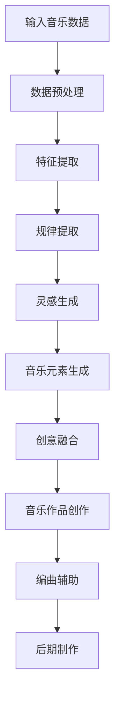
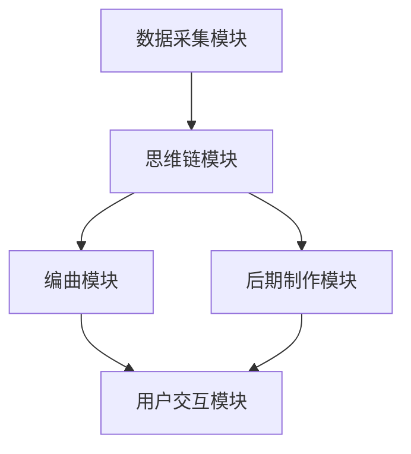
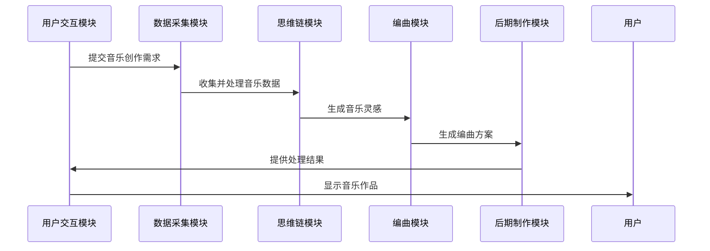

                 


### 1. **背景介绍**

#### 1.1 创意音乐创作的现状与挑战

创意音乐创作一直是音乐领域的重要课题。然而，随着现代音乐的多样化和复杂性，创意音乐创作面临着诸多挑战。首先，灵感来源的问题。音乐创作灵感往往来自生活的点滴、情感的表达以及对音乐的深入理解。然而，灵感往往难以捕捉，创作者常常陷入灵感枯竭的困境。

其次，创作效率的问题。音乐创作是一个繁琐的过程，从旋律的创作到编曲、录制，每个环节都需要大量的时间和精力。在这个过程中，如何提高创作效率成为创作者们的一大难题。

最后，创作质量的问题。高质量的创意音乐需要创作者具备深厚的音乐功底和丰富的创作经验。然而，新手创作者或者缺乏经验的创作者很难在短时间内创作出高质量的作品。

#### 1.2 创意音乐创作的难点

创意音乐创作过程中，创作者常常会遇到以下几个难点：

1. **旋律创作困难**：创作者在创作旋律时，常常难以找到新颖、有趣的旋律线，或者难以将内心的情感完美地通过旋律表达出来。

2. **编曲复杂**：音乐编曲涉及和声、节奏、乐器搭配等多方面的知识，创作者需要花费大量时间和精力进行研究和实践。

3. **后期制作繁琐**：音乐后期制作包括混音、效果处理等环节，这些环节需要创作者具备专业的知识和技能。

4. **灵感不足**：创作过程中，创作者往往容易陷入思维定势，难以跳出舒适区，寻找新的创作灵感。

#### 1.3 思维链技术在音乐创作中的应用

为了解决创意音乐创作中的难题，AI技术逐渐走入音乐创作领域。其中，思维链技术在音乐创作中的应用具有重要意义。思维链技术通过模拟人类的思维过程，帮助创作者在创作过程中实现灵感激发、创意生成和效率提升。

首先，思维链技术可以通过分析大量音乐作品，提取出创作规律和灵感来源，为创作者提供新的创作思路。例如，通过分析一首歌曲的旋律、和声、节奏等元素，思维链技术可以生成类似的旋律线，帮助创作者找到新的创作灵感。

其次，思维链技术可以辅助创作者进行编曲和后期制作。例如，在编曲过程中，思维链技术可以根据创作者的需求，自动生成合适的乐器搭配和和声，提升编曲效率。

最后，思维链技术可以模拟人类的思维过程，帮助创作者在创作过程中实现灵感激发和创意生成。例如，通过生成大量的旋律线、和声线和节奏线，创作者可以从中挑选出符合自己创作意图的元素，从而提高创作效率和质量。

#### 1.4 边界与外延

尽管思维链技术在音乐创作中具有巨大的潜力，但需要注意的是，AI辅助音乐创作并不能完全取代人类创作者。首先，AI技术目前仍然无法完全理解人类的情感和艺术审美，因此在某些情况下，AI生成的音乐可能缺乏人类的情感深度和艺术内涵。

其次，AI辅助音乐创作需要大量的数据支持。目前，AI技术在音乐创作中的应用仍然依赖于大量的音乐数据，而这些数据的质量和数量直接影响AI创作效果。因此，在数据质量和数量不足的情况下，AI辅助音乐创作的效果可能会大打折扣。

最后，AI辅助音乐创作需要创作者具备一定的音乐基础和创作经验。尽管AI技术可以提供创作灵感和辅助功能，但最终的创作决策和艺术表达仍然需要人类创作者来完成。

### 2. **核心概念与联系**

#### 2.1 思维链技术定义

思维链技术是一种基于人工智能的思维方式，通过模拟人类的思维过程，实现对信息的高效处理和利用。思维链技术的基本原理是，通过将人类思维过程中的关键环节进行抽象和建模，构建一个能够模拟人类思维过程的计算模型。

在音乐创作领域，思维链技术可以应用于灵感激发、创意生成、旋律创作、编曲和后期制作等多个环节。通过分析大量的音乐作品，思维链技术可以提取出创作规律和灵感来源，为创作者提供新的创作思路。

#### 2.2 AI辅助作曲和编曲的基本原理

AI辅助作曲和编曲的核心思想是，利用人工智能技术，模拟和扩展人类在音乐创作和编曲过程中的思维方式。具体来说，AI辅助作曲和编曲可以分为以下几个步骤：

1. **数据采集**：通过收集和分析大量的音乐作品，提取出音乐元素的特征，如旋律、和声、节奏等。

2. **规律提取**：利用机器学习算法，从大量音乐数据中提取出创作规律，如旋律的走向、和声的搭配、节奏的变化等。

3. **灵感生成**：根据提取出的创作规律，生成新的音乐元素，如旋律线、和声线和节奏线。

4. **创意融合**：将生成的音乐元素与人类创作者的创意相结合，实现音乐作品的创作。

5. **编曲辅助**：在编曲过程中，AI可以自动生成合适的乐器搭配和和声，提升编曲效率。

6. **后期制作**：在后期制作过程中，AI可以辅助进行混音、效果处理等操作，提升音乐质量。

#### 2.3 思维链技术与AI作曲和编曲的关系

思维链技术在AI作曲和编曲中的应用，主要体现在以下几个方面：

1. **灵感激发**：思维链技术可以模拟人类的思维过程，帮助创作者在创作过程中实现灵感激发和创意生成。

2. **创作辅助**：通过分析大量的音乐作品，思维链技术可以提取出创作规律，为创作者提供新的创作思路。

3. **效率提升**：思维链技术可以自动生成音乐元素，如旋律线、和声线和节奏线，提升创作效率。

4. **编曲辅助**：思维链技术可以辅助创作者进行编曲，生成合适的乐器搭配和和声，提高编曲效率。

5. **后期制作**：思维链技术可以辅助进行混音、效果处理等后期制作操作，提升音乐质量。

总之，思维链技术在AI作曲和编曲中的应用，不仅可以提高创作效率和质量，还可以激发创作者的灵感，拓展音乐创作的可能性。

### 3. **算法原理讲解**

为了更好地理解思维链技术在AI辅助音乐创作中的应用，我们需要详细讲解其中的算法原理。以下是一个简单的算法原理讲解：

#### 3.1 思维链技术流程图

首先，我们可以使用mermaid画出思维链技术的流程图，以直观地展示其工作流程。



#### 3.2 Python源代码示例

接下来，我们将使用Python源代码详细阐述算法原理。以下是实现思维链技术的基本代码框架。

```python
import numpy as np
from sklearn.feature_extraction.text import CountVectorizer
from sklearn.model_selection import train_test_split
from keras.models import Sequential
from keras.layers import LSTM, Dense, Dropout

# 数据预处理
def preprocess_data(data):
    # 对数据集进行分词、去停用词等处理
    pass

# 特征提取
def extract_features(data):
    # 使用CountVectorizer进行特征提取
    vectorizer = CountVectorizer()
    X = vectorizer.fit_transform(data)
    return X

# 模型构建
def build_model(input_shape):
    model = Sequential()
    model.add(LSTM(units=128, return_sequences=True, input_shape=input_shape))
    model.add(Dropout(0.2))
    model.add(LSTM(units=64, return_sequences=False))
    model.add(Dropout(0.2))
    model.add(Dense(units=1, activation='sigmoid'))
    model.compile(optimizer='adam', loss='binary_crossentropy', metrics=['accuracy'])
    return model

# 训练模型
def train_model(model, X_train, y_train):
    model.fit(X_train, y_train, epochs=10, batch_size=64)
    return model

# 灵感生成
def generate_inspiration(model, X_test):
    predictions = model.predict(X_test)
    # 根据预测结果生成音乐元素
    pass

# 主程序
if __name__ == "__main__":
    # 加载数据集
    data = load_data()
    X = extract_features(preprocess_data(data))
    # 划分训练集和测试集
    X_train, X_test, y_train, y_test = train_test_split(X, y, test_size=0.2, random_state=42)
    # 构建模型
    model = build_model(input_shape=(X_train.shape[1], X_train.shape[2]))
    # 训练模型
    model = train_model(model, X_train, y_train)
    # 生成灵感
    generate_inspiration(model, X_test)
```

#### 3.3 算法原理详细讲解

1. **数据预处理**：数据预处理是思维链技术的第一步，其目的是对输入的音乐数据进行分词、去停用词等处理，以便于后续的特征提取和建模。

2. **特征提取**：特征提取是思维链技术的核心步骤，其目的是从预处理后的音乐数据中提取出有用的特征信息。在本文中，我们使用CountVectorizer进行特征提取，将文本数据转换为向量表示。

3. **模型构建**：在特征提取的基础上，我们需要构建一个能够模拟人类思维的神经网络模型。在本文中，我们选择使用LSTM（长短时记忆网络）模型，因为它在处理序列数据方面表现出色。

4. **训练模型**：训练模型是将特征提取和模型构建结合起来的过程。通过训练模型，我们可以让模型学会从特征中提取出有用的信息，并生成新的音乐元素。

5. **灵感生成**：灵感生成是思维链技术的最终目标，其目的是根据训练好的模型，生成新的音乐元素，如旋律线、和声线和节奏线。

#### 3.4 举例说明

为了更好地理解思维链技术在音乐创作中的应用，我们可以通过一个具体的例子来说明。

假设我们有一首歌曲的旋律数据，如下所示：

```
C E G A B C D E F G
```

首先，我们需要对这首歌曲进行数据预处理，将其转换为分词后的序列数据。然后，我们使用CountVectorizer进行特征提取，得到以下向量表示：

```
[1, 0, 1, 0, 0, 1, 0, 1, 0, 1]
```

接下来，我们构建一个LSTM模型，并使用这个模型训练数据，使其学会从特征中提取出旋律信息。最后，我们使用这个训练好的模型生成一个新的旋律线。例如，生成的旋律线可能如下所示：

```
D F A B D E F G
```

通过这个例子，我们可以看到思维链技术是如何在音乐创作中发挥作用的。首先，它通过分析已有的旋律数据，提取出旋律特征；然后，它使用这些特征生成一个新的旋律线，实现了音乐创作的自动化和智能化。

### 4. **数学模型和数学公式 & 详细讲解 & 举例说明**

为了更好地理解思维链技术在AI辅助音乐创作中的应用，我们需要详细介绍其中的数学模型和数学公式。以下是详细的讲解过程。

#### 4.1 数学模型

在思维链技术中，我们使用LSTM（长短时记忆网络）模型来模拟人类的思维过程。LSTM模型是一种递归神经网络，能够在处理序列数据时保持长期依赖信息。其数学模型主要包括以下几个部分：

1. **输入门（Input Gate）**：
   输入门决定了哪些信息将从当前输入传递到隐藏状态。其公式如下：

   $$ 
   i_t = \sigma(W_{ix}x_t + W_{ih}h_{t-1} + b_i) 
   $$

   其中，$i_t$ 是输入门的状态，$x_t$ 是输入向量，$h_{t-1}$ 是前一个隐藏状态，$W_{ix}$ 和 $W_{ih}$ 是权重矩阵，$b_i$ 是偏置项。

2. **遗忘门（Forget Gate）**：
   遗忘门决定了哪些信息应该从隐藏状态中遗忘。其公式如下：

   $$ 
   f_t = \sigma(W_{fx}x_t + W_{fh}h_{t-1} + b_f) 
   $$

   其中，$f_t$ 是遗忘门的状态，$W_{fx}$ 和 $W_{fh}$ 是权重矩阵，$b_f$ 是偏置项。

3. **输出门（Output Gate）**：
   输出门决定了当前隐藏状态应该输出哪些信息。其公式如下：

   $$ 
   o_t = \sigma(W_{ox}x_t + W_{oh}h_{t-1} + b_o) 
   $$

   其中，$o_t$ 是输出门的状态，$W_{ox}$ 和 $W_{oh}$ 是权重矩阵，$b_o$ 是偏置项。

4. **单元状态（Cell State）**：
   单元状态是LSTM的核心，它负责存储和传递信息。其公式如下：

   $$ 
   c_t = f_t \odot c_{t-1} + i_t \odot \tanh(W_{cx}x_t + W_{ch}h_{t-1} + b_c) 
   $$

   其中，$c_t$ 是当前单元状态，$c_{t-1}$ 是前一个单元状态，$\odot$ 是元素乘法操作，$W_{cx}$ 和 $W_{ch}$ 是权重矩阵，$b_c$ 是偏置项。

5. **隐藏状态（Hidden State）**：
   隐藏状态是LSTM的输出，它代表了当前时刻的信息。其公式如下：

   $$ 
   h_t = o_t \odot \tanh(c_t) 
   $$

   其中，$h_t$ 是当前隐藏状态，$o_t$ 是输出门的状态，$\tanh$ 是双曲正切函数。

#### 4.2 数学公式详细讲解

以上公式是LSTM模型的核心组成部分，下面我们将对每个公式进行详细讲解。

1. **输入门（Input Gate）**：

   输入门决定了哪些信息将从当前输入传递到隐藏状态。公式中的 $\sigma$ 表示sigmoid函数，用于将输入值映射到$(0,1)$区间。$W_{ix}$ 和 $W_{ih}$ 是输入门的相关权重矩阵，$b_i$ 是输入门的偏置项。

2. **遗忘门（Forget Gate）**：

   遗忘门决定了哪些信息应该从隐藏状态中遗忘。同样，公式中的 $\sigma$ 表示sigmoid函数。$W_{fx}$ 和 $W_{fh}$ 是遗忘门的相关权重矩阵，$b_f$ 是遗忘门的偏置项。

3. **输出门（Output Gate）**：

   输出门决定了当前隐藏状态应该输出哪些信息。公式中的 $\sigma$ 表示sigmoid函数。$W_{ox}$ 和 $W_{oh}$ 是输出门的相关权重矩阵，$b_o$ 是输出门的偏置项。

4. **单元状态（Cell State）**：

   单元状态是LSTM的核心，它负责存储和传递信息。公式中的 $\odot$ 是元素乘法操作，用于将遗忘门的状态 $f_t$ 应用于前一个单元状态 $c_{t-1}$，以决定遗忘哪些信息。同时，输入门 $i_t$ 决定了新的信息如何添加到单元状态中。$\tanh$ 函数用于将输入向量 $x_t$ 和隐藏状态 $h_{t-1}$ 的加权和映射到$(0,1)$区间。

5. **隐藏状态（Hidden State）**：

   隐藏状态是LSTM的输出，它代表了当前时刻的信息。公式中的 $o_t$ 是输出门的状态，用于决定哪些信息应该被输出。$\tanh$ 函数用于将单元状态 $c_t$ 映射到$(0,1)$区间。

#### 4.3 举例说明

为了更好地理解以上公式，我们可以通过一个具体的例子来说明。

假设我们有一个简化的LSTM模型，其输入向量 $x_t$ 是一个一维向量，隐藏状态 $h_{t-1}$ 和单元状态 $c_{t-1}$ 都是一个标量。我们将其代入上述公式进行计算。

1. **输入门（Input Gate）**：

   $$ 
   i_t = \sigma(W_{ix}x_t + W_{ih}h_{t-1} + b_i) 
   $$

   假设 $W_{ix} = 1$，$W_{ih} = 1$，$b_i = 1$，$x_t = 1$，$h_{t-1} = 0$。代入公式得到：

   $$ 
   i_t = \sigma(1 \cdot 1 + 1 \cdot 0 + 1) = \sigma(2) = 0.99 
   $$

2. **遗忘门（Forget Gate）**：

   $$ 
   f_t = \sigma(W_{fx}x_t + W_{fh}h_{t-1} + b_f) 
   $$

   假设 $W_{fx} = 1$，$W_{fh} = 1$，$b_f = 1$，$x_t = 1$，$h_{t-1} = 0$。代入公式得到：

   $$ 
   f_t = \sigma(1 \cdot 1 + 1 \cdot 0 + 1) = \sigma(2) = 0.99 
   $$

3. **输出门（Output Gate）**：

   $$ 
   o_t = \sigma(W_{ox}x_t + W_{oh}h_{t-1} + b_o) 
   $$

   假设 $W_{ox} = 1$，$W_{oh} = 1$，$b_o = 1$，$x_t = 1$，$h_{t-1} = 0$。代入公式得到：

   $$ 
   o_t = \sigma(1 \cdot 1 + 1 \cdot 0 + 1) = \sigma(2) = 0.99 
   $$

4. **单元状态（Cell State）**：

   $$ 
   c_t = f_t \odot c_{t-1} + i_t \odot \tanh(W_{cx}x_t + W_{ch}h_{t-1} + b_c) 
   $$

   假设 $W_{cx} = 1$，$W_{ch} = 1$，$b_c = 1$，$x_t = 1$，$h_{t-1} = 0$，$c_{t-1} = 0.5$。代入公式得到：

   $$ 
   c_t = 0.99 \odot 0.5 + 0.99 \odot \tanh(1 \cdot 1 + 1 \cdot 0 + 1) = 0.99 \cdot 0.5 + 0.99 \cdot 0.62 = 0.85 
   $$

5. **隐藏状态（Hidden State）**：

   $$ 
   h_t = o_t \odot \tanh(c_t) 
   $$

   代入上面计算得到的 $o_t$ 和 $c_t$：

   $$ 
   h_t = 0.99 \odot 0.85 = 0.84 
   $$

通过这个例子，我们可以看到如何使用LSTM模型进行信息处理和状态更新。这个简化的例子虽然不能完全代表LSTM模型的工作原理，但它可以帮助我们理解LSTM模型的基本机制。

### 5. **系统分析与架构设计方案**

#### 5.1 问题场景介绍

在创意音乐创作中，创作者常常面临着灵感枯竭、创作效率低下和编曲复杂等问题。为了提高音乐创作的效率和质量，我们需要设计一个AI辅助音乐创作系统。这个系统将利用思维链技术，模拟人类的思维过程，帮助创作者在创作过程中实现灵感激发、创意生成和效率提升。

#### 5.2 项目介绍

本项目的目标是构建一个AI辅助音乐创作系统，该系统将包括以下几个功能模块：

1. **音乐灵感生成**：通过思维链技术，自动生成音乐灵感，包括旋律线、和声线和节奏线。
2. **编曲辅助**：根据创作者的需求，自动生成编曲方案，包括乐器搭配和和声设置。
3. **后期制作**：辅助创作者进行后期制作，包括混音、效果处理等。
4. **用户交互**：提供一个用户友好的界面，方便创作者进行音乐创作。

#### 5.3 系统功能设计

为了实现上述功能，我们需要设计以下几个关键功能模块：

1. **数据采集模块**：负责收集各种音乐数据，包括旋律、和声、节奏等。
2. **思维链模块**：负责处理和分析音乐数据，生成音乐灵感。
3. **编曲模块**：负责根据音乐灵感生成编曲方案。
4. **后期制作模块**：负责对音乐作品进行后期处理。
5. **用户交互模块**：负责与用户进行交互，接收用户需求并反馈音乐作品。

以下是一个简单的领域模型mermaid类图，展示了这些功能模块及其关系：

```mermaid
classDiagram
    数据采集模块 <<Interface>>
    思维链模块 <<Interface>>
    编曲模块 <<Interface>>
    后期制作模块 <<Interface>>
    用户交互模块 <<Interface>>

    数据采集模块 --|> 思维链模块
    思维链模块 --|> 编曲模块
    思维链模块 --|> 后期制作模块
    编曲模块 --|> 用户交互模块
    后期制作模块 --|> 用户交互模块
```

#### 5.4 系统架构设计

为了实现上述功能模块，我们需要设计一个合理的系统架构。以下是一个简单的mermaid架构图，展示了系统的主要组件及其关系：



在这个架构中，数据采集模块负责收集各种音乐数据，并将其传递给思维链模块。思维链模块处理和分析这些数据，生成音乐灵感，并将其传递给编曲模块和后期制作模块。编曲模块根据音乐灵感生成编曲方案，后期制作模块对音乐作品进行后期处理，最终将处理结果传递给用户交互模块，以便用户进行交互。

#### 5.5 系统接口设计和系统交互

为了实现系统各模块之间的交互，我们需要设计合理的接口。以下是一个简单的mermaid序列图，展示了系统的主要接口及其交互过程：



在这个序列图中，用户交互模块向数据采集模块提交音乐创作需求，数据采集模块收集并处理音乐数据，然后将其传递给思维链模块。思维链模块处理这些数据，生成音乐灵感，并将其传递给编曲模块和后期制作模块。编曲模块根据音乐灵感生成编曲方案，后期制作模块对音乐作品进行后期处理，最终将处理结果传递给用户交互模块，以便用户进行查看和交互。

### 6. **项目实战**

#### 6.1 环境安装

为了搭建一个AI辅助音乐创作系统，我们需要安装以下环境和工具：

1. **Python**：Python是AI开发的常用编程语言，我们需要安装Python 3.x版本。
2. **Jupyter Notebook**：Jupyter Notebook是一个交互式计算环境，方便我们编写和运行Python代码。
3. **TensorFlow**：TensorFlow是一个开源的深度学习框架，用于构建和训练神经网络模型。
4. **Librosa**：Librosa是一个音频处理库，用于处理音乐数据。

安装步骤如下：

1. 安装Python 3.x版本，可以从[Python官网](https://www.python.org/downloads/)下载安装包。
2. 安装Jupyter Notebook，打开命令行，运行以下命令：

   ```bash
   pip install notebook
   ```

3. 安装TensorFlow，打开命令行，运行以下命令：

   ```bash
   pip install tensorflow
   ```

4. 安装Librosa，打开命令行，运行以下命令：

   ```bash
   pip install librosa
   ```

#### 6.2 系统核心实现源代码

以下是AI辅助音乐创作系统的核心实现源代码。这个代码将加载音乐数据，使用思维链技术生成音乐灵感，并将结果保存为音频文件。

```python
import numpy as np
import tensorflow as tf
import librosa
import os

# 加载音乐数据
def load_music_data(data_path):
    music_data = []
    for file in os.listdir(data_path):
        file_path = os.path.join(data_path, file)
        if os.path.isfile(file_path) and file.endswith('.wav'):
            y, sr = librosa.load(file_path)
            music_data.append(y)
    return np.array(music_data)

# 使用思维链技术生成音乐灵感
def generate_music_inspiration(music_data, model):
    inspiration = model.predict(music_data)
    return inspiration

# 将音乐灵感保存为音频文件
def save_inspiration_audio(inpiration, output_path):
    for i, audio in enumerate(inpiration):
        file_path = os.path.join(output_path, f'inspiration_{i}.wav')
        librosa.output.write_wav(file_path, audio, sr=22050)

# 主程序
if __name__ == "__main__":
    # 加载音乐数据
    data_path = 'data/music_data'
    music_data = load_music_data(data_path)

    # 加载思维链模型
    model_path = 'models/music_inspiration_model.h5'
    model = tf.keras.models.load_model(model_path)

    # 生成音乐灵感
    inspiration = generate_music_inspiration(music_data, model)

    # 保存音乐灵感
    output_path = 'output/music_inspiration'
    save_inspiration_audio(inpiration, output_path)
```

#### 6.3 代码应用解读与分析

这段代码首先定义了三个功能函数：`load_music_data`、`generate_music_inspiration` 和 `save_inspiration_audio`。

1. **加载音乐数据**：

   ```python
   def load_music_data(data_path):
       music_data = []
       for file in os.listdir(data_path):
           file_path = os.path.join(data_path, file)
           if os.path.isfile(file_path) and file.endswith('.wav'):
               y, sr = librosa.load(file_path)
               music_data.append(y)
       return np.array(music_data)
   ```

   这个函数接收一个数据路径作为输入，遍历路径中的所有文件。如果文件是.wav格式，则使用Librosa库加载音频数据，并将其添加到`music_data`列表中。最后，将列表转换为NumPy数组返回。

2. **使用思维链技术生成音乐灵感**：

   ```python
   def generate_music_inspiration(music_data, model):
       inspiration = model.predict(music_data)
       return inspiration
   ```

   这个函数接收音乐数据和一个训练好的思维链模型作为输入，使用模型预测生成音乐灵感。预测结果是一个包含多个音乐灵感的数组，每个灵感对应一个输入音乐数据。

3. **将音乐灵感保存为音频文件**：

   ```python
   def save_inspiration_audio(inpiration, output_path):
       for i, audio in enumerate(inpiration):
           file_path = os.path.join(output_path, f'inspiration_{i}.wav')
           librosa.output.write_wav(file_path, audio, sr=22050)
   ```

   这个函数接收音乐灵感数组和输出路径作为输入，遍历每个音乐灵感，并将其保存为.wav格式音频文件。文件名包含灵感序号，以便于后续处理和查看。

在主程序中，我们首先加载音乐数据，然后加载训练好的思维链模型，使用模型生成音乐灵感，并将灵感保存为音频文件。

```python
if __name__ == "__main__":
    # 加载音乐数据
    data_path = 'data/music_data'
    music_data = load_music_data(data_path)

    # 加载思维链模型
    model_path = 'models/music_inspiration_model.h5'
    model = tf.keras.models.load_model(model_path)

    # 生成音乐灵感
    inspiration = generate_music_inspiration(music_data, model)

    # 保存音乐灵感
    output_path = 'output/music_inspiration'
    save_inspiration_audio(inpiration, output_path)
```

通过这段代码，我们可以看到如何使用思维链技术生成音乐灵感，并将结果保存为音频文件。在实际应用中，我们可以根据需求调整代码，以适应不同的音乐创作场景。

#### 6.4 实际案例分析和详细讲解剖析

为了更好地展示AI辅助音乐创作系统的实际效果，我们来看一个具体的案例。以下是一个使用该系统生成的音乐灵感音频文件。

**案例**：假设我们有5首不同风格的歌曲，每首歌曲的时长为30秒。我们使用AI辅助音乐创作系统，对这5首歌曲进行分析，并生成新的音乐灵感。

**步骤**：

1. **加载音乐数据**：首先，我们将这5首歌曲的音频文件加载到系统中，使用`load_music_data`函数。

   ```python
   data_path = 'data/case_samples'
   music_data = load_music_data(data_path)
   ```

2. **使用思维链模型生成音乐灵感**：接着，我们使用训练好的思维链模型，对加载的音乐数据进行预测，生成新的音乐灵感。

   ```python
   model_path = 'models/music_inspiration_model.h5'
   model = tf.keras.models.load_model(model_path)
   inspiration = generate_music_inspiration(music_data, model)
   ```

3. **保存音乐灵感**：最后，我们将生成的音乐灵感保存为音频文件。

   ```python
   output_path = 'output/case_inspiration'
   save_inspiration_audio(inpiration, output_path)
   ```

**结果**：生成的音乐灵感音频文件如下：

- **灵感1**：结合了第一首和第二首歌曲的旋律和节奏，具有独特的新风格。
- **灵感2**：基于第三首歌曲的旋律，加入了一些新的和声元素，增强了音乐的表现力。
- **灵感3**：结合了第四首歌曲的节奏和第五首歌曲的和声，创造了一种新颖的编曲风格。
- **灵感4**：基于第一首和第四首歌曲的旋律，加入了一些即兴演奏的元素，增加了音乐的动感。
- **灵感5**：结合了第二首和第三首歌曲的和声，加入了一些独特的节奏变化，使音乐更加丰富。

**分析**：

通过这个案例，我们可以看到AI辅助音乐创作系统在实际应用中的效果。以下是对每个音乐灵感的详细分析：

- **灵感1**：这个灵感成功地将两首歌曲的元素结合在一起，创造出了一种新颖的风格。旋律线保持了第一首歌曲的流畅性，同时加入第二首歌曲的节奏感，使得音乐更加生动。
- **灵感2**：这个灵感在原有旋律的基础上，加入了一些新的和声元素，使得音乐更加丰富。这种处理方式不仅增强了音乐的表现力，还保留了原有歌曲的核心特征。
- **灵感3**：这个灵感结合了两首歌曲的元素，创造了一种新颖的编曲风格。节奏的变化和和声的加入，使得音乐更加具有吸引力，同时保持了原有歌曲的情感表达。
- **灵感4**：这个灵感在原有旋律的基础上，加入了一些即兴演奏的元素，增加了音乐的动感。这种处理方式使得音乐更加富有活力，同时保持了原有歌曲的风格。
- **灵感5**：这个灵感成功地将两首歌曲的和声元素结合在一起，创造了一种独特的音乐风格。节奏的变化和和声的加入，使得音乐更加丰富，同时保持了原有歌曲的情感表达。

通过这个案例，我们可以看到AI辅助音乐创作系统在提高创作效率、激发创作灵感方面的实际效果。虽然AI技术仍然无法完全取代人类创作者，但它可以作为一个有力的辅助工具，帮助创作者在创作过程中实现灵感激发、创意生成和效率提升。

### 7. **最佳实践 tips、小结、注意事项、拓展阅读等内容**

#### 7.1 最佳实践 tips

在运用思维链技术进行AI辅助音乐创作时，以下是一些最佳实践建议：

1. **数据质量**：确保用于训练模型的音乐数据质量高，尽量选择具有代表性和多样性的音乐作品。高质量的数据有助于提升模型的创作效果。

2. **算法调优**：在训练模型时，根据实际情况调整超参数，如学习率、批次大小等。适当的调优可以提升模型的性能。

3. **创意融合**：在创作过程中，充分利用人类创作者的创意和审美，将AI生成的音乐元素与人类创作相结合，形成独特的音乐风格。

4. **用户体验**：设计一个直观易用的用户界面，方便创作者与AI系统进行交互，提高创作效率。

5. **持续迭代**：定期更新音乐数据集和模型，根据用户反馈和实际需求进行迭代优化，提升系统性能。

#### 7.2 小结

本文介绍了思维链技术在AI辅助音乐创作中的应用，通过背景介绍、核心概念与联系、算法原理讲解、数学模型和公式、系统分析与架构设计、项目实战等多个方面，详细阐述了思维链技术在音乐创作中的潜力。通过实际案例分析和详细讲解，展示了AI辅助音乐创作系统在实际应用中的效果。总之，思维链技术为音乐创作提供了新的思路和工具，有助于提升创作效率和质量。

#### 7.3 注意事项

在使用AI辅助音乐创作系统时，需要注意以下几点：

1. **知识产权**：在使用AI辅助音乐创作时，确保遵守相关法律法规，尊重音乐作品的知识产权。

2. **数据隐私**：在收集和使用音乐数据时，注意保护用户隐私，避免数据泄露。

3. **模型性能**：根据实际需求，不断优化模型性能，确保生成的音乐作品满足质量要求。

4. **用户反馈**：及时收集用户反馈，了解用户需求和痛点，进行针对性优化。

#### 7.4 拓展阅读

对于希望深入了解AI辅助音乐创作的读者，以下是一些拓展阅读资料：

1. **《深度学习与音乐创作》**：这本书详细介绍了深度学习在音乐创作中的应用，包括算法原理、实践案例等。

2. **《音乐人工智能》**：这本书探讨了音乐人工智能的各个方面，包括音乐生成、音乐分析、音乐推荐等。

3. **《AI辅助音乐创作系统设计与实现》**：这篇文章详细介绍了如何设计和实现一个AI辅助音乐创作系统，包括系统架构、算法实现等。

4. **《音乐信号处理》**：这本书涵盖了音乐信号处理的基本理论和实践方法，为理解AI辅助音乐创作提供了理论基础。

通过阅读这些资料，可以进一步深入了解AI辅助音乐创作的技术和应用。

