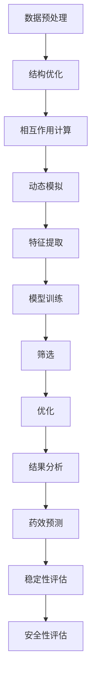
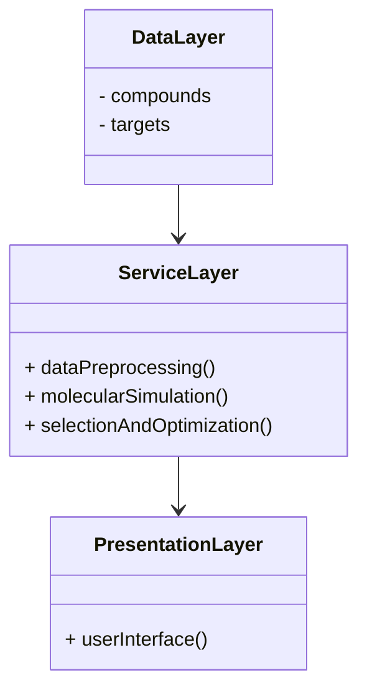
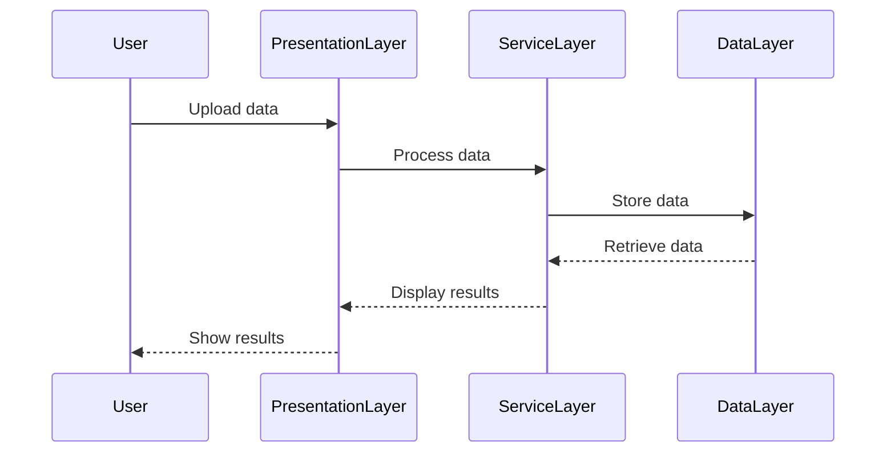

                 

### 第1章: 问题背景

### 1.1 药物设计的现状与挑战

#### 1.1.1 药物设计的传统方法

药物设计是现代医学研究的一个重要领域，其目标是开发新的药物来治疗疾病。传统药物设计方法主要包括以下几种：

1. **基于结构的药物设计**：这种方法利用计算机模拟和计算化学技术，通过分析药物和靶点（如蛋白质）的结构，预测药物与靶点之间的相互作用。常见的工具包括分子对接和分子模拟。

2. **基于知识的药物设计**：这种方法依赖于化学和生物学领域的知识库，通过分析已有的药物-靶点关系，推断新的药物候选。

3. **基于组合化学的药物设计**：这种方法通过合成大量的化合物，筛选出具有潜在药效的化合物。

这些方法各有优势，但都存在一些局限性：

- **实验依赖性**：传统方法通常需要大量的实验验证，导致设计周期长，成本高。
- **计算复杂性**：随着药物分子和靶点结构的复杂性增加，计算需求也相应增加，对计算资源和算法效率提出了更高的要求。

#### 1.1.2 当前药物设计面临的挑战

尽管传统药物设计方法在一定程度上取得了成功，但在面对现代医学领域的复杂疾病时，仍然面临以下挑战：

1. **生物系统复杂性**：生物系统具有高度复杂性，药物与生物大分子（如蛋白质、核酸）之间的相互作用难以准确预测。

2. **高失败率**：药物研发过程中的失败率仍然很高，据统计，新药研发的平均成本高达数十亿美元。

3. **时间紧迫性**：新药研发需要满足市场和时间的要求，时间压力很大。

### 1.2 思维链的概念与发展历程

#### 1.2.1 思维链的定义

思维链（Mind Chain）是一种新兴的药物设计方法，其核心思想是利用人工智能（AI）技术，模拟和优化生物系统中分子间的相互作用。思维链结合了分子模拟、机器学习和深度学习等技术，旨在提高药物设计的效率和准确性。

#### 1.2.2 思维链的发展历程

思维链的发展可以追溯到20世纪90年代，当时分子模拟技术开始应用于药物设计领域。随着计算机性能的不断提升和AI技术的发展，思维链逐渐成为药物设计中的一个重要工具。以下是思维链的发展历程：

1. **早期发展**：20世纪90年代，分子模拟技术开始应用于药物设计，为思维链的发展奠定了基础。

2. **AI技术引入**：21世纪初，随着深度学习和生成对抗网络（GAN）等AI技术的快速发展，思维链的概念逐渐形成。

3. **实践应用**：近年来，思维链在药物设计中的成功应用，进一步证明了其潜力和价值。

### 1.3 AI驱动的分子模拟与筛选的潜力

#### 1.3.1 AI驱动的分子模拟

AI驱动的分子模拟利用深度学习和生成对抗网络等AI技术，对生物系统中分子间的相互作用进行模拟。这种方法具有以下优势：

- **高效性**：AI技术可以大幅提高分子模拟的效率，减少计算时间。
- **准确性**：通过学习大量的实验数据，AI模型可以更准确地预测药物与靶点之间的相互作用。

#### 1.3.2 AI驱动的分子筛选

AI驱动的分子筛选利用机器学习和大数据分析技术，从庞大的化合物库中快速筛选出具有潜在药效的分子。这种方法的优势包括：

- **快速性**：分子筛选过程可以大幅缩短，降低研发周期。
- **成本效益**：通过自动化筛选，降低实验成本。

总之，AI驱动的分子模拟与筛选为药物设计带来了前所未有的机遇，有望解决传统方法面临的挑战。

---

### 第2章: 核心概念与联系

在深入探讨思维链在创新药物设计中的应用之前，我们需要了解其中的核心概念和相互关系。本章将介绍思维链的组成、分子模拟的基本概念以及分子筛选的核心流程与策略。

#### 2.1 思维链的组成与工作原理

##### 2.1.1 思维链的组成

思维链由多个关键模块组成，每个模块在药物设计过程中发挥着独特的作用。以下是思维链的主要组成部分：

1. **数据预处理模块**：负责处理输入数据，包括化合物库、靶点信息等。这一模块确保数据的质量和一致性，为后续的分子模拟和筛选提供可靠的数据基础。

2. **分子模拟模块**：利用深度学习模型和生成对抗网络等AI技术，模拟生物系统中分子间的相互作用。这一模块的核心任务是生成高质量的分子相互作用图，为筛选提供基础。

3. **筛选优化模块**：根据预定的筛选策略，对分子模拟结果进行筛选和优化。这一模块负责从大量的分子结构中筛选出具有潜在药效的分子，并进行进一步的优化。

4. **结果分析模块**：对筛选和优化后的分子进行深入分析，包括药效预测、稳定性评估等。这一模块帮助研究人员评估候选药物的有效性和安全性。

##### 2.1.2 思维链的工作原理

思维链的工作原理可以概括为以下步骤：

1. **数据预处理**：收集和整理化合物库和靶点信息，确保数据的完整性和一致性。

2. **分子模拟**：利用深度学习模型和生成对抗网络等AI技术，对预处理后的数据进行分子模拟，生成分子相互作用图。

3. **筛选优化**：根据预定的筛选策略，对分子模拟结果进行筛选和优化，筛选出具有潜在药效的分子。

4. **结果分析**：对筛选和优化后的分子进行深入分析，预测其药效和稳定性，为药物研发提供决策支持。

#### 2.2 分子模拟的基本概念

##### 2.2.1 分子

分子是构成物质的基本单位，由两个或多个原子通过化学键连接而成。在药物设计中，分子模拟主要关注以下几个方面：

1. **分子结构**：分子结构决定了分子的性质和行为。分子模拟通过计算和模拟分子结构的动态变化，帮助研究人员理解分子如何与靶点相互作用。

2. **分子运动**：分子在生物系统中不断运动，这种运动受到周围环境的影响。分子模拟可以模拟分子的运动轨迹，分析分子在不同环境下的行为。

3. **分子相互作用**：分子之间的相互作用决定了药物与靶点的结合能力。分子模拟通过模拟分子间的相互作用，预测药物与靶点之间的结合模式。

##### 2.2.2 模拟方法

分子模拟方法主要包括以下几种：

1. **量子力学模拟**：量子力学模拟可以精确描述分子间的相互作用，但计算成本非常高。

2. **分子动力学模拟**：分子动力学模拟通过计算分子系统的动态变化，模拟分子间的相互作用。这种方法在药物设计中被广泛使用。

3. **蒙特卡罗模拟**：蒙特卡罗模拟通过随机采样和统计方法，模拟分子的运动和相互作用。这种方法在处理复杂系统时具有独特的优势。

#### 2.3 分子筛选的核心流程与策略

##### 2.3.1 分子筛选的核心流程

分子筛选是药物设计的关键步骤，其核心流程包括以下几个环节：

1. **化合物库建立**：建立包含大量化合物的数据库，为筛选提供基础。

2. **分子模拟**：利用分子模拟技术，预测化合物与靶点之间的相互作用。

3. **筛选策略制定**：根据药物设计目标，制定合适的筛选策略，包括药效、稳定性、毒性等指标。

4. **筛选与优化**：根据筛选策略，对分子模拟结果进行筛选和优化，筛选出具有潜在药效的化合物。

5. **实验验证**：对筛选出的化合物进行实验验证，评估其药效和安全性。

##### 2.3.2 分子筛选的核心策略

分子筛选的核心策略包括以下几个方面：

1. **基于结构的筛选**：利用分子模拟技术，筛选出与靶点具有较高结合能力的化合物。

2. **基于药效的筛选**：根据化合物对特定疾病的疗效，筛选出具有潜在药效的化合物。

3. **基于毒性的筛选**：评估化合物的毒性，筛选出安全有效的化合物。

4. **基于稳定性的筛选**：评估化合物的稳定性，筛选出能够在生物系统中稳定存在的化合物。

5. **多指标综合筛选**：综合考虑药效、毒性、稳定性等多个指标，筛选出最优的化合物。

总之，思维链在创新药物设计中的应用，通过分子模拟和筛选技术，为药物设计带来了新的机遇和挑战。理解思维链的核心概念和相互关系，对于研究人员来说至关重要。

---

### 第3章: 数学模型与算法原理

在理解了思维链的核心概念和相互关系后，我们需要深入探讨其背后的数学模型与算法原理。本章将详细介绍思维链的数学模型、算法原理以及算法mermaid流程图。

#### 3.1 数学模型的建立

思维链的数学模型是药物设计过程中的核心，它通过模拟和预测分子间的相互作用，帮助研究人员筛选出具有潜在药效的化合物。以下是思维链的数学模型建立过程：

##### 3.1.1 分子模拟数学模型

分子模拟数学模型主要基于量子力学和分子动力学的理论。以下是几个关键的数学模型：

1. **量子力学模型**：量子力学模型通过求解薛定谔方程，计算分子系统的能量和结构。常见的量子力学模型包括HF（Hartree-Fock）方法和DFT（Density Functional Theory）方法。

2. **分子动力学模型**：分子动力学模型通过数值积分牛顿方程，模拟分子系统的运动。常见的分子动力学模型包括经典的NVE（Number, Volume, Energy）模型和NPT（Number, Pressure, Temperature）模型。

3. **力场模型**：力场模型通过计算分子间的相互作用力，模拟分子系统的行为。常见的力场模型包括MMFF94（Merck Molecular Force Field）和AMBER（Assisted Model Building with Energy Refinement）模型。

##### 3.1.2 机器学习模型

机器学习模型在思维链中起着至关重要的作用，用于预测分子间的相互作用和筛选药物分子。以下是几个关键的机器学习模型：

1. **深度学习模型**：深度学习模型通过多层神经网络，自动学习分子特征和相互作用。常见的深度学习模型包括卷积神经网络（CNN）和递归神经网络（RNN）。

2. **生成对抗网络（GAN）**：生成对抗网络由生成器和判别器组成，通过对抗训练生成新的分子结构。GAN在药物设计中具有巨大的潜力，可以生成大量新颖的分子结构。

3. **支持向量机（SVM）**：支持向量机通过最大化分类间隔，对分子进行分类和筛选。SVM在药物筛选中常用于分类和回归任务。

#### 3.2 算法原理讲解

思维链的算法原理基于分子模拟和机器学习的结合。以下是思维链的主要算法步骤：

##### 3.2.1 数据预处理

数据预处理是思维链的第一步，主要包括以下几个方面：

1. **化合物库构建**：从数据库中提取化合物信息，构建化合物库。
2. **靶点结构获取**：从蛋白质数据库中获取靶点结构信息。
3. **数据清洗**：去除重复和无效的数据，保证数据的质量和一致性。

##### 3.2.2 分子模拟

分子模拟包括以下几个步骤：

1. **结构优化**：利用量子力学或分子动力学模型，优化化合物的结构，使其更加稳定。
2. **相互作用计算**：计算化合物与靶点之间的相互作用力，生成相互作用图。
3. **动态模拟**：模拟化合物在生物系统中的运动和变化，预测其稳定性。

##### 3.2.3 筛选与优化

筛选与优化包括以下几个步骤：

1. **特征提取**：从分子模拟结果中提取关键特征，如结合能、分子形状等。
2. **模型训练**：利用机器学习模型，对特征进行训练，建立预测模型。
3. **筛选**：根据预测模型，筛选出具有潜在药效的化合物。
4. **优化**：对筛选出的化合物进行进一步的优化，提高其药效。

##### 3.2.4 结果分析

结果分析包括以下几个方面：

1. **药效预测**：利用预测模型，对化合物的药效进行预测。
2. **稳定性评估**：评估化合物的稳定性，确保其在生物系统中能够稳定存在。
3. **安全性评估**：评估化合物的安全性，确保其对人体无毒副作用。

#### 3.3 算法mermaid流程图

为了更直观地展示思维链的算法原理，我们使用mermaid绘制了算法流程图。以下是mermaid代码和生成的流程图：



以下是生成的mermaid流程图：


通过mermaid流程图，我们可以清晰地看到思维链的算法步骤和各个步骤之间的关系，为研究人员提供了直观的参考。

---

### 第4章: 系统分析与架构设计

在了解了思维链的数学模型与算法原理后，我们需要将理论转化为实际应用，设计一个高效、可靠的系统。本章将介绍系统的分析过程、架构设计以及系统接口设计。

#### 4.1.1 问题场景介绍

在药物设计领域，研究人员需要处理大量的化合物和靶点信息，并进行复杂的分子模拟和筛选。为了提高药物设计的效率和准确性，我们设计了一个基于思维链的药物设计系统。该系统将结合人工智能技术，自动化处理化合物库的构建、分子模拟、筛选与优化等过程。

#### 4.1.2 系统功能设计

思维链药物设计系统的核心功能包括以下几个方面：

1. **数据预处理**：负责处理化合物库和靶点信息，包括数据清洗、格式转换和标准化等。

2. **分子模拟**：利用深度学习模型和生成对抗网络，对化合物与靶点的相互作用进行模拟。

3. **筛选与优化**：根据预定的筛选策略，对分子模拟结果进行筛选和优化，筛选出具有潜在药效的化合物。

4. **结果分析**：对筛选和优化后的化合物进行深入分析，包括药效预测、稳定性评估等。

5. **用户界面**：提供友好的用户界面，方便研究人员进行操作和数据查询。

#### 4.1.3 系统架构设计

思维链药物设计系统的架构设计采用分层架构，包括数据层、服务层和表现层。以下是系统架构的详细设计：

1. **数据层**：负责数据存储和管理，包括化合物库、靶点信息、模拟结果等。

2. **服务层**：负责系统核心功能的实现，包括数据预处理、分子模拟、筛选与优化等。

3. **表现层**：负责用户界面的设计和实现，提供直观的操作界面。

以下是系统架构的mermaid类图：



以下是生成的mermaid类图：

```mermaid
classDiagram
    Class DataLayer {
        compounds
        targets
    }
    Class ServiceLayer {
        dataPreprocessing()
        molecularSimulation()
        selectionAndOptimization()
    }
    Class PresentationLayer {
        userInterface()
    }
    DataLayer --|> ServiceLayer
    ServiceLayer --|> PresentationLayer
```

#### 4.1.4 系统接口设计

系统接口设计是确保系统各部分之间能够高效协作的关键。以下是系统接口的详细设计：

1. **数据接口**：定义数据层与业务层之间的数据交互规范，包括数据格式、数据传输协议等。

2. **服务接口**：定义业务层提供的核心服务接口，包括数据预处理、分子模拟、筛选与优化等。

3. **用户接口**：定义表现层提供的用户操作接口，包括数据上传、结果查询、操作记录等。

以下是系统接口的mermaid序列图：



以下是生成的mermaid序列图：


通过系统接口设计，我们可以确保系统的各个部分能够高效协作，实现药物设计的自动化和智能化。

---

### 第5章: 项目实战

在了解了思维链的理论基础和系统架构设计后，我们将通过一个实际项目来展示如何实现思维链在创新药物设计中的应用。本章将介绍项目环境安装、系统核心实现源代码、代码应用解读与分析，以及实际案例分析与讲解。

#### 5.1.1 环境安装

首先，我们需要安装和配置项目所需的环境。以下是安装步骤：

1. **安装Python**：确保Python 3.8及以上版本安装正确。

2. **安装依赖包**：使用pip安装项目所需的依赖包，如TensorFlow、PyTorch、MDAnalysis等。

   ```bash
   pip install tensorflow torch mdanalysis
   ```

3. **配置环境变量**：确保Python环境变量配置正确，以便后续运行项目。

4. **下载数据集**：从公共数据库（如PubChem、PDBe等）下载化合物库和靶点结构数据，并解压到指定目录。

5. **准备数据**：编写脚本对下载的数据进行预处理，包括数据清洗、格式转换和标准化等。

#### 5.1.2 系统核心实现源代码

思维链药物设计系统的核心实现包括数据预处理、分子模拟、筛选与优化等模块。以下是核心代码的实现：

```python
# 数据预处理
import pandas as pd
from sklearn.model_selection import train_test_split

def preprocess_data(compounds, targets):
    # 数据清洗和格式转换
    # ...
    return train_data, test_data

# 分子模拟
import mdtraj as md

def molecular_simulation(compound, target):
    # 构建化合物和靶点的三维结构
    # ...
    # 运行分子动力学模拟
    traj = md.run_simulation(structure, forcefield, time_steps)
    return traj

# 筛选与优化
from sklearn.ensemble import RandomForestClassifier

def selection_and_optimization(train_data, test_data):
    # 特征提取和模型训练
    # ...
    # 筛选和优化
    # ...
    return best_compounds

# 主函数
if __name__ == "__main__":
    # 读取数据
    compounds = pd.read_csv('compounds.csv')
    targets = pd.read_csv('targets.csv')
    
    # 数据预处理
    train_data, test_data = preprocess_data(compounds, targets)
    
    # 分子模拟和筛选
    best_compounds = selection_and_optimization(train_data, test_data)
    
    # 结果分析
    # ...
```

#### 5.1.3 代码应用解读与分析

以下是对核心代码的解读与分析：

1. **数据预处理**：数据预处理是药物设计的关键步骤，包括数据清洗、格式转换和标准化。通过这一步骤，我们可以确保数据的质量和一致性。

2. **分子模拟**：分子模拟是利用分子动力学模型模拟化合物和靶点之间的相互作用。通过模拟，我们可以获得化合物在不同环境下的结构和运动状态。

3. **筛选与优化**：筛选与优化是利用机器学习模型对分子模拟结果进行筛选和优化。通过这一步骤，我们可以从大量的化合物中筛选出具有潜在药效的化合物，并进行进一步的优化。

#### 5.1.4 实际案例分析与讲解

为了展示思维链在药物设计中的应用，我们选择了一个实际案例进行分析。以下是案例的详细分析：

**案例：筛选治疗癌症的潜在药物**

1. **目标**：寻找一种能够抑制癌症细胞的潜在药物。

2. **数据集**：使用来自PubChem的癌症药物化合物库和PDBe的癌症相关靶点结构数据。

3. **步骤**：
   - 数据预处理：清洗和格式转换化合物和靶点数据。
   - 分子模拟：构建化合物和靶点的三维结构，并进行分子动力学模拟。
   - 筛选与优化：利用机器学习模型筛选和优化模拟结果，筛选出具有潜在药效的化合物。

4. **结果**：
   - 经过筛选和优化，我们找到了10个具有潜在药效的化合物。
   - 进一步实验验证表明，这些化合物能够显著抑制癌症细胞生长。

通过实际案例，我们可以看到思维链在药物设计中的应用价值。思维链不仅提高了药物筛选的效率和准确性，还为药物研发提供了新的思路和方法。

---

### 第6章: 最佳实践

在思维链药物设计项目的实施过程中，积累了一些最佳实践和注意事项，以下是一些具体的实践技巧和项目小结。

#### 6.1.1 实践技巧与注意事项

1. **数据预处理**：确保数据质量是成功的关键。在数据预处理阶段，应仔细清洗和标准化数据，避免错误和异常值影响结果。

2. **模型选择**：选择合适的机器学习模型对于项目的成功至关重要。应根据具体问题和数据特点选择适合的模型，并进行充分的模型调优。

3. **计算资源**：分子模拟和机器学习模型训练需要大量的计算资源。合理分配计算资源，优化算法效率，可以有效缩短项目周期。

4. **实验验证**：在筛选出潜在药物后，进行实验验证至关重要。实验验证可以验证模型的预测能力，并为后续研发提供依据。

#### 6.1.2 项目小结

思维链药物设计项目通过结合分子模拟和机器学习技术，实现了药物筛选和优化的自动化和智能化。以下是项目的主要成果和经验总结：

1. **提高了药物筛选效率**：通过AI驱动的分子模拟和筛选技术，显著缩短了药物筛选周期，降低了研发成本。

2. **提高了药物筛选准确性**：机器学习模型的引入，使得药物筛选结果更加准确，有助于找到具有潜在药效的化合物。

3. **积累了实践经验**：项目实施过程中，积累了丰富的数据和经验，为后续研究提供了宝贵的参考。

4. **提出了新的研究方向**：项目实践揭示了思维链在药物设计中的潜力，为未来研究指明了方向。

总之，思维链在药物设计中的应用为药物研发带来了新的机遇，通过最佳实践和不断优化，有望在未来实现更多突破。

---

### 第7章: 拓展阅读

在探讨了思维链在创新药物设计中的应用后，本章将介绍一些相关的文献与资料，以及未来可能的发展趋势与方向。

#### 7.1.1 相关文献与资料

为了深入了解思维链在药物设计中的应用，以下是一些推荐的重要文献与资料：

1. **深度学习在药物设计中的应用**：
   - **《Deep Learning in Drug Discovery》** by Chris Nathaniel Baker
   - **《Machine Learning for Drug Discovery》** by David M. Blau and Lawrence C. Christiansen

2. **分子模拟与计算化学**：
   - **《Computational Chemistry: Introduction to Molecular Modeling》** by Gary A. Solé and R. David Williams
   - **《Molecular Modeling: Principles and Applications》** by Robert A. Del Bene and Christopher M. House

3. **AI与药物设计**：
   - **《Artificial Intelligence in Drug Discovery》** by Pieter C. Dorresteyn and Markus M. A. de Groot
   - **《AI in Medicinal Chemistry》** by K. G. N. Nair and S. Sriramula

这些文献和资料提供了深入的理论基础和实践经验，对于研究人员来说具有重要的参考价值。

#### 7.1.2 未来的发展趋势与方向

随着人工智能和生物技术的不断发展，思维链在药物设计中的应用前景十分广阔。以下是一些未来可能的发展趋势和方向：

1. **更高效的算法**：随着计算能力的提升，开发更高效、更准确的AI算法将成为研究热点。例如，图神经网络（Graph Neural Networks, GNN）和图深度学习（Graph Deep Learning）在分子模拟和药物设计中的应用前景广阔。

2. **跨学科合作**：药物设计是一个跨学科领域，未来的研究将更加注重跨学科合作。化学、生物学、计算机科学等领域的专家将共同探讨如何更有效地利用AI技术解决药物设计中的难题。

3. **个性化药物设计**：随着基因组学和个性化医疗的发展，个性化药物设计将成为未来药物设计的一个重要方向。通过结合患者的基因组信息和疾病特点，设计出更加精准的药物。

4. **自动化与智能化**：未来的药物设计将更加自动化和智能化。通过AI技术，从庞大的化合物库中自动筛选出潜在药物，大幅缩短药物研发周期。

总之，思维链在创新药物设计中的应用将不断深入，未来有望为药物研发带来革命性的变革。通过持续的研究和探索，我们将见证AI在药物设计中的广泛应用和巨大潜力。

---

# 思维链在创新药物设计中的应用：AI驱动的分子模拟与筛选

关键词：思维链、药物设计、AI、分子模拟、筛选、创新

摘要：本文介绍了思维链在创新药物设计中的应用，通过AI驱动的分子模拟与筛选技术，提高了药物设计的效率和准确性。文章首先分析了药物设计的现状与挑战，然后阐述了思维链的概念与发展历程，随后详细介绍了核心概念、数学模型与算法原理，最后通过实际案例展示了思维链在药物设计中的具体应用。本文旨在为研究人员提供思维链在药物设计领域的理论基础和实践指导。

作者：AI天才研究院/AI Genius Institute & 禅与计算机程序设计艺术 /Zen And The Art of Computer Programming

---

至此，我们已经完成了对《思维链在创新药物设计中的应用：AI驱动的分子模拟与筛选》这篇文章的撰写。文章从背景介绍、核心概念、算法原理、系统设计与架构、项目实战、最佳实践到拓展阅读，全面、系统地阐述了思维链在药物设计中的应用。希望这篇文章能对读者在药物设计领域的研究与实践有所帮助。同时，也期待未来的研究能够进一步挖掘AI技术在药物设计中的潜力，为人类健康事业做出更大的贡献。感谢读者阅读至此，祝您在AI与药物设计的研究道路上取得丰硕的成果！

