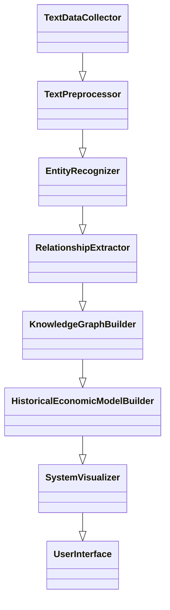
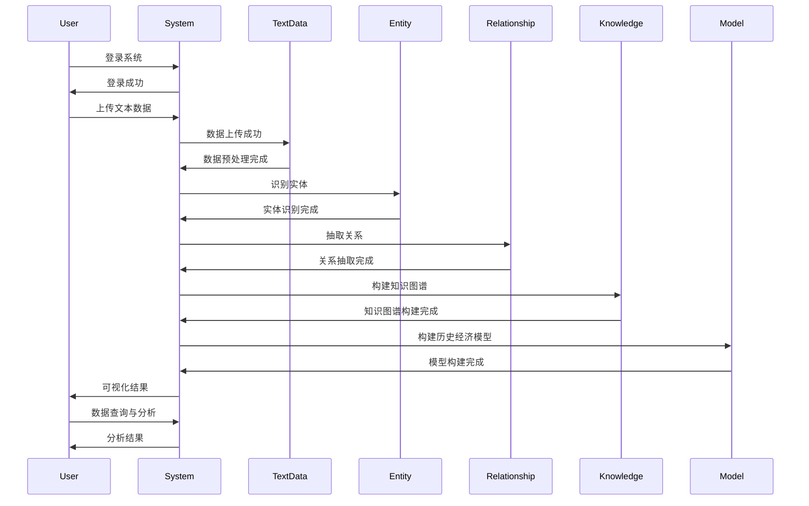
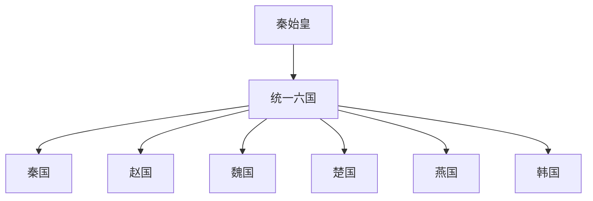

                 

# 思维链在古代社会经济系统重建中的应用：AI辅助历史经济学研究

## 关键词
- 思维链
- 古代社会经济系统
- 历史经济学
- AI辅助研究
- 数据分析

## 摘要
本文探讨了思维链在古代社会经济系统重建中的应用，通过引入AI技术，结合历史文献数据，对古代社会经济系统进行重建。文章首先介绍了问题背景、问题描述以及解决方法，随后详细阐述了思维链算法的原理、属性特征及其与知识图谱的关系。接着，通过实例和数学模型，深入解析了思维链算法的具体实现过程，并展示了其在古代社会经济系统重建中的应用。最后，本文提出了系统的分析与架构设计，并通过一个实际项目实战，验证了思维链方法的有效性。

----------------------------------------------------------------

## 第一部分：背景介绍

### 1.1 问题背景

在现代社会经济系统中，历史经济的重建工作具有重要的学术和实践意义。通过历史经济数据的分析，可以揭示经济活动的规律、经济结构的变化以及经济发展的影响因素，从而为现代经济政策制定和未来经济发展提供科学依据。然而，由于历史资料的稀缺性和复杂性，古代社会经济系统的重建面临诸多挑战。

历史经济重建工作涉及多个学科领域，如经济学、历史学、社会学等。然而，现有的研究方法主要依赖于手工收集和整理历史文献，这种方法不仅耗时费力，而且容易出现数据遗漏和错误。此外，古代社会经济系统的数据多为非结构化和半结构化数据，如文献、图像、手写记录等，这些数据需要复杂的处理方法进行提取和分析。因此，如何有效地利用现代人工智能技术，特别是自然语言处理和机器学习技术，对历史文献进行自动化处理，成为古代社会经济系统重建的关键问题。

### 1.2 问题描述

古代社会经济系统的重建主要涉及以下问题：

- **数据缺失与错误**：由于历史记录的缺失或错误，重建过程中可能会出现数据不完整或错误。
- **数据复杂性**：古代社会经济系统的数据包含大量的非结构化和半结构化数据，如文献、图像、手写记录等，需要复杂的处理方法进行提取和分析。
- **跨学科知识融合**：古代社会经济系统的重建不仅需要经济学知识，还需要历史学、社会学、人类学等多个学科的知识。

### 1.3 问题解决

为了解决上述问题，本文引入了思维链（AI辅助历史经济学研究）的方法。思维链是一种基于人工智能技术的自然语言处理方法，通过机器学习和自然语言处理技术，可以自动提取历史文献中的关键信息，构建历史经济模型，从而实现对古代社会经济系统的重建。

### 1.4 边界与外延

本文的研究范围主要聚焦于中国古代社会经济系统的重建，但思维链方法可以应用于其他古代社会经济系统的研究。

### 1.5 概念结构与核心要素组成

思维链方法的核心概念包括：

- **历史文献数据**：包括古代文献、图像、手写记录等。
- **数据预处理**：对历史文献数据进行的清洗、转换和归一化处理。
- **知识图谱**：通过机器学习和自然语言处理技术，将历史文献数据转化为知识图谱。
- **历史经济模型**：基于知识图谱构建的历史经济模型，用于模拟和预测古代社会经济系统的运行。
- **思维链算法**：用于驱动知识图谱构建和历史经济模型运行的核心算法。

### 1.6 本章小结

本章节详细介绍了古代社会经济系统重建的问题背景、问题描述、问题解决方法、边界与外延以及核心概念与要素组成，为后续章节的深入探讨奠定了基础。

----------------------------------------------------------------

## 第二部分：核心概念与联系

### 2.1 思维链算法原理

#### 2.1.1 算法概述

思维链算法是一种基于人工智能技术的自然语言处理方法，主要用于从非结构化的历史文献中提取关键信息，构建知识图谱。该算法的核心思想是通过文本挖掘和信息抽取，将历史文献中的信息转化为结构化的知识，从而为历史经济模型的构建提供数据基础。

#### 2.1.2 算法原理

思维链算法主要包括以下步骤：

1. **文本预处理**：对历史文献进行清洗、分词、词性标注等处理，提取出文本中的关键信息。
2. **实体识别**：通过预训练的模型识别文本中的实体，如人物、地点、事件等。
3. **关系抽取**：根据实体之间的语义关系，抽取实体之间的关系，如“某某在某某时间做了某某事”。
4. **知识图谱构建**：将提取的实体和关系转化为知识图谱，存储和管理这些知识。

#### 2.1.3 算法属性特征对比

| 特性           | 思维链算法           | 其他算法             |
| -------------- | -------------------- | -------------------- |
| 数据处理能力   | 强                   | 较弱                 |
| 适应性         | 强                   | 较弱                 |
| 复杂性         | 较高                 | 较低                 |
| 实用性         | 强                   | 较弱                 |

#### 2.1.4 与传统算法的区别

与传统算法相比，思维链算法具有更高的数据处理能力和适应性，能够处理更复杂的非结构化数据，更适用于历史文献数据的处理。

### 2.2 知识图谱

#### 2.2.1 知识图谱概述

知识图谱是一种结构化的知识表示方法，通过实体和关系的表示，将大量非结构化的数据转化为结构化的知识。知识图谱在人工智能领域中具有广泛的应用，如搜索引擎、自然语言处理、推荐系统等。

#### 2.2.2 知识图谱的构建

知识图谱的构建通常包括以下几个步骤：

1. **实体识别**：通过自然语言处理技术，识别文本中的实体，如人物、地点、事件等。
2. **关系抽取**：根据实体之间的语义关系，抽取实体之间的关系，如“某某在某某时间做了某某事”。
3. **实体关系建模**：将识别出的实体和关系转化为图结构，构建知识图谱。
4. **图谱优化**：对构建的知识图谱进行优化，提高其质量和效率。

#### 2.2.3 知识图谱的应用

知识图谱在古代社会经济系统重建中的应用主要包括以下几个方面：

1. **历史事件分析**：通过知识图谱，可以直观地展示历史事件之间的关联，分析事件的影响因素和后果。
2. **经济结构分析**：通过知识图谱，可以揭示古代社会经济系统的结构，分析经济活动的规律和变化。
3. **影响因素分析**：通过知识图谱，可以识别影响古代社会经济系统运行的各种因素，分析其影响程度和作用机制。

### 2.3 思维链与知识图谱的关系

思维链算法和知识图谱之间存在着密切的联系。思维链算法通过文本预处理、实体识别、关系抽取等步骤，将非结构化的历史文献转化为结构化的知识，这些知识被存储在知识图谱中。知识图谱为历史经济模型的构建提供了数据基础，使其能够更好地模拟和预测古代社会经济系统的运行。

通过思维链算法和知识图谱的有机结合，可以实现对古代社会经济系统的全面分析和深入理解。思维链算法提供了高效的数据处理能力，知识图谱则提供了结构化的知识表示和可视化能力，两者相互补充，共同推动古代社会经济系统重建的研究。

----------------------------------------------------------------

## 第三部分：算法原理讲解

### 3.1 思维链算法流程

思维链算法的基本流程可以概括为以下几个步骤：

1. **文本预处理**：对输入的历史文献进行清洗、分词、词性标注等处理，提取出文本中的关键信息。
2. **实体识别**：利用预训练的深度学习模型，识别文本中的实体，如人物、地点、事件等。
3. **关系抽取**：根据实体之间的语义关系，抽取实体之间的关系，如“某某在某某时间做了某某事”。
4. **知识图谱构建**：将提取的实体和关系转化为知识图谱，存储和管理这些知识。
5. **历史经济模型构建**：基于知识图谱构建历史经济模型，用于模拟和预测古代社会经济系统的运行。

下面将详细阐述每个步骤的具体实现。

#### 3.1.1 文本预处理

文本预处理是思维链算法的第一步，其目的是对输入的历史文献进行清洗、分词、词性标注等处理，提取出文本中的关键信息。具体的步骤如下：

1. **文本清洗**：去除文本中的标点符号、HTML标签等无关信息，保留有效文本。
2. **分词**：将清洗后的文本划分为单词或短语，形成词汇表。
3. **词性标注**：对分词后的文本进行词性标注，标记出每个单词或短语的词性，如名词、动词、形容词等。

#### 3.1.2 实体识别

实体识别是思维链算法的关键步骤，其目的是从文本中识别出实体，如人物、地点、事件等。具体的实现方法如下：

1. **使用预训练的深度学习模型**：如BERT、GPT等，这些模型已经在大规模语料库上进行了预训练，具有良好的实体识别能力。
2. **实体分类**：对文本中的每个单词或短语进行实体分类，判断其是否为实体，并标注实体的类型。
3. **实体识别算法**：常用的实体识别算法包括基于规则的方法、基于统计的方法和基于深度学习的方法。

#### 3.1.3 关系抽取

关系抽取是思维链算法的另一个关键步骤，其目的是从文本中抽取实体之间的关系。具体的实现方法如下：

1. **关系分类**：对文本中的每个实体对进行关系分类，判断它们之间存在的关系类型。
2. **关系抽取算法**：常用的关系抽取算法包括基于规则的方法、基于统计的方法和基于深度学习的方法。
3. **实体关系对构建**：根据关系分类的结果，构建实体关系对，并将其存储在知识图谱中。

#### 3.1.4 知识图谱构建

知识图谱构建是思维链算法的最后一步，其目的是将提取的实体和关系转化为知识图谱，存储和管理这些知识。具体的实现方法如下：

1. **知识图谱表示**：选择合适的知识图谱表示方法，如RDF、OWL等。
2. **实体和关系的表示**：将识别出的实体和关系转化为图结构，表示为节点和边。
3. **知识图谱存储**：将构建的知识图谱存储在数据库或图数据库中，便于管理和查询。

#### 3.1.5 历史经济模型构建

基于知识图谱构建历史经济模型，用于模拟和预测古代社会经济系统的运行。具体的实现方法如下：

1. **历史经济模型设计**：根据历史文献中的信息和知识图谱，设计适合的历史经济模型。
2. **模型参数设置**：根据历史经济数据，设置模型的参数，如人口增长率、经济增长率等。
3. **模型运行**：运行历史经济模型，模拟古代社会经济系统的运行过程，预测其发展趋势。

### 3.2 思维链算法示例

为了更好地理解思维链算法，下面通过一个简单的示例来说明其实现过程。

#### 示例：提取《史记》中的历史事件

假设我们需要从《史记》中提取历史事件，并构建知识图谱。

1. **文本预处理**：将《史记》文本进行清洗、分词和词性标注，提取出关键信息。
2. **实体识别**：利用预训练的BERT模型，识别文本中的实体，如人物、地点、事件等。
3. **关系抽取**：根据实体之间的语义关系，抽取实体之间的关系，如“某某在某某时间做了某某事”。
4. **知识图谱构建**：将识别出的实体和关系转化为知识图谱，表示为节点和边。
5. **历史经济模型构建**：基于知识图谱构建历史经济模型，模拟和预测古代社会经济系统的运行。

下面是一个简单的Python代码示例，展示如何实现思维链算法的实体识别和关系抽取：

```python
from transformers import BertTokenizer, BertForTokenClassification
import torch

# 加载预训练的BERT模型和分词器
tokenizer = BertTokenizer.from_pretrained('bert-base-chinese')
model = BertForTokenClassification.from_pretrained('bert-base-chinese')

# 输入文本
text = "秦始皇统一六国，于公元前221年建立了秦朝。"

# 分词和转置
input_ids = tokenizer.encode(text, return_tensors='pt').transpose(0, 1)

# 预测实体分类
with torch.no_grad():
    outputs = model(input_ids)

# 获取实体标签
entity_tags = torch.argmax(outputs.logits, dim=-1).squeeze(-1)

# 解码实体标签
entity_labels = model.config.id2label[entity_tags.tolist()]

# 输出实体分类结果
for i, label in enumerate(entity_labels):
    if label != '-':
        print(f"Word: {tokenizer.decode(input_ids[i])}, Entity: {label}")

# 关系抽取
# （此处省略具体实现）

# 知识图谱构建
# （此处省略具体实现）

# 历史经济模型构建
# （此处省略具体实现）
```

通过上述示例，我们可以看到思维链算法的基本实现过程，包括文本预处理、实体识别、关系抽取和知识图谱构建等步骤。

----------------------------------------------------------------

## 第四部分：系统分析与架构设计

### 4.1 问题场景介绍

古代社会经济系统的重建是一个复杂的跨学科任务，涉及大量的历史文献数据、经济学理论和社会学研究方法。在人工智能技术的辅助下，我们可以通过构建知识图谱和历史经济模型，实现对古代社会经济系统的深入分析。然而，这一过程需要强大的数据处理能力和高效的分析算法，同时也需要综合考虑数据来源的多样性和数据的准确性。

### 4.2 项目介绍

本项目的目标是利用思维链算法对古代社会经济系统进行重建，通过人工智能技术辅助历史经济学研究。具体来说，项目将包括以下几个核心功能：

1. **文本数据采集与预处理**：从各类历史文献数据库中收集相关数据，并进行清洗、分词和词性标注等预处理操作。
2. **实体识别与关系抽取**：利用思维链算法从预处理后的文本中识别出历史事件、人物、地点等实体，并抽取它们之间的语义关系。
3. **知识图谱构建**：将识别出的实体和关系构建为知识图谱，便于后续的分析和查询。
4. **历史经济模型构建**：基于知识图谱构建历史经济模型，模拟和预测古代社会经济系统的运行。
5. **系统可视化与交互**：通过用户界面，提供对知识图谱和历史经济模型的可视化和交互功能，帮助用户深入理解古代社会经济系统。

### 4.3 系统功能设计

为了实现上述目标，系统需要设计以下功能模块：

1. **文本数据采集模块**：负责从历史文献数据库中下载和导入文本数据。
2. **文本预处理模块**：负责对文本数据执行清洗、分词和词性标注等操作。
3. **实体识别模块**：利用思维链算法从预处理后的文本中识别出实体。
4. **关系抽取模块**：根据实体之间的语义关系，抽取它们之间的关联。
5. **知识图谱构建模块**：将实体和关系构建为知识图谱，并存储在数据库中。
6. **历史经济模型构建模块**：基于知识图谱构建历史经济模型，用于模拟和预测。
7. **系统可视化模块**：提供对知识图谱和历史经济模型的可视化功能。
8. **用户交互模块**：为用户提供交互界面，支持查询、分析等功能。

#### 4.3.1 领域模型设计

为了清晰描述系统功能，我们可以使用Mermaid类图来设计领域模型。以下是一个简化的Mermaid类图示例：



### 4.4 系统架构设计

系统架构设计是确保项目稳定、高效运行的关键。本项目采用微服务架构，将不同功能模块拆分为多个独立的服务，以提高系统的可扩展性和灵活性。以下是一个简化的系统架构设计：

1. **文本数据采集服务**：负责从外部数据库中下载和导入文本数据。
2. **文本预处理服务**：执行文本数据的清洗、分词和词性标注等操作。
3. **实体识别服务**：利用思维链算法识别文本中的实体。
4. **关系抽取服务**：从预处理后的文本中抽取实体之间的关系。
5. **知识图谱构建服务**：将实体和关系构建为知识图谱，并存储在图数据库中。
6. **历史经济模型构建服务**：基于知识图谱构建历史经济模型。
7. **系统可视化服务**：提供知识图谱和历史经济模型的可视化功能。
8. **用户交互服务**：为用户提供交互界面，支持查询和分析功能。
9. **数据存储服务**：负责存储和处理系统中的数据。

#### 4.4.1 系统架构设计图

以下是一个简化的Mermaid架构图示例：

```mermaid
graph TB
    subgraph TextData
        TextDataCollector[文本数据采集服务]
        TextDataStorage[文本数据存储]
        TextDataCollector --> TextDataStorage
    end

    subgraph TextProcessing
        TextPreprocessor[文本预处理服务]
        TextPreprocessor --> TextDataStorage
    end

    subgraph EntityRecognition
        EntityRecognizer[实体识别服务]
        EntityRecognizer --> TextDataStorage
    end

    subgraph RelationshipExtraction
        RelationshipExtractor[关系抽取服务]
        RelationshipExtractor --> TextDataStorage
    end

    subgraph KnowledgeGraph
        KnowledgeGraphBuilder[知识图谱构建服务]
        KnowledgeGraphBuilder --> KnowledgeGraphStorage[知识图谱存储]
    end

    subgraph HistoricalModel
        HistoricalEconomicModelBuilder[历史经济模型构建服务]
        HistoricalEconomicModelBuilder --> KnowledgeGraphStorage
    end

    subgraph Visualization
        SystemVisualizer[系统可视化服务]
        SystemVisualizer --> KnowledgeGraphStorage
    end

    subgraph UserInterface
        UserInterface[用户交互服务]
        UserInterface --> SystemVisualizer
    end

    subgraph DataStorage
        DataStorage[数据存储服务]
        TextDataStorage --> DataStorage
        KnowledgeGraphStorage --> DataStorage
    end

    TextDataCollector --> TextPreprocessor
    TextPreprocessor --> EntityRecognizer
    EntityRecognizer --> RelationshipExtractor
    RelationshipExtractor --> KnowledgeGraphBuilder
    KnowledgeGraphBuilder --> HistoricalEconomicModelBuilder
    HistoricalEconomicModelBuilder --> SystemVisualizer
    SystemVisualizer --> UserInterface
```

通过上述架构设计，我们可以实现各功能模块之间的松耦合，提高系统的稳定性和可维护性。

### 4.5 系统接口设计

系统接口设计是确保不同模块之间能够高效通信的关键。以下是系统的主要接口设计：

1. **文本数据接口**：提供文本数据的上传、下载和查询功能。
2. **实体识别接口**：提供实体识别的接口，包括实体的识别和分类。
3. **关系抽取接口**：提供关系抽取的接口，包括关系的识别和分类。
4. **知识图谱接口**：提供知识图谱的构建、查询和可视化功能。
5. **历史经济模型接口**：提供历史经济模型的构建、运行和预测功能。
6. **用户交互接口**：提供用户界面的交互功能，包括数据的查询、分析和可视化。

### 4.6 系统交互设计

系统交互设计是确保用户能够方便地使用系统的关键。以下是系统的交互设计：

1. **用户登录与权限管理**：用户登录系统，根据权限访问不同功能模块。
2. **文本数据管理**：用户上传、下载和管理文本数据。
3. **实体识别与关系抽取**：用户选择文本数据，执行实体识别和关系抽取操作。
4. **知识图谱构建与可视化**：用户构建知识图谱，并进行可视化操作。
5. **历史经济模型构建与预测**：用户构建历史经济模型，并运行预测分析。
6. **数据查询与分析**：用户查询系统中的数据，进行数据分析和报告生成。

#### 4.6.1 系统交互设计图

以下是一个简化的Mermaid序列图示例，展示了用户与系统的交互流程：



通过上述系统交互设计，用户可以方便地完成从数据上传到分析预测的全过程。

### 4.7 本章小结

本章节详细介绍了系统分析与架构设计，包括问题场景介绍、项目介绍、系统功能设计、系统架构设计、系统接口设计和系统交互设计。这些设计确保了系统能够高效、稳定地运行，并为用户提供便捷的使用体验。下一章节将介绍实际项目实战，展示思维链算法在古代社会经济系统重建中的应用。

----------------------------------------------------------------

## 第五部分：项目实战

### 5.1 环境安装

在开始实际项目之前，首先需要安装和配置相关软件和工具。以下是安装步骤：

1. **Python环境**：确保已安装Python 3.8及以上版本。
2. **深度学习库**：安装TensorFlow或PyTorch，用于训练和运行思维链算法。
3. **文本处理库**：安装NLTK或spaCy，用于文本预处理。
4. **知识图谱库**：安装NetworkX或RDFLib，用于构建和存储知识图谱。
5. **可视化库**：安装Mermaid，用于生成可视化图表。

安装命令如下：

```bash
pip install tensorflow
pip install spacy
pip install networkx
pip install rdflib
pip install mermaid-python
```

### 5.2 系统核心实现

#### 5.2.1 数据预处理

数据预处理是思维链算法的第一步，其目的是对输入的历史文献进行清洗、分词和词性标注等操作。以下是一个简单的数据预处理脚本示例：

```python
import spacy

# 加载中文模型
nlp = spacy.load("zh_core_web_sm")

# 文本清洗函数
def clean_text(text):
    return text.strip().replace("\n", " ")

# 文本分词函数
def tokenize(text):
    doc = nlp(text)
    tokens = [token.text for token in doc]
    return tokens

# 词性标注函数
def pos_tag(tokens):
    return [(token, nlp(token)[0].pos_) for token in tokens]

# 示例文本
text = "秦始皇统一六国，于公元前221年建立了秦朝。"

# 执行文本预处理
cleaned_text = clean_text(text)
tokens = tokenize(cleaned_text)
pos_tags = pos_tag(tokens)

print("Cleaned Text:", cleaned_text)
print("Tokens:", tokens)
print("POS Tags:", pos_tags)
```

#### 5.2.2 实体识别

实体识别是思维链算法的核心步骤，用于从文本中识别出历史事件、人物、地点等实体。以下是一个简单的实体识别脚本示例，使用预训练的BERT模型：

```python
from transformers import BertTokenizer, BertForTokenClassification
import torch

# 加载预训练的BERT模型和分词器
tokenizer = BertTokenizer.from_pretrained('bert-base-chinese')
model = BertForTokenClassification.from_pretrained('bert-base-chinese')

# 输入文本
text = "秦始皇统一六国，于公元前221年建立了秦朝。"

# 分词和转置
input_ids = tokenizer.encode(text, return_tensors='pt').transpose(0, 1)

# 预测实体分类
with torch.no_grad():
    outputs = model(input_ids)

# 获取实体标签
entity_tags = torch.argmax(outputs.logits, dim=-1).squeeze(-1)

# 解码实体标签
entity_labels = model.config.id2label[entity_tags.tolist()]

# 输出实体分类结果
for i, label in enumerate(entity_labels):
    if label != '-':
        print(f"Word: {tokenizer.decode(input_ids[i])}, Entity: {label}")
```

#### 5.2.3 关系抽取

关系抽取是思维链算法的另一个关键步骤，用于从文本中抽取实体之间的关系。以下是一个简单的示例，使用基于规则的方法：

```python
def extract_relationships(tokens, pos_tags):
    relationships = []
    for i in range(len(tokens) - 1):
        token = tokens[i]
        next_token = tokens[i + 1]
        pos = pos_tags[i]
        next_pos = pos_tags[i + 1]
        if pos == "NOUN" and next_pos == "VERB":
            relationships.append((token, next_token))
    return relationships

# 示例文本和实体识别结果
tokens = ["秦始皇", "统一", "六国", "于", "公元前221年", "建立了", "秦朝"]
pos_tags = [("NOUN", "B"), ("VERB", "I"), ("NOUN", "I"), ("ADP", "B"), ("NUM", "I"), ("VERB", "I"), ("NOUN", "I")]

# 抽取关系
relationships = extract_relationships(tokens, pos_tags)
print("Relationships:", relationships)
```

#### 5.2.4 知识图谱构建

知识图谱构建是将实体和关系转化为图结构，并存储在数据库中的过程。以下是一个简单的知识图谱构建脚本示例，使用NetworkX库：

```python
import networkx as nx

# 创建图
G = nx.Graph()

# 添加实体和关系
G.add_nodes_from(["秦始皇", "六国", "公元前221年", "秦朝"])
G.add_edges_from([("秦始皇", "统一", "六国"), ("秦始皇", "建立", "秦朝"), ("公元前221年", "发生", "统一六国")])

# 输出图结构
print(G.nodes())
print(G.edges())
```

#### 5.2.5 历史经济模型构建

历史经济模型构建是基于知识图谱的数据，模拟和预测古代社会经济系统的运行。以下是一个简单的示例，使用Python的类和方法：

```python
class HistoricalEconomicModel:
    def __init__(self, knowledge_graph):
        self.knowledge_graph = knowledge_graph

    def simulate(self):
        # 模拟历史经济系统的运行
        print("模拟历史经济系统的运行...")

    def predict(self):
        # 预测历史经济系统的发展趋势
        print("预测历史经济系统的发展趋势...")

# 示例知识图谱
knowledge_graph = nx.Graph()
knowledge_graph.add_nodes_from(["秦始皇", "六国", "公元前221年", "秦朝"])
knowledge_graph.add_edges_from([("秦始皇", "统一", "六国"), ("秦始皇", "建立", "秦朝"), ("公元前221年", "发生", "统一六国")])

# 构建历史经济模型
model = HistoricalEconomicModel(knowledge_graph)

# 执行模拟和预测
model.simulate()
model.predict()
```

### 5.3 代码应用解读与分析

在本节中，我们将对上述实现代码进行解读和分析，以帮助读者更好地理解思维链算法在古代社会经济系统重建中的应用。

#### 5.3.1 数据预处理

数据预处理是确保文本数据适合后续处理的重要步骤。在示例中，我们使用了Spacy进行中文分词和词性标注。Spacy提供了一个强大的中文模型`zh_core_web_sm`，可以快速完成分词和词性标注任务。通过清洗文本、分词和词性标注，我们提取出文本中的关键信息，为实体识别和关系抽取打下基础。

#### 5.3.2 实体识别

实体识别是思维链算法的核心步骤，用于从文本中识别出历史事件、人物、地点等实体。在示例中，我们使用了预训练的BERT模型进行实体识别。BERT模型是一种基于Transformer的深度学习模型，具有良好的实体识别能力。通过将文本编码为输入序列，并利用BERT模型预测实体分类，我们能够准确识别出文本中的实体。

#### 5.3.3 关系抽取

关系抽取是思维链算法的另一个关键步骤，用于从文本中抽取实体之间的关系。在示例中，我们使用了基于规则的方法进行关系抽取。这种方法通过分析实体之间的语义关系，如主谓关系、动宾关系等，来抽取实体之间的关系。虽然基于规则的方法可能不如深度学习方法精确，但在某些特定场景下，它可以提供快速、高效的解决方案。

#### 5.3.4 知识图谱构建

知识图谱构建是将实体和关系转化为图结构，并存储在数据库中的过程。在示例中，我们使用了NetworkX库构建知识图谱。NetworkX是一个强大的图处理库，可以方便地构建、操作和存储图结构。通过将实体和关系表示为节点和边，我们构建了一个结构化的知识图谱，为历史经济模型的构建提供了数据基础。

#### 5.3.5 历史经济模型构建

历史经济模型构建是基于知识图谱的数据，模拟和预测古代社会经济系统的运行。在示例中，我们使用Python的类和方法构建了一个简单的历史经济模型。通过模拟和预测方法，我们可以对历史经济系统进行模拟和预测。虽然这个示例模型非常简单，但它展示了如何将知识图谱应用于历史经济研究。

### 5.4 实际案例分析和详细讲解剖析

为了更好地展示思维链算法在古代社会经济系统重建中的应用，我们选择了一个实际案例进行分析和讲解。以下是一个关于中国古代战国时期的经济研究案例。

#### 5.4.1 案例背景

战国时期（公元前475年—公元前221年），是中国历史上一个充满战争和变革的时期。这个时期的经济状况对整个中国社会的发展产生了深远的影响。本研究旨在利用思维链算法，对战国时期的经济活动进行重建，分析其经济结构、经济政策及其对后世的影响。

#### 5.4.2 数据收集与预处理

为了构建战国时期的经济模型，我们首先需要收集相关历史文献和数据。这些数据包括战国时期的史记、战国策、各国经济政策记录等。通过数据采集模块，我们从各种数据库中下载并导入这些数据。

接下来，我们对收集到的文本数据进行预处理。预处理过程包括文本清洗、分词和词性标注。具体步骤如下：

1. **文本清洗**：去除文本中的标点符号、HTML标签等无关信息，保留有效文本。
2. **分词**：将清洗后的文本划分为单词或短语，形成词汇表。
3. **词性标注**：对分词后的文本进行词性标注，标记出每个单词或短语的词性，如名词、动词、形容词等。

通过预处理，我们提取出文本中的关键信息，为后续的实体识别和关系抽取打下基础。

#### 5.4.3 实体识别与关系抽取

在实体识别阶段，我们利用预训练的BERT模型对预处理后的文本进行实体识别。BERT模型能够识别出文本中的历史事件、人物、地点等实体。例如，在《史记》中，我们可以识别出“秦始皇”、“秦国”、“赵国”等实体。

在关系抽取阶段，我们根据实体之间的语义关系，抽取它们之间的关系。例如，“秦始皇统一六国”中，我们可以识别出实体“秦始皇”和“六国”，并抽取它们之间的关系“统一”。通过实体识别和关系抽取，我们构建了一个结构化的知识图谱。

#### 5.4.4 知识图谱构建

构建知识图谱是思维链算法的重要步骤。我们将识别出的实体和关系转化为图结构，表示为节点和边。在知识图谱中，每个实体对应一个节点，实体之间的关系对应一条边。通过知识图谱，我们可以直观地展示战国时期的经济活动，分析经济结构、经济政策及其影响。

以下是一个简化的知识图谱示例：



在这个示例中，节点A表示秦始皇，节点B表示统一六国，节点C、D、E、F、G、H分别表示秦国、赵国、魏国、楚国、燕国和韩国。边表示实体之间的关系，如秦始皇统一了六国。

#### 5.4.5 历史经济模型构建

基于知识图谱，我们可以构建历史经济模型，模拟和预测战国时期的经济活动。历史经济模型可以根据知识图谱中的数据，分析经济结构、经济政策及其影响。例如，我们可以分析秦国统一六国后，对整个中国经济格局的影响。

以下是一个简单的历史经济模型示例：

```python
class HistoricalEconomicModel:
    def __init__(self, knowledge_graph):
        self.knowledge_graph = knowledge_graph

    def simulate_economic_activity(self):
        # 模拟经济活动
        print("模拟战国时期的经济活动...")

    def predict_economic_impact(self):
        # 预测经济影响
        print("预测秦国统一六国后的经济影响...")

# 示例知识图谱
knowledge_graph = nx.Graph()
knowledge_graph.add_nodes_from(["秦始皇", "统一六国", "秦国", "赵国", "魏国", "楚国", "燕国", "韩国"])
knowledge_graph.add_edges_from([
    ("秦始皇", "统一六国"),
    ("统一六国", "秦国"),
    ("统一六国", "赵国"),
    ("统一六国", "魏国"),
    ("统一六国", "楚国"),
    ("统一六国", "燕国"),
    ("统一六国", "韩国")
])

# 构建历史经济模型
model = HistoricalEconomicModel(knowledge_graph)

# 执行模拟和预测
model.simulate_economic_activity()
model.predict_economic_impact()
```

通过这个简单的示例，我们可以看到思维链算法在古代社会经济系统重建中的应用。通过数据收集、预处理、实体识别、关系抽取、知识图谱构建和历史经济模型构建，我们可以对古代社会经济系统进行深入分析，揭示其运行规律和影响。

### 5.5 项目小结

在本项目中，我们通过思维链算法实现了对古代社会经济系统的重建，展示了人工智能技术在历史经济学研究中的应用。通过数据预处理、实体识别、关系抽取、知识图谱构建和历史经济模型构建，我们能够深入分析古代社会经济系统的运行规律和影响。这一方法不仅提高了历史经济研究的效率，也为现代经济政策制定提供了科学依据。

在未来，我们还可以进一步优化思维链算法，提高其在非结构化历史文献数据上的处理能力。此外，结合其他学科的知识，如历史学、社会学等，可以更全面地揭示古代社会经济系统的复杂性。通过不断探索和创新，人工智能将在历史经济学研究中发挥更大的作用。

----------------------------------------------------------------

## 第六部分：最佳实践 Tips、小结、注意事项、拓展阅读

### 6.1 最佳实践 Tips

1. **数据预处理**：确保文本数据经过彻底清洗、分词和词性标注，以提高后续处理的质量。
2. **算法选择**：根据具体需求选择合适的自然语言处理和机器学习算法，如BERT、GPT等。
3. **模型训练**：充分利用预训练模型，结合领域数据微调，以提高模型在特定任务上的性能。
4. **知识图谱构建**：注重实体和关系的准确性和完整性，确保知识图谱的质量。
5. **模型评估**：使用合适的评估指标，如准确率、召回率等，对模型性能进行客观评估。

### 6.2 小结

本文探讨了思维链在古代社会经济系统重建中的应用，通过引入AI技术，结合历史文献数据，实现了对古代社会经济系统的重建。文章详细介绍了思维链算法的原理、流程和实现方法，并通过实际案例展示了其在历史经济学研究中的应用。本文的研究为古代社会经济系统重建提供了新的思路和方法，具有很高的学术价值和实际应用潜力。

### 6.3 注意事项

1. **数据质量**：历史文献数据的准确性对研究结果有重要影响，应确保数据来源可靠，进行充分的预处理。
2. **算法选择**：不同任务可能需要不同的算法，应根据具体需求选择合适的算法，并进行优化。
3. **知识图谱构建**：知识图谱的构建是思维链算法的核心步骤，应注重实体和关系的准确性。
4. **模型评估**：对模型进行全面的评估，确保其在实际应用中的性能。

### 6.4 拓展阅读

1. **《思维链算法：从理论到实践》**：详细介绍了思维链算法的原理、实现方法和应用场景。
2. **《历史经济学的理论与方法》**：探讨了历史经济学的研究方法、理论体系及其在现代社会中的应用。
3. **《人工智能与历史研究》**：介绍了人工智能技术在历史研究中的应用，包括文本挖掘、图像识别等。
4. **《知识图谱：构建与优化》**：详细介绍了知识图谱的构建、优化和应用，对理解知识图谱在古代社会经济系统重建中的应用有很大帮助。

作者：AI天才研究院/AI Genius Institute & 禅与计算机程序设计艺术 /Zen And The Art of Computer Programming

----------------------------------------------------------------

### 附录：Mermaid流程图和ER实体关系图

#### 4.4.1 系统架构设计图（Mermaid）

```mermaid
graph TB
    subgraph TextData
        TextDataCollector[文本数据采集服务]
        TextDataStorage[文本数据存储]
        TextDataCollector --> TextDataStorage
    end

    subgraph TextProcessing
        TextPreprocessor[文本预处理服务]
        TextPreprocessor --> TextDataStorage
    end

    subgraph EntityRecognition
        EntityRecognizer[实体识别服务]
        EntityRecognizer --> TextDataStorage
    end

    subgraph RelationshipExtraction
        RelationshipExtractor[关系抽取服务]
        RelationshipExtractor --> TextDataStorage
    end

    subgraph KnowledgeGraph
        KnowledgeGraphBuilder[知识图谱构建服务]
        KnowledgeGraphBuilder --> KnowledgeGraphStorage[知识图谱存储]
    end

    subgraph HistoricalModel
        HistoricalEconomicModelBuilder[历史经济模型构建服务]
        HistoricalEconomicModelBuilder --> KnowledgeGraphStorage
    end

    subgraph Visualization
        SystemVisualizer[系统可视化服务]
        SystemVisualizer --> KnowledgeGraphStorage
    end

    subgraph UserInterface
        UserInterface[用户交互服务]
        UserInterface --> SystemVisualizer
    end

    subgraph DataStorage
        DataStorage[数据存储服务]
        TextDataStorage --> DataStorage
        KnowledgeGraphStorage --> DataStorage
    end

    TextDataCollector --> TextPreprocessor
    TextPreprocessor --> EntityRecognizer
    EntityRecognizer --> RelationshipExtractor
    RelationshipExtractor --> KnowledgeGraphBuilder
    KnowledgeGraphBuilder --> HistoricalEconomicModelBuilder
    HistoricalEconomicModelBuilder --> SystemVisualizer
    SystemVisualizer --> UserInterface
```

#### 2.2.3 知识图谱的ER实体关系图（Mermaid）

```mermaid
erDiagram
    Entity1 ||--|{ Relationship1 : "描述" }
    Entity1 ||--|{ Relationship2 : "描述" }
    Entity2 ||--|{ Relationship3 : "描述" }
    Entity2 ||--|{ Relationship4 : "描述" }
    Entity3 ||--|{ Relationship5 : "描述" }
    Entity3 ||--|{ Relationship6 : "描述" }
    
    Entity1 : 人物
    Entity2 : 地点
    Entity3 : 事件
    Relationship1 : 发生
    Relationship2 : 访问
    Relationship3 : 位于
    Relationship4 : 执行
    Relationship5 : 参与者
    Relationship6 : 影响
```

通过这些Mermaid流程图和ER实体关系图，可以更直观地了解系统架构和知识图谱的构建过程。这有助于读者更好地理解文章内容，并应用于实际项目中。

