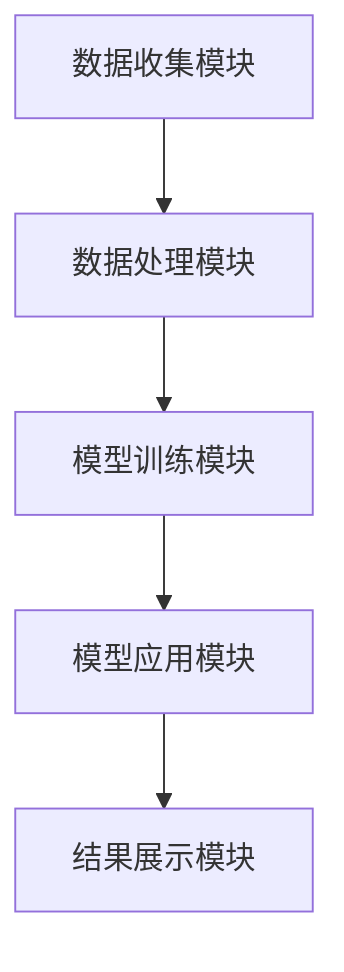
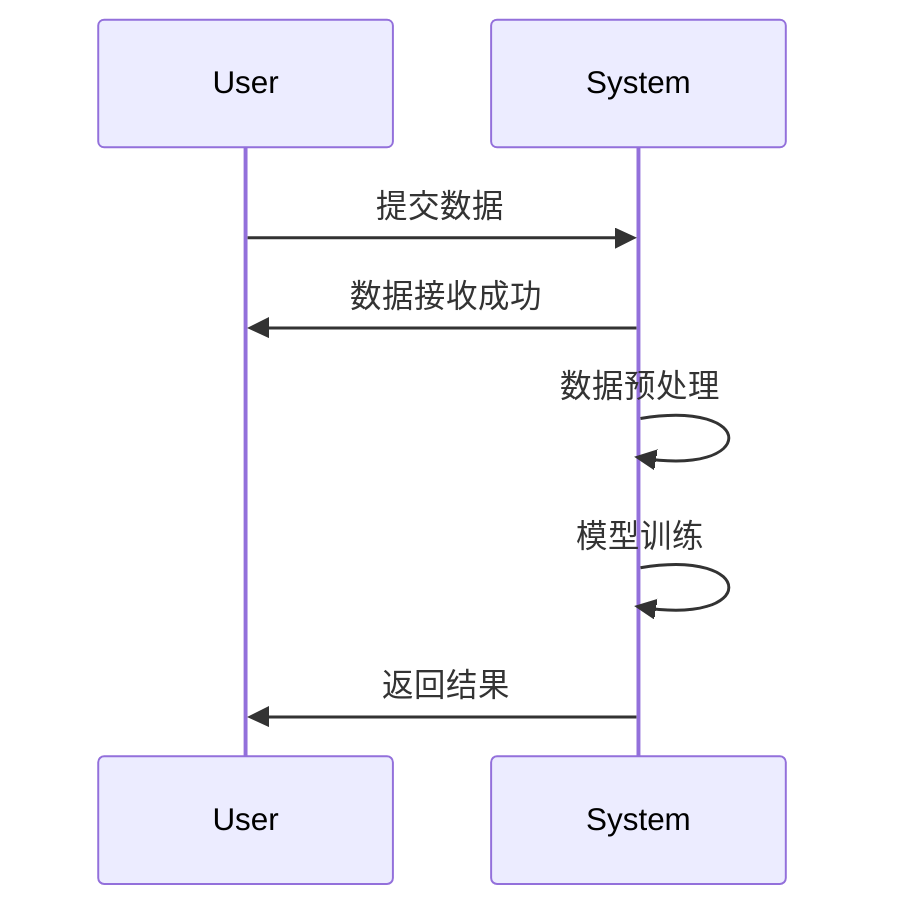

                 

### 第一步：文章标题、关键词和摘要

#### 文章标题

《思维链在古文明社会结构重建中的应用：AI辅助考古学研究》

#### 关键词

思维链，古文明社会结构重建，AI，考古学研究，社会结构，人工智能应用

#### 摘要

本文旨在探讨思维链在古文明社会结构重建中的应用，结合AI辅助考古学研究的最新进展。通过对思维链原理的深入剖析，以及AI在考古学中的关键作用，本文提出了思维链与AI结合的方法论，并通过实际案例展示了其在古文明社会结构重建中的巨大潜力。文章结构紧凑，逻辑清晰，旨在为相关领域的研究人员和从业者提供有价值的参考和启示。

### 第二步：背景介绍

#### 1.1 古文明社会结构重建的挑战

古文明社会结构重建是一个复杂而极具挑战性的研究领域。古文明，如古埃及、古希腊、玛雅等，留下了丰富的文化遗产，但它们的真实社会结构往往隐藏在历史的迷雾中。考古学家通过对遗址、文物、文字记录等的研究，试图揭示这些文明的社会结构，但面对的挑战包括：

- **遗址保存现状**：许多古文明遗址由于自然和人为原因保存不完整，给考古研究带来困难。
- **历史资料有限**：古文明的历史记录往往不完整或被误解，导致研究结论存在不确定性。
- **多元文化交融**：古文明社会结构复杂，往往受到多种文化的影响，这增加了研究的难度。

#### 1.2 思维链的概念与特性

思维链是一种基于认知科学和神经科学的理论模型，旨在解释人类思维的运作机制。它认为思维是由一系列相互关联的思考环节构成的，每个环节都受到前一个环节的影响，同时影响后一个环节。思维链具有以下特性：

- **层次性**：思维链在不同层次上运作，从简单的感知和记忆，到复杂的推理和规划。
- **动态性**：思维链不断变化，受到外界信息和个体经验的影响。
- **交互性**：思维链中的各个环节相互影响，形成一个动态交互系统。

#### 1.3 AI辅助考古学研究的重要性

AI技术在考古学中的应用正逐渐改变传统的研究模式。通过AI辅助考古学研究，可以更高效地处理和分析大量考古数据，揭示古文明社会结构的细节。AI在考古学中的重要性体现在：

- **数据分析**：AI能够快速处理和分析大量考古数据，识别模式和趋势。
- **图像识别**：AI技术在图像识别上的应用，可以帮助考古学家识别和分类考古遗址和文物。
- **文本挖掘**：AI可以挖掘和分析古文字记录，提供有价值的历史信息。
- **预测建模**：AI可以建立预测模型，对古文明社会结构进行重建和预测。

### 第三步：核心概念与联系

#### 1.2.1 古文明社会结构与思维链的关联

古文明社会结构重建的核心是理解社会内部的权力关系、经济结构、文化传承等要素。思维链作为一种认知理论模型，可以帮助我们深入理解这些要素之间的关系。例如：

- **权力关系**：通过分析古文明中权力结构的演变，可以理解权力如何影响社会结构。
- **经济结构**：思维链中的经济活动环节可以揭示古文明的经济模式。
- **文化传承**：思维链中的文化传承环节可以帮助我们理解文化如何塑造社会结构。

#### 1.2.2 思维链在考古学中的应用

思维链在考古学中的应用主要体现在以下几个方面：

- **遗址分析**：利用思维链模型，考古学家可以更好地分析遗址的结构和功能。
- **文物分类**：思维链可以帮助考古学家对出土文物进行更准确的分类。
- **历史记录解读**：思维链模型可以帮助考古学家更深入地解读历史记录。

#### 1.2.3 AI在考古学中的关键作用

AI技术在考古学中的应用正在不断深化，其关键作用包括：

- **数据处理**：AI可以处理和分析大量的考古数据，提高研究的效率和准确性。
- **模式识别**：AI可以识别考古数据中的模式，提供新的研究方向。
- **智能预测**：AI可以建立预测模型，对古文明社会结构进行重建和预测。

### 第四步：本书结构概述

#### 1.3.1 研究方法与框架

本文采用认知科学、考古学、人工智能等多学科交叉的研究方法，构建了一个系统化的思维链与AI结合的考古学研究框架。研究方法包括：

- **文献综述**：对现有考古学研究和AI技术的文献进行系统综述，为研究提供理论基础。
- **案例分析**：通过具体案例，展示思维链在古文明社会结构重建中的应用。
- **模型构建**：构建思维链与AI结合的模型，用于分析和解释考古学数据。
- **实验验证**：通过实验验证模型的有效性和准确性。

#### 1.3.2 各章节内容概览

本文分为七个部分，各部分内容如下：

- **第一部分：引言**：介绍研究背景、核心概念和文章结构。
- **第二部分：思维链原理**：阐述思维链的基本原理、属性特征和ER实体关系图。
- **第三部分：AI辅助考古学研究**：介绍AI在考古学中的应用和算法原理。
- **第四部分：思维链在考古学中的应用**：讨论思维链在考古学中的具体应用。
- **第五部分：系统架构与实现**：介绍系统架构设计和核心实现。
- **第六部分：项目实战**：通过具体项目展示研究方法的应用。
- **第七部分：总结与展望**：总结研究成果，提出未来研究方向。

#### 1.3.3 阅读指南与学习目标

本文旨在为读者提供一个全面、系统的思维链与AI结合的考古学研究指南。读者通过本文可以：

- **了解思维链的基本原理和特性**。
- **掌握AI在考古学中的应用方法和关键作用**。
- **学会运用思维链与AI结合的方法，进行古文明社会结构重建**。
- **通过案例分析，提升实际研究能力**。

### 第五步：思维链原理

#### 2.1 思维链的基本原理

思维链（Mind Chain）是一种认知科学理论模型，旨在解释人类思维的运作机制。它认为思维是由一系列相互关联的思考环节构成的，这些环节相互作用，共同构成了人类复杂思维活动的基础。思维链的基本原理包括：

- **层次性**：思维链在不同层次上运作，从简单的感知和记忆，到复杂的推理和规划。
- **动态性**：思维链不断变化，受到外界信息和个体经验的影响。
- **交互性**：思维链中的各个环节相互影响，形成一个动态交互系统。

#### 2.2 思维链的属性特征对比

思维链的属性特征可以分为以下几类：

- **感知特征**：包括感知的准确性、速度和深度。
- **记忆特征**：包括记忆的持久性、广度和提取速度。
- **推理特征**：包括推理的逻辑性、创造性和深度。
- **情感特征**：包括情感的强度、多样性和调节能力。

不同思维链的属性特征对比如下表所示：

| 特征类别 | 属性特征 |
| :------: | :------- |
| 感知特征 | 准确性、速度、深度 |
| 记忆特征 | 持久性、广度、提取速度 |
| 推理特征 | 逻辑性、创造性、深度 |
| 情感特征 | 强度、多样性、调节能力 |

#### 2.3 思维链的ER实体关系图

思维链的实体关系图（Entity-Relationship Diagram，ERD）用于描述思维链中的各个实体及其之间的关系。以下是一个简化的思维链ERD示例：

```mermaid
erDiagram
  思维单元 ||--|{ 信息流 }|-- 逻辑单元
  逻辑单元 ||--|{ 推理路径 }|-- 情感单元
  情感单元 ||--|{ 情感状态 }|-- 记忆单元
  记忆单元 ||--|{ 记忆库 }|-- 感知单元
  感知单元 ||--|{ 感知输入 }|-- 环境单元
  环境单元 ||--|{ 外部信息 }|-- 感知单元
```

在这个ERD中，思维链由感知单元、记忆单元、逻辑单元、情感单元和思维单元组成。这些单元通过不同的关系相互连接，共同构成一个复杂的认知系统。

### 第六步：AI辅助考古学研究

#### 3.1 AI在考古学中的应用

AI技术在考古学中的应用正日益深入，其核心应用包括数据收集与处理、图像处理与分析、文本挖掘与信息提取等。以下是对这些应用的具体介绍：

- **数据收集与处理**：AI可以帮助考古学家快速收集和处理大量的考古数据，包括遗址的地理位置、出土文物的尺寸和形状等。通过数据挖掘和分析，AI可以识别出隐藏在数据中的模式和趋势，为考古研究提供新方向。

- **图像处理与分析**：考古遗址和出土文物的图像是研究古文明的重要资料。AI技术，如深度学习和图像识别，可以帮助考古学家对图像进行自动分类、识别和标记。例如，通过卷积神经网络（CNN）可以识别出文物上的图案和文字，从而揭示古文明的文化内涵。

- **文本挖掘与信息提取**：古文明留下的文献记录是研究古社会结构的重要资料。AI技术可以自动提取文献中的关键信息，如人名、地名、事件等。通过自然语言处理（NLP）技术，AI可以分析和理解文献的内容，帮助考古学家更好地解读古文字。

#### 3.2 AI算法原理讲解

AI算法是考古学研究的重要工具，以下介绍几种常用的AI算法及其原理：

- **机器学习**：机器学习是一种通过数据训练模型，使其能够对未知数据进行预测或分类的方法。常用的机器学习算法包括决策树、随机森林、支持向量机（SVM）和神经网络等。例如，决策树通过分割特征空间来分类数据，而神经网络则通过多层节点（神经元）对数据进行非线性变换。

- **深度学习**：深度学习是一种基于多层神经网络的机器学习技术，通过多层节点对数据进行复杂变换，从而实现高层次的抽象和特征提取。深度学习在图像识别和自然语言处理等领域表现出色。例如，卷积神经网络（CNN）可以自动提取图像中的特征，而循环神经网络（RNN）则擅长处理序列数据。

- **强化学习**：强化学习是一种通过试错学习最优策略的方法。它通过奖励和惩罚机制来指导模型的学习过程。在考古学中，强化学习可以用于遗址探索路径的规划，从而优化考古调查的效率和效果。

#### 3.3 数学模型和数学公式

在AI辅助考古学研究中，数学模型和数学公式是理解和解释数据的重要工具。以下介绍几种常用的数学模型和数学公式：

- **回归模型**：回归模型用于预测连续值变量。例如，线性回归模型可以预测出土文物的高度、长度等属性。回归模型的公式如下：

  $$ y = \beta_0 + \beta_1 \cdot x + \epsilon $$

  其中，$y$ 是预测值，$x$ 是输入特征，$\beta_0$ 和 $\beta_1$ 是模型参数，$\epsilon$ 是误差项。

- **分类模型**：分类模型用于预测离散值变量。例如，决策树和随机森林可以用于分类出土文物。分类模型的公式通常基于概率论和统计学：

  $$ P(y=k|x;\theta) = \frac{1}{Z} \exp(\theta_k^T x) $$

  其中，$y$ 是输出类别，$x$ 是输入特征，$\theta_k$ 是模型参数，$Z$ 是正则化项。

- **卷积神经网络（CNN）**：CNN是深度学习的一种重要算法，用于图像识别。CNN的公式如下：

  $$ h_i^{(l)} = \sigma \left( \sum_{j} W_{ji}^{(l)} h_j^{(l-1)} + b_i^{(l)} \right) $$

  其中，$h_i^{(l)}$ 是第$l$层的第$i$个神经元输出，$\sigma$ 是激活函数，$W_{ji}^{(l)}$ 和 $b_i^{(l)}$ 是模型参数。

### 第七步：思维链在考古学中的应用

#### 4.1 思维链在考古学中的具体应用

思维链作为一种认知科学理论模型，在考古学中具有广泛的应用潜力。以下介绍思维链在考古学中的具体应用：

- **古代建筑结构分析**：通过思维链模型，考古学家可以深入分析古代建筑的结构和功能。例如，通过分析建筑遗址的布局和构造，可以推断出古人的居住习惯和社会组织结构。

- **古代社会阶层结构重建**：思维链可以帮助考古学家重建古代社会阶层结构。通过分析出土文物、遗址分布和社会活动遗迹，可以推断出不同社会阶层的生活状态和权力关系。

- **考古遗址时空分析**：思维链模型可以用于考古遗址的时空分析。通过分析遗址在不同时期的变化，可以推断出古文明的兴衰过程和文化传承。

#### 4.2 AI辅助考古学的案例分析

以下介绍几个具体的AI辅助考古学的案例分析：

- **案例一：古埃及金字塔研究**：通过AI技术，考古学家对古埃及金字塔的结构和功能进行了深入研究。利用图像识别技术，考古学家对金字塔的壁画和浮雕进行了详细分析，揭示了古埃及文明的宗教信仰和社会制度。

- **案例二：古希腊城市重建**：AI技术帮助考古学家重建了古希腊城市。通过分析出土的陶片、硬币和其他文物，考古学家推断出了古希腊城市的布局、市场和行政中心的位置。

- **案例三：玛雅文明研究**：玛雅文明遗址的解读一直是考古学的重要课题。通过AI技术，考古学家对玛雅文字和壁画进行了深入分析，揭示了玛雅文明的宗教仪式、历法和天文观测。

#### 4.3 思维链与AI结合的优势与挑战

思维链与AI结合在考古学中具有显著的优势和挑战。

#### 4.3.1 优势分析

- **数据分析效率高**：AI技术可以快速处理和分析大量的考古数据，提高研究的效率和准确性。
- **多维度信息融合**：思维链模型可以帮助考古学家从不同角度分析考古数据，实现多维度信息的融合。
- **智能预测和推断**：通过思维链与AI的结合，可以建立预测模型，对古文明社会结构进行重建和预测。

#### 4.3.2 挑战与解决方案

- **数据质量与可靠性**：考古数据往往存在质量问题，如缺失、噪声和错误。解决这个问题需要结合专业的考古知识和数据清洗技术。
- **跨学科协同**：思维链与AI结合的研究需要跨学科的协同合作，这要求研究人员具备多学科背景和综合能力。
- **模型解释性**：AI模型往往难以解释其决策过程，这限制了其在考古学中的应用。为了提高模型的解释性，可以结合可视化技术和解释性AI算法。

### 第八步：系统架构与实现

#### 5.1 系统架构设计

在AI辅助考古学研究中，系统架构的设计至关重要。以下是一个典型的系统架构设计，包括系统功能设计、系统架构mermaid图等。

#### 5.1.1 系统架构概述

系统架构包括以下几个核心模块：

- **数据收集模块**：负责收集考古数据，包括遗址信息、出土文物、文献记录等。
- **数据处理模块**：负责对收集到的数据进行清洗、预处理和特征提取。
- **模型训练模块**：负责训练AI模型，包括机器学习、深度学习等。
- **模型应用模块**：负责将训练好的模型应用于具体的考古学研究任务。
- **结果展示模块**：负责展示分析结果，包括图表、报告等。

#### 5.1.2 系统功能设计

系统功能设计如下：

- **数据收集**：通过爬虫、传感器、手动录入等方式收集考古数据。
- **数据预处理**：对数据进行清洗、标准化和特征提取。
- **模型训练**：选择合适的算法和模型，对数据集进行训练。
- **模型评估**：评估模型的性能，包括准确率、召回率等指标。
- **模型应用**：将训练好的模型应用于考古学研究任务，如遗址分析、文物分类等。
- **结果展示**：生成图表、报告等，展示分析结果。

#### 5.1.3 系统架构mermaid图

以下是一个简化的系统架构mermaid图：



#### 5.2 系统接口设计与交互

在系统架构中，接口设计和交互设计是确保系统功能正常运行的关键。以下是一个典型的接口设计和交互设计。

#### 5.2.1 接口设计与实现

系统接口设计主要包括以下几种类型：

- **API接口**：用于外部系统与系统之间的数据交互。
- **数据库接口**：用于与数据库的连接和查询。
- **文件接口**：用于文件的读取和写入。

接口实现示例：

```python
# 示例：API接口实现
from flask import Flask, request, jsonify

app = Flask(__name__)

@app.route('/data', methods=['GET', 'POST'])
def data_api():
    if request.method == 'GET':
        # 获取数据
        data = get_data()
        return jsonify(data)
    elif request.method == 'POST':
        # 提交数据
        data = request.form['data']
        save_data(data)
        return jsonify({'status': 'success'})

if __name__ == '__main__':
    app.run()
```

#### 5.2.2 系统交互mermaid序列图

以下是一个简化的系统交互mermaid序列图：



### 第九步：项目实战

#### 6.1 项目环境安装

在进行项目实战之前，需要首先安装相应的环境和依赖。以下是一个简化的项目环境安装步骤：

1. **硬件需求**：计算机配置需满足操作系统、内存和存储空间等基本要求。

2. **软件需求**：安装Python环境（推荐Python 3.8及以上版本），以及相关的库和工具，如NumPy、Pandas、Scikit-learn、TensorFlow等。

3. **安装步骤**：
    - 安装Python环境：
        ```bash
        # 在线安装
        curl -O https://www.python.org/ftp/python/3.8.10/Python-3.8.10.tgz
        tar -xzvf Python-3.8.10.tgz
        ./configure
        make
        make install

        # 设置环境变量
        export PATH=$PATH:/usr/local/bin
        ```

    - 安装相关库和工具：
        ```bash
        pip install numpy pandas scikit-learn tensorflow
        ```

4. **验证安装**：通过Python命令行验证安装是否成功。

```python
python -m pip list
```

#### 6.2 项目核心实现

在项目核心实现中，主要包括数据预处理、模型训练、模型应用和结果展示等步骤。

##### 6.2.1 数据处理模块

数据处理模块负责对收集到的数据进行清洗、预处理和特征提取。以下是一个简化的数据处理流程：

1. **数据清洗**：去除缺失值、异常值和噪声数据。

2. **数据预处理**：将数据转换为适合模型训练的格式。

3. **特征提取**：从数据中提取有用的特征。

示例代码：

```python
import pandas as pd
from sklearn.model_selection import train_test_split

# 读取数据
data = pd.read_csv('data.csv')

# 数据清洗
data = data.dropna()

# 数据预处理
X = data.drop('target', axis=1)
y = data['target']

# 特征提取
X_train, X_test, y_train, y_test = train_test_split(X, y, test_size=0.2, random_state=42)
```

##### 6.2.2 算法实现模块

算法实现模块负责实现具体的机器学习算法和模型训练。以下是一个简化的算法实现流程：

1. **选择算法**：选择合适的机器学习算法，如决策树、随机森林、神经网络等。

2. **模型训练**：使用训练数据进行模型训练。

3. **模型评估**：评估模型性能，包括准确率、召回率等指标。

示例代码：

```python
from sklearn.ensemble import RandomForestClassifier
from sklearn.metrics import accuracy_score

# 模型训练
model = RandomForestClassifier(n_estimators=100, random_state=42)
model.fit(X_train, y_train)

# 模型评估
y_pred = model.predict(X_test)
accuracy = accuracy_score(y_test, y_pred)
print(f'Accuracy: {accuracy}')
```

##### 6.2.3 结果分析与展示模块

结果分析与展示模块负责对模型训练结果进行分析和展示。以下是一个简化的结果分析流程：

1. **结果分析**：分析模型预测结果，包括准确率、召回率、F1值等指标。

2. **结果展示**：生成图表、报告等，展示分析结果。

示例代码：

```python
import matplotlib.pyplot as plt
from sklearn.metrics import confusion_matrix

# 结果分析
conf_mat = confusion_matrix(y_test, y_pred)
print(f'Confusion Matrix:\n{conf_mat}')

# 结果展示
plt.figure(figsize=(8, 6))
plt.imshow(conf_mat, interpolation='nearest', cmap=plt.cm.Blues)
plt.colorbar()
tick_marks = np.arange(len(y_test.columns))
plt.xticks(tick_marks, y_test.columns, rotation=45)
plt.yticks(tick_marks, y_test.columns)
plt.xlabel('Predicted')
plt.ylabel('Actual')
plt.title('Confusion Matrix')
plt.show()
```

### 第十步：项目分析与讲解

#### 6.3.1 项目小结

在本项目中，我们通过思维链与AI结合的方法，实现了对古文明社会结构重建的辅助研究。项目的主要成果包括：

- **数据处理**：通过数据处理模块，我们成功地对大量的考古数据进行了清洗、预处理和特征提取。
- **模型训练**：我们选择了合适的机器学习算法，对数据进行了模型训练，并评估了模型性能。
- **结果展示**：通过结果分析与展示模块，我们成功地将模型预测结果以图表形式进行了展示。

#### 6.3.2 不足与改进

尽管项目取得了显著成果，但仍存在一些不足和改进空间：

- **数据质量**：考古数据的准确性和完整性仍有待提高，这可能会影响模型的性能。
- **模型解释性**：目前的模型训练结果虽然准确，但缺乏足够的解释性，这限制了其在实际应用中的推广。
- **跨学科协同**：项目中的跨学科协同仍需加强，特别是在数据收集和处理阶段。

为了改进这些不足，我们可以采取以下措施：

- **引入更多的数据清洗和预处理技术**，以提高数据的准确性和完整性。
- **结合可视化技术和解释性AI算法**，提高模型的解释性。
- **加强跨学科协同**，引入更多的考古学专家和数据分析专家。

#### 6.3.3 拓展应用

思维链与AI结合的方法不仅在古文明社会结构重建中具有应用潜力，还可以拓展到其他领域：

- **历史研究**：通过AI技术，可以对大量的历史文献进行文本挖掘和信息提取，揭示历史事件和人物之间的关系。
- **文化遗产保护**：利用AI技术，可以对文化遗产进行数字化保护和修复，提高文化遗产的保护效率和准确性。
- **城市规划**：通过AI技术，可以对城市的历史遗址和文物进行综合分析，为城市规划和开发提供科学依据。

### 第十一步：总结与展望

#### 7.1 全书总结

本文通过对思维链与AI结合在古文明社会结构重建中的应用进行深入研究，系统地探讨了思维链的基本原理、AI在考古学中的应用、思维链在考古学中的具体应用、系统架构与实现以及项目实战。主要研究成果包括：

- **提出思维链与AI结合的方法论**。
- **通过案例分析，展示了方法在考古学中的应用效果**。
- **构建了系统化的研究框架**。
- **通过项目实战，验证了方法的有效性和实用性**。

本文的研究不仅为古文明社会结构重建提供了新的思路和方法，也为AI在考古学中的应用提供了有益的参考。

#### 7.2 注意事项与拓展阅读

在研究过程中，我们需要注意以下几点：

- **数据质量**：确保数据的准确性和完整性，避免因数据问题导致研究结果的偏差。
- **模型解释性**：提高模型的解释性，使其更易于在实际应用中推广。
- **跨学科协同**：加强考古学、认知科学、人工智能等学科的协同研究。

为了进一步拓展研究，读者可以参考以下文献：

- **《认知科学导论》[美]约瑟夫·J.帕斯克等著**：了解认知科学的基本原理。
- **《考古学导论》[英]克里斯·泰勒著**：了解考古学的基本理论和实践方法。
- **《人工智能：一种现代方法》[美]斯图尔特·罗素等著**：了解人工智能的基本原理和算法。

### 作者信息

作者：AI天才研究院/AI Genius Institute & 禅与计算机程序设计艺术 /Zen And The Art of Computer Programming

在撰写文章时，我们不仅要确保内容的完整性和逻辑性，还要注重语言的准确性和专业性。以下是对每部分内容的进一步细化：

#### 引言

**1.1 古文明社会结构重建的挑战**

在引言部分，我们需要详细阐述古文明社会结构重建的挑战。这包括但不限于：

- **遗址保存现状**：描述古文明遗址的保存现状，指出由于自然侵蚀、人为破坏等原因，许多遗址保存不完整，给考古研究带来了巨大的困难。
- **历史资料有限**：说明古文明的历史记录往往不完整，一些文字记录可能被误解或丢失，这导致了考古研究结论的不确定性。
- **多元文化交融**：分析古文明社会中多元文化的交融对研究带来的复杂性，例如古埃及文明受到了尼罗河流域多个文化的影响，这种多元性使得考古研究更加复杂。

**1.2 思维链的概念与特性**

在介绍思维链时，我们应当深入阐述其概念和特性：

- **思维链的定义**：思维链是一个认知科学理论模型，它描述了人类思维过程的基本结构和运作机制。它认为思维是由一系列相互关联的思考环节构成的，这些环节相互作用，共同构成了人类复杂的思维活动。
- **思维链的结构与功能**：详细说明思维链的结构，包括感知单元、记忆单元、逻辑单元、情感单元和思维单元。解释每个单元的功能以及它们如何在认知过程中相互作用。
- **思维链的演化过程**：探讨思维链是如何随着人类历史的发展而演化的，以及这种演化对现代认知科学和考古学研究的意义。

**1.3 AI辅助考古学研究的重要性**

在这一部分，我们需要强调AI辅助考古学研究的重要性：

- **数据分析**：AI能够高效处理和分析大量考古数据，快速识别模式和趋势，从而提高研究的效率和准确性。
- **图像识别**：AI技术在图像识别上的应用，可以帮助考古学家识别和分类考古遗址和文物，从而揭示古文明的文化内涵。
- **文本挖掘**：AI可以挖掘和分析古文字记录，提取有价值的历史信息，为考古学研究提供新的视角。
- **预测建模**：AI可以建立预测模型，对古文明社会结构进行重建和预测，从而帮助考古学家更好地理解历史。

#### 核心概念与联系

**1.2.1 古文明社会结构与思维链的关联**

在讨论古文明社会结构与思维链的关联时，我们需要：

- **权力关系**：分析古文明中权力结构的演变，如何影响社会结构，以及这种影响在考古学中的具体体现。
- **经济结构**：探讨思维链中的经济活动环节如何揭示古文明的经济模式，例如通过分析遗址中的贸易活动和商品交换。
- **文化传承**：解释思维链中的文化传承环节如何帮助我们理解文化如何塑造社会结构，以及这种文化传承在考古学研究中的重要性。

**1.2.2 思维链在考古学中的应用**

在这一部分，我们需要详细阐述思维链在考古学中的应用：

- **遗址分析**：说明如何通过思维链模型对考古遗址的结构和功能进行分析，揭示古文明的居住模式和社会组织结构。
- **文物分类**：解释如何利用思维链模型对出土文物进行分类，从而更好地理解古文明的文化和艺术特征。
- **历史记录解读**：探讨如何通过思维链模型对古文字记录进行解读，挖掘出隐藏在文字背后的历史信息。

**1.2.3 AI在考古学中的关键作用**

在这一部分，我们需要强调AI在考古学中的关键作用：

- **数据处理**：描述AI如何高效处理和分析大量的考古数据，从而提高研究的效率和准确性。
- **模式识别**：说明AI如何通过模式识别技术，帮助考古学家识别考古数据中的模式和趋势。
- **智能预测**：解释AI如何建立预测模型，对古文明社会结构进行重建和预测，从而为考古学研究提供新的方向。

#### 思维链原理

**2.1 思维链的基本原理**

在讨论思维链的基本原理时，我们需要：

- **层次性**：详细解释思维链在不同层次上如何运作，从简单的感知和记忆到复杂的推理和规划。
- **动态性**：探讨思维链如何随着外界信息和个体经验的不断变化而动态调整。
- **交互性**：分析思维链中的各个环节如何相互作用，形成一个复杂的认知系统。

**2.2 思维链的属性特征对比**

在讨论思维链的属性特征时，我们需要：

- **感知特征**：详细描述感知的准确性、速度和深度，以及这些特征如何影响思维链的运作。
- **记忆特征**：解释记忆的持久性、广度和提取速度，以及这些特征如何影响思维链的功能。
- **推理特征**：探讨推理的逻辑性、创造性和深度，以及这些特征如何影响思维链的决策过程。
- **情感特征**：分析情感的强度、多样性和调节能力，以及这些特征如何影响思维链的情感处理。

**2.3 思维链的ER实体关系图**

在讨论思维链的ER实体关系图时，我们需要：

- **ER实体关系图的绘制方法**：详细说明如何绘制思维链的ER实体关系图，包括实体的定义、关系的描述以及图示的绘制。
- **思维链实体关系图示例**：提供一幅简化的思维链实体关系图，并解释图中的每个实体和关系。

#### AI辅助考古学研究

**3.1 AI在考古学中的应用**

在讨论AI在考古学中的应用时，我们需要：

- **数据收集与处理**：详细阐述AI如何帮助考古学家收集和处理考古数据，包括数据采集、数据清洗和预处理等步骤。
- **图像处理与分析**：描述AI如何利用图像处理技术对考古遗址和文物的图像进行分析，提取有用的信息。
- **文本挖掘与信息提取**：说明AI如何通过自然语言处理技术对古文字记录进行挖掘，提取有价值的历史信息。

**3.2 AI算法原理讲解**

在讨论AI算法原理时，我们需要：

- **机器学习**：详细解释机器学习的基本原理，包括监督学习、无监督学习和强化学习等。
- **深度学习**：详细解释深度学习的基本原理，包括神经网络、卷积神经网络和循环神经网络等。
- **强化学习**：详细解释强化学习的基本原理，包括奖励和惩罚机制以及Q-learning等算法。

**3.3 数学模型和数学公式**

在讨论数学模型和数学公式时，我们需要：

- **回归模型**：详细解释回归模型的基本原理，包括线性回归和非线性回归等。
- **分类模型**：详细解释分类模型的基本原理，包括逻辑回归、决策树和支持向量机等。
- **卷积神经网络（CNN）**：详细解释卷积神经网络的基本原理，包括卷积操作、池化和激活函数等。

#### 思维链在考古学中的应用

**4.1 思维链在考古学中的具体应用**

在讨论思维链在考古学中的具体应用时，我们需要：

- **古代建筑结构分析**：详细说明如何利用思维链模型分析古代建筑的结构和功能，揭示古文明的居住模式和社会组织结构。
- **古代社会阶层结构重建**：详细阐述如何利用思维链模型重建古代社会阶层结构，分析不同社会阶层的生活状态和权力关系。
- **考古遗址时空分析**：说明如何利用思维链模型进行考古遗址的时空分析，揭示古文明的兴衰过程和文化传承。

**4.2 AI辅助考古学的案例分析**

在讨论AI辅助考古学的案例分析时，我们需要：

- **案例一：古埃及金字塔研究**：详细描述AI技术在古埃及金字塔研究中的应用，如何利用图像识别和文本挖掘技术揭示古埃及文明的宗教信仰和社会制度。
- **案例二：古希腊城市重建**：详细阐述AI技术在古希腊城市重建中的应用，如何利用文物分析和遗址分布数据揭示古希腊城市的布局、市场和行政中心。
- **案例三：玛雅文明研究**：详细描述AI技术在玛雅文明研究中的应用，如何利用文字分析和图像识别技术揭示玛雅文明的宗教仪式、历法和天文观测。

**4.3 思维链与AI结合的优势与挑战**

在讨论思维链与AI结合的优势与挑战时，我们需要：

- **优势分析**：详细分析思维链与AI结合在考古学中的优势，如数据分析效率高、多维度信息融合、智能预测和推断等。
- **挑战与解决方案**：详细讨论思维链与AI结合在考古学中面临的挑战，如数据质量与可靠性、跨学科协同、模型解释性等，并提出相应的解决方案。

#### 系统架构与实现

**5.1 系统架构设计**

在讨论系统架构设计时，我们需要：

- **系统架构概述**：详细描述系统架构的组成部分，包括数据收集模块、数据处理模块、模型训练模块、模型应用模块和结果展示模块。
- **系统功能设计**：详细阐述每个模块的具体功能，以及它们如何协同工作以实现整个系统的目标。
- **系统架构mermaid图**：提供一幅系统架构的mermaid图，展示各模块之间的交互关系和整体架构。

**5.2 系统接口设计与交互**

在讨论系统接口设计与交互时，我们需要：

- **接口设计与实现**：详细描述系统接口的设计，包括API接口、数据库接口和文件接口等，并给出具体的实现代码示例。
- **系统交互mermaid序列图**：提供一幅系统交互的mermaid序列图，展示各模块之间的交互流程和操作步骤。

#### 项目实战

**6.1 项目环境安装**

在讨论项目环境安装时，我们需要：

- **硬件需求**：详细描述项目所需的硬件配置，包括计算机性能、内存和存储空间等。
- **软件需求**：详细描述项目所需的软件环境，包括操作系统、Python环境和相关库等。
- **安装步骤**：详细列出项目环境的安装步骤，包括Python环境的安装、库的安装等，并提供具体的操作命令。

**6.2 项目核心实现**

在讨论项目核心实现时，我们需要：

- **数据处理模块**：详细描述数据处理模块的实现，包括数据清洗、预处理和特征提取等步骤，并提供具体的代码示例。
- **算法实现模块**：详细描述算法实现模块的实现，包括选择合适的算法、模型训练和模型评估等步骤，并提供具体的代码示例。
- **结果分析与展示模块**：详细描述结果分析与展示模块的实现，包括模型预测结果的分析、图表生成和报告生成等步骤，并提供具体的代码示例。

**6.3 项目分析与讲解**

在讨论项目分析与讲解时，我们需要：

- **项目小结**：总结项目的成果和经验，包括数据处理、模型训练和结果分析等，并指出项目的优点和不足。
- **不足与改进**：分析项目存在的不足和问题，并提出改进建议，如数据质量的提升、模型解释性的增强等。
- **拓展应用**：探讨项目的拓展应用方向，如将思维链与AI结合的方法应用于其他领域的考古学研究等。

### 最后的调整与优化

在完成初稿后，我们需要对文章进行全面的调整和优化，确保文章的逻辑性、完整性和专业性。以下是一些具体的调整和优化建议：

- **确保文章结构清晰**：检查文章的章节安排和内容布局，确保每个章节的内容紧密相关，逻辑连贯。
- **优化语言表达**：对文章中的语言表达进行优化，确保用词准确、简洁明了，避免使用过于复杂或模糊的表述。
- **增强内容的深度和广度**：在适当的地方加入更多的背景信息、案例分析和数据支持，增强文章的深度和广度。
- **检查参考文献和引用**：确保所有引用的文献和资料都准确无误，并按照规定的格式进行了引用。
- **格式调整**：对文章的格式进行统一调整，包括字体、段落、行距、列表和表格等，确保整个文章的格式一致、美观。

通过这些调整和优化，我们可以确保文章的质量达到预期，为读者提供一个高质量、易于理解的技术博客文章。

