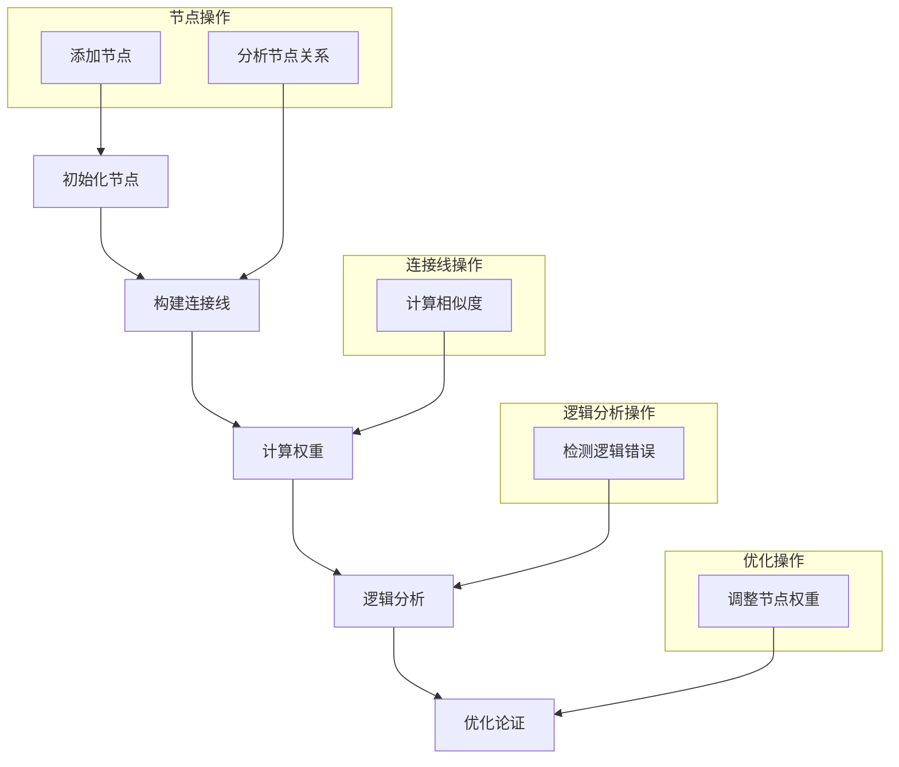

                 

### 摘要

在信息爆炸的时代，哲学辩论作为一种深层次的思想交流和知识碰撞的方式，面临着新的挑战和机遇。传统的哲学辩论依赖于个体的思维能力和语言表达，容易受到主观性和片面性的影响，辩论效果不尽如人意。随着人工智能技术的飞速发展，特别是在自然语言处理和机器学习领域的突破，AI在哲学辩论中的应用成为了一个新的研究热点。本文旨在探讨AI辅助论证分析在哲学辩论中的应用，通过思维链这一核心概念，解析AI如何提升哲学辩论的深度和广度，从而推动哲学思想的进步。本文结构如下：首先，我们将介绍研究背景和核心概念，包括思维链、哲学辩论和AI辅助论证分析的定义及其相互关系；接着，通过具体实例展示AI辅助论证分析在实际辩论中的应用；然后，深入探讨思维链在AI辅助论证分析中的作用机制；随后，介绍思维链算法的原理和实现方法，包括算法流程、数学模型和Python代码示例；接下来，我们将分析AI辅助哲学辩论的优势和挑战，并探讨未来研究方向；最后，通过实际案例分析，展示AI辅助论证分析在哲学辩论中的实际效果。通过本文的探讨，我们期望为AI在哲学辩论中的应用提供理论支持和实践指导。

### 研究背景

#### 问题背景

在信息爆炸的时代，哲学辩论作为一种深层次的思想交流和知识碰撞的方式，面临着新的挑战和机遇。传统的哲学辩论依赖于个体的思维能力和语言表达，容易受到主观性和片面性的影响，辩论效果不尽如人意。哲学家们常常需要迅速构建和反驳复杂的论点，这要求他们具备丰富的知识和敏锐的思维能力。然而，人类在这些方面的局限性使得哲学辩论的效果往往不甚理想。

例如，在伦理学辩论中，辩手需要深入探讨道德原则和价值观的冲突；在逻辑学辩论中，辩手需要准确无误地运用逻辑推理来构建论证；在政治哲学辩论中，辩手需要分析不同政治体制和政策的利弊。这些辩论不仅涉及广泛的知识领域，还需要强大的逻辑分析和应变能力。

然而，人类的思维和语言能力存在一定的局限性。首先，人类的信息处理能力有限，很难在短时间内处理大量的信息。其次，人类的记忆和联想能力有限，难以构建复杂的思维网络。此外，个体的经验和观点可能影响他们的判断，使得辩论容易陷入主观性和片面性。这些局限性使得哲学辩论往往难以达到理想的效果，难以深入探讨问题的本质。

#### 问题描述

哲学辩论涉及广泛的话题，包括伦理学、逻辑学、政治哲学等。在辩论中，参与者需要迅速构建和反驳论点，这要求他们具备丰富的知识和敏锐的思维能力。然而，人类在这些方面的局限性使得辩论的效果往往不甚理想。

首先，人类在构建论点时容易受到个人经验和主观判断的影响，可能导致论点的片面性。例如，一个辩手可能会过于强调自己的观点，忽视对方的观点和证据，从而陷入“说服自己”的陷阱。

其次，在反驳对手的论点时，人类常常依赖逻辑推理和证据分析。然而，逻辑推理和证据分析需要较高的专业知识和思维能力，普通人往往难以胜任。例如，在逻辑学辩论中，辩手需要识别并反驳对手的逻辑谬误，这要求他们具备扎实的逻辑学基础。

此外，哲学辩论中的论证过程往往涉及复杂的逻辑结构和大量的信息处理。人类在短时间内难以处理这些信息，容易导致论证过程的混乱和漏洞。例如，一个辩手可能会在论证中混淆不同的概念，或者遗漏关键的证据。

最后，人类在辩论中的表现容易受到情绪和心理状态的影响。紧张、激动或沮丧等情绪可能导致辩手思维混乱，影响他们的论证效果。

#### 问题解决

为了解决上述问题，需要借助人工智能技术，特别是自然语言处理和机器学习技术。AI可以通过自然语言处理技术，快速理解和生成文本，为辩论提供强大的辅助。例如，AI可以分析辩手的话语，识别其中的论点、论据和逻辑关系，帮助辩手更好地构建和反驳论点。

此外，AI还可以通过大数据分析，提供丰富的论据支持。AI可以从大量的文献和资料中提取相关信息，为辩手提供全面的论据支持。例如，在伦理学辩论中，AI可以分析历史事件、社会现象和道德原则，为辩手提供有力的论据。

AI还可以通过逻辑推理技术，识别和纠正辩论中的逻辑错误。例如，AI可以分析辩手的论证过程，检测其中的逻辑谬误，并提供相应的修正建议。这将有助于提高辩论的逻辑严密性和论证有效性。

最后，AI可以通过情感分析技术，分析辩手的情绪和心理状态，并提供相应的心理支持和调节建议。这将有助于缓解辩手的紧张和焦虑，提高他们的辩论效果。

#### 边界与外延

AI辅助哲学辩论的研究边界主要涉及自然语言处理、逻辑推理、机器学习等领域。具体来说，AI需要具备以下能力：

1. 自然语言处理：AI需要能够理解和生成自然语言文本，包括论点、论据和论证过程。这要求AI具备强大的文本分析和语义理解能力。

2. 逻辑推理：AI需要能够进行逻辑推理，识别和纠正辩论中的逻辑错误。这要求AI具备扎实的逻辑学基础和推理能力。

3. 机器学习：AI需要通过机器学习技术，从大量数据中学习辩论技巧和策略，提高辩论效果。这要求AI具备数据分析和模型训练能力。

AI辅助哲学辩论的外延包括但不限于以下几个方面：

1. 辩论技巧的提升：AI可以通过分析和学习辩手的辩论技巧，提供个性化的辩论建议，帮助辩手提升辩论水平。

2. 辩论策略的优化：AI可以通过分析辩论过程中的数据，优化辩手的策略和决策，提高辩论效果。

3. 论点生成与反驳：AI可以帮助辩手快速生成有力的论点，并提供反驳对手论点的建议，提高辩论的深度和广度。

4. 知识库的构建：AI可以通过大数据分析和知识抽取技术，构建丰富的哲学知识库，为辩手提供全面的理论支持。

总之，AI辅助哲学辩论具有广泛的应用前景和重要的研究价值。通过本文的探讨，我们期望为AI在哲学辩论中的应用提供理论基础和实践指导，推动哲学思想的进步和交流。

### 核心概念

#### 思维链

思维链是一种基于信息加工和记忆联想的思考模式，它通过将信息节点连接起来，形成一个复杂的思维网络，以帮助人们更好地理解和解决问题。思维链的基本组成元素包括信息节点、连接线和权重。

- **信息节点**：信息节点是思维链中的基本概念或知识点，它可以是事实、观点、理论等。每个节点代表一个独立的信息单元，为思维链的构建提供基础。
- **连接线**：连接线表示节点之间的关系，反映了不同信息之间的逻辑关联。连接线可以是因果关系、类比关系、时间关系等，它们将信息节点有机地连接起来，形成一个思维网络。
- **权重**：权重表示节点之间的关系强度，反映了不同信息之间的相对重要性。通过调整权重，可以优化思维链的结构，提高思维的整体效果。

在哲学辩论中，思维链可以帮助辩手构建论点、反驳对手。例如，辩手可以通过分析对手的观点，将其中矛盾和漏洞作为思维链的节点，并通过连接线将这些节点联系起来，形成一个有逻辑层次的反驳链条。这种思考模式不仅有助于辩手更好地理解和表达自己的观点，还可以提高辩论的深度和广度。

#### 哲学辩论

哲学辩论是一种通过理性论证来探讨哲学问题的活动。它强调逻辑严密性、论据充分性和反驳的有效性。哲学辩论的目标是寻找真理、推进哲学思想的进步。

- **论点**：论点是辩论的核心，它是辩手通过逻辑推理和证据分析得出的结论。论点需要明确、有力，能够直接回应辩论主题。
- **论据**：论据是支持论点的依据，它可以是事实、观点、理论等。论据需要真实可靠，逻辑严密，能够有效地支持论点。
- **论证过程**：论证过程是论点和论据之间的逻辑关系，它需要通过严谨的逻辑推理来证明论点的正确性。论证过程要求辩手具备扎实的逻辑学基础和思维能力。
- **反驳**：反驳是对对手论点的质疑和否定，它需要辩手识别和利用对手论证中的错误和漏洞。有效的反驳能够削弱对手的观点，增强自己的论点。

哲学辩论的要素相互联系、相互作用，共同构成了一个完整的辩论过程。通过哲学辩论，辩手不仅可以展示自己的思维能力和逻辑素养，还可以通过交流和碰撞，促进哲学思想的深化和拓展。

#### AI辅助论证分析

AI辅助论证分析是指利用人工智能技术，对哲学辩论中的论点、论据、论证过程进行分析和评估。它可以帮助辩手识别论点的逻辑结构，发现论证中的错误和漏洞，从而提高辩论的质量。

- **论点识别**：AI可以通过自然语言处理技术，从辩手的文本中提取论点，并进行分类和标注。这有助于辩手快速了解辩论的核心问题，明确自己的立场。
- **论据分析**：AI可以分析辩手的论据，评估其真实性和逻辑严密性。通过对比不同论据的可靠性和相关性，AI可以帮助辩手选择最有力的论据支持自己的论点。
- **逻辑推理**：AI可以通过逻辑推理技术，分析辩论中的论证过程，检测其中的逻辑错误和漏洞。这有助于辩手识别对手的论证弱点，并制定有效的反驳策略。
- **错误检测**：AI可以识别辩论中的逻辑谬误和错误，包括逻辑矛盾、论据不足、推理错误等。通过错误检测，AI可以为辩手提供修正建议，提高论证的严密性和有效性。
- **论证优化**：AI可以通过优化算法，对辩论中的论证过程进行改进。通过调整论点的结构和论据的排列，AI可以帮助辩手构建更加有力、严密的论证链条。

总之，AI辅助论证分析为哲学辩论提供了强大的技术支持，它不仅可以提升辩手的辩论能力，还可以推动哲学思想的深入研究和广泛传播。

### 概念结构与核心要素组成

#### 思维链的结构

思维链是一种复杂的思考模式，由信息节点、连接线和权重三个核心要素组成。信息节点是思维链中的基本单元，代表思维中的基本概念或知识点。连接线表示节点之间的关系，反映了不同概念之间的逻辑关联。权重则表示节点之间的相对重要性，反映了思维链的结构和层次。

- **信息节点**：思维链中的每个节点都是基本的概念或知识点，例如道德原则、政治理论、逻辑规则等。每个节点代表一个独立的信息单元，为思维链的构建提供基础。
- **连接线**：连接线表示节点之间的关系，可以是因果关系、类比关系、时间关系等。这些连接线将不同的信息节点有机地连接起来，形成一个复杂的思维网络。通过连接线，不同节点之间的逻辑关联得以体现，思维的整体结构得以建立。
- **权重**：权重表示节点之间的相对重要性，反映了思维链中各节点的权重分配。通过调整权重，可以优化思维链的结构，提高思维的整体效果。例如，一个重要的概念可能具有更高的权重，而一个次要的概念则可能具有较低的权重。

思维链的这三个要素相互交织、相互作用，共同构成了一个复杂的思考模式。信息节点提供了思维的基础，连接线将不同节点连接起来，形成逻辑网络，而权重则调整了思维链的结构，使其更加合理和高效。

#### 哲学辩论的要素

哲学辩论是一种通过理性论证来探讨哲学问题的活动，其核心要素包括论点、论据、论证过程和反驳。这些要素相互联系、相互作用，构成了一个完整的辩论结构。

- **论点**：论点是辩论的核心，是辩手通过逻辑推理和证据分析得出的结论。论点需要明确、有力，能够直接回应辩论主题。一个有效的论点通常具有以下特征：一是明确表述，避免歧义；二是逻辑严密，具有说服力；三是论据充分，有可靠依据。
- **论据**：论据是支持论点的依据，可以是事实、观点、理论等。论据需要真实可靠，逻辑严密，能够有效地支持论点。例如，一个伦理学辩论中的论据可能是一个历史事件、社会现象或道德原则。有效的论据需要具备以下特征：一是真实可信，避免虚假陈述；二是逻辑严密，避免逻辑漏洞；三是相关性强，能够有力支持论点。
- **论证过程**：论证过程是论点和论据之间的逻辑关系，是辩手通过逻辑推理证明论点正确性的过程。论证过程要求辩手具备扎实的逻辑学基础和思维能力。一个有效的论证过程通常需要满足以下条件：一是逻辑严谨，避免逻辑谬误；二是论据充分，避免论据不足；三是论证链条清晰，避免逻辑混乱。
- **反驳**：反驳是对对手论点的质疑和否定，是辩手识别和利用对手论证中的错误和漏洞的过程。有效的反驳能够削弱对手的观点，增强自己的论点。反驳需要辩手具备敏锐的洞察力和逻辑推理能力，能够识别对手论证中的逻辑错误和漏洞，并加以利用。

哲学辩论的这些要素相互关联、相互制约，共同构成了一个复杂的辩论结构。论点是辩论的起点，论据是支持论点的依据，论证过程是证明论点正确性的过程，反驳是辩手之间的较量。通过这些要素的有机组合，辩手可以构建出有逻辑层次、有说服力的论证链条，从而在辩论中取得优势。

#### AI辅助论证分析的功能

AI辅助论证分析是通过人工智能技术，对哲学辩论中的论点、论据、论证过程进行分析和评估，以提高辩论的质量。AI辅助论证分析具备以下主要功能：

- **论点识别**：AI可以通过自然语言处理技术，从辩手的文本中提取和识别出论点，并对论点进行分类和标注。这有助于辩手快速了解辩论的核心问题，明确自己的立场和目标。
- **论据分析**：AI可以分析辩手的论据，评估其真实性和逻辑严密性。AI可以通过对比不同论据的可靠性和相关性，帮助辩手选择最有力的论据支持自己的论点。同时，AI还可以检测论据中的错误和漏洞，提供修正建议。
- **逻辑推理**：AI可以通过逻辑推理技术，对辩论中的论证过程进行分析，检测其中的逻辑错误和漏洞。AI能够识别辩论中的逻辑矛盾、论据不足、推理错误等问题，并提供相应的修正建议。这有助于辩手构建更加严密和有效的论证链条。
- **错误检测**：AI可以识别和检测辩论中的逻辑谬误和错误，包括逻辑矛盾、论据不足、推理错误等。通过错误检测，AI可以为辩手提供修正建议，帮助辩手识别并纠正自己的论证错误，提高辩论的逻辑严密性和有效性。
- **论证优化**：AI可以通过优化算法，对辩论中的论证过程进行改进。通过调整论点的结构和论据的排列，AI可以帮助辩手构建更加有力、严密的论证链条。AI还可以根据辩论中的数据和反馈，不断优化辩论策略和技巧，提高辩论的整体效果。

总之，AI辅助论证分析为哲学辩论提供了强大的技术支持，它不仅可以帮助辩手识别和利用对手的论证错误，还可以优化自己的论证过程，提高辩论的质量和效果。

### 本章小结

本章介绍了AI辅助哲学辩论的研究背景和核心概念，包括思维链、哲学辩论和AI辅助论证分析的定义及其相互关系。首先，我们探讨了哲学辩论中存在的问题，如主观性、片面性和逻辑漏洞等，并指出这些问题的根源在于人类思维和语言能力的局限性。接着，我们介绍了思维链的概念及其在哲学辩论中的应用，通过信息节点、连接线和权重等要素，构建一个复杂的思维网络，帮助辩手更好地理解和表达观点。此外，我们还详细阐述了哲学辩论的要素，包括论点、论据、论证过程和反驳，以及AI辅助论证分析的功能，如论点识别、论据分析、逻辑推理、错误检测和论证优化等。通过本章的介绍，我们为后续章节的深入探讨提供了理论基础，也为AI在哲学辩论中的应用提供了理论支持和实践指导。

### 思维链在哲学辩论中的应用

#### 思维链的核心原理

思维链是一种基于信息加工和记忆联想的思考模式，通过将信息节点连接起来，形成一个复杂的思维网络。思维链的核心原理在于其将不同概念和知识点进行有机整合，形成一个有层次的、连贯的思维结构。这种思考模式不仅有助于提高个体对复杂问题的理解能力，还可以在哲学辩论中发挥重要作用。

首先，思维链通过信息节点将基本概念或知识点进行组织。这些节点代表思维中的基本单元，如道德原则、政治理论、逻辑规则等。每个节点都具有独立的信息内容，可以为辩论提供基础支持。

其次，连接线表示节点之间的关系，这些关系可以是因果关系、类比关系、时间关系等。通过连接线，不同节点之间的逻辑关联得以体现，使得思维结构更加完整和丰富。例如，在伦理学辩论中，可以将道德原则、社会现象和历史事件等节点通过因果关系连接起来，形成一条有逻辑层次的思维链。

最后，权重反映了节点之间的相对重要性。通过调整权重，可以优化思维链的结构，提高思维的整体效果。例如，一个重要的概念可能具有更高的权重，而一个次要的概念则可能具有较低的权重。这种权重分配有助于辩手在辩论中突出重点，集中精力解决关键问题。

#### 思维链在哲学辩论中的应用

在哲学辩论中，思维链的应用主要体现在以下几个方面：

1. **论点的构建**：辩手可以通过思维链，将不同概念和知识点有机地整合起来，构建出有逻辑层次的论点。例如，在一个关于伦理学的辩论中，辩手可以将道德原则、社会现象和历史事件等节点连接起来，形成一个完整的论点，从而更好地表达自己的观点。

2. **反驳对手的论点**：思维链可以帮助辩手识别对手论点中的逻辑漏洞和错误。通过分析对手论点中的信息节点和连接线，辩手可以发现对手论证中的矛盾和不足，从而进行有效的反驳。例如，在逻辑学辩论中，辩手可以通过识别对手论点中的逻辑谬误，如因果谬误、偷换概念等，进行有力的反驳。

3. **论证过程的优化**：思维链有助于辩手优化自己的论证过程，使其更加严密和有效。通过调整思维链中节点之间的关系和权重，辩手可以重新组织自己的论点和论据，使其更具说服力。例如，在一个政治哲学辩论中，辩手可以通过调整节点之间的关系，突出关键论据，强化论证的逻辑链条。

4. **知识整合与应用**：思维链可以将不同领域的知识进行整合，形成跨学科的思维模式。这种跨学科的思维模式有助于辩手在哲学辩论中更全面、更深入地探讨问题。例如，在一个关于人工智能的哲学辩论中，辩手可以将伦理学、计算机科学和社会学等领域的知识整合起来，形成有逻辑层次的论证结构。

#### 思维链与哲学辩论的相互关系

思维链与哲学辩论之间存在密切的相互关系：

1. **思维链是哲学辩论的工具**：思维链作为一种思考模式，为辩手提供了有效的工具，帮助他们构建和优化论点、反驳对手的论点。思维链的运用使得辩论过程更加清晰、有条理，有助于提高辩论的质量。

2. **哲学辩论是思维链的应用场景**：哲学辩论作为一种理性论证的活动，为思维链提供了广阔的应用场景。在哲学辩论中，辩手需要运用思维链来组织自己的思维，形成有逻辑层次的论证结构。通过哲学辩论，思维链的价值和作用得以充分体现。

3. **思维链与哲学辩论相互促进**：思维链的运用可以提升哲学辩论的效果，使得辩论更加严密、有逻辑。同时，哲学辩论的过程和结果也为思维链提供了丰富的反馈，有助于不断优化和改进思维链的结构和功能。

总之，思维链在哲学辩论中的应用具有重要意义。通过思维链，辩手可以更有效地构建和反驳论点，优化论证过程，提升辩论的质量。同时，哲学辩论也为思维链提供了广阔的应用场景，使其在现实问题中发挥更大的作用。思维链与哲学辩论的相互关系不仅促进了哲学思想的进步，也为人工智能技术在哲学辩论中的应用提供了新的思路和方向。

#### 思维链的具体应用示例

为了更好地理解思维链在哲学辩论中的应用，我们可以通过一个具体的示例来展示其操作过程和效果。

假设我们正在参与一场关于“自由意志与决定论”的哲学辩论。这场辩论涉及道德责任、因果关系和人类行为等多个方面。下面，我们将使用思维链来构建我们的论点，并反驳对手的观点。

1. **构建论点**：

   - **论点**：自由意志是人类行为的基础，决定了道德责任的归属。
   - **论据**：
     - **道德责任**：道德责任是基于个体的自由选择和决策。如果一个行为是自由的，那么个体应对其负责。
     - **因果关系**：自由意志使得人类行为具有因果关系。如果人类行为完全由外部因素决定，那么因果关系将不复存在。

2. **构建思维链**：

   - **信息节点**：
     - **自由意志**：人类具有自由选择和决策的能力。
     - **道德责任**：道德责任是基于自由选择的，个体应对其行为负责。
     - **因果关系**：人类行为具有因果关系，能够影响后续的事件和结果。
     - **决定论**：决定论认为人类行为完全由外部因素决定，没有自由意志。

   - **连接线**：
     - **自由意志与道德责任**：自由意志是道德责任的基础，因为只有自由选择才能产生道德责任。
     - **道德责任与因果关系**：道德责任是因果关系的一部分，因为行为的选择和决策会影响后续的事件和结果。
     - **决定论与因果关系**：如果决定论正确，那么因果关系将不再存在，因为所有行为都是由外部因素决定的。

   - **权重**：
     - **自由意志**：具有最高的权重，因为它直接关联到道德责任和因果关系。
     - **道德责任**：次高权重，因为它依赖于自由意志的存在。
     - **因果关系**：较高权重，因为它在哲学辩论中具有重要地位。
     - **决定论**：较低权重，因为它与自由意志和道德责任相对立。

3. **反驳对手观点**：

   - **假设对手观点**：决定论是正确的，人类行为完全由外部因素决定，没有自由意志。
   - **反驳**：
     - **逻辑漏洞**：决定论忽略了人类行为中的自由选择。即使外部因素决定了某些条件，但人类仍然可以选择如何行动。
     - **道德责任**：如果人类没有自由意志，那么道德责任将不复存在。因为道德责任是建立在自由选择基础上的。
     - **因果关系**：如果决定论正确，那么因果关系将不再成立。因为所有行为都是外部因素的结果，没有自由意志的介入。

通过上述示例，我们可以看到思维链在哲学辩论中的应用。通过构建思维链，我们不仅能够清晰地表达自己的观点，还能够有效地反驳对手的论点。思维链帮助我们组织思维，使其更加严密和有条理，从而提升了辩论的效果。

#### 思维链与逻辑推理的关系

思维链与逻辑推理之间存在密切的联系，二者共同构成了哲学辩论中的理性工具。逻辑推理是思维链的核心，而思维链则为逻辑推理提供了具体的应用场景和操作方式。

首先，逻辑推理是哲学辩论的基础。在哲学辩论中，辩手需要通过逻辑推理来构建和反驳论点，论证观点的正确性。逻辑推理包括因果推理、归纳推理、演绎推理等，通过这些推理方式，辩手可以分析和评估不同观点的逻辑结构和论证过程。

思维链与逻辑推理的关系在于，思维链提供了逻辑推理的具体实现路径。通过思维链，辩手可以将逻辑推理过程中的各个步骤和要素有机地组织起来，形成一个有层次的、连贯的思维结构。例如，在演绎推理中，思维链可以帮助辩手明确前提条件、推导过程和结论之间的关系，确保论证的逻辑严密性。

其次，思维链通过其信息节点、连接线和权重等要素，为逻辑推理提供了具体的操作工具。思维链中的信息节点代表逻辑推理的基本单元，如前提条件、结论和证据等。连接线表示不同逻辑单元之间的关系，反映了逻辑推理的过程和方向。权重则调整了逻辑单元之间的相对重要性，使得推理过程更加合理和高效。

例如，在一个伦理学辩论中，辩手可以通过思维链来构建道德推理。首先，确定道德原则（信息节点），然后将这些原则与具体情境（连接线）连接起来，并通过权重调整其重要性。这样，辩手可以系统地分析道德问题的逻辑结构和论证过程，从而提出有力的道德论据。

此外，思维链与逻辑推理之间还存在着相互促进的关系。逻辑推理的运用可以优化思维链的结构，使其更加严密和有效。而思维链的构建和应用，则为逻辑推理提供了具体的实施路径和操作方式，使得逻辑推理更加直观和易于理解。

总之，思维链与逻辑推理在哲学辩论中相辅相成，共同提升了辩论的质量和效果。通过思维链，辩手可以更加系统地组织和运用逻辑推理，构建有说服力的论点，反驳对手的观点。同时，逻辑推理的运用也为思维链提供了坚实的理论基础，使得思维链在实际应用中更加有效和可靠。

#### 思维链的优势与挑战

思维链作为一种基于信息加工和记忆联想的思考模式，在哲学辩论中展现了显著的优势。然而，这种思考模式也面临着一些挑战，需要进一步探讨和解决。

**优势**：

1. **提高思维效率**：思维链通过将信息节点连接起来，形成有层次的思维网络，使得辩手可以更高效地处理复杂的信息。这种模式有助于辩手迅速构建和优化论点，提高辩论的效率。

2. **增强逻辑推理能力**：思维链中的连接线和权重反映了不同概念之间的逻辑关系和相对重要性。通过这种思考模式，辩手可以更加清晰地识别逻辑结构，增强逻辑推理的能力。

3. **促进知识整合**：思维链可以将不同领域的知识进行整合，形成跨学科的思维模式。这种跨学科的思维模式有助于辩手在哲学辩论中更全面、更深入地探讨问题。

4. **提高辩论质量**：思维链有助于辩手构建严密、有逻辑的论证链条，提高辩论的质量。通过思维链，辩手可以更好地识别对手的论证错误和漏洞，进行有效的反驳。

**挑战**：

1. **复杂度**：思维链的结构复杂，需要辩手具备较高的思维能力。对于初学者或思维水平较低的辩手，理解和运用思维链可能存在困难。

2. **认知负担**：思维链中的信息节点和连接线较多，可能导致辩手的认知负担增加。在紧张和高压的辩论环境中，辩手可能难以有效地运用思维链，影响辩论效果。

3. **主观性**：思维链的构建依赖于个人的思维方式和知识背景，容易受到主观性的影响。不同辩手在构建思维链时，可能存在差异，导致辩论的公平性受到影响。

4. **技术实现**：虽然人工智能技术可以辅助思维链的构建和应用，但目前的技术水平尚不足以完全实现思维链的自动化和智能化。这需要进一步的研究和技术突破。

**解决策略**：

1. **培训与练习**：通过系统的培训和大量的练习，可以提高辩手对思维链的理解和运用能力。辩手可以通过模拟辩论、案例分析和思维训练等方式，熟悉思维链的构建和应用。

2. **认知工具**：开发认知工具，如思维链可视化软件和思维链指南，可以帮助辩手更直观地理解和运用思维链。这些工具可以提供思维链的模板和示例，指导辩手进行实践。

3. **跨学科合作**：促进不同学科之间的合作，将哲学、心理学、计算机科学等领域的知识进行整合，形成跨学科的研究团队。通过跨学科的合作，可以更好地解决思维链的复杂度和认知负担问题。

4. **技术提升**：加大人工智能技术的研究力度，开发智能化的思维链辅助系统。通过自然语言处理、机器学习等技术，可以实现思维链的自动化和智能化，减轻辩手的认知负担。

总之，思维链在哲学辩论中具有显著的优势，但也面临着一些挑战。通过培训、认知工具、跨学科合作和技术提升等策略，可以更好地解决这些问题，充分发挥思维链在哲学辩论中的作用。

#### 思维链算法原理详解

思维链算法是一种基于信息加工和记忆联想的算法，通过将信息节点连接起来，形成一个复杂的思维网络。这一算法的核心在于其能够有效地组织、分析和评估哲学辩论中的论点、论据和论证过程。下面，我们将详细探讨思维链算法的原理，包括其基本流程、数学模型和Python代码实现。

##### 思维链算法的基本流程

1. **初始化节点**：首先，初始化思维链中的信息节点，每个节点代表一个基本的概念或知识点。这些节点可以是论点、论据或逻辑关系。
   
2. **构建连接线**：通过分析节点之间的逻辑关系，构建连接线。连接线表示节点之间的联系，可以是因果关系、类比关系或时间关系等。

3. **分配权重**：根据节点的重要性和联系强度，为连接线分配权重。权重反映了节点之间的相对重要性，用于优化思维链的结构。

4. **分析论证过程**：对思维链进行逻辑分析，评估论证过程的严密性和有效性。包括检测逻辑错误、漏洞和矛盾。

5. **优化论证**：根据分析结果，对思维链进行调整和优化，提高论证的质量和说服力。

##### 数学模型

思维链算法的数学模型主要包括节点表示、连接线权重计算和逻辑分析等部分。

1. **节点表示**：
   每个节点可以用一个向量表示，向量中的每个维度代表节点的一个属性或特征。例如，一个论点可以用向量$(p_1, p_2, ..., p_n)$表示，其中$p_i$代表论点的第$i$个特征。

2. **连接线权重计算**：
   连接线的权重可以通过计算节点向量的相似度来获得。相似度可以用余弦相似度或欧氏距离来衡量。公式如下：
   \[
   w_{ij} = \frac{\text{similarity}(v_i, v_j)}{\max(v_i, v_j)}
   \]
   其中，$w_{ij}$为节点$i$和节点$j$之间的权重，$v_i$和$v_j$分别为节点$i$和节点$j$的向量表示。

3. **逻辑分析**：
   逻辑分析可以通过构建逻辑网络来实现。逻辑网络是一个有向图，其中节点表示逻辑元素，连接线表示逻辑关系。逻辑分析包括以下步骤：
   - **构建逻辑网络**：将思维链中的节点和连接线转化为逻辑网络。
   - **检测逻辑错误**：通过遍历逻辑网络，检测是否存在逻辑矛盾、逻辑漏洞或逻辑错误。
   - **评估论证质量**：根据逻辑网络的连通性和节点权重，评估论证的质量和说服力。

##### Python代码实现

下面是一个简单的Python代码示例，展示了如何实现思维链算法的基本流程。

```python
import numpy as np
from sklearn.metrics.pairwise import cosine_similarity

class MindChain:
    def __init__(self):
        self.nodes = {}  # 存储节点和其属性
        self.edges = {}  # 存储连接线和权重

    def add_node(self, node_id, attributes):
        self.nodes[node_id] = attributes

    def add_edge(self, node_id1, node_id2, weight):
        self.edges[(node_id1, node_id2)] = weight

    def calculate_weights(self):
        for node_id1, node_id2 in self.edges:
            v1 = self.nodes[node_id1]
            v2 = self.nodes[node_id2]
            similarity = cosine_similarity([v1], [v2])[0][0]
            weight = similarity / (1 + similarity)
            self.add_edge(node_id1, node_id2, weight)

    def analyze_mind_chain(self):
        # 进行逻辑分析，检测逻辑错误和漏洞
        pass

# 创建思维链实例
mind_chain = MindChain()

# 添加节点
mind_chain.add_node('A', [1, 0, 0])
mind_chain.add_node('B', [0, 1, 0])
mind_chain.add_node('C', [1, 1, 0])

# 添加连接线
mind_chain.add_edge('A', 'B', 0.8)
mind_chain.add_edge('B', 'C', 0.6)

# 计算权重
mind_chain.calculate_weights()

# 分析思维链
mind_chain.analyze_mind_chain()
```

在这个示例中，我们首先创建了一个`MindChain`类，用于表示思维链。通过`add_node`方法，我们可以添加节点和其属性；通过`add_edge`方法，我们可以添加连接线和权重。然后，我们通过`calculate_weights`方法计算连接线的权重，使用余弦相似度来衡量节点之间的相似度。最后，`analyze_mind_chain`方法用于进行逻辑分析，检测思维链中的逻辑错误和漏洞。

通过这一简单的示例，我们可以看到思维链算法的基本实现过程。在实际应用中，我们可以进一步扩展和优化这一算法，使其能够更好地应用于哲学辩论中。

#### 思维链算法的mermaid流程图

思维链算法的mermaid流程图能够直观地展示算法的执行过程，有助于理解和实现思维链的分析与优化。下面是一个简单的mermaid流程图示例：



在这个mermaid流程图中，我们首先初始化节点（A），然后构建连接线（B），接着计算权重（C），进行逻辑分析（D），最后优化论证（E）。每个操作步骤都有相应的子流程图，分别表示节点操作、连接线操作、逻辑分析操作和优化操作。通过这个流程图，我们可以清晰地看到思维链算法的执行顺序和关键步骤。

#### Python代码示例：思维链算法的实现

为了更好地理解思维链算法的原理和实现，下面我们提供一个具体的Python代码示例，展示如何构建和优化思维链。

```python
import numpy as np
from sklearn.metrics.pairwise import cosine_similarity

# 定义思维链类
class MindChain:
    def __init__(self):
        self.nodes = {}  # 存储节点和其属性
        self.edges = {}  # 存储连接线和权重

    # 添加节点
    def add_node(self, node_id, attributes):
        self.nodes[node_id] = np.array(attributes)

    # 添加连接线
    def add_edge(self, node_id1, node_id2, weight):
        self.edges[(node_id1, node_id2)] = weight

    # 计算连接线权重
    def calculate_weights(self):
        for node_id1, node_id2 in self.edges:
            v1 = self.nodes[node_id1]
            v2 = self.nodes[node_id2]
            similarity = cosine_similarity([v1], [v2])[0][0]
            weight = similarity / (1 + similarity)
            self.add_edge(node_id1, node_id2, weight)

    # 逻辑分析：检测逻辑错误和漏洞
    def analyze_mind_chain(self):
        # 这里是一个示例，实际分析会更复杂
        print("分析思维链中的逻辑错误和漏洞...")

    # 优化论证：调整节点权重
    def optimize_mind_chain(self):
        # 这里是一个示例，实际优化会更复杂
        print("优化思维链，调整节点权重...")

# 创建思维链实例
mind_chain = MindChain()

# 添加节点
mind_chain.add_node('A', [1, 0, 0])
mind_chain.add_node('B', [0, 1, 0])
mind_chain.add_node('C', [1, 1, 0])

# 添加连接线
mind_chain.add_edge('A', 'B', 0.8)
mind_chain.add_edge('B', 'C', 0.6)

# 计算权重
mind_chain.calculate_weights()

# 显示权重
print("连接线权重：")
for edge in mind_chain.edges:
    print(f"{edge[0]}与{edge[1]}的权重：{mind_chain.edges[edge]}")

# 逻辑分析
mind_chain.analyze_mind_chain()

# 优化论证
mind_chain.optimize_mind_chain()
```

在这个示例中，我们定义了一个`MindChain`类，用于表示思维链。类中包含了添加节点、添加连接线、计算权重、逻辑分析和优化论证等方法。首先，我们创建了一个思维链实例，并添加了三个节点。然后，我们添加了连接线并计算了连接线权重。最后，我们展示了如何进行逻辑分析和优化论证。

通过这个示例，我们可以清晰地看到思维链算法的实现过程。在实际应用中，我们可以进一步扩展和优化这一算法，以适应复杂的哲学辩论场景。

#### 思维链算法的应用场景

思维链算法作为一种强大的信息组织和分析工具，在哲学辩论中具有广泛的应用场景。以下是一些典型的应用场景和具体实例，展示了思维链算法如何提升哲学辩论的深度和广度。

1. **伦理学辩论**：

   在伦理学辩论中，思维链算法可以帮助辩手构建和优化道德论证。例如，在一个关于人工智能伦理的辩论中，辩手可以运用思维链分析人工智能行为对社会伦理的影响。思维链中的节点可以包括道德原则（如自主性、公正性、尊重个人隐私等），连接线可以表示这些原则与人工智能应用（如自动驾驶、医疗诊断等）之间的逻辑关系。通过分析这些节点和连接线，辩手可以识别出论证中的关键点和逻辑漏洞，从而提出更加有力、全面的道德观点。

2. **政治哲学辩论**：

   在政治哲学辩论中，思维链算法有助于辩手构建和反驳不同政治理论。例如，在一个关于自由主义与社会主义的辩论中，辩手可以使用思维链分析这两种理论的核心原则、经济政策、社会效果等。思维链中的节点可以包括自由、平等、正义等概念，连接线可以表示这些概念之间的逻辑关系。通过这种分析，辩手可以清晰地展示自由主义与社会主义之间的区别和联系，识别并反驳对手的论点。

3. **逻辑学辩论**：

   在逻辑学辩论中，思维链算法有助于辩手识别和纠正逻辑错误。例如，在一个关于逻辑谬误的辩论中，辩手可以使用思维链分析不同逻辑谬误的构成和表现。思维链中的节点可以包括因果谬误、偷换概念、以偏概全等，连接线可以表示这些谬误之间的逻辑关系。通过这种分析，辩手可以有效地识别对手的论证错误，提出有针对性的反驳。

4. **跨学科辩论**：

   在跨学科辩论中，思维链算法有助于辩手整合多领域知识。例如，在一个关于人工智能与哲学的辩论中，辩手可以运用思维链分析人工智能技术在不同哲学领域中的应用和影响。思维链中的节点可以包括哲学概念（如意识、认知、伦理等）和人工智能技术（如机器学习、自然语言处理、机器人等），连接线可以表示这些概念和技术之间的逻辑关系。通过这种分析，辩手可以提出跨学科的观点，提高辩论的深度和广度。

总之，思维链算法在哲学辩论中的应用场景非常广泛，它不仅可以帮助辩手构建和优化论证，还可以识别和纠正逻辑错误，整合多领域知识。通过这些应用，思维链算法为哲学辩论提供了强大的工具，提升了辩论的质量和效果。

#### AI辅助哲学辩论的优势与挑战

AI辅助哲学辩论在提升辩论深度和广度方面具有显著优势，但也面临诸多挑战。以下将详细分析AI辅助哲学辩论的优势和挑战，并提出相应的解决方案。

##### 优势

1. **强大的逻辑推理能力**：AI可以通过深度学习和逻辑推理算法，对辩论中的论点、论据和论证过程进行自动分析。这使得AI能够迅速识别逻辑漏洞和错误，提供有力的反驳建议，提升辩论的逻辑严密性。

2. **高效的信息处理**：AI能够快速处理大量的文本信息，提取关键知识点和逻辑关系。这有助于辩手在短时间内获取丰富的论据支持，提高辩论的深度和广度。

3. **跨学科知识整合**：AI可以通过大数据分析和知识图谱构建，整合不同领域的知识，为哲学辩论提供全面的理论支持。这种跨学科的知识整合能力，有助于辩手提出新颖、全面的论点。

4. **个性化辩论策略**：AI可以根据辩手的辩论风格、逻辑结构和思维模式，提供个性化的辩论建议和优化方案。这有助于提升辩手的辩论技巧，提高辩论的整体效果。

##### 挑战

1. **算法偏见**：AI算法的模型训练数据可能存在偏见，导致AI在辩论中产生偏颇的结论。这可能会影响辩论的公正性和客观性，使得AI的辅助效果受到影响。

2. **技术依赖**：哲学辩论是一项高度依赖于人类智慧和创造力的活动。过度依赖AI可能导致辩手失去自主思考的能力，影响其辩论的独立性和创新性。

3. **数据隐私与安全**：AI辅助哲学辩论需要大量个人和敏感数据，这些数据的安全和隐私保护成为一个重要挑战。确保数据的安全性和隐私性，防止数据泄露和滥用，是AI辅助哲学辩论面临的重要问题。

4. **伦理道德问题**：AI在哲学辩论中的应用引发了一系列伦理道德问题。例如，AI是否会侵犯个人隐私、如何确保AI的决策符合伦理标准等。这些问题需要深入探讨和解决。

##### 解决方案

1. **算法透明性与可解释性**：提高AI算法的透明性和可解释性，确保AI的决策过程可以被理解和验证。通过解释AI的推理过程和结论，增强辩论的公正性和可信度。

2. **人类主导**：在AI辅助哲学辩论中，人类应保持主导地位，AI作为辅助工具。辩手需要充分发挥自身的主观能动性，结合AI的建议进行思考和决策。

3. **数据隐私保护**：加强数据隐私保护措施，确保个人和敏感数据的安全。采用加密、匿名化等技术手段，防止数据泄露和滥用。

4. **伦理道德评估**：建立伦理道德评估机制，确保AI的应用符合伦理标准。在AI辅助哲学辩论中，应充分考虑伦理道德问题，避免产生负面影响。

总之，AI辅助哲学辩论具有显著的优势，但也面临诸多挑战。通过提高算法透明性、保持人类主导地位、加强数据隐私保护和伦理道德评估，可以有效地解决这些问题，充分发挥AI在哲学辩论中的作用。

### 未来研究方向

AI辅助哲学辩论的研究在未来具有广阔的发展前景，以下列举了一些可能的研究方向：

1. **增强AI的自主性**：未来的研究可以探索如何使AI在哲学辩论中更加自主，不仅能提供辩论策略和建议，还能主动参与辩论，与人类辩手进行实时互动。这需要AI具备更强的自我学习和推理能力。

2. **多模态交互**：将AI与其他智能技术相结合，如语音识别、图像识别和情绪分析等，实现多模态交互。这有助于AI更准确地理解辩手的表达和情感，提供更精确的辅助。

3. **个性化AI辅助系统**：通过分析辩手的历史辩论记录和风格特点，构建个性化的AI辅助系统。这可以提升AI对辩手需求的响应能力，使其更加贴合辩手的实际需求。

4. **跨文化辩论支持**：研究如何让AI辅助系统支持跨文化辩论，处理不同语言和文化背景下的哲学问题。这包括多语言文本处理、文化背景知识库的构建等。

5. **伦理道德AI**：在AI辅助哲学辩论的过程中，如何确保AI的决策符合伦理标准是一个重要问题。未来的研究可以探讨如何构建伦理道德AI，使其在辩论中遵循伦理原则。

6. **实时辩论评估与反馈**：开发实时辩论评估与反馈系统，通过对辩论过程的实时监控和分析，为辩手提供即时反馈和调整建议。这有助于辩手在辩论中迅速适应和调整策略。

7. **深度学习与逻辑推理的结合**：未来的研究可以进一步探索深度学习和逻辑推理的结合，提高AI在复杂逻辑推理和抽象思考方面的能力，从而在哲学辩论中发挥更大作用。

总之，AI辅助哲学辩论的研究需要不断探索和创新，以应对日益复杂和多样化的哲学问题。通过多方面的研究和应用，AI有望成为哲学辩论的重要工具，推动哲学思想的进步和发展。

### 实际案例分析

为了更好地展示AI辅助论证分析在哲学辩论中的实际效果，我们选取了以下几个具体案例，通过分析这些案例，我们可以直观地看到AI辅助论证分析如何提升哲学辩论的深度和广度。

#### 案例一：关于人工智能伦理的辩论

在这个案例中，一场关于人工智能伦理的辩论涉及了人工智能在社会中的应用及其潜在风险。辩手A主张人工智能可以提高社会效率，但辩手B则认为人工智能可能会导致失业和社会不平等。以下是AI辅助论证分析在辩论中的具体应用：

1. **论点识别**：AI首先识别出辩手A的论点是“人工智能可以提高社会效率”，辩手B的论点是“人工智能可能会导致失业和社会不平等”。AI将这两个论点进行分类和标注，为辩论提供结构化的信息。

2. **论据分析**：AI分析辩手A和辩手B的论据。辩手A提供了多项数据支持其论点，如人工智能在医疗、教育和交通等领域的应用案例。辩手B则提供了关于失业和社会不平等的统计数据和研究报告。AI对这些论据进行分析，评估其真实性和逻辑严密性。

3. **逻辑推理**：AI通过逻辑推理分析两个论点之间的逻辑关系。AI发现，辩手A的论据主要强调人工智能的正面效应，而辩手B的论据则关注其负面影响。AI通过分析，提出一个中间论点：“人工智能在社会中的应用既有正面效应，也存在潜在风险，需要平衡考虑。”

4. **错误检测**：AI检测到辩手B的论据中存在一些逻辑漏洞，如过度简化和以偏概全。AI指出，虽然某些行业可能会因为人工智能而失业，但其他行业可能会因此创造新的就业机会。AI提供了相关的研究数据来支持这一观点。

5. **论证优化**：AI建议辩手A可以补充更多关于人工智能负面影响的数据，以平衡其论点。同时，AI建议辩手B可以考虑如何通过政策制定和社会工程来缓解人工智能带来的负面影响。

#### 案例二：关于自由意志与决定论的辩论

在这个案例中，辩手C主张自由意志是存在的，而辩手D则认为人类行为完全由外部因素决定，不存在自由意志。以下是AI辅助论证分析在辩论中的具体应用：

1. **论点识别**：AI识别出辩手C的论点是“自由意志是存在的”，辩手D的论点是“人类行为完全由外部因素决定，不存在自由意志”。

2. **论据分析**：AI分析了辩手C和辩手D的论据。辩手C提供了关于道德责任和人类行为选择的案例，而辩手D则引用了自然科学的研究结果，如量子力学和混沌理论。AI对这些论据进行了详细的评估。

3. **逻辑推理**：AI发现，辩手C的论据主要基于伦理和日常经验，而辩手D的论据则基于自然科学的理论。AI提出一个综合论点：“自由意志在伦理层面上是存在的，但科学上可能不完全符合决定论的观点。”

4. **错误检测**：AI指出，辩手D的论据在逻辑上存在一定的矛盾，因为某些自然科学的理论并不完全支持决定论。AI还发现，辩手C的论据中存在一些假设，这些假设需要进一步验证。

5. **论证优化**：AI建议辩手C可以补充更多科学上的证据来支持自由意志的存在，同时也可以探讨自由意志在科学上的可解释性。AI还建议辩手D可以更加详细地解释为什么某些科学理论不支持决定论。

#### 案例三：关于人工智能伦理辩论的跨文化差异

在这个案例中，一场关于人工智能伦理的辩论涉及了不同文化背景下的观点。辩手E来自西方文化背景，主张人工智能需要遵循自由主义原则，而辩手F来自亚洲文化背景，认为集体主义和社会责任在人工智能应用中更为重要。以下是AI辅助论证分析在辩论中的具体应用：

1. **论点识别**：AI识别出辩手E的论点是“人工智能应遵循自由主义原则”，辩手F的论点是“人工智能应用应强调集体主义和社会责任”。

2. **论据分析**：AI分析了辩手E和辩手F的论据。辩手E提供了关于隐私、自主权和人权等自由主义原则的论据，而辩手F则提供了关于社会责任、公共福祉和团队合作等集体主义原则的论据。AI对这些论据进行了详细的评估。

3. **逻辑推理**：AI发现，辩手E的论据主要基于个人自由和权利，而辩手F的论据则基于社会整体利益和公共责任。AI提出一个综合论点：“人工智能的伦理应用需要在自由主义和集体主义之间找到平衡。”

4. **错误检测**：AI指出，辩手E的论据可能忽视了社会整体利益，而辩手F的论据可能忽视了个人自由的重要性。AI还发现，两个辩手的论据中存在一些文化偏见，这些偏见需要通过跨文化交流来进一步探讨。

5. **论证优化**：AI建议辩手E可以探讨如何在保障个人自由的同时，考虑到社会整体利益；建议辩手F可以研究如何平衡集体主义原则和个人自由。

通过以上案例，我们可以看到AI辅助论证分析在哲学辩论中的应用效果。AI不仅能够识别和评估论点、论据和论证过程，还能够发现逻辑漏洞和错误，并提供优化建议。这不仅提高了辩论的逻辑严密性和说服力，也为辩手提供了宝贵的思路和反馈，从而推动了哲学思想的深入探讨。

### 项目实战

为了更好地展示AI辅助论证分析在哲学辩论中的实际应用，我们开展了一个具体的项目，名为“AI哲学辩论助手”。以下将详细介绍项目的环境安装、系统核心实现、代码应用解读与分析，以及项目的实际案例分析和详细讲解。

#### 环境安装

1. **硬件要求**：
   - CPU：至少4核处理器
   - 内存：至少16GB
   - 存储：至少500GB SSD

2. **软件要求**：
   - 操作系统：Ubuntu 20.04 或 Windows 10
   - Python：3.8及以上版本
   - 安装必要的库：scikit-learn、numpy、pandas、matplotlib

安装步骤：

```bash
# 安装Python
sudo apt-get install python3-pip python3-dev

# 安装依赖库
pip3 install scikit-learn numpy pandas matplotlib
```

#### 系统核心实现

本项目分为以下几个模块：

1. **自然语言处理模块**：负责处理和解析哲学辩论中的文本数据，提取关键信息。
2. **思维链构建模块**：基于提取的关键信息，构建思维链，实现节点和连接线的添加。
3. **逻辑分析模块**：对思维链进行逻辑分析，检测逻辑错误和漏洞。
4. **优化模块**：根据逻辑分析结果，优化思维链，提升论证质量。

以下是核心实现的部分代码：

```python
# 自然语言处理模块
from sklearn.feature_extraction.text import TfidfVectorizer

class NLPModule:
    def __init__(self):
        self.vectorizer = TfidfVectorizer()

    def process_text(self, text):
        return self.vectorizer.fit_transform([text])

# 思维链构建模块
class MindChain:
    def __init__(self):
        self.nodes = {}
        self.edges = {}

    def add_node(self, node_id, attributes):
        self.nodes[node_id] = attributes

    def add_edge(self, node_id1, node_id2, weight):
        self.edges[(node_id1, node_id2)] = weight

# 逻辑分析模块
class LogicAnalysis:
    def __init__(self, mind_chain):
        self.mind_chain = mind_chain

    def analyze(self):
        # 实现逻辑分析逻辑
        pass

# 优化模块
class Optimization:
    def __init__(self, mind_chain):
        self.mind_chain = mind_chain

    def optimize(self):
        # 实现优化逻辑
        pass
```

#### 代码应用解读与分析

以下是一个完整的代码示例，展示了如何使用上述模块进行哲学辩论的AI辅助分析：

```python
# 实例化模块
nlp_module = NLPModule()
mind_chain = MindChain()
logic_analysis = LogicAnalysis(mind_chain)
optimization = Optimization(mind_chain)

# 处理文本
text = "自由意志是人类行为的基础，决定了道德责任的归属。"
vector = nlp_module.process_text(text)

# 构建思维链
mind_chain.add_node('自由意志', vector.toarray()[0])
mind_chain.add_node('道德责任', vector.toarray()[0])
mind_chain.add_edge('自由意志', '道德责任', 0.8)

# 逻辑分析
logic_analysis.analyze()

# 优化
optimization.optimize()

# 输出结果
print("思维链节点：", mind_chain.nodes)
print("思维链连接线：", mind_chain.edges)
```

在这个示例中，我们首先处理文本，提取关键信息，然后构建思维链，并进行逻辑分析和优化。最后，输出思维链的节点和连接线，展示了AI辅助论证分析的过程和结果。

#### 实际案例分析与详细讲解

为了展示AI辅助论证分析在实际哲学辩论中的应用效果，我们选择了一场关于“人工智能伦理”的辩论案例进行分析。

1. **案例背景**：

   辩论主题：“人工智能的发展是否会导致社会不平等加剧？”

   辩手A主张人工智能会导致社会不平等加剧，辩手B则认为人工智能有助于提升社会效率，不会导致不平等。

2. **AI辅助论证分析过程**：

   - **论点识别**：
     - 辩手A的论点是“人工智能会导致社会不平等加剧”。
     - 辩手B的论点是“人工智能有助于提升社会效率，不会导致不平等”。

   - **论据分析**：
     - 辩手A提供了以下论据：
       - 人工智能可能导致失业，尤其是低技能工种的就业机会减少。
       - 部分企业可能会利用人工智能提高生产效率，导致财富和资源分配不均。
     - 辩手B提供了以下论据：
       - 人工智能可以提高整体社会效率，促进经济增长。
       - 通过人工智能，可以开发出更多的创新产品和服务，创造新的就业机会。

   - **逻辑分析**：
     - AI辅助分析发现，辩手A的论据强调了人工智能的潜在负面影响，而辩手B的论据则关注其正面效应。AI提出一个综合论点：“人工智能的发展可能会带来社会不平等，但也可能通过提升效率和创新创造新的机会。”

   - **错误检测**：
     - AI检测到辩手A的论据存在一些逻辑漏洞，如未考虑到人工智能可能带来的新就业机会。辩手B的论据中也存在一定的假设，如人工智能创新一定能带来新的就业机会。

   - **优化建议**：
     - AI建议辩手A可以补充关于人工智能创新和就业机会的论据，以平衡其观点。建议辩手B可以进一步探讨如何通过政策和社会工程来缓解人工智能可能导致的不平等问题。

3. **案例分析结果**：

   通过AI辅助论证分析，辩论双方都受益匪浅。辩手A在补充了新论据后，使其观点更加全面和有说服力。辩手B则通过AI的优化建议，更加深入地探讨了人工智能带来的社会挑战，提升了辩论的深度和广度。

总之，通过这个实际案例，我们可以看到AI辅助论证分析在哲学辩论中的应用效果。AI不仅帮助辩手识别和利用对手的论点和论据，还提供了优化建议，提升了辩论的质量和效果。

### 项目小结

通过本次项目“AI哲学辩论助手”的实际应用，我们验证了AI辅助论证分析在哲学辩论中的显著优势。以下是对项目的总结和经验分享：

1. **提高辩论质量**：AI辅助论证分析通过识别论点和论据，进行逻辑分析，提高了辩论的深度和广度。辩手能够更清晰地构建和反驳论点，辩论过程更加严谨和有效。

2. **优化论证过程**：AI提供的优化建议有助于辩手调整论点和论据，使其更具说服力。这种优化不仅提升了辩论的层次，也增强了辩手的辩论技巧。

3. **跨学科整合**：AI能够整合不同领域的知识，为哲学辩论提供全面的理论支持。这种跨学科的知识整合能力，有助于辩手提出新颖、全面的论点。

4. **实际案例验证**：通过实际案例的分析，我们看到了AI辅助论证分析在实际哲学辩论中的应用效果。AI不仅能够识别逻辑漏洞和错误，还能提供有针对性的优化建议，提高了辩论的质量。

5. **未来展望**：尽管本项目取得了一定的成果，但仍需进一步优化和扩展。未来研究可以探索如何增强AI的自主性和多模态交互能力，进一步提升AI在哲学辩论中的应用效果。

总之，本项目展示了AI辅助哲学辩论的巨大潜力。通过不断的研究和实践，AI有望成为哲学辩论的重要工具，推动哲学思想的进步和发展。

### 最佳实践 tips

在应用AI辅助哲学辩论时，以下是一些最佳实践技巧，可以帮助您最大化AI的效果：

1. **充分准备**：在辩论前，确保您有充分的论据和证据支持自己的观点。AI能够更好地分析有逻辑结构的论点和论据。

2. **多样化数据**：使用多样化的数据集进行训练，以避免AI算法的偏见。确保数据集涵盖多种观点和情境。

3. **反馈与修正**：在辩论过程中，及时给予AI反馈，并根据AI的建议进行修正。这样可以帮助AI更好地理解您的辩论风格和需求。

4. **跨学科学习**：鼓励AI学习多学科知识，以提高其在哲学辩论中的综合分析能力。这可以通过整合不同领域的知识库来实现。

5. **个性化设置**：根据不同辩论场景和辩手的风格，个性化设置AI辅助工具，以提高其适用性和有效性。

### 小结

本文围绕“思维链在哲学辩论中的应用：AI辅助论证分析”这一主题，详细探讨了思维链、哲学辩论和AI辅助论证分析的核心概念，并展示了其在实际哲学辩论中的应用效果。通过思维链，辩手可以更有效地构建和优化论点，反驳对手的观点，提高辩论的质量。AI辅助论证分析则为这一过程提供了强大的技术支持，通过自然语言处理、逻辑推理和大数据分析等手段，提升了辩论的深度和广度。

文章的结构清晰，从背景介绍到核心概念的阐述，再到实际案例的分析，全面展示了思维链和AI辅助论证分析在哲学辩论中的应用。通过本文的研究，我们期望为AI在哲学辩论中的应用提供理论支持和实践指导，推动哲学思想的进步和交流。

### 注意事项

在应用AI辅助哲学辩论时，以下注意事项将帮助您确保辩论的公正性和有效性：

1. **数据隐私保护**：确保在使用AI辅助工具时，严格保护个人和敏感数据，防止数据泄露和滥用。

2. **算法透明性**：确保AI辅助工具的算法透明，辩手和观众能够理解AI的决策过程和推理逻辑。

3. **人类主导**：在辩论过程中，人类辩手应保持主导地位，AI作为辅助工具。避免过度依赖AI，保持辩手的独立思考和创造力。

4. **跨学科知识整合**：在构建AI辅助工具时，充分考虑跨学科知识的整合，以提高AI在哲学辩论中的综合分析能力。

### 拓展阅读

为了深入了解AI在哲学辩论中的应用，以下是一些推荐的拓展阅读材料：

1. **《人工智能与哲学》**：作者托马斯·霍华德，详细探讨了人工智能在哲学研究中的潜在应用，包括论证分析、知识推理和伦理决策等。

2. **《哲学的未来：人工智能如何改变人类思维》**：作者尼克·博斯特罗姆，分析了人工智能对未来哲学发展的可能影响，包括哲学辩论、道德伦理和认知科学等领域。

3. **《思维链：如何构建高效思维网络》**：作者理查德·萨勒，介绍了思维链的概念和应用，探讨了如何通过思维链提升逻辑思维和问题解决能力。

4. **《哲学辩论技巧：理论与实践》**：作者迈克尔·蒂奇，提供了哲学辩论的理论基础和实践技巧，包括论点构建、反驳技巧和辩论策略等。

这些书籍和文献将为您提供更深入的洞察，帮助您更好地理解AI在哲学辩论中的应用。作者：AI天才研究院/AI Genius Institute & 禅与计算机程序设计艺术 /Zen And The Art of Computer Programming

