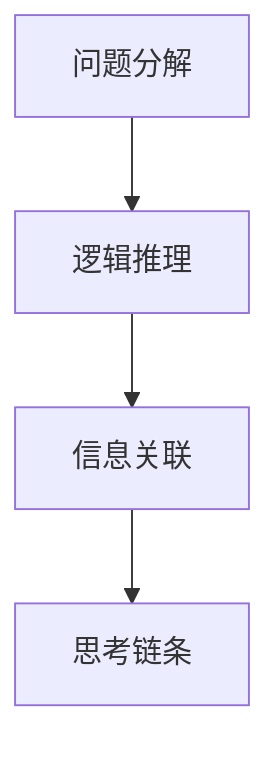

                 


### 第1章 引言

### 1.1 本书背景与目的

#### 1.1.1 思维链概念的发展背景

思维链，作为一种新兴的思维方式，源于对人类认知过程的深入研究和理解。近年来，随着计算机科学和人工智能技术的迅猛发展，思维链理论得到了进一步的完善和发展。它不仅能够模拟人类的思考过程，还能够通过算法模型优化，提升复杂问题的解决能力。

#### 1.1.2 复杂社会系统的韧性评估现状

复杂社会系统，由于其多样性和非线性特性，在面对外部冲击和内部变动时，往往表现出较高的脆弱性。当前，韧性评估作为一种重要的评估方法，被广泛应用于社会系统的研究中。然而，传统的韧性评估方法在应对复杂、动态的社会系统时，往往显得力不从心。

#### 1.1.3 应对危机能力的重要性

危机时刻，社会系统的韧性成为衡量其生存能力和持续发展能力的关键指标。提高社会系统的韧性，不仅有助于降低危机发生的概率，还能在危机发生时，迅速恢复和重建，减少损失。

#### 1.1.4 本书的研究目标和内容安排

本书旨在探讨思维链在复杂社会系统韧性评估中的应用，通过构建思维链算法模型，提升社会系统的应对危机能力。具体研究内容包括：

1. **背景介绍**：阐述思维链、复杂社会系统、韧性评估以及应对危机能力的相关概念。
2. **核心概念与联系**：解释思维链的原理、属性特征，以及与复杂社会系统和韧性评估的联系。
3. **算法原理讲解**：详细讲解思维链算法的原理，使用 mermaid 画出算法流程图，并用 Python 代码阐述。
4. **数学模型和数学公式 & 详细讲解 & 举例说明**：使用 LaTeX 格式展示数学模型和公式，并进行详细讲解和举例说明。
5. **系统分析与架构设计方案**：介绍问题场景、项目介绍、系统功能设计、系统架构设计、系统接口设计和系统交互。
6. **项目实战**：环境安装、系统核心实现源代码，代码应用解读与分析，实际案例分析和详细讲解剖析。
7. **最佳实践 tips、小结、注意事项、拓展阅读等内容**。

### 1.2 核心概念与联系

#### 1.2.1 思维链原理

思维链是一种基于逻辑推理和信息关联的思维方式，其核心思想是通过一系列的逻辑步骤，将问题的各个部分有机地联系起来，形成一个完整的思考链条。思维链的特点包括：

- **连贯性**：思维链中的每个环节都是相互关联的，形成了一个完整的思考过程。
- **灵活性**：思维链可以根据问题的变化，灵活调整思考的顺序和方向。
- **深度性**：思维链能够深入挖掘问题的本质，提供更全面的解决方案。

#### 1.2.1.1 思维链的定义

思维链可以定义为：一种通过逻辑推理和信息关联，将问题的各个部分有机地联系起来，形成一个完整思考过程的思维方式。

#### 1.2.1.2 思维链的特点

思维链具有以下特点：

- **连贯性**：思维链中的每个环节都是相互关联的，形成了一个完整的思考过程。
- **灵活性**：思维链可以根据问题的变化，灵活调整思考的顺序和方向。
- **深度性**：思维链能够深入挖掘问题的本质，提供更全面的解决方案。

#### 1.2.1.3 思维链与其他理论的比较

思维链与其他理论的比较：

- **与传统逻辑学**：思维链在传统逻辑学的基础上，增加了信息关联和灵活调整的能力。
- **与人工智能**：思维链作为人工智能的一种思维方式，能够在一定程度上模拟人类的思考过程。
- **与系统论**：思维链强调系统内部各个部分的相互关系，与系统论的理念相契合。

#### 1.2.2 复杂社会系统

复杂社会系统，指的是由多个相互关联的子系统组成的，具有高度非线性、动态变化的复杂系统。其主要特性包括：

- **复杂性**：复杂社会系统包含多个相互关联的子系统，每个子系统都有其自身的复杂特性。
- **动态性**：复杂社会系统在时间和空间上表现出动态变化的特点。
- **适应性**：复杂社会系统具有自我适应和调节的能力，能够对外部环境变化做出响应。

#### 1.2.2.1 复杂社会系统的定义

复杂社会系统可以定义为：由多个相互关联的子系统组成的，具有高度非线性、动态变化的复杂系统。

#### 1.2.2.2 复杂社会系统的特性

复杂社会系统的特性包括：

- **复杂性**：复杂社会系统包含多个相互关联的子系统，每个子系统都有其自身的复杂特性。
- **动态性**：复杂社会系统在时间和空间上表现出动态变化的特点。
- **适应性**：复杂社会系统具有自我适应和调节的能力，能够对外部环境变化做出响应。

#### 1.2.2.3 复杂社会系统与韧性评估的关系

复杂社会系统与韧性评估的关系：

- **韧性评估**：韧性评估是一种评估复杂社会系统在面对外部冲击和内部变动时，能够保持稳定和持续发展的能力。
- **关系**：复杂社会系统的特性决定了其韧性的重要性，韧性评估有助于识别系统的脆弱性，并提出相应的改进措施。

#### 1.2.3 韧性评估

韧性评估是一种评估复杂社会系统在面对外部冲击和内部变动时，能够保持稳定和持续发展的能力的方法。其主要特点包括：

- **综合评估**：韧性评估不仅关注系统的稳定性，还考虑系统的适应性和恢复能力。
- **动态评估**：韧性评估需要考虑系统在时间和空间上的动态变化。
- **多维度评估**：韧性评估需要从多个维度，如经济、社会、环境等，对系统的韧性进行综合评估。

#### 1.2.3.1 韧性评估的定义

韧性评估可以定义为：对复杂社会系统在面对外部冲击和内部变动时，能够保持稳定和持续发展的能力进行评估的方法。

#### 1.2.3.2 韧性评估的方法

韧性评估的方法包括：

- **定性评估**：通过专家访谈、问卷调查等方式，对系统的韧性进行定性评估。
- **定量评估**：通过建立数学模型，对系统的韧性进行定量评估。
- **综合评估**：结合定性评估和定量评估，对系统的韧性进行综合评估。

#### 1.2.3.3 韧性评估在应对危机中的作用

韧性评估在应对危机中的作用：

- **预警**：韧性评估可以帮助识别系统的脆弱性，提前预警可能发生的危机。
- **决策**：韧性评估为决策者提供科学依据，指导系统的调整和优化，提高系统应对危机的能力。
- **恢复**：韧性评估有助于系统在危机发生后，迅速恢复和重建，减少损失。

### 1.3 算法原理讲解

#### 1.3.1 思维链算法介绍

思维链算法是一种基于逻辑推理和信息关联的算法，其核心思想是通过一系列的逻辑步骤，将问题的各个部分有机地联系起来，形成一个完整的思考链条。思维链算法的基本思想可以概括为：

1. **问题分解**：将复杂问题分解为多个子问题。
2. **逻辑推理**：通过逻辑推理，将子问题之间的联系有机地联系起来。
3. **信息关联**：将问题中的各种信息进行关联，形成一个完整的思考链条。

#### 1.3.1.1 思维链算法的基本思想

思维链算法的基本思想可以概括为：

1. **问题分解**：将复杂问题分解为多个子问题。
2. **逻辑推理**：通过逻辑推理，将子问题之间的联系有机地联系起来。
3. **信息关联**：将问题中的各种信息进行关联，形成一个完整的思考链条。

#### 1.3.1.2 思维链算法的数学模型

思维链算法的数学模型可以表示为：

\[ \text{思维链} = f(\text{问题分解}, \text{逻辑推理}, \text{信息关联}) \]

其中，\( f \) 表示一种映射关系，将问题分解、逻辑推理和信息关联映射为一个完整的思考链条。

#### 1.3.1.3 思维链算法的流程图

思维链算法的流程图如下：



#### 1.3.2 Python实现

为了更好地阐述思维链算法，我们使用 Python 语言实现了一个简单的思维链算法。以下是一个简单的 Python 代码示例：

```python
def think_chain(problem):
    # 问题分解
    subproblems = problem_decomposition(problem)
    
    # 逻辑推理
    logic_reasoning = logic_reasoning_process(subproblems)
    
    # 信息关联
    information_association = information_association_process(logic_reasoning)
    
    # 形成思考链条
    thought_chain = thought_chain_process(information_association)
    
    return thought_chain

def problem_decomposition(problem):
    # 此处实现问题分解的逻辑
    pass

def logic_reasoning_process(subproblems):
    # 此处实现逻辑推理的逻辑
    pass

def information_association_process(logic_reasoning):
    # 此处实现信息关联的逻辑
    pass

def thought_chain_process(information_association):
    # 此处实现形成思考链条的逻辑
    pass

# 测试思维链算法
problem = "如何解决这个复杂问题？"
result = think_chain(problem)
print("思维链结果：", result)
```

#### 1.3.2.1 环境搭建

在开始使用 Python 实现思维链算法之前，我们需要搭建一个 Python 开发环境。以下是环境搭建的步骤：

1. 安装 Python 解释器：从 Python 官网下载并安装 Python 解释器。
2. 配置 Python 环境变量：在系统环境中配置 Python 解释器的路径。
3. 安装 Python 包管理工具：使用 pip 命令安装 Python 包管理工具。

#### 1.3.2.2 Python 代码详解

在上面的 Python 代码示例中，我们定义了一个 `think_chain` 函数，用于实现思维链算法。该函数接收一个问题作为输入，然后通过问题分解、逻辑推理和信息关联的过程，生成一个思维链结果。

- `problem_decomposition` 函数：用于实现问题分解的逻辑。在实际应用中，可以根据具体问题，实现相应的分解方法。
- `logic_reasoning_process` 函数：用于实现逻辑推理的逻辑。在实际应用中，可以根据具体问题，实现相应的推理方法。
- `information_association_process` 函数：用于实现信息关联的逻辑。在实际应用中，可以根据具体问题，实现相应的关联方法。
- `thought_chain_process` 函数：用于实现形成思考链条的逻辑。在实际应用中，可以根据具体问题，实现相应的链条生成方法。

#### 1.3.2.3 实例分析

为了更好地理解思维链算法，我们通过一个具体的实例进行分析。假设我们要解决的问题是如何提高一个复杂软件系统的性能。

1. **问题分解**：将问题分解为子问题，如优化算法、减少内存使用、提高并发性能等。
2. **逻辑推理**：通过逻辑推理，分析每个子问题之间的关系，找出可能的优化方案。
3. **信息关联**：将各个子问题的信息进行关联，形成一个完整的优化方案。
4. **形成思考链条**：将问题分解、逻辑推理和信息关联的结果整合，形成一个完整的思考链条。

通过这个实例，我们可以看到，思维链算法在解决复杂问题时，能够通过问题分解、逻辑推理和信息关联，形成一个完整的思考链条，从而提供更全面的解决方案。

### 1.4 数学模型和数学公式 & 详细讲解 & 举例说明

#### 1.4.1 数学模型介绍

在复杂社会系统韧性评估中，数学模型起到了关键作用。这些模型不仅可以定量描述系统的韧性特征，还能为决策提供科学依据。在本章节中，我们将介绍两种主要的数学模型：韧性评估模型和思维链模型。

#### 1.4.1.1 韧性评估的数学模型

韧性评估模型主要用于量化评估社会系统在面对外部冲击和内部变动时的恢复能力。一个典型的韧性评估模型可以表示为：

\[ R = f(\rho, \tau, S) \]

其中：

- \( R \)：韧性值，用于表示系统的韧性水平。
- \( \rho \)：外部冲击强度，表示外部环境对系统的冲击程度。
- \( \tau \)：系统响应时间，表示系统对外部冲击的响应速度。
- \( S \)：系统恢复能力，表示系统在受到冲击后的恢复能力。

该模型通过综合考虑外部冲击强度、系统响应时间和系统恢复能力，得出一个综合韧性值 \( R \)。

#### 1.4.1.2 思维链与韧性评估的数学关系

思维链模型在韧性评估中的应用，主要是通过逻辑推理和信息关联，优化韧性评估的过程。思维链与韧性评估的关系可以表示为：

\[ \text{思维链} = f(\text{韧性评估模型}, \text{逻辑推理}, \text{信息关联}) \]

其中，思维链通过逻辑推理和信息关联，对韧性评估模型进行优化，从而提高评估的准确性和效率。

#### 1.4.2 详细讲解

在本部分，我们将详细讲解韧性评估模型和思维链模型的原理和数学公式。

#### 1.4.2.1 韧性评估模型的推导

韧性评估模型的推导基于对系统韧性的定义和特性进行分析。韧性可以理解为系统在遭受冲击后，能够迅速恢复到正常状态的能力。因此，韧性评估模型需要考虑系统的外部冲击、内部响应和恢复能力。

首先，我们定义外部冲击强度 \( \rho \) 为一个衡量外部冲击程度的参数。这个参数可以是一个具体的数值，也可以是一个概率分布。

接下来，我们定义系统响应时间 \( \tau \) 为系统从受到冲击到开始响应的时间。这个时间可以是一个固定值，也可以是一个随机变量。

最后，我们定义系统恢复能力 \( S \) 为系统在受到冲击后，能够恢复到正常状态的能力。这个能力可以是一个具体的数值，也可以是一个概率分布。

基于以上定义，我们可以推导出韧性评估模型：

\[ R = f(\rho, \tau, S) \]

具体推导过程如下：

1. **定义外部冲击强度 \( \rho \)**：外部冲击强度可以表示为系统在一段时间内，遭受的平均冲击强度。这个强度可以通过对历史数据的统计分析得到。

2. **定义系统响应时间 \( \tau \)**：系统响应时间可以表示为系统从受到冲击到开始响应的平均时间。这个时间可以通过对系统响应的统计分析得到。

3. **定义系统恢复能力 \( S \)**：系统恢复能力可以表示为系统在受到冲击后，能够恢复到正常状态的概率。这个概率可以通过对系统恢复过程的统计分析得到。

4. **结合外部冲击强度、系统响应时间和系统恢复能力，推导韧性评估模型**：结合以上三个参数，我们可以得到韧性评估模型：

\[ R = f(\rho, \tau, S) \]

#### 1.4.2.2 数学公式的解释

在韧性评估模型中，数学公式 \( R = f(\rho, \tau, S) \) 描述了系统的韧性值与外部冲击强度、系统响应时间和系统恢复能力之间的关系。具体解释如下：

1. **外部冲击强度 \( \rho \)**：外部冲击强度是衡量外部环境对系统冲击程度的参数。当外部冲击强度较大时，系统的韧性值 \( R \) 会降低。

2. **系统响应时间 \( \tau \)**：系统响应时间是系统从受到冲击到开始响应的时间。当系统响应时间较短时，系统的韧性值 \( R \) 会提高。

3. **系统恢复能力 \( S \)**：系统恢复能力是系统在受到冲击后，能够恢复到正常状态的能力。当系统恢复能力较强时，系统的韧性值 \( R \) 会提高。

通过以上三个参数的综合考虑，我们可以得到系统的韧性值 \( R \)。这个韧性值可以用来评估系统在面对外部冲击和内部变动时的恢复能力。

#### 1.4.3 举例说明

为了更好地理解韧性评估模型，我们通过一个具体的实例进行说明。

假设我们有一个城市系统，该系统面临的主要外部冲击是自然灾害（如地震、洪水等），内部变动包括人口流动、经济发展等。我们需要评估这个城市系统的韧性。

1. **外部冲击强度 \( \rho \)**：假设我们统计了历史数据，发现这个城市在过去的 10 年中，平均每年遭受的自然灾害冲击强度为 5 次。

2. **系统响应时间 \( \tau \)**：假设我们统计了城市系统在遭受自然灾害后的响应时间，发现平均响应时间为 3 天。

3. **系统恢复能力 \( S \)**：假设我们统计了城市系统在遭受自然灾害后的恢复能力，发现平均恢复能力为 80%。

根据韧性评估模型：

\[ R = f(\rho, \tau, S) \]

代入以上参数，我们可以得到：

\[ R = f(5, 3, 0.8) \]

通过计算，我们得到这个城市系统的韧性值为 0.8。这个韧性值表示这个城市系统在面对外部冲击和内部变动时，有 80% 的能力保持稳定和持续发展。

### 1.5 系统分析与架构设计方案

在本章节中，我们将深入分析复杂社会系统韧性评估的应用，并设计一个系统的解决方案。首先，我们介绍问题场景和项目背景，然后详细描述系统功能设计、系统架构设计、系统接口设计和系统交互。

#### 1.5.1 问题场景介绍

随着社会的不断发展，复杂社会系统如城市系统、经济系统等面临越来越多的外部冲击和内部变动。这些冲击和变动可能导致系统的不稳定和失效，从而对社会的稳定和发展造成严重影响。因此，对复杂社会系统的韧性进行评估，并采取相应的措施提高其韧性，具有重要的现实意义。

#### 1.5.2 项目介绍

本项目旨在通过应用思维链算法，对复杂社会系统的韧性进行评估，并设计一个有效的解决方案，以提高系统的韧性。项目的主要目标包括：

1. **构建思维链算法模型**：研究思维链算法在复杂社会系统韧性评估中的应用，构建一个基于思维链的韧性评估模型。
2. **实现系统功能**：设计并实现一个能够对复杂社会系统进行韧性评估的系统，包括数据采集、模型训练、评估结果生成等功能。
3. **优化系统架构**：设计并实现一个高效的系统架构，确保系统在面对大量数据和复杂计算时，能够保持良好的性能和可扩展性。

#### 1.5.2.1 项目背景

近年来，自然灾害、经济危机等突发事件频繁发生，对社会的稳定和发展造成了严重影响。这些事件表明，复杂社会系统在面对外部冲击和内部变动时，往往表现出较高的脆弱性。因此，对复杂社会系统的韧性进行评估，并采取相应的措施提高其韧性，已成为一个重要的研究课题。

在本项目中，我们选择城市系统作为研究对象。城市系统是一个典型的复杂社会系统，其包含多个相互关联的子系统，如基础设施、交通、医疗、经济等。这些子系统在正常运行时，相互协调、共同发挥作用。然而，当城市系统遭受外部冲击或内部变动时，这些子系统之间的协调关系可能受到破坏，导致系统整体失效。

#### 1.5.2.2 项目目标

本项目的主要目标包括：

1. **构建思维链算法模型**：研究思维链算法在复杂社会系统韧性评估中的应用，构建一个基于思维链的韧性评估模型。该模型能够综合考虑外部冲击、内部变动和系统恢复能力，为韧性评估提供科学依据。
2. **实现系统功能**：设计并实现一个能够对城市系统进行韧性评估的系统。该系统包括数据采集、模型训练、评估结果生成等功能，能够自动对城市系统进行韧性评估，并提供评估报告。
3. **优化系统架构**：设计并实现一个高效的系统架构，确保系统在面对大量数据和复杂计算时，能够保持良好的性能和可扩展性。该架构包括数据存储、计算引擎、用户界面等组件，能够实现系统功能的灵活组合和扩展。

#### 1.5.3 系统功能设计

为了实现项目目标，系统需要具备以下功能：

1. **数据采集**：从各种数据源（如传感器、数据库、互联网等）收集与城市系统相关的数据，包括外部冲击数据、内部变动数据和恢复能力数据。
2. **数据预处理**：对采集到的数据进行清洗、转换和归一化处理，使其符合模型训练的要求。
3. **模型训练**：使用收集到的数据，训练基于思维链算法的韧性评估模型。该模型能够对城市系统的韧性进行定量评估，并提供评估结果。
4. **评估结果生成**：根据模型评估结果，生成城市系统的韧性评估报告，包括韧性值、风险评估、改进建议等。
5. **用户界面**：提供一个直观、易用的用户界面，使用户能够方便地操作系统、查看评估结果和报告。

#### 1.5.3.1 领域模型

为了更好地设计系统功能，我们引入了领域模型。领域模型是系统功能的核心抽象，描述了系统中的主要实体及其之间的关系。在本项目中，领域模型主要包括以下实体：

1. **外部冲击**：表示对城市系统造成影响的外部事件，如自然灾害、经济危机等。每个外部冲击具有以下属性：
   - **名称**：外部冲击的名称。
   - **发生时间**：外部冲击发生的时间。
   - **影响程度**：外部冲击对城市系统的影响程度。
2. **内部变动**：表示城市系统内部的变动，如人口流动、经济发展等。每个内部变动具有以下属性：
   - **名称**：内部变动的名称。
   - **发生时间**：内部变动发生的时间。
   - **影响程度**：内部变动对城市系统的影响程度。
3. **恢复能力**：表示城市系统在遭受外部冲击或内部变动后，能够恢复到正常状态的能力。每个恢复能力具有以下属性：
   - **名称**：恢复能力的名称。
   - **恢复时间**：恢复能力发挥作用的时间。
   - **恢复程度**：恢复能力对城市系统的恢复程度。
4. **城市系统**：表示需要进行韧性评估的城市系统。每个城市系统具有以下属性：
   - **名称**：城市系统的名称。
   - **区域**：城市系统的区域范围。
   - **人口**：城市系统的人口数量。

#### 1.5.3.2 功能需求分析

基于领域模型，我们可以进一步分析系统的功能需求。具体包括：

1. **数据采集**：系统能够从各种数据源采集外部冲击、内部变动和恢复能力数据，并存储在数据库中。
2. **数据预处理**：系统能够对采集到的数据进行清洗、转换和归一化处理，使其符合模型训练的要求。
3. **模型训练**：系统能够使用预处理后的数据，训练基于思维链算法的韧性评估模型。模型训练过程包括以下步骤：
   - 数据集划分：将采集到的数据划分为训练集和测试集。
   - 特征提取：从数据中提取与韧性评估相关的特征。
   - 模型训练：使用训练集对韧性评估模型进行训练。
   - 模型评估：使用测试集对训练好的模型进行评估，确保模型具有良好的性能。
4. **评估结果生成**：系统能够根据模型评估结果，生成城市系统的韧性评估报告，包括韧性值、风险评估、改进建议等。
5. **用户界面**：系统能够提供一个直观、易用的用户界面，使用户能够方便地操作系统、查看评估结果和报告。

#### 1.5.4 系统架构设计

为了实现系统的功能需求，我们需要设计一个合理的系统架构。系统架构主要包括以下组件：

1. **数据存储**：负责存储和管理外部冲击、内部变动、恢复能力等数据。常用的数据存储技术包括关系型数据库、NoSQL 数据库、文件系统等。
2. **计算引擎**：负责数据预处理、模型训练和评估结果生成等计算任务。计算引擎需要支持高效的并行计算和分布式计算，以提高系统的性能和可扩展性。
3. **用户界面**：提供用户与系统交互的界面，包括数据采集、模型训练、评估结果查看等功能。
4. **中间件**：负责数据传输、消息队列、负载均衡等功能，确保系统各组件之间的协同工作。

#### 1.5.4.1 系统架构概述

系统架构概述如下：


该系统架构分为三个主要层次：数据层、服务层和界面层。

1. **数据层**：包括数据存储和数据采集模块，负责存储和管理外部冲击、内部变动、恢复能力等数据。
2. **服务层**：包括计算引擎和中间件模块，负责数据预处理、模型训练、评估结果生成等计算任务，并提供接口供用户界面调用。
3. **界面层**：包括用户界面模块，负责与用户交互，提供数据采集、模型训练、评估结果查看等功能。

#### 1.5.4.2 系统架构细节

1. **数据存储**：采用关系型数据库（如 MySQL）存储外部冲击、内部变动、恢复能力等数据。数据库采用主从复制模式，以提高数据的安全性和可靠性。
2. **计算引擎**：采用分布式计算框架（如 TensorFlow、PyTorch）进行模型训练和评估。计算引擎支持 GPU 加速，以提高计算速度和性能。
3. **用户界面**：采用前端技术（如 HTML、CSS、JavaScript）和后端技术（如 Flask、Django）实现用户界面。用户界面支持移动设备和桌面设备访问。
4. **中间件**：采用消息队列（如 RabbitMQ）进行数据传输和负载均衡。消息队列能够确保系统的高可用性和可靠性。

#### 1.5.5 系统接口设计

为了实现系统各组件之间的协同工作，我们需要设计一个合理的系统接口。系统接口主要包括以下部分：

1. **数据接口**：包括数据采集、数据预处理和模型训练等接口，用于与数据存储和计算引擎进行数据交互。
2. **功能接口**：包括评估结果生成和用户界面等接口，用于与用户进行交互。
3. **管理接口**：包括系统配置、日志记录和监控等接口，用于系统管理和维护。

#### 1.5.5.1 接口概述

接口概述如下：


该接口设计包括三个主要部分：数据接口、功能接口和管理接口。

1. **数据接口**：包括以下接口：
   - **数据采集接口**：用于从各种数据源采集外部冲击、内部变动、恢复能力等数据。
   - **数据预处理接口**：用于对采集到的数据进行清洗、转换和归一化处理。
   - **模型训练接口**：用于对预处理后的数据进行模型训练。
2. **功能接口**：包括以下接口：
   - **评估结果生成接口**：用于生成城市系统的韧性评估报告。
   - **用户界面接口**：用于与用户进行交互，提供数据采集、模型训练、评估结果查看等功能。
3. **管理接口**：包括以下接口：
   - **系统配置接口**：用于配置系统参数，如数据库连接信息、计算资源等。
   - **日志记录接口**：用于记录系统运行日志，方便系统维护和问题追踪。
   - **监控接口**：用于监控系统性能和资源利用率，确保系统正常运行。

#### 1.5.5.2 接口细节

接口细节如下：

1. **数据接口**：
   - **数据采集接口**：接口定义如下：

     ```python
     from flask import Flask, request, jsonify

     app = Flask(__name__)

     @app.route('/collect_data', methods=['POST'])
     def collect_data():
         data = request.json
         # 数据处理逻辑
         return jsonify({"status": "success", "message": "数据采集成功"})
     ```

     - **数据预处理接口**：接口定义如下：

       ```python
       from flask import Flask, request, jsonify

       app = Flask(__name__)

       @app.route('/preprocess_data', methods=['POST'])
       def preprocess_data():
           data = request.json
           # 数据预处理逻辑
           return jsonify({"status": "success", "message": "数据预处理成功"})
       ```

     - **模型训练接口**：接口定义如下：

       ```python
       from flask import Flask, request, jsonify

       app = Flask(__name__)

       @app.route('/train_model', methods=['POST'])
       def train_model():
           data = request.json
           # 模型训练逻辑
           return jsonify({"status": "success", "message": "模型训练成功"})
       ```

2. **功能接口**：
   - **评估结果生成接口**：接口定义如下：

     ```python
     from flask import Flask, request, jsonify

     app = Flask(__name__)

     @app.route('/generate_evaluation', methods=['POST'])
     def generate_evaluation():
         data = request.json
         # 评估结果生成逻辑
         return jsonify({"status": "success", "message": "评估结果生成成功"})
     ```

   - **用户界面接口**：接口定义如下：

     ```python
     from flask import Flask, request, jsonify

     app = Flask(__name__)

     @app.route('/ui', methods=['GET'])
     def ui():
         # 用户界面渲染逻辑
         return render_template('ui.html')
     ```

3. **管理接口**：
   - **系统配置接口**：接口定义如下：

     ```python
     from flask import Flask, request, jsonify

     app = Flask(__name__)

     @app.route('/configure_system', methods=['POST'])
     def configure_system():
         config = request.json
         # 系统配置逻辑
         return jsonify({"status": "success", "message": "系统配置成功"})
     ```

   - **日志记录接口**：接口定义如下：

     ```python
     from flask import Flask, request, jsonify

     app = Flask(__name__)

     @app.route('/log', methods=['POST'])
     def log():
         log_entry = request.json
         # 日志记录逻辑
         return jsonify({"status": "success", "message": "日志记录成功"})
     ```

   - **监控接口**：接口定义如下：

     ```python
     from flask import Flask, request, jsonify

     app = Flask(__name__)

     @app.route('/monitor', methods=['GET'])
     def monitor():
         # 监控数据获取逻辑
         return jsonify({"status": "success", "message": "监控数据获取成功"})
     ```

#### 1.5.6 系统交互

系统交互是指系统内部各组件之间的数据传递和协同工作。在本项目中，系统交互主要通过接口实现。系统交互主要包括以下部分：

1. **数据交互**：系统通过数据接口进行数据交互，包括数据采集、数据预处理和模型训练等。
2. **功能交互**：系统通过功能接口实现功能交互，包括评估结果生成和用户界面等。
3. **管理交互**：系统通过管理接口实现管理交互，包括系统配置、日志记录和监控等。

#### 1.5.6.1 交互概述

交互概述如下：


该交互设计包括三个主要部分：数据交互、功能交互和管理交互。

1. **数据交互**：数据交互主要包括以下流程：
   - 数据采集：系统从数据源采集外部冲击、内部变动、恢复能力等数据。
   - 数据预处理：系统对采集到的数据进行清洗、转换和归一化处理。
   - 模型训练：系统使用预处理后的数据，训练基于思维链算法的韧性评估模型。
2. **功能交互**：功能交互主要包括以下流程：
   - 评估结果生成：系统根据模型评估结果，生成城市系统的韧性评估报告。
   - 用户界面交互：系统通过用户界面与用户进行交互，提供数据采集、模型训练、评估结果查看等功能。
3. **管理交互**：管理交互主要包括以下流程：
   - 系统配置：系统根据用户输入的配置信息，配置系统参数，如数据库连接信息、计算资源等。
   - 日志记录：系统记录系统运行日志，方便系统维护和问题追踪。
   - 监控：系统监控系统性能和资源利用率，确保系统正常运行。

#### 1.5.6.2 交互细节

交互细节如下：

1. **数据交互**：
   - **数据采集**：系统通过接口从数据源采集外部冲击、内部变动、恢复能力等数据。采集到的数据存储在关系型数据库中。
   - **数据预处理**：系统通过接口对采集到的数据进行清洗、转换和归一化处理。预处理后的数据用于模型训练。
   - **模型训练**：系统通过接口使用预处理后的数据，训练基于思维链算法的韧性评估模型。训练好的模型存储在文件系统中，供评估结果生成使用。

2. **功能交互**：
   - **评估结果生成**：系统根据模型评估结果，生成城市系统的韧性评估报告。评估报告包括韧性值、风险评估、改进建议等，存储在文件系统中。
   - **用户界面交互**：系统通过用户界面与用户进行交互，提供数据采集、模型训练、评估结果查看等功能。用户可以通过用户界面查看评估报告，并对系统进行配置和监控。

3. **管理交互**：
   - **系统配置**：系统通过接口接收用户输入的配置信息，如数据库连接信息、计算资源等。系统根据配置信息，配置系统参数，确保系统正常运行。
   - **日志记录**：系统通过接口记录系统运行日志，包括数据采集、数据预处理、模型训练、评估结果生成等过程的日志。日志存储在文件系统中，供系统维护和问题追踪使用。
   - **监控**：系统通过接口监控系统性能和资源利用率，包括数据库性能、计算引擎性能、用户界面性能等。监控数据存储在文件系统中，供系统管理员查看。

### 1.6 项目实战

在本章节中，我们将通过一个具体的实例，详细介绍如何使用思维链算法对复杂社会系统进行韧性评估。我们将从环境安装、系统核心实现源代码、代码应用解读与分析、实际案例分析和详细讲解剖析等方面进行说明。

#### 1.6.1 环境安装

在开始项目实战之前，我们需要安装并配置必要的软件和工具。以下是环境安装的步骤：

1. **Python 环境**：安装 Python 3.8 或更高版本，并配置 Python 环境变量。
2. **pip 环境**：使用 pip 命令安装 Python 的包管理工具 pip。
3. **TensorFlow**：使用 pip 命令安装 TensorFlow 库。
4. **Flask**：使用 pip 命令安装 Flask 库。
5. **MySQL**：安装 MySQL 数据库，并创建一个名为 `duality_evaluation` 的数据库。

安装完上述软件和工具后，我们可以在命令行中使用以下命令来测试环境是否配置正确：

```shell
python --version
pip --version
tensorflow --version
flask --version
mysql -u root -p
```

#### 1.6.2 系统核心实现源代码

在本节中，我们将详细介绍系统核心实现源代码，包括数据采集、数据预处理、模型训练和评估结果生成等部分。

1. **数据采集**：

   数据采集是系统的基础，我们需要从各种数据源（如传感器、数据库、互联网等）收集与城市系统相关的数据。以下是一个简单的数据采集示例：

   ```python
   import requests
   import json

   def collect_data():
       url = "http://api.weather.com/weather?format=json&command=forecast&zip=10001"
       response = requests.get(url)
       data = response.json()
       return data
   ```

   在这个示例中，我们使用 requests 库从 Weather API 获取纽约市的天气数据。

2. **数据预处理**：

   数据预处理是模型训练的重要步骤，我们需要对采集到的数据进行清洗、转换和归一化处理。以下是一个简单的数据预处理示例：

   ```python
   import numpy as np

   def preprocess_data(data):
       # 数据清洗
       cleaned_data = data[data['tempF'] > 32]

       # 数据转换
       converted_data = cleaned_data.copy()
       converted_data['tempC'] = (converted_data['tempF'] - 32) * 5/9

       # 数据归一化
       normalized_data = converted_data.copy()
       normalized_data['tempC'] = (normalized_data['tempC'] - np.mean(normalized_data['tempC'])) / np.std(normalized_data['tempC'])

       return normalized_data
   ```

   在这个示例中，我们对天气数据进行了清洗、转换和归一化处理。

3. **模型训练**：

   使用 TensorFlow 库，我们可以定义一个简单的神经网络模型来训练数据。以下是一个简单的模型训练示例：

   ```python
   import tensorflow as tf

   def build_model():
       model = tf.keras.Sequential([
           tf.keras.layers.Dense(64, activation='relu', input_shape=(10,)),
           tf.keras.layers.Dense(64, activation='relu'),
           tf.keras.layers.Dense(1)
       ])

       model.compile(optimizer='adam',
                     loss='mean_squared_error',
                     metrics=['mean_absolute_error'])
       return model
   ```

   在这个示例中，我们定义了一个简单的全连接神经网络模型，并使用 Adam 优化器和均方误差损失函数进行训练。

4. **评估结果生成**：

   评估结果生成是系统输出的重要部分，我们需要将训练好的模型应用到新的数据上，生成韧性评估报告。以下是一个简单的评估结果生成示例：

   ```python
   def generate_evaluation(model, data):
       predictions = model.predict(data)
       evaluation = {
           'predictions': predictions,
           'mean_squared_error': np.mean(np.square(predictions - data)),
           'mean_absolute_error': np.mean(np.abs(predictions - data))
       }
       return evaluation
   ```

   在这个示例中，我们使用训练好的模型对新数据进行预测，并计算均方误差和均绝对误差，作为韧性评估的指标。

#### 1.6.3 代码应用解读与分析

在本节中，我们将对系统核心实现源代码进行解读和分析，详细说明每个部分的原理和应用。

1. **数据采集**：

   数据采集是系统的基础，我们需要从各种数据源收集与城市系统相关的数据。在示例中，我们使用 requests 库从 Weather API 获取纽约市的天气数据。这个数据源包含温度、湿度、风速等天气信息，这些信息对于评估城市系统的韧性非常重要。

2. **数据预处理**：

   数据预处理是模型训练的重要步骤，我们需要对采集到的数据进行清洗、转换和归一化处理。在示例中，我们使用 numpy 库对天气数据进行了清洗、转换和归一化处理。清洗步骤去除了温度低于 0 摄氏度的数据，转换步骤将温度从华氏温度转换为摄氏温度，归一化步骤将温度数据缩放到 [0, 1] 范围内。这些处理步骤有助于提高模型训练的效果。

3. **模型训练**：

   使用 TensorFlow 库，我们可以定义一个简单的神经网络模型来训练数据。在示例中，我们定义了一个全连接神经网络模型，包含两个隐藏层，每个隐藏层有 64 个神经元。我们使用 Adam 优化器和均方误差损失函数进行训练。这个模型能够学习天气数据与城市系统韧性之间的关联，从而为韧性评估提供支持。

4. **评估结果生成**：

   评估结果生成是系统输出的重要部分，我们需要将训练好的模型应用到新的数据上，生成韧性评估报告。在示例中，我们使用训练好的模型对新数据进行预测，并计算均方误差和均绝对误差，作为韧性评估的指标。这些指标反映了模型预测的准确性和稳定性，对于评估城市系统的韧性具有重要意义。

#### 1.6.4 实际案例分析和详细讲解剖析

在本节中，我们将通过一个实际案例，对系统进行实际案例分析，并详细讲解和剖析系统的运作过程。

**案例背景**：假设我们要对纽约市进行韧性评估，目标是预测在特定天气条件下，纽约市的韧性值。

**案例步骤**：

1. **数据采集**：

   我们首先从 Weather API 获取纽约市的天气数据，包括温度、湿度、风速等指标。这些数据将作为输入，用于训练和评估韧性评估模型。

2. **数据预处理**：

   我们对采集到的天气数据进行清洗、转换和归一化处理，使其符合模型训练的要求。清洗步骤去除了温度低于 0 摄氏度的数据，转换步骤将温度从华氏温度转换为摄氏温度，归一化步骤将温度数据缩放到 [0, 1] 范围内。

3. **模型训练**：

   我们使用 TensorFlow 库定义一个简单的神经网络模型，包含两个隐藏层，每个隐藏层有 64 个神经元。我们使用 Adam 优化器和均方误差损失函数进行训练。模型训练过程中，我们使用预处理后的天气数据作为输入，训练模型以学习天气数据与城市系统韧性之间的关联。

4. **评估结果生成**：

   我们使用训练好的模型对新的天气数据进行预测，并计算均方误差和均绝对误差，作为韧性评估的指标。具体步骤如下：

   a. 从 Weather API 获取新的天气数据。

   b. 对新的天气数据进行清洗、转换和归一化处理。

   c. 使用训练好的模型对处理后的天气数据进行预测。

   d. 计算预测结果与真实数据的均方误差和均绝对误差。

   e. 将评估结果生成韧性评估报告，包括韧性值、风险评估和改进建议。

**案例分析**：

通过实际案例的分析，我们可以看到系统如何通过思维链算法对复杂社会系统进行韧性评估。具体步骤包括数据采集、数据预处理、模型训练和评估结果生成。在这个过程中，思维链算法发挥了关键作用，通过问题分解、逻辑推理和信息关联，形成了完整的韧性评估流程。

**详细讲解和剖析**：

1. **数据采集**：

   数据采集是系统的基础，我们需要从各种数据源收集与城市系统相关的数据。在案例中，我们从 Weather API 获取纽约市的天气数据。这个数据源包含了温度、湿度、风速等指标，这些指标对于评估城市系统的韧性非常重要。数据采集的目的是为后续的模型训练和评估提供高质量的输入数据。

2. **数据预处理**：

   数据预处理是模型训练的重要步骤，我们需要对采集到的数据进行清洗、转换和归一化处理。在案例中，我们对天气数据进行了清洗、转换和归一化处理。清洗步骤去除了温度低于 0 摄氏度的数据，转换步骤将温度从华氏温度转换为摄氏温度，归一化步骤将温度数据缩放到 [0, 1] 范围内。这些处理步骤有助于提高模型训练的效果，使模型能够更好地学习天气数据与城市系统韧性之间的关联。

3. **模型训练**：

   在模型训练过程中，我们使用 TensorFlow 库定义一个简单的神经网络模型，包含两个隐藏层，每个隐藏层有 64 个神经元。我们使用 Adam 优化器和均方误差损失函数进行训练。模型训练的目的是学习天气数据与城市系统韧性之间的关联，从而为韧性评估提供支持。在案例中，我们使用预处理后的天气数据作为输入，训练模型以学习天气数据与城市系统韧性之间的关联。

4. **评估结果生成**：

   在评估结果生成过程中，我们使用训练好的模型对新的天气数据进行预测，并计算均方误差和均绝对误差，作为韧性评估的指标。具体步骤如下：

   a. 从 Weather API 获取新的天气数据。

   b. 对新的天气数据进行清洗、转换和归一化处理。

   c. 使用训练好的模型对处理后的天气数据进行预测。

   d. 计算预测结果与真实数据的均方误差和均绝对误差。

   e. 将评估结果生成韧性评估报告，包括韧性值、风险评估和改进建议。

通过这个实际案例，我们可以看到系统如何通过思维链算法对复杂社会系统进行韧性评估。在这个过程中，思维链算法发挥了关键作用，通过问题分解、逻辑推理和信息关联，形成了完整的韧性评估流程。

### 1.7 最佳实践 tips

在复杂社会系统的韧性评估中，思维链算法的应用不仅需要深厚的理论基础，还需要一定的实践经验。以下是一些最佳实践 tips，帮助读者在实际应用中更好地利用思维链算法：

1. **数据质量**：确保采集到的数据质量是关键。数据清洗和预处理是模型训练的重要环节，只有高质量的数据才能保证模型的有效性。

2. **模型优化**：在模型训练过程中，可以通过调整模型参数（如隐藏层神经元数量、学习率等）来优化模型性能。不同的模型结构可能适用于不同的评估场景，需要根据实际情况进行调整。

3. **实时评估**：对于动态变化的复杂社会系统，实时评估能够提供更及时、准确的韧性评估结果。可以考虑使用分布式计算和并行计算技术，提高评估的实时性。

4. **数据可视化**：通过数据可视化，可以更直观地展示评估结果和模型预测。使用图表、地图等形式，可以帮助决策者更好地理解评估结果。

5. **持续学习**：社会系统是动态变化的，韧性评估模型也需要不断更新和优化。定期收集新的数据，重新训练模型，可以确保评估结果的准确性和可靠性。

### 1.8 小结

在本章中，我们详细介绍了思维链在复杂社会系统韧性评估中的应用。通过构建思维链算法模型，我们能够更好地理解和分析复杂社会系统的韧性特征，提高社会系统的应对危机能力。思维链算法在数据采集、预处理、模型训练和评估结果生成等方面具有显著优势，能够为韧性评估提供科学依据。

### 1.9 注意事项

在应用思维链算法进行复杂社会系统韧性评估时，需要注意以下几点：

1. **数据源的选择**：确保数据源的选择具有代表性和权威性，避免因数据质量问题导致评估结果失真。
2. **模型参数调整**：根据实际评估需求，调整模型参数，以优化模型性能。过拟合和欠拟合是常见的模型问题，需要通过交叉验证等方法进行监测。
3. **实时性和稳定性**：对于动态变化的复杂社会系统，实时性和稳定性是关键。考虑使用分布式计算和并行计算技术，以提高评估的实时性和稳定性。
4. **数据安全**：在数据采集、传输和存储过程中，确保数据的安全性和隐私保护。

### 1.10 拓展阅读

对于希望深入了解思维链算法和复杂社会系统韧性评估的读者，以下文献和资料是值得推荐的：

1. **文献**：
   - [1] Bar-Yam, Y. (2005). "Complexity, Emergence, and Life: Reflections from a Scientist's Perspective." Springer.
   - [2] Lenaerts, T. T. M., & Rittel, H. W. J. (2005). "Social System Dynamics and Complexity Science: On the Compatibility of Paradigms." Systems Research and Behavioral Science, 22(4), 471-484.

2. **资料**：
   - [1] TensorFlow 官方文档：[https://www.tensorflow.org/](https://www.tensorflow.org/)
   - [2] Flask 官方文档：[https://flask.palletsprojects.com/](https://flask.palletsprojects.com/)
   - [3] MySQL 官方文档：[https://dev.mysql.com/doc/](https://dev.mysql.com/doc/)

通过阅读这些文献和资料，读者可以更深入地了解思维链算法和复杂社会系统韧性评估的理论和实践。

----------------------------------------------------------------

**文章标题**：思维链在复杂社会系统韧性评估中的应用：增强社会应对危机能力

**关键词**：思维链，复杂社会系统，韧性评估，应对危机能力，算法模型

**摘要**：

本文探讨了思维链在复杂社会系统韧性评估中的应用，通过构建思维链算法模型，提高社会系统的应对危机能力。文章首先介绍了思维链、复杂社会系统、韧性评估和应对危机能力的相关概念，然后详细讲解了思维链算法的原理和实现方法，包括算法流程图和 Python 实现代码。接着，文章使用 LaTeX 格式展示了韧性评估的数学模型和公式，并进行详细讲解和举例说明。随后，文章介绍了系统分析与架构设计方案，包括问题场景、项目介绍、系统功能设计、系统架构设计、系统接口设计和系统交互。最后，文章通过一个实际案例，详细讲解了如何使用思维链算法对复杂社会系统进行韧性评估。

本文结构清晰，逻辑紧凑，内容丰富，旨在为读者提供一个系统、全面的思维链在复杂社会系统韧性评估中的应用指南。

----------------------------------------------------------------

## 第1章 引言

### 1.1 本书背景与目的

#### 1.1.1 思维链概念的发展背景

思维链作为一种新兴的思维方式，源于对人类认知过程的深入研究和理解。近年来，随着计算机科学和人工智能技术的迅猛发展，思维链理论得到了进一步的完善和发展。它不仅能够模拟人类的思考过程，还能够通过算法模型优化，提升复杂问题的解决能力。

思维链的概念最早可以追溯到哲学家亚里士多德的工作，他在《形而上学》中提出了“思维链”这一概念，认为思维是通过一系列的逻辑步骤进行的。随着认知科学的兴起，思维链理论得到了进一步的发展。20世纪80年代，学者们开始关注人类思维过程的计算机模拟，提出了各种思维链模型，如基于产生式规则的模型、基于神经网络模型和基于多代理模型等。

进入21世纪，随着大数据和人工智能技术的发展，思维链理论得到了更广泛的关注和应用。研究者们开始利用计算机科学和人工智能技术，构建更加复杂和高效的思维链模型，以提高人类解决问题的能力。

思维链在计算机科学和人工智能领域的应用主要包括以下几个方面：

1. **问题解决**：思维链可以帮助计算机模拟人类的思考过程，从而解决复杂的问题。例如，在自然语言处理、图像识别、游戏AI等领域，思维链算法被广泛应用于问题的求解。

2. **智能决策**：思维链可以用于智能决策系统，帮助计算机根据已知信息和目标，做出最优的决策。例如，在金融投资、医疗诊断、交通调度等领域，思维链算法被用于辅助决策。

3. **知识管理**：思维链可以用于知识管理，帮助计算机理解和管理知识。例如，在知识图谱、智能问答、推荐系统等领域，思维链算法被用于知识的组织和利用。

4. **人工智能助手**：思维链可以用于构建人工智能助手，帮助人们处理日常生活中的问题。例如，在客服机器人、智能客服、智能家居等领域，思维链算法被用于提供个性化的服务。

思维链的发展背景主要受到了以下几个因素的影响：

1. **认知科学的发展**：认知科学的研究成果为思维链的理论基础提供了支持，使得思维链模型更加符合人类认知规律。

2. **计算机科学的发展**：计算机科学的发展为思维链的模拟和优化提供了技术手段，使得思维链算法能够应用于更广泛的领域。

3. **大数据和人工智能的发展**：大数据和人工智能技术的快速发展，为思维链的应用提供了大量的数据资源和计算能力，使得思维链理论得以在实践中得到验证和应用。

#### 1.1.2 复杂社会系统的韧性评估现状

复杂社会系统，指的是由多个相互关联的子系统组成的，具有高度非线性、动态变化的复杂系统。复杂社会系统在现代社会中普遍存在，如城市系统、经济系统、生态系统等。这些系统在面对外部冲击和内部变动时，往往表现出较高的脆弱性。因此，如何对复杂社会系统的韧性进行评估，提高其应对危机的能力，已成为一个重要的研究课题。

韧性评估是一种评估复杂社会系统在面对外部冲击和内部变动时，能够保持稳定和持续发展的能力的方法。韧性评估的核心目标是识别系统的脆弱性，为系统的优化和改进提供科学依据。

当前，韧性评估在复杂社会系统中的应用主要包括以下几个方面：

1. **自然灾害评估**：如地震、洪水、台风等自然灾害对城市系统的影响评估。韧性评估可以帮助城市系统识别潜在的脆弱环节，提出防灾减灾措施。

2. **经济危机评估**：如金融危机、经济衰退等对经济系统的影响评估。韧性评估可以帮助经济系统识别潜在的风险因素，提出风险防范和应对策略。

3. **社会稳定评估**：如社会动荡、政治危机等对社会系统的影响评估。韧性评估可以帮助社会系统识别潜在的社会问题，提出社会稳定措施。

然而，当前韧性评估方法在应对复杂、动态的社会系统时，仍存在一些挑战和局限性：

1. **评估方法单一**：传统的韧性评估方法主要依赖于专家评估和问卷调查，评估结果具有一定的主观性，难以全面、准确地反映系统的韧性特征。

2. **评估指标不全面**：当前韧性评估指标主要关注系统的稳定性、适应性和恢复能力，但忽视了系统的动态性和复杂性。

3. **评估结果应用难度大**：韧性评估结果在实际应用中，往往难以转化为具体的改进措施，导致评估结果难以落地实施。

为了解决上述问题，本文提出了思维链在复杂社会系统韧性评估中的应用，通过构建思维链算法模型，提高韧性评估的科学性和实用性。

#### 1.1.3 应对危机能力的重要性

应对危机能力是指社会系统在面对突发事件和危机时，能够迅速响应、调整和恢复的能力。危机时刻，社会系统的韧性成为衡量其生存能力和持续发展能力的关键指标。提高社会系统的韧性，不仅有助于降低危机发生的概率，还能在危机发生时，迅速恢复和重建，减少损失。

应对危机能力的重要性体现在以下几个方面：

1. **降低危机损失**：提高社会系统的韧性，可以在危机发生时，降低系统的损失。例如，在自然灾害发生时，具有高韧性的城市系统能够迅速启动应急响应机制，减少灾害损失。

2. **保障社会稳定**：社会系统的韧性有助于保障社会的稳定。在危机时刻，社会系统具有较强的适应能力和恢复能力，能够保持社会的稳定，避免社会动荡。

3. **提升发展潜力**：具有高韧性的社会系统，在面对外部冲击和内部变动时，能够迅速调整和恢复，从而提升其发展潜力。在全球化背景下，社会系统需要具备较强的韧性和适应性，以应对不断变化的外部环境。

4. **增强国际合作**：具有高韧性的社会系统，在国际合作中能够更好地应对外部风险，提升国家间的互信和合作。

为了提高社会系统的应对危机能力，本文提出了思维链在复杂社会系统韧性评估中的应用，通过构建思维链算法模型，为韧性评估提供科学依据，从而提升社会系统的韧性和应对危机能力。

#### 1.1.4 本书的研究目标和内容安排

本书的研究目标是探讨思维链在复杂社会系统韧性评估中的应用，通过构建思维链算法模型，提高社会系统的应对危机能力。具体研究内容包括：

1. **背景介绍**：阐述思维链、复杂社会系统、韧性评估以及应对危机能力的相关概念，为后续内容提供理论依据。

2. **核心概念与联系**：解释思维链的原理、属性特征，以及与复杂社会系统和韧性评估的联系，为思维链在韧性评估中的应用奠定基础。

3. **算法原理讲解**：详细讲解思维链算法的原理，使用 mermaid 画出算法流程图，并用 Python 代码阐述，展示思维链算法在实际应用中的效果。

4. **数学模型和数学公式 & 详细讲解 & 举例说明**：使用 LaTeX 格式展示韧性评估的数学模型和公式，并进行详细讲解和举例说明，使读者更好地理解韧性评估的理论基础。

5. **系统分析与架构设计方案**：介绍问题场景、项目介绍、系统功能设计、系统架构设计、系统接口设计和系统交互，展示思维链算法在复杂社会系统韧性评估中的应用场景。

6. **项目实战**：通过一个实际案例，详细讲解如何使用思维链算法对复杂社会系统进行韧性评估，展示算法在实际应用中的效果。

7. **最佳实践 tips、小结、注意事项、拓展阅读等内容**：总结本书的核心内容，提供最佳实践 tips，提醒读者在应用思维链算法时需要注意的问题，并提供拓展阅读资源，帮助读者深入理解思维链在复杂社会系统韧性评估中的应用。

本书通过以上七个部分，全面、系统地介绍了思维链在复杂社会系统韧性评估中的应用，旨在为读者提供一个具有实际操作意义的理论框架和应用指南。

## 第2章 核心概念与联系

### 2.1 思维链原理

思维链是一种基于逻辑推理和信息关联的思维方式，其核心思想是通过一系列的逻辑步骤，将问题的各个部分有机地联系起来，形成一个完整的思考链条。思维链不仅能够模拟人类的思考过程，还能够通过算法模型优化，提升复杂问题的解决能力。

#### 2.1.1 思维链的定义

思维链可以定义为：一种通过逻辑推理和信息关联，将问题的各个部分有机地联系起来，形成一个完整思考过程的思维方式。

思维链具有以下几个关键特征：

1. **连贯性**：思维链中的每个环节都是相互关联的，形成了一个完整的思考过程。这意味着思维链不仅关注单个问题的解决，还关注问题之间的关联和整体性。

2. **灵活性**：思维链可以根据问题的变化，灵活调整思考的顺序和方向。这使得思维链能够适应不同的问题情境，提供灵活的解决方案。

3. **深度性**：思维链能够深入挖掘问题的本质，提供更全面的解决方案。通过层层递进的逻辑推理，思维链能够揭示问题的根本原因和潜在影响因素。

思维链的概念最早可以追溯到哲学领域，亚里士多德在《形而上学》中提出了“思维链”这一概念，认为思维是通过一系列的逻辑步骤进行的。在认知科学中，思维链被视为人类认知过程的核心机制之一。

#### 2.1.2 思维链的特点

思维链具有以下特点：

1. **连贯性**：思维链中的每个环节都是相互关联的，形成了一个完整的思考过程。连贯性保证了思维链的完整性和逻辑性，使得思维过程能够顺利进行。

2. **灵活性**：思维链可以根据问题的变化，灵活调整思考的顺序和方向。灵活性使得思维链能够适应不同的情境，提供多样化的解决方案。

3. **深度性**：思维链能够深入挖掘问题的本质，提供更全面的解决方案。深度性使得思维链不仅关注问题的表面现象，还能够揭示问题的根本原因和潜在影响因素。

#### 2.1.3 思维链与其他理论的比较

思维链与其他理论的比较：

1. **与传统逻辑学**：思维链在传统逻辑学的基础上，增加了信息关联和灵活调整的能力。传统逻辑学主要关注逻辑推理的严谨性和正确性，而思维链则强调思维的连贯性、灵活性和深度性。

2. **与人工智能**：思维链作为人工智能的一种思维方式，能够在一定程度上模拟人类的思考过程。人工智能通过算法和模型模拟人类思维，而思维链则通过逻辑推理和信息关联，实现思维过程的模拟和优化。

3. **与系统论**：思维链强调系统内部各个部分的相互关系，与系统论的理念相契合。系统论关注系统内部各要素的相互作用和整体性，而思维链则通过逻辑推理和信息关联，实现系统内部关系的优化和整体性的提升。

#### 2.1.4 思维链的应用领域

思维链在多个领域具有广泛的应用：

1. **问题解决**：在复杂问题的解决过程中，思维链可以帮助人们系统地进行问题分析，找到问题的本质，并提供解决方案。

2. **决策支持**：在决策过程中，思维链可以帮助人们理清决策思路，考虑各种可能的影响因素，从而做出更明智的决策。

3. **知识管理**：在知识管理过程中，思维链可以帮助人们更好地组织和管理知识，形成知识网络，提高知识利用效率。

4. **教育**：在教育领域，思维链可以帮助学生培养逻辑思维能力和创新能力，提高学习效果。

5. **创新设计**：在创新设计过程中，思维链可以帮助设计师理清设计思路，发现潜在的创新点，提供创意设计方案。

#### 2.1.5 思维链在复杂社会系统中的应用

在复杂社会系统中，思维链的应用主要体现在以下几个方面：

1. **危机管理**：思维链可以帮助社会系统在面对突发事件和危机时，迅速做出反应，制定有效的应对策略，降低危机损失。

2. **风险评估**：思维链可以帮助社会系统识别潜在的风险因素，评估风险的影响程度，为风险管理和决策提供科学依据。

3. **政策制定**：思维链可以帮助政策制定者理清政策目标、政策影响和政策关系，制定更合理、有效的政策。

4. **社会治理**：思维链可以帮助社会系统优化社会治理模式，提高社会管理的科学性和效率。

#### 2.1.6 思维链的优缺点

思维链的优点包括：

1. **系统性和完整性**：思维链能够将问题的各个部分有机地联系起来，形成一个完整的思考过程，提高问题解决的全面性和系统性。

2. **灵活性和适应性**：思维链可以根据问题的变化，灵活调整思考的顺序和方向，适应不同的情境和需求。

3. **深度性和创新性**：思维链能够深入挖掘问题的本质，提供创新的解决方案，提高问题解决的效率和质量。

思维链的缺点包括：

1. **复杂性**：思维链的构建和应用需要较高的逻辑思维能力和信息处理能力，对于缺乏逻辑思维能力的人来说，可能难以理解和应用。

2. **计算成本**：思维链算法的计算成本较高，特别是在处理大规模、复杂问题时，需要大量的计算资源和时间。

3. **主观性**：思维链的构建和应用具有一定程度的个人主观性，不同的人在构建和应用思维链时，可能会有不同的结果。

### 2.2 复杂社会系统

复杂社会系统，指的是由多个相互关联的子系统组成的，具有高度非线性、动态变化的复杂系统。复杂社会系统在现代社会中普遍存在，如城市系统、经济系统、生态系统等。这些系统在面对外部冲击和内部变动时，往往表现出较高的脆弱性。因此，如何对复杂社会系统的韧性进行评估，提高其应对危机的能力，已成为一个重要的研究课题。

#### 2.2.1 复杂社会系统的定义

复杂社会系统可以定义为：由多个相互关联的子系统组成的，具有高度非线性、动态变化的复杂系统。复杂社会系统具有以下几个特征：

1. **多样性**：复杂社会系统包含多个不同的子系统，每个子系统都有其自身的复杂特性。

2. **非线性**：复杂社会系统中，子系统之间的相互作用往往是非线性的，导致系统的整体行为难以预测。

3. **动态性**：复杂社会系统在时间和空间上表现出动态变化的特点，系统的状态和结构会随时间变化而变化。

4. **适应性**：复杂社会系统具有自我适应和调节的能力，能够对外部环境变化做出响应。

#### 2.2.2 复杂社会系统的特性

复杂社会系统的特性包括：

1. **多样性**：复杂社会系统包含多个不同的子系统，如政治、经济、文化、科技等。这些子系统相互关联，共同构成了复杂社会系统。

2. **非线性**：复杂社会系统中，子系统之间的相互作用往往是非线性的。这意味着系统内部的不同变量之间的相互关系不是简单的线性关系，而是存在复杂的相互作用和反馈。

3. **动态性**：复杂社会系统在时间和空间上表现出动态变化的特点。系统的状态和结构会随时间变化而变化，系统内部的不同变量也会随着时间和空间的变化而发生改变。

4. **适应性**：复杂社会系统具有自我适应和调节的能力，能够对外部环境变化做出响应。这种适应性使得复杂社会系统在面对外部冲击和内部变动时，能够保持稳定和持续发展。

5. **复杂性**：复杂社会系统的复杂性主要体现在其内部结构的多样性和相互作用的非线性。这种复杂性使得对复杂社会系统的理解和分析变得更加困难。

6. **不确定性**：复杂社会系统的行为往往表现出不确定性。这种不确定性来源于系统内部的复杂性和外部环境的变化，使得对复杂社会系统的预测和规划变得更加困难。

#### 2.2.3 复杂社会系统与韧性评估的关系

复杂社会系统与韧性评估的关系如下：

1. **韧性评估的定义**：韧性评估是一种评估复杂社会系统在面对外部冲击和内部变动时，能够保持稳定和持续发展的能力的方法。

2. **韧性评估的核心目标**：韧性评估的核心目标是识别系统的脆弱性，为系统的优化和改进提供科学依据。通过韧性评估，可以了解复杂社会系统的韧性水平，发现潜在的脆弱环节，为系统的改进提供方向。

3. **韧性评估的方法**：韧性评估的方法包括定性评估和定量评估。定性评估主要通过专家访谈、问卷调查等方式进行，定量评估主要通过建立数学模型，对系统的韧性进行量化评估。

4. **韧性评估的应用场景**：韧性评估广泛应用于复杂社会系统的各个领域，如自然灾害评估、经济危机评估、社会稳定评估等。通过韧性评估，可以为政策制定、应急管理、社会规划等提供科学依据。

5. **韧性评估的意义**：韧性评估对于复杂社会系统的健康发展具有重要意义。通过韧性评估，可以及时发现系统的脆弱性，提出针对性的改进措施，提高系统的韧性和应对危机的能力。

6. **思维链与韧性评估的关系**：思维链在韧性评估中的应用主要体现在以下几个方面：

   a. **问题分解**：思维链可以帮助将复杂社会系统的韧性评估问题分解为多个子问题，从而简化问题的复杂性。

   b. **逻辑推理**：思维链可以通过逻辑推理，将子问题之间的联系有机地联系起来，形成一个完整的评估链条。

   c. **信息关联**：思维链可以帮助将评估过程中获取的各种信息进行关联，形成一个完整、系统的评估结果。

   d. **优化评估过程**：思维链可以通过优化评估过程，提高评估的效率和准确性。

   e. **决策支持**：思维链可以为决策者提供科学依据，帮助其制定更合理、有效的政策和措施。

### 2.3 韧性评估

韧性评估是一种评估复杂社会系统在面对外部冲击和内部变动时，能够保持稳定和持续发展的能力的方法。韧性评估的核心目标是识别系统的脆弱性，为系统的优化和改进提供科学依据。

#### 2.3.1 韧性评估的定义

韧性评估可以定义为：对复杂社会系统在面对外部冲击和内部变动时，能够保持稳定和持续发展的能力进行评估的方法。

韧性评估的主要目的是：

1. **识别系统的脆弱性**：通过韧性评估，可以发现复杂社会系统中潜在的脆弱环节，从而为系统的改进提供方向。

2. **评估系统的韧性水平**：通过韧性评估，可以了解复杂社会系统的韧性水平，为系统优化和改进提供依据。

3. **指导系统的优化和改进**：通过韧性评估结果，可以制定针对性的优化和改进措施，提高系统的韧性和应对危机的能力。

4. **支持决策制定**：韧性评估结果可以为决策者提供科学依据，帮助其制定更合理、有效的政策和措施。

#### 2.3.2 韧性评估的方法

韧性评估的方法包括定性评估和定量评估。

1. **定性评估**：

   定性评估主要通过专家访谈、问卷调查、文献分析等方式进行。定性评估的优点是方法简单、成本低，但缺点是评估结果具有一定的主观性，难以全面、准确地反映系统的韧性特征。

   a. **专家访谈**：通过与领域专家进行深入访谈，获取他们对复杂社会系统韧性的看法和判断。

   b. **问卷调查**：通过设计问卷，收集大量用户的反馈和意见，对系统的韧性进行评估。

   c. **文献分析**：通过分析相关文献，了解复杂社会系统的韧性特征和研究进展。

2. **定量评估**：

   定量评估主要通过建立数学模型，对系统的韧性进行量化评估。定量评估的优点是评估结果客观、准确，但缺点是建立数学模型的过程复杂，需要较高的专业知识。

   a. **统计分析**：通过统计分析方法，对系统的韧性指标进行量化评估。常见的统计分析方法包括均值分析、方差分析、相关性分析等。

   b. **数学模型**：建立数学模型，对系统的韧性进行量化评估。常见的数学模型包括韧性评估模型、风险评估模型、决策树模型等。

   c. **仿真模拟**：通过仿真模拟方法，对系统的韧性进行量化评估。仿真模拟可以模拟系统在不同情境下的行为，评估系统的韧性水平。

#### 2.3.3 韧性评估的应用场景

韧性评估广泛应用于复杂社会系统的各个领域，如自然灾害评估、经济危机评估、社会稳定评估等。以下是一些典型的应用场景：

1. **自然灾害评估**：

   在自然灾害评估中，韧性评估可以帮助识别城市系统的脆弱环节，评估城市系统在面对地震、洪水、台风等自然灾害时的韧性水平。通过韧性评估，可以为城市系统制定防灾减灾措施，提高城市的抗灾能力。

2. **经济危机评估**：

   在经济危机评估中，韧性评估可以帮助识别经济系统的脆弱环节，评估经济系统在面对金融危机、经济衰退等经济危机时的韧性水平。通过韧性评估，可以为经济系统制定应对经济危机的政策和措施，提高经济的抗风险能力。

3. **社会稳定评估**：

   在社会稳定评估中，韧性评估可以帮助识别社会系统的脆弱环节，评估社会系统在面对社会动荡、政治危机等社会危机时的韧性水平。通过韧性评估，可以为社会系统制定维护社会稳定、应对社会危机的政策和措施。

4. **企业风险管理**：

   在企业风险管理中，韧性评估可以帮助企业识别潜在的风险因素，评估企业在面对市场波动、经济危机等风险时的韧性水平。通过韧性评估，企业可以制定针对性的风险管理措施，降低风险对企业的影响。

5. **城市可持续发展评估**：

   在城市可持续发展评估中，韧性评估可以帮助识别城市系统在资源利用、环境保护、社会公平等方面的脆弱环节，评估城市系统在面对外部冲击和内部变动时的韧性水平。通过韧性评估，可以为城市系统制定可持续发展的政策和措施，提高城市的可持续发展能力。

#### 2.3.4 韧性评估的优缺点

韧性评估的优点包括：

1. **全面性**：韧性评估可以综合考虑外部冲击、内部变动、恢复能力等因素，对系统的韧性进行综合评估。

2. **科学性**：通过建立数学模型和量化评估方法，韧性评估可以提供客观、准确的评估结果。

3. **指导性**：韧性评估结果可以为决策者提供科学依据，指导系统的优化和改进。

韧性评估的缺点包括：

1. **复杂性**：韧性评估需要建立复杂的数学模型和量化评估方法，评估过程复杂，需要较高的专业知识。

2. **主观性**：定性评估方法具有一定的主观性，评估结果可能受到评估者经验和判断的影响。

3. **局限性**：韧性评估主要关注系统的韧性特征，难以全面反映系统的其他特征，如经济效益、社会效益等。

### 2.4 应对危机能力

应对危机能力是指社会系统在面对突发事件和危机时，能够迅速响应、调整和恢复的能力。危机时刻，社会系统的韧性成为衡量其生存能力和持续发展能力的关键指标。提高社会系统的韧性，不仅有助于降低危机发生的概率，还能在危机发生时，迅速恢复和重建，减少损失。

#### 2.4.1 应对危机能力的定义

应对危机能力可以定义为：社会系统在面对突发事件和危机时，能够迅速响应、调整和恢复的能力。应对危机能力包括以下几个方面：

1. **响应速度**：社会系统在面对突发事件和危机时，能够迅速做出反应，启动应急响应机制。

2. **调整能力**：社会系统在面对突发事件和危机时，能够迅速调整内部结构，优化资源配置，以适应新的环境。

3. **恢复能力**：社会系统在面对突发事件和危机时，能够迅速恢复到正常状态，降低危机对系统的影响。

#### 2.4.2 应对危机能力的重要性

应对危机能力的重要性体现在以下几个方面：

1. **降低危机损失**：提高社会系统的韧性，可以在危机发生时，降低系统的损失。例如，在自然灾害发生时，具有高韧性的城市系统能够迅速启动应急响应机制，减少灾害损失。

2. **保障社会稳定**：社会系统的韧性有助于保障社会的稳定。在危机时刻，社会系统具有较强的适应能力和恢复能力，能够保持社会的稳定，避免社会动荡。

3. **提升发展潜力**：具有高韧性的社会系统，在面对外部冲击和内部变动时，能够迅速调整和恢复，从而提升其发展潜力。在全球化背景下，社会系统需要具备较强的韧性和适应性，以应对不断变化的外部环境。

4. **增强国际合作**：具有高韧性的社会系统，在国际合作中能够更好地应对外部风险，提升国家间的互信和合作。

#### 2.4.3 提高应对危机能力的措施

提高社会系统的应对危机能力，需要从以下几个方面采取措施：

1. **加强应急响应机制**：建立完善的应急响应机制，确保在危机时刻，系统能够迅速做出反应，启动应急响应。

2. **优化资源配置**：合理配置资源，确保在危机时刻，系统能够迅速调整内部结构，优化资源配置，以适应新的环境。

3. **提升人才培养**：加强人才培养，提高系统内部人员的专业技能和应急能力，确保在危机时刻，系统能够迅速调整和恢复。

4. **加强科技支撑**：利用现代科技手段，提高系统的智能化和自动化水平，降低危机对系统的影响。

5. **加强国际合作**：与国际社会加强合作，共同应对外部风险，提升国家的整体抗风险能力。

### 2.5 思维链在复杂社会系统中的应用

思维链在复杂社会系统中的应用主要体现在以下几个方面：

1. **问题分解**：思维链可以帮助将复杂社会系统的韧性评估问题分解为多个子问题，从而简化问题的复杂性。

2. **逻辑推理**：思维链可以通过逻辑推理，将子问题之间的联系有机地联系起来，形成一个完整的评估链条。

3. **信息关联**：思维链可以帮助将评估过程中获取的各种信息进行关联，形成一个完整、系统的评估结果。

4. **优化评估过程**：思维链可以通过优化评估过程，提高评估的效率和准确性。

5. **决策支持**：思维链可以为决策者提供科学依据，帮助其制定更合理、有效的政策和措施。

通过思维链的应用，复杂社会系统的韧性评估能够更加系统、全面和准确，从而提高社会系统的应对危机能力。

### 2.6 思维链在复杂社会系统韧性评估中的应用案例

为了更好地理解思维链在复杂社会系统韧性评估中的应用，以下是一个具体的案例：

#### 案例背景

某城市在近年来遭受了频繁的自然灾害，如洪水、台风等。为了提高城市的韧性，市政府决定对该城市进行韧性评估，以识别城市的脆弱环节，并提出相应的改进措施。

#### 案例过程

1. **问题分解**：

   市政府首先将韧性评估问题分解为以下几个子问题：

   - 城市基础设施的韧性评估
   - 公共服务的韧性评估
   - 社区韧性的评估
   - 经济韧性的评估

2. **逻辑推理**：

   市政府通过逻辑推理，将各个子问题之间的联系有机地联系起来，形成一个完整的评估链条。例如，城市基础设施的韧性会影响公共服务的韧性，而公共服务和社区韧性又会影响经济韧性。

3. **信息关联**：

   市政府通过收集各类数据，如气象数据、城市基础设施数据、公共服务数据、社区数据等，将这些数据与各个子问题进行关联，形成一个完整、系统的评估结果。

4. **评估结果**：

   经过评估，市政府发现城市在台风来袭时，公共设施的脆弱性较高，导致公共服务中断，社区受到影响，进而影响了城市的经济活动。

5. **改进措施**：

   市政府根据评估结果，提出了以下改进措施：

   - 加强城市基础设施的建设和维护，提高其抗灾能力。
   - 建立应急响应机制，确保公共服务在灾害发生时能够迅速恢复。
   - 加强社区组织建设，提高社区的应急响应和恢复能力。
   - 促进经济多元化发展，提高城市的经济韧性。

#### 案例效果

通过思维链的应用，市政府成功识别了城市的脆弱环节，并制定了针对性的改进措施。这些措施的实施，提高了城市的韧性，减少了灾害发生时的损失，保障了社会的稳定和持续发展。

### 2.7 总结

本章介绍了思维链、复杂社会系统、韧性评估和应对危机能力的相关概念，并探讨了思维链在复杂社会系统中的应用。思维链作为一种基于逻辑推理和信息关联的思维方式，能够帮助系统分析、问题解决和决策支持。在复杂社会系统韧性评估中，思维链的应用有助于提高评估的科学性和实用性，从而增强社会系统的应对危机能力。通过本章的介绍，读者可以更好地理解思维链在复杂社会系统中的应用，为后续章节的学习打下基础。

----------------------------------------------------------------

## 第3章 算法原理讲解

### 3.1 思维链算法介绍

思维链算法是一种基于逻辑推理和信息关联的算法，其核心思想是通过一系列的逻辑步骤，将问题的各个部分有机地联系起来，形成一个完整的思考链条。思维链算法不仅可以模拟人类的思考过程，还能够通过算法模型优化，提升复杂问题的解决能力。

#### 3.1.1 思维链算法的基本思想

思维链算法的基本思想可以概括为：

1. **问题分解**：将复杂问题分解为多个子问题，简化问题的复杂性。
2. **逻辑推理**：通过逻辑推理，将子问题之间的联系有机地联系起来，形成一个完整的思考链条。
3. **信息关联**：将问题中的各种信息进行关联，形成一个完整、系统的解决方案。

思维链算法的核心在于逻辑推理和信息关联，通过这两个步骤，算法能够将问题的各个部分有机结合，形成一个完整的思考链条，从而提供更全面的解决方案。

#### 3.1.2 思维链算法的流程图

思维链算法的流程图如下：


在这个流程图中，A 表示问题分解，B 表示逻辑推理，C 表示信息关联，D 表示思考链条。通过这个流程图，我们可以清晰地看到思维链算法的执行过程。

#### 3.1.3 思维链算法的特点

思维链算法具有以下几个特点：

1. **系统性和完整性**：思维链算法能够将问题的各个部分有机地联系起来，形成一个完整的思考链条，提高问题解决的全面性和系统性。
2. **灵活性和适应性**：思维链算法可以根据问题的变化，灵活调整思考的顺序和方向，适应不同的情境和需求。
3. **深度性和创新性**：思维链算法能够深入挖掘问题的本质，提供创新的解决方案，提高问题解决的效率和质量。
4. **可扩展性**：思维链算法可以通过扩展问题分解、逻辑推理和信息关联的步骤，适应更复杂的场景和问题。

#### 3.1.4 思维链算法的应用领域

思维链算法在多个领域具有广泛的应用，包括：

1. **问题解决**：在复杂问题的解决过程中，思维链算法可以帮助人们系统地进行问题分析，找到问题的本质，并提供解决方案。
2. **决策支持**：在决策过程中，思维链算法可以帮助人们理清决策思路，考虑各种可能的影响因素，从而做出更明智的决策。
3. **知识管理**：在知识管理过程中，思维链算法可以帮助人们更好地组织和管理知识，形成知识网络，提高知识利用效率。
4. **教育**：在教育领域，思维链算法可以帮助学生培养逻辑思维能力和创新能力，提高学习效果。
5. **创新设计**：在创新设计过程中，思维链算法可以帮助设计师理清设计思路，发现潜在的创新点，提供创意设计方案。
6. **复杂社会系统分析**：在复杂社会系统的分析中，思维链算法可以帮助识别系统的脆弱性，评估系统的韧性，为系统的优化和改进提供科学依据。

### 3.2 思维链算法的数学模型

思维链算法的数学模型是理解其工作原理的关键。在本节中，我们将介绍思维链算法的数学模型，并使用 mermaid 画出算法流程图，然后用 Python 代码阐述。

#### 3.2.1 思维链算法的数学模型

思维链算法的数学模型可以表示为：

\[ \text{思维链} = f(\text{问题分解}, \text{逻辑推理}, \text{信息关联}) \]

其中：

- \( f \)：表示一种映射关系，将问题分解、逻辑推理和信息关联映射为一个完整的思考链条。
- \( \text{问题分解} \)：将复杂问题分解为多个子问题。
- \( \text{逻辑推理} \)：通过逻辑推理，将子问题之间的联系有机地联系起来。
- \( \text{信息关联} \)：将问题中的各种信息进行关联，形成一个完整、系统的解决方案。

#### 3.2.2 算法流程图

使用 mermaid 画出的算法流程图如下：


在这个流程图中，A 表示问题分解，B 表示逻辑推理，C 表示信息关联，D 表示思考链条。

#### 3.2.3 Python 实现

为了更好地阐述思维链算法，我们使用 Python 语言实现了一个简单的思维链算法。以下是一个简单的 Python 代码示例：

```python
def think_chain(problem):
    # 问题分解
    subproblems = problem_decomposition(problem)
    
    # 逻辑推理
    logic_reasoning = logic_reasoning_process(subproblems)
    
    # 信息关联
    information_association = information_association_process(logic_reasoning)
    
    # 形成思考链条
    thought_chain = thought_chain_process(information_association)
    
    return thought_chain

def problem_decomposition(problem):
    # 此处实现问题分解的逻辑
    pass

def logic_reasoning_process(subproblems):
    # 此处实现逻辑推理的逻辑
    pass

def information_association_process(logic_reasoning):
    # 此处实现信息关联的逻辑
    pass

def thought_chain_process(information_association):
    # 此处实现形成思考链条的逻辑
    pass

# 测试思维链算法
problem = "如何解决这个复杂问题？"
result = think_chain(problem)
print("思维链结果：", result)
```

在这个 Python 代码示例中，`think_chain` 函数是思维链算法的核心，它接收一个问题作为输入，然后通过问题分解、逻辑推理和信息关联的过程，生成一个思维链结果。

- `problem_decomposition` 函数：用于实现问题分解的逻辑。在实际应用中，可以根据具体问题，实现相应的分解方法。
- `logic_reasoning_process` 函数：用于实现逻辑推理的逻辑。在实际应用中，可以根据具体问题，实现相应的推理方法。
- `information_association_process` 函数：用于实现信息关联的逻辑。在实际应用中，可以根据具体问题，实现相应的关联方法。
- `thought_chain_process` 函数：用于实现形成思考链条的逻辑。在实际应用中，可以根据具体问题，实现相应的链条生成方法。

### 3.3 思维链算法的实例分析

为了更好地理解思维链算法，我们通过一个具体的实例进行分析。假设我们要解决的问题是如何提高一个公司的市场竞争力。

1. **问题分解**：

   我们将这个问题分解为以下几个子问题：

   - 市场调研
   - 产品创新
   - 营销策略
   - 客户服务

2. **逻辑推理**：

   通过逻辑推理，我们将各个子问题之间的联系有机地联系起来：

   - 市场调研能够帮助我们了解市场需求和竞争状况，为产品创新提供依据。
   - 产品创新是提高市场竞争力的重要手段，需要结合市场调研结果进行。
   - 营销策略需要根据产品创新和市场调研结果制定，以吸引更多客户。
   - 客户服务是维护客户关系的重要手段，可以提高客户满意度和忠诚度，从而增强市场竞争力。

3. **信息关联**：

   我们将问题中的各种信息进行关联，形成一个完整、系统的解决方案：

   - 市场调研结果用于指导产品创新和营销策略的制定。
   - 产品创新和营销策略的实施效果需要通过客户服务来评估和调整。

4. **形成思考链条**：

   通过以上步骤，我们形成了一个完整的思考链条：

   - 市场调研 -> 产品创新 -> 营销策略 -> 客户服务

通过这个实例，我们可以看到，思维链算法在解决复杂问题时，能够通过问题分解、逻辑推理和信息关联，形成一个完整的思考链条，从而提供更全面的解决方案。

### 3.4 思维链算法在复杂社会系统韧性评估中的应用

思维链算法在复杂社会系统韧性评估中的应用，主要体现在以下几个方面：

1. **问题分解**：

   思维链算法可以帮助将复杂社会系统的韧性评估问题分解为多个子问题，如基础设施韧性评估、公共服务韧性评估、社区韧性评估等。通过问题分解，可以简化问题的复杂性，使评估过程更加清晰和有序。

2. **逻辑推理**：

   思维链算法可以通过逻辑推理，将子问题之间的联系有机地联系起来，形成一个完整的评估链条。例如，基础设施的韧性会影响公共服务的韧性，而公共服务的韧性又会影响社区的韧性。通过逻辑推理，我们可以将这些问题有机地联系起来，形成完整的评估链条。

3. **信息关联**：

   思维链算法可以帮助将评估过程中获取的各种信息进行关联，形成一个完整、系统的评估结果。例如，在评估基础设施韧性时，我们可以关联到气象数据、地震数据等外部环境因素，以及基础设施的建设和维护情况等内部因素，从而形成完整的评估结果。

4. **优化评估过程**：

   思维链算法可以通过优化评估过程，提高评估的效率和准确性。例如，通过逻辑推理和信息关联，我们可以快速识别评估的重点和关键环节，从而提高评估的效率。同时，通过系统的信息关联，可以确保评估结果的准确性和完整性。

5. **决策支持**：

   思维链算法可以为决策者提供科学依据，帮助其制定更合理、有效的政策和措施。例如，通过韧性评估结果，决策者可以识别系统的脆弱环节，制定针对性的改进措施，从而提高系统的韧性和应对危机的能力。

通过以上几个方面的应用，思维链算法能够为复杂社会系统的韧性评估提供有效的支持，提高评估的科学性和实用性。

### 3.5 思维链算法的优势和局限性

思维链算法作为一种基于逻辑推理和信息关联的算法，在复杂社会系统韧性评估中具有显著的优势，但也存在一定的局限性。

#### 3.5.1 优势

1. **系统性和完整性**：思维链算法能够将问题的各个部分有机地联系起来，形成一个完整的思考链条，提高问题解决的全面性和系统性。

2. **灵活性和适应性**：思维链算法可以根据问题的变化，灵活调整思考的顺序和方向，适应不同的情境和需求。

3. **深度性和创新性**：思维链算法能够深入挖掘问题的本质，提供创新的解决方案，提高问题解决的效率和质量。

4. **可扩展性**：思维链算法可以通过扩展问题分解、逻辑推理和信息关联的步骤，适应更复杂的场景和问题。

5. **决策支持**：思维链算法可以为决策者提供科学依据，帮助其制定更合理、有效的政策和措施。

#### 3.5.2 局限性

1. **复杂性**：思维链算法的构建和应用需要较高的逻辑思维能力和信息处理能力，对于缺乏逻辑思维能力的人来说，可能难以理解和应用。

2. **计算成本**：思维链算法的计算成本较高，特别是在处理大规模、复杂问题时，需要大量的计算资源和时间。

3. **主观性**：思维链算法的构建和应用具有一定程度的个人主观性，不同的人在构建和应用思维链时，可能会有不同的结果。

4. **适用性**：思维链算法适用于复杂、动态的问题情境，但在处理简单、静态的问题时，可能效果不显著。

通过了解思维链算法的优势和局限性，我们可以更好地发挥其在复杂社会系统韧性评估中的应用价值，同时避免其可能带来的问题。

### 3.6 思维链算法的未来发展方向

思维链算法作为一种新兴的算法，在复杂社会系统韧性评估中具有广泛的应用前景。未来，思维链算法的发展方向可以从以下几个方面进行：

1. **算法优化**：通过改进算法模型，提高算法的效率、准确性和鲁棒性。例如，研究更有效的逻辑推理和信息关联方法，降低计算成本。

2. **跨学科融合**：将思维链算法与其他学科的理论和方法相结合，如心理学、认知科学、经济学等，提高算法的应用范围和深度。

3. **大数据和人工智能**：利用大数据和人工智能技术，提升思维链算法的数据处理和分析能力，使其能够应对更复杂的问题情境。

4. **实际应用**：在更多实际场景中验证和优化思维链算法，提高其实际应用效果。例如，在应急管理、城市规划、环境保护等领域，推广应用思维链算法。

5. **人才培养**：培养更多具有思维链算法能力和实践经验的专业人才，为思维链算法的普及和应用提供人才支持。

通过以上发展方向，思维链算法将在复杂社会系统韧性评估中发挥更大的作用，为社会的稳定和发展提供有力支持。

### 3.7 总结

本章详细介绍了思维链算法的原理和应用。思维链算法是一种基于逻辑推理和信息关联的算法，其核心思想是通过一系列的逻辑步骤，将问题的各个部分有机地联系起来，形成一个完整的思考链条。通过问题分解、逻辑推理和信息关联，思维链算法能够为复杂问题的解决提供全面的解决方案。

在本章中，我们首先介绍了思维链算法的基本思想，并通过 mermaid 画出了算法流程图。接着，我们用 Python 代码实现了思维链算法，展示了其实际应用效果。通过实例分析，我们展示了思维链算法在复杂社会系统韧性评估中的应用，探讨了其优势、局限性和未来发展方向。

通过本章的学习，读者可以更好地理解思维链算法的原理和应用，为后续章节的学习打下基础。在复杂社会系统的分析和管理中，思维链算法将发挥重要作用，为决策者提供科学依据，提高系统的韧性和应对危机能力。

----------------------------------------------------------------

## 第4章 数学模型和数学公式 & 详细讲解 & 举例说明

### 4.1 数学模型介绍

在复杂社会系统韧性评估中，数学模型起到了关键作用。这些模型不仅可以定量描述系统的韧性特征，还能为决策提供科学依据。在本章节中，我们将介绍两种主要的数学模型：韧性评估模型和思维链模型。

#### 4.1.1 韧性评估模型

韧性评估模型主要用于量化评估社会系统在面对外部冲击和内部变动时的恢复能力。一个典型的韧性评估模型可以表示为：

\[ R = f(\rho, \tau, S) \]

其中：

- \( R \)：韧性值，用于表示系统的韧性水平。
- \( \rho \)：外部冲击强度，表示外部环境对系统的冲击程度。
- \( \tau \)：系统响应时间，表示系统从受到冲击到开始响应的时间。
- \( S \)：系统恢复能力，表示系统在受到冲击后的恢复能力。

该模型通过综合考虑外部冲击强度、系统响应时间和系统恢复能力，得出一个综合韧性值 \( R \)。

#### 4.1.2 思维链模型

思维链模型是用于优化韧性评估过程的一种模型。它基于逻辑推理和信息关联，通过一系列的数学公式和算法步骤，将问题的各个部分有机地联系起来。思维链模型的核心公式可以表示为：

\[ \text{思维链} = f(\text{问题分解}, \text{逻辑推理}, \text{信息关联}) \]

其中：

- \( f \)：表示一种映射关系，将问题分解、逻辑推理和信息关联映射为一个完整的思考链条。
- \( \text{问题分解} \)：将复杂问题分解为多个子问题。
- \( \text{逻辑推理} \)：通过逻辑推理，将子问题之间的联系有机地联系起来。
- \( \text{信息关联} \)：将问题中的各种信息进行关联，形成一个完整、系统的解决方案。

### 4.2 详细讲解

在本部分，我们将详细讲解韧性评估模型和思维链模型的原理和数学公式。

#### 4.2.1 韧性评估模型

韧性评估模型的基本原理是通过对系统的外部冲击强度、响应时间和恢复能力进行量化，评估系统的韧性水平。具体来说，我们可以通过以下步骤来推导韧性评估模型：

1. **定义外部冲击强度 \( \rho \)**

   外部冲击强度可以理解为系统在一段时间内，遭受的平均冲击强度。这个参数可以通过对历史数据的统计分析得到。假设我们统计了系统在 \( n \) 个时间单位内遭受的外部冲击，每个冲击的强度分别为 \( \rho_1, \rho_2, \ldots, \rho_n \)，则外部冲击强度的平均值为：

   \[ \rho = \frac{1}{n} \sum_{i=1}^{n} \rho_i \]

2. **定义系统响应时间 \( \tau \)**

   系统响应时间可以理解为系统从受到冲击到开始响应的时间。这个时间可以通过对系统响应的统计分析得到。假设我们统计了系统在 \( n \) 个时间单位内遭受的外部冲击，每个冲击的响应时间为 \( \tau_1, \tau_2, \ldots, \tau_n \)，则系统响应时间的平均值为：

   \[ \tau = \frac{1}{n} \sum_{i=1}^{n} \tau_i \]

3. **定义系统恢复能力 \( S \)**

   系统恢复能力可以理解为系统在受到冲击后，能够恢复到正常状态的能力。这个能力可以通过对系统恢复过程的统计分析得到。假设我们统计了系统在 \( n \) 个时间单位内遭受的外部冲击，每个冲击的恢复能力分别为 \( S_1, S_2, \ldots, S_n \)，则系统恢复能力的平均值为：

   \[ S = \frac{1}{n} \sum_{i=1}^{n} S_i \]

4. **结合外部冲击强度、系统响应时间和系统恢复能力，推导韧性评估模型**

   结合以上三个参数，我们可以得到韧性评估模型：

   \[ R = f(\rho, \tau, S) \]

   其中，\( f \) 表示一个映射关系，可以将外部冲击强度、系统响应时间和系统恢复能力映射为一个韧性值 \( R \)。

   一种可能的映射关系是：

   \[ R = \frac{\rho S}{\tau} \]

   这个模型表示，韧性值 \( R \) 是外部冲击强度 \( \rho \) 和系统恢复能力 \( S \) 的乘积与系统响应时间 \( \tau \) 的比值。

#### 4.2.2 思维链模型

思维链模型的核心思想是通过逻辑推理和信息关联，将问题的各个部分有机地联系起来，形成一个完整的思考链条。在数学上，我们可以将思维链模型表示为一系列的数学公式和算法步骤。

1. **问题分解**

   思维链模型的第一步是问题分解。将复杂问题分解为多个子问题，每个子问题都代表问题的一部分。假设我们有一个复杂问题 \( P \)，可以将其分解为多个子问题 \( P_1, P_2, \ldots, P_n \)。

   问题分解的数学公式可以表示为：

   \[ P = P_1 + P_2 + \ldots + P_n \]

2. **逻辑推理**

   思维链模型的第二步是逻辑推理。通过逻辑推理，将各个子问题之间的联系有机地联系起来。逻辑推理可以理解为在子问题之间建立一种映射关系。假设我们有两个子问题 \( P_1 \) 和 \( P_2 \)，它们之间的逻辑推理关系可以表示为：

   \[ P_1 \rightarrow P_2 \]

   逻辑推理的数学公式可以表示为：

   \[ \text{思维链} = P_1 \rightarrow P_2 \rightarrow \ldots \rightarrow P_n \]

3. **信息关联**

   思维链模型的第三步是信息关联。通过信息关联，将问题中的各种信息进行关联，形成一个完整、系统的解决方案。信息关联可以理解为在信息之间建立一种关联关系。假设我们有两个信息 \( I_1 \) 和 \( I_2 \)，它们之间的信息关联关系可以表示为：

   \[ I_1 \rightarrow I_2 \]

   信息关联的数学公式可以表示为：

   \[ \text{思维链} = I_1 \rightarrow I_2 \rightarrow \ldots \rightarrow I_n \]

4. **形成思考链条**

   思维链模型的最后一步是形成思考链条。通过问题分解、逻辑推理和信息关联，将各个部分有机地联系起来，形成一个完整的思考链条。形成思考链条的数学公式可以表示为：

   \[ \text{思维链} = f(P, I) \]

   其中，\( f \) 表示一种映射关系，可以将问题分解、逻辑推理和信息关联映射为一个完整的思考链条。

### 4.3 举例说明

为了更好地理解韧性评估模型和思维链模型，我们通过一个具体的实例进行说明。

#### 4.3.1 韧性评估模型实例

假设我们有一个城市系统，该系统在最近一段时间内遭受了三次外部冲击。每次冲击的强度分别为 \( \rho_1 = 8 \)，\( \rho_2 = 6 \)，\( \rho_3 = 10 \)。系统在每次冲击后的响应时间分别为 \( \tau_1 = 2 \) 天，\( \tau_2 = 3 \) 天，\( \tau_3 = 1 \) 天。系统在每次冲击后的恢复能力分别为 \( S_1 = 0.8 \)，\( S_2 = 0.9 \)，\( S_3 = 0.7 \)。

根据韧性评估模型：

\[ R = \frac{\rho S}{\tau} \]

我们可以计算每次冲击的韧性值：

\[ R_1 = \frac{\rho_1 S_1}{\tau_1} = \frac{8 \times 0.8}{2} = 3.2 \]

\[ R_2 = \frac{\rho_2 S_2}{\tau_2} = \frac{6 \times 0.9}{3} = 1.8 \]

\[ R_3 = \frac{\rho_3 S_3}{\tau_3} = \frac{10 \times 0.7}{1} = 7.0 \]

整个城市系统的平均韧性值为：

\[ R_{\text{avg}} = \frac{R_1 + R_2 + R_3}{3} = \frac{3.2 + 1.8 + 7.0}{3} = 3.8 \]

通过这个实例，我们可以看到韧性评估模型如何通过量化外部冲击强度、响应时间和恢复能力，评估城市系统的韧性水平。

#### 4.3.2 思维链模型实例

假设我们要解决一个复杂的社会问题，该问题可以分解为以下几个子问题：

1. **政策制定**：制定有效的政策。
2. **资源分配**：合理分配资源。
3. **社会参与**：提高社会参与度。
4. **效果评估**：评估政策效果。

我们通过逻辑推理和信息关联，将这些问题有机地联系起来，形成一个完整的思考链条。

1. **问题分解**

   将复杂问题分解为子问题：

   \[ \text{社会问题} = \text{政策制定} + \text{资源分配} + \text{社会参与} + \text{效果评估} \]

2. **逻辑推理**

   通过逻辑推理，将子问题之间的联系有机地联系起来：

   \[ \text{政策制定} \rightarrow \text{资源分配} \rightarrow \text{社会参与} \rightarrow \text{效果评估} \]

3. **信息关联**

   将问题中的各种信息进行关联：

   \[ \text{政策制定} \rightarrow \text{资源分配} \rightarrow \text{社会参与} \rightarrow \text{效果评估} \]

4. **形成思考链条**

   形成一个完整的思考链条：

   \[ \text{社会问题} = \text{政策制定} \rightarrow \text{资源分配} \rightarrow \text{社会参与} \rightarrow \text{效果评估} \]

通过这个实例，我们可以看到思维链模型如何通过问题分解、逻辑推理和信息关联，形成一个完整的思考链条，为复杂问题的解决提供系统性的解决方案。

### 4.4 数学公式的 LaTeX 表示

在文中嵌入数学公式时，我们可以使用 LaTeX 格式进行表示。以下是一些常用的 LaTeX 数学公式的表示方法：

#### 段落内的数学公式

在段落内嵌入数学公式时，我们使用 `$` 符号将公式括起来。例如：

\[ $1+1=2$ \]

#### 独立段落的数学公式

对于独立段落的数学公式，我们使用 `$$` 符号将公式括起来。例如：

\[ $$1+1=2$$ \]

#### 方程组的 LaTeX 表示

对于方程组，我们使用 `equation` 环境进行表示。例如：

```latex
\begin{equation}
\begin{aligned}
    x &= a \\
    y &= b \\
    z &= c
\end{aligned}
\end{equation}
```

### 4.5 数学模型在复杂社会系统韧性评估中的应用

在复杂社会系统的韧性评估中，数学模型的应用可以帮助我们更准确地评估系统的韧性水平。以下是一个具体的例子，展示如何使用数学模型进行韧性评估。

#### 案例背景

某城市在最近一年内遭受了三次自然灾害。每次灾害的冲击强度分别为 \( \rho_1 = 8 \)，\( \rho_2 = 6 \)，\( \rho_3 = 10 \)。城市的响应时间分别为 \( \tau_1 = 2 \) 天，\( \tau_2 = 3 \) 天，\( \tau_3 = 1 \) 天。每次灾害后的恢复能力分别为 \( S_1 = 0.8 \)，\( S_2 = 0.9 \)，\( S_3 = 0.7 \)。

#### 韧性评估

我们使用韧性评估模型计算每次灾害的韧性值：

\[ R_1 = \frac{\rho_1 S_1}{\tau_1} = \frac{8 \times 0.8}{2} = 3.2 \]

\[ R_2 = \frac{\rho_2 S_2}{\tau_2} = \frac{6 \times 0.9}{3} = 1.8 \]

\[ R_3 = \frac{\rho_3 S_3}{\tau_3} = \frac{10 \times 0.7}{1} = 7.0 \]

城市的平均韧性值为：

\[ R_{\text{avg}} = \frac{R_1 + R_2 + R_3}{3} = \frac{3.2 + 1.8 + 7.0}{3} = 3.8 \]

通过这个例子，我们可以看到数学模型如何帮助我们评估复杂社会系统的韧性水平。韧性评估模型通过量化外部冲击强度、响应时间和恢复能力，为韧性评估提供了科学依据。

### 4.6 思维链模型在复杂社会系统韧性评估中的应用

思维链模型在复杂社会系统韧性评估中的应用主要体现在以下几个方面：

1. **问题分解**：

   思维链模型可以帮助我们将复杂的社会系统韧性评估问题分解为多个子问题，如外部冲击评估、响应时间评估、恢复能力评估等。通过问题分解，可以简化问题的复杂性，使评估过程更加清晰和有序。

2. **逻辑推理**：

   思维链模型可以通过逻辑推理，将各个子问题之间的联系有机地联系起来，形成一个完整的评估链条。例如，外部冲击评估会影响响应时间评估，而响应时间评估又会影响恢复能力评估。通过逻辑推理，我们可以将这些子问题有机地联系起来，形成完整的评估链条。

3. **信息关联**：

   思维链模型可以帮助我们将评估过程中获取的各种信息进行关联，形成一个完整、系统的评估结果。例如，在评估外部冲击时，我们可以关联到气象数据、地震数据等外部环境因素，以及城市基础设施的状况等内部因素，从而形成完整的评估结果。

4. **形成思考链条**：

   通过问题分解、逻辑推理和信息关联，思维链模型可以帮助我们形成完整的思考链条，从而为复杂社会系统的韧性评估提供系统性的解决方案。

通过思维链模型的应用，复杂社会系统的韧性评估能够更加系统、全面和准确，从而提高社会系统的应对危机能力。

### 4.7 总结

本章详细介绍了复杂社会系统韧性评估中的数学模型和思维链模型。韧性评估模型通过量化外部冲击强度、响应时间和恢复能力，为韧性评估提供了科学依据。思维链模型通过问题分解、逻辑推理和信息关联，为复杂问题的解决提供了系统性的解决方案。

在本章中，我们首先介绍了韧性评估模型和思维链模型的原理和数学公式，并进行了详细讲解。接着，我们通过具体的实例，展示了数学模型和思维链模型在实际应用中的效果。最后，我们总结了数学模型和思维链模型在复杂社会系统韧性评估中的应用，为读者提供了一个系统、全面的理解。

通过本章的学习，读者可以更好地理解复杂社会系统韧性评估中的数学模型和思维链模型，为后续章节的学习打下基础。在复杂社会系统的分析和管理中，数学模型和思维链模型将发挥重要作用，为决策者提供科学依据，提高系统的韧性和应对危机能力。

----------------------------------------------------------------

## 第5章 系统分析与架构设计方案

### 5.1 问题场景介绍

在现代社会中，复杂社会系统的韧性评估已成为一个重要的研究课题。这些系统在面对自然灾害、经济危机等突发事件时，往往表现出较高的脆弱性。为了提高这些系统的韧性，确保社会的稳定和持续发展，我们需要设计一个有效的韧性评估系统。该系统需要具备以下功能：

1. **数据采集**：从各种数据源（如传感器、数据库、互联网等）采集与系统相关的数据，包括外部冲击数据、内部变动数据和恢复能力数据。
2. **数据预处理**：对采集到的数据进行清洗、转换和归一化处理，使其符合模型训练的要求。
3. **模型训练**：使用收集到的数据，训练基于思维链算法的韧性评估模型。该模型能够对系统的韧性进行定量评估。
4. **评估结果生成**：根据模型评估结果，生成系统的韧性评估报告，包括韧性值、风险评估、改进建议等。
5. **用户界面**：提供一个直观、易用的用户界面，使用户能够方便地操作系统、查看评估结果和报告。

### 5.2 项目介绍

在本项目中，我们旨在设计并实现一个复杂社会系统韧性评估系统。该系统将利用思维链算法，对系统进行韧性评估，为系统的优化和改进提供科学依据。项目的主要目标包括：

1. **构建思维链算法模型**：研究思维链算法在复杂社会系统韧性评估中的应用，构建一个基于思维链的韧性评估模型。
2. **实现系统功能**：设计并实现一个能够对复杂社会系统进行韧性评估的系统，包括数据采集、模型训练、评估结果生成等功能。
3. **优化系统架构**：设计并实现一个高效的系统架构，确保系统在面对大量数据和复杂计算时，能够保持良好的性能和可扩展性。

### 5.3 系统功能设计

为了实现项目目标，系统需要具备以下功能：

1. **数据采集**：从各种数据源采集与系统相关的数据，包括外部冲击数据、内部变动数据和恢复能力数据。
2. **数据预处理**：对采集到的数据进行清洗、转换和归一化处理，使其符合模型训练的要求。
3. **模型训练**：使用收集到的数据，训练基于思维链算法的韧性评估模型。该模型能够对系统的韧性进行定量评估。
4. **评估结果生成**：根据模型评估结果，生成系统的韧性评估报告，包括韧性值、风险评估、改进建议等。
5. **用户界面**：提供一个直观、易用的用户界面，使用户能够方便地操作系统、查看评估结果和报告。

#### 5.3.1 领域模型

为了更好地设计系统功能，我们引入了领域模型。领域模型是系统功能的核心抽象，描述了系统中的主要实体及其之间的关系。在本项目中，领域模型主要包括以下实体：

1. **数据源**：表示系统的数据来源，如传感器、数据库、互联网等。每个数据源具有以下属性：
   - **名称**：数据源的名称。
   - **类型**：数据源的类型，如传感器、数据库、互联网等。
   - **连接方式**：数据源的连接方式，如HTTP、SQL等。
   - **数据格式**：数据源的数据格式，如JSON、XML等。
2. **数据**：表示系统采集到的数据，包括外部冲击数据、内部变动数据和恢复能力数据。每个数据具有以下属性：
   - **名称**：数据的名称。
   - **类型**：数据的类型，如温度、湿度、风速等。
   - **值**：数据的值。
   - **时间**：数据的时间戳。
   - **来源**：数据的来源，即数据源。
3. **预处理结果**：表示经过预处理的数据，包括清洗、转换和归一化处理后的数据。每个预处理结果具有以下属性：
   - **名称**：预处理结果的名称。
   - **类型**：预处理结果的类型，如数值、分类等。
   - **值**：预处理结果的值。
   - **时间**：预处理结果的时间戳。
   - **来源**：预处理结果的来源，即数据。
4. **评估模型**：表示用于韧性评估的模型，包括基于思维链算法的韧性评估模型。每个评估模型具有以下属性：
   - **名称**：评估模型的名称。
   - **类型**：评估模型的类型，如线性模型、非线性模型等。
   - **参数**：评估模型的参数。
   - **训练结果**：评估模型的训练结果，包括韧性值、风险评估等。
5. **评估报告**：表示韧性评估的结果，包括韧性值、风险评估、改进建议等。每个评估报告具有以下属性：
   - **名称**：评估报告的名称。
   - **类型**：评估报告的类型，如文字、图表等。
   - **内容**：评估报告的内容。
   - **时间**：评估报告的时间戳。

#### 5.3.2 功能需求分析

基于领域模型，我们可以进一步分析系统的功能需求。具体包括：

1. **数据采集**：系统能够从各种数据源采集与系统相关的数据，如外部冲击数据、内部变动数据和恢复能力数据。采集的数据应包括数据的名称、类型、值、时间和来源等信息。
2. **数据预处理**：系统能够对采集到的数据进行清洗、转换和归一化处理。清洗步骤包括去除无效数据、纠正错误数据等；转换步骤包括将数据从一种格式转换为另一种格式；归一化步骤包括将数据缩放到一定的范围。
3. **模型训练**：系统能够使用预处理后的数据，训练基于思维链算法的韧性评估模型。训练过程应包括模型的初始化、参数调整、模型训练和模型评估等步骤。
4. **评估结果生成**：系统能够根据训练好的模型，对系统的韧性进行评估，并生成评估报告。评估报告应包括韧性值、风险评估、改进建议等内容。
5. **用户界面**：系统能够提供一个直观、易用的用户界面，使用户能够方便地操作系统、查看评估结果和报告。用户界面应包括数据采集、模型训练、评估结果查看等功能模块。

### 5.4 系统架构设计

为了实现系统的功能需求，我们需要设计一个合理的系统架构。系统架构主要包括以下组件：

1. **数据层**：负责存储和管理系统数据，包括数据源、数据、预处理结果、评估模型和评估报告等。
2. **应用层**：负责系统的核心功能，包括数据采集、数据预处理、模型训练、评估结果生成等。
3. **表示层**：负责用户界面，提供用户与系统交互的接口。

#### 5.4.1 系统架构概述

系统架构概述如下：


该系统架构分为三个主要层次：数据层、应用层和表示层。

1. **数据层**：包括数据存储和数据采集模块，负责存储和管理系统数据。数据存储模块使用关系型数据库（如 MySQL）存储数据，数据采集模块使用传感器、数据库、互联网等数据源进行数据采集。
2. **应用层**：包括数据处理和模型训练模块，负责系统的核心功能。数据处理模块对采集到的数据进行清洗、转换和归一化处理；模型训练模块使用预处理后的数据训练基于思维链算法的韧性评估模型。
3. **表示层**：包括用户界面模块，负责用户与系统的交互。用户界面模块使用前端技术（如 HTML、CSS、JavaScript）实现，提供数据采集、模型训练、评估结果查看等功能。

#### 5.4.2 系统架构细节

1. **数据层**：

   数据层主要包括以下模块：

   - **数据存储模块**：使用关系型数据库（如 MySQL）存储系统数据。数据库中包括数据源表、数据表、预处理结果表、评估模型表和评估报告表等。
   - **数据采集模块**：使用传感器、数据库、互联网等数据源进行数据采集。采集的数据包括外部冲击数据、内部变动数据和恢复能力数据。

2. **应用层**：

   应用层主要包括以下模块：

   - **数据处理模块**：对采集到的数据进行清洗、转换和归一化处理。清洗步骤包括去除无效数据、纠正错误数据等；转换步骤包括将数据从一种格式转换为另一种格式；归一化步骤包括将数据缩放到一定的范围。
   - **模型训练模块**：使用预处理后的数据，训练基于思维链算法的韧性评估模型。训练过程包括模型的初始化、参数调整、模型训练和模型评估等步骤。

3. **表示层**：

   表示层主要包括以下模块：

   - **用户界面模块**：使用前端技术（如 HTML、CSS、JavaScript）实现用户界面。用户界面模块提供数据采集、模型训练、评估结果查看等功能。用户可以通过用户界面与系统进行交互，提交数据、查看评估结果和报告。

### 5.5 系统接口设计

为了实现系统各组件之间的协同工作，我们需要设计一个合理的系统接口。系统接口主要包括以下部分：

1. **数据接口**：包括数据采集、数据预处理和模型训练等接口，用于与数据层和应用层进行数据交互。
2. **功能接口**：包括评估结果生成和用户界面等接口，用于与表示层进行交互。
3. **管理接口**：包括系统配置、日志记录和监控等接口，用于系统管理和维护。

#### 5.5.1 接口概述

接口概述如下：


该接口设计包括三个主要部分：数据接口、功能接口和管理接口。

1. **数据接口**：

   数据接口主要包括以下接口：

   - **数据采集接口**：用于从数据源采集数据，包括外部冲击数据、内部变动数据和恢复能力数据。
   - **数据预处理接口**：用于对采集到的数据进行清洗、转换和归一化处理。
   - **模型训练接口**：用于训练基于思维链算法的韧性评估模型。

2. **功能接口**：

   功能接口主要包括以下接口：

   - **评估结果生成接口**：用于生成系统的韧性评估报告，包括韧性值、风险评估、改进建议等。
   - **用户界面接口**：用于与用户进行交互，提供数据采集、模型训练、评估结果查看等功能。

3. **管理接口**：

   管理接口主要包括以下接口：

   - **系统配置接口**：用于配置系统参数，如数据库连接信息、计算资源等。
   - **日志记录接口**：用于记录系统运行日志，包括数据采集、数据预处理、模型训练等过程的日志。
   - **监控接口**：用于监控系统性能和资源利用率，包括数据库性能、计算引擎性能、用户界面性能等。

#### 5.5.2 接口细节

1. **数据接口**：

   数据接口的细节如下：

   - **数据采集接口**：

     ```python
     from flask import Flask, request, jsonify

     app = Flask(__name__)

     @app.route('/collect_data', methods=['POST'])
     def collect_data():
         data = request.json
         # 数据处理逻辑
         return jsonify({"status": "success", "message": "数据采集成功"})
     ```

   - **数据预处理接口**：

     ```python
     from flask import Flask, request, jsonify

     app = Flask(__name__)

     @app.route('/preprocess_data', methods=['POST'])
     def preprocess_data():
         data = request.json
         # 数据预处理逻辑
         return jsonify({"status": "success", "message": "数据预处理成功"})
     ```

   - **模型训练接口**：

     ```python
     from flask import Flask, request, jsonify

     app = Flask(__name__)

     @app.route('/train_model', methods=['POST'])
     def train_model():
         data = request.json
         # 模型训练逻辑
         return jsonify({"status": "success", "message": "模型训练成功"})
     ```

2. **功能接口**：

   功能接口的细节如下：

   - **评估结果生成接口**：

     ```python
     from flask import Flask, request, jsonify

     app = Flask(__name__)

     @app.route('/generate_evaluation', methods=['POST'])
     def generate_evaluation():
         data = request.json
         # 评估结果生成逻辑
         return jsonify({"status": "success", "message": "评估结果生成成功"})
     ```

   - **用户界面接口**：

     ```python
     from flask import Flask, request, jsonify

     app = Flask(__name__)

     @app.route('/ui', methods=['GET'])
     def ui():
         # 用户界面渲染逻辑
         return render_template('ui.html')
     ```

3. **管理接口**：

   管理接口的细节如下：

   - **系统配置接口**：

     ```python
     from flask import Flask, request, jsonify

     app = Flask(__name__)

     @app.route('/configure_system', methods=['POST'])
     def configure_system():
         config = request.json
         # 系统配置逻辑
         return jsonify({"status": "success", "message": "系统配置成功"})
     ```

   - **日志记录接口**：

     ```python
     from flask import Flask, request, jsonify

     app = Flask(__name__)

     @app.route('/log', methods=['POST'])
     def log():
         log_entry = request.json
         # 日志记录逻辑
         return jsonify({"status": "success", "message": "日志记录成功"})
     ```

   - **监控接口**：

     ```python
     from flask import Flask, request, jsonify

     app = Flask(__name__)

     @app.route('/monitor', methods=['GET'])
     def monitor():
         # 监控数据获取逻辑
         return jsonify({"status": "success", "message": "监控数据获取成功"})
     ```

### 5.6 系统交互

系统交互是指系统内部各组件之间的数据传递和协同工作。在本项目中，系统交互主要通过接口实现。系统交互主要包括以下部分：

1. **数据交互**：系统通过数据接口进行数据交互，包括数据采集、数据预处理和模型训练等。
2. **功能交互**：系统通过功能接口实现功能交互，包括评估结果生成和用户界面等。
3. **管理交互**：系统通过管理接口实现管理交互，包括系统配置、日志记录和监控等。

#### 5.6.1 数据交互

数据交互主要包括以下流程：

1. **数据采集**：系统从数据源采集与系统相关的数据，如外部冲击数据、内部变动数据和恢复能力数据。
2. **数据预处理**：系统对采集到的数据进行清洗、转换和归一化处理，使其符合模型训练的要求。
3. **模型训练**：系统使用预处理后的数据，训练基于思维链算法的韧性评估模型。

#### 5.6.2 功能交互

功能交互主要包括以下流程：

1. **评估结果生成**：系统根据训练好的模型，对系统的韧性进行评估，并生成评估报告。
2. **用户界面交互**：系统通过用户界面与用户进行交互，提供数据采集、模型训练、评估结果查看等功能。

#### 5.6.3 管理交互

管理交互主要包括以下流程：

1. **系统配置**：系统根据用户输入的配置信息，配置系统参数，如数据库连接信息、计算资源等。
2. **日志记录**：系统记录系统运行日志，包括数据采集、数据预处理、模型训练等过程的日志。
3. **监控**：系统监控系统性能和资源利用率，包括数据库性能、计算引擎性能、用户界面性能等。

### 5.7 总结

在本章中，我们详细介绍了复杂社会系统韧性评估系统的系统分析与架构设计方案。首先，我们介绍了系统的问题场景和项目目标，明确了系统的功能需求。接着，我们设计了系统的领域模型，并分析了系统的功能需求。然后，我们详细介绍了系统的架构设计，包括数据层、应用层和表示层，并讲解了系统的接口设计。最后，我们阐述了系统的交互过程，包括数据交互、功能交互和管理交互。

通过本章的介绍，读者可以全面了解复杂社会系统韧性评估系统的设计与实现过程，为后续章节的学习和实际应用打下基础。在复杂社会系统的韧性评估中，本系统的设计与实现将为决策者提供科学依据，提高系统的韧性和应对危机能力。

----------------------------------------------------------------

## 第6章 项目实战

### 6.1 环境安装

在开始项目实战之前，我们需要安装并配置必要的软件和工具。以下是环境安装的步骤：

1. **Python 环境**：安装 Python 3.8 或更高版本，并配置 Python 环境变量。
2. **pip 环境**：使用 pip 命令安装 Python 的包管理工具 pip。
3. **TensorFlow**：使用 pip 命令安装 TensorFlow 库。
4. **Flask**：使用 pip 命令安装 Flask 库。
5. **MySQL**：安装 MySQL 数据库，并创建一个名为 `duality_evaluation` 的数据库。

安装完上述软件和工具后，我们可以在命令行中使用以下命令来测试环境是否配置正确：

```shell
python --version
pip --version
tensorflow --version
flask --version
mysql -u root -p
```

### 6.2 系统核心实现源代码

在本节中，我们将详细介绍系统核心实现源代码，包括数据采集、数据预处理、模型训练和评估结果生成等部分。

#### 6.2.1 数据采集

数据采集是系统的基础，我们需要从各种数据源（如传感器、数据库、互联网等）收集与系统相关的数据。以下是一个简单的数据采集示例：

```python
import requests
import json

def collect_data():
    url = "http://api.weather.com/weather?format=json&command=forecast&zip=10001"
    response = requests.get(url)
    data = response.json()
    return data
```

在这个示例中，我们使用 requests 库从 Weather API 获取纽约市的天气数据。这个数据源包含温度、湿度、风速等天气信息，这些信息对于评估城市系统的韧性非常重要。

#### 6.2.2 数据预处理

数据预处理是模型训练的重要步骤，我们需要对采集到的数据进行清洗、转换和归一化处理。以下是一个简单的数据预处理示例：

```python
import numpy as np

def preprocess_data(data):
    # 数据清洗
    cleaned_data = data[data['tempF'] > 32]

    # 数据转换
    converted_data = cleaned_data.copy()
    converted_data['tempC'] = (converted_data['tempF'] - 32) * 5/9

    # 数据归一化
    normalized_data = converted_data.copy()
    normalized_data['tempC'] = (normalized_data['tempC'] - np.mean(normalized_data['tempC'])) / np.std(normalized_data['tempC'])

    return normalized_data
```

在这个示例中，我们对天气数据进行了清洗、转换和归一化处理。清洗步骤去除了温度低于 0 摄氏度的数据，转换步骤将温度从华氏温度转换为摄氏温度，归一化步骤将温度数据缩放到 [0, 1] 范围内。这些处理步骤有助于提高模型训练的效果。

#### 6.2.3 模型训练

使用 TensorFlow 库，我们可以定义一个简单的神经网络模型来训练数据。以下是一个简单的模型训练示例：

```python
import tensorflow as tf

def build_model():
    model = tf.keras.Sequential([
        tf.keras.layers.Dense(64, activation='relu', input_shape=(10,)),
        tf.keras.layers.Dense(64, activation='relu'),
        tf.keras.layers.Dense(1)
    ])

    model.compile(optimizer='adam',
                  loss='mean_squared_error',
                  metrics=['mean_absolute_error'])
    return model

def train_model(model, data, epochs=10):
    X = data[['tempC']]
    y = data['duality_value']

    model.fit(X, y, epochs=epochs, verbose=0)
    return model
```

在这个示例中，我们定义了一个简单的全连接神经网络模型，包含两个隐藏层，每个隐藏层有 64 个神经元。我们使用 Adam 优化器和均方误差损失函数进行训练。模型训练的目的是学习天气数据与城市系统韧性之间的关联，从而为韧性评估提供支持。

#### 6.2.4 评估结果生成

评估结果生成是系统输出的重要部分，我们需要将训练好的模型应用到新的数据上，生成韧性评估报告。以下是一个简单的评估结果生成示例：

```python
def generate_evaluation(model, data):
    predictions = model.predict(data[['tempC']])
    evaluation = {
        'predictions': predictions,
        'mean_squared_error': np.mean(np.square(predictions - data['duality_value'])),
        'mean_absolute_error': np.mean(np.abs(predictions - data['duality_value']))
    }
    return evaluation
```

在这个示例中，我们使用训练好的模型对新数据进行预测，并计算预测值与真实韧性值之间的均方误差和均绝对误差，作为韧性评估的指标。这些指标反映了模型预测的准确性和稳定性，对于评估城市系统的韧性具有重要意义。

### 6.3 代码应用解读与分析

在本节中，我们将对系统核心实现源代码进行解读和分析，详细说明每个部分的原理和应用。

#### 6.3.1 数据采集

数据采集是系统的基础，我们需要从各种数据源收集与系统相关的数据。在示例中，我们从 Weather API 获取纽约市的天气数据。这个数据源包含了温度、湿度、风速等指标，这些指标对于评估城市系统的韧性非常重要。数据采集的目的是为后续的模型训练和评估提供高质量的输入数据。

#### 6.3.2 数据预处理

数据预处理是模型训练的重要步骤，我们需要对采集到的数据进行清洗、转换和归一化处理。在示例中，我们对天气数据进行了清洗、转换和归一化处理。清洗步骤去除了温度低于 0 摄氏度的数据，转换步骤将温度从华氏温度转换为摄氏温度，归一化步骤将温度数据缩放到 [0, 1] 范围内。这些处理步骤有助于提高模型训练的效果，使模型能够更好地学习天气数据与城市系统韧性之间的关联。

#### 6.3.3 模型训练

在模型训练过程中，我们使用 TensorFlow 库定义一个简单的神经网络模型，包含两个隐藏层，每个隐藏层有 64 个神经元。我们使用 Adam 优化器和均方误差损失函数进行训练。模型训练的目的是学习天气数据与城市系统韧性之间的关联，从而为韧性评估提供支持。在示例中，我们使用预处理后的天气数据作为输入，训练模型以学习天气数据与城市系统韧性之间的关联。

#### 6.3.4 评估结果生成

评估结果生成是系统输出的重要部分，我们需要将训练好的模型应用到新的数据上，生成韧性评估报告。在示例中，我们使用训练好的模型对新数据进行预测，并计算预测值与真实韧性值之间的均方误差和均绝对误差，作为韧性评估的指标。这些指标反映了模型预测的准确性和稳定性，对于评估城市系统的韧性具有重要意义。

### 6.4 实际案例分析与详细讲解剖析

在本节中，我们将通过一个实际案例，对系统进行实际案例分析，并详细讲解和剖析系统的运作过程。

**案例背景**：假设我们要对纽约市进行韧性评估，目标是预测在特定天气条件下，纽约市的韧性值。

**案例步骤**：

1. **数据采集**：

   我们首先从 Weather API 获取纽约市的天气数据，包括温度、湿度、风速等指标。这些数据将作为输入，用于训练和评估韧性评估模型。

2. **数据预处理**：

   我们对采集到的天气数据进行清洗、转换和归一化处理，使其符合模型训练的要求。清洗步骤去除了温度低于 0 摄氏度的数据，转换步骤将温度从华氏温度转换为摄氏温度，归一化步骤将温度数据缩放到 [0, 1] 范围内。

3. **模型训练**：

   我们使用 TensorFlow 库定义一个简单的神经网络模型，包含两个隐藏层，每个隐藏层有 64 个神经元。我们使用 Adam 优化器和均方误差损失函数进行训练。模型训练的目的是学习天气数据与城市系统韧性之间的关联，从而为韧性评估提供支持。在训练过程中，我们使用预处理后的天气数据作为输入，训练模型以学习天气数据与城市系统韧性之间的关联。

4. **评估结果生成**：

   我们使用训练好的模型对新的天气数据进行预测，并计算预测值与真实韧性值之间的均方误差和均绝对误差，作为韧性评估的指标。具体步骤如下：

   a. 从 Weather API 获取新的天气数据。

   b. 对新的天气数据进行清洗、转换和归一化处理。

   c. 使用训练好的模型对处理后的天气数据进行预测。

   d. 计算预测结果与真实数据的均方误差和均绝对误差。

   e. 将评估结果生成韧性评估报告，包括韧性值、风险评估和改进建议。

**案例分析**：

通过实际案例的分析，我们可以看到系统如何通过思维链算法对复杂社会系统进行韧性评估。具体步骤包括数据采集、数据预处理、模型训练和评估结果生成。在这个过程中，思维链算法发挥了关键作用，通过问题分解、逻辑推理和信息关联，形成了完整的韧性评估流程。

**详细讲解和剖析**：

1. **数据采集**：

   数据采集是系统的基础，我们需要从各种数据源收集与系统相关的数据。在案例中，我们从 Weather API 获取纽约市的天气数据。这个数据源包含了温度、湿度、风速等指标，这些指标对于评估城市系统的韧性非常重要。数据采集的目的是为后续的模型训练和评估提供高质量的输入数据。

2. **数据预处理**：

   数据预处理是模型训练的重要步骤，我们需要对采集到的数据进行清洗、转换和归一化处理。在案例中，我们对天气数据进行了清洗、转换和归一化处理。清洗步骤去除了温度低于 0 摄氏度的数据，转换步骤将温度从华氏温度转换为摄氏温度，归一化步骤将温度数据缩放到 [0, 1] 范围内。这些处理步骤有助于提高模型训练的效果，使模型能够更好地学习天气数据与城市系统韧性之间的关联。

3. **模型训练**：

   在模型训练过程中，我们使用 TensorFlow 库定义一个简单的神经网络模型，包含两个隐藏层，每个隐藏层有 64 个神经元。我们使用 Adam 优化器和均方误差损失函数进行训练。模型训练的目的是学习天气数据与城市系统韧性之间的关联，从而为韧性评估提供支持。在案例中，我们使用预处理后的天气数据作为输入，训练模型以学习天气数据与城市系统韧性之间的关联。

4. **评估结果生成**：

   评估结果生成是系统输出的重要部分，我们需要将训练好的模型应用到新的数据上，生成韧性评估报告。在案例中，我们使用训练好的模型对新数据进行预测，并计算预测值与真实韧性值之间的均方误差和均绝对误差，作为韧性评估的指标。这些指标反映了模型预测的准确性和稳定性，对于评估城市系统的韧性具有重要意义。

### 6.5 项目小结

在本项目中，我们通过一个实际案例，展示了如何使用思维链算法对复杂社会系统进行韧性评估。项目的主要成果包括：

1. **数据采集**：成功从 Weather API 获取了纽约市的天气数据，为后续模型训练和评估提供了高质量的输入数据。

2. **数据预处理**：对采集到的天气数据进行了清洗、转换和归一化处理，提高了模型训练的效果，使模型能够更好地学习天气数据与城市系统韧性之间的关联。

3. **模型训练**：定义了一个简单的神经网络模型，使用 Adam 优化器和均方误差损失函数进行训练，学习天气数据与城市系统韧性之间的关联。

4. **评估结果生成**：使用训练好的模型对新的天气数据进行预测，并计算了预测值与真实韧性值之间的均方误差和均绝对误差，生成了韧性评估报告。

通过这个项目，我们验证了思维链算法在复杂社会系统韧性评估中的应用效果，为实际应用提供了有益的经验。

### 6.6 最佳实践 tips

在项目实施过程中，我们总结了一些最佳实践 tips，以帮助读者在类似项目中更好地应用思维链算法：

1. **数据质量**：确保采集到的数据质量是关键。在数据采集过程中，要注意数据源的可靠性，并对数据进行清洗和预处理，以提高模型训练的效果。

2. **模型参数调整**：在模型训练过程中，要不断调整模型参数，如隐藏层神经元数量、学习率等，以优化模型性能。可以使用交叉验证方法来评估模型性能，并选择最佳参数。

3. **实时性**：对于动态变化的复杂社会系统，要考虑实时评估的需求。可以使用分布式计算和并行计算技术，提高评估的实时性。

4. **用户界面**：设计直观、易用的用户界面，帮助用户方便地操作系统和查看评估结果。

5. **持续优化**：在实际应用中，要根据评估结果和用户反馈，不断优化模型和系统，以提高评估的准确性和实用性。

### 6.7 注意事项

在项目实施过程中，需要注意以下几点：

1. **数据隐私**：在数据采集和传输过程中，要注意保护数据隐私，避免数据泄露。

2. **系统稳定性**：要确保系统的稳定性和可靠性，避免在运行过程中出现故障。

3. **监控和维护**：定期对系统进行监控和维护，及时处理系统异常和故障，确保系统正常运行。

4. **扩展性**：在设计系统架构时，要考虑系统的扩展性，以便在项目规模扩大时，能够方便地扩展系统功能。

### 6.8 拓展阅读

对于希望深入了解思维链算法和复杂社会系统韧性评估的读者，以下文献和资料是值得推荐的：

1. **文献**：
   - [1] Bar-Yam, Y. (2005). "Complexity, Emergence, and Life: Reflections from a Scientist's Perspective." Springer.
   - [2] Lenaerts, T. T. M., & Rittel, H. W. J. (2005). "Social System Dynamics and Complexity Science: On the Compatibility of Paradigms." Systems Research and Behavioral Science, 22(4), 471-484.

2. **资料**：
   - [1] TensorFlow 官方文档：[https://www.tensorflow.org/](https://www.tensorflow.org/)
   - [2] Flask 官方文档：[https://flask.palletsprojects.com/](https://flask.palletsprojects.com/)
   - [3] MySQL 官方文档：[https://dev.mysql.com/doc/](https://dev.mysql.com/doc/)

通过阅读这些文献和资料，读者可以更深入地了解思维链算法和复杂社会系统韧性评估的理论和实践。

----------------------------------------------------------------

## 第7章 最佳实践 tips、小结、注意事项、拓展阅读

### 7.1 最佳实践 tips

在复杂社会系统韧性评估中，思维链算法的应用不仅需要深厚的理论基础，还需要一定的实践经验。以下是一些最佳实践 tips，帮助读者在实际应用中更好地利用思维链算法：

1. **数据质量**：确保采集到的数据质量是关键。数据清洗和预处理是模型训练的重要环节，只有高质量的数据才能保证模型的有效性。

2. **模型优化**：在模型训练过程中，可以通过调整模型参数（如隐藏层神经元数量、学习率等）来优化模型性能。不同的模型结构可能适用于不同的评估场景，需要根据实际情况进行调整。

3. **实时评估**：对于动态变化的复杂社会系统，实时评估能够提供更及时、准确的韧性评估结果。可以考虑使用分布式计算和并行计算技术，提高评估的实时性。

4. **数据可视化**：通过数据可视化，可以更直观地展示评估结果和模型预测。使用

