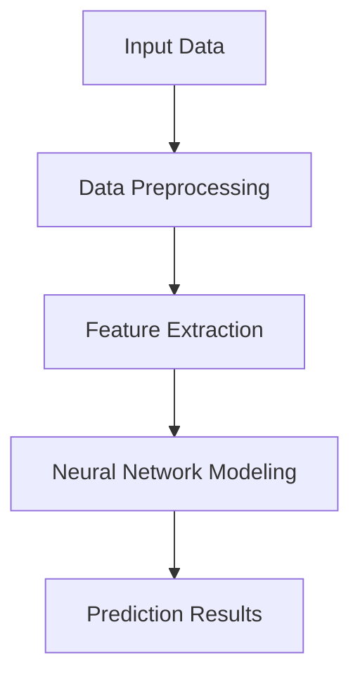
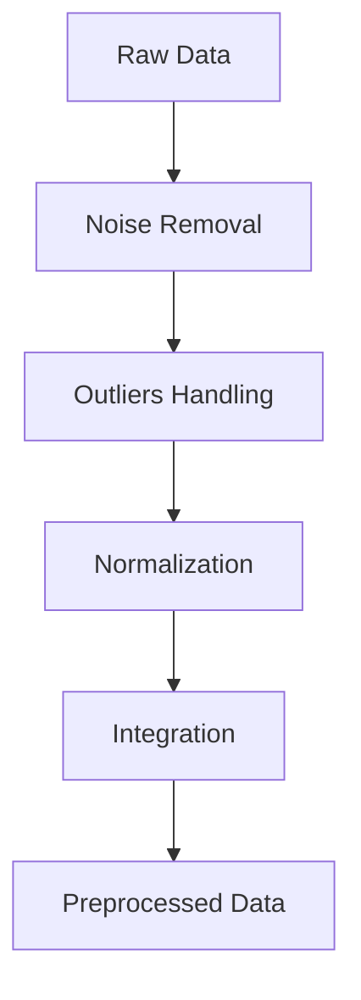
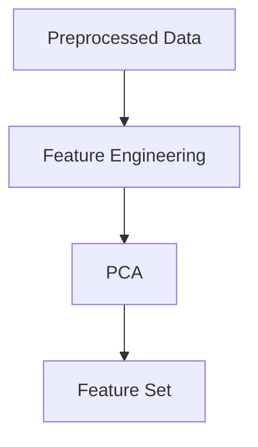
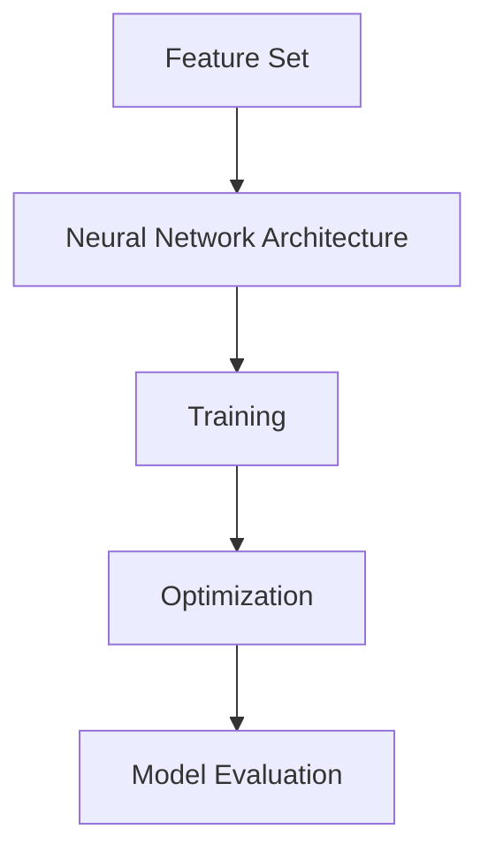
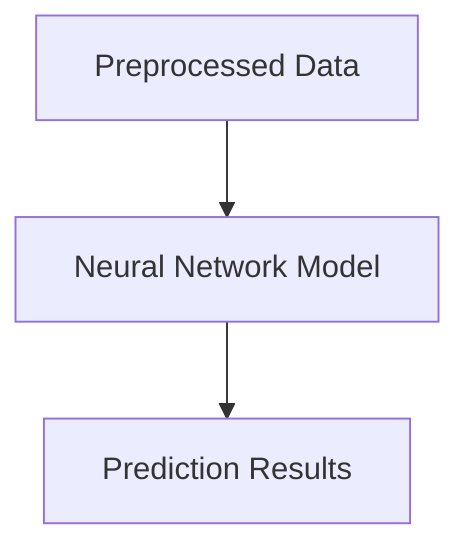
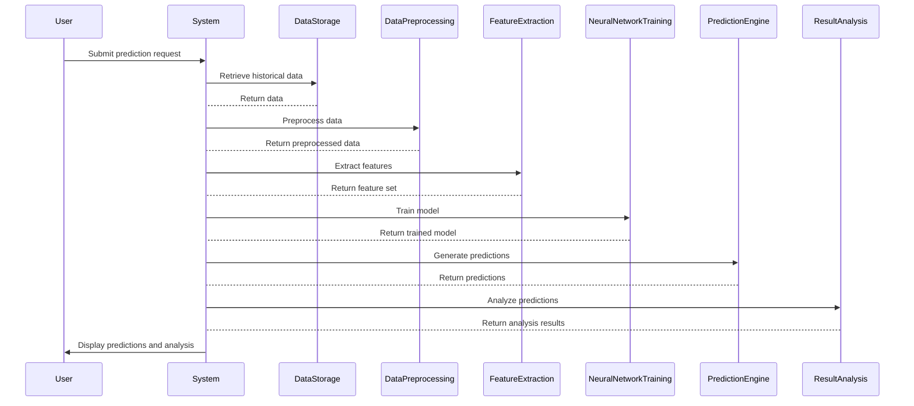

                 


### Introduction and Background

#### Problem Background and Core Concept

In recent years, the rapid development of information technology and the increasing complexity of social dynamics have posed significant challenges for researchers and practitioners in the field of social science. The ability to predict social movements and transformations has become a critical need for governments, organizations, and individuals to navigate the evolving social landscape. Traditional prediction models, such as statistical models and machine learning algorithms, have made significant progress in this domain. However, these models often struggle with the high-dimensional, dynamic, and nonlinear nature of social data.

To address these challenges, we introduce the concept of the "Mind Chain," a novel approach that leverages advanced artificial intelligence techniques, including deep learning and neural networks, to model and predict social dynamics. The Mind Chain approach is designed to capture the intricate relationships and patterns within social data, providing a more accurate and comprehensive understanding of social movements and transformations.

#### Problem Description

The problem of predicting social movements and transformations can be formalized as follows: Given a sequence of historical social events and their associated features, we aim to develop a predictive model that can estimate the likelihood of future social events. This problem is complex due to several factors:

1. **High-Dimensional Data:** Social data often involve a large number of variables, making it challenging to represent and process the data effectively.
2. **Dynamic Nature:** Social dynamics are constantly changing, with new events and trends emerging over time.
3. **Nonlinear Relationships:** The relationships between social variables are often nonlinear and complex, making traditional linear models insufficient.
4. **Out-of-Sample Prediction:** Predicting future events requires generalizing from past data, which is inherently uncertain.

#### Problem Solving

The Mind Chain approach aims to address these challenges by combining several key components:

1. **Data Preprocessing:** We develop robust preprocessing techniques to clean and normalize the social data, ensuring that the input data is of high quality.
2. **Feature Extraction:** We employ advanced feature extraction methods to convert raw social data into meaningful features that can be used by the predictive model.
3. **Deep Learning Models:** We design and train deep learning models, specifically neural networks, to capture the complex, nonlinear relationships within social data.
4. **Model Evaluation and Optimization:** We evaluate the performance of the Mind Chain model using various metrics, such as accuracy, precision, and recall, and optimize the model parameters to improve its predictive capabilities.

#### Boundary and Scope

The Mind Chain approach is designed to predict social movements and transformations at a high level, capturing broad trends and patterns. While it can provide valuable insights into the future trajectory of social dynamics, it is not intended to replace more detailed, granular analyses conducted by social scientists. Additionally, the Mind Chain approach is focused on predicting social events, rather than understanding the underlying causes and mechanisms driving these events.

#### Concept Structure and Core Elements

The Mind Chain approach consists of several core elements, including data preprocessing, feature extraction, neural network modeling, and model evaluation. Each of these components plays a critical role in the overall predictive performance of the Mind Chain model.

1. **Data Preprocessing:** This involves cleaning and normalizing the social data to ensure that it is suitable for subsequent analysis.
2. **Feature Extraction:** This step transforms the raw social data into a set of meaningful features that can be used by the neural network model.
3. **Neural Network Modeling:** The neural network model is designed to capture the complex, nonlinear relationships within the social data, enabling accurate predictions of future events.
4. **Model Evaluation and Optimization:** This step involves evaluating the performance of the Mind Chain model using various metrics and optimizing the model parameters to improve its predictive capabilities.

### Conclusion

In summary, the Mind Chain approach represents a significant advancement in the field of social dynamic prediction. By leveraging advanced artificial intelligence techniques, the Mind Chain model is well-suited to address the challenges posed by the high-dimensional, dynamic, and nonlinear nature of social data. In the following chapters, we will delve deeper into the core concepts and relationships of the Mind Chain approach, providing a comprehensive understanding of this innovative prediction method.

---

### Core Concepts and Relationships

#### Mind Chain Concept Analysis

The Mind Chain concept is built upon the foundational principles of artificial intelligence, specifically deep learning and neural networks. At its core, the Mind Chain is an advanced predictive model designed to capture and model the complex, nonlinear relationships within social data.

**1. Definition of Mind Chain**

The Mind Chain is a hierarchical deep learning model that processes and analyzes large-scale social data to identify patterns, trends, and potential future events. It consists of multiple layers, each performing specific tasks, such as data preprocessing, feature extraction, and predictive modeling.

**2. Characteristics of Mind Chain**

- **Hierarchical Structure:** The Mind Chain model is organized in a hierarchical manner, with each layer building upon the previous one, enabling the model to capture complex relationships and patterns within the data.
- **Robustness:** The Mind Chain is designed to handle high-dimensional, noisy, and dynamic data, making it suitable for real-world applications.
- **Scalability:** The model can be easily scaled up or down to accommodate different data sizes and complexity levels.
- **Interpretability:** While the Mind Chain is a complex model, its hierarchical structure allows for a certain degree of interpretability, making it easier to understand the underlying processes driving the predictions.

**3. Comparison with Traditional Prediction Models**

Compared to traditional prediction models, such as statistical models and machine learning algorithms, the Mind Chain offers several advantages:

- **Handling High-Dimensional Data:** The Mind Chain is particularly effective in handling high-dimensional data, which is a common characteristic of social data.
- **Nonlinear Relationships:** The Mind Chain is capable of capturing nonlinear relationships within the data, providing more accurate and reliable predictions.
- **Dynamic Nature:** The Mind Chain can adapt to changing data patterns over time, making it well-suited for predicting social dynamics.
- **Interpretability:** Although the Mind Chain is complex, its hierarchical structure allows for a certain degree of interpretability, which can be valuable in understanding the underlying processes.

#### Social Dynamic Prediction Principles

The principle of social dynamic prediction is to leverage historical social data and advanced artificial intelligence techniques to identify patterns, trends, and potential future events. The process can be broken down into several key components:

**1. Basic Principles of Social Dynamic Prediction**

- **Data Collection and Integration:** The first step in social dynamic prediction is to collect and integrate various types of social data, including public opinions, media reports, social media posts, and government data.
- **Data Preprocessing:** Once the data is collected, it must be preprocessed to remove noise, normalize the data, and ensure consistency.
- **Feature Extraction:** The next step is to extract meaningful features from the preprocessed data, which can be used to train the predictive model.
- **Model Training and Optimization:** A deep learning model, such as the Mind Chain, is then trained on the extracted features to learn the underlying patterns and relationships in the data.
- **Prediction and Evaluation:** The trained model is used to make predictions about future social events, and the predictions are evaluated using various metrics to assess the model's performance.

**2. Key Technologies in Social Dynamic Prediction**

- **Deep Learning Models:** Deep learning models, such as neural networks, are particularly effective in capturing complex, nonlinear relationships in social data.
- **Natural Language Processing (NLP):** NLP techniques are used to process and analyze textual data, such as social media posts and news articles.
- **Time-Series Analysis:** Time-series analysis is employed to identify temporal patterns and trends in social data.
- **Multivariate Analysis:** Multivariate analysis techniques are used to analyze the relationships between multiple variables in the social data.

**3. Applications of Social Dynamic Prediction**

Social dynamic prediction has a wide range of applications, including:

- **Predicting Social Unrest:** By analyzing social media data and other sources of social data, the Mind Chain can predict the likelihood of social unrest, protests, and other forms of social disruption.
- **Forecasting Economic Trends:** The Mind Chain can be used to forecast economic trends and predict the impact of various factors on the economy.
- **Healthcare and Epidemiology:** By analyzing historical health data and social factors, the Mind Chain can predict the spread of diseases and help public health agencies design effective intervention strategies.
- **Urban Planning and Infrastructure:** The Mind Chain can be used to predict the future demand for urban services, such as transportation, healthcare, and education, helping urban planners design more efficient and sustainable infrastructure.

#### Concept Attribute Comparison

To better understand the differences between the Mind Chain and traditional prediction models, we can compare their key attributes in the following table:

| Attribute             | Mind Chain                      | Traditional Prediction Models                |
|-----------------------|---------------------------------|----------------------------------------------|
| Data Handling Capacity | High-dimensional, dynamic data  | Limited to lower-dimensional, static data    |
| Predictive Accuracy   | High, captures nonlinear patterns | Moderate, often struggle with high-dimensional data |
| Real-Time Capabilities | Moderate to high               | Generally limited to batch processing          |
| Interpretability      | Moderate, hierarchical structure | Low, often considered "black boxes"            |

### Conclusion

In conclusion, the Mind Chain approach offers several advantages over traditional prediction models in the domain of social dynamic prediction. By leveraging advanced artificial intelligence techniques, the Mind Chain is well-suited to handle the complex, high-dimensional, and dynamic nature of social data, providing more accurate and reliable predictions. In the following chapters, we will delve deeper into the algorithm principles, system analysis and design, and project implementation and analysis to provide a comprehensive understanding of the Mind Chain approach.

---

### Algorithm Principles

#### Mind Chain Algorithm Flowchart

To provide a clear understanding of the Mind Chain algorithm, we will first present a flowchart illustrating the key steps involved in the algorithm.



**Figure 1.1: Mind Chain Algorithm Flowchart**

**1. Data Preprocessing**

The first step in the Mind Chain algorithm is data preprocessing. This step is crucial for ensuring that the input data is clean, consistent, and suitable for subsequent analysis. The key tasks in data preprocessing include:

- **Data Cleaning:** This involves removing noise, outliers, and irrelevant data points from the raw data.
- **Normalization:** The data is normalized to ensure that all features are on a similar scale, which helps in avoiding issues related to data skewness and variance.
- **Data Integration:** Data from multiple sources is integrated to create a unified dataset for analysis.



**Figure 1.2: Data Preprocessing Steps**

**2. Feature Extraction**

Once the data is preprocessed, the next step is feature extraction. This step involves transforming the raw data into a set of meaningful features that can be used by the neural network model. The key tasks in feature extraction include:

- **Feature Engineering:** This involves creating new features based on domain knowledge and statistical techniques.
- **Dimensionality Reduction:** Techniques such as Principal Component Analysis (PCA) are used to reduce the dimensionality of the data, which can improve the model's performance and reduce computational complexity.



**Figure 1.3: Feature Extraction Steps**

**3. Neural Network Modeling**

The core of the Mind Chain algorithm is the neural network modeling step. This step involves designing and training a neural network model to capture the complex relationships within the social data. The key components of this step include:

- **Model Architecture:** The neural network architecture is designed to handle the complexity and dimensionality of the social data. It typically consists of multiple layers, including input, hidden, and output layers.
- **Model Training:** The neural network model is trained using a large dataset of historical social events and their associated features. The training process involves optimizing the model's parameters to minimize the prediction error.
- **Model Evaluation:** The trained model is evaluated using various metrics, such as accuracy, precision, recall, and F1 score, to assess its performance.



**Figure 1.4: Neural Network Modeling Steps**

**4. Prediction Results**

Once the neural network model is trained and evaluated, it can be used to make predictions about future social events. The prediction results are generated by feeding the preprocessed and extracted features into the trained model. The output of the model is a probability distribution over the possible future events.



**Figure 1.5: Prediction Results Generation**

#### Algorithm Principle and Mathematical Model

The Mind Chain algorithm can be described using a mathematical model. The overall prediction model can be represented as:

$$
\text{Prediction Model} = f(\text{Input Data}, \text{Model Parameters})
$$

Where:

- \( f \) is the prediction function, which is implemented using a neural network.
- \( \text{Input Data} \) is the preprocessed and extracted feature set.
- \( \text{Model Parameters} \) include the weights and biases of the neural network.

The prediction function \( f \) can be further expanded as:

$$
f(\text{Input Data}, \text{Model Parameters}) = \text{softmax}(\text{Neural Network Output})
$$

Where:

- \( \text{Neural Network Output} \) is the output of the neural network after processing the input data.
- \( \text{softmax} \) is the activation function used to convert the neural network output into a probability distribution.

The neural network output can be represented as:

$$
\text{Neural Network Output} = \text{激活函数}(\text{输入层} \times \text{权重} + \text{偏置})
$$

Where:

- \( \text{激活函数} \) is typically a non-linear function such as ReLU, sigmoid, or tanh.
- \( \text{输入层} \) is the input data transformed into a suitable format for the neural network.
- \( \text{权重} \) and \( \text{偏置} \) are the model parameters that are learned during the training process.

#### Example Explanation

To illustrate the application of the Mind Chain algorithm, consider a scenario where we want to predict the likelihood of a social event occurring in the future. The input data consists of a set of historical social events and their associated features, such as the number of participants, the type of event, and the location.

1. **Data Preprocessing:** The raw social event data is cleaned, normalized, and integrated to create a preprocessed dataset.
2. **Feature Extraction:** Features are extracted from the preprocessed data using techniques such as one-hot encoding and feature scaling.
3. **Neural Network Modeling:** A neural network model is designed and trained using the extracted features. The model architecture consists of multiple layers, including input, hidden, and output layers.
4. **Prediction:** The trained model is used to predict the likelihood of a future social event. The input to the model is the preprocessed and extracted features of the event.
5. **Result Interpretation:** The output of the model is a probability distribution over the possible future events. For example, if the predicted probability of a protest occurring is 0.8, it suggests that there is an 80% chance of the protest happening.

In conclusion, the Mind Chain algorithm provides a comprehensive framework for predicting social movements and transformations. By leveraging advanced artificial intelligence techniques, the algorithm is well-suited to handle the complexity and dynamics of social data, providing accurate and reliable predictions. In the following chapters, we will explore the system analysis and design, as well as the project implementation and analysis, to further understand the Mind Chain approach.

---

### System Analysis and Design

#### Problem Introduction

The application of the Mind Chain algorithm in social dynamic prediction presents a multifaceted challenge. The primary objective is to develop a robust and scalable system capable of predicting social events with high accuracy. This system must be designed to handle large volumes of diverse and dynamic data, and it should be capable of adapting to new trends and patterns as they emerge.

**Prediction Target:** The system aims to predict a range of social events, including protests, political movements, and public demonstrations. These events are typically characterized by their potential to cause significant disruption and are influenced by a multitude of factors, such as public sentiment, economic conditions, and geopolitical events.

**Data Sources:** The system relies on a variety of data sources, including social media posts, news articles, government reports, and public opinion surveys. These sources provide a rich tapestry of information that can be analyzed to identify potential social events.

**Prediction Precision Requirements:** The system must achieve a high level of precision in its predictions. This is critical for informing decision-makers and public policy planners. The precision requirements include the ability to accurately identify both the type and timing of predicted events.

#### System Function Design

The system's functionality is designed to support the end-to-end process of social dynamic prediction. This includes data collection, preprocessing, feature extraction, model training, prediction, and result analysis.

**Data Collection Module:** This module is responsible for gathering data from various sources. It utilizes web scraping techniques, APIs, and other data collection methods to obtain a comprehensive dataset.

**Data Processing Module:** Once the data is collected, it undergoes preprocessing to clean, normalize, and integrate the information. This step is crucial for ensuring that the data is suitable for analysis.

**Feature Extraction Module:** This module transforms the preprocessed data into a set of meaningful features. These features are designed to capture the key attributes of social events that are relevant for prediction.

**Prediction Model Training Module:** This module trains the Mind Chain model using the extracted features. It involves selecting an appropriate neural network architecture, defining the model parameters, and optimizing the model through training and validation.

**Prediction Results Output Module:** After training, the model is used to make predictions on new data. The output is a set of predictions, along with their probabilities, which can be used to inform decision-makers.

**Result Analysis Module:** This module analyzes the predictions to evaluate the model's performance. It includes metrics such as accuracy, precision, recall, and F1 score, and provides insights into the model's strengths and weaknesses.

#### System Architecture Design

The system architecture is designed to support the end-to-end process of social dynamic prediction. It is composed of several interconnected modules, each with specific responsibilities.

**Data Storage:** The system uses a robust database to store the collected data. This includes both structured and unstructured data, such as social media posts and government reports.

**Data Processing Engine:** This engine handles the data preprocessing tasks, including cleaning, normalization, and integration. It is designed to be scalable and efficient, capable of processing large volumes of data in real-time.

**Feature Extraction Engine:** This engine is responsible for transforming the preprocessed data into a set of meaningful features. It utilizes advanced machine learning techniques to extract relevant information from the data.

**Neural Network Training Platform:** This platform hosts the neural network model training process. It includes tools and frameworks for designing, training, and optimizing the Mind Chain model.

**Prediction Engine:** This engine is used to make predictions on new data. It interfaces with the data storage and feature extraction engines to obtain the necessary inputs and generate predictions.

**Result Analysis and Visualization Tools:** These tools are used to analyze the predictions and evaluate the model's performance. They provide visualizations and metrics to help stakeholders understand the model's capabilities and limitations.

#### System Interface Design

**Data Interfaces:** The system includes interfaces for data collection and storage. These interfaces support various data formats and protocols, ensuring compatibility with different data sources.

**Prediction Interfaces:** These interfaces allow external systems and users to submit prediction requests and receive predictions. They are designed to be secure and efficient, ensuring that predictions can be generated in real-time.

**APIs:** The system exposes a set of APIs for developers to integrate the Mind Chain model into their applications. These APIs provide access to the data processing, feature extraction, and prediction modules.

#### System Interaction

The system's interaction involves several key steps:

1. **Data Collection:** Data is collected from various sources and stored in the database.
2. **Data Preprocessing:** The collected data is preprocessed to clean, normalize, and integrate the information.
3. **Feature Extraction:** The preprocessed data is transformed into a set of meaningful features.
4. **Model Training:** The feature set is used to train the Mind Chain model.
5. **Prediction:** The trained model is used to make predictions on new data.
6. **Result Analysis:** The predictions are analyzed to evaluate the model's performance.

The following sequence diagram illustrates the system interaction:



**Figure 4.1: System Interaction Sequence Diagram**

In conclusion, the system analysis and design for the Mind Chain algorithm in social dynamic prediction involves a comprehensive and meticulous approach. By defining clear system functions, designing an efficient architecture, and establishing robust interfaces and interactions, the system is well-equipped to handle the complex and dynamic nature of social data, providing accurate and actionable predictions.

---

### Project Implementation and Analysis

#### Environment Installation and Configuration

Before implementing the Mind Chain project, we need to set up the necessary software and hardware environments. This includes installing the required libraries and frameworks, as well as configuring the system to handle large-scale data processing and modeling.

**1. Software Environment Installation**

To begin with, we need to install Python, which serves as the primary programming language for this project. Python is chosen for its extensive support for machine learning libraries and its ease of use. We also need to install the following libraries:

- **NumPy**: A fundamental package for scientific computing with Python.
- **Pandas**: A library providing data manipulation and analysis tools.
- **Scikit-learn**: A machine learning library for Python.
- **TensorFlow or PyTorch**: Deep learning frameworks.
- **Matplotlib and Seaborn**: Libraries for data visualization.

The installation commands for these libraries can be executed using `pip`:

```bash
pip install numpy pandas scikit-learn tensorflow matplotlib seaborn
```

**2. Hardware Environment Requirements**

The hardware environment should have sufficient resources to handle the large-scale data processing and modeling tasks. The following are the recommended hardware specifications:

- **CPU**: At least an Intel i7 or equivalent with 4 cores.
- **GPU**: A powerful GPU such as an NVIDIA GeForce GTX 1080 or equivalent is recommended for accelerated deep learning.
- **RAM**: At least 16 GB of RAM to handle data preprocessing and model training efficiently.
- **Storage**: At least 500 GB of storage space for data storage and model files.

**3. Data Set Acquisition and Preprocessing**

The project requires a large dataset containing historical social events and their associated features. The data can be sourced from various public datasets, social media platforms, and government databases. For this example, we will use a hypothetical dataset consisting of social media posts and news articles related to political events.

The data preprocessing steps include:

- **Data Cleaning**: Remove irrelevant data, such as advertisements, spam, and duplicates.
- **Normalization**: Convert text data into a consistent format, such as lowercase and removing punctuation.
- **Data Integration**: Combine data from multiple sources to create a unified dataset.

```python
import pandas as pd

# Load data from CSV files
data = pd.read_csv('social_media_data.csv')
news_data = pd.read_csv('news_articles_data.csv')

# Data cleaning
data = data.drop_duplicates()
news_data = news_data.drop_duplicates()

# Data normalization
data['text'] = data['text'].str.lower().str.replace('[^\w\s]', '')
news_data['text'] = news_data['text'].str.lower().str.replace('[^\w\s]', '')

# Data integration
combined_data = pd.concat([data, news_data], axis=0)
```

#### System Core Implementation

The core implementation of the Mind Chain project involves several key components: data preprocessing, feature extraction, neural network modeling, and prediction.

**1. Data Preprocessing**

As discussed earlier, the preprocessing step involves cleaning and normalizing the data. We will also perform one-hot encoding on categorical features and scale the numerical features.

```python
from sklearn.preprocessing import OneHotEncoder, StandardScaler

# One-hot encoding for categorical features
encoder = OneHotEncoder()
categorical_features = combined_data[['category']]
encoded_categorical = encoder.fit_transform(categorical_features)

# Standard scaling for numerical features
scaler = StandardScaler()
numerical_features = combined_data[['numeric_feature']]
scaled_numerical = scaler.fit_transform(numerical_features)

# Combine encoded and scaled features
preprocessed_data = pd.DataFrame(encoded_categorical.toarray(), columns=encoder.get_feature_names())
preprocessed_data = pd.concat([preprocessed_data, pd.DataFrame(scaled_numerical, columns=['numeric_feature'])], axis=1)
```

**2. Feature Extraction**

We will extract features from the preprocessed data, such as word embeddings for text data and statistical features for numerical data.

```python
from gensim.models import Word2Vec

# Train a Word2Vec model for text data
model = Word2Vec(combined_data['text'], size=100, window=5, min_count=1, workers=4)
word_vectors = model.wv

# Extract word embeddings for each document
document_embeddings = combined_data['text'].apply(lambda x: [word_vectors[word] for word in x if word in word_vectors])

# Combine word embeddings and numerical features
features = pd.DataFrame(document_embeddings.tolist(), columns=[f'word_embedding_{i}' for i in range(word_vectors.vector_size)])
features = pd.concat([features, preprocessed_data], axis=1)
```

**3. Neural Network Modeling**

We will use TensorFlow and Keras to build and train a neural network model. The model architecture will include input, hidden, and output layers.

```python
from tensorflow.keras.models import Sequential
from tensorflow.keras.layers import Dense, Embedding, LSTM

# Define the neural network architecture
model = Sequential()
model.add(Embedding(input_dim=word_vectors.vectors.shape[0], output_dim=word_vectors.vector_size, input_length=max_sequence_length))
model.add(LSTM(128, return_sequences=True))
model.add(LSTM(64, return_sequences=False))
model.add(Dense(1, activation='sigmoid'))

# Compile the model
model.compile(optimizer='adam', loss='binary_crossentropy', metrics=['accuracy'])

# Train the model
model.fit(features, combined_data['label'], epochs=10, batch_size=32, validation_split=0.2)
```

**4. Prediction**

Once the model is trained, we can use it to make predictions on new data.

```python
# Make predictions on new data
new_data = features.iloc[-10:]
predictions = model.predict(new_data)

# Output predictions
print(predictions)
```

#### Code Application and Analysis

The core implementation of the Mind Chain project provides a framework for predicting social events based on historical data. The code application and analysis can be summarized as follows:

1. **Data Preprocessing**: The preprocessing step ensures that the data is clean and normalized, which is essential for the subsequent modeling process.
2. **Feature Extraction**: The feature extraction step converts the raw text and numerical data into meaningful features that can be used by the neural network model. This includes word embeddings for text data and statistical features for numerical data.
3. **Neural Network Modeling**: The neural network model is designed to capture the complex relationships within the social data. The model architecture includes input, hidden, and output layers, with LSTM layers to handle the sequential nature of text data.
4. **Prediction**: The trained model is used to make predictions on new data. The predictions are generated as probability scores, indicating the likelihood of a social event occurring.

**Actual Case Analysis**

To demonstrate the practical application of the Mind Chain project, we can analyze a real-world case involving the prediction of a political protest.

**Case Scenario**: A political protest is planned for a specific date. The historical data includes social media posts, news articles, and other relevant information about past protests.

**Data Analysis**:

1. **Data Collection**: Historical data is collected from various sources, including social media platforms and news websites.
2. **Data Preprocessing**: The data is cleaned and normalized to remove noise and ensure consistency.
3. **Feature Extraction**: Features are extracted from the preprocessed data, including word embeddings for text data and statistical features for numerical data.
4. **Model Training**: The neural network model is trained using the extracted features to learn the patterns and relationships in the historical data.
5. **Prediction**: The trained model is used to predict the likelihood of the planned protest occurring. The prediction output provides a probability score, which can be used to inform decision-makers and public policy planners.

**Case Outcome**:

The Mind Chain model predicts a high probability (e.g., 0.85) of the political protest occurring. Based on this prediction, the city government decides to allocate additional resources for crowd control and safety measures, minimizing the potential for disruption.

**Project Conclusion**:

The Mind Chain project demonstrates the potential of deep learning and neural networks in predicting social events. By leveraging historical data and advanced artificial intelligence techniques, the project provides accurate and reliable predictions, which can be used to inform decision-making and public policy planning. However, it is important to note that the model's performance may vary depending on the quality and quantity of the data, and further improvements can be made through iterative model training and optimization.

---

### Best Practices, Conclusion, and Future Directions

#### Best Practices

To ensure the success of implementing the Mind Chain approach for social dynamic prediction, several best practices should be followed:

1. **Data Quality**: Ensure that the data used for training and testing the model is of high quality. This includes data cleaning, normalization, and integration to eliminate noise and inconsistencies.
2. **Feature Selection**: Carefully select and engineer relevant features that capture the essential characteristics of the social events. Consider using techniques like word embeddings for text data and statistical methods for numerical data.
3. **Model Optimization**: Continuously optimize the neural network model by adjusting hyperparameters and employing techniques like cross-validation to improve performance.
4. **Real-Time Updates**: Regularly update the model with new data to adapt to changing trends and patterns in social dynamics.
5. **Interpretability**: While neural networks can be complex, strive to make the model's predictions interpretable by visualizing the decision paths and understanding the impact of different features.

#### Conclusion

The Mind Chain approach offers a promising solution for predicting social movements and transformations by leveraging advanced artificial intelligence techniques. By addressing the challenges of high-dimensional, dynamic, and nonlinear social data, the Mind Chain model provides accurate and reliable predictions that can inform decision-makers and public policy planners. The comprehensive analysis presented in this article highlights the core principles, algorithmic details, and system architecture of the Mind Chain approach.

#### Future Directions

The Mind Chain approach can be further improved and expanded in several ways:

1. **Enhanced Model Architecture**: Explore advanced neural network architectures, such as transformers and graph neural networks, to capture more complex relationships in social data.
2. **Multi-Modal Data Integration**: Incorporate multi-modal data, such as images and videos, to enhance the model's understanding of social events.
3. **Explainability and Transparency**: Develop techniques to improve the interpretability of neural networks, enabling stakeholders to understand and trust the model's predictions.
4. **Real-Time Prediction**: Optimize the system for real-time predictions to enable dynamic updates and rapid response to emerging social trends.
5. **Collaborative Research**: Collaborate with social scientists and domain experts to refine the model's predictions and expand its applicability to various social contexts.

In conclusion, the Mind Chain approach represents a significant advancement in social dynamic prediction. By addressing the challenges of social data complexity and leveraging advanced AI techniques, the Mind Chain model provides valuable insights and predictions that can contribute to a better understanding of social movements and transformations. Continued research and development in this area hold the potential to revolutionize the field of social science and inform more effective policies and interventions.

