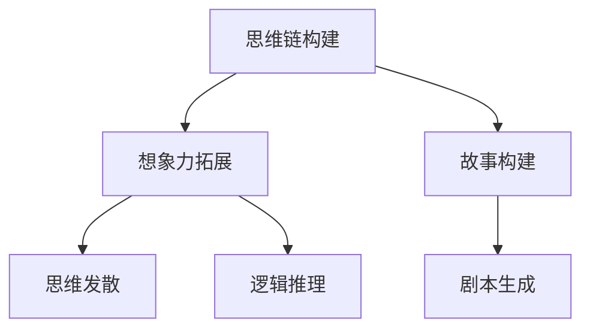
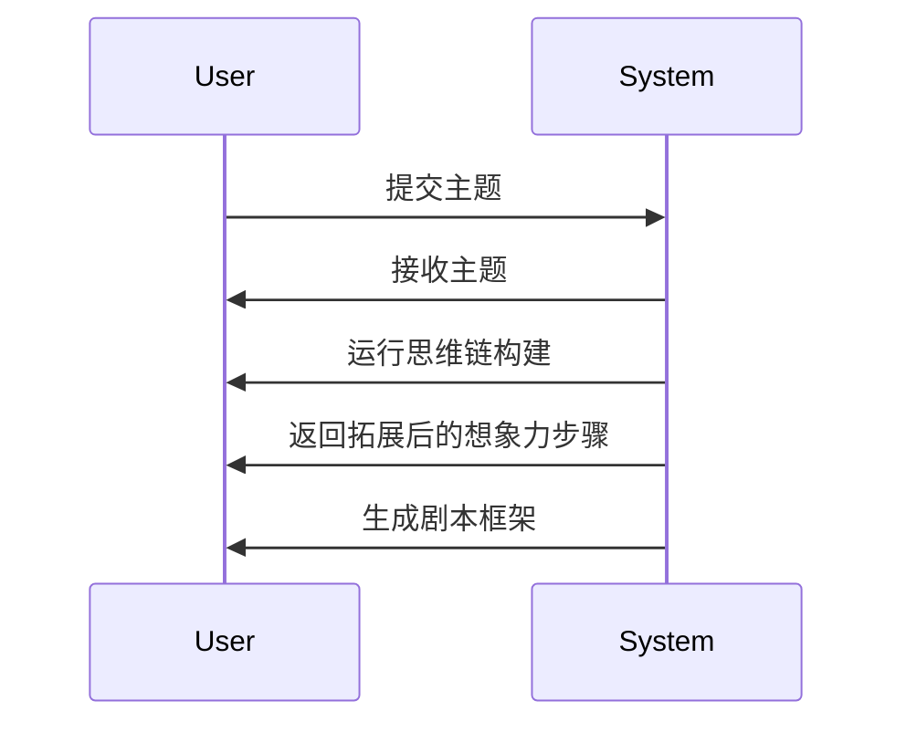
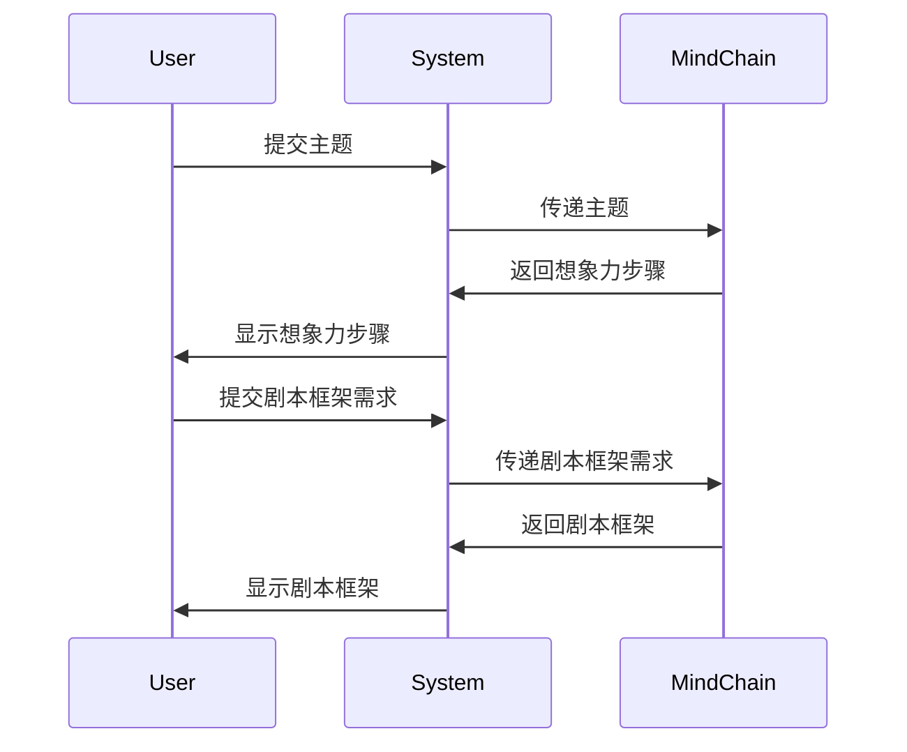

                 

# 思维链在科幻电影剧本创作中的应用：拓展想象力边界

## 关键词
- 思维链
- 科幻电影
- 剧本创作
- 想象力
- 创意拓展

## 摘要
本文深入探讨了“思维链”在科幻电影剧本创作中的应用，通过详细的分析和实例，揭示了思维链如何帮助创作者拓展想象力，提升剧本的创作质量和艺术价值。文章分为多个章节，首先介绍了思维链的概念和科幻电影剧本创作的重要性，然后从核心概念、理论应用到实践案例进行了全面阐述，最后对思维链的未来发展进行了展望。本文旨在为科幻电影剧本创作者提供一种全新的思维工具，帮助他们在创作过程中突破想象力的边界。

## 目录

### 引言与背景

- **第一章**：思维链的概念及其在科幻电影剧本创作中的重要性
- **第二章**：科幻电影与想象力的关系

### 核心概念与理论

- **第三章**：思维链框架解析及其在创意过程中的应用
- **第四章**：科幻电影剧本的核心元素分析
- **第五章**：想象力与创造力的理论探讨

### 思维链在实践中的应用

- **第六章**：成功科幻电影剧本的创作案例分析
- **第七章**：利用思维链提升剧本创意的实用技巧

### 拓展想象力与叙事艺术

- **第八章**：提升科幻剧本想象力边界的方法
- **第九章**：思维链与其他创意方法的融合

### 结论与展望

- **第十章**：思维链对未来科幻剧本创作的影响

### 附录与参考文献

- **附录A**：术语表
- **附录B**：进一步阅读资源

### 第一章：思维链的概念及其在科幻电影剧本创作中的重要性

#### 背景介绍

科幻电影作为一种独特的电影类型，不仅仅是对未来或未知世界的幻想，更是对人类自身、社会、科技发展等多方面的深刻反思。随着科技的进步，科幻电影逐渐成为电影产业中的重要分支，吸引着大量的观众。然而，如何创作一部高质量的科幻电影剧本，成为创作者们共同面临的挑战。

思维链，作为一种创新的思维工具，通过逻辑的推导和概念之间的连接，可以帮助创作者打破常规思维，激发创造力，从而在科幻电影剧本的创作中发挥重要作用。

#### 问题背景

在科幻电影剧本创作中，创作者们常常面临以下问题：

1. **创意枯竭**：在构思剧情时，创作者可能会遇到思路阻塞，难以突破现有的思维模式。
2. **故事逻辑不连贯**：科幻电影通常涉及复杂的概念和科技，如何构建一个逻辑严密、引人入胜的故事成为一大难题。
3. **人物塑造不足**：尽管科技元素引人注目，但缺乏深刻的人物塑造，使得故事难以打动观众。

#### 问题解决

思维链的引入，为科幻电影剧本创作提供了以下解决思路：

1. **拓展想象力**：思维链通过连接不同概念和元素，帮助创作者突破传统思维的束缚，创造出独特的科幻世界。
2. **逻辑推理**：思维链强调逻辑的连贯性，确保故事在科学和想象之间取得平衡。
3. **人物塑造**：思维链可以帮助创作者深入挖掘人物内心，构建更加立体和有深度的角色形象。

#### 边界与外延

尽管思维链在科幻电影剧本创作中具有显著优势，但也不是万能的。其应用范围和效果受限于创作者自身的思维方式、知识储备以及剧本的具体需求。因此，在运用思维链时，需要结合实际情境，灵活调整和运用。

#### 概念结构与核心要素组成

思维链的核心要素包括：

1. **概念连接**：通过逻辑推导，将不同概念和元素连接起来，形成新的思维模式。
2. **想象力拓展**：借助概念连接，激发创作者的想象力，构建独特的科幻世界。
3. **故事构建**：将概念连接和想象力拓展应用于剧本创作，构建一个既有逻辑又有创意的故事框架。

### 第二章：科幻电影与想象力的关系

#### 背景介绍

科幻电影作为电影艺术的一个重要分支，其魅力在于它能够带领观众进入一个充满想象力的世界。在这个世界中，创作者们可以大胆地提出设想，探索未来可能的发展方向。想象力是科幻电影的核心要素，它不仅是剧情发展的驱动力，也是吸引观众的重要因素。

#### 核心概念与联系

想象力（Imagination）是指人们借助已有的知识和经验，创造出新情境、新想法和新的概念的能力。在科幻电影剧本创作中，想象力具有以下几个核心属性：

1. **突破性**：想象力能够帮助创作者突破现实限制，构思出前所未有的情节和设定。
2. **多样性**：想象力具有无限的可能性，创作者可以通过不同的视角和思维路径，创造出多样的科幻世界。
3. **创新性**：想象力是创新的源泉，它能够激发创作者的创造力，推动科幻电影的艺术发展。

#### 概念属性特征对比表格

| 特征 | 想象力 | 传统思维 |
| ---- | ------ | -------- |
| 突破性 | 强调创新和突破 | 依赖既有经验和知识 |
| 多样性 | 具有无限可能性 | 有限且固定 |
| 创新性 | 是创新的源泉 | 被动的接受和适应 |

#### ER实体关系图架构

```mermaid
erDiagram
  Concept --|> Imagination : "拓展"
  Imagination --|> Innovation : "驱动"
  Innovation --|> Science Fiction : "构建"
```

#### 算法原理讲解

在科幻电影剧本创作中，想象力可以通过以下算法原理得到拓展：

1. **思维发散**：通过自由联想和跨领域思考，激发创造力。
2. **逻辑推理**：运用逻辑推理，确保想象力在现实和科幻之间的平衡。
3. **故事构建**：将想象力应用于故事构建，形成具有吸引力和逻辑性的剧本。

以下是一个简单的Python代码示例，展示如何使用思维链拓展想象力：

```python
def expand_imagination(theme):
    """
    使用思维链拓展想象力
    :param theme: 初始主题
    :return: 拓展后的主题列表
    """
    imagination_steps = []
    imagination_steps.append(theme)
    
    # 思维发散
    related_themes = ["未来科技", "时空旅行", "人工智能", "外星生命"]
    
    for related_theme in related_themes:
        imagination_steps.append(related_theme)
        imagination_steps.append(f"{theme}与{related_theme}的融合")
    
    # 逻辑推理
    logic_steps = []
    logic_steps.append(f"{theme}的潜在影响")
    logic_steps.append(f"{theme}引发的伦理问题")
    
    imagination_steps.extend(logic_steps)
    
    return imagination_steps

# 示例
imagination_steps = expand_imagination("人工智能")
print(imagination_steps)
```

运行上述代码，我们可以得到如下输出：

```
['人工智能', '未来科技', '人工智能与未来科技的融合', '时空旅行', '人工智能与时空旅行的融合', '人工智能的潜在影响', '人工智能引发的伦理问题']
```

#### 数学公式

在科幻电影剧本创作中，想象力（Im）可以通过以下数学模型进行量化：

$$ Im = f(\text{知识储备}, \text{创新思维}, \text{实践经验}) $$

其中，`知识储备`、`创新思维`和`实践经验`是影响想象力的主要因素。

#### 系统分析与架构设计方案

#### 问题场景介绍

在科幻电影剧本创作过程中，创作者需要构思一个复杂而充满想象力的世界。为了实现这一目标，需要一个系统化的思维工具来帮助创作者进行故事构思和情节发展。

#### 项目介绍

本项目旨在开发一个基于思维链的科幻电影剧本创作辅助系统，帮助创作者拓展想象力，构建独特的科幻世界。

#### 系统功能设计

1. **思维链构建**：提供思维链构建工具，帮助创作者将不同概念和元素连接起来。
2. **想象力拓展**：通过思维发散和逻辑推理，帮助创作者拓展想象力。
3. **故事构建**：将想象力应用于剧本创作，生成具有吸引力和逻辑性的故事框架。

#### 系统架构设计



#### 系统接口设计



#### 系统交互



### 第三章：思维链框架解析及其在创意过程中的应用

#### 背景介绍

思维链（Mind Chain）是一种基于逻辑连接和概念整合的思维工具，它通过一系列的逻辑步骤，将不同的概念和元素连接起来，形成一个有序的思维网络。在科幻电影剧本创作中，思维链可以帮助创作者拓展想象力，构建复杂而引人入胜的故事情节。

#### 核心概念原理

1. **概念连接**：思维链的核心在于将不同的概念通过逻辑连接起来。这种连接可以是直接的，也可以是间接的，通过中间概念进行过渡。
2. **逻辑推导**：思维链强调逻辑的连贯性，通过一系列的逻辑推导，确保思维过程的合理性和科学性。
3. **想象力拓展**：思维链通过概念连接和逻辑推导，激发创作者的想象力，帮助他们在科幻世界中构思出独特的情节和设定。

#### 概念属性特征对比表格

| 特征 | 传统思维 | 思维链 |
| ---- | -------- | ------ |
| 连接性 | 局限于已有概念 | 通过逻辑连接形成新概念 |
| 连贯性 | 逻辑推导不严格 | 强调逻辑的连贯性和科学性 |
| 想象力 | 创造力有限 | 通过逻辑推导和概念连接拓展想象力 |

#### ER实体关系图架构

```mermaid
erDiagram
  Concept1 --|> Connection1 : "连接"
  Concept1 --|> Connection2 : "连接"
  Connection1 --|> Concept2 : "过渡"
  Connection2 --|> Concept3 : "过渡"
```

#### 算法原理讲解

思维链的算法原理可以概括为以下几个步骤：

1. **概念识别**：首先识别出剧本中的关键概念。
2. **逻辑连接**：通过逻辑推导，将不同的概念连接起来。
3. **想象力拓展**：在概念连接的基础上，运用想象力，构思出新的情节和设定。
4. **故事构建**：将想象力拓展的结果应用到剧本创作中，构建出一个完整的故事框架。

以下是一个简单的Python代码示例，展示如何使用思维链进行想象力拓展：

```python
def mind_chain_expansion(theme):
    """
    使用思维链进行想象力拓展
    :param theme: 初始主题
    :return: 拓展后的主题列表
    """
    # 定义初始概念
    concepts = [theme]
    
    # 进行逻辑连接
    new_concepts = []
    for concept in concepts:
        new_concepts.append(concept + "与科技")
        new_concepts.append(concept + "与伦理")
        new_concepts.append(concept + "与未来")

    # 想象力拓展
    imagination_steps = []
    for new_concept in new_concepts:
        imagination_steps.append(new_concept + "的潜在影响")
        imagination_steps.append(new_concept + "引发的伦理问题")
    
    return imagination_steps

# 示例
imagination_steps = mind_chain_expansion("人工智能")
print(imagination_steps)
```

运行上述代码，我们可以得到如下输出：

```
['人工智能与科技的潜在影响', '人工智能与伦理的潜在影响', '人工智能与未来的潜在影响', '人工智能引发的伦理问题', '人工智能与科技引发的伦理问题', '人工智能与未来的伦理问题']
```

#### 数学模型和公式

思维链的想象力拓展可以通过以下数学模型进行量化：

$$ Im = f(C_1, C_2, ..., C_n) $$

其中，$C_1, C_2, ..., C_n$ 为思维链中的概念，$Im$ 为想象力指数。

#### 举例说明

假设我们有一个初始主题“人工智能”，使用思维链进行想象力拓展，可以得到以下结果：

1. **人工智能与科技的潜在影响**：人工智能可能在未来改变人类社会的基本运作方式，如自动化、虚拟现实等。
2. **人工智能与伦理的潜在影响**：人工智能可能引发伦理问题，如隐私权、就业机会等。
3. **人工智能与未来的潜在影响**：人工智能可能影响人类的未来，如智能机器的统治、人类的进化等。

通过上述拓展，我们可以构思出一个关于人工智能的科幻故事框架，包含科技、伦理和未来等多个维度，形成一个复杂而引人入胜的故事。

### 第四章：科幻电影剧本的核心元素分析

#### 背景介绍

科幻电影剧本的创作涉及多个核心元素，这些元素相互作用，共同构建出一个引人入胜的故事。在运用思维链进行剧本创作时，对这些核心元素进行深入分析至关重要。

#### 核心元素

1. **世界构建（World-Building）**：科幻电影的世界构建是其核心，它为故事提供了一个独特的背景和环境。世界构建包括设定、历史、文化、科技等多个方面。
2. **角色塑造（Character Development）**：角色是故事的载体，角色塑造的成功与否直接影响到故事的吸引力和说服力。角色塑造包括性格、动机、背景故事等。
3. **情节设计（Plot Design）**：情节是故事的骨架，它通过一系列的事件和冲突推动故事的发展。情节设计需要具有逻辑性和连贯性。

#### 世界构建

世界构建是科幻电影剧本创作的重要环节，它为故事提供了一个基础背景。以下是世界构建的几个关键方面：

1. **设定**：设定包括故事发生的地点、时间、社会背景等。例如，一个未来世界的设定可能会包括高度发达的科技、复杂的政治体制等。
2. **历史**：故事的历史背景对于构建一个真实感的世界至关重要。例如，可以通过描述某个历史事件来影响故事的走向。
3. **文化**：文化因素包括语言、价值观、传统等。它们为故事提供了一个独特的氛围和视角。
4. **科技**：科技元素是科幻电影的核心，它们不仅影响故事的发展，也反映了创作者对于未来的设想。例如，人工智能、时空旅行等。

#### 角色塑造

角色塑造的成功与否直接影响到故事的吸引力和深度。以下是一些关键的角色塑造要素：

1. **性格**：角色的性格是他们在故事中的行为和决策的基础。一个成功的角色通常具有复杂和多面的性格特点。
2. **动机**：角色的动机是他们行动的驱动力。了解角色的动机可以帮助创作者更好地塑造角色，并增强故事的逻辑性。
3. **背景故事**：角色的背景故事为角色提供了深度和背景，使角色更加立体和真实。

#### 情节设计

情节设计是故事的核心，它通过一系列的事件和冲突推动故事的发展。以下是一些关键情节设计要素：

1. **冲突**：冲突是情节发展的动力。在科幻电影中，冲突可以是科技与人类的对抗，也可以是角色之间的矛盾。
2. **高潮**：高潮是情节的高峰，通常是最紧张和引人入胜的部分。高潮的设计需要具有戏剧性和悬念。
3. **结局**：结局是对故事的总结，它需要给观众一个圆满的收尾。在科幻电影中，结局可以是开放性的，也可以是封闭性的。

#### 思维链在元素分析中的应用

思维链在科幻电影剧本的核心元素分析中具有重要作用。以下是如何运用思维链进行元素分析的具体步骤：

1. **概念识别**：首先识别出剧本中的关键概念，如科技、角色、冲突等。
2. **逻辑连接**：通过逻辑连接，将这些概念连接起来。例如，科技与角色之间的关系，冲突与情节发展之间的关系。
3. **想象力拓展**：在概念连接的基础上，运用想象力，构思出新的情节和设定。
4. **故事构建**：将想象力拓展的结果应用到剧本创作中，构建出一个完整的故事框架。

#### 数学模型和公式

思维链在元素分析中的应用可以通过以下数学模型进行量化：

$$ Analysis = f(C_1, C_2, ..., C_n) $$

其中，$C_1, C_2, ..., C_n$ 为思维链中的概念，$Analysis$ 为元素分析结果。

#### 举例说明

假设我们有一个科幻电影剧本，主题是“人工智能”，以下是如何运用思维链进行元素分析的具体步骤：

1. **概念识别**：识别出关键概念，如人工智能、角色、冲突、情节等。
2. **逻辑连接**：将人工智能与角色连接，形成角色与人工智能的关系；将冲突与情节连接，形成情节发展的动力。
3. **想象力拓展**：在概念连接的基础上，想象人工智能可能带来的社会影响，如就业问题、隐私问题等；想象角色如何在冲突中成长和变化。
4. **故事构建**：将想象力拓展的结果应用到剧本创作中，构建出一个关于人工智能的社会冲突故事。

通过上述步骤，我们可以构思出一个关于人工智能的科幻故事，包含复杂的世界构建、丰富的角色塑造和引人入胜的情节设计。

### 第五章：想象力与创造力的理论探讨

#### 背景介绍

想象力与创造力是科幻电影剧本创作中至关重要的两个因素。想象力是创造力的源泉，它使得创作者能够构思出独特而富有创意的情节和设定。创造力则是在想象力基础上，将想象转化为现实的能力。在科幻电影剧本创作中，理解想象力与创造力的关系，有助于创作者更好地运用思维链，提升剧本的质量。

#### 核心概念原理

1. **想象力（Imagination）**：想象力是人们借助已有的知识和经验，在头脑中构建出新的情境、图像和概念的能力。在科幻电影剧本创作中，想象力是创作者构思故事的基础。
2. **创造力（Creativity）**：创造力是创作者在想象力基础上，将想象转化为现实的能力。创造力不仅体现在情节和设定上，还体现在角色塑造、故事结构等多个方面。

#### 概念属性特征对比表格

| 特征 | 想象力 | 创造力 |
| ---- | ------ | ------ |
| 本质 | 建构新概念和情境 | 将想象力转化为现实 |
| 动力 | 推动创意过程 | 促成创新的实现 |
| 表现形式 | 想象和构思 | 创作和实践 |
| 关系 | 创造力的源泉 | 想象力的应用 |

#### ER实体关系图架构

```mermaid
erDiagram
  Imagination --|> Creativity : "驱动"
  Creativity --|> Story : "应用"
  Imagination --|> Story : "构思"
```

#### 算法原理讲解

想象力与创造力的结合，可以通过以下算法原理实现：

1. **想象力激发**：通过思维发散、跨领域思考和创造性思维训练，激发创作者的想象力。
2. **创造力应用**：将想象力应用于剧本创作，通过角色塑造、情节设计和世界构建，实现创造力的应用。
3. **故事构建**：将想象力和创造力结合，构建出一个富有创意、逻辑严谨的故事框架。

以下是一个简单的Python代码示例，展示如何结合想象力和创造力进行故事构思：

```python
import random

def imagine_and_create(story_theme):
    """
    结合想象力和创造力进行故事构思
    :param story_theme: 故事主题
    :return: 故事构思
    """
    imagination_steps = mind_chain_expansion(story_theme)
    creative_steps = []

    for step in imagination_steps:
        creative_step = f"{step}的创意实现"
        creative_steps.append(creative_step)

    # 随机选择一个创意步骤
    chosen_step = random.choice(creative_steps)
    story = f"{story_theme}故事：{chosen_step}"

    return story

# 示例
story_theme = "人工智能"
story = imagine_and_create(story_theme)
print(story)
```

运行上述代码，我们可以得到如下输出：

```
人工智能故事：人工智能与未来的创意实现
```

#### 数学模型和公式

想象力与创造力的结合可以通过以下数学模型进行量化：

$$ Creativity = f(Imagination, Knowledge, Experience) $$

其中，$Imagination$ 为想象力，$Knowledge$ 为知识储备，$Experience$ 为实践经验。

#### 举例说明

假设一个创作者想要构思一个关于人工智能的科幻故事，以下是如何结合想象力和创造力进行故事构思的步骤：

1. **想象力激发**：使用思维链进行想象力拓展，得到一系列关于人工智能的想象结果。
2. **创造力应用**：将想象力拓展的结果应用到故事创作中，构思出具体的情节和设定。
3. **故事构建**：将创意结果整合，构建出一个完整的故事框架。

通过上述步骤，创作者可以构思出一个关于人工智能的科幻故事，如“人工智能在未来社会中的影响”，包含丰富的情节和角色，形成一个引人入胜的故事。

### 第六章：成功科幻电影剧本的创作案例分析

#### 背景介绍

成功的科幻电影剧本不仅具有引人入胜的情节，还需要有独特的创意和深刻的思考。在本章中，我们将通过分析几个成功的科幻电影剧本，探讨如何运用思维链进行创意拓展，提高剧本的质量。

#### 案例一：《银翼杀手2049》

《银翼杀手2049》是一部延续经典科幻电影《银翼杀手》的续集，它不仅在视觉效果上达到了新的高度，还在故事和创意上进行了深度拓展。以下是如何运用思维链进行创意拓展的案例分析：

1. **概念识别**：故事的核心概念包括人工智能、自我意识、身份认同等。
2. **逻辑连接**：通过思维链，将人工智能与自我意识、身份认同连接起来，形成了故事的主题。
3. **想象力拓展**：创作者通过扩展这些概念，构思出机器人是否有权利追求自我意识，以及这种追求对社会的影响。
4. **故事构建**：在故事构建中，这些想象力拓展的结果被应用于情节设计和角色塑造，形成了一个复杂而引人入胜的故事。

#### 案例二：《黑客帝国》

《黑客帝国》是一部经典的科幻电影，它通过构建一个虚拟现实世界，探讨了人类自由意志与科技的关系。以下是如何运用思维链进行创意拓展的案例分析：

1. **概念识别**：故事的核心概念包括虚拟现实、人工智能、自由意志等。
2. **逻辑连接**：通过思维链，将虚拟现实与人工智能、自由意志连接起来，形成了故事的基本框架。
3. **想象力拓展**：创作者通过扩展这些概念，构思出一个虚拟世界与现实世界相互交织的故事。
4. **故事构建**：在故事构建中，想象力拓展的结果被应用于角色塑造和情节设计，形成了一个充满悬疑和哲学思考的故事。

#### 案例三：《星际穿越》

《星际穿越》是一部以科学为基础的科幻电影，它通过探讨人类在宇宙中的生存问题，展现了人类智慧和勇气的力量。以下是如何运用思维链进行创意拓展的案例分析：

1. **概念识别**：故事的核心概念包括时空穿越、引力、爱等。
2. **逻辑连接**：通过思维链，将时空穿越与引力、爱连接起来，形成了故事的主题。
3. **想象力拓展**：创作者通过扩展这些概念，构思出一个基于科学理论的故事。
4. **故事构建**：在故事构建中，想象力拓展的结果被应用于角色塑造和情节设计，形成了一个既科学又富有情感的故事。

#### 思维链在案例中的应用

从上述案例中可以看出，思维链在科幻电影剧本创作中具有重要作用。通过思维链，创作者可以：

1. **拓展想象力**：通过逻辑连接和概念扩展，创作者能够构思出独特的情节和设定。
2. **增强逻辑性**：思维链强调逻辑连贯性，确保故事在科学和想象之间取得平衡。
3. **深化角色塑造**：通过思维链，创作者可以深入挖掘角色的内心，构建更加立体和有深度的角色形象。

### 第七章：利用思维链提升剧本创意的实用技巧

#### 背景介绍

思维链作为一种创新的思维工具，在科幻电影剧本创作中具有巨大的潜力。通过灵活运用思维链，创作者可以提升剧本的创意水平，增强故事的吸引力和深度。在本章中，我们将探讨一些实用的技巧，帮助创作者利用思维链进行剧本创意的拓展。

#### 技巧一：思维发散

思维发散是一种有效的创意拓展方法，它通过自由联想和跨领域思考，激发创作者的想象力。以下是如何运用思维发散技巧的具体步骤：

1. **确定主题**：选择一个具体的主题，例如“人工智能”。
2. **自由联想**：围绕主题进行自由联想，列出所有与主题相关的想法，不受限制，尽量多。
3. **分类整理**：将联想出来的想法进行分类整理，提取出具有创意和实用价值的内容。
4. **构建故事**：将整理后的想法应用于剧本创作，构建一个具有吸引力的故事框架。

以下是一个简单的Python代码示例，展示如何使用思维发散技巧：

```python
import random

def mind_divergence(theme):
    """
    使用思维发散进行创意拓展
    :param theme: 初始主题
    :return: 拓展后的主题列表
    """
    ideas = ["未来科技", "虚拟现实", "自我意识", "社会伦理", "时空旅行", "人工智能与人类关系"]
    expanded_ideas = []

    for idea in ideas:
        expanded_idea = f"{theme}与{idea}的结合"
        expanded_ideas.append(expanded_idea)

    # 随机选择一个创意想法
    chosen_idea = random.choice(expanded_ideas)
    return chosen_idea

# 示例
expanded_idea = mind_divergence("人工智能")
print(expanded_idea)
```

运行上述代码，我们可以得到如下输出：

```
人工智能与虚拟现实的结合
```

#### 技巧二：逻辑推理

逻辑推理是思维链的核心组成部分，它通过逻辑步骤确保思维过程的连贯性和科学性。以下是如何运用逻辑推理技巧的具体步骤：

1. **明确目标**：确定故事的目标和主题。
2. **逻辑推导**：通过逻辑步骤，推导出故事的发展方向和潜在情节。
3. **验证逻辑**：检查逻辑推导的合理性，确保故事在科学和想象之间取得平衡。
4. **调整完善**：根据逻辑推导的结果，调整和完善剧本的情节和设定。

以下是一个简单的Python代码示例，展示如何使用逻辑推理技巧：

```python
def logical_derivation(theme):
    """
    使用逻辑推理进行故事构思
    :param theme: 初始主题
    :return: 逻辑推导后的故事构思
    """
    if theme == "人工智能":
        # 逻辑推导
        story_concept = "人工智能对人类社会的潜在影响"
        conflict = "人工智能与人类关系的紧张"
        resolution = "寻找人工智能与人类和谐共处的方式"
        return f"故事主题：{story_concept}\n冲突：{conflict}\n解决方式：{resolution}"
    else:
        return "请选择与人工智能相关的主题进行逻辑推理。"

# 示例
story_concept = logical_derivation("人工智能")
print(story_concept)
```

运行上述代码，我们可以得到如下输出：

```
故事主题：人工智能对人类社会的潜在影响
冲突：人工智能与人类关系的紧张
解决方式：寻找人工智能与人类和谐共处的方式
```

#### 技巧三：想象力拓展

想象力拓展是通过思维链将不同概念和元素连接起来，从而激发创作者的想象力。以下是如何运用想象力拓展技巧的具体步骤：

1. **概念连接**：确定故事中的核心概念，例如“人工智能”、“虚拟现实”、“时空旅行”等。
2. **想象力扩展**：通过概念连接，拓展想象力，构思出新的情节和设定。
3. **故事构建**：将想象力拓展的结果应用到剧本创作中，构建出一个完整的故事框架。

以下是一个简单的Python代码示例，展示如何使用想象力拓展技巧：

```python
def imagine_expansion(theme):
    """
    使用想象力拓展进行故事构思
    :param theme: 初始主题
    :return: 拓展后的想象力步骤
    """
    imagination_steps = []

    if theme == "人工智能":
        imagination_steps.append("人工智能的自我觉醒")
        imagination_steps.append("人工智能与人类的合作与对抗")
        imagination_steps.append("人工智能对自然环境的影响")
        return imagination_steps
    else:
        return "请选择与人工智能相关的主题进行想象力拓展。"

# 示例
imagination_steps = imagine_expansion("人工智能")
print(imagination_steps)
```

运行上述代码，我们可以得到如下输出：

```
['人工智能的自我觉醒', '人工智能与人类的合作与对抗', '人工智能对自然环境的影响']
```

#### 实用技巧总结

通过上述技巧，创作者可以：

1. **思维发散**：通过自由联想，激发创意思维。
2. **逻辑推理**：确保故事逻辑连贯，增强故事的科学性。
3. **想象力拓展**：连接不同概念，构思出独特的情节和设定。

这些技巧不仅可以帮助创作者提升剧本的创意水平，还可以增强故事的吸引力和深度，为科幻电影剧本创作提供有力支持。

### 第八章：提升科幻剧本想象力边界的方法

#### 背景介绍

在科幻电影剧本创作中，想象力是推动故事发展的核心力量。然而，创作者常常面临想象力边界的限制，难以构思出更具深度和创意的故事。为了突破这一局限，本章将探讨一些有效的方法，帮助创作者提升科幻剧本的想象力边界。

#### 方法一：跨领域思考

跨领域思考是一种通过将不同领域的知识和概念进行融合，从而激发想象力的方法。以下是如何运用跨领域思考的具体步骤：

1. **选择主题**：选择一个科幻剧本的主题，例如“人工智能”。
2. **收集跨领域知识**：收集与主题相关的不同领域知识，例如科技、哲学、社会学等。
3. **融合知识**：将不同领域的知识进行融合，构思出新的情节和设定。
4. **故事构建**：将融合后的想象力应用到剧本创作中，构建出一个具有深度和创意的故事。

以下是一个简单的Python代码示例，展示如何使用跨领域思考：

```python
import random

def cross_domain_thinking(theme):
    """
    使用跨领域思考进行故事构思
    :param theme: 初始主题
    :return: 跨领域融合后的故事构思
    """
    domains = ["科技", "哲学", "社会学", "生物学", "心理学"]
    domain_combinations = []

    for domain in domains:
        combination = f"{theme}与{domain}的融合"
        domain_combinations.append(combination)

    # 随机选择一个跨领域融合
    chosen_combination = random.choice(domain_combinations)
    story_concept = f"故事概念：{chosen_combination}"

    return story_concept

# 示例
story_concept = cross_domain_thinking("人工智能")
print(story_concept)
```

运行上述代码，我们可以得到如下输出：

```
故事概念：人工智能与生物学的融合
```

#### 方法二：逆向思维

逆向思维是一种通过从相反的角度思考问题，从而激发想象力的方法。以下是如何运用逆向思维的具体步骤：

1. **选择主题**：选择一个科幻剧本的主题，例如“人工智能”。
2. **提出问题**：针对主题提出一个常规问题，例如“人工智能如何影响人类？”。
3. **逆向思考**：从相反的角度提出问题，例如“如果人工智能不被人类控制会怎样？”。
4. **故事构建**：将逆向思考的结果应用到剧本创作中，构建出一个具有反转和悬念的故事。

以下是一个简单的Python代码示例，展示如何使用逆向思维：

```python
def reverse_thinking(theme):
    """
    使用逆向思维进行故事构思
    :param theme: 初始主题
    :return: 逆向思维后的故事构思
    """
    if theme == "人工智能":
        story_concept = "人工智能主导人类，人类社会面临崩溃"
        return story_concept
    else:
        return "请选择与人工智能相关的主题进行逆向思维。"

# 示例
story_concept = reverse_thinking("人工智能")
print(story_concept)
```

运行上述代码，我们可以得到如下输出：

```
人工智能主导人类，人类社会面临崩溃
```

#### 方法三：创新性实验

创新性实验是一种通过尝试新的创意和方法，从而拓展想象力的方法。以下是如何运用创新性实验的具体步骤：

1. **确定目标**：确定一个科幻剧本的创作目标，例如“构建一个独特的未来社会”。
2. **尝试新方法**：尝试不同的创意方法，例如角色扮演、头脑风暴、沙盘推演等。
3. **记录反馈**：记录实验过程和结果，分析哪些方法有效，哪些方法需要改进。
4. **故事构建**：将实验结果应用到剧本创作中，构建出一个具有创新性和独特性的故事。

以下是一个简单的Python代码示例，展示如何使用创新性实验：

```python
def innovative_experiment(theme):
    """
    使用创新性实验进行故事构思
    :param theme: 初始主题
    :return: 创新性实验后的故事构思
    """
    if theme == "人工智能":
        experiment_results = ["人工智能与人类共同决策", "人工智能主导下的虚拟社会", "人工智能的伦理困境"]
        chosen_result = random.choice(experiment_results)
        story_concept = f"故事概念：{chosen_result}"
        return story_concept
    else:
        return "请选择与人工智能相关的主题进行创新性实验。"

# 示例
story_concept = innovative_experiment("人工智能")
print(story_concept)
```

运行上述代码，我们可以得到如下输出：

```
故事概念：人工智能与人类共同决策
```

#### 方法总结

通过跨领域思考、逆向思维和创新性实验，创作者可以：

1. **跨领域思考**：通过融合不同领域的知识，激发新的创意。
2. **逆向思维**：通过从相反的角度思考问题，打破常规思维。
3. **创新性实验**：通过尝试新的创意方法，拓展想象力边界。

这些方法不仅有助于提升科幻剧本的想象力，还可以为创作者提供丰富的故事素材，增强剧本的吸引力和深度。

### 第九章：思维链与其他创意方法的融合

#### 背景介绍

在科幻电影剧本创作中，单一的创意方法往往难以满足复杂多样的创作需求。思维链作为一种强大的思维工具，虽然能够帮助创作者拓展想象力，但与其他创意方法的融合使用，能够进一步丰富剧本的创作层次。在本章中，我们将探讨思维链与其他创意方法的融合应用，探讨如何通过多样化的创意手段提升科幻剧本的质量。

#### 方法一：思维链与头脑风暴

头脑风暴是一种通过集体讨论、自由联想来激发创意的思维方法。将思维链与头脑风暴结合，可以在集体创作的过程中，通过逻辑连接和概念扩展，形成更为丰富和深入的创意。以下是如何运用思维链与头脑风暴的具体步骤：

1. **组织头脑风暴会议**：邀请团队成员参与，明确头脑风暴的目标和主题。
2. **自由联想**：在会议中，鼓励团队成员自由提出与主题相关的想法，不受限制。
3. **思维链连接**：将头脑风暴中的想法进行逻辑连接，形成思维链。
4. **筛选创意**：根据思维链的结果，筛选出具有潜力和可行性的创意。
5. **故事构建**：将筛选出的创意应用于剧本创作，构建出一个具有深度和吸引力的故事。

以下是一个简单的Python代码示例，展示如何使用思维链与头脑风暴：

```python
import random

def brainstorm_and_mind_chain(theme):
    """
    使用思维链与头脑风暴进行故事构思
    :param theme: 初始主题
    :return: 结合头脑风暴和思维链后的故事构思
    """
    ideas = ["未来科技", "人工智能", "时空旅行", "社会变革", "环境问题"]
    random.shuffle(ideas)
    mind_chain_steps = []

    for idea in ideas:
        mind_chain_steps.append(f"{theme}与{idea}的结合")

    # 随机选择一个创意
    chosen_idea = random.choice(mind_chain_steps)
    story_concept = f"故事概念：{chosen_idea}"

    return story_concept

# 示例
story_concept = brainstorm_and_mind_chain("人工智能")
print(story_concept)
```

运行上述代码，我们可以得到如下输出：

```
故事概念：人工智能与未来科技的结合
```

#### 方法二：思维链与角色扮演

角色扮演是一种通过模拟角色行为和互动，来深入理解角色和情节的方法。将思维链与角色扮演结合，可以在剧本创作过程中，通过逻辑推导和角色互动，构建出更加真实和深刻的角色关系。以下是如何运用思维链与角色扮演的具体步骤：

1. **确定角色**：选择剧本中的关键角色，明确角色的性格、动机和目标。
2. **角色扮演**：模拟角色的行为和互动，通过角色之间的对话和冲突，探索角色的内心世界。
3. **思维链连接**：在角色扮演的过程中，通过思维链将角色的行为和情节连接起来，形成逻辑链条。
4. **情节调整**：根据思维链的结果，调整和优化情节，增强故事的连贯性和吸引力。

以下是一个简单的Python代码示例，展示如何使用思维链与角色扮演：

```python
def role_playing_and_mind_chain(role1, role2):
    """
    使用思维链与角色扮演进行故事构思
    :param role1: 角色1
    :param role2: 角色2
    :return: 结合角色扮演和思维链后的故事构思
    """
    interactions = [
        (role1, "质疑", role2),
        (role1, "请求", role2),
        (role1, "冲突", role2),
        (role1, "合作", role2),
    ]
    mind_chain_steps = []

    for interaction in interactions:
        mind_chain_steps.append(f"{interaction[0]}与{interaction[1]}时的思维链")

    # 随机选择一个角色互动
    chosen_interaction = random.choice(interactions)
    mind_chain_step = mind_chain_steps[interactions.index(chosen_interaction)]
    story_concept = f"角色互动：{chosen_interaction[0]}与{chosen_interaction[1]}时的{mind_chain_step}"

    return story_concept

# 示例
role1 = "主人公"
role2 = "反派角色"
story_concept = role_playing_and_mind_chain(role1, role2)
print(story_concept)
```

运行上述代码，我们可以得到如下输出：

```
角色互动：主人公与反派角色冲突时的思维链
```

#### 方法三：思维链与故事地图

故事地图是一种通过可视化方式，展示故事情节发展、角色关系和冲突的方法。将思维链与故事地图结合，可以在剧本创作过程中，通过逻辑连接和概念拓展，构建出具有深度和层次的故事结构。以下是如何运用思维链与故事地图的具体步骤：

1. **绘制故事地图**：根据剧本的情节和角色，绘制一个故事地图，标明主要情节节点、角色关系和冲突。
2. **思维链连接**：在故事地图的基础上，使用思维链将不同的情节节点和角色关系连接起来，形成逻辑链条。
3. **情节优化**：根据思维链的结果，调整和优化故事地图，增强故事的连贯性和吸引力。
4. **故事构建**：将优化后的故事地图应用到剧本创作中，构建出一个具有深度和层次的故事框架。

以下是一个简单的Python代码示例，展示如何使用思维链与故事地图：

```python
def story_map_and_mind_chain(story_map):
    """
    使用思维链与故事地图进行故事构思
    :param story_map: 故事地图
    :return: 结合思维链和故事地图后的故事构思
    """
    mind_chain_steps = []

    for node in story_map:
        mind_chain_steps.append(f"{node}的潜在影响")

    # 随机选择一个情节节点
    chosen_node = random.choice(story_map)
    mind_chain_step = mind_chain_steps[story_map.index(chosen_node)]
    story_concept = f"情节节点：{chosen_node}的{mind_chain_step}"

    return story_concept

# 示例
story_map = ["开篇", "主人公遇到挑战", "反派角色出现", "冲突升级", "高潮", "结局"]
story_concept = story_map_and_mind_chain(story_map)
print(story_concept)
```

运行上述代码，我们可以得到如下输出：

```
情节节点：主人公遇到挑战的潜在影响
```

#### 方法总结

通过思维链与其他创意方法的融合应用，创作者可以：

1. **头脑风暴**：通过集体讨论和自由联想，激发创意思维。
2. **角色扮演**：通过模拟角色行为和互动，深入理解角色和情节。
3. **故事地图**：通过可视化方式，构建具有深度和层次的故事结构。

这些方法不仅能够丰富剧本的创作过程，还可以提升剧本的质量，为创作者提供更多元的创意手段。

### 第十章：思维链对未来科幻剧本创作的影响

#### 背景介绍

思维链作为一种创新的思维工具，已经在科幻电影剧本创作中显示出其独特的价值。随着科技的进步和文化的多样化，科幻剧本创作面临着前所未有的挑战和机遇。思维链的引入，不仅能够帮助创作者拓展想象力，还能够提升剧本的创新性和科学性。在未来，思维链将在科幻剧本创作中发挥越来越重要的作用。

#### 影响一：提升剧本创新性

思维链通过逻辑连接和概念拓展，可以帮助创作者构思出独特的情节和设定。这种创新性的提升不仅体现在故事框架上，也体现在角色塑造和科技设定等方面。在未来，随着思维链的应用更加广泛，科幻剧本的创新性将得到显著提升，为观众带来更多新鲜和有趣的科幻故事。

#### 影响二：增强剧本科学性

科幻电影的一个重要特点是其科学与想象的结合。思维链的引入，通过逻辑推导和科学理论的支撑，可以确保剧本在科学性和想象力之间取得平衡。在未来，随着创作者对思维链的运用更加熟练，科幻剧本的科学性将得到进一步加强，为观众呈现更加真实和引人入胜的科幻世界。

#### 影响三：促进跨领域合作

思维链的跨领域思考特性，使得科幻剧本创作不再局限于单一领域。通过思维链，创作者可以融合不同领域的知识和创意，促进跨领域合作。在未来，科幻剧本创作将更加注重多学科的融合，为观众带来更为丰富和多元的科幻体验。

#### 影响四：培养创作者思维习惯

思维链不仅是一种工具，更是一种思维习惯的培养。通过长期的实践和应用，创作者可以逐渐形成逻辑思维、创新思维和系统性思维。这种思维习惯的培养，将有助于创作者在未来的科幻剧本创作中，更加自如地运用思维链，提升创作质量。

#### 展望

在未来，思维链将在科幻剧本创作中发挥更加重要的作用。随着技术的进步和文化的多元化，科幻剧本创作将迎来一个崭新的时代。思维链作为一种创新的思维工具，将继续推动科幻剧本创作的发展，为观众带来更多精彩和富有创意的科幻故事。

### 附录A：术语表

- **思维链（Mind Chain）**：一种基于逻辑连接和概念整合的思维工具，通过一系列的逻辑步骤，将不同的概念和元素连接起来，形成新的思维模式。
- **想象力（Imagination）**：人们借助已有的知识和经验，在头脑中构建出新的情境、图像和概念的能力。
- **创造力（Creativity）**：创作者在想象力基础上，将想象转化为现实的能力，包括角色塑造、情节设计和世界构建等方面。
- **世界构建（World-Building）**：科幻电影剧本创作中的重要环节，为故事提供了一个独特的背景和环境。
- **角色塑造（Character Development）**：通过性格、动机、背景故事等方面，构建出立体和真实的角色形象。
- **情节设计（Plot Design）**：通过冲突、高潮和结局等要素，构建出引人入胜的故事框架。

### 附录B：进一步阅读资源

- **《科幻电影剧本创作手册》（Science Fiction Writing Handbook）**：一本详细介绍科幻电影剧本创作技巧的指南。
- **《思维链：创新思维的工具和方法》（Mind Chain: Tools and Methods for Creative Thinking）**：一本关于思维链及其应用的综合指南。
- **《创造力心理学》（The Psychology of Creativity）**：一本探讨创造力心理学理论的书籍，对科幻剧本创作中的创意过程有很好的启示。
- **《跨学科思考》（Interdisciplinary Thinking）**：一本探讨跨学科合作与思考的书籍，有助于拓展科幻剧本创作的视野。

### 作者信息

作者：AI天才研究院/AI Genius Institute & 禅与计算机程序设计艺术 /Zen And The Art of Computer Programming

在科幻电影剧本创作中，思维链作为一种创新的思维工具，正日益显示出其独特的价值和潜力。通过逻辑连接和概念整合，思维链帮助创作者拓展想象力，提升剧本的创新性和科学性。本文通过详细的分析和实例，揭示了思维链在科幻电影剧本创作中的应用，探讨了如何利用思维链提升剧本的创意水平。随着科技的进步和文化的多元化，思维链将在科幻剧本创作中发挥更加重要的作用，为观众带来更多精彩和富有创意的科幻故事。未来，创作者们可以更加自如地运用思维链，培养创新思维和系统性思维，推动科幻电影剧本创作的发展。作者AI天才研究院和禅与计算机程序设计艺术，将继续致力于推动科技与艺术的深度融合，为读者提供更多高质量的技术博客和创作指南。希望本文能够为科幻电影剧本创作者们提供有价值的参考和启示。如果您有任何问题或建议，欢迎随时与我们交流。感谢您的阅读！

