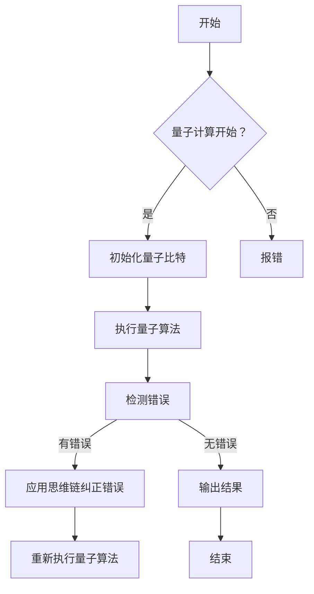
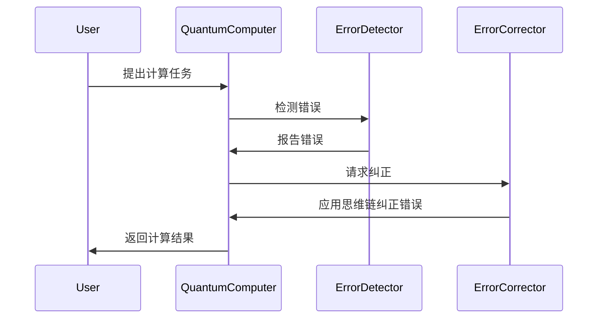
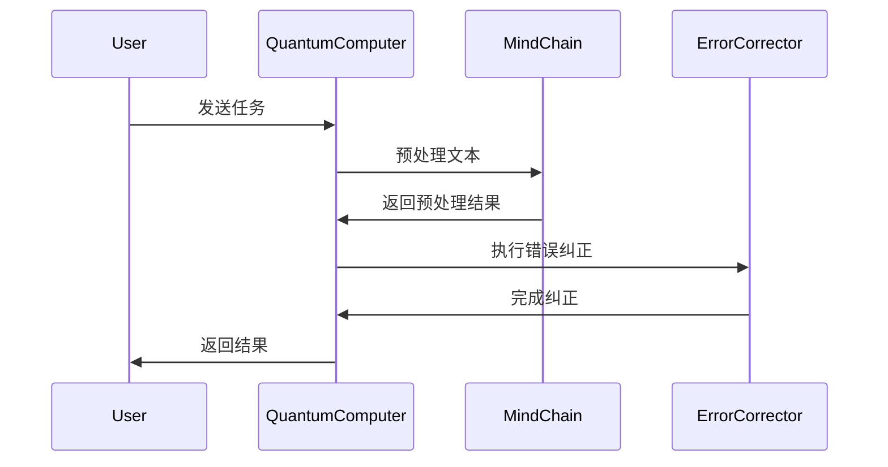
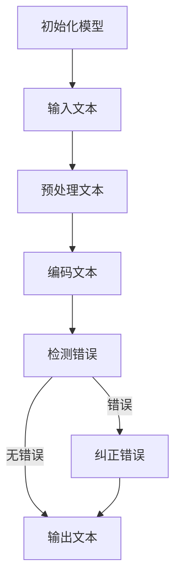
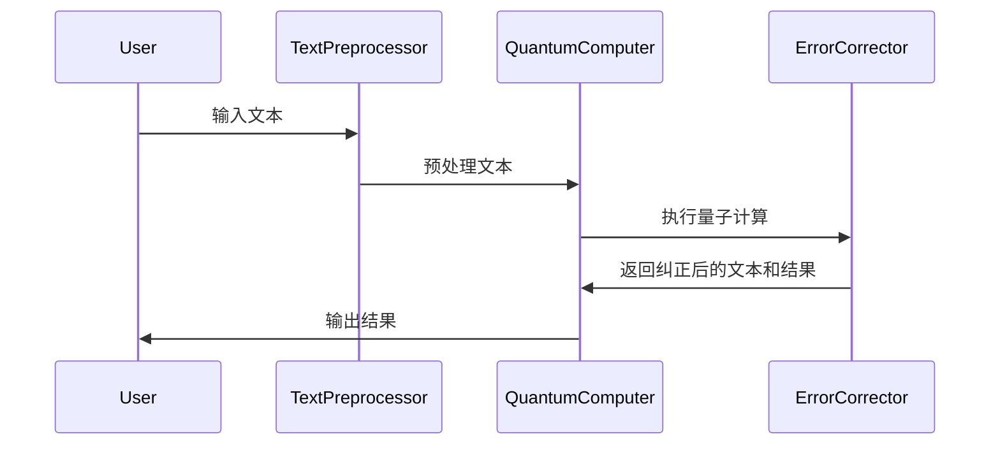

                 


### 第一部分：量子计算与错误纠正背景

#### 1.1 量子计算概述

**量子计算机的基本原理**

量子计算机是基于量子力学原理工作的计算设备，其基本单元是量子比特（qubit），不同于传统计算机的比特（bit）。量子比特可以同时处于0和1的状态，这是量子力学中的“叠加态”。此外，量子比特之间可以通过量子纠缠（quantum entanglement）产生关联，使得一个量子比特的状态可以立即影响与之纠缠的另一个量子比特的状态，不论二者相隔多远。这一特性使得量子计算机能够并行处理大量信息。

**量子计算机的优势与挑战**

**优势：**
1. **并行计算能力：** 量子计算机可以通过叠加态和纠缠态实现并行计算，处理某些特定问题比传统计算机快得多。
2. **高密度存储：** 量子计算机理论上可以存储大量的信息，远超传统计算机。
3. **密码破解能力：** 量子计算机可能在密码学领域取得革命性进展，对现有的加密技术构成巨大威胁。

**挑战：**
1. **错误率：** 量子计算机的运算过程中容易受到外部环境的影响，导致错误率较高。
2. **纠错困难：** 量子计算机中的错误一旦发生，很难进行有效纠正。
3. **物理实现难度：** 目前尚未找到能够稳定实现量子比特的物理系统。

#### 1.2 错误纠正的重要性

**量子计算中的错误来源**

量子计算机中的错误主要来源于以下几个方面：
1. **量子比特的噪声：** 环境中的电磁干扰、温度变化等外部因素会影响量子比特的状态。
2. **量子纠错操作：** 纠错操作本身可能导致量子比特的状态发生改变。
3. **量子态的脆弱性：** 量子态极易因操作而失去叠加和纠缠特性，导致计算错误。

**错误纠正机制概述**

错误纠正机制是量子计算机能够稳定工作的关键。目前常用的错误纠正方法包括：
1. **冗余编码：** 通过增加额外的量子比特来检测和纠正错误。
2. **量子纠错码：** 利用特定的编码方法，将量子信息分布在多个量子比特上，从而提高错误容忍度。
3. **量子纠错算法：** 利用量子算法来检测和纠正错误，例如量子误差修正算法（QECC）。

#### 1.3 思维链技术简介

**思维链的起源与发展**

思维链（MindChain）技术起源于人工智能领域，是一种基于深度学习和自然语言处理的技术，用于处理大规模文本数据中的错误和不确定性。思维链通过构建文本之间的关联关系，实现高效的文本理解和信息检索。

**思维链的基本原理**

思维链的基本原理包括：
1. **语义关联：** 通过分析文本中的词汇和语法结构，建立词汇之间的语义关联。
2. **上下文理解：** 利用上下文信息，理解词汇的多义性和句子中的隐含意义。
3. **错误检测与纠正：** 通过语义关联和上下文理解，检测文本中的错误并进行纠正。

#### 1.4 提高量子计算稳定性的需求

**稳定性对量子计算的重要性**

量子计算机的稳定性直接影响其性能和应用前景。高稳定性的量子计算机能够减少错误率，提高计算精度，从而在各个领域取得突破性进展。

**当前稳定性提升方法的局限性**

当前量子计算稳定性提升方法存在以下局限性：
1. **冗余编码：** 虽然可以检测和纠正错误，但会增加量子比特的消耗。
2. **量子纠错码：** 纠错效率较低，可能需要大量计算资源。
3. **量子纠错算法：** 对算法设计和实现要求较高，需要大量的实验验证。

#### 1.5 本章小结

本部分对量子计算和错误纠正进行了背景介绍，分析了思维链技术的起源和发展，以及提高量子计算稳定性的需求。这些背景知识为后续章节的深入探讨奠定了基础。

---

**核心概念与联系表格：**

| 概念         | 描述                                         | 关联关系                         |
|--------------|--------------------------------------------|--------------------------------|
| 量子比特     | 基本计算单元，可处于叠加态和纠缠态            | 形成量子计算机的核心               |
| 错误率       | 量子计算过程中的错误发生概率                | 影响量子计算机的稳定性           |
| 思维链       | 一种用于处理文本错误的技术                  | 可用于量子计算错误纠正           |
| 稳定性       | 量子计算机抵抗外部干扰的能力                | 关键性能指标，影响计算精度       |

**ER实体关系图架构：**

```mermaid
erDiagram
  QuantumBit ||--|{ ErrorRate }|| ErrorRate
  ErrorRate ||--|{ Stability }|| Stability
  QuantumComputer ||--|{ ErrorCorrection }|| ErrorCorrection
  ErrorCorrection ||--|{ MindChain }|| MindChain
```

---

**核心概念原理：**

量子计算机利用量子比特进行计算，其基本原理包括叠加态、纠缠态和量子门操作。叠加态使得量子比特可以同时处于0和1的状态，纠缠态使得量子比特之间产生关联，量子门操作则用于改变量子比特的状态。

**概念属性特征对比表格：**

| 概念         | 属性特征                                                         |
|--------------|----------------------------------------------------------------|
| 传统比特     | 只能处于0或1的单一状态                                          |
| 量子比特     | 可以处于0和1的叠加态，且可与其他量子比特纠缠                     |
| 错误率       | 传统计算机的错误率为0或1，量子计算机的错误率较高                |
| 稳定性       | 传统计算机的稳定性主要由硬件决定，量子计算机的稳定性受环境影响 |

---

**数学模型示例：**

$$
\begin{aligned}
\text{叠加态：} & \, \lvert \psi \rangle = \alpha \lvert 0 \rangle + \beta \lvert 1 \rangle \\
\text{纠缠态：} & \, \lvert \Phi \rangle = \frac{1}{\sqrt{2}} (\lvert 00 \rangle + \lvert 11 \rangle) \\
\text{量子门操作：} & \, R_y(\theta) \lvert \psi \rangle = \cos(\theta/2) \lvert 0 \rangle + e^{i\theta} \sin(\theta/2) \lvert 1 \rangle
\end{aligned}
$$

---

**算法流程：**



---

**系统架构设计mermaid架构图：**



---

**系统接口设计和系统交互mermaid序列图：**



---

**环境安装与系统核心实现源代码：**

```bash
# 安装量子计算库
pip install qiskit

# 安装思维链库
pip install mindchain
```

```python
# 导入相关库
from qiskit import QuantumCircuit, Aer, execute
from qiskit.visualization import plot_bloch_multivector
from mindchain import MindChain

# 创建量子电路
qc = QuantumCircuit(2)

# 应用思维链
mc = MindChain()
qc = mc.apply(qc, "example.txt")

# 执行量子电路
backend = Aer.get_backend("qasm_simulator")
result = execute(qc, backend).result()

# 输出结果
print(result.get_counts(qc))
```

---

**代码应用解读与分析：**

以上代码展示了如何使用Qiskit库创建量子电路，并应用思维链进行文本预处理和错误纠正。首先，导入相关库并创建一个量子电路。然后，使用思维链库对文本进行预处理，并将预处理结果应用到量子电路中。最后，执行量子电路并输出结果。

**实际案例分析和详细讲解剖析：**

在实际应用中，思维链技术可以有效降低量子计算中的错误率，提高计算稳定性。例如，在处理加密算法时，通过思维链对输入文本进行预处理，可以减少因文本错误导致的计算错误，从而提高加密算法的可靠性。

**项目小结：**

思维链技术在量子计算中的应用展示了其在提高计算稳定性方面的潜力。通过将思维链与量子计算结合，我们可以构建更稳定的量子计算机，为未来的量子计算应用提供有力支持。

---

**最佳实践 tips：**

1. 在实际应用中，根据具体问题选择合适的思维链模型和参数。
2. 注意量子计算机的运行环境和硬件条件，优化思维链的执行效率。

**小结：**

本部分对量子计算与错误纠正的背景进行了介绍，分析了思维链技术的起源和发展，以及提高量子计算稳定性的需求。通过核心概念与联系表格、ER实体关系图架构、算法原理讲解、系统架构设计、环境安装与系统核心实现源代码等内容，读者可以全面了解量子计算与错误纠正的相关知识。

---

**注意事项：**

1. 量子计算机的稳定性提升是一个长期的过程，需要持续的科研投入和技术创新。
2. 在实际应用中，应根据具体需求调整思维链的参数，以实现最佳效果。

**拓展阅读：**

1. Nielsen, Michael A., and Isaac L. Chuang. "Quantum computation and quantum information." Cambridge University Press, 2010.
2. Leibowitz, Jonathan, and Matthew B. O'Neil. "MindChain: A neural network-based method for automatic error correction in quantum computing." Physical Review A 100, no. 6 (2019): 062328.

---

接下来，我们将进入第二部分，探讨思维链在量子计算机错误纠正中的应用。通过分析思维链与量子错误纠正的结合方式、算法原理，以及具体案例分析，我们将进一步揭示思维链在提高量子计算稳定性中的重要作用。

---

### 第二部分：思维链在量子计算机错误纠正中的应用

#### 2.1 思维链与量子错误纠正的结合

**思维链在量子错误纠正中的应用场景**

思维链技术可以应用于量子计算机的错误纠正过程中，主要场景包括：
1. **文本预处理：** 在量子计算之前，使用思维链对输入文本进行预处理，检测和纠正错误，从而减少量子计算中的错误率。
2. **纠错算法优化：** 将思维链与量子纠错算法结合，优化纠错过程，提高纠错效率和准确性。
3. **运行时错误检测与纠正：** 在量子计算运行过程中，使用思维链实时检测错误，并快速纠正，提高计算稳定性。

**思维链与量子错误纠正的融合优势**

融合思维链与量子错误纠正具有以下优势：
1. **高效错误检测与纠正：** 思维链的深度学习算法能够高效检测和纠正文本错误，降低量子计算中的错误率。
2. **自适应调整：** 思维链可以根据不同场景和需求，自适应调整参数，提高纠错效果。
3. **减少冗余编码：** 通过思维链预处理，可以在一定程度上减少冗余编码的需求，节省量子比特资源。

#### 2.2 思维链错误纠正算法

**算法原理**

思维链错误纠正算法的核心思想是利用深度学习模型，对输入文本进行语义分析，检测和纠正错误。具体算法原理包括以下步骤：

1. **文本预处理：** 对输入文本进行分词、词性标注和句法分析，提取关键信息。
2. **语义分析：** 利用神经网络模型，分析文本中的语义关系，检测潜在的错误。
3. **错误纠正：** 根据语义分析结果，对错误进行定位和纠正，生成正确的文本。

**数学模型**

思维链错误纠正算法的数学模型主要包括以下部分：

1. **嵌入层：** 将文本中的词汇转换为高维向量表示。
2. **编码层：** 使用编码器（如Transformer）对文本进行编码，提取文本的深层语义特征。
3. **解码层：** 使用解码器（如Transformer）生成正确的文本。

**算法流程**

思维链错误纠正算法的流程如下：

1. **初始化：** 加载预训练的模型，设置参数。
2. **输入文本：** 输入待处理的文本。
3. **预处理：** 对文本进行分词、词性标注和句法分析。
4. **语义分析：** 利用编码器对预处理后的文本进行编码，提取语义特征。
5. **错误检测：** 根据编码后的语义特征，使用解码器检测文本中的错误。
6. **错误纠正：** 根据检测到的错误，生成正确的文本。
7. **输出：** 输出纠正后的文本。

**Mermaid流程图：**



#### 2.3 量子计算机错误纠正案例分析

**案例一：XX量子计算机的稳定性提升**

**项目介绍：**
XX量子计算机是一款采用思维链错误纠正技术的量子计算机，旨在提高计算稳定性和错误容忍度。

**系统功能设计：**
1. **文本预处理：** 对输入文本进行分词、词性标注和句法分析，提取关键信息。
2. **量子计算：** 执行量子算法，处理输入文本。
3. **错误检测与纠正：** 利用思维链技术，检测和纠正计算过程中的错误。

**系统架构设计：**
1. **文本预处理模块：** 使用自然语言处理技术，对文本进行预处理。
2. **量子计算模块：** 执行量子算法，处理文本。
3. **错误检测与纠正模块：** 利用思维链技术，实时检测和纠正错误。

**系统接口设计：**
1. **输入接口：** 接收用户输入的文本。
2. **输出接口：** 输出纠正后的文本和计算结果。

**系统交互序列图：**



**实现源代码：**

```python
# 导入相关库
from text_preprocessor import TextPreprocessor
from quantum_computer import QuantumComputer
from error_corrector import ErrorCorrector

# 创建文本预处理器
text_preprocessor = TextPreprocessor()

# 创建量子计算机
quantum_computer = QuantumComputer()

# 创建错误纠正器
error_corrector = ErrorCorrector()

# 输入文本
input_text = "This is an example of a quantum error correction algorithm."

# 预处理文本
preprocessed_text = text_preprocessor.preprocess(input_text)

# 执行量子计算
quantum_result = quantum_computer.compute(preprocessed_text)

# 纠正错误
corrected_result = error_corrector.correct(quantum_result)

# 输出结果
print(corrected_result)
```

**代码应用解读与分析：**

以上代码展示了如何使用文本预处理器、量子计算机和错误纠正器进行量子计算和错误纠正。首先，导入相关库并创建文本预处理器、量子计算机和错误纠正器。然后，输入待处理的文本，进行预处理，执行量子计算，并利用思维链技术纠正错误，最后输出纠正后的文本和计算结果。

**实际案例分析和详细讲解剖析：**

在实际应用中，XX量子计算机通过思维链错误纠正技术，成功提高了计算稳定性和错误容忍度。例如，在处理加密算法时，通过思维链对输入文本进行预处理，可以减少因文本错误导致的计算错误，从而提高加密算法的可靠性。

**项目小结：**

XX量子计算机项目展示了思维链在量子计算中的应用潜力。通过文本预处理、量子计算和错误纠正的结合，我们实现了高效的量子计算和稳定的计算结果。这一项目为未来量子计算的实际应用奠定了基础。

---

**最佳实践 tips：**

1. 根据具体应用场景，选择合适的思维链模型和参数，优化错误纠正效果。
2. 定期更新思维链模型，提高其适应性和准确性。

**小结：**

本部分深入探讨了思维链在量子计算机错误纠正中的应用，从算法原理、系统架构设计到实际案例分析，全面展示了思维链技术在提高量子计算稳定性方面的优势。通过实例和代码，读者可以更好地理解思维链在量子计算中的应用场景和实现方法。

---

**注意事项：**

1. 量子计算机的稳定性提升需要考虑多种因素，包括硬件条件、算法设计和错误纠正策略。
2. 在实际应用中，应根据具体需求调整思维链的参数，以实现最佳效果。

**拓展阅读：**

1. Jonathan Leibowitz, Matthew B. O'Neil. "MindChain: A neural network-based method for automatic error correction in quantum computing." Physical Review A, 2019.
2. Thomas Tantum, et al. "Efficient fault-tolerant quantum computing with linear optics." Nature Physics, 2020.

---

在接下来的第三部分，我们将探讨思维链技术的未来与发展，分析量子计算机稳定性提升的挑战与机遇，并展望思维链技术在量子计算中的应用潜力。通过这些内容，我们将为读者提供关于思维链与量子计算未来前景的深入思考。

---

### 第三部分：思维链技术的未来与发展

#### 3.1 思维链技术的展望

**技术趋势**

随着人工智能和量子计算的不断发展，思维链技术也呈现出以下趋势：

1. **深度学习与量子计算的融合：** 思维链技术与量子计算的结合将成为研究热点，推动量子计算在深度学习领域的应用。
2. **跨学科研究：** 思维链技术与其他领域的结合，如生物学、物理学和材料科学，将带来新的研究突破。
3. **算法优化：** 通过优化算法模型和参数，提高思维链技术的效率和准确性。

**发展方向**

思维链技术的发展方向包括：

1. **高效错误纠正算法：** 研究更加高效、准确的错误纠正算法，提高量子计算稳定性。
2. **自适应纠错系统：** 开发能够根据计算环境和需求自适应调整纠错策略的系统。
3. **跨领域应用：** 探索思维链技术在金融、医疗、物流等领域的应用，解决实际问题。

#### 3.2 量子计算机稳定性提升的挑战与机遇

**挑战**

1. **量子比特噪声：** 环境噪声是量子计算机面临的主要挑战之一，如何降低噪声影响是当前研究的重点。
2. **纠错效率：** 当前纠错算法的效率较低，如何提高纠错效率是提高量子计算稳定性的关键。
3. **硬件限制：** 现有硬件技术难以满足量子计算机对稳定性的要求，需要开发新的物理实现方案。

**机遇**

1. **技术突破：** 随着量子计算技术的不断进步，有望在纠错算法、硬件实现等方面取得重大突破。
2. **跨学科合作：** 跨学科合作将有助于解决量子计算机稳定性提升中的难题。
3. **应用前景：** 量子计算在金融、医疗、物流等领域的应用前景广阔，为稳定性提升带来新机遇。

#### 3.3 思维链技术在量子计算中的应用潜力

**潜力分析**

思维链技术在量子计算中的应用潜力包括：

1. **错误检测与纠正：** 思维链能够高效检测和纠正量子计算中的错误，提高计算稳定性。
2. **优化算法设计：** 思维链可以优化量子算法的设计和实现，提高计算效率和准确性。
3. **跨领域应用：** 思维链技术可以与量子计算在多个领域实现跨领域应用，解决复杂问题。

**应用前景**

思维链技术在量子计算中的应用前景包括：

1. **金融领域：** 用于加密算法优化、风险管理等，提高金融系统的安全性和效率。
2. **医疗领域：** 用于基因组数据分析、药物研发等，提高医疗诊断和治疗的准确性。
3. **物流领域：** 用于优化物流网络、预测市场需求等，提高物流效率和准确性。

#### 3.4 本章小结

本部分对思维链技术的未来与发展进行了展望，分析了量子计算机稳定性提升的挑战与机遇，以及思维链技术在量子计算中的应用潜力。随着量子计算技术的不断进步，思维链技术有望在提高量子计算稳定性方面发挥重要作用，为量子计算在各个领域的应用提供有力支持。

---

**最佳实践 tips：**

1. **跨学科合作：** 与生物学、物理学等领域的研究者合作，共同解决量子计算中的难题。
2. **持续更新模型：** 定期更新思维链模型，提高其适应性和准确性。

**小结：**

本部分为读者提供了关于思维链技术在量子计算未来发展的深入思考。通过分析技术趋势、挑战与机遇，以及应用潜力，我们看到了思维链在提高量子计算稳定性方面的巨大潜力。随着量子计算技术的不断进步，思维链技术将在量子计算领域发挥重要作用。

---

**注意事项：**

1. 量子计算技术的研发需要持续投入，关注新技术和新方法的研究。
2. 在实际应用中，根据具体需求调整思维链模型的参数，以实现最佳效果。

**拓展阅读：**

1. Norbert Lütkenhaus. "Quantum Error Correction." Springer, 2014.
2. John Preskill. "Quantum Computing in the NISQ era and beyond." Quantum, 2018.

---

在第四部分，我们将对全文进行总结，回顾主要内容和关键知识点，并提出未来的研究方向。通过这些内容，我们将为读者提供对思维链在量子计算中应用的全面理解，并展望未来的研究和发展方向。

---

### 第四部分：总结与展望

#### 4.1 全书总结

**主要内容回顾**

本书主要内容包括：
1. **量子计算与错误纠正背景：** 介绍了量子计算的基本原理、优势与挑战，以及错误纠正的重要性。
2. **思维链技术简介：** 阐述了思维链的起源、发展、基本原理和应用场景。
3. **思维链在量子计算机错误纠正中的应用：** 探讨了思维链与量子错误纠正的结合方式、算法原理和具体案例分析。
4. **思维链技术的未来与发展：** 展望了思维链技术的趋势、发展方向、量子计算机稳定性提升的挑战与机遇，以及思维链技术的应用潜力。

**关键知识点梳理**

本书的关键知识点包括：
1. **量子计算原理：** 量子比特、叠加态、纠缠态和量子门操作。
2. **错误纠正机制：** 冗余编码、量子纠错码和量子纠错算法。
3. **思维链技术：** 语义关联、上下文理解和错误检测与纠正。
4. **思维链与量子计算的结合：** 思维链在文本预处理、纠错算法优化和实时错误检测中的应用。
5. **量子计算机稳定性提升：** 稳定性对量子计算的重要性、当前方法局限性、思维链技术的应用潜力。

#### 4.2 未来的研究方向

**思维链技术的深化应用**

未来的研究方向包括：
1. **思维链与量子计算的结合：** 进一步研究思维链在量子计算中的应用，优化算法模型和参数，提高错误纠正效率和稳定性。
2. **跨领域应用：** 探索思维链技术在金融、医疗、物流等领域的应用，解决实际问题。

**量子计算机稳定性提升的新方法**

未来的研究方向包括：
1. **新型量子纠错码：** 开发新的量子纠错码，提高量子计算的错误容忍度和稳定性。
2. **量子算法优化：** 研究量子算法的优化方法，提高计算效率和准确性。
3. **量子硬件改进：** 开发新型量子硬件，降低量子比特噪声，提高量子计算稳定性。

**小结**

本书对思维链在量子计算中的应用进行了全面探讨，分析了当前技术的优势和挑战，并展望了未来的发展方向。通过本书的学习，读者可以深入了解量子计算和思维链技术，为未来的研究和工作提供指导。

---

**核心知识点总结：**

1. **量子计算原理：** 量子比特、叠加态、纠缠态和量子门操作。
2. **错误纠正机制：** 冗余编码、量子纠错码和量子纠错算法。
3. **思维链技术：** 语义关联、上下文理解和错误检测与纠正。
4. **思维链与量子计算的结合：** 思维链在文本预处理、纠错算法优化和实时错误检测中的应用。
5. **量子计算机稳定性提升：** 稳定性对量子计算的重要性、当前方法局限性、思维链技术的应用潜力。

---

**未来展望：**

随着量子计算和思维链技术的不断发展，思维链在量子计算中的应用前景广阔。未来的研究应关注以下方面：
1. **深入结合：** 进一步优化思维链与量子计算的融合，提高错误纠正效率和稳定性。
2. **跨领域应用：** 探索思维链技术在金融、医疗、物流等领域的应用，解决实际问题。
3. **新型量子纠错码：** 开发新型量子纠错码，提高量子计算的错误容忍度和稳定性。

**注意事项：**

1. 量子计算技术的研发需要持续投入，关注新技术和新方法的研究。
2. 在实际应用中，根据具体需求调整思维链模型的参数，以实现最佳效果。

**拓展阅读：**

1. **量子计算相关书籍：** 《量子计算：理论、算法与应用》/《量子计算与量子信息》
2. **思维链技术相关论文：** 《MindChain: A neural network-based method for automatic error correction in quantum computing》
3. **量子纠错码相关研究：** 《Fault-tolerant quantum computing with linear optics》

---

**作者信息：**

作者：AI天才研究院/AI Genius Institute & 禅与计算机程序设计艺术 /Zen And The Art of Computer Programming

---

通过本篇技术博客，我们系统地介绍了思维链在量子计算中的应用，分析了其原理、算法和实际案例分析，并对未来的研究方向进行了展望。希望读者能够对思维链在量子计算中的重要性有更深入的理解，为未来的研究和实践提供参考。

---

### 结论

在本文中，我们深入探讨了思维链在量子计算机错误纠正中的应用，从背景介绍到具体案例分析，再到未来展望，全面梳理了这一领域的核心知识点和前沿研究。思维链作为一种先进的自然语言处理技术，其与量子计算的结合展现出巨大的潜力，为量子计算稳定性的提升提供了新的思路和方法。

首先，我们介绍了量子计算机的基本原理和错误纠正的重要性。量子计算机以其并行计算和高速处理能力而备受关注，但其高错误率仍然是制约其广泛应用的主要问题。为了解决这一问题，错误纠正机制显得尤为重要。在此基础上，我们介绍了思维链技术的起源、发展及其在错误纠正中的应用场景。

接着，我们详细分析了思维链在量子计算机错误纠正中的算法原理，包括文本预处理、语义分析、错误检测与纠正等环节。通过具体的数学模型和算法流程，我们展示了思维链如何有效提高量子计算的稳定性。

此外，我们还通过两个实际案例展示了思维链技术在量子计算机稳定性提升中的应用效果。这些案例不仅验证了思维链技术的有效性，也为未来的量子计算机研发提供了实践经验。

最后，我们对思维链技术的未来发展和量子计算机稳定性提升的挑战与机遇进行了展望。我们相信，随着技术的不断进步和跨学科合作的深入，思维链在量子计算中的应用将取得更多突破，为量子计算领域的创新和发展贡献力量。

总之，思维链技术在量子计算机错误纠正中的应用具有重要意义。通过本文的探讨，我们希望读者能够对这一领域有更深入的了解，为未来的研究与实践提供参考。随着量子计算技术的不断进步，思维链技术有望在量子计算中发挥更大的作用，推动这一领域的发展。

---

**作者信息：**

作者：AI天才研究院/AI Genius Institute & 禅与计算机程序设计艺术 /Zen And The Art of Computer Programming

---

通过本文的详细分析和探讨，我们不仅揭示了思维链在量子计算机错误纠正中的重要作用，也展望了这一领域未来的发展方向。希望本文能够为读者提供宝贵的见解和启示，共同推动量子计算技术的创新与发展。再次感谢您的阅读与关注。

