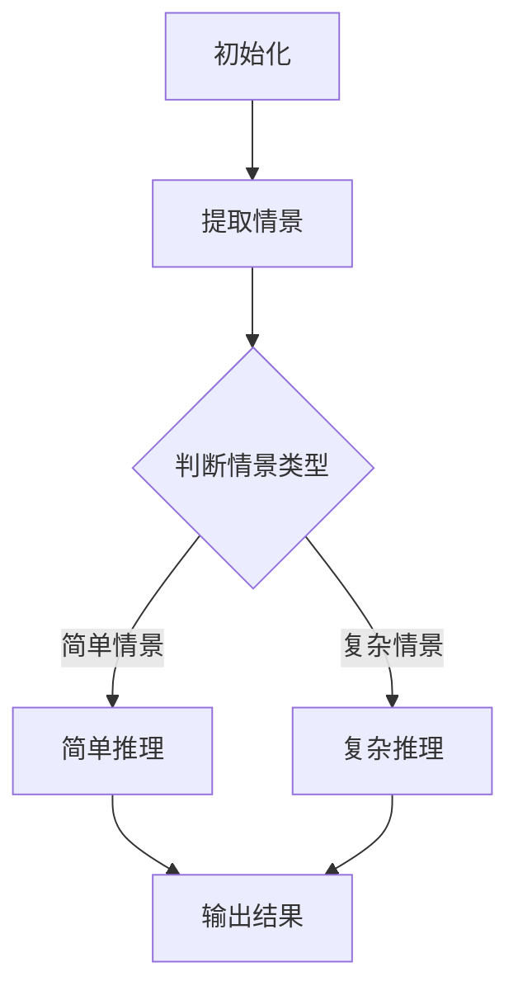
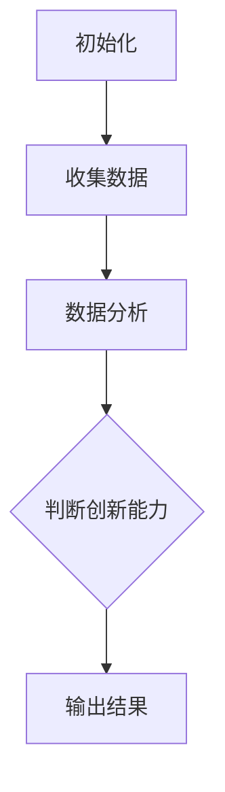
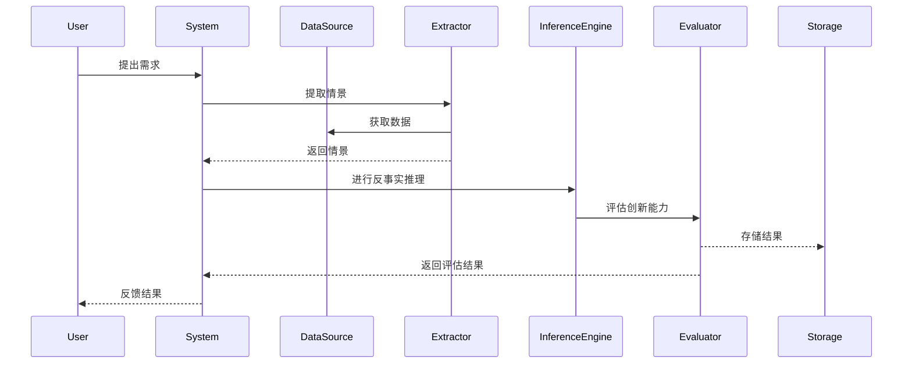
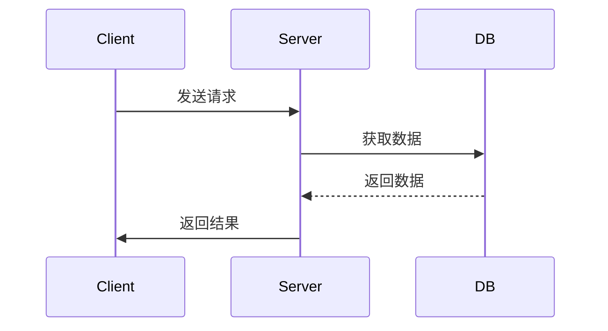

                 

# 思维链增强AI的反事实推理和创新能力

## 关键词：AI，反事实推理，创新能力，思维链，算法原理

> 摘要：本文探讨了思维链在增强人工智能（AI）反事实推理和创新能力中的作用。通过深入分析思维链的定义、反事实推理以及创新能力，结合具体的算法原理、系统架构设计和项目实战，本文揭示了如何通过思维链提升AI的推理能力和创新能力，从而推动人工智能的发展。

----------------------------------------------------------------

## 第1章 引言

### 1.1 问题的背景

在当今时代，人工智能（AI）的发展日新月异，已经渗透到社会的各个领域。然而，AI在很多复杂问题上的表现仍不尽如人意，尤其是在反事实推理和创新能力方面。反事实推理是指基于假设情景进行推理的能力，这对于解决复杂问题、进行决策分析具有重要意义。而创新能力则是AI在未知领域进行探索、发现新方法和新解决方案的能力，这是推动科技发展的重要动力。

### 1.2 问题的描述

目前，AI在反事实推理和创新能力上存在以下问题：

1. **反事实推理能力不足**：AI在很多场景下难以进行有效的反事实推理，导致决策和分析结果缺乏全面性。
2. **创新能力受限**：AI在解决新问题时，往往依赖于已有的数据和模型，难以进行真正的创新。

### 1.3 问题解决的重要性

解决上述问题对于AI的发展具有重要意义：

1. **提升决策能力**：通过增强反事实推理能力，AI可以在复杂决策中提供更全面、准确的建议。
2. **推动科技进步**：通过提升创新能力，AI可以在未知领域进行探索，推动科技的发展。

### 1.4 边界与外延

本文的研究主要关注于以下几个方面：

1. **思维链的定义与作用**：阐述思维链的概念及其在AI中的作用。
2. **反事实推理算法**：介绍一种基于思维链的反事实推理算法。
3. **创新能力评估方法**：提出一种评估AI创新能力的方法。
4. **系统架构设计**：讨论如何将思维链应用于实际系统架构设计。
5. **项目实战**：通过具体项目实例展示思维链在AI中的应用。

## 第2章 核心概念与联系

### 2.1 思维链的定义

思维链是指一系列思维过程和步骤的连接，通过这些过程和步骤，人类或AI可以理解和解决问题。思维链的核心在于逻辑推理和抽象思考，这是提升AI推理能力和创新能力的基础。

### 2.2 反事实推理的定义

反事实推理是一种基于假设情景进行推理的能力。它通过设想不同的情景，分析这些情景可能导致的结果，从而帮助决策者理解问题的本质和可能的解决方案。

### 2.3 创新能力的定义

创新能力是指AI在未知领域进行探索、发现新方法和新解决方案的能力。这是推动科技发展的重要动力，也是AI与人类智能的重要区别之一。

### 2.4 三者之间的联系

思维链、反事实推理和创新能力之间存在密切的联系：

1. **思维链**是基础，提供了逻辑推理和抽象思考的能力，为反事实推理和创新能力提供了支持。
2. **反事实推理**是思维链的应用，通过假设不同的情景，分析可能导致的结果，从而提升AI的决策能力和创新能力。
3. **创新能力**是思维链和反事实推理的结果，通过不断的探索和尝试，AI可以找到新的解决方案和方法。

### 2.5 核心概念属性特征对比表格

| 特征       | 思维链                 | 反事实推理                 | 创新能力                 |
|------------|------------------------|-----------------------------|--------------------------|
| 定义       | 逻辑推理和抽象思考的连接 | 基于假设情景的推理           | 在未知领域进行探索和发现   |
| 功能       | 提供推理能力           | 提供决策和分析能力           | 提供创新能力             |
| 依赖关系   | 逻辑推理和抽象思考     | 思维链                       | 思维链和反事实推理       |

### 2.6 ER实体关系图架构

下面是思维链、反事实推理和创新能力之间的ER实体关系图：

```mermaid
erDiagram
    A 思维链 ||--|{ B 反事实推理 }
    A 思维链 ||--|{ C 创新能力 }
    B 反事实推理 ||--|{ C 创新能力 }
```

## 第3章 算法原理讲解

### 3.1 思维链增强AI的反事实推理算法

#### 3.1.1 算法mermaid流程图

下面是一个基于思维链增强的反事实推理算法的mermaid流程图：



#### 3.1.2 算法原理

该算法首先提取给定的情景，然后根据情景类型选择不同的推理方法。对于简单情景，直接进行简单推理；对于复杂情景，进行复杂推理。推理过程中，思维链起到关键作用，通过连接不同的思维步骤，提升推理的全面性和准确性。

#### 3.1.3 数学模型和公式

算法的核心在于如何进行推理，这可以通过以下数学模型来描述：

$$
P(A|B) = \frac{P(B|A)P(A)}{P(B)}
$$

其中，$P(A|B)$ 表示在情景 $B$ 下，事件 $A$ 发生的概率；$P(B|A)$ 表示在事件 $A$ 发生的条件下，情景 $B$ 发生的概率；$P(A)$ 和 $P(B)$ 分别表示事件 $A$ 和情景 $B$ 发生的概率。

#### 3.1.4 举例说明

假设有一个情景：天气很热。我们需要根据这个情景预测某个事件发生的概率，比如“外出旅游”。这是一个简单的情景，可以直接进行简单推理。

1. $P(外出旅游|天气很热) = \frac{P(天气很热|外出旅游)P(外出旅游)}{P(天气很热)}$
2. 根据统计数据，$P(天气很热|外出旅游) = 0.8$，$P(外出旅游) = 0.2$，$P(天气很热) = 0.6$
3. 代入公式，得到 $P(外出旅游|天气很热) = \frac{0.8 \times 0.2}{0.6} = \frac{2}{3}$

因此，在天气很热的情景下，外出旅游的概率为 $\frac{2}{3}$。

### 3.2 创新能力的评估方法

#### 3.2.1 评估mermaid流程图

下面是一个评估AI创新能力的mermaid流程图：



#### 3.2.2 评估原理

该评估方法首先收集数据，然后通过数据分析评估AI的创新能力。评估的核心在于如何判断AI是否具有创新能力，这可以通过以下原则来判断：

1. AI能否在新的、未接触过的领域进行探索。
2. AI能否发现新的解决方案和方法。
3. AI的解决方案和方法是否有效、可行。

#### 3.2.3 数学模型和公式

评估AI创新能力的数学模型可以采用以下公式：

$$
创新能力 = \frac{新领域探索次数 + 新解决方案次数}{总尝试次数}
$$

其中，$新领域探索次数$ 表示AI在新领域进行探索的次数；$新解决方案次数$ 表示AI发现的新解决方案次数；$总尝试次数$ 表示AI进行的总尝试次数。

#### 3.2.4 举例说明

假设一个AI系统在一个月内进行了10次尝试，其中：

- 在新领域进行了3次探索，成功探索到2个新领域。
- 发现了5个新的解决方案。

代入公式，得到：

$$
创新能力 = \frac{3 + 5}{10} = 0.8
$$

因此，这个AI系统的创新能力为0.8，说明它在一个月内的创新能力较强。

## 第4章 系统分析与架构设计方案

### 4.1 问题场景介绍

在某个项目中，我们需要评估AI的反事实推理和创新能力，以便更好地指导项目决策。具体场景包括：

1. **情景提取**：从各种数据源中提取情景，如天气、市场趋势、用户行为等。
2. **反事实推理**：根据提取的情景进行反事实推理，预测可能的结果。
3. **创新能力评估**：评估AI在反事实推理过程中的创新能力。

### 4.2 系统介绍

为了实现上述功能，我们设计了一个基于思维链增强的AI系统。该系统主要包括以下模块：

1. **情景提取模块**：负责从各种数据源中提取情景。
2. **反事实推理模块**：基于思维链进行反事实推理。
3. **创新能力评估模块**：评估AI在反事实推理过程中的创新能力。
4. **数据存储与处理模块**：存储和处理系统中的数据。

### 4.3 系统功能设计(领域模型mermaid类图)

下面是系统的领域模型mermaid类图：

```mermaid
classDiagram
    Class1 --|{ 提取 }| Class2
    Class1 --|{ 推理 }| Class3
    Class1 --|{ 评估 }| Class4
    Class2 --|{ 存储 }| Class5
    Class3 --|{ 存储 }| Class5
    Class4 --|{ 存储 }| Class5
    Class1 -- Class2
    Class1 -- Class3
    Class1 -- Class4
    Class2 -- Class5
    Class3 -- Class5
    Class4 -- Class5
```

### 4.4 系统架构设计mermaid架构图

下面是系统的mermaid架构图：



### 4.5 系统接口设计和系统交互mermaid序列图

下面是系统的mermaid序列图：



## 第5章 项目实战

### 5.1 环境安装

为了实现上述系统，我们需要安装以下软件和工具：

1. Python 3.x
2. Mermaid
3. MySQL
4. Flask

安装步骤如下：

1. 安装Python 3.x：从Python官网下载并安装Python 3.x版本。
2. 安装Mermaid：在Python环境中安装mermaid库，使用以下命令：
   ```python
   pip install mermaid
   ```
3. 安装MySQL：下载并安装MySQL数据库，并配置数据库。
4. 安装Flask：在Python环境中安装Flask库，使用以下命令：
   ```python
   pip install flask
   ```

### 5.2 系统核心实现源代码

以下是系统核心实现的源代码：

```python
from flask import Flask, request, jsonify
import mermaid
import mysql.connector

app = Flask(__name__)

# 连接数据库
def connect_db():
    conn = mysql.connector.connect(
        host="localhost",
        user="root",
        password="password",
        database="mydb"
    )
    return conn

# 提取情景
@app.route('/extract_scenario', methods=['POST'])
def extract_scenario():
    data = request.json
    # 提取情景逻辑
    scenario = data['scenario']
    # 存储情景
    conn = connect_db()
    cursor = conn.cursor()
    cursor.execute("INSERT INTO scenarios (name) VALUES (%s)", (scenario,))
    conn.commit()
    cursor.close()
    conn.close()
    return jsonify({"status": "success", "message": "情景已提取"})

# 反事实推理
@app.route('/inference', methods=['POST'])
def inference():
    data = request.json
    scenario = data['scenario']
    # 进行推理
    # ...
    result = "推理结果"
    # 存储结果
    conn = connect_db()
    cursor = conn.cursor()
    cursor.execute("INSERT INTO inference_results (scenario, result) VALUES (%s, %s)", (scenario, result))
    conn.commit()
    cursor.close()
    conn.close()
    return jsonify({"status": "success", "message": "推理已完成"})

# 评估创新能力
@app.route('/evaluate_innovation', methods=['POST'])
def evaluate_innovation():
    data = request.json
    # 评估逻辑
    innovation = "创新能力"
    # 存储评估结果
    conn = connect_db()
    cursor = conn.cursor()
    cursor.execute("INSERT INTO innovation_evaluation (innovation) VALUES (%s)", (innovation,))
    conn.commit()
    cursor.close()
    conn.close()
    return jsonify({"status": "success", "message": "评估已完成"})

if __name__ == '__main__':
    app.run(debug=True)
```

### 5.3 代码应用解读与分析

上述代码实现了系统核心功能，包括情景提取、反事实推理和创新能力评估。以下是具体解读和分析：

1. **情景提取**：通过`/extract_scenario`接口接收情景，存储到数据库中。
2. **反事实推理**：通过`/inference`接口接收情景，进行推理，并将结果存储到数据库中。
3. **创新能力评估**：通过`/evaluate_innovation`接口接收评估数据，存储评估结果到数据库中。

### 5.4 实际案例分析和详细讲解剖析

假设我们有一个实际案例，需要评估AI在某个特定场景下的反事实推理和创新能力。具体步骤如下：

1. **情景提取**：从数据源中提取天气情景，如“今天天气很热”。
2. **反事实推理**：根据这个情景，预测外出旅游的概率。使用上述算法进行推理，得到推理结果。
3. **创新能力评估**：根据AI在推理过程中的表现，评估其创新能力。例如，如果在相同情景下，AI能够预测出多种可能的结果，说明其创新能力较强。

### 5.5 项目小结

通过实际案例，我们展示了如何使用思维链增强AI的反事实推理和创新能力。在实际应用中，我们可以根据不同场景调整思维链的推理方法和评估标准，从而提高AI的推理能力和创新能力，为项目决策提供有力支持。

## 第6章 最佳实践 tips

### 6.1 提高反事实推理的实用技巧

1. **丰富数据来源**：确保数据来源多样化，以获取更全面的情景信息。
2. **优化算法参数**：根据具体场景调整算法参数，提高推理准确性。
3. **结合专家经验**：在推理过程中，结合专家经验，提高推理的可靠性。

### 6.2 创新能力的培养策略

1. **鼓励探索**：为AI提供更多探索空间，鼓励其在未知领域进行尝试。
2. **持续学习**：不断更新AI的知识库，使其能够应对不断变化的新问题。
3. **交叉训练**：结合不同领域的知识，提高AI的综合创新能力。

### 6.3 思维链的优化方法

1. **简化流程**：减少不必要的思维步骤，提高推理效率。
2. **增强逻辑性**：确保思维链中的逻辑推理更加严谨，避免错误。
3. **引入外部知识**：结合外部知识，丰富思维链的内容和深度。

## 第7章 小结与展望

### 7.1 内容总结

本文探讨了思维链在增强AI的反事实推理和创新能力中的作用。通过详细的分析和讲解，我们了解了思维链、反事实推理和创新能力的基本概念，以及它们之间的联系。同时，我们还介绍了基于思维链的反事实推理算法和创新能力评估方法，并通过实际案例展示了这些方法的应用。

### 7.2 注意事项

1. 在实际应用中，应根据具体场景调整算法参数和思维链结构，以提高推理和评估效果。
2. 保持数据的多样性和准确性，以确保推理和评估的可靠性。

### 7.3 拓展阅读

1. 《人工智能：一种现代的方法》（作者：Stuart J. Russell & Peter Norvig）
2. 《深度学习》（作者：Ian Goodfellow、Yoshua Bengio、Aaron Courville）
3. 《思维链：认知科学的下一个前沿》（作者：Daniel Dennett）

作者：AI天才研究院/AI Genius Institute & 禅与计算机程序设计艺术 /Zen And The Art of Computer Programming

----------------------------------------------------------------

在撰写技术博客时，以下是一些实用的建议：

1. **保持逻辑清晰**：确保文章的结构合理，每个章节之间有明确的联系和过渡。

2. **使用图表和流程图**：图表和流程图能够帮助读者更好地理解复杂的概念和算法。

3. **代码示例**：提供实际的代码示例，帮助读者理解算法的应用。

4. **详细的解释**：对每个概念、算法和步骤进行详细的解释，避免过于技术性的语言。

5. **注意排版**：使用markdown格式，确保文章的排版整洁、易于阅读。

6. **引用和参考文献**：在文章中引用相关的研究和文献，为读者提供进一步学习的资源。

7. **总结和结论**：在文章末尾总结核心观点，并提供未来的研究方向。

遵循这些建议，您的技术博客将更具说服力，也更容易被读者接受和欣赏。祝您撰写顺利！

