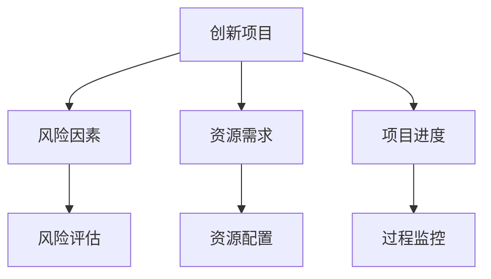
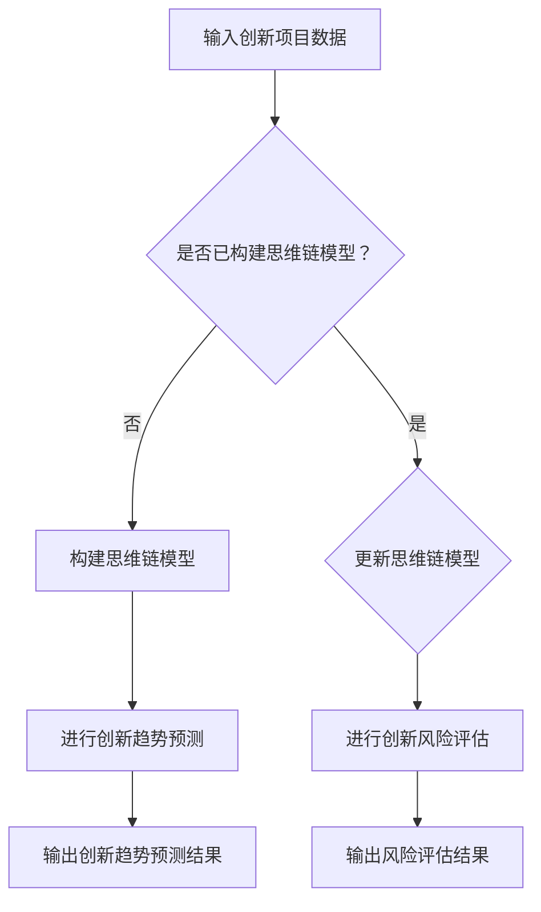

                 

### 引言

在当今快速变化的世界中，创新管理已成为企业竞争的关键要素。传统的创新管理方法往往依赖于经验和直觉，难以应对复杂的市场环境和多样化的客户需求。因此，如何提升创新管理的效率和效果成为了一个亟待解决的问题。近年来，人工智能（AI）技术的发展为创新管理带来了新的契机，而思维链技术则是在这一领域中的前沿探索。本文将探讨思维链技术在AI辅助创新管理生态系统中的应用，旨在为企业管理者提供一种创新的思考模式和操作工具。

首先，我们需要理解创新管理的重要性。创新不仅是企业持续发展的动力，也是企业应对市场竞争、提高产品和服务质量的关键手段。然而，创新的过程充满了不确定性，需要管理者具备敏锐的市场洞察力和科学的决策能力。传统的管理方法往往依赖于历史数据和经验，而无法准确预测未来的趋势和风险。这就需要引入AI技术，通过数据分析和模型预测来辅助决策。

其次，我们需要了解思维链技术的概念和原理。思维链技术是一种基于认知科学的思维模型，它模拟人类大脑的思维过程，通过构建一系列的思考链条，来辅助人们进行复杂的决策和问题解决。这种技术能够将抽象的思维过程具象化，帮助管理者更加系统地分析和理解问题。

最后，我们需要探讨AI辅助创新管理生态系统的构建。一个完善的AI辅助创新管理生态系统应包括数据采集、处理、分析和应用等多个环节。通过AI技术，企业可以实现对大量数据的实时分析，快速识别创新机会和潜在风险，从而优化创新过程。

本文结构安排如下：

- **第一部分：引言**：介绍研究背景、思维链技术的概念与原理、AI辅助创新管理生态系统的作用及本书结构安排。
- **第二部分：思维链技术基础**：详细阐述思维链技术的起源、核心组成部分和应用场景。
- **第三部分：AI辅助创新管理生态系统**：探讨AI在创新管理生态系统中的应用、核心功能及案例分析。
- **第四部分：思维链技术在AI辅助创新管理中的应用**：具体分析思维链技术在创新趋势预测、风险评估、资源管理、项目管理和过程优化中的应用。

通过本文的深入探讨，我们希望能够为企业管理者提供一种全新的创新管理思路，助力企业在激烈的市场竞争中脱颖而出。

### 关键词

- 创新管理
- 人工智能
- 思维链技术
- 数据分析
- 风险评估
- 创新趋势预测

### 摘要

本文旨在探讨思维链技术在AI辅助创新管理生态系统中的应用。创新管理是企业持续发展的关键，但传统的创新管理方法在面对复杂多变的市场环境时往往显得力不从心。随着人工智能技术的不断发展，AI辅助创新管理逐渐成为企业管理的新趋势。思维链技术作为一种新兴的思维模型，通过模拟人类大脑的思维过程，为创新管理提供了有力的工具支持。本文首先介绍了创新管理的重要性以及AI在其中的应用，然后详细阐述了思维链技术的概念、原理和应用场景。接着，本文探讨了AI辅助创新管理生态系统的构建，包括数据采集、处理、分析和应用等环节，并通过对具体应用场景的案例分析，展示了思维链技术在创新趋势预测、风险评估、资源管理、项目管理和过程优化中的实际应用效果。通过本文的研究，我们希望能够为企业管理者提供一种创新的思维模式和操作工具，提升创新管理的效率和质量。

### 第一部分：引言

#### 1.1 研究背景

在当今全球化的商业环境中，创新已成为企业持续竞争和发展的关键。创新管理不仅涉及新技术、新产品的研发，还包括新市场、新业务模式的开辟。然而，传统的创新管理方法往往依赖于经验和直觉，难以应对复杂多变的市场环境。为了提高创新管理的效率和效果，企业开始寻求新的解决方案，人工智能（AI）技术因此成为了一个重要的工具。

人工智能作为近年来快速发展的一项技术，已经在各个领域展现出巨大的潜力。特别是在数据分析、模式识别和智能决策等方面，AI技术能够通过处理大量数据，提供精准的预测和优化方案。创新管理作为企业管理的重要组成部分，自然成为了AI技术的重要应用领域。

AI辅助创新管理的概念始于20世纪90年代，随着大数据、云计算和深度学习等技术的发展，AI辅助创新管理逐渐成为企业管理的新趋势。通过AI技术，企业可以实现对大量创新数据的实时分析和处理，快速识别创新机会和潜在风险，从而优化创新过程，提高创新成功率。

#### 1.1.1 创新管理的重要性

创新管理的重要性在于它能够为企业带来持续的市场竞争力。在激烈的市场竞争中，拥有创新能力和创新意识的企业往往能够迅速抓住市场机遇，占领市场高地。而缺乏创新意识的企业则可能面临市场萎缩、竞争力下降的风险。

创新管理不仅关注产品的创新，还包括服务、商业模式、管理流程等多个方面的创新。通过创新管理，企业可以不断提升自身的核心竞争力和市场地位，实现可持续发展。

#### 1.1.2 AI技术在创新管理中的应用

AI技术在创新管理中的应用主要体现在以下几个方面：

1. **数据分析**：AI技术能够对大量创新数据进行分析，识别出潜在的创新趋势和机会。通过数据挖掘和机器学习算法，企业可以快速了解市场需求，预测未来发展趋势，从而制定更加精准的创新策略。

2. **智能决策**：AI技术可以帮助企业管理者进行智能决策。通过构建决策模型，AI技术可以分析各种决策方案的优缺点，提供最优的决策方案，降低决策风险。

3. **风险评估**：AI技术可以对创新项目进行风险评估，预测项目可能面临的各种风险，并提出相应的应对策略。通过风险评估，企业可以更加科学地分配资源，提高创新项目的成功率。

4. **过程优化**：AI技术可以帮助企业优化创新过程。通过流程分析和优化算法，AI技术可以识别出创新过程中的瓶颈和问题，提出改进方案，提高创新效率。

#### 1.2 思维链技术的概念与原理

思维链技术是一种基于认知科学的思维模型，旨在模拟人类大脑的思维过程，通过构建一系列的思考链条，来辅助人们进行复杂的决策和问题解决。思维链技术的核心思想是将抽象的思维过程具象化，使人们能够更加系统和全面地分析问题。

思维链技术的基本概念包括思维链的结构、属性和运算规则。思维链的结构通常由一系列的节点和边组成，节点表示思维内容，边表示思维之间的关系。思维链的属性包括节点内容、节点权重和边权重等，用于描述思维链的特征。思维链的运算规则包括连接、扩展和合并等，用于调整和优化思维链的结构。

#### 1.3 AI辅助创新管理生态系统的构建

AI辅助创新管理生态系统是一个由多个组成部分相互关联、协同工作的复杂系统。一个完善的AI辅助创新管理生态系统应包括数据采集、数据存储、数据处理、数据分析、数据应用等环节。

1. **数据采集**：数据采集是AI辅助创新管理生态系统的第一步，包括从内部和外部获取与创新相关的数据。内部数据通常来自企业内部的各种业务系统，如销售系统、研发系统等；外部数据通常来自市场调研、社交媒体、行业报告等。

2. **数据存储**：数据存储是将采集到的数据存储在合适的数据库或数据仓库中，以便后续的数据处理和分析。数据存储需要考虑数据的完整性、安全性和可扩展性。

3. **数据处理**：数据处理包括数据清洗、数据转换和数据集成等步骤，目的是将原始数据转化为适合分析的形式。数据处理是保证数据质量的关键环节。

4. **数据分析**：数据分析是AI辅助创新管理的核心环节，通过使用机器学习、数据挖掘等AI技术，对数据进行深度分析，提取出有用的信息和洞见。

5. **数据应用**：数据应用是将分析结果应用到实际业务中，如创新趋势预测、风险评估、资源分配等。数据应用是检验AI辅助创新管理效果的重要环节。

#### 1.4 本书结构安排

本书分为四个主要部分：

- **第一部分：引言**：介绍研究背景、思维链技术的概念与原理、AI辅助创新管理生态系统的作用及本书结构安排。
- **第二部分：思维链技术基础**：详细阐述思维链技术的起源、核心组成部分和应用场景。
- **第三部分：AI辅助创新管理生态系统**：探讨AI在创新管理生态系统中的应用、核心功能及案例分析。
- **第四部分：思维链技术在AI辅助创新管理中的应用**：具体分析思维链技术在创新趋势预测、风险评估、资源管理、项目管理和过程优化中的应用。

通过本书的深入探讨，我们希望能够为企业管理者提供一种全新的创新管理思路，提升创新管理的效率和质量，从而在激烈的市场竞争中脱颖而出。

### 第二部分：思维链技术基础

#### 2.1 思维链技术概述

思维链技术是一种基于认知科学的思维模型，旨在模拟人类大脑的思维过程，通过构建一系列的思考链条，来辅助人们进行复杂的决策和问题解决。思维链技术的核心思想是将抽象的思维过程具象化，使人们能够更加系统和全面地分析问题。

思维链技术的起源可以追溯到20世纪60年代，当时计算机科学家开始探索如何模拟人类思维过程。随着认知科学的不断发展，思维链技术逐渐成熟，并成为人工智能领域的一个重要分支。近年来，随着大数据、云计算和深度学习等技术的进步，思维链技术得到了广泛的应用和深入研究。

#### 2.1.1 思维链技术的起源

思维链技术的起源可以追溯到美国心理学家乔治·米勒（George A. Miller）在1956年提出的“思维链条理论”。米勒认为，人类思维过程是通过一系列的思考和决策过程实现的，这些过程可以被模拟和优化。在此基础上，计算机科学家逐步开发了多种思维链模型，如概念网络模型、语义网络模型和思维链规则模型等。

#### 2.1.2 思维链技术的发展历程

思维链技术的发展可以分为以下几个阶段：

1. **早期阶段**（20世纪60年代至70年代）：这一阶段的主要成就是提出了思维链的基本概念和模型。代表性的工作是米勒提出的思维链条理论和模拟人类思维的计算机程序。

2. **发展阶段**（20世纪80年代至90年代）：这一阶段的主要成就是思维链技术开始应用于实际问题解决，如知识表示、问题解决和决策支持等。代表性的工作是爱德华·泰特洛克（Edward A. Tatum）提出的概念网络模型和约翰·霍普菲尔德（John Hopfield）提出的神经网络模型。

3. **成熟阶段**（21世纪以来）：这一阶段的主要成就是思维链技术与人工智能、大数据和深度学习等技术的深度融合，使其在更广泛的领域得到应用。代表性的工作是认知图谱技术和知识图谱技术，这些技术使得思维链技术能够处理更加复杂的问题。

#### 2.2 思维链技术的核心组成部分

思维链技术由多个核心组成部分构成，主要包括思维链的结构、属性和运算规则。

1. **思维链的结构**：

   思维链的结构通常由一系列的节点和边组成。节点表示思维内容，如概念、事实、问题等；边表示节点之间的关系，如因果关系、相似性关系、层次关系等。一个典型的思维链结构可以看作是一个有向图，其中每个节点表示一个思维对象，每条边表示两个思维对象之间的关系。

2. **思维链的属性**：

   思维链的属性包括节点内容、节点权重和边权重等。节点内容是指节点所代表的具体思维内容，如一个概念的定义、一个问题的描述等。节点权重用于表示节点的重要程度，通常根据节点的出现频率、影响力等因素进行计算。边权重用于表示边所代表的关系的强度，如因果关系中的强因果、弱因果等。

3. **思维链的运算规则**：

   思维链的运算规则包括连接、扩展和合并等。连接规则用于将两个或多个思维链连接起来，形成一个新的思维链。扩展规则用于在原有思维链的基础上，增加新的节点和边，以丰富思维链的内容。合并规则用于将两个或多个思维链合并为一个更复杂的思维链。

#### 2.3 思维链技术的应用场景

思维链技术具有广泛的应用场景，可以应用于各个领域，包括创新管理、企业决策、教育与培训等。

1. **创新管理**：

   在创新管理中，思维链技术可以帮助企业进行创新趋势预测、创新风险评估和资源管理。通过构建思维链模型，企业可以系统地分析创新过程中的各种因素，识别潜在的创新机会和风险，优化创新过程。

2. **企业决策**：

   在企业决策中，思维链技术可以帮助企业管理者进行复杂的决策支持。通过构建决策思维链，管理者可以全面分析各种决策方案的优缺点，制定最优的决策策略。

3. **教育与培训**：

   在教育与培训中，思维链技术可以帮助教师设计教学计划和教学策略。通过构建思维链模型，教师可以系统地分析学生的思维过程，提供个性化的教学支持，提高教学效果。

#### 2.4 思维链技术在创新管理中的应用

在创新管理中，思维链技术具有以下具体应用：

1. **创新趋势预测**：

   通过构建思维链模型，企业可以系统地分析市场环境、技术趋势和客户需求等因素，预测未来的创新趋势。这种预测可以帮助企业提前布局，抢占市场先机。

2. **创新风险评估**：

   通过构建思维链模型，企业可以识别创新过程中的各种风险因素，评估风险的可能性和影响程度。这种风险评估可以帮助企业制定相应的风险应对策略，降低创新失败的风险。

3. **资源管理**：

   通过构建思维链模型，企业可以优化创新资源的配置，确保资源得到最有效的利用。这种资源管理可以帮助企业提高创新效率，降低创新成本。

#### 2.5 思维链技术与AI结合

随着AI技术的发展，思维链技术逐渐与AI技术相结合，形成了一种新的创新管理工具。AI技术为思维链技术提供了强大的计算能力和数据分析能力，使得思维链技术能够处理更加复杂的问题。

1. **深度学习在思维链建模中的应用**：

   深度学习可以用于构建思维链模型，通过学习大量的数据，提取出思维链的结构和属性。这种模型能够自动识别和分类思维对象，提供更加精准的决策支持。

2. **强化学习在思维链优化中的应用**：

   强化学习可以用于优化思维链的运算规则，通过不断调整运算规则，使思维链模型更加适应实际情况。这种优化可以提升思维链技术的应用效果，提高创新管理的效率。

综上所述，思维链技术作为一种新兴的思维模型，在创新管理中具有广泛的应用前景。通过结合AI技术，思维链技术能够更好地应对复杂多变的市场环境，为企业提供科学的决策支持，助力企业在激烈的市场竞争中脱颖而出。

#### 2.6 思维链技术在企业决策中的应用

思维链技术在企业决策中的应用日益广泛，其独特的思维模型能够帮助企业领导者更加系统地分析和评估各种决策选项。以下将详细探讨思维链技术在企业决策中的应用场景、优势和实际案例。

##### 2.6.1 应用场景

1. **战略规划**：企业在制定长期发展战略时，常常需要考虑多个维度的因素，如市场趋势、竞争态势、技术进步、内部资源等。思维链技术可以帮助企业构建一个全面的思维模型，系统地分析这些因素之间的相互关系，为战略规划提供科学依据。

2. **产品开发**：在产品开发过程中，企业需要从市场需求、技术可行性、成本效益等多个角度评估各种产品开发方案。思维链技术可以帮助企业构建一个完整的思维链模型，分析不同方案的优缺点，选择最优的产品开发路径。

3. **市场进入**：企业在决定进入新市场时，需要考虑市场潜力、竞争对手、法规政策等多个方面的因素。思维链技术可以帮助企业构建一个全面的思维链模型，评估市场进入的可行性，制定相应的市场进入策略。

4. **并购与投资**：企业在进行并购或投资决策时，需要分析目标公司的财务状况、业务模式、市场前景等。思维链技术可以帮助企业构建一个全面的思维链模型，评估并购或投资的潜在风险和收益。

##### 2.6.2 优势

1. **系统性分析**：思维链技术能够帮助企业管理者从多个维度、多个层面进行系统性分析，避免因片面信息而导致的决策失误。

2. **提高决策质量**：通过构建思维链模型，企业可以更加清晰地理解和分析决策问题，提高决策的科学性和准确性。

3. **优化决策流程**：思维链技术可以帮助企业将复杂的决策过程标准化、流程化，提高决策效率。

4. **支持决策可视化**：思维链模型可以将抽象的决策过程可视化，使得决策过程更加直观、易于理解和沟通。

##### 2.6.3 实际案例

1. **案例分析1：战略规划**

   某家全球知名科技公司在其战略规划阶段，利用思维链技术构建了一个全面的思维链模型。该模型包括市场趋势、竞争态势、技术进步、内部资源等多个维度，每个维度都包含多个具体的节点和边。通过分析这些节点和边之间的关系，公司管理层能够更清晰地了解各个维度的相互影响，从而制定出一个更加科学、全面的发展战略。

2. **案例分析2：产品开发**

   在一家新兴科技公司的新产品开发过程中，思维链技术被用来评估不同的产品开发方案。公司构建了一个包含市场需求、技术可行性、成本效益等多个维度的思维链模型，通过分析不同方案的优缺点，最终选择了一个既满足市场需求又具有较高技术可行性且成本效益最好的方案。这个决策使得新产品在市场上获得了成功，为公司带来了显著的经济效益。

3. **案例分析3：市场进入**

   某家跨国公司计划进入一个新的市场，利用思维链技术进行了详细的市场分析。通过构建思维链模型，公司评估了市场潜力、竞争对手、法规政策等多个因素，最终制定了一个详细的进入策略。这个策略不仅考虑了市场的潜力，还预见到了可能遇到的挑战，并制定了相应的应对措施。最终，公司在该市场取得了良好的业绩，顺利实现了市场扩张。

综上所述，思维链技术在企业决策中的应用，不仅能够提高决策的科学性和准确性，还能优化决策流程，为企业提供更加全面和系统的决策支持。通过实际案例的验证，思维链技术已经展现出其在复杂决策中的巨大潜力。

#### 2.7 思维链技术在教育与培训中的应用

思维链技术不仅在创新管理和企业决策中发挥了重要作用，在教育与培训领域同样展现出独特的优势。通过构建系统的思维链模型，教育者和培训师能够更有效地设计教学计划和教学策略，提高教学效果。

##### 2.7.1 应用场景

1. **课程设计**：在教育领域，思维链技术可以帮助教师构建课程框架，系统性地梳理课程内容。通过思维链模型，教师可以明确各个知识点之间的联系，优化课程结构，提高课程的教学效果。

2. **教学策略制定**：思维链技术可以帮助教师根据学生的不同特点，制定个性化的教学策略。通过分析学生的思维链，教师可以了解学生的学习习惯、认知水平和思维方式，从而设计出更加符合学生需求的教学方案。

3. **学生学习评估**：思维链技术可以用于学生的学习评估，通过分析学生的学习过程和成果，教师可以及时发现学生的学习问题，提供有针对性的辅导。

##### 2.7.2 优势

1. **系统化教学**：思维链技术使得教学过程更加系统化，教师能够从整体上把握教学内容的结构和联系，提高教学的逻辑性和系统性。

2. **个性化教学**：思维链技术能够帮助教师了解每个学生的思维特点，从而提供更加个性化的教学服务，提高学生的学习效果。

3. **提高教学效果**：通过思维链模型，教师可以更加直观地了解教学过程中的问题和瓶颈，及时调整教学策略，提高教学效果。

##### 2.7.3 实际案例

1. **案例分析1：课程设计**

   某教育机构在开设新课程时，利用思维链技术构建了一个详细的课程框架。通过分析课程内容的各个知识点，教师们明确了各个知识点之间的逻辑关系，并将这些关系用思维链模型表示出来。这个课程框架不仅提高了课程的整体结构，还使得教学内容更加清晰、易于学生理解和掌握。

2. **案例分析2：教学策略制定**

   在一次英语课程的教学中，教师利用思维链技术分析学生的思维过程，发现学生普遍存在语法知识掌握不牢固的问题。教师根据这一分析结果，制定了针对性的教学策略，通过思维链模型引导学生逐步掌握语法知识，从而显著提高了学生的学习效果。

3. **案例分析3：学生学习评估**

   某在线学习平台通过思维链技术对学生学习过程进行评估。平台利用思维链模型分析学生的学习行为和成果，发现学生在某些知识点上存在明显的学习困难。平台根据这些分析结果，提供了个性化的学习辅导，帮助学生克服了学习障碍，提高了学习效果。

综上所述，思维链技术在教育与培训中的应用，不仅能够提高教学效果，还能帮助学生更好地掌握知识和技能。通过实际案例的验证，思维链技术在教育与培训领域展现出巨大的潜力。

#### 2.8 AI在思维链技术中的应用

随着人工智能（AI）技术的迅猛发展，AI逐渐成为提升思维链技术性能和扩展其应用领域的关键工具。在思维链技术中，AI的应用主要体现在以下几个方面：

##### 2.8.1 深度学习在思维链建模中的应用

深度学习是一种强大的机器学习技术，通过多层神经网络，能够自动从数据中学习复杂模式和关系。在思维链建模中，深度学习技术可以用于：

1. **模式识别**：通过深度学习模型，可以自动识别思维链中的节点和边，提取思维链的结构和属性。例如，通过卷积神经网络（CNN）可以识别文本中的关键概念和关系，从而构建思维链模型。

2. **关系预测**：深度学习可以预测节点之间的关系，提高思维链模型的准确性。例如，通过循环神经网络（RNN）或长短期记忆网络（LSTM），可以预测思维链中的因果关系或层次关系。

##### 2.8.2 强化学习在思维链优化中的应用

强化学习是一种通过试错和反馈来优化行为和策略的机器学习技术。在思维链优化中，强化学习可以用于：

1. **路径优化**：强化学习可以帮助优化思维链的路径，提高思维链的效率和准确性。例如，通过Q-learning算法，可以找到从初始节点到目标节点的最佳路径。

2. **策略优化**：强化学习可以优化思维链的运算规则，提高决策的质量。例如，通过策略梯度算法，可以不断调整思维链的运算规则，使其更加适应实际问题的需求。

##### 2.8.3 生成对抗网络（GAN）在思维链扩展中的应用

生成对抗网络（GAN）是一种通过生成器和判别器的对抗训练来生成数据的机器学习技术。在思维链扩展中，GAN可以用于：

1. **数据增强**：通过GAN可以生成更多样化的思维链数据，扩展思维链的应用范围。例如，通过GAN生成与已有思维链数据类似的新的思维链，以增强模型的泛化能力。

2. **生成新节点和边**：GAN可以自动生成新的节点和边，丰富思维链的内容。例如，通过GAN生成新的概念和关系，以扩大思维链的模型容量。

##### 2.8.4 自然语言处理（NLP）在思维链理解中的应用

自然语言处理技术可以帮助理解和分析文本数据，从而提升思维链的理解能力。在思维链技术中，NLP的应用包括：

1. **语义分析**：通过NLP技术，可以理解文本中的语义信息，提取关键概念和关系，为思维链建模提供支持。例如，通过词嵌入技术和命名实体识别（NER），可以提取文本中的关键概念。

2. **情感分析**：NLP技术可以帮助分析文本中的情感倾向，为思维链中的情感分析提供支持。例如，通过情感分析模型，可以识别文本中的正面或负面情感，从而影响思维链的决策。

##### 2.8.5 应用效果和未来展望

1. **应用效果**：通过AI技术的结合，思维链技术显著提升了在复杂问题解决、决策支持和知识管理等方面的性能。例如，深度学习使得思维链建模更加精准，强化学习提高了思维链的优化能力，GAN和NLP扩展了思维链的应用范围。

2. **未来展望**：未来，随着AI技术的不断进步，思维链技术有望在更多领域得到应用。例如，结合虚拟现实（VR）和增强现实（AR）技术，思维链技术可以提供更加直观和互动的决策支持工具。同时，通过跨学科的融合，思维链技术可以与心理学、认知科学等领域相结合，进一步提升其在复杂问题解决中的性能。

总之，AI技术的应用为思维链技术注入了新的活力，使得思维链技术能够更好地服务于创新管理、企业决策、教育与培训等多个领域，为人类解决复杂问题提供了强大的工具支持。

#### 2.9 AI与思维链技术的融合原理

AI与思维链技术的融合，不仅为创新管理提供了强大的工具支持，也在很大程度上改变了传统的人工智能应用模式。理解这种融合的原理，有助于我们更好地发挥两者的优势，实现创新管理的智能化和高效化。

首先，从理论基础来看，AI与思维链技术的融合基于两者在认知建模和智能决策方面的互补性。AI，特别是深度学习和强化学习等先进技术，能够处理和分析大量复杂数据，为思维链技术提供了强大的计算能力和数据分析能力。而思维链技术，作为一种基于认知科学的思维模型，能够模拟人类大脑的思维过程，提供系统化和结构化的决策支持。两者的结合，使得AI不再仅仅是处理数据的工具，而是能够深入参与决策过程的智能体。

1. **数据驱动的认知建模**：
   - **AI的角色**：AI通过深度学习和生成对抗网络（GAN）等技术，可以从海量数据中自动提取特征，构建复杂的认知模型。
   - **思维链技术的应用**：这些认知模型可以转化为思维链中的节点和边，从而丰富思维链的结构和内容。

2. **增强型决策支持**：
   - **AI的角色**：AI通过强化学习和自然语言处理（NLP）等技术，可以优化思维链的运算规则，提高决策的准确性和效率。
   - **思维链技术的应用**：优化的思维链模型可以提供更加精准的决策支持，帮助企业在复杂的决策环境中做出更明智的选择。

其次，从技术实现层面来看，AI与思维链技术的融合主要体现在以下几个方面：

1. **深度学习在思维链建模中的应用**：
   - **技术原理**：深度学习通过多层神经网络，可以从数据中学习到复杂的模式和关系，将其应用于思维链建模，可以提高模型的精度和泛化能力。
   - **实现方式**：使用卷积神经网络（CNN）对文本数据进行分析，提取关键概念和关系，构建思维链模型。

2. **强化学习在思维链优化中的应用**：
   - **技术原理**：强化学习通过不断试错和反馈，可以优化决策路径和策略，从而提高思维链的效率和效果。
   - **实现方式**：使用Q-learning或策略梯度（PG）算法，调整思维链的运算规则，使其在特定场景下表现出更好的性能。

3. **自然语言处理（NLP）在思维链理解中的应用**：
   - **技术原理**：NLP技术可以帮助理解和分析文本数据，提取语义信息，从而增强思维链的智能决策能力。
   - **实现方式**：使用词嵌入技术（如Word2Vec或BERT）和情感分析模型，对文本数据进行处理，丰富思维链的内容和属性。

最后，从应用层面来看，AI与思维链技术的融合带来了以下几方面的改进：

1. **提高决策效率**：通过AI技术的辅助，思维链模型可以更加快速和准确地分析复杂问题，提高决策效率。

2. **增强决策准确性**：AI技术的引入，使得思维链模型能够处理更多样化的数据，从而提供更加准确的决策支持。

3. **优化资源分配**：AI与思维链技术的融合，可以帮助企业更科学地分配创新资源，提高创新成功率。

4. **支持个性化决策**：通过AI技术，思维链模型可以更好地适应不同企业的特定需求，提供个性化的决策支持。

总之，AI与思维链技术的融合，不仅为创新管理提供了新的解决方案，也为人工智能的应用开辟了新的方向。通过不断探索和优化，这种融合有望在未来为人类解决复杂问题提供更加智能和高效的工具。

#### 2.10 AI辅助思维链技术的应用前景

随着AI技术的快速发展，思维链技术在商业和社会服务领域的应用前景日益广阔。AI与思维链技术的融合不仅提升了思维链的性能和适用性，还为实现更智能化、高效化的决策提供了强有力的支持。以下将详细探讨AI辅助思维链技术在商业和社会服务领域的应用前景。

##### 2.10.1 商业领域的应用

在商业领域，AI辅助思维链技术可以应用于多个关键环节，提高企业的创新能力和市场竞争力。

1. **产品创新**：
   - **技术优势**：通过AI技术，思维链技术可以自动分析市场需求、用户反馈和竞争对手信息，帮助企业发现潜在的创新点。
   - **应用案例**：某电子产品公司利用AI辅助思维链技术分析用户需求和市场竞争态势，成功开发出了一款深受市场欢迎的新产品。

2. **战略决策**：
   - **技术优势**：AI辅助思维链技术可以帮助企业构建系统化的决策模型，分析各种战略选项的优缺点，提供科学的决策支持。
   - **应用案例**：某跨国公司利用AI辅助思维链技术进行市场进入策略的制定，通过对市场趋势、法规政策和竞争态势的综合分析，制定了成功进入新市场的策略。

3. **客户关系管理**：
   - **技术优势**：AI辅助思维链技术可以深入分析客户数据，识别客户需求和行为模式，为企业提供个性化的客户服务。
   - **应用案例**：某金融服务公司利用AI辅助思维链技术进行客户关系管理，通过分析客户行为数据，提供了更加精准的金融产品推荐，显著提升了客户满意度。

4. **供应链管理**：
   - **技术优势**：AI辅助思维链技术可以帮助企业优化供应链管理，提高供应链的灵活性和响应速度。
   - **应用案例**：某零售企业利用AI辅助思维链技术优化供应链管理，通过实时分析市场需求和库存状况，实现了供应链的精细化管理，降低了库存成本。

##### 2.10.2 社会服务领域的应用

在社会服务领域，AI辅助思维链技术同样具有广泛的应用前景，可以提升公共服务效率和质量。

1. **城市治理**：
   - **技术优势**：通过AI辅助思维链技术，可以对城市运行数据进行分析，发现城市治理中的瓶颈和问题，提出优化方案。
   - **应用案例**：某城市利用AI辅助思维链技术进行交通管理，通过分析交通流量数据，优化交通信号配置，缓解了交通拥堵问题。

2. **公共安全**：
   - **技术优势**：AI辅助思维链技术可以帮助公安部门进行犯罪预测和防范，提高公共安全水平。
   - **应用案例**：某城市利用AI辅助思维链技术进行犯罪预测，通过分析历史犯罪数据和人口流动数据，成功预测和防范了多起犯罪事件。

3. **医疗健康**：
   - **技术优势**：通过AI辅助思维链技术，可以对医疗数据进行分析，提供精准的诊断和治疗方案。
   - **应用案例**：某医疗机构利用AI辅助思维链技术进行疾病预测，通过对患者病史、家族病史和生活方式数据进行分析，提供了更加精准的诊断和治疗方案。

4. **教育服务**：
   - **技术优势**：通过AI辅助思维链技术，可以优化教育资源分配，提高教育质量。
   - **应用案例**：某教育机构利用AI辅助思维链技术进行个性化教学，通过分析学生学习数据，提供了个性化的学习建议，显著提升了教学效果。

##### 2.10.3 应用前景展望

随着AI技术的不断进步，AI辅助思维链技术在商业和社会服务领域的应用前景将更加广阔。未来，可以期待以下几方面的进一步发展：

1. **智能化水平的提升**：通过不断优化AI算法和思维链模型，提升系统的智能化水平，实现更加精准和高效的决策支持。

2. **跨领域融合**：AI辅助思维链技术可以与其他领域的技术（如大数据、区块链等）相结合，实现跨领域的综合应用，提供更全面的解决方案。

3. **用户体验的提升**：通过AI辅助思维链技术，可以提供更加个性化的服务，提升用户满意度。

4. **应用场景的扩展**：随着技术的成熟，AI辅助思维链技术的应用场景将进一步扩展，覆盖更多的行业和领域。

总之，AI辅助思维链技术作为一种新兴的创新工具，具有巨大的应用潜力。通过不断探索和优化，这种技术将为商业和社会服务领域带来深远的影响。

### 第三部分：AI辅助创新管理生态系统

#### 3.1 生态系统的定义与组成

AI辅助创新管理生态系统是一个由多个组成部分相互关联、协同工作的复杂系统。这个生态系统旨在通过AI技术的支持，实现创新过程的智能化和高效化。一个完整的AI辅助创新管理生态系统通常包括以下几个关键组成部分：

1. **数据采集系统**：数据采集是AI辅助创新管理生态系统的第一步，也是关键的一步。数据采集系统负责从内部和外部获取与创新相关的数据。内部数据通常来自企业内部的各种业务系统，如销售系统、研发系统、客户关系管理系统等；外部数据则包括市场调研数据、行业报告、竞争对手信息、社交媒体数据等。数据采集系统的核心任务是实现数据的全面性和及时性，确保有足够的数据支持后续的分析和处理。

2. **数据处理系统**：数据处理系统是数据采集系统的延伸和补充，负责对采集到的原始数据进行清洗、转换和集成。数据清洗是数据处理的第一步，旨在去除数据中的噪声和错误，提高数据的质量；数据转换则涉及将数据格式化成适合分析的形式；数据集成则将来自不同来源的数据整合在一起，形成一个统一的数据视图。通过数据处理系统，企业可以确保数据的一致性和完整性，为后续的数据分析提供可靠的基础。

3. **数据分析系统**：数据分析系统是AI辅助创新管理生态系统的核心，通过使用机器学习、数据挖掘和深度学习等技术，对清洗和预处理后的数据进行深度分析。数据分析系统的主要任务包括趋势预测、模式识别、关联分析、分类和聚类等。通过数据分析，企业可以提取出有价值的信息和洞见，为创新决策提供支持。数据分析系统需要具备强大的计算能力和算法库，以应对复杂的数据处理需求。

4. **数据应用系统**：数据应用系统是将分析结果应用到实际业务中的桥梁。数据分析系统提取出的洞见和预测需要通过数据应用系统转化为实际的业务决策和行动。数据应用系统包括决策支持系统、智能推荐系统、优化系统等，它们可以根据分析结果，为企业提供个性化的建议和解决方案，指导企业的创新实践。数据应用系统的目标是提高创新效率，降低创新风险，实现创新价值的最大化。

5. **监控与反馈系统**：监控与反馈系统是确保AI辅助创新管理生态系统正常运行的重要保障。这个系统负责实时监控创新过程中的各项指标，如项目进展、资源分配、成本控制等，及时发现问题和异常情况，并提供相应的反馈和改进措施。通过监控与反馈系统，企业可以不断优化创新过程，提高创新管理的效率和效果。

#### 3.2 AI在创新管理生态系统中的应用

AI在创新管理生态系统中扮演着至关重要的角色，其应用涵盖了从数据采集、数据处理到数据分析、数据应用等多个环节。以下将详细探讨AI在各个阶段的具体应用：

1. **数据采集**：

   AI技术在数据采集中的应用主要体现在自动化和智能化两个方面。通过使用机器学习算法，AI技术可以自动识别和分类数据源，提高数据采集的效率。例如，使用监督学习算法对社交媒体数据进行分类，可以将相关的数据自动归类到特定的主题中，从而提高数据采集的精准度。

2. **数据处理**：

   AI技术在数据处理中的应用主要涉及数据清洗、数据转换和数据集成。数据清洗是数据处理的关键环节，AI技术通过自动化清洗算法，可以快速识别和去除数据中的噪声和错误。例如，使用异常检测算法，可以识别并处理数据中的异常值。数据转换和数据集成则通过自动化工具，将不同来源的数据格式化并整合在一起，形成一个统一的数据视图，为后续的分析提供基础。

3. **数据分析**：

   AI技术在数据分析中的应用是最为广泛的，涵盖了趋势预测、模式识别、关联分析等多个方面。通过机器学习和深度学习算法，AI技术可以从大量的历史数据中提取出有用的信息和规律，帮助企业和个人做出更准确的预测和决策。例如，使用时间序列分析算法，可以预测市场需求的变化趋势；使用聚类分析算法，可以识别出不同类型的用户群体，从而提供更加精准的营销策略。

4. **数据应用**：

   AI技术在数据应用中的应用主要体现在决策支持、智能推荐和优化等方面。通过构建决策模型和优化算法，AI技术可以为企业的创新管理提供实时的、个性化的支持。例如，通过决策树算法，可以为企业提供最优的资源配置方案；通过推荐系统，可以基于用户的历史行为，提供个性化的创新建议和资源推荐。

5. **监控与反馈**：

   AI技术在监控与反馈中的应用主要体现在实时监控和智能反馈两个方面。通过使用智能监控系统，AI技术可以实时监控创新过程中的各项关键指标，及时发现问题和异常情况。例如，通过监控项目进度和资源使用情况，可以及时发现项目进度延误或资源浪费的问题。智能反馈系统则通过分析监控数据，提供改进建议和优化方案，帮助企业不断优化创新过程。

#### 3.3 AI辅助创新管理的核心功能

AI辅助创新管理生态系统的核心功能主要包括创新趋势预测、创新风险评估、创新资源管理和创新过程优化。以下将分别详细介绍这些核心功能：

1. **创新趋势预测**：

   创新趋势预测是AI辅助创新管理的重要功能之一，旨在通过分析大量的历史数据和实时数据，预测未来的创新趋势和方向。AI技术可以通过以下方式实现创新趋势预测：

   - **时间序列分析**：通过分析历史数据的时间序列特征，预测未来的发展趋势。例如，通过分析产品的销售数据，预测未来的市场需求。
   - **相关性分析**：通过分析不同数据源之间的相关性，识别潜在的关联趋势。例如，通过分析市场趋势和竞争对手行为，预测未来的竞争态势。
   - **分类和聚类**：通过将历史数据分类和聚类，识别出不同类型的创新趋势。例如，通过分析不同类型产品的销售数据，预测未来哪些类型的产品将更受欢迎。

2. **创新风险评估**：

   创新风险评估是AI辅助创新管理的另一个关键功能，旨在通过分析创新项目的各种风险因素，评估创新项目的成功概率和潜在风险。AI技术可以通过以下方式实现创新风险评估：

   - **风险因素识别**：通过分析历史数据和实时数据，识别出可能影响创新项目成功的风险因素。例如，通过分析竞争对手的行为和市场的变化趋势，预测市场风险。
   - **风险程度评估**：通过分析风险因素的概率和影响程度，评估各个风险因素的风险程度。例如，通过分析历史项目数据和专家意见，评估技术风险和财务风险。
   - **风险应对策略**：通过分析风险因素和评估结果，制定相应的风险应对策略。例如，通过分析潜在的市场风险，制定相应的市场进入策略和风险缓解措施。

3. **创新资源管理**：

   创新资源管理是AI辅助创新管理的核心功能之一，旨在通过优化资源配置，提高创新效率。AI技术可以通过以下方式实现创新资源管理：

   - **资源分配优化**：通过分析项目的需求和资源的可用性，优化资源的分配。例如，通过分析项目的优先级和资源的需求，制定最优的资源分配方案。
   - **资源调度优化**：通过分析资源的使用情况和项目的进度，优化资源的调度。例如，通过分析资源的利用率和工作量，调整资源的使用计划，确保资源的最大化利用。
   - **成本控制**：通过分析项目的预算和实际成本，实现成本控制。例如，通过分析项目的成本结构和历史数据，制定合理的预算计划和成本控制措施。

4. **创新过程优化**：

   创新过程优化是AI辅助创新管理的最终目标，旨在通过优化创新过程，提高创新效率和质量。AI技术可以通过以下方式实现创新过程优化：

   - **流程自动化**：通过自动化工具，将重复性、规则性的任务自动化，减少人工干预。例如，通过自动化测试工具，实现测试过程的自动化，提高测试效率。
   - **流程监控与反馈**：通过实时监控创新过程的关键指标，及时发现问题和异常情况，并提供反馈和改进措施。例如，通过监控项目的进度和资源使用情况，及时发现项目延误或资源浪费的问题，并提供相应的改进建议。
   - **流程优化建议**：通过分析历史数据和实时数据，为创新过程提供优化建议。例如，通过分析项目的成功率和失败原因，提供改进项目的建议，优化创新流程。

通过AI辅助创新管理生态系统的核心功能，企业可以实现创新过程的智能化和高效化，提高创新的成功率和市场竞争力。随着AI技术的不断进步，这些功能将不断得到优化和完善，为企业的创新管理提供更加有力的支持。

### 3.4 AI辅助创新管理生态系统的案例分析

为了更好地理解AI辅助创新管理生态系统的实际应用效果，本部分将通过具体案例，详细介绍AI技术在某大型企业创新管理中的应用，并分析其成功经验和面临的挑战。

#### 3.4.1 案例背景

某大型企业是一家全球领先的科技企业，主要从事人工智能、大数据和云计算等高科技领域的研发和商业化应用。随着市场竞争的日益激烈，该公司意识到传统的创新管理方法已无法满足快速变化的市场需求，因此决定引入AI辅助创新管理生态系统，以提升创新效率和成功率。

#### 3.4.2 创新管理现状

在引入AI辅助创新管理之前，该公司的创新管理主要依赖于经验丰富的研发团队和传统的项目管理方法。具体现状如下：

- **数据依赖程度低**：创新决策主要基于团队的直觉和经验，对市场数据的依赖程度较低。
- **创新过程分散**：创新项目由不同的部门独立管理，缺乏统一的数据和流程，导致项目进展难以跟踪和管理。
- **风险评估不足**：创新项目风险评估主要依靠专家意见，缺乏系统化的评估方法和工具。
- **资源分配不合理**：资源分配主要基于项目优先级和预算，缺乏科学合理的资源分配机制。

#### 3.4.3 AI辅助创新管理生态系统的构建

为了解决上述问题，该公司决定构建一个AI辅助创新管理生态系统，主要包括以下步骤：

1. **数据采集**：引入数据采集系统，从内部和外部获取与创新相关的数据，包括市场需求、竞争对手信息、用户反馈、技术趋势等。通过自动化工具，实现数据的高效采集和分类。

2. **数据处理**：引入数据处理系统，对采集到的原始数据进行清洗、转换和集成，形成统一的数据视图。通过自动化清洗算法，提高数据质量，为后续分析提供基础。

3. **数据分析**：引入数据分析系统，使用机器学习、数据挖掘和深度学习等技术，对清洗和预处理后的数据进行深度分析，提取有价值的信息和洞见。具体分析包括创新趋势预测、风险识别和评估、资源优化等。

4. **数据应用**：引入数据应用系统，将分析结果转化为实际业务决策和行动。通过构建决策模型和优化算法，为企业提供个性化的创新建议和解决方案。

5. **监控与反馈**：引入监控与反馈系统，实时监控创新过程中的各项关键指标，及时发现问题和异常情况，并提供相应的反馈和改进措施。

#### 3.4.4 案例分析

1. **创新趋势预测**：

   通过AI辅助创新管理生态系统，公司能够实时分析市场数据、技术趋势和用户需求，预测未来的创新方向。例如，通过对社交媒体数据和用户反馈的分析，预测未来哪些技术将受到市场的欢迎，从而提前布局和研发相关产品。

2. **创新风险评估**：

   AI系统通过分析历史数据和实时数据，对创新项目进行系统化的风险评估。例如，通过对项目的技术难度、市场前景和资源需求进行分析，预测项目的成功概率和潜在风险，提供相应的风险应对策略。

3. **创新资源管理**：

   AI系统通过优化资源配置，提高创新效率。例如，通过对项目需求的评估和资源的可用性分析，制定最优的资源分配方案，确保资源的最大化利用。

4. **创新过程优化**：

   AI系统通过实时监控和创新过程分析，提供优化建议。例如，通过监控项目进度和资源使用情况，及时发现项目延误或资源浪费的问题，并提供相应的改进措施。

#### 3.4.5 成功经验

1. **提高创新效率**：通过AI辅助创新管理生态系统，公司能够更加快速和准确地识别创新机会，优化资源配置，提高创新效率。

2. **降低创新风险**：通过系统化的风险评估和风险应对策略，公司能够有效降低创新项目的失败风险，提高项目成功率。

3. **优化决策过程**：AI系统提供的个性化创新建议和解决方案，帮助管理层更加科学和理性地做出创新决策。

4. **增强团队协作**：通过统一的数据视图和实时监控，团队之间能够更好地协作，提高项目管理的效率和质量。

#### 3.4.6 遇到的挑战与解决方案

1. **数据质量**：数据质量是AI辅助创新管理生态系统的基础。为了确保数据质量，公司采取了以下措施：

   - **数据清洗和预处理**：引入自动化数据清洗工具，对采集到的数据进行清洗和预处理，提高数据质量。
   - **数据治理**：建立数据治理机制，规范数据标准和流程，确保数据的准确性和一致性。

2. **技术成熟度**：AI技术在创新管理中的应用仍处于不断发展阶段，技术成熟度对应用效果有很大影响。为此，公司采取了以下措施：

   - **技术评估和选型**：对不同的AI技术进行评估和选型，选择最适合公司需求的技术方案。
   - **持续优化和升级**：随着技术的不断进步，公司持续优化和升级AI系统，提高系统的性能和适用性。

3. **人员培训**：AI辅助创新管理生态系统的有效应用需要专业的人才支持。为此，公司采取了以下措施：

   - **人才培养**：建立内部培训机制，提升员工的AI技术应用能力。
   - **外部合作**：与学术机构和研究团队合作，引进最新的研究成果和最佳实践。

通过以上措施，该公司成功克服了AI辅助创新管理生态系统应用过程中遇到的挑战，实现了创新管理的智能化和高效化。

### 3.5 案例总结

通过上述案例分析，我们可以看到AI辅助创新管理生态系统在提高创新效率、降低创新风险和优化决策过程方面具有显著的效果。然而，在实际应用过程中，企业也需要关注数据质量、技术成熟度和人员培训等问题，以确保AI系统的有效应用。

未来，随着AI技术的不断进步和应用的深入，AI辅助创新管理生态系统将在更广泛的领域和更复杂的场景中发挥作用。企业应积极拥抱新技术，持续优化和创新管理流程，以保持竞争优势，推动企业的可持续发展。

### 第四部分：思维链技术在AI辅助创新管理中的应用

#### 6.1 思维链技术在创新趋势预测中的应用

创新趋势预测是AI辅助创新管理中的重要环节，通过准确预测未来的创新方向，企业可以提前布局，抢占市场先机。思维链技术在创新趋势预测中的应用，主要体现在以下几个方面：

##### 6.1.1 创新趋势预测的基本概念

创新趋势预测是指通过分析历史数据、市场环境、技术进步等因素，预测未来的创新方向和热点。创新趋势预测不仅关注技术趋势，还包括市场需求、政策环境等多个方面。其基本概念包括：

- **创新热点**：指未来可能出现的新兴技术或市场领域。
- **趋势预测模型**：用于分析和预测未来创新趋势的数学模型和算法。
- **预测指标**：用于评估创新趋势的关键指标，如技术成熟度、市场需求增长率等。

##### 6.1.2 思维链技术在趋势预测中的应用

思维链技术通过模拟人类大脑的思考过程，构建复杂的思维模型，从而实现对创新趋势的预测。以下为思维链技术在创新趋势预测中的具体应用：

1. **构建思维链模型**：

   思维链模型是由一系列节点和边组成的网络结构，节点表示创新主题或概念，边表示节点之间的关系。例如，在预测人工智能领域的创新趋势时，可以将“深度学习”、“自动驾驶”、“医疗诊断”等概念作为节点，并将它们之间的关系（如技术依赖关系、市场驱动关系等）用边连接起来，构建一个完整的思维链模型。

2. **数据驱动思维链模型**：

   思维链模型可以通过机器学习和数据挖掘技术，从大量历史数据中自动构建。例如，使用自然语言处理（NLP）技术，可以从专利申请、学术论文、新闻报道等文本数据中提取关键概念和关系，构建思维链模型。

3. **动态调整思维链模型**：

   思维链模型不是静态的，而是可以随着新数据和新信息的加入而动态调整。通过实时更新思维链模型，企业可以不断优化和创新趋势预测结果，提高预测的准确性。

##### 6.1.3 应用案例

1. **案例分析1：人工智能领域的创新趋势预测**

   某科技企业利用思维链技术对人工智能领域的创新趋势进行预测。企业首先从专利数据库、学术论文和行业报告等渠道获取了大量关于人工智能的技术信息，然后使用NLP技术对这些信息进行分析，提取出关键概念和关系，构建了一个人工智能领域的思维链模型。通过动态调整思维链模型，企业成功预测出了未来几年人工智能领域的关键技术热点，如人工智能在医疗、教育、自动驾驶等领域的应用。

2. **案例分析2：新能源领域的创新趋势预测**

   另一家新能源企业利用思维链技术对新能源领域的创新趋势进行预测。企业首先分析了全球新能源市场的政策环境、技术进步和市场需求等因素，构建了一个新能源领域的思维链模型。通过不断更新和优化模型，企业成功预测出了未来新能源领域的创新热点，如太阳能、风能、电动汽车等。

##### 6.1.4 思维链技术在趋势预测中的优势

1. **系统化分析**：

   思维链技术可以帮助企业从多个维度、多个层面进行系统化分析，避免因片面信息而导致的决策失误。

2. **提高预测准确性**：

   通过动态调整和优化思维链模型，企业可以不断提高创新趋势预测的准确性，为创新决策提供有力支持。

3. **支持个性化预测**：

   思维链技术可以根据企业的特定需求，构建个性化的思维链模型，提供更加精准的趋势预测。

#### 6.2 思维链技术在创新风险评估中的应用

创新风险评估是AI辅助创新管理的重要环节，通过评估创新项目的潜在风险，企业可以制定相应的风险应对策略，降低创新失败的风险。思维链技术在创新风险评估中的应用，主要体现在以下几个方面：

##### 6.2.1 创新风险评估的基本概念

创新风险评估是指通过系统化的方法，识别、评估和应对创新项目的潜在风险。创新风险评估的基本概念包括：

- **风险识别**：识别创新项目中可能出现的各种风险因素，如技术风险、市场风险、财务风险等。
- **风险评估**：对识别出的风险因素进行定量和定性评估，确定风险的可能性和影响程度。
- **风险应对**：制定相应的风险应对策略，降低风险的可能性和影响程度。

##### 6.2.2 思维链技术在风险评估中的应用

思维链技术通过模拟人类大脑的思考过程，构建复杂的思维模型，从而实现对创新风险的系统评估。以下为思维链技术在创新风险评估中的具体应用：

1. **构建风险思维链模型**：

   风险思维链模型是由一系列节点和边组成的网络结构，节点表示风险因素，边表示风险因素之间的关系。例如，在评估一个新产品的创新风险时，可以将“技术不成熟”、“市场需求不确定”、“竞争激烈”等风险因素作为节点，并将它们之间的关系（如技术风险导致市场风险、市场风险导致财务风险等）用边连接起来，构建一个完整的风险思维链模型。

2. **数据驱动风险思维链模型**：

   风险思维链模型可以通过机器学习和数据挖掘技术，从大量历史数据和实时数据中自动构建。例如，使用监督学习算法，可以从历史项目数据中学习出不同风险因素的影响程度，从而构建一个基于数据的思维链模型。

3. **动态调整风险思维链模型**：

   风险思维链模型不是静态的，而是可以随着新数据和新信息的加入而动态调整。通过实时更新思维链模型，企业可以不断优化和创新风险评估结果，提高评估的准确性。

##### 6.2.3 应用案例

1. **案例分析1：新药研发的风险评估**

   某生物医药公司利用思维链技术对新药研发项目进行风险评估。公司首先识别出新药研发过程中可能出现的各种风险因素，如技术风险、市场风险、法规风险等，然后构建了一个新药研发项目的风险思维链模型。通过动态调整思维链模型，公司成功评估出了新药研发项目的潜在风险，并制定了相应的风险应对策略，降低了项目失败的风险。

2. **案例分析2：新能源汽车项目的风险评估**

   另一家新能源汽车企业利用思维链技术对新能源汽车项目进行风险评估。公司首先分析了新能源汽车项目的各类风险因素，如技术风险、市场风险、供应链风险等，然后构建了一个新能源汽车项目的风险思维链模型。通过动态调整思维链模型，公司成功评估出了新能源汽车项目的潜在风险，并制定了相应的风险应对策略，确保了项目的顺利进行。

##### 6.2.4 思维链技术在风险评估中的优势

1. **系统化风险评估**：

   思维链技术可以帮助企业从多个维度、多个层面进行系统化风险评估，避免因片面信息而导致的评估失误。

2. **提高风险评估准确性**：

   通过动态调整和优化思维链模型，企业可以不断提高创新风险评估的准确性，为创新决策提供有力支持。

3. **支持个性化风险评估**：

   思维链技术可以根据企业的特定需求，构建个性化的风险思维链模型，提供更加精准的风险评估。

#### 6.3 思维链技术在创新资源管理中的应用

创新资源管理是AI辅助创新管理的重要组成部分，通过优化资源配置，提高创新效率。思维链技术在创新资源管理中的应用，主要体现在以下几个方面：

##### 6.3.1 创新资源管理的基本概念

创新资源管理是指通过系统化的方法，优化和创新资源的配置，提高创新效率。创新资源管理的基本概念包括：

- **创新资源**：指在创新过程中所需的各类资源，如人力、资金、技术、信息等。
- **资源优化**：通过合理配置资源，提高资源利用率，降低创新成本。
- **资源调度**：根据项目需求和环境变化，动态调整资源的配置和使用。

##### 6.3.2 思维链技术在资源管理中的应用

思维链技术通过模拟人类大脑的思考过程，构建复杂的思维模型，从而实现对创新资源的优化管理。以下为思维链技术在创新资源管理中的具体应用：

1. **构建资源思维链模型**：

   资源思维链模型是由一系列节点和边组成的网络结构，节点表示资源类型或资源需求，边表示资源之间的关系。例如，在管理一个研发项目时，可以将“人力”、“资金”、“技术”等资源作为节点，并将它们之间的关系（如技术需求依赖人力资源、资金需求支持技术发展等）用边连接起来，构建一个完整的资源思维链模型。

2. **数据驱动资源思维链模型**：

   资源思维链模型可以通过机器学习和数据挖掘技术，从大量历史数据和实时数据中自动构建。例如，使用监督学习算法，可以从历史项目数据中学习出不同资源类型的优先级和配置策略，从而构建一个基于数据的资源思维链模型。

3. **动态调整资源思维链模型**：

   资源思维链模型不是静态的，而是可以随着新数据和新信息的加入而动态调整。通过实时更新思维链模型，企业可以不断优化和创新资源管理策略，提高资源利用效率。

##### 6.3.3 应用案例

1. **案例分析1：研发项目的资源管理**

   某科技公司利用思维链技术对其研发项目进行资源管理。公司首先识别出项目所需的各类资源，如人力、资金、设备等，然后构建了一个研发项目的资源思维链模型。通过动态调整思维链模型，公司成功优化了资源的配置和使用，提高了研发项目的效率。

2. **案例分析2：市场营销项目的资源管理**

   另一家市场营销公司利用思维链技术对其市场营销项目进行资源管理。公司首先分析了市场营销项目的资源需求，如广告投放、市场调研、促销活动等，然后构建了一个市场营销项目的资源思维链模型。通过动态调整思维链模型，公司成功优化了市场营销项目的资源配置，提高了营销效果。

##### 6.3.4 思维链技术在资源管理中的优势

1. **系统化资源管理**：

   思维链技术可以帮助企业从多个维度、多个层面进行系统化资源管理，避免因片面信息而导致的资源配置失误。

2. **提高资源利用效率**：

   通过动态调整和优化思维链模型，企业可以不断提高资源利用效率，降低创新成本。

3. **支持个性化资源管理**：

   思维链技术可以根据企业的特定需求，构建个性化的资源思维链模型，提供更加精准的资源管理策略。

#### 6.4 思维链技术在项目管理中的应用

项目管理是创新管理的关键环节，通过科学的项目管理，企业可以确保创新项目按计划进行，提高项目成功率。思维链技术在项目管理中的应用，主要体现在以下几个方面：

##### 6.4.1 项目管理的基本概念

项目管理是指通过系统化的方法，规划、执行、监控和收尾项目，实现项目目标的过程。项目管理的基本概念包括：

- **项目目标**：指项目要实现的具体成果和目标。
- **项目计划**：指项目实施的具体方案和时间安排。
- **项目监控**：指在项目执行过程中，对项目进度、质量、成本等进行监控和管理。
- **项目收尾**：指项目完成后，进行项目总结和评估，确保项目目标的实现。

##### 6.4.2 思维链技术在项目管理中的应用

思维链技术通过模拟人类大脑的思考过程，构建复杂的思维模型，从而实现对项目管理的优化。以下为思维链技术在项目管理中的具体应用：

1. **构建项目思维链模型**：

   项目思维链模型是由一系列节点和边组成的网络结构，节点表示项目任务或项目阶段，边表示任务之间的关系。例如，在一个软件开发项目中，可以将“需求分析”、“系统设计”、“编码实现”、“测试部署”等任务作为节点，并将它们之间的关系（如依赖关系、优先级关系等）用边连接起来，构建一个完整的项目思维链模型。

2. **数据驱动项目思维链模型**：

   项目思维链模型可以通过机器学习和数据挖掘技术，从大量历史项目数据中自动构建。例如，使用监督学习算法，可以从历史项目数据中学习出不同任务的优先级和依赖关系，从而构建一个基于数据的思维链模型。

3. **动态调整项目思维链模型**：

   项目思维链模型不是静态的，而是可以随着项目进展和环境变化而动态调整。通过实时更新思维链模型，企业可以不断优化项目管理策略，提高项目执行效率。

##### 6.4.3 应用案例

1. **案例分析1：软件开发项目的管理**

   某软件开发公司利用思维链技术对其软件开发项目进行管理。公司首先识别出项目的主要任务和阶段，然后构建了一个软件开发项目的思维链模型。通过动态调整思维链模型，公司成功优化了项目进度和资源配置，提高了项目完成率。

2. **案例分析2：市场营销项目的管理**

   另一家市场营销公司利用思维链技术对其市场营销项目进行管理。公司首先分析了市场营销项目的关键任务和执行策略，然后构建了一个市场营销项目的思维链模型。通过动态调整思维链模型，公司成功优化了营销策略和资源分配，提高了市场营销效果。

##### 6.4.4 思维链技术在项目管理中的优势

1. **系统化项目管理**：

   思维链技术可以帮助企业从多个维度、多个层面进行系统化项目管理，避免因片面信息而导致的决策失误。

2. **提高项目管理效率**：

   通过动态调整和优化思维链模型，企业可以不断提高项目管理效率，降低项目延误和资源浪费的风险。

3. **支持个性化项目管理**：

   思维链技术可以根据企业的特定需求，构建个性化的项目思维链模型，提供更加精准的项目管理策略。

#### 6.5 思维链技术在过程优化中的应用

过程优化是提高企业效率和竞争力的关键，通过优化工作流程，企业可以减少浪费，提高资源利用率。思维链技术在过程优化中的应用，主要体现在以下几个方面：

##### 6.5.1 过程优化的基本概念

过程优化是指通过分析现有的工作流程，找出其中的瓶颈和问题，并提出改进措施，以提高流程的效率和质量。过程优化的基本概念包括：

- **流程分析**：对现有流程进行详细分析，识别出流程中的瓶颈和问题。
- **流程改进**：针对分析结果，提出改进措施，优化流程。
- **流程监控**：在改进后，对流程进行监控，确保改进措施的有效性。

##### 6.5.2 思维链技术在过程优化中的应用

思维链技术通过模拟人类大脑的思考过程，构建复杂的思维模型，从而实现对工作流程的优化。以下为思维链技术在过程优化中的具体应用：

1. **构建过程思维链模型**：

   过程思维链模型是由一系列节点和边组成的网络结构，节点表示流程中的关键任务或步骤，边表示任务之间的关系。例如，在一个生产流程中，可以将“原材料采购”、“生产制造”、“质量检验”、“产品包装”等任务作为节点，并将它们之间的关系（如依赖关系、优先级关系等）用边连接起来，构建一个完整的过程思维链模型。

2. **数据驱动过程思维链模型**：

   过程思维链模型可以通过机器学习和数据挖掘技术，从大量历史流程数据中自动构建。例如，使用监督学习算法，可以从历史流程数据中学习出不同任务的优先级和执行效率，从而构建一个基于数据的思维链模型。

3. **动态调整过程思维链模型**：

   过程思维链模型不是静态的，而是可以随着新数据和新信息的加入而动态调整。通过实时更新思维链模型，企业可以不断优化工作流程，提高流程效率。

##### 6.5.3 应用案例

1. **案例分析1：生产流程的优化**

   某制造企业利用思维链技术对其生产流程进行优化。企业首先对现有的生产流程进行详细分析，识别出流程中的瓶颈和问题，然后构建了一个生产流程的思维链模型。通过动态调整思维链模型，企业成功优化了生产流程，提高了生产效率。

2. **案例分析2：服务流程的优化**

   另一家服务型企业利用思维链技术对其服务流程进行优化。企业首先分析了服务流程中的关键任务和执行效率，然后构建了一个服务流程的思维链模型。通过动态调整思维链模型，企业成功优化了服务流程，提高了客户满意度。

##### 6.5.4 思维链技术在过程优化中的优势

1. **系统化过程优化**：

   思维链技术可以帮助企业从多个维度、多个层面进行系统化过程优化，避免因片面信息而导致的优化失误。

2. **提高流程效率**：

   通过动态调整和优化思维链模型，企业可以不断提高流程效率，减少浪费，提高资源利用率。

3. **支持个性化过程优化**：

   思维链技术可以根据企业的特定需求，构建个性化的过程思维链模型，提供更加精准的过程优化策略。

### 结论

通过对思维链技术在AI辅助创新管理生态系统中的应用的深入探讨，本文揭示了思维链技术在创新趋势预测、风险评估、资源管理、项目管理和过程优化中的重要作用。思维链技术不仅能够模拟人类大脑的思维过程，提供系统化的分析和决策支持，还能结合AI技术，实现智能化和个性化的创新管理。

首先，思维链技术在创新趋势预测中，通过构建系统化的思维链模型，能够帮助企业提前识别和布局未来的创新热点，提高创新决策的准确性和前瞻性。其次，在创新风险评估中，思维链技术通过动态调整和优化风险思维链模型，能够全面评估创新项目的潜在风险，为企业的风险管理提供有力支持。

在资源管理方面，思维链技术能够帮助企业优化资源配置，提高资源利用率，降低创新成本。在项目管理和过程优化中，思维链技术通过构建项目思维链模型和过程思维链模型，能够提高项目执行的效率和流程的优化效果。

尽管思维链技术在AI辅助创新管理中展现出了巨大的潜力，但其应用仍面临一些挑战。首先，数据质量和数据采集的准确性是思维链技术有效应用的基础，企业需要确保数据的全面性和及时性。其次，技术成熟度也是一个重要因素，随着AI技术的不断进步，思维链技术需要不断优化和升级，以适应复杂多变的市场环境。

此外，思维链技术的应用还依赖于专业人才的支持。企业需要培养和引进具有AI和思维链技术背景的专业人才，以充分发挥思维链技术的优势。最后，思维链技术的应用场景和适用性也在不断拓展，未来可以期待其在更多领域的应用，如城市治理、医疗健康等。

总之，思维链技术在AI辅助创新管理中的价值不可忽视。通过不断优化和应用，思维链技术有望成为企业创新管理的得力工具，助力企业实现持续创新和可持续发展。未来，随着技术的不断进步，思维链技术将在更广泛的领域和更复杂的场景中发挥重要作用，推动社会进步和经济发展。

### 最佳实践 Tips

1. **数据质量保障**：确保数据质量是思维链技术有效应用的基础。企业应建立完善的数据治理机制，规范数据标准和流程，确保数据的准确性、完整性和及时性。

2. **技术持续升级**：随着AI技术的不断进步，思维链技术需要不断优化和升级，以适应复杂多变的市场环境。企业应关注技术发展趋势，持续改进思维链模型的性能和应用效果。

3. **人才培养与引进**：思维链技术的应用依赖于专业人才的支持。企业应注重人才培养，建立内部培训机制，提升员工的AI和思维链技术能力；同时，积极引进具有相关背景的专业人才，为思维链技术的应用提供有力保障。

4. **个性化应用**：根据企业的特定需求，构建个性化的思维链模型和应用场景，提高思维链技术的适用性和效果。企业可以通过试点项目，逐步推广思维链技术在全公司的应用。

### 小结

本文通过详细探讨思维链技术在AI辅助创新管理生态系统中的应用，揭示了其在创新趋势预测、风险评估、资源管理、项目管理和过程优化等方面的优势。思维链技术不仅能够模拟人类大脑的思维过程，提供系统化的分析和决策支持，还能结合AI技术，实现智能化和个性化的创新管理。通过本文的研究，我们期望为企业管理者提供一种创新的思考模式和操作工具，助力企业提升创新管理效率，实现持续创新和可持续发展。

### 注意事项

1. **数据隐私与安全**：在应用思维链技术时，企业需要重视数据隐私和安全问题，确保数据在采集、处理和应用过程中的安全性和合规性。

2. **技术成熟度评估**：企业在引入思维链技术时，应充分考虑技术的成熟度和适用性，避免因技术不成熟而影响实际应用效果。

3. **持续优化与反馈**：思维链技术的应用效果需要通过持续优化和反馈来不断提升。企业应建立反馈机制，及时收集和分析应用效果，为后续优化提供依据。

### 拓展阅读

1. **《人工智能与认知科学》**：李航著，清华大学出版社，2017年。本书详细介绍了人工智能与认知科学的关系，以及认知科学在人工智能中的应用。

2. **《深度学习》**：Ian Goodfellow、Yoshua Bengio、Aaron Courville著，电子工业出版社，2016年。本书全面介绍了深度学习的基本概念、算法和应用。

3. **《创新者的窘境》**：克里斯坦森著，机械工业出版社，2016年。本书探讨了企业如何在竞争激烈的市场环境中保持创新和持续发展。

4. **《精益创业》**：埃里克·莱斯著，人民邮电出版社，2012年。本书介绍了精益创业方法论，帮助企业实现快速迭代和持续创新。

### 作者信息

作者：AI天才研究院/AI Genius Institute & 禅与计算机程序设计艺术 /Zen And The Art of Computer Programming

### 附录

本附录提供本文中涉及的核心概念的ER实体关系图和算法流程图。以下是具体的ER实体关系图和算法流程图：

#### ER实体关系图

#### 算法流程图

以上ER实体关系图和算法流程图帮助读者更好地理解本文的核心概念和算法实现过程。希望这些附录内容能够为读者提供更多的参考和启发。

