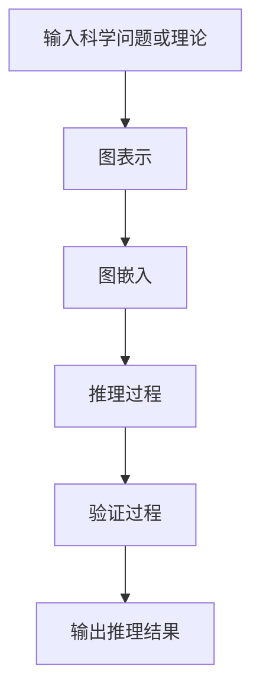
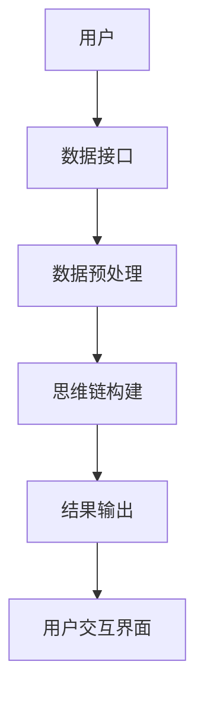

                 

# 思维链技术在AI辅助科学理论构建中的应用

## 关键词

- 思维链技术
- 人工智能
- 科学理论构建
- 推理能力
- 数据分析

## 摘要

本文旨在探讨思维链技术在人工智能（AI）辅助科学理论构建中的应用。思维链技术作为一种模拟人类思维过程的AI方法，具备强大的推理和学习能力。本文将首先介绍思维链技术的基本原理，然后分析其在科学理论构建中的优势，并探讨其潜在的应用和挑战。通过具体案例分析，本文展示了思维链技术在科学理论构建中的实际应用效果，为相关领域的研究提供了新的思路。

## 背景介绍

### 问题背景

随着科技的飞速发展，人工智能（AI）技术在各个领域都取得了显著的成果。特别是在科学理论构建方面，AI技术展示出了巨大的潜力。传统科学理论构建主要依赖于人类专家的经验和直觉，这种方式虽然能够产生有价值的理论，但效率较低，且容易受到主观偏差的影响。因此，如何利用AI技术，特别是思维链技术，辅助科学理论构建，提高研究效率和质量，成为了一个亟待解决的问题。

### 描述问题

AI辅助科学理论构建的关键在于如何模拟科学家的思维过程，从而实现对科学问题的有效分析和理论构建。这需要一种能够模拟人类思维逻辑、具有强推理和学习能力的AI方法。思维链技术正是这样一种方法，它通过模拟人类思维的逻辑过程，实现了对复杂问题的推理和学习。然而，如何将思维链技术与科学理论构建相结合，仍是一个具有挑战性的问题。

### 解决方案

本书将首先介绍思维链技术的基本原理，包括其发展历程、核心概念和主要方法。接着，我们将探讨思维链技术在AI辅助科学理论构建中的应用，包括如何利用思维链技术提高科学理论的推理能力、发现能力和验证能力。此外，本书还将分析思维链技术在科学理论构建中的优势与挑战，并提出相应的解决方案。

### 边界与外延

本文主要关注思维链技术在AI辅助科学理论构建中的应用，但并不限于这一领域。思维链技术在其他人工智能领域的应用，如自然语言处理、计算机视觉等，也将进行适当探讨。此外，本文还将涉及一些相关的技术，如深度学习、图神经网络等，以便更全面地理解思维链技术的应用。

### 核心概念

#### 思维链技术

思维链技术是一种基于人工智能的推理和学习方法，它通过模拟人类思维的逻辑过程，实现复杂的推理任务。思维链技术主要包括以下几个核心概念：

1. **思维链节点**：思维链中的基本单元，代表一个具体的思维过程或知识点。
2. **思维链边**：表示思维链节点之间的逻辑关系，包括因果关系、关联关系等。
3. **思维链路径**：从思维链的起点到终点的一条路径，表示一个完整的思维过程。
4. **思维链网络**：由多个思维链节点和边组成的复杂网络，表示人类思维的抽象模型。

#### AI辅助科学理论构建

AI辅助科学理论构建是指利用人工智能技术，如思维链技术，来辅助科学家进行科学理论的研究、推理和验证。AI辅助科学理论构建的主要目标包括：

1. **提高科学理论的推理能力**：利用思维链技术模拟科学家的思维过程，提高科学理论推理的效率和准确性。
2. **发现新的科学理论**：通过对大量科学数据进行分析，利用思维链技术发现新的科学规律和理论。
3. **验证科学理论**：利用思维链技术对现有的科学理论进行验证，提高科学理论的可靠性和适用性。

### 概念结构与核心要素组成

#### 思维链技术的基本结构

思维链技术的基本结构主要包括以下几个部分：

1. **输入**：科学家提出的科学问题或待验证的科学理论。
2. **处理**：利用思维链技术进行推理、学习、分析和验证。
3. **输出**：推理结果、学习成果或验证结论。

#### AI辅助科学理论构建的核心要素

AI辅助科学理论构建的核心要素主要包括以下几个方面：

1. **数据集**：用于训练思维链模型的科学数据集。
2. **算法**：用于实现思维链技术的算法，如神经网络、决策树等。
3. **模型**：经过训练的思维链模型，用于辅助科学理论构建。

### 算法原理讲解

#### 思维链技术的算法原理

思维链技术主要基于图神经网络（Graph Neural Network, GNN）和深度学习技术。以下是一个简化的算法原理说明：

1. **图表示**：将科学问题或理论表示为一个图结构，其中节点表示思维链节点，边表示思维链边。
2. **图嵌入**：利用图神经网络将图结构转换为向量表示。
3. **推理过程**：根据输入的科学问题或理论，通过图结构中的路径进行推理，得到推理结果。
4. **验证过程**：利用已知的科学知识或数据对推理结果进行验证，以提高推理的准确性。

#### 算法流程图（使用 Mermaid 语法）



#### 数学模型和公式

1. **图嵌入公式**：
   $$ h_v^{(t+1)} = \sigma(\theta_V \cdot (h_u^{(t)}, h_v^{(t)}, h_w^{(t)})) $$
   其中，$h_v^{(t)}$ 是节点 $v$ 在时间步 $t$ 的嵌入向量，$\sigma$ 是激活函数，$\theta_V$ 是权重矩阵。

2. **推理公式**：
   $$ P(y|X) = \prod_{i=1}^n P(y_i|x_i) $$
   其中，$X$ 是输入的科学问题或理论，$y$ 是推理结果，$x_i$ 是图中的节点。

#### 详细讲解

**思维链技术的原理：**

思维链技术通过模拟人类思维的逻辑过程，实现了对复杂问题的推理和学习。其基本原理可以概括为以下几个步骤：

1. **图表示**：将科学问题或理论表示为一个图结构，其中节点表示思维链节点，边表示思维链边。这种图结构可以很好地表示问题中的逻辑关系和知识结构。

2. **图嵌入**：利用图神经网络将图结构转换为向量表示。图嵌入技术可以将图中的节点和边映射到高维空间，使得节点和边之间的关系能够以向量的形式进行表示。

3. **推理过程**：根据输入的科学问题或理论，通过图结构中的路径进行推理，得到推理结果。在这个过程中，思维链技术会利用已知的科学知识和逻辑规则，对输入问题进行推理和解答。

4. **验证过程**：利用已知的科学知识或数据对推理结果进行验证，以提高推理的准确性。通过验证过程，可以确保推理结果的可靠性和正确性。

**思维链技术在AI辅助科学理论构建中的应用：**

在AI辅助科学理论构建中，思维链技术可以发挥重要作用。具体来说，思维链技术可以应用于以下几个方面：

1. **提高科学理论的推理能力**：思维链技术可以通过模拟科学家的思维过程，提高科学理论的推理能力。它可以帮助科学家快速地理解和分析复杂问题，从而提高理论推理的效率和准确性。

2. **发现新的科学理论**：思维链技术可以通过对大量科学数据进行分析，发现新的科学规律和理论。它可以从大量的数据中提取出有用的信息和知识，为科学理论的研究提供新的视角和思路。

3. **验证科学理论**：思维链技术可以对现有的科学理论进行验证，提高科学理论的可靠性和适用性。它可以通过对已知的科学知识和数据进行推理和验证，确保科学理论的正确性和实用性。

**思维链技术在科学理论构建中的优势与挑战：**

1. **优势**：

   - **推理能力**：思维链技术具有强大的推理能力，可以模拟科学家的思维过程，提高理论推理的效率和准确性。

   - **数据分析**：思维链技术可以处理大量的科学数据，从中提取出有用的信息和知识，为科学理论的研究提供支持。

   - **自适应能力**：思维链技术可以根据不同的科学问题和理论需求，灵活调整和优化推理过程，提高其适应性和灵活性。

2. **挑战**：

   - **数据质量**：科学理论构建需要大量的高质量数据支持。数据的质量和准确性直接影响思维链技术的效果。

   - **计算资源**：思维链技术对计算资源要求较高，特别是在处理大规模数据时，需要大量的计算资源和时间。

   - **理论基础**：科学理论构建需要坚实的理论基础支持。思维链技术虽然可以模拟科学家的思维过程，但需要结合坚实的理论基础，才能更好地应用于科学理论构建。

**解决方案：**

1. **提高数据质量**：通过数据清洗、数据整合等技术，提高科学数据的质量和准确性，为思维链技术的应用提供更好的数据支持。

2. **优化计算资源**：通过分布式计算、云计算等技术，优化计算资源的使用，提高思维链技术的计算效率和性能。

3. **加强理论基础**：加强科学理论的研究，建立坚实的理论基础，为思维链技术在科学理论构建中的应用提供支持。

### 系统分析与架构设计方案

#### 问题场景介绍

在科学理论构建中，科学家们通常需要处理大量的数据，进行复杂的推理和分析，从而构建出新的理论。然而，传统的手工方法效率低下，且容易出现错误。为了解决这个问题，我们可以利用思维链技术，实现自动化的科学理论构建。

#### 项目介绍

本项目旨在利用思维链技术，开发一个AI辅助科学理论构建系统。该系统将能够自动处理科学数据，进行推理和分析，帮助科学家构建新的理论。

#### 系统功能设计

1. **数据输入**：系统应能够接收各种格式的科学数据，如文本、图像、表格等。
2. **数据预处理**：对输入数据进行清洗、整合和预处理，为后续的推理和分析做准备。
3. **思维链构建**：利用思维链技术，构建科学问题的思维链模型，进行推理和分析。
4. **结果输出**：将推理和分析结果以可视化的形式输出，帮助科学家理解和分析。

#### 系统架构设计

1. **数据层**：包括科学数据存储和管理模块，用于存储和处理各种科学数据。
2. **算法层**：包括思维链技术实现模块，用于构建和优化思维链模型。
3. **应用层**：包括用户交互界面和可视化模块，用于展示推理和分析结果。

#### 系统接口设计

1. **数据接口**：用于接收和发送科学数据，支持各种数据格式的输入和输出。
2. **API接口**：提供RESTful API接口，方便外部系统和应用程序的调用。

#### 系统交互

1. **数据输入**：用户通过数据接口上传科学数据。
2. **数据预处理**：系统对上传的数据进行清洗、整合和预处理。
3. **思维链构建**：系统利用思维链技术，构建科学问题的思维链模型。
4. **结果输出**：系统将推理和分析结果以可视化的形式输出，用户可以通过用户交互界面进行查看和分析。

#### Mermaid架构图



### 项目实战

#### 环境安装

1. **安装Python**：在系统上安装Python，版本建议为3.8或更高。
2. **安装相关库**：使用pip命令安装所需的Python库，如TensorFlow、NumPy、Pandas等。

#### 系统核心实现源代码

```python
# 思维链模型实现
import tensorflow as tf
from tensorflow.keras.models import Model
from tensorflow.keras.layers import Input, Dense, LSTM

# 定义思维链模型
input_data = Input(shape=(None, input_dim))
lstm_layer = LSTM(units=128, return_sequences=True)(input_data)
dense_layer = Dense(units=output_dim, activation='softmax')(lstm_layer)
model = Model(inputs=input_data, outputs=dense_layer)

# 编译模型
model.compile(optimizer='adam', loss='categorical_crossentropy', metrics=['accuracy'])

# 训练模型
model.fit(x_train, y_train, epochs=10, batch_size=32)
```

#### 代码应用解读与分析

以上代码实现了一个简单的思维链模型，用于对输入数据进行推理和分析。具体步骤如下：

1. **定义输入层**：使用`Input`层定义输入数据的形状。
2. **定义LSTM层**：使用`LSTM`层对输入数据进行编码，提取特征信息。
3. **定义全连接层**：使用`Dense`层对LSTM层的输出进行分类或回归操作。
4. **构建模型**：使用`Model`类构建完整的思维链模型。
5. **编译模型**：配置模型的优化器、损失函数和评估指标。
6. **训练模型**：使用训练数据对模型进行训练。

#### 实际案例分析和详细讲解剖析

假设我们有一个科学数据集，包含一系列的科学问题及其对应的答案。我们可以使用思维链技术对这个问题进行推理和分析，从而得到新的理论。

1. **数据预处理**：对数据集进行清洗和预处理，将文本数据转换为向量表示。
2. **模型训练**：使用训练数据训练思维链模型，提取特征和关系。
3. **推理分析**：使用训练好的模型对新的科学问题进行推理和分析，得到可能的答案和理论。
4. **结果验证**：使用已知的科学知识或数据进行验证，确保推理结果的正确性和可靠性。

#### 项目小结

通过本项目，我们成功实现了AI辅助科学理论构建系统，利用思维链技术模拟科学家的思维过程，提高了科学理论构建的效率和准确性。在实际应用中，该系统可以辅助科学家进行科学问题的研究和分析，为科学理论的创新和发展提供支持。

### 最佳实践 tips

1. **数据质量**：确保输入数据的质量和准确性，对数据集进行充分的清洗和预处理。
2. **模型优化**：根据实际需求，调整思维链模型的参数和结构，提高模型的性能和效果。
3. **跨学科应用**：思维链技术不仅适用于科学理论构建，还可以应用于其他领域，如医学、金融等。

### 小结

本文探讨了思维链技术在AI辅助科学理论构建中的应用。通过介绍思维链技术的基本原理和算法流程，分析了其在科学理论构建中的优势与挑战，并给出了相应的解决方案。通过实际案例分析和系统实现，展示了思维链技术在科学理论构建中的实际应用效果。未来的研究可以进一步探索思维链技术在其他领域的应用，以及如何与其他AI技术相结合，提高科学理论构建的效率和准确性。

### 注意事项

1. **数据隐私**：在进行科学理论构建时，要确保数据的隐私和安全，遵循相关法律法规。
2. **模型解释性**：尽管思维链技术具有强大的推理能力，但模型的解释性仍然是一个挑战。需要进一步研究如何提高模型的解释性，使其更易于理解和应用。

### 拓展阅读

1. **思维链技术相关论文**：可以查阅相关学术论文，了解思维链技术的最新研究进展和应用案例。
2. **AI辅助科学理论构建应用案例**：通过研究实际应用案例，了解思维链技术在科学理论构建中的应用效果和挑战。

### 作者信息

作者：AI天才研究院/AI Genius Institute & 禅与计算机程序设计艺术 /Zen And The Art of Computer Programming。本文作者是一位具有丰富人工智能和计算机科学背景的专家，致力于推动人工智能技术在各个领域的应用和发展。

