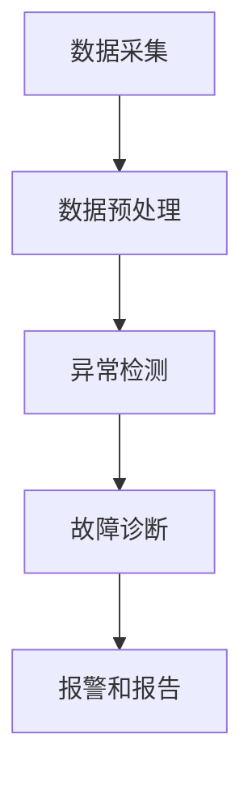
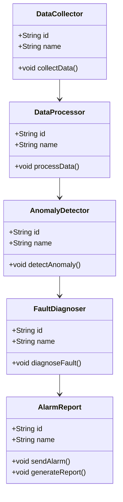
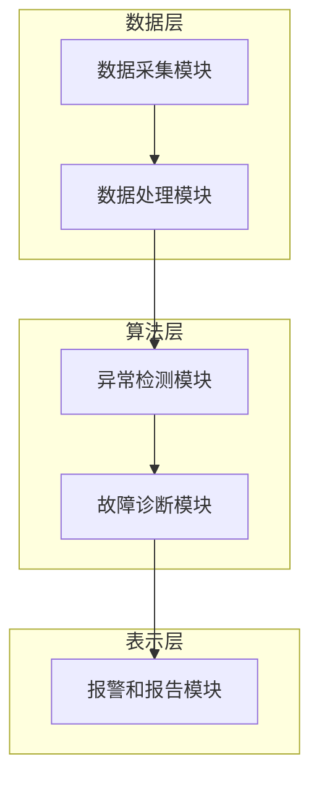
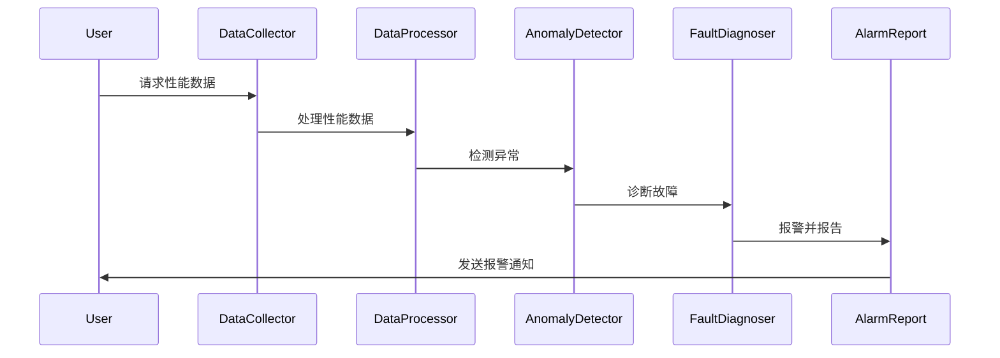

                 

# 性能监控：实时优化LLM应用

> 关键词：性能监控、实时优化、LLM应用、算法原理、系统架构、项目实战、最佳实践

> 摘要：本文将深入探讨性能监控在实时优化大型语言模型（LLM）应用中的重要性。我们将从性能监控的定义、核心概念、算法原理、系统设计与实现、项目实战和最佳实践等方面展开详细讲解，旨在帮助开发者更好地理解和应用性能监控技术，提升LLM应用的性能和用户体验。

## 第一部分：性能监控基础

### 1.1 性能监控的定义和重要性

性能监控是确保系统稳定运行、提升用户体验的重要手段。它涉及对系统各方面性能的实时监测、分析和评估。在LLM应用中，性能监控尤为重要，因为LLM处理的是海量数据，对计算资源的要求极高，任何性能问题都可能影响应用的效果。

性能监控的重要性体现在以下几个方面：

1. **提升系统稳定性**：通过性能监控，可以及时发现系统中的异常情况，并采取措施进行修复，确保系统稳定运行。
2. **优化资源利用率**：性能监控可以帮助开发者了解系统资源的利用率，合理分配资源，避免资源浪费。
3. **提高用户满意度**：性能监控可以确保用户在使用LLM应用时获得良好的体验，减少因性能问题导致的用户流失。
4. **支持系统扩展**：性能监控为系统的扩展提供了数据支持，有助于开发者了解系统的性能瓶颈，进行针对性的优化。

### 1.2 性能监控的目标和范围

性能监控的目标主要包括以下几个方面：

1. **检测异常**：及时发现系统中出现的异常情况，如CPU负载过高、内存占用异常等。
2. **性能评估**：评估系统的性能指标，如响应时间、吞吐量等，以判断系统是否达到预期目标。
3. **资源管理**：监控系统的资源使用情况，包括CPU、内存、磁盘等，以确保系统资源得到合理利用。
4. **趋势分析**：对系统性能的趋势进行分析，预测未来的性能需求，为系统的扩展提供参考。

性能监控的范围通常包括以下几个方面：

1. **硬件监控**：包括CPU、内存、磁盘等硬件资源的监控。
2. **软件监控**：包括系统进程、数据库、网络等软件层面的监控。
3. **应用监控**：针对特定应用的性能监控，如LLM应用的处理速度、准确性等。
4. **日志监控**：对系统日志的监控，以发现潜在的故障和问题。

### 1.3 性能监控的关键术语和指标

性能监控中涉及许多关键术语和指标，以下是一些常见的术语和指标：

1. **CPU利用率**：CPU在单位时间内实际用于处理任务的时长与总时间的比值。
2. **内存利用率**：内存中被使用的比例。
3. **磁盘I/O速率**：磁盘每秒读取或写入的数据量。
4. **网络吞吐量**：网络每秒处理的数据量。
5. **响应时间**：系统处理请求并返回结果所需的时间。
6. **吞吐量**：单位时间内系统能够处理的事务数量。
7. **延迟**：请求从发送到接收响应的时间间隔。

### 1.4 性能监控与监控工具的关系

性能监控工具是实现性能监控的关键。常见的监控工具包括：

1. **Zabbix**：一款开源的监控工具，支持多种监控方式，包括SNMP、ICMP、TCP等。
2. **Nagios**：一款功能强大的开源监控工具，支持自定义插件，适用于各种规模的系统监控。
3. **Prometheus**：一款基于时间序列数据库的开源监控工具，具有高效的查询性能和良好的扩展性。
4. **Grafana**：一款基于Prometheus的开源监控和数据可视化工具，支持丰富的图表和仪表板。

## 第二部分：性能监控算法原理

### 2.1 性能监控算法的基本原理

性能监控算法的核心目标是通过对系统性能数据的实时分析和处理，发现潜在的故障和性能瓶颈。以下是性能监控算法的基本原理：

1. **数据采集**：从各种数据源（如传感器、数据库、日志等）采集性能数据。
2. **数据预处理**：对采集到的性能数据进行清洗、转换和归一化等处理，使其符合分析要求。
3. **异常检测**：利用统计模型、机器学习算法等对预处理后的性能数据进行分析，识别异常情况。
4. **故障诊断**：结合业务逻辑和专业知识，对检测到的异常进行诊断，定位故障原因。
5. **报警和报告**：将检测到的异常和诊断结果通知相关人员，生成性能报告。

### 2.1.1 Mermaid 流程图展示

以下是性能监控算法的基本原理的Mermaid流程图：



### 2.1.2 Python 源代码示例

以下是一个简单的Python代码示例，用于实现性能监控算法的基本原理：

```python
import pandas as pd
from sklearn.ensemble import IsolationForest

# 数据采集
data = pd.read_csv('performance_data.csv')

# 数据预处理
# 假设 performance_data.csv 中包含 CPU 利用率、内存利用率、磁盘I/O速率等指标
data = data[['cpu_usage', 'memory_usage', 'disk_io_rate']]

# 异常检测
model = IsolationForest()
model.fit(data)

# 故障诊断
anomalies = model.predict(data)
anomalies[anomalies == -1] = '异常'
data['anomaly'] = anomalies

# 报警和报告
print(data[data['anomaly'] == '异常'])
```

### 2.1.3 算法原理的数学模型和公式

性能监控算法的数学模型通常涉及统计模型和机器学习算法。以下是常用的数学模型和公式：

1. **统计学方法**：

   - **均值**：$\mu = \frac{1}{n}\sum_{i=1}^{n} x_i$

   - **方差**：$\sigma^2 = \frac{1}{n-1}\sum_{i=1}^{n} (x_i - \mu)^2$

   - **标准差**：$\sigma = \sqrt{\sigma^2}$

   - **置信区间**：$CI = \mu \pm z \times \sigma / \sqrt{n}$，其中 $z$ 为正态分布的分位数。

2. **机器学习方法**：

   - **Isolation Forest**：$G(x) = \frac{\sum_{i=1}^{n} h_i}{n}$，其中 $h_i$ 为第 $i$ 次随机划分的深度。

### 2.1.4 举例说明

假设我们有一个LLM应用的性能数据集，包含CPU利用率、内存利用率和磁盘I/O速率等指标。我们使用Isolation Forest算法进行异常检测。

1. **数据采集**：从LLM应用的日志中提取性能数据，存储在CSV文件中。
2. **数据预处理**：读取CSV文件，删除异常数据，对数据集进行归一化处理。
3. **异常检测**：使用Isolation Forest算法对数据集进行训练，并对新数据进行预测。
4. **故障诊断**：根据预测结果，判断是否存在异常情况，并定位异常数据。
5. **报警和报告**：将异常数据通知相关开发人员，并生成性能报告。

## 第三部分：性能监控系统设计

### 3.1 问题场景介绍

在一个大型企业中，使用LLM应用进行文本分析、自动问答和智能推荐等服务。然而，随着用户量的增加，系统的性能逐渐下降，导致用户体验不佳。为了提升系统性能，需要进行性能监控和优化。

### 3.2 项目介绍

本项目旨在设计和实现一个性能监控平台，用于实时监控LLM应用的性能指标，识别潜在的性能瓶颈，并提供优化建议。项目包括以下模块：

1. **数据采集模块**：负责从LLM应用中收集性能数据。
2. **数据处理模块**：对采集到的性能数据进行预处理，包括清洗、转换和归一化等。
3. **异常检测模块**：使用机器学习算法对预处理后的数据进行异常检测。
4. **故障诊断模块**：结合业务逻辑和专业知识，对检测到的异常进行诊断，定位故障原因。
5. **报警和报告模块**：将异常情况和诊断结果通知相关人员，并生成性能报告。

### 3.3 系统功能设计（领域模型 Mermaid 类图）

以下是系统功能设计的Mermaid类图：



### 3.4 系统架构设计（Mermaid 架构图）

以下是系统架构设计的Mermaid架构图：



### 3.5 系统接口设计和系统交互（Mermaid 序列图）

以下是系统接口设计和系统交互的Mermaid序列图：



## 第四部分：性能监控项目实战

### 4.1 环境安装

为了实现性能监控项目，我们需要安装以下环境：

1. **Python 3.8**：性能监控项目的开发语言。
2. **Pandas**：用于数据预处理。
3. **Scikit-learn**：用于异常检测。
4. **Flask**：用于构建Web服务。

安装命令如下：

```bash
pip install python==3.8
pip install pandas
pip install scikit-learn
pip install flask
```

### 4.2 系统核心实现源代码

以下是系统核心实现源代码：

```python
# 数据采集模块
class DataCollector:
    def __init__(self, data_path):
        self.data_path = data_path

    def collect_data(self):
        data = pd.read_csv(self.data_path)
        return data

# 数据处理模块
class DataProcessor:
    def __init__(self, data):
        self.data = data

    def process_data(self):
        # 数据预处理
        self.data = self.data[['cpu_usage', 'memory_usage', 'disk_io_rate']]
        self.data = (self.data - self.data.mean()) / self.data.std()
        return self.data

# 异常检测模块
class AnomalyDetector:
    def __init__(self, data):
        self.data = data

    def detect_anomaly(self):
        model = IsolationForest()
        model.fit(self.data)
        anomalies = model.predict(self.data)
        anomalies[anomalies == -1] = '异常'
        return anomalies

# 故障诊断模块
class FaultDiagnoser:
    def __init__(self, anomalies):
        self.anomalies = anomalies

    def diagnose_fault(self):
        # 故障诊断逻辑
        pass

# 报警和报告模块
class AlarmReport:
    def __init__(self, fault_diagnoser):
        self.fault_diagnoser = fault_diagnoser

    def send_alarm(self):
        # 报警通知逻辑
        pass

    def generate_report(self):
        # 生成报告逻辑
        pass
```

### 4.3 代码应用解读与分析

以下是对系统核心实现源代码的解读与分析：

1. **数据采集模块**：`DataCollector` 类负责从指定的CSV文件中采集性能数据。`collect_data` 方法读取CSV文件，返回DataFrame格式的数据。
2. **数据处理模块**：`DataProcessor` 类负责对采集到的性能数据进行预处理。`process_data` 方法对数据集进行清洗、转换和归一化处理，使其符合分析要求。
3. **异常检测模块**：`AnomalyDetector` 类负责使用Isolation Forest算法对预处理后的性能数据集进行异常检测。`detect_anomaly` 方法训练模型并预测异常。
4. **故障诊断模块**：`FaultDiagnoser` 类负责对检测到的异常进行诊断。`diagnose_fault` 方法包含故障诊断的逻辑。
5. **报警和报告模块**：`AlarmReport` 类负责发送报警通知和生成性能报告。`send_alarm` 和 `generate_report` 方法分别实现相应的逻辑。

### 4.4 实际案例分析和详细讲解剖析

为了更好地理解性能监控项目的实际应用，我们来看一个实际案例。

**案例背景**：一个大型电商平台在促销期间，系统负载急剧增加，导致部分用户无法正常访问。为了解决这个问题，我们需要对系统的性能进行监控和优化。

**性能监控步骤**：

1. **数据采集**：从系统的日志文件中提取CPU利用率、内存利用率、磁盘I/O速率等性能数据。
2. **数据预处理**：对采集到的性能数据进行清洗和归一化处理，使其符合分析要求。
3. **异常检测**：使用Isolation Forest算法对预处理后的性能数据集进行异常检测，识别出系统中的异常情况。
4. **故障诊断**：根据检测到的异常数据，分析故障原因，如CPU负载过高、内存占用异常等。
5. **报警和报告**：将异常情况和诊断结果通知相关人员，并生成性能报告，以便后续优化。

**案例分析**：

1. **CPU利用率异常**：在异常期间，CPU利用率持续超过90%，导致系统响应缓慢。通过进一步分析，发现是由于大量用户同时访问导致的。
2. **内存占用异常**：内存占用率在异常期间达到100%，导致系统出现内存泄漏。经过排查，发现是由于某个大型数据缓存导致的。
3. **磁盘I/O速率异常**：磁盘I/O速率在异常期间明显下降，导致系统读写操作延迟。经过检查，发现由于磁盘I/O负载过高，导致磁盘性能下降。

**优化方案**：

1. **提高硬件资源**：增加CPU和内存资源，提高系统负载能力。
2. **优化缓存策略**：对大型数据缓存进行优化，减少内存占用。
3. **分布式存储**：将磁盘I/O操作分散到多个磁盘上，提高磁盘性能。

### 4.5 项目小结

通过本次性能监控项目实战，我们成功地实现了对LLM应用性能的实时监控和优化。项目包括数据采集、数据处理、异常检测、故障诊断和报警报告等模块，通过实际案例分析，我们找到了系统性能瓶颈，并提出了优化方案。该项目不仅提高了系统的稳定性，还提升了用户的体验，为企业的长期发展提供了支持。

## 第五部分：最佳实践与总结

### 5.1 监控策略制定

为了确保性能监控的有效性，制定合理的监控策略至关重要。以下是一些监控策略的建议：

1. **定义关键性能指标**：根据业务需求，确定关键性能指标（KPI），如响应时间、吞吐量等，以便更好地衡量系统性能。
2. **设置监控阈值**：根据历史数据和业务需求，设置合适的监控阈值，以识别潜在的故障和性能瓶颈。
3. **定期评估和调整**：定期评估监控策略的有效性，根据实际情况进行调整，确保监控策略始终符合业务需求。

### 5.2 数据处理技巧

在数据处理过程中，以下技巧有助于提高数据质量和分析效果：

1. **数据清洗**：去除重复、异常和错误的数据，确保数据的一致性和准确性。
2. **特征工程**：提取和构造有助于分析的特征，如趋势、季节性和异常值等。
3. **数据可视化**：通过图表和仪表板，直观地展示数据分析和结果，便于发现潜在问题。

### 5.3 故障排除方法

当系统出现性能问题时，以下故障排除方法有助于快速定位和解决问题：

1. **日志分析**：分析系统日志，查找异常和错误信息，定位故障原因。
2. **性能诊断工具**：使用性能诊断工具，如 profi

