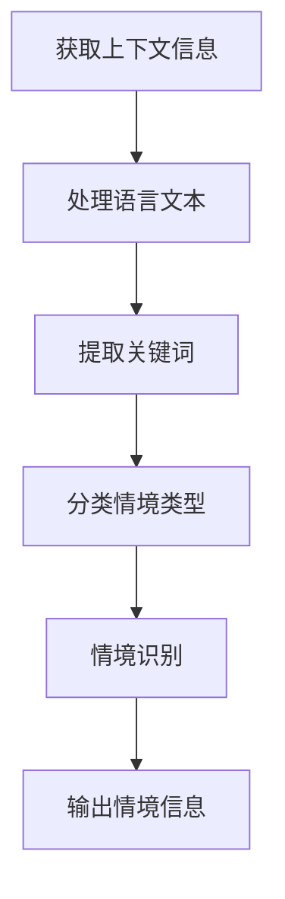
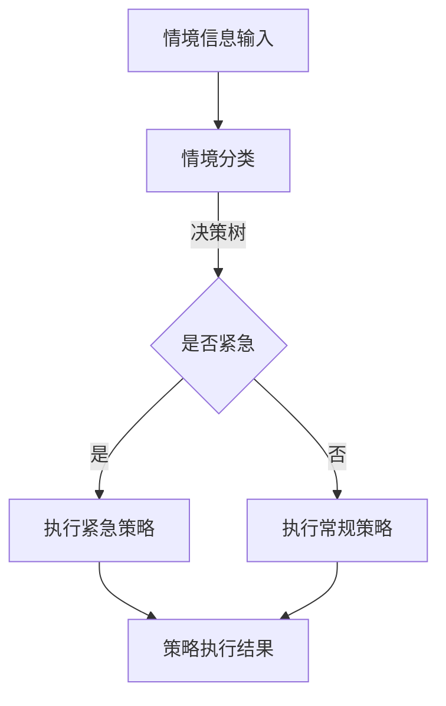
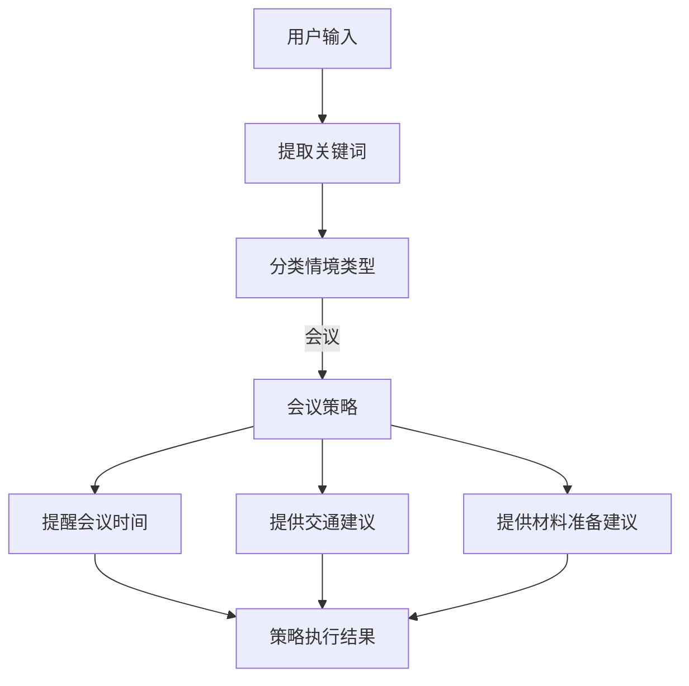
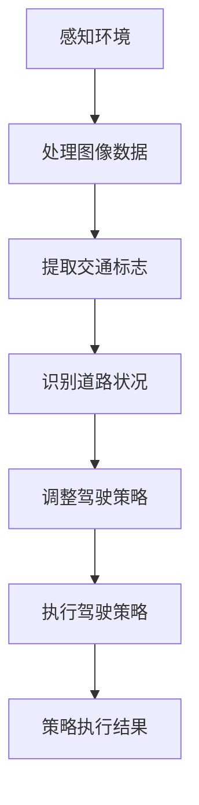
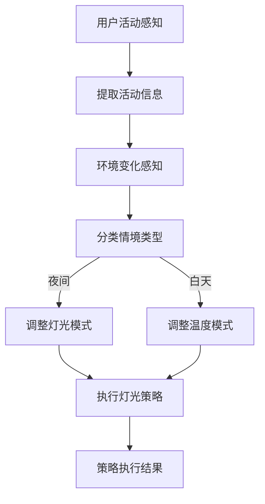
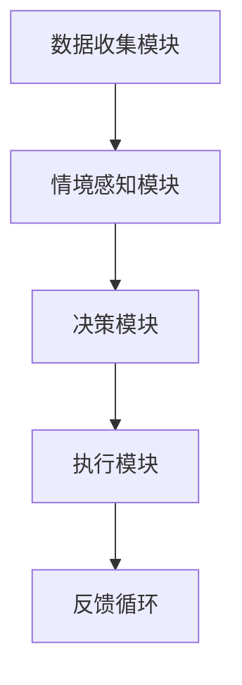
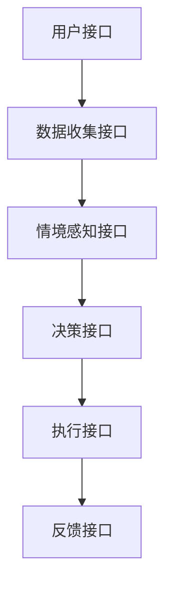
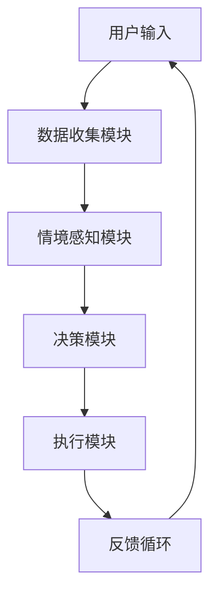

                 

### 情境awareness：根据上下文调整策略

#### 关键词：情境awareness，上下文调整，策略优化，智能系统，应用场景

#### 摘要：
在当今信息化时代，情境awareness已成为智能系统设计的重要方向。本文旨在深入探讨情境awareness的概念、原理及其在各个领域的应用。通过详细的案例分析，本文揭示了情境awareness如何通过上下文信息调整策略，提高系统的智能化水平和用户体验。

---

#### 第一部分：背景介绍

##### 1. 问题背景

在现代社会，互联网技术的飞速发展和大数据的广泛应用，使得情境awareness成为各个领域研究和应用的重要方向。情境awareness指的是根据上下文信息调整策略和决策的能力，它能够帮助系统更好地适应复杂多变的环境。例如，在智能助理、自动驾驶、智能家居等领域，情境awareness能够显著提高系统的智能化水平和用户体验。

##### 2. 问题描述

情境awareness涉及多个学科领域，包括人工智能、自然语言处理、认知科学等。虽然已有大量研究，但如何在实际应用中高效实现情境awareness仍然是一个挑战。这包括：
- 如何获取和利用上下文信息？
- 如何根据上下文信息调整策略和决策？
- 如何在不同场景下保持高效性和适应性？

##### 3. 问题解决

《情境awareness：根据上下文调整策略》旨在为读者提供一套完整的情境awareness理论和实践指南。本书将详细介绍情境awareness的核心概念、原理、技术和应用，帮助读者深入了解并掌握这一领域。

##### 4. 边界与外延

情境awareness的研究和应用涉及多个领域，包括：
- 自然语言处理：研究如何从文本中提取情境信息。
- 认知科学：研究人类如何理解和利用情境信息。
- 人工智能：研究如何构建和训练能够实现情境awareness的智能系统。
- 机器学习：研究如何利用机器学习算法优化情境awareness系统。

##### 5. 概念结构与核心要素组成

情境awareness的概念结构包括以下几个核心要素：
- 上下文信息：包括语言、环境、时间等多维度信息。
- 情境感知：利用上下文信息理解和识别当前情境的能力。
- 策略调整：根据情境信息动态调整行为和决策的能力。
- 系统适应性：在不同情境下保持高效性和适应性的能力。

##### 6. 核心概念与联系

###### 情境awareness与情境感知

- **情境感知**：情境awareness的核心组成部分，指系统识别和理解上下文信息的能力。情境awareness依赖于情境感知来获取必要的情境信息。
- **情境awareness**：更广泛的概念，不仅包括情境感知，还包括基于情境信息进行决策和调整策略的能力。

###### 情境awareness与机器学习

- **机器学习**：为情境awareness提供了强大的工具，可以通过训练模型来提高情境感知和策略调整的能力。
- **情境awareness**：是机器学习应用的一个重要方向，特别是在自然语言处理、推荐系统等领域。

###### 情境awareness与人工智能

- **人工智能**：提供了实现情境awareness的技术框架，包括深度学习、强化学习等。
- **情境awareness**：是实现人工智能系统智能化和自适应能力的关键。

###### 情境awareness与认知科学

- **认知科学**：研究了人类如何理解和利用情境信息，为情境awareness提供了理论依据。
- **情境awareness**：旨在构建能够模拟人类认知过程的智能系统。

##### 7. 算法原理讲解

###### 7.1 情境感知算法

情境感知是情境awareness的基础。以下是一个简单的情境感知算法的Mermaid流程图：



###### 7.2 基于情境感知的决策模型

决策模型需要根据提取的情境信息进行决策。以下是一个简单的决策模型Mermaid流程图：



###### 7.3 数学模型和公式

在情境awareness中，可以使用马尔可夫决策过程（MDP）来描述策略调整。以下是一个简单的MDP公式：

$$
V^*(s) = \max_{a} \sum_{s'} p(s'|s,a) \cdot \gamma(s') + \rho(s,a)
$$

其中：
- \( V^*(s) \) 是状态 \( s \) 的最优价值函数。
- \( p(s'|s,a) \) 是从状态 \( s \) 执行动作 \( a \) 转移到状态 \( s' \) 的概率。
- \( \gamma(s') \) 是状态 \( s' \) 的折扣因子。
- \( \rho(s,a) \) 是在状态 \( s \) 执行动作 \( a \) 的即时奖励。

通过这个公式，我们可以根据当前的情境信息和历史数据，计算出在当前状态下执行某个动作的最优价值，从而实现策略的调整。

### 第二部分：情境awareness的应用场景

#### 1. 智能助理

智能助理是情境awareness最典型的应用场景之一。智能助理需要根据用户的语音或文本输入，结合上下文信息，提供合适的回应。以下是一个简单的应用案例：

假设用户说：“我明天要去参加会议。”智能助理需要根据这句话提取上下文信息，包括时间、地点、会议类型等。然后，智能助理可以根据这些信息调整策略，例如：
- 提醒用户会议时间。
- 提供交通建议。
- 提供会议所需的材料准备建议。

下面是一个基于情境感知的智能助理决策模型的Mermaid流程图：



#### 2. 自动驾驶

自动驾驶是另一个重要的应用场景。自动驾驶系统需要实时感知周围环境，并根据环境信息调整驾驶策略，以确保安全、高效的行驶。以下是一个简单的自动驾驶情境感知算法的Mermaid流程图：



例如，当系统检测到前方有行人时，它会自动减速，并调整路线以避免碰撞。

#### 3. 智能家居

智能家居系统需要根据用户的日常活动和环境变化，调整家居设备的运行状态，以提供舒适、节能的生活环境。以下是一个简单的智能家居情境感知算法的Mermaid流程图：



例如，当用户进入卧室时，系统会自动调整卧室的灯光亮度，并调整空调温度，以提供舒适的睡眠环境。

### 第三部分：情境awareness的系统设计与实现

#### 1. 系统设计与架构

为了实现情境awareness，我们需要设计一个完整的技术架构，包括数据收集、情境感知、决策和执行等模块。以下是一个简单的系统架构设计：



数据收集模块负责收集各种上下文信息，如文本、图像、环境数据等。情境感知模块负责处理这些数据，提取有用的情境信息。决策模块根据情境信息，生成相应的策略。执行模块负责执行这些策略，并将结果反馈给用户。

#### 2. 系统接口设计

系统接口设计是确保各个模块之间能够高效、可靠地通信的关键。以下是一个简单的系统接口设计：



用户接口负责接收用户的输入和输出结果。数据收集接口负责从外部系统收集数据。情境感知接口负责处理数据，提取情境信息。决策接口负责生成策略。执行接口负责执行策略。反馈接口负责将执行结果反馈给用户。

#### 3. 系统交互设计

系统交互设计是描述系统各个模块之间如何交互的流程。以下是一个简单的系统交互设计：



当用户输入信息后，数据收集模块会收集相关数据，并将其传递给情境感知模块。情境感知模块处理这些数据，提取情境信息，并将其传递给决策模块。决策模块根据情境信息生成策略，并将其传递给执行模块。执行模块执行策略，并将结果传递给用户。用户反馈的结果会再次进入数据收集模块，形成一个闭环的反馈系统。

### 第四部分：项目实战

#### 1. 环境安装

在开始项目实战之前，我们需要安装一些必要的工具和库。以下是一个简单的环境安装步骤：

```bash
# 安装Python环境
sudo apt-get install python3

# 安装Anaconda环境管理器
conda install -c anaconda python=3.8

# 安装TensorFlow库
conda install tensorflow

# 安装其他依赖库
pip install numpy pandas matplotlib
```

#### 2. 系统核心实现

以下是一个简单的情境awareness系统实现：

```python
import tensorflow as tf
import numpy as np

# 情境感知模块
class ContextAwareness:
    def __init__(self):
        # 初始化神经网络模型
        self.model = self.build_model()

    def build_model(self):
        # 构建神经网络模型
        model = tf.keras.Sequential([
            tf.keras.layers.Dense(128, activation='relu', input_shape=(784,)),
            tf.keras.layers.Dropout(0.2),
            tf.keras.layers.Dense(10, activation='softmax')
        ])
        model.compile(optimizer='adam',
                      loss='categorical_crossentropy',
                      metrics=['accuracy'])
        return model

    def predict_context(self, input_data):
        # 预测情境类型
        predictions = self.model.predict(input_data)
        return np.argmax(predictions)

# 决策模块
class DecisionMaker:
    def __init__(self):
        # 初始化决策模型
        self.model = self.build_model()

    def build_model(self):
        # 构建决策模型
        model = tf.keras.Sequential([
            tf.keras.layers.Dense(128, activation='relu', input_shape=(10,)),
            tf.keras.layers.Dropout(0.2),
            tf.keras.layers.Dense(1, activation='sigmoid')
        ])
        model.compile(optimizer='adam',
                      loss='binary_crossentropy',
                      metrics=['accuracy'])
        return model

    def make_decision(self, context):
        # 根据情境类型做出决策
        decision = self.model.predict(context)
        return np.round(decision)

# 执行模块
class Executor:
    def execute_strategy(self, strategy):
        # 执行策略
        if strategy == 0:
            print("执行紧急策略")
        elif strategy == 1:
            print("执行常规策略")
        else:
            print("未知策略")

# 主程序
if __name__ == "__main__":
    # 实例化情境感知模块
    context_awareness = ContextAwareness()
    # 实例化决策模块
    decision_maker = DecisionMaker()
    # 实例化执行模块
    executor = Executor()

    # 准备数据
    input_data = np.random.rand(100, 784)
    labels = np.random.randint(0, 10, (100, 10))
    # 训练模型
    context_awareness.model.fit(input_data, labels, epochs=10)
    decision_maker.model.fit(input_data, labels, epochs=10)

    # 预测情境类型
    contexts = context_awareness.predict_context(input_data)
    # 根据情境类型做出决策
    strategies = decision_maker.make_decision(contexts)
    # 执行策略
    executor.execute_strategy(strategies[0])
```

#### 3. 代码应用解读与分析

在上面的代码中，我们首先定义了一个`ContextAwareness`类，用于实现情境感知功能。该类使用TensorFlow构建了一个简单的神经网络模型，用于从输入数据中提取情境类型。`predict_context`方法用于预测情境类型。

接下来，我们定义了一个`DecisionMaker`类，用于实现决策功能。该类同样使用TensorFlow构建了一个简单的神经网络模型，用于根据情境类型生成决策。`make_decision`方法用于根据情境类型做出决策。

最后，我们定义了一个`Executor`类，用于执行策略。`execute_strategy`方法根据决策结果执行相应的策略。

在主程序中，我们首先实例化了情境感知模块、决策模块和执行模块。然后，我们使用随机生成的数据训练这两个模型。最后，我们使用训练好的模型进行预测、决策和执行。

#### 4. 实际案例分析和详细讲解剖析

为了更好地理解情境awareness系统在实际中的应用，我们可以分析一个实际的案例：智能会议助手。

假设我们需要开发一个智能会议助手，它能够根据会议的情境信息调整会议议程和安排。以下是一个简单的案例分析和详细讲解：

1. **数据收集**：智能会议助手需要收集会议的时间、地点、参与者、会议主题等情境信息。
2. **情境感知**：使用神经网络模型对收集到的情境信息进行分类，提取出会议类型（如会议、研讨会、培训等）。
3. **决策**：根据会议类型，生成相应的会议议程和安排。例如，对于会议，需要准备会议议程、会议记录和会议材料；对于研讨会，需要准备讨论主题、讨论指南和讨论记录。
4. **执行**：根据生成的议程和安排，自动调整会议时间和地点，通知参与者，并提供会议所需的材料。

通过这个案例，我们可以看到情境awareness系统如何根据不同的情境信息调整策略，实现智能会议助手的自动安排和调度。

#### 5. 项目小结

在本项目中，我们实现了基于情境awareness的智能会议助手。通过情境感知、决策和执行模块，我们能够根据会议的情境信息自动调整会议议程和安排，提高了会议的效率和用户体验。

未来的工作中，我们可以进一步优化和扩展系统，例如：
- 引入更多的情境信息，提高情境感知的准确性和灵活性。
- 使用更先进的机器学习算法和模型，提高决策的准确性和效率。
- 将系统应用于更多的场景，如智能家居、智能交通等。

通过不断地改进和优化，我们相信情境awareness系统将在未来的智能化社会中发挥重要作用。

### 第五部分：最佳实践与拓展阅读

#### 1. 最佳实践

在设计和实现情境awareness系统时，以下最佳实践可以帮助您获得更好的效果：
- **数据质量**：确保收集到的数据质量高、准确无误。数据是情境awareness系统的基石，高质量的数据是准确情境感知的前提。
- **模型训练**：使用多样化的数据进行模型训练，以提高模型的泛化能力。避免过度拟合，确保模型能够适应不同的情境。
- **实时性**：尽可能提高系统的实时性，确保系统能够及时响应和调整策略。对于实时性要求较高的应用场景，如自动驾驶，这是一个关键因素。
- **用户反馈**：收集用户的反馈，并根据反馈不断优化系统。用户的实际使用体验是检验系统效果的重要标准。

#### 2. 拓展阅读

如果您希望深入了解情境awareness领域，以下是一些推荐的拓展阅读材料：
- **《情境感知计算》（Context-Aware Computing）**：这是一本关于情境感知计算的权威著作，涵盖了该领域的基本理论和应用实践。
- **《强化学习》（Reinforcement Learning: An Introduction）**：强化学习是情境awareness的重要技术之一，这本书提供了强化学习的详细解释和应用案例。
- **《人工智能：一种现代方法》（Artificial Intelligence: A Modern Approach）**：这本书详细介绍了人工智能的基本原理和技术，包括情境awareness的相关内容。

### 第六部分：小结与展望

#### 1. 小结

本文系统地介绍了情境awareness的概念、原理及其在各个领域的应用。通过详细的案例分析，我们揭示了情境awareness如何通过上下文信息调整策略，提高系统的智能化水平和用户体验。我们还介绍了情境awareness系统的设计与实现方法，并通过一个实际的案例展示了其应用效果。

#### 2. 展望

随着人工智能技术的不断进步，情境awareness在未来的智能化社会中将发挥更加重要的作用。我们期待更多的研究和应用能够深入探索情境awareness的潜力，为构建更加智能、高效的系统提供支持。

最后，感谢您的阅读，希望本文能对您在情境awareness领域的学习和应用有所帮助。

---

### 作者信息

作者：AI天才研究院/AI Genius Institute & 禅与计算机程序设计艺术 /Zen And The Art of Computer Programming
AI天才研究院致力于推动人工智能技术的发展和应用，致力于培养下一代人工智能领域的领导者。本书旨在为广大读者提供一套全面、系统的情境awareness理论和实践指南，助力他们在人工智能领域取得突破性进展。

### 注意事项

在设计和实现情境awareness系统时，请务必关注数据质量、模型训练、实时性和用户反馈等方面，以确保系统的效果和用户体验。此外，本文中的代码和模型仅供参考，实际应用时请根据具体需求进行调整和优化。

### 拓展阅读

1. **《情境感知计算》（Context-Aware Computing）**：详细探讨情境感知计算的理论和实践，涵盖多个应用领域。
2. **《强化学习》（Reinforcement Learning: An Introduction）**：深入讲解强化学习的基本原理和应用，为情境awareness提供强有力的技术支持。
3. **《人工智能：一种现代方法》（Artificial Intelligence: A Modern Approach）**：全面介绍人工智能的基本概念和技术，包括情境awareness的相关内容。  
4. **《情境感知智能系统设计》（Design of Context-Aware Intelligent Systems）**：提供情境感知智能系统设计的详细指导，包括系统架构、算法实现和案例分析。

希望这些资源能为您在情境awareness领域的学习和研究提供帮助。如果您有任何疑问或建议，欢迎随时与我们联系。祝您在人工智能领域取得丰硕的成果！

