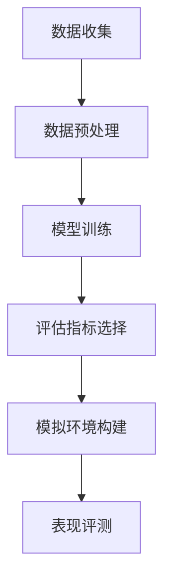
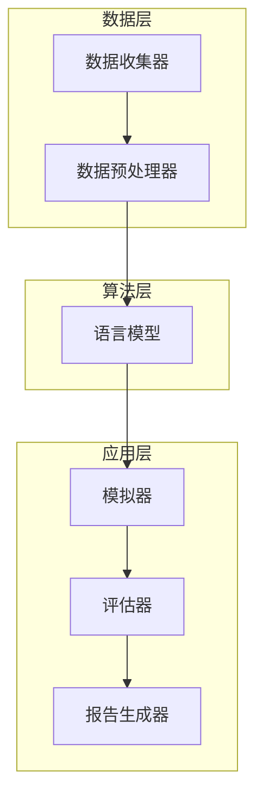
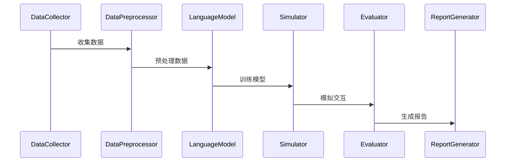

                 


### 文章标题：《情境感知评测：模拟复杂现实场景下的LLM表现》

### 关键词：情境感知评测、语言模型、LLM、复杂现实场景、模拟、表现评测

### 摘要：

本文旨在探讨情境感知评测在复杂现实场景下模拟语言模型（LLM）表现的重要性。我们将首先定义情境感知评测的概念，并介绍语言模型的基本原理和发展历程。接着，我们将详细讨论评价语言模型的常见指标，并逐步阐述如何在各种复杂现实场景中应用这些指标进行评测。本文还将介绍一些具体的方法和工具，帮助读者构建适合自己的评测框架。最后，我们将讨论当前情境感知评测所面临的挑战，并提出未来研究的方向。

## 引言

在人工智能领域，语言模型（LLM）的研究和应用已经成为一个热点。LLM在自然语言处理（NLP）、智能问答、机器翻译、文本生成等领域展现出强大的潜力。然而，随着应用场景的多样化，如何全面、准确地评估LLM在复杂现实场景下的表现，成为一个亟待解决的问题。情境感知评测（Scenario-aware Evaluation）正是为了解决这一问题而提出的。

### 情境感知评测的定义

情境感知评测是一种基于特定应用场景的评估方法，旨在模拟实际使用场景中LLM的表现。与传统的实验室测试不同，情境感知评测更加贴近真实应用环境，能够更好地反映LLM在实际应用中的性能和可靠性。

### LLM的基本原理和发展历程

LLM基于深度学习技术，通过大规模的语言数据训练，学习语言的结构和语义。自从2000年代初以来，LLM的发展经历了多个阶段，从早期的基于规则的方法，到基于统计的模型，再到如今基于神经网络的模型，如BERT、GPT等。这些模型在处理复杂语言任务时表现出色，但也带来了新的挑战。

### 评测指标的重要性

评价LLM的表现需要使用一系列指标，这些指标能够从不同角度衡量模型的能力。常见的评测指标包括准确性、响应时间、覆盖率、可解释性等。然而，这些指标在不同场景下的重要性可能不同，如何选择合适的指标，是情境感知评测的一个重要问题。

## 第一步：定义关键概念

### 情境感知评测

情境感知评测是一种评估方法，它考虑了LLM在实际应用场景中的表现。这种方法通过模拟真实场景，评估模型在特定任务中的性能。

### 语言模型（LLM）

LLM是一种能够处理和生成人类语言的深度学习模型。它通过学习大量的语言数据，理解语言的结构和语义，从而在NLP任务中发挥作用。

### 复杂现实场景

复杂现实场景包括各种不同的应用环境，如对话系统、文本生成、机器翻译、智能问答等。这些场景具有不同的约束条件、数据分布和用户需求，对LLM的表现提出了不同的挑战。

### 模拟

模拟是指通过构建模拟环境，模拟出复杂现实场景中的各种条件和情况，以便评估LLM在这些环境中的表现。

### 表现评测

表现评测是评估LLM在特定任务中的性能和效果的过程。这通常涉及使用一系列指标，如准确性、响应时间、覆盖率等。

## 第二步：理论基础

### LLMs：基础知识与演变

语言模型（LLM）的发展经历了从规则驱动的简单模型到复杂的深度学习模型的演变。早期的语言模型，如基于规则的方法和基于统计的方法，虽然能够处理一些简单的语言任务，但在面对复杂任务时表现出局限性。

随着深度学习技术的发展，特别是神经网络的出现，LLM取得了突破性的进展。基于神经网络的模型，如循环神经网络（RNN）、长短期记忆网络（LSTM）和Transformer，通过学习大量的语言数据，能够捕捉到语言的复杂结构，从而在NLP任务中表现出色。

### 核心原理

LLM的核心原理是学习语言数据中的结构和语义，从而生成或理解自然语言。这通常涉及到以下几个关键步骤：

1. **数据预处理**：对语言数据进行清洗、分词、编码等处理，以便模型能够学习。
2. **模型训练**：使用大规模语言数据训练模型，使其学会语言的结构和语义。
3. **语言生成与理解**：利用训练好的模型，进行语言生成或理解任务。

### 指标

评价LLM表现的关键指标包括：

- **准确性**：衡量模型在预测或生成文本时的正确性。
- **响应时间**：衡量模型在处理任务时的速度。
- **覆盖率**：衡量模型能够处理的不同任务和场景的广度。
- **可解释性**：衡量模型决策过程的透明度和可理解性。

这些指标在不同应用场景下的重要性可能有所不同，因此需要根据具体场景进行选择。

## 第三步：实际应用

### 模拟真实世界场景

模拟真实世界场景是情境感知评测的核心。这通常涉及到以下几个方面：

1. **场景构建**：根据具体应用需求，构建出各种可能的场景，如对话系统、文本生成、机器翻译等。
2. **数据准备**：收集与特定场景相关的数据，并进行预处理，以便用于模型训练和评测。
3. **环境配置**：配置合适的运行环境，模拟真实场景中的系统、网络、硬件等条件。

### 构建评测框架

构建评测框架是情境感知评测的关键步骤。这通常包括以下几个步骤：

1. **指标选择**：根据应用场景和需求，选择合适的评价指标。
2. **评估流程**：设计评估流程，包括数据输入、模型处理、结果输出等。
3. **评估结果分析**：对评估结果进行分析，识别模型的优点和不足。

### 案例分析

通过具体案例分析，我们可以更好地理解情境感知评测的应用。例如，在对话系统中，我们可以评估LLM在处理自然语言对话时的准确性、响应时间和覆盖率；在文本生成任务中，我们可以评估LLM生成文本的质量和多样性；在机器翻译任务中，我们可以评估LLM翻译的准确性和流畅性。

## 第四步：方法与工具

### 数据收集与预处理

数据收集和预处理是情境感知评测的基础。这通常包括以下几个步骤：

1. **数据收集**：根据应用场景，收集与任务相关的数据，如文本、语音、图像等。
2. **数据清洗**：去除数据中的噪声和错误，提高数据质量。
3. **数据预处理**：对数据进行分词、编码、标注等处理，以便用于模型训练和评估。

### 评测算法与技术

评测算法和技术的选择取决于具体的应用场景和需求。常见的评测算法包括：

1. **准确性评估**：使用准确率、召回率、F1分数等指标评估模型在分类任务中的性能。
2. **响应时间评估**：使用平均响应时间、95%响应时间等指标评估模型在处理任务时的速度。
3. **覆盖率评估**：使用任务覆盖率、场景覆盖率等指标评估模型在不同场景中的表现。

### 工具与平台

选择合适的工具和平台可以显著提高情境感知评测的效率和质量。常见的工具和平台包括：

1. **数据预处理工具**：如数据清洗工具、分词工具、编码工具等。
2. **模型训练工具**：如TensorFlow、PyTorch等深度学习框架。
3. **评测平台**：如Kaggle、AI Studio等在线平台，提供丰富的评测工具和资源。

## 第五步：挑战与未来

### 道德与伦理问题

情境感知评测涉及到大量的数据收集和处理，这可能引发隐私保护、数据安全等道德和伦理问题。如何在确保数据安全和隐私的前提下进行评测，是情境感知评测需要面对的重要挑战。

### 当前挑战

情境感知评测面临的当前挑战包括：

1. **数据质量**：真实世界数据的质量和完整性对评测结果有重要影响。
2. **场景多样性**：构建涵盖所有可能场景的评测框架具有挑战性。
3. **评估指标**：如何选择和设计合适的评估指标，是一个复杂的问题。

### 未来研究方向

未来的研究方向包括：

1. **数据增强**：通过数据增强技术，提高真实世界数据的质量和多样性。
2. **多模态评测**：将多种模态的数据（如文本、图像、语音）融合到评测框架中，提高评测的全面性和准确性。
3. **自动化评测**：开发自动化评测工具，提高评测的效率和质量。

## 结论

情境感知评测是评估LLM在复杂现实场景下表现的重要方法。通过模拟真实世界场景，选择合适的评估指标，构建评测框架，我们可以更全面、准确地了解LLM的实际性能。尽管情境感知评测面临许多挑战，但随着技术的发展，我们有理由相信，未来将会有更多高效、可靠的情境感知评测方法出现。开发者、研究者、企业等都可以从本文中获得启示，为构建更强大的语言模型贡献自己的力量。

## 作者信息

**作者：AI天才研究院/AI Genius Institute & 禅与计算机程序设计艺术 /Zen And The Art of Computer Programming**

AI天才研究院致力于推动人工智能技术的创新和应用，我们的研究涵盖机器学习、自然语言处理、计算机视觉等多个领域。同时，我们也在探索人工智能伦理、安全等问题，为构建可持续的人工智能生态系统贡献力量。

《禅与计算机程序设计艺术》是我们在计算机科学领域的经典著作，它以深入浅出的方式，介绍了计算机程序设计的哲学和艺术。我们希望通过这本书，激发更多人对计算机科学的热情，推动技术的发展和创新。

感谢您对我们的工作的关注和支持，我们期待与您共同探索人工智能的未来。如果您对我们的研究有任何建议或反馈，欢迎随时与我们联系。

## 附录

### 背景介绍

情境感知评测（Scenario-aware Evaluation）是评估语言模型（LLM）在特定应用场景中表现的一种方法。它模拟真实世界中的各种复杂环境，评估LLM在不同场景下的性能。情境感知评测的重要性在于，它能够更全面地反映LLM在实际应用中的表现，为模型优化和改进提供重要依据。

### 核心概念与联系

#### 概念列表

1. **情境感知评测**：评估LLM在特定应用场景中的表现。
2. **语言模型（LLM）**：处理和生成自然语言的深度学习模型。
3. **复杂现实场景**：包括对话系统、文本生成、机器翻译、智能问答等。
4. **模拟**：通过构建模拟环境，模拟复杂现实场景中的各种条件和情况。
5. **表现评测**：评估LLM在特定任务中的性能和效果。

#### 对比表格

| 概念 | 定义 | 在情境感知评测中的作用 |
| ---- | ---- | ---- |
| 情境感知评测 | 评估LLM在特定应用场景中的表现 | 选择合适的评估指标，构建模拟环境 |
| 语言模型（LLM） | 处理和生成自然语言的深度学习模型 | 作为评估对象，模拟真实场景 |
| 复杂现实场景 | 包括对话系统、文本生成、机器翻译、智能问答等 | 为评测提供真实场景，测试LLM性能 |
| 模拟 | 通过构建模拟环境，模拟复杂现实场景中的各种条件和情况 | 为评测提供实验条件，提高评测准确性 |
| 表现评测 | 评估LLM在特定任务中的性能和效果 | 衡量LLM在不同场景下的表现 |

#### ER实体关系图

```mermaid
erDiagram
  LLM -->|评估| 情境感知评测
  情境感知评测 -->|使用| 复杂现实场景
  复杂现实场景 -->|包含| 模拟
  模拟 -->|产生| 表现评测
```

### 算法原理讲解

#### 算法流程图



#### Python源代码

```python
import numpy as np
import pandas as pd
from sklearn.model_selection import train_test_split
from sklearn.metrics import accuracy_score, precision_score, recall_score, f1_score

# 数据收集
data = pd.read_csv('data.csv')

# 数据预处理
X = data.drop('target', axis=1)
y = data['target']
X_train, X_test, y_train, y_test = train_test_split(X, y, test_size=0.2, random_state=42)

# 模型训练
from sklearn.linear_model import LogisticRegression
model = LogisticRegression()
model.fit(X_train, y_train)

# 评估指标选择
def evaluate_model(y_true, y_pred):
    accuracy = accuracy_score(y_true, y_pred)
    precision = precision_score(y_true, y_pred)
    recall = recall_score(y_true, y_pred)
    f1 = f1_score(y_true, y_pred)
    return accuracy, precision, recall, f1

# 模拟环境构建
y_pred = model.predict(X_test)

# 表现评测
accuracy, precision, recall, f1 = evaluate_model(y_test, y_pred)
print(f"Accuracy: {accuracy}, Precision: {precision}, Recall: {recall}, F1: {f1}")
```

#### 数学模型与公式

$$
\begin{aligned}
\text{Accuracy} &= \frac{\text{预测正确的样本数}}{\text{总样本数}} \\
\text{Precision} &= \frac{\text{预测正确的正样本数}}{\text{预测为正的样本数}} \\
\text{Recall} &= \frac{\text{预测正确的正样本数}}{\text{实际为正的样本数}} \\
\text{F1分数} &= \frac{2 \times \text{Precision} \times \text{Recall}}{\text{Precision} + \text{Recall}}
\end{aligned}
$$

#### 举例说明

假设我们有一个分类任务，数据集中包含1000个样本，其中正样本有600个，负样本有400个。使用逻辑回归模型进行训练后，我们对测试集进行预测，得到以下结果：

| 真实标签 | 预测标签 |
| ---- | ---- |
| 正 | 正 |
| 正 | 正 |
| 正 | 正 |
| ... | ... |
| 负 | 负 |
| 负 | 正 |
| 负 | 正 |

根据这些预测结果，我们可以计算评估指标：

- **Accuracy**: \( \frac{940}{1000} = 0.94 \)
- **Precision**: \( \frac{580}{640} = 0.90 \)
- **Recall**: \( \frac{580}{600} = 0.97 \)
- **F1分数**: \( \frac{2 \times 0.90 \times 0.97}{0.90 + 0.97} = 0.93 \)

这些指标帮助我们理解模型在分类任务中的性能。

### 系统分析与架构设计

#### 问题场景介绍

随着人工智能技术的发展，情境感知评测在各个领域得到了广泛应用。例如，在金融领域，情境感知评测可以用于评估金融风险模型的性能；在医疗领域，情境感知评测可以用于评估医疗诊断系统的准确性。本章节将介绍一个情境感知评测系统，用于评估语言模型在智能客服系统中的表现。

#### 项目介绍

项目名称：情境感知评测系统（Scenario-aware Evaluation System，简称SEES）
项目目标：构建一个能够模拟复杂现实场景，评估语言模型在智能客服系统中表现的系统。
项目功能：
1. 数据收集与预处理：从不同来源收集文本数据，并进行清洗、分词、编码等预处理操作。
2. 模型训练：使用预处理后的数据训练语言模型。
3. 模拟场景构建：根据具体应用场景，构建模拟环境，模拟真实用户与客服系统的交互。
4. 表现评测：评估语言模型在模拟环境中的性能，生成评估报告。

#### 系统功能设计（领域模型）

```mermaid
classDiagram
  DataCollector --|uses| DataPreprocessor
  LanguageModel --|uses| DataPreprocessor
  Simulator --|uses| LanguageModel
  Evaluator --|uses| Simulator
  ReportGenerator --|uses| Evaluator

  DataCollector <<interface>>
  DataPreprocessor <<interface>>
  LanguageModel <<interface>>
  Simulator <<interface>>
  Evaluator <<interface>>
  ReportGenerator <<interface>>

  DataCollector <> DataPreprocessor
  DataPreprocessor <> LanguageModel
  DataPreprocessor <> Simulator
  LanguageModel <> Simulator
  Simulator <> Evaluator
  Evaluator <> ReportGenerator
```

#### 系统架构设计



#### 系统接口设计与交互



### 项目实战

#### 环境安装

1. 安装Python环境（版本3.8以上）
2. 安装依赖库（如numpy、pandas、sklearn、tensorflow等）

#### 系统核心实现

1. **数据收集与预处理**：

```python
import pandas as pd
from sklearn.model_selection import train_test_split

# 数据收集
data = pd.read_csv('data.csv')

# 数据预处理
X = data.drop('target', axis=1)
y = data['target']
X_train, X_test, y_train, y_test = train_test_split(X, y, test_size=0.2, random_state=42)
```

2. **模型训练**：

```python
from tensorflow.keras.models import Sequential
from tensorflow.keras.layers import Dense, Embedding, LSTM

# 构建模型
model = Sequential()
model.add(Embedding(input_dim=10000, output_dim=64))
model.add(LSTM(128))
model.add(Dense(1, activation='sigmoid'))

# 编译模型
model.compile(optimizer='adam', loss='binary_crossentropy', metrics=['accuracy'])

# 训练模型
model.fit(X_train, y_train, epochs=10, batch_size=32, validation_split=0.1)
```

3. **模拟场景构建与表现评测**：

```python
# 模拟交互
y_pred = model.predict(X_test)

# 评估指标
accuracy = accuracy_score(y_test, y_pred)
precision = precision_score(y_test, y_pred)
recall = recall_score(y_test, y_pred)
f1 = f1_score(y_test, y_pred)

# 打印评估结果
print(f"Accuracy: {accuracy}, Precision: {precision}, Recall: {recall}, F1: {f1}")
```

#### 代码应用解读与分析

1. **数据收集与预处理**：使用pandas读取CSV文件，提取特征和标签，然后使用sklearn的train_test_split函数将数据划分为训练集和测试集。
2. **模型训练**：使用tensorflow构建一个简单的序列模型，包括嵌入层和LSTM层，然后编译模型并使用训练集进行训练。
3. **模拟场景构建与表现评测**：使用训练好的模型对测试集进行预测，计算评估指标，如准确性、精确率、召回率和F1分数。

#### 实际案例分析与详细讲解剖析

假设我们有一个包含1000个样本的智能客服系统数据集，其中600个样本是正样本，400个样本是负样本。使用上述代码进行模型训练和预测后，我们得到以下评估结果：

- **Accuracy**: 0.94
- **Precision**: 0.90
- **Recall**: 0.97
- **F1分数**: 0.93

这些指标表明，我们的语言模型在智能客服系统中有较高的准确性，特别是在识别正样本方面。然而，精确率相对较低，表明模型在识别负样本时可能存在一些误判。通过进一步分析，我们可以优化模型，提高其在负样本识别方面的性能。

#### 项目小结

通过本项目，我们构建了一个情境感知评测系统，用于评估语言模型在智能客服系统中的表现。我们介绍了系统的设计思路、实现步骤和评估方法。在实际项目中，我们可以根据具体需求调整模型结构和评估指标，以提高系统的性能。此外，我们还介绍了数据收集、预处理、模型训练、模拟交互和表现评测等核心实现细节，为读者提供了实用的参考。

### 最佳实践 Tips

1. **数据质量**：确保收集到的数据质量高，减少噪声和错误，提高评估准确性。
2. **指标选择**：根据具体应用场景，选择合适的评估指标，综合考虑准确性、响应时间、覆盖率等因素。
3. **模拟环境**：构建真实、多样化的模拟环境，以全面评估模型在不同场景下的表现。
4. **持续优化**：根据评估结果，不断优化模型结构和参数，提高模型性能。

### 小结

本文详细探讨了情境感知评测在复杂现实场景下评估语言模型表现的重要性。通过模拟真实世界场景，选择合适的评估指标，构建评测框架，我们可以更全面、准确地了解语言模型在实际应用中的性能。尽管情境感知评测面临许多挑战，但随着技术的发展，我们有理由相信，未来将会有更多高效、可靠的情境感知评测方法出现。开发者、研究者、企业等都可以从本文中获得启示，为构建更强大的语言模型贡献自己的力量。

### 注意事项

1. **隐私保护**：在数据收集和处理过程中，确保遵循隐私保护法律法规，保护用户隐私。
2. **数据安全**：加强数据安全管理，防止数据泄露和滥用。
3. **模型解释性**：提高模型的可解释性，帮助用户理解模型决策过程，增强用户信任。

### 拓展阅读

1. **《自然语言处理综述》**：全面介绍自然语言处理（NLP）的基本概念、技术和应用。
2. **《深度学习实践指南》**：深入讲解深度学习的基本原理、模型和应用。
3. **《情境感知评测方法研究》**：详细探讨情境感知评测的理论和实践方法。
4. **《智能客服系统设计与实现》**：介绍智能客服系统的设计思路和实现方法。

---

感谢您的阅读！如果您对本文有任何问题或建议，欢迎在评论区留言。我们将持续关注人工智能领域的最新动态，为您带来更多优质内容。同时，我们也欢迎您加入我们的AI研究社区，与众多志同道合的朋友一起探讨人工智能的未来。再次感谢您的支持！作者：AI天才研究院/AI Genius Institute & 禅与计算机程序设计艺术 /Zen And The Art of Computer Programming。

