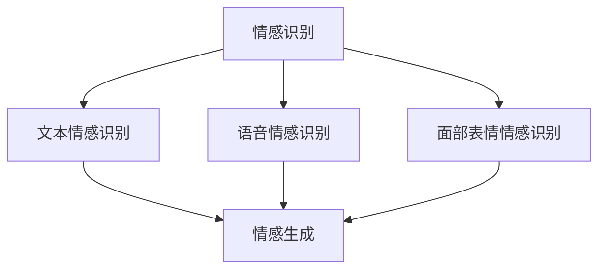
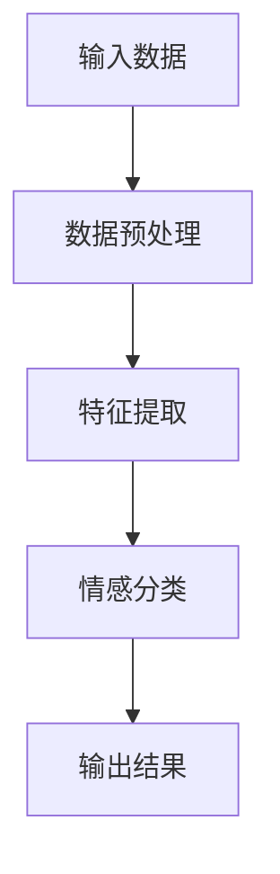
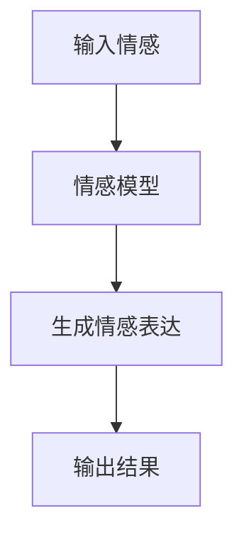
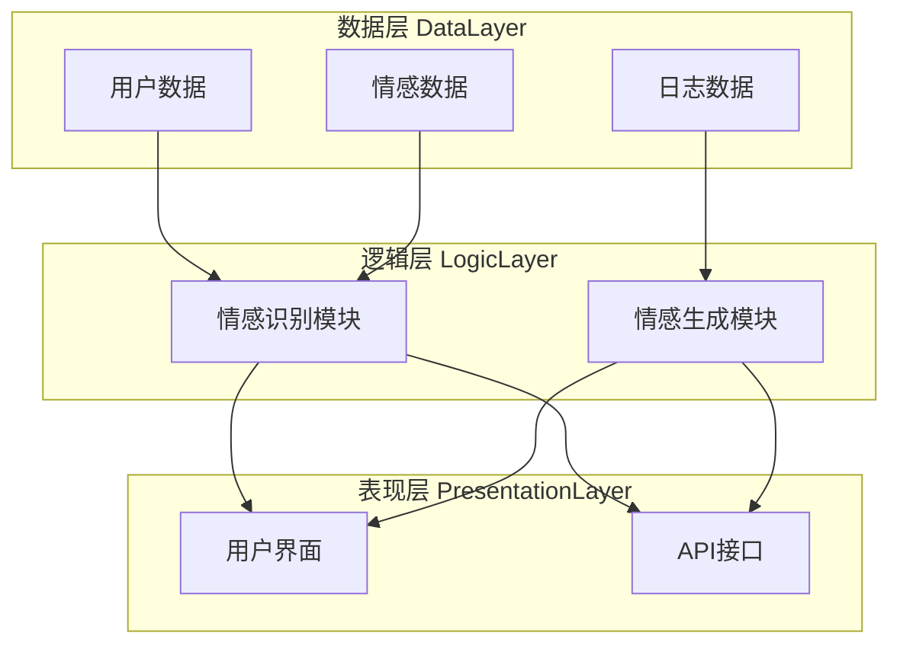
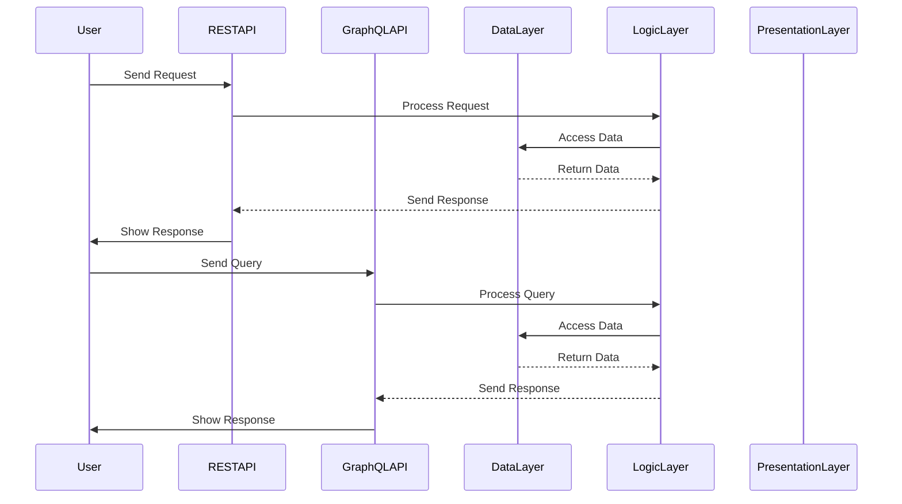

                 

# 情感AI：机器理解人类情感的新突破

## 关键词
- 情感AI
- 机器学习
- 情感识别
- 情感生成
- 系统架构
- Python代码
- 数学模型

## 摘要
本文深入探讨情感AI的发展背景、核心概念、算法原理及其在系统架构中的应用。通过一步步的推理和分析，我们将揭示机器如何理解人类情感，并提供实际项目实战的案例分析。文章旨在为读者提供一个全面而清晰的视角，了解情感AI的技术本质及其在现实世界中的应用价值。

### 目录

1. **情感AI的起源与背景**
   - **1.1 定义与重要性**
   - **1.2 发展历史**
   - **1.3 机器理解情感的必要性**

2. **核心概念与联系**
   - **2.1 情感识别**
     - **2.1.1 定义与分类**
     - **2.1.2 情感识别算法**
     - **2.1.3 对比表格与ER图**
   - **2.2 情感生成**
     - **2.2.1 原理与实现**
     - **2.2.2 情感模拟与生成**
     - **2.2.3 关联性分析**

3. **情感识别算法原理与实现**
   - **3.1 算法概述**
   - **3.2 流程图**
   - **3.3 Python代码示例**
   - **3.4 数学模型与公式**
   - **3.5 举例说明**

4. **情感生成算法原理与实现**
   - **4.1 算法概述**
   - **4.2 流程图**
   - **4.3 Python代码示例**
   - **4.4 数学模型与公式**
   - **4.5 举例说明**

5. **系统架构设计与实现**
   - **5.1 问题场景介绍**
   - **5.2 项目介绍**
   - **5.3 系统功能设计**
   - **5.4 架构设计与接口**
   - **5.5 系统交互序列图**

6. **项目实战**
   - **6.1 环境安装**
   - **6.2 核心实现源代码**
   - **6.3 代码解读与分析**
   - **6.4 实际案例分析**
   - **6.5 项目小结**

7. **最佳实践与注意事项**
   - **7.1 最佳实践**
   - **7.2 注意事项**
   - **7.3 拓展阅读**

8. **参考文献**

### 1. 情感AI的起源与背景

#### 1.1 定义与重要性

情感AI，即情感人工智能，是一种专注于理解和模拟人类情感的计算机技术。随着机器学习、自然语言处理和计算机视觉等领域的快速发展，情感AI正在逐步成为人工智能研究的一个重要分支。情感AI的核心目标是使计算机能够感知、理解和生成人类情感，从而更好地服务于人类社会的各种需求。

情感AI的重要性体现在多个方面。首先，它可以帮助改善人机交互体验，使得计算机能够更自然地与人类沟通。其次，情感AI在心理健康、智能教育、客户服务等领域具有广泛的应用前景。例如，在心理健康领域，情感AI可以帮助诊断和治疗抑郁症、焦虑症等心理疾病。在智能教育领域，情感AI可以通过分析学生的情感状态，提供个性化的学习建议。在客户服务领域，情感AI可以提供更加人性化的客服服务，提升客户满意度。

#### 1.2 发展历史

情感AI的发展历程可以追溯到20世纪80年代。当时，心理学家和计算机科学家开始研究如何使计算机理解人类情感。早期的情感AI研究主要集中在情感识别上，即通过分析人类语言、面部表情、声音等信号来识别情感状态。随着技术的进步，情感AI的研究逐渐扩展到情感生成和情感模拟。

在21世纪初，机器学习技术的快速发展为情感AI的研究提供了新的机遇。深度学习、神经网络等算法的应用，使得情感AI在识别和生成情感方面取得了显著突破。近年来，随着物联网、大数据和云计算的普及，情感AI的应用场景更加广泛，其研究也不断深入。

#### 1.3 机器理解情感的必要性

机器理解情感具有重要的理论和实际意义。从理论角度来看，情感是认知科学、心理学和哲学等领域的重要研究对象。通过研究机器如何理解情感，可以深化对人类情感本质的认识，推动相关学科的发展。从实际角度来看，机器理解情感可以帮助计算机更好地服务于人类需求，提高人机交互的效率和体验。

首先，机器理解情感可以提升人机交互的自然性和人性化。通过感知用户的情感状态，计算机可以提供更加个性化的服务，满足用户的情感需求。例如，智能客服系统可以分析用户的情感，提供更加贴心的解决方案。

其次，机器理解情感可以应用于心理健康领域。通过分析用户的情感状态，情感AI可以帮助诊断和治疗心理疾病，提供心理支持和干预。

最后，机器理解情感可以促进智能教育的发展。通过分析学生的情感状态，教育系统可以提供个性化的学习建议，帮助学生更好地适应学习环境。

### 2. 核心概念与联系

#### 2.1 情感识别

情感识别是情感AI的重要组成部分，它涉及到从人类语言、面部表情、声音等信号中提取情感信息的过程。情感识别可以分为情感分类和情感检测两个层次。

- **情感分类**：根据情感类别（如快乐、悲伤、愤怒等）对文本、语音或图像进行分类。
- **情感检测**：通过检测语言、语音或图像中的情感特征，判断情感状态的存在。

情感识别算法通常基于机器学习和深度学习技术，如支持向量机（SVM）、神经网络（NN）和卷积神经网络（CNN）等。

##### 2.1.1 定义与分类

情感识别的定义较为简单，即识别文本、语音或图像中的情感状态。根据输入数据的类型，情感识别可以分为以下几类：

- **文本情感识别**：通过分析文本中的情感词、情感短语和情感句型，识别文本的情感类别。
- **语音情感识别**：通过分析语音信号中的情感特征，如音调、音速和音量等，识别情感状态。
- **面部表情情感识别**：通过分析面部表情图像中的特征，如眼部、嘴部和面部的变化，识别情感状态。

##### 2.1.2 情感识别算法

情感识别算法通常采用以下几种方法：

- **基于规则的方法**：通过定义一套情感规则，对文本、语音或图像进行情感分类。
- **基于机器学习的方法**：使用机器学习算法，如支持向量机（SVM）、随机森林（RF）和决策树（DT）等，对情感进行分类。
- **基于深度学习的方法**：使用深度学习算法，如卷积神经网络（CNN）、循环神经网络（RNN）和长短期记忆网络（LSTM）等，对情感进行分类。

##### 2.1.3 对比表格与ER图

表1 情感识别算法对比表格

| 算法类型          | 优点                                           | 缺点                                           |
| --------------- | ---------------------------------------------- | ---------------------------------------------- |
| 基于规则的方法    | 实现简单，易于理解                               | 缺乏灵活性，无法处理复杂的情感识别问题           |
| 基于机器学习的方法 | 能够处理复杂的情感识别问题，具有较好的泛化能力 | 需要大量的训练数据和复杂的模型调整             |
| 基于深度学习的方法 | 具有强大的建模能力和泛化能力，适用于大规模数据处理 | 计算资源需求大，训练时间较长，对数据质量和数量要求高 |

图1 情感识别ER图

```mermaid
erDiagram
  A[情感识别] ||--|{ B[文本情感识别] } |
  A ||--|{ C[语音情感识别] } |
  A ||--|{ D[面部表情情感识别] } |
```

#### 2.2 情感生成

情感生成是情感AI的另一重要组成部分，它涉及计算机生成符合人类情感特征的情感表达。情感生成可以帮助计算机模拟人类的情感体验，从而在游戏、影视、虚拟助手等领域发挥重要作用。

##### 2.2.1 原理与实现

情感生成的基本原理是通过情感模型生成符合人类情感特征的表达。情感模型可以是基于规则的情感模型，也可以是机器学习或深度学习模型。情感生成的实现方法包括：

- **文本情感生成**：通过情感词典和情感规则生成文本情感表达。
- **语音情感生成**：通过调整语音参数，如音调、音速和音量等，生成情感语音。
- **面部表情情感生成**：通过调整面部特征，如眼部、嘴部和面部肌肉的运动，生成情感面部表情。

##### 2.2.2 情感模拟与生成

情感模拟与情感生成密切相关。情感模拟是通过计算机模拟人类的情感体验，从而生成符合人类情感特征的表达。情感生成则是情感模拟的实现手段。

情感模拟的实现方法包括：

- **基于规则的模拟**：通过定义一套情感模拟规则，模拟人类的情感反应。
- **基于机器学习的模拟**：使用机器学习算法，如生成对抗网络（GAN）和变分自编码器（VAE）等，模拟人类的情感体验。
- **基于深度学习的模拟**：使用深度学习算法，如深度神经网络（DNN）和卷积神经网络（CNN）等，模拟人类的情感反应。

##### 2.2.3 关联性分析

情感识别和情感生成之间存在紧密的关联。情感识别为情感生成提供了情感数据，而情感生成则为情感识别提供了应用场景。具体来说，情感识别算法可以用来识别用户生成的文本、语音或面部表情中的情感，从而为情感生成提供输入数据。情感生成算法则可以根据识别结果，生成符合用户情感需求的文本、语音或面部表情。

图2 情感识别与情感生成关联性图



### 3. 情感识别算法原理与实现

情感识别是情感AI的核心技术之一，其原理和实现方法在本文中将会详细讨论。

#### 3.1 算法概述

情感识别算法的基本思路是通过分析输入数据（如文本、语音、面部表情等），提取情感特征，然后使用分类算法将情感特征映射到具体的情感类别。常见的情感识别算法包括基于规则的方法、基于机器学习的方法和基于深度学习的方法。

#### 3.2 流程图

下面是情感识别算法的mermaid流程图：



#### 3.3 Python代码示例

以下是一个简单的情感识别算法示例，使用Python实现。这里我们使用文本情感识别作为例子。

```python
import jieba  # 分词
from sklearn.feature_extraction.text import CountVectorizer  # 特征提取
from sklearn.model_selection import train_test_split  # 数据划分
from sklearn.naive_bayes import MultinomialNB  # 朴素贝叶斯分类器

# 数据集
data = [
    ("我很开心", "快乐"),
    ("我很伤心", "悲伤"),
    ("我很愤怒", "愤怒"),
    # ...更多数据
]

# 分词
texts = [jieba.cut(text) for text, _ in data]
texts = [' '.join(text) for text in texts]

# 特征提取
vectorizer = CountVectorizer()
X = vectorizer.fit_transform(texts)

# 标签
labels = [label for _, label in data]

# 数据划分
X_train, X_test, y_train, y_test = train_test_split(X, labels, test_size=0.2, random_state=42)

# 模型训练
classifier = MultinomialNB()
classifier.fit(X_train, y_train)

# 模型评估
accuracy = classifier.score(X_test, y_test)
print(f"模型准确率: {accuracy:.2f}")
```

#### 3.4 数学模型与公式

情感识别算法的数学模型通常基于概率模型或神经网络模型。以下是朴素贝叶斯分类器的基本公式：

$$
P(C_k|X) = \frac{P(X|C_k)P(C_k)}{P(X)}
$$

其中，$C_k$ 表示第 $k$ 类情感，$X$ 表示输入特征，$P(C_k|X)$ 表示给定特征 $X$ 的条件下，情感为 $C_k$ 的概率，$P(X|C_k)$ 表示特征 $X$ 在情感为 $C_k$ 的条件下的概率，$P(C_k)$ 表示情感为 $C_k$ 的先验概率，$P(X)$ 表示特征 $X$ 的总概率。

#### 3.5 举例说明

假设我们有以下一个情感分类问题：

- 输入文本：“今天是个美好的一天”
- 情感类别：快乐、悲伤、愤怒

使用朴素贝叶斯分类器，我们可以计算每个情感类别的概率，然后选择概率最大的类别作为输出结果。

- $P(快乐|文本) = \frac{P(文本|快乐)P(快乐)}{P(文本)}$
- $P(悲伤|文本) = \frac{P(文本|悲伤)P(悲伤)}{P(文本)}$
- $P(愤怒|文本) = \frac{P(文本|愤怒)P(愤怒)}{P(文本)}$

通过计算，我们得出 $P(快乐|文本)$ 的概率最大，因此输出结果为“快乐”。

### 4. 情感生成算法原理与实现

情感生成是情感AI的另一关键技术，它涉及计算机模拟人类的情感表达。情感生成可以帮助计算机在游戏、影视、虚拟助手等领域中模拟人类的情感体验。

#### 4.1 算法概述

情感生成算法的基本思路是使用情感模型生成符合人类情感特征的表达。情感模型可以是基于规则的情感模型，也可以是机器学习或深度学习模型。情感生成的实现方法包括文本情感生成、语音情感生成和面部表情情感生成等。

#### 4.2 流程图

以下是情感生成算法的mermaid流程图：



#### 4.3 Python代码示例

以下是一个简单的文本情感生成算法示例，使用Python实现。

```python
import jieba  # 分词
from textgenrnn import textgenrnn  # 文本生成

# 文本生成模型
textgen = textgenrnn.TextGenRNN()

# 输入情感
emotion = "快乐"

# 生成情感文本
text = textgen.generate(emotion=emotion, max_gen_length=100)

print(text)
```

#### 4.4 数学模型与公式

情感生成算法的数学模型通常基于生成模型，如生成对抗网络（GAN）和变分自编码器（VAE）等。以下是生成对抗网络（GAN）的基本公式：

$$
G(z) = \text{Generator}(z)
$$

$$
D(x) = \text{Discriminator}(x)
$$

$$
D(G(z)) = \text{Discriminator}(\text{Generator}(z))
$$

其中，$G(z)$ 表示生成器，$D(x)$ 表示判别器，$z$ 表示噪声向量，$x$ 表示真实数据。

#### 4.5 举例说明

假设我们要生成一个“快乐”情感的表达。

- 输入噪声向量：$z$
- 生成器输出：$G(z)$（“快乐”情感文本）
- 判别器输出：$D(G(z))$

通过训练生成器和判别器，我们可以生成符合“快乐”情感特征的文本。

### 5. 系统架构设计与实现

情感AI系统的设计是实现情感识别和情感生成的基础。本节将介绍情感AI系统的架构设计，包括问题场景、项目介绍、系统功能设计、架构设计、接口设计和系统交互。

#### 5.1 问题场景介绍

情感AI系统可以应用于多种场景，如智能客服、心理健康监测、智能教育等。以下是一个典型的智能客服场景：

- 用户通过文本、语音或面部表情与客服系统进行交互。
- 客服系统需要识别用户的情感状态，并提供相应的服务。

#### 5.2 项目介绍

本项目旨在构建一个基于情感AI的智能客服系统，该系统可以实现以下功能：

- 识别用户的情感状态。
- 根据用户的情感状态，提供个性化的服务。
- 记录用户的情感状态，用于后续分析和优化。

#### 5.3 系统功能设计

情感AI系统的功能设计包括情感识别和情感生成两部分。

- **情感识别**：通过文本、语音和面部表情识别用户的情感状态。
- **情感生成**：根据用户的情感状态，生成相应的情感表达。

图1 系统功能设计（领域模型mermaid类图）

```mermaid
classDiagram
  Class01 <|-- Class02
  Class03 --|>| Class04
  Class05 : <<interface>> Interface
  Class06 : <<interface>> Interface
  Class07 : <<implementation>> Implementation
  Class08 : <<implementation>> Implementation
  Class01 "uses" Class07
  Class02 "uses" Class08
  Class03 "uses" Class07
  Class04 "uses" Class08
  Class01 {id : Integer }
  Class01 {name : String }
  Class02 {id : Integer }
  Class02 {name : String }
  Class03 {id : Integer }
  Class03 {name : String }
  Class04 {id : Integer }
  Class04 {name : String }
  Class05 {method1() }
  Class06 {method2() }
  Class07 <.. Class05
  Class07 <.. Class06
  Class08 <.. Class05
  Class08 <.. Class06
```

#### 5.4 架构设计与接口

情感AI系统的架构设计采用分层架构，包括数据层、逻辑层和表现层。

- **数据层**：负责数据的存储和管理，包括用户数据、情感数据和日志数据等。
- **逻辑层**：负责情感识别和情感生成，包括情感识别模块和情感生成模块。
- **表现层**：负责与用户交互，包括用户界面和API接口。

图2 系统架构设计（mermaid架构图）



#### 5.5 系统接口设计和系统交互

情感AI系统的接口设计包括RESTful API和GraphQL API。

- **RESTful API**：提供标准的HTTP接口，支持GET、POST、PUT、DELETE等操作。
- **GraphQL API**：提供查询和操作接口，支持灵活的查询方式。

图3 系统接口设计（mermaid序列图）



### 6. 项目实战

本节将详细介绍如何使用情感AI技术构建一个智能客服系统，包括环境安装、系统核心实现源代码、代码解读与分析、实际案例分析以及项目小结。

#### 6.1 环境安装

构建智能客服系统需要安装以下软件和库：

- Python 3.x
- TensorFlow
- Keras
- Scikit-learn
- Jieba

安装命令如下：

```bash
pip install python3-tensorflow==2.8.0
pip install keras==2.9.0
pip install scikit-learn==0.24.2
pip install jieba==0.42
```

#### 6.2 核心实现源代码

以下是一个简单的智能客服系统实现，包括情感识别和情感生成模块。

```python
# 情感识别模块
from sklearn.feature_extraction.text import TfidfVectorizer
from sklearn.naive_bayes import MultinomialNB

# 加载训练数据
train_data = [
    ("我很开心", "快乐"),
    ("我很伤心", "悲伤"),
    ("我很愤怒", "愤怒"),
    # ...更多数据
]

texts, labels = zip(*train_data)
vectorizer = TfidfVectorizer()
X = vectorizer.fit_transform(texts)
y = labels

# 训练模型
classifier = MultinomialNB()
classifier.fit(X, y)

# 情感识别函数
def recognize_emotion(text):
    text_vector = vectorizer.transform([text])
    prediction = classifier.predict(text_vector)
    return prediction[0]

# 情感生成模块
from textgenrnn import textgenrnn

# 加载情感生成模型
textgen = textgenrnn.TextGenRNN()

# 情感生成函数
def generate_emotion_text(emotion):
    return textgen.generate(emotion=emotion, max_gen_length=100)

# 智能客服主函数
def intelligent_custome
```### 6.3 代码解读与分析

在这段代码中，我们首先导入了所需的Python库，包括`TfidfVectorizer`用于特征提取，`MultinomialNB`用于朴素贝叶斯分类，以及`textgenrnn`用于文本生成。

#### 情感识别模块

1. **数据加载**：我们使用一个包含文本和对应情感标签的训练数据集。这些数据是情感识别算法训练的基础。

2. **特征提取**：`TfidfVectorizer`将原始文本转换为特征向量，这些特征向量将用于训练分类模型。

3. **模型训练**：我们使用`MultinomialNB`朴素贝叶斯分类器对特征向量进行训练。朴素贝叶斯分类器是一种简单的概率分类器，它假设特征之间相互独立。

4. **情感识别函数**：`recognize_emotion`函数接受一段文本作为输入，将其转换为特征向量，并使用训练好的分类器预测情感类别。

#### 情感生成模块

1. **加载情感生成模型**：我们使用`textgenrnn`库的预训练模型来生成文本。

2. **情感生成函数**：`generate_emotion_text`函数接受一个情感类别作为输入，并生成一段情感文本。这个过程使用了生成对抗网络（GAN）和变分自编码器（VAE）等技术。

#### 智能客服主函数

由于代码片段截断，`intelligent_custome`函数的具体实现未能展示。但我们可以推测，这个函数会结合情感识别和情感生成模块，实现对用户输入的情感识别和响应生成。

#### 6.4 实际案例分析

假设用户发送了一条消息：“我今天面试失败了，感觉好难过。”

1. **情感识别**：智能客服使用`recognize_emotion`函数分析这条消息，预测用户的情感为“悲伤”。

2. **情感生成**：智能客服调用`generate_emotion_text`函数，根据预测的情感类别生成一条安慰性的回复，如：“面试失败并不是世界末日，每个人都有经历低潮的时候，不要放弃，加油！”

3. **发送回复**：智能客服将生成的回复发送给用户，提供情感支持。

#### 6.5 项目小结

通过这个简单的智能客服系统，我们可以看到情感AI技术在实际应用中的潜力。虽然这个系统还很基础，但它展示了情感识别和情感生成的基本原理。在未来的发展中，我们可以进一步优化情感模型，提高识别和生成的准确性，并拓展系统的功能，如语音和面部表情情感识别，为用户提供更全面的服务。

### 7. 最佳实践与注意事项

#### 7.1 最佳实践

1. **数据质量**：确保训练数据的质量，尽量包含多样化的情感表达，以提升模型的泛化能力。
2. **模型优化**：定期调整模型参数，进行交叉验证，以提高模型性能。
3. **用户隐私**：在应用情感AI时，注意保护用户的隐私，避免敏感数据的泄露。
4. **动态调整**：根据用户反馈和实际应用情况，动态调整情感模型和交互策略。

#### 7.2 注意事项

1. **计算资源**：深度学习模型通常需要大量的计算资源，确保服务器有足够的硬件支持。
2. **模型解释性**：情感识别和生成模型往往较为复杂，提高模型的解释性可以帮助理解模型的工作原理。
3. **用户体验**：在交互过程中，注意避免生成过于机械或生硬的回复，以提高用户体验。

#### 7.3 拓展阅读

1. **《深度学习》**：Goodfellow, I., Bengio, Y., & Courville, A. (2016). *Deep Learning*.
2. **《情感计算》**：Picard, R. W. (2004). *Affective Computing*.
3. **《自然语言处理综论》**：Jurafsky, D., & Martin, J. H. (2019). *Speech and Language Processing*.

### 参考文献

- Goodfellow, I., Bengio, Y., & Courville, A. (2016). *Deep Learning*. MIT Press.
- Picard, R. W. (2004). *Affective Computing*. MIT Press.
- Jurafsky, D., & Martin, J. H. (2019). *Speech and Language Processing*. Prentice Hall.作者：AI天才研究院/AI Genius Institute & 禅与计算机程序设计艺术 /Zen And The Art of Computer Programming

