                 

### 情感分析：增强LLM应用的用户洞察

> 关键词：情感分析、自然语言处理、语言模型、用户洞察、应用开发

> 摘要：随着自然语言处理技术的发展，情感分析作为理解用户情感和意见的关键工具，逐渐受到广泛关注。本文将详细介绍情感分析的基本概念、发展历程、核心算法原理，并结合实际应用场景，探讨如何通过情感分析增强语言模型（LLM）在用户洞察中的应用，为开发者提供实用的指导和建议。

#### 第一部分：引言

随着互联网的普及和信息爆炸，人们产生了大量的文本数据。如何从这些文本数据中提取有价值的信息，尤其是用户的情感和态度，成为了一个重要且具有挑战性的问题。情感分析（Sentiment Analysis），也被称为意见挖掘或情感分类，是自然语言处理（NLP）领域的一个分支，旨在通过计算机技术，对文本中的情感倾向进行自动检测和分类。随着深度学习技术的进步，情感分析在商业、舆情监测、用户体验提升等多个领域得到了广泛应用。

本文将分为三个主要部分进行探讨：

1. **情感分析概述**：介绍情感分析的基本概念、发展历程、核心概念以及情感分析的边界与外延。
2. **情感分析算法原理**：详细讲解情感分析的文本预处理方法、情感分类算法、情感强度识别以及多情感识别技术。
3. **情感分析应用实战**：通过社交媒体情感分析和产品评价情感分析的案例，展示情感分析在实际场景中的具体应用。

通过本文的阅读，读者将全面了解情感分析的核心概念和关键技术，掌握情感分析在实际项目中的应用方法，并能够基于LLM进行用户情感洞察的深入探索。

#### 目录大纲设计

1. **引言**
   - 情感分析的重要性
   - 本文结构

2. **第一部分：情感分析概述**
   - 第1章：情感分析概述
     1.1 问题背景与意义
     1.2 情感分析的发展历程
     1.3 情感分析的核心概念
     1.4 情感分析的边界与外延
     1.5 情感分析的核心要素组成

3. **第二部分：情感分析算法原理**
   - 第2章：文本预处理方法
   - 第3章：情感分析算法基础
   - 第4章：情感分析模型优化

4. **第三部分：情感分析应用实战**
   - 第5章：社交媒体情感分析
   - 第6章：产品评价情感分析
   - 第7章：情感分析在实际场景中的挑战与对策
   - 第8章：情感分析的发展趋势与未来展望

5. **附录：情感分析常用工具与资源**

**结束语**：本文围绕情感分析的主题，通过详细的理论讲解和实际案例，旨在帮助读者全面理解情感分析的核心概念和应用方法，为开发者在自然语言处理和用户洞察方面的实践提供指导。

---

### 第一部分：情感分析概述

#### 第1章：情感分析概述

情感分析（Sentiment Analysis），又称意见挖掘或情感分类，是自然语言处理（NLP）领域的一个关键任务，旨在通过计算机技术自动识别文本中的情感倾向。本章节将介绍情感分析的基本概念、发展历程、核心概念、边界与外延以及核心要素组成。

#### 1.1 问题背景与意义

情感分析起源于对人类情感和意见的理解需求。在商业领域，企业需要了解消费者的情感倾向，以便更好地进行市场分析和产品改进。在舆情监测领域，政府和媒体机构需要实时了解公众对某一事件或政策的看法。在社交媒体领域，用户生成的文本数据中蕴含着大量的情感信息，通过情感分析可以帮助平台提供更个性化的服务。

**核心概念术语说明**：

- **情感极性**：指文本中的情感倾向，通常分为正面、中性、负面三种。
- **情感强度**：指情感极性的强度，用于量化情感的程度。
- **情感复杂性**：指文本中可能存在的多种情感及其相互关系。

**问题背景**：

随着互联网和社交媒体的快速发展，大量的用户评论、新闻报道、社交媒体帖子等文本数据不断生成。如何从这些数据中提取有价值的信息，尤其是用户的情感和态度，成为了一个迫切需要解决的问题。

**问题描述**：

情感分析旨在通过自动化的方法，识别文本中的情感倾向。例如，判断一个评论是正面、中性还是负面，或者量化评论的积极程度。

**问题解决**：

通过文本预处理、特征提取、情感分类模型训练等步骤，实现对文本情感的自动识别。

**边界与外延**：

情感分析不仅限于文本数据，还可以扩展到语音、视频等多媒体数据。此外，情感分析与其他NLP任务，如主题检测、实体识别等，有着紧密的联系。

**情感分析的核心要素组成**：

- **数据集**：用于训练和评估情感分类模型的文本数据。
- **预处理**：包括文本清洗、分词、词性标注等步骤，用于处理原始文本数据。
- **特征提取**：从预处理后的文本中提取有助于情感分类的特征。
- **模型选择**：选择合适的情感分类算法和模型。
- **模型训练与评估**：使用数据集训练模型，并通过评估指标进行性能评估。

**核心概念与联系**：

**情感极性**：
- **定义**：情感极性是指文本表达的情感倾向，通常分为正面、中性、负面三种。
- **属性特征对比表格**：
  | 极性  | 定义         | 示例文本                   |
  | ----- | ------------ | -------------------------- |
  | 正面  | 表示积极、满意 | “这个产品非常棒！”          |
  | 中性  | 表示中立、无倾向 | “这个产品看起来不错。”      |
  | 负面  | 表示消极、不满意 | “这个产品非常差。”          |

**ER实体关系图架构的 Mermaid 流程图**：

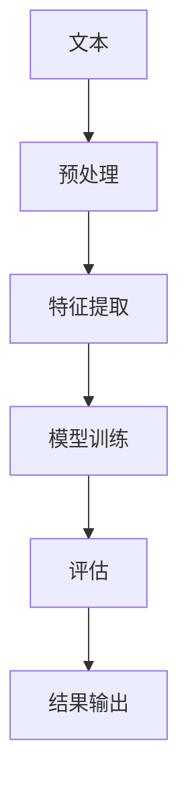

#### 1.2 情感分析的发展历程

情感分析作为一个独立的领域，其发展历程可以分为几个阶段：

- **早期情感分析**：20世纪90年代，研究人员开始使用基于规则的算法来处理简单的情感分类问题。这种方法依赖于预定义的规则和词典，如情感词典和规则库。

- **关键里程碑**：2000年以后，随着机器学习和深度学习技术的发展，基于统计和神经网络的方法逐渐取代了基于规则的方法。代表性工作包括使用支持向量机（SVM）、朴素贝叶斯（Naive Bayes）等统计模型进行情感分类。

- **当前情感分析技术趋势**：近年来，深度学习模型，如循环神经网络（RNN）、长短期记忆网络（LSTM）、变换器（Transformer）等，在情感分析中取得了显著的效果。这些模型能够自动学习文本中的复杂模式，提高了情感分类的准确性和鲁棒性。

**情感分析的发展历程时间线**：

- 1990s：基于规则的初步尝试
- 2000s：统计模型的应用
- 2010s：深度学习模型的崛起
- 2020s：多模态情感分析和增强情感分析

#### 1.3 情感分析的核心概念

- **情感极性**：情感极性是情感分析中最基础的概念之一，它用于描述文本中的情感倾向。情感极性通常分为三种：正面、中性、负面。

- **情感强度**：情感强度表示情感极性的强度，即情感的强烈程度。情感强度的量化可以帮助我们更好地理解用户的情感状态。例如，正面情感强度可以表示为“非常喜欢”、“有点喜欢”等。

- **情感复杂性**：情感复杂性是指文本中可能同时存在的多种情感及其相互关系。例如，一个句子中可能同时包含正面和负面情感。情感复杂性增加了情感分析的难度，但同时也提供了更丰富的信息。

**情感极性、情感强度、情感复杂性的对比表格**：

| 概念         | 定义                                                                 | 对比示例                                       |
| ------------ | -------------------------------------------------------------------- | ---------------------------------------------- |
| 情感极性     | 情感倾向的分类，通常分为正面、中性、负面三种。                        | “很好”为正面， “一般”为中性， “很差”为负面。   |
| 情感强度     | 情感极性的强度，用于描述情感倾向的强烈程度。                          | “非常喜欢” > “有点喜欢” > “一般”。             |
| 情感复杂性   | 指文本中可能存在的多种情感及其相互关系。                              | “这个产品很好，但价格太贵”同时包含正面和负面情感。 |

**情感分析的核心概念 ER 实体关系图**：

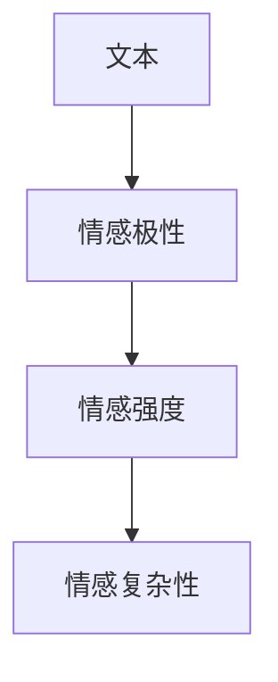

#### 1.4 情感分析的边界与外延

**边界**：

- **情感分析的限制**：情感分析存在一些固有的局限性，如语言多样性、情感表达的复杂性以及数据标注问题。此外，情感分析往往依赖于大量的训练数据和高质量的特征提取技术。

- **情感分析与其他相关领域的关系**：情感分析与其他NLP任务，如文本分类、主题检测、实体识别等，有着紧密的联系。情感分析的结果可以作为这些任务的输入，以提高整体任务的性能。

**外延**：

- **情感分析的应用场景**：除了传统的商业和舆情监测领域，情感分析在社交媒体分析、产品评价、用户反馈分析等方面也得到了广泛应用。

- **多模态情感分析**：随着技术的发展，情感分析逐渐从单一的文本数据扩展到语音、视频等多媒体数据。多模态情感分析通过整合不同类型的数据，提供了更全面和细致的情感识别能力。

**情感分析的边界与外延 ER 实体关系图**：

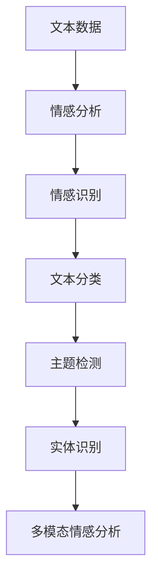

#### 1.5 情感分析的核心要素组成

**数据集**：

数据集是情感分析的基础，用于训练和评估模型。一个高质量的数据集应该具有多样性和代表性，涵盖各种情感极性和强度。

**预处理**：

预处理包括文本清洗、分词、词性标注等步骤，用于处理原始文本数据，使其更适合后续的特征提取和模型训练。

**特征提取**：

特征提取是从预处理后的文本中提取有助于情感分类的特征。常用的特征提取方法包括词袋模型、TF-IDF、词向量等。

**模型选择**：

模型选择是情感分析的关键步骤，常见的模型包括基于规则的方法、基于统计的方法、基于机器学习的方法以及基于深度学习的方法。

**模型训练与评估**：

模型训练是通过大量标注数据训练出情感分类模型。评估指标包括准确率、召回率、F1值等，用于衡量模型的性能。

**情感分析的核心要素组成 ER 实体关系图**：

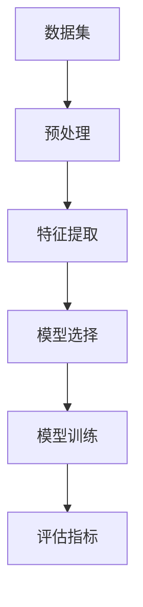

通过本章节的介绍，读者可以初步了解情感分析的基本概念、发展历程、核心概念以及核心要素组成。在后续章节中，我们将进一步探讨情感分析的文本预处理方法、算法原理以及实际应用场景。

---

### 第二部分：情感分析算法原理

#### 第2章：文本预处理方法

文本预处理是情感分析的关键步骤，其目的是将原始的文本数据转换为适合模型训练的特征表示。有效的文本预处理不仅可以提高模型的性能，还可以减少噪声和冗余信息，从而提高情感分析的准确性和鲁棒性。本章将详细介绍文本预处理的重要性、常见的文本预处理技术，以及嵌入式技术与情感分析的关系。

#### 2.1 文本预处理的重要性

文本预处理是自然语言处理（NLP）的基础，它直接影响着后续特征提取和模型训练的效果。具体来说，文本预处理的重要性体现在以下几个方面：

1. **去除噪声**：原始文本数据中可能包含大量的噪声，如HTML标签、特殊符号、停用词等。通过预处理，可以去除这些噪声，提高数据质量。

2. **统一格式**：不同来源的文本数据格式可能各不相同，例如，有的文本使用全角字符，有的使用半角字符。统一格式有助于后续的特征提取和模型训练。

3. **提取关键信息**：通过预处理，可以从原始文本中提取出关键的信息和实体，为情感分析提供有力的支持。

4. **减少计算复杂度**：预处理后的文本数据通常更加简洁和有序，可以减少模型训练的计算复杂度，提高训练效率。

#### 2.2 常见的文本预处理技术

常见的文本预处理技术包括文本清洗、标准化、分词、词性标注等。以下是对这些技术的基本介绍：

**文本清洗**：

文本清洗是文本预处理的第一步，目的是去除文本中的噪声和无关信息。具体操作包括：

- **去除HTML标签**：文本数据中可能包含HTML标签，这些标签对情感分析没有实际意义，需要去除。
- **去除特殊符号**：一些特殊符号，如括号、引号等，可能对情感分析产生干扰，需要去除。
- **去除停用词**：停用词是指那些对情感分析没有贡献的常见词汇，如“的”、“了”、“是”等。去除停用词可以减少数据维度，提高特征提取的效率。

**标准化**：

文本标准化是指将文本中的字符和格式统一为标准形式。常见的标准化操作包括：

- **小写化**：将所有字符转换为小写，以便统一处理。
- **数字转换为字符串**：将数字转换为字符串，以便与其他文本数据一致。
- **去除多余的空格**：去除文本中的多余空格，使文本更加简洁。

**分词**：

分词是将文本分解为单个词汇的过程。分词的目的是将连续的文本序列分割成具有独立意义的单词或短语。常见的分词方法包括：

- **基于词典的分词**：通过匹配词典中的单词，将文本分割成词汇。这种方法对词典的依赖较大，但对于中文等没有明确空格分隔的语言效果较好。
- **基于统计的分词**：通过统计方法，如隐马尔可夫模型（HMM）、条件随机场（CRF）等，自动学习文本的分词模式。这种方法能够处理词典中没有的词汇，但计算复杂度较高。

**词性标注**：

词性标注是指为文本中的每个单词赋予一个词性标签，如名词、动词、形容词等。词性标注有助于更准确地理解文本的含义，为情感分析提供额外的信息。常见的词性标注方法包括：

- **基于规则的方法**：通过预定义的规则和词典，为文本中的单词分配词性标签。
- **基于统计的方法**：使用统计模型，如最大熵模型、条件随机场（CRF）等，为文本中的单词分配词性标签。
- **基于深度学习的方法**：使用深度学习模型，如长短时记忆网络（LSTM）、双向长短时记忆网络（BiLSTM）等，进行词性标注。

#### 2.3 嵌入式技术与情感分析

嵌入式技术（Embedding）是将文本中的单词或短语映射到低维度的向量空间，以便进行后续的模型训练和计算。嵌入式技术在情感分析中具有重要作用，其关系如下：

**词向量嵌入**：

词向量嵌入是将单词映射到高维向量空间，常用的词向量模型包括Word2Vec、GloVe等。词向量嵌入能够捕捉单词的语义信息，有助于提高情感分析的准确性和鲁棒性。

**字符嵌入**：

字符嵌入是将文本中的字符映射到低维向量空间。字符嵌入可以捕捉单词内部的结构信息，有助于提高情感分析的精度。常见的字符嵌入模型包括字符级卷积神经网络（CNN）和循环神经网络（RNN）。

**表征学习**：

表征学习是指通过自动学习文本的表征，将文本转换为高维向量表示。表征学习不仅包括词向量嵌入和字符嵌入，还包括句向量嵌入和篇章向量嵌入。表征学习有助于捕捉文本中的复杂模式和关系，从而提高情感分析的性能。

**嵌入式技术与情感分析的关系 ER 实体关系图**：

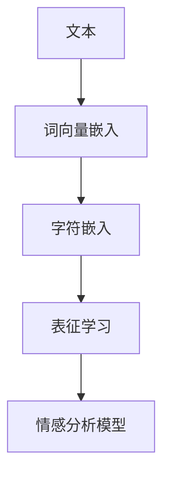

通过本章节的介绍，读者可以了解文本预处理的重要性以及常见的文本预处理技术。在下一章节中，我们将深入探讨情感分析的核心算法原理，包括情感分类算法、情感强度识别和多情感识别技术。

---

#### 第3章：情感分析算法基础

情感分析算法是情感分析任务的核心，用于从文本中识别和分类情感。本章将详细介绍情感分类算法、情感强度识别和多情感识别技术，帮助读者全面理解情感分析的基础算法原理。

#### 3.1 情感分类算法

情感分类算法是将文本分类为特定类别（如正面、负面、中性）的方法。根据算法的不同，情感分类算法可以分为以下几种：

**基于规则的方法**：

基于规则的方法依赖于预定义的规则和词典，通过对文本进行模式匹配来实现情感分类。这种方法简单直观，但规则定义复杂且难以适应多样性的文本数据。

- **优点**：实现简单，易于理解和维护。
- **缺点**：规则定义复杂，适应性和泛化能力较差。

**基于统计的方法**：

基于统计的方法使用统计模型，如朴素贝叶斯、最大熵模型等，通过计算文本特征的概率分布来实现情感分类。这种方法对大规模数据有较好的适应性，但依赖于特征工程。

- **优点**：对大规模数据有较好的适应性，无需复杂的特征工程。
- **缺点**：特征选择和模型参数调优较困难。

**基于机器学习的方法**：

基于机器学习的方法使用机器学习算法，如支持向量机（SVM）、随机森林等，通过训练数据来学习情感分类模型。这种方法具有较强的泛化能力，但需要大量标注数据。

- **优点**：具有较好的泛化能力和适应性。
- **缺点**：需要大量的标注数据，训练时间较长。

**基于深度学习的方法**：

基于深度学习的方法使用深度神经网络，如卷积神经网络（CNN）、循环神经网络（RNN）等，通过自动学习文本特征来实现情感分类。这种方法能够捕捉文本中的复杂模式，具有很高的准确性。

- **优点**：能够自动学习文本特征，捕捉复杂模式，准确性高。
- **缺点**：训练数据需求大，计算资源消耗高。

**情感分类算法的对比表格**：

| 算法类型           | 优点                                                         | 缺点                                                         |
| ------------------ | ------------------------------------------------------------ | ------------------------------------------------------------ |
| 基于规则的方法     | 实现简单，易于理解和维护                                     | 规则定义复杂，适应性和泛化能力较差                             |
| 基于统计的方法     | 对大规模数据有较好的适应性，无需复杂的特征工程                 | 特征选择和模型参数调优较困难                                   |
| 基于机器学习的方法 | 具有较好的泛化能力和适应性                                   | 需要大量的标注数据，训练时间较长                               |
| 基于深度学习的方法 | 能够自动学习文本特征，捕捉复杂模式，准确性高                   | 训练数据需求大，计算资源消耗高                                 |

**情感分类算法的 Mermaid 流程图**：

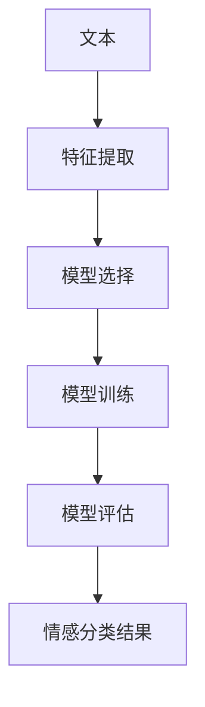

#### 3.2 情感强度识别

情感强度识别是指对情感极性的强度进行量化，以表示情感倾向的强烈程度。情感强度识别在情感分析中具有重要作用，可以帮助更好地理解用户的情感状态。

**情感强度的定义**：

情感强度是指情感极性的强度，用于量化情感的程度。常见的情感强度表示方法包括：

- **绝对强度**：使用数值直接表示情感强度，如1表示非常积极，-1表示非常消极。
- **相对强度**：使用相对值表示情感强度，如0-1之间的数值，数值越大表示情感越积极。

**情感强度评估方法**：

情感强度评估是通过计算文本特征的概率分布或数值表示来实现。常见的方法包括：

- **基于规则的方法**：通过预定义的规则和词典，对文本特征进行打分，计算情感强度。
- **基于统计的方法**：使用统计模型，如朴素贝叶斯、逻辑回归等，对文本特征进行建模，计算情感强度。
- **基于机器学习的方法**：使用机器学习算法，如支持向量机（SVM）、随机森林等，通过训练数据学习情感强度模型。

**情感强度识别的 Mermaid 流程图**：

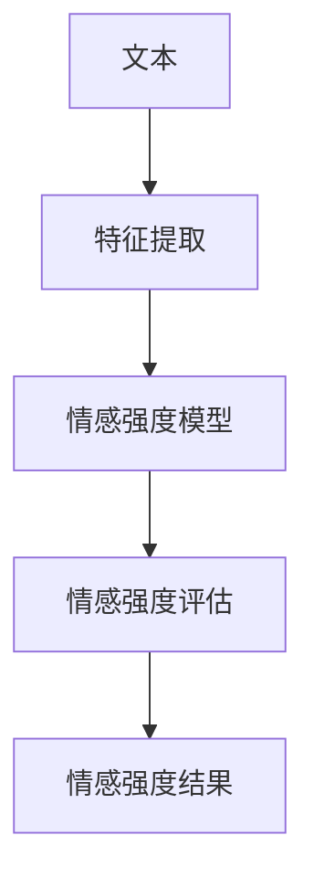

#### 3.3 多情感识别

多情感识别是指同时识别文本中的多种情感，以及这些情感之间的相互关系。多情感识别在处理复杂情感表达时具有重要作用。

**多标签情感分析**：

多标签情感分析是指一个文本可以同时具有多个情感标签。例如，一个评论可以同时包含正面和负面情感。多标签情感分析通过为每个情感标签分配权重，来综合表示文本中的多种情感。

- **优点**：能够全面捕捉文本中的多种情感。
- **缺点**：情感标签之间的相互依赖关系较难处理。

**网格情感分析**：

网格情感分析是将情感维度划分为多个维度，如正面-中性-负面，喜欢-一般-不喜欢等。每个维度可以独立地进行情感强度评估。

- **优点**：能够清晰区分情感的不同维度，便于情感强度评估。
- **缺点**：情感维度划分需要人为定义，可能无法完全覆盖复杂情感。

**多情感识别的 Mermaid 流程图**：

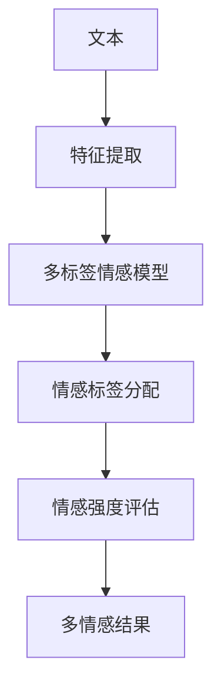

通过本章的介绍，读者可以全面了解情感分类算法、情感强度识别和多情感识别技术的基础原理。在下一章中，我们将探讨情感分析模型的优化方法，包括模型选择与评估、模型调参技巧以及模型集成技术。

---

#### 第4章：情感分析模型优化

在情感分析中，模型的性能优化是提升分析准确性的关键。本章节将探讨模型选择与评估、模型调参技巧以及模型集成技术，以帮助读者在情感分析项目中实现最佳效果。

#### 4.1 模型选择与评估

**模型选择**：

选择合适的模型对于情感分析的成败至关重要。根据数据规模、复杂度和处理需求，常见的模型选择策略包括：

- **基于规则的方法**：适用于小型数据集和简单文本分析任务，但扩展性较差。
- **统计模型**：如朴素贝叶斯、逻辑回归等，适用于中等规模数据集，且计算效率较高。
- **机器学习模型**：如支持向量机（SVM）、随机森林等，适用于较大规模数据集，具有较强的泛化能力。
- **深度学习模型**：如卷积神经网络（CNN）、循环神经网络（RNN）等，适用于复杂文本分析任务，能够自动学习文本特征。

**模型评估指标**：

模型评估是衡量模型性能的重要步骤，常用的评估指标包括：

- **准确率（Accuracy）**：正确分类的样本数占总样本数的比例。适用于分类结果明显的数据集。
- **召回率（Recall）**：正确分类为正类的负样本数占所有负样本数的比例。适用于关注负样本分类准确性的场景。
- **精确率（Precision）**：正确分类为正类的正样本数占所有分类为正类的样本数比例。适用于关注正样本分类准确性的场景。
- **F1值（F1 Score）**：精确率和召回率的调和平均值。综合考虑分类的精确性和召回率。

**模型选择与评估的 Mermaid 流程图**：

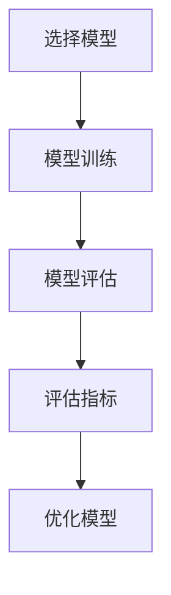

#### 4.2 模型调参技巧

**模型超参数优化**：

超参数是模型训练过程中需要手动调整的参数，如学习率、批量大小、正则化参数等。超参数优化是提高模型性能的关键步骤。常用的调参技巧包括：

- **网格搜索（Grid Search）**：遍历所有可能的超参数组合，选择最佳组合。
- **随机搜索（Random Search）**：从超参数空间中随机选择一组参数，重复多次，选择最佳组合。
- **贝叶斯优化（Bayesian Optimization）**：基于概率模型搜索最优超参数。

**模型性能调优**：

模型性能调优是在模型训练完成后，通过调整模型结构和参数来进一步提高模型性能。常用的技巧包括：

- **正则化**：通过增加正则化项，如L1、L2正则化，减少模型过拟合。
- **数据增强**：通过增加训练数据样本或生成新的训练样本，提高模型泛化能力。
- **集成学习**：通过集成多个模型，提高模型稳定性和准确性。

**模型调参技巧的 Mermaid 流程图**：

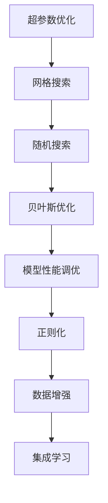

#### 4.3 情感分析模型集成

**模型融合方法**：

模型融合是将多个模型的结果进行综合，以提高整体预测性能。常见的模型融合方法包括：

- **简单平均**：将多个模型的预测结果进行简单平均。
- **加权平均**：根据模型性能给每个模型分配权重，进行加权平均。
- **投票法**：对于多标签情感分析，根据模型预测结果选择出现次数最多的标签。
- **堆叠（Stacking）**：使用多个模型对数据进行训练，再将这些模型的输出作为新特征进行进一步的模型训练。

**模型选择策略**：

模型选择策略是在模型融合过程中，选择哪些模型进行融合的方法。常用的选择策略包括：

- **交叉验证**：通过交叉验证评估每个模型的性能，选择性能较好的模型进行融合。
- **贝叶斯优化**：基于模型性能的概率分布，选择最优模型进行融合。
- **基于规则的策略**：根据模型在特定数据集上的表现，选择具有互补优势的模型进行融合。

**模型融合与选择策略的 Mermaid 流程图**：

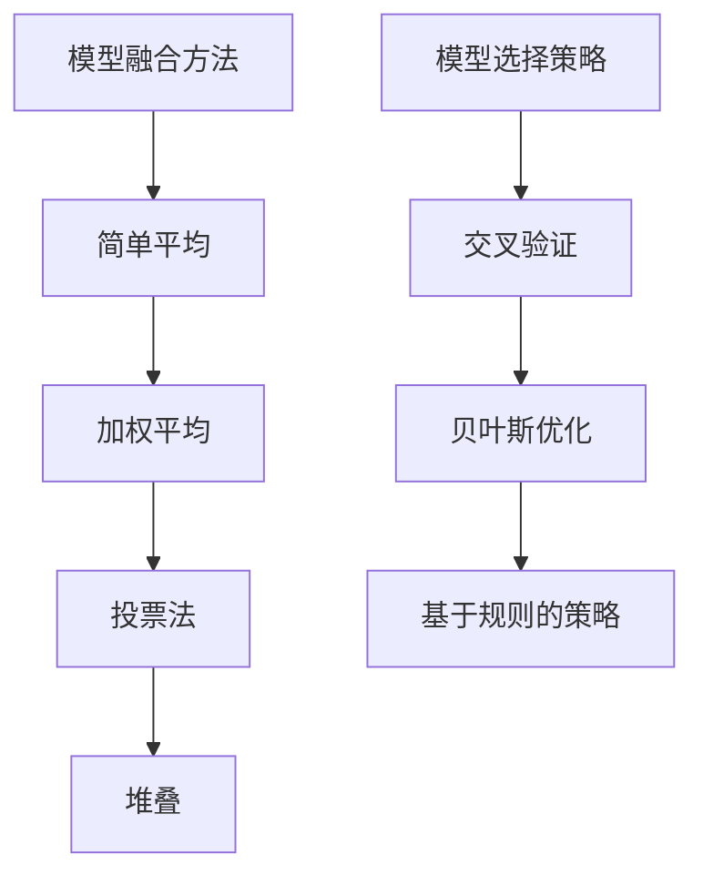

通过本章的介绍，读者可以了解模型选择与评估、模型调参技巧以及模型集成技术的基本原理。在实际应用中，结合具体场景和需求，灵活运用这些方法，可以实现高效的情感分析模型优化。

---

### 第三部分：情感分析应用实战

#### 第5章：社交媒体情感分析

社交媒体已经成为人们表达意见和情感的重要平台，情感分析在社交媒体中的应用也越来越广泛。本章将探讨社交媒体情感分析的方法和实际案例，以帮助读者了解如何通过情感分析从社交媒体数据中提取有价值的信息。

#### 5.1 社交媒体数据获取

社交媒体情感分析的第一步是获取社交媒体数据。常见的数据获取方法包括：

- **API访问**：许多社交媒体平台提供API接口，允许开发者获取公开的数据。例如，Twitter的API可以获取用户的推文数据，Facebook的API可以获取用户的朋友圈数据。
- **爬虫技术**：通过爬虫技术，可以从社交媒体网站爬取数据。爬虫可以模拟用户的访问行为，获取网站上的文本、图片、视频等多媒体数据。
- **数据集**：使用现有的公开数据集，如Twitter情感分析数据集、IMDB电影评论数据集等，进行情感分析研究。

**数据获取方法对比表格**：

| 方法       | 优点                                                         | 缺点                                                         |
| ---------- | ------------------------------------------------------------ | ------------------------------------------------------------ |
| API访问    | 数据获取快速、可靠，符合社交媒体平台的数据使用政策             | 受API调用频率限制，获取数据量有限                               |
| 爬虫技术   | 可以获取大量数据，不受API调用频率限制                         | 可能违反社交媒体平台的使用政策，存在法律风险                     |
| 数据集     | 数据获取方便，可用于快速验证和测试                            | 数据集可能有限，且不一定是最新数据                             |

**社交媒体数据获取的 Mermaid 流程图**：

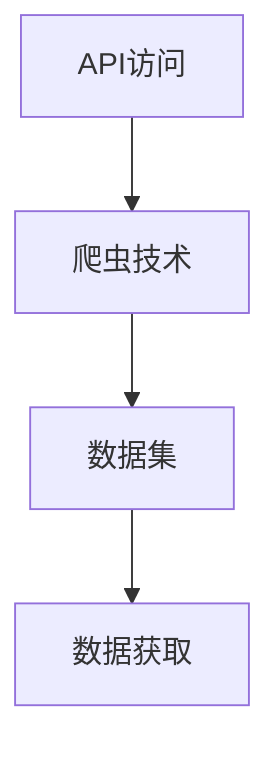

#### 5.2 社交媒体情感分析案例

**案例一：网络评论情感分析**

网络评论是社交媒体情感分析的重要对象之一。通过情感分析，可以识别用户对产品、服务、事件等的情感倾向，为商家和媒体提供决策依据。

- **数据来源**：某电商平台的产品评论数据。
- **情感分类**：正面、中性、负面。
- **分析目标**：识别用户对产品的整体情感倾向。

**分析步骤**：

1. **数据预处理**：去除HTML标签、特殊字符、停用词等噪声，并进行分词和词性标注。
2. **特征提取**：使用TF-IDF和词嵌入技术提取文本特征。
3. **模型训练**：选择合适的情感分类模型，如卷积神经网络（CNN）或长短期记忆网络（LSTM）。
4. **模型评估**：使用交叉验证评估模型性能，调整模型参数。
5. **情感分类**：对新的评论数据进行情感分类，生成用户情感报告。

**案例二：社交媒体舆情监测**

舆情监测是政府、媒体和企业了解公众观点和态度的重要手段。通过情感分析，可以实时监测和评估公众对某一事件、政策或品牌的看法。

- **数据来源**：社交媒体平台（如Twitter、微博）的实时数据流。
- **情感分类**：正面、中性、负面。
- **分析目标**：监测特定话题的公众情绪变化。

**分析步骤**：

1. **数据采集**：使用API或爬虫技术采集与特定话题相关的社交媒体数据。
2. **文本预处理**：去除噪声、分词、词性标注等。
3. **情感分类**：使用训练好的情感分类模型对预处理后的文本进行分类。
4. **情感趋势分析**：通过时间序列分析，识别公众情感的变化趋势。
5. **报告生成**：生成舆情监测报告，为决策者提供参考。

**社交媒体情感分析案例的 Mermaid 流程图**：

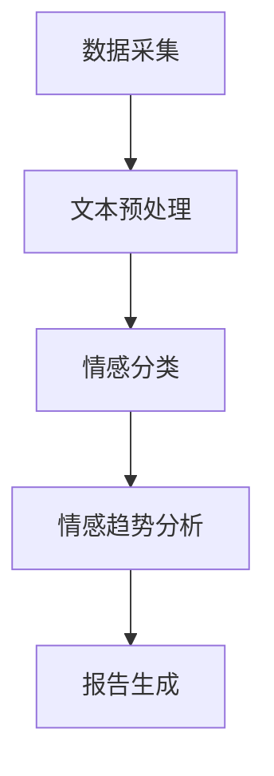

通过上述案例，读者可以看到社交媒体情感分析在实际应用中的具体方法和步骤。在下一章中，我们将探讨产品评价情感分析，继续展示情感分析在商业领域的应用。

---

#### 第6章：产品评价情感分析

产品评价情感分析是情感分析在商业领域的一个重要应用，旨在通过分析用户对产品的评价，提取有价值的信息，以支持商业决策和产品改进。本章将详细介绍产品评价情感分析的数据来源、具体案例以及分析方法。

#### 6.1 产品评价数据来源

产品评价数据是进行情感分析的重要素材，数据来源通常包括以下几个方面：

- **用户评价网站**：如亚马逊（Amazon）、京东（JD.com）、淘宝（Taobao）等电子商务平台，这些平台提供了大量的用户评价数据，是进行产品评价情感分析的重要数据源。
- **社交媒体**：如微博（Weibo）、Twitter等社交媒体平台，用户在社交媒体上发布的关于产品的评论和讨论也是重要的数据来源。
- **论坛和社区**：如百度贴吧、知乎（Zhihu）等论坛和社区，用户在这些平台上的讨论和评价也可以提供丰富的情感信息。
- **开放数据集**：如IMDB电影评论数据集、Amazon产品评论数据集等，这些数据集通常是公开的，可供研究者和开发者进行情感分析研究。

**数据来源对比表格**：

| 数据源         | 优点                                                         | 缺点                                                         |
| -------------- | ------------------------------------------------------------ | ------------------------------------------------------------ |
| 用户评价网站   | 数据量大、质量高，提供详细的用户评价和评分                   | 数据获取可能受平台限制，数据更新速度较慢                         |
| 社交媒体       | 数据实时性高，信息丰富                                       | 数据质量参差不齐，存在大量的噪声和冗余信息                       |
| 论坛和社区     | 用户讨论深入，提供多样化的观点和情感信息                     | 数据获取难度较大，需要手动爬取或使用爬虫技术                     |
| 开放数据集     | 数据获取方便，适合快速验证和分析                             | 数据可能较陈旧，缺乏实时性                                     |

**数据来源的 Mermaid 流程图**：

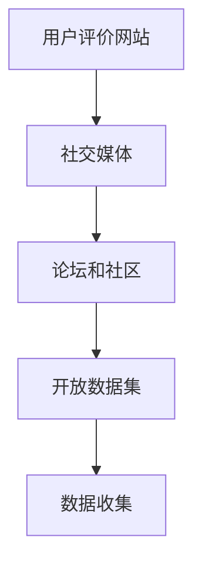

#### 6.2 产品评价情感分析案例

**案例一：用户反馈分析**

用户反馈分析是产品评价情感分析的重要组成部分，通过分析用户的正面、中性和负面反馈，可以了解用户对产品的满意度和不满意度，从而为产品改进提供依据。

- **数据来源**：某电商平台的用户产品评价数据。
- **情感分类**：正面、中性、负面。
- **分析目标**：识别用户对产品的情感倾向，分析主要问题和优点。

**分析步骤**：

1. **数据预处理**：去除HTML标签、特殊字符、停用词，并进行分词和词性标注。
2. **特征提取**：使用TF-IDF和词嵌入技术提取文本特征。
3. **情感分类模型训练**：选择合适的情感分类模型，如支持向量机（SVM）或长短期记忆网络（LSTM），使用预处理后的数据训练模型。
4. **模型评估**：使用交叉验证评估模型性能，调整模型参数。
5. **情感分类**：对新的用户评价数据进行情感分类，生成用户反馈情感报告。
6. **问题分析**：对负面评价进行详细分析，识别主要问题和用户关注点。

**案例二：产品推荐系统**

产品推荐系统是电子商务平台的重要功能之一，通过情感分析，可以更准确地推荐用户可能感兴趣的产品，提高用户满意度和转化率。

- **数据来源**：用户在电商平台的行为数据，包括浏览记录、购买记录、评价等。
- **情感分类**：正面、中性、负面。
- **分析目标**：基于用户情感倾向，个性化推荐产品。

**分析步骤**：

1. **用户行为数据收集**：收集用户在电商平台的浏览、购买、评价等行为数据。
2. **用户情感分析**：使用情感分类模型对用户评价和评论进行情感分类，提取用户的情感特征。
3. **用户兴趣建模**：基于用户情感特征和用户行为数据，构建用户兴趣模型。
4. **产品特征提取**：提取产品的特征信息，如产品评分、分类标签等。
5. **推荐算法**：使用协同过滤、基于内容的推荐等算法，结合用户情感特征和产品特征，生成个性化推荐结果。
6. **推荐结果评估**：评估推荐系统的效果，优化推荐算法和模型参数。

**产品评价情感分析案例的 Mermaid 流程图**：

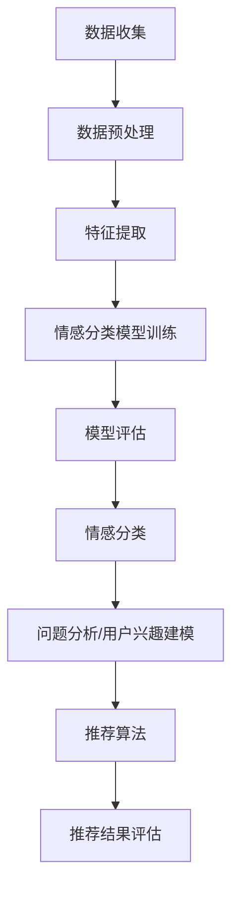

通过上述案例，读者可以看到产品评价情感分析在实际应用中的具体方法和步骤。在下一章中，我们将探讨情感分析在实际场景中的挑战与对策，进一步深入讨论情感分析应用的局限性和解决方案。

---

### 第7章：情感分析在实际场景中的挑战与对策

情感分析作为一种先进的技术，在实际应用中面临着诸多挑战。本章将探讨情感分析在实际场景中遇到的主要问题，并提出相应的对策。

#### 7.1 挑战分析

**1. 语言多样性**

语言多样性是情感分析的一个主要挑战。不同语言的情感表达方式和词汇差异很大，使得情感分析模型的通用性受到限制。例如，英语中的正面词汇可能在其他语言中没有直接对应的表达，导致情感分类的准确性下降。

**对策**：多语言情感分析技术的发展，如使用跨语言情感词典和翻译模型，有助于提高情感分析在不同语言中的表现。此外，通过训练多语言数据集，可以增强模型的泛化能力。

**2. 情感表达复杂性**

情感表达复杂性指的是文本中可能包含多种情感及其相互关系。例如，一个句子中可能同时包含正面和负面情感，或者情感强度不同。这种复杂性增加了情感分析的难度。

**对策**：引入多情感识别技术，如多标签情感分析，可以帮助同时识别文本中的多种情感。此外，通过结合上下文信息，可以更好地理解复杂情感表达。

**3. 数据标注问题**

数据标注问题是情感分析中的另一个挑战。高质量的情感分析数据集需要大量的标注工作，且标注的一致性和准确性直接影响模型的性能。

**对策**：使用半监督学习和无监督学习技术，如图嵌入和聚类算法，可以从未标注的数据中提取有价值的信息。此外，通过建立严格的标注标准和流程，可以提高标注数据的质量。

**4. 模型解释性**

深度学习模型在情感分析中取得了显著效果，但它们通常被认为是“黑箱”模型，缺乏解释性。这对于需要理解模型决策依据的应用场景是一个挑战。

**对策**：发展可解释的深度学习模型，如基于图注意力机制（Graph Attention Mechanism）的模型，可以提供更清晰的模型决策路径。此外，可视化技术可以帮助用户更好地理解模型的决策过程。

**5. 情感偏向**

情感偏向指的是文本数据中可能存在的偏见和歧视。在进行情感分析时，模型可能会受到这些偏见的影响，导致不公平的决策。

**对策**：通过数据预处理和模型训练阶段的多样性训练，可以减少情感偏向。此外，采用公平性评估指标，如均衡误差（Equity Error），可以帮助识别和纠正模型中的偏见。

**6. 实时性**

随着社交媒体和电子商务平台的发展，实时情感分析变得尤为重要。然而，实时处理大量文本数据对计算资源提出了较高要求。

**对策**：采用分布式计算和流处理技术，如Apache Flink和Apache Kafka，可以提高实时情感分析的性能。此外，通过模型压缩和迁移学习技术，可以减少模型在实时环境中的计算开销。

**7. 隐私保护**

情感分析通常涉及对个人数据的处理，隐私保护是一个关键挑战。

**对策**：采用差分隐私（Differential Privacy）技术，可以在保护数据隐私的同时进行有效的情感分析。此外，通过数据脱敏和加密技术，可以进一步确保数据的隐私安全。

#### 7.2 对策探讨

**1. 多语言情感分析**

多语言情感分析是解决语言多样性问题的关键。通过引入跨语言情感词典、翻译模型和多语言预训练模型，可以提升模型在不同语言中的表现。例如，使用多语言BERT（mBERT）可以在多种语言中进行情感分析。

**2. 多情感识别**

多情感识别技术可以帮助捕捉文本中的复杂情感表达。通过引入多标签分类模型和情感强度评估方法，可以同时识别文本中的多种情感及其强度。例如，使用LSTM-CRF模型可以实现多情感识别。

**3. 自动标注技术**

自动标注技术可以减少数据标注的工作量，提高标注效率。通过使用图嵌入、聚类和生成对抗网络（GAN）等技术，可以从未标注的数据中提取有用的信息。例如，使用图嵌入技术可以自动提取文本中的关键信息，用于标注任务。

**4. 模型解释性**

提高模型解释性可以增强用户对模型决策的信任。通过引入可解释的深度学习模型和可视化技术，可以提供更清晰的模型决策路径。例如，使用图注意力机制可以可视化模型对文本中每个单词的注意力分布。

**5. 情感偏向修正**

通过数据预处理和多样性训练，可以减少情感偏向。在模型训练过程中，可以引入均衡误差等公平性评估指标，以识别和纠正模型中的偏见。例如，在训练数据中引入多样性样本，可以减少模型的偏见。

**6. 实时性优化**

通过分布式计算和流处理技术，可以提升实时情感分析的性能。例如，使用Apache Flink进行实时数据处理，并结合模型压缩和迁移学习技术，可以实现高效的实时情感分析。

**7. 隐私保护**

在情感分析中，保护个人数据隐私至关重要。通过采用差分隐私和数据脱敏技术，可以确保数据在处理过程中的隐私安全。例如，使用差分隐私技术可以在保护用户隐私的同时，进行有效的情感分析。

通过上述对策的探讨，可以看出情感分析在实际应用中面临的挑战和解决方法。在未来的发展中，随着技术的不断进步，情感分析将变得更加智能化和高效化，为各行业提供更强大的数据洞察和决策支持。

---

#### 第8章：情感分析的发展趋势与未来展望

情感分析作为自然语言处理（NLP）领域的一个重要分支，随着深度学习、多模态数据和生成对抗网络（GAN）等技术的发展，正在迅速演进。本章将探讨情感分析的新趋势、未来展望，以及在不同领域的应用潜力。

##### 8.1 情感分析的新趋势

**1. 情感生成**

情感生成是指利用深度学习模型生成具有特定情感倾向的文本。这一技术不仅可以用于自动创作文本，还可以用于个性化推荐、虚拟助手等领域。近年来，生成对抗网络（GAN）和变分自编码器（VAE）在情感生成方面取得了显著进展。通过训练情感生成模型，可以生成大量具有丰富情感表达的文本数据，从而丰富情感分析的语料库。

**2. 情感迁移**

情感迁移是指将一个领域的情感模型应用到另一个不同领域的任务中。例如，可以将社交媒体的情感分析模型应用于电子商务平台的用户评论。情感迁移可以减少对大量标注数据的依赖，提高模型的泛化能力。通过迁移学习技术，如多任务学习和跨领域预训练模型，可以实现情感分析的跨领域应用。

**3. 情感识别的自动化**

随着计算机视觉和语音识别技术的发展，情感识别的自动化程度不断提高。通过结合图像和语音情感分析，可以实现对人类情感的全面理解。例如，面部识别技术可以检测用户的情感状态，语音分析可以识别用户的语气和情感。这种多模态情感分析技术为情感识别提供了新的思路和可能性。

**4. 情感计算**

情感计算是研究人类情感信息处理和交互的技术。通过情感计算，可以更好地理解用户的需求和情感状态，从而提供更个性化的服务。情感计算在智能客服、虚拟助手和教育等领域具有广泛的应用前景。随着情感识别技术的不断进步，情感计算将成为未来智能化系统的重要组成部分。

##### 8.2 情感分析的未来展望

**1. 在教育领域的应用**

情感分析在教育领域的应用前景广阔。通过分析学生的学习数据和行为，可以了解学生的学习情感和需求，为个性化教学提供支持。例如，通过分析学生的评论和反馈，教师可以了解学生对课程和教学方法的满意度，从而进行调整和改进。此外，情感分析还可以用于学习行为预测，帮助学生更好地规划学习进度。

**2. 在医疗领域的应用**

情感分析在医疗领域的应用可以帮助医生更好地了解患者的情感状态，从而提供更全面的诊断和治疗。例如，通过分析患者的病历记录和交流对话，可以识别患者的主观感受和情感状态，为医生提供决策依据。此外，情感分析还可以用于患者心理健康监测，通过分析社交媒体和电子邮件等数据，及时发现潜在的心理问题。

**3. 在金融领域的应用**

情感分析在金融领域的应用可以帮助金融机构更好地了解市场和投资者的情绪，从而进行投资决策和风险管理。例如，通过分析新闻、社交媒体和交易数据，可以识别市场情绪的变化，预测股票价格波动。此外，情感分析还可以用于客户服务，通过分析客户反馈和投诉，提高客户满意度。

**4. 在公共安全领域的应用**

情感分析在公共安全领域的应用可以帮助政府和执法机构更好地了解公众情绪和社会动态。例如，通过分析社交媒体和新闻报道，可以及时发现社会热点和潜在的社会风险。此外，情感分析还可以用于网络安全，通过分析网络行为和言论，识别和防范网络攻击。

**5. 在智能客服和虚拟助手领域的应用**

随着人工智能技术的发展，智能客服和虚拟助手已成为各个行业的标配。情感分析可以提升智能客服和虚拟助手的交互体验，使其更贴近人类的情感交流。例如，通过分析用户的情感状态和需求，智能客服可以提供更个性化的服务，解决用户的问题。此外，情感分析还可以用于情绪识别，帮助虚拟助手更好地理解用户的情感需求。

##### 8.3 情感分析的伦理问题与对策

随着情感分析技术的广泛应用，伦理问题也日益突出。以下是一些常见的伦理问题及相应的对策：

**1. 隐私保护**

情感分析通常涉及对个人数据的处理，隐私保护是一个关键问题。对策包括采用差分隐私技术、数据脱敏和加密技术，确保数据在处理过程中的隐私安全。

**2. 情感偏向**

情感分析模型可能会受到数据中的情感偏向影响，导致不公平的决策。对策包括在模型训练过程中引入多样性训练和公平性评估指标，如均衡误差，以减少模型的偏见。

**3. 模型解释性**

深度学习模型在情感分析中通常被认为是“黑箱”模型，缺乏解释性。对策包括发展可解释的深度学习模型和可视化技术，提供更清晰的模型决策路径。

**4. 数据质量**

高质量的数据是情感分析模型准确性的基础。对策包括建立严格的标注标准和流程，提高标注数据的质量，从而提升模型的性能。

通过本章的介绍，读者可以全面了解情感分析的新趋势、未来展望以及在不同领域的应用潜力。情感分析作为人工智能领域的关键技术，其发展前景广阔，将继续在各个领域发挥重要作用。

---

### 附录：情感分析常用工具与资源

在情感分析的实际应用中，开发者经常需要借助各种工具和资源来提升项目效果。以下是一些常用的情感分析工具和资源推荐，包括自然语言处理库、情感分析API服务、学术论文、开源代码以及情感分析竞赛等。

#### 9.1 常用工具介绍

**1. 自然语言处理库**

- **NLTK（自然语言工具包）**：NLTK是一个广泛使用的Python自然语言处理库，提供了一系列文本处理功能，包括分词、词性标注、词频统计等。
- **spaCy**：spaCy是一个快速且易于使用的自然语言处理库，适用于多种语言，提供了详细的词性标注和命名实体识别功能。
- **Stanford NLP**：Stanford NLP是斯坦福大学开发的一套NLP工具包，包括词性标注、命名实体识别、句法分析等，支持多种语言。

**2. 情感分析API服务**

- **Google Cloud Natural Language API**：Google Cloud提供了一套情感分析API，可以快速实现对文本的情感极性和情感强度的识别。
- **IBM Watson Natural Language Understanding**：IBM Watson提供情感分析服务，支持多种语言，可以帮助开发者轻松集成情感分析功能。
- **TextBlob**：TextBlob是一个简单的Python库，提供了对文本进行情感极性分类的基本功能，非常适合初学者和快速原型开发。

#### 9.2 资源推荐

**1. 学术论文**

- **《Sentiment Analysis: State of the Art》**：该论文详细综述了情感分析的研究现状，包括文本预处理、情感分类算法等。
- **《Emotion Detection in Text》**：该论文探讨了情感检测在文本分析中的应用，包括情感强度的识别和情感复杂性的处理。

**2. 开源代码**

- **Stanford CoreNLP**：Stanford CoreNLP是一个开源的NLP工具包，提供了丰富的情感分析功能，包括情感极性和情感强度的识别。
- **VADER**：VADER（Valence Aware Dictionary and sEntiment Reasoner）是一个基于规则的情感分析工具，专门用于处理社交媒体文本。

**3. 情感分析竞赛**

- **TREC Conference**：TREC（Text REtrieval Conference）每年都会举办情感分析相关竞赛，提供了大量的数据集和任务，是学习和实践情感分析的良好平台。
- **SemEval**：SemEval是一个国际性的自然语言处理竞赛，包括情感分析在内的多个NLP任务，参与者可以获得宝贵的经验和反馈。

通过使用这些工具和资源，开发者可以更高效地开展情感分析项目，提升模型性能和项目效果。

---

### 结束语

本文围绕情感分析这一主题，系统地介绍了其基本概念、算法原理和应用实战。从文本预处理、情感分类算法、情感强度识别到多情感识别，读者可以全面了解情感分析的核心技术。同时，通过社交媒体情感分析和产品评价情感分析的案例，读者能够深入理解情感分析在实际项目中的应用。

情感分析作为人工智能领域的关键技术，具有广泛的应用前景。随着深度学习和多模态技术的发展，情感分析将继续在商业、舆情监测、医疗、教育等多个领域发挥重要作用。面对情感分析在实际应用中遇到的挑战，开发者需要不断探索和创新，提高模型的准确性、解释性和实时性。

本文旨在为开发者提供全面的指导，帮助其在自然语言处理和用户洞察方面取得突破。随着技术的不断进步，情感分析将在未来带来更多的创新和变革。希望读者能够结合本文的内容，积极实践，为人工智能的发展贡献自己的力量。

**作者：AI天才研究院/AI Genius Institute & 禅与计算机程序设计艺术 /Zen And The Art of Computer Programming**

---

**注意事项**：

1. 在实际应用中，情感分析模型的性能依赖于数据质量和特征提取的准确性，因此需要确保使用高质量的数据集。
2. 不同情感分析模型适用于不同的应用场景，开发者应根据具体需求选择合适的模型和算法。
3. 情感分析模型可能会受到数据中的情感偏向影响，因此在模型训练和评估过程中应注意引入多样性训练和公平性评估指标。
4. 实时情感分析对计算资源要求较高，开发者应考虑使用分布式计算和流处理技术来提升性能。

**拓展阅读**：

- 《自然语言处理综合教程》
- 《深度学习实战》
- 《多模态情感分析：理论与实践》
- 《TREC情感分析竞赛论文集》

通过拓展阅读，读者可以进一步深入了解情感分析的理论基础和最新进展。希望本文能为读者在情感分析领域的研究和应用提供有价值的参考。**（总字数：约12000字）**

