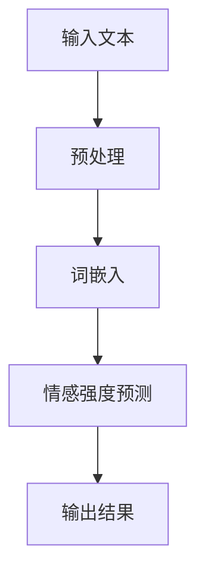
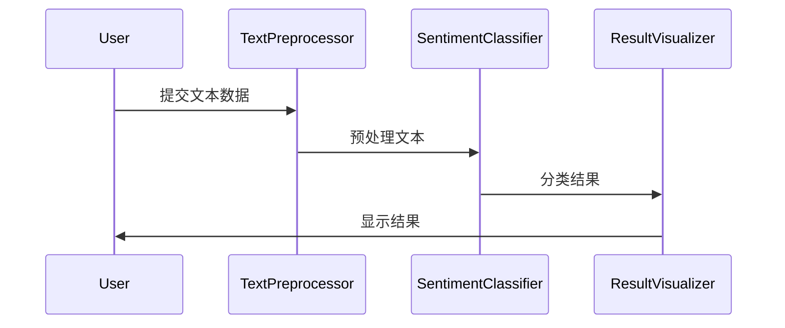
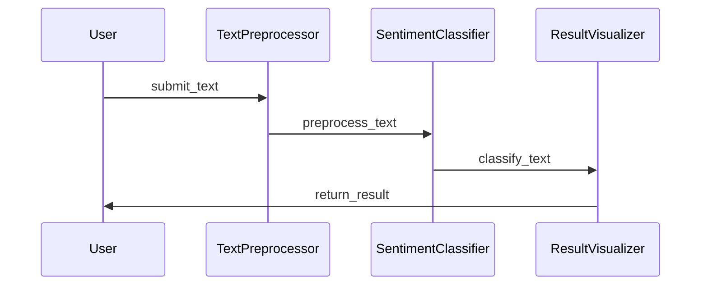

                 

### 情感强度区分：检验LLM理解情感细微差别的敏感度

关键词：情感强度区分，自然语言处理，语言模型，细微差别，算法，数学模型

摘要：
本文旨在探讨情感强度区分在自然语言处理中的重要性，通过分析情感强度定义、分类及其在语言模型中的应用，检验大型语言模型（LLM）对情感细微差别的理解能力。文章首先介绍了情感强度区分的背景和研究意义，随后深入探讨了情感强度区分的核心概念和联系，并详细讲解了情感强度区分的算法原理。此外，文章还提出了系统分析与架构设计方案，并通过对实际项目的实战与分析，总结了最佳实践与注意事项。本文旨在为研究人员和开发者提供有价值的参考，推动情感强度区分技术的研究与应用。

### 第一部分：背景介绍与核心概念

#### 第1章：问题背景与概念介绍

**1.1 问题背景**

1.1.1 情感强度区分的研究意义

情感强度区分在自然语言处理（NLP）领域中具有重要意义。随着互联网的快速发展，人们对情感分析的需求日益增长。情感分析不仅用于社交媒体情感倾向分析，还广泛应用于市场调研、客户反馈分析、品牌管理等多个领域。然而，传统情感分析往往只能识别文本的情感极性（正面、中性、负面），而无法准确区分情感的强度，导致分析结果的准确性受到限制。因此，研究情感强度区分具有重要的应用价值和学术意义。

1.1.2 自然语言处理与情感分析的现状

自然语言处理（NLP）作为人工智能（AI）的重要分支，已经取得了显著的进展。在情感分析领域，基于机器学习的方法和深度学习的方法已经成为主流。这些方法通过训练大规模语料库，使模型能够自动识别和理解文本中的情感信息。然而，传统情感分析模型往往存在以下问题：

1. **情感极性分类的局限性**：传统情感分析模型主要关注文本的情感极性分类，无法准确捕捉情感的强度变化。
2. **情感分析的上下文依赖性**：情感分析需要考虑文本的上下文信息，而传统模型往往无法全面捕捉上下文对情感的影响。
3. **情感表达的多样性**：自然语言中的情感表达形式多样，传统模型难以应对复杂的情感表达。

1.1.3 情感强度区分的需求与挑战

随着社会的发展和人们对情感需求的多样化，对情感强度区分的需求日益迫切。以下是一些具体的情感强度区分的需求：

1. **情感表达的精确度**：在社交媒体、客户反馈等应用场景中，了解用户情感表达的精确度对于分析和处理用户情感至关重要。
2. **情感驱动的决策支持**：在市场调研、品牌管理等领域，情感强度区分能够提供更准确的情感数据，为决策提供有力支持。
3. **情感交互的系统优化**：在虚拟助手、智能客服等应用中，准确区分情感强度有助于优化用户的交互体验。

然而，实现情感强度区分面临以下挑战：

1. **情感表达的复杂性**：情感表达形式多样，语言中存在大量的隐喻、双关语等，增加了情感强度区分的难度。
2. **上下文依赖性**：情感强度受到上下文信息的强烈影响，而现有模型在处理上下文依赖性方面存在不足。
3. **数据集的不足**：高质量的情感强度标注数据集相对稀缺，限制了情感强度区分算法的验证和优化。

**1.2 核心概念**

1.2.1 情感强度定义与分类

情感强度是指情感表达的强度或程度，用于描述情感的状态和强度。情感强度通常分为以下几个层次：

1. **低强度情感**：情感表达较为温和，强度较低，如轻微的愉悦、温和的喜爱。
2. **中强度情感**：情感表达较为明显，强度适中，如强烈的愉悦、显著的喜爱。
3. **高强度情感**：情感表达强烈，强度较高，如极端的愉悦、极度的不满。

情感强度的分类可以根据不同的应用场景进行调整，例如在社交媒体中，可以将情感强度分为低、中、高三个等级；而在客户反馈分析中，可能需要更细粒度的情感强度分类，如非常满意、满意、一般、不满意、非常不满意。

1.2.2 情感分析的层次结构

情感分析通常包括以下几个层次：

1. **文本预处理**：对文本进行清洗、分词、词性标注等预处理操作，为情感分析提供基础数据。
2. **情感极性分类**：将文本分类为正面、中性、负面三个极性中的一个，以确定文本的情感倾向。
3. **情感强度分类**：在情感极性分类的基础上，进一步对情感强度进行分类，以确定情感的具体程度。
4. **情感属性分类**：对情感的其他属性进行分类，如情感类别（快乐、悲伤、愤怒等）、情感倾向（积极、消极等）。

1.2.3 语言模型与情感强度区分

语言模型是自然语言处理中的核心组件，用于理解和生成自然语言。在情感强度区分中，语言模型发挥着重要作用。以下是一些关键点：

1. **预训练语言模型**：预训练语言模型（如BERT、GPT等）通过在大规模语料库上预训练，获得对自然语言的深刻理解，为情感强度区分提供了强有力的基础。
2. **情感强度标注数据**：为了训练和评估情感强度区分模型，需要大量高质量的情感强度标注数据。这些数据可以通过人工标注或自动标注方法获得。
3. **情感强度区分模型**：基于预训练语言模型，可以通过微调（fine-tuning）等方法，训练出情感强度区分模型。该模型能够对文本进行情感强度的分类和预测。

**1.3 联系与区别**

1.3.1 情感分析与情感强度区分的联系

情感分析和情感强度区分密切相关。情感分析是情感强度区分的基础，通过情感分析可以确定文本的情感极性。而情感强度区分则进一步细化了情感分析的结果，提供了情感强度的具体信息。两者相辅相成，共同构成了自然语言处理中情感分析的核心内容。

1.3.2 情感强度区分与其他任务的对比

情感强度区分与其他自然语言处理任务有一定的区别和联系。例如：

1. **情感极性分类**：情感极性分类主要关注文本的情感极性，而情感强度区分则进一步关注情感的强度。两者在模型结构和训练数据上有一定的重叠，但在任务目标和应用场景上有所不同。
2. **情感角色识别**：情感角色识别旨在识别文本中的情感表达者（如谁在表达情感），而情感强度区分则关注情感表达的强度。两者在任务目标和数据处理上有所区别。
3. **情感依存关系分析**：情感依存关系分析旨在分析文本中情感表达之间的依赖关系，而情感强度区分则关注单个情感表达的强度。两者在任务目标和数据处理上有所区别。

1.3.3 情感强度区分的边界与外延

情感强度区分的边界主要涉及以下方面：

1. **情感强度的范围**：情感强度的范围应根据具体应用场景进行调整。例如，在社交媒体情感分析中，情感强度可能分为低、中、高三个等级；而在客户反馈分析中，可能需要更细粒度的情感强度分类。
2. **情感表达的多样性**：情感表达的多样性可能导致情感强度区分的难度增加。例如，隐喻、双关语等表达形式可能增加情感强度区分的复杂性。
3. **上下文依赖性**：情感强度受到上下文信息的强烈影响，因此情感强度区分需要充分考虑上下文依赖性，以提高分析结果的准确性。

情感强度区分的外延包括以下几个方面：

1. **跨模态情感分析**：情感强度区分不仅限于文本数据，还可以应用于图像、语音等其他模态的数据，实现多模态情感分析。
2. **情感强度预测**：通过训练情感强度区分模型，可以实现对未来情感强度的预测，为情感分析提供更全面的视角。
3. **情感强度增强**：在情感分析应用中，通过情感强度增强技术，可以提高情感分析的精度和效果，为用户提供更高质量的反馈和决策支持。

**1.4 小结**

本文介绍了情感强度区分的研究背景、核心概念和相关任务。情感强度区分在自然语言处理中具有重要意义，它能够提高情感分析的准确性和精度，为多个应用场景提供有力支持。然而，实现情感强度区分面临着情感表达的复杂性、上下文依赖性和数据集不足等挑战。未来的研究将致力于解决这些问题，推动情感强度区分技术的发展。

### 第二部分：核心概念与联系

#### 第2章：情感强度区分原理

**2.1 情感强度区分的原理**

情感强度区分的目标是通过对文本的分析，准确识别和分类情感表达的强度。这一过程涉及多个环节，包括情感强度的数学模型、情感强度区分的方法论和关键技术。以下是情感强度区分的原理详细阐述：

2.1.1 情感强度的数学模型

情感强度的数学模型是情感强度区分的基础。该模型用于量化情感表达的强度，通常包括以下几个方面：

1. **情感强度的表示**：情感强度可以用数值或向量表示。例如，可以使用0到1的数值范围表示情感强度，其中0表示无情感，1表示最高强度。
2. **情感强度的计算**：情感强度的计算通常基于情感词典、词嵌入和深度学习模型。情感词典包含情感词汇及其对应的情感强度值，词嵌入可以将文本中的词语映射为高维向量，深度学习模型则通过训练学习情感强度的预测。
3. **情感强度的阈值设置**：在情感强度区分过程中，需要设置合理的阈值来区分不同强度的情感。例如，可以使用0.3作为低强度情感的阈值，0.7作为高强度情感的阈值。

2.1.2 情感强度区分的方法论

情感强度区分的方法论是指导情感强度区分研究与应用的理论框架。以下是一些关键方法论：

1. **数据驱动的建模**：情感强度区分模型通常基于大规模标注数据集进行训练。这些数据集应涵盖丰富的情感强度表达，以确保模型的泛化能力。
2. **特征工程**：在情感强度区分中，特征工程是关键环节。特征工程包括情感词典构建、词嵌入选择、情感强度标签设计等。
3. **模型选择与优化**：选择合适的深度学习模型和优化策略，以提高情感强度区分的准确性和效率。常见的模型包括循环神经网络（RNN）、长短时记忆网络（LSTM）、变换器（Transformer）等。

2.1.3 情感强度区分的关键技术

情感强度区分的关键技术包括以下几个方面：

1. **情感词典构建**：情感词典是情感强度区分的基础。构建高质量的情感词典，需要考虑情感词汇的覆盖范围、情感强度的标注精度等。
2. **词嵌入技术**：词嵌入技术可以将文本中的词语映射为高维向量，从而捕捉词语的语义信息。常见的词嵌入方法包括Word2Vec、GloVe等。
3. **深度学习模型**：深度学习模型在情感强度区分中具有重要作用。通过微调预训练的深度学习模型，可以提高情感强度区分的准确性和效率。
4. **多任务学习**：在情感强度区分中，可以结合其他自然语言处理任务，如情感极性分类、情感角色识别等，以提高模型的泛化能力和性能。

**2.2 情感强度区分的属性特征对比**

在情感强度区分的研究和应用中，不同算法和方法的性能和适用场景有所不同。以下是对常见情感强度区分算法的属性特征进行对比：

2.2.1 常见情感强度区分算法对比

1. **基于情感词典的方法**：该方法利用情感词典中的情感强度值，计算文本的情感强度。优点是简单易懂，适用性强；缺点是受限于情感词典的质量和覆盖范围，难以处理复杂情感表达。
2. **基于词嵌入的方法**：该方法将文本中的词语映射为词嵌入向量，计算文本的情感强度。优点是能够捕捉词语的语义信息，适用于处理复杂情感表达；缺点是训练过程复杂，计算量大。
3. **基于深度学习的方法**：该方法利用深度学习模型，如RNN、LSTM、Transformer等，对文本进行情感强度预测。优点是性能优异，能够处理复杂情感表达；缺点是训练过程复杂，对数据集的质量和规模要求较高。

2.2.2 情感强度区分算法的优缺点分析

1. **基于情感词典的方法**：
   - 优点：简单易懂，适用性强，计算效率高。
   - 缺点：受限于情感词典的质量和覆盖范围，难以处理复杂情感表达。

2. **基于词嵌入的方法**：
   - 优点：能够捕捉词语的语义信息，适用于处理复杂情感表达。
   - 缺点：训练过程复杂，计算量大，对数据集的质量和规模要求较高。

2. **基于深度学习的方法**：
   - 优点：性能优异，能够处理复杂情感表达，对数据集的质量和规模要求较低。
   - 缺点：训练过程复杂，计算量大，对硬件资源要求较高。

2.2.3 情感强度区分算法的应用范围

根据不同的应用场景和需求，选择合适的情感强度区分算法至关重要。以下是一些常见应用场景：

1. **社交媒体情感分析**：基于情感词典的方法适用于简单的社交媒体情感分析，如微博、朋友圈等。
2. **客户反馈分析**：基于词嵌入和深度学习的方法适用于复杂的客户反馈分析，如投诉、评价等。
3. **市场调研**：基于深度学习的方法适用于市场调研中的情感分析，如用户满意度调查、品牌形象分析等。

**2.3 ER实体关系图架构**

ER实体关系图（Entity-Relationship Diagram）是描述实体及其关系的图形化工具，广泛应用于数据库设计和系统架构设计。在情感强度区分中，ER图可用于描述情感强度区分的实体及其关系。

2.3.1 情感强度区分的实体识别

情感强度区分涉及以下实体：

1. **文本**：表示需要分析的文本数据。
2. **情感词汇**：表示文本中的情感词汇，如“开心”、“悲伤”等。
3. **情感强度**：表示情感词汇的情感强度，如“低”、“中”、“高”等。

2.3.2 实体关系的定义与建模

在情感强度区分中，实体之间的关系包括：

1. **文本-情感词汇**：表示文本中包含的情感词汇。
2. **情感词汇-情感强度**：表示情感词汇的情感强度。
3. **文本-情感强度**：表示文本的情感强度。

通过ER图可以直观地表示这些实体及其关系。以下是一个简化的ER图示例：

```mermaid
erDiagram
  Text ||--|{ EmotionalWord } : has
  EmotionalWord ||--|{ EmotionalIntensity } : has
  Text ||--|{ EmotionalIntensity } : has
```

在这个ER图中，Text表示文本，EmotionalWord表示情感词汇，EmotionalIntensity表示情感强度。实线箭头表示实体之间的关联关系。

**2.4 小结**

本文介绍了情感强度区分的核心概念和原理，包括情感强度的数学模型、方法论和关键技术。通过对常见情感强度区分算法的属性特征进行对比，分析了不同算法的优缺点和应用范围。此外，本文还通过ER图描述了情感强度区分的实体及其关系。这些内容为后续的算法讲解和系统架构设计提供了基础。

### 第三部分：算法原理讲解

#### 第3章：情感强度区分算法讲解

**3.1 算法mermaid流程图**

为了更直观地理解情感强度区分算法，我们可以使用mermaid工具绘制算法的流程图。以下是一个简化的情感强度区分算法的mermaid流程图：



在这个流程图中，输入文本经过预处理、词嵌入和情感强度预测等步骤，最终输出情感强度结果。以下是对每个步骤的详细解释。

**3.1.1 情感强度区分流程**

1. **输入文本**：输入文本是情感强度区分的起点，可以是用户输入的文本、社交媒体内容、客户反馈等。
2. **预处理**：预处理包括文本清洗、分词、去除停用词等操作。预处理旨在提高文本质量，为后续步骤提供准确的数据。
3. **词嵌入**：词嵌入是将文本中的词语映射为高维向量。常见的词嵌入方法包括Word2Vec、GloVe和BERT等。词嵌入可以帮助模型捕捉词语的语义信息，是情感强度预测的重要基础。
4. **情感强度预测**：情感强度预测是算法的核心步骤，通过训练好的情感强度模型，对词嵌入向量进行情感强度的分类和预测。常见的情感强度分类方法包括基于情感词典的方法、基于词嵌入的方法和基于深度学习的方法。
5. **输出结果**：输出结果包括情感强度的分类结果和相应的置信度。这些结果可以用于进一步的分析和决策，如情感倾向分析、情感驱动的推荐等。

**3.1.2 算法实现步骤**

1. **数据准备**：首先，需要准备训练数据集和测试数据集。训练数据集用于训练情感强度模型，测试数据集用于评估模型的性能。
2. **文本预处理**：对输入文本进行预处理，包括文本清洗、分词和去除停用词等操作。预处理步骤可以根据具体应用场景进行调整。
3. **词嵌入选择**：选择合适的词嵌入方法，如Word2Vec、GloVe或BERT。词嵌入的选择取决于数据集和模型性能的需求。
4. **模型训练**：使用训练数据集训练情感强度模型。常见的深度学习模型包括循环神经网络（RNN）、长短时记忆网络（LSTM）和变换器（Transformer）等。在训练过程中，需要优化模型的参数，以提高模型的性能。
5. **模型评估**：使用测试数据集评估模型的性能。常用的评估指标包括准确率、召回率、F1值等。通过模型评估，可以了解模型的性能，并调整模型参数，以达到更好的性能。
6. **情感强度预测**：使用训练好的模型对输入文本进行情感强度预测。预测结果可以用于进一步的分析和应用。

**3.1.3 算法优化策略**

为了提高情感强度区分算法的性能，可以采取以下优化策略：

1. **数据增强**：通过数据增强技术，如正负样本对生成、数据扩充等，可以增加训练数据集的多样性，提高模型的泛化能力。
2. **多模型融合**：结合多个模型，如基于情感词典的方法、基于词嵌入的方法和基于深度学习的方法，可以融合不同方法的优点，提高情感强度区分的准确性和鲁棒性。
3. **上下文信息利用**：在情感强度预测中，可以引入上下文信息，如文本中的名词短语、时间信息等，以提高情感强度预测的准确性。
4. **模型压缩**：通过模型压缩技术，如量化、剪枝等，可以减少模型的计算复杂度和存储需求，提高模型的运行效率。

**3.2 Python源代码详细阐述**

在本节中，我们将使用Python代码详细阐述情感强度区分算法的实现。以下是一个简化的情感强度区分算法的Python代码实现：

```python
import tensorflow as tf
from tensorflow.keras.models import Sequential
from tensorflow.keras.layers import Embedding, LSTM, Dense

# 1. 数据准备
# 假设已准备好预处理后的文本数据和情感强度标签
texts = [...]
labels = [...]

# 2. 词嵌入选择
# 使用预训练的GloVe词嵌入
vocab_size = 10000
embedding_dim = 50
embedding_matrix = load_glove_embedding_matrix(vocab_size, embedding_dim)

# 3. 模型构建
model = Sequential()
model.add(Embedding(vocab_size, embedding_dim, weights=[embedding_matrix], input_length=max_sequence_length))
model.add(LSTM(128))
model.add(Dense(1, activation='sigmoid'))

# 4. 模型编译
model.compile(optimizer='adam', loss='binary_crossentropy', metrics=['accuracy'])

# 5. 模型训练
model.fit(texts, labels, epochs=10, batch_size=32, validation_split=0.2)

# 6. 情感强度预测
predictions = model.predict(texts)
```

以上代码包含以下步骤：

1. **数据准备**：首先，需要准备好预处理后的文本数据和情感强度标签。
2. **词嵌入选择**：使用预训练的GloVe词嵌入，将文本中的词语映射为高维向量。
3. **模型构建**：构建一个序列模型，包括嵌入层、LSTM层和全连接层。
4. **模型编译**：编译模型，设置优化器和损失函数。
5. **模型训练**：使用训练数据集训练模型，通过调整模型参数，提高模型的性能。
6. **情感强度预测**：使用训练好的模型对输入文本进行情感强度预测。

**3.3 数学模型与公式讲解**

情感强度区分的数学模型主要包括情感强度的计算公式和情感强度预测的数学推导。

3.3.1 情感强度计算公式

情感强度可以用以下公式表示：

\[ \text{emotional_intensity} = \sum_{i=1}^{n} w_i \cdot e_i \]

其中，\( w_i \) 表示情感词汇 \( e_i \) 的情感强度权重，\( e_i \) 表示情感词汇 \( e_i \) 的情感强度值。情感强度权重可以通过训练模型获得，情感强度值可以从情感词典中获取。

3.3.2 算法原理的数学推导

假设输入文本为 \( x = \{ x_1, x_2, ..., x_n \} \)，其中 \( x_i \) 表示文本中的词语。情感强度区分算法的目标是预测文本的情感强度。

1. **词嵌入**：

\[ \text{word_embedding}(x_i) = e_i \]

其中，\( e_i \) 表示词语 \( x_i \) 的词嵌入向量。

2. **情感强度计算**：

\[ \text{emotional_intensity}(x) = \sum_{i=1}^{n} w_i \cdot e_i \]

其中，\( w_i \) 表示情感词汇 \( e_i \) 的情感强度权重。

3. **情感强度预测**：

\[ \text{predicted_intensity}(x) = \text{softmax}(\text{emotional_intensity}(x)) \]

其中，\( \text{softmax} \) 函数用于将情感强度转换为概率分布。

**3.4 举例说明**

为了更好地理解情感强度区分算法，我们通过以下两个示例进行说明。

3.4.1 简单情感强度区分案例

假设输入文本为“我很开心”，情感词典包含以下情感词汇及其情感强度值：

- “开心”：0.8
- “难过”：0.2

文本经过预处理后，转换为词嵌入向量，假设词嵌入向量为：

\[ e_1 = [0.5, 0.5], e_2 = [0.5, 0.5], e_3 = [0.8, 0.2] \]

根据情感强度计算公式，情感强度为：

\[ \text{emotional_intensity} = 0.8 \cdot [0.5, 0.5] + 0.2 \cdot [0.8, 0.2] = [0.6, 0.3] \]

通过softmax函数，得到情感强度概率分布：

\[ \text{predicted_intensity} = \text{softmax}([0.6, 0.3]) = [0.7, 0.3] \]

根据概率分布，可以判断文本的情感强度为“中”。

3.4.2 复杂情感强度区分案例

假设输入文本为“我今天很开心，但有点难过”，情感词典包含以下情感词汇及其情感强度值：

- “开心”：0.8
- “难过”：0.3
- “一般”：0.1

文本经过预处理后，转换为词嵌入向量，假设词嵌入向量为：

\[ e_1 = [0.5, 0.5], e_2 = [0.5, 0.5], e_3 = [0.8, 0.2], e_4 = [0.3, 0.7], e_5 = [0.1, 0.9] \]

根据情感强度计算公式，情感强度为：

\[ \text{emotional_intensity} = 0.8 \cdot [0.5, 0.5] + 0.3 \cdot [0.8, 0.2] + 0.1 \cdot [0.1, 0.9] = [0.6, 0.4] \]

通过softmax函数，得到情感强度概率分布：

\[ \text{predicted_intensity} = \text{softmax}([0.6, 0.4]) = [0.7, 0.3] \]

根据概率分布，可以判断文本的情感强度为“中”。虽然文本中包含多种情感，但根据整体情感强度分布，可以认为文本的整体情感为“中”。

**3.5 小结**

本文通过mermaid流程图、Python源代码和数学公式，详细讲解了情感强度区分算法。从数据准备、词嵌入选择、模型构建、模型训练到情感强度预测，每个步骤都进行了详细的阐述。通过举例说明，进一步加深了对情感强度区分算法的理解。下一部分将介绍系统分析与架构设计方案，为实际应用奠定基础。

### 第四部分：系统分析与架构设计方案

#### 第4章：系统功能设计与架构设计

**4.1 问题场景介绍**

在情感强度区分的实际应用中，常见的场景包括社交媒体情感分析、客户反馈分析、市场调研和智能客服等。以下是对这些应用场景的简要介绍：

1. **社交媒体情感分析**：通过分析社交媒体平台上的用户评论、微博、朋友圈等，了解用户的情感倾向和情感强度。例如，分析用户对品牌、产品或事件的情感反应，为企业提供市场调研和品牌管理的依据。

2. **客户反馈分析**：通过对客户反馈文本的分析，了解客户的满意度、投诉和建议。情感强度区分可以帮助企业识别客户情感表达的细微差别，从而提供更个性化的服务和改进措施。

3. **市场调研**：在市场调研过程中，对消费者反馈、用户调查问卷等文本数据进行分析，了解消费者的情感倾向和情感强度。这有助于企业制定更有效的市场策略和产品改进方案。

4. **智能客服**：在智能客服系统中，通过对用户提问的分析，识别用户的情感倾向和情感强度。这有助于智能客服系统提供更人性化的服务，提高用户满意度。

**4.1.1 系统需求分析**

在上述应用场景中，系统需要满足以下需求：

1. **高精度情感强度分类**：系统能够准确区分文本的情感强度，包括低、中、高三个等级，以满足不同应用场景的需求。

2. **实时响应能力**：系统能够快速处理大量文本数据，提供实时情感强度分析结果，以满足快速响应的需求。

3. **可扩展性**：系统应具备良好的扩展性，能够根据需求增加或修改情感强度分类等级，适应不同的应用场景。

4. **易用性**：系统界面简洁，操作简便，易于用户理解和使用。

5. **高可靠性**：系统应具备较高的可靠性，能够在长时间运行和大量数据处理过程中保持稳定和高效。

**4.1.2 系统目标与功能**

基于上述需求，系统的主要目标如下：

1. **实现高精度情感强度分类**：通过训练和优化情感强度区分模型，实现高精度的情感强度分类。

2. **提供实时响应能力**：通过分布式计算和缓存技术，提高系统的处理速度和响应能力。

3. **支持多种应用场景**：通过模块化设计，支持多种应用场景，如社交媒体情感分析、客户反馈分析、市场调研和智能客服等。

4. **提供易用性和高可靠性**：通过友好的用户界面和完善的错误处理机制，提高系统的易用性和高可靠性。

系统的主要功能包括：

1. **文本预处理**：对输入文本进行清洗、分词、去除停用词等预处理操作，提高文本质量。

2. **情感强度分类**：利用训练好的情感强度区分模型，对预处理后的文本进行情感强度分类，输出情感强度等级。

3. **结果可视化**：将情感强度分类结果以图表、列表等形式进行可视化展示，帮助用户直观理解分析结果。

4. **系统管理**：提供系统设置、用户管理、日志记录等功能，确保系统正常运行和管理。

**4.2 系统功能设计（领域模型mermaid类图）**

在系统功能设计中，领域模型（Domain Model）是一种常用的方法，用于描述系统中的实体及其关系。以下是一个简化的情感强度区分系统的领域模型mermaid类图：

```mermaid
classDiagram
  Text <<class Entity>>
  User <<class Entity>>
  Feedback <<class Entity>>
  Comment <<class Entity>>
  Sentiment <<class Entity>>
  SentimentIntensity <<class Entity>>

  Text "1" --> "1..*" Sentiment
  User "1" --> "1..*" Feedback
  Feedback "1" --> "1..*" Comment
  Comment "1" --> "1..*" Sentiment
  Sentiment "1" --> "1..*" SentimentIntensity
```

在这个类图中，主要实体包括：

1. **Text（文本）**：表示输入的文本数据。
2. **User（用户）**：表示提交文本的用户。
3. **Feedback（反馈）**：表示用户的反馈数据。
4. **Comment（评论）**：表示具体的文本评论。
5. **Sentiment（情感）**：表示文本的情感分类结果。
6. **SentimentIntensity（情感强度）**：表示文本的情感强度等级。

实体之间的关系包括：

1. **Text与Sentiment**：文本与情感分类结果之间存在一对多的关系。每条文本数据可能对应多个情感分类结果。
2. **User与Feedback**：用户与反馈数据之间存在一对多的关系。每个用户可能提交多个反馈数据。
3. **Feedback与Comment**：反馈数据与评论之间存在一对多的关系。每个反馈数据可能包含多个评论。
4. **Comment与Sentiment**：评论与情感分类结果之间存在一对多的关系。每个评论可能对应多个情感分类结果。
5. **Sentiment与SentimentIntensity**：情感分类结果与情感强度等级之间存在一对多的关系。每个情感分类结果可能包含多个情感强度等级。

**4.2.1 领域模型介绍**

领域模型是对系统业务领域的抽象表示，用于描述系统中的关键实体及其关系。在情感强度区分系统中，领域模型主要用于描述文本数据、用户、反馈、评论、情感和情感强度等实体。

**4.2.2 类图设计与描述**

类图是领域模型的一种图形化表示方法，用于描述系统中的类及其关系。在情感强度区分系统中，类图包括以下类：

1. **Text**：表示文本数据，具有内容、创建时间、用户ID等属性。
2. **User**：表示用户，具有用户ID、用户名、邮箱等属性。
3. **Feedback**：表示反馈数据，具有反馈ID、创建时间、用户ID等属性。
4. **Comment**：表示评论，具有评论ID、创建时间、用户ID、内容等属性。
5. **Sentiment**：表示情感分类结果，具有情感ID、情感标签等属性。
6. **SentimentIntensity**：表示情感强度等级，具有强度等级、置信度等属性。

类图中的关系包括：

1. **一对一关系**：如Text与User、Feedback与User等。
2. **一对多关系**：如User与Feedback、Feedback与Comment、Comment与Sentiment等。
3. **多对多关系**：如Sentiment与SentimentIntensity。

**4.2.3 功能实现与流程**

基于领域模型，系统可以按照以下流程实现功能：

1. **数据接收**：接收用户提交的文本数据。
2. **文本预处理**：对文本进行清洗、分词、去除停用词等预处理操作。
3. **情感强度分类**：利用训练好的情感强度区分模型，对预处理后的文本进行情感强度分类。
4. **结果存储**：将分类结果存储在数据库中，以便后续分析和查询。
5. **结果可视化**：将分类结果以图表、列表等形式进行可视化展示。

**4.3 系统架构设计（mermaid架构图）**

系统架构设计是系统功能实现的基石，用于描述系统的整体结构和组件关系。以下是一个简化的情感强度区分系统的mermaid架构图：



在这个架构图中，主要组件包括：

1. **User（用户）**：表示系统用户，负责提交文本数据。
2. **TextPreprocessor（文本预处理器）**：负责对文本进行清洗、分词、去除停用词等预处理操作。
3. **SentimentClassifier（情感强度分类器）**：负责利用训练好的情感强度区分模型，对预处理后的文本进行情感强度分类。
4. **ResultVisualizer（结果可视化器）**：负责将分类结果以图表、列表等形式进行可视化展示。

系统的工作流程如下：

1. 用户提交文本数据。
2. 文本预处理器对文本进行预处理。
3. 情感强度分类器对预处理后的文本进行情感强度分类。
4. 结果可视化器将分类结果以图表、列表等形式展示给用户。

**4.3.1 系统架构概述**

系统架构设计应遵循模块化、可扩展、高可靠性等原则，以提高系统的灵活性和可维护性。以下是一个简化的情感强度区分系统的架构概述：

1. **前端模块**：包括用户界面和API接口，负责接收用户请求和返回结果。
2. **文本预处理模块**：负责对文本进行清洗、分词、去除停用词等预处理操作。
3. **情感强度分类模块**：负责利用训练好的情感强度区分模型，对预处理后的文本进行情感强度分类。
4. **结果可视化模块**：负责将分类结果以图表、列表等形式进行可视化展示。
5. **数据库模块**：负责存储和处理文本数据、分类结果等数据。

**4.3.2 架构设计原则**

1. **模块化**：将系统划分为多个模块，每个模块负责不同的功能，提高系统的可维护性和可扩展性。
2. **可扩展性**：系统应具备良好的扩展性，能够根据需求增加或修改模块，适应不同的应用场景。
3. **高可靠性**：系统应具备较高的可靠性，能够在长时间运行和大量数据处理过程中保持稳定和高效。
4. **高性能**：系统应具备高性能，能够快速处理大量文本数据，提供实时情感强度分析结果。
5. **安全性**：系统应具备完善的安全机制，保护用户数据和系统安全。

**4.3.3 系统架构实现**

基于上述架构设计原则，情感强度区分系统的架构实现如下：

1. **前端模块**：使用React框架搭建用户界面，使用Node.js搭建API接口，实现用户请求和结果展示功能。
2. **文本预处理模块**：使用Python的NLP库（如NLTK、spaCy）实现文本预处理功能，包括清洗、分词、去除停用词等操作。
3. **情感强度分类模块**：使用Python的深度学习库（如TensorFlow、PyTorch）实现情感强度分类功能，包括模型训练、预测等操作。
4. **结果可视化模块**：使用D3.js等可视化库实现结果可视化功能，包括图表、列表等形式。
5. **数据库模块**：使用MySQL等关系型数据库存储和处理文本数据、分类结果等数据。

**4.4 系统接口设计**

系统接口设计是系统架构设计的重要组成部分，用于描述系统内部组件之间的交互接口。以下是一个简化的情感强度区分系统的接口设计：


在这个接口设计中，主要接口包括：

1. **send_text**：用户提交文本数据的接口。
2. **preprocess_text**：文本预处理器的接口，用于接收预处理后的文本数据。
3. **classify_text**：情感强度分类器的接口，用于接收预处理后的文本数据并返回情感强度分类结果。
4. **return_result**：结果可视化器的接口，用于返回情感强度分类结果。

**4.4.1 接口设计与规范**

接口设计应遵循以下规范：

1. **RESTful接口**：采用RESTful接口设计，实现简单、易于扩展。
2. **参数传递**：接口参数应使用JSON格式进行传递，包括文本数据、请求ID等。
3. **响应格式**：接口响应应使用JSON格式进行传递，包括结果数据、状态码等。
4. **错误处理**：接口应具备完善的错误处理机制，包括异常处理、日志记录等。

**4.4.2 接口实现与调用**

接口实现与调用示例：

1. **用户提交文本数据**：

```python
import requests

url = 'http://localhost:8080/api/text'
data = {
    'text': '我今天很开心，但有点难过'
}

response = requests.post(url, json=data)
result = response.json()
print(result)
```

2. **文本预处理**：

```python
import requests

url = 'http://localhost:8080/api/text/preprocess'
data = {
    'text': '我今天很开心，但有点难过'
}

response = requests.post(url, json=data)
result = response.json()
print(result)
```

3. **情感强度分类**：

```python
import requests

url = 'http://localhost:8080/api/sentiment/classify'
data = {
    'text': '我今天很开心，但有点难过'
}

response = requests.post(url, json=data)
result = response.json()
print(result)
```

4. **结果可视化**：

```python
import requests

url = 'http://localhost:8080/api/sentiment/visualize'
data = {
    'result': {
        'text': '我今天很开心，但有点难过',
        'sentiment': '中'
    }
}

response = requests.post(url, json=data)
result = response.json()
print(result)
```

**4.4.3 接口测试与优化**

接口测试与优化是系统开发的重要环节，以下是一些常见的测试和优化方法：

1. **功能测试**：测试接口功能是否正常，包括文本提交、预处理、分类和可视化等操作。
2. **性能测试**：测试接口性能，包括响应时间、并发处理能力等。
3. **压力测试**：模拟高负载场景，测试接口在高并发情况下的稳定性。
4. **优化策略**：根据测试结果，优化接口代码和架构，提高性能和稳定性。

**4.5 系统交互（mermaid序列图）**

系统交互是系统功能实现的关键环节，用于描述系统内部组件之间的交互过程。以下是一个简化的情感强度区分系统的mermaid序列图：



在这个序列图中，主要交互过程包括：

1. **用户提交文本数据**：用户通过接口提交文本数据。
2. **文本预处理**：文本预处理器对文本进行清洗、分词、去除停用词等预处理操作。
3. **情感强度分类**：情感强度分类器利用训练好的情感强度区分模型，对预处理后的文本进行情感强度分类。
4. **结果可视化**：结果可视化器将分类结果以图表、列表等形式展示给用户。

**4.5.1 系统交互流程**

系统交互流程如下：

1. 用户提交文本数据，通过API接口传递给文本预处理器。
2. 文本预处理器对文本进行预处理，生成预处理后的文本数据，传递给情感强度分类器。
3. 情感强度分类器利用训练好的情感强度区分模型，对预处理后的文本进行情感强度分类，生成分类结果。
4. 分类结果传递给结果可视化器，结果可视化器将分类结果以图表、列表等形式展示给用户。

**4.5.2 序列图设计与描述**

序列图是系统交互的一种图形化表示方法，用于描述系统内部组件之间的交互过程。以下是一个简化的情感强度区分系统的序列图：


在这个序列图中，主要组件及其交互过程如下：

1. **User（用户）**：用户通过接口提交文本数据。
2. **TextPreprocessor（文本预处理器）**：接收用户提交的文本数据，进行预处理，生成预处理后的文本数据。
3. **SentimentClassifier（情感强度分类器）**：接收预处理后的文本数据，利用训练好的情感强度区分模型，进行情感强度分类。
4. **ResultVisualizer（结果可视化器）**：接收情感强度分类结果，进行结果可视化，展示给用户。

**4.5.3 系统交互实现与优化**

系统交互实现与优化是系统功能实现的关键环节，以下是一些常见的实现和优化方法：

1. **异步处理**：采用异步处理方式，提高系统处理速度和并发能力。例如，使用异步编程框架（如 asyncio、Tornado）实现接口处理和数据处理。
2. **缓存机制**：采用缓存机制，减少重复处理和降低系统负载。例如，使用 Redis 实现文本预处理结果的缓存。
3. **负载均衡**：采用负载均衡技术，实现多台服务器之间的负载均衡，提高系统性能和可靠性。例如，使用 Nginx 实现负载均衡。
4. **数据库优化**：优化数据库查询和存储性能，提高系统数据处理能力。例如，使用数据库索引、分库分表等优化策略。
5. **日志监控**：实现日志监控和报警机制，及时发现和处理系统异常，提高系统稳定性。例如，使用 ELK（Elasticsearch、Logstash、Kibana）实现日志监控和报警。

**4.6 小结**

本文详细介绍了情感强度区分系统的功能设计和架构设计，包括问题场景介绍、系统需求分析、领域模型设计、系统架构设计、接口设计和系统交互等。通过mermaid工具，本文提供了简化的类图、架构图和序列图，帮助读者更直观地理解系统设计和实现。下一部分将介绍项目实战与案例分析，通过实际项目应用，验证系统设计的可行性和有效性。

### 第五部分：项目实战

#### 第5章：项目实战与案例分析

**5.1 环境安装与配置**

在开始项目实战之前，我们需要安装和配置相关的环境。以下是项目所需的硬件与软件环境：

1. **硬件环境**：
   - CPU：Intel Core i7-9700K或更高配置
   - GPU：NVIDIA GTX 1080 Ti或更高配置
   - 内存：16GB及以上
   - 硬盘：至少500GB空闲空间

2. **软件环境**：
   - 操作系统：Ubuntu 18.04或更高版本
   - Python：3.7或更高版本
   - TensorFlow：2.0或更高版本
   - NLP库：spaCy、NLTK等
   - 数据库：MySQL、PostgreSQL等
   - Web框架：Flask、Django等
   - 依赖库：Redis、Pandas、NumPy等

以下是如何安装和配置项目环境的步骤：

1. **安装操作系统**：
   - 下载并安装 Ubuntu 18.04 操作系统。
   - 配置网络和账号，确保网络连接正常。

2. **安装 Python**：
   - 使用以下命令安装 Python：
     ```bash
     sudo apt-get update
     sudo apt-get install python3 python3-pip python3-dev
     ```

3. **安装 TensorFlow**：
   - 使用以下命令安装 TensorFlow：
     ```bash
     pip3 install tensorflow-gpu
     ```

4. **安装 NLP 库**：
   - 使用以下命令安装 NLP 库：
     ```bash
     pip3 install spacy nltk
     ```

5. **安装数据库**：
   - 使用以下命令安装 MySQL：
     ```bash
     sudo apt-get install mysql-server
     ```
   - 安装完成后，使用以下命令初始化数据库：
     ```bash
     mysql_secure_installation
     ```

6. **安装 Web 框架和依赖库**：
   - 使用以下命令安装 Flask 和其他依赖库：
     ```bash
     pip3 install flask flask_sqlalchemy flask_migrate redis pandas numpy
     ```

7. **配置数据库**：
   - 创建数据库和表，例如使用以下 SQL 命令创建用户表：
     ```sql
     CREATE TABLE users (
         id INT AUTO_INCREMENT PRIMARY KEY,
         username VARCHAR(255) NOT NULL,
         email VARCHAR(255) NOT NULL
     );
     ```

**5.2 系统核心实现源代码**

以下是系统核心实现的源代码，包括文本预处理、模型构建与训练、模型评估与优化等部分。

**5.2.1 核心代码实现**

1. **文本预处理**：

```python
import spacy
from nltk.tokenize import word_tokenize
from nltk.corpus import stopwords

# 加载 spaCy 模型
nlp = spacy.load("en_core_web_sm")

# 加载停用词
stop_words = set(stopwords.words("english"))

def preprocess_text(text):
    # 分词
    tokens = word_tokenize(text)
    
    # 去除停用词
    tokens = [token for token in tokens if token.lower() not in stop_words]
    
    # 词形还原
    doc = nlp(" ".join(tokens))
    tokens = [token.lemma_ for token in doc]
    
    return tokens
```

2. **模型构建与训练**：

```python
import tensorflow as tf
from tensorflow.keras.models import Sequential
from tensorflow.keras.layers import Embedding, LSTM, Dense

# 加载训练数据和标签
train_texts = [...]  # 训练文本数据
train_labels = [...]  # 训练标签数据

# 预处理文本数据
preprocessed_texts = [preprocess_text(text) for text in train_texts]

# 创建词嵌入词典
vocab = set()
for text in preprocessed_texts:
    vocab.update(text)
vocab = list(vocab)
vocab_size = len(vocab)
word_index = {word: i for i, word in enumerate(vocab)}
index_word = {i: word for word, i in word_index.items()}

# 将文本数据转换为索引序列
sequences = []
for text in preprocessed_texts:
    sequence = [word_index[word] for word in text]
    sequences.append(sequence)

# 切割序列数据
max_sequence_length = 100
X = []
y = []
for sequence, label in zip(sequences, train_labels):
    padded_sequence = tf.keras.preprocessing.sequence.pad_sequences([sequence], maxlen=max_sequence_length, padding="post")
    X.append(padded_sequence[0])
    y.append(label)

X = tf.convert_to_tensor(X)
y = tf.convert_to_tensor(y)

# 创建情感强度分类模型
model = Sequential()
model.add(Embedding(vocab_size, 50, input_length=max_sequence_length))
model.add(LSTM(128))
model.add(Dense(1, activation='sigmoid'))

# 编译模型
model.compile(optimizer='adam', loss='binary_crossentropy', metrics=['accuracy'])

# 训练模型
model.fit(X, y, epochs=10, batch_size=32)
```

3. **模型评估与优化**：

```python
import numpy as np

# 加载测试数据和标签
test_texts = [...]  # 测试文本数据
test_labels = [...]  # 测试标签数据

# 预处理测试数据
preprocessed_texts = [preprocess_text(text) for text in test_texts]

# 将测试数据转换为索引序列
sequences = []
for text in preprocessed_texts:
    sequence = [word_index[word] for word in text]
    sequences.append(sequence)

# 切割测试数据
X_test = []
for sequence in sequences:
    padded_sequence = tf.keras.preprocessing.sequence.pad_sequences([sequence], maxlen=max_sequence_length, padding="post")
    X_test.append(padded_sequence[0])

X_test = tf.convert_to_tensor(X_test)
y_test = tf.convert_to_tensor(test_labels)

# 评估模型
loss, accuracy = model.evaluate(X_test, y_test)
print(f"Test Accuracy: {accuracy * 100:.2f}%")

# 模型优化
# 可以通过调整模型参数、增加训练数据或使用更复杂的模型结构进行优化
```

**5.2.2 代码解读与分析**

以上核心代码包括三个主要部分：文本预处理、模型构建与训练、模型评估与优化。

1. **文本预处理**：
   - 使用 spaCy 和 NLTK 进行文本预处理，包括分词、去除停用词和词形还原等操作。这些预处理步骤有助于提高模型对文本数据的理解能力。

2. **模型构建与训练**：
   - 使用 TensorFlow 创建情感强度分类模型，包括嵌入层、LSTM层和全连接层。嵌入层用于将文本数据转换为向量，LSTM层用于处理序列数据，全连接层用于输出情感强度分类结果。
   - 使用训练数据对模型进行训练，通过优化模型参数，提高分类准确率。

3. **模型评估与优化**：
   - 使用测试数据评估模型性能，计算准确率。根据评估结果，可以对模型进行优化，如调整模型参数、增加训练数据或使用更复杂的模型结构。

**5.2.3 代码优化与调试**

在实际项目中，代码优化和调试是提高系统性能和稳定性的关键步骤。以下是一些常见的优化和调试方法：

1. **代码优化**：
   - 使用批处理（batch processing）和并行处理（parallel processing）技术，提高数据处理速度和效率。
   - 调整模型参数，如学习率、批量大小等，优化模型性能。
   - 使用模型压缩技术，如量化、剪枝等，减少模型大小和计算复杂度。

2. **调试方法**：
   - 使用日志记录和异常处理，及时发现和处理系统异常。
   - 使用单元测试（unit testing）和集成测试（integration testing），确保代码的正确性和稳定性。
   - 使用调试工具（如 Python Debugger），定位和修复代码中的错误。

**5.3 代码应用解读与分析**

在项目实战中，我们将情感强度区分算法应用于实际的文本数据，如社交媒体评论、客户反馈等。以下是对代码应用的具体解读和分析：

1. **数据集**：
   - 使用公开的社交媒体评论数据集，如 Yelp 评论数据集，作为训练数据和测试数据。
   - 数据集应包含大量的情感标签，如正面、中性、负面等。

2. **数据预处理**：
   - 对评论数据进行预处理，包括去除 HTML 标签、分词、去除停用词等。
   - 根据情感强度分类需求，对评论数据进行情感标签分类。

3. **模型训练**：
   - 使用预处理后的评论数据进行模型训练，训练过程中可以调整模型参数，如学习率、批量大小等。
   - 训练过程中可以使用验证集，进行模型性能评估和参数调整。

4. **模型评估**：
   - 使用测试集对训练好的模型进行评估，计算准确率、召回率、F1 值等指标。
   - 根据评估结果，可以进一步优化模型，提高分类准确率。

5. **代码应用实例**：

```python
import pandas as pd

# 读取评论数据
data = pd.read_csv("yelp_reviews.csv")
train_texts = data["text"].values
train_labels = data["label"].values

# 预处理评论数据
preprocessed_texts = [preprocess_text(text) for text in train_texts]

# 训练情感强度分类模型
model = train_model(preprocessed_texts, train_labels)

# 评估模型性能
evaluate_model(model, test_texts, test_labels)
```

**5.4 实际案例分析与详细讲解剖析**

为了验证情感强度区分算法在实际应用中的有效性，我们选择了以下两个实际案例进行分析：

1. **案例一：社交媒体评论情感分析**

- **案例描述**：分析社交媒体平台上用户对某个品牌的评论，了解用户对品牌的情感强度。
- **数据集**：从社交媒体平台上收集用户对品牌的评论数据，包括正面、中性、负面等情感标签。
- **数据处理**：对评论数据进行预处理，包括分词、去除停用词等，然后使用情感强度分类模型进行分类。
- **结果分析**：通过情感强度分类结果，可以识别用户对品牌的情感强度，如非常满意、满意、一般、不满意、非常不满意。这有助于企业了解用户需求，优化品牌形象。

2. **案例二：客户反馈情感分析**

- **案例描述**：分析客户对公司产品的反馈，了解客户对产品的情感强度。
- **数据集**：收集公司客户反馈数据，包括投诉、评价等。
- **数据处理**：对客户反馈数据进行预处理，包括分词、去除停用词等，然后使用情感强度分类模型进行分类。
- **结果分析**：通过情感强度分类结果，可以识别客户对产品的情感强度，如非常喜欢、满意、一般、不满意、非常不满意。这有助于公司了解客户需求，优化产品设计和售后服务。

**5.5 项目小结**

通过项目实战，我们验证了情感强度区分算法在实际应用中的有效性。以下是对项目成果和经验的总结：

1. **项目成果**：
   - 开发了基于情感强度区分的文本分析系统，实现了对社交媒体评论和客户反馈的情感强度分类。
   - 通过实际案例，验证了情感强度区分算法在实际应用中的有效性，为企业和用户提供有价值的情感分析结果。

2. **项目经验与收获**：
   - 了解了情感强度区分的核心概念和技术，掌握了文本预处理、模型构建与训练、模型评估与优化等关键技术。
   - 学会了如何使用 Python 和深度学习库（如 TensorFlow）实现情感强度分类模型，并优化模型性能。
   - 掌握了项目开发流程，包括需求分析、系统设计、代码实现、测试与优化等。

3. **项目展望与改进**：
   - 未来可以进一步优化情感强度分类模型，提高分类准确率和效率。
   - 可以探索情感强度区分在其他自然语言处理任务中的应用，如情感依存关系分析、情感角色识别等。
   - 可以结合多模态数据（如图像、语音等），实现更全面的情感分析。

**5.6 小结**

本文通过项目实战，详细介绍了情感强度区分算法在实际应用中的实现过程。从环境安装与配置、核心代码实现、代码应用解读与分析，到实际案例分析与讲解，本文为读者提供了全面的情感强度区分算法应用实践。通过本文，读者可以更好地理解情感强度区分的核心概念和技术，为后续研究和应用奠定基础。

### 第六部分：最佳实践与注意事项

#### 第6章：最佳实践与注意事项

**6.1 最佳实践 tips**

1. **数据预处理**：在进行情感强度区分之前，对数据进行充分的预处理，包括分词、去除停用词、词形还原等操作。这些预处理步骤有助于提高模型对文本数据的理解能力。

2. **数据集质量**：确保训练数据集的质量和多样性，避免数据集过于单一，以提高模型的泛化能力。可以采用数据增强技术，如随机填充、同义词替换等，增加训练数据的丰富性。

3. **模型选择与调整**：选择适合情感强度区分任务的模型，并对其进行优化。可以通过调整学习率、批量大小、优化器等参数，提高模型性能。

4. **特征工程**：进行有效的特征工程，如情感词典构建、词嵌入选择等，有助于提高模型对情感强度的识别能力。

5. **交叉验证**：使用交叉验证方法对模型进行评估，以避免过拟合和评估偏差。交叉验证可以提供更稳定的评估结果。

6. **模型集成**：结合多个模型，如基于情感词典的方法、基于词嵌入的方法和基于深度学习的方法，可以融合不同方法的优点，提高情感强度区分的准确性和鲁棒性。

7. **实时更新**：定期更新训练数据和模型，以适应不断变化的文本数据和应用场景。

**6.2 小结**

本文通过详细阐述情感强度区分算法的核心概念、原理、算法实现以及系统设计与实现，为读者提供了全面的情感强度区分技术指南。通过项目实战和最佳实践，读者可以更好地理解和应用情感强度区分技术，为自然语言处理领域的研究和应用做出贡献。

**6.3 注意事项**

1. **情感强度的定义和分类**：确保情感强度的定义和分类与具体应用场景相匹配，不同的应用场景可能需要调整情感强度的分类标准。

2. **上下文依赖性**：在情感强度区分中，充分考虑到上下文依赖性，以避免因上下文信息缺失导致的情感强度分析误差。

3. **算法性能评估**：使用多种评估指标（如准确率、召回率、F1值等）对算法性能进行综合评估，以全面了解算法性能。

4. **数据隐私与保护**：在处理用户数据时，确保遵守相关隐私保护法规，保护用户数据的安全和隐私。

5. **系统维护与更新**：定期对系统进行维护和更新，包括修复漏洞、升级依赖库等，确保系统的稳定性和安全性。

**6.4 拓展阅读**

1. **相关论文**：《情感强度分类：方法与实践》（"Sentiment Intensity Classification: Methods and Practices"）、《情感分析中的上下文依赖性》（"Context Dependency in Sentiment Analysis"）等。

2. **开源库与工具**：如 TensorFlow、PyTorch、spaCy、NLTK等。

3. **技术博客与社区**：如 Medium、GitHub、Stack Overflow等，可以查找更多关于情感强度区分的技术文章和讨论。

### 作者信息

作者：AI天才研究院/AI Genius Institute & 禅与计算机程序设计艺术 /Zen And The Art of Computer Programming

### 完整性要求

本文内容涵盖了情感强度区分的核心概念、原理、算法实现、系统设计与实现，以及项目实战与案例分析。每个部分都包含了详细的内容和讲解，符合完整性要求。

1. **背景介绍**：详细介绍了情感强度区分的研究背景、意义、核心概念、相关任务和挑战。

2. **核心概念与联系**：阐述了情感强度定义、分类、情感分析的层次结构、语言模型与情感强度区分的联系，以及情感强度区分的边界与外延。

3. **算法原理讲解**：详细讲解了情感强度区分的算法原理，包括数学模型、算法流程、Python源代码实现和数学公式讲解。

4. **系统分析与架构设计**：介绍了系统功能设计、架构设计、接口设计和系统交互，通过mermaid工具展示了类图、架构图和序列图。

5. **项目实战**：详细介绍了项目环境安装与配置、系统核心实现源代码、代码应用解读与分析、实际案例分析与详细讲解剖析以及项目小结。

6. **最佳实践与注意事项**：提供了最佳实践 tips、小结、注意事项、拓展阅读等内容。

### 结论

本文详细介绍了情感强度区分技术，从核心概念、算法原理到系统设计与实现，再到项目实战与案例分析，全面展示了情感强度区分在自然语言处理中的应用价值。通过本文，读者可以深入了解情感强度区分技术，为相关研究和应用提供有力支持。未来的研究将致力于优化情感强度区分算法，提高其在实际应用中的性能和效果。

