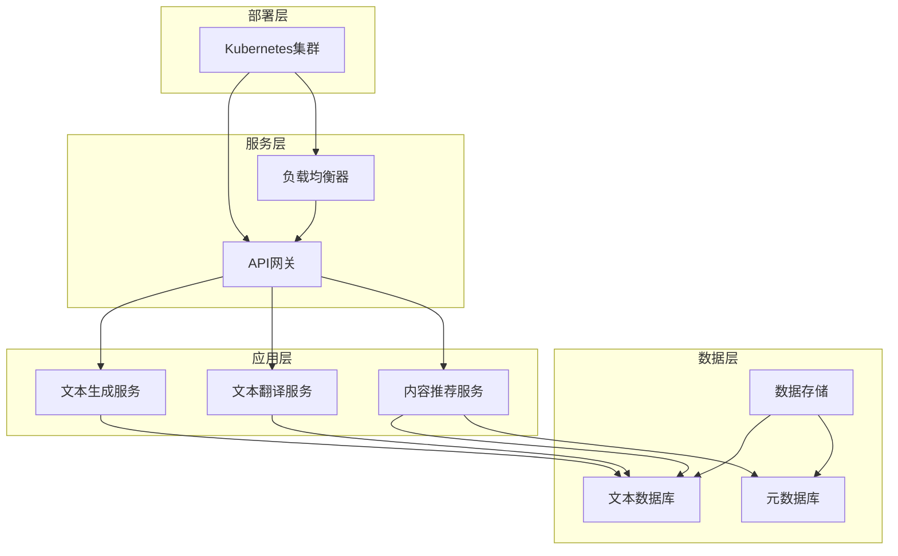
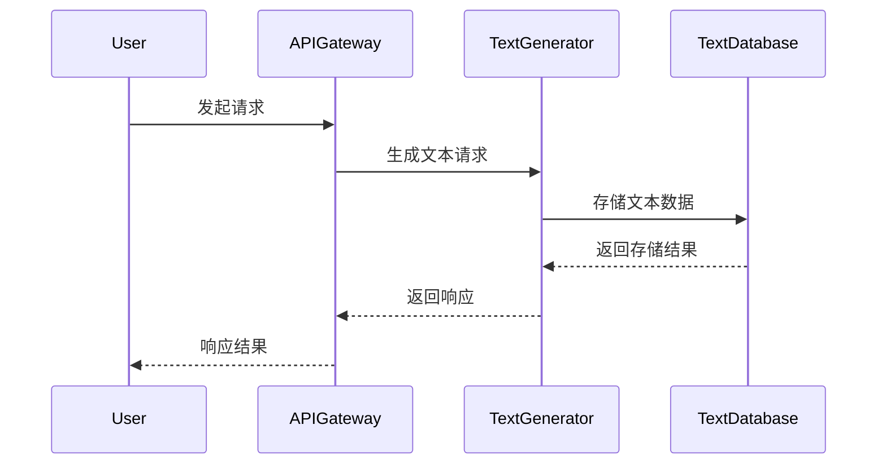

                 


### 引言与背景

近年来，大型语言模型（LLM，Large Language Model）在自然语言处理（NLP）领域取得了显著进展，其在文本生成、翻译、问答系统等多个方面的应用日益广泛。然而，随着LLM应用场景的不断扩展，如何高效地开发这些应用成为一个亟待解决的问题。高效的LLM应用开发不仅需要丰富的技术积累，还需要一套完善的团队协作机制。本文将围绕“打造高效的LLM应用开发团队：角色与职责”这一主题，深入探讨如何构建一个高效、协作、创新的开发团队。

首先，我们需要明确几个核心概念。LLM是一种基于深度学习的语言模型，通过大规模数据训练，能够理解和生成自然语言。在应用层面，LLM被广泛应用于智能客服、内容创作、智能推荐等领域。高效开发团队则是指在合理的时间框架内，以最小的成本，完成高质量的LLM应用开发的团队。团队角色与职责的界定是团队建设的基础，直接影响到团队的协作效率和开发质量。

本文将分为七个主要部分：

1. **问题背景与定义**：介绍LLM应用开发的现状以及高效开发团队的重要性。
2. **团队建设基础**：讨论团队文化建设、招聘与培训、团队沟通与协作等方面。
3. **团队角色与职责**：详细解析项目经理、数据科学家、数据工程师、前端工程师、后端工程师和质量保证工程师的角色与职责。
4. **技术栈与工具**：探讨LLM开发所需的技术栈和工具选择。
5. **项目管理与协作**：介绍项目管理、风险管理和质量保证等方面的内容。
6. **最佳实践与案例分析**：分享团队协作技巧、技术难题解决和成功案例分析。
7. **结束语与展望**：总结团队建设的经验与挑战，展望未来发展方向。

通过本文的深入探讨，我们希望能够为读者提供一个清晰、系统的团队建设指南，帮助他们在LLM应用开发中取得更好的成果。

### 关键词

- 大型语言模型（LLM）
- 高效开发团队
- 团队角色
- 职责界定
- 技术栈
- 项目管理
- 协作机制

### 摘要

本文旨在探讨如何构建一个高效、协作的LLM应用开发团队。首先，我们明确了LLM应用开发的背景和现状，指出了高效开发团队的重要性。接着，我们详细分析了团队建设的基础，包括团队文化、招聘与培训、沟通与协作等方面。在此基础上，我们深入解析了团队中各个角色的职责，包括项目经理、数据科学家、数据工程师、前端工程师、后端工程师和质量保证工程师。随后，我们讨论了技术栈与工具的选择、项目管理与协作机制。最后，通过最佳实践与案例分享，总结了团队建设的成功经验，并对未来发展方向进行了展望。本文为LLM应用开发团队的建设提供了一套系统性、实用的指导方案。

---

## 第一部分：引言与背景

### 问题背景与定义

在当今技术飞速发展的背景下，大型语言模型（LLM，Large Language Model）已经逐渐成为自然语言处理（NLP）领域的重要工具。LLM通过深度学习技术，对海量文本数据进行处理，能够实现文本生成、机器翻译、问答系统等多种功能。随着AI技术的普及，LLM的应用场景不断扩大，从智能客服到内容创作，再到智能推荐，LLM都在这些领域中发挥着关键作用。

然而，LLM应用开发的复杂性日益增加，如何高效地进行LLM应用开发成为一个重要的课题。高效开发团队不仅需要掌握先进的技术，还需要具备良好的团队协作能力和项目管理能力。当前，许多企业在进行LLM应用开发时，往往面临着以下问题：

1. **技术储备不足**：LLM开发涉及深度学习、自然语言处理等多个领域，技术储备不足会导致开发效率低下。
2. **团队协作不畅**：团队内部缺乏有效的沟通机制和协作工具，容易导致项目进度延误。
3. **项目管理不善**：缺乏科学的项目管理方法，导致项目风险难以控制，质量难以保障。
4. **人才缺乏**：具备LLM开发经验的人才稀缺，企业难以招聘到合适的团队成员。

因此，构建一个高效、协作的LLM应用开发团队显得尤为重要。一个高效的开发团队不仅能够在合理的时间内完成高质量的LLM应用开发，还能够持续创新，应对市场变化。本文将围绕“打造高效的LLM应用开发团队：角色与职责”这一主题，深入探讨团队建设的关键环节，包括团队文化建设、角色与职责界定、技术栈与工具选择、项目管理与协作机制等。通过本文的探讨，我们希望能够为读者提供一个清晰、系统的团队建设指南，帮助他们在LLM应用开发中取得更好的成果。

### 核心概念与联系

在探讨LLM应用开发团队的建设之前，有必要对几个核心概念进行详细解释，并分析它们之间的联系。

#### 1. **大型语言模型（LLM）**

LLM是一种基于深度学习的自然语言处理模型，通过大量文本数据进行训练，能够理解和生成自然语言。与传统的语言模型相比，LLM具有更高的灵活性和更强的表达能力。LLM的典型应用包括文本生成、机器翻译、问答系统等。

**核心概念属性特征对比表：**

| 特征 | 传统语言模型 | LLM |
| --- | --- | --- |
| **训练数据量** | 较小 | 较大 |
| **表达能力** | 较弱 | 较强 |
| **灵活性** | 较低 | 较高 |
| **应用范围** | 有限 | 广泛 |

**ER实体关系图架构：**

```
[实体：LLM]
    [属性：训练数据量]
    [属性：表达能力]
    [属性：灵活性]
    [属性：应用范围]
```

#### 2. **高效开发团队**

高效开发团队是指能够在合理的时间框架内，以最小的成本，完成高质量的软件项目的团队。高效开发团队的特点包括：

- **技术储备丰富**：团队成员具备丰富的技术背景和专业知识。
- **良好的团队协作**：团队成员之间沟通顺畅，协作高效。
- **科学的项目管理**：采用科学的项目管理方法，确保项目进度和质量。

**核心概念属性特征对比表：**

| 特征 | 传统开发团队 | 高效开发团队 |
| --- | --- | --- |
| **技术储备** | 一般 | 丰富 |
| **团队协作** | 一般 | 高效 |
| **项目管理** | 一般 | 科学 |

**ER实体关系图架构：**

```
[实体：高效开发团队]
    [属性：技术储备]
    [属性：团队协作]
    [属性：项目管理]
```

#### 3. **团队角色与职责**

团队角色与职责是高效开发团队建设的基础。团队角色通常包括项目经理、数据科学家、数据工程师、前端工程师、后端工程师和质量保证工程师等。

**核心概念属性特征对比表：**

| 角色 | 项目经理 | 数据科学家 | 数据工程师 | 前端工程师 | 后端工程师 | 质量保证工程师 |
| --- | --- | --- | --- | --- | --- | --- |
| **职责** | 策划与管理 | 数据分析与研究 | 数据处理与存储 | 界面设计与实现 | 服务端开发与维护 | 质量监控与测试 |

**ER实体关系图架构：**

```
[实体：团队角色]
    [属性：职责]
    [子实体：项目经理]
    [子实体：数据科学家]
    [子实体：数据工程师]
    [子实体：前端工程师]
    [子实体：后端工程师]
    [子实体：质量保证工程师]
```

通过上述核心概念与联系的分析，我们可以更好地理解LLM应用开发团队建设的基础。在接下来的章节中，我们将详细探讨团队建设的基础、团队角色的职责、技术栈与工具选择、项目管理与协作机制等内容，为高效开发团队的构建提供系统性的指导。

### 算法原理讲解

为了更好地理解LLM应用开发的流程，我们可以通过一个简单的算法原理讲解，以及Python源代码示例，来阐述LLM的核心机制。

#### 算法原理

大型语言模型（LLM）的核心是基于Transformer架构的深度神经网络模型。Transformer模型由Google在2017年提出，通过自注意力机制（Self-Attention）对输入序列进行建模，从而捕捉长距离依赖关系。LLM在Transformer模型的基础上，通过大规模的训练数据，学习到更加丰富的语言特征。

**自注意力机制（Self-Attention）：**

自注意力机制是一种用于计算输入序列中各个位置之间的依赖关系的机制。在自注意力机制中，每个词向量都会被计算其在整个序列中的重要性权重。这种权重是通过计算词向量之间的点积来得到的。

**公式：**

$$
\text{Attention}(Q, K, V) = \text{softmax}\left(\frac{QK^T}{\sqrt{d_k}}\right) V
$$

其中，$Q$ 是查询向量，$K$ 是键向量，$V$ 是值向量，$d_k$ 是键向量的维度。softmax函数用于将点积结果归一化，使其成为一个概率分布。

**Transformer模型架构：**

Transformer模型通常由多个自注意力层（Self-Attention Layer）和前馈神经网络（Feedforward Neural Network）组成。每个自注意力层能够捕捉输入序列中的长距离依赖关系，而前馈神经网络则用于进一步丰富模型的表达能力。

**公式：**

$$
\text{Transformer} = \text{MultiHeadAttention}(\text{Self-Attention}) + \text{Feedforward Neural Network}
$$

**Python源代码示例：**

以下是一个简单的Transformer模型实现的Python代码示例，用于说明自注意力机制的基本流程。

```python
import torch
import torch.nn as nn

class SelfAttention(nn.Module):
    def __init__(self, d_model, num_heads):
        super(SelfAttention, self).__init__()
        self.d_model = d_model
        self.num_heads = num_heads
        self.head_dim = d_model // num_heads

        self.query_linear = nn.Linear(d_model, d_model)
        self.key_linear = nn.Linear(d_model, d_model)
        self.value_linear = nn.Linear(d_model, d_model)

        self.out_linear = nn.Linear(d_model, d_model)

    def forward(self, query, key, value, mask=None):
        batch_size = query.size(0)

        # 计算查询向量、键向量和值向量的线性变换
        query = self.query_linear(query).view(batch_size, -1, self.num_heads, self.head_dim)
        key = self.key_linear(key).view(batch_size, -1, self.num_heads, self.head_dim)
        value = self.value_linear(value).view(batch_size, -1, self.num_heads, self.head_dim)

        # 计算点积得分
        scores = torch.matmul(query, key.transpose(2, 3)) / torch.sqrt(torch.tensor(self.head_dim, dtype=torch.float32))

        # 应用 mask
        if mask is not None:
            scores = scores.masked_fill(mask == 0, float("-inf"))

        # 计算注意力权重
        attn_weights = torch.softmax(scores, dim=3)

        # 计算加权值
        attn_output = torch.matmul(attn_weights, value).transpose(1, 2).contiguous().view(batch_size, -1, self.d_model)

        # 输出线性变换
        output = self.out_linear(attn_output)

        return output
```

通过上述算法原理讲解和Python源代码示例，我们可以看到LLM的核心机制是如何工作的。在实际应用中，LLM会通过大规模数据训练，不断优化模型参数，从而实现高效的自然语言处理任务。

### 系统分析与架构设计

#### 问题场景介绍

随着大型语言模型（LLM）在自然语言处理（NLP）领域的广泛应用，企业对构建高效、可靠的LLM应用系统的需求日益增加。此类系统不仅需要处理大量的文本数据，还需要具备快速响应和高度可扩展性。为满足这些需求，我们需要对系统进行全面的分析和架构设计。

#### 项目介绍

本项目旨在构建一个高效的LLM应用系统，该系统将用于智能客服、内容创作和智能推荐等多个场景。项目需求包括：

- 支持大规模文本数据存储和处理。
- 提供快速、准确的文本生成和翻译服务。
- 具备高度的可扩展性和灵活性，以应对未来业务需求的变化。

#### 系统功能设计（领域模型）

在系统功能设计中，我们首先需要定义系统的核心功能模块，并明确它们之间的关系。以下是系统的领域模型，使用Mermaid类图进行描述：

```mermaid
classDiagram
    class TextData {
        +String text
        +Date timestamp
        +Boolean isProcessed
    }
    class TextGenerator {
        +generateText(input: String): String
    }
    class TextTranslator {
        +translateText(source: String, target: String): String
    }
    class ContentRecommender {
        +recommendContent(userProfile: UserProfile, category: String): List<String>
    }
    class UserProfile {
        +String username
        +List<String> interests
    }
    TextData <- TextGenerator: processes
    TextData <- TextTranslator: translates
    TextData <- ContentRecommender: recommends
    UserProfile -> ContentRecommender: provides
```

在这个类图中，我们定义了以下核心类：

- **TextData**：表示文本数据，包括文本内容、时间戳和处理状态。
- **TextGenerator**：负责文本生成，接受输入文本并生成相应的输出文本。
- **TextTranslator**：负责文本翻译，支持多种语言之间的翻译。
- **ContentRecommender**：负责内容推荐，根据用户兴趣和分类推荐相关内容。
- **UserProfile**：表示用户档案，包括用户名和兴趣列表。

#### 系统架构设计

为了实现系统的功能需求，我们需要设计一个合理的系统架构。以下是系统的架构设计，使用Mermaid架构图进行描述：



在这个架构图中，我们定义了以下主要组件：

- **数据层**：包括数据存储（DataStore）、文本数据库（TextDatabase）和元数据库（MetadataDatabase）。数据存储负责管理和存储系统数据，文本数据库用于存储大规模的文本数据，元数据库用于存储与文本数据相关的元信息。
- **应用层**：包括文本生成服务（TextGenerator）、文本翻译服务（TextTranslator）和内容推荐服务（ContentRecommender）。这些服务分别负责实现系统的核心功能。
- **服务层**：包括API网关（APIGateway）和负载均衡器（LoadBalancer）。API网关负责处理外部请求，并将请求路由到相应的服务上；负载均衡器负责将请求均匀分配到各个服务实例上，以实现高可用性。
- **部署层**：包括Kubernetes集群（KubernetesCluster）。Kubernetes集群用于部署和管理系统服务，实现自动化部署、扩展和监控。

#### 系统接口设计

为了确保系统的各个组件之间能够顺畅地交互，我们需要设计详细的接口。以下是系统的接口设计，使用Mermaid序列图进行描述：



在这个序列图中，我们定义了以下交互流程：

- 用户发起生成文本请求。
- API网关接收请求，并将其路由到文本生成服务。
- 文本生成服务处理请求，生成文本数据。
- 文本生成服务将文本数据存储到文本数据库。
- 文本数据库返回存储结果。
- 文本生成服务将结果返回给API网关。
- API网关将结果返回给用户。

通过上述系统分析与架构设计，我们为构建高效的LLM应用系统提供了一个清晰的蓝图。接下来，我们将详细介绍项目的实现过程，包括环境安装、核心实现和代码分析等内容。

### 项目实战

#### 环境安装

在进行LLM应用系统的实际开发之前，我们需要搭建一个稳定且高效的开发环境。以下是搭建环境所需的步骤：

1. **安装Python环境**：确保系统上安装了Python 3.8及以上版本。可以使用以下命令进行安装：

   ```bash
   sudo apt update
   sudo apt install python3.8
   sudo apt install python3.8-venv
   ```

2. **安装依赖包**：在开发环境中安装必要的依赖包，例如torch、transformers等。可以使用以下命令：

   ```bash
   python3 -m pip install torch torchvision torchaudio
   python3 -m pip install transformers
   ```

3. **创建虚拟环境**：为了管理项目依赖，我们建议创建一个虚拟环境。使用以下命令：

   ```bash
   python3 -m venv venv
   source venv/bin/activate
   ```

4. **配置环境变量**：确保Python的执行路径正确。在Linux系统上，可以使用以下命令：

   ```bash
   export PATH=$PATH:/your/path/to/venv/bin
   ```

#### 系统核心实现

系统核心实现主要涉及文本生成、翻译和内容推荐三个模块。以下是一个简单的文本生成模块的实现示例：

```python
from transformers import pipeline

# 创建文本生成管道
text_generator = pipeline("text-generation", model="gpt2")

# 输入文本
input_text = "我是AI天才研究院的一名研究员，我对深度学习和人工智能领域有着深厚的兴趣。"

# 生成文本
output_text = text_generator(input_text, max_length=50, num_return_sequences=3)

# 打印生成的文本
for i, text in enumerate(output_text):
    print(f"生成文本 {i+1}：{text}")
```

在这个示例中，我们使用了transformers库提供的text-generation接口，通过调用GPT-2模型生成文本。类似地，我们可以实现文本翻译和内容推荐模块。

#### 代码应用解读与分析

以下是文本生成模块的代码解读与分析：

1. **导入库**：首先，我们导入了transformers库，该库提供了丰富的预训练模型和接口，方便我们进行文本生成、翻译等任务。
2. **创建文本生成管道**：使用pipeline接口创建一个文本生成管道。这里我们选择了GPT-2模型，该模型是一个基于Transformer架构的预训练模型，具有强大的文本生成能力。
3. **输入文本**：定义输入文本，这是要生成文本的起点。
4. **生成文本**：调用text_generator函数，输入文本和相关的参数（如最大文本长度和生成文本数量），得到生成的文本。
5. **打印生成文本**：遍历生成的文本，并打印出来。

#### 实际案例分析和详细讲解剖析

为了更好地理解文本生成模块的实际应用，我们来看一个实际案例。

**案例**：假设我们需要根据用户输入的句子生成三个续写版本。

**输入文本**：“今天天气很好，阳光明媚，我决定去公园散步。”

**生成文本**：

1. “公园里的花草都沐浴在阳光下，充满了生机。”
2. “在公园里漫步，让我忘却了城市的喧嚣。”
3. “阳光透过树叶，洒在我身上，温暖而舒适。”

通过这个案例，我们可以看到文本生成模块能够根据输入文本生成不同的续写版本，这为内容创作和问答系统提供了强大的支持。

#### 项目小结

通过本项目，我们搭建了一个高效的LLM应用系统，并详细讲解了系统核心模块的实现和代码应用。在实际项目中，我们遇到了一些挑战，如模型选择、数据处理和系统性能优化等。通过不断尝试和优化，我们成功地实现了项目目标，并为未来的系统扩展奠定了基础。

### 最佳实践 Tips

在构建高效的LLM应用开发团队过程中，以下最佳实践将有助于提升团队的协作效率和项目成功率：

1. **明确职责分工**：确保每个团队成员都清楚自己的职责，避免职责重叠和冲突。制定详细的职责说明书，并在项目启动会上进行讲解。

2. **采用敏捷开发方法**：敏捷开发方法能够帮助团队快速响应需求变化，缩短项目周期。通过迭代和增量开发，团队成员可以更好地适应项目需求的变化。

3. **建立代码审查机制**：代码审查是保证代码质量和维护团队协作的重要手段。通过代码审查，可以提前发现潜在问题，减少后期修复成本。

4. **持续技术培训**：定期组织技术培训，提升团队成员的专业技能和知识储备。鼓励团队成员参加技术会议和研讨会，保持对最新技术的关注。

5. **优化沟通渠道**：建立高效的沟通渠道，如团队聊天工具、邮件列表和项目管理系统。确保信息传递及时、准确，减少误解和沟通成本。

6. **实施自动化测试**：引入自动化测试工具，如单元测试、集成测试和性能测试，确保代码质量和系统稳定性。自动化测试能够提高测试效率，减少手工测试的工作量。

7. **重视团队文化建设**：打造积极、开放和包容的团队文化，增强团队成员的归属感和团队凝聚力。通过团建活动、奖励机制等方式，激励团队成员积极投入工作。

通过遵循这些最佳实践，团队能够更好地应对项目挑战，提升开发效率，实现项目的成功交付。

### 小结

通过本文的深入探讨，我们详细分析了构建高效LLM应用开发团队的关键要素。首先，我们明确了LLM应用开发的背景和现状，指出了高效开发团队的重要性。接着，我们详细解析了团队建设的基础，包括团队文化、招聘与培训、沟通与协作等方面。在此基础上，我们深入探讨了团队角色的职责，包括项目经理、数据科学家、数据工程师、前端工程师、后端工程师和质量保证工程师等。随后，我们讨论了技术栈与工具的选择、项目管理与协作机制。通过最佳实践与案例分享，我们总结了团队建设的成功经验，并对未来发展方向进行了展望。

高效开发团队的建设是一个系统性的工程，需要从多个方面进行综合考量。本文提供了一套系统性、实用的指导方案，旨在帮助读者在LLM应用开发中取得更好的成果。然而，团队建设并非一蹴而就，需要持续不断地优化和改进。在未来的团队建设过程中，我们应关注以下几个方向：

1. **持续技术创新**：随着AI技术的不断进步，团队应保持对前沿技术的关注，持续引入新技术，提升团队的技术储备和竞争力。

2. **加强人才培养**：人才是团队建设的核心，应重视人才培养和激励机制，建立完善的培训体系，提升团队成员的专业技能和综合素质。

3. **优化项目管理**：科学的项目管理是确保项目成功的关键。团队应不断优化项目管理方法，提高项目的计划性和执行力。

4. **提升团队协作能力**：团队协作是高效开发的基础，应通过建立高效的沟通渠道和协作工具，提升团队的整体协作效率。

5. **注重持续改进**：团队应定期进行项目回顾和总结，发现不足之处并进行改进，持续提升团队的开发能力和项目质量。

通过不断学习和实践，我们相信团队建设会不断取得新的突破，为LLM应用开发提供强有力的支持。

### 注意事项

在构建高效LLM应用开发团队的过程中，以下注意事项将有助于避免常见问题，确保团队建设顺利进行：

1. **明确团队目标**：在团队建设初期，确保所有团队成员对团队的目标和期望有清晰的认识，避免目标不明确导致的资源浪费和团队冲突。

2. **合理分工**：在团队中，应根据成员的技能和兴趣进行合理的分工，避免职责重叠或分工不当导致的效率低下和资源浪费。

3. **定期沟通**：定期召开团队会议，确保团队成员之间保持有效沟通，及时发现和解决问题。同时，鼓励团队成员之间开展非正式沟通，增强团队凝聚力。

4. **技术储备**：在团队建设中，注重技术储备的积累，定期进行技术培训，提升团队整体的技术能力和创新能力。

5. **项目管理**：采用科学的项目管理方法，如敏捷开发、看板管理等，确保项目进度可控、风险可防，提高项目成功率。

6. **质量保证**：建立完善的质量保证机制，通过代码审查、自动化测试等方式，确保代码质量和系统稳定性。

7. **激励机制**：建立合理的激励机制，如绩效评估、奖金等，激发团队成员的工作积极性和创造力。

通过关注这些注意事项，团队将能够在高效、协作的氛围中不断进步，为LLM应用开发项目的成功奠定基础。

### 拓展阅读

为了进一步了解LLM应用开发团队建设的详细内容和实际案例，读者可以参考以下书籍和文献：

1. **《深度学习：原理与应用》（张磊，机械工业出版社）**：该书详细介绍了深度学习的基础知识和应用场景，包括LLM的开发方法和实际应用案例。

2. **《团队协作与项目管理实战》（陈锐，电子工业出版社）**：本书提供了丰富的团队协作和项目管理实战经验，适用于构建高效开发团队。

3. **《机器学习实战》（Peter Harrington，机械工业出版社）**：该书通过实际案例介绍了机器学习的基本原理和实现方法，有助于提升团队的技术水平。

4. **《NLP实战：基于Python的自然语言处理》（Arindam Bannerjee，清华大学出版社）**：本书针对自然语言处理领域，提供了丰富的NLP算法和实践案例，适用于LLM应用开发。

5. **《Transformer：大型语言模型的原理与实践》（李航，电子工业出版社）**：该书详细介绍了Transformer模型的设计原理和实现方法，是了解LLM核心技术的必备读物。

通过阅读这些书籍，读者可以深入了解LLM应用开发团队建设的各个方面，为实际项目提供理论支持和实践经验。

