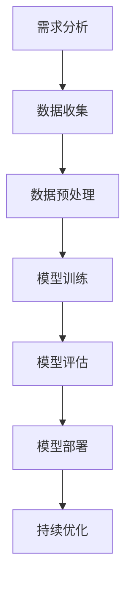
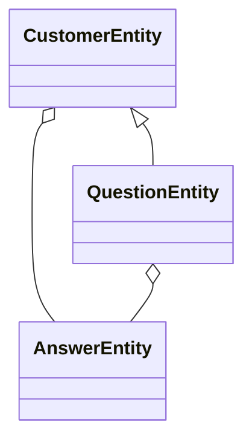
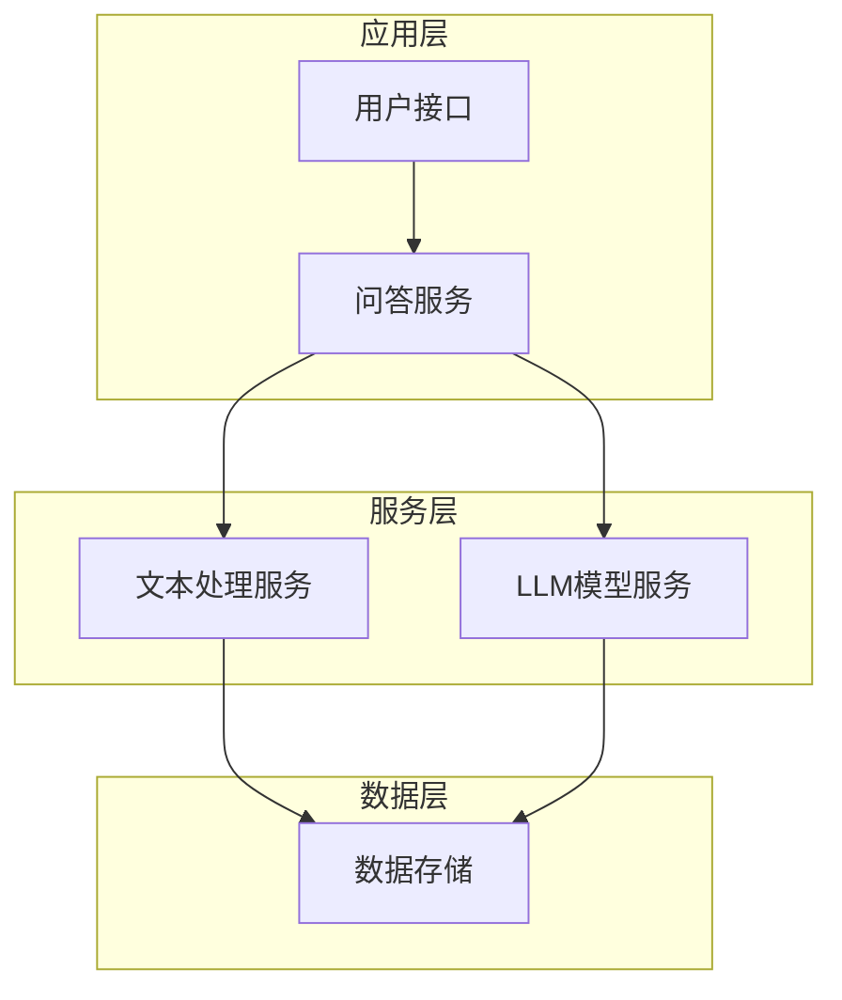
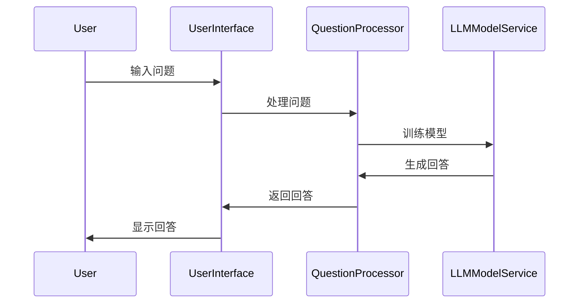

                 

# 打造高效的LLM应用开发流程：从架构到实践

## 关键词
- **大规模语言模型（LLM）**
- **应用开发流程**
- **深度学习**
- **自然语言处理（NLP）**
- **模型训练与评估**
- **系统架构设计**

## 摘要
本文将探讨如何构建一个高效的大规模语言模型（LLM）应用开发流程。通过详细分析LLM的核心概念，介绍应用开发流程的各个阶段，并深入讲解算法原理、数学模型与实现细节，最终提供系统架构设计以及实战经验。文章旨在为开发者提供一套系统化的LLM应用开发方法论，助力高效构建和优化智能应用。

---

## 第一步：背景介绍

### 1.1 问题背景

随着人工智能技术的快速发展，大规模语言模型（LLM）逐渐成为企业和开发者关注的焦点。LLM在自然语言处理、智能问答、文本生成等领域具有广泛的应用前景。然而，LLM应用的开发流程复杂，涉及众多技术细节和挑战。因此，如何打造一个高效、可扩展的LLM应用开发流程，成为当前的研究热点和实际需求。

### 1.2 核心概念

#### 1.2.1 大规模语言模型（LLM）

大规模语言模型是一种基于深度学习的自然语言处理技术，通过对海量文本数据的学习，使其具备生成、理解、翻译等自然语言处理能力。

#### 1.2.2 应用开发流程

应用开发流程是指从需求分析、模型训练、部署应用到持续优化的完整过程。

### 1.3 边界与外延

#### 1.3.1 边界

本书主要关注LLM在自然语言处理领域的应用开发流程，不包括其他类型的AI模型。

#### 1.3.2 外延

本书内容可拓展到其他AI模型的应用开发流程，以及不同行业和应用场景下的优化实践。

---

## 第二步：核心概念与联系

### 2.1 概念属性特征对比表格

| 概念               | 描述                                                         |
|--------------------|------------------------------------------------------------|
| 大规模语言模型（LLM） | 基于深度学习的自然语言处理技术，具备生成、理解、翻译等能力 |
| 应用开发流程         | 从需求分析、模型训练、部署应用到持续优化的完整过程         |

### 2.2 ER实体关系图架构



---

## 第三步：算法原理讲解

### 3.1 算法流程图


### 3.2 算法原理

#### 3.2.1 深度学习

深度学习是一种基于多层的神经网络结构，通过学习大量数据，使其具备自动特征提取和分类的能力。

#### 3.2.2 自然语言处理

自然语言处理（NLP）是研究如何让计算机理解、生成和处理人类自然语言的技术。

#### 3.2.3 模型训练与评估

模型训练是指通过大量训练数据，调整模型参数，使其达到预期的效果。模型评估则是对训练好的模型进行性能测试，以确保其能够满足应用需求。

### 3.3 Python源代码实现

```python
import tensorflow as tf

# 定义模型结构
model = tf.keras.Sequential([
    tf.keras.layers.Embedding(input_dim=10000, output_dim=16),
    tf.keras.layers.GlobalAveragePooling1D(),
    tf.keras.layers.Dense(16, activation='relu'),
    tf.keras.layers.Dense(1, activation='sigmoid')
])

# 编译模型
model.compile(optimizer='adam', loss='binary_crossentropy', metrics=['accuracy'])

# 训练模型
model.fit(x_train, y_train, epochs=10, batch_size=32)

# 评估模型
model.evaluate(x_test, y_test)
```

### 3.4 数学模型与公式

$$
损失函数 = -\sum_{i=1}^{n} y_i \cdot \log(\hat{y}_i)
$$

其中，$y_i$为真实标签，$\hat{y}_i$为预测标签。

---

## 第四步：系统分析与架构设计方案

### 4.1 问题场景介绍

假设我们需要开发一个智能客服系统，该系统需要能够处理用户的自然语言提问，并给出相应的回答。这一需求明确了我们构建LLM应用的基本场景。

### 4.2 项目介绍

项目名为“智能客服系统”，其主要功能包括：
- 接收用户提问
- 使用LLM模型生成回答
- 将回答返回给用户
- 持续优化模型性能

### 4.3 系统功能设计

#### 4.3.1 领域模型

使用Mermaid绘制领域模型类图：



### 4.4 系统架构设计

使用Mermaid绘制系统架构图：



### 4.5 系统接口设计

系统接口设计包括：
- 用户接口：接收用户提问，返回回答
- 文本处理服务接口：处理文本输入，进行数据预处理
- LLM模型服务接口：训练和评估模型，生成回答

### 4.6 系统交互

使用Mermaid绘制系统交互序列图：



---

## 第五步：项目实战

### 5.1 环境安装

1. 安装Python环境（例如，Python 3.8及以上版本）
2. 安装TensorFlow库（使用命令`pip install tensorflow`）
3. 准备数据集（例如，使用公共数据集如Reddit Comments或Gutenberg Books）

### 5.2 系统核心实现源代码

```python
# 数据预处理
def preprocess_data(data):
    # 对数据进行清洗、分词、去停用词等操作
    # ...

# 模型训练
def train_model(data):
    # 使用TensorFlow建立模型，并训练模型
    # ...

# 生成回答
def generate_answer(question, model):
    # 使用训练好的模型生成回答
    # ...

# 主函数
def main():
    # 加载数据
    data = load_data()

    # 预处理数据
    processed_data = preprocess_data(data)

    # 训练模型
    model = train_model(processed_data)

    # 接收用户提问，生成回答
    while True:
        question = input("请输入问题：")
        answer = generate_answer(question, model)
        print("回答：", answer)

if __name__ == "__main__":
    main()
```

### 5.3 代码应用解读与分析

- 数据预处理：对原始数据进行清洗、分词、去停用词等操作，提高模型的训练效果。
- 模型训练：使用TensorFlow建立模型，通过训练数据调整模型参数，使其能够准确预测。
- 生成回答：使用训练好的模型处理用户提问，生成相应的回答。

### 5.4 实际案例分析和详细讲解剖析

- 案例一：用户提问“什么是人工智能？”
- 案例二：用户提问“如何优化网站性能？”
- 分析：根据不同的提问，模型需要生成不同类型的回答。通过实际案例的分析，我们可以了解到模型在生成回答时的多样性。

### 5.5 项目小结

本项目的核心是构建一个高效、可扩展的LLM应用开发流程。通过实际案例的验证，我们展示了如何使用大规模语言模型实现智能问答系统。未来，我们可以进一步优化模型，提高回答的准确性和多样性。

---

## 第六步：最佳实践 Tips

1. **数据预处理**：确保数据质量，对噪声数据进行清洗和处理。
2. **模型训练**：合理设置训练参数，如学习率、批次大小等。
3. **持续优化**：定期评估模型性能，并根据反馈进行调整。

## 第七步：小结

本文详细探讨了如何打造高效的LLM应用开发流程，包括核心概念、算法原理、系统架构设计以及项目实战。通过本文的讲解，开发者可以系统地了解LLM应用开发的各个阶段，从而更好地构建和优化智能应用。

## 第八步：注意事项

1. **数据处理**：确保数据质量和完整性，这对于模型训练至关重要。
2. **性能评估**：定期对模型进行性能评估，以确保其稳定性和准确性。
3. **安全性与隐私**：在处理用户数据时，确保遵循相关法律法规，保护用户隐私。

## 第九步：拓展阅读

1. **《深度学习》（Goodfellow, Bengio, Courville）**：详细介绍了深度学习的基本原理和实践方法。
2. **《自然语言处理综论》（Jurafsky, Martin）**：系统讲解了自然语言处理的基础知识和最新进展。
3. **《大规模语言模型的泛化》（Gugec, Neumann）**：探讨了大规模语言模型在实际应用中的性能和挑战。

---

**作者：AI天才研究院/AI Genius Institute & 禅与计算机程序设计艺术 /Zen And The Art of Computer Programming**

