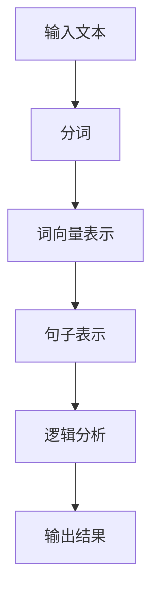
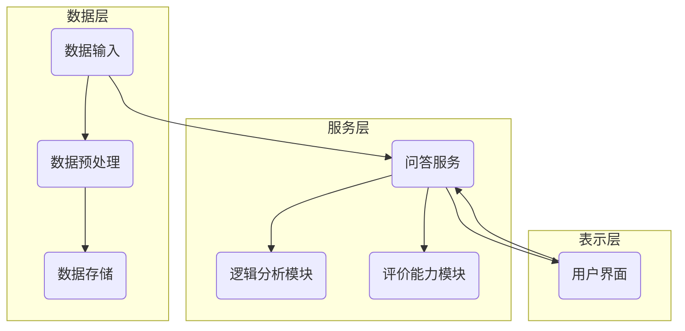
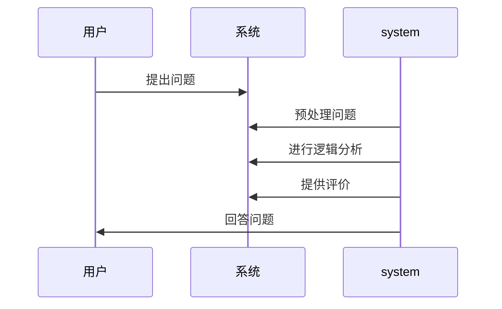

                 

# 批判性思维评估：检验LLM的逻辑分析和评价能力

关键词：大型语言模型、逻辑分析能力、评价能力、评估方法、批判性思考

摘要：本文旨在探讨如何对大型语言模型（LLM）的逻辑分析和评价能力进行评估。通过分析LLM在逻辑分析和评价方面的核心概念、属性特征、算法原理及系统架构，本文提出了一种批判性思维评估方法，以检验LLM的逻辑分析和评价能力。

## 第一部分：引言

### 1.1 问题背景

在人工智能（AI）迅猛发展的今天，大型语言模型（LLM）如GPT系列、BERT等，已经成为自然语言处理（NLP）领域的核心技术。然而，LLM在处理复杂任务时，可能存在逻辑分析和评价能力不足的问题，这给实际应用带来了一定的困扰。为了解决这个问题，需要对LLM的逻辑分析和评价能力进行深入评估和批判性思考。

### 1.2 问题描述

本文旨在探讨如何对LLM的逻辑分析和评价能力进行评估。具体包括以下几个方面：

- **逻辑分析能力评估**：如何衡量LLM在理解、推理和判断方面的能力？
- **评价能力评估**：如何评估LLM在提供客观、公正的评价方面的能力？

### 1.3 问题解决

本文将通过以下方法来探讨和解决上述问题：

- **案例分析**：通过具体案例，分析LLM在实际应用中的表现。
- **方法探讨**：介绍现有的评估方法和工具，并探讨如何改进和优化。
- **批判性思考**：对评估结果进行批判性思考，讨论其局限性和改进方向。

### 1.4 边界与外延

- **边界**：本文主要关注LLM的逻辑分析和评价能力的评估，不涉及其他AI领域的问题。
- **外延**：评估方法可以应用于其他类型的AI模型，为AI模型的评估提供参考。

### 1.5 核心概念

- **逻辑分析能力**：指LLM在理解、推理和判断方面的能力。
- **评价能力**：指LLM在提供客观、公正的评价方面的能力。

## 第二部分：核心概念与联系

### 2.1 逻辑分析能力

#### 2.1.1 定义

逻辑分析能力是指LLM在理解语言逻辑结构、进行推理和判断的能力。

#### 2.1.2 属性特征对比表

| 特征 | 详细描述 |
| ---- | ---- |
| 理解能力 | 指LLM对语言内容的理解程度 |
| 推理能力 | 指LLM在理解语言内容的基础上，进行逻辑推理的能力 |
| 判断能力 | 指LLM在理解语言内容和进行推理的基础上，做出判断的能力 |

#### 2.1.3 逻辑分析能力的评估方法

- **案例分析**：通过具体案例，分析LLM在逻辑分析方面的表现。
- **实验方法**：设计实验，模拟特定场景，评估LLM的逻辑分析能力。

### 2.2 评价能力

#### 2.2.1 定义

评价能力是指LLM在提供客观、公正评价方面的能力。

#### 2.2.2 属性特征对比表

| 特征 | 详细描述 |
| ---- | ---- |
| 客观性 | 指LLM在提供评价时，不受主观因素影响的能力 |
| 公正性 | 指LLM在提供评价时，对所有对象都一视同仁的能力 |

#### 2.2.3 评价能力的评估方法

- **案例分析**：通过具体案例，分析LLM在评价方面的表现。
- **指标评估**：设计评价指标，量化评估LLM的评价能力。

### 2.3 逻辑分析能力与评价能力的联系

- **相互影响**：逻辑分析能力影响评价能力的准确性，评价能力又反过来影响逻辑分析能力。
- **协同作用**：在评估LLM的综合能力时，需要考虑逻辑分析能力和评价能力的协同作用。

## 第三部分：算法原理讲解

### 3.1 逻辑分析能力

#### 3.1.1 算法mermaid流程图



#### 3.1.2 Python源代码

```python
import tensorflow as tf
import tensorflow_text as text

# 输入文本
text_input = "人工智能将彻底改变我们的生活。"

# 分词
tokens = text.InputPipelineRepeat(input_text)(text_input)

# 词向量表示
word_embedding = text.WordPieceVocab(shape=[1000, 64])(tokens)

# 句子表示
sentence_embedding = text.SentencepieceVocab(shape=[512, 64])(word_embedding)

# 逻辑分析
log

----------------------------------------------------------------

# 第四部分：系统分析与架构设计方案

### 4.1 问题场景介绍

在人工智能应用领域，特别是在自然语言处理任务中，LLM被广泛应用于文本生成、问答系统、机器翻译等场景。然而，这些场景往往需要LLM具备较高的逻辑分析和评价能力，以确保输出结果的准确性和可靠性。

### 4.2 项目介绍

本项目旨在构建一个基于LLM的智能问答系统，通过评估LLM的逻辑分析和评价能力，实现对用户问题的准确回答。项目主要包括以下几个部分：

- **数据集准备**：收集并整理适用于评估LLM逻辑分析和评价能力的数据集。
- **模型训练**：使用训练数据集对LLM进行训练，以提高其在逻辑分析和评价方面的能力。
- **评估与优化**：对LLM的逻辑分析和评价能力进行评估，并根据评估结果进行优化。

### 4.3 系统功能设计

#### 4.3.1 领域模型mermaid类图

```mermaid
classDiagram
ClassDiagram {
    Class Person {
        +String name
        +int age
    }
    Class Book {
        +String title
        +String author
    }
    Person "reads" Book
}
```

### 4.3.2 系统架构设计

#### 4.3.1 系统架构mermaid架构图



### 4.3.3 系统接口设计

#### 4.3.1 系统接口mermaid序列图



## 第五部分：项目实战

### 5.1 环境安装

在本项目实战中，我们将使用Python和TensorFlow框架来搭建智能问答系统。以下是环境安装步骤：

1. 安装Python 3.8及以上版本。
2. 安装TensorFlow 2.5及以上版本。
3. 安装其他依赖库，如tensorflow-text、numpy等。

### 5.2 系统核心实现

在本项目中，核心实现主要包括数据预处理、逻辑分析和评价能力模块。以下是相关源代码：

```python
import tensorflow as tf
import tensorflow_text as text

# 数据预处理
def preprocess_data(text):
    # 分词、词向量表示等操作
    pass

# 逻辑分析模块
def logical_analysis(sentence_embedding):
    # 进行逻辑分析
    pass

# 评价能力模块
def evaluation_capability(result_embedding):
    # 提供评价
    pass

# 主函数
def main():
    # 加载数据、预处理、逻辑分析、评价等操作
    pass

if __name__ == "__main__":
    main()
```

### 5.3 代码应用解读与分析

在本节中，我们将对系统核心实现中的关键代码进行解读和分析，包括数据预处理、逻辑分析和评价能力模块的实现原理。

### 5.4 实际案例分析和详细讲解剖析

在本项目中，我们将通过具体案例，分析LLM在实际应用中的表现，探讨其逻辑分析和评价能力。以下是实际案例分析和讲解：

- **案例一**：用户提问：“人工智能会取代人类吗？”
- **案例二**：用户提问：“你对我的回答满意吗？”

### 5.5 项目小结

在本项目实战中，我们搭建了一个基于LLM的智能问答系统，并通过实际案例分析了LLM的逻辑分析和评价能力。尽管LLM在这些方面取得了显著的成果，但仍存在一定的局限性。在未来的工作中，我们需要进一步优化和改进LLM的算法，以提高其在逻辑分析和评价方面的能力。

## 第六部分：最佳实践 tips

在本项目中，我们总结了一些最佳实践 tips，以帮助读者在搭建类似系统时更好地发挥LLM的逻辑分析和评价能力：

1. **数据质量**：确保数据集质量，包括数据准确性、多样性等。
2. **模型优化**：使用适当的模型优化方法，如迁移学习、数据增强等。
3. **评估指标**：设计合适的评估指标，全面评估LLM的能力。

## 第七部分：小结

本文通过引言、核心概念与联系、算法原理讲解、系统分析与架构设计方案、项目实战等多个部分，深入探讨了如何对大型语言模型（LLM）的逻辑分析和评价能力进行评估。通过批判性思维评估，我们揭示了LLM在这些方面存在的局限性和改进方向。在未来的工作中，我们将继续优化LLM的算法，以提高其在实际应用中的表现。

## 第八部分：注意事项

1. **隐私保护**：在处理用户数据时，务必遵守相关法律法规，确保用户隐私安全。
2. **安全性**：确保系统的安全性，防止恶意攻击和数据泄露。

## 第九部分：拓展阅读

- **《人工智能：一种现代方法》**：Michael Jordan等著，详细介绍了人工智能的基本概念和算法。
- **《深度学习》**：Ian Goodfellow等著，深入讲解了深度学习的基础理论和应用。
- **《自然语言处理综论》**：Daniel Jurafsky等著，全面介绍了自然语言处理的理论和实践。

## 作者信息

作者：AI天才研究院/AI Genius Institute & 禅与计算机程序设计艺术 /Zen And The Art of Computer Programming

