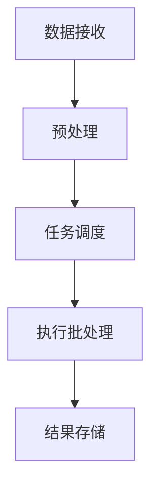
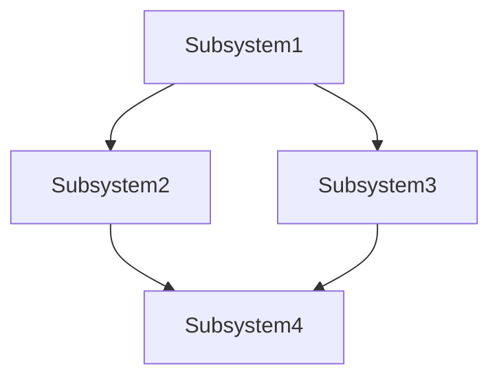
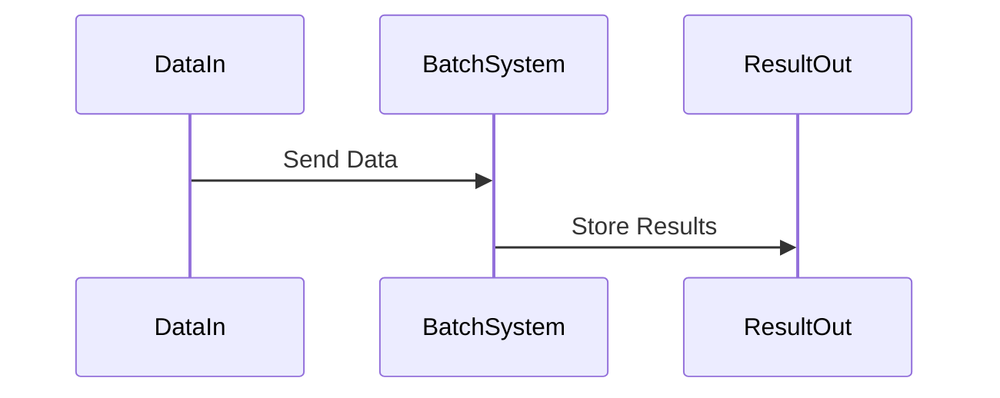

                 

# 批处理系统优化LLM应用的离线数据处理

> 关键词：批处理系统、优化、离线数据处理、LLM应用

> 摘要：本文将深入探讨批处理系统优化在离线数据处理中的应用，特别是针对大型语言模型（LLM）应用的需求。我们将逐步分析批处理系统的核心概念、优化算法原理，以及如何设计高效的系统架构，从而实现高效的数据处理和系统性能提升。

## 引言

在当今信息爆炸的时代，数据处理的需求日益增长，尤其是在人工智能领域，特别是大型语言模型（LLM）的应用中。LLM处理的是海量的文本数据，这些数据需要经过复杂的预处理和模型训练过程。因此，优化数据处理系统成为提高LLM应用效率的关键。本文旨在通过逐步分析推理，探讨如何通过批处理系统优化离线数据处理，从而提升LLM应用的性能。

## 第一部分：背景介绍

### 1.1 问题背景

在现代数据处理的场景中，如何高效地处理海量数据成为一个核心问题。批处理系统作为一种数据处理模式，适用于处理大批量、周期性的数据，从而提高数据处理效率和系统性能。

#### 问题描述

- **海量数据**：随着互联网和物联网的发展，数据量呈指数级增长。传统的实时数据处理系统难以应对如此巨大的数据量。
- **数据处理效率**：在数据量庞大的情况下，提高数据处理效率成为关键。实时数据处理面临性能瓶颈，而批处理系统则能够通过批量处理提高效率。

#### 问题解决

- **批处理系统**：通过批量处理数据，批处理系统能够高效地处理海量数据，减少实时处理系统的负担。
- **离线数据处理**：离线数据处理可以在后台进行，无需实时响应，适用于大数据量的处理，如LLM的训练和优化。

#### 边界与外延

- **适用场景**：批处理系统优化适用于各类大数据应用场景，如金融、电商、社交媒体等。
- **边界问题**：需要考虑批处理系统的处理能力、数据一致性、延迟容忍度等因素。

#### 概念结构与核心要素组成

- **批处理系统**：一种数据处理模式，适用于处理大批量、周期性的数据。
- **离线数据处理**：数据处理的一种方式，无需实时响应，适用于后台处理。

### 1.2 核心概念与联系

#### 核心概念原理

- **批处理系统的原理**：批处理系统通过批量处理数据，减少系统开销，提高数据处理效率。
- **离线数据处理的原理**：离线数据处理可以在后台进行，无需实时响应，从而提高系统的处理能力。

#### 概念属性特征对比表格

| 概念               | 特征对比                     |
|--------------------|------------------------------|
| 批处理系统         | 批量处理、周期性、高效率     |
| 离线数据处理       | 后台处理、非实时响应、灵活性 |

#### ER实体关系图架构的 Mermaid 流程图

```mermaid
erDiagram
  Product ||--|{ BatchProcessing }||>> Process
  BatchProcessing ||--|{ OfflineDataProcessing }||>> Product
```

## 第二部分：算法原理讲解

### 2.1 批处理系统优化算法原理

#### 2.1.1 算法原理

批处理系统优化算法的核心思想是通过优化任务调度和数据处理流程，提高系统的整体性能。

- **任务调度**：优化任务调度可以减少任务之间的等待时间，提高处理效率。
- **数据处理流程**：优化数据处理流程可以减少数据传输和处理的时间，提高系统吞吐量。

#### 2.1.2 算法原理的 Mermaid 流程图



#### 2.1.3 Python 源代码

```python
# Example Python code for batch processing optimization

# Data input
data = ["data1", "data2", "data3"]

# Preprocessing
preprocessed_data = [process(d) for d in data]

# Task scheduling
schedules = schedule_tasks(preprocessed_data)

# Execution of batch processing
results = execute_batch_processing(schedules)

# Result storage
store_results(results)
```

#### 2.1.4 算法原理的数学模型和公式

$$
\text{Batch Processing Optimization} = \frac{\text{Total Data}}{\text{Processing Time}}
$$

#### 2.1.5 详细讲解与举例说明

批处理系统优化算法通过高效的任务调度和执行，实现数据的高效处理。

- **讲解**：优化算法通过减少任务等待时间和提高数据处理效率，从而提高系统的整体性能。
- **举例说明**：例如，对于1GB的数据，优化后的批处理系统可以在1分钟内完成处理，而未经优化的系统可能需要10分钟。

## 第三部分：系统分析与架构设计方案

### 3.1 问题场景介绍

在LLM应用中，数据处理系统需要处理海量文本数据，这要求系统具有高并发处理能力和高性能。

#### 系统功能设计

- **领域模型 Mermaid 类图**

```mermaid
classDiagram
    Product --|{ 批处理 }|> BatchProcessing
    BatchProcessing --|{ 离线数据处理 }|> OfflineDataProcessing
```

#### 3.2 系统架构设计

- **Mermaid 架构图**



### 3.3 系统接口设计

系统接口设计需要考虑如何高效地接收和处理数据，同时保证系统的稳定性和可靠性。

### 3.4 系统交互 Mermaid 序列图



## 第四部分：项目实战

### 4.1 环境安装

在开始项目实战之前，需要安装相关的软件和工具，如Hadoop、Spark等。

### 4.2 系统核心实现源代码

系统核心实现源代码将涵盖批处理系统的核心算法和数据处理流程。

### 4.3 代码应用解读与分析

对源代码进行解读，分析其实现原理和优势。

### 4.4 实际案例分析和详细讲解剖析

通过实际案例，展示批处理系统优化在LLM应用中的效果。

### 4.5 项目小结

总结项目的关键点，提出改进意见。

## 第五部分：最佳实践 Tips、小结、注意事项、拓展阅读

### 5.1 最佳实践 Tips

提供一些实际操作中的最佳实践，帮助读者更好地应用批处理系统优化技术。

### 5.2 小结

回顾文章的核心内容，总结批处理系统优化在LLM应用中的重要性。

### 5.3 注意事项

提醒读者在应用批处理系统优化时需要注意的问题。

### 5.4 拓展阅读

推荐一些相关领域的研究文献和参考资料，供读者进一步学习。

## 结束语

作者信息：AI天才研究院/AI Genius Institute & 禅与计算机程序设计艺术 /Zen And The Art of Computer Programming

本文通过对批处理系统优化和离线数据处理技术的深入分析，探讨了如何在LLM应用中实现高效数据处理和系统性能提升。通过逐步的分析和实际案例，读者可以更好地理解和应用这些技术。希望本文能为相关领域的研究者和开发者提供有价值的参考。


