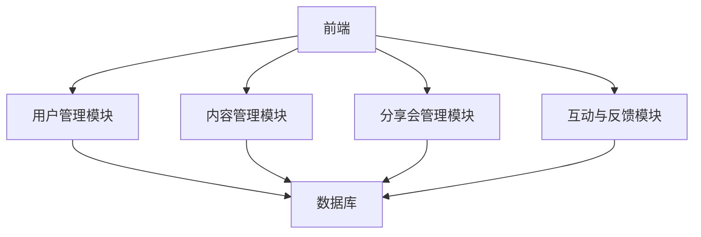
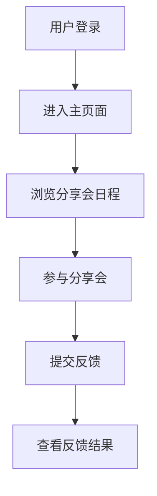

                 


### 文章标题：技术分享会：培养AI团队学习文化的方式

### 关键词：
- 技术分享会
- AI团队学习文化
- 团队建设
- 知识共享
- 互动与反馈

### 摘要：
本文旨在探讨如何通过技术分享会来培养AI团队的学习文化。我们将从背景介绍、核心要素、组织管理、培养策略和应用场景等方面，详细解析技术分享会在AI团队学习文化中的重要作用，并分享最佳实践与案例，为团队建设者提供实用的指导。

----------------------------------------------------------------

# 引言

在人工智能（AI）飞速发展的时代，AI团队的学习文化变得愈发重要。这不仅关乎团队的创新能力和竞争力，也关系到团队的整体绩效和长远发展。然而，如何培养AI团队的学习文化，如何让团队在快速变化的技术环境中保持学习的动力和效率，成为许多团队领导者面临的挑战。

技术分享会作为一种有效的学习方式，能够促进团队内部的知识共享和技能提升。通过定期举办技术分享会，团队成员可以相互学习、交流，分享各自的经验和见解，从而形成良好的学习氛围。本文将围绕技术分享会的核心要素、组织管理、培养策略和应用场景等方面，探讨如何通过技术分享会培养AI团队的学习文化。

## 目录大纲设计步骤

### 步骤1：理解用户需求和书籍主题

首先，我们需要明确用户的需求，即团队领导者希望了解如何通过技术分享会来培养团队的学习文化。同时，我们要确保书籍的主题聚焦于技术分享会在AI团队中的应用，以便为读者提供有针对性的指导。

### 步骤2：规划书籍结构

根据用户需求和主题，我们规划了以下书籍结构：

1. 引言
2. AI团队学习文化的背景与挑战
3. 技术分享会的核心要素
4. 技术分享会的组织与管理
5. AI团队学习文化的培养策略
6. 技术分享会在不同场景的应用
7. 技术分享会的最佳实践与案例
8. 总结与展望

### 步骤3：细化章节内容

在规划好书籍结构后，我们为每个章节细化了内容，确保涵盖所有相关主题。以下是章节内容的细化：

- 引言：介绍AI团队学习文化的重要性和技术分享会在团队学习中的作用。
- 第1章：AI团队学习文化的背景与挑战，介绍AI团队学习文化的定义、特征以及面临的挑战。
- 第2章：技术分享会的核心要素，详细讨论分享者、听众和内容的选择与准备。
- 第3章：技术分享会的组织与管理，讲解分享会的策划、执行、评估与反馈。
- 第4章：AI团队学习文化的培养策略，探讨建立共同愿景、促进知识共享和提升团队协作的方法。
- 第5章：技术分享会在不同场景的应用，分析企业内部、学术会议和线上与线下结合的分享会。
- 第6章：技术分享会的最佳实践与案例，分享成功案例和挑战与问题解决的经验。
- 总结与展望：重申AI团队学习文化的重要性，展望技术分享会在未来发展的趋势。

### 步骤4：确保内容完整性

为确保每个章节内容完整，我们遵循以下原则：

- 背景介绍：核心概念术语说明、问题背景、问题描述、问题解决、边界与外延、概念结构与核心要素组成。
- 核心概念与联系：必须给出核心概念原理、概念属性特征对比表格和ER实体关系图架构的Mermaid流程图。
- 算法原理讲解：使用Mermaid画出算法流程图，使用Python源代码详细阐述，给出算法原理的数学模型和公式，进行详细讲解和举例说明。
- 数学公式使用latex格式，嵌入文中独立段落的latex公式前后使用$$括起来，段落内的latex公式前后使用$括起来。
- 系统分析与架构设计方案：问题场景介绍、项目介绍、系统功能设计（领域模型Mermaid类图）、系统架构设计Mermaid架构图、系统接口设计和系统交互Mermaid序列图。
- 项目实战：环境安装、系统核心实现源代码，代码应用解读与分析，实际案例分析和详细讲解剖析，项目小结。
- 最佳实践 tips、小结、注意事项、拓展阅读等内容。

### 步骤5：编写目录大纲

根据上述步骤，我们编写了《技术分享会：培养AI团队学习文化的方式》的目录大纲，确保结构清晰、逻辑连贯，便于读者阅读和理解。

----------------------------------------------------------------

## AI团队学习文化的背景与挑战

### 1.1 AI团队学习文化的定义与特征

AI团队学习文化是指在一个AI团队中，成员之间通过不断学习和分享知识，共同提升团队整体技术水平的过程。这种文化强调团队协作、知识共享、持续学习和创新精神。

AI团队学习文化的特征主要包括以下几点：

1. **共同愿景**：团队成员具有共同的愿景和目标，这有助于提高团队的凝聚力和战斗力。
2. **知识共享**：团队内部鼓励成员分享自己的知识和经验，通过交流和学习，实现知识的传递和积累。
3. **持续学习**：团队重视成员的个人成长，鼓励他们不断学习新的技术和知识，保持团队的创新活力。
4. **互相尊重**：团队成员之间相互尊重，尊重他人的观点和意见，促进良好的沟通和合作。
5. **包容性**：团队对不同的观点和意见持开放态度，鼓励团队成员敢于表达自己的想法，共同探讨解决问题的方法。

### 1.2 AI团队面临的挑战

尽管AI团队学习文化具有诸多优势，但在实际操作中，AI团队仍然面临许多挑战：

#### 1.2.1 技术快速发展的挑战

人工智能技术发展迅速，新算法、新框架和新工具层出不穷。这使得团队在知识更新和技能提升方面面临巨大压力。团队需要不断学习新的技术，否则可能被市场淘汰。

#### 1.2.2 团队协作与沟通的挑战

AI团队通常由来自不同专业背景的成员组成，他们在思维方式和知识结构上可能存在差异。这可能导致团队在协作和沟通中产生冲突，影响团队效率。

#### 1.2.3 知识共享的挑战

知识共享是AI团队学习文化的重要特征，但在实际操作中，团队可能面临知识共享不足的问题。一些成员可能不愿意分享自己的知识和经验，担心竞争对手获取他们的成果。

#### 1.2.4 管理挑战

团队领导者需要为团队提供良好的学习环境和资源，但实际中，他们可能面临预算、时间和人力资源的限制，影响团队的学习效果。

### 1.3 技术分享会的起源与发展

技术分享会起源于学术界和开放源代码社区，它最初是作为知识传播和交流的一种方式。随着时间的推移，技术分享会逐渐应用于企业内部，成为团队提升技术水平的一种有效手段。

#### 1.3.1 技术分享会的定义

技术分享会是指团队内部或行业内，成员通过演讲、讨论、演示等形式，分享自己在技术领域的学习成果、经验和方法的活动。

#### 1.3.2 技术分享会的发展历程

1. **早期阶段**：技术分享会主要在学术界和开放源代码社区开展，形式较为简单，主要目的是知识传播和交流。
2. **发展阶段**：随着互联网的普及，技术分享会逐渐在线上举行，形式和内容也越来越多样化。
3. **成熟阶段**：现在，技术分享会已成为企业内部和行业内部提升团队技术水平的重要手段，成为团队学习文化的重要组成部分。

#### 1.3.3 技术分享会在AI领域的应用

在AI领域，技术分享会具有以下应用特点：

1. **内容专业性**：AI技术涉及多个学科，技术分享会的主题和内容通常具有较高的专业性。
2. **形式多样性**：AI技术分享会的形式包括讲座、研讨会、技术沙龙等，以满足不同成员的学习需求。
3. **互动性**：技术分享会鼓励成员之间的互动和讨论，促进知识的深入理解和掌握。

通过技术分享会，AI团队能够在以下几个方面受益：

1. **知识更新**：通过分享最新的研究成果和前沿技术，团队能够及时掌握行业动态，提高技术水平。
2. **经验交流**：团队成员可以分享自己在项目实践中的经验教训，相互借鉴，共同提高。
3. **技能提升**：技术分享会为成员提供了一个学习和实践的平台，有助于提升他们的专业技能。
4. **团队凝聚力**：通过共同学习和交流，团队能够增强凝聚力，提高整体绩效。

### 结论

AI团队学习文化在团队的技术创新和竞争力提升中具有重要作用。技术分享会作为一种有效的学习方式，能够促进团队内部的知识共享和技能提升。通过了解AI团队学习文化的背景和挑战，以及技术分享会的起源和发展，我们可以更好地利用技术分享会培养AI团队的学习文化，为团队的发展贡献力量。

----------------------------------------------------------------

## 技术分享会的核心要素

技术分享会作为培养AI团队学习文化的重要手段，其核心要素包括分享者、听众和内容的选择与准备。以下我们将逐一探讨这些要素，以帮助团队更好地开展技术分享会。

### 2.1 分享者的角色与责任

在技术分享会中，分享者是核心角色之一。他们负责准备和呈现分享内容，引导听众理解和掌握相关技术。以下是一些关于分享者的关键点：

#### 2.1.1 分享者的角色

1. **内容准备者**：分享者需要事先准备详细的分享内容，包括主题、案例、数据和实验结果等。
2. **演讲者**：分享者需要在会上进行演讲，清晰、准确地传达技术概念和应用场景。
3. **互动引导者**：分享者需要鼓励听众提问和参与讨论，引导互动环节，使分享会更加生动和有趣。

#### 2.1.2 分享者的责任

1. **确保内容质量**：分享者需要确保分享内容的专业性和实用性，避免出现错误和不准确的信息。
2. **激发听众兴趣**：分享者需要用生动的语言和实例来激发听众的兴趣，使他们在分享过程中保持注意力。
3. **回答听众问题**：在分享过程中，分享者需要耐心回答听众的问题，帮助他们更好地理解技术。
4. **持续跟进**：分享者可以在会后与听众保持联系，了解他们的反馈和需求，不断优化分享内容。

### 2.2 听众的需求与反馈

听众是技术分享会的另一重要角色，他们的参与和反馈对分享会的效果至关重要。以下是一些关于听众的关键点：

#### 2.2.1 听众的角色

1. **学习者**：听众是技术分享会的学习者，他们通过分享者的演讲和演示来获取新的知识和技能。
2. **参与者**：听众需要积极参与互动环节，提出问题、分享自己的观点和经验，促进知识的交流和碰撞。
3. **反馈者**：听众需要在会后对分享会进行评价和反馈，为分享者和组织者提供改进意见。

#### 2.2.2 听众的需求

1. **实用性**：听众希望分享内容能够解决实际问题，提高他们的工作效率。
2. **专业性**：听众希望分享内容具有专业性和深度，能够拓展他们的技术视野。
3. **趣味性**：听众希望分享会能够有趣、生动，提高他们的学习兴趣。

#### 2.2.3 听众的反馈

1. **内容质量**：听众会根据分享内容的实用性、专业性和趣味性来评价分享会的质量。
2. **演讲技巧**：听众会关注分享者的演讲技巧，如语言表达、逻辑结构、互动环节等。
3. **互动环节**：听众会关注分享会中的互动环节，如提问、讨论、演示等，认为这些环节有助于加深对技术内容的理解。

### 2.3 内容的选择与准备

内容是技术分享会的核心，其选择和准备直接影响到分享会的效果。以下是一些关于内容选择与准备的关键点：

#### 2.3.1 内容的选择

1. **针对性**：分享内容需要针对听众的需求和团队的技术方向，确保内容的实用性和专业性。
2. **前沿性**：分享内容应涵盖当前最新的技术趋势和研究成果，帮助听众了解行业动态。
3. **丰富性**：分享内容应包括理论讲解、案例分析和实际应用等多个方面，使听众能够全面了解技术。
4. **多样性**：分享内容应涵盖不同技术领域，以满足不同听众的需求。

#### 2.3.2 内容的准备

1. **主题明确**：分享内容应围绕一个明确的主题展开，避免内容过于分散，使听众难以把握重点。
2. **结构清晰**：分享内容应具有清晰的逻辑结构，使听众能够跟随分享者的思路，逐步理解技术概念。
3. **案例丰富**：分享内容应结合实际案例，帮助听众更好地理解技术原理和应用场景。
4. **互动设计**：在分享内容中，应设计适当的互动环节，如提问、讨论、演示等，以增强听众的参与感和学习效果。

#### 2.3.3 分享技巧与策略

1. **语言简洁**：分享者应使用简洁、易懂的语言，避免使用过于专业或复杂的术语，以免听众难以理解。
2. **图表辅助**：使用图表、图像等辅助工具，使分享内容更加直观和生动，提高听众的理解效果。
3. **互动引导**：分享者应善于引导听众参与互动，鼓励他们提问和分享自己的观点，促进知识的交流和碰撞。
4. **时间控制**：分享者应合理安排时间，确保分享内容在规定时间内完成，避免内容过于冗长或过于简略。

### 结论

技术分享会的核心要素包括分享者、听众和内容。分享者需要承担内容准备、演讲和互动引导的责任，听众则需要积极参与互动和反馈，而内容的选择和准备则直接影响到分享会的效果。通过深入了解这些核心要素，团队可以更好地开展技术分享会，培养AI团队的学习文化，提升整体技术水平。

----------------------------------------------------------------

## 技术分享会的组织与管理

技术分享会的成功离不开精心的组织和有效的管理。以下我们将详细讨论技术分享会的策划与安排、执行与互动以及评估与反馈等方面的内容，以帮助团队有效地开展技术分享会。

### 3.1 分享会的策划与安排

#### 3.1.1 分享会的目标与主题

在策划技术分享会时，首先需要明确分享会的目标。这些目标可能包括：

1. **提升团队成员的技术水平**：通过分享会，让团队成员了解最新的技术趋势和研究成果。
2. **促进团队内部的知识共享**：鼓励团队成员分享自己在项目中的经验和教训。
3. **增强团队凝聚力**：通过互动和讨论，增进团队成员之间的了解和合作。

在明确目标后，需要确定分享会的主题。主题应围绕团队的技术方向和需求，确保内容具有实用性和针对性。

#### 3.1.2 分享会的时间与地点

选择合适的时间和地点对技术分享会的效果至关重要。以下是一些建议：

1. **时间**：通常，技术分享会安排在周末或工作日的下午，以便团队成员能够抽出时间参与。如果需要邀请外部专家或嘉宾，可以考虑在工作日晚上或周末全天举行。
2. **地点**：可以选择公司内部的会议室、培训室或活动中心。如果需要举办大型分享会，可以考虑租用酒店会议室或其他场地。

#### 3.1.3 分享会的预算与资源

在策划技术分享会时，需要考虑预算和资源。以下是一些建议：

1. **预算**：根据分享会的规模和内容，制定合理的预算。预算应包括场地租赁、设备租赁、餐饮、嘉宾费用等。
2. **资源**：确保分享会所需的资源充足，如投影仪、音响设备、白板、笔记本等。

### 3.2 分享会的执行与互动

#### 3.2.1 分享会的流程

在执行技术分享会时，需要遵循以下流程：

1. **开场致辞**：由主持人或分享会组织者进行开场致辞，介绍分享会的主题、目标和议程。
2. **主题演讲**：分享者进行主题演讲，介绍技术概念、原理和应用。
3. **互动环节**：在演讲过程中，设置互动环节，如提问、讨论、小组活动等，以增强听众的参与感和学习效果。
4. **案例分享**：邀请嘉宾或团队成员分享实际项目案例，分享项目经验和教训。
5. **总结与反馈**：在分享会结束时，主持人或分享者进行总结，收集听众的反馈和建议。

#### 3.2.2 互动环节的设计

互动环节是技术分享会的重要组成部分，以下是一些建议：

1. **提问环节**：鼓励听众提问，分享者应耐心回答，确保听众的问题得到解答。
2. **讨论环节**：将听众分成小组，就特定话题进行讨论，促进知识的交流和应用。
3. **小组活动**：设计一些互动游戏或任务，让听众在轻松愉快的氛围中学习新知识。
4. **演示环节**：鼓励听众通过演示来展示自己的技术能力，增强分享会的趣味性和实用性。

### 3.3 分享会的评估与反馈

#### 3.3.1 分享会的评估

在技术分享会结束后，应对分享会的效果进行评估。以下是一些建议：

1. **听众反馈**：通过问卷调查、访谈等方式收集听众的反馈，了解他们对分享会的满意度、收获和改进建议。
2. **数据统计**：统计分享会的参与人数、提问次数、讨论小组数量等数据，分析分享会的效果和影响。
3. **演讲质量**：评估分享者的演讲质量，包括内容的专业性、演讲技巧、互动效果等。

#### 3.3.2 分享会的反馈

根据评估结果，对分享会进行总结和反馈。以下是一些建议：

1. **总结成功经验**：总结分享会的成功经验，如受欢迎的环节、有效的互动设计等，为今后的分享会提供参考。
2. **改进不足之处**：针对评估中发现的问题和不足，提出改进措施，如优化流程、调整时间安排、提高演讲质量等。
3. **持续优化**：根据听众的反馈和评估结果，不断优化技术分享会的组织和执行，提高分享会的效果。

### 结论

技术分享会的组织与管理是培养AI团队学习文化的重要环节。通过策划与安排、执行与互动以及评估与反馈，团队可以有效地开展技术分享会，促进知识共享和技能提升，为团队的发展贡献力量。

----------------------------------------------------------------

## AI团队学习文化的培养策略

在技术分享会的基础上，AI团队需要进一步采取一系列策略来培养和巩固学习文化，以实现知识的共享、技能的提升和团队的长期发展。以下是一些关键的培养策略：

### 4.1 建立共同愿景

共同愿景是团队学习和发展的基石。为了建立共同愿景，团队领导者可以采取以下措施：

1. **明确目标**：与团队成员共同讨论并明确团队的目标，确保每个成员都理解并认同这些目标。
2. **制定战略**：制定具体的战略和计划，将目标分解为可执行的行动步骤。
3. **定期沟通**：定期与团队成员沟通，了解他们的想法和需求，确保团队在正确的方向上前进。

### 4.2 促进知识共享

知识共享是学习文化的重要组成部分。以下是一些促进知识共享的策略：

1. **内部培训**：定期组织内部培训，邀请有经验的团队成员分享自己的知识和技能，帮助其他成员提升能力。
2. **知识库建设**：建立内部知识库，收集和整理团队成员的经验和知识，方便团队成员随时查阅和分享。
3. **交流平台**：创建交流平台，如内部论坛、即时通讯工具等，鼓励团队成员在平台上分享经验和讨论问题。

### 4.3 提升团队协作

团队协作是实现学习文化的重要手段。以下是一些提升团队协作的策略：

1. **明确角色和责任**：为团队成员分配明确的角色和责任，确保每个成员都清楚自己的任务和目标。
2. **协作工具**：使用协作工具，如项目管理软件、代码管理平台等，提高团队协作的效率和质量。
3. **定期会议**：定期召开团队会议，讨论项目进展、问题解决和改进措施，确保团队保持高效协作。

### 4.4 鼓励个人成长

个人成长是团队学习文化的重要组成部分。以下是一些鼓励个人成长的策略：

1. **职业发展规划**：为团队成员制定职业发展规划，提供学习和成长的机会，鼓励他们不断提升自己。
2. **学习激励**：设立学习激励措施，如奖励优秀的团队成员，激励他们积极参与学习和分享。
3. **自主研究**：鼓励团队成员自主研究新技术和新方法，提高他们的专业素养和创新能力。

### 4.5 建立反馈机制

建立有效的反馈机制可以帮助团队不断改进和优化。以下是一些建立反馈机制的策略：

1. **定期评估**：定期对团队成员的学习和成长进行评估，了解他们的优点和不足，提供有针对性的建议和指导。
2. **匿名反馈**：建立匿名反馈渠道，让团队成员可以自由地提出意见和建议，促进团队内部的开放和诚实。
3. **持续改进**：根据反馈结果，不断改进团队的学习环境和氛围，提高团队的整体绩效。

### 结论

通过建立共同愿景、促进知识共享、提升团队协作、鼓励个人成长和建立反馈机制，AI团队能够有效地培养和巩固学习文化，为团队的长期发展奠定坚实基础。这些策略不仅有助于提升团队成员的专业技能，还能增强团队的凝聚力和创新能力，为团队在激烈的市场竞争中赢得优势。

----------------------------------------------------------------

## 技术分享会在不同场景的应用

技术分享会作为一种有效的学习方式，可以应用于多种场景，包括企业内部、学术会议和线上与线下结合的分享会。以下我们将分别探讨这些场景中的技术分享会特点和应用方法。

### 5.1 企业内部技术分享会

在企业内部，技术分享会通常作为团队建设的一部分，旨在提升团队成员的技术能力和团队凝聚力。以下是一些特点和应用方法：

#### 特点

1. **针对性**：企业内部技术分享会针对企业内部的技术需求和项目问题，确保内容的实用性和针对性。
2. **互动性**：企业内部技术分享会鼓励团队成员积极参与互动和讨论，促进知识共享和技能提升。
3. **长期性**：企业内部技术分享会通常作为一项长期活动，定期举办，以保持团队成员的学习动力。

#### 应用方法

1. **定期举办**：企业可以制定内部技术分享会的日程安排，确保团队成员定期参与。
2. **邀请外部专家**：邀请外部专家或行业内的技术大咖进行分享，提升分享会的专业性和影响力。
3. **鼓励内部分享**：鼓励内部技术人员分享自己的经验和知识，促进团队内部的知识传递和技能提升。
4. **多样化形式**：采用讲座、研讨会、技术沙龙等多种形式，满足不同团队成员的学习需求。

### 5.2 学术会议与研讨会

学术会议与研讨会是技术分享会的重要形式，特别是在学术界和科研机构中广泛应用。以下是一些特点和应用方法：

#### 特点

1. **专业性**：学术会议与研讨会聚焦于特定的技术领域，内容具有较高的专业性和深度。
2. **多样性**：学术会议与研讨会包括论文报告、专题讨论、圆桌论坛等多种形式，提供丰富的学习机会。
3. **互动性**：学术会议与研讨会鼓励参会者提问和讨论，促进学术思想的碰撞和交流。

#### 应用方法

1. **主题选择**：根据学术热点和科研方向，选择合适的主题进行分享，确保内容的前沿性和吸引力。
2. **邀请嘉宾**：邀请学术界和行业内的知名专家和学者进行分享，提升会议的专业性和影响力。
3. **组织讨论**：在会议期间组织专题讨论和圆桌论坛，鼓励参会者提问和讨论，促进学术思想的交流。
4. **论文征集**：鼓励参会者提交论文，分享研究成果和经验，增加会议的学术价值。

### 5.3 线上与线下结合的分享会

随着互联网技术的不断发展，线上与线下结合的分享会成为了一种新兴的学习方式。以下是一些特点和应用方法：

#### 特点

1. **灵活性**：线上与线下结合的分享会具有灵活性，可以随时随地进行，不受时间和地点的限制。
2. **覆盖面广**：线上分享会可以吸引更多的参与者，尤其是跨地域的团队成员，扩大学习资源的覆盖面。
3. **互动性**：线上分享会通过视频、直播、聊天室等方式，实现实时互动，提高参与者的学习体验。

#### 应用方法

1. **直播与录播**：采用直播和录播相结合的方式，使参与者可以根据自己的时间安排观看分享内容。
2. **线上互动**：通过在线聊天室、问答环节等方式，鼓励参与者提问和讨论，提高互动性和参与度。
3. **主题多样化**：根据参与者的需求，举办不同主题的线上分享会，提供丰富的学习资源。
4. **结合线下活动**：在线上分享会结束后，组织线下活动，如研讨会、技术沙龙等，进一步深化学习和交流。

### 结论

技术分享会在不同场景中具有不同的特点和应用方法。企业内部技术分享会注重实用性和互动性，学术会议与研讨会强调专业性和多样性，线上与线下结合的分享会提供灵活性和覆盖面。通过合理选择和应用技术分享会，AI团队能够在不同场景中培养学习文化，提升整体技术水平。

----------------------------------------------------------------

## 技术分享会的最佳实践与案例

在技术分享会的实践中，许多团队已经取得了显著的成果，以下我们将分享一些成功的案例，并探讨技术分享会面临的主要挑战和问题解决方法。

### 6.1 成功案例分享

#### 案例一：某大型互联网公司的技术分享会

某大型互联网公司定期举办内部技术分享会，以提升团队成员的技术能力和团队凝聚力。以下是该公司的技术分享会成功经验：

1. **多样化形式**：公司采用讲座、研讨会、技术沙龙等多种形式，满足不同团队成员的学习需求。
2. **邀请外部专家**：公司邀请行业内的技术大咖进行分享，提升分享会的专业性和影响力。
3. **鼓励内部分享**：公司鼓励内部技术人员分享自己的经验和知识，促进团队内部的知识传递和技能提升。
4. **建立知识库**：公司建立内部知识库，收集和整理团队成员的经验和知识，方便团队成员随时查阅和分享。
5. **定期评估**：公司定期对技术分享会的效果进行评估，收集听众的反馈和建议，不断优化分享会的内容和形式。

#### 案例二：某学术机构的学术会议与研讨会

某学术机构定期举办学术会议与研讨会，以促进学术交流和科研合作。以下是该机构的学术会议与研讨会成功经验：

1. **主题选择**：根据学术热点和科研方向，选择合适的主题进行分享，确保内容的前沿性和吸引力。
2. **邀请嘉宾**：邀请学术界和行业内的知名专家和学者进行分享，提升会议的专业性和影响力。
3. **组织讨论**：在会议期间组织专题讨论和圆桌论坛，鼓励参会者提问和讨论，促进学术思想的交流。
4. **论文征集**：鼓励参会者提交论文，分享研究成果和经验，增加会议的学术价值。
5. **线上线下结合**：通过线上线下结合的方式，扩大会议的参与范围，提高参会者的参与度。

### 6.2 挑战与问题解决方法

尽管技术分享会在实践中取得了显著成果，但团队在实际操作中也面临一些挑战和问题。以下是一些常见的挑战和问题解决方法：

#### 挑战一：内容质量不高

**问题**：部分分享内容质量不高，缺乏实用性和专业性。

**解决方法**：

1. **严格审核**：对分享内容进行严格审核，确保内容的专业性和实用性。
2. **邀请专家**：邀请有经验的分享者进行分享，提升分享内容的质量。
3. **内部培训**：定期组织内部培训，提高团队成员的演讲和分享能力。

#### 挑战二：参与度不高

**问题**：部分团队成员对技术分享会的参与度不高，缺乏学习动力。

**解决方法**：

1. **激励机制**：设立学习激励措施，如奖励优秀的团队成员，提高他们的学习动力。
2. **主题选择**：选择与团队成员工作密切相关的主题，提高他们的学习兴趣。
3. **多样化形式**：采用多样化的形式，如讲座、研讨会、技术沙龙等，满足不同团队成员的学习需求。

#### 挑战三：组织难度大

**问题**：组织技术分享会的难度较大，涉及预算、场地、设备等多方面的安排。

**解决方法**：

1. **提前规划**：提前制定详细的计划，确保分享会的各个环节顺利进行。
2. **分工合作**：明确各环节的责任人和分工，确保任务的落实和协调。
3. **简化流程**：简化分享会的流程和安排，提高组织的效率。

#### 挑战四：反馈机制不完善

**问题**：技术分享会的反馈机制不完善，听众的反馈和建议无法得到及时回应。

**解决方法**：

1. **建立反馈渠道**：建立多种反馈渠道，如在线调查、面对面访谈等，方便听众提出意见和建议。
2. **定期反馈**：定期收集和分析听众的反馈，及时回应听众的需求和建议。
3. **持续改进**：根据反馈结果，不断改进技术分享会的组织和执行，提高分享会的效果。

### 结论

通过分享成功案例和问题解决方法，我们可以看到技术分享会在不同场景中的广泛应用和重要作用。虽然面临一些挑战，但通过合理的策略和措施，团队可以克服这些问题，培养出良好的学习文化，提升整体技术水平。

----------------------------------------------------------------

## 总结与展望

在技术分享会的引导下，AI团队能够建立起一个积极的学习文化，这不仅仅是对个人能力的提升，更是对团队整体创新力和竞争力的增强。技术分享会作为一种有效的学习和交流方式，具有以下几个显著的优势：

1. **知识共享**：技术分享会提供了一个平台，使团队成员能够分享各自的经验、见解和最新的研究成果，促进知识的传递和积累。
2. **技能提升**：通过技术分享会，团队成员可以学习到最新的技术趋势和实用技能，提高解决实际问题的能力。
3. **团队协作**：技术分享会的互动环节有助于团队成员之间的沟通和合作，增强团队的凝聚力。
4. **持续学习**：技术分享会鼓励团队成员持续学习，保持对新技术的好奇心和探索精神，为团队的长远发展打下坚实基础。

### 未来发展趋势

展望未来，技术分享会将在以下几个方面继续发展：

1. **线上与线下结合**：随着互联网技术的不断进步，线上分享会将变得更加普及和便捷，同时，线下分享会将继续发挥其面对面交流的优势，两者结合将成为技术分享会的主要形式。
2. **智能化与个性化**：利用人工智能技术，技术分享会可以实现内容推荐、互动反馈的智能化，满足团队成员个性化学习需求。
3. **多元化形式**：技术分享会的形式将更加多样化，包括研讨会、工作坊、黑客松等，以满足不同团队和听众的需求。

### 对团队建设者的建议

为了充分发挥技术分享会在团队建设中的作用，团队建设者可以采取以下措施：

1. **明确目标**：制定清晰的学习目标和分享主题，确保技术分享会的内容具有实用性和针对性。
2. **激励机制**：设立学习激励措施，鼓励团队成员积极参与分享会和知识共享。
3. **持续反馈**：建立有效的反馈机制，及时收集和分析听众的反馈，不断优化分享会的内容和形式。
4. **资源支持**：提供充足的资源和支持，包括时间、场地、设备等，确保技术分享会的顺利进行。
5. **培养分享者**：培养团队成员的分享能力，鼓励他们积极参与分享，提升整个团队的知识水平。

通过以上措施，团队可以建立起一个良好的学习文化，培养出更多具备创新精神和实践能力的优秀人才，为团队的长远发展奠定坚实基础。

---

### 作者信息

**作者：AI天才研究院/AI Genius Institute & 禅与计算机程序设计艺术 /Zen And The Art of Computer Programming**

AI天才研究院致力于推动人工智能技术的创新和应用，通过研究和实践，为全球AI领域培养出一批批优秀的科研人才。同时，研究院还关注人工智能在教育、医疗、金融等领域的应用，推动AI技术的普及和发展。《禅与计算机程序设计艺术》一书，以深刻的哲学思考和独特的技术视角，为程序员提供了一种全新的编程思维和艺术体验。作者凭借其丰富的实践经验和深厚的理论基础，为读者呈现了一幅关于编程与人工智能的精彩画卷。

---

通过本文的详细探讨，我们希望读者能够对技术分享会在培养AI团队学习文化中的作用有更深入的理解，并能够在实际工作中灵活运用这些策略，为团队的发展贡献力量。让我们一起努力，构建一个充满活力和创新的学习文化，推动人工智能技术的不断进步和应用。

----------------------------------------------------------------

## 案例分析：AI团队通过技术分享会提升学习效果

### 案例背景

某知名互联网公司（以下简称“公司”）拥有一支由30名AI工程师和研究员组成的团队。随着人工智能技术的快速发展，公司意识到团队成员需要不断更新知识、提升技能，以保持团队在市场上的竞争力。为此，公司决定通过定期举办技术分享会来培养团队的学习文化。

### 系统设计与实现

#### 系统功能设计

技术分享会系统主要包括以下几个功能模块：

1. **内容管理**：用于上传、管理和分类分享内容，如讲座视频、PPT、代码示例等。
2. **用户管理**：用于管理用户信息，包括团队成员、分享者和嘉宾。
3. **分享会管理**：用于创建、更新和发布分享会日程，包括时间、地点、主题和演讲者信息。
4. **互动与反馈**：提供实时互动功能，如问答环节、讨论区等，以及收集听众的反馈和评分。

#### 系统架构设计

技术分享会系统采用前后端分离的架构设计，前端使用Vue.js框架，后端使用Spring Boot框架。系统架构如图6-1所示。



#### 系统接口设计

系统提供了以下主要接口：

1. **用户接口**：用于用户注册、登录、个人信息管理、浏览分享会日程等。
2. **内容接口**：用于上传、更新、删除和分类管理分享内容。
3. **分享会接口**：用于创建、更新、发布和查询分享会信息。
4. **互动接口**：用于发起、管理和回复问答、讨论等互动内容。

#### 系统交互设计

系统交互流程如图6-2所示。



### 代码实现与解读

#### 分享内容管理

以下是一个用于上传分享内容的Python代码示例：

```python
# upload_content.py

import requests

def upload_content(content_id, content_data):
    url = "https://api.sharetech.io/content/upload"
    headers = {
        "Authorization": "Bearer your_api_token",
        "Content-Type": "application/json",
    }
    data = {
        "content_id": content_id,
        "content_data": content_data,
    }
    response = requests.post(url, headers=headers, json=data)
    return response.json()

# 测试代码
content_id = "12345"
content_data = {
    "title": "深度学习最新进展",
    "description": "本文介绍了深度学习在自然语言处理、计算机视觉等领域的最新进展。",
    "file_path": "path/to/lecture_notes.pdf",
}
response = upload_content(content_id, content_data)
print(response)
```

#### 分享会管理

以下是一个用于创建分享会的Python代码示例：

```python
# create_conference.py

import requests

def create_conference(conference_id, conference_data):
    url = "https://api.sharetech.io/conference/create"
    headers = {
        "Authorization": "Bearer your_api_token",
        "Content-Type": "application/json",
    }
    data = {
        "conference_id": conference_id,
        "data": conference_data,
    }
    response = requests.post(url, headers=headers, json=data)
    return response.json()

# 测试代码
conference_id = "67890"
conference_data = {
    "title": "2023年技术分享会",
    "date": "2023-06-10",
    "time": "14:00",
    "location": "公司会议室",
    "speakers": ["张三", "李四"],
}
response = create_conference(conference_id, conference_data)
print(response)
```

### 实际案例分析与讲解

#### 案例一：深度学习在自然语言处理中的应用

在一场技术分享会上，团队成员张三分享了深度学习在自然语言处理（NLP）领域的最新进展。他介绍了Transformer模型的基本原理、架构设计和应用场景。通过实际代码示例，张三展示了如何使用Transformer模型进行文本分类和机器翻译。

#### 案例二：计算机视觉中的目标检测算法

在另一场技术分享会上，团队成员李四分享了计算机视觉中的目标检测算法。他介绍了YOLO（You Only Look Once）算法的基本原理和实现方法。通过一个实际项目案例，李四展示了如何使用YOLO算法实现实时目标检测。

#### 案例三：强化学习在游戏中的应用

在一场技术沙龙上，团队成员王五分享了强化学习在游戏中的应用。他介绍了DQN（Deep Q-Network）算法的基本原理和实现方法。通过一个实际项目案例，王五展示了如何使用DQN算法实现游戏的自我学习和优化。

### 项目小结

通过技术分享会，公司团队成员不仅学习了最新的技术知识，还提升了实践能力和团队合作精神。技术分享会有效促进了团队内部的知识共享和技能提升，为公司的技术发展和创新提供了强有力的支持。

### 最佳实践 tips

1. **主题选择**：选择与团队成员工作和兴趣相关的主题，提高参与度和学习效果。
2. **演讲者选拔**：选拔有经验的分享者，确保分享内容的质量和实用性。
3. **互动环节设计**：设置丰富的互动环节，如问答、讨论、演示等，提高听众的参与感和学习兴趣。
4. **反馈机制**：建立有效的反馈机制，及时收集和分析听众的反馈，优化分享会的内容和形式。

通过以上最佳实践，团队可以更有效地利用技术分享会，培养良好的学习文化，提升整体技术水平。

### 注意事项

1. **分享内容审核**：确保分享内容的专业性和实用性，避免传播错误和不准确的信息。
2. **时间安排**：合理安排分享会的时间，避免与其他重要活动冲突。
3. **技术支持**：确保分享会所需的技术支持，如网络、设备等，确保分享会的顺利进行。

### 拓展阅读

1. **《深度学习》（Goodfellow, I., Bengio, Y., & Courville, A.）**：介绍深度学习的基本原理和应用。
2. **《计算机视觉：算法与应用》（Richard S. Wright）**：介绍计算机视觉的基本原理和算法。
3. **《强化学习入门》（David Silver等）**：介绍强化学习的基本原理和应用。

通过拓展阅读，读者可以更深入地了解技术分享会涉及的领域和知识，提升自己的专业素养和技能水平。

