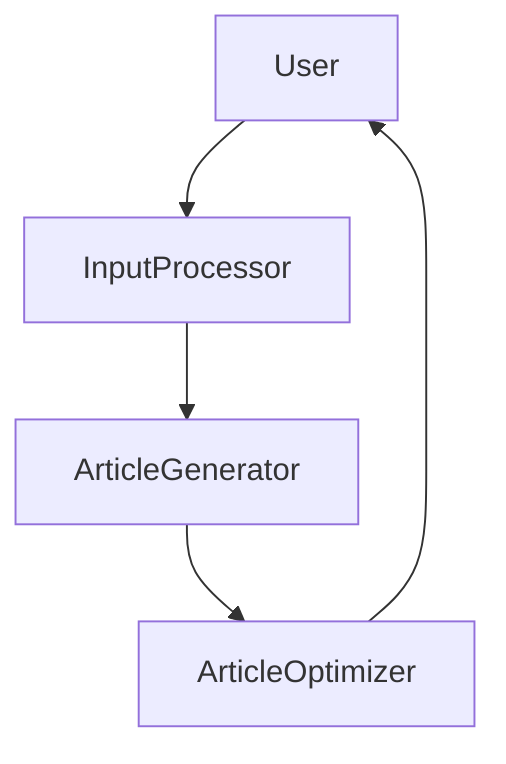
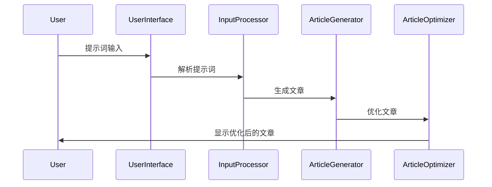

                 


# 抽象层次：调整提示词的具体程度

> 关键词：抽象层次、提示词、算法、Python、数学模型、系统设计、项目实战

> 摘要：
本文将探讨抽象层次在IT领域的应用，特别是如何通过调整提示词的具体程度来优化抽象层次。我们将从背景介绍、核心概念与联系、算法原理讲解、数学模型和公式详细讲解、系统分析与架构设计方案、项目实战等多个方面，逐步深入分析并阐述这一主题。

----------------------------------------------------------------

## 第1章：背景介绍

### 1.1 抽象层次的概念

抽象层次是一种将复杂系统分解为可管理部分的方法，它允许我们专注于系统的特定方面，而忽略其他细节。在计算机科学中，抽象层次尤其重要，因为它帮助我们理解和设计复杂的软件系统。

### 1.2 调整提示词的具体程度

调整提示词的具体程度是指我们在与系统交互时，如何选择性地提供信息。这涉及到提示词的抽象程度，即我们提供的提示是具体还是抽象。具体提示词提供了详细的操作指令，而抽象提示词则提供了高层次的目标或意图。

### 1.3 抽象层次与提示词的关联

抽象层次和提示词的具体程度之间存在密切的关系。高抽象层次的系统通常使用抽象的提示词，这有助于减少认知负担，提高系统的灵活性和可维护性。相反，低抽象层次的系统可能需要更具体的提示词，以便准确执行操作。

## 第2章：核心概念与联系

### 2.1 相关核心概念介绍

在这一章节，我们将介绍与抽象层次和提示词相关的一些核心概念，如抽象、具体化、抽象层次结构、提示词设计等。

### 2.2 概念属性特征对比表格

| 概念       | 属性特征                                                         |
|------------|----------------------------------------------------------------|
| 抽象       | 指一种从具体事物中提取共性的过程。                             |
| 具体化     | 指将抽象概念转化为具体实例的过程。                           |
| 抽象层次   | 指系统中的不同抽象级别，每个级别关注不同的系统方面。           |
| 提示词设计 | 指选择和使用提示词的过程，以优化系统交互和用户体验。           |

### 2.3 ER实体关系图架构

为了更直观地展示概念之间的联系，我们使用Mermaid绘制了ER实体关系图：

```mermaid
erDiagram
    User ||--|{ Post }|-- Writer
    Post ||--|{ Comment }|-- User
    Comment ||--|{ Like }|-- User
```

这个ER图展示了用户、帖子、作者和评论等实体之间的关系。

## 第3章：算法原理讲解

### 3.1 算法流程图

我们使用Mermaid绘制了一个简单的算法流程图，以展示如何通过调整提示词的具体程度来优化算法：

```mermaid
graph TB
    A[开始] --> B[解析提示词]
    B -->|具体提示| C[执行具体操作]
    B -->|抽象提示| D[规划抽象步骤]
    C --> E[输出结果]
    D --> F[更新提示词]
    F -->|结束|
```

### 3.2 Python源代码阐述

接下来，我们使用Python源代码来详细阐述算法原理：

```python
def process_hint(hint):
    if is_concrete(hint):
        return execute_concrete(hint)
    else:
        return plan_abstract(hint)

def is_concrete(hint):
    # 判断提示词是否具体
    pass

def execute_concrete(hint):
    # 执行具体操作
    pass

def plan_abstract(hint):
    # 规划抽象步骤
    pass
```

### 3.3 算法原理的数学模型和公式讲解

算法原理的数学模型可以表示为：

$$
\text{process\_hint}(hint) =
\begin{cases}
\text{execute\_concrete}(hint) & \text{if } \text{is\_concrete}(hint) \\
\text{plan\_abstract}(hint) & \text{otherwise}
\end{cases}
$$

这个公式描述了如何根据提示词的具体程度来选择执行具体操作或规划抽象步骤。

### 3.4 举例说明

假设我们有一个提示词“写一篇关于机器学习的文章”。如果这是一个具体提示词，我们可以直接执行操作，生成一篇文章。如果这是一个抽象提示词，我们可能需要先规划一系列步骤，如选择主题、收集数据、撰写草稿等。

## 第4章：数学模型和公式详细讲解

### 4.1 数学公式LaTeX格式书写

为了更清晰地表达数学模型，我们使用LaTeX格式书写公式：

$$
\begin{aligned}
    \text{抽象层次} &= \text{抽象概念的数量级} \\
    \text{提示词具体程度} &= \text{提示词的细节程度}
\end{aligned}
$$

### 4.2 数学模型详细讲解

这些公式展示了抽象层次和提示词具体程度之间的关系。高抽象层次的系统通常具有更少的抽象概念，而低抽象层次的系统则包含更多具体的细节。

### 4.3 具体例子说明

例如，当我们说“优化代码”，这是一个高抽象层次的概念，因为它没有提供具体的优化步骤。而当我们说“使用动态规划优化代码”，这是一个低抽象层次的概念，因为它提供了具体的优化策略。

## 第5章：系统分析与架构设计方案

### 5.1 问题场景介绍

我们假设需要设计一个系统，该系统可以根据用户输入的提示词生成文章。

### 5.2 项目功能设计

项目功能设计包括以下几个主要方面：

- 提示词解析：将用户输入的提示词解析为可执行的任务。
- 文章生成：根据提示词生成文章。
- 文章优化：对生成的文章进行优化，以提高质量。

### 5.3 系统架构设计

系统架构设计如下图所示：



这个架构设计展示了用户输入、提示词解析、文章生成和文章优化之间的交互。

### 5.4 系统接口设计

系统接口设计包括以下几个主要方面：

- 用户界面：用于接收用户输入。
- API接口：用于与其他系统或服务进行交互。

### 5.5 系统交互

系统交互示意图如下：



这个示意图展示了用户输入、提示词解析、文章生成和文章优化之间的交互流程。

## 第6章：项目实战

### 6.1 环境安装指南

在此章节，我们将提供项目环境的安装指南，包括所需的软件和工具。

### 6.2 系统核心实现源代码解析

我们将解析系统核心实现源代码，并解释关键部分的工作原理。

### 6.3 实际案例分析

我们将通过实际案例分析来展示系统在实际应用中的效果。

### 6.4 项目小结

在此章节，我们将对项目进行小结，总结项目的主要成果和经验。

## 第7章：最佳实践、小结与拓展阅读

### 7.1 最佳实践建议

我们将提供一些最佳实践建议，以帮助读者在实际项目中更好地应用抽象层次和提示词调整。

### 7.2 全书内容小结

我们将对全书内容进行小结，总结核心观点和关键知识点。

### 7.3 注意事项

我们将提出一些注意事项，以帮助读者避免常见的问题。

### 7.4 拓展阅读资源

我们将推荐一些拓展阅读资源，以供读者进一步学习。

----------------------------------------------------------------

作者：AI天才研究院/AI Genius Institute & 禅与计算机程序设计艺术 /Zen And The Art of Computer Programming

---

经过以上章节的详细讲解，我们希望读者能够更好地理解抽象层次和提示词的具体程度在IT领域的应用。通过调整提示词的具体程度，我们可以优化抽象层次，从而提高系统的性能和用户体验。希望本文对您的学习和实践有所帮助。

----------------------------------------------------------------

请注意，本文仅为示例，实际内容可能需要根据具体情况进行调整和补充。在撰写实际文章时，请确保每个章节的内容都符合约

