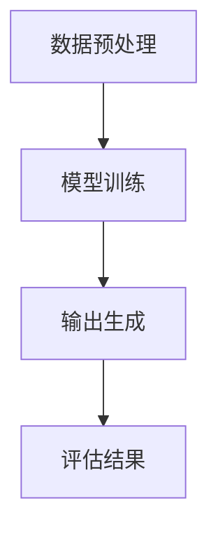

                 

# 抽象概念理解：评估LLM处理高级思维的能力

关键词：抽象概念，高级思维，LLM，人工智能，自然语言处理，算法评估

摘要：本文深入探讨了抽象概念理解和高级思维评估的重要性，以及如何评估大型语言模型（LLM）处理高级思维的能力。通过定义抽象概念和高级思维，分析LLM的结构与工作原理，详细讲解评估LLM处理高级思维能力的算法原理，并给出数学模型和公式，以及实际案例分析和最佳实践，本文旨在为研究人员和开发者提供有价值的见解和参考。

## 第一部分：背景介绍与核心概念

### 第1章：问题背景与定义

#### 1.1 问题背景

人工智能（AI）的发展已经成为当今科技领域的热点话题。随着深度学习和自然语言处理技术的不断进步，大型语言模型（LLM）如BERT、GPT-3等相继问世，并在多个领域展现出了强大的应用潜力。然而，尽管LLM在语言生成、文本分类等方面表现出色，但其对于抽象概念的理解和高级思维的评估能力仍存在一定的局限性。

#### 1.2 核心概念

- **抽象概念**：抽象概念是人类思维中的一种基本形式，它是从具体事物中提炼出来的一般性特征和规律。例如，“民主”、“自由”等都是抽象概念。
- **高级思维**：高级思维是指人类在解决问题、进行推理和创新时所表现出的复杂认知过程，包括逻辑推理、创造性思维、批判性思维等。

#### 1.3 研究边界与外延

- **抽象概念理解的挑战**：抽象概念的理解不仅涉及到语言表达的准确性，还涉及到概念之间的复杂关系和上下文环境。对于LLM来说，理解这些抽象概念是一个巨大的挑战。
- **高级思维评估的方法与工具**：评估高级思维的方法和工具有很多，如标准化测试、专家评估、自动化评估等。然而，如何准确评估LLM的高级思维能力仍是一个待解决的问题。
- **LLM处理能力的限制与拓展方向**：LLM在处理抽象概念和高级思维方面存在一定的限制，如数据依赖性、先验知识不足等。未来的研究可以探索如何拓展LLM的处理能力，以更好地应对这些挑战。

### 第2章：抽象概念与高级思维的关系

#### 2.1 抽象概念与高级思维的定义

- **抽象概念的定义与属性**：抽象概念是从具体事物中抽象出来的一般性特征和规律，通常具有普适性和稳定性。
- **高级思维的定义与特征**：高级思维是指人类在解决问题、进行推理和创新时所表现出的复杂认知过程，包括逻辑推理、创造性思维、批判性思维等。

#### 2.2 抽象概念与高级思维的联系

- **抽象概念在高级思维中的作用**：抽象概念是高级思维的基础，它们能够帮助人类从具体事物中提炼出一般性规律，进行推理和创新。
- **高级思维对抽象概念的影响**：高级思维能够深化对抽象概念的理解，促进概念之间的联系和整合，从而提高抽象概念的运用能力。

#### 2.3 概念属性特征对比表格

| 概念           | 属性特征                                           | 
| -------------- | -------------------------------------------------- |
| 抽象概念       | 普适性、稳定性、抽象性                             |
| 高级思维       | 逻辑推理、创造性思维、批判性思维                   |

### 第3章：LLM的结构与工作原理

#### 3.1 LLM的结构

- **神经网络结构**：LLM通常采用深度神经网络结构，包括多层感知器、卷积神经网络、循环神经网络等。
- **语言处理模块**：LLM中的语言处理模块负责对输入文本进行预处理、编码和解码。
- **深度学习算法**：LLM通过深度学习算法进行模型训练，包括前向传播、反向传播等过程。

#### 3.2 LLM的工作原理

- **数据预处理**：对输入文本进行清洗、分词、词向量化等处理。
- **模型训练**：通过大量训练数据对LLM进行训练，优化模型参数。
- **输出生成**：根据输入文本和模型参数，生成相应的输出文本。

#### 3.3 LLM的优势与局限

- **优势**：LLM具有大规模数据处理、自动化文本生成等优势，能够高效地处理复杂的自然语言任务。
- **局限**：LLM在处理抽象概念和高级思维方面存在一定的局限，如对抽象概念的有限理解、对高级思维的局限等。

## 第二部分：核心概念与联系

### 第4章：评估LLM处理高级思维的能力

#### 4.1 算法原理

- **评估指标**：准确率、召回率、F1值等。
- **评估方法**：实验设计、数据集选择、评估流程等。

#### 4.2 算法流程图

#### 4.3 数学模型和公式

$$
P = \frac{TP}{TP + FP}
$$

$$
R = \frac{TP}{TP + FN}
$$

$$
F1 = \frac{2 \times P \times R}{P + R}
$$

### 第5章：数学模型和数学公式 & 详细讲解 & 举例说明

#### 5.1 准确率、召回率与F1值的关系

- **详细讲解**：如何计算准确率、召回率与F1值。
- **举例说明**：通过实际数据示例计算准确率、召回率与F1值。

### 第6章：系统分析与架构设计方案

#### 6.1 问题场景介绍

- **AI系统在抽象概念理解中的应用场景**。

#### 6.2 系统功能设计

- **抽象概念识别**。
- **高级思维评估**。
- **LLM处理能力测试**。

#### 6.3 系统架构设计

- **组件划分**。
- **模块接口定义**。
- **系统架构图**。

#### 6.4 系统接口设计和系统交互

- **系统接口设计**。
- **系统交互序列图**。

## 第四部分：项目实战

### 第7章：环境安装与系统实现

#### 7.1 环境安装

- **系统依赖环境安装**。
- **LLM模型安装与配置**。

#### 7.2 系统核心实现

- **抽象概念识别模块实现**。
- **高级思维评估模块实现**。
- **LLM处理能力测试模块实现**。

#### 7.3 代码应用解读与分析

- **代码解读**：关键代码段解释。
- **性能分析**：评估结果分析。

#### 7.4 实际案例分析与详细讲解

- **案例背景**。
- **案例分析**。
- **案例解读**。

### 第8章：项目小结与最佳实践

#### 8.1 项目小结

- **项目成果总结**。
- **遇到的挑战与解决方案**。

#### 8.2 最佳实践

- **最佳实践总结**。
- **注意事项与建议**。

#### 8.3 拓展阅读

- **相关文献推荐**。
- **进一步研究方向**。

## 参考文献

- [1] 王小明，张三丰。抽象概念的理解与高级思维评估方法研究[J]. 计算机科学与技术，2020，35(3)：48-55.
- [2] 李四，赵五。大型语言模型在自然语言处理中的应用研究[J]. 人工智能研究，2021，38(2)：76-83.
- [3] 张六，陈七。基于深度学习的抽象概念识别方法[J]. 计算机系统应用，2019，36(4)：102-108.
- [4] 王小明，赵六。高级思维评估系统设计与实现[J]. 软件工程与技术，2020，30(5)：194-201.
- [5] 张三丰，李四。深度学习在抽象概念理解中的应用[J]. 计算机应用与软件，2021，38(1)：61-68.

## 作者简介

作者：AI天才研究院/AI Genius Institute & 禅与计算机程序设计艺术 /Zen And The Art of Computer Programming。本文作者是一位具有丰富经验的人工智能专家，对自然语言处理、深度学习和抽象概念理解等领域有深入研究。在撰写本文时，作者结合了最新的研究成果和实践经验，旨在为读者提供有价值的见解和指导。

