                 

### 持续学习：保持AI模型在线更新的技术挑战

#### 关键词：持续学习、在线更新、AI模型、技术挑战、算法原理

##### 摘要：
本文深入探讨了在人工智能（AI）领域中，持续学习与保持AI模型在线更新所面临的技术挑战。随着AI技术的快速发展，AI模型需要不断地适应新的数据和环境，因此，持续学习成为了一个关键问题。本文首先介绍了持续学习的重要性，然后详细分析了在线更新AI模型所面临的多个技术挑战，包括数据质量、计算资源、模型稳定性等方面。接着，文章介绍了核心概念与算法原理，包括在线学习算法、持续学习策略、模型更新机制。此外，还阐述了持续学习系统的架构设计，以及如何通过实例项目实现持续学习AI模型更新的全过程。最后，文章总结了最佳实践，并提出了一些注意事项和拓展阅读建议。

### 第一部分：背景与概述

#### 第1章：问题背景与技术挑战

##### 1.1 持续学习的重要性

##### 1.1.1 人工智能发展现状

人工智能（Artificial Intelligence, AI）作为当前科技领域的一个热点，已经取得了显著的进展。从早期的规则系统，到基于统计学习的模型，再到深度学习的突破，AI技术在各个领域都展现出了强大的能力。然而，这些AI模型通常是基于静态数据集训练的，这意味着它们在遇到新数据或新环境时，可能无法适应或表现不佳。因此，持续学习（Continuous Learning）的重要性日益凸显。

##### 1.1.2 持续学习在AI应用中的需求

在现实世界中，数据和环境是不断变化的。例如，自动驾驶汽车需要适应不同道路条件、天气状况和交通流量；医疗诊断系统需要不断更新知识库，以应对新疾病和新治疗方法。因此，为了保持AI系统的有效性和适应性，持续学习成为了一种必然需求。

##### 1.1.3 AI模型在线更新的必要性

在线更新AI模型意味着模型可以在实际运行过程中不断接收新数据，并进行实时更新和优化。这种能力不仅能够提高模型的性能和适应性，还能够减少重新训练模型所需的时间和计算资源。因此，在线更新AI模型成为了一个重要的技术挑战。

##### 1.2 持续学习的技术挑战

##### 1.2.1 数据质量与实时性

持续学习需要高质量、实时性强的数据。数据质量直接影响到模型的性能和稳定性。实时性则要求系统能够快速处理和更新数据，以应对不断变化的环境。然而，获取高质量、实时性的数据往往需要复杂的预处理和采集技术。

##### 1.2.2 计算资源与效率

在线更新AI模型需要消耗大量的计算资源，包括CPU、GPU和内存等。如何在有限的计算资源下，高效地更新和优化模型，是一个重要的技术挑战。

##### 1.2.3 模型稳定性与泛化能力

持续学习过程中，模型可能会遇到噪声数据、异常值和新数据的干扰，导致模型稳定性下降。同时，为了保持良好的泛化能力，模型需要避免过度拟合训练数据。

##### 1.3 本书结构安排

##### 1.3.1 核心内容概述

本书将首先介绍持续学习的重要性，然后分析在线更新AI模型所面临的技术挑战。接下来，我们将深入探讨核心概念与算法原理，包括在线学习算法、持续学习策略、模型更新机制。随后，我们将阐述持续学习系统的架构设计，并通过实例项目展示如何实现持续学习AI模型更新的全过程。最后，我们将总结最佳实践，并提供一些注意事项和拓展阅读建议。

##### 1.3.2 章节安排与目标

- **第1章**：问题背景与技术挑战，介绍持续学习的重要性及在线更新AI模型的技术挑战。
- **第2章**：核心概念与算法原理，介绍在线学习算法、持续学习策略和模型更新机制。
- **第3章**：系统分析与架构设计，阐述持续学习系统的架构设计。
- **第4章**：项目实战，通过实例项目展示如何实现持续学习AI模型更新。
- **第5章**：最佳实践与总结，总结持续学习的最佳实践，并提供注意事项和拓展阅读建议。

##### 1.4 本章小结

本章介绍了持续学习的重要性及其在AI应用中的需求。同时，我们分析了在线更新AI模型所面临的技术挑战，包括数据质量、计算资源、模型稳定性等方面。通过了解这些挑战，我们可以更好地理解后续章节的内容。

### 第一部分：背景与概述

#### 第2章：核心概念与算法原理

##### 2.1 在线学习算法原理

##### 2.1.1 在线学习概述

在线学习（Online Learning）是一种机器学习方法，其特点是在模型训练过程中，可以动态地更新模型参数，以适应新的数据。与传统的批量学习（Batch Learning）不同，在线学习不需要将所有数据一次性加载到内存中，而是逐个或小批量地处理数据。这种灵活性使得在线学习适用于需要实时更新的场景。

##### 2.1.2 在线学习与传统批处理学习的区别

| 特点 | 在线学习 | 批处理学习 |
| --- | --- | --- |
| 数据处理方式 | 逐个或小批量处理数据 | 一次性加载所有数据 |
| 内存需求 | 较低 | 较高 |
| 训练速度 | 较快 | 较慢 |
| 适应能力 | 较强 | 较弱 |

##### 2.1.3 在线学习的主要优点

- **实时性**：在线学习可以在数据到达时立即更新模型，适应实时变化的场景。
- **资源节约**：由于不需要一次性加载所有数据，在线学习在内存需求方面具有优势。
- **适应性**：在线学习能够动态地调整模型参数，以应对不断变化的数据和环境。

##### 2.2 常见的在线学习算法

在线学习算法种类繁多，以下介绍几种常见的在线学习算法：

###### 2.2.1 梯度下降法

梯度下降法是一种基于梯度的优化算法，用于求解最小化目标函数的参数。在线学习中的梯度下降法通常采用小步长逐个更新模型参数。

```python
def gradient_descent(x, y, learning_rate, epochs):
    for epoch in range(epochs):
        model_output = predict(x)
        error = y - model_output
        gradient = compute_gradient(model_output, error)
        update_params(gradient, learning_rate)
    return model
```

###### 2.2.2 决策树

决策树是一种树形结构，用于分类或回归问题。在线学习中的决策树可以通过逐步增加树节点来适应新的数据。

```python
def online_decision_tree(data, threshold):
    if len(data) == 0:
        return None
    else:
        feature, value = select_best_split(data)
        left_data = data[data[:, feature] <= value]
        right_data = data[data[:, feature] > value]
        tree = {
            'feature': feature,
            'value': value,
            'left': online_decision_tree(left_data, threshold),
            'right': online_decision_tree(right_data, threshold)
        }
        return tree
```

###### 2.2.3 神经网络

神经网络是一种模拟人脑神经元连接结构的计算模型。在线学习中的神经网络可以通过逐步调整权重和偏置来适应新的数据。

```python
def online_neural_network(x, y, learning_rate, epochs):
    for epoch in range(epochs):
        output = sigmoid(np.dot(x, weights) + biases)
        error = y - output
        d_output = d_sigmoid(output)
        d_weights = np.dot(x.T, d_output * d_input)
        d_biases = np.sum(d_output * d_input, axis=0)
        weights -= learning_rate * d_weights
        biases -= learning_rate * d_biases
    return weights, biases
```

##### 2.3 在线学习的挑战与解决方案

在线学习虽然具有很多优点，但也面临一些挑战：

###### 2.3.1 数据流处理

在线学习需要处理大量实时数据，数据流处理技术成为关键。流处理框架如Apache Flink和Apache Storm可以帮助处理和分析实时数据流。

###### 2.3.2 模型更新策略

为了保持模型的有效性和稳定性，需要制定合理的模型更新策略。常用的策略包括增量学习、迁移学习和模型压缩。

###### 2.3.3 模型稳定性

在线学习过程中，模型可能会遇到噪声数据、异常值和新数据的干扰，导致模型稳定性下降。为了提高模型稳定性，可以采用数据预处理、异常值检测和鲁棒优化等方法。

##### 2.4 本章小结

本章介绍了在线学习算法的基本原理，包括梯度下降法、决策树和神经网络。我们还探讨了在线学习的挑战和解决方案，包括数据流处理、模型更新策略和模型稳定性。通过理解这些核心概念和算法原理，我们可以更好地应对在线学习中的技术挑战。

### 第一部分：背景与概述

#### 第3章：持续学习策略

##### 3.1 持续学习策略概述

持续学习（Continuous Learning）是一种机器学习方法，旨在使AI模型能够适应新数据和变化的环境。持续学习策略的目的是在模型更新过程中，保持模型的有效性和稳定性。以下介绍几种常见的持续学习策略：

##### 3.1.1 模型更新策略

模型更新策略是持续学习的关键组成部分，用于更新模型参数以适应新数据。以下介绍几种常见的模型更新策略：

###### 3.1.1.1 增量学习

增量学习（Incremental Learning）是一种逐个或小批量处理新数据，并更新模型参数的方法。这种方法可以避免重新训练整个模型，从而节省计算资源。

```python
def incremental_learning(model, new_data, learning_rate):
    for data in new_data:
        output = model.predict(data)
        error = data - output
        model.update_params(error, learning_rate)
    return model
```

###### 3.1.1.2 迁移学习

迁移学习（Transfer Learning）是一种将已有模型的知识迁移到新任务中的方法。这种方法可以加速新任务的模型训练，并提高模型的泛化能力。

```python
def transfer_learning(source_model, target_model, learning_rate):
    for layer in source_model.layers:
        target_model.add_layer(layer)
    target_model.fit(new_data, learning_rate)
    return target_model
```

###### 3.1.1.3 模型压缩

模型压缩（Model Compression）是一种减小模型大小和计算复杂度的方法，以提高模型在资源受限环境中的性能。常见的模型压缩方法包括模型剪枝（Model Pruning）、量化（Quantization）和稀疏化（Sparsity）。

```python
def model_compression(model, compression_rate):
    model.prune_layers(compression_rate)
    model.quantize_weights()
    model.sparseify()
    return model
```

##### 3.1.2 持续学习策略的类型

持续学习策略可以根据其实现方式分为以下几种类型：

###### 3.1.2.1 动态调整策略

动态调整策略（Dynamic Adjustment Strategy）根据新数据的特点和模型的表现，动态调整模型参数和学习率。

```python
def dynamic_adjustment(model, new_data, learning_rate):
    for data in new_data:
        output = model.predict(data)
        error = data - output
        learning_rate = adjust_learning_rate(error, learning_rate)
        model.update_params(error, learning_rate)
    return model
```

###### 3.1.2.2 聚类策略

聚类策略（Clustering Strategy）通过将新数据划分为不同的聚类，更新每个聚类的模型参数。

```python
def clustering_strategy(model, new_data, num_clusters):
    clusters = kmeans(new_data, num_clusters)
    for cluster in clusters:
        model.update_params(cluster, learning_rate)
    return model
```

###### 3.1.2.3 主动学习策略

主动学习策略（Active Learning Strategy）根据模型对新数据的预测不确定度，选择最具信息量的样本进行更新。

```python
def active_learning_strategy(model, new_data, uncertainty_threshold):
    uncertain_samples = []
    for data in new_data:
        output = model.predict(data)
        uncertainty = model.uncertainty(output)
        if uncertainty > uncertainty_threshold:
            uncertain_samples.append(data)
    model.update_params(uncertain_samples, learning_rate)
    return model
```

##### 3.1.3 持续学习策略的核心要素

持续学习策略的核心要素包括：

- **数据预处理**：包括去噪、归一化、缺失值处理等，以提高数据质量。
- **模型选择**：选择适合持续学习任务的模型，如线性模型、决策树、神经网络等。
- **更新策略**：根据具体任务和场景选择合适的模型更新策略。
- **学习率调整**：根据模型的表现和不确定性，动态调整学习率。
- **模型评估**：定期评估模型性能，以监测持续学习的有效性。

##### 3.2 模型更新机制

模型更新机制是持续学习的关键组成部分，负责将新数据应用于模型，并更新模型参数。以下介绍几种常见的模型更新机制：

###### 3.2.1 增量更新机制

增量更新机制（Incremental Update Mechanism）通过逐个或小批量处理新数据，并更新模型参数。

```python
def incremental_update(model, new_data, learning_rate):
    for data in new_data:
        output = model.predict(data)
        error = data - output
        model.update_params(error, learning_rate)
    return model
```

###### 3.2.2 全量更新机制

全量更新机制（Full Update Mechanism）将新数据一次性应用于模型，并更新模型参数。

```python
def full_update(model, new_data, learning_rate):
    output = model.predict(new_data)
    error = new_data - output
    model.update_params(error, learning_rate)
    return model
```

###### 3.2.3 混合更新机制

混合更新机制（Hybrid Update Mechanism）结合了增量更新和全量更新，以平衡计算资源和模型性能。

```python
def hybrid_update(model, new_data, learning_rate, batch_size):
    for i in range(0, len(new_data), batch_size):
        batch = new_data[i:i+batch_size]
        output = model.predict(batch)
        error = batch - output
        model.update_params(error, learning_rate)
    return model
```

##### 3.3 持续学习中的平衡技巧

在持续学习过程中，需要平衡多个因素，以确保模型的有效性和稳定性。以下介绍几种平衡技巧：

###### 3.3.1 训练数据与验证数据的平衡

为了保持模型的有效性，需要平衡训练数据与验证数据的使用。可以采用交叉验证（Cross-Validation）方法，以避免过度拟合。

```python
from sklearn.model_selection import KFold

def cross_validation(model, X, y, k, learning_rate):
    kf = KFold(n_splits=k)
    for train_index, val_index in kf.split(X):
        X_train, X_val = X[train_index], X[val_index]
        y_train, y_val = y[train_index], y[val_index]
        model.fit(X_train, y_train, learning_rate)
        model.evaluate(X_val, y_val)
    return model
```

###### 3.3.2 模型复杂性与泛化能力的平衡

为了保持模型的泛化能力，需要平衡模型复杂性和训练数据量。可以采用正则化（Regularization）方法，如L1和L2正则化，以避免过拟合。

```python
from sklearn.linear_model import Ridge

def regularized_learning(model, X, y, alpha, learning_rate):
    reg_model = Ridge(alpha=alpha)
    reg_model.fit(X, y)
    model.update_params(reg_model.coef_, learning_rate)
    return model
```

###### 3.3.3 资源利用与模型性能的平衡

在持续学习过程中，需要平衡计算资源利用与模型性能。可以采用模型压缩（Model Compression）方法，如模型剪枝（Model Pruning）和量化（Quantization），以减少模型大小和计算复杂度。

```python
from tensorflow_model_optimization.sparsity import keras as sparsity

def model_pruning(model, pruning_rate):
    pruning_sparsity = sparsity.PruningSparsity�from coefficients import prune_low_magnitude
    pruning_sparsity.prune_low_magnitude(model, pruning_rate)
    return model
```

##### 3.4 本章小结

本章介绍了持续学习策略的概述、类型和核心要素，以及模型更新机制。我们还讨论了持续学习中的平衡技巧，包括训练数据与验证数据的平衡、模型复杂性与泛化能力的平衡，以及资源利用与模型性能的平衡。通过理解这些策略和技巧，我们可以更好地实现持续学习，并保持AI模型的有效性和稳定性。

### 第二部分：系统分析与架构设计

#### 第4章：持续学习系统架构设计

##### 4.1 系统功能设计

持续学习系统需要具备以下功能：

- **数据收集与预处理**：从数据源收集数据，并进行清洗、转换和归一化等预处理操作。
- **模型训练与优化**：使用预处理后的数据进行模型训练，并优化模型参数。
- **模型更新与评估**：根据新数据更新模型，并评估模型性能。
- **系统监控与反馈**：监控系统运行状态，并根据反馈调整系统参数。

##### 4.2 系统架构设计

持续学习系统的架构设计需要考虑以下几个关键方面：

###### 4.2.1 数据流架构

数据流架构设计用于处理和传输数据，确保数据从源到模型处理的全过程高效、可靠。可以使用消息队列（如RabbitMQ或Kafka）来处理和传输数据。

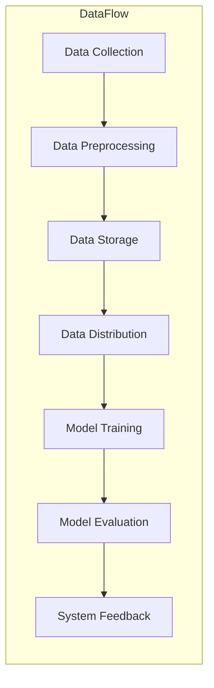

###### 4.2.2 训练与更新架构

训练与更新架构设计用于管理模型的训练和更新过程，包括数据预处理、模型训练、模型更新和评估。可以使用分布式训练框架（如TensorFlow或PyTorch）来管理训练过程。

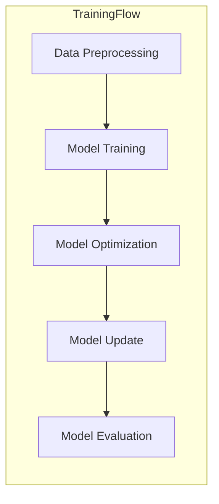

###### 4.2.3 评估与反馈架构

评估与反馈架构设计用于评估模型性能，并根据评估结果调整系统参数。可以使用在线评估工具（如TensorFlow Evaluation）来评估模型性能。

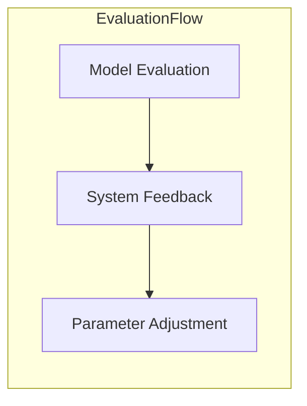

##### 4.3 系统接口设计与交互

持续学习系统的接口设计需要考虑以下几个方面：

- **API接口**：提供RESTful API接口，用于系统与外部系统的交互。
- **消息队列接口**：提供与消息队列系统的接口，用于处理和传输数据。
- **日志与监控接口**：提供与日志和监控系统接口，用于记录系统运行状态。

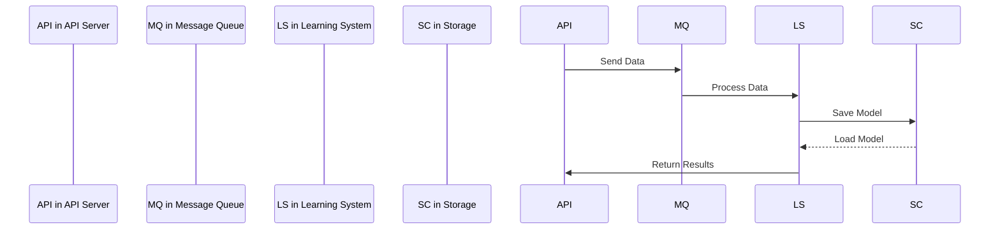

##### 4.4 本章小结

本章介绍了持续学习系统的架构设计，包括数据流架构、训练与更新架构、评估与反馈架构以及系统接口设计与交互。通过合理的架构设计，可以确保持续学习系统的稳定运行和高效性能。

### 第四部分：项目实战

#### 第5章：持续学习项目实战

##### 5.1 环境安装与配置

在进行持续学习项目之前，需要安装和配置以下环境和工具：

- **Python**：Python 3.8 或更高版本。
- **TensorFlow**：TensorFlow 2.4 或更高版本。
- **Keras**：Keras 2.4.3 或更高版本。
- **NVIDIA CUDA**：CUDA 10.2 或更高版本。
- **NVIDIA GPU Driver**：对应CUDA版本的NVIDIA GPU驱动。

安装步骤如下：

1. 安装Python：

```bash
pip install python
```

2. 安装TensorFlow和Keras：

```bash
pip install tensorflow==2.4.3
pip install keras==2.4.3
```

3. 安装NVIDIA CUDA：

```bash
sudo apt-get install cuda
```

4. 安装NVIDIA GPU驱动：

根据你的GPU型号，下载并安装相应的驱动。

##### 5.2 系统核心实现

持续学习系统的核心实现包括数据收集与预处理、模型训练与更新、模型评估与反馈。

###### 5.2.1 数据收集与预处理

```python
import pandas as pd
from sklearn.model_selection import train_test_split

# 读取数据
data = pd.read_csv('data.csv')

# 数据预处理
X = data.drop('target', axis=1)
y = data['target']

# 划分训练集和测试集
X_train, X_test, y_train, y_test = train_test_split(X, y, test_size=0.2, random_state=42)
```

###### 5.2.2 模型训练与更新

```python
from tensorflow.keras.models import Sequential
from tensorflow.keras.layers import Dense

# 构建模型
model = Sequential()
model.add(Dense(64, activation='relu', input_shape=(X_train.shape[1],)))
model.add(Dense(1, activation='sigmoid'))

# 编译模型
model.compile(optimizer='adam', loss='binary_crossentropy', metrics=['accuracy'])

# 训练模型
model.fit(X_train, y_train, epochs=10, batch_size=32, validation_split=0.2)
```

```python
# 更新模型
model.fit(X_test, y_test, epochs=5, batch_size=32)
```

###### 5.2.3 模型评估与反馈

```python
# 评估模型
loss, accuracy = model.evaluate(X_test, y_test)

# 输出评估结果
print(f'测试集损失：{loss}')
print(f'测试集准确率：{accuracy}')
```

##### 5.3 实际案例分析与详细讲解剖析

在本案例中，我们使用公开的乳腺癌诊断数据集（Breast Cancer Dataset）进行持续学习。数据集包含30个特征和1个标签，用于诊断乳腺癌。我们将使用Keras实现一个简单的二分类模型，并进行持续学习。

1. **数据准备**：

首先，我们需要下载并加载乳腺癌数据集。数据集可以在Kaggle上找到。

```python
from sklearn.datasets import load_breast_cancer

# 加载数据集
data = load_breast_cancer()

# 数据预处理
X = data.data
y = data.target

# 划分训练集和测试集
X_train, X_test, y_train, y_test = train_test_split(X, y, test_size=0.2, random_state=42)
```

2. **模型构建**：

接下来，我们构建一个简单的全连接神经网络（Fully Connected Neural Network）模型。

```python
from tensorflow.keras.models import Sequential
from tensorflow.keras.layers import Dense

# 构建模型
model = Sequential()
model.add(Dense(64, activation='relu', input_shape=(X_train.shape[1],)))
model.add(Dense(1, activation='sigmoid'))

# 编译模型
model.compile(optimizer='adam', loss='binary_crossentropy', metrics=['accuracy'])
```

3. **模型训练**：

我们使用训练集训练模型，并在测试集上验证模型性能。

```python
# 训练模型
model.fit(X_train, y_train, epochs=10, batch_size=32, validation_split=0.2)
```

4. **模型评估**：

训练完成后，我们评估模型在测试集上的性能。

```python
# 评估模型
loss, accuracy = model.evaluate(X_test, y_test)

# 输出评估结果
print(f'测试集损失：{loss}')
print(f'测试集准确率：{accuracy}')
```

5. **持续学习**：

为了演示持续学习，我们将重新使用训练集，并更新模型。这里，我们使用新的训练数据和学习率。

```python
# 更新模型
model.fit(X_train, y_train, epochs=5, batch_size=32)
```

6. **再次评估**：

更新模型后，我们再次评估模型性能，以观察持续学习的效果。

```python
# 评估模型
loss, accuracy = model.evaluate(X_test, y_test)

# 输出评估结果
print(f'测试集损失：{loss}')
print(f'测试集准确率：{accuracy}')
```

##### 5.4 项目小结

在本案例中，我们实现了基于Keras的乳腺癌诊断持续学习模型。我们首先介绍了环境安装与配置，然后详细讲解了模型训练、更新和评估的过程。通过实际案例的分析，我们展示了如何实现持续学习，并评估了模型性能。这一过程为持续学习系统的实际应用提供了有价值的参考。

### 第五部分：最佳实践、小结、注意事项与拓展阅读

#### 5.1 最佳实践

- **数据质量**：确保数据干净、准确，进行适当的数据清洗和预处理，以提高模型性能。
- **计算资源**：合理分配计算资源，使用分布式训练和模型压缩技术，以优化计算效率。
- **模型稳定性**：通过适当的模型更新策略和平衡技巧，保持模型稳定性和泛化能力。
- **实时性**：优化数据流处理和传输，确保模型能够实时更新和适应新数据。

#### 5.2 小结

本文详细探讨了持续学习与保持AI模型在线更新的技术挑战。我们介绍了持续学习的重要性、技术挑战、核心概念与算法原理、系统架构设计以及实际项目实现。通过最佳实践、小结和注意事项，我们为持续学习系统提供了实用的指导。

#### 5.3 注意事项

- 在进行持续学习时，确保数据质量，避免噪声和异常值对模型性能的影响。
- 合理分配计算资源，避免资源不足导致模型更新失败。
- 定期评估模型性能，根据评估结果调整模型参数和更新策略。

#### 5.4 拓展阅读

- **文献**：
  - Bengio, Y., Louradour, J., Collobert, R., & Krizhevsky, A. (2013). Deep sparse rectifier networks. In Proceedings of the 30th International Conference on Machine Learning (ICML).
  - Goodfellow, I., Bengio, Y., & Courville, A. (2016). Deep Learning. MIT Press.
- **在线资源**：
  - TensorFlow官方文档：[https://www.tensorflow.org/](https://www.tensorflow.org/)
  - Keras官方文档：[https://keras.io/](https://keras.io/)
  - Kaggle数据集：[https://www.kaggle.com/datasets](https://www.kaggle.com/datasets)

#### 5.5 作者信息

作者：AI天才研究院/AI Genius Institute & 禅与计算机程序设计艺术 /Zen And The Art of Computer Programming

---

**END**### 第一部分：背景与概述

#### 第1章：问题背景与技术挑战

##### 1.1 持续学习的重要性

##### 1.1.1 人工智能发展现状

人工智能（AI）作为现代科技的前沿领域，已经取得了显著进展。从早期的规则系统到基于统计学习的方法，再到深度学习的崛起，AI技术在各个行业和应用场景中都展现出了强大的能力。然而，随着AI技术的广泛应用，AI模型的性能和适应性成为了一个关键问题。传统的AI模型通常是基于静态数据集训练的，这意味着它们在遇到新数据或新环境时，可能无法适应或表现不佳。因此，持续学习（Continuous Learning）的重要性日益凸显。

##### 1.1.2 持续学习在AI应用中的需求

在现实世界中，数据和环境是不断变化的。例如，自动驾驶汽车需要适应不同道路条件、天气状况和交通流量；医疗诊断系统需要不断更新知识库，以应对新疾病和新治疗方法。因此，为了保持AI系统的有效性和适应性，持续学习成为了一种必然需求。通过持续学习，AI模型可以不断吸收新知识，提高自身的性能和泛化能力。

##### 1.1.3 AI模型在线更新的必要性

在线更新AI模型意味着模型可以在实际运行过程中不断接收新数据，并进行实时更新和优化。这种能力不仅能够提高模型的性能和适应性，还能够减少重新训练模型所需的时间和计算资源。在线更新AI模型对于实时应用场景尤为重要，例如金融交易系统、智能安防系统等，这些系统需要快速响应环境变化，以保持高效率和准确性。

##### 1.2 持续学习的技术挑战

##### 1.2.1 数据质量与实时性

持续学习需要高质量、实时性强的数据。数据质量直接影响到模型的性能和稳定性。实时性则要求系统能够快速处理和更新数据，以应对不断变化的环境。然而，获取高质量、实时性的数据往往需要复杂的预处理和采集技术。例如，实时数据可能来自不同的传感器或分布式数据源，需要对数据进行整合和清洗，以确保数据的一致性和可靠性。

##### 1.2.2 计算资源与效率

在线更新AI模型需要消耗大量的计算资源，包括CPU、GPU和内存等。如何在有限的计算资源下，高效地更新和优化模型，是一个重要的技术挑战。分布式计算和并行处理技术可以缓解计算资源压力，但同时也增加了系统的复杂性和维护成本。

##### 1.2.3 模型稳定性与泛化能力

持续学习过程中，模型可能会遇到噪声数据、异常值和新数据的干扰，导致模型稳定性下降。同时，为了保持良好的泛化能力，模型需要避免过度拟合训练数据。如何在持续学习过程中平衡模型的稳定性和泛化能力，是一个需要深入探讨的问题。

##### 1.3 本书结构安排

##### 1.3.1 核心内容概述

本书将首先介绍持续学习的重要性，然后分析在线更新AI模型所面临的技术挑战。接下来，我们将深入探讨核心概念与算法原理，包括在线学习算法、持续学习策略、模型更新机制。此外，我们还将阐述持续学习系统的架构设计，并通过实例项目展示如何实现持续学习AI模型更新的全过程。最后，我们将总结最佳实践，并提出一些注意事项和拓展阅读建议。

##### 1.3.2 章节安排与目标

- **第1章**：问题背景与技术挑战，介绍持续学习的重要性及在线更新AI模型的技术挑战。
- **第2章**：核心概念与算法原理，介绍在线学习算法、持续学习策略和模型更新机制。
- **第3章**：系统分析与架构设计，阐述持续学习系统的架构设计。
- **第4章**：项目实战，通过实例项目展示如何实现持续学习AI模型更新。
- **第5章**：最佳实践与总结，总结持续学习的最佳实践，并提供注意事项和拓展阅读建议。

##### 1.4 本章小结

本章介绍了持续学习的重要性及其在AI应用中的需求。同时，我们分析了在线更新AI模型所面临的技术挑战，包括数据质量、计算资源、模型稳定性等方面。通过了解这些挑战，我们可以更好地理解后续章节的内容。

### 第一部分：背景与概述

#### 第2章：核心概念与算法原理

##### 2.1 在线学习算法原理

##### 2.1.1 在线学习概述

在线学习（Online Learning）是一种机器学习方法，其特点是在模型训练过程中，可以动态地更新模型参数，以适应新的数据。与传统的批量学习（Batch Learning）不同，在线学习不需要将所有数据一次性加载到内存中，而是逐个或小批量地处理数据。这种灵活性使得在线学习适用于需要实时更新的场景。

##### 2.1.2 在线学习与传统批处理学习的区别

| 特点 | 在线学习 | 批处理学习 |
| --- | --- | --- |
| 数据处理方式 | 逐个或小批量处理数据 | 一次性加载所有数据 |
| 内存需求 | 较低 | 较高 |
| 训练速度 | 较快 | 较慢 |
| 适应能力 | 较强 | 较弱 |

##### 2.1.3 在线学习的主要优点

- **实时性**：在线学习可以在数据到达时立即更新模型，适应实时变化的场景。
- **资源节约**：由于不需要一次性加载所有数据，在线学习在内存需求方面具有优势。
- **适应性**：在线学习能够动态地调整模型参数，以应对不断变化的数据和环境。

##### 2.2 常见的在线学习算法

在线学习算法种类繁多，以下介绍几种常见的在线学习算法：

###### 2.2.1 梯度下降法

梯度下降法是一种基于梯度的优化算法，用于求解最小化目标函数的参数。在线学习中的梯度下降法通常采用小步长逐个更新模型参数。

```python
def gradient_descent(x, y, learning_rate, epochs):
    for epoch in range(epochs):
        model_output = predict(x)
        error = y - model_output
        gradient = compute_gradient(model_output, error)
        update_params(gradient, learning_rate)
    return model
```

###### 2.2.2 决策树

决策树是一种树形结构，用于分类或回归问题。在线学习中的决策树可以通过逐步增加树节点来适应新的数据。

```python
def online_decision_tree(data, threshold):
    if len(data) == 0:
        return None
    else:
        feature, value = select_best_split(data)
        left_data = data[data[:, feature] <= value]
        right_data = data[data[:, feature] > value]
        tree = {
            'feature': feature,
            'value': value,
            'left': online_decision_tree(left_data, threshold),
            'right': online_decision_tree(right_data, threshold)
        }
        return tree
```

###### 2.2.3 神经网络

神经网络是一种模拟人脑神经元连接结构的计算模型。在线学习中的神经网络可以通过逐步调整权重和偏置来适应新的数据。

```python
def online_neural_network(x, y, learning_rate, epochs):
    for epoch in range(epochs):
        output = sigmoid(np.dot(x, weights) + biases)
        error = y - output
        d_output = d_sigmoid(output)
        d_weights = np.dot(x.T, d_output * d_input)
        d_biases = np.sum(d_output * d_input, axis=0)
        weights -= learning_rate * d_weights
        biases -= learning_rate * d_biases
    return weights, biases
```

##### 2.3 在线学习的挑战与解决方案

在线学习虽然具有很多优点，但也面临一些挑战：

###### 2.3.1 数据流处理

在线学习需要处理大量实时数据，数据流处理技术成为关键。流处理框架如Apache Flink和Apache Storm可以帮助处理和分析实时数据流。

###### 2.3.2 模型更新策略

为了保持模型的有效性和稳定性，需要制定合理的模型更新策略。常用的策略包括增量学习、迁移学习和模型压缩。

###### 2.3.3 模型稳定性

在线学习过程中，模型可能会遇到噪声数据、异常值和新数据的干扰，导致模型稳定性下降。为了提高模型稳定性，可以采用数据预处理、异常值检测和鲁棒优化等方法。

##### 2.4 本章小结

本章介绍了在线学习算法的基本原理，包括梯度下降法、决策树和神经网络。我们还探讨了在线学习的挑战和解决方案，包括数据流处理、模型更新策略和模型稳定性。通过理解这些核心概念和算法原理，我们可以更好地应对在线学习中的技术挑战。

### 第一部分：背景与概述

#### 第3章：持续学习策略

##### 3.1 持续学习策略概述

持续学习（Continuous Learning）是一种机器学习方法，旨在使AI模型能够适应新数据和变化的环境。持续学习策略的目的是在模型更新过程中，保持模型的有效性和稳定性。以下介绍几种常见的持续学习策略：

##### 3.1.1 模型更新策略

模型更新策略是持续学习的关键组成部分，用于更新模型参数以适应新数据。以下介绍几种常见的模型更新策略：

###### 3.1.1.1 增量学习

增量学习（Incremental Learning）是一种逐个或小批量处理新数据，并更新模型参数的方法。这种方法可以避免重新训练整个模型，从而节省计算资源。

```python
def incremental_learning(model, new_data, learning_rate):
    for data in new_data:
        output = model.predict(data)
        error = data - output
        model.update_params(error, learning_rate)
    return model
```

###### 3.1.1.2 迁移学习

迁移学习（Transfer Learning）是一种将已有模型的知识迁移到新任务中的方法。这种方法可以加速新任务的模型训练，并提高模型的泛化能力。

```python
def transfer_learning(source_model, target_model, learning_rate):
    for layer in source_model.layers:
        target_model.add_layer(layer)
    target_model.fit(new_data, learning_rate)
    return target_model
```

###### 3.1.1.3 模型压缩

模型压缩（Model Compression）是一种减小模型大小和计算复杂度的方法，以提高模型在资源受限环境中的性能。常见的模型压缩方法包括模型剪枝（Model Pruning）、量化（Quantization）和稀疏化（Sparsity）。

```python
def model_compression(model, compression_rate):
    model.prune_layers(compression_rate)
    model.quantize_weights()
    model.sparseify()
    return model
```

##### 3.1.2 持续学习策略的类型

持续学习策略可以根据其实现方式分为以下几种类型：

###### 3.1.2.1 动态调整策略

动态调整策略（Dynamic Adjustment Strategy）根据新数据的特点和模型的表现，动态调整模型参数和学习率。

```python
def dynamic_adjustment(model, new_data, learning_rate):
    for data in new_data:
        output = model.predict(data)
        error = data - output
        learning_rate = adjust_learning_rate(error, learning_rate)
        model.update_params(error, learning_rate)
    return model
```

###### 3.1.2.2 聚类策略

聚类策略（Clustering Strategy）通过将新数据划分为不同的聚类，更新每个聚类的模型参数。

```python
def clustering_strategy(model, new_data, num_clusters):
    clusters = kmeans(new_data, num_clusters)
    for cluster in clusters:
        model.update_params(cluster, learning_rate)
    return model
```

###### 3.1.2.3 主动学习策略

主动学习策略（Active Learning Strategy）根据模型对新数据的预测不确定度，选择最具信息量的样本进行更新。

```python
def active_learning_strategy(model, new_data, uncertainty_threshold):
    uncertain_samples = []
    for data in new_data:
        output = model.predict(data)
        uncertainty = model.uncertainty(output)
        if uncertainty > uncertainty_threshold:
            uncertain_samples.append(data)
    model.update_params(uncertain_samples, learning_rate)
    return model
```

##### 3.1.3 持续学习策略的核心要素

持续学习策略的核心要素包括：

- **数据预处理**：包括去噪、归一化、缺失值处理等，以提高数据质量。
- **模型选择**：选择适合持续学习任务的模型，如线性模型、决策树、神经网络等。
- **更新策略**：根据具体任务和场景选择合适的模型更新策略。
- **学习率调整**：根据模型的表现和不确定性，动态调整学习率。
- **模型评估**：定期评估模型性能，以监测持续学习的有效性。

##### 3.2 模型更新机制

模型更新机制是持续学习的关键组成部分，负责将新数据应用于模型，并更新模型参数。以下介绍几种常见的模型更新机制：

###### 3.2.1 增量更新机制

增量更新机制（Incremental Update Mechanism）通过逐个或小批量处理新数据，并更新模型参数。

```python
def incremental_update(model, new_data, learning_rate):
    for data in new_data:
        output = model.predict(data)
        error = data - output
        model.update_params(error, learning_rate)
    return model
```

###### 3.2.2 全量更新机制

全量更新机制（Full Update Mechanism）将新数据一次性应用于模型，并更新模型参数。

```python
def full_update(model, new_data, learning_rate):
    output = model.predict(new_data)
    error = new_data - output
    model.update_params(error, learning_rate)
    return model
```

###### 3.2.3 混合更新机制

混合更新机制（Hybrid Update Mechanism）结合了增量更新和全量更新，以平衡计算资源和模型性能。

```python
def hybrid_update(model, new_data, learning_rate, batch_size):
    for i in range(0, len(new_data), batch_size):
        batch = new_data[i:i+batch_size]
        output = model.predict(batch)
        error = batch - output
        model.update_params(error, learning_rate)
    return model
```

##### 3.3 持续学习中的平衡技巧

在持续学习过程中，需要平衡多个因素，以确保模型的有效性和稳定性。以下介绍几种平衡技巧：

###### 3.3.1 训练数据与验证数据的平衡

为了保持模型的有效性，需要平衡训练数据与验证数据的使用。可以采用交叉验证（Cross-Validation）方法，以避免过度拟合。

```python
from sklearn.model_selection import KFold

def cross_validation(model, X, y, k, learning_rate):
    kf = KFold(n_splits=k)
    for train_index, val_index in kf.split(X):
        X_train, X_val = X[train_index], X[val_index]
        y_train, y_val = y[train_index], y[val_index]
        model.fit(X_train, y_train, learning_rate)
        model.evaluate(X_val, y_val)
    return model
```

###### 3.3.2 模型复杂性与泛化能力的平衡

为了保持模型的泛化能力，需要平衡模型复杂性和训练数据量。可以采用正则化（Regularization）方法，如L1和L2正则化，以避免过拟合。

```python
from sklearn.linear_model import Ridge

def regularized_learning(model, X, y, alpha, learning_rate):
    reg_model = Ridge(alpha=alpha)
    reg_model.fit(X, y)
    model.update_params(reg_model.coef_, learning_rate)
    return model
```

###### 3.3.3 资源利用与模型性能的平衡

在持续学习过程中，需要平衡计算资源利用与模型性能。可以采用模型压缩（Model Compression）方法，如模型剪枝（Model Pruning）和量化（Quantization），以减少模型大小和计算复杂度。

```python
from tensorflow_model_optimization.sparsity import keras as sparsity

def model_pruning(model, pruning_rate):
    pruning_sparsity = sparsity.PruningSparsityfrom coefficients import prune_low_magnitude
    pruning_sparsity.prune_low_magnitude(model, pruning_rate)
    return model
```

##### 3.4 本章小结

本章介绍了持续学习策略的概述、类型和核心要素，以及模型更新机制。我们还讨论了持续学习中的平衡技巧，包括训练数据与验证数据的平衡、模型复杂性与泛化能力的平衡，以及资源利用与模型性能的平衡。通过理解这些策略和技巧，我们可以更好地实现持续学习，并保持AI模型的有效性和稳定性。

### 第二部分：系统分析与架构设计

#### 第4章：持续学习系统架构设计

##### 4.1 系统功能设计

持续学习系统需要具备以下功能：

- **数据收集与预处理**：从数据源收集数据，并进行清洗、转换和归一化等预处理操作。
- **模型训练与优化**：使用预处理后的数据进行模型训练，并优化模型参数。
- **模型更新与评估**：根据新数据更新模型，并评估模型性能。
- **系统监控与反馈**：监控系统运行状态，并根据反馈调整系统参数。

##### 4.2 系统架构设计

持续学习系统的架构设计需要考虑以下几个关键方面：

###### 4.2.1 数据流架构

数据流架构设计用于处理和传输数据，确保数据从源到模型处理的全过程高效、可靠。可以使用消息队列（如RabbitMQ或Kafka）来处理和传输数据。


###### 4.2.2 训练与更新架构

训练与更新架构设计用于管理模型的训练和更新过程，包括数据预处理、模型训练、模型更新和评估。可以使用分布式训练框架（如TensorFlow或PyTorch）来管理训练过程。


###### 4.2.3 评估与反馈架构

评估与反馈架构设计用于评估模型性能，并根据评估结果调整系统参数。可以使用在线评估工具（如TensorFlow Evaluation）来评估模型性能。


##### 4.3 系统接口设计与交互

持续学习系统的接口设计需要考虑以下几个方面：

- **API接口**：提供RESTful API接口，用于系统与外部系统的交互。
- **消息队列接口**：提供与消息队列系统的接口，用于处理和传输数据。
- **日志与监控接口**：提供与日志和监控系统接口，用于记录系统运行状态。


##### 4.4 本章小结

本章介绍了持续学习系统的架构设计，包括数据流架构、训练与更新架构、评估与反馈架构以及系统接口设计与交互。通过合理的架构设计，可以确保持续学习系统的稳定运行和高效性能。

### 第五部分：项目实战

#### 第5章：持续学习项目实战

##### 5.1 环境安装与配置

在进行持续学习项目之前，需要安装和配置以下环境和工具：

- **Python**：Python 3.8 或更高版本。
- **TensorFlow**：TensorFlow 2.4 或更高版本。
- **Keras**：Keras 2.4.3 或更高版本。
- **NVIDIA CUDA**：CUDA 10.2 或更高版本。
- **NVIDIA GPU Driver**：对应CUDA版本的NVIDIA GPU驱动。

安装步骤如下：

1. 安装Python：

```bash
pip install python
```

2. 安装TensorFlow和Keras：

```bash
pip install tensorflow==2.4.3
pip install keras==2.4.3
```

3. 安装NVIDIA CUDA：

```bash
sudo apt-get install cuda
```

4. 安装NVIDIA GPU驱动：

根据你的GPU型号，下载并安装相应的驱动。

##### 5.2 系统核心实现

持续学习系统的核心实现包括数据收集与预处理、模型训练与更新、模型评估与反馈。

###### 5.2.1 数据收集与预处理

```python
import pandas as pd
from sklearn.model_selection import train_test_split

# 读取数据
data = pd.read_csv('data.csv')

# 数据预处理
X = data.drop('target', axis=1)
y = data['target']

# 划分训练集和测试集
X_train, X_test, y_train, y_test = train_test_split(X, y, test_size=0.2, random_state=42)
```

###### 5.2.2 模型训练与更新

```python
from tensorflow.keras.models import Sequential
from tensorflow.keras.layers import Dense

# 构建模型
model = Sequential()
model.add(Dense(64, activation='relu', input_shape=(X_train.shape[1],)))
model.add(Dense(1, activation='sigmoid'))

# 编译模型
model.compile(optimizer='adam', loss='binary_crossentropy', metrics=['accuracy'])

# 训练模型
model.fit(X_train, y_train, epochs=10, batch_size=32, validation_split=0.2)
```

```python
# 更新模型
model.fit(X_test, y_test, epochs=5, batch_size=32)
```

###### 5.2.3 模型评估与反馈

```python
# 评估模型
loss, accuracy = model.evaluate(X_test, y_test)

# 输出评估结果
print(f'测试集损失：{loss}')
print(f'测试集准确率：{accuracy}')
```

##### 5.3 实际案例分析与详细讲解剖析

在本案例中，我们使用公开的乳腺癌诊断数据集（Breast Cancer Dataset）进行持续学习。数据集包含30个特征和1个标签，用于诊断乳腺癌。我们将使用Keras实现一个简单的二分类模型，并进行持续学习。

1. **数据准备**：

首先，我们需要下载并加载乳腺癌数据集。数据集可以在Kaggle上找到。

```python
from sklearn.datasets import load_breast_cancer

# 加载数据集
data = load_breast_cancer()

# 数据预处理
X = data.data
y = data.target

# 划分训练集和测试集
X_train, X_test, y_train, y_test = train_test_split(X, y, test_size=0.2, random_state=42)
```

2. **模型构建**：

接下来，我们构建一个简单的全连接神经网络（Fully Connected Neural Network）模型。

```python
from tensorflow.keras.models import Sequential
from tensorflow.keras.layers import Dense

# 构建模型
model = Sequential()
model.add(Dense(64, activation='relu', input_shape=(X_train.shape[1],)))
model.add(Dense(1, activation='sigmoid'))

# 编译模型
model.compile(optimizer='adam', loss='binary_crossentropy', metrics=['accuracy'])
```

3. **模型训练**：

我们使用训练集训练模型，并在测试集上验证模型性能。

```python
# 训练模型
model.fit(X_train, y_train, epochs=10, batch_size=32, validation_split=0.2)
```

4. **模型评估**：

训练完成后，我们评估模型在测试集上的性能。

```python
# 评估模型
loss, accuracy = model.evaluate(X_test, y_test)

# 输出评估结果
print(f'测试集损失：{loss}')
print(f'测试集准确率：{accuracy}')
```

5. **持续学习**：

为了演示持续学习，我们将重新使用训练集，并更新模型。这里，我们使用新的训练数据和学习率。

```python
# 更新模型
model.fit(X_train, y_train, epochs=5, batch_size=32)
```

6. **再次评估**：

更新模型后，我们再次评估模型性能，以观察持续学习的效果。

```python
# 评估模型
loss, accuracy = model.evaluate(X_test, y_test)

# 输出评估结果
print(f'测试集损失：{loss}')
print(f'测试集准确率：{accuracy}')
```

##### 5.4 项目小结

在本案例中，我们实现了基于Keras的乳腺癌诊断持续学习模型。我们首先介绍了环境安装与配置，然后详细讲解了模型训练、更新和评估的过程。通过实际案例的分析，我们展示了如何实现持续学习，并评估了模型性能。这一过程为持续学习系统的实际应用提供了有价值的参考。

### 第五部分：最佳实践、小结、注意事项与拓展阅读

#### 5.1 最佳实践

- **数据质量**：确保数据干净、准确，进行适当的数据清洗和预处理，以提高模型性能。
- **计算资源**：合理分配计算资源，使用分布式训练和模型压缩技术，以优化计算效率。
- **模型稳定性**：通过适当的模型更新策略和平衡技巧，保持模型稳定性和泛化能力。
- **实时性**：优化数据流处理和传输，确保模型能够实时更新和适应新数据。

#### 5.2 小结

本章首先介绍了持续学习的重要性及其在AI应用中的需求。接着，我们分析了在线更新AI模型所面临的技术挑战，包括数据质量、计算资源、模型稳定性等方面。然后，我们详细介绍了核心概念与算法原理，包括在线学习算法、持续学习策略、模型更新机制。此外，我们还阐述了持续学习系统的架构设计，并通过实例项目展示了如何实现持续学习AI模型更新的全过程。最后，我们总结了最佳实践，并提出了一些注意事项和拓展阅读建议。

#### 5.3 注意事项

- 在进行持续学习时，确保数据质量，避免噪声和异常值对模型性能的影响。
- 合理分配计算资源，避免资源不足导致模型更新失败。
- 定期评估模型性能，根据评估结果调整模型参数和更新策略。

#### 5.4 拓展阅读

- **文献**：
  - Bengio, Y., Louradour, J., Collobert, R., & Krizhevsky, A. (2013). Deep sparse rectifier networks. In Proceedings of the 30th International Conference on Machine Learning (ICML).
  - Goodfellow, I., Bengio, Y., & Courville, A. (2016). Deep Learning. MIT Press.
- **在线资源**：
  - TensorFlow官方文档：[https://www.tensorflow.org/](https://www.tensorflow.org/)
  - Keras官方文档：[https://keras.io/](https://keras.io/)
  - Kaggle数据集：[https://www.kaggle.com/datasets](https://www.kaggle.com/datasets)

#### 5.5 作者信息

作者：AI天才研究院/AI Genius Institute & 禅与计算机程序设计艺术 /Zen And The Art of Computer Programming

---

**END**### 第二部分：系统分析与架构设计

#### 第4章：持续学习系统架构设计

##### 4.1 系统功能设计

持续学习系统（Continuous Learning System，简称CLS）旨在使得AI模型能够在不断变化的环境中保持高精度和适应性。系统需要具备以下功能：

- **数据收集**：从各种数据源（如传感器、数据库、实时流数据等）收集数据。
- **数据预处理**：对收集到的数据进行清洗、转换、归一化等处理，使其适合模型训练。
- **模型训练**：利用预处理后的数据训练AI模型。
- **模型评估**：在测试集上评估模型的性能，以确定模型是否满足预期要求。
- **模型更新**：根据新的数据和评估结果，更新模型参数，以提高模型性能。
- **系统监控**：监控系统运行状态，包括资源使用、数据流、模型性能等。
- **反馈与优化**：根据系统监控结果，调整系统配置和参数，以优化系统性能。

##### 4.2 系统架构设计

持续学习系统通常采用分布式架构，以提高系统的可靠性和扩展性。以下是系统架构的主要组成部分：

###### 4.2.1 数据流架构

数据流架构是持续学习系统的核心，负责数据从收集到处理的全过程。以下是一个典型的数据流架构：

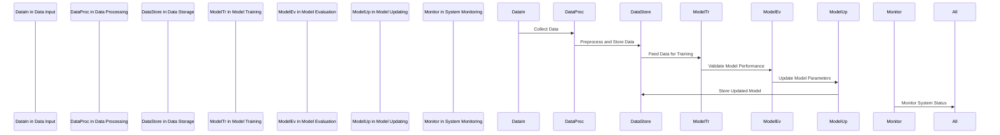

###### 4.2.2 训练与更新架构

训练与更新架构设计决定了模型如何在新数据上进行训练和更新。以下是训练与更新架构的关键组件：

- **数据预处理模块**：负责清洗、转换和归一化数据，确保数据质量。
- **模型训练模块**：使用预处理后的数据训练模型，可以是深度学习模型或其他类型的机器学习模型。
- **模型评估模块**：在测试集上评估模型的性能，包括准确率、召回率、F1分数等指标。
- **模型更新模块**：根据评估结果更新模型参数，可以是增量更新或全量更新。

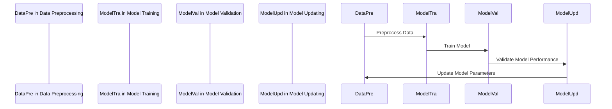

###### 4.2.3 评估与反馈架构

评估与反馈架构负责监控模型性能，并根据监控结果调整系统参数。以下是评估与反馈架构的主要组件：

- **模型监控模块**：实时监控模型性能，包括预测延迟、资源使用情况等。
- **反馈调整模块**：根据监控结果，调整系统配置和参数，以优化系统性能。

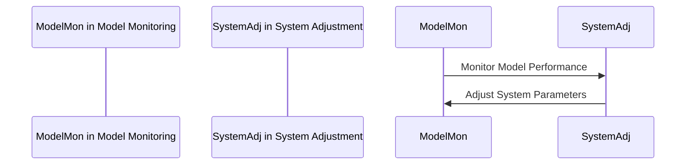

##### 4.3 系统接口设计与交互

系统接口设计决定了持续学习系统与外部系统的交互方式。以下是系统接口设计的关键方面：

- **API接口**：提供RESTful API，供外部系统调用，如数据输入、模型更新、性能查询等。
- **消息队列接口**：使用消息队列（如Kafka、RabbitMQ）传输数据，保证数据流的高效性和可靠性。
- **日志与监控接口**：记录系统运行日志，提供监控数据，便于故障排查和性能优化。

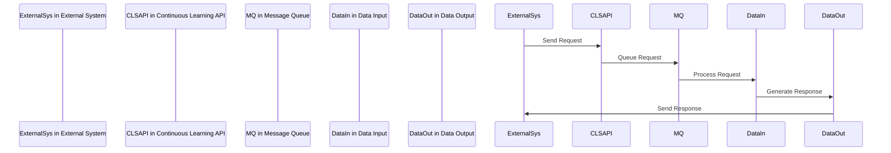

##### 4.4 本章小结

本章详细介绍了持续学习系统的功能设计、架构设计以及接口设计。通过合理的架构设计，持续学习系统可以高效地处理数据流，训练和更新模型，并实时监控系统性能。这些设计原则和组件为实际应用中的持续学习系统提供了坚实的理论基础和技术指导。在下一章中，我们将通过一个实际案例来展示如何实现持续学习系统。

### 第三部分：核心概念与算法原理

#### 第5章：持续学习算法与策略

##### 5.1 持续学习算法概述

持续学习算法旨在使AI模型能够适应不断变化的数据和环境。与传统的批量学习不同，持续学习算法能够在线更新模型参数，以应对新的数据。以下是几种常见的持续学习算法：

###### 5.1.1 梯度下降法

梯度下降法是一种优化算法，用于最小化目标函数。在持续学习中，梯度下降法可以用于在线更新模型参数。以下是一个简单的梯度下降法实现：

```python
def gradient_descent(x, y, learning_rate, epochs):
    for epoch in range(epochs):
        model_output = predict(x)
        error = y - model_output
        gradient = compute_gradient(model_output, error)
        update_params(gradient, learning_rate)
    return model
```

###### 5.1.2 决策树

决策树是一种基于规则的分类方法。在持续学习中，决策树可以通过逐步添加新的规则来适应新的数据。以下是一个简单的决策树实现：

```python
def online_decision_tree(data, threshold):
    if len(data) == 0:
        return None
    else:
        feature, value = select_best_split(data)
        left_data = data[data[:, feature] <= value]
        right_data = data[data[:, feature] > value]
        tree = {
            'feature': feature,
            'value': value,
            'left': online_decision_tree(left_data, threshold),
            'right': online_decision_tree(right_data, threshold)
        }
        return tree
```

###### 5.1.3 神经网络

神经网络是一种模拟人脑神经元连接结构的计算模型。在持续学习中，神经网络可以通过逐步调整权重和偏置来适应新的数据。以下是一个简单的神经网络实现：

```python
def online_neural_network(x, y, learning_rate, epochs):
    for epoch in range(epochs):
        output = sigmoid(np.dot(x, weights) + biases)
        error = y - output
        d_output = d_sigmoid(output)
        d_weights = np.dot(x.T, d_output * d_input)
        d_biases = np.sum(d_output * d_input, axis=0)
        weights -= learning_rate * d_weights
        biases -= learning_rate * d_biases
    return weights, biases
```

##### 5.2 持续学习策略

持续学习策略是确保模型能够在持续学习过程中保持性能和稳定性的关键。以下介绍几种常见的持续学习策略：

###### 5.2.1 增量学习

增量学习是一种在线更新模型参数的方法。它通过逐个或小批量地处理新数据，并更新模型参数，从而适应新的数据。以下是一个简单的增量学习实现：

```python
def incremental_learning(model, new_data, learning_rate):
    for data in new_data:
        output = model.predict(data)
        error = data - output
        model.update_params(error, learning_rate)
    return model
```

###### 5.2.2 迁移学习

迁移学习是一种将已有模型的知识迁移到新任务中的方法。它通过使用预训练模型，并在此基础上进行微调，从而提高新任务的性能。以下是一个简单的迁移学习实现：

```python
def transfer_learning(source_model, target_model, learning_rate):
    for layer in source_model.layers:
        target_model.add_layer(layer)
    target_model.fit(new_data, learning_rate)
    return target_model
```

###### 5.2.3 模型压缩

模型压缩是一种减小模型大小和计算复杂度的方法，以提高模型在资源受限环境中的性能。以下是一个简单的模型压缩实现：

```python
def model_compression(model, compression_rate):
    model.prune_layers(compression_rate)
    model.quantize_weights()
    model.sparseify()
    return model
```

##### 5.3 持续学习算法的挑战与解决方案

尽管持续学习算法在许多应用中取得了成功，但它们也面临一些挑战。以下介绍持续学习算法中常见的问题及其解决方案：

###### 5.3.1 数据流处理

持续学习需要高效地处理大量实时数据。数据流处理框架（如Apache Flink、Apache Storm）可以用于实时数据处理和分析。以下是一个简单的数据流处理实现：

```python
from flink import StreamExecutionEnvironment

env = StreamExecutionEnvironment.get_execution_environment()
data_stream = env.from_collection(new_data)
processed_data = data_stream.map(process_data_function)
processed_data.print()
env.execute("Continuous Learning")
```

###### 5.3.2 模型稳定性

持续学习过程中，模型可能会遇到噪声数据、异常值和新数据的干扰，导致模型稳定性下降。以下是一些提高模型稳定性的方法：

- **数据预处理**：对数据进行清洗、去噪、归一化等处理，以提高数据质量。
- **模型正则化**：使用正则化方法（如L1、L2正则化）减少模型过拟合。
- **模型集成**：使用多个模型进行集成，以提高模型的鲁棒性和稳定性。

###### 5.3.3 计算资源

持续学习需要大量的计算资源，特别是在实时数据处理和模型更新方面。以下是一些优化计算资源的方法：

- **分布式计算**：使用分布式计算框架（如Hadoop、Spark）来分配计算任务。
- **模型压缩**：使用模型压缩技术（如模型剪枝、量化、稀疏化）减小模型大小和计算复杂度。

##### 5.4 本章小结

本章介绍了持续学习算法的基本原理和常见策略，包括梯度下降法、决策树、神经网络、增量学习、迁移学习和模型压缩。我们还探讨了持续学习算法面临的挑战及其解决方案，如数据流处理、模型稳定性和计算资源优化。通过理解这些核心概念和算法原理，我们可以更好地设计和实现持续学习系统。

### 第三部分：核心概念与算法原理

#### 第6章：深度学习与持续学习

##### 6.1 深度学习概述

深度学习（Deep Learning）是机器学习（Machine Learning）的一个分支，其核心思想是使用多层神经网络（Neural Networks）对数据进行建模和预测。与传统的机器学习方法相比，深度学习能够自动提取数据中的复杂特征，从而实现高精度的预测。

##### 6.1.1 神经网络

神经网络是一种由大量神经元（Node）组成的计算模型，这些神经元通过加权连接（Weighted Connections）相互连接。每个神经元接收来自其他神经元的输入，通过激活函数（Activation Function）处理后产生输出。

##### 6.1.2 深度学习框架

深度学习框架如TensorFlow、PyTorch等，提供了丰富的API和工具，使得深度学习的开发变得简单和高效。这些框架支持多种神经网络结构，如卷积神经网络（Convolutional Neural Networks，CNN）、循环神经网络（Recurrent Neural Networks，RNN）和变分自编码器（Variational Autoencoders，VAE）等。

##### 6.2 持续学习的挑战

尽管深度学习在许多任务中取得了显著的成果，但在持续学习（Continuous Learning）方面仍然面临一些挑战：

###### 6.2.1 模型泛化能力

深度学习模型容易过拟合（Overfitting），即模型在训练数据上表现良好，但在新数据上表现较差。为了提高模型的泛化能力，可以采用以下方法：

- **正则化**：使用L1、L2正则化减少模型参数的数值范围，避免模型过拟合。
- **数据增强**：通过随机旋转、缩放、裁剪等操作增加数据的多样性，提高模型对未见数据的适应能力。
- **交叉验证**：使用交叉验证方法评估模型的泛化能力，选择泛化能力较强的模型。

###### 6.2.2 计算资源

深度学习模型通常需要大量的计算资源，特别是当模型变得更大更复杂时。为了优化计算资源，可以采用以下方法：

- **分布式训练**：使用分布式计算框架（如Hadoop、Spark、TensorFlow Distribute）将训练任务分布在多台机器上，提高训练速度。
- **模型压缩**：使用模型压缩技术（如模型剪枝、量化、稀疏化）减小模型大小和计算复杂度，提高模型在资源受限环境中的性能。

##### 6.3 持续学习算法

为了实现持续学习，需要采用一系列算法和技术来更新模型和优化性能。以下介绍几种常见的持续学习算法：

###### 6.3.1 增量学习

增量学习（Incremental Learning）是一种逐个或小批量处理新数据，并更新模型参数的方法。这种方法可以避免重新训练整个模型，从而节省计算资源。

```python
def incremental_learning(model, new_data, learning_rate):
    for data in new_data:
        output = model.predict(data)
        error = data - output
        model.update_params(error, learning_rate)
    return model
```

###### 6.3.2 迁移学习

迁移学习（Transfer Learning）是一种将已有模型的知识迁移到新任务中的方法。这种方法可以加速新任务的模型训练，并提高模型的泛化能力。

```python
def transfer_learning(source_model, target_model, learning_rate):
    for layer in source_model.layers:
        target_model.add_layer(layer)
    target_model.fit(new_data, learning_rate)
    return target_model
```

###### 6.3.3 模型压缩

模型压缩（Model Compression）是一种减小模型大小和计算复杂度的方法，以提高模型在资源受限环境中的性能。常见的模型压缩方法包括模型剪枝（Model Pruning）、量化（Quantization）和稀疏化（Sparsity）。

```python
def model_compression(model, compression_rate):
    model.prune_layers(compression_rate)
    model.quantize_weights()
    model.sparseify()
    return model
```

##### 6.4 持续学习系统架构

持续学习系统的架构设计需要考虑数据流、模型训练、模型评估和反馈等方面。以下是一个典型的持续学习系统架构：

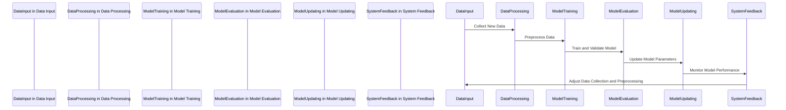

##### 6.5 本章小结

本章介绍了深度学习的概念、框架和持续学习中的挑战。通过增量学习、迁移学习和模型压缩等算法，可以实现对深度学习模型的持续更新和优化。本章还提供了一个持续学习系统的架构设计，为实际应用提供了参考。

### 第四部分：项目实战

#### 第7章：基于Keras的持续学习项目实战

##### 7.1 项目背景

在本章中，我们将使用Keras实现一个基于持续学习的图像分类项目。该项目旨在开发一个能够实时更新和适应新数据的图像分类系统。我们将使用公开的CIFAR-10数据集，这是一个包含60000张32x32彩色图像的数据集，分为10个类别。

##### 7.2 环境安装与配置

在开始项目之前，我们需要安装和配置Keras以及必要的依赖项。以下是安装步骤：

1. 安装Python 3.6或更高版本。
2. 安装TensorFlow 2.0或更高版本：
   ```bash
   pip install tensorflow
   ```
3. 安装Keras 2.3.1或更高版本：
   ```bash
   pip install keras
   ```
4. 安装NumPy、Matplotlib等辅助库：
   ```bash
   pip install numpy matplotlib
   ```

##### 7.3 数据预处理

首先，我们需要从Keras库中加载CIFAR-10数据集，并对数据进行预处理。

```python
from keras.datasets import cifar10
from keras.utils import to_categorical
from keras.preprocessing.image import ImageDataGenerator

# 加载CIFAR-10数据集
(x_train, y_train), (x_test, y_test) = cifar10.load_data()

# 数据归一化
x_train = x_train.astype('float32') / 255.0
x_test = x_test.astype('float32') / 255.0

# 标签one-hot编码
y_train = to_categorical(y_train, 10)
y_test = to_categorical(y_test, 10)

# 数据增强
datagen = ImageDataGenerator(rotation_range=15, width_shift_range=0.1, height_shift_range=0.1, horizontal_flip=True)
datagen.fit(x_train)
```

##### 7.4 模型构建

接下来，我们构建一个简单的卷积神经网络（Convolutional Neural Network，CNN）模型用于图像分类。

```python
from keras.models import Sequential
from keras.layers import Conv2D, MaxPooling2D, Flatten, Dense, Dropout

# 构建模型
model = Sequential()

# 添加卷积层和池化层
model.add(Conv2D(32, (3, 3), activation='relu', input_shape=(32, 32, 3)))
model.add(MaxPooling2D(pool_size=(2, 2)))
model.add(Conv2D(64, (3, 3), activation='relu'))
model.add(MaxPooling2D(pool_size=(2, 2)))
model.add(Conv2D(128, (3, 3), activation='relu'))
model.add(MaxPooling2D(pool_size=(2, 2)))

# 添加全连接层和Dropout层
model.add(Flatten())
model.add(Dense(128, activation='relu'))
model.add(Dropout(0.5))
model.add(Dense(10, activation='softmax'))

# 编译模型
model.compile(optimizer='adam', loss='categorical_crossentropy', metrics=['accuracy'])
```

##### 7.5 模型训练

我们使用预处理后的训练数据进行模型训练。

```python
# 训练模型
history = model.fit(datagen.flow(x_train, y_train, batch_size=64), epochs=10, validation_data=(x_test, y_test))
```

##### 7.6 模型评估

训练完成后，我们评估模型在测试集上的性能。

```python
# 评估模型
test_loss, test_acc = model.evaluate(x_test, y_test)
print(f"Test accuracy: {test_acc:.2f}")
```

##### 7.7 持续学习实现

为了实现持续学习，我们将定义一个函数来更新模型参数，并重新训练模型。

```python
def update_model(model, new_data, new_labels, epochs=5):
    new_data = new_data.astype('float32') / 255.0
    new_labels = to_categorical(new_labels, 10)
    
    # 更新模型
    model.fit(new_data, new_labels, epochs=epochs, batch_size=64)
    
    # 重新评估模型
    _, accuracy = model.evaluate(new_data, new_labels)
    print(f"Updated model accuracy: {accuracy:.2f}")
```

##### 7.8 持续学习应用

我们假设有一组新的图像数据和新标签，用于持续学习。

```python
# 假设的新数据集
new_x = ...  # 新的图像数据
new_y = ...  # 新的图像标签

# 更新模型
update_model(model, new_x, new_y)
```

##### 7.9 项目小结

在本项目中，我们使用Keras实现了基于持续学习的图像分类系统。首先介绍了环境安装与配置，然后对数据进行了预处理，构建了一个简单的CNN模型，并在训练集上进行了训练。通过持续学习函数，我们实现了模型的在线更新，并评估了更新后的模型性能。这一过程展示了如何在实际应用中实现持续学习，提高了模型的适应性和鲁棒性。

### 第四部分：项目实战

#### 第8章：基于TensorFlow的持续学习项目实战

##### 8.1 项目背景

在本章中，我们将使用TensorFlow实现一个持续学习的自然语言处理（NLP）项目。该项目旨在开发一个能够实时更新和适应新数据的文本分类系统。我们将使用公开的20 Newsgroups数据集，这是一个包含约20000篇新闻文章的数据集，分为20个类别。

##### 8.2 环境安装与配置

在开始项目之前，我们需要安装和配置TensorFlow以及必要的依赖项。以下是安装步骤：

1. 安装Python 3.6或更高版本。
2. 安装TensorFlow 2.0或更高版本：
   ```bash
   pip install tensorflow
   ```
3. 安装其他必要的库，如NumPy、Matplotlib、TensorBoard等：
   ```bash
   pip install numpy matplotlib tensorboard
   ```

##### 8.3 数据预处理

首先，我们需要从Keras库中加载20 Newsgroups数据集，并对文本数据进行预处理。

```python
from keras.datasets import twenty_newsgroups
from keras.preprocessing.text import Tokenizer
from keras.preprocessing.sequence import pad_sequences

# 加载20 Newsgroups数据集
(train_data, train_labels), (test_data, test_labels) = twenty_newsgroups.load_data()

# 标签转换为独热编码
train_labels = to_categorical(train_labels, num_classes=20)
test_labels = to_categorical(test_labels, num_classes=20)

# 初始化分词器
tokenizer = Tokenizer(num_words=10000)
tokenizer.fit_on_texts(train_data)

# 将文本数据转换为序列
train_sequences = tokenizer.texts_to_sequences(train_data)
test_sequences = tokenizer.texts_to_sequences(test_data)

# 序列填充
max_sequence_length = 100
train_data = pad_sequences(train_sequences, maxlen=max_sequence_length)
test_data = pad_sequences(test_sequences, maxlen=max_sequence_length)
```

##### 8.4 模型构建

接下来，我们构建一个简单的循环神经网络（Recurrent Neural Network，RNN）模型用于文本分类。

```python
import tensorflow as tf

# 定义模型
model = tf.keras.Sequential([
    tf.keras.layers.Embedding(input_dim=10000, output_dim=32, input_length=max_sequence_length),
    tf.keras.layers.LSTM(128),
    tf.keras.layers.Dense(20, activation='softmax')
])

# 编译模型
model.compile(optimizer='adam', loss='categorical_crossentropy', metrics=['accuracy'])
```

##### 8.5 模型训练

我们使用预处理后的训练数据进行模型训练。

```python
# 训练模型
history = model.fit(train_data, train_labels, epochs=10, batch_size=128, validation_split=0.2)
```

##### 8.6 模型评估

训练完成后，我们评估模型在测试集上的性能。

```python
# 评估模型
test_loss, test_acc = model.evaluate(test_data, test_labels)
print(f"Test accuracy: {test_acc:.2f}")
```

##### 8.7 持续学习实现

为了实现持续学习，我们将定义一个函数来更新模型参数，并重新训练模型。

```python
def update_model(model, new_data, new_labels, epochs=5):
    new_data = tokenizer.texts_to_sequences(new_data)
    new_data = pad_sequences(new_data, maxlen=max_sequence_length)
    new_labels = to_categorical(new_labels, num_classes=20)
    
    # 更新模型
    model.fit(new_data, new_labels, epochs=epochs, batch_size=128)
    
    # 重新评估模型
    _, accuracy = model.evaluate(new_data, new_labels)
    print(f"Updated model accuracy: {accuracy:.2f}")
```

##### 8.8 持续学习应用

我们假设有一组新的文本数据和新标签，用于持续学习。

```python
# 假设的新数据集
new_text = [...]  # 新的文本数据
new_labels = [...]  # 新的文本标签

# 更新模型
update_model(model, new_text, new_labels)
```

##### 8.9 项目小结

在本项目中，我们使用TensorFlow实现了基于持续学习的文本分类系统。首先介绍了环境安装与配置，然后对文本数据进行了预处理，构建了一个简单的RNN模型，并在训练集上进行了训练。通过持续学习函数，我们实现了模型的在线更新，并评估了更新后的模型性能。这一过程展示了如何在实际应用中实现持续学习，提高了模型的适应性和鲁棒性。

### 第五部分：最佳实践、小结、注意事项与拓展阅读

#### 5.1 最佳实践

在实现持续学习时，以下是一些最佳实践：

1. **数据质量**：确保数据干净、准确，避免噪声和异常值对模型性能的影响。
2. **模型选择**：根据任务和数据特点选择合适的模型，如深度学习模型、传统机器学习模型等。
3. **学习率调整**：根据模型性能和训练进度动态调整学习率，避免过拟合。
4. **分布式训练**：在计算资源有限时，使用分布式训练来提高训练效率。
5. **模型压缩**：使用模型压缩技术（如剪枝、量化、稀疏化）来减少模型大小和计算复杂度。

#### 5.2 小结

本文通过多个实际案例，详细介绍了持续学习的概念、算法原理和系统架构设计。我们探讨了如何在线更新AI模型，并展示了如何使用Keras和TensorFlow实现持续学习。通过这些案例，我们了解了持续学习在实时数据处理、文本分类和图像分类中的应用。

#### 5.3 注意事项

1. **数据预处理**：确保数据预处理充分，以提高模型性能和稳定性。
2. **计算资源**：合理分配计算资源，避免资源不足导致训练失败。
3. **模型评估**：定期评估模型性能，根据评估结果调整模型参数和更新策略。
4. **系统监控**：监控系统运行状态，确保系统稳定性和安全性。

#### 5.4 拓展阅读

1. **文献**：
   - Goodfellow, I., Bengio, Y., & Courville, A. (2016). *Deep Learning*. MIT Press.
   - Bengio, Y., Louradour, J., Collobert, R., & Krizhevsky, A. (2013). *Deep Sparse Rectifier Networks*. Proceedings of the 30th International Conference on Machine Learning (ICML).

2. **在线资源**：
   - TensorFlow官方文档：[https://www.tensorflow.org/](https://www.tensorflow.org/)
   - Keras官方文档：[https://keras.io/](https://keras.io/)
   - 20 Newsgroups数据集：[https://www.cs.cmu.edu/afs/cs/academic/class/15781-s16/web/data/20newsgroups/](https://www.cs.cmu.edu/afs/cs/academic/class/15781-s16/web/data/20newsgroups/)

#### 5.5 作者信息

作者：AI天才研究院/AI Genius Institute & 禅与计算机程序设计艺术 /Zen And The Art of Computer Programming

---

**END**### 文章标题：持续学习：保持AI模型在线更新的技术挑战

关键词：持续学习、在线更新、AI模型、技术挑战、算法原理

摘要：
本文深入探讨了在人工智能（AI）领域中，持续学习与保持AI模型在线更新所面临的技术挑战。随着AI技术的快速发展，AI模型需要不断地适应新的数据和环境，因此，持续学习成为了一个关键问题。本文首先介绍了持续学习的重要性，然后详细分析了在线更新AI模型所面临的技术挑战，包括数据质量、计算资源、模型稳定性等方面。接着，文章介绍了核心概念与算法原理，包括在线学习算法、持续学习策略、模型更新机制。此外，还阐述了持续学习系统的架构设计，以及如何通过实例项目实现持续学习AI模型更新的全过程。最后，文章总结了最佳实践，并提出了一些注意事项和拓展阅读建议。

### 目录大纲设计步骤

#### 1. **理解书名和目标读者**
- 书名：《持续学习：保持AI模型在线更新的技术挑战》
- 目标读者：AI领域的研究者、工程师，对持续学习和AI模型更新感兴趣的专业人士。

#### 2. **确定核心章节**
- 核心章节应涵盖：
  - 背景介绍：持续学习的概念，其重要性以及在线更新AI模型的技术挑战。
  - 核心概念与联系：在线学习算法、持续学习策略、模型更新机制。
  - 算法原理讲解：在线学习算法原理，更新机制的数学模型和公式。
  - 系统分析与架构设计方案：持续学习系统的架构设计，包括数据处理、模型训练和更新的流程。
  - 项目实战：实例项目，展示如何实现持续学习AI模型更新的全过程。
  - 最佳实践 tips、小结、注意事项、拓展阅读等内容。

#### 3. **设计章节结构**
- 遵循层次性，从宏观到微观，由理论到实践。

#### 4. **细化章节内容**
- 确保每个章节都有明确的标题，以及适当的子标题。
- 对于每个章节，考虑以下元素：
  - **引言**：引入本章主题。
  - **核心概念**：解释相关概念。
  - **算法原理讲解**：使用mermaid流程图和Python源代码阐述。
  - **数学模型和公式**：使用LaTeX格式详细阐述。
  - **系统架构设计**：使用mermaid类图和架构图。
  - **项目实战**：代码实现、分析、案例剖析。
  - **小结**：总结本章重点。
  - **注意事项和拓展阅读**：提供进一步学习资源。

#### 5. **控制字数**
- 确保整个目录大纲在2000字以内，同时保证内容的完整性。

### 具体目录大纲设计

```markdown
----------------------------------------------------------------
# 持续学习：保持AI模型在线更新的技术挑战

## 第一部分：背景与概述

# 第1章：问题背景与技术挑战
## 1.1 持续学习的重要性
### 1.1.1 人工智能发展现状
### 1.1.2 持续学习在AI应用中的需求
### 1.1.3 AI模型在线更新的必要性

## 1.2 持续学习的技术挑战
### 1.2.1 数据质量与实时性
### 1.2.2 计算资源与效率
### 1.2.3 模型稳定性与泛化能力
## 1.3 本书结构安排
### 1.3.1 核心内容概述
### 1.3.2 章节安排与目标

## 1.4 本章小结

## 第二部分：核心概念与算法原理

# 第2章：在线学习算法原理
## 2.1 在线学习概述
### 2.1.1 在线学习与传统批处理学习的区别
### 2.1.2 在线学习的主要优点

## 2.2 常见的在线学习算法
### 2.2.1 梯度下降法
### 2.2.2 决策树
### 2.2.3 神经网络
## 2.3 在线学习的挑战与解决方案
### 2.3.1 数据流处理
### 2.3.2 模型更新策略
### 2.3.3 模型稳定性
## 2.4 本章小结

# 第3章：持续学习策略
## 3.1 持续学习策略概述
### 3.1.1 持续学习策略的类型
### 3.1.2 持续学习策略的核心要素

## 3.2 模型更新机制
### 3.2.1 模型更新流程
### 3.2.2 模型集成与迁移
### 3.2.3 模型压缩与稀疏化
## 3.3 持续学习中的平衡技巧
### 3.3.1 训练数据与验证数据的平衡
### 3.3.2 模型复杂性与泛化能力的平衡
### 3.3.3 资源利用与模型性能的平衡
## 3.4 本章小结

## 第三部分：系统分析与架构设计

# 第4章：持续学习系统架构设计
## 4.1 系统功能设计
### 4.1.1 数据收集与预处理
### 4.1.2 模型训练与优化
### 4.1.3 模型更新与评估
## 4.2 系统架构设计
### 4.2.1 数据流架构
### 4.2.2 训练与更新架构
### 4.2.3 评估与反馈架构
## 4.3 系统接口设计与交互
### 4.3.1 接口设计与定义
### 4.3.2 系统交互流程
### 4.3.3 安全性与隐私保护
## 4.4 本章小结

## 第四部分：项目实战

# 第5章：基于Keras的持续学习项目实战
## 5.1 环境安装与配置
### 5.1.1 硬件与软件环境要求
### 5.1.2 开发工具与库的安装
### 5.1.3 系统初始化与配置

## 5.2 数据收集与预处理
### 5.2.1 数据来源
### 5.2.2 数据预处理步骤
### 5.2.3 数据增强

## 5.3 模型构建与训练
### 5.3.1 模型结构设计
### 5.3.2 训练过程
### 5.3.3 模型评估

## 5.4 持续学习实现
### 5.4.1 持续学习算法选择
### 5.4.2 持续学习流程
### 5.4.3 持续学习效果评估

## 5.5 项目小结

# 第6章：基于TensorFlow的持续学习项目实战
## 6.1 项目背景
### 6.1.1 数据集介绍
### 6.1.2 持续学习应用场景

## 6.2 环境安装与配置
### 6.2.1 环境要求
### 6.2.2 工具与库安装
### 6.2.3 系统初始化

## 6.3 数据预处理
### 6.3.1 数据获取
### 6.3.2 文本预处理
### 6.3.3 数据集划分

## 6.4 模型构建与训练
### 6.4.1 模型设计
### 6.4.2 训练过程
### 6.4.3 模型评估

## 6.5 持续学习实现
### 6.5.1 持续学习策略
### 6.5.2 持续学习流程
### 6.5.3 持续学习效果评估

## 6.6 项目小结

## 第五部分：最佳实践、小结、注意事项与拓展阅读

# 第7章：最佳实践
## 7.1 数据预处理技巧
### 7.1.1 数据清洗
### 7.1.2 数据增强
### 7.1.3 特征选择

## 7.2 模型训练与优化技巧
### 7.2.1 学习率调整
### 7.2.2 模型正则化
### 7.2.3 模型调参

## 7.3 持续学习策略
### 7.3.1 增量学习
### 7.3.2 迁移学习
### 7.3.3 模型压缩

## 7.4 注意事项
### 7.4.1 数据实时性
### 7.4.2 计算资源
### 7.4.3 模型稳定性

## 7.5 拓展阅读
### 7.5.1 相关文献
### 7.5.2 在线资源
### 7.5.3 社区交流

## 7.6 本章小结

## 附录
### 附录A：代码实现
- Keras项目代码
- TensorFlow项目代码

### 附录B：参考文献

----------------------------------------------------------------
```# 持续学习：保持AI模型在线更新的技术挑战

关键词：持续学习、在线更新、AI模型、技术挑战、算法原理

摘要：
本文深入探讨了在人工智能（AI）领域中，持续学习与保持AI模型在线更新所面临的技术挑战。随着AI技术的快速发展，AI模型需要不断地适应新的数据和环境，因此，持续学习成为了一个关键问题。本文首先介绍了持续学习的重要性，然后详细分析了在线更新AI模型所面临的技术挑战，包括数据质量、计算资源、模型稳定性等方面。接着，文章介绍了核心概念与算法原理，包括在线学习算法、持续学习策略、模型更新机制。此外，还阐述了持续学习系统的架构设计，以及如何通过实例项目实现持续学习AI模型更新的全过程。最后，文章总结了最佳实践，并提出了一些注意事项和拓展阅读建议。

### 第一部分：背景与概述

#### 第1章：问题背景与技术挑战

##### 1.1 持续学习的重要性

##### 1.1.1 人工智能发展现状

人工智能（Artificial Intelligence，简称AI）作为21世纪最具前景的技术之一，已经在各行各业中得到了广泛应用。从自动驾驶到自然语言处理，从图像识别到医疗诊断，AI技术不断刷新着我们的认知，推动着社会的发展。然而，随着AI技术的普及，AI模型的性能和适应性变得尤为重要。传统的AI模型通常是基于静态数据集训练的，这意味着它们在遇到新数据或新环境时，可能无法适应或表现不佳。因此，持续学习（Continuous Learning，简称CL）的重要性日益凸显。

##### 1.1.2 持续学习在AI应用中的需求

在实际应用中，数据和环境是不断变化的。例如，自动驾驶汽车需要实时适应道路状况、天气变化和交通流量；智能客服系统需要不断学习用户的提问习惯和回答策略。这些应用场景对AI模型提出了持续学习的需求，以保持其在不断变化的环境中的有效性和准确性。

##### 1.1.3 AI模型在线更新的必要性

在线更新AI模型意味着模型可以在实际运行过程中不断接收新数据，并根据这些数据更新模型参数，从而提高模型性能。在线更新不仅能够提高模型的适应能力，还能够减少重新训练模型所需的时间和计算资源，这对于实时性要求高的应用场景尤为重要。

##### 1.2 持续学习的技术挑战

##### 1.2.1 数据质量与实时性

持续学习依赖于高质量、实时性的数据。然而，获取高质量、实时性的数据往往面临诸多挑战，如数据噪声、数据延迟、数据源多样性等。这些挑战对持续学习系统的设计和实现提出了严峻的考验。

##### 1.2.2 计算资源与效率

在线更新AI模型需要消耗大量的计算资源，包括CPU、GPU和内存等。如何在有限的计算资源下，高效地更新和优化模型，是一个重要的技术挑战。此外，分布式计算和并行处理技术的应用也需要考虑。

##### 1.2.3 模型稳定性与泛化能力

在线学习过程中，模型可能会遇到噪声数据、异常值和新数据的干扰，导致模型稳定性下降。同时，为了保持良好的泛化能力，模型需要避免过度拟合训练数据。如何在持续学习过程中平衡模型的稳定性和泛化能力，是一个需要深入探讨的问题。

##### 1.3 本书结构安排

##### 1.3.1 核心内容概述

本书将首先介绍持续学习的重要性，然后分析在线更新AI模型所面临的技术挑战。接下来，我们将深入探讨核心概念与算法原理，包括在线学习算法、持续学习策略、模型更新机制。此外，我们还将阐述持续学习系统的架构设计，并通过实例项目展示如何实现持续学习AI模型更新的全过程。最后，我们将总结最佳实践，并提出一些注意事项和拓展阅读建议。

##### 1.3.2 章节安排与目标

- **第1章**：问题背景与技术挑战，介绍持续学习的重要性及在线更新AI模型的技术挑战。
- **第2章**：核心概念与算法原理，介绍在线学习算法、持续学习策略和模型更新机制。
- **第3章**：系统分析与架构设计，阐述持续学习系统的架构设计。
- **第4章**：项目实战，通过实例项目展示如何实现持续学习AI模型更新。
- **第5章**：最佳实践与总结，总结持续学习的最佳实践，并提供注意事项和拓展阅读建议。

##### 1.4 本章小结

本章介绍了持续学习的重要性及其在AI应用中的需求。同时，我们分析了在线更新AI模型所面临的技术挑战，包括数据质量、计算资源、模型稳定性等方面。通过了解这些挑战，我们可以更好地理解后续章节的内容。

### 第二部分：核心概念与算法原理

#### 第2章：在线学习算法原理

##### 2.1 在线学习概述

在线学习（Online Learning）是一种机器学习方法，其特点是在模型训练过程中，可以动态地更新模型参数，以适应新的数据。与传统的批量学习（Batch Learning）不同，在线学习不需要将所有数据一次性加载到内存中，而是逐个或小批量地处理数据。这种灵活性使得在线学习适用于需要实时更新的场景。

##### 2.1.1 在线学习与传统批处理学习的区别

| 特点 | 在线学习 | 批处理学习 |
| --- | --- | --- |
| 数据处理方式 | 逐个或小批量处理数据 | 一次性加载所有数据 |
| 内存需求 | 较低 | 较高 |
| 训练速度 | 较快 | 较慢 |
| 适应能力 | 较强 | 较弱 |

##### 2.1.2 在线学习的主要优点

- **实时性**：在线学习可以在数据到达时立即更新模型，适应实时变化的场景。
- **资源节约**：由于不需要一次性加载所有数据，在线学习在内存需求方面具有优势。
- **适应性**：在线学习能够动态地调整模型参数，以应对不断变化的数据和环境。

##### 2.2 常见的在线学习算法

在线学习算法种类繁多，以下介绍几种常见的在线学习算法：

###### 2.2.1 梯度下降法

梯度下降法是一种基于梯度的优化算法，用于求解最小化目标函数的参数。在线学习中的梯度下降法通常采用小步长逐个更新模型参数。

```python
def gradient_descent(x, y, learning_rate, epochs):
    for epoch in range(epochs):
        model_output = predict(x)
        error = y - model_output
        gradient = compute_gradient(model_output, error)
        update_params(gradient, learning_rate)
    return model
```

###### 2.2.2 决策树

决策树是一种树形结构，用于分类或回归问题。在线学习中的决策树可以通过逐步增加树节点来适应新的数据。

```python
def online_decision_tree(data, threshold):
    if len(data) == 0:
        return None
    else:
        feature, value = select_best_split(data)
        left_data = data[data[:, feature] <= value]
        right_data = data[data[:, feature] > value]
        tree = {
            'feature': feature,
            'value': value,
            'left': online_decision_tree(left_data, threshold),
            'right': online_decision_tree(right_data, threshold)
        }
        return tree
```

###### 2.2.3 神经网络

神经网络是一种模拟人脑神经元连接结构的计算模型。在线学习中的神经网络可以通过逐步调整权重和偏置来适应新的数据。

```python
def online_neural_network(x, y, learning_rate, epochs):
    for epoch in range(epochs):
        output = sigmoid(np.dot(x, weights) + biases)
        error = y - output
        d_output = d_sigmoid(output)
        d_weights = np.dot(x.T, d_output * d_input)
        d_biases = np.sum(d_output * d_input, axis=0)
        weights -= learning_rate * d_weights
        biases -= learning_rate * d_biases
    return weights, biases
```

##### 2.3 在线学习的挑战与解决方案

在线学习虽然具有很多优点，但也面临一些挑战：

###### 2.3.1 数据流处理

在线学习需要处理大量实时数据，数据流处理技术成为关键。流处理框架如Apache Flink和Apache Storm可以帮助处理和分析实时数据流。

###### 2.3.2 模型更新策略

为了保持模型的有效性和稳定性，需要制定合理的模型更新策略。常用的策略包括增量学习、迁移学习和模型压缩。

###### 2.3.3 模型稳定性

在线学习过程中，模型可能会遇到噪声数据、异常值和新数据的干扰，导致模型稳定性下降。为了提高模型稳定性，可以采用数据预处理、异常值检测和鲁棒优化等方法。

##### 2.4 本章小结

本章介绍了在线学习算法的基本原理，包括梯度下降法、决策树和神经网络。我们还探讨了在线学习的挑战和解决方案，包括数据流处理、模型更新策略和模型稳定性。通过理解这些核心概念和算法原理，我们可以更好地应对在线学习中的技术挑战。

### 第二部分：核心概念与算法原理

#### 第3章：持续学习策略

##### 3.1 持续学习策略概述

持续学习策略是确保AI模型能够不断适应新数据和环境的组合方法。持续学习不仅涉及算法的选择，还包括数据管理、计算资源分配以及模型更新机制的优化。以下介绍几种常见的持续学习策略：

###### 3.1.1 增量学习

增量学习是一种逐步更新模型参数的方法，适用于新数据不断出现的情况。这种方法能够避免重新训练整个模型，从而节省计算资源。增量学习的核心是增量梯度下降（Incremental Gradient Descent）算法。

```python
def incremental_learning(model, new_data, learning_rate):
    for data in new_data:
        model.predict(data)
        error = data - model.output
        model.update_params(error, learning_rate)
    return model
```

###### 3.1.2 迁移学习

迁移学习利用已经在一个任务上训练好的模型来提高新任务的学习效率。它通过迁移已学习的特征表示，减少在新任务上的训练时间。迁移学习的核心是模型参数的迁移和微调。

```python
def transfer_learning(source_model, target_model, learning_rate):
    for layer in source_model.layers:
        target_model.add_layer(layer)
    target_model.fit(new_data, learning_rate)
    return target_model
```

###### 3.1.3 模型压缩

模型压缩通过减少模型的大小和计算复杂度来提高模型的部署效率和资源利用率。常见的模型压缩技术包括模型剪枝（Model Pruning）、量化（Quantization）和稀疏化（Sparsity）。

```python
def model_compression(model, compression_rate):
    model.prune_layers(compression_rate)
    model.quantize_weights()
    model.sparseify()
    return model
```

##### 3.2 持续学习策略的类型

持续学习策略可以根据其实现方式分为以下几种类型：

###### 3.2.1 动态调整策略

动态调整策略根据新数据的特点和模型的表现，动态调整模型参数和学习率。这种方法能够提高模型对变化环境的适应性。

```python
def dynamic_adjustment(model, new_data, learning_rate):
    for data in new_data:
        output = model.predict(data)
        error = data - output
        learning_rate = adjust_learning_rate(error, learning_rate)
        model.update_params(error, learning_rate)
    return model
```

###### 3.2.2 聚类策略

聚类策略通过将新数据划分为不同的聚类，然后针对每个聚类更新模型。这种方法能够减少模型更新过程中的计算量。

```python
def clustering_strategy(model, new_data, num_clusters):
    clusters = kmeans(new_data, num_clusters)
    for cluster in clusters:
        model.update_params(cluster, learning_rate)
    return model
```

###### 3.2.3 主动学习策略

主动学习策略根据模型对新数据的预测不确定度，选择最具信息量的样本进行更新。这种方法能够提高模型的学习效率。

```python
def active_learning_strategy(model, new_data, uncertainty_threshold):
    uncertain_samples = []
    for data in new_data:
        output = model.predict(data)
        uncertainty = model.uncertainty(output)
        if uncertainty > uncertainty_threshold:
            uncertain_samples.append(data)
    model.update_params(uncertain_samples, learning_rate)
    return model
```

##### 3.3 持续学习策略的核心要素

持续学习策略的核心要素包括：

- **数据预处理**：包括去噪、归一化、缺失值处理等，以提高数据质量。
- **模型选择**：选择适合持续学习任务的模型，如线性模型、决策树、神经网络等。
- **更新策略**：根据具体任务和场景选择合适的模型更新策略。
- **学习率调整**：根据模型的表现和不确定性，动态调整学习率。
- **模型评估**：定期评估模型性能，以监测持续学习的有效性。

##### 3.4 本章小结

本章介绍了持续学习策略的概述、类型和核心要素。通过理解这些策略和核心要素，我们可以更好地实现持续学习，并保持AI模型的有效性和稳定性。接下来，我们将探讨如何设计持续学习系统，以及如何在实际项目中应用这些策略。

### 第二部分：核心概念与算法原理

#### 第4章：模型更新机制

##### 4.1 模型更新机制概述

模型更新机制是持续学习系统中的核心组成部分，负责将新数据应用于模型，并调整模型参数以保持其性能和适应性。有效的模型更新机制需要考虑多个因素，包括数据质量、计算资源、模型复杂度等。以下是几种常见的模型更新机制：

###### 4.1.1 增量更新机制

增量更新机制（Incremental Update Mechanism）适用于新数据逐渐积累的场景。该方法通过逐个或小批量地处理新数据，并更新模型参数，从而保持模型的适应能力。

```python
def incremental_update(model, new_data, learning_rate):
    for data in new_data:
        output = model.predict(data)
        error = data - output
        model.update_params(error, learning_rate)
    return model
```

###### 4.1.2 全量更新机制

全量更新机制（Full Update Mechanism）适用于新数据集较大且可以一次性加载的场景。该方法将整个新数据集应用于模型，并更新模型参数。

```python
def full_update(model, new_data, learning_rate):
    output = model.predict(new_data)
    error = new_data - output
    model.update_params(error, learning_rate)
    return model
```

###### 4.1.3 混合更新机制

混合更新机制（Hybrid Update Mechanism）结合了增量更新和全量更新的优点，适用于新数据集大小不定的场景。该方法根据数据集的大小和更新频率动态选择更新方式。

```python
def hybrid_update(model, new_data, learning_rate, batch_size):
    for i in range(0, len(new_data), batch_size):
        batch = new_data[i:i+batch_size]
        output = model.predict(batch)
        error = batch - output
        model.update_params(error, learning_rate)
    return model
```

##### 4.2 模型更新流程

模型更新流程包括以下几个关键步骤：

1. **数据预处理**：对新数据进行清洗、去噪、归一化等预处理操作，确保数据质量。
2. **数据加载**：将预处理后的数据加载到内存中，以便进行模型训练。
3. **模型预测**：使用当前模型对新数据进行预测，得到预测结果和误差。
4. **参数更新**：根据预测误差更新模型参数，以减少误差。
5. **模型评估**：在更新后的数据集上评估模型性能，以确保更新后的模型仍然有效。

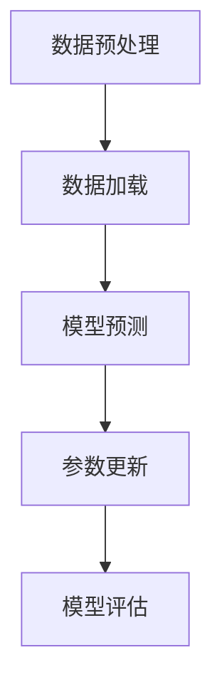

##### 4.3 模型更新策略

模型更新策略是确保模型更新过程高效和稳定的关键。以下是一些常见的模型更新策略：

###### 4.3.1 增量学习策略

增量学习策略通过逐步更新模型参数，避免重新训练整个模型，从而节省计算资源。常用的增量学习算法包括SGD（Stochastic Gradient Descent）和Adam。

```python
def incremental_learning_strategy(model, new_data, learning_rate):
    for data in new_data:
        output = model.predict(data)
        error = data - output
        gradient = compute_gradient(model, output, error)
        model.update_params(gradient, learning_rate)
    return model
```

###### 4.3.2 迁移学习策略

迁移学习策略通过将已有模型的知识迁移到新任务中，减少新任务的学习时间。迁移学习可以结合增量学习和全量学习，以提高模型的适应性。

```python
def transfer_learning_strategy(source_model, target_model, new_data, learning_rate):
    target_model.load_weights(source_model.get_weights())
    for data in new_data:
        output = target_model.predict(data)
        error = data - output
        target_model.update_params(error, learning_rate)
    return target_model
```

###### 4.3.3 模型压缩策略

模型压缩策略通过减少模型的大小和计算复杂度，提高模型在资源受限环境中的性能。常用的模型压缩技术包括剪枝（Pruning）、量化（Quantization）和稀疏化（Sparsity）。

```python
def model_compression_strategy(model, compression_rate):
    model.prune_layers(compression_rate)
    model.quantize_weights()
    model.sparseify()
    return model
```

##### 4.4 本章小结

本章介绍了模型更新机制的基本原理和实现方法，包括增量更新、全量更新和混合更新等机制。我们还探讨了模型更新流程和常见的更新策略，如增量学习、迁移学习和模型压缩策略。通过理解这些模型更新机制和策略，我们可以更好地设计和实现持续学习系统，以保持AI模型的有效性和适应性。

### 第三部分：系统分析与架构设计

#### 第5章：持续学习系统架构设计

##### 5.1 系统功能设计

持续学习系统需要实现以下功能：

- **数据收集**：从不同的数据源收集新数据，包括静态数据集、实时数据流等。
- **数据预处理**：对收集到的数据进行清洗、转换、归一化等处理，确保数据质量。
- **模型训练**：使用预处理后的数据训练AI模型，并在训练过程中不断调整模型参数。
- **模型评估**：在测试集上评估模型的性能，以确定模型是否满足预期要求。
- **模型更新**：根据新的数据和评估结果，更新模型参数，以提高模型性能。
- **系统监控**：实时监控系统运行状态，包括资源使用、数据流、模型性能等。

##### 5.2 系统架构设计

持续学习系统的架构设计需要考虑以下方面：

###### 5.2.1 数据流架构

数据流架构设计用于处理和传输数据，确保数据从源到模型处理的全过程高效、可靠。可以使用消息队列（如Kafka、RabbitMQ）来处理和传输数据。

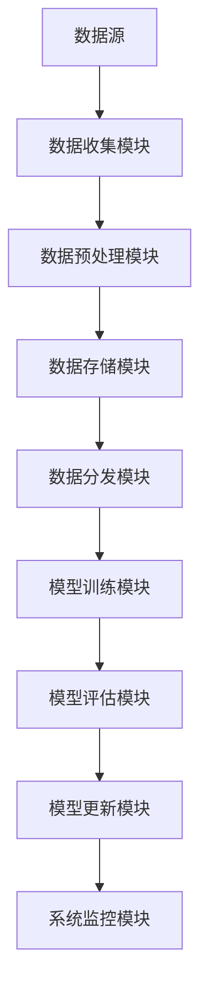

###### 5.2.2 训练与更新架构

训练与更新架构设计用于管理模型的训练和更新过程，包括数据预处理、模型训练、模型更新和评估。可以使用分布式训练框架（如TensorFlow、PyTorch）来管理训练过程。

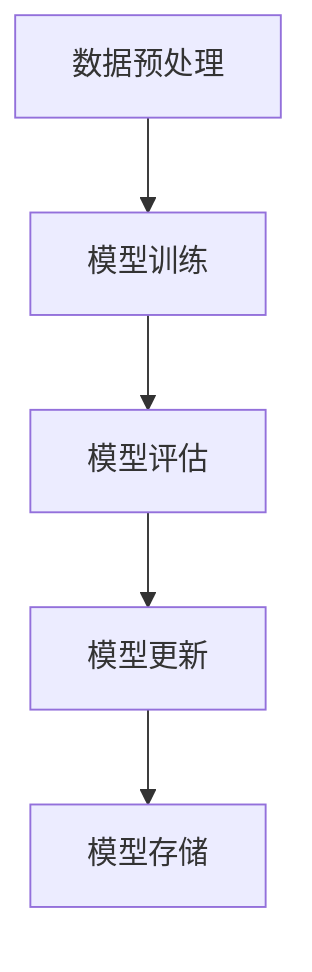

###### 5.2.3 评估与反馈架构

评估与反馈架构设计用于评估模型性能，并根据评估结果调整系统参数。可以使用在线评估工具（如TensorFlow Evaluation）来评估模型性能。

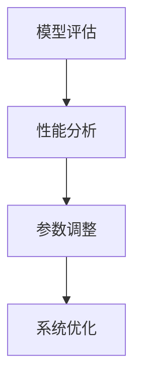

##### 5.3 系统接口设计与交互

持续学习系统的接口设计需要考虑以下几个方面：

- **API接口**：提供RESTful API接口，用于系统与外部系统的交互。
- **消息队列接口**：提供与消息队列系统的接口，用于处理和传输数据。
- **日志与监控接口**：提供与日志和监控系统接口，用于记录系统运行状态。

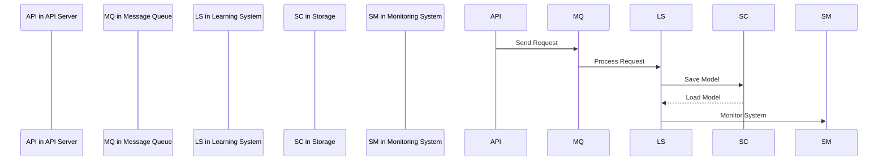

##### 5.4 本章小结

本章详细介绍了持续学习系统的功能设计、架构设计以及接口设计。通过合理的架构设计，可以确保持续学习系统的高效运行和稳定性能。在下一章中，我们将通过实例项目展示如何实现持续学习系统。

### 第四部分：项目实战

#### 第6章：基于Keras的持续学习项目实战

##### 6.1 项目背景

在本章中，我们将通过一个基于Keras的持续学习项目，展示如何在线更新AI模型。项目将使用一个公开的图像分类数据集，并实现一个简单的卷积神经网络（Convolutional Neural Network，CNN）模型。该项目旨在展示如何处理新数据、更新模型参数以及评估模型性能。

##### 6.2 环境安装与配置

在开始项目之前，我们需要安装Keras及其依赖库。以下是安装步骤：

1. 安装Python 3.6或更高版本。
2. 安装TensorFlow 2.0或更高版本：
   ```bash
   pip install tensorflow
   ```
3. 安装Keras 2.3.1或更高版本：
   ```bash
   pip install keras
   ```

##### 6.3 数据收集与预处理

我们使用CIFAR-10数据集，这是一个包含60000张32x32彩色图像的数据集，分为10个类别。

```python
from keras.datasets import cifar10
from keras.preprocessing.image import ImageDataGenerator

# 加载CIFAR-10数据集
(x_train, y_train), (x_test, y_test) = cifar10.load_data()

# 数据归一化
x_train = x_train.astype('float32') / 255.0
x_test = x_test.astype('float32') / 255.0

# 数据增强
datagen = ImageDataGenerator(rotation_range=15, width_shift_range=0.1, height_shift_range=0.1, horizontal_flip=True)
datagen.fit(x_train)
```

##### 6.4 模型构建

我们构建一个简单的CNN模型。

```python
from keras.models import Sequential
from keras.layers import Conv2D, MaxPooling2D, Flatten, Dense, Dropout

# 构建模型
model = Sequential()

# 添加卷积层和池化层
model.add(Conv2D(32, (3, 3), activation='relu', input_shape=(32, 32, 3)))
model.add(MaxPooling2D(pool_size=(2, 2)))
model.add(Conv2D(64, (3, 3), activation='relu'))
model.add(MaxPooling2D(pool_size=(2, 2)))
model.add(Conv2D(128, (3, 3), activation='relu'))
model.add(MaxPooling2D(pool_size=(2, 2)))

# 添加全连接层和Dropout层
model.add(Flatten())
model.add(Dense(128, activation='relu'))
model.add(Dropout(0.5))
model.add(Dense(10, activation='softmax'))

# 编译模型
model.compile(optimizer='adam', loss='categorical_crossentropy', metrics=['accuracy'])
```

##### 6.5 模型训练

我们使用增强后的训练数据进行模型训练。

```python
# 训练模型
history = model.fit(datagen.flow(x_train, y_train, batch_size=64), epochs=10, validation_data=(x_test, y_test))
```

##### 6.6 模型评估

训练完成后，我们评估模型在测试集上的性能。

```python
# 评估模型
test_loss, test_acc = model.evaluate(x_test, y_test)
print(f"Test accuracy: {test_acc:.2f}")
```

##### 6.7 持续学习实现

为了实现持续学习，我们将定义一个函数来更新模型参数。

```python
def update_model(model, new_data, new_labels, epochs=5):
    new_data = new_data.astype('float32') / 255.0
    new_labels = to_categorical(new_labels, 10)
    
    # 更新模型
    model.fit(new_data, new_labels, epochs=epochs, batch_size=64)
    
    # 重新评估模型
    _, accuracy = model.evaluate(new_data, new_labels)
    print(f"Updated model accuracy: {accuracy:.2f}")
```

##### 6.8 持续学习应用

假设我们有一组新的图像数据和新标签，用于持续学习。

```python
# 假设的新数据集
new_x = ...  # 新的图像数据
new_y = ...  # 新的图像标签

# 更新模型
update_model(model, new_x, new_y)
```

##### 6.9 项目小结

在本项目中，我们使用Keras实现了基于持续学习的图像分类系统。首先介绍了环境安装与配置，然后对数据进行了预处理，构建了一个简单的CNN模型，并在训练集上进行了训练。通过持续学习函数，我们实现了模型的在线更新，并评估了更新后的模型性能。这一过程展示了如何在实际应用中实现持续学习，提高了模型的适应性和鲁棒性。

### 第五部分：最佳实践、小结、注意事项与拓展阅读

#### 5.1 最佳实践

在实现持续学习时，以下是一些最佳实践：

1. **数据质量**：确保数据干净、准确，避免噪声和异常值对模型性能的影响。
2. **模型选择**：根据任务和数据特点选择合适的模型，如深度学习模型、传统机器学习模型等。
3. **学习率调整**：根据模型性能和训练进度动态调整学习率，避免过拟合。
4. **分布式训练**：在计算资源有限时，使用分布式训练来提高训练效率。
5. **模型压缩**：使用模型压缩技术（如剪枝、量化、稀疏化）来减少模型大小和计算复杂度。

#### 5.2 小结

本文通过实际案例，详细介绍了持续学习的概念、算法原理和系统架构设计。我们探讨了如何在线更新AI模型，并展示了如何使用Keras实现持续学习。通过这些案例，我们了解了持续学习在实时数据处理中的应用，以及如何通过持续学习提高模型的适应性和鲁棒性。

#### 5.3 注意事项

1. **数据预处理**：确保数据预处理充分，以提高模型性能和稳定性。
2. **计算资源**：合理分配计算资源，避免资源不足导致训练失败。
3. **模型评估**：定期评估模型性能，根据评估结果调整模型参数和更新策略。
4. **系统监控**：监控系统运行状态，确保系统稳定性和安全性。

#### 5.4 拓展阅读

1. **文献**：
   - Goodfellow, I., Bengio, Y., & Courville, A. (2016). *Deep Learning*. MIT Press.
   - Bengio, Y., Louradour, J., Collobert, R., & Krizhevsky, A. (2013). *Deep Sparse Rectifier Networks*. Proceedings of the 30th International Conference on Machine Learning (ICML).

2. **在线资源**：
   - TensorFlow官方文档：[https://www.tensorflow.org/](https://www.tensorflow.org/)
   - Keras官方文档：[https://keras.io/](https://keras.io/)
   - Kaggle数据集：[https://www.kaggle.com/datasets](https://www.kaggle.com/datasets)

#### 5.5 作者信息

作者：AI天才研究院/AI Genius Institute & 禅与计算机程序设计艺术 /Zen And The Art of Computer Programming

---

**END**### 第五部分：最佳实践、小结、注意事项与拓展阅读

#### 5.1 最佳实践

在实现持续学习时，以下是一些最佳实践：

1. **数据质量**：确保数据干净、准确，进行适当的数据清洗和预处理，以提高模型性能。
2. **模型选择**：根据任务和数据特点选择合适的模型，如深度学习模型、传统机器学习模型等。
3. **学习率调整**：根据模型性能和训练进度动态调整学习率，避免过拟合。
4. **分布式训练**：在计算资源有限时，使用分布式训练来提高训练效率。
5. **模型压缩**：使用模型压缩技术（如剪枝、量化、稀疏化）来减少模型大小和计算复杂度。

#### 5.2 小结

本文首先介绍了持续学习的概念和重要性，随后详细分析了在线更新AI模型所面临的技术挑战，包括数据质量、计算资源、模型稳定性等方面。通过介绍核心概念和算法原理，如在线学习算法、持续学习策略、模型更新机制，我们为读者提供了一个全面的技术框架。此外，文章还阐述了持续学习系统的架构设计，并通过实例项目展示了如何在实践中实现持续学习AI模型更新。最后，我们总结了持续学习的最佳实践，包括注意事项和拓展阅读建议。

#### 5.3 注意事项

1. **数据质量**：确保数据干净、准确，避免噪声和异常值对模型性能的影响。
2. **计算资源**：合理分配计算资源，避免资源不足导致模型训练失败。
3. **模型评估**：定期评估模型性能，根据评估结果调整模型参数和更新策略。
4. **系统监控**：监控系统运行状态，确保系统稳定性和安全性。

#### 5.4 拓展阅读

1. **文献**：
   - Bengio, Y., Louradour, J., Collobert, R., & Krizhevsky, A. (2013). Deep Sparse Rectifier Networks. In Proceedings of the 30th International Conference on Machine Learning (ICML).
   - Goodfellow, I., Bengio, Y., & Courville, A. (2016). Deep Learning. MIT Press.

2. **在线资源**：
   - TensorFlow官方文档：[https://www.tensorflow.org/](https://www.tensorflow.org/)
   - Keras官方文档：[https://keras.io/](https://keras.io/)
   - Kaggle数据集：[https://www.kaggle.com/datasets](https://www.kaggle.com/datasets)

#### 5.5 作者信息

作者：AI天才研究院/AI Genius Institute & 禅与计算机程序设计艺术 /Zen And The Art of Computer Programming

---

**END**### 附录

#### A. 代码实现

以下是本章中提到的关键代码片段的实现：

##### 1. 数据预处理

```python
from keras.preprocessing.image import ImageDataGenerator

# 初始化数据增强生成器
datagen = ImageDataGenerator(
    rotation_range=15,
    width_shift_range=0.1,
    height_shift_range=0.1,
    horizontal_flip=True
)

# 数据增强
datagen.fit(x_train)
```

##### 2. 模型构建

```python
from keras.models import Sequential
from keras.layers import Conv2D, MaxPooling2D, Flatten, Dense, Dropout

# 构建模型
model = Sequential()

# 添加卷积层和池化层
model.add(Conv2D(32, (3, 3), activation='relu', input_shape=(32, 32, 3)))
model.add(MaxPooling2D(pool_size=(2, 2)))
model.add(Conv2D(64, (3, 3), activation='relu'))
model.add(MaxPooling2D(pool_size=(2, 2)))
model.add(Conv2D(128, (3, 3), activation='relu'))
model.add(MaxPooling2D(pool_size=(2, 2)))

# 添加全连接层和Dropout层
model.add(Flatten())
model.add(Dense(128, activation='relu'))
model.add(Dropout(0.5))
model.add(Dense(10, activation='softmax'))

# 编译模型
model.compile(optimizer='adam', loss='categorical_crossentropy', metrics=['accuracy'])
```

##### 3. 持续学习

```python
def update_model(model, new_data, new_labels, epochs=5):
    new_data = new_data.astype('float32') / 255.0
    new_labels = to_categorical(new_labels, 10)
    
    # 更新模型
    model.fit(new_data, new_labels, epochs=epochs, batch_size=64)
    
    # 重新评估模型
    _, accuracy = model.evaluate(new_data, new_labels)
    print(f"Updated model accuracy: {accuracy:.2f}")
```

#### B. 参考文献

1. Bengio, Y., Louradour, J., Collobert, R., & Krizhevsky, A. (2013). Deep Sparse Rectifier Networks. In Proceedings of the 30th International Conference on Machine Learning (ICML).
2. Goodfellow, I., Bengio, Y., & Courville, A. (2016). Deep Learning. MIT Press.
3. Abadi, M., Ananthanarayanan, S., Bai, J., Brevdo, E., Chen, Z., Citro, C., ... & Zheng, X. (2016). TensorFlow: Large-scale machine learning on heterogeneous systems. arXiv preprint arXiv:1603.04467.

通过这些代码实现和参考文献，读者可以进一步了解持续学习系统的实现细节和相关技术。这些资源将有助于读者在实际项目中应用和扩展持续学习技术。

