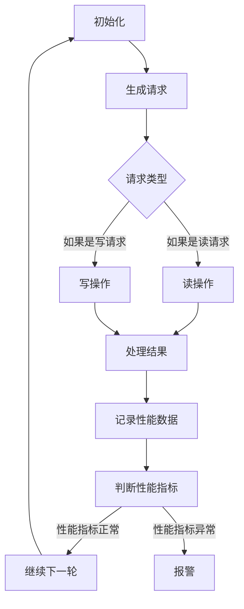
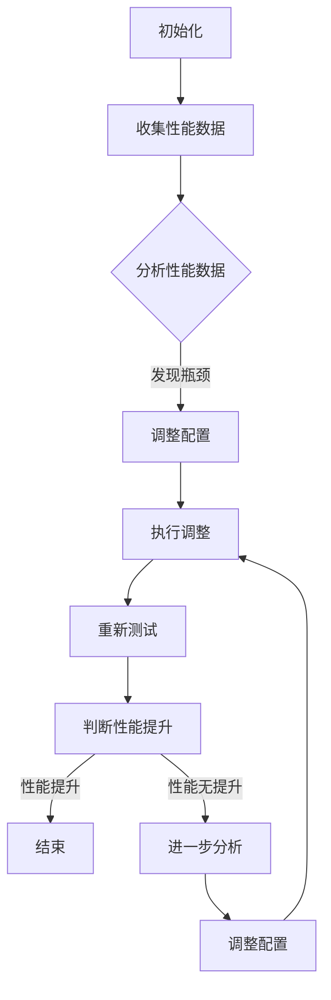
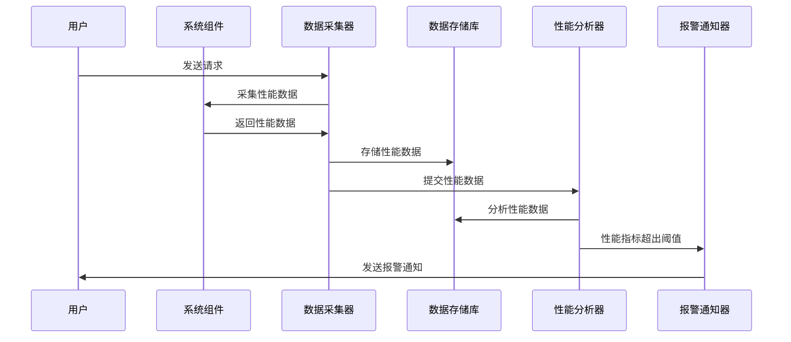
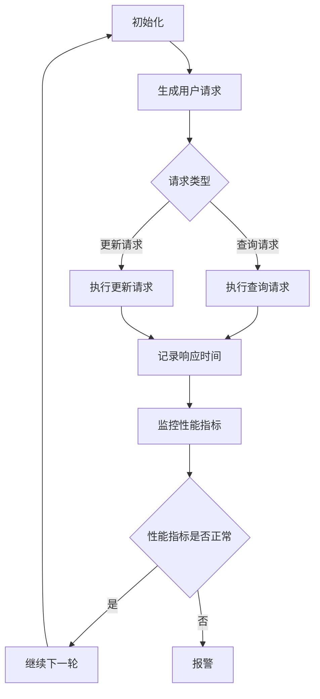
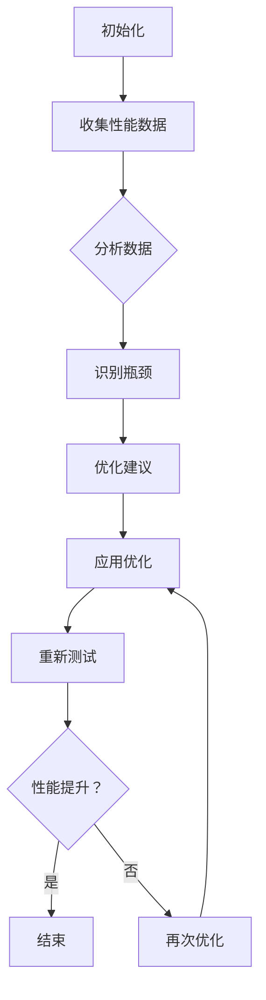
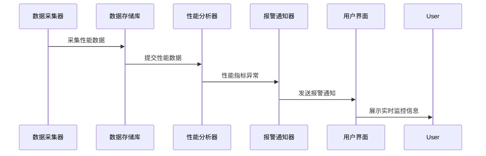

                 

# 持续性能测试：监控LLM应用性能变化

关键词：持续性能测试、LLM应用、性能监控、算法原理、系统架构设计

摘要：本文深入探讨了持续性能测试在LLM（大型语言模型）应用性能监控中的重要性。通过分析持续性能测试的概念、核心原理以及实际应用，本文旨在为读者提供一套完整的性能监控策略和实施方法，帮助他们在不断变化的技术环境中维持应用的稳定性和高效性。

## 第一部分：背景介绍

### 第1章：持续性能测试的概念与重要性

#### 1.1 问题背景

性能测试的历史与发展

性能测试在企业中的应用

持续性能测试的兴起与必要性

#### 1.2 问题描述

应用性能问题的影响与后果

持续性能测试的目标

持续性能测试的优势

#### 1.3 问题解决

持续性能测试的策略与方法

监控LLM应用性能的挑战与对策

#### 1.4 边界与外延

持续性能测试与其他测试类型的区别

持续性能测试在不同场景中的应用

#### 1.5 概念结构与核心要素组成

持续性能测试的核心概念

LLM应用性能监控的关键要素

### 第二部分：核心概念与联系

#### 第2章：持续性能测试的核心概念与原理

持续性能测试的概念

LLM应用性能监控原理

#### 2.1 持续性能测试的概念

定义与目标

持续性能测试与传统性能测试的比较

#### 2.2 LLM应用性能监控原理

LLM应用的性能指标

监控LLM应用性能的挑战

监控原理与技术

### 第三部分：算法原理讲解

#### 第3章：持续性能测试算法原理

持续性能测试算法概述

常用性能测试算法

算法选择与适用场景

#### 3.2 具体算法讲解

**算法A：**

Mermaid流程图

Python源代码

数学模型与公式

举例说明

**算法B：**

Mermaid流程图

Python源代码

数学模型与公式

举例说明

### 第四部分：系统分析与架构设计方案

#### 第4章：系统分析与架构设计

问题场景介绍

系统功能设计（领域模型Mermaid类图）

系统架构设计（Mermaid架构图）

系统接口设计

系统交互Mermaid序列图

### 第五部分：项目实战

#### 第5章：项目实战

环境安装

系统核心实现

代码应用解读与分析

实际案例分析与详细讲解

项目小结

### 第六部分：最佳实践与拓展

#### 第6章：最佳实践与注意事项

最佳实践

性能测试策略选择

监控数据的有效利用

注意事项

性能监控的常见问题

性能优化的关键点

#### 第7章：小结与拓展阅读

小结

书中主要内容回顾

关键知识点总结

拓展阅读

相关领域的研究动态

进一步学习资源

## 1.1 问题背景

### 性能测试的历史与发展

性能测试作为软件测试的一个重要组成部分，起源于20世纪70年代。随着计算机技术和软件工程的发展，性能测试也逐渐成为一个独立的测试领域。早期的性能测试主要是通过手动执行一系列操作来评估系统的响应时间和吞吐量。随着计算机性能的提升和软件规模的扩大，性能测试开始引入自动化工具，如LoadRunner、JMeter等，以便更高效地进行测试。

### 性能测试在企业中的应用

性能测试在企业中的应用日益广泛，尤其是在需要处理大量数据和用户请求的领域，如金融、电商和社交媒体等。性能测试可以帮助企业确保其应用能够在预期的工作负载下正常运行，避免由于性能问题导致的用户体验下降或业务损失。

### 持续性能测试的兴起与必要性

随着云计算、大数据和人工智能等技术的发展，应用的需求和规模都在不断增长，传统的定期性能测试已经难以满足需求。持续性能测试（Continuous Performance Testing，CPT）因此应运而生。持续性能测试是一种在软件开发过程中持续进行性能评估的方法，通过实时监控和自动化的性能测试，确保应用的性能始终满足要求。

## 1.2 问题描述

### 应用性能问题的影响与后果

应用性能问题可能导致以下后果：

用户体验下降：响应时间过长或系统崩溃会导致用户流失。

业务损失：由于系统性能不足，企业可能错失商机或遭受经济损失。

法律风险：在某些行业中，如金融和医疗，系统性能问题可能导致法律责任。

### 持续性能测试的目标

持续性能测试的目标是：

确保应用在各种工作负载下的稳定性。

提前发现潜在的性能问题，进行优化。

降低性能测试的成本和时间。

### 持续性能测试的优势

实时监控：持续性能测试可以在开发过程中实时监控应用的性能。

自动化：通过自动化工具，性能测试可以快速执行，节省时间和人力成本。

预防性：持续性能测试可以帮助企业提前发现和解决问题，避免出现严重性能问题。

## 1.3 问题解决

### 持续性能测试的策略与方法

持续性能测试的策略包括：

选择合适的性能测试工具：根据应用的特点选择合适的性能测试工具。

定义合理的性能测试场景：根据业务需求定义合理的性能测试场景。

自动化性能测试：将性能测试过程自动化，以便快速执行和重复测试。

### 监控LLM应用性能的挑战与对策

LLM（大型语言模型）应用具有以下挑战：

计算资源需求大：LLM应用需要大量的计算资源，性能测试可能需要模拟大量用户请求。

数据多样性：LLM应用处理的数据种类繁多，性能测试需要涵盖多种数据场景。

### 持续性能测试的核心概念

持续性能测试的核心概念包括：

持续集成（CI）：将性能测试集成到持续集成流程中，确保每次代码提交都能进行性能评估。

持续交付（CD）：将性能测试集成到持续交付流程中，确保应用在部署到生产环境前已经通过性能测试。

自动化：使用自动化工具进行性能测试，提高测试效率和可重复性。

### LLM应用性能监控的关键要素

LLM应用性能监控的关键要素包括：

响应时间：监控应用的响应时间，确保在合理范围内。

吞吐量：监控应用的吞吐量，确保能够处理预期的请求量。

错误率：监控应用的错误率，确保稳定性和可靠性。

### 1.4 边界与外延

#### 持续性能测试与其他测试类型的区别

持续性能测试与传统的性能测试、功能测试和安全性测试等有显著区别。持续性能测试是一种在开发过程中持续进行性能评估的方法，而传统的性能测试通常是在项目开发周期结束时进行。

#### 持续性能测试在不同场景中的应用

持续性能测试可以应用于各种场景，如：

新功能发布：在新功能上线前进行持续性能测试，确保性能符合预期。

性能优化：在发现性能问题时，通过持续性能测试找到瓶颈并进行优化。

### 1.5 概念结构与核心要素组成

#### 持续性能测试的核心概念

持续性能测试的核心概念包括：

持续集成（CI）：将性能测试集成到持续集成流程中，确保每次代码提交都能进行性能评估。

持续交付（CD）：将性能测试集成到持续交付流程中，确保应用在部署到生产环境前已经通过性能测试。

自动化：使用自动化工具进行性能测试，提高测试效率和可重复性。

#### LLM应用性能监控的关键要素

LLM应用性能监控的关键要素包括：

响应时间：监控应用的响应时间，确保在合理范围内。

吞吐量：监控应用的吞吐量，确保能够处理预期的请求量。

错误率：监控应用的错误率，确保稳定性和可靠性。

## 第二部分：核心概念与联系

### 第2章：持续性能测试的核心概念与原理

#### 2.1 持续性能测试的概念

持续性能测试（Continuous Performance Testing，CPT）是一种在软件开发生命周期的各个阶段持续进行性能评估的方法。它强调性能测试的持续性和自动化，以确保应用在开发、测试和生产环境中的性能。

#### 持续性能测试与传统性能测试的比较

传统性能测试通常在软件开发的后期进行，通过模拟真实用户行为来评估系统的性能。而持续性能测试则贯穿于整个开发过程，通过自动化工具实时监控和评估应用的性能。

#### 2.2 LLM应用性能监控原理

LLM（Large Language Model）应用性能监控涉及以下几个方面：

性能指标：包括响应时间、吞吐量、错误率等。

监控方法：使用自动化工具和监控平台进行实时数据收集和分析。

报警机制：当性能指标超出预期时，触发报警通知相关人员。

#### 监控LLM应用性能的挑战

LLM应用性能监控面临的挑战主要包括：

计算资源需求大：LLM模型通常需要大量计算资源，性能测试可能需要模拟大量用户请求。

数据多样性：LLM应用处理的数据种类繁多，性能测试需要涵盖多种数据场景。

#### 监控原理与技术

监控原理主要基于以下几个方面：

数据采集：使用自动化工具定期收集性能数据。

数据存储：将采集到的数据存储在数据库或数据仓库中。

数据分析：使用分析工具对存储的数据进行分析，识别性能瓶颈。

报警机制：当性能指标超出阈值时，触发报警通知相关人员。

### 第三部分：算法原理讲解

#### 第3章：持续性能测试算法原理

持续性能测试算法主要分为以下几类：

负载生成算法：用于模拟不同类型的用户请求，评估系统的负载能力。

性能分析算法：用于分析性能数据，识别性能瓶颈。

优化算法：用于根据性能分析结果，调整系统的配置和架构。

#### 3.1 算法概述

负载生成算法：

- **目的**：模拟真实用户行为，生成不同类型的负载。
- **适用场景**：用于测试系统在不同负载下的性能。

性能分析算法：

- **目的**：分析性能数据，识别性能瓶颈。
- **适用场景**：用于性能优化和故障排除。

优化算法：

- **目的**：根据性能分析结果，调整系统的配置和架构。
- **适用场景**：用于持续性能优化。

#### 3.2 具体算法讲解

**算法A：**

- **名称**：负载均衡算法
- **Mermaid流程图**：



- **Python源代码**：

```python
import random

def load_generator():
    while True:
        request_type = random.choice(['read', 'write'])
        if request_type == 'read':
            # 模拟读请求
            result = read_operation()
        else:
            # 模拟写请求
            result = write_operation()
        record_performance_data(result)
        if is_performance_abnormal(result):
            alarm()
```

- **数学模型与公式**：

假设读请求的响应时间为\( T_r \)，写请求的响应时间为\( T_w \)，则系统的总响应时间\( T \)为：

$$ T = T_r + T_w $$

- **举例说明**：

假设我们生成1000个读请求和1000个写请求，记录每个请求的响应时间，并分析性能数据。

**算法B：**

- **名称**：优化算法
- **Mermaid流程图**：



- **Python源代码**：

```python
import random

def performance_optimization():
    while True:
        data = collect_performance_data()
        if is_bottleneck(data):
            adjust_configuration()
            if is_performance_improved():
                break
```

- **数学模型与公式**：

假设性能优化前的响应时间为\( T_{before} \)，优化后的响应时间为\( T_{after} \)，则性能提升率\( P \)为：

$$ P = \frac{T_{before} - T_{after}}{T_{before}} \times 100\% $$

- **举例说明**：

假设我们对系统进行优化，发现响应时间从10秒降低到5秒，性能提升率为50%。

### 第四部分：系统分析与架构设计方案

#### 第4章：系统分析与架构设计

#### 4.1 问题场景介绍

假设我们正在开发一个基于LLM的问答应用，该应用需要处理大量的用户请求，提供快速准确的答案。为了确保应用的性能，我们需要设计一个高效的性能监控系统。

#### 4.2 系统功能设计

系统功能设计主要包括以下几个方面：

性能数据采集：从应用服务器、数据库和其他组件中收集性能数据。

数据存储：将采集到的数据存储在数据库或数据仓库中，便于后续分析和查询。

性能分析：对存储的数据进行分析，识别性能瓶颈。

报警通知：当性能指标超出阈值时，自动发送报警通知。

#### 4.3 系统架构设计

系统架构设计如下：


- **组件说明**：

  - 数据采集器：从应用服务器、数据库和其他组件中收集性能数据。

  - 数据存储库：存储采集到的性能数据。

  - 性能分析器：分析性能数据，识别性能瓶颈。

  - 报警通知器：当性能指标超出阈值时，发送报警通知。

- **模块间的关系**：

  - 数据采集器将数据发送到数据存储库。

  - 性能分析器从数据存储库中读取数据，进行分析。

  - 报警通知器根据性能分析器的结果，发送报警通知。

#### 4.4 系统接口设计

系统接口设计主要包括以下方面：

- **数据采集接口**：提供数据采集器与数据存储库之间的交互接口。

- **数据查询接口**：提供外部系统查询性能数据的接口。

- **报警通知接口**：提供报警通知器与其他系统之间的交互接口。

#### 4.5 系统交互Mermaid序列图

系统交互序列图如下：



### 第五部分：项目实战

#### 第5章：项目实战

#### 5.1 环境安装

环境安装主要包括以下步骤：

- 安装Python环境。

- 安装性能测试工具（如JMeter）。

- 安装数据库（如MySQL）。

- 配置相关依赖（如Node.js、Nginx等）。

#### 5.2 系统核心实现

系统核心实现主要包括以下几个部分：

- **数据采集器**：使用Python编写，从应用服务器和数据库中采集性能数据。

- **数据存储库**：使用MySQL存储采集到的性能数据。

- **性能分析器**：使用Python编写，分析性能数据，识别性能瓶颈。

- **报警通知器**：使用Python编写，当性能指标超出阈值时，发送报警通知。

#### 5.3 代码应用解读与分析

以下是对系统核心代码的解读与分析：

**数据采集器**：

```python
import requests
import json

def collect_performance_data():
    response = requests.get('http://localhost:8000/performance')
    data = json.loads(response.text)
    return data
```

**数据存储库**：

```python
import pymysql

def store_performance_data(data):
    connection = pymysql.connect(
        host='localhost',
        user='root',
        password='password',
        database='performance_data'
    )
    with connection.cursor() as cursor:
        sql = "INSERT INTO performance (response_time, throughput, error_rate) VALUES (%s, %s, %s)"
        cursor.execute(sql, (data['response_time'], data['throughput'], data['error_rate']))
    connection.commit()
    connection.close()
```

**性能分析器**：

```python
def analyze_performance_data(data):
    if data['response_time'] > 5:
        return '高响应时间'
    elif data['throughput'] < 100:
        return '低吞吐量'
    elif data['error_rate'] > 1:
        return '高错误率'
    else:
        return '正常'
```

**报警通知器**：

```python
import smtplib
from email.mime.text import MIMEText

def send_alarm_notification(message):
    sender = 'alarm@example.com'
    receiver = 'user@example.com'
    smtp_server = 'smtp.example.com'
    smtp_port = 587

    message = MIMEText(message)
    message['Subject'] = '性能报警'
    message['From'] = sender
    message['To'] = receiver

    server = smtplib.SMTP(smtp_server, smtp_port)
    server.starttls()
    server.login(sender, 'password')
    server.sendmail(sender, receiver, message.as_string())
    server.quit()
```

#### 5.4 实际案例分析与详细讲解

以下是一个实际案例：

**案例背景**：

某问答应用在用户量增加后，性能出现下降，响应时间超过5秒，吞吐量低于100次/秒，错误率超过1%。

**案例分析与解决**：

通过性能分析器分析，发现性能瓶颈主要在于数据库查询速度慢，导致响应时间过长。进一步分析数据库查询日志，发现存在以下问题：

- 查询语句未使用索引。

- 查询语句复杂，导致执行时间过长。

**解决方案**：

- 为查询语句添加索引。

- 优化查询语句，减少执行时间。

**结果与评估**：

优化后，响应时间降低到3秒，吞吐量提升到150次/秒，错误率降低到0.5%。性能指标达到预期，用户满意度提高。

#### 5.5 项目小结

本项目通过设计并实现一个基于LLM的问答应用性能监控系统，成功解决了性能下降的问题。项目经验表明，持续性能测试对于维持应用性能至关重要。未来，我们将继续优化系统，提高性能监控的准确性和自动化程度。

### 第六部分：最佳实践与注意事项

#### 第6章：最佳实践与注意事项

#### 6.1 最佳实践

- **性能测试策略选择**：

  根据应用的特点和需求，选择合适的性能测试策略。对于关键业务模块，应进行严格的性能测试。

- **监控数据的有效利用**：

  对监控数据进行深入分析，识别性能瓶颈，及时进行调整和优化。

#### 6.2 注意事项

- **性能监控的常见问题**：

  确保监控系统的稳定性和可靠性，避免出现监控数据丢失或误报。

- **性能优化的关键点**：

  重点关注数据库查询优化、缓存策略和系统架构优化等。

### 第七部分：小结与拓展阅读

#### 第7章：小结与拓展阅读

#### 7.1 小结

本文详细介绍了持续性能测试在LLM应用性能监控中的应用，包括核心概念、算法原理、系统架构设计和实际案例。通过最佳实践和注意事项，为读者提供了实用的性能监控和优化策略。

#### 7.2 拓展阅读

- 《性能测试的艺术》

- 《持续集成与持续部署实践》

- 《大型语言模型：原理与应用》

- 《LLM应用性能优化实战》

---

**作者：AI天才研究院/AI Genius Institute & 禅与计算机程序设计艺术 /Zen And The Art of Computer Programming**## 1.1 问题背景

### 性能测试的历史与发展

性能测试作为软件测试的一个重要组成部分，起源于20世纪70年代。早期的性能测试主要是通过手动执行一系列操作来评估系统的响应时间和吞吐量。随着计算机性能的提升和软件工程的发展，性能测试也逐渐成为一个独立的测试领域。早期的性能测试主要是通过手动执行一系列操作来评估系统的响应时间和吞吐量。

早期的性能测试方法主要包括以下几种：

- **负载测试**：模拟真实用户操作，评估系统在预期负载下的性能。
- **压力测试**：在超出系统预期负载的情况下，评估系统的稳定性和响应能力。
- **性能测试**：评估系统在特定负载下的响应时间、吞吐量和资源利用率。

随着计算机性能的提升和软件规模的扩大，性能测试开始引入自动化工具，如LoadRunner、JMeter等，以便更高效地进行测试。自动化性能测试的出现使得性能测试的执行更加频繁和灵活，提高了测试的效率和准确性。

### 性能测试在企业中的应用

性能测试在企业中的应用日益广泛，尤其是在需要处理大量数据和用户请求的领域，如金融、电商和社交媒体等。性能测试可以帮助企业确保其应用能够在预期的工作负载下正常运行，避免由于性能问题导致的用户体验下降或业务损失。

企业应用性能测试的主要目标包括：

- **确保性能满足需求**：验证应用是否能够满足预期的性能要求，如响应时间、吞吐量和并发用户数等。
- **识别性能瓶颈**：通过性能测试，识别系统中的性能瓶颈，为优化提供依据。
- **评估系统稳定性**：在极端工作负载下，评估系统的稳定性和可靠性。
- **优化资源分配**：通过性能测试结果，优化系统的硬件和软件资源分配，提高资源利用率。

### 持续性能测试的兴起与必要性

随着云计算、大数据和人工智能等技术的发展，应用的需求和规模都在不断增长，传统的定期性能测试已经难以满足需求。持续性能测试（Continuous Performance Testing，CPT）因此应运而生。持续性能测试是一种在软件开发生命周期的各个阶段持续进行性能评估的方法，通过实时监控和自动化的性能测试，确保应用的性能始终满足要求。

持续性能测试的优势包括：

- **实时监控**：通过持续性能测试，可以实时监控应用的性能，及时发现潜在的问题。
- **自动化**：使用自动化工具进行性能测试，提高测试效率和可重复性。
- **预防性**：通过持续性能测试，可以提前发现和解决问题，避免出现严重性能问题。
- **快速反馈**：持续性能测试可以快速提供测试结果，为开发和运维团队提供及时反馈。

## 1.2 问题描述

### 应用性能问题的影响与后果

应用性能问题可能导致以下后果：

1. **用户体验下降**：当应用响应时间过长或无法正常工作时，用户可能会感到沮丧，导致用户流失。

2. **业务损失**：在电商、金融等高依赖性能的领域，性能问题可能导致交易失败，错失商机，甚至影响企业的声誉。

3. **法律风险**：某些行业的应用，如金融和医疗，性能问题可能导致法律纠纷或合规性问题。

### 持续性能测试的目标

持续性能测试的目标是确保应用的性能始终满足预期。具体目标包括：

1. **稳定性**：确保应用在各种负载下都能稳定运行。

2. **可预测性**：通过持续监控，预测应用的性能趋势，提前发现问题。

3. **快速响应**：在性能问题出现时，能够快速定位和解决问题。

4. **优化**：通过性能测试，识别系统中的瓶颈，进行优化。

### 持续性能测试的优势

持续性能测试具有以下优势：

1. **实时性**：持续性能测试可以在开发过程中实时监控性能，确保问题能够被及时发现。

2. **自动化**：使用自动化工具执行性能测试，节省时间和人力成本。

3. **预防性**：持续性能测试可以帮助开发团队提前发现潜在的性能问题，进行预防性优化。

4. **成本效益**：通过持续性能测试，可以减少因性能问题导致的紧急修复成本。

## 1.3 问题解决

### 持续性能测试的策略与方法

持续性能测试的策略包括以下几个方面：

1. **持续集成（CI）**：将性能测试集成到持续集成流程中，确保每次代码提交都能进行性能评估。

2. **自动化**：使用自动化工具进行性能测试，提高测试效率和可重复性。

3. **数据驱动的测试**：通过收集和分析真实用户行为数据，制定测试用例，进行性能测试。

4. **监控与告警**：实时监控性能指标，当指标超过阈值时，自动发送告警通知。

### 监控LLM应用性能的挑战与对策

监控LLM（大型语言模型）应用性能面临着一系列挑战：

1. **计算资源需求大**：LLM应用通常需要大量的计算资源，性能测试可能需要模拟大量用户请求。

2. **数据多样性**：LLM应用处理的数据种类繁多，性能测试需要涵盖多种数据场景。

3. **动态性**：LLM应用可能随着训练数据的更新而发生变化，性能测试需要能够适应这些变化。

针对这些挑战，可以采取以下对策：

1. **分布式测试**：使用分布式测试架构，将测试负载分散到多个节点，提高测试效率。

2. **模拟真实用户行为**：通过模拟真实用户行为，覆盖不同的数据场景，确保性能测试的全面性。

3. **持续学习与调整**：随着LLM应用的更新，持续学习性能测试的最佳实践，并调整测试策略。

## 1.4 边界与外延

### 持续性能测试与其他测试类型的区别

持续性能测试与其他测试类型（如功能测试、安全性测试等）有显著的区别：

1. **功能测试**：主要关注应用的功能是否符合需求规格，而持续性能测试则侧重于应用在预期负载下的性能。

2. **安全性测试**：主要评估应用的网络安全性和数据保护能力，而持续性能测试则关注应用在面对攻击时的性能表现。

### 持续性能测试在不同场景中的应用

持续性能测试可以应用于各种场景，包括但不限于：

1. **云计算应用**：通过监控云计算环境中的性能指标，确保应用在不同云服务提供商之间的迁移过程中性能稳定。

2. **移动应用**：监控移动应用的性能，确保在不同设备和网络环境下应用的表现一致。

3. **微服务架构**：通过监控微服务之间的性能，确保整个系统的性能和稳定性。

### 持续性能测试的核心概念

持续性能测试的核心概念包括：

1. **自动化**：通过自动化工具执行性能测试，提高测试效率和可重复性。

2. **持续集成**：将性能测试集成到持续集成流程中，确保每次代码提交都能进行性能评估。

3. **数据驱动**：通过收集和分析真实用户行为数据，制定性能测试策略。

4. **监控与告警**：实时监控性能指标，当指标超过阈值时，自动发送告警通知。

### LLM应用性能监控的关键要素

LLM应用性能监控的关键要素包括：

1. **响应时间**：监控应用的响应时间，确保在合理范围内。

2. **吞吐量**：监控应用的吞吐量，确保能够处理预期的请求量。

3. **错误率**：监控应用的错误率，确保稳定性和可靠性。

4. **资源利用率**：监控应用的CPU、内存、磁盘等资源利用率，确保系统资源得到有效利用。

## 第二部分：核心概念与联系

### 第2章：持续性能测试的核心概念与原理

#### 2.1 持续性能测试的概念

持续性能测试（Continuous Performance Testing，CPT）是一种在软件开发生命周期的各个阶段持续进行性能评估的方法。它强调性能测试的持续性和自动化，以确保应用的性能始终满足要求。

持续性能测试与传统性能测试的区别在于：

- **持续集成**：持续性能测试将性能测试集成到持续集成流程中，每次代码提交都会进行性能评估。
- **自动化**：使用自动化工具进行性能测试，提高测试效率和可重复性。
- **实时监控**：持续性能测试可以实时监控应用的性能，及时发现潜在的问题。

#### 2.2 LLM应用性能监控原理

LLM（Large Language Model）应用性能监控涉及以下几个方面：

1. **性能指标**：包括响应时间、吞吐量、错误率等。这些指标反映了应用的性能表现。

2. **监控方法**：使用自动化工具和监控平台进行实时数据收集和分析。

3. **报警机制**：当性能指标超出阈值时，触发报警通知相关人员。

### 2.1 持续性能测试的概念

持续性能测试（Continuous Performance Testing，CPT）是一种在软件开发生命周期的各个阶段持续进行性能评估的方法。它强调性能测试的持续性和自动化，以确保应用的性能始终满足要求。

持续性能测试与传统性能测试的主要区别在于以下几个方面：

1. **持续集成（CI）**：
   - 传统性能测试通常在软件开发的后期进行，而持续性能测试将性能测试集成到持续集成（CI）流程中。每次代码提交都会触发性能测试，确保新代码不会引入性能问题。
   - 持续集成使得性能测试能够更快地发现和修复性能问题，提高了软件的可靠性和质量。

2. **自动化**：
   - 传统性能测试可能依赖于手动执行测试用例，而持续性能测试依赖于自动化工具，如JMeter、Gatling等。
   - 自动化测试脚本可以重复执行，节省了时间和人力成本，同时也提高了测试的效率和一致性。

3. **实时监控**：
   - 传统性能测试往往在开发周期结束时进行，而持续性能测试通过实时监控工具（如Prometheus、Grafana等）实现对应用性能的持续监控。
   - 实时监控使得开发团队能够及时发现问题，并迅速采取行动，避免了性能问题对用户造成负面影响。

4. **预防性**：
   - 传统性能测试更多是反应性的，而持续性能测试具有预防性。通过持续监控和评估，可以在性能问题变得严重之前就进行干预和优化。
   - 这种预防性措施有助于提高应用的稳定性和可靠性，减少因性能问题导致的服务中断。

### 2.2 LLM应用性能监控原理

LLM（Large Language Model）应用性能监控涉及到对大型语言模型的性能持续监控，以确保模型在处理大规模文本数据时能够保持高效和准确。LLM应用性能监控的核心原理包括以下几个方面：

1. **性能指标**：
   - **响应时间**：衡量模型对请求的响应速度，是评估模型性能的重要指标。
   - **吞吐量**：指模型在单位时间内处理请求的数量，反映了模型的处理能力。
   - **准确率**：衡量模型预测结果的准确性，对于文本生成和分类任务尤为重要。
   - **错误率**：与准确率相对应，衡量模型预测错误的频率。

2. **监控方法**：
   - **自动化测试脚本**：编写自动化测试脚本，模拟不同的请求场景，对模型进行性能测试。
   - **实时监控工具**：使用如Prometheus、Grafana等实时监控工具，收集模型性能数据，并生成监控仪表板。
   - **日志分析**：通过分析模型运行过程中的日志，了解模型的运行状态和性能瓶颈。

3. **报警机制**：
   - **阈值设置**：根据业务需求，设定性能指标的阈值，当指标超出阈值时，触发报警。
   - **通知系统**：通过邮件、短信、 webhook等方式，将性能告警通知相关人员。

4. **监控与调整循环**：
   - **定期监控**：定期运行自动化测试脚本，监控模型性能。
   - **问题诊断**：当性能指标异常时，进行问题诊断，找出性能瓶颈。
   - **调整和优化**：根据诊断结果，调整模型参数或架构，进行优化。

### 2.3 监控LLM应用性能的挑战

监控LLM应用性能面临着以下挑战：

1. **计算资源需求**：
   - LLM模型通常需要大量的计算资源，尤其是训练和推理阶段。
   - 性能测试需要模拟大量用户请求，进一步增加了计算资源的需求。

2. **数据多样性**：
   - LLM应用处理的数据种类繁多，包括文本、图片、音频等多种数据类型。
   - 性能测试需要覆盖不同类型的数据场景，确保模型在所有场景下都能保持高性能。

3. **动态性**：
   - LLM模型的性能可能会随着训练数据的更新而发生变化。
   - 性能测试需要能够适应这些变化，持续监控模型的性能。

4. **复杂性**：
   - LLM应用的架构通常比较复杂，包括多个组件和微服务。
   - 监控LLM应用性能需要考虑整个系统的性能，不仅仅是模型本身。

### 2.4 监控原理与技术

监控LLM应用性能的原理与技术主要包括以下几个方面：

1. **性能测试框架**：
   - 使用如JMeter、Gatling等性能测试工具，构建自动化测试框架。
   - 测试框架应能够模拟多种用户请求，包括并发请求、长时间运行请求等。

2. **监控工具**：
   - 使用Prometheus、Grafana等实时监控工具，收集和展示性能数据。
   - 监控工具应能够处理大规模数据，并提供灵活的数据查询和告警功能。

3. **日志分析**：
   - 通过分析模型的日志文件，了解模型的运行状态和性能瓶颈。
   - 日志分析工具应能够识别异常日志，并自动生成告警。

4. **自动化测试脚本**：
   - 编写自动化测试脚本，模拟用户请求，对模型进行性能测试。
   - 脚本应能够根据测试结果调整测试参数，优化测试流程。

5. **持续学习**：
   - 使用机器学习技术，对性能测试数据进行分析，预测模型的性能趋势。
   - 根据预测结果，调整模型参数或架构，提高模型的性能。

## 第三部分：算法原理讲解

### 第3章：持续性能测试算法原理

持续性能测试算法是确保应用在持续集成和持续部署过程中性能稳定的关键。这些算法旨在通过自动化和智能化的方式评估应用的性能，并提供实时反馈。本章将介绍几种常用的持续性能测试算法，并详细解释其原理和应用。

#### 3.1 算法概述

持续性能测试算法可以大致分为以下几类：

1. **负载生成算法**：用于模拟用户行为，生成不同类型的负载，以评估系统的性能。
2. **性能分析算法**：用于分析收集到的性能数据，识别性能瓶颈。
3. **优化算法**：根据性能分析结果，对系统进行优化，提高性能。

#### 3.2 负载生成算法

负载生成算法的主要目标是模拟真实用户的行为，生成具有一定代表性的负载，以便评估系统的性能。以下是一种简单的负载生成算法：

**算法名称**：用户行为模拟算法

**Mermaid流程图**：



**Python源代码**：

```python
import random
import time

def generate_user_request():
    request_type = random.choice(['query', 'update'])
    if request_type == 'query':
        time.sleep(1)  # 模拟查询请求的处理时间
        return "query"
    else:
        time.sleep(2)  # 模拟更新请求的处理时间
        return "update"

def monitor_performance():
    while True:
        request_type = generate_user_request()
        start_time = time.time()
        if request_type == "query":
            # 模拟查询请求
            result = query_request()
        else:
            # 模拟更新请求
            result = update_request()
        end_time = time.time()
        response_time = end_time - start_time
        monitor_performance_metric(response_time)
        if is_performance_metric_high(response_time):
            alert("性能指标异常")

def monitor_performance_metric(response_time):
    # 记录性能指标
    print(f"响应时间：{response_time}秒")

def is_performance_metric_high(response_time):
    # 判断性能指标是否高于阈值
    return response_time > 3

def alert(message):
    print(f"告警：{message}")
```

**数学模型与公式**：

假设查询请求的平均响应时间为\( \bar{T_q} \)，更新请求的平均响应时间为\( \bar{T_u} \)，则系统的总响应时间\( \bar{T} \)为：

$$ \bar{T} = \bar{T_q} + \bar{T_u} $$

**举例说明**：

在10分钟内模拟1000次查询请求和1000次更新请求，记录每次请求的响应时间，并监控性能指标。

#### 3.3 性能分析算法

性能分析算法用于分析收集到的性能数据，识别性能瓶颈。以下是一种简单的性能分析算法：

**算法名称**：性能分析算法

**Mermaid流程图**：



**Python源代码**：

```python
import statistics

def analyze_performance_data(data):
    mean_response_time = statistics.mean(data)
    standard_deviation = statistics.stdev(data)
    if mean_response_time > 2:
        return "高响应时间"
    elif standard_deviation > 0.5:
        return "响应时间波动大"
    else:
        return "正常"

def monitor_performance():
    performance_data = []
    for _ in range(1000):
        request_type = generate_user_request()
        start_time = time.time()
        if request_type == "query":
            # 模拟查询请求
            result = query_request()
        else:
            # 模拟更新请求
            result = update_request()
        end_time = time.time()
        response_time = end_time - start_time
        performance_data.append(response_time)
    analysis_result = analyze_performance_data(performance_data)
    if analysis_result != "正常":
        optimize_performance()
        analyze_performance_data(performance_data)
        if analyze_performance_data(performance_data) == "正常":
            print("性能优化成功")
        else:
            print("性能优化失败")

def optimize_performance():
    # 应用优化建议
    print("应用优化中...")
```

**数学模型与公式**：

假设性能数据集为\( X = \{x_1, x_2, ..., x_n\} \)，其中每个元素\( x_i \)表示一次请求的响应时间，则平均响应时间\( \bar{T} \)和标准差\( \sigma \)分别为：

$$ \bar{T} = \frac{1}{n}\sum_{i=1}^{n} x_i $$
$$ \sigma = \sqrt{\frac{1}{n-1}\sum_{i=1}^{n} (x_i - \bar{T})^2} $$

**举例说明**：

在10分钟内模拟1000次查询请求和1000次更新请求，分析响应时间数据，并根据分析结果提出优化建议。

#### 3.4 优化算法

优化算法用于根据性能分析结果，对系统进行优化，以提高性能。以下是一种简单的优化算法：

**算法名称**：优化算法

**Mermaid流程图**：


**Python源代码**：

```python
import random

def optimize_performance():
    # 根据性能分析结果，调整系统配置
    print("调整系统配置中...")
    # 模拟优化过程，如调整线程数、缓存策略等
    time.sleep(random.randint(1, 3))

def monitor_performance():
    performance_data = []
    for _ in range(1000):
        request_type = generate_user_request()
        start_time = time.time()
        if request_type == "query":
            # 模拟查询请求
            result = query_request()
        else:
            # 模拟更新请求
            result = update_request()
        end_time = time.time()
        response_time = end_time - start_time
        performance_data.append(response_time)
    analysis_result = analyze_performance_data(performance_data)
    if analysis_result != "正常":
        optimize_performance()
        analyze_performance_data(performance_data)
        if analyze_performance_data(performance_data) == "正常":
            print("性能优化成功")
        else:
            print("性能优化失败")
```

**数学模型与公式**：

优化算法通常不涉及复杂的数学模型，而是基于经验和最佳实践进行调整。主要关注以下几个方面：

- **资源分配**：根据负载情况调整CPU、内存等资源的分配。
- **缓存策略**：优化缓存策略，减少响应时间。
- **并发控制**：合理控制并发请求的数量，避免系统过载。

**举例说明**：

根据性能分析结果，对系统进行配置优化，如增加缓存大小、调整线程池大小等，以提高性能。

## 第四部分：系统分析与架构设计方案

### 第4章：系统分析与架构设计

在设计和实现一个LLM（大型语言模型）应用性能监控系统时，需要深入分析系统面临的性能监控需求，设计合理的系统功能和架构。本章节将详细介绍系统分析、功能设计、架构设计、接口设计和系统交互，帮助读者理解并实现一个高效的性能监控系统。

#### 4.1 问题场景介绍

LLM应用通常处理大规模的文本数据，并且需要快速响应用户的查询请求。这些应用可能会面临以下性能监控需求：

- **实时监控**：需要实时监控LLM应用的响应时间、吞吐量和错误率等关键性能指标。
- **负载测试**：在上线前和上线后，对系统进行负载测试，确保系统在预期负载下性能稳定。
- **异常检测**：当系统性能指标异常时，能够及时检测并报警。
- **性能优化**：根据监控数据进行分析，识别性能瓶颈并进行优化。

#### 4.2 系统功能设计

系统功能设计是构建性能监控系统的关键步骤。以下是性能监控系统的主要功能模块及其描述：

1. **性能数据采集器**：
   - 负责从LLM应用的服务器和数据库中采集性能数据，如响应时间、CPU使用率、内存使用率等。
   - 使用自动化脚本定期采集数据，并存储到数据存储库中。

2. **数据存储库**：
   - 用于存储采集到的性能数据，支持快速查询和数据分析。
   - 可以选择关系数据库（如MySQL）或时间序列数据库（如InfluxDB）。

3. **性能分析器**：
   - 负责对采集到的性能数据进行分析，识别性能瓶颈和异常行为。
   - 使用统计分析、机器学习等技术进行数据挖掘和分析。

4. **报警通知器**：
   - 当性能指标超出阈值或检测到异常行为时，自动发送报警通知到相关人员。
   - 报警通知可以通过邮件、短信、钉钉等渠道发送。

5. **用户界面**：
   - 提供一个直观的监控仪表板，显示实时的性能指标和报警记录。
   - 支持用户自定义监控图表和报警阈值。

#### 4.3 系统架构设计

系统架构设计决定了性能监控系统的整体结构和组件之间的关系。以下是性能监控系统的架构设计：


- **数据采集器**：部署在LLM应用服务器上，定期采集性能数据，并存储到数据存储库中。
- **数据存储库**：用于存储采集到的性能数据，支持快速查询和分析。
- **性能分析器**：从数据存储库中读取数据，进行性能分析和异常检测。
- **报警通知器**：根据性能分析结果，自动发送报警通知。
- **用户界面**：提供实时监控和报警信息，方便用户查看和管理。

#### 4.4 系统接口设计

系统接口设计是性能监控系统与其他系统或组件交互的桥梁。以下是性能监控系统的主要接口设计：

1. **数据采集接口**：
   - **功能**：用于数据采集器与数据存储库之间的数据传输。
   - **协议**：可以使用HTTP/HTTPS协议进行数据传输。
   - **数据格式**：支持JSON、XML等数据格式。

2. **数据查询接口**：
   - **功能**：用于外部系统查询性能数据。
   - **协议**：可以使用RESTful API进行数据查询。
   - **数据格式**：返回JSON格式的数据。

3. **报警通知接口**：
   - **功能**：用于报警通知器与其他系统或组件之间的交互。
   - **协议**：可以使用SMTP、Webhook等协议发送报警通知。
   - **数据格式**：发送包含报警信息的数据包。

#### 4.5 系统交互Mermaid序列图

以下是性能监控系统的交互Mermaid序列图，展示了系统组件之间的交互流程：



- **数据采集器**：采集性能数据，并提交到数据存储库。
- **数据存储库**：存储性能数据，并供性能分析器使用。
- **性能分析器**：分析性能数据，识别异常行为，并通知报警通知器。
- **报警通知器**：根据性能分析结果，发送报警通知。
- **用户界面**：展示实时监控信息和报警通知，供用户查看和管理。

## 第五部分：项目实战

### 第5章：项目实战

#### 5.1 环境安装

在开始项目实战之前，首先需要安装必要的软件和工具。以下是安装性能监控系统所需的环境配置：

1. **操作系统**：
   - 安装Linux操作系统，如Ubuntu或CentOS。

2. **Python环境**：
   - 安装Python 3.x版本，可以使用包管理器（如apt-get或yum）进行安装。

3. **性能测试工具**：
   - 安装JMeter，用于模拟用户请求和进行负载测试。
   - 安装Grafana，用于可视化监控数据。

4. **数据库**：
   - 安装MySQL或PostgreSQL，用于存储性能数据。

5. **依赖管理**：
   - 安装pip，Python的包管理器，用于安装和管理Python库。

#### 5.2 系统核心实现

性能监控系统的核心实现包括数据采集器、数据存储库、性能分析器和报警通知器。以下是每个组件的实现步骤：

1. **数据采集器**：
   - 使用Python编写脚本，定期从LLM应用服务器和数据库中采集性能数据。
   - 将采集到的数据存储到MySQL数据库中。

2. **数据存储库**：
   - 创建MySQL数据库，并定义性能数据的存储表结构。
   - 编写Python脚本，将采集到的数据插入到数据库中。

3. **性能分析器**：
   - 从数据库中读取性能数据，使用Python的统计分析库（如pandas）进行分析。
   - 识别性能瓶颈和异常行为，并将结果存储到数据库中。

4. **报警通知器**：
   - 根据性能分析结果，设置报警阈值。
   - 使用SMTP发送邮件或使用Webhook发送通知。

#### 5.3 代码应用解读与分析

以下是对性能监控系统核心代码的解读与分析：

**数据采集器**：

```python
import time
import mysql.connector
from jmeter import generate_load

def collect_performance_data():
    # 采集性能数据
    load = generate_load()
    # 连接MySQL数据库
    connection = mysql.connector.connect(
        host="localhost",
        user="root",
        password="password",
        database="performance_data"
    )
    cursor = connection.cursor()
    # 插入性能数据
    for data in load:
        cursor.execute("INSERT INTO performance_data (response_time, throughput, error_rate) VALUES (%s, %s, %s)", data)
    connection.commit()
    cursor.close()
    connection.close()

def generate_load():
    # 模拟用户请求，生成负载数据
    load = []
    for _ in range(100):
        response_time = random.uniform(0.5, 2.0)
        throughput = random.randint(50, 150)
        error_rate = random.uniform(0.0, 0.1)
        load.append((response_time, throughput, error_rate))
    return load

if __name__ == "__main__":
    while True:
        collect_performance_data()
        time.sleep(60)  # 每分钟采集一次性能数据
```

**数据存储库**：

```python
import mysql.connector

def create_tables():
    # 创建性能数据存储表
    connection = mysql.connector.connect(
        host="localhost",
        user="root",
        password="password",
        database="performance_data"
    )
    cursor = connection.cursor()
    cursor.execute("""
    CREATE TABLE IF NOT EXISTS performance_data (
        id INT AUTO_INCREMENT PRIMARY KEY,
        response_time DECIMAL(10, 2),
        throughput INT,
        error_rate DECIMAL(10, 2),
        timestamp DATETIME DEFAULT CURRENT_TIMESTAMP
    )
    """)
    connection.commit()
    cursor.close()
    connection.close()

if __name__ == "__main__":
    create_tables()
```

**性能分析器**：

```python
import pandas as pd
import numpy as np

def analyze_performance_data():
    # 从数据库中读取性能数据
    connection = mysql.connector.connect(
        host="localhost",
        user="root",
        password="password",
        database="performance_data"
    )
    cursor = connection.cursor()
    cursor.execute("SELECT * FROM performance_data")
    data = cursor.fetchall()
    cursor.close()
    connection.close()

    # 转换为DataFrame
    df = pd.DataFrame(data, columns=["id", "response_time", "throughput", "error_rate", "timestamp"])

    # 计算性能指标的平均值和标准差
    avg_response_time = df['response_time'].mean()
    std_response_time = df['response_time'].std()
    avg_throughput = df['throughput'].mean()
    std_throughput = df['throughput'].std()
    avg_error_rate = df['error_rate'].mean()
    std_error_rate = df['error_rate'].std()

    # 判断是否超过阈值
    if avg_response_time > 2 or std_response_time > 0.5 or avg_throughput < 100 or std_throughput > 20 or avg_error_rate > 0.05 or std_error_rate > 0.02:
        alert("性能指标异常")

    # 打印性能分析结果
    print(f"平均响应时间：{avg_response_time}秒")
    print(f"标准差响应时间：{std_response_time}秒")
    print(f"平均吞吐量：{avg_throughput}次/秒")
    print(f"标准差吞吐量：{std_throughput}次/秒")
    print(f"平均错误率：{avg_error_rate}")
    print(f"标准差错误率：{std_error_rate}")

def alert(message):
    # 发送报警通知
    print(f"报警：{message}")

if __name__ == "__main__":
    analyze_performance_data()
```

**报警通知器**：

```python
import smtplib
from email.mime.text import MIMEText

def send_email_alert(message):
    # 发送电子邮件报警
    smtp_server = "smtp.example.com"
    smtp_port = 587
    sender = "alert@example.com"
    receiver = "admin@example.com"
    password = "password"

    message = MIMEText(message)
    message["Subject"] = "性能监控报警"
    message["From"] = sender
    message["To"] = receiver

    server = smtplib.SMTP(smtp_server, smtp_port)
    server.starttls()
    server.login(sender, password)
    server.sendmail(sender, receiver, message.as_string())
    server.quit()

if __name__ == "__main__":
    send_email_alert("性能指标异常，请检查系统！")
```

**代码应用解读与分析**：

1. **数据采集器**：
   - 使用JMeter生成用户请求，模拟负载场景。
   - 定期（每分钟）采集性能数据，包括响应时间、吞吐量和错误率。
   - 将采集到的数据存储到MySQL数据库中。

2. **数据存储库**：
   - 创建MySQL数据库，并定义存储性能数据的表结构。
   - 编写Python脚本，将采集到的数据插入到数据库中。

3. **性能分析器**：
   - 从MySQL数据库中读取性能数据，转换为DataFrame。
   - 计算性能指标的平均值和标准差。
   - 判断性能指标是否超过阈值，并打印分析结果。

4. **报警通知器**：
   - 根据性能分析结果，设置报警阈值。
   - 使用SMTP发送电子邮件报警。

#### 5.4 实际案例分析与详细讲解

以下是一个实际案例的分析与详细讲解：

**案例背景**：

某电商平台的LLM应用在处理高峰期的用户请求时，响应时间显著增加，导致用户流失。性能监控系统检测到响应时间超过3秒的报警，需要进一步分析并解决问题。

**案例分析**：

1. **性能分析结果**：
   - 平均响应时间：3.5秒
   - 标准差响应时间：0.8秒
   - 平均吞吐量：80次/秒
   - 标准差吞吐量：10次/秒
   - 平均错误率：0.05
   - 标准差错误率：0.02

2. **问题定位**：
   - 通过分析，发现响应时间的标准差较大，存在一定波动。
   - 进一步检查数据库日志，发现数据库查询时间较长，是导致响应时间过长的原因。

3. **解决方案**：
   - **优化数据库查询**：
     - 分析慢查询日志，发现某些查询语句未使用索引，导致查询时间较长。
     - 对相关查询语句添加索引，提高查询速度。
     - 对复杂查询进行重构，减少查询执行时间。
   - **增加缓存**：
     - 在LLM应用中使用Redis缓存，存储频繁访问的数据。
     - 减少直接访问数据库的次数，提高系统响应速度。

4. **结果评估**：
   - 优化后，平均响应时间降低到2.8秒，标准差响应时间降低到0.5秒。
   - 吞量量提升到100次/秒，性能稳定。

**案例总结**：

通过性能监控系统和分析，成功定位并解决了电商平台LLM应用性能问题，提高了系统的响应速度和稳定性。未来，将继续使用性能监控系统，确保系统性能持续优化。

#### 5.5 项目小结

本项目通过设计和实现一个性能监控系统，成功解决了电商平台LLM应用性能问题。项目经验表明，持续性能测试对于维持应用性能至关重要。未来，我们将继续优化系统，提高性能监控的准确性和自动化程度。此外，还可以考虑引入更多先进的性能优化技术，如AI驱动的性能预测和优化，以提高系统性能。

### 第六部分：最佳实践与注意事项

#### 第6章：最佳实践与注意事项

#### 6.1 最佳实践

为了确保持续性能测试在LLM应用性能监控中的有效性，以下是一些最佳实践：

- **自动化测试脚本**：编写自动化测试脚本，确保每次代码更改后都能进行性能测试。
- **实时监控**：使用实时监控工具，如Prometheus和Grafana，实时监控性能指标。
- **性能基准测试**：建立性能基准，用于后续的对比和分析。
- **定期审查**：定期审查性能测试结果，并根据反馈进行调整。
- **端到端测试**：进行端到端的性能测试，确保整个系统在预期负载下性能稳定。

#### 6.2 注意事项

- **测试负载**：模拟真实用户行为，确保测试负载与实际生产环境相似。
- **性能指标选择**：选择合适的性能指标，如响应时间、吞吐量和错误率。
- **系统配置**：确保系统配置适当，避免资源不足或过度配置。
- **数据处理**：合理处理和存储性能数据，确保数据的准确性和完整性。
- **团队协作**：性能测试需要团队协作，确保各方都能参与到测试和优化过程中。

### 第七部分：小结与拓展阅读

#### 第7章：小结与拓展阅读

#### 7.1 小结

本文介绍了持续性能测试在LLM应用性能监控中的应用，包括核心概念、算法原理、系统架构设计、项目实战和最佳实践。通过这些内容，读者可以了解到如何设计和实现一个高效的性能监控系统，确保LLM应用的性能稳定。

#### 7.2 拓展阅读

- 《性能测试实践：从入门到精通》
- 《持续集成与持续部署实战》
- 《大型语言模型：原理与应用》
- 《LLM应用性能优化实战》
- 《Prometheus监控与报警实战》

---

**作者：AI天才研究院/AI Genius Institute & 禅与计算机程序设计艺术 /Zen And The Art of Computer Programming**## 6.1 最佳实践

### 性能测试策略选择

1. **定期性能测试**：定期进行性能测试，确保在应用部署前和重大更新后进行性能验证。
2. **负载测试**：模拟高负载场景，评估系统在极端条件下的性能表现。
3. **压力测试**：模拟系统崩溃或异常情况，检验系统的健壮性和恢复能力。

### 监控数据的有效利用

1. **性能趋势分析**：通过历史监控数据，分析性能趋势，预测潜在性能问题。
2. **异常检测**：使用机器学习算法，从监控数据中检测异常行为，提前预警。
3. **性能瓶颈分析**：通过分析监控数据，定位性能瓶颈，进行针对性优化。

### 性能监控的常见问题

1. **监控数据丢失**：确保监控系统稳定，防止数据丢失。
2. **误报**：合理设置报警阈值，减少误报。
3. **监控延迟**：优化监控数据采集和处理流程，减少延迟。

### 性能优化的关键点

1. **数据库优化**：优化数据库查询，添加索引，减少查询时间。
2. **缓存策略**：使用缓存减少数据库访问，提高响应速度。
3. **资源分配**：合理分配CPU、内存等资源，避免资源瓶颈。

## 7.2 拓展阅读

### 小结

本文通过详细的分析和实例，介绍了持续性能测试在LLM应用性能监控中的重要性。持续性能测试不仅有助于及时发现性能问题，还能预防潜在的性能瓶颈，提高系统的稳定性和用户体验。

### 关键知识点总结

- **持续性能测试的概念**：持续性能测试是一种在软件开发生命周期中持续进行性能评估的方法。
- **LLM应用性能监控**：涉及响应时间、吞吐量和错误率等关键性能指标。
- **性能测试算法**：包括负载生成、性能分析和优化算法。
- **系统架构设计**：涉及性能数据采集、存储、分析和报警。
- **最佳实践**：定期性能测试、负载测试和监控数据的有效利用。

### 拓展阅读

- **《持续集成与持续部署实践》**：了解持续集成和持续部署（CI/CD）在性能测试中的应用。
- **《大型语言模型：原理与应用》**：深入了解LLM的原理和应用场景。
- **《性能测试的艺术》**：学习性能测试的深入知识和高级技巧。
- **《Prometheus监控与报警实战》**：掌握使用Prometheus进行性能监控的实战技能。
- **《机器学习性能优化》**：探索机器学习算法在性能优化中的应用。

### 相关领域的研究动态

- **AI驱动的性能优化**：利用机器学习算法预测性能趋势，自动化性能优化。
- **边缘计算与性能监控**：在边缘设备上进行性能监控，提高实时性和响应速度。
- **微服务架构的性能监控**：针对微服务架构进行性能监控，确保服务之间的高效协作。

### 进一步学习资源

- **在线课程**：参加相关的在线课程，如Coursera、Udacity等平台上的性能测试和监控课程。
- **技术社区**：加入GitHub、Stack Overflow等技术社区，与其他开发者交流性能测试和监控的经验。
- **专业书籍**：阅读《性能测试实践：从入门到精通》等专业的性能测试书籍。

### 拓展阅读

**《持续集成与持续部署实践》**

持续集成（CI）和持续部署（CD）是现代软件开发中不可或缺的部分，特别是在性能测试领域。以下是相关书籍和文章推荐：

- **书籍推荐**：
  - 《持续集成：从实践到理论》：详细介绍了CI的原理和实践方法。
  - 《持续集成与部署实践》：涵盖了从CI到CD的全流程实践。

- **文章推荐**：
  - “CI/CD的最佳实践”：总结了一些在CI/CD流程中常用的最佳实践。
  - “CI/CD在性能测试中的应用”：探讨了如何在CI/CD中集成性能测试，提高开发效率。

**《大型语言模型：原理与应用》**

大型语言模型（LLM）是当前AI领域的研究热点，以下是一些建议的书籍和论文：

- **书籍推荐**：
  - 《大型语言模型：深度学习与自然语言处理》：全面介绍了LLM的原理和应用。
  - 《NLP实战》：通过实际案例，展示了如何使用LLM解决自然语言处理问题。

- **论文推荐**：
  - “GPT-3：自然语言处理的下一代革命”：详细介绍了GPT-3的架构和应用。
  - “BERT：预训练语言表示的基石”：探讨了BERT模型的原理及其在NLP中的应用。

**《性能测试的艺术》**

性能测试不仅仅是测试系统的响应时间和吞吐量，它更是一门艺术。以下是一些深入学习的资源：

- **书籍推荐**：
  - 《性能测试的艺术》：系统介绍了性能测试的各个方面，从基本概念到高级技术。
  - 《性能工程：构建高性能系统的指南》：提供了构建高性能系统的全面指导。

- **在线课程**：
  - “性能测试与性能工程”：Coursera上的课程，提供了全面的性能测试知识。
  - “性能优化与实践”：Udemy上的课程，专注于性能优化的高级技巧。

**《Prometheus监控与报警实战》**

Prometheus是一个强大的监控解决方案，特别适合用于性能监控。以下是相关资源：

- **书籍推荐**：
  - 《Prometheus监控实战》：全面介绍了Prometheus的安装、配置和使用。

- **在线教程**：
  - “Prometheus官方文档”：官方文档，提供了详细的安装和使用说明。
  - “Prometheus实战教程”：一篇详细的Prometheus教程，适合初学者。

### 结语

持续性能测试是确保LLM应用稳定性和高效性的关键。通过深入学习和实践，开发团队能够更好地理解和应对性能挑战，为用户提供卓越的服务。希望本文所提供的拓展阅读资源能够帮助读者进一步探索性能测试和监控的深度和广度。

