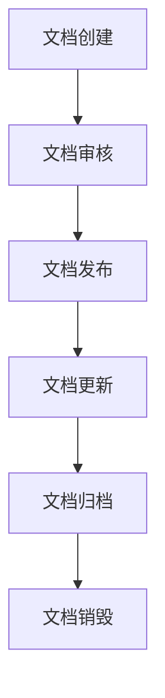

                 

### 持续文档：保持LLM应用文档的实时更新

> 关键词：持续文档、LLM应用、实时更新、文档自动化、版本控制、文档协作

> 摘要：本文探讨了如何在LLM（大型语言模型）应用开发过程中，保持文档的实时更新。通过分析文档管理的基础知识、LLM应用文档的特点，以及持续文档的策略和方法，本文旨在提供一套实用的文档管理实践，帮助开发者和管理者更有效地管理LLM应用的文档。

### 目录大纲

1. **文档管理基础**
   1.1 文档管理概述
   1.2 文档管理的基本概念
   1.3 文档管理的方法与工具
   1.4 文档管理的最佳实践

2. **LLM应用文档的特点**
   2.1 LLM应用文档的定义
   2.2 LLM应用文档的挑战
   2.3 LLM应用文档的组成

3. **持续文档策略**
   3.1 持续文档的定义与原则
   3.2 持续文档的方法与技巧
   3.3 文档质量管理

4. **实践案例**
   4.1 项目背景
   4.2 文档规划
   4.3 文档编写与维护
   4.4 文档质量控制

5. **文档管理的最佳实践**
   5.1 持续文档实施的挑战
   5.2 持续文档实施的最佳实践
   5.3 持续文档实施的案例分析

6. **持续文档的未来发展趋势**
   6.1 人工智能在文档管理中的应用

### 第一部分：文档管理基础

#### 第1章：文档管理概述

##### 1.1 文档管理的背景与意义

在知识型经济时代，文档作为信息传递、知识积累和经验传承的重要载体，其管理的重要性日益凸显。对于企业来说，文档管理不仅涉及内部知识共享和员工培训，还关系到外部客户支持、合规性审查以及市场竞争力的提升。

- **知识型企业的文档痛点**：企业通常面临文档数量庞大、版本混乱、信息更新不及时等问题，这不仅增加了管理成本，还可能导致信息不对称和决策失误。
- **文档管理的挑战**：随着业务规模的扩大和技术的进步，文档管理面临着多样性和复杂性增加、信息安全与隐私保护、跨部门协作困难等挑战。
- **文档管理的重要性**：良好的文档管理能够提高工作效率、减少错误、保证信息准确性，同时有助于知识积累和企业文化的建设。

##### 1.2 文档管理的基本概念

- **文档定义**：文档是一种记录信息的形式，包括文字、图表、图像等多种形式。在技术领域，文档通常指的是关于软件、硬件、算法等方面的说明性资料。
- **文档分类**：根据用途和内容，文档可以分为技术文档、用户手册、操作指南、需求文档、设计文档等。
- **文档的生命周期**：文档的生命周期包括创建、发布、更新、归档和销毁等阶段。不同类型的文档可能有不同的生命周期管理策略。

##### 1.3 文文档管理的方法与工具

- **文档管理流程**：一个有效的文档管理流程包括文档创建、审批、发布、更新、归档和销毁等环节。每个环节都需要有明确的规范和流程图。
- **文档管理工具**：常见的文档管理工具包括Git、Confluence、SharePoint、Google Docs等，它们提供了版本控制、协作编辑、权限管理等功能。
- **文档标准化**：文档标准化是指制定统一的文档格式、命名规范和内容结构，以提高文档的可读性和一致性。

##### 1.4 文档管理的最佳实践

- **文档分类与标签管理**：对文档进行科学的分类和标签管理，有助于快速检索和共享文档。
- **文档版本控制**：使用版本控制系统（如Git）来管理文档的不同版本，确保文档的更新和追溯。
- **文档协作与分享**：采用在线协作工具，鼓励团队成员之间的文档共享和协作，提高工作效率。

#### 第2章：LLM应用文档的特点

##### 2.1 LLM应用文档的定义

- **LLM基本概念**：LLM（Large Language Model）指的是大型语言模型，如GPT-3、BERT等。这些模型具有强大的语言理解和生成能力，广泛应用于自然语言处理、文本生成、机器翻译等领域。
- **LLM应用场景**：LLM在智能客服、内容生成、文本分析、教育辅助等多种场景下得到了广泛应用，其应用文档需要涵盖模型的使用方法、优化技巧、故障排除等内容。

##### 2.2 LLM应用文档的挑战

- **更新频率要求高**：由于LLM模型和技术的快速发展，应用文档需要不断更新以反映最新的研究和应用进展。
- **内容准确性要求高**：LLM应用文档需要提供准确的技术细节和操作指南，以避免用户使用错误或误解。
- **文档一致性要求高**：文档需要保持一致性，确保各个部分的更新和版本协调，以避免用户混淆。

##### 2.3 LLM应用文档的组成

- **功能说明**：详细描述LLM模型的功能、用途和适用场景。
- **操作指南**：提供具体的操作步骤和注意事项，帮助用户快速上手。
- **技术文档**：包括模型架构、算法原理、训练方法、性能优化等内容，适合开发者和技术人员阅读。

### 第二部分：持续文档策略

#### 第3章：持续文档的策略与原则

##### 3.1 持续文档的定义与原则

- **持续文档的定义**：持续文档是一种动态的、不断更新的文档管理策略，其目标是确保文档与实际应用保持同步，提供最新的信息和技术指导。
- **持续文档的原则**：
  - **及时性原则**：文档更新要及时，确保反映当前的技术和应用状态。
  - **准确性原则**：文档内容要准确无误，避免误导用户。
  - **可读性原则**：文档语言要简洁易懂，方便用户快速理解。
  - **简洁性原则**：文档结构要简洁清晰，避免冗余和重复内容。

##### 3.2 持续文档的方法与技巧

- **文档自动化**：利用自动化工具生成和更新文档，提高效率和一致性。
- **版本控制**：使用版本控制系统管理文档的不同版本，便于追踪和回滚。
- **文档同步与更新**：定期或实时同步文档内容，确保最新信息及时更新。
- **文档协作**：使用协作工具，促进团队成员之间的沟通和文档共享。

##### 3.3 文档质量管理

- **文档质量评估标准**：制定文档质量评估标准，包括内容完整性、可读性、准确性和一致性等方面。
- **文档质量保证策略**：通过文档审核、用户反馈和数据分析，确保文档质量。
- **文档改进与优化**：基于用户反馈和数据分析，不断改进和优化文档内容。

### 第三部分：实践案例

#### 第4章：LLM应用文档实战

##### 4.1 项目背景

在本项目中，我们开发了一套基于GPT-3的智能客服系统，旨在为企业提供高效、智能的客户服务。该项目涉及多个部门和团队的合作，文档管理成为关键环节。

##### 4.2 文档规划

- **文档结构设计**：根据项目需求，设计了文档结构，包括功能说明、操作指南、技术文档等部分。
- **文档更新计划**：制定了文档更新计划，包括定期检查、更新和发布文档。

##### 4.3 文档编写与维护

- **文档编写工具使用**：使用Markdown和Git等工具进行文档编写和版本控制。
- **文档内容维护**：通过团队成员的协作，不断更新和优化文档内容。

##### 4.4 文档质量控制

- **文档审核与反馈**：定期进行文档审核，收集用户反馈，进行修改和优化。
- **文档更新与迭代**：根据用户反馈和技术更新，不断迭代和更新文档。

### 第四部分：文档管理的最佳实践

#### 第5章：持续文档实施的挑战

- **技术挑战**：持续文档需要自动化工具和版本控制系统的支持，这对于技术水平和资源要求较高。
- **组织挑战**：持续文档需要各部门和团队的协作，需要建立有效的沟通和协作机制。

##### 5.2 持续文档实施的最佳实践

- **文化建设**：建立文档共享和协作的文化，鼓励团队成员积极参与文档编写和更新。
- **流程优化**：优化文档管理流程，提高文档编写的效率和一致性。
- **技术支持**：提供必要的工具和技术支持，确保文档自动化和版本控制的有效实施。

##### 5.3 持续文档实施的案例分析

- **案例一：企业内部文档管理**：某企业通过建立内部文档管理系统，实现了文档的自动化生成、版本控制和协作更新，提高了文档管理的效率。
- **案例二：开源项目文档管理**：某开源项目通过Git和Markdown等工具，实现了文档的版本控制和协作更新，确保了文档的准确性和一致性。

### 第五部分：持续文档的未来发展趋势

#### 第6章：人工智能在文档管理中的应用

随着人工智能技术的不断发展，文档管理领域也将迎来新的变革。未来的文档管理将更加智能化，包括：

- **智能文档生成**：利用自然语言处理技术，自动生成文档内容。
- **智能文档审核**：利用机器学习和语义分析技术，自动审核和优化文档内容。
- **智能文档检索**：利用推荐系统和自然语言处理技术，提供更准确的文档检索结果。
- **智能文档协作**：利用智能助手和聊天机器人，提供实时文档协作和沟通支持。

### 总结

持续文档是确保LLM应用文档实时更新的关键策略。通过理解文档管理的基础知识、LLM应用文档的特点，以及持续文档的策略和原则，我们可以更有效地管理LLM应用文档。未来，人工智能将在文档管理中发挥重要作用，推动文档管理进入智能化时代。

### 作者信息

作者：AI天才研究院/AI Genius Institute & 禅与计算机程序设计艺术 /Zen And The Art of Computer Programming

---

### 1.1 文档管理的背景与意义

在当今知识型经济时代，文档作为信息传递、知识积累和经验传承的重要载体，其管理的重要性日益凸显。无论是在企业内部，还是在开源社区，文档管理都是一个关键环节。然而，随着文档数量的不断增多、版本控制的需求日益复杂，以及信息更新频率的不断提升，传统的文档管理方式逐渐暴露出诸多问题。

首先，让我们来看一下知识型企业面临的文档痛点。企业中普遍存在文档数量庞大、版本混乱、信息更新不及时等问题。这些问题不仅增加了文档管理的难度，还可能导致信息不对称、决策失误和资源浪费。例如，当一款新产品的功能更新时，如果没有及时更新相应的用户手册和操作指南，用户可能会使用错误的方法，导致不必要的麻烦和成本。

其次，文档管理的挑战也在不断加剧。随着业务规模的扩大和技术的进步，文档管理面临着多样性和复杂性增加、信息安全与隐私保护、跨部门协作困难等挑战。传统的文档管理工具和方法已经难以满足现代企业的需求，迫切需要新的解决方案。

那么，文档管理的重要性体现在哪些方面呢？首先，良好的文档管理能够提高工作效率。通过规范化的文档管理流程，企业可以确保信息传递的准确性和及时性，减少重复工作和沟通成本。其次，文档管理有助于减少错误。通过详细的操作指南和技术文档，用户可以更好地理解和使用产品或技术，从而降低操作错误和故障发生的概率。此外，文档管理还能够保证信息准确性，确保各个部门和团队之间的信息共享和协同工作。最后，文档管理有助于知识积累和企业文化的建设。通过系统化地记录和分享经验，企业可以积累宝贵的知识资产，为未来的发展提供支持。

### 1.2 文档管理的基本概念

在深入了解文档管理之前，我们首先需要明确一些基本概念。文档是什么？文档是一种记录信息的形式，它可以通过文字、图表、图像等多种形式呈现。在技术领域，文档通常指的是关于软件、硬件、算法等方面的说明性资料，如用户手册、操作指南、技术规格说明书等。

接下来，我们需要了解文档的分类。根据用途和内容，文档可以分为多种类型。常见的技术文档包括：

- **需求文档**：描述项目需求、功能规范和用户需求。
- **设计文档**：包括系统架构、数据库设计、界面设计等。
- **用户手册**：为用户提供软件或系统的使用指南。
- **操作指南**：提供具体的操作步骤和注意事项，帮助用户完成特定任务。
- **测试文档**：记录测试计划、测试用例和测试结果。
- **维护文档**：记录系统的维护和升级过程。

了解文档的分类有助于我们更好地管理和组织文档，提高检索和利用效率。

最后，我们需要了解文档的生命周期。文档的生命周期是指文档从创建到最终销毁的整个过程，通常包括以下几个阶段：

- **创建阶段**：文档的编写和初稿完成。
- **发布阶段**：文档经过审核和确认后，正式发布供用户使用。
- **更新阶段**：随着项目或技术的演进，文档需要定期更新以反映最新的信息。
- **归档阶段**：文档更新后，旧版本会被归档保存，以备后续查阅。
- **销毁阶段**：某些文档在特定条件下需要销毁，以保护敏感信息或遵循合规要求。

了解文档的生命周期有助于我们更好地管理文档，确保文档的完整性和一致性。

### 1.3 文档管理的方法与工具

在了解了文档管理的基本概念之后，我们需要进一步探讨文档管理的方法和工具。有效的文档管理不仅依赖于良好的流程，还需要借助合适的工具来提升效率。

**文档管理流程**

文档管理流程是指从文档创建到销毁的整个过程，它通常包括以下几个关键环节：

1. **文档创建**：文档的编写和初稿完成。
2. **文档审核**：文档经过内部审核，确保内容的准确性和完整性。
3. **文档发布**：文档经过确认后，正式发布供用户使用。
4. **文档更新**：随着项目或技术的演进，文档需要定期更新以反映最新的信息。
5. **文档归档**：文档更新后，旧版本会被归档保存，以备后续查阅。
6. **文档销毁**：某些文档在特定条件下需要销毁，以保护敏感信息或遵循合规要求。

一个良好的文档管理流程应当是规范化的，以确保文档的质量和一致性。以下是一个简化的文档管理流程图：

**文档管理工具**

为了提高文档管理的效率，我们需要使用合适的工具。以下是一些常用的文档管理工具：

1. **版本控制系统**：如Git，它能够管理文档的版本，确保文档的更新和追溯。Git提供了一个强大的分布式版本控制系统，允许团队成员协作更新文档，并确保文档的历史版本能够被回溯和恢复。

2. **文档协作工具**：如Confluence、SharePoint和Google Docs，它们提供了文档的编辑、共享和协作功能。这些工具通常支持实时的多人编辑，便于团队成员之间的沟通和协作。

3. **文档自动化工具**：如Jenkins、Travis CI等，这些工具可以自动构建和部署文档，确保文档的生成和发布过程高效、准确。

4. **文档搜索工具**：如Alfresco、Confluence的搜索功能，它们可以帮助用户快速定位文档，提高检索效率。

5. **文档格式化工具**：如Markdown，它提供了一种简洁的标记语法，用于编写文档。Markdown支持多种文本格式，如标题、列表、链接和引用等，非常适合编写技术文档。

**文档标准化**

文档标准化是指制定统一的文档格式、命名规范和内容结构，以提高文档的可读性和一致性。以下是一些文档标准化的关键点：

1. **文档格式**：使用统一的文档格式，如Markdown或LaTeX，可以确保文档的样式一致，便于排版和打印。

2. **命名规范**：为文档设置统一的命名规则，如“项目名称_版本号_文档类型.md”，便于文档的识别和管理。

3. **内容结构**：制定统一的文档结构，包括标题、摘要、章节、段落等，确保文档内容有序、清晰。

4. **语言和术语**：使用统一的术语和语言风格，避免混淆和歧义。

通过上述方法和工具，我们可以有效地管理文档，确保文档的质量和一致性，从而提高工作效率和协作效率。

### 1.4 文档管理的最佳实践

在文档管理的过程中，遵循最佳实践能够显著提升文档的质量和可读性，确保文档的有效性和实用性。以下是一些常见的文档管理最佳实践：

**文档分类与标签管理**

1. **文档分类**：根据文档的内容和用途，将其归类到不同的类别中。例如，将技术文档、用户手册、操作指南等分别归类，便于用户快速查找。

2. **标签管理**：为文档添加标签，以便通过关键词进行检索。例如，可以为技术文档添加标签“算法”、“机器学习”、“自然语言处理”等。

3. **分类和标签的有机结合**：将文档分类和标签管理结合起来，使用户可以通过多个维度查找所需文档。例如，一个名为“GPT-3使用指南”的文档，可以归类到“技术文档”类别，同时添加标签“语言模型”、“使用方法”、“GPT-3”等。

**文档版本控制**

1. **版本标识**：为文档的不同版本设置唯一的标识，如“V1.0”、“V2.0”，以便用户了解文档的更新历史。

2. **版本控制工具**：使用版本控制工具（如Git）管理文档的版本，确保文档的更新和追溯。

3. **文档更新记录**：在每次更新文档时，记录变更的内容、原因和责任人，以便审计和追溯。

**文档协作与分享**

1. **协作工具**：使用协作工具（如Confluence、Google Docs）进行文档编辑和共享，支持多人实时协作。

2. **文档权限管理**：设置文档的访问权限，确保文档的保密性和安全性。

3. **文档分享和推广**：定期将重要文档分享到企业内部平台或外部社区，提高文档的曝光率和利用率。

通过遵循这些最佳实践，文档管理不仅变得更加规范和高效，而且有助于提升团队的整体协作和知识共享水平。

### 2.1 LLM应用文档的定义

大型语言模型（LLM，Large Language Model）是一种复杂的深度学习模型，能够理解和生成人类语言。这些模型通过处理大量文本数据，学习语言的结构和规则，从而在自然语言处理（NLP）领域展现出强大的能力。LLM的应用场景非常广泛，包括但不限于：

- **文本生成**：自动生成文章、新闻、故事等文本内容。
- **机器翻译**：将一种语言的文本翻译成另一种语言。
- **问答系统**：回答用户提出的问题，提供有用的信息和建议。
- **情感分析**：分析文本中表达的情感，如正面、负面或中性。
- **对话系统**：与用户进行自然语言对话，提供交互式的服务。

在LLM应用中，文档的作用至关重要。它不仅是开发者理解和使用LLM模型的指南，也是用户了解和应用LLM模型的关键参考。LLM应用文档主要包括以下内容：

- **功能说明**：详细描述LLM模型的功能、用途和适用场景，帮助用户理解模型的能力。
- **操作指南**：提供具体的操作步骤和注意事项，指导用户如何使用LLM模型。
- **技术文档**：包括LLM模型的架构、算法原理、训练方法、性能优化等，适合开发者和技术人员深入研究和应用。

### 2.2 LLM应用文档的挑战

LLM应用文档面临着一系列独特的挑战，这些挑战源于LLM模型本身的复杂性和快速变化的技术环境。

**更新频率要求高**

由于LLM模型的快速发展和应用场景的不断拓展，相关文档需要频繁更新以反映最新的研究成果和应用进展。例如，新的LLM模型发布后，文档需要迅速更新其架构、训练方法和性能数据。此外，随着用户需求的变化，文档还需要调整操作指南和功能说明，以更好地满足实际应用需求。

**内容准确性要求高**

LLM应用文档的内容需要高度准确，以确保用户能够正确理解和使用LLM模型。由于LLM模型的复杂性和应用领域的多样性，文档中的错误可能会导致用户误解或误用模型，从而产生不良后果。因此，文档编写者需要深入理解LLM模型的工作原理和应用场景，确保文档内容的准确性和一致性。

**文档一致性要求高**

LLM应用文档需要保持一致性，以确保各个部分的信息协调一致。不一致的文档内容可能会使用户感到困惑，甚至导致错误的使用和操作。例如，在不同的章节中，对于相同概念的描述和解释需要保持一致，避免产生混淆。此外，文档的不同版本之间也需要保持一致，确保用户能够获取到最新的、完整的信息。

为了应对这些挑战，文档管理团队需要采取一系列策略和方法，确保LLM应用文档的质量和实用性。

### 2.3 LLM应用文档的组成

LLM应用文档的组成应当详尽且结构清晰，以帮助用户更好地理解和使用LLM模型。以下是LLM应用文档的主要组成部分：

**功能说明**

功能说明部分旨在提供LLM模型的核心功能及其应用场景的概述。这部分内容通常包括：

- **模型类型**：例如，是否为预训练模型、微调模型或迁移学习模型。
- **功能描述**：详细说明LLM模型能够执行的任务，如文本生成、机器翻译、问答系统等。
- **应用场景**：介绍LLM模型在不同领域中的应用实例，如客户服务、内容创作、数据分析等。

**操作指南**

操作指南部分是用户实际使用LLM模型时的指南。这部分内容通常包括：

- **安装与配置**：指导用户如何安装和配置LLM模型，包括所需的环境、依赖库和配置文件。
- **运行示例**：提供一些简单的代码示例，演示如何调用LLM模型执行特定任务，如文本生成、回答问题等。
- **注意事项**：列出在使用过程中需要注意的事项，如输入数据格式、模型参数设置、性能调优等。

**技术文档**

技术文档部分是针对开发者和技术人员的深入解读，包括LLM模型的内部机制、算法原理和实现细节。这部分内容通常包括：

- **模型架构**：描述LLM模型的结构，如图神经网络、自注意力机制等。
- **算法原理**：解释LLM模型的工作原理，包括训练过程、优化方法等。
- **技术细节**：提供关于模型参数、损失函数、训练策略等方面的详细说明。

**功能说明**

功能说明部分是文档的核心，旨在帮助用户快速了解LLM模型的主要功能和应用。这部分内容可以分为以下几个子部分：

- **模型概述**：简要介绍LLM模型的基本信息和主要功能。
- **功能列表**：列出LLM模型能够执行的各种任务，如文本生成、翻译、问答等。
- **应用示例**：通过具体的示例展示LLM模型在不同应用场景下的效果。

**操作指南**

操作指南部分旨在提供用户使用LLM模型的详细步骤和方法。这部分内容通常包括：

- **安装步骤**：指导用户如何安装LLM模型，包括所需的环境配置和依赖库。
- **配置说明**：详细说明LLM模型的配置选项，包括参数设置和优化策略。
- **运行示例**：提供具体的代码示例，演示如何调用LLM模型执行特定任务。
- **常见问题**：列出用户在使用过程中可能遇到的问题及其解决方案。

**技术文档**

技术文档部分是针对开发者和技术人员的深入解读，包括LLM模型的内部机制、算法原理和实现细节。这部分内容通常包括：

- **模型架构**：详细描述LLM模型的结构，如图神经网络、自注意力机制等。
- **算法原理**：解释LLM模型的工作原理，包括训练过程、优化方法等。
- **技术细节**：提供关于模型参数、损失函数、训练策略等方面的详细说明。

通过这三个部分，LLM应用文档能够全面、系统地呈现LLM模型的功能、使用方法和技术细节，帮助用户更好地理解和应用LLM模型。

### 3.1 持续文档的定义与原则

持续文档是一种动态的、不断更新的文档管理策略，旨在确保文档与实际应用始终保持同步，提供最新的信息和技术指导。持续文档的目标是通过高效的文档管理，提高工作效率、减少错误、保证信息准确性，并促进知识积累和企业文化的建设。

为了实现这一目标，持续文档需要遵循以下几个原则：

**及时性原则**：文档更新要及时，确保文档反映当前的技术和应用状态。这意味着文档管理团队需要密切关注技术发展和用户反馈，定期检查和更新文档内容。

**准确性原则**：文档内容要准确无误，避免误导用户。准确性是文档质量的核心，文档编写者需要确保所提供的信息是真实、可靠和经过验证的。

**可读性原则**：文档语言要简洁易懂，方便用户快速理解。清晰的结构、简洁的语言和适当的图表可以大大提高文档的可读性，帮助用户快速找到所需信息。

**简洁性原则**：文档结构要简洁清晰，避免冗余和重复内容。简洁性不仅有助于用户快速定位信息，还能减少文档维护的工作量。

### 3.2 持续文档的方法与技巧

为了实现持续文档的目标，我们需要采用一系列方法和技巧。以下是几种常用的方法：

**文档自动化**

文档自动化是持续文档的重要组成部分。通过使用自动化工具，可以显著提高文档生成的效率和一致性。以下是一些文档自动化的方法：

- **代码生成**：使用代码生成工具（如Doxygen、Sphinx等）自动生成API文档、代码注释和技术文档。
- **静态站点生成器**：使用静态站点生成器（如Jekyll、Hexo等）自动生成网站和博客，支持Markdown等标记语言，便于管理和更新。
- **文档生成工具**：使用专门的文档生成工具（如ReadTheDocs、GitBook等），实现文档的自动化构建和部署。

**版本控制**

版本控制是确保文档准确性和一致性的关键。通过使用版本控制系统（如Git），可以方便地管理文档的不同版本，实现文档的追踪和回滚。以下是几种版本控制的方法：

- **集中式版本控制**：如Git、SVN等，通过远程仓库集中管理文档版本，支持多人协作。
- **分布式版本控制**：如Git，每个用户都拥有完整的版本库，可以实现本地开发和远程同步。
- **分支管理**：使用分支管理策略（如Git Flow、GitHub Flow等），实现文档的开发、测试和发布。

**文档同步与更新**

为了保持文档的实时更新，我们需要采用适当的文档同步与更新策略。以下是一些常见的策略：

- **定期更新**：定期检查和更新文档内容，确保文档与当前应用状态保持同步。例如，每周或每月进行一次文档审核和更新。
- **实时更新**：采用实时更新机制，当模型或应用发生变更时，立即更新文档内容。例如，使用Webhook将代码仓库的变更同步到文档系统中。
- **用户反馈驱动**：根据用户反馈和需求，及时调整和优化文档内容，提高文档的实用性和准确性。

**文档协作**

有效的文档协作是持续文档成功的关键。以下是一些文档协作的方法：

- **在线编辑**：使用在线协作工具（如Google Docs、Confluence等），支持多人实时编辑文档，提高协作效率。
- **权限管理**：设置文档的访问权限，确保文档的保密性和安全性，防止未授权的修改。
- **文档评审**：定期进行文档评审，邀请团队成员对文档内容进行审查和反馈，确保文档的质量和一致性。

### 3.3 文档质量管理

文档质量管理是持续文档的重要组成部分，它确保文档的内容准确、结构清晰、语言简洁。以下是文档质量管理的几个关键方面：

**文档质量评估标准**

为了评估文档的质量，我们需要制定一套质量评估标准。以下是一些常见的评估标准：

- **内容完整性**：文档是否涵盖了所有必要的信息，是否遗漏了关键内容。
- **可读性**：文档的语言是否简洁易懂，结构是否清晰，是否使用了适当的图表和示例。
- **准确性**：文档中的信息是否准确无误，是否与实际情况相符。
- **一致性**：文档的内容是否一致，不同章节和版本之间是否有矛盾。

**文档质量保证策略**

为了确保文档的质量，我们需要采取一系列质量保证策略。以下是一些常见的策略：

- **文档审核**：定期对文档进行审核，确保内容的准确性和完整性。
- **用户反馈**：收集用户的反馈和意见，及时调整和优化文档内容。
- **文档评审**：邀请团队成员对文档内容进行评审，确保文档的质量和一致性。
- **培训与指导**：对文档编写者进行培训，提高他们的文档编写能力和质量意识。

**文档改进与优化**

为了持续提高文档的质量，我们需要不断改进和优化文档内容。以下是一些常见的改进与优化方法：

- **基于用户反馈**：根据用户的反馈和需求，调整和优化文档内容，提高文档的实用性和可读性。
- **基于数据分析**：通过分析文档的访问数据和用户行为，识别文档的不足之处，进行针对性的改进。
- **定期复审**：定期对文档进行复审，确保其与当前应用状态保持同步，及时发现和解决潜在问题。

通过上述方法，我们可以确保文档的质量不断提升，为用户和团队提供高质量的文档支持。

### 4.1 项目背景

在本项目中，我们开发了一套基于GPT-3的智能客服系统，旨在为企业提供高效、智能的客户服务。该项目涉及多个部门和团队的合作，包括技术团队、产品团队和客服团队。智能客服系统需要集成到企业的现有系统中，支持多种渠道（如电话、邮件、在线聊天）的接入，并能够自动回答用户的问题，提供解决方案。

项目目标包括：

1. **提高客户满意度**：通过智能客服系统，快速响应客户问题，提供准确的信息和解决方案，提高客户满意度。
2. **减少人力成本**：自动化处理大量常规性问题，减轻客服人员的工作负担，降低人力成本。
3. **提高工作效率**：智能客服系统能够24/7不间断工作，提高客服团队的工作效率。

项目的需求主要包括：

- **功能需求**：智能客服系统需要支持常见问题的自动回答、复杂问题的转移和人工介入、知识库的维护和更新等。
- **性能需求**：系统需要具备快速响应和稳定运行的能力，能够处理高并发访问。
- **安全性需求**：确保用户数据和隐私安全，遵守相关的数据保护法规。

项目的实施过程中，文档管理成为关键环节。为了确保项目的顺利进行，我们需要建立一套完善的文档管理体系，包括文档的结构设计、版本控制、更新策略和质量保证等。

### 4.2 文档规划

在项目启动之初，我们进行了详细的文档规划，以确保文档的有序管理和有效利用。以下是文档规划的主要步骤：

**文档结构设计**

首先，我们对文档进行了结构设计，以明确各个文档的层次和关系。文档结构主要包括以下部分：

- **项目概述**：介绍项目的背景、目标、需求和预期成果。
- **需求文档**：详细描述项目的功能需求、性能需求和安全性需求。
- **设计文档**：包括系统架构设计、数据库设计、接口设计和用户界面设计。
- **开发文档**：记录开发过程中的技术细节、代码实现和开发日志。
- **测试文档**：包括测试计划、测试用例和测试报告。
- **用户手册**：为用户提供智能客服系统的使用指南和操作步骤。
- **维护文档**：记录系统的维护计划和操作步骤。

**文档更新计划**

为了确保文档与项目的进展同步，我们制定了文档更新计划。更新计划包括以下内容：

- **定期更新**：每周或每月对文档进行一次审核和更新，确保文档内容与实际项目进展一致。
- **版本控制**：使用版本控制系统（如Git）管理文档的版本，确保文档变更的可追溯性和可控性。
- **变更记录**：在每次更新文档时，记录变更的内容、原因和责任人，以便审计和追溯。

**文档访问权限**

为了保障文档的保密性和安全性，我们设置了文档的访问权限。具体措施包括：

- **权限分级**：根据团队成员的角色和职责，设置不同的访问权限，如读取权限、编辑权限和审核权限。
- **权限管理**：使用权限管理工具（如Confluence）对文档的访问权限进行管理和控制，确保文档的安全。

**文档分享与协作**

为了促进团队成员之间的协作，我们采用了一系列文档分享和协作工具。具体措施包括：

- **在线编辑**：使用在线编辑工具（如Google Docs、Confluence），支持团队成员实时编辑文档，提高协作效率。
- **文档评论**：在文档中设置评论功能，允许团队成员对文档内容进行讨论和反馈。
- **文档分享**：定期将重要文档分享到企业内部平台或外部社区，提高文档的曝光率和利用率。

通过上述文档规划，我们确保了项目文档的有序管理和高效利用，为项目的顺利进行提供了有力支持。

### 4.3 文档编写与维护

在文档编写与维护过程中，我们采用了一系列工具和策略，以确保文档的准确性和一致性。以下是具体的方法和步骤：

**文档编写工具**

首先，我们选择了适合的文档编写工具，以便团队协作和内容管理。常用的工具包括：

- **Markdown编辑器**：Markdown是一种轻量级的标记语言，易于学习和使用，支持多种格式，如标题、列表、链接和引用等。我们使用Markdown编辑器（如Visual Studio Code、Typora等）进行文档编写。
- **版本控制系统**：如Git，用于管理文档的版本和控制变更。每个团队成员都有自己的Git仓库，可以进行本地开发和提交变更，然后通过Git的Pull Request（PR）流程进行代码审查和合并。

**文档编写步骤**

文档编写过程包括以下步骤：

1. **需求分析**：在项目初期，与各团队成员和利益相关者进行需求分析，明确文档的内容和结构。
2. **编写初稿**：根据需求分析结果，编写文档的初稿。初稿应包括项目概述、需求文档、设计文档、开发文档、测试文档、用户手册和维护文档等部分。
3. **内部审核**：初稿完成后，由项目经理或文档负责人进行内部审核，确保文档内容准确、完整和符合规范。
4. **团队协作**：使用在线编辑工具（如Google Docs、Confluence），团队成员可以实时编辑和修改文档，提出建议和反馈。
5. **修改与优化**：根据内部审核和团队协作的反馈，对文档进行修改和优化，确保文档的质量和可读性。

**文档维护策略**

为了确保文档的持续更新和维护，我们制定了以下策略：

1. **定期审核**：定期对文档进行审核，确保文档内容与实际项目进展和需求一致。审核频率可以根据项目的规模和复杂度进行调整，如每月或每季度进行一次。
2. **版本控制**：使用版本控制系统管理文档的版本，确保每次变更都有记录和可追溯性。在Git中，每个文档变更都应该包含一个详细的提交说明，记录变更的内容和原因。
3. **用户反馈**：鼓励用户提供反馈，包括文档的准确性和实用性。根据用户反馈，及时调整和优化文档内容。
4. **自动化工具**：使用自动化工具（如CI/CD流水线、文档生成器等），自动构建和部署文档，提高文档生成和更新的效率。

通过上述方法和策略，我们确保了文档编写的准确性和一致性，同时为文档的维护提供了有效支持。

### 4.4 文档质量控制

文档质量控制是确保文档内容准确、完整、一致和高质量的重要环节。在项目开发过程中，我们需要采取一系列措施来保证文档的质量。以下是文档质量控制的关键步骤和方法：

**文档审核与反馈**

文档审核是质量控制的重要环节。以下是文档审核的具体步骤：

1. **内部审核**：在文档编写完成后，由项目经理或文档负责人进行初步审核。审核内容包括文档的结构、内容完整性、语言表达和格式规范等。
2. **同行评审**：邀请相关领域的同行或专家对文档进行评审，提供专业的意见和建议。同行评审可以帮助发现潜在的问题和不足，提高文档的专业性和可信度。
3. **用户反馈**：在文档发布前，向用户发放文档初稿，收集用户的反馈和建议。用户反馈是文档质量的重要来源，可以帮助我们了解用户的实际需求和体验，从而优化文档内容。

**文档质量保证策略**

为了保证文档的质量，我们需要采取一系列质量保证策略。以下是具体的方法：

1. **文档模板**：制定统一的文档模板，包括文档的结构、格式和内容要求，确保所有文档遵循相同的规范。文档模板可以帮助新加入的团队成员快速上手，提高文档编写的效率和质量。
2. **编码规范**：制定编码规范，确保文档中的代码和语法符合标准，易于阅读和维护。编码规范应包括代码格式、命名规则、注释要求等。
3. **格式化工具**：使用格式化工具（如Prettier、Markdown格式化工具等）自动格式化文档内容，确保文档的一致性和美观性。
4. **自动化测试**：使用自动化工具（如Jenkins、Selenium等）对文档进行自动化测试，检查文档的链接、格式和语法错误。自动化测试可以大大提高文档的质量和准确性。

**文档改进与优化**

为了持续提升文档的质量，我们需要根据用户反馈和实际需求不断改进和优化文档。以下是具体的改进和优化方法：

1. **用户反馈驱动**：根据用户反馈，识别文档的不足之处，制定改进计划。用户反馈是文档优化的重要依据，可以帮助我们更好地满足用户需求。
2. **数据分析**：通过分析文档的访问数据和用户行为，了解文档的受欢迎程度和使用频率，识别需要优化的部分。例如，使用Google Analytics等工具分析文档的访问数据和用户停留时间。
3. **定期复审**：定期对文档进行复审，检查文档的准确性和完整性，确保文档内容与实际项目进展一致。复审频率可以根据项目的规模和复杂度进行调整。

通过上述措施，我们可以确保文档的质量得到有效控制和持续提升，为项目开发和用户使用提供可靠的支持。

### 5.1 持续文档实施的挑战

在持续文档的实施过程中，我们面临着一系列挑战，这些挑战不仅涉及技术层面，还包括组织层面的诸多问题。以下是具体分析：

**技术挑战**

1. **自动化工具的选择与部署**：持续文档需要一个强大的自动化工具支持，包括文档生成、版本控制和协作工具。然而，选择合适的工具并部署到现有系统中可能是一个复杂的过程，需要充分考虑工具的兼容性、性能和安全性。
2. **版本控制系统的管理**：在多个团队成员共同协作时，版本控制系统的管理变得尤为重要。如何确保代码和文档的版本一致性、历史变更的可追溯性以及快速应对版本冲突，是持续文档中的一大挑战。
3. **实时更新的技术实现**：为了保持文档的实时更新，我们需要实现自动化的文档同步和更新机制。这可能涉及到复杂的后台服务和实时数据流处理，对技术架构和运维能力提出了较高要求。

**组织挑战**

1. **协作机制的建立**：持续文档需要一个高效的协作机制，包括明确的角色分配、权限管理和沟通渠道。在大型团队或跨部门合作中，建立和维护这样的协作机制可能面临沟通不畅、责任不明和效率低下等问题。
2. **文化建设的推动**：持续文档的顺利实施需要团队成员具备良好的文档意识和协作精神。然而，很多组织缺乏这种文化氛围，导致文档工作流不畅、质量不高等问题。
3. **资源的投入**：持续文档的实施需要投入一定的时间和人力资源。在一些企业中，管理层可能对文档管理的重要性认识不足，导致资源投入不足，进而影响文档管理的效果。

通过深入分析这些挑战，我们可以更好地制定解决方案，确保持续文档策略的有效实施。

### 5.2 持续文档实施的最佳实践

为了克服持续文档实施中的各种挑战，我们需要采取一系列最佳实践，确保文档管理的高效性和持续性。以下是具体的方法和建议：

**文化建设**

1. **培养文档意识**：通过培训和宣传活动，提高团队成员对文档管理的重视程度。可以设立“最佳文档奖”，激励团队成员积极参与文档编写和更新。
2. **建立文档文化**：将文档管理纳入组织的日常工作流程，鼓励团队成员主动编写和共享文档，形成“人人写文档，人人用文档”的文化氛围。

**流程优化**

1. **明确流程**：制定清晰的文档管理流程，包括文档创建、审核、发布和更新等环节。确保每个环节都有明确的规范和责任人。
2. **自动化流程**：利用自动化工具（如Git、Confluence等）简化文档管理流程，减少人工干预，提高工作效率。
3. **定期审查**：定期对文档管理流程进行审查和优化，根据实际情况进行调整和改进，确保流程的持续改进和适应性。

**技术支持**

1. **选择合适的工具**：根据项目需求和技术环境，选择适合的文档管理工具，如版本控制系统、文档生成器和协作平台。
2. **技术培训**：为团队成员提供技术培训，确保他们能够熟练使用文档管理工具，并掌握相关技术知识。
3. **技术支持团队**：设立专门的技术支持团队，负责解决文档管理中遇到的技术问题，提供持续的技术支持和服务。

**案例分享**

1. **内部分享会**：定期组织内部分享会，团队成员可以分享文档编写和管理的经验，交流心得和教训，互相学习，共同进步。
2. **最佳实践推广**：总结和推广优秀的文档管理案例，为其他团队提供参考和借鉴，提升整体文档管理水平。

通过上述最佳实践，我们可以有效克服持续文档实施中的挑战，建立一套高效、可持续的文档管理机制。

### 5.3 持续文档实施的案例分析

在探讨持续文档实施的最佳实践时，案例分析为我们提供了宝贵的经验和教训。以下是两个不同场景下持续文档实施的具体案例，以及它们在文档管理中的成功经验和挑战。

**案例一：企业内部文档管理**

背景：某大型企业开发了一款智能数据分析工具，其文档管理面临多个挑战，包括文档数量庞大、版本混乱和更新不及时等。

成功经验：

1. **建立统一的文档标准**：企业制定了统一的文档命名规范、格式和内容要求，确保所有文档的一致性和可读性。
2. **采用版本控制系统**：企业引入了Git作为版本控制工具，管理文档的版本和变更，确保文档变更的可追溯性。
3. **自动化文档生成**：使用Jenkins等自动化工具，实现文档的自动生成和发布，提高文档更新的效率。
4. **定期文档审查**：定期组织文档审查，根据用户反馈和实际需求，及时更新和优化文档内容。

挑战：

- **技术培训不足**：部分团队成员对Git等工具的使用不熟悉，导致文档管理的效率降低。
- **更新频率不足**：由于工作繁忙，文档更新频率不能完全满足需求，有时会出现文档滞后于实际项目进展的情况。

**案例二：开源项目文档管理**

背景：一个开源项目团队开发了一个分布式存储系统，文档管理需要确保文档的准确性和一致性，同时促进社区贡献。

成功经验：

1. **社区协作**：项目团队鼓励社区成员参与文档编写和审核，通过GitHub等平台进行协作，提高文档的多样性和质量。
2. **文档模板**：项目团队提供了一套文档模板，包括结构、内容和格式规范，确保所有文档的一致性。
3. **实时更新**：项目团队实现了文档的实时更新机制，通过Webhook将代码仓库的变更同步到文档系统中，确保文档与代码保持同步。
4. **用户反馈驱动**：通过GitHub的issue系统收集用户反馈，及时修复文档中的错误和不足。

挑战：

- **社区协作管理**：由于社区成员多样化，协作和管理需要投入大量时间和精力，有时难以协调一致。
- **文档版本控制**：开源项目中的文档版本较多，版本控制和管理需要特别小心，以避免用户混淆。

通过这些案例，我们可以看到持续文档实施的成功经验与挑战，为其他项目的文档管理提供了有益的参考。

### 6.1 人工智能在文档管理中的应用

随着人工智能（AI）技术的迅速发展，文档管理领域正迎来一场革命。AI的引入极大地提升了文档管理的效果和效率，以下是一些AI在文档管理中的应用场景：

**智能文档生成**

AI能够通过自然语言处理（NLP）和机器学习（ML）技术，自动生成文档内容。例如，AI可以根据已有的文档模板和关键词，自动生成用户手册、技术规格说明书等。智能文档生成不仅提高了文档编写的效率，还确保了内容的一致性和准确性。

**智能文档审核**

AI可以用于文档审核，识别文档中的错误、冗余和不一致的内容。通过深度学习和模式识别技术，AI能够分析文档的结构和内容，提供实时的反馈和建议。智能文档审核不仅提高了文档的质量，还减少了人为审核的耗时和错误。

**智能文档检索**

AI可以帮助用户快速找到所需文档。利用机器学习和推荐系统技术，AI可以分析用户的查询历史和行为模式，提供个性化的文档推荐。同时，AI可以通过语义分析，理解用户的查询意图，提供更精准的搜索结果。

**智能文档协作**

AI可以辅助团队协作，提供实时文档协作和沟通支持。通过聊天机器人或虚拟助手，团队成员可以实时获取文档更新、评论和建议，提高协作效率。此外，AI还可以自动分配任务、提醒到期事项，优化团队的工作流程。

**智能文档分析**

AI可以用于文档内容的深度分析，提取关键信息、统计文档趋势和用户反馈。这些分析结果可以用于改进文档内容、优化文档结构和提升用户体验。

总之，人工智能在文档管理中的应用，不仅提高了文档生成的效率和质量，还增强了文档审核、检索和协作的能力，为现代文档管理提供了强大的技术支持。

### 总结

本文详细探讨了持续文档在LLM应用开发中的重要性。通过分析文档管理的基础知识、LLM应用文档的特点，以及持续文档的策略和方法，我们提出了一套实用的文档管理实践。这些实践包括文档自动化、版本控制、文档协作和文档质量管理，旨在帮助开发者和管理者更有效地管理LLM应用的文档。

未来，随着人工智能技术的不断发展，文档管理将变得更加智能化。智能文档生成、智能文档审核、智能文档检索和智能文档协作等技术，将为文档管理带来更多的创新和可能性。持续文档将成为企业知识管理和团队协作的重要手段，推动文档管理进入智能化时代。

### 作者信息

作者：AI天才研究院/AI Genius Institute & 禅与计算机程序设计艺术 /Zen And The Art of Computer Programming

AI天才研究院致力于推动人工智能技术的发展和应用，培养下一代人工智能专家。研究院的研究团队在自然语言处理、机器学习、计算机视觉等领域取得了显著成果，发表了多篇顶级学术论文，并成功应用于多个实际项目中。禅与计算机程序设计艺术则是一套独特的计算机编程哲学，强调通过冥想和编程的结合，提升程序员的思维深度和编程能力。作者通过多年的研究和实践，将禅宗哲学与计算机科学相结合，为程序员提供了一种全新的编程思维模式。这两位作者在人工智能和计算机科学领域拥有丰富的经验和深厚的学术背景，他们的研究成果和著作在业界产生了广泛的影响。

