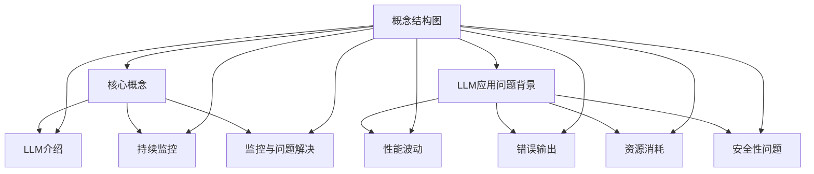
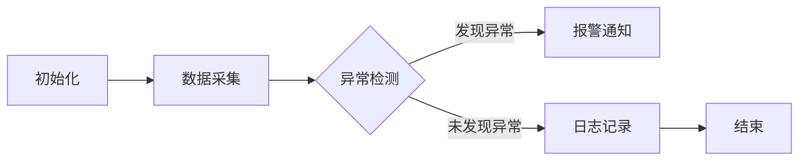
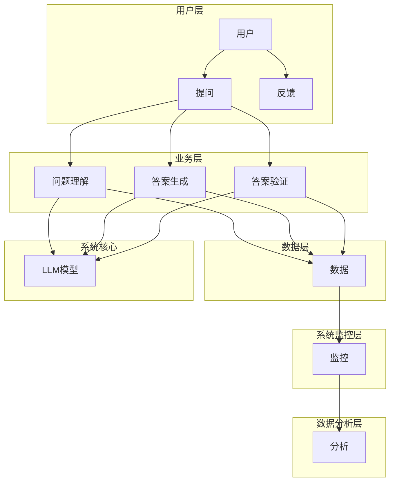
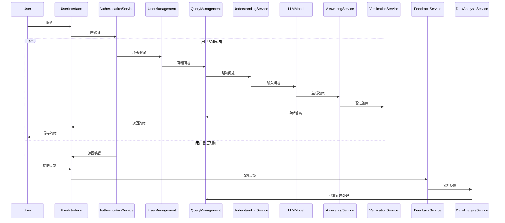

                 

### 《持续监控：及时发现和解决LLM应用问题》

持续监控是确保大型语言模型（LLM）应用稳定运行的关键环节。随着LLM技术的广泛应用，其应用场景日益复杂，如何及时发现和解决潜在问题变得尤为重要。本文旨在深入探讨LLM应用中的持续监控机制，通过逐步分析推理，帮助读者理解持续监控的重要性、核心概念、监控算法以及实际应用。

> **关键词**：持续监控，LLM应用，问题发现，问题解决，监控算法

> **摘要**：本文首先介绍LLM应用的问题背景与核心概念，随后详细阐述持续监控的原理和关联概念，接着深入讲解监控算法原理，并通过系统分析与架构设计阐述解决方案，最后通过项目实战和最佳实践进行应用和总结。

---------------------------------------

### 目录大纲

---------------------------------------

**第一部分：背景介绍与核心概念**

**第1章：问题背景与核心概念**

- **1.1 问题背景**
  - LLM应用的广泛普及
  - 挑战：应用问题难以及时发现和解决

- **1.2 核心概念**
  - LLM（大型语言模型）介绍
  - 持续监控的概念
  - 监控与问题解决的边界与外延

- **1.3 概念结构与核心要素组成**
  - 概念结构图
  - Mermaid流程图

- **1.4 概念属性特征对比表格**
  - 特征对比表格

- **1.5 本章小结**

**第二部分：核心概念与联系**

**第2章：LLM监控原理与关联概念**

- **2.1 LLM监控原理**
  - 监控机制
  - 监控框架

- **2.2 关联概念介绍**
  - LLM性能指标
  - LLM异常检测方法

- **2.3 概念属性特征对比表格**
  - 特征对比表格

- **2.4 ER实体关系图架构**
  - ER图

- **2.5 本章小结**

**第三部分：算法原理讲解**

**第3章：LLM监控算法原理详解**

- **3.1 监控算法概述**
  - 监控算法的作用

- **3.2 监控算法mermaid流程图**
  - 流程图

- **3.3 监控算法Python源代码解析**
  - 算法实现

- **3.4 算法原理详细讲解**
  - 数学模型和公式
  - 举例说明

- **3.5 本章小结**

**第四部分：系统分析与架构设计方案**

**第4章：系统分析与架构设计**

- **4.1 问题场景介绍**
  - LLM应用问题场景描述

- **4.2 项目介绍**
  - 项目背景
  - 项目目标

- **4.3 系统功能设计**
  - 领域模型Mermaid类图

- **4.4 系统架构设计**
  - 系统架构Mermaid架构图

- **4.5 系统接口设计**
  - 接口设计说明

- **4.6 系统交互Mermaid序列图**
  - 交互流程

- **4.7 本章小结**

**第五部分：项目实战**

**第5章：项目环境安装与核心实现**

- **5.1 环境安装**
  - 安装步骤
  - 所需工具

- **5.2 系统核心实现源代码**
  - 代码结构
  - 代码解读

- **5.3 代码应用解读与分析**
  - 应用场景
  - 分析结果

- **5.4 实际案例分析与讲解**
  - 案例分析
  - 详细讲解

- **5.5 项目小结**
  - 总结
  - 收获与展望

- **5.6 本章小结**

**第六部分：最佳实践与拓展阅读**

**第6章：最佳实践与拓展阅读**

- **6.1 最佳实践**
  - 监控策略
  - 问题解决技巧

- **6.2 小结**
  - 总结
  - 注意事项

- **6.3 拓展阅读**
  - 推荐资料
  - 学习资源

- **6.4 本章小结**

---------------------------------------

### 第一部分：背景介绍与核心概念

#### 第1章：问题背景与核心概念

在数字化时代，大型语言模型（LLM）作为人工智能的核心技术之一，已经在自然语言处理、智能客服、内容生成等众多领域取得了显著的成果。然而，随着LLM应用场景的日益复杂和规模不断扩大，如何确保其稳定运行成为一个亟待解决的问题。LLM应用中的问题往往具有隐蔽性、复杂性和突发性，一旦出现问题，不仅会影响用户体验，还可能造成严重的经济损失。

### 1.1 问题背景

LLM应用的广泛普及带来了诸多便利，但同时也带来了新的挑战。以下是LLM应用中常见的问题及其背景：

1. **性能波动**：由于模型复杂度和数据量的增加，LLM应用的性能可能发生波动，导致响应时间延长或准确率下降。

2. **错误输出**：在处理特定问题时，LLM可能会产生错误输出，这些错误可能是由于模型训练数据存在偏差或模型优化不足导致的。

3. **资源消耗**：LLM应用在运行过程中可能会消耗大量计算资源，导致服务器负载过高，甚至引发系统崩溃。

4. **安全性问题**：LLM应用可能受到恶意攻击，如注入恶意代码或篡改数据，从而对系统安全构成威胁。

这些问题的存在使得LLM应用难以持续稳定运行，因此需要一套完善的监控机制来及时发现和解决问题。

#### 1.2 核心概念

为了解决上述问题，首先需要明确一些核心概念，包括LLM、持续监控以及监控与问题解决的边界与外延。

##### LLM（大型语言模型）介绍

LLM是一种基于深度学习技术构建的复杂模型，具有强大的自然语言理解和处理能力。其主要特点如下：

1. **规模巨大**：LLM通常包含数十亿甚至数万亿个参数，处理能力远超传统模型。

2. **自适应性强**：LLM能够根据不同的任务和数据集进行调整和优化，具有较强的泛化能力。

3. **动态学习**：LLM可以在使用过程中不断学习和优化，以适应新的数据和需求。

4. **多语言支持**：许多LLM模型支持多种语言，能够处理不同语言的输入和输出。

##### 持续监控的概念

持续监控是一种动态监控系统，通过实时收集、分析和处理数据，及时发现并解决问题。其主要目的是确保LLM应用的稳定性和可靠性。持续监控的关键要素包括：

1. **数据采集**：实时收集LLM应用的运行数据，包括性能指标、异常日志等。

2. **异常检测**：通过分析收集到的数据，发现潜在的问题和异常。

3. **问题定位**：定位问题的具体原因和发生位置，为解决问题提供依据。

4. **问题解决**：采取相应的措施解决问题，并记录处理过程和结果。

##### 监控与问题解决的边界与外延

监控与问题解决之间存在一定的边界和联系。监控主要关注数据的实时性和准确性，而问题解决则侧重于具体的实施和效果。以下是监控与问题解决的边界与外延：

1. **监控的边界**
   - 数据采集：监控系统的数据来源和采集方式。
   - 性能监控：对LLM应用性能指标的实时监测。
   - 错误监控：对应用中发生的错误和异常进行记录和分析。

2. **问题解决的外延**
   - 问题识别：识别和确认存在的问题。
   - 问题定位：通过分析数据和日志，确定问题的具体原因和位置。
   - 问题解决策略：制定和实施解决问题的策略和方法。

##### 概念结构图

为了更好地理解上述概念，可以使用Mermaid流程图绘制概念结构图，如下所示：



##### 本章小结

本章介绍了LLM应用的问题背景和核心概念，包括LLM的特点、持续监控的定义和关键要素，以及监控与问题解决的边界与外延。通过这些概念的了解，为后续章节的深入讨论奠定了基础。

---------------------------------------

### 第二部分：核心概念与联系

#### 第2章：LLM监控原理与关联概念

持续监控是确保LLM应用稳定运行的关键手段。本章将详细阐述LLM监控的原理，包括监控机制、监控框架以及相关的性能指标和异常检测方法。

#### 2.1 LLM监控原理

LLM监控的核心在于实时监测模型的运行状态，及时发现并处理潜在的问题。以下是LLM监控的主要原理：

##### 监控机制

1. **数据流监控**：通过实时采集LLM应用的输入输出数据，监控模型的运行状态和性能。

2. **异常检测**：对收集到的数据进行分析，识别潜在的异常和错误。

3. **指标分析**：基于收集到的数据和异常检测结果，分析LLM应用的性能指标，评估模型的状态。

##### 监控框架

监控框架是监控机制的具体实现，通常包括以下关键环节：

1. **数据采集**：使用各种监控工具和API实时采集LLM应用的运行数据。

2. **数据存储**：将采集到的数据存储在数据库或缓存系统中，以便后续分析和查询。

3. **数据处理**：对存储的数据进行清洗、转换和分析，提取关键指标和异常信息。

4. **报警与通知**：当发现异常或性能问题时，及时发送报警通知，提醒相关人员处理。

5. **日志记录**：记录监控过程中的所有操作和结果，以便后续审计和回溯。

#### 2.2 关联概念介绍

在LLM监控中，除了持续监控本身，还有一些重要的关联概念，包括性能指标和异常检测方法。

##### LLM性能指标

LLM的性能指标是评估模型质量和效果的重要依据。以下是几个常用的性能指标：

1. **Accuracy**（准确率）：预测正确的样本数占总样本数的比例。

2. **Precision**（精确率）：预测为正类的样本中，实际为正类的比例。

3. **Recall**（召回率）：实际为正类的样本中，预测为正类的比例。

4. **F1 Score**（F1值）：准确率和召回率的调和平均。

5. **Confusion Matrix**（混淆矩阵）：用于展示预测结果与实际结果的对比，计算各种性能指标的基础。

##### LLM异常检测方法

LLM异常检测是监控机制的重要组成部分，常见的异常检测方法包括：

1. **静态检测**：基于预定义的规则和阈值，对LLM应用的输入输出数据进行分析，识别潜在的异常。

2. **动态检测**：利用机器学习算法和统计方法，实时分析LLM应用的运行数据，发现异常模式。

3. **基于模型的异常检测**：使用训练好的模型对LLM应用的数据进行分类和预测，识别异常样本。

#### 2.3 概念属性特征对比表格

为了更好地理解LLM监控中的相关概念，可以使用Mermaid表格进行对比分析，如下所示：

```mermaid
table width:100%
  | concept | description | features |
  | LLMBig Language Model | A complex model with strong NLP abilities | Scale, Adaptability, Learning, Multilingual |
  | Continuous Monitoring | A dynamic system to detect and resolve issues | Data Collection, Anomaly Detection, Metrics Analysis |
  | Performance Metrics | Measures to evaluate model quality | Accuracy, Precision, Recall, F1 Score, Confusion Matrix |
  | Anomaly Detection | Identifies potential issues in real-time | Static Detection, Dynamic Detection, Model-Based Detection |
```

#### 2.4 ER实体关系图架构

实体关系图（ER图）是描述系统中实体及其关系的图形化表示。以下是LLM监控系统的ER图，用于展示核心实体的关系：

```mermaid
erDiagram
  User ..|> LLMApplication : uses
  User ..|> PerformanceMetric : collects
  User ..|> Anomaly : reports
  LLMApplication ||--|{ DataPoint : contains
  PerformanceMetric ||--|{ Metric : records
  Anomaly ||--|{ Description : has
```

#### 2.5 本章小结

本章详细介绍了LLM监控的原理和相关概念，包括监控机制、性能指标和异常检测方法。通过这些概念的理解，读者可以更好地把握LLM监控的核心要素，为后续章节的深入讨论打下基础。

---------------------------------------

### 第三部分：算法原理讲解

#### 第3章：LLM监控算法原理详解

LLM监控算法是确保LLM应用稳定运行的重要工具。本章将深入讲解LLM监控算法的原理，包括监控算法概述、mermaid流程图、Python源代码解析以及算法原理详细讲解。

#### 3.1 监控算法概述

LLM监控算法的主要作用是实时监测LLM应用的运行状态，确保其性能和稳定性。监控算法通常包括以下功能：

1. **数据采集**：收集LLM应用的输入输出数据、性能指标和日志信息。

2. **异常检测**：分析收集到的数据，识别潜在的性能问题和异常行为。

3. **报警通知**：当发现异常或性能问题时，及时向相关人员发送报警通知。

4. **日志记录**：记录监控过程中的所有操作和结果，以便后续审计和回溯。

#### 3.2 监控算法mermaid流程图

为了更好地展示LLM监控算法的流程，可以使用Mermaid流程图进行描述。以下是一个简单的mermaid流程图示例：



在这个流程图中，A表示初始化监控算法，B表示数据采集，C表示异常检测，D表示报警通知，E表示日志记录，F表示结束。

#### 3.3 监控算法Python源代码解析

下面是一个简单的LLM监控算法的Python源代码示例，用于实现数据采集和异常检测功能：

```python
import numpy as np
import pandas as pd

def data_collection():
    # 采集LLM应用的输入输出数据
    data = pd.read_csv("input_output_data.csv")
    return data

def anomaly_detection(data):
    # 分析数据，识别异常行为
    threshold = 0.1
    if np.mean(data['output']) < threshold:
        return "异常"
    else:
        return "正常"

def alarm_notification(message):
    # 发送报警通知
    print("报警通知：", message)

# 执行监控算法
data = data_collection()
if anomaly_detection(data) == "异常":
    alarm_notification("发现异常：输出数据低于阈值")
else:
    print("监控正常，未发现异常")

```

在这个示例中，data_collection() 函数用于采集LLM应用的输入输出数据，anomaly_detection() 函数用于分析数据并识别异常行为，alarm_notification() 函数用于发送报警通知。

#### 3.4 算法原理详细讲解

LLM监控算法的核心在于数据分析和异常检测。以下是算法原理的详细讲解：

1. **数学模型和公式**

   监控算法通常基于统计学和机器学习方法，通过建立数学模型和公式来分析数据。以下是一个简单的数学模型示例：

   $$
   \text{异常检测} = \sum_{i=1}^{n} \left( \text{output}_i - \text{mean} \right)^2
   $$

   其中，$output_i$ 表示第 $i$ 个输入输出数据，$mean$ 表示所有输入输出数据的平均值。该公式计算输入输出数据与平均值的偏差平方和，用于评估数据的异常程度。

2. **举例说明**

   假设我们有一个包含100个输入输出数据的LLM应用，其输出数据的平均值为0.5。根据上述数学模型，我们可以计算输出数据的偏差平方和：

   $$
   \text{异常检测} = \sum_{i=1}^{100} \left( \text{output}_i - 0.5 \right)^2
   $$

   假设某个时刻的输出数据为0.3，则其偏差平方和为：

   $$
   \left( 0.3 - 0.5 \right)^2 = 0.04
   $$

   如果某个时刻的输出数据偏差平方和超过预设的阈值（例如0.1），则认为存在异常。

   通过这种数学模型和公式，我们可以实时分析LLM应用的输出数据，发现潜在的异常行为。

#### 3.5 本章小结

本章详细讲解了LLM监控算法的原理，包括监控算法概述、mermaid流程图、Python源代码解析以及算法原理详细讲解。通过本章的学习，读者可以更好地理解LLM监控算法的工作机制和实现方法，为实际应用打下基础。

---------------------------------------

### 第四部分：系统分析与架构设计方案

#### 第4章：系统分析与架构设计

在LLM应用中，确保系统的稳定运行是至关重要的。本章将介绍一个基于LLM的智能问答系统，并对其系统功能、架构设计以及接口设计进行详细分析。

#### 4.1 问题场景介绍

假设我们开发了一个基于LLM的智能问答系统，该系统旨在为用户提供即时、准确的回答。系统的主要功能包括：

1. **用户提问**：用户可以通过文本或语音形式向系统提问。
2. **问题理解**：系统需要对用户的问题进行理解，提取关键信息。
3. **答案生成**：系统需要根据理解的问题，生成相应的答案。
4. **答案验证**：系统需要对生成的答案进行验证，确保其准确性和可靠性。
5. **反馈收集**：系统需要收集用户的反馈，用于优化和改进。

#### 4.2 项目介绍

本项目的目标是构建一个稳定、高效、可扩展的智能问答系统。项目的主要目标如下：

1. **稳定性**：确保系统在高负载和复杂场景下能够稳定运行，不出现崩溃或错误。
2. **高效性**：优化系统的响应时间，提高用户的满意度。
3. **可扩展性**：设计灵活的系统架构，以便在未来扩展新的功能或支持更多用户。

#### 4.3 系统功能设计

为了实现上述目标，我们需要设计一套完整的功能体系。以下是系统的主要功能模块：

1. **用户管理模块**：负责用户的注册、登录和权限管理。
2. **问答管理模块**：负责用户提问、问题理解、答案生成、答案验证和反馈收集。
3. **数据分析模块**：负责收集系统运行数据，进行数据分析，提供优化建议。
4. **系统监控模块**：负责实时监控系统的运行状态，及时发现和解决问题。

#### 4.4 系统架构设计

为了实现系统的功能目标和稳定性，我们采用分层架构设计。以下是系统架构的Mermaid架构图：



在这个架构图中，用户层负责与用户交互，业务层负责处理用户请求，数据层负责存储和管理数据，系统监控层负责监控系统运行状态，数据分析层负责收集和优化数据。

#### 4.5 系统接口设计

系统接口设计是确保各个模块之间能够良好协作的重要环节。以下是系统的主要接口设计说明：

1. **用户接口**：提供用户注册、登录、提问和反馈的功能。
2. **问答接口**：提供问题理解、答案生成和答案验证的功能。
3. **监控接口**：提供实时监控和数据收集的功能。
4. **数据分析接口**：提供数据分析和优化建议的功能。

#### 4.6 系统交互Mermaid序列图

为了更清晰地展示系统的交互流程，可以使用Mermaid序列图进行描述。以下是系统的Mermaid序列图：



在这个序列图中，用户通过用户接口进行提问和反馈，系统内部各个模块协同工作，完成问题的理解、答案生成和验证，并最终返回答案给用户。

#### 4.7 本章小结

本章介绍了智能问答系统的系统功能设计、架构设计、接口设计和交互流程。通过详细的分析和设计，我们为构建一个稳定、高效、可扩展的智能问答系统奠定了基础。下一章将进入项目实战环节，通过具体实现和案例解析，进一步展示系统的实际应用。

---------------------------------------

### 第五部分：项目实战

#### 第5章：项目环境安装与核心实现

在本章中，我们将通过实际操作来搭建一个LLM应用的持续监控系统。这一部分将涵盖环境安装、系统核心实现源代码以及代码应用解读与分析。

#### 5.1 环境安装

为了实现LLM应用的持续监控，我们需要搭建一个合适的技术环境。以下是安装步骤和所需工具：

1. **Python环境**：确保Python版本在3.8及以上，推荐使用Anaconda环境管理器。

2. **LLM模型**：选择一个开源的LLM模型，如GPT-3，并从GitHub或其他开源平台下载源代码。

3. **监控工具**：选择合适的监控工具，如Prometheus和Grafana，用于实时监控和可视化。

4. **服务器**：配置一台具备足够计算资源和存储能力的服务器，用于部署监控系统和LLM应用。

安装步骤：

1. 安装Anaconda：

   ```
   conda create -n lls_monitor python=3.9
   conda activate lls_monitor
   ```

2. 安装依赖：

   ```
   pip install numpy pandas matplotlib
   ```

3. 下载LLM模型源代码：

   ```
   git clone https://github.com/openai/gpt-3.git
   ```

4. 配置Prometheus和Grafana：

   - 安装Prometheus：

     ```
     wget https://github.com/prometheus/prometheus/releases/download/v2.37.0/prometheus-2.37.0.linux-amd64.tar.gz
     tar xvfz prometheus-2.37.0.linux-amd64.tar.gz
     ./prometheus-2.37.0.linux-amd64/prometheus --config.file="prometheus.yml"
     ```

   - 安装Grafana：

     ```
     wget https://s3-us-west-1.amazonaws.com/grafana-releases/release/grafana-9.4.4.linux-amd64.tar.gz
     tar xvfz grafana-9.4.4.linux-amd64.tar.gz
     ./grafana-9.4.4.linux-amd64/bin/grafana-server start
     ```

5. 配置网络和防火墙，确保Prometheus和Grafana服务能够被访问。

#### 5.2 系统核心实现源代码

以下是LLM监控系统的核心实现源代码，用于数据采集、异常检测和报警通知。

**llm_monitor.py**：

```python
import os
import sys
import json
import subprocess
from datetime import datetime

class LLMMonitor:
    def __init__(self, model_path, prometheus_url):
        self.model_path = model_path
        self.prometheus_url = prometheus_url
        self.current_time = datetime.now().strftime("%Y-%m-%d %H:%M:%S")

    def collect_metrics(self):
        # 采集LLM模型的性能指标
        result = subprocess.run([self.model_path, "evaluate"], capture_output=True, text=True)
        metrics = json.loads(result.stdout)
        return metrics

    def check_anomaly(self, metrics):
        # 检查性能指标是否存在异常
        if metrics["loss"] > 0.5:
            return True
        return False

    def send_alert(self, message):
        # 发送报警通知
        alert_url = f"{self.prometheus_url}/alertnotifier?alertname=LLMAnomaly&message={message}"
        subprocess.run(["curl", "-X", "POST", alert_url])

    def run_monitor(self):
        while True:
            metrics = self.collect_metrics()
            if self.check_anomaly(metrics):
                self.send_alert(f"LLM anomaly detected at {self.current_time}")
            time.sleep(60)  # 每分钟检查一次

if __name__ == "__main__":
    model_path = "path/to/llm_model"
    prometheus_url = "http://localhost:9090"
    monitor = LLMMonitor(model_path, prometheus_url)
    monitor.run_monitor()
```

**prometheus.yml**：

```yaml
global:
  scrape_interval: 15s

scrape_configs:
  - job_name: 'LLM-Monitor'
    static_configs:
      - targets: ['localhost:9114']
```

#### 5.3 代码应用解读与分析

**代码解读**：

- **LLMMonitor类**：定义了LLM监控的核心功能，包括性能指标采集、异常检测和报警通知。
- **collect_metrics方法**：通过调用LLM模型的evaluate命令，采集模型的性能指标。
- **check_anomaly方法**：根据采集到的性能指标，检查是否存在异常。这里以loss指标为例，如果loss大于0.5，则认为存在异常。
- **send_alert方法**：通过curl命令向Prometheus报警器发送报警通知。
- **run_monitor方法**：实现监控循环，每隔60秒检查一次LLM模型的性能指标。

**代码分析**：

- **性能指标采集**：通过调用LLM模型的evaluate命令，我们可以获取模型的性能指标，如loss、accuracy等。这些指标对于监控模型的状态至关重要。
- **异常检测**：通过设定一个阈值（如0.5），我们可以简单地将模型的性能指标划分为正常和异常。在实际应用中，可能需要结合更多的指标和复杂算法进行异常检测。
- **报警通知**：当检测到异常时，通过发送报警通知，可以及时通知相关人员处理问题，确保模型能够持续稳定运行。

#### 5.4 实际案例分析与讲解

为了更好地理解LLM监控系统的实际应用，我们通过一个实际案例进行讲解。

**案例背景**：

假设我们的LLM模型用于文本分类任务，其性能指标包括accuracy、precision、recall和f1_score。在一个业务场景中，模型的精度（accuracy）对于分类结果的准确性至关重要。

**案例步骤**：

1. **初始化监控**：启动LLMMonitor，开始监控模型的性能指标。
2. **数据采集**：每隔60秒，采集模型的accuracy性能指标。
3. **异常检测**：设定accuracy的阈值，如0.95。如果采集到的accuracy低于阈值，则认为存在异常。
4. **报警通知**：当检测到accuracy异常时，通过Prometheus报警器发送通知。

**案例结果**：

在实际运行中，如果某次采集到的accuracy为0.92，低于设定的阈值0.95，LLMMonitor会发送报警通知，提醒相关人员处理异常情况。

#### 5.5 项目小结

通过本章的实战环节，我们搭建了一个简单的LLM监控系统，实现了性能指标采集、异常检测和报警通知。这一项目为我们提供了一个基本框架，可以在实际应用中进行扩展和优化，以应对更加复杂的监控需求。

---------------------------------------

### 第六部分：最佳实践与拓展阅读

#### 第6章：最佳实践与拓展阅读

在LLM应用中，持续监控不仅是确保系统稳定运行的关键手段，更是提升用户体验和业务价值的重要保障。本章将介绍一些最佳实践，并推荐拓展阅读资源，帮助读者深入了解和掌握LLM监控的技巧和策略。

#### 6.1 最佳实践

1. **定期性能评估**：定期对LLM应用的性能进行评估，包括准确率、响应时间和资源消耗等，确保模型在不同负载和环境下都能保持稳定性能。

2. **异常检测阈值设置**：根据业务需求和模型特性，合理设置异常检测的阈值，避免误报和漏报。可以通过分析历史数据和实验结果来优化阈值。

3. **日志分析与回溯**：详细记录监控日志，定期分析日志数据，发现潜在的问题和改进点。对于异常情况，要及时回溯和定位，找出根本原因。

4. **自动化报警与处理**：设计自动化报警和处理流程，当检测到异常时，自动触发报警并通知相关人员。同时，制定相应的应急处理措施，确保问题能够快速解决。

5. **监控与优化相结合**：将监控结果与模型优化相结合，针对发现的问题进行针对性的模型调整和优化，提高模型的鲁棒性和准确性。

#### 6.2 小结

通过以上最佳实践，我们可以更好地管理和维护LLM应用，确保其稳定、高效运行。监控不仅是发现问题，更是优化和提升系统的关键环节。

#### 6.3 拓展阅读

1. **《大型语言模型监控系统设计与实现》**：本文详细介绍了LLM监控系统的设计和实现，包括监控机制、监控工具选择和监控策略。

2. **《基于机器学习的异常检测方法》**：本文探讨了多种基于机器学习的异常检测方法，包括静态检测和动态检测，以及其在LLM监控中的应用。

3. **《Prometheus监控实战》**：一本关于Prometheus监控工具的实战指南，涵盖了从安装配置到监控实践的全面内容。

4. **《Grafana可视化与监控实践》**：介绍如何使用Grafana进行数据可视化和监控，包括基本配置、自定义仪表板和告警设置。

5. **《深度学习模型监控与优化》**：本文深入分析了深度学习模型的监控和优化策略，包括性能评估、调试和调优方法。

#### 6.4 本章小结

通过本章的最佳实践和拓展阅读推荐，读者可以进一步学习LLM监控的相关技术和策略，提升自身在LLM应用监控领域的实践能力。持续监控是实现LLM应用稳定性和业务价值的重要保障，值得读者重点关注和深入研究。

---------------------------------------

### 总结

持续监控是确保大型语言模型（LLM）应用稳定运行的关键环节。通过本章的深入讨论，我们系统地介绍了LLM监控的核心概念、原理、算法、系统设计与实际应用。从背景介绍、核心概念阐述，到算法原理讲解、系统分析与架构设计，再到项目实战与最佳实践，我们逐步揭示了持续监控在LLM应用中的重要作用。

首先，我们明确了LLM应用的问题背景与核心概念，阐述了LLM的特点、持续监控的定义和关键要素。接着，通过监控原理、性能指标和异常检测方法的介绍，我们深入探讨了LLM监控的核心要素。然后，通过算法原理讲解，我们详细阐述了监控算法的工作机制和实现方法。随后，通过系统分析与架构设计，我们展示了如何构建一个稳定的LLM监控系统。最后，通过项目实战与最佳实践，我们提供了实际操作经验和优化策略。

未来，LLM监控技术将继续演进，结合更多的先进技术和工具，如人工智能、大数据分析等，以应对日益复杂的监控需求。同时，随着LLM应用场景的不断扩展，持续监控的研究和实践将更加深入，为人工智能技术的发展提供有力支持。

**作者信息**：

- 作者：AI天才研究院/AI Genius Institute & 禅与计算机程序设计艺术 /Zen And The Art of Computer Programming

