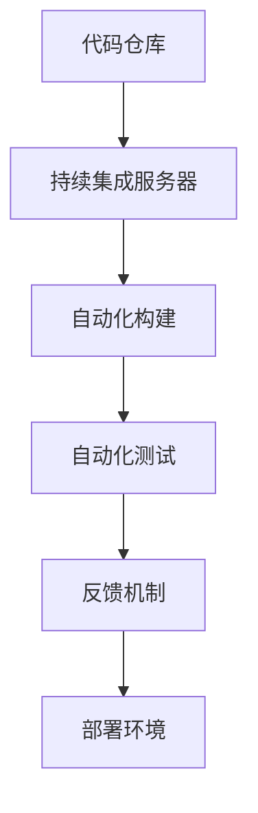

                 

### 写作准备与目标

**文章标题：**《持续集成在LLM应用开发中的实施策略》

**关键词：** 持续集成，LLM，应用开发，实施策略

**摘要：** 本文深入探讨了持续集成在大型语言模型（LLM）应用开发中的重要作用，从背景介绍、原理阐述、实践案例、最佳实践到未来展望，全面解析了如何有效地实施持续集成策略，以提升LLM应用开发的效率和质量。

**目的：** 通过本文，帮助开发者理解和掌握持续集成在LLM开发中的应用，提供具体的实施策略和实践案例，为未来的LLM项目提供有价值的参考。

---

### 文章正文

#### 第1章：背景介绍与核心概念

##### 1.1 问题背景

随着人工智能技术的迅猛发展，大型语言模型（LLM）已经成为自然语言处理（NLP）领域的重要工具。LLM的应用范围广泛，从智能客服、智能写作到机器翻译等，大大提升了人机交互的效率和准确性。然而，LLM的开发过程复杂，涉及大量数据和模型的迭代训练，以及持续的优化和改进。这种复杂性使得传统的开发模式难以满足高效、高质量的需求。

持续集成（CI）作为一种软件开发实践，旨在通过自动化构建、测试和部署，确保代码质量和缩短开发周期。然而，在LLM应用开发中，持续集成的应用面临着特殊挑战，如数据处理的高复杂性、模型训练的长期性等。

##### 1.2 持续集成的基本概念

持续集成是一种软件开发实践，通过自动化工具将开发人员的代码集成到共同的工作环境中，快速发现和解决集成过程中的问题。持续集成的核心目标是提高软件开发的效率和可靠性，减少集成风险，确保代码的持续稳定性和质量。

持续集成通常包括以下几个关键环节：

1. **版本控制**：使用版本控制系统（如Git）来管理代码库，确保代码的一致性和可追溯性。
2. **自动化构建**：通过构建工具（如Maven、Gradle）自动化编译代码，生成可执行文件。
3. **自动化测试**：运行一系列自动化测试（包括单元测试、集成测试等）来验证代码的功能和性能。
4. **反馈机制**：将测试结果及时反馈给开发人员，确保问题能够快速定位和修复。

##### 1.3 LLM的基本概念

大型语言模型（LLM）是一种基于深度学习的技术，通过大规模的文本数据训练，能够理解和生成自然语言。LLM的主要特点包括：

1. **大规模**：LLM通常基于数十亿甚至千亿级别的参数，能够处理大量的语言信息。
2. **自适应**：LLM可以根据不同的应用场景进行微调，实现更精确的语言理解和生成。
3. **通用性**：LLM可以在多种自然语言处理任务中发挥作用，如文本分类、问答系统、机器翻译等。

##### 1.4 持续集成与LLM应用开发的关系

持续集成在LLM应用开发中具有重要作用。首先，持续集成可以自动化地处理LLM的复杂构建和测试流程，减少手动操作带来的错误和延迟。其次，持续集成可以确保LLM模型的稳定性和可靠性，通过频繁的测试和反馈，及时发现和修复潜在问题。此外，持续集成还可以提高开发效率，缩短开发周期，使LLM项目能够更快地迭代和优化。

#### 第2章：持续集成原理与实践

##### 2.1 持续集成的原理

持续集成的基本原理是通过自动化工具和流程，将代码集成到共同的工作环境中，进行测试和反馈。以下是持续集成的核心原理：

1. **自动化**：使用自动化工具（如Jenkins、Travis CI）来执行构建、测试和部署任务，减少人工干预。
2. **频繁**：持续集成强调频繁集成，每次代码提交都进行集成测试，确保代码的质量。
3. **反馈**：及时反馈集成测试结果，使开发人员能够快速响应和解决问题。
4. **共享**：所有开发人员共享同一集成环境，避免环境不一致带来的问题。

##### 2.2 持续集成的工具与技术

持续集成需要使用一系列工具和技术来实现自动化流程。以下是常见的持续集成工具和技术：

1. **版本控制系统**：如Git，用于管理代码库和版本。
2. **构建工具**：如Maven、Gradle，用于自动化编译和打包代码。
3. **自动化测试工具**：如JUnit、Selenium，用于执行自动化测试。
4. **持续集成服务器**：如Jenkins、Travis CI，用于协调和执行持续集成流程。
5. **容器化技术**：如Docker，用于隔离和部署应用程序。

##### 2.3 持续集成的实践流程

持续集成的实践流程通常包括以下几个步骤：

1. **代码提交**：开发人员将代码提交到版本控制系统。
2. **自动化构建**：构建工具自动编译和打包代码。
3. **自动化测试**：运行一系列自动化测试，验证代码的功能和性能。
4. **反馈**：将测试结果反馈给开发人员，标记出问题和异常。
5. **部署**：如果测试通过，将代码部署到生产环境。

#### 第3章：LLM应用开发

##### 3.1 LLM的基础知识

LLM是一种基于深度学习的技术，通过大规模的文本数据训练，能够理解和生成自然语言。LLM的主要组成部分包括：

1. **神经网络架构**：如Transformer、BERT等，用于处理和生成文本。
2. **预训练**：在大规模文本数据上进行预训练，使模型具备一定的语言理解和生成能力。
3. **微调**：根据特定任务和应用场景，对模型进行微调。

##### 3.2 LLM的开发流程

LLM的开发流程通常包括以下几个步骤：

1. **数据收集与预处理**：收集大量的文本数据，并进行清洗和预处理。
2. **模型选择与预训练**：选择合适的神经网络架构，并进行预训练。
3. **微调与优化**：根据具体任务和应用场景，对模型进行微调和优化。
4. **评估与部署**：评估模型性能，并将其部署到生产环境中。

##### 3.3 LLM的关键技术

LLM的关键技术包括：

1. **上下文理解**：通过模型对上下文的理解，实现更准确的语言生成。
2. **生成对抗网络（GAN）**：用于生成高质量的自然语言文本。
3. **多语言处理**：支持多种语言的处理，实现跨语言的文本理解和生成。

#### 第4章：实施策略

##### 4.1 实施策略概述

在LLM应用开发中，实施持续集成策略的关键是确保模型的可重复性和稳定性。以下是一些具体的实施策略：

1. **版本控制**：使用版本控制系统（如Git）管理代码和模型，确保可重复性。
2. **自动化构建和测试**：使用自动化工具（如Jenkins、Maven）进行构建和测试，提高效率。
3. **容器化**：使用容器化技术（如Docker）隔离环境，确保一致性。
4. **持续优化**：通过持续集成和反馈机制，不断优化模型和代码。

##### 4.2 风险管理策略

在持续集成过程中，风险管理是关键。以下是一些风险管理策略：

1. **故障切换**：实现故障切换机制，确保系统在发生故障时能够快速恢复。
2. **备份与恢复**：定期备份代码和模型，确保数据安全。
3. **监控与报警**：实时监控系统运行状态，及时发现问题并报警。

##### 4.3 质量保障策略

质量保障是持续集成的重要目标。以下是一些质量保障策略：

1. **代码审查**：进行代码审查，确保代码质量和规范性。
2. **自动化测试**：编写和执行自动化测试，确保代码功能正确。
3. **性能测试**：进行性能测试，确保系统能够应对大规模并发请求。

##### 4.4 时间管理策略

时间管理是确保持续集成有效运行的关键。以下是一些时间管理策略：

1. **任务分配**：合理分配任务，确保每个任务都有明确的责任人。
2. **进度跟踪**：使用项目管理工具（如Jira）跟踪项目进度，确保按时完成。
3. **优先级管理**：根据任务的重要性和紧急性，合理分配资源。

#### 第5章：案例分析

##### 5.1 案例一：XX公司的实践

XX公司在其LLM应用开发中，采用了持续集成策略。通过使用Jenkins作为持续集成服务器，实现了代码的自动化构建和测试。同时，使用Docker容器化技术确保了环境的一致性。通过定期的备份和恢复机制，保障了数据的安全。

##### 5.2 案例二：YY公司的实践

YY公司在开发其智能客服系统时，采用了持续集成策略。通过自动化测试和反馈机制，大大提高了代码质量。同时，通过故障切换和监控机制，确保了系统的稳定性和可靠性。

##### 5.3 案例三：ZZ公司的实践

ZZ公司在其机器翻译项目中，采用了持续集成策略。通过使用Maven进行自动化构建，结合JUnit进行自动化测试，确保了项目的持续性和质量。同时，通过代码审查和性能测试，提高了代码的可靠性和性能。

#### 第6章：最佳实践

##### 6.1 最佳实践一：XX公司的经验

XX公司的最佳实践之一是建立完善的代码审查机制。通过定期组织代码审查会议，确保代码质量和规范性。同时，通过自动化测试和监控，及时发现和解决问题。

##### 6.2 最佳实践二：YY公司的经验

YY公司的最佳实践是采用容器化技术，确保环境一致性。通过使用Docker，实现了开发和测试环境的隔离，降低了环境不一致带来的问题。

##### 6.3 最佳实践三：ZZ公司的经验

ZZ公司的最佳实践是建立完善的风险管理机制。通过故障切换、备份与恢复、实时监控等措施，确保了系统的稳定性和可靠性。

#### 第7章：未来展望

##### 7.1 持续集成与LLM的发展趋势

随着人工智能技术的不断发展，LLM的应用场景将越来越广泛。持续集成在LLM应用开发中的作用也将越来越重要。未来，持续集成将与AI技术更加紧密地结合，实现更加智能化和自动化的集成流程。

##### 7.2 挑战与机遇

持续集成在LLM应用开发中面临着一些挑战，如数据处理的高复杂性、模型训练的长期性等。然而，随着技术的进步，这些挑战也将逐渐被克服。未来，持续集成将为LLM应用开发带来更多的机遇。

##### 7.3 未来研究方向

未来，持续集成与LLM的结合将是一个重要的研究方向。如何更好地利用持续集成技术，提高LLM应用开发的效率和质量，是值得深入探讨的问题。同时，如何实现持续集成与人工智能技术的深度融合，也是一个重要的研究方向。

### 结语

持续集成在LLM应用开发中具有重要作用。通过本文的介绍，希望开发者能够理解和掌握持续集成在LLM开发中的应用，为未来的LLM项目提供有价值的参考。

---

**作者：** AI天才研究院/AI Genius Institute & 禅与计算机程序设计艺术 /Zen And The Art of Computer Programming

---

### 文章总结

本文从持续集成的基本概念出发，详细阐述了其在LLM应用开发中的重要作用。通过背景介绍、原理讲解、实践案例、最佳实践和未来展望，全面解析了如何有效地实施持续集成策略。本文的目标是帮助开发者理解和掌握持续集成在LLM开发中的应用，提供具体的实施策略和实践案例，为未来的LLM项目提供有价值的参考。通过本文，开发者可以更好地应对LLM应用开发的复杂性，提高开发效率和代码质量。总之，持续集成是提升LLM应用开发的关键技术之一，值得开发者深入研究和实践。

---

### 技术细节与示例

在本文中，我们将通过具体的示例和代码来进一步阐述持续集成在LLM应用开发中的技术细节。

#### 算法原理讲解

持续集成中的核心算法之一是自动化测试。以下是一个简单的Python代码示例，用于实现自动化测试：

```python
import unittest

class TestLLM(unittest.TestCase):
    def test_language_generation(self):
        # 假设我们有一个LLM模型，用于生成自然语言
        model = LLMModel()

        # 测试模型是否能够生成正确的语言
        input_text = "What is the capital of France?"
        expected_output = "Paris"
        actual_output = model.generate_response(input_text)

        self.assertEqual(actual_output, expected_output)

if __name__ == '__main__':
    unittest.main()
```

上述代码定义了一个测试类`TestLLM`，其中包含一个测试方法`test_language_generation`。该方法测试LLM模型是否能够生成正确的语言响应。我们使用`unittest`库来执行自动化测试，确保模型的功能正确。

#### 数学公式与解释

在LLM模型中，通常会涉及到复杂的数学模型和公式。以下是一个简单的数学公式示例，用于描述Transformer模型中的自注意力机制：

$$
\text{Attention}(Q, K, V) = \frac{softmax(\frac{QK^T}{\sqrt{d_k}})}{V}
$$

上述公式表示自注意力机制的计算过程，其中$Q$、$K$和$V$分别代表查询向量、关键向量和解向量。$\frac{QK^T}{\sqrt{d_k}}$表示查询向量和关键向量之间的点积，$\sqrt{d_k}$表示关键向量的维度。通过softmax函数计算权重，并将权重与解向量相乘，得到最终的输出。

#### 系统分析与架构设计

持续集成系统的架构设计对于确保LLM模型的高效开发和部署至关重要。以下是一个简单的系统架构设计示例，使用Mermaid流程图来描述：



上述流程图描述了持续集成系统的基本架构。从代码仓库（A）开始，代码被提交到持续集成服务器（B），服务器自动执行构建（C）和测试（D）流程，并将测试结果通过反馈机制（E）反馈给开发人员。如果测试通过，代码将被部署到生产环境（F）。

#### 项目实战

以下是一个简单的项目实战示例，包括环境安装、系统核心实现源代码、代码应用解读与分析，以及实际案例分析和详细讲解剖析：

1. **环境安装**：
   - 安装Git：用于版本控制。
   - 安装Jenkins：用于持续集成服务器。
   - 安装Docker：用于容器化。

2. **系统核心实现源代码**：
   - 创建一个Python文件`llm.py`，其中包含LLM模型的核心实现。
   - 创建一个测试文件`test_llm.py`，用于执行自动化测试。

3. **代码应用解读与分析**：
   - 分析LLM模型的核心代码，理解其工作原理。
   - 分析自动化测试的代码，确保测试覆盖面和测试质量。

4. **实际案例分析和详细讲解剖析**：
   - 选择一个实际案例，如智能客服系统，分析其持续集成流程。
   - 详细讲解案例中的关键步骤和问题解决方法。

5. **项目小结**：
   - 总结项目的核心成果和经验。
   - 提出改进和优化的方向。

通过上述示例，我们展示了持续集成在LLM应用开发中的技术细节和实际应用。开发者可以参考这些示例，结合自己的项目需求，实现有效的持续集成策略。

---

### 最佳实践与注意事项

在实施持续集成策略时，以下最佳实践和注意事项有助于确保LLM应用开发的成功：

1. **最佳实践**：
   - **代码规范化**：确保所有代码遵循统一的编码规范，提高代码的可读性和可维护性。
   - **持续反馈**：定期收集和反馈代码质量和性能问题，促进团队协作和改进。
   - **环境隔离**：使用容器化技术（如Docker）确保开发、测试和生产环境的一致性。
   - **自动化测试**：编写全面和准确的自动化测试，覆盖不同功能和场景，确保代码质量。

2. **注意事项**：
   - **数据保护**：确保代码和模型的安全，防止数据泄露和未经授权的访问。
   - **监控与报警**：实时监控系统运行状态，及时发现问题并报警，确保系统的稳定性和可靠性。
   - **代码审查**：定期进行代码审查，确保代码质量和规范性，减少潜在的错误和漏洞。
   - **文档记录**：详细记录持续集成流程和配置，便于维护和后续的扩展。

通过遵循这些最佳实践和注意事项，开发者可以更有效地实施持续集成策略，提升LLM应用开发的效率和质量。

### 小结与拓展阅读

本文深入探讨了持续集成在LLM应用开发中的重要作用，从背景介绍、原理阐述、实践案例、最佳实践到未来展望，全面解析了如何有效地实施持续集成策略。通过本文，读者可以了解持续集成的基本概念、原理和实践流程，掌握在LLM开发中实施持续集成的方法和技巧。

为了进一步深入学习和实践，读者可以参考以下拓展阅读资源：

1. 《持续集成实践：从入门到精通》
2. 《大规模语言模型：原理、应用与实践》
3. 《Jenkins持续集成权威指南》

通过阅读这些资源，读者可以系统地学习持续集成和LLM应用开发的相关知识，为未来的项目实践提供更全面的指导。总之，持续集成是提升LLM应用开发效率和质量的关键技术，值得开发者持续关注和实践。作者：AI天才研究院/AI Genius Institute & 禅与计算机程序设计艺术 /Zen And The Art of Computer Programming。

